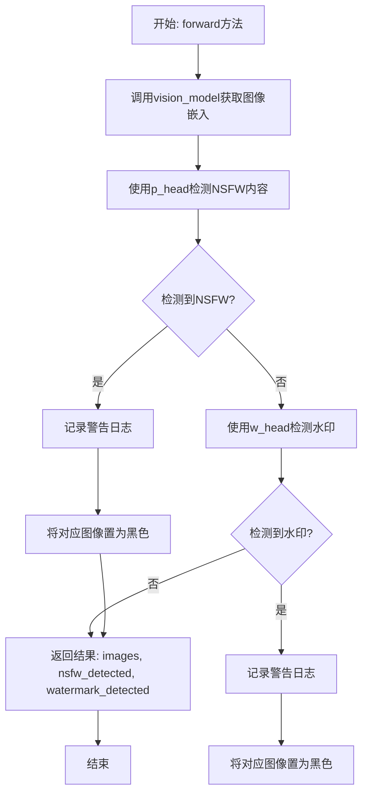
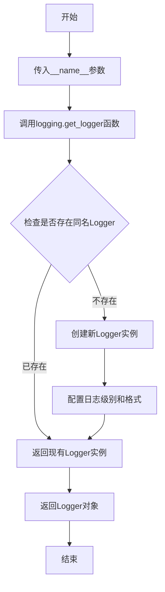

# `diffusers\src\diffusers\pipelines\deepfloyd_if\safety_checker.py` 详细设计文档

IFSafetyChecker是一个图像安全检查器，基于CLIP模型实现NSFW内容和水印检测功能。它通过视觉模型提取图像嵌入，使用两个独立的线性层分别判断图像是否包含不适当内容或数字水印，并在检测到问题时将图像替换为黑色图像。

## 整体流程



## 类结构

```
PreTrainedModel (Hugging Face基类)
└── IFSafetyChecker (图像安全检查器)
```

## 全局变量及字段


### `logger`
    
模块级别的日志记录器，用于输出安全检查器的警告信息

类型：`logging.Logger`
    


### `IFSafetyChecker.vision_model`
    
视觉模型，用于提取图像特征嵌入

类型：`CLIPVisionModelWithProjection`
    


### `IFSafetyChecker.p_head`
    
NSFW检测头，将图像嵌入映射到二分类概率

类型：`nn.Linear`
    


### `IFSafetyChecker.w_head`
    
水印检测头，将图像嵌入映射到二分类概率

类型：`nn.Linear`
    
    

## 全局函数及方法


### `logging.get_logger(__name__)`

获取当前模块的日志记录器实例，用于在该模块中记录日志信息。这是 Hugging Face Transformers 库中的标准日志配置方式，通过传入 `__name__` 来自动识别日志来源模块。

参数：

- `__name__`：`str`，Python 内置变量，代表当前模块的完全限定名称（如 `src.models.safety_checker`），用于标识日志来源。

返回值：`logging.Logger`，返回一个日志记录器对象，用于在该模块中记录不同级别的日志信息（如 debug、info、warning、error 等）。

#### 流程图



#### 带注释源码

```python
# 导入日志工具模块
from ...utils import logging

# 获取当前模块的日志记录器
# __name__ 是 Python 内置变量，自动获取当前模块的完全限定名称
# 例如：如果此文件在 src/utils/safety_checker.py，则 __name__ 为 "src.utils.safety_checker"
# 返回一个 Logger 实例，用于记录日志
logger = logging.get_logger(__name__)
```

#### 使用示例

```python
# 在类的方法中使用 logger 记录日志
class IFSafetyChecker(PreTrainedModel):
    def __init__(self, config: CLIPConfig):
        # ... 初始化代码
        pass

    @torch.no_grad()
    def forward(self, clip_input, images, p_threshold=0.5, w_threshold=0.5):
        # 检测到 NSFW 内容时记录警告日志
        if any(nsfw_detected):
            logger.warning(
                "Potential NSFW content was detected in one or more images. A black image will be returned instead."
                " Try again with a different prompt and/or seed."
            )
```


### IFSafetyChecker.__init__

初始化 IFSafetyChecker 安全检查器类，创建视觉模型和两个检测头（NSFW 检测和水印检测），完成模型的初始化配置。

参数：

- `self`：`IFSafetyChecker`，IFSafetyChecker 类实例本身
- `config`：`CLIPConfig`，CLIP 配置对象，包含视觉模型配置和投影维度等信息

返回值：`None`，无返回值（构造函数）

#### 流程图

```mermaid
flowchart TD
    A[__init__ 开始] --> B[调用 super().__init__config 初始化基类]
    B --> C[创建视觉模型 CLIPVisionModelWithProjection]
    C --> D[创建 p_head 线性层: projection_dim -> 1]
    D --> E[创建 w_head 线性层: projection_dim -> 1]
    E --> F[__init__ 结束]
```

#### 带注释源码

```python
def __init__(self, config: CLIPConfig):
    """
    初始化安全检查器
    
    参数:
        config: CLIPConfig - 包含视觉配置和投影维度的配置对象
    """
    # 调用父类 PreTrainedModel 的初始化方法，注册配置
    super().__init__(config)
    
    # 创建 CLIP 视觉模型，带有投影输出
    # 该模型用于提取图像特征嵌入
    self.vision_model = CLIPVisionModelWithProjection(config.vision_config)
    
    # 创建 NSFW 检测头 (p_head)
    # 将视觉特征投影维度映射到 1 维，输出 NSFW 置信度分数
    self.p_head = nn.Linear(config.vision_config.projection_dim, 1)
    
    # 创建水印检测头 (w_head)
    # 将视觉特征投影维度映射到 1 维，输出水印置信度分数
    self.w_head = nn.Linear(config.vision_config.projection_dim, 1)
```


### `IFSafetyChecker.forward`

该方法执行前向传播以检测图像中的NSFW（不适宜工作场所）内容和水印，通过CLIP视觉模型提取图像嵌入，使用两个独立的线性分类头分别进行NSFW和水印检测，将超过阈值的图像替换为黑色图像，并返回处理后的图像及检测结果。

参数：

- `self`：`IFSafetyChecker`，类方法隐含的实例引用
- `clip_input`：`torch.Tensor`，CLIP模型的输入张量，通常为预处理后的图像数据
- `images`：`numpy.ndarray` 或 `List[numpy.ndarray]`，待检测的原始图像数组或列表
- `p_threshold`：`float`，NSFW检测的概率阈值，默认为0.5，用于判断图像是否包含不适宜内容
- `w_threshold`：`float`，水印检测的概率阈值，默认为0.5，用于判断图像是否包含水印

返回值：`Tuple[List[numpy.ndarray], List[bool], List[bool]]`，返回一个三元组，包含处理后的图像列表（检测到NSFW或水印的图像已被替换为黑色）、NSFW检测结果布尔列表、水印检测结果布尔列表

#### 流程图

```mermaid
flowchart TD
    A[开始 forward 方法] --> B[提取图像嵌入: vision_model(clip_input)]
    B --> C[NSFW检测: p_head(image_embeds)]
    C --> D[展平并与阈值比较: nsfw_detected > p_threshold]
    D --> E{any nsfw_detected?}
    E -->|是| F[记录NSFW警告日志]
    E -->|否| G[跳过日志记录]
    F --> H[遍历nsfw_detected]
    G --> H
    H --> I{nsfw_detected_[idx] == True?}
    I -->|是| J[将images[idx]替换为黑色图像]
    I -->|否| K[保留原图像]
    J --> L[水印检测: w_head(image_embeds)]
    K --> L
    L --> M[展平并与阈值比较: watermark_detected > w_threshold]
    M --> N{any watermark_detected?}
    N -->|是| O[记录水印警告日志]
    N -->|否| P[跳过日志记录]
    O --> Q[遍历watermark_detected]
    P --> Q
    Q --> R{watermark_detected_[idx] == True?}
    R -->|是| S[将images[idx]替换为黑色图像]
    R -->|否| T[保留原图像]
    S --> U[返回 images, nsfw_detected, watermark_detected]
    T --> U
```

#### 带注释源码

```python
@torch.no_grad()  # 禁用梯度计算，提高推理效率并减少内存消耗
def forward(self, clip_input, images, p_threshold=0.5, w_threshold=0.5):
    """
    前向传播方法，检测输入图像中的NSFW内容和水印
    
    参数:
        clip_input: CLIP模型输入张量
        images: 待检测的图像数组
        p_threshold: NSFW检测阈值，默认0.5
        w_threshold: 水印检测阈值，默认0.5
    
    返回:
        处理后的图像、NSFW检测结果、水印检测结果
    """
    
    # Step 1: 使用CLIP视觉模型提取图像嵌入向量
    # self.vision_model 返回元组，取第一个元素 [0] 获取嵌入
    image_embeds = self.vision_model(clip_input)[0]

    # Step 2: NSFW内容检测
    # 使用p_head（概率头）计算每个图像的NSFW分数
    nsfw_detected = self.p_head(image_embeds)
    # 展平为一维向量，便于后续处理
    nsfw_detected = nsfw_detected.flatten()
    # 与阈值比较，返回布尔值
    nsfw_detected = nsfw_detected > p_threshold
    # 转换为Python列表
    nsfw_detected = nsfw_detected.tolist()

    # 如果检测到任何NSFW内容，记录警告日志
    if any(nsfw_detected):
        logger.warning(
            "Potential NSFW content was detected in one or more images. A black image will be returned instead."
            " Try again with a different prompt and/or seed."
        )

    # 遍历检测结果，将检测到NSFW的图像替换为黑色图像
    for idx, nsfw_detected_ in enumerate(nsfw_detected):
        if nsfw_detected_:
            # 使用numpy创建与原图像形状相同的黑色图像
            images[idx] = np.zeros(images[idx].shape)

    # Step 3: 水印检测
    # 使用w_head（水印头）计算每个图像的水印分数
    watermark_detected = self.w_head(image_embeds)
    # 展平为一维向量
    watermark_detected = watermark_detected.flatten()
    # 与阈值比较
    watermark_detected = watermark_detected > w_threshold
    # 转换为Python列表
    watermark_detected = watermark_detected.tolist()

    # 如果检测到任何水印内容，记录警告日志
    if any(watermark_detected):
        logger.warning(
            "Potential watermarked content was detected in one or more images. A black image will be returned instead."
            " Try again with a different prompt and/or seed."
        )

    # 遍历检测结果，将检测到水印的图像替换为黑色图像
    for idx, watermark_detected_ in enumerate(watermark_detected):
        if watermark_detected_:
            # 使用numpy创建与原图像形状相同的黑色图像
            images[idx] = np.zeros(images[idx].shape)

    # Step 4: 返回处理后的图像和检测结果
    return images, nsfw_detected, watermark_detected
```

## 关键组件


### IFSafetyChecker 类

IFSafetyChecker 是核心安全检查类，继承自 PreTrainedModel，用于检测图像中的 NSFW 内容和数字水印，通过 CLIP 视觉模型提取图像特征并使用两个线性头进行二分类判断。

### vision_model (CLIPVisionModelWithProjection)

CLIP 视觉模型组件，用于将输入图像转换为图像嵌入向量，是整个安全检查的特征提取核心。

### p_head (nn.Linear)

NSFW 检测头，负责将图像嵌入投影到一维概率值，用于判断图像是否包含不适宜内容。

### w_head (nn.Linear)

水印检测头，负责将图像嵌入投影到一维概率值，用于判断图像是否包含数字水印。

### forward 方法

主要推理方法，执行 NSFW 和水印检测流程，包括图像嵌入提取、阈值判断、结果记录和图像替换逻辑。

### 图像替换逻辑

当检测到 NSFW 或水印时，将对应索引的图像数据替换为全零数组（黑色图像），实现安全过滤。

### 阈值机制

通过 p_threshold 和 w_threshold 参数控制 NSFW 和水印检测的敏感度，默认值均为 0.5。

### 日志警告系统

检测到问题时输出警告信息，提示用户尝试不同的提示词或种子值。


## 问题及建议


### 已知问题

-   **直接修改输入参数**：代码在第39行和第53行直接修改传入的`images`列表（`images[idx] = np.zeros(images[idx].shape)`），违反了函数式编程原则，会产生副作用，可能导致调用者 Unexpected 的状态变更
-   **重复代码模式**：NSFW检测和水印检测的逻辑几乎完全相同（计算得分 → flatten → 比较阈值 → 记录日志 → 替换图像），存在明显的代码重复
-   **缺乏输入验证**：未检查`clip_input`与`images`长度是否匹配，也未验证参数类型合法性
-   **缺少文档字符串**：类和方法均无文档说明（docstring），影响代码可维护性和可读性
-   **类型提示不完整**：`forward`方法的参数缺少类型注解，`p_threshold`和`w_threshold`参数命名不一致（前者以下划线结尾，后者没有）
-   **日志级别选择**：对于"检测到NSFW/水印"使用`logger.warning`可能过于严重，使用`logger.info`或`logger.debug`更合适
-   **硬编码的零图像替换**：直接替换为`np.zeros`，未考虑原始图像的数据类型和通道数，可能导致类型不匹配
-   **缺乏异常处理**：未对模型推理过程可能出现的异常进行捕获和处理
-   **配置验证缺失**：构造函数中未对`config`参数进行有效性验证

### 优化建议

-   **避免副作用**：返回新的图像列表而非修改原列表，或使用`copy.deepcopy`创建副本后再修改
-   **提取公共逻辑**：将检测逻辑封装为私有方法（如`_detect_and_replace`），接收检测头、阈值和警告信息作为参数
-   **添加输入验证**：检查`clip_input`和`images`的长度一致性，验证阈值范围（应在0-1之间）
-   **完善类型提示**：为所有参数添加类型注解，统一阈值参数命名风格
-   **添加文档字符串**：为类和关键方法添加详细的文档说明，包括参数、返回值和使用示例
-   **优化日志级别**：根据实际场景选择合适的日志级别，或将其设计为可配置参数
-   **安全替换图像**：使用`np.zeros_like(images[idx])`确保类型和形状一致
-   **添加异常处理**：使用try-except包装模型推理逻辑，捕获可能的运行时错误
-   **添加配置验证**：在`__init__`中验证必要配置字段的存在性和合理性

## 其它


### 设计目标与约束

本模块的设计目标是实现一个轻量级的图像内容安全检查器，用于在推理阶段实时检测用户生成的图像中是否包含NSFW（不适合工作场所）内容或水印，并提供安全的降级处理（返回黑色图像）。主要约束包括：1）必须保持低延迟以满足实时推理需求；2）模型权重来源于预训练的CLIP模型；3）检测阈值为可配置参数，默认值为0.5。

### 错误处理与异常设计

代码采用了防御性编程策略，主要通过以下方式处理异常情况：1）阈值参数校验（p_threshold和w_threshold）由调用方负责确保在合理范围内[0,1]；2）当检测到NSFW或水印内容时，记录warning级别日志而非抛出异常，保证流程继续执行；3）输入图像的shape验证由上游调用方负责，本模块假设输入格式正确；4）对于空输入或特殊图像格式，CLIPVisionModelWithProjection会返回相应的embeddings，但可能影响检测准确性。

### 数据流与状态机

数据流如下：1）输入阶段：接收clip_input（CLIP预处理后的图像tensor）和images（原始图像numpy数组）；2）特征提取阶段：调用self.vision_model提取图像embedding；3）检测阶段：分别通过p_head和w_head两个线性层计算NSFW和水印的检测分数；4）判断阶段：将分数与阈值比较，生成布尔列表；5）处理阶段：遍历检测结果，将问题图像替换为黑色图像；6）输出阶段：返回处理后的图像列表、NSFW检测结果列表和水印检测结果列表。整个过程无状态机设计，为纯函数式处理流程。

### 外部依赖与接口契约

主要依赖包括：1）torch和torch.nn用于模型定义和计算；2）numpy用于图像数组操作；3）transformers库提供CLIPConfig、CLIPVisionModelWithProjection和PreTrainedModel；4）项目内部依赖...utils.logging用于日志记录。接口契约方面：clip_input应为torch.Tensor类型，形状为(batch_size, 3, 224, 224)的CLIP预处理图像；images应为numpy.ndarray类型，形状为(batch_size, H, W, C)；返回值images为修改后的numpy.ndarray，nsfw_detected和watermark_detected均为Python列表。

### 性能考虑与优化建议

当前实现的主要性能瓶颈：1）循环遍历检测结果进行图像替换，可以向量化优化；2）每次调用都执行CLIP模型前向传播，可考虑批处理优化；3）重复创建零数组np.zeros(images[idx].shape)，可预分配黑色图像模板。优化方向：1）使用numpy布尔索引进行批量图像替换；2）将阈值判断与图像替换合并，减少迭代次数；3）考虑使用torch.where实现GPU加速的图像替换。

### 安全性考虑

本模块涉及图像内容审查，需注意：1）检测结果仅为概率性判断，存在假阳性和假阴性可能，应在用户协议中明确说明；2）处理后的黑色图像返回上游，但原始问题图像仍存在于内存中，需注意敏感数据的生命周期管理；3）日志输出可能泄露图像内容信息，生产环境需控制日志级别；4）模型本身可能存在对抗性样本风险，需定期更新模型权重。

### 配置管理与版本兼容性

CLIPConfig配置通过构造函数注入，支持不同的CLIP变体（如ViT-L/14、ViT-B/32等）。projection_dim、hidden_size等关键维度由配置对象决定，确保与CLIP模型版本匹配。建议在生产环境中锁定transformers版本，避免因库更新导致模型加载行为变化。

### 测试策略建议

建议补充的测试用例：1）空输入边界条件测试；2）单图像和多图像批量处理测试；3）NSFW检测阳性/阴性场景测试；4）水印检测阳性/阴性场景测试；5）阈值边界值（0、1、0.5）测试；6）不同图像尺寸输入测试；7）内存泄漏检测（多次调用后）。由于模块依赖预训练模型，测试可使用mock或小型配置进行。

    