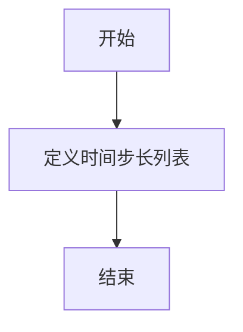

# `diffusers\src\diffusers\pipelines\deepfloyd_if\timesteps.py` 详细设计文档

定义了多个时间步长衰减计划列表，用于机器学习模型（如强化学习）的探索率或学习率调度，每个列表从999开始到0结束，包含不同密度和策略的检查点，以适应不同模型（如fast、smart、super）和规模（如27、50、100、185步）的训练需求。

## 整体流程



## 类结构

```

```

## 全局变量及字段


### `fast27_timesteps`
    
快速模式27级的时间步配置数组，包含从999递减到0的27个检查点数值

类型：`list[int]`
    


### `smart27_timesteps`
    
智能模式27级的时间步配置数组，包含从999递减到0的27个检查点数值

类型：`list[int]`
    


### `smart50_timesteps`
    
智能模式50级的时间步配置数组，包含从999递减到0的50个检查点数值

类型：`list[int]`
    


### `smart100_timesteps`
    
智能模式100级的时间步配置数组，包含从999递减到0的100个检查点数值

类型：`list[int]`
    


### `smart185_timesteps`
    
智能模式185级的时间步配置数组，包含从999递减到0的185个检查点数值

类型：`list[int]`
    


### `super27_timesteps`
    
超级模式27级的时间步配置数组，包含从999递减到0的27个检查点数值

类型：`list[int]`
    


### `super40_timesteps`
    
超级模式40级的时间步配置数组，包含从999递减到0的40个检查点数值

类型：`list[int]`
    


### `super100_timesteps`
    
超级模式100级的时间步配置数组，包含从999递减到0的100个检查点数值

类型：`list[int]`
    


    

## 全局函数及方法


## 关键组件


### 时间步长数组定义

用于定义视频帧采样的时间索引数组，包含多种采样策略（fast、smart、super）和不同密度的采样点。

### fast27_timesteps

快速采样策略，27个时间步，用于低计算成本场景，采用非均匀间隔递减采样。

### smart27_timesteps

智能采样策略，27个时间步，在关键帧区域（如850-860附近）提供更密集的采样。

### smart50_timesteps

智能采样策略，50个时间步，中等密度采样，在特定帧区域（如899、799、699等）有连续采样点。

### smart100_timesteps

智能采样策略，100个时间步，高密度采样，提供更细粒度的时间覆盖。

### smart185_timesteps

智能采样策略，185个时间步，最高密度的smart系列采样，覆盖更多细节时间点。

### super27_timesteps

超级采样策略，27个时间步，在关键转折点（如899、799、700等）有连续双帧采样。

### super40_timesteps

超级采样策略，40个时间步，结合非均匀间隔和连续双帧特性。

### super100_timesteps

超级采样策略，100个时间步，最高密度的采样策略，提供最精细的时间分辨率。

### 采样策略模式

代码中存在三种主要采样模式：fast（快速稀疏）、smart（智能非均匀）、super（超级密集含双帧）。

## 问题及建议


### 已知问题

-   **硬编码数据无文档说明**：所有时间步长数值均为硬编码，缺乏注释解释数值来源、含义及用途
-   **Magic Numbers 缺乏解释**：数值如999、0及各种间隔值没有任何说明，其他开发者难以理解
-   **数据类型不明确**：未使用类型注解（如List[int]），且未明确数据来源（配置文件/数据库/算法生成）
-   **缺乏数据校验**：数组未进行有效性校验（如是否有序、是否包含负数、是否包含重复值等）
-   **数据冗余与模式重复**：多个数组都以999开头、0结尾，遵循相似模式但未提取公共逻辑
-   **命名与结构松散**：使用全局变量列表而非结构化配置（如字典、枚举或配置文件）
-   **扩展性差**：新增时间步长配置需要修改源代码，无法通过外部配置管理
-   **缺乏版本控制**：无法追踪时间步长配置的修改历史和变更原因
-   **数值精确度问题**：部分数值间隔不规则（如smart27中858→857→810），可能存在数据录入错误

### 优化建议

-   **添加类型注解**：为所有列表添加类型声明 `List[int]`
-   **提取为配置结构**：使用字典或 dataclass 封装，按难度等级组织（如 `DIFFICULTY_CONFIGS = {"fast27": [...], "smart27": [...]}`）
-   **添加数据校验函数**：创建验证函数检查数组有效性（单调递减、包含0和999、无重复等）
-   **添加文档注释**：说明每个数组的用途、生成规则和应用场景
-   **外部化配置**：将数据移至JSON/YAML配置文件，支持运行时调整
-   **提取常量定义**：将999（最大时间）和0（结束时间）提取为具名常量
-   **考虑算法生成**：如果时间步长由特定算法生成，应实现为函数而非静态数据
-   **添加单元测试**：验证数据完整性和一致性
-   **建立配置版本管理**：记录配置变更历史和变更原因


## 其它


### 设计目标与约束

**设计目标：**
本代码定义了一系列游戏时间步配置数组，用于控制游戏内不同难度模式和速度级别的时间推进逻辑。这些时间步数组决定了游戏在各个阶段的时间节点，支撑游戏玩法的时间节奏设计。

**约束条件：**
- 所有时间步数组必须以999开始，以0结尾，形成完整的从游戏开始到结束的时间覆盖
- 时间步数值必须为非负整数，且呈递减趋势
- 不同模式的时间步数量和分布反映了该模式的难度和节奏特征

### 错误处理与异常设计

**数组数据验证：**
- 首元素必须为999（表示游戏总时长或初始时间点）
- 末元素必须为0（表示游戏结束时间点）
- 数组内元素必须严格递减，不允许出现相等或递增的情况（除少数由于游戏机制设计需要的重复值外）
- 数组不应包含负数或非数值类型

**异常处理策略：**
- 若检测到时间步数组不符合约束，应在游戏初始化阶段抛出配置错误异常
- 若时间步数组为空或长度不足，应使用默认的fallback数组

### 数据流与状态机

**数据流转过程：**
1. 游戏初始化时加载对应的timesteps数组（如fast27_timesteps、smart100_timesteps等）
2. 游戏循环中根据当前时间与timesteps数组进行比对
3. 当游戏时间到达某个timesteps节点时，触发该节点对应的游戏状态变更或事件
4. 游戏时间递减至0时，游戏结束

**状态机描述：**
- **状态：** 游戏进行中（包含多个子状态，每个timestep可能对应一个子状态）
- **事件：** 时间到达特定timestep节点
- **转换：** 当前状态 → 基于timestep的新状态

### 外部依赖与接口契约

**接口契约：**
- 提供方：配置模块/数据文件
- 消费方：游戏逻辑控制模块
- 接口形式：全局常量数组（List[int]或类似结构）

**外部依赖：**
- 游戏主循环模块：依赖timesteps数组进行时间节点判断
- UI/渲染模块：可能需要根据timesteps显示游戏进度
- 事件系统：timestep节点触发相应的事件回调

### 版本兼容性说明

**兼容性考虑：**
- timesteps数组定义应保持向后兼容，新增时间步应插入到合适位置保持递减顺序
- 如需修改现有数组结构，建议新增数组而非修改原数组，以避免影响依赖该数组的现有游戏模式

### 性能考量

**性能特点：**
- 数组为静态只读数据，加载时一次性读取，无运行时动态修改需求
- 查询操作通常为顺序遍历或二分查找，复杂度为O(n)或O(log n)
- 数组总长度从27到185不等，数据量较小，对内存和CPU影响可忽略

### 可维护性与扩展性

**扩展方向：**
- 可通过新增数组的方式轻松添加新的游戏模式（如未来的smart200_timesteps）
- 可通过修改数组内数值调整游戏节奏，无需改动游戏逻辑代码
- 建议使用配置文件或数据文件外部化这些数组，提高可维护性

### 测试要点

**测试用例设计：**
- 验证每个数组的首尾元素是否为999和0
- 验证数组元素的递减特性
- 验证各数组长度是否符合预期（如fast27应为27个元素）
- 验证空数组或异常数据输入的错误处理

### 命名规范与代码风格

**命名规范：**
- 数组命名格式：`{模式名}{数量}_timesteps`
- 模式名：fast（快速）、smart（智能）、super（超级）
- 数量：表示该模式下的时间步数量或难度级别

### 相关配置与常量定义

**关联配置：**
- 游戏总时长：1000单位时间（由首元素999 + 1得出）
- 时间单位：可能是毫秒、帧数或其他游戏时间单位，需根据实际游戏引擎确定

### 文档更新历史

（此处可记录代码变更历史，如：初始版本v1.0 - 定义基础时间步配置）


    