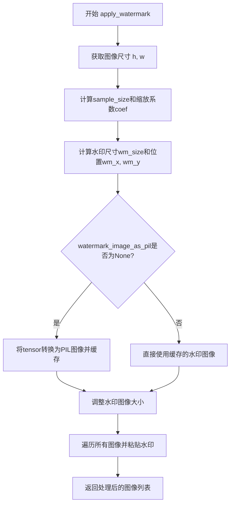

# `diffusers\src\diffusers\pipelines\deepfloyd_if\watermark.py` 详细设计文档

IFWatermarker是一个用于为PIL图像添加水印的工具类，通过计算图像尺寸比例并使用RGBA模式的62x62水印图像进行粘贴，实现对图像的不可见水印处理。

## 整体流程



## 类结构

```
IFWatermarker (水印处理类)
├── 继承自: ModelMixin, ConfigMixin
├── 字段:
│   ├── watermark_image (torch.Tensor)
│   └── watermark_image_as_pil (PIL.Image.Image | None)
└── 方法:
    ├── __init__ (初始化)
    └── apply_watermark (应用水印)
```

## 全局变量及字段


### `PIL_INTERPOLATION`
    
PIL图像插值方法字典，用于指定图像缩放时使用的插值算法（如bicubic、bilinear等）

类型：`dict`
    


### `PIL`
    
Python Imaging Library (Pillow) 图像处理库，提供图像创建、打开、转换等操作功能

类型：`module`
    


### `torch`
    
PyTorch深度学习库，提供张量计算、神经网络构建等核心功能

类型：`module`
    


### `IFWatermarker.watermark_image`
    
注册为buffer的水印图像张量，初始化为62x62x4的零张量

类型：`torch.Tensor`
    


### `IFWatermarker.watermark_image_as_pil`
    
缓存的水印PIL图像，用于避免重复转换

类型：`PIL.Image.Image | None`
    
    

## 全局函数及方法


### `IFWatermarker.__init__`

初始化水印器，创建空的水印图像buffer，用于后续水印的生成和应用。

参数：

-  `self`：`IFWatermarker` 实例，当前类的实例对象，无需显式传入

返回值：`None`，该方法不返回任何值，仅完成初始化操作

#### 流程图

```mermaid
flowchart TD
    A[开始 __init__] --> B[调用 super().__init__]
    B --> C[调用 ModelMixin.__init__ 和 ConfigMixin.__init__]
    C --> D[register_buffer watermark_image]
    D --> E[创建 torch.zeros 62x62x4 全零张量]
    E --> F[注册为持久化缓冲区 watermark_image]
    F --> G[初始化 watermark_image_as_pil = None]
    G --> H[结束 __init__]
```

#### 带注释源码

```
def __init__(self):
    # 调用父类 ModelMixin 和 ConfigMixin 的初始化方法
    # 确保模型混合类和配置混合类的初始化逻辑被正确执行
    super().__init__()

    # 注册一个名为 "watermark_image" 的缓冲区(buffer)
    # 使用 torch.zeros 创建一个形状为 (62, 62, 4) 的全零张量
    # 62x62 表示水印图像的尺寸，4 表示 RGBA 四个通道
    # register_buffer 会将此张量作为模型的持久化参数保存到 state_dict 中
    self.register_buffer("watermark_image", torch.zeros((62, 62, 4)))
    
    # 初始化 PIL 格式的水印图像缓存为 None
    # 延迟初始化：仅在实际需要应用水印时才会从 buffer 转换生成
    # 这样可以避免不必要的内存占用和计算开销
    self.watermark_image_as_pil = None
```


### IFWatermarker.apply_watermark

为输入的图像列表添加水印，通过计算图像尺寸与采样尺寸的比例来确定水印大小和水印位置，然后将水印图像粘贴到每张输入图像的右下角区域，最后返回处理后的图像列表。

参数：

- `images`：`list[PIL.Image.Image]`，需要添加水印的PIL图像列表
- `sample_size`：`int | None`，采样尺寸，用于计算水印大小比例，默认为图像高度

返回值：`list[PIL.Image.Image]`，添加水印后的图像列表

#### 流程图

```mermaid
flowchart TD
    A[开始 apply_watermark] --> B[获取第一张图像的高度h和宽度w]
    B --> C{sample_size是否为空?}
    C -->|是| D[sample_size = h]
    C -->|否| E[使用传入的sample_size]
    D --> F[计算系数 coef = min{h / sample_size, w / sample_size}]
    E --> F
    F --> G{系数 < 1?}
    G -->|是| H[img_h = int{h / coef}, img_w = int{w / coef}]
    G -->|否| I[img_h = h, img_w = w]
    H --> J
    I --> J
    J[计算 K = (img_w * img_h) ** 0.5 / 1024]
    J --> K[计算水印尺寸 wm_size = int{K * 62}]
    K --> L[计算水印位置 wm_x = img_w - int{14 * K}, wm_y = img_h - int{14 * K}]
    L --> M{watermark_image_as_pil是否为空缓存?]
    M -->|是| N[将 watermark_image 转换为 uint8 numpy 数组]
    N --> O[从 numpy 数组创建 PIL RGBA 图像]
    O --> P[缓存到 watermark_image_as_pil]
    M -->|否| Q
    P --> Q
    Q[将水印图像调整为 wm_size x wm_size] --> R[遍历 images 列表]
    R --> S[将水印粘贴到图像右下角]
    S --> T{还有更多图像?}
    T -->|是| R
    T -->|否| U[返回处理后的 images 列表]
```

#### 带注释源码

```python
def apply_watermark(self, images: list[PIL.Image.Image], sample_size=None):
    """
    为输入的图像列表添加水印
    
    参数:
        images: PIL图像列表
        sample_size: 采样尺寸，用于计算水印大小比例
    
    返回:
        添加水印后的图像列表
    """
    
    # 获取第一张图像的高度和宽度
    h = images[0].height
    w = images[0].width

    # 如果未指定采样尺寸，则使用图像高度作为默认值
    sample_size = sample_size or h

    # 计算缩放系数：取宽高比中较小的那个，确保水印适应较小边
    coef = min(h / sample_size, w / sample_size)
    
    # 根据系数计算实际图像尺寸
    # 如果系数小于1，则按比例缩小；否则保持原尺寸
    img_h, img_w = (int(h / coef), int(w / coef)) if coef < 1 else (h, w)

    # 计算水印相关参数
    # S1 = 1024^2 是基准面积
    # S2 = img_w * img_h 是当前图像面积
    # K 是缩放因子，用于计算水印大小和位置
    S1, S2 = 1024**2, img_w * img_h
    K = (S2 / S1) ** 0.5
    
    # 计算水印尺寸（基于62像素的基准大小）
    wm_size, wm_x, wm_y = int(K * 62), img_w - int(14 * K), img_h - int(14 * K)

    # 延迟加载水印图像：如果尚未缓存PIL格式的水印图像，则进行转换
    if self.watermark_image_as_pil is None:
        # 将PyTorch tensor转换为uint8类型的numpy数组
        watermark_image = self.watermark_image.to(torch.uint8).cpu().numpy()
        # 从numpy数组创建PIL RGBA图像
        watermark_image = Image.fromarray(watermark_image, mode="RGBA")
        # 缓存转换后的PIL图像对象，避免重复转换
        self.watermark_image_as_pil = watermark_image

    # 将水印图像调整为目标尺寸，使用双三次插值
    wm_img = self.watermark_image_as_pil.resize(
        (wm_size, wm_size), PIL_INTERPOLATION["bicubic"], reducing_gap=None
    )

    # 遍历每张图像，将水印粘贴到右下角区域
    # 使用水印的alpha通道作为mask实现透明水印
    for pil_img in images:
        # 计算粘贴位置：水印右下角距离图像右下角14个单位（按K比例）
        # box格式: (x1, y1, x2, y2) 表示左上角和右下角坐标
        pil_img.paste(wm_img, box=(wm_x - wm_size, wm_y - wm_size, wm_x, wm_y), mask=wm_img.split()[-1])

    # 返回处理后的图像列表（修改是原位操作）
    return images
```

## 关键组件


### 张量索引与惰性加载

该类使用 `register_buffer` 注册 `watermark_image` 为张量缓冲区，并通过 `watermark_image_as_pil` 属性实现惰性加载，只有在首次调用 `apply_watermark` 方法时才将张量转换为 PIL 图像，避免了不必要的计算资源消耗。

### 反量化支持

代码中使用 `.to(torch.uint8)` 方法将 `watermark_image` 张量从默认的浮点类型转换为无符号整型，并通过 `.cpu().numpy()` 将其转移到 CPU 并转换为 NumPy 数组，随后使用 `Image.fromarray` 转换为 PIL 图像，实现了张量到图像的反量化过程。

### 量化策略

通过 `register_buffer` 注册水印图像为 PyTorch 的持久化缓冲区，该缓冲区会随模型一起保存和加载，确保水印数据在量化环境下的兼容性和可移植性。


## 问题及建议


### 已知问题

-   **硬编码的魔法数字**：代码中存在多个硬编码数值（如62、1024、14），这些数字的含义不明确，难以维护和修改
-   **未初始化的水印缓冲区**：`watermark_image` buffer 被初始化为全零图像，意味着实际水印内容未被设置，运行时生成的水印是无效的
-   **缺少输入验证**：`apply_watermark` 方法未对 `images` 列表进行空值或类型检查，可能导致运行时错误
-   **不完整的类型注解**：`sample_size` 参数类型注解为 `=None` 但应为 `Optional[int]`，缺少返回类型注解
-   **不必要的继承**：类继承自 `ModelMixin` 和 `ConfigMixin`，但未使用这些Mixin提供的任何功能，增加了不必要的复杂度
-   **重复计算**：水印图像到PIL格式的转换在每次调用时都会执行检查和可能的转换，未能有效缓存
-   **文档缺失**：类和方法缺少docstring，影响代码可读性和可维护性

### 优化建议

-   **提取常量**：将魔法数字定义为类常量或配置参数，如 `WATERMARK_SIZE = 62`、`REFERENCE_SQUARE = 1024`、`MARGIN_FACTOR = 14`
-   **完善水印初始化**：提供加载或生成实际水印图像的方法，或在构造函数中接收水印路径/数据
-   **添加输入验证**：在 `apply_watermark` 开头添加参数校验，检查 images 是否为空列表、元素是否为 PIL.Image.Image 类型
-   **改进类型注解**：使用 `from __future__ import annotations`，为所有参数和返回值添加完整类型注解
-   **移除不必要的继承**：如不使用 ModelMixin 和 ConfigMixin 的功能，可考虑移除这些继承
-   **添加文档字符串**：为类和关键方法添加详细的 docstring，说明功能、参数和返回值
-   **优化缓存逻辑**：将水印图像的转换和 resize 结果缓存为实例变量，避免重复计算
-   **考虑错误处理**：添加 try-except 块处理可能的图像处理异常


## 其它


### 设计目标与约束

该类的主要设计目标是为图像添加水印功能，作为DeepFloyd IF模型的一部分。水印以RGBA格式的图像形式存在，通过计算动态调整大小并粘贴到输入图像的右下角。设计约束包括：输入必须是PIL.Image列表，水印位置基于图像尺寸动态计算，且水印图像尺寸限制为62x62像素。

### 错误处理与异常设计

代码中未显式处理异常情况，可能存在的问题包括：images为空列表时访问images[0]会抛出IndexError；sample_size为0或负数时会导致除零错误或异常行为；水印图像缓冲区未正确初始化时to操作可能失败。建议添加输入验证：检查images列表非空、sample_size为正数、watermark_image缓冲区正确创建。此外，Image.fromarray可能抛出PIL相关异常，应捕获处理。

### 数据流与状态机

数据流如下：输入images列表 → 计算缩放系数coef → 计算水印尺寸和位置 → 首次调用时转换水印图像为PIL格式 → 调整水印大小 → 遍历每个图像粘贴水印 → 返回处理后的图像列表。状态机包含两个状态：watermark_image_as_pil为None时处于"未初始化"状态，首次调用后进入"已初始化"状态并缓存转换后的PIL图像。

### 外部依赖与接口契约

主要外部依赖包括：PIL.Image用于图像处理；torch用于张量操作；ModelMixin和ConfigMixin来自diffusers库提供模型配置功能；PIL_INTERPOLATION字典提供插值方法。接口契约：apply_watermark方法接受images列表和可选sample_size参数，返回添加水印后的images列表。水印图像应为4通道(RGBA)张量，尺寸为62x62。

### 性能考虑与优化空间

当前实现中每次调用apply_watermark都会遍历所有图像进行粘贴操作，性能优化方向包括：支持批量处理减少循环；watermark_image_as_pil的缓存是好的设计但resize操作每次调用都执行可考虑缓存不同尺寸版本；对于大批量图像可考虑使用GPU加速的图像合成操作。

### 资源管理与生命周期

水印图像缓冲区通过register_buffer注册为模型的持久状态，生命周期与模型对象一致。watermark_image_as_pil作为普通Python对象存储在内存中，非PyTorch缓冲区，不会在模型序列化时保存。设计建议：考虑将水印图像数据也保存为可序列化格式，或在初始化时从文件加载。

### 线程安全性分析

当前实现非线程安全：watermark_image_as_pil的延迟初始化和赋值操作在多线程环境下可能导致竞态条件；多个线程同时调用apply_watermark时可能产生不一致的状态。如果需要在多线程环境使用，建议添加锁保护或提供线程安全的初始化方法。

### 测试策略建议

应测试的场景包括：空图像列表输入、single图像输入、多图像输入、sample_size各种取值（None、0、正数、极大值）、不同尺寸输入图像、水印粘贴位置验证、图像格式兼容性（RGB vs RGBA）、多次调用行为一致性。建议添加单元测试覆盖边界条件和异常输入。

### 配置与序列化

该类继承ConfigMixin和ModelMixin，理论上支持diffusers库的save_pretrained和from_pretrained机制。但watermark_image_as_pil作为普通Python属性不会被序列化，需要在from_pretrained后重新初始化或提供专用加载逻辑。设计建议：实现水印图像的序列化支持或在文档中明确说明该限制。

### 使用示例与最佳实践

典型使用流程：创建IFWatermarker实例 → 加载水印图像数据到watermark_image缓冲区 → 调用apply_watermark处理图像列表。注意事项：确保watermark_image在调用apply_watermark前已正确填充数据；sample_size参数用于控制水印相对大小计算逻辑，建议根据实际图像尺寸设置适当值。
    