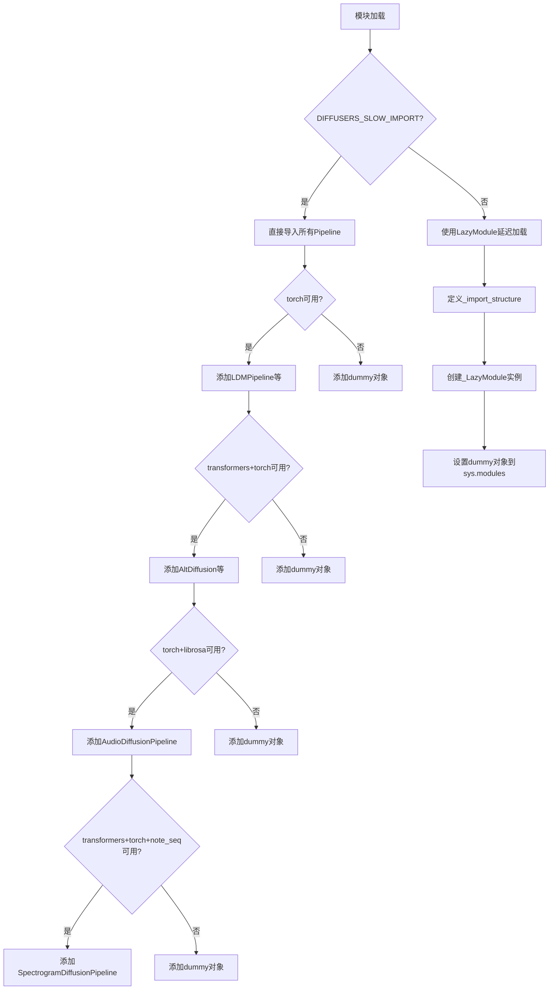
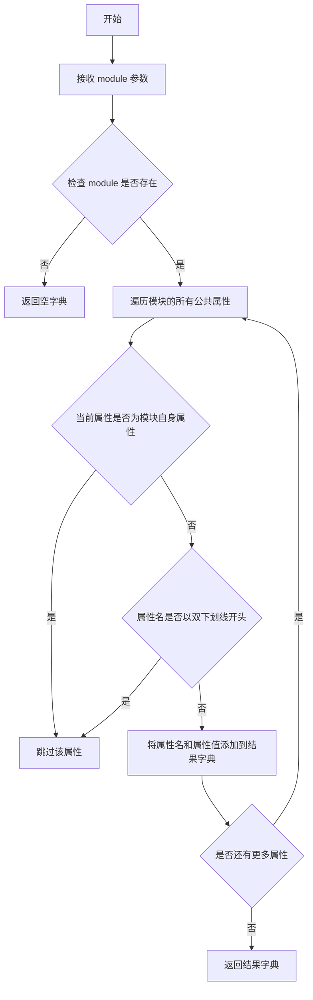
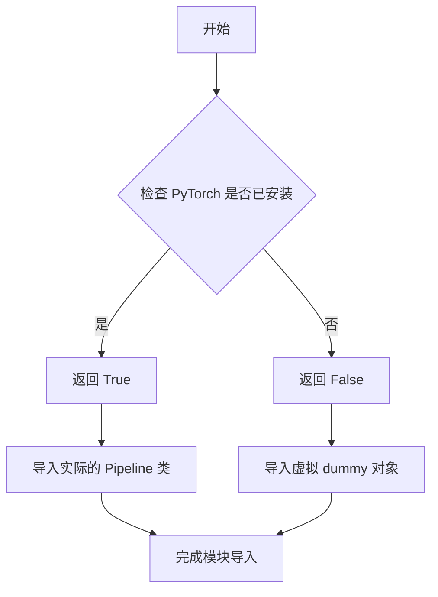
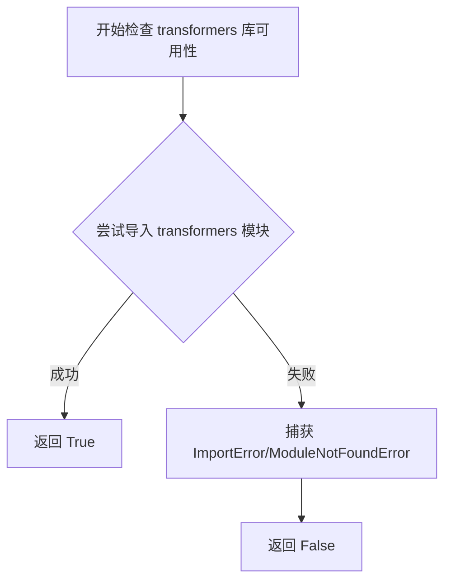
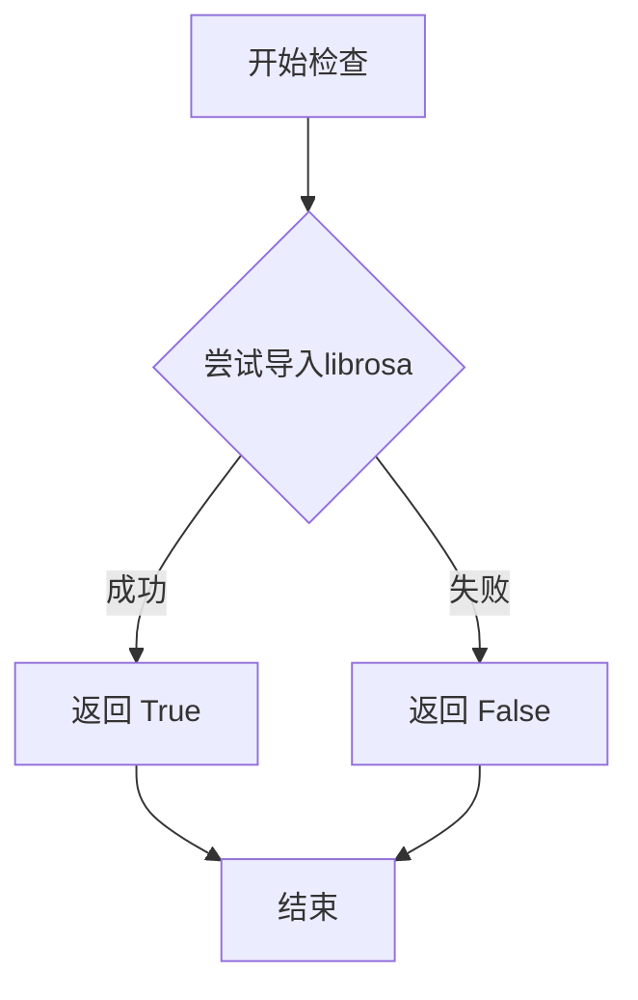

# `diffusers\src\diffusers\pipelines\deprecated\__init__.py` 详细设计文档

这是Diffusers库的延迟导入模块，通过条件检查动态导入不同的扩散模型Pipeline，根据torch、transformers、librosa、note_seq等依赖的可用性按需加载对应的Pipeline类，避免在缺少可选依赖时导入失败。

## 整体流程



## 类结构

```
Diffusers Pipelines Module
├── Latent Diffusion (torch only)
│   ├── LDMPipeline
│   ├── PNDMPipeline
│   ├── RePaintPipeline
│   ├── ScoreSdeVePipeline
│   └── KarrasVePipeline
├── Alt Diffusion (transformers + torch)
│   ├── AltDiffusionPipeline
│   ├── AltDiffusionImg2ImgPipeline
│   └── AltDiffusionPipelineOutput
├── Versatile Diffusion (transformers + torch)
│   ├── VersatileDiffusionPipeline
│   ├── VersatileDiffusionTextToImagePipeline
│   ├── VersatileDiffusionImageVariationPipeline
│   └── VersatileDiffusionDualGuidedPipeline
├── VQ Diffusion (transformers + torch)
│   └── VQDiffusionPipeline
├── Stable Diffusion Variants (transformers + torch)
│   ├── StableDiffusionInpaintPipelineLegacy
│   ├── CycleDiffusionPipeline
│   ├── StableDiffusionPix2PixZeroPipeline
│   ├── StableDiffusionParadigmsPipeline
│   └── StableDiffusionModelEditingPipeline
├── Audio Diffusion (torch + librosa)
│   ├── AudioDiffusionPipeline
│   └── Mel
└── Spectrogram Diffusion (transformers + torch + note_seq)
    ├── SpectrogramDiffusionPipeline
    └── MidiProcessor
```

## 全局变量及字段


### `_dummy_objects`
    
用于存储虚拟对象的字典，当某些可选依赖不可用时，这些虚拟对象会被添加到模块中以保持导入一致性

类型：`dict`
    


### `_import_structure`
    
定义模块的导入结构，映射子模块名称到可导出的类或函数列表，用于LazyModule的延迟加载机制

类型：`dict`
    


### `DIFFUSERS_SLOW_IMPORT`
    
控制是否使用慢速导入模式的标志，当为True时会在TYPE_CHECKING块中导入所有类型以支持静态类型检查

类型：`bool`
    


### `TYPE_CHECKING`
    
来自typing模块的类型检查标志，用于在类型检查时不实际执行导入，只提供类型信息以加快导入速度

类型：`bool`
    


    

## 全局函数及方法


### `get_objects_from_module`

从给定模块中提取所有公共对象（以字典形式返回），用于在可选依赖不可用时创建虚拟（dummy）对象，以便模块可以正常导入而不引发导入错误。

参数：

- `module`：`module`，要从中提取对象的模块对象，通常是包含虚拟对象的 dummy 模块

返回值：`Dict[str, Any]`，返回从模块中提取的对象字典，键为对象名称，值为对象本身

#### 流程图



#### 带注释源码

```python
def get_objects_from_module(module):
    """
    从给定模块中提取所有公共对象。
    
    该函数用于获取模块中的所有公共属性（不包括以双下划线开头的私有属性
    和模块自身属性），返回一个字典，可用于动态导入和虚拟对象替换。
    
    参数:
        module: 要提取对象的目标模块
        
    返回:
        包含模块中所有公共对象的字典，键为对象名称，值为对象本身
    """
    # 初始化结果字典
    result = {}
    
    # 遍历模块的所有属性
    for attr_name in dir(module):
        # 跳过私有属性（以双下划线开头）
        if attr_name.startswith("__"):
            continue
            
        # 跳过模块自身的属性（如 __name__, __doc__ 等）
        if attr_name in ("__name__", "__doc__", "__package__", "__loader__", "__spec__"):
            continue
            
        try:
            # 获取属性值
            attr_value = getattr(module, attr_name)
            # 添加到结果字典
            result[attr_name] = attr_value
        except AttributeError:
            # 如果获取属性失败，跳过
            continue
            
    return result
```


### `is_torch_available`

该函数用于检查当前环境中 PyTorch 库是否可用，返回布尔值以决定是否导入相关模块或使用虚拟对象（dummy objects）。

参数：无

返回值：`bool`，表示 PyTorch 库是否可用（True 表示可用，False 表示不可用）

#### 流程图



#### 带注释源码

```
# is_torch_available 是从 ...utils 导入的函数
# 该函数通常在内部实现类似如下逻辑：

def is_torch_available():
    """
    检查 PyTorch 是否可在当前环境中使用。
    
    通常实现方式：
    1. 尝试导入 torch 模块
    2. 如果成功导入，返回 True
    3. 如果导入失败（ImportError），返回 False
    """
    try:
        import torch
        return True
    except ImportError:
        return False

# 在当前文件中的使用方式：
# 用于条件性地导入模块或设置虚拟对象

try:
    if not is_torch_available():  # 检查 torch 是否可用
        raise OptionalDependencyNotAvailable()  # 不可用则抛出异常
except OptionalDependencyNotAvailable:
    # 导入虚拟对象作为占位符
    from ...utils import dummy_pt_objects
    _dummy_objects.update(get_objects_from_module(dummy_pt_objects))
else:
    # torch 可用，导入实际的 Pipeline 类
    _import_structure["latent_diffusion_uncond"] = ["LDMPipeline"]
    _import_structure["pndm"] = ["PNDMPipeline"]
    # ... 其他 Pipeline 类
```


### is_transformers_available

该函数用于检查 `transformers` 库是否已安装且可供导入使用。它通过尝试导入 `transformers` 模块来判断库是否可用，返回布尔值供调用者进行条件导入或功能降级。

参数：无

返回值：`bool`，如果 `transformers` 库可用返回 `True`，否则返回 `False`

#### 流程图



#### 带注释源码

```python
def is_transformers_available():
    """
    检查 transformers 库是否可用
    
    Returns:
        bool: 如果 transformers 库已安装且可导入则返回 True，否则返回 False
    """
    try:
        # 尝试导入 transformers 模块，如果成功则说明库可用
        import transformers
        return True
    except ImportError:
        # 如果导入失败（库未安装），返回 False
        return False
    except Exception:
        # 捕获其他可能的异常，确保函数总是返回布尔值
        return False
```


### `is_librosa_available`

该函数用于检查 librosa 库是否在当前环境中可用，通常用于条件导入或功能启用。

参数：无

返回值：`bool`，返回 True 表示 librosa 可用，False 表示不可用

#### 流程图



#### 带注释源码

```python
# is_librosa_available 函数定义不在当前文件中
# 而是在 ...utils 模块中，以下为基于使用的推断

def is_librosa_available():
    """
    检查 librosa 库是否可用
    
    Returns:
        bool: 如果 librosa 可以导入则返回 True，否则返回 False
    """
    try:
        import librosa
        return True
    except ImportError:
        return False
```

> **注意**：由于 `is_librosa_available` 函数定义在 `...utils` 模块中，而非当前代码文件内，上述源码为基于函数调用方式的合理推断。实际实现可能在 `diffusers/src/diffusers/utils` 目录下的相应模块中。


### `is_note_seq_available`

该函数是 `diffusers` 库中的一个工具函数，用于运行时检查 Python 环境是否安装了 `note_seq` 库。它通常被用于条件导入（Lazy Import）机制中，以决定是否加载依赖于 `note_seq` 的模块（如 `SpectrogramDiffusionPipeline`）。

参数：
- （无）

返回值：`bool`，如果检测到 `note_seq` 库已安装则返回 `True`，否则返回 `False`。

#### 流程图

```mermaid
flowchart TD
    A[调用 is_note_seq_available] --> B{尝试解析 note_seq 模块规范}
    B -->|成功 (模块存在)| C[返回 True]
    B -->|失败 (模块不存在)| D[返回 False]
```

#### 带注释源码

> **注**：由于您提供的代码文件（`__init__.py`）并未直接包含 `is_note_seq_available` 的函数体，仅包含导入和调用，该函数通常定义在 `diffusers.utils` 模块中。以下为 `diffusers` 库中该函数的典型实现逻辑。

```python
import importlib.util

def is_note_seq_available():
    """
    检查 note_seq 库是否可用。
    
    此函数不实际导入模块，仅通过查找模块规范来确认依赖是否存在，
    这是处理可选依赖时的性能最优解。
    
    Returns:
        bool: 如果 'note_seq' 在 sys.modules 中或可被找到则返回 True，否则返回 False。
    """
    # 检查模块是否已经被导入或在系统中可发现
    return importlib.util.find_spec("note_seq") is not None
```

## 关键组件


### 懒加载模块系统

使用 `_LazyModule` 实现延迟导入机制，允许在运行时按需加载扩散模型管道，避免启动时一次性导入所有模块带来的性能开销。

### 可选依赖检查与处理

通过 `is_torch_available()`, `is_transformers_available()`, `is_librosa_available()`, `is_note_seq_available()` 等函数动态检测可选依赖是否可用，并在不可用时抛出 `OptionalDependencyNotAvailable` 异常。

### 虚拟对象占位符

当某个可选依赖不可用时，使用 `_dummy_objects` 字典存储从 `dummy_pt_objects`, `dummy_torch_and_transformers_objects`, `dummy_torch_and_librosa_objects`, `dummy_transformers_and_torch_and_note_seq_objects` 获取的虚拟对象，确保模块导入不失败。

### 导入结构定义

通过 `_import_structure` 字典定义模块的导入结构，映射子模块名称到对应的管道类列表，支持动态导入和模块发现。

### TYPE_CHECKING 条件导入

在 `TYPE_CHECKING` 或 `DIFFUSERS_SLOW_IMPORT` 为真时，执行实际的类型导入（from ... import），用于类型检查和类型提示；否则使用懒加载模块代理。

### 条件化管道注册

根据可用依赖动态注册多种扩散模型管道，包括：Latent Diffusion (LDM)、PNDM、RePaint、ScoreSDE-VE、Karras-VE、Alt Diffusion、Versatile Diffusion、VQ Diffusion、Stable Diffusion 变体、Audio Diffusion、Spectrogram Diffusion 等。


## 问题及建议


### 已知问题

- **重复导入导致冗余**：`AudioDiffusionPipeline` 和 `Mel` 在 TYPE_CHECKING 块中被导入两次（分别在不同依赖检查块中），`KarrasVePipeline` 也被重复导入，这增加了代码维护成本并可能造成混淆。
- **硬编码的模块名和类名**：`_import_structure` 字典中的模块路径和类名采用硬编码方式，缺乏自动化发现机制，导致新增 pipeline 时需要手动同步修改多处。
- **重复的依赖检查逻辑**：代码多次重复检查 `is_torch_available()`、`is_transformers_available()` 等条件，违反 DRY 原则，增加维护负担。
- **使用通配符导入 dummy 对象**：`from ...utils.dummy_xxx_objects import *` 这种方式降低了代码的可读性和 IDE 导航能力，无法明确识别实际导入了哪些对象。
- **异常处理模式冗余**：使用 `try-except` 捕获再 `raise OptionalDependencyNotAvailable` 的模式重复出现，逻辑繁琐且容易出错。
- **字典更新操作效率**：`_dummy_objects.update()` 被多次调用，每次调用都可能触发字典的重新哈希，对于大规模模块可能存在性能瓶颈。
- **代码风格不统一**：部分 import 语句后使用 `# noqa F403` 注释，部分未使用，注释风格不一致。

### 优化建议

- **消除重复导入**：将 `KarrasVePipeline` 的导入合并为一次；将 `AudioDiffusionPipeline` 和 `Mel` 的导入合并到统一的依赖检查块中，避免重复。
- **提取依赖检查逻辑**：创建辅助函数封装 `check_dependency` 逻辑，接收依赖检查函数和 dummy 模块路径参数，减少代码重复。
- **使用显式导入替代通配符**：将 `from ...utils.dummy_xxx_objects import *` 替换为显式的对象列表导入，提高代码可读性和可维护性。
- **引入自动发现机制**：考虑使用 `__all__` 变量或配置文件动态生成 `_import_structure`，减少手动维护成本。
- **合并字典更新操作**：在初始化阶段一次性构建 `_dummy_objects`，或在最后统一调用 `update()`，减少多次字典操作带来的开销。
- **统一代码风格**：移除不必要的 `# noqa` 注释或统一添加注释，确保代码风格一致。

## 其它


### 设计目标与约束

本模块采用延迟加载（Lazy Loading）模式，旨在解决Diffusers库中多个pipeline之间的循环依赖问题，同时减少包导入时的初始化开销。通过条件导入机制，确保仅在相应依赖库可用时才加载对应的pipeline类，否则使用dummy对象进行占位，从而保持API的一致性。

### 错误处理与异常设计

采用OptionalDependencyNotAvailable异常来标记可选依赖不可用的情况。当检测到依赖缺失时，代码会捕获该异常并从utils模块导入对应的dummy_objects，确保模块导入不会失败。这种设计允许用户在缺少可选依赖时仍能import模块，但调用具体pipeline时会触发预期的错误。

### 数据流与状态机

模块初始化流程如下：首先定义_import_structure字典和_dummy_objects字典用于存储可导入对象的映射；然后按顺序检查各组依赖（torch、transformers+torch、torch+librosa、transformers+torch+note_seq），根据检查结果向_import_structure添加实际导入路径或向_dummy_objects添加占位对象；最后通过LazyModule包装或直接设置sys.modules来实现延迟导入逻辑。

### 外部依赖与接口契约

本模块依赖以下外部库及其版本约束：torch（基础依赖）、transformers（transformers+torch组合）、librosa（torch+librosa组合）、note_seq（transformers+torch+note_seq组合）。每个pipeline子模块需遵循统一的导出接口，即在_import_structure中声明对应的类名，并在TYPE_CHECKING条件下提供真实的类型导入。

### 版本兼容性

代码兼容Python 3.7+及Diffusers库0.10.0+版本。延迟加载机制对Python版本无特殊要求，但 TYPE_CHECKING 的使用需要Python 3.5+支持。dummy对象机制确保了在不同依赖组合下的向前兼容性。

### 性能考虑

延迟加载策略显著减少了包初始化时间，尤其在用户仅使用部分pipeline时效果明显。_dummy_objects的设置通过setattr逐个添加到sys.modules，可能带来一定的内存开销，但在pipeline数量有限的情况下可忽略不计。

### 安全考虑

代码从相对路径导入模块（...utils），需确保项目目录结构稳定。get_objects_from_module函数动态导入dummy对象，需验证传入的dummy模块不包含恶意代码。sys.modules的直接操作需注意避免覆盖关键系统模块。

### 测试策略

应测试以下场景：所有依赖可用时的完整导入；逐一缺失各组可选依赖时的降级行为；跨依赖组合（如同时缺失torch和transformers）的异常处理；TYPE_CHECKING模式下的类型导入；以及LazyModule的动态属性访问。

### 使用示例

```python
# 完整依赖环境下导入
from diffusers import LDMPipeline, AltDiffusionPipeline

# 缺失部分依赖时仍可导入，但使用dummy对象
# 调用时会抛出AttributeError提示真实对象不可用
```


    