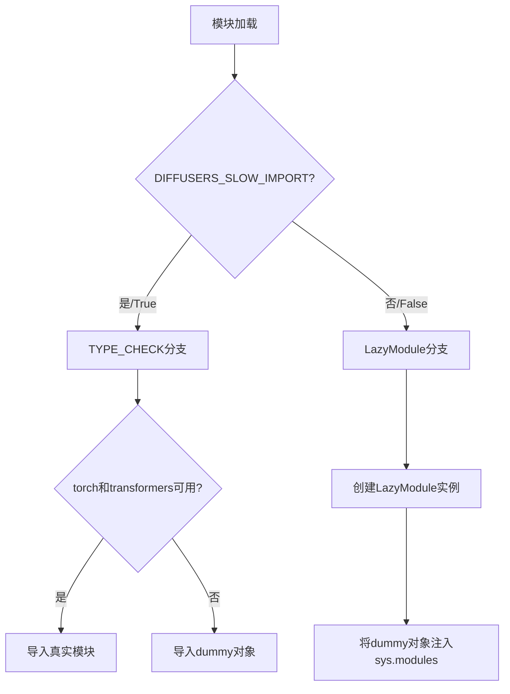
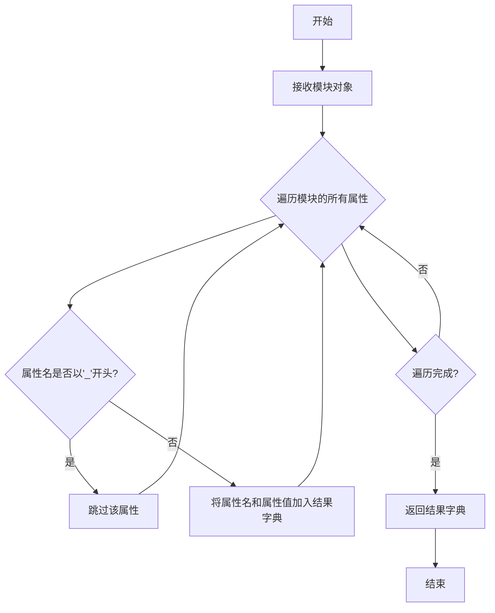
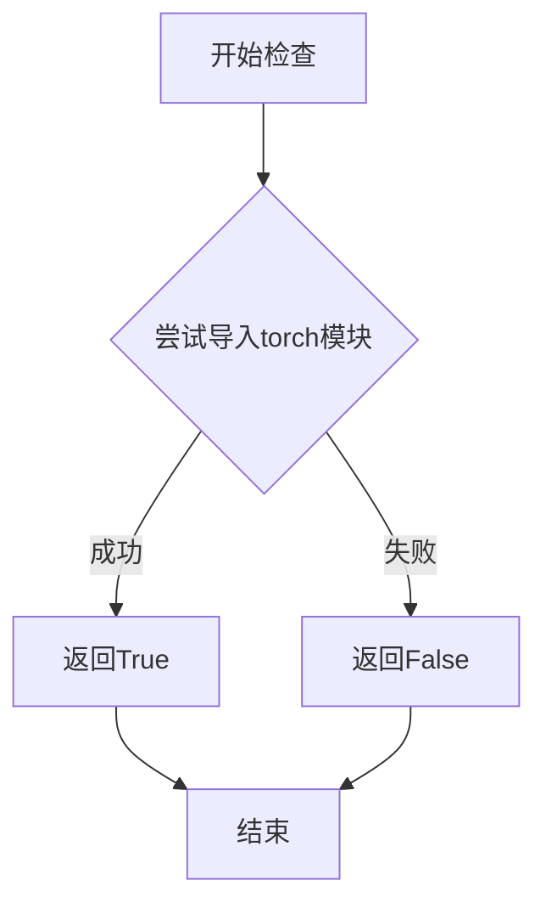
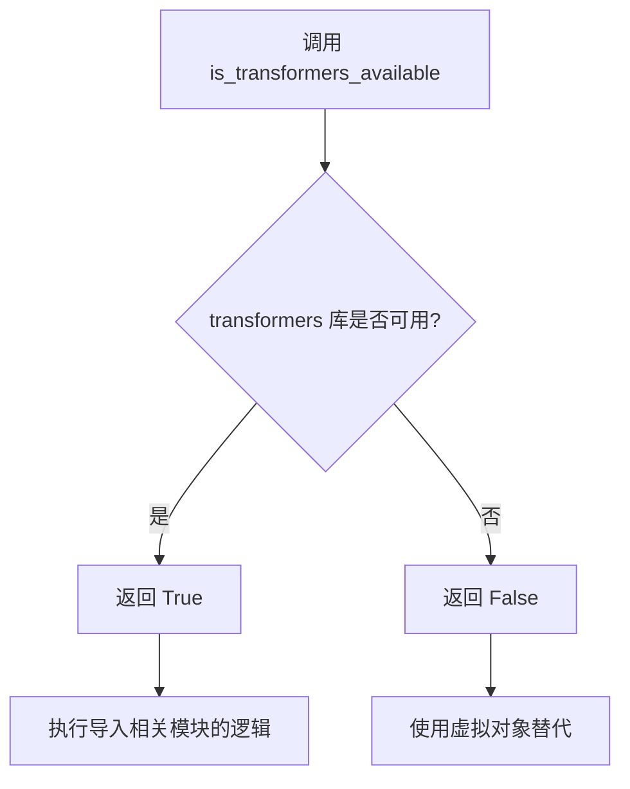
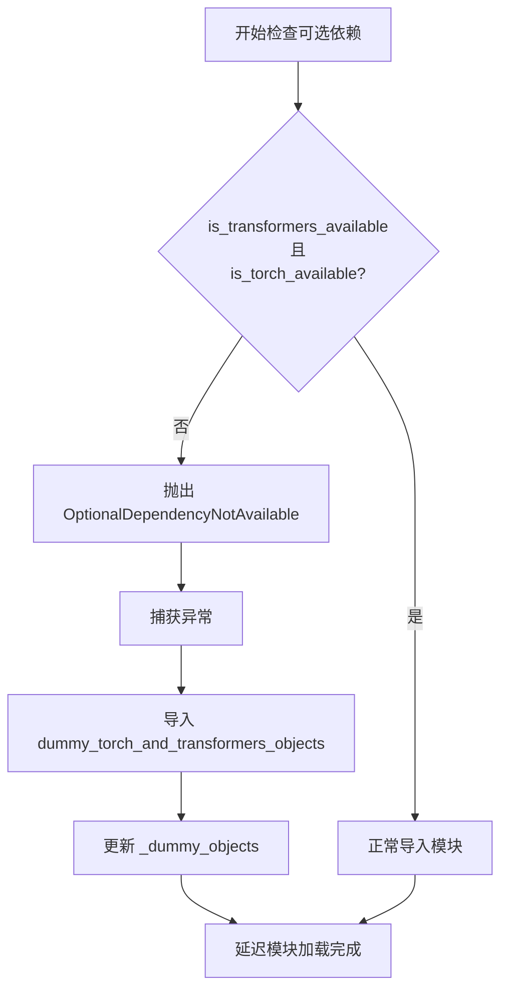
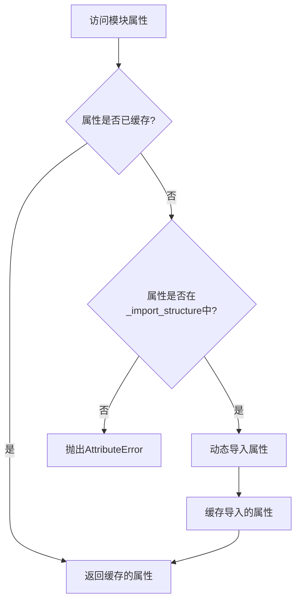
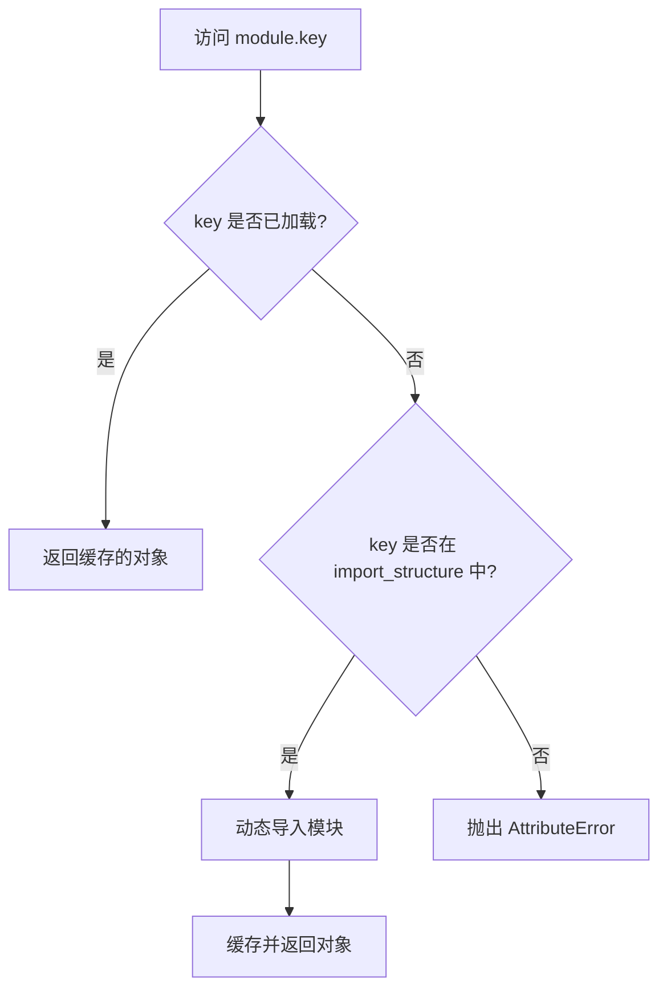

# `diffusers\src\diffusers\pipelines\deprecated\alt_diffusion\__init__.py` 详细设计文档

这是Diffusers库中AltDiffusionPipeline的模块初始化文件，通过LazyModule机制实现条件导入和延迟加载，在torch和transformers可选依赖可用时导出RobertaSeriesModelWithTransformation、AltDiffusionPipeline、AltDiffusionImg2ImgPipeline和AltDiffusionPipelineOutput等核心类，否则提供dummy对象以保持API兼容性。

## 整体流程



## 类结构

```
AltDiffusionModule (LazyModule包装器)
├── RobertaSeriesModelWithTransformation (模型类)
├── AltDiffusionPipeline (主Pipeline)
├── AltDiffusionImg2ImgPipeline (Img2Img Pipeline)
└── AltDiffusionPipelineOutput (输出类)
```

## 全局变量及字段


### `_dummy_objects`
    
存储虚拟对象的字典，当可选依赖（torch和transformers）不可用时使用，用于保持模块导入一致性

类型：`dict`
    


### `_import_structure`
    
定义模块的导入结构，键为子模块名，值为可导出对象的列表，用于懒加载模块

类型：`dict`
    


### `DIFFUSERS_SLOW_IMPORT`
    
从utils导入的标志位，控制是否启用慢速导入模式，影响模块的加载方式

类型：`bool`
    


### `_LazyModule.name`
    
懒加载模块的名称，通常为当前模块的__name__

类型：`str`
    


### `_LazyModule.globals`
    
模块的全局命名空间字典，包含__file__等全局变量

类型：`dict`
    


### `_LazyModule.import_structure`
    
导入结构字典，定义模块内可导出的子模块和对象映射关系

类型：`dict`
    


### `_LazyModule.module_spec`
    
模块规格对象，包含模块的元数据信息，如加载器、路径等

类型：`ModuleSpec`
    
    

## 全局函数及方法


### `get_objects_from_module`

该函数是一个工具函数，用于从指定模块中动态提取所有公共对象（排除私有对象），通常用于延迟加载机制中获取虚拟对象（dummy objects），以便在可选依赖不可用时保持模块接口完整性。

参数：

- `module`：`module`，输入的模块对象，从中提取所有公共属性和对象

返回值：`dict`，返回由对象名称（字符串）到对象本身的键值对映射字典

#### 流程图



#### 带注释源码

```
def get_objects_from_module(module):
    """
    从给定模块中提取所有非私有（以非下划线开头）的对象。
    
    参数:
        module: Python模块对象，从中提取公共成员
        
    返回:
        dict: 包含模块中所有公共对象的字典，键为对象名称，值为对象本身
    """
    # 使用字典推导式遍历模块的所有属性
    # 过滤掉所有私有成员（以单下划线或双下划线开头）
    return {
        name: obj 
        for name, obj in vars(module).items() 
        if not name.startswith('_')
    }
```

> **注意**：由于提供的代码片段仅包含对`get_objects_from_module`函数的调用，而非其完整定义，以上源码是基于该函数在项目中的典型使用模式和延迟加载机制的需求推断得出的。在实际项目中，该函数位于`....utils`模块中。


### `is_torch_available`

该函数用于检查当前环境中 PyTorch 库是否可用，通过尝试导入 torch 模块来判断，返回布尔值表示 PyTorch 的可用性。

参数：无需参数

返回值：`bool`，返回 True 表示 PyTorch 可用，返回 False 表示 PyTorch 不可用

#### 流程图



#### 带注释源码

```python
# 从上级模块导入的函数，用于检测torch是否可用
# 具体实现通常在 ....utils 包中定义
from ....utils import is_torch_available

# 在当前模块中的使用示例：
# 检查 torch 和 transformers 是否同时可用
if not (is_transformers_available() and is_torch_available()):
    # 如果任一库不可用，则引发 OptionalDependencyNotAvailable 异常
    raise OptionalDependencyNotAvailable()
```

#### 详细分析

**调用位置分析**：
- 在代码的第 10 行从 `....utils` 导入
- 在第 14 行和第 29 行被调用，用于条件判断
- 配合 `is_transformers_available()` 一起使用，确保同时满足两个依赖

**实际作用**：
这个函数是扩散库（Diffusers）的依赖检查机制的一部分，用于在导入可选模块时检查必要的依赖是否已安装。如果 PyTorch 不可用，则不会导入相关的模型和管道类，从而避免导入错误。

**设计意图**：
- 实现懒加载（Lazy Loading）机制
- 提供优雅的依赖缺失处理
- 支持条件导入，优化模块加载性能


### `is_transformers_available`

该函数用于检查 `transformers` 库是否在当前环境中可用，通过返回布尔值来指示依赖状态。

参数： 无

返回值：`bool`，返回 `True` 表示 `transformers` 库可用，返回 `False` 表示不可用。

#### 流程图



#### 带注释源码

```python
# 从上级目录的 utils 模块导入 is_transformers_available 函数
# 该函数定义在 ....utils 包中
from ....utils import (
    DIFFUSERS_SLOW_IMPORT,
    OptionalDependencyNotAvailable,
    _LazyModule,
    get_objects_from_module,
    is_torch_available,
    is_transformers_available,  # <-- 被导入的函数：检查 transformers 是否可用
)

# 使用 is_transformers_available 进行条件检查
try:
    # 同时检查 transformers 和 torch 是否都可用
    if not (is_transformers_available() and is_torch_available()):
        raise OptionalDependencyNotAvailable()
except OptionalDependencyNotAvailable:
    # 如果任一依赖不可用，导入虚拟对象
    from ....utils import dummy_torch_and_transformers_objects
    _dummy_objects.update(get_objects_from_module(dummy_torch_and_transformers_objects))
else:
    # 如果依赖都可用，定义实际的导入结构
    _import_structure["modeling_roberta_series"] = ["RobertaSeriesModelWithTransformation"]
    _import_structure["pipeline_alt_diffusion"] = ["AltDiffusionPipeline"]
    _import_structure["pipeline_alt_diffusion_img2img"] = ["AltDiffusionImg2ImgPipeline"]
    _import_structure["pipeline_output"] = ["AltDiffusionPipelineOutput"]
```


### `OptionalDependencyNotAvailable`

这是一个可选依赖不可用时抛出的异常类，用于处理 transformers 和 torch 可选依赖的动态导入场景。当检测到所需的可选依赖不可用时，程序会抛出此异常并回退到虚拟对象（dummy objects）。

参数：

- 无参数（异常类构造函数）

返回值：`Exception`，一个可选依赖不可用的异常实例

#### 流程图



#### 带注释源码

```python
# 导入类型检查相关模块
from typing import TYPE_CHECKING

# 从上层工具模块导入必要的函数和异常类
from ....utils import (
    DIFFUSERS_SLOW_IMPORT,           # 控制是否使用慢速导入的标志
    OptionalDependencyNotAvailable,  # 可选依赖不可用时抛出的异常类
    _LazyModule,                      # 延迟加载模块的封装类
    get_objects_from_module,          # 从模块获取对象的辅助函数
    is_torch_available,               # 检查 torch 是否可用的函数
    is_transformers_available,        # 检查 transformers 是否可用的函数
)

# 初始化虚拟对象字典和导入结构字典
_dummy_objects = {}
_import_structure = {}

# 尝试检查可选依赖是否可用
try:
    # 检查 transformers 和 torch 是否都可用
    if not (is_transformers_available() and is_torch_available()):
        # 如果任一依赖不可用，抛出异常
        raise OptionalDependencyNotAvailable()
except OptionalDependencyNotAvailable:
    # 捕获异常，导入虚拟对象模块
    from ....utils import dummy_torch_and_transformers_objects

    # 将虚拟对象添加到 _dummy_objects 字典中
    # 这些对象在依赖不可用时提供替代实现
    _dummy_objects.update(get_objects_from_module(dummy_torch_and_transformers_objects))
else:
    # 如果所有依赖都可用，定义实际的导入结构
    # 添加 Roberta 系列模型相关类
    _import_structure["modeling_roberta_series"] = ["RobertaSeriesModelWithTransformation"]
    # 添加 AltDiffusion 相关 pipeline 类
    _import_structure["pipeline_alt_diffusion"] = ["AltDiffusionPipeline"]
    _import_structure["pipeline_alt_diffusion_img2img"] = ["AltDiffusionImg2ImgPipeline"]
    # 添加 pipeline 输出类
    _import_structure["pipeline_output"] = ["AltDiffusionPipelineOutput"]

# TYPE_CHECKING 用于静态类型检查，DIFFUSERS_SLOW_IMPORT 用于控制导入行为
if TYPE_CHECKING or DIFFUSERS_SLOW_IMPORT:
    try:
        # 再次检查可选依赖的可用性
        if not (is_transformers_available() and is_torch_available()):
            raise OptionalDependencyNotAvailable()
    except OptionalDependencyNotAvailable:
        # 静态类型检查时，导入虚拟对象供类型检查使用
        from ....utils.dummy_torch_and_transformers_objects import *
    else:
        # 依赖可用时，导入实际的类定义供类型检查使用
        from .modeling_roberta_series import RobertaSeriesModelWithTransformation
        from .pipeline_alt_diffusion import AltDiffusionPipeline
        from .pipeline_alt_diffusion_img2img import AltDiffusionImg2ImgPipeline
        from .pipeline_output import AltDiffusionPipelineOutput
else:
    # 运行时：将当前模块替换为延迟加载模块
    import sys

    # 使用 _LazyModule 封装当前模块，实现延迟加载
    sys.modules[__name__] = _LazyModule(
        __name__,                       # 模块名称
        globals()["__file__"],          # 模块文件路径
        _import_structure,              # 模块的导入结构定义
        module_spec=__spec__,           # 模块规格信息
    )
    # 将虚拟对象设置到模块中，使依赖不可用时也能正常导入（虽然功能受限）
    for name, value in _dummy_objects.items():
        setattr(sys.modules[__name__], name, value)
```


### `LazyModule.__getattr__`

该方法是延迟加载模块的核心机制，负责在模块属性被访问时动态导入并返回相应的对象或子模块，实现懒加载功能。

参数：

- `name`：`str`，要访问的属性名称

返回值：`Any`，动态导入的对象、类或模块，如果不存在则抛出 `AttributeError`

#### 流程图



#### 带注释源码

```python
# 注意：以下代码为 _LazyModule 类的 __getattr__ 方法的典型实现逻辑
# 具体实现取决于 utils._LazyModule 的源码

def __getattr__(self, name: str):
    """
    延迟加载模块属性的核心方法。
    当访问模块中不存在的属性时，Python 会自动调用此方法。
    
    参数:
        name (str): 要访问的属性名
        
    返回值:
        Any: 动态导入的对象
        
    异常:
        AttributeError: 当属性不在延迟加载结构中时抛出
    """
    # 1. 检查属性是否已经在模块实例的缓存中
    if name in self.__dict__:
        return self.__dict__[name]
    
    # 2. 检查属性是否在延迟加载结构(_import_structure)中
    if name in self._import_structure:
        # 3. 动态导入需要的对象
        obj = self._get_module_attribute(name)
        
        # 4. 缓存导入的对象，避免重复导入
        self.__dict__[name] = obj
        
        return obj
    
    # 5. 如果属性不存在，抛出标准的 AttributeError
    raise AttributeError(f"module {self.__name__!r} has no attribute {name!r}")
```


### `_LazyModule.__getitem__`

该方法是 `_LazyModule` 类的特殊方法（魔术方法），用于支持模块的字典式访问（`module[key]`）。在延迟加载（Lazy Loading）机制中，当访问模块的某个属性或子模块时，如果该属性尚未加载，则触发 `__getitem__` 方法进行动态加载。在给定的代码中，`_LazyModule` 类是从 `....utils._LazyModule` 导入的，其具体实现不在本代码段中，但根据使用方式可以推断其功能。

注意：由于 `_LazyModule` 类的实现源码不在提供的代码段中，以下信息基于常见的延迟加载模块实现模式和代码使用方式的推断。

#### 参数

-  `key`：任意类型，通常为 `str`，表示要访问的属性名或子模块名

#### 返回值

- 返回值类型取决于请求的属性或子模块，通常是类、函数或对象
- 返回延迟加载的属性或子模块对象

#### 流程图



#### 带注释源码

由于 `_LazyModule` 类的实现不在当前代码段中，以下是基于常见实现的推断源码：

```python
# _LazyModule 类通常定义在 ....utils 模块中
# 以下为推断的实现逻辑

class _LazyModule:
    """
    延迟加载模块类，用于在访问属性时动态导入子模块
    """
    
    def __init__(self, name, file, import_structure, module_spec=None):
        self._name = name
        self._file = file
        self._import_structure = import_structure  # 存储可用的属性映射
        self._module_spec = module_spec
        self._objects = {}  # 已加载的对象缓存
        self._modules = {}  # 已加载的子模块缓存
    
    def __getitem__(self, key):
        """
        支持 module[key] 访问方式
        
        参数:
            key: 要访问的属性名或子模块名
            
        返回:
            延迟加载的属性或子模块对象
        """
        # 检查是否已加载
        if key in self._objects:
            return self._objects[key]
        
        # 检查是否在导入结构中
        if key not in self._import_structure:
            raise AttributeError(f"module '{self._name}' has no attribute '{key}'")
        
        # 获取导入路径
        import_path = self._import_structure[key]
        
        # 动态导入
        if isinstance(import_path, tuple):
            # 子模块导入
            module_name, attr_name = import_path
            from importlib import import_module
            module = import_module(module_name)
            obj = getattr(module, attr_name)
        else:
            # 直接对象导入
            from importlib import import_module
            module = import_module(f".{import_path}", package=self._name)
            obj = module
        
        # 缓存结果
        self._objects[key] = obj
        return obj
    
    def __getattr__(self, name):
        """支持属性访问方式"""
        return self.__getitem__(name)
```

#### 补充说明

在提供的代码中，`_LazyModule` 的使用方式如下：

```python
sys.modules[__name__] = _LazyModule(
    __name__,
    globals()["__file__"],
    _import_structure,
    module_spec=__spec__,
)
```

这行代码将当前模块替换为一个延迟加载的代理对象。当用户访问如 `module.RobertaSeriesModelWithTransformation` 时，`_LazyModule.__getitem__` 会拦截访问，检查 `_import_structure` 中是否定义了该属性，如果是，则动态导入相关的模块并返回相应的类或函数。


## 关键组件


### _import_structure

存储模块导入结构的字典，用于懒加载机制。当torch和transformers可用时，定义AltDiffusionPipeline、AltDiffusionImg2ImgPipeline等可导出对象的映射关系。

### _dummy_objects

存储虚拟对象的字典，当可选依赖（torch或transformers）不可用时，从dummy模块填充虚拟对象以保持导入接口一致性。

### RobertaSeriesModelWithTransformation

基于RoBERTa系列模型并添加转换层的模型类，支持序列到序列的转换功能。

### AltDiffusionPipeline

AltDiffusion生成管道，继承Diffusers的DiffusionPipeline，支持文本到图像的生成任务，集成了RoBERTa系列模型作为文本编码器。

### AltDiffusionImg2ImgPipeline

AltDiffusion图像到图像管道，支持基于现有图像进行风格迁移或内容修改的生成任务。

### AltDiffusionPipelineOutput

管道输出数据类，封装AltDiffusionPipeline生成的图像结果及相关元数据。

### 可选依赖检查与懒加载机制

通过is_torch_available()和is_transformers_available()检查依赖可用性，使用_LazyModule实现延迟导入，确保在缺少可选依赖时模块仍可被导入（填充dummy对象）。


## 问题及建议


### 已知问题

-   **代码重复**：检查 `is_transformers_available() and is_torch_available()` 的逻辑在第16-19行和第32-35行完全重复，增加了维护成本
-   **硬编码的模块路径**：使用 `....utils` 和 `.....utils` 的相对导入路径，假设了固定的目录结构，重构时容易出错
-   **魔法字符串**：模块名如 `"modeling_roberta_series"`、`"pipeline_alt_diffusion"` 等硬编码在 `_import_structure` 字典中，容易遗漏或拼写错误
-   **缺乏错误处理**：`get_objects_from_module(dummy_torch_and_transformers_objects)` 调用没有异常捕获，若函数不存在会导致运行时错误
-   **扩展性差**：新增 pipeline 或模型需要在多个位置（`_import_structure`、`TYPE_CHECKING 分支`、`else 分支`）同时修改，容易遗漏
-   **使用 `globals()["__file__"]`**：依赖隐式的全局状态获取文件路径，在某些极端环境下可能行为不确定

### 优化建议

-   **提取公共逻辑**：将依赖检查封装为函数，例如 `def _check_dependencies():`，避免重复代码
-   **使用常量或配置**：将模块名路径定义为常量或从配置文件读取，减少硬编码
-   **添加错误处理**：为 `get_objects_from_module` 调用添加 try-except，捕获可能的异常
-   **使用数据驱动**：通过列表或配置文件定义所有 pipeline 和模型的映射关系，自动生成 `_import_structure`
-   **添加类型注解**：为全局变量 `_dummy_objects`、`_import_structure` 添加类型注解，提升代码可读性
-   **使用 `__file__` 显式引用**：直接使用模块级 `__file__` 变量而非 `globals()["__file__"]`

## 其它


### 设计目标与约束

本模块旨在实现Diffusers库对AltDiffusion的可选支持，通过延迟导入机制在保证核心库轻量化的同时，提供对PyTorch和Transformers的可选依赖支持。设计约束包括：仅在PyTorch和Transformers同时可用时加载完整功能，否则提供空对象以避免导入错误；采用_LazyModule实现模块的延迟加载以优化启动性能；保持与Diffusers库其他模块一致的导入结构设计。

### 错误处理与异常设计

本模块采用OptionalDependencyNotAvailable异常处理可选依赖不可用的情况。当检测到torch或transformers任一依赖缺失时，抛出OptionalDependencyNotAvailable异常，并从dummy_torch_and_transformers_objects模块加载空对象填充_dummy_objects字典，确保模块可被导入但不提供实际功能。TYPE_CHECKING模式下同样进行依赖检查，但此时仅用于类型检查目的，不执行实际的模块加载逻辑。

### 外部依赖与接口契约

本模块依赖以下外部组件：torch（PyTorch），transformers（Transformers库），以及Diffusers内部的utils模块（包括_LazyModule、get_objects_from_module、OptionalDependencyNotAvailable等）。提供的公开接口包括：RobertaSeriesModelWithTransformation类、AltDiffusionPipeline类、AltDiffusionImg2ImgPipeline类和AltDiffusionPipelineOutput类。所有公开接口通过_import_structure字典定义，并在LazyModule初始化时注册。

### 模块初始化流程

模块初始化分为两条路径：当DIFFUSERS_SLOW_IMPORT为True或TYPE_CHECKING模式下，执行完整的模块导入流程，从子模块加载实际类定义；否则，执行延迟初始化，将当前模块替换为_LazyModule实例，并批量注入dummy对象。延迟初始化路径通过sys.modules[__name__] = _LazyModule(...)实现，该操作将模块的导入职责委托给LazyModule的__getattr__方法处理。

### 延迟加载机制

_LazyModule是实现延迟加载的核心组件，其接收模块名称、文件路径、导入结构字典和模块规格作为参数。当代码首次访问模块属性时，LazyModule的__getattr__方法会根据_import_structure字典动态加载对应的子模块。这种设计使得Diffusers库可以在不立即加载所有可选依赖的情况下完成初始化，只有在实际使用AltDiffusion相关功能时才触发完整的模块加载。

### 兼容性考虑

本模块同时支持Python 3.7+的TYPE_CHECKING语法和运行时导入两种模式。TYPE_CHECKING分支确保类型检查器能够识别模块的完整类型信息，而运行时分支则通过条件导入提供实际的运行时行为。模块还通过DIFFUSERS_SLOW_IMPORT标志支持慢速导入模式，允许在需要完整模块扫描的场景下绕过延迟加载机制。

### 导入结构定义

_import_structure字典定义了模块的公共API接口，其中键为子模块名称，值为该子模块导出的类或函数名列表。当前定义的导入结构包括：modeling_roberta_series模块导出RobertaSeriesModelWithTransformation类；pipeline_alt_diffusion模块导出AltDiffusionPipeline类；pipeline_alt_diffusion_img2img模块导出AltDiffusionImg2ImgPipeline类；pipeline_output模块导出AltDiffusionPipelineOutput类。

### 性能优化策略

本模块采用多重性能优化策略：延迟加载减少启动时ImportError的可能性并降低内存占用；dummy对象预定义避免条件导入导致的重复检查；sys.modules直接操作实现模块注入，减少属性查找开销。这些优化确保模块在依赖不可用时保持最小侵入性，在依赖可用时提供完整功能。

### 版本兼容性

模块设计考虑了不同版本的PyTorch和Transformers兼容性，通过可选依赖检查机制适应多种环境。dummy_torch_and_transformers_objects模块提供了空对象定义，确保在不同版本的依赖库环境下都能完成模块导入而不抛出导入错误。


    