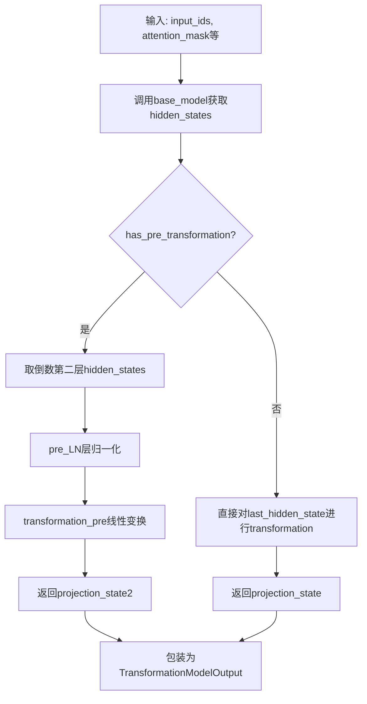
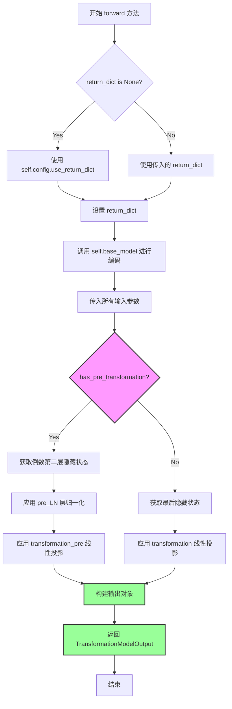

# `diffusers\src\diffusers\pipelines\deprecated\alt_diffusion\modeling_roberta_series.py` 详细设计文档

这是一个基于RoBERTa的深度学习模型实现，通过XLMRobertaModel作为backbone，添加线性变换层将隐藏状态投影到指定维度(project_dim)，支持可选的pre-transformation结构，用于获取文本嵌入表示。

## 整体流程



## 类结构

```
ModelOutput (transformers.utils)
└── TransformationModelOutput (dataclass)

XLMRobertaConfig (transformers)
└── RobertaSeriesConfig

RobertaPreTrainedModel (transformers)
└── RobertaSeriesModelWithTransformation
    ├── XLMRobertaModel (roberta)
    ├── nn.Linear (transformation)
    ├── nn.Linear (transformation_pre, 条件)
    └── nn.LayerNorm (pre_LN, 条件)
```

## 全局变量及字段


### `dataclass`
    
Python装饰器,用于创建数据类

类型：`function`
    


### `torch`
    
PyTorch深度学习库

类型：`module`
    


### `nn`
    
PyTorch神经网络模块

类型：`module`
    


### `RobertaPreTrainedModel`
    
RoBERTa预训练模型基类,提供模型加载和保存功能

类型：`class`
    


### `XLMRobertaConfig`
    
XLM-RoBERTa模型配置类,继承自RobertaConfig

类型：`class`
    


### `XLMRobertaModel`
    
XLM-RoBERTa模型实现类

类型：`class`
    


### `ModelOutput`
    
transformers库模型输出基类

类型：`class`
    


### `dataclass.TransformationModelOutput`
    
模型输出数据类,包含投影状态和隐藏状态

类型：`class`
    


### `TransformationModelOutput.projection_state`
    
投影后的嵌入向量

类型：`torch.Tensor | None`
    


### `TransformationModelOutput.last_hidden_state`
    
最后一层隐藏状态

类型：`torch.Tensor`
    


### `TransformationModelOutput.hidden_states`
    
所有层的隐藏状态元组

类型：`tuple[torch.Tensor] | None`
    


### `TransformationModelOutput.attentions`
    
注意力权重元组

类型：`tuple[torch.Tensor] | None`
    


### `XLMRobertaConfig.RobertaSeriesConfig`
    
自定义RoBERTa系列模型配置类

类型：`class`
    


### `RobertaSeriesConfig.project_dim`
    
投影维度

类型：`int`
    


### `RobertaSeriesConfig.pooler_fn`
    
池化函数类型

类型：`str`
    


### `RobertaSeriesConfig.learn_encoder`
    
是否学习编码器

类型：`bool`
    


### `RobertaSeriesConfig.use_attention_mask`
    
是否使用注意力掩码

类型：`bool`
    


### `RobertaSeriesConfig.pad_token_id`
    
填充token id

类型：`int`
    


### `RobertaSeriesConfig.bos_token_id`
    
句子开始token id

类型：`int`
    


### `RobertaSeriesConfig.eos_token_id`
    
句子结束token id

类型：`int`
    


### `RobertaPreTrainedModel.RobertaSeriesModelWithTransformation`
    
带投影变换的RoBERTa模型类

类型：`class`
    


### `RobertaSeriesModelWithTransformation.roberta`
    
基础RoBERTa模型

类型：`XLMRobertaModel`
    


### `RobertaSeriesModelWithTransformation.transformation`
    
隐藏状态到投影空间的线性变换

类型：`nn.Linear`
    


### `RobertaSeriesModelWithTransformation.has_pre_transformation`
    
是否使用pre-transformation结构

类型：`bool`
    


### `RobertaSeriesModelWithTransformation.transformation_pre`
    
pre变换层(条件初始化)

类型：`nn.Linear`
    


### `RobertaSeriesModelWithTransformation.pre_LN`
    
pre层归一化(条件初始化)

类型：`nn.LayerNorm`
    


### `RobertaSeriesModelWithTransformation.__init__`
    
初始化模型结构

类型：`method`
    


### `RobertaSeriesModelWithTransformation.forward`
    
前向传播方法

类型：`method`
    
    

## 全局函数及方法


### `RobertaSeriesConfig.__init__`

该方法用于初始化 `RobertaSeriesConfig` 对象，继承自 `XLMRobertaConfig`。它在设置标准 RoBERTa 序列标记（ID）的基础上，额外配置了模型特定的参数，如用于特征投影的维度、池化策略、编码器微调选项以及注意力掩码的处理方式。

参数：

-  `pad_token_id`：`int`，默认值 1。填充令牌（Padding Token）的 ID，用于批处理时对齐序列长度。
-  `bos_token_id`：`int`，默认值 0。序列起始（Beginning of Sequence）令牌的 ID。
-  `eos_token_id`：`int`，默认值 2。序列结束（End of Sequence）令牌的 ID。
-  `project_dim`：`int`，默认值 512。投影层（Projection Layer）的输出维度，决定了最终嵌入向量的特征空间大小。
-  `pooler_fn`：`str`，默认值 "cls"。池化函数类型，通常设为 "cls" 以使用 [CLS] token 的隐藏状态作为句子表示。
-  `learn_encoder`：`bool`，默认值 False。布尔标志，控制是否允许训练（微调）底层的 RoBERTa 编码器参数。
-  `use_attention_mask`：`bool`，默认值 True。控制是否在模型前向传播中生成并使用注意力掩码，以忽略填充令牌的影响。
-  `**kwargs`：`Any`，可变关键字参数，用于接收并传递给父类 `XLMRobertaConfig` 的其他配置选项（如 `hidden_size`, `num_attention_heads` 等）。

返回值：`None`，构造函数不返回值，仅初始化对象状态。

#### 流程图

```mermaid
flowchart TD
    A([Start __init__]) --> B[Call super().__init__<br>pad_token_id, bos_token_id, eos_token_id]
    B --> C[Set self.project_dim = project_dim]
    C --> D[Set self.pooler_fn = pooler_fn]
    D --> E[Set self.learn_encoder = learn_encoder]
    E --> F[Set self.use_attention_mask = use_attention_mask]
    F --> G([End])
```

#### 带注释源码

```python
def __init__(
    self,
    pad_token_id=1,
    bos_token_id=0,
    eos_token_id=2,
    project_dim=512,
    pooler_fn="cls",
    learn_encoder=False,
    use_attention_mask=True,
    **kwargs,
):
    """
    初始化 RobertaSeriesConfig 实例。

    参数:
        pad_token_id: 填充令牌的ID，默认为1。
        bos_token_id: 序列开始令牌的ID，默认为0。
        eos_token_id: 序列结束令牌的ID，默认为2。
        project_dim: 投影层的输出维度，默认为512。
        pooler_fn: 池化函数类型，默认为"cls"。
        learn_encoder: 是否训练编码器，默认为False。
        use_attention_mask: 是否使用注意力掩码，默认为True。
        **kwargs: 传递给父类的额外关键字参数。
    """
    # 调用父类 XLMRobertaConfig 的初始化方法，设置标准的 token IDs
    super().__init__(pad_token_id=pad_token_id, bos_token_id=bos_token_id, eos_token_id=eos_token_id, **kwargs)
    
    # 设置投影维度，用于控制输出嵌入的维度
    self.project_dim = project_dim
    
    # 设置池化函数标识，指定如何从隐藏状态中提取特征
    self.pooler_fn = pooler_fn
    
    # 设置是否微调编码器的标志
    self.learn_encoder = learn_encoder
    
    # 设置是否使用注意力掩码的标志
    self.use_attention_mask = use_attention_mask
```


### RobertaSeriesModelWithTransformation.__init__

该方法初始化RobertaSeriesModelWithTransformation类实例，配置并构建基于XLMRobertaModel的模型结构，同时添加用于将隐藏状态投影到目标维度的线性变换层，并根据配置决定是否添加预变换层和层归一化组件。

参数：

- `config`：`RobertaSeriesConfig`（或`XLMRobertaConfig`），模型配置对象，包含hidden_size、project_dim、has_pre_transformation等参数，用于初始化模型结构

返回值：`None`，构造函数不返回值

#### 流程图

```mermaid
flowchart TD
    A[开始 __init__] --> B[调用 super().__init__(config)]
    B --> C[初始化 self.roberta = XLMRobertaModel(config)]
    C --> D[初始化 self.transformation = nn.Linear(config.hidden_size, config.project_dim)]
    D --> E[获取 self.has_pre_transformation = getattr config.has_pre_transformation 默认False]
    E --> F{self.has_pre_transformation == True?}
    F -->|是| G[初始化 self.transformation_pre = nn.Linear config.hidden_size -> config.project_dim]
    G --> H[初始化 self.pre_LN = nn.LayerNorm config.hidden_size]
    F -->|否| I[跳过预变换层初始化]
    H --> J[调用 self.post_init]
    I --> J
    J --> K[结束 __init__]
```

#### 带注释源码

```python
def __init__(self, config):
    # 调用父类RobertaPreTrainedModel的初始化方法，注册config并初始化基础模型结构
    super().__init__(config)
    
    # 创建XLMRobertaModel实例作为基础编码器模型
    # 用于生成输入序列的隐藏状态表示
    self.roberta = XLMRobertaModel(config)
    
    # 创建线性变换层，将隐藏状态从hidden_size维度投影到project_dim维度
    # 用于生成最终的嵌入表示（projection_state）
    self.transformation = nn.Linear(config.hidden_size, config.project_dim)
    
    # 从config中获取has_pre_transformation标志，默认为False
    # 用于控制是否使用预变换层（一种双阶段投影策略）
    self.has_pre_transformation = getattr(config, "has_pre_transformation", False)
    
    # 如果启用预变换，则初始化额外的变换层和层归一化
    if self.has_pre_transformation:
        # 预变换线性层，用于在主变换前进行初步投影
        self.transformation_pre = nn.Linear(config.hidden_size, config.project_dim)
        # 层归一化层，用于稳定预变换的输入分布
        self.pre_LN = nn.LayerNorm(config.hidden_size, eps=config.layer_norm_eps)
    
    # 调用transformers库的后处理初始化方法
    # 负责模型权重的初始化、输出embedding配置等
    self.post_init()
```


### `RobertaSeriesModelWithTransformation.forward`

这是RobertaSeriesModelWithTransformation类的前向传播方法，负责将输入的文本token通过RoBERTa编码器处理，然后通过转换层（transformation）将高维隐藏状态投影到低维空间，最后返回包含投影状态和完整模型输出的TransformationModelOutput对象。

参数：

- `input_ids`：`torch.Tensor | None`，输入的token IDs序列，形状为(batch_size, sequence_length)
- `attention_mask`：`torch.Tensor | None`，注意力掩码，用于指示哪些token是padding，1表示有效token，0表示padding
- `token_type_ids`：`torch.Tensor | None`，token类型 IDs，用于区分不同句子（对于XLM-RoBERTa通常为None）
- `position_ids`：`torch.Tensor | None`，位置 IDs，指示token在序列中的位置
- `head_mask`：`torch.Tensor | None`，多头注意力中的head掩码，用于控制哪些head参与计算
- `inputs_embeds`：`torch.Tensor | None`，直接输入的embeddings，绕过embedding层
- `encoder_hidden_states`：`torch.Tensor | None`，编码器的隐藏状态，用于序列到序列模型
- `encoder_attention_mask`：`torch.Tensor | None`，编码器的注意力掩码
- `output_attentions`：`bool | None`，是否返回注意力权重
- `return_dict`：`bool | None`，是否返回字典格式的输出
- `output_hidden_states`：`bool | None`，是否返回所有层的隐藏状态

返回值：`TransformationModelOutput`，包含投影状态（projection_state）、最后隐藏状态（last_hidden_state）、所有隐藏状态（hidden_states）和注意力权重（attentions）的输出对象

#### 流程图



#### 带注释源码

```python
def forward(
    self,
    input_ids: torch.Tensor | None = None,
    attention_mask: torch.Tensor | None = None,
    token_type_ids: torch.Tensor | None = None,
    position_ids: torch.Tensor | None = None,
    head_mask: torch.Tensor | None = None,
    inputs_embeds: torch.Tensor | None = None,
    encoder_hidden_states: torch.Tensor | None = None,
    encoder_attention_mask: torch.Tensor | None = None,
    output_attentions: bool | None = None,
    return_dict: bool | None = None,
    output_hidden_states: bool | None = None,
):
    r""" """
    # 确定返回格式：优先使用传入的return_dict，否则使用配置中的use_return_dict
    return_dict = return_dict if return_dict is not None else self.config.use_return_dict

    # 调用基础模型（XLMRobertaModel）进行前向传播
    # 注意：无论has_pre_transformation为何值，都设置output_hidden_states=True
    # 因为has_pre_transformation=True时需要访问倒数第二层hidden_states
    outputs = self.base_model(
        input_ids=input_ids,
        attention_mask=attention_mask,
        token_type_ids=token_type_ids,
        position_ids=position_ids,
        head_mask=head_mask,
        inputs_embeds=inputs_embeds,
        encoder_hidden_states=encoder_hidden_states,
        encoder_attention_mask=encoder_attention_mask,
        output_attentions=output_attentions,
        # 如果有pre_transformation，强制返回所有隐藏状态
        output_hidden_states=True if self.has_pre_transformation else output_hidden_states,
        return_dict=return_dict,
    )

    # 根据配置选择不同的投影路径
    if self.has_pre_transformation:
        # 分支1：使用pre_transformation
        # 获取倒数第二层隐藏状态（最后一层之前的那一层）
        sequence_output2 = outputs["hidden_states"][-2]
        # 应用LayerNorm层归一化
        sequence_output2 = self.pre_LN(sequence_output2)
        # 使用pre_transformation线性层进行投影
        projection_state2 = self.transformation_pre(sequence_output2)

        # 返回包含pre投影状态的输出
        return TransformationModelOutput(
            projection_state=projection_state2,
            last_hidden_state=outputs.last_hidden_state,
            hidden_states=outputs.hidden_states,
            attentions=outputs.attentions,
        )
    else:
        # 分支2：使用标准的post_transformation
        # 直接对最后隐藏状态进行投影（默认对pooler_output或sequence_output的第一位）
        # 此处直接对last_hidden_state投影，等同于对sequence[:, 0, :]投影
        projection_state = self.transformation(outputs.last_hidden_state)
        
        # 返回包含标准投影状态的输出
        return TransformationModelOutput(
            projection_state=projection_state,
            last_hidden_state=outputs.last_hidden_state,
            hidden_states=outputs.hidden_states,
            attentions=outputs.attentions,
        )
```

## 关键组件


### 张量投影与输出变换

该组件负责将RoBERTa模型的隐藏状态投影到指定维度的向量空间，通过`nn.Linear`实现从`hidden_size`到`project_dim`的维度变换，支持可选的pre-transformation预处理结构。

### 惰性加载机制

通过`has_pre_transformation`配置标志控制是否加载额外的pre-transformation层（`transformation_pre`和`pre_LN`），只有在配置中显式启用时才实例化这些组件，实现按需加载。

### 池化策略配置

通过`pooler_fn`参数配置池化策略，支持"cls"等不同的隐藏状态聚合方式，允许在配置类中灵活定义模型的行为模式。

### 动态输出配置

支持动态返回多种输出，包括`last_hidden_state`、`hidden_states`和`attentions`，通过参数`output_hidden_states`和`output_attentions`控制，当启用pre-transformation时强制返回完整的hidden states。

### 数据类输出结构

`TransformationModelOutput`数据类封装模型输出，包含`projection_state`（投影后的嵌入）、`last_hidden_state`（最后隐藏层）、`hidden_states`（所有层的隐藏状态元组）和`attentions`（注意力权重元组）。


## 问题及建议


### 已知问题

-   **未使用的配置参数**：`RobertaSeriesConfig` 中定义的 `pooler_fn`、`learn_encoder` 和 `use_attention_mask` 参数在模型实现中未被使用，造成配置冗余。
-   **类型注解不一致**：`TransformationModelOutput` 类中 `last_hidden_state` 字段类型注解为 `torch.Tensor`，但默认值设为 `None`，存在类型与默认值不匹配的问题。
-   **硬编码的行为控制**：当 `has_pre_transformation=True` 时，代码硬编码设置 `output_hidden_states=True`，缺乏灵活性，可能导致不必要的计算开销。
-   **空文档字符串**：`forward` 方法的文档字符串为空（`r""" """`），缺乏对输入输出参数的说明，影响代码可维护性。
-   **配置默认值覆盖风险**：`RobertaSeriesConfig` 中硬编码覆盖 `pad_token_id`、`bos_token_id`、`eos_token_id` 的默认值，可能与 XLMRobertaConfig 的原始默认值产生冲突。
-   **Pooler 输出未利用**：代码直接使用 `outputs.last_hidden_state` 进行投影，未实现 `pooler_fn` 配置所暗示的池化逻辑（如 CLS、Mean、Max 等）。

### 优化建议

-   **移除未使用的配置参数**：删除 `RobertaSeriesConfig` 中的 `pooler_fn`、`learn_encoder` 和 `use_attention_mask`，或在模型实现中添加对应的逻辑。
-   **修复类型注解**：将 `TransformationModelOutput` 中 `last_hidden_state` 的默认值修改为符合类型注解的值，或使用 `Optional[torch.Tensor]` 类型注解。
-   **增强配置灵活性**：将 `output_hidden_states` 的行为控制改为可配置参数，避免硬编码。
-   **补充文档字符串**：为 `forward` 方法添加完整的文档说明，包括参数描述和返回值描述。
-   **统一配置默认值处理**：通过 `kwargs` 传递默认值或使用 `super()` 的参数合并策略，避免直接覆盖父类默认值。
-   **实现池化逻辑**：根据 `pooler_fn` 配置实现对应的池化方法（如 CLS、Mean Pooling），提升模型的通用性。
-   **添加类型检查**：对配置参数（如 `project_dim`、`pooler_fn`）添加类型和值域验证，防止运行时错误。


## 其它


### 设计目标与约束

该代码实现了一个基于XLM-RoBERTa的文本嵌入转换模型，核心目标是将预训练语言模型的隐藏状态投影到指定维度的向量空间中，用于下游任务（如语义匹配、检索等）。设计约束包括：1）保持与HuggingFace Transformers库的兼容性；2）支持可变维度的投影（project_dim）；3）支持可选的pre-transformation机制以适应不同的特征提取需求；4）模型需继承RobertaPreTrainedModel以获得完整的预训练模型加载和保存功能。

### 错误处理与异常设计

代码中的错误处理主要依赖HuggingFace Transformers框架的基类实现。关键异常场景包括：1）input_ids与inputs_embeds不能同时提供，否则抛出框架错误；2）config.project_dim必须为正整数；3）当has_pre_transformation=True时，需确保config中存在相关配置；4）设备兼容性由PyTorch自动处理。模型输出统一使用TransformationModelOutput数据类包装，确保类型安全和返回结构一致性。

### 数据流与状态机

模型的前向传播数据流如下：输入（input_ids/inputs_embeds + attention_mask）→ RoBERTa编码器（XLMRobertaModel）→ 根据has_pre_transformation标志选择路径：路径A（无pre-transformation）：last_hidden_state → transformation线性层 → projection_state；路径B（有pre-transformation）：倒数第二层hidden_states → pre_LN层归一化 → transformation_pre线性层 → projection_state2。最终包装为TransformationModelOutput返回，包含projection_state、last_hidden_state、hidden_states和attentions。

### 外部依赖与接口契约

主要外部依赖包括：1）torch（PyTorch核心库）；2）transformers（HuggingFace Transformers库，需XLMRobertaModel、RobertaPreTrainedModel等）；3） dataclasses（Python标准库）。接口契约方面：模型输入接受input_ids（token ids）、attention_mask（注意力掩码）、token_type_ids、position_ids等标准参数；输出为TransformationModelOutput对象，包含投影后的状态向量和原始模型输出。配置类RobertaSeriesConfig继承XLMRobertaConfig，新增project_dim、pooler_fn、learn_encoder、use_attention_mask、has_pre_transformation等参数。

### 配置管理

RobertaSeriesConfig类继承XLMRobertaConfig，提供以下可配置参数：pad_token_id（默认1）、bos_token_id（默认0）、eos_token_id（默认2）、project_dim（投影维度，默认512）、pooler_fn（池化函数选择，默认"cls"）、learn_encoder（是否学习编码器，默认False）、use_attention_mask（是否使用注意力掩码，默认True）、has_pre_transformation（是否使用预变换，默认False）。配置通过__init__传递，支持HuggingFace的标准配置加载和保存机制。

### 模型版本与兼容性

模型类RobertaSeriesModelWithTransformation声明了_keys_to_ignore_on_load_unexpected和_keys_to_ignore_on_load_missing，用于处理预训练权重加载时的兼容性。base_model_prefix设置为"roberta"，config_class设置为RobertaSeriesConfig。版本兼容性注意事项：1）代码使用Python 3.10+的类型注解（| union语法）；2）需确保transformers库版本支持XLMRobertaModel；3）PyTorch版本需支持Tensor的None类型标注。

### 性能考虑

性能优化点包括：1）当has_pre_transformation=False时，output_hidden_states使用原始配置而非强制开启，减少计算量；2）transformation层使用线性投影，计算效率高；3）支持return_dict=False以兼容旧版接口。潜在性能瓶颈：1）pre-transformation模式下需要访问hidden_states[-2]，会触发额外计算；2）LayerNorm操作在推理时的计算开销。

### 安全考虑

代码本身不直接涉及用户输入处理，安全风险较低。需注意：1）模型加载外部预训练权重时需验证来源可靠性；2）input_ids长度需在模型最大序列长度范围内（由config.max_position_embeddings决定）；3）attention_mask需正确设置以避免信息泄露。部署时建议使用torch.jit.trace进行优化。

### 测试策略

建议测试覆盖：1）模型初始化测试（不同config组合）；2）前向传播测试（验证输出shape）；3）has_pre_transformation=True/False两种模式对比；4）权重加载与保存测试；5）batch维度兼容性测试；6）设备迁移测试（CPU/GPU）。测试数据可使用XLM-RoBERTa的dummy tokenizer生成随机input_ids。

### 部署相关

部署建议：1）使用Transformers的Trainer或直接保存模型权重；2）可使用torch.save(state_dict, ...)进行轻量级保存；3）推理时建议设置output_attentions=False以减少内存占用；4）可配合sentence-transformers库使用以获得完整的sentence embedding功能；5）模型输入需使用与XLM-RoBERTa兼容的tokenizer进行预处理。

    