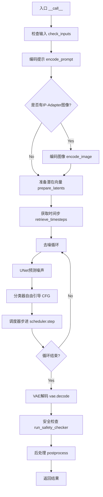
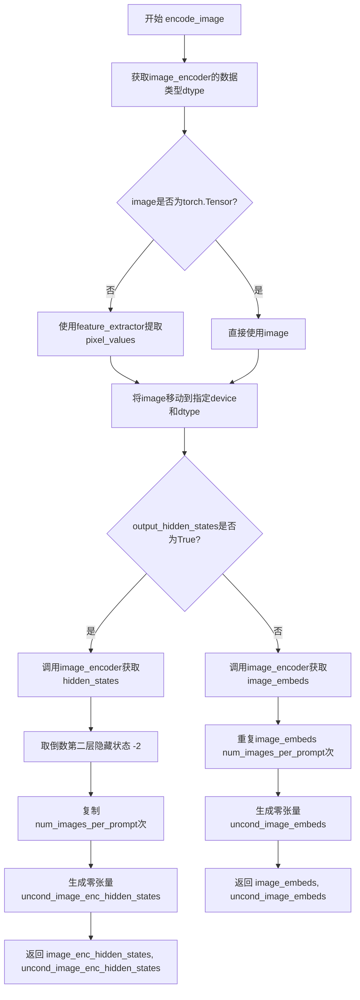
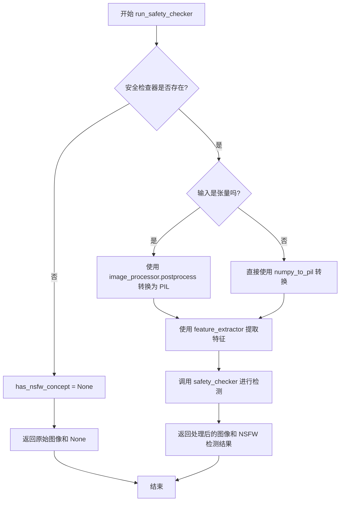
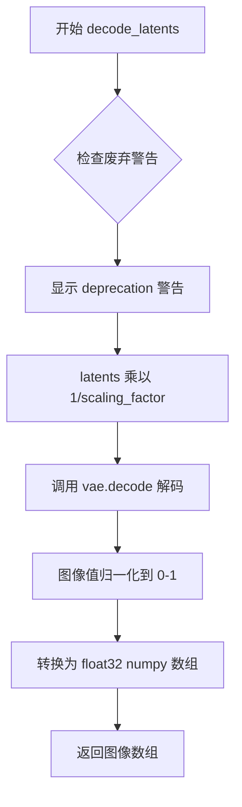
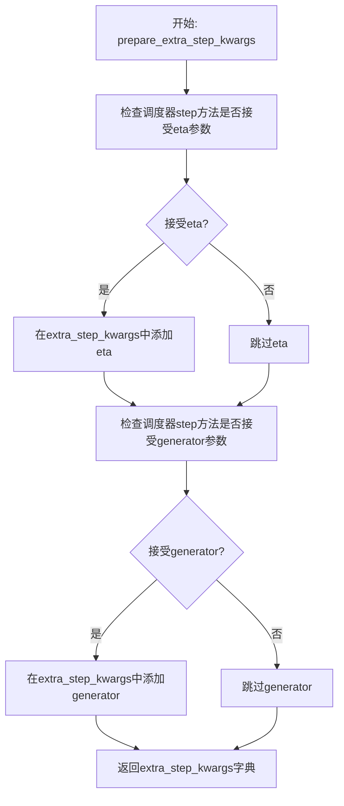
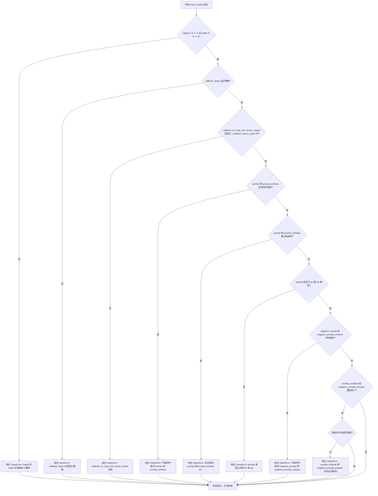
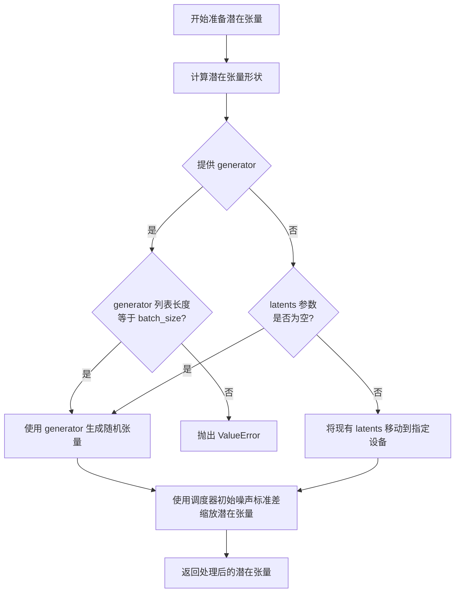

```mermaid
flowchart TD
    A[开始 __call__] --> B[设置默认高度和宽度]
    B --> C[检查输入参数 check_inputs]
    C --> D[定义批次大小和设备]
    D --> E[编码提示词 encode_prompt]
    E --> F{是否使用分类器自由引导?}
    F -->|是| G[拼接负面和正面提示词嵌入]
    F -->|否| H[跳过拼接]
    G --> I{是否有IP-Adapter图像?}
    H --> I
    I -->|是| J[编码图像 embed_image]
    I -->|否| K[准备时间步 retrieve_timesteps]
    J --> K
    K --> L[准备潜在变量 prepare_latents]
    L --> M[准备额外步骤参数 prepare_extra_step_kwargs]
    M --> N{是否有时间条件嵌入?}
    N -->|是| O[计算引导比例嵌入]
    N -->|否| P[开始去噪循环]
    O --> P
    P --> Q[展开潜在变量用于CFguidance]
    Q --> R[缩放潜在变量输入]
    R --> S[UNet预测噪声残差]
    S --> T{是否使用CF引导?}
    T -->|是| U[计算分类器自由引导噪声]
    T -->|否| V[计算上一步]
    U --> W{是否需要引导重缩放?}
    W -->|是| X[重缩放噪声配置]
    W -->|否| V
    X --> V
    V --> Y[调度器步进计算上一步潜在变量]
    Y --> Z{是否有回调函数?}
    Z -->|是| AA[执行回调 on_step_end]
    Z -->|否| AB{是否完成所有步骤?}
    AA --> AB
    AB -->|否| Q
    AB -->|是| AC{输出类型是latent?}
    AC -->|否| AD[VAE解码潜在变量]
    AC -->|是| AE[直接使用潜在变量]
    AD --> AF[运行安全检查器]
    AE --> AF
    AF --> AG[后处理图像]
    AG --> AH[释放模型钩子]
    AH --> AI{return_dict为True?}
    AI -->|是| AJ[返回PipelineOutput]
    AI -->|否| AK[返回元组]
    AJ --> AL[结束]
    AK --> AL
```

# `diffusers\src\diffusers\pipelines\deprecated\alt_diffusion\pipeline_alt_diffusion.py` 详细设计文档

这是 AltDiffusion 的文本到图像生成管道实现，集成了预训练的 VAE、文本编码器 (RoBERTa)、UNet 和调度器，支持 LoRA、Textual Inversion 和 IP-Adapter 等扩展功能，并能通过安全检查器过滤不适当内容。

## 整体流程



## 类结构

```
DiffusionPipeline (基类)
├── StableDiffusionMixin
├── TextualInversionLoaderMixin
├── StableDiffusionLoraLoaderMixin
├── IPAdapterMixin
├── FromSingleFileMixin
└── AltDiffusionPipeline (主类)
```

## 全局变量及字段


### `logger`
    
模块级别的日志记录器，用于输出管道运行时的警告和信息

类型：`logging.Logger`
    


### `EXAMPLE_DOC_STRING`
    
示例文档字符串，包含使用AltDiffusionPipeline进行文本到图像生成的使用示例代码

类型：`str`
    


### `AltDiffusionPipeline.vae`
    
变分自编码器模型，用于将图像编码到潜在空间并从潜在表示解码生成图像

类型：`AutoencoderKL`
    


### `AltDiffusionPipeline.text_encoder`
    
RoBERTa系列文本编码器，用于将文本提示转换为高维嵌入向量供UNet使用

类型：`RobertaSeriesModelWithTransformation`
    


### `AltDiffusionPipeline.tokenizer`
    
多语言RoBERTa分词器，用于将文本字符串 tokenize 为模型可处理的整数序列

类型：`XLMRobertaTokenizer`
    


### `AltDiffusionPipeline.unet`
    
条件2D UNet模型，在扩散过程中基于时间步和文本嵌入预测噪声残差

类型：`UNet2DConditionModel`
    


### `AltDiffusionPipeline.scheduler`
    
Karras扩散调度器，管理噪声调度和去噪步骤的时间步更新逻辑

类型：`KarrasDiffusionSchedulers`
    


### `AltDiffusionPipeline.safety_checker`
    
图像安全检查器，用于检测和过滤可能包含不适当内容的生成图像

类型：`StableDiffusionSafetyChecker`
    


### `AltDiffusionPipeline.feature_extractor`
    
CLIP图像特征提取器，用于从图像中提取特征向量供安全检查器使用

类型：`CLIPImageProcessor`
    


### `AltDiffusionPipeline.image_encoder`
    
可选的CLIP视觉编码器，用于IP-Adapter图像提示的特征提取和投影

类型：`CLIPVisionModelWithProjection`
    


### `AltDiffusionPipeline.vae_scale_factor`
    
VAE缩放因子，基于VAE块输出通道数计算，用于调整潜在空间与像素空间的尺寸对应关系

类型：`int`
    


### `AltDiffusionPipeline.image_processor`
    
VAE图像处理器，用于图像的预处理和后处理，包括归一化、反归一化和格式转换

类型：`VaeImageProcessor`
    
    

## 全局函数及方法


### `rescale_noise_cfg`

该函数用于根据 `guidance_rescale` 参数重新缩放噪声配置张量，以提高图像质量并修复过度曝光问题。该方法基于论文 "Common Diffusion Noise Schedules and Sample Steps are Flawed" 第 3.4 节的技术实现，通过计算文本预测噪声和配置噪声的标准差来进行归一化缩放，然后使用 `guidance_rescale` 因子混合原始噪声和缩放后的噪声，以避免生成"平淡"的图像。

参数：

- `noise_cfg`：`torch.Tensor`，引导扩散过程中预测的噪声张量
- `noise_pred_text`：`torch.Tensor`，文本引导扩散过程中预测的噪声张量
- `guidance_rescale`：`float`，可选参数，默认为 0.0应用于噪声预测的重缩放因子

返回值：`torch.Tensor`，重缩放后的噪声预测张量

#### 流程图

```mermaid
flowchart TD
    A[开始] --> B[计算noise_pred_text的标准差 std_text]
    B --> C[计算noise_cfg的标准差 std_cfg]
    C --> D[计算缩放后的噪声预测 noise_pred_rescaled = noise_cfg * std_text / std_cfg]
    D --> E[计算最终噪声配置 noise_cfg = guidance_rescale * noise_pred_rescaled + (1 - guidance_rescale) * noise_cfg]
    E --> F[返回重缩放后的noise_cfg]
```

#### 带注释源码

```python
def rescale_noise_cfg(noise_cfg, noise_pred_text, guidance_rescale=0.0):
    r"""
    Rescales `noise_cfg` tensor based on `guidance_rescale` to improve image quality and fix overexposure. Based on
    Section 3.4 from [Common Diffusion Noise Schedules and Sample Steps are
    Flawed](https://huggingface.co/papers/2305.08891).

    Args:
        noise_cfg (`torch.Tensor`):
            The predicted noise tensor for the guided diffusion process.
        noise_pred_text (`torch.Tensor`):
            The predicted noise tensor for the text-guided diffusion process.
        guidance_rescale (`float`, *optional*, defaults to 0.0):
            A rescale factor applied to the noise predictions.

    Returns:
        noise_cfg (`torch.Tensor`): The rescaled noise prediction tensor.
    """
    # 计算文本预测噪声在除批次维度外的所有维度上的标准差
    std_text = noise_pred_text.std(dim=list(range(1, noise_pred_text.ndim)), keepdim=True)
    # 计算噪声配置在除批次维度外的所有维度上的标准差
    std_cfg = noise_cfg.std(dim=list(range(1, noise_cfg.ndim)), keepdim=True)
    # 使用文本预测噪声的标准差对噪声配置进行重新缩放，以修复过度曝光问题
    noise_pred_rescaled = noise_cfg * (std_text / std_cfg)
    # 通过guidance_rescale因子混合原始噪声预测和缩放后的噪声预测，避免生成"平淡"的图像
    noise_cfg = guidance_rescale * noise_pred_rescaled + (1 - guidance_rescale) * noise_cfg
    return noise_cfg
```


### `retrieve_timesteps`

检索时间步是一个全局函数，用于调用调度器的 `set_timesteps` 方法并从调度器中检索时间步。它处理自定义时间步，并将任何 kwargs 传递给调度器的 `set_timesteps` 方法。

参数：

-  `scheduler`：`SchedulerMixin`，要获取时间步的调度器
-  `num_inference_steps`：`int | None`，使用预训练模型生成样本时使用的扩散步数。如果使用此参数，`timesteps` 必须为 `None`
-  `device`：`str | torch.device | None`，时间步应移动到的设备。如果为 `None`，则不移动时间步
-  `timesteps`：`list[int] | None`，用于覆盖调度器时间步间隔策略的自定义时间步。如果传入 `timesteps`，则 `num_inference_steps` 和 `sigmas` 必须为 `None`
-  `sigmas`：`list[float] | None`，用于覆盖调度器时间步间隔策略的自定义 sigmas。如果传入 `sigmas`，则 `num_inference_steps` 和 `timesteps` 必须为 `None`
-  `**kwargs`：任意关键字参数，将传递给 `scheduler.set_timesteps`

返回值：`tuple[torch.Tensor, int]`，元组第一个元素是调度器的时间步计划，第二个元素是推理步数

#### 流程图

```mermaid
flowchart TD
    A[开始] --> B{检查timesteps和sigmas是否同时传入}
    B -->|是| C[抛出ValueError: 只能选择timesteps或sigmas之一]
    B -->|否| D{是否传入timesteps?}
    D -->|是| E{scheduler.set_timesteps是否接受timesteps参数?}
    D -->|否| F{是否传入sigmas?}
    E -->|是| G[调用scheduler.set_timesteps timesteps=timesteps device=device kwargs]
    E -->|否| H[抛出ValueError: 当前调度器不支持自定义timesteps]
    F -->|是| I{scheduler.set_timesteps是否接受sigmas参数?}
    F -->|否| J[调用scheduler.set_timesteps num_inference_steps device]
    I -->|是| K[调用scheduler.set_timesteps sigmas=sigmas device=device kwargs]
    I -->|否| L[抛出ValueError: 当前调度器不支持自定义sigmas]
    G --> M[获取scheduler.timesteps]
    K --> M
    J --> M
    M --> N[计算num_inference_steps = len(timesteps)]
    N --> O[返回timesteps和num_inference_steps]
    O --> P[结束]
```

#### 带注释源码

```python
# Copied from diffusers.pipelines.stable_diffusion.pipeline_stable_diffusion.retrieve_timesteps
def retrieve_timesteps(
    scheduler,  # SchedulerMixin: 调度器对象，用于获取时间步
    num_inference_steps: int | None = None,  # int | None: 推理步数，如果使用则timesteps必须为None
    device: str | torch.device | None = None,  # str | torch.device | None: 设备，如果为None则不移动时间步
    timesteps: list[int] | None = None,  # list[int] | None: 自定义时间步，传入则num_inference_steps和sigmas必须为None
    sigmas: list[float] | None = None,  # list[float] | None: 自定义sigmas，传入则num_inference_steps和timesteps必须为None
    **kwargs,  # 任意关键字参数，传递给scheduler.set_timesteps
):
    r"""
    Calls the scheduler's `set_timesteps` method and retrieves timesteps from the scheduler after the call. Handles
    custom timesteps. Any kwargs will be supplied to `scheduler.set_timesteps`.

    Args:
        scheduler (`SchedulerMixin`):
            The scheduler to get timesteps from.
        num_inference_steps (`int`):
            The number of diffusion steps used when generating samples with a pre-trained model. If used, `timesteps`
            must be `None`.
        device (`str` or `torch.device`, *optional*):
            The device to which the timesteps should be moved to. If `None`, the timesteps are not moved.
        timesteps (`list[int]`, *optional*):
            Custom timesteps used to override the timestep spacing strategy of the scheduler. If `timesteps` is passed,
            `num_inference_steps` and `sigmas` must be `None`.
        sigmas (`list[float]`, *optional*):
            Custom sigmas used to override the timestep spacing strategy of the scheduler. If `sigmas` is passed,
            `num_inference_steps` and `timesteps` must be `None`.

    Returns:
        `tuple[torch.Tensor, int]`: A tuple where the first element is the timestep schedule from the scheduler and the
        second element is the number of inference steps.
    """
    # 校验：timesteps和sigmas不能同时传入
    if timesteps is not None and sigmas is not None:
        raise ValueError("Only one of `timesteps` or `sigmas` can be passed. Please choose one to set custom values")
    
    # 处理自定义timesteps
    if timesteps is not None:
        # 检查调度器是否支持timesteps参数
        accepts_timesteps = "timesteps" in set(inspect.signature(scheduler.set_timesteps).parameters.keys())
        if not accepts_timesteps:
            raise ValueError(
                f"The current scheduler class {scheduler.__class__}'s `set_timesteps` does not support custom"
                f" timestep schedules. Please check whether you are using the correct scheduler."
            )
        # 调用调度器的set_timesteps方法设置自定义timesteps
        scheduler.set_timesteps(timesteps=timesteps, device=device, **kwargs)
        # 从调度器获取时间步
        timesteps = scheduler.timesteps
        # 计算推理步数
        num_inference_steps = len(timesteps)
    # 处理自定义sigmas
    elif sigmas is not None:
        # 检查调度器是否支持sigmas参数
        accept_sigmas = "sigmas" in set(inspect.signature(scheduler.set_timesteps).parameters.keys())
        if not accept_sigmas:
            raise ValueError(
                f"The current scheduler class {scheduler.__class__}'s `set_timesteps` does not support custom"
                f" sigmas schedules. Please check whether you are using the correct scheduler."
            )
        # 调用调度器的set_timesteps方法设置自定义sigmas
        scheduler.set_timesteps(sigmas=sigmas, device=device, **kwargs)
        # 从调度器获取时间步
        timesteps = scheduler.timesteps
        # 计算推理步数
        num_inference_steps = len(timesteps)
    # 默认行为：使用num_inference_steps
    else:
        scheduler.set_timesteps(num_inference_steps, device=device, **kwargs)
        timesteps = scheduler.timesteps
    
    # 返回时间步和推理步数
    return timesteps, num_inference_steps
```


### AltDiffusionPipeline.__init__

初始化 AltDiffusionPipeline 管道，验证并配置各个组件（VAE、文本编码器、UNet、调度器、安全检查器等），同时处理潜在的弃用警告和配置兼容性调整。

参数：

- `vae`：`AutoencoderKL`，变分自编码器模型，用于将图像编码和解码到潜在表示
- `text_encoder`：`RobertaSeriesModelWithTransformation`，冻结的文本编码器，用于将文本提示转换为嵌入向量
- `tokenizer`：`XLMRobertaTokenizer`，XLM-RoBERTa 分词器，用于对文本进行分词
- `unet`：`UNet2DConditionModel`，条件 UNet 模型，用于对编码后的图像潜在表示进行去噪
- `scheduler`：`KarrasDiffusionSchedulers`，扩散调度器，用于与 unet 结合进行去噪
- `safety_checker`：`StableDiffusionSafetyChecker`，安全检查器，用于评估生成图像是否包含不当内容
- `feature_extractor`：`CLIPImageProcessor`，CLIP 图像处理器，用于从生成的图像中提取特征
- `image_encoder`：`CLIPVisionModelWithProjection`，可选的图像编码器，用于 IP-Adapter
- `requires_safety_checker`：`bool`，是否需要安全检查器，默认为 True

返回值：`None`，构造函数无返回值，直接初始化管道实例

#### 流程图

```mermaid
flowchart TD
    A[开始 __init__] --> B[调用 super().__init__]
    B --> C{scheduler.config.steps_offset != 1?}
    C -->|是| D[发出弃用警告并重置 steps_offset 为 1]
    C -->|否| E{scheduler.config.clip_sample == True?}
    D --> E
    E -->|是| F[发出弃用警告并设置 clip_sample 为 False]
    E -->|否| G{safety_checker is None and requires_safety_checker?}
    G -->|是| H[发出安全检查器禁用的警告]
    G -->|否| I{safety_checker is not None and feature_extractor is None?}
    I -->|是| J[抛出 ValueError: 必须定义 feature_extractor]
    I -->|否| K{UNet version < 0.9.0 且 sample_size < 64?}
    H --> K
    K -->|是| L[发出弃用警告并设置 sample_size 为 64]
    K -->|否| M[调用 self.register_modules 注册所有模块]
    L --> M
    M --> N[计算并设置 vae_scale_factor]
    N --> O[初始化 VaeImageProcessor]
    P[调用 self.register_to_config 注册配置]
    O --> P
    P --> Q[结束 __init__]
```

#### 带注释源码

```
def __init__(
    self,
    vae: AutoencoderKL,                                              # VAE 模型
    text_encoder: RobertaSeriesModelWithTransformation,            # 文本编码器
    tokenizer: XLMRobertaTokenizer,                                 # 分词器
    unet: UNet2DConditionModel,                                     # UNet 去噪模型
    scheduler: KarrasDiffusionSchedulers,                           # 扩散调度器
    safety_checker: StableDiffusionSafetyChecker,                   # 安全检查器
    feature_extractor: CLIPImageProcessor,                          # 特征提取器
    image_encoder: CLIPVisionModelWithProjection = None,            # 可选图像编码器
    requires_safety_checker: bool = True,                           # 是否需要安全检查
):
    # 调用父类构造函数，初始化基础管道设施
    super().__init__()

    # 检查并修复 scheduler 的 steps_offset 配置（兼容旧版本）
    if scheduler is not None and getattr(scheduler.config, "steps_offset", 1) != 1:
        deprecation_message = (
            f"The configuration file of this scheduler: {scheduler} is outdated. `steps_offset`"
            f" should be set to 1 instead of {scheduler.config.steps_offset}. Please make sure "
            "to update the config accordingly as leaving `steps_offset` might led to incorrect results"
            " in future versions. If you have downloaded this checkpoint from the Hugging Face Hub,"
            " it would be very nice if you could open a Pull request for the `scheduler/scheduler_config.json`"
            " file"
        )
        deprecate("steps_offset!=1", "1.0.0", deprecation_message, standard_warn=False)
        new_config = dict(scheduler.config)
        new_config["steps_offset"] = 1
        scheduler._internal_dict = FrozenDict(new_config)

    # 检查并修复 scheduler 的 clip_sample 配置（兼容旧版本）
    if scheduler is not None and getattr(scheduler.config, "clip_sample", False) is True:
        deprecation_message = (
            f"The configuration file of this scheduler: {scheduler} has not set the configuration `clip_sample`."
            " `clip_sample` should be set to False in the configuration file. Please make sure to update the"
            " config accordingly as not setting `clip_sample` in the config might lead to incorrect results in"
            " future versions. If you have downloaded this checkpoint from the Hugging Face Hub, it would be very"
            " nice if you could open a Pull request for the `scheduler/scheduler_config.json` file"
        )
        deprecate("clip_sample not set", "1.0.0", deprecation_message, standard_warn=False)
        new_config = dict(scheduler.config)
        new_config["clip_sample"] = False
        scheduler._internal_dict = FrozenDict(new_config)

    # 如果禁用了安全检查器但要求启用，则发出警告
    if safety_checker is None and requires_safety_checker:
        logger.warning(
            f"You have disabled the safety checker for {self.__class__} by passing `safety_checker=None`. Ensure"
            " that you abide to the conditions of the Alt Diffusion license and do not expose unfiltered"
            " results in services or applications open to the public. Both the diffusers team and Hugging Face"
            " strongly recommend to keep the safety filter enabled in all public facing circumstances, disabling"
            " it only for use-cases that involve analyzing network behavior or auditing its results. For more"
            " information, please have a look at https://github.com/huggingface/diffusers/pull/254 ."
        )

    # 如果有安全检查器但没有特征提取器，抛出错误
    if safety_checker is not None and feature_extractor is None:
        raise ValueError(
            "Make sure to define a feature extractor when loading {self.__class__} if you want to use the safety"
            " checker. If you do not want to use the safety checker, you can pass `'safety_checker=None'` instead."
        )

    # 检查 UNet 配置是否需要更新（版本和 sample_size）
    is_unet_version_less_0_9_0 = (
        unet is not None
        and hasattr(unet.config, "_diffusers_version")
        and version.parse(version.parse(unet.config._diffusers_version).base_version) < version.parse("0.9.0.dev0")
    )
    is_unet_sample_size_less_64 = (
        unet is not None and hasattr(unet.config, "sample_size") and unet.config.sample_size < 64
    )
    if is_unet_version_less_0_9_0 and is_unet_sample_size_less_64:
        deprecation_message = (
            "The configuration file of the unet has set the default `sample_size` to smaller than"
            " 64 which seems highly unlikely. If your checkpoint is a fine-tuned version of any of the"
            " following: \n- CompVis/stable-diffusion-v1-4 \n- CompVis/stable-diffusion-v1-3 \n-"
            " CompVis/stable-diffusion-v1-2 \n- CompVis/stable-diffusion-v1-1 \n- stable-diffusion-v1-5/stable-diffusion-v1-5"
            " \n- stable-diffusion-v1-5/stable-diffusion-inpainting \n you should change 'sample_size' to 64 in the"
            " configuration file. Please make sure to update the config accordingly as leaving `sample_size=32`"
            " in the config might lead to incorrect results in future versions. If you have downloaded this"
            " checkpoint from the Hugging Face Hub, it would be very nice if you could open a Pull request for"
            " the `unet/config.json` file"
        )
        deprecate("sample_size<64", "1.0.0", deprecation_message, standard_warn=False)
        new_config = dict(unet.config)
        new_config["sample_size"] = 64
        unet._internal_dict = FrozenDict(new_config)

    # 注册所有模块到管道，使它们可以通过 self.xxx 访问
    self.register_modules(
        vae=vae,
        text_encoder=text_encoder,
        tokenizer=tokenizer,
        unet=unet,
        scheduler=scheduler,
        safety_checker=safety_checker,
        feature_extractor=feature_extractor,
        image_encoder=image_encoder,
    )

    # 计算 VAE 缩放因子，用于图像后处理
    self.vae_scale_factor = 2 ** (len(self.vae.config.block_out_channels) - 1) if getattr(self, "vae", None) else 8

    # 初始化图像处理器
    self.image_processor = VaeImageProcessor(vae_scale_factor=self.vae_scale_factor)

    # 注册配置参数
    self.register_to_config(requires_safety_checker=requires_safety_checker)
```


### AltDiffusionPipeline.encode_prompt

该方法负责将文本提示编码为文本编码器的隐藏状态，是扩散模型文本到图像生成过程中的关键步骤。它处理正面提示和负面提示，支持批量生成、LoRA权重调整、文本反转以及通过clip_skip参数控制CLIP模型的隐藏层输出，同时为无分类器自由引导（CFG）准备无条件嵌入。

参数：

- `prompt`：`str | list[str] | None`，需要编码的文本提示，可以是单个字符串或字符串列表
- `device`：`torch.device`，指定计算设备（CPU/CUDA）
- `num_images_per_prompt`：`int`，每个提示词生成的图像数量，用于批量处理
- `do_classifier_free_guidance`：`bool`，是否启用无分类器自由引导 guidance
- `negative_prompt`：`str | list[str] | None`，负面提示词，用于引导模型避免生成不希望的内容
- `prompt_embeds`：`torch.Tensor | None`，预生成的提示嵌入，如果提供则直接使用而不从prompt生成
- `negative_prompt_embeds`：`torch.Tensor | None`，预生成的负面提示嵌入
- `lora_scale`：`float | None`，LoRA权重缩放因子，用于调整LoRA层的影响程度
- `clip_skip`：`int | None`，CLIP模型中跳过的层数，用于控制嵌入的特征层级

返回值：`tuple[torch.Tensor, torch.Tensor]`，返回两个张量——编码后的提示嵌入和负面提示嵌入，用于后续的扩散模型去噪过程

#### 流程图

```mermaid
flowchart TD
    A[开始 encode_prompt] --> B{检查 lora_scale}
    B -->|非None| C[设置 LoRA scale]
    B -->|None| D[跳过 LoRA 设置]
    C --> D
    D --> E{确定 batch_size}
    E -->|prompt 是 str| F[batch_size = 1]
    E -->|prompt 是 list| G[batch_size = len prompt]
    E -->|其他| H[使用 prompt_embeds.shape[0]]
    F --> I
    G --> I
    H --> I
    I{prompt_embeds 为空?}
    I -->|是| J{检查 TextualInversion}
    I -->|否| K[直接使用 prompt_embeds]
    J -->|是| L[maybe_convert_prompt]
    J -->|否| M[跳过转换]
    L --> N[tokenizer 分词]
    M --> N
    N --> O[tokenize: padding, truncation]
    O --> P{检查 attention_mask}
    P -->|需要| Q[使用文本输入的 attention_mask]
    P -->|不需要| R[attention_mask = None]
    Q --> S
    R --> S
    S{clip_skip 为空?}
    S -->|是| T[text_encoder 前向传播]
    S -->|否| U[output_hidden_states=True]
    U --> V[提取指定层的 hidden states]
    V --> W[应用 final_layer_norm]
    T --> X
    W --> X
    X --> Y[转换为正确 dtype 和 device]
    Y --> Z[重复嵌入以匹配 num_images_per_prompt]
    Z --> AA{需要 CFG?}
    AA -->|是| BB{negative_prompt_embeds 为空?}
    AA -->|否| KK[直接返回]
    BB -->|是| CC[处理 negative_prompt]
    BB -->|否| DD[使用提供的 negative_prompt_embeds]
    CC --> EE[tokenize negative_prompt]
    EE --> FF[text_encoder 编码]
    FF --> GG[转换 dtype 和 device]
    DD --> HH[使用提供的 embeds]
    HH --> GG
    GG --> II[重复 negative embeds]
    II --> JJ[应用 unscale LoRA 如果需要]
    JJ --> KK[返回 prompt_embeds, negative_prompt_embeds]
```

#### 带注释源码

```python
def encode_prompt(
    self,
    prompt,
    device,
    num_images_per_prompt,
    do_classifier_free_guidance,
    negative_prompt=None,
    prompt_embeds: torch.Tensor | None = None,
    negative_prompt_embeds: torch.Tensor | None = None,
    lora_scale: float | None = None,
    clip_skip: int | None = None,
):
    r"""
    Encodes the prompt into text encoder hidden states.

    Args:
        prompt (`str` or `list[str]`, *optional*):
            prompt to be encoded
        device: (`torch.device`):
            torch device
        num_images_per_prompt (`int`):
            number of images that should be generated per prompt
        do_classifier_free_guidance (`bool`):
            whether to use classifier free guidance or not
        negative_prompt (`str` or `list[str]`, *optional*):
            The prompt or prompts not to guide the image generation. If not defined, one has to pass
            `negative_prompt_embeds` instead. Ignored when not using guidance (i.e., ignored if `guidance_scale` is
            less than `1`).
        prompt_embeds (`torch.Tensor`, *optional*):
            Pre-generated text embeddings. Can be used to easily tweak text inputs, *e.g.* prompt weighting. If not
            provided, text embeddings will be generated from `prompt` input argument.
        negative_prompt_embeds (`torch.Tensor`, *optional*):
            Pre-generated negative text embeddings. Can be used to easily tweak text inputs, *e.g.* prompt
            weighting. If not provided, negative_prompt_embeds will be generated from `negative_prompt` input
            argument.
        lora_scale (`float`, *optional*):
            A LoRA scale that will be applied to all LoRA layers of the text encoder if LoRA layers are loaded.
        clip_skip (`int`, *optional*):
            Number of layers to be skipped from CLIP while computing the prompt embeddings. A value of 1 means that
            the output of the pre-final layer will be used for computing the prompt embeddings.
    """
    # 设置 lora scale，以便文本编码器的 monkey patched LoRA 函数可以正确访问
    if lora_scale is not None and isinstance(self, StableDiffusionLoraLoaderMixin):
        self._lora_scale = lora_scale

        # 动态调整 LoRA scale
        if not USE_PEFT_BACKEND:
            adjust_lora_scale_text_encoder(self.text_encoder, lora_scale)
        else:
            scale_lora_layers(self.text_encoder, lora_scale)

    # 确定 batch_size
    if prompt is not None and isinstance(prompt, str):
        batch_size = 1
    elif prompt is not None and isinstance(prompt, list):
        batch_size = len(prompt)
    else:
        batch_size = prompt_embeds.shape[0]

    # 如果没有提供 prompt_embeds，则从 prompt 生成
    if prompt_embeds is None:
        # 文本反转：如有需要处理多向量 token
        if isinstance(self, TextualInversionLoaderMixin):
            prompt = self.maybe_convert_prompt(prompt, self.tokenizer)

        # 使用 tokenizer 进行分词
        text_inputs = self.tokenizer(
            prompt,
            padding="max_length",
            max_length=self.tokenizer.model_max_length,
            truncation=True,
            return_tensors="pt",
        )
        text_input_ids = text_inputs.input_ids
        
        # 获取未截断的 token IDs 用于检查
        untruncated_ids = self.tokenizer(prompt, padding="longest", return_tensors="pt").input_ids

        # 检查是否发生截断并警告
        if untruncated_ids.shape[-1] >= text_input_ids.shape[-1] and not torch.equal(
            text_input_ids, untruncated_ids
        ):
            removed_text = self.tokenizer.batch_decode(
                untruncated_ids[:, self.tokenizer.model_max_length - 1 : -1]
            )
            logger.warning(
                "The following part of your input was truncated because CLIP can only handle sequences up to"
                f" {self.tokenizer.model_max_length} tokens: {removed_text}"
            )

        # 处理 attention mask
        if hasattr(self.text_encoder.config, "use_attention_mask") and self.text_encoder.config.use_attention_mask:
            attention_mask = text_inputs.attention_mask.to(device)
        else:
            attention_mask = None

        # 根据 clip_skip 参数决定如何获取文本嵌入
        if clip_skip is None:
            # 直接获取文本编码器输出
            prompt_embeds = self.text_encoder(text_input_ids.to(device), attention_mask=attention_mask)
            prompt_embeds = prompt_embeds[0]
        else:
            # 获取所有隐藏状态以便跳过某些层
            prompt_embeds = self.text_encoder(
                text_input_ids.to(device), attention_mask=attention_mask, output_hidden_states=True
            )
            # 访问 hidden_states 元组，获取指定层的隐藏状态
            prompt_embeds = prompt_embeds[-1][-(clip_skip + 1)]
            # 应用 final_layer_norm 以保持表示的完整性
            prompt_embeds = self.text_encoder.text_model.final_layer_norm(prompt_embeds)

    # 确定 prompt_embeds 的数据类型
    if self.text_encoder is not None:
        prompt_embeds_dtype = self.text_encoder.dtype
    elif self.unet is not None:
        prompt_embeds_dtype = self.unet.dtype
    else:
        prompt_embeds_dtype = prompt_embeds.dtype

    # 转换数据类型和设备
    prompt_embeds = prompt_embeds.to(dtype=prompt_embeds_dtype, device=device)

    # 为每个提示生成的图像数量复制文本嵌入
    bs_embed, seq_len, _ = prompt_embeds.shape
    # 使用 mps 友好的方法复制文本嵌入
    prompt_embeds = prompt_embeds.repeat(1, num_images_per_prompt, 1)
    prompt_embeds = prompt_embeds.view(bs_embed * num_images_per_prompt, seq_len, -1)

    # 为无分类器自由引导获取无条件嵌入
    if do_classifier_free_guidance and negative_prompt_embeds is None:
        uncond_tokens: list[str]
        
        # 处理负面提示的不同情况
        if negative_prompt is None:
            uncond_tokens = [""] * batch_size
        elif prompt is not None and type(prompt) is not type(negative_prompt):
            raise TypeError(
                f"`negative_prompt` should be the same type to `prompt`, but got {type(negative_prompt)} !="
                f" {type(prompt)}."
            )
        elif isinstance(negative_prompt, str):
            uncond_tokens = [negative_prompt]
        elif batch_size != len(negative_prompt):
            raise ValueError(
                f"`negative_prompt`: {negative_prompt} has batch size {len(negative_prompt)}, but `prompt`:"
                f" {prompt} has batch size {batch_size}. Please make sure that passed `negative_prompt` matches"
                " the batch size of `prompt`."
            )
        else:
            uncond_tokens = negative_prompt

        # 文本反转：如有需要处理多向量 token
        if isinstance(self, TextualInversionLoaderMixin):
            uncond_tokens = self.maybe_convert_prompt(uncond_tokens, self.tokenizer)

        # 对负面提示进行 tokenize
        max_length = prompt_embeds.shape[1]
        uncond_input = self.tokenizer(
            uncond_tokens,
            padding="max_length",
            max_length=max_length,
            truncation=True,
            return_tensors="pt",
        )

        # 处理 attention mask
        if hasattr(self.text_encoder.config, "use_attention_mask") and self.text_encoder.config.use_attention_mask:
            attention_mask = uncond_input.attention_mask.to(device)
        else:
            attention_mask = None

        # 编码无条件嵌入
        negative_prompt_embeds = self.text_encoder(
            uncond_input.input_ids.to(device),
            attention_mask=attention_mask,
        )
        negative_prompt_embeds = negative_prompt_embeds[0]

    # 如果使用 CFG，复制无条件嵌入
    if do_classifier_free_guidance:
        # 使用 mps 友好的方法复制无条件嵌入
        seq_len = negative_prompt_embeds.shape[1]

        negative_prompt_embeds = negative_prompt_embeds.to(dtype=prompt_embeds_dtype, device=device)

        negative_prompt_embeds = negative_prompt_embeds.repeat(1, num_images_per_prompt, 1)
        negative_prompt_embeds = negative_prompt_embeds.view(batch_size * num_images_per_prompt, seq_len, -1)

    # 如果使用了 PEFT backend，恢复 LoRA 层的原始缩放
    if isinstance(self, StableDiffusionLoraLoaderMixin) and USE_PEFT_BACKEND:
        # 通过取消缩放 LoRA 层来检索原始缩放
        unscale_lora_layers(self.text_encoder, lora_scale)

    return prompt_embeds, negative_prompt_embeds
```


### `AltDiffusionPipeline.encode_image`

编码输入图像以用于IP-Adapter图像提示，通过image_encoder提取图像特征或隐藏状态，并根据num_images_per_prompt复制图像嵌入以支持批量生成，返回条件图像嵌入和无条件（零）图像嵌入用于分类器自由引导。

参数：

- `image`：`PipelineImageInput`，需要编码的输入图像，支持多种格式（PIL图像、numpy数组、torch.Tensor等）
- `device`：`torch.device`，图像编码时使用的目标设备
- `num_images_per_prompt`：`int`，每个提示生成的图像数量，用于复制图像嵌入
- `output_hidden_states`：`bool | None`，是否返回图像编码器的隐藏状态而非图像嵌入，默认为None

返回值：`tuple[torch.Tensor, torch.Tensor]`，包含条件图像嵌入（或隐藏状态）和无条件（零）图像嵌入的元组

#### 流程图



#### 带注释源码

```python
def encode_image(self, image, device, num_images_per_prompt, output_hidden_states=None):
    """
    编码输入图像用于IP-Adapter图像提示功能
    
    Args:
        image: 输入图像，支持PIL图像、numpy数组或torch.Tensor
        device: 目标设备
        num_images_per_prompt: 每个提示生成的图像数量
        output_hidden_states: 是否输出隐藏状态而非图像嵌入
    
    Returns:
        tuple: (条件嵌入, 无条件嵌入)
    """
    # 获取image_encoder模型参数的数据类型，用于后续的类型转换
    dtype = next(self.image_encoder.parameters()).dtype

    # 如果输入不是torch.Tensor，则使用feature_extractor提取特征
    # 将各种图像格式转换为模型所需的pixel_values张量
    if not isinstance(image, torch.Tensor):
        image = self.feature_extractor(image, return_tensors="pt").pixel_values

    # 将图像移动到指定设备并转换为正确的dtype
    image = image.to(device=device, dtype=dtype)
    
    # 根据output_hidden_states参数选择不同的处理路径
    if output_hidden_states:
        # 路径1：返回隐藏状态（用于更细粒度的图像条件）
        
        # 获取图像编码器的倒数第二层隐藏状态
        # 选择-2层而非最后一层，通常包含更丰富的视觉特征
        image_enc_hidden_states = self.image_encoder(image, output_hidden_states=True).hidden_states[-2]
        
        # 沿batch维度重复，以匹配num_images_per_prompt
        image_enc_hidden_states = image_enc_hidden_states.repeat_interleave(num_images_per_prompt, dim=0)
        
        # 生成零张量作为无条件图像嵌入（用于classifier-free guidance）
        uncond_image_enc_hidden_states = self.image_encoder(
            torch.zeros_like(image), output_hidden_states=True
        ).hidden_states[-2]
        uncond_image_enc_hidden_states = uncond_image_enc_hidden_states.repeat_interleave(
            num_images_per_prompt, dim=0
        )
        
        # 返回条件和无条件隐藏状态
        return image_enc_hidden_states, uncond_image_enc_hidden_states
    else:
        # 路径2：返回图像嵌入（默认行为）
        
        # 获取图像嵌入向量
        image_embeds = self.image_encoder(image).image_embeds
        
        # 重复以匹配生成的图像数量
        image_embeds = image_embeds.repeat_interleave(num_images_per_prompt, dim=0)
        
        # 创建零张量作为无条件图像嵌入（用于无图像引导）
        uncond_image_embeds = torch.zeros_like(image_embeds)

        # 返回条件和无条件图像嵌入
        return image_embeds, uncond_image_embeds
```


### `AltDiffusionPipeline.run_safety_checker`

执行安全检查器，对生成的图像进行 NSFW（不适合在工作场所查看的内容）检测，确保输出内容符合安全标准。

参数：

- `self`：`AltDiffusionPipeline`，Pipeline 实例本身（隐含参数）
- `image`：`torch.Tensor | List[Image]`，需要进行安全检查的图像数据，可以是 PyTorch 张量或图像列表
- `device`：`torch.device`，用于执行安全检查的设备（如 CPU 或 CUDA 设备）
- `dtype`：`torch.dtype`，图像数据的数据类型（如 float32、float16）

返回值：`(torch.Tensor | List[Image], torch.Tensor | None)`，返回一个元组：
  - 第一个元素是经过安全检查处理后的图像（可能被修改为模糊或黑色图像）
  - 第二个元素是一个布尔张量，表示每个图像是否包含 NSFW 内容；如果安全检查器为 None，则返回 None

#### 流程图



#### 带注释源码

```python
def run_safety_checker(self, image, device, dtype):
    """
    对生成的图像运行安全检查器，检测是否包含不当内容
    
    Args:
        image: 需要检查的图像，可以是 torch.Tensor 或 Python 图像对象列表
        device: 运行安全检查的设备
        dtype: 输入数据类型
    
    Returns:
        tuple: (处理后的图像, NSFW检测结果)
            - 如果 safety_checker 为 None，则返回 (原始图像, None)
            - 否则返回 (处理后的图像, NSFW布尔张量)
    """
    # 检查安全检查器是否已配置
    if self.safety_checker is None:
        # 未配置安全检查器，跳过检查
        has_nsfw_concept = None
    else:
        # 将图像转换为特征提取器所需的格式
        if torch.is_tensor(image):
            # 如果是 PyTorch 张量，使用后处理器转换为 PIL 图像
            feature_extractor_input = self.image_processor.postprocess(image, output_type="pil")
        else:
            # 如果是其他格式（如 numpy 数组），直接转换为 PIL 图像
            feature_extractor_input = self.image_processor.numpy_to_pil(image)
        
        # 使用特征提取器处理图像，提取 CLIP 特征
        safety_checker_input = self.feature_extractor(feature_extractor_input, return_tensors="pt").to(device)
        
        # 调用安全检查器模型，检测图像是否包含 NSFW 内容
        # clip_input 使用指定的数据类型进行推理
        image, has_nsfw_concept = self.safety_checker(
            images=image, 
            clip_input=safety_checker_input.pixel_values.to(dtype)
        )
    
    # 返回处理后的图像和 NSFW 检测结果
    return image, has_nsfw_concept
```


### AltDiffusionPipeline.decode_latents

该方法用于将 VAE 编码后的潜在向量解码为可视化图像，已被标记为废弃方法，将在 1.0.0 版本中移除，建议使用 VaeImageProcessor.postprocess(...) 代替。

参数：

- `self`：`AltDiffusionPipeline` 实例，pipeline 对象本身
- `latents`：`torch.Tensor`，从 VAE 编码器输出的潜在向量张量，包含经过 VAE 压缩的图像潜在表示

返回值：`numpy.ndarray`，解码后的图像数组，形状为 (batch_size, height, width, channels)，像素值范围 [0, 1]

#### 流程图



#### 带注释源码

```python
def decode_latents(self, latents):
    """
    将潜在向量解码为可视化图像（已废弃）
    
    Args:
        latents: VAE 编码后的潜在向量张量
    """
    # 记录废弃警告，提示用户未来版本将移除此方法
    deprecation_message = "The decode_latents method is deprecated and will be removed in 1.0.0. Please use VaeImageProcessor.postprocess(...) instead"
    deprecate("decode_latents", "1.0.0", deprecation_message, standard_warn=False)

    # 反缩放潜在向量，将其恢复到原始尺度
    # VAE 在编码时会对潜在向量进行缩放（乘以 scaling_factor），解码时需要逆向操作
    latents = 1 / self.vae.config.scaling_factor * latents
    
    # 使用 VAE 解码器将潜在向量解码为图像
    # return_dict=False 返回元组，取第一个元素（解码后的图像张量）
    image = self.vae.decode(latents, return_dict=False)[0]
    
    # 将图像值从 [-1, 1] 范围归一化到 [0, 1] 范围
    # 这是因为训练时通常使用 [-1, 1] 范围的图像
    image = (image / 2 + 0.5).clamp(0, 1)
    
    # 将图像从 PyTorch 张量转换为 NumPy 数组
    # 1. 移到 CPU（避免 GPU 内存占用）
    # 2. 调整维度顺序从 (B, C, H, W) 变为 (B, H, W, C)
    # 3. 转换为 float32（兼容 bfloat16，且不会造成显著性能开销）
    image = image.cpu().permute(0, 2, 3, 1).float().numpy()
    
    # 返回解码后的图像数组
    return image
```


### `AltDiffusionPipeline.prepare_extra_step_kwargs`

该方法用于准备调度器（scheduler）的额外参数。由于不同的调度器可能有不同的签名，该方法通过检查调度器的 `step` 方法是否接受特定参数（如 `eta` 和 `generator`），来动态构建需要传递给调度器的额外关键字参数字典。

参数：

- `self`：`AltDiffusionPipeline` 实例本身
- `generator`：`torch.Generator` 或 `list[torch.Generator]` 或 `None`，用于控制生成随机性的生成器对象
- `eta`：`float`，DDIM 调度器专用的 eta 参数（对应 DDIM 论文中的 η），取值范围 [0, 1]；其他调度器会忽略此参数

返回值：`dict`，包含调度器 `step` 方法所需额外参数（如 `eta` 和/或 `generator`）的字典

#### 流程图



#### 带注释源码

```python
def prepare_extra_step_kwargs(self, generator, eta):
    """
    准备调度器额外参数，因为并非所有调度器都具有相同的签名。
    eta (η) 仅在 DDIMScheduler 中使用，其他调度器会忽略它。
    eta 对应 DDIM 论文 (https://huggingface.co/papers/2010.02502) 中的 η，取值范围应为 [0, 1]。
    
    参数:
        generator: torch.Generator, 可选的随机生成器，用于确保生成的可复现性
        eta: float, DDIM 调度器的 eta 参数
    
    返回:
        dict: 包含调度器 step 方法所需额外参数（如 eta 和/或 generator）的字典
    """
    # 通过检查调度器的 step 方法签名来判断是否接受 eta 参数
    accepts_eta = "eta" in set(inspect.signature(self.scheduler.step).parameters.keys())
    extra_step_kwargs = {}
    if accepts_eta:
        extra_step_kwargs["eta"] = eta

    # 检查调度器是否接受 generator 参数
    accepts_generator = "generator" in set(inspect.signature(self.scheduler.step).parameters.keys())
    if accepts_generator:
        extra_step_kwargs["generator"] = generator
    
    return extra_step_kwargs
```


### AltDiffusionPipeline.check_inputs

该方法用于验证 `AltDiffusionPipeline` 的输入参数有效性，确保高度、宽度、提示词、嵌入向量等参数符合生成要求，若参数不符合规范则抛出相应的 `ValueError` 异常。

参数：

- `self`：`AltDiffusionPipeline` 实例本身
- `prompt`：`str | list[str] | None`，用于指导图像生成的文本提示，支持单字符串或字符串列表，默认为 `None`
- `height`：`int`，生成图像的像素高度，必须能被 8 整除
- `width`：`int`，生成图像的像素宽度，必须能被 8 整除
- `callback_steps`：`int`，回调函数的执行步数，必须为正整数
- `negative_prompt`：`str | list[str] | None`，负面提示词，用于指定生成图像时应避免的内容，默认为 `None`
- `prompt_embeds`：`torch.Tensor | None`，预生成的文本嵌入向量，默认为 `None`
- `negative_prompt_embeds`：`torch.Tensor | None`，预生成的负面文本嵌入向量，默认为 `None`
- `callback_on_step_end_tensor_inputs`：`list[str] | None`，在每个去噪步骤结束时回调函数需要接收的张量输入列表，默认为 `None`

返回值：`None`，该方法不返回任何值，仅进行参数验证和异常抛出

#### 流程图



#### 带注释源码

```python
def check_inputs(
    self,
    prompt,
    height,
    width,
    callback_steps,
    negative_prompt=None,
    prompt_embeds=None,
    negative_prompt_embeds=None,
    callback_on_step_end_tensor_inputs=None,
):
    """
    验证输入参数的合法性和一致性，确保生成过程能够正常执行。
    
    参数检查项包括：
    1. 图像尺寸必须能被 8 整除（与 VAE 的下采样率相关）
    2. callback_steps 必须为正整数
    3. callback_on_step_end_tensor_inputs 必须在允许的列表中
    4. prompt 和 prompt_embeds 互斥，不能同时提供
    5. prompt 和 prompt_embeds 至少提供一个
    6. prompt 类型必须为 str 或 list
    7. negative_prompt 和 negative_prompt_embeds 互斥
    8. prompt_embeds 和 negative_prompt_embeds 形状必须一致
    """
    
    # 验证图像高度和宽度是否可以被 8 整除
    # 这是因为 VAE 通常有 2^(len(block_out_channels)-1) 的下采样率，最小为 8
    if height % 8 != 0 or width % 8 != 0:
        raise ValueError(f"`height` and `width` have to be divisible by 8 but are {height} and {width}.")

    # 验证 callback_steps 是正整数
    if callback_steps is not None and (not isinstance(callback_steps, int) or callback_steps <= 0):
        raise ValueError(
            f"`callback_steps` has to be a positive integer but is {callback_steps} of type"
            f" {type(callback_steps)}."
        )
    
    # 验证 callback_on_step_end_tensor_inputs 中的所有键都在允许列表中
    if callback_on_step_end_tensor_inputs is not None and not all(
        k in self._callback_tensor_inputs for k in callback_on_step_end_tensor_inputs
    ):
        raise ValueError(
            f"`callback_on_step_end_tensor_inputs` has to be in {self._callback_tensor_inputs}, but found {[k for k in callback_on_step_end_tensor_inputs if k not in self._callback_tensor_inputs]}"
        )

    # 验证 prompt 和 prompt_embeds 互斥，不能同时提供
    if prompt is not None and prompt_embeds is not None:
        raise ValueError(
            f"Cannot forward both `prompt`: {prompt} and `prompt_embeds`: {prompt_embeds}. Please make sure to"
            " only forward one of the two."
        )
    
    # 验证至少提供 prompt 或 prompt_embeds 之一
    elif prompt is None and prompt_embeds is None:
        raise ValueError(
            "Provide either `prompt` or `prompt_embeds`. Cannot leave both `prompt` and `prompt_embeds` undefined."
        )
    
    # 验证 prompt 的类型必须是 str 或 list
    elif prompt is not None and (not isinstance(prompt, str) and not isinstance(prompt, list)):
        raise ValueError(f"`prompt` has to be of type `str` or `list` but is {type(prompt)}")

    # 验证 negative_prompt 和 negative_prompt_embeds 互斥
    if negative_prompt is not None and negative_prompt_embeds is not None:
        raise ValueError(
            f"Cannot forward both `negative_prompt`: {negative_prompt} and `negative_prompt_embeds`:"
            f" {negative_prompt_embeds}. Please make sure to only forward one of the two."
        )

    # 如果同时提供了 prompt_embeds 和 negative_prompt_embeds，验证形状一致性
    if prompt_embeds is not None and negative_prompt_embeds is not None:
        if prompt_embeds.shape != negative_prompt_embeds.shape:
            raise ValueError(
                "`prompt_embeds` and `negative_prompt_embeds` must have the same shape when passed directly, but"
                f" got: `prompt_embeds` {prompt_embeds.shape} != `negative_prompt_embeds`"
                f" {negative_prompt_embeds.shape}."
            )
```


### AltDiffusionPipeline.prepare_latents

准备用于扩散模型去噪过程的初始潜在噪声张量，根据指定的批处理大小、图像尺寸和潜在通道数生成或处理潜在变量，并应用调度器的初始噪声标准差进行缩放。

参数：

- `batch_size`：`int`，生成的图像批处理大小
- `num_channels_latents`：`int`，UNet 模型输入的潜在通道数
- `height`：`int`，目标图像的高度（像素）
- `width`：`int`，目标图像的宽度（像素）
- `dtype`：`torch.dtype`，潜在张量的数据类型
- `device`：`torch.device`，潜在张量存放的设备
- `generator`：`torch.Generator | list[torch.Generator] | None`，用于生成随机噪声的确定性随机数生成器
- `latents`：`torch.Tensor | None`，可选的预生成潜在噪声张量，如果提供则直接使用，否则新生成

返回值：`torch.Tensor`，处理后的初始潜在噪声张量

#### 流程图



#### 带注释源码

```python
def prepare_latents(
    self,
    batch_size: int,
    num_channels_latents: int,
    height: int,
    width: int,
    dtype: torch.dtype,
    device: torch.device,
    generator: torch.Generator | list[torch.Generator] | None,
    latents: torch.Tensor | None = None
) -> torch.Tensor:
    """
    准备用于扩散模型去噪过程的初始潜在噪声张量。

    参数:
        batch_size: 生成的图像批处理大小
        num_channels_latents: UNet 输入的潜在通道数
        height: 目标图像高度
        width: 目标图像宽度
        dtype: 张量数据类型
        device: 张量设备
        generator: 随机数生成器，用于确定性生成
        latents: 可选的预生成潜在张量

    返回:
        处理后的初始潜在噪声张量
    """
    # 计算潜在张量的形状，根据 VAE 缩放因子调整高度和宽度
    # VAE 通常会将图像下采样 2^(num_layers-1) 倍
    shape = (
        batch_size,                              # 批处理大小
        num_channels_latents,                   # 潜在通道数
        int(height) // self.vae_scale_factor,   # 下采样后的高度
        int(width) // self.vae_scale_factor,    # 下采样后的宽度
    )
    
    # 验证 generator 列表长度与批处理大小是否匹配
    if isinstance(generator, list) and len(generator) != batch_size:
        raise ValueError(
            f"You have passed a list of generators of length {len(generator)}, but requested an effective batch"
            f" size of {batch_size}. Make sure the batch size matches the length of the generators."
        )

    # 如果未提供 latents，则使用 randn_tensor 生成随机潜在张量
    # 否则直接使用提供的 latents 并移动到指定设备
    if latents is None:
        latents = randn_tensor(shape, generator=generator, device=device, dtype=dtype)
    else:
        latents = latents.to(device)

    # 根据调度器要求的初始噪声标准差对潜在张量进行缩放
    # 不同调度器可能有不同的噪声初始化策略（如 Karras 调度器）
    latents = latents * self.scheduler.init_noise_sigma
    
    return latents
```


### AltDiffusionPipeline.get_guidance_scale_embedding

该方法用于计算引导尺度嵌入（Guidance Scale Embedding），通过正弦和余弦函数将标量引导尺度值转换为高维向量表示，参考自 Google Research 的 VDM 论文实现。此嵌入用于条件扩散模型的时序控制，使模型能够根据不同的引导强度调整生成行为。

参数：

- `w`：`torch.Tensor`，输入的引导尺度值张量，代表需要编码的引导强度（对应 Imagen 论文中的权重 w）
- `embedding_dim`：`int`，可选，默认值为 512，嵌入向量的目标维度
- `dtype`：`torch.dtype`，可选，默认值为 torch.float32，生成嵌入的数据类型

返回值：`torch.Tensor`，形状为 `(len(w), embedding_dim)` 的嵌入向量

#### 流程图

```mermaid
flowchart TD
    A[开始] --> B{验证输入}
    B -->|assert len<br/>w.shape == 1| C[将 w 乘以 1000]
    C --> D[计算 half_dim<br/>embedding_dim // 2]
    D --> E[计算对数基础<br/>log10000 / (half_dim-1)]
    E --> F[生成频率向量<br/>exp(-arange(half_dim) * emb)]
    F --> G[计算外积<br/>w[:, None] * emb[None, :]]
    G --> H[拼接正弦余弦<br/>cat([sin, cos], dim=1)]
    H --> I{embedding_dim<br/>是否为奇数}
    I -->|是| J[零填充<br/>pad emb, (0, 1)]
    I -->|否| K[验证形状]
    J --> K
    K -->|assert emb.shape ==<br/>(w.shape[0], embedding_dim)| L[返回嵌入向量]
```

#### 带注释源码

```python
def get_guidance_scale_embedding(self, w, embedding_dim=512, dtype=torch.float32):
    """
    See https://github.com/google-research/vdm/blob/dc27b98a554f65cdc654b800da5aa1846545d41b/model_vdm.py#L298

    Args:
        timesteps (`torch.Tensor`):
            generate embedding vectors at these timesteps
        embedding_dim (`int`, *optional*, defaults to 512):
            dimension of the embeddings to generate
        dtype:
            data type of the generated embeddings

    Returns:
        `torch.Tensor`: Embedding vectors with shape `(len(timesteps), embedding_dim)`
    """
    # 验证输入是一维张量
    assert len(w.shape) == 1
    # 将引导尺度放大1000倍，便于后续计算
    # 这是因为原始实现中w的范围是[0,1]，需要映射到合适的频率范围
    w = w * 1000.0

    # 计算嵌入维度的一半，用于生成正弦和余弦两种频率的嵌入
    half_dim = embedding_dim // 2
    # 计算对数基础值，用于生成对数尺度的频率
    # 10000.0 是常见的截止频率，源自 Attention is All You Need 论文
    emb = torch.log(torch.tensor(10000.0)) / (half_dim - 1)
    # 生成从0到half_dim-1的频率指数，并计算负指数
    # 使用exp(-emb * k)确保频率从高到低递减
    emb = torch.exp(torch.arange(half_dim, dtype=dtype) * -emb)
    # 计算外积：将w的每个值与所有频率相乘
    # w[:, None] 将w变为列向量，emb[None, :] 将emb变为行向量
    # 结果形状: (batch_size, half_dim)
    emb = w.to(dtype)[:, None] * emb[None, :]
    # 拼接正弦和余弦编码，生成完整的周期编码
    # 使用sin和cos可以编码不同频率的周期信息
    emb = torch.cat([torch.sin(emb), torch.cos(emb)], dim=1)
    # 如果嵌入维度是奇数，需要在最后填充一个零
    # 这是因为half_dim * 2可能小于embedding_dim
    if embedding_dim % 2 == 1:  # zero pad
        emb = torch.nn.functional.pad(emb, (0, 1))
    # 最终验证输出形状是否正确
    assert emb.shape == (w.shape[0], embedding_dim)
    return emb
```


### AltDiffusionPipeline.__call__

这是AltDiffusionPipeline的核心推理方法，负责执行文本到图像的完整生成流程，包括提示词编码、潜在变量准备、去噪循环、潜在变量解码和安全检查。

参数：

- `prompt`：`str | list[str] | None`，用于引导图像生成的提示词，若未定义需传递prompt_embeds
- `height`：`int | None`，生成图像的高度（像素），默认为unet.config.sample_size * vae_scale_factor
- `width`：`int | None`，生成图像的宽度（像素），默认为unet.config.sample_size * vae_scale_factor
- `num_inference_steps`：`int`，去噪步骤数，默认50，步数越多图像质量越高但推理越慢
- `timesteps`：`list[int] | None`，自定义时间步，用于支持timesteps的调度器
- `sigmas`：`list[float] | None`，自定义sigmas值，用于支持sigmas的调度器
- `guidance_scale`：`float`，引导比例，默认7.5，值越大与文本关联越紧密但可能降低图像质量
- `negative_prompt`：`str | list[str] | None`，负面提示词，用于引导不包含的内容
- `num_images_per_prompt`：`int`，每个提示词生成的图像数量，默认1
- `eta`：`float`，DDIM调度器参数η，默认0.0
- `generator`：`torch.Generator | list[torch.Generator] | None`，随机生成器，用于确保可重复性
- `latents`：`torch.Tensor | None`，预生成的噪声潜在变量
- `prompt_embeds`：`torch.Tensor | None`，预生成的文本嵌入
- `negative_prompt_embeds`：`torch.Tensor | None`，预生成的负面文本嵌入
- `ip_adapter_image`：`PipelineImageInput | None`，IP-Adapter的可选图像输入
- `output_type`：`str | None`，输出格式，默认"pil"，可选PIL.Image或np.array
- `return_dict`：`bool`，是否返回PipelineOutput对象，默认True
- `cross_attention_kwargs`：`dict[str, Any] | None`，传递给注意力处理器的参数字典
- `guidance_rescale`：`float`，引导重缩放因子，用于修复过度曝光
- `clip_skip`：`int | None`，CLIP跳过层数，用于计算提示词嵌入
- `callback_on_step_end`：`Callable | None`，每个去噪步骤结束时调用的回调函数
- `callback_on_step_end_tensor_inputs`：`list[str]`，回调函数接收的张量输入列表，默认["latents"]

返回值：`AltDiffusionPipelineOutput | tuple`，return_dict为True时返回PipelineOutput对象（包含生成的图像和NSFW检测标记），否则返回元组

#### 流程图



#### 带注释源码

```python
@torch.no_grad()
@replace_example_docstring(EXAMPLE_DOC_STRING)
def __call__(
    self,
    prompt: str | list[str] = None,
    height: int | None = None,
    width: int | None = None,
    num_inference_steps: int = 50,
    timesteps: list[int] = None,
    sigmas: list[float] = None,
    guidance_scale: float = 7.5,
    negative_prompt: str | list[str] | None = None,
    num_images_per_prompt: int | None = 1,
    eta: float = 0.0,
    generator: torch.Generator | list[torch.Generator] | None = None,
    latents: torch.Tensor | None = None,
    prompt_embeds: torch.Tensor | None = None,
    negative_prompt_embeds: torch.Tensor | None = None,
    ip_adapter_image: PipelineImageInput | None = None,
    output_type: str | None = "pil",
    return_dict: bool = True,
    cross_attention_kwargs: dict[str, Any] | None = None,
    guidance_rescale: float = 0.0,
    clip_skip: int | None = None,
    callback_on_step_end: Callable[[int, int], None] | None = None,
    callback_on_step_end_tensor_inputs: list[str] = ["latents"],
    **kwargs,
):
    # 从kwargs中提取已废弃的callback和callback_steps参数
    callback = kwargs.pop("callback", None)
    callback_steps = kwargs.pop("callback_steps", None)

    # 废弃警告处理
    if callback is not None:
        deprecate(
            "callback", "1.0.0",
            "Passing `callback` as an input argument to `__call__` is deprecated, "
            "consider using `callback_on_step_end`",
        )
    if callback_steps is not None:
        deprecate(
            "callback_steps", "1.0.0",
            "Passing `callback_steps` as an input argument to `__call__` is deprecated, "
            "consider using `callback_on_step_end`",
        )

    # 0. 默认高度和宽度设置为unet配置值
    height = height or self.unet.config.sample_size * self.vae_scale_factor
    width = width or self.unet.config.sample_size * self.vae_scale_factor

    # 1. 检查输入参数是否正确
    self.check_inputs(
        prompt, height, width, callback_steps,
        negative_prompt, prompt_embeds, negative_prompt_embeds,
        callback_on_step_end_tensor_inputs,
    )

    # 设置实例属性供内部方法使用
    self._guidance_scale = guidance_scale
    self._guidance_rescale = guidance_rescale
    self._clip_skip = clip_skip
    self._cross_attention_kwargs = cross_attention_kwargs

    # 2. 定义调用参数：确定批次大小
    if prompt is not None and isinstance(prompt, str):
        batch_size = 1
    elif prompt is not None and isinstance(prompt, list):
        batch_size = len(prompt)
    else:
        batch_size = prompt_embeds.shape[0]

    # 获取执行设备
    device = self._execution_device

    # 3. 编码输入提示词
    lora_scale = (
        self.cross_attention_kwargs.get("scale", None) 
        if self.cross_attention_kwargs is not None else None
    )

    # 调用encode_prompt生成文本嵌入
    prompt_embeds, negative_prompt_embeds = self.encode_prompt(
        prompt, device, num_images_per_prompt,
        self.do_classifier_free_guidance,
        negative_prompt, prompt_embeds, negative_prompt_embeds,
        lora_scale=lora_scale, clip_skip=self.clip_skip,
    )

    # 对于分类器自由引导，需要进行两次前向传播
    # 将无条件嵌入和文本嵌入拼接为一个批次以避免两次前向传播
    if self.do_classifier_free_guidance:
        prompt_embeds = torch.cat([negative_prompt_embeds, prompt_embeds])

    # 处理IP-Adapter图像编码
    if ip_adapter_image is not None:
        output_hidden_state = False if isinstance(self.unet.encoder_hid_proj, ImageProjection) else True
        image_embeds, negative_image_embeds = self.encode_image(
            ip_adapter_image, device, num_images_per_prompt, output_hidden_state
        )
        if self.do_classifier_free_guidance:
            image_embeds = torch.cat([negative_image_embeds, image_embeds])

    # 4. 准备时间步：调用调度器的set_timesteps方法
    timesteps, num_inference_steps = retrieve_timesteps(
        self.scheduler, num_inference_steps, device, timesteps, sigmas
    )

    # 5. 准备潜在变量
    num_channels_latents = self.unet.config.in_channels
    latents = self.prepare_latents(
        batch_size * num_images_per_prompt,
        num_channels_latents, height, width,
        prompt_embeds.dtype, device, generator, latents,
    )

    # 6. 准备额外步骤参数
    extra_step_kwargs = self.prepare_extra_step_kwargs(generator, eta)

    # 6.1 为IP-Adapter添加图像嵌入条件
    added_cond_kwargs = {"image_embeds": image_embeds} if ip_adapter_image is not None else None

    # 6.2 可选获取引导比例嵌入
    timestep_cond = None
    if self.unet.config.time_cond_proj_dim is not None:
        guidance_scale_tensor = torch.tensor(self.guidance_scale - 1).repeat(batch_size * num_images_per_prompt)
        timestep_cond = self.get_guidance_scale_embedding(
            guidance_scale_tensor, embedding_dim=self.unet.config.time_cond_proj_dim
        ).to(device=device, dtype=latents.dtype)

    # 7. 去噪循环
    num_warmup_steps = len(timesteps) - num_inference_steps * self.scheduler.order
    self._num_timesteps = len(timesteps)
    
    with self.progress_bar(total=num_inference_steps) as progress_bar:
        for i, t in enumerate(timesteps):
            # 如果使用分类器自由引导，则扩展潜在变量
            latent_model_input = torch.cat([latents] * 2) if self.do_classifier_free_guidance else latents
            latent_model_input = self.scheduler.scale_model_input(latent_model_input, t)

            # 预测噪声残差
            noise_pred = self.unet(
                latent_model_input, t,
                encoder_hidden_states=prompt_embeds,
                timestep_cond=timestep_cond,
                cross_attention_kwargs=self.cross_attention_kwargs,
                added_cond_kwargs=added_cond_kwargs,
                return_dict=False,
            )[0]

            # 执行分类器自由引导
            if self.do_classifier_free_guidance:
                noise_pred_uncond, noise_pred_text = noise_pred.chunk(2)
                noise_pred = noise_pred_uncond + self.guidance_scale * (noise_pred_text - noise_pred_uncond)

            # 根据3.4节指导重缩放噪声配置
            if self.do_classifier_free_guidance and self.guidance_rescale > 0.0:
                noise_pred = rescale_noise_cfg(noise_pred, noise_pred_text, guidance_rescale=self.guidance_rescale)

            # 计算上一步的噪声样本 x_t -> x_t-1
            latents = self.scheduler.step(noise_pred, t, latents, **extra_step_kwargs, return_dict=False)[0]

            # 步骤结束时的回调处理
            if callback_on_step_end is not None:
                callback_kwargs = {}
                for k in callback_on_step_end_tensor_inputs:
                    callback_kwargs[k] = locals()[k]
                callback_outputs = callback_on_step_end(self, i, t, callback_kwargs)

                latents = callback_outputs.pop("latents", latents)
                prompt_embeds = callback_outputs.pop("prompt_embeds", prompt_embeds)
                negative_prompt_embeds = callback_outputs.pop("negative_prompt_embeds", negative_prompt_embeds)

            # 进度条更新和旧式回调调用
            if i == len(timesteps) - 1 or ((i + 1) > num_warmup_steps and (i + 1) % self.scheduler.order == 0):
                progress_bar.update()
                if callback is not None and i % callback_steps == 0:
                    step_idx = i // getattr(self.scheduler, "order", 1)
                    callback(step_idx, t, latents)

    # 8. 潜在变量解码为图像
    if not output_type == "latent":
        # VAE解码：潜在变量除以缩放因子
        image = self.vae.decode(latents / self.vae.config.scaling_factor, return_dict=False, generator=generator)[0]
        # 运行安全检查器
        image, has_nsfw_concept = self.run_safety_checker(image, device, prompt_embeds.dtype)
    else:
        image = latents
        has_nsfw_concept = None

    # 9. 反归一化处理
    if has_nsfw_concept is None:
        do_denormalize = [True] * image.shape[0]
    else:
        do_denormalize = [not has_nsfw for has_nsfw in has_nsfw_concept]

    # 10. 后处理图像
    image = self.image_processor.postprocess(image, output_type=output_type, do_denormalize=do_denormalize)

    # 释放所有模型
    self.maybe_free_model_hooks()

    # 11. 返回结果
    if not return_dict:
        return (image, has_nsfw_concept)

    return AltDiffusionPipelineOutput(images=image, nsfw_content_detected=has_nsfw_concept)
```

## 关键组件


### 张量索引与惰性加载

通过 `prompt_embeds.repeat()` 和 `prompt_embeds.view()` 方法实现批量生成的张量复制，避免一次性创建大量张量；通过 `torch.no_grad()` 装饰器实现推理阶段的梯度关闭，减少内存占用。

### 反量化支持

在 `encode_prompt` 方法中，通过 `prompt_embeds.to(dtype=prompt_embeds_dtype, device=device)` 将嵌入转换到适当的dtype；在 `prepare_latents` 方法中支持传入不同dtype的潜在变量，实现灵活的数值类型处理。

### 量化策略

通过 `model_cpu_offload_seq` 定义模型卸载顺序，支持CPU offload；利用 `_exclude_from_cpu_offload` 排除安全检查器的卸载，实现内存优化。

### 文本编码模块

`encode_prompt` 方法支持文本提示编码、LoRA scale调整、clip_skip跳过层、文本反转（Textual Inversion）和分类器自由引导（CFG），是核心的文本到向量转换组件。

### 图像编码模块

`encode_image` 方法支持图像到向量编码、隐藏状态输出和IP-Adapter集成，实现图像条件的注入。

### 安全检查模块

`run_safety_checker` 方法对生成的图像进行NSFW内容检测，支持张量和PIL图像两种输入格式。

### 潜在变量处理

`prepare_latents` 方法负责初始化或处理潜在变量，包括形状计算、随机噪声生成和调度器噪声sigma缩放。

### 调度器集成

`retrieve_timesteps` 和 `prepare_extra_step_kwargs` 方法实现调度器的抽象封装，支持自定义时间步和sigma调度。

### 引导重缩放

`rescale_noise_cfg` 函数实现基于论文3.4节的噪声配置重缩放，解决过度曝光问题。

### 参数验证

`check_inputs` 方法全面验证输入参数的有效性，包括高度/宽度整除性、回调步骤类型、提示与嵌入的一致性等。

### Guidance Scale Embedding

`get_guidance_scale_embedding` 方法实现基于正弦余弦函数的时间步嵌入，用于条件扩散模型。

## 问题及建议


### 已知问题

-   **已弃用方法仍存在**：`_encode_prompt()` 和 `decode_latents()` 方法已被标记为弃用（使用 `deprecate`），但仍在代码中存在，这增加了代码维护负担且可能导致未来版本兼容性问题
-   **方法参数过多**：`__call__` 方法包含超过30个参数，导致调用接口过于复杂，降低了代码的可读性和易用性
-   **私有属性动态赋值与只读属性冲突**：`_guidance_scale`、`_guidance_rescale`、`_clip_skip`、`_cross_attention_kwargs`、`_num_timesteps` 等在 `__call__` 中动态赋值，但同时提供 `@property` 只读访问，这种模式容易造成混淆
-   **重复的文本编码逻辑**：在 `encode_prompt` 方法中，对 `prompt` 和 `negative_prompt` 的处理存在大量重复代码，可以抽象为通用函数
-   **IP-Adapter 变量作用域问题**：`image_embeds` 和 `negative_image_embeds` 变量在 `if ip_adapter_image is not None` 块外被引用但未初始化，若不仔细分析代码逻辑可能产生潜在的 `UnboundLocalError`
-   **类型注解不完整**：部分方法参数和返回值缺少类型注解，如 `run_safety_checker` 方法的 `dtype` 参数描述不清晰
-   **硬编码的模型卸载序列**：`model_cpu_offload_seq` 是硬编码字符串，扩展性受限

### 优化建议

-   **移除已弃用方法**：在主要版本升级时完全移除 `_encode_prompt()` 和 `decode_latents()` 方法，使用 `encode_prompt()` 和 `VaeImageProcessor.postprocess()` 替代
-   **使用配置对象或Dataclass**：将 `__call__` 的多个参数封装为配置类（如 `GenerationConfig`），简化接口并提高可维护性
-   **统一属性管理**：使用 `__init__` 中初始化私有属性并提供默认值，或者改用 `dataclass` 管理配置状态
-   **抽取公共逻辑**：将 `encode_prompt` 中的文本处理逻辑抽取为私有方法（如 `_process_prompt_inputs`），减少重复代码
-   **初始化 IP-Adapter 变量**：在 `__call__` 开始时显式初始化 `image_embeds = None`，避免潜在的作用域问题
-   **完善类型注解**：为所有公开方法添加完整的类型注解，提高代码的可读性和 IDE 支持
-   **抽象调度器配置检查**：将 `__init__` 中的调度器配置检查逻辑抽取为独立的配置验证方法或工具函数

## 其它


### 设计目标与约束

AltDiffusionPipeline的设计目标是实现一个支持多语言的文本到图像生成扩散模型。该pipeline基于Stable Diffusion架构，通过使用XLMRobertaTokenizer和RobertaSeriesModelWithTransformation替代原本的CLIP文本编码器，从而支持非英语文本提示的图像生成。设计约束包括：必须支持LoRA权重加载、Textual Inversion嵌入、IP-Adapter图像提示、单文件模型加载等功能；同时需要集成安全检查器以过滤不当内容；必须遵循diffusers库的pipeline标准接口设计。

### 错误处理与异常设计

代码中的错误处理主要体现在以下几个方面：

1. **输入验证**：`check_inputs`方法对所有输入参数进行严格验证，包括高度和宽度必须能被8整除、callback_steps必须为正整数、prompt和prompt_embeds不能同时传递、negative_prompt和negative_prompt_embeds不能同时传递等。

2. **调度器兼容性检查**：`retrieve_timesteps`函数检查调度器是否支持自定义timesteps或sigmas参数，不支持时抛出明确的ValueError。

3. **版本兼容性检查**：在`__init__`中对UNet配置进行版本检查，处理sample_size小于64和steps_offset不等于1的旧版本配置问题。

4. **弃用警告**：使用`deprecate`函数对已废弃的方法（如`_encode_prompt`、`decode_latents`）和旧版回调参数（`callback`、`callback_steps`）发出警告。

5. **运行时安全检查**：安全检查器返回None时表示未检测到不当内容，返回具体检测结果时包含nsfw概念标志。

### 数据流与状态机

AltDiffusionPipeline的数据流遵循标准的扩散模型推理流程：

1. **输入阶段**：接收文本提示prompt或预计算的prompt_embeds，以及可选的negative_prompt、图像提示ip_adapter_image等。

2. **编码阶段**：将文本提示通过tokenizer和text_encoder编码为文本嵌入向量；将图像提示通过image_encoder编码为图像嵌入向量。

3. **潜在向量初始化**：使用randn_tensor生成随机潜在向量，或使用用户提供的latents，并通过scheduler的init_noise_sigma进行缩放。

4. **去噪循环**（状态机核心）：
   - 重复num_inference_steps次：
     - 将潜在向量扩展以支持classifier-free guidance
     - 使用scheduler缩放模型输入
     - UNet预测噪声残差
     - 应用guidance scale进行引导
     - 使用scheduler.step更新潜在向量
     - 可选的回调处理

5. **解码阶段**：使用VAE解码器将最终潜在向量转换为图像。

6. **后处理阶段**：运行安全检查器，转换为PIL或numpy格式，输出最终图像。

### 外部依赖与接口契约

该pipeline依赖以下外部组件和接口：

1. **模型组件接口**：
   - `AutoencoderKL`：VAE编码器/解码器
   - `RobertaSeriesModelWithTransformation`：文本编码器
   - `XLMRobertaTokenizer`：分词器
   - `UNet2DConditionModel`：去噪网络
   - `CLIPVisionModelWithProjection`：图像编码器（IP-Adapter用）
   - `StableDiffusionSafetyChecker`：安全检查模块
   - `CLIPImageProcessor`：图像特征提取

2. **调度器接口**：
   - 必须实现`set_timesteps`方法
   - 必须实现`step`方法用于去噪步骤
   - 支持KarrasDiffusionSchedulers系列调度器

3. **Mixin接口**：
   - `TextualInversionLoaderMixin`：加载文本反转嵌入
   - `StableDiffusionLoraLoaderMixin`：加载/保存LoRA权重
   - `IPAdapterMixin`：加载IP适配器
   - `FromSingleFileMixin`：从单文件加载

4. **配置接口**：
   - 使用`register_modules`注册所有可替换组件
   - 使用`FrozenDict`保护配置不被意外修改

### 关键组件信息

1. **VaeImageProcessor**：图像处理工具类，负责VAE输出的预处理和后处理，包括归一化和格式转换。

2. **KarrasDiffusionSchedulers**：支持Karras噪声调度的扩散调度器家族，提供多种去噪策略。

3. **AltDiffusionPipelineOutput**：输出数据结构，包含生成的图像列表和NSFW检测标志列表。

4. **rescale_noise_cfg函数**：根据Section 3.4的论文实现噪声配置重缩放，用于修复过度曝光问题。

5. **retrieve_timesteps函数**：通用时间步检索函数，支持自定义timesteps和sigmas。

### 潜在的技术债务与优化空间

1. **废弃代码**：`_encode_prompt`和`decode_latents`方法已被标记为废弃但仍保留，应在后续版本中移除以减少代码复杂度。

2. **硬编码字符串**：示例文档字符串中的提示词包含中文字符，应考虑外部化或国际化。

3. **错误消息格式化**：部分错误消息中使用`{self.__class__}`的字符串格式化可能不够清晰，应改进错误提示的准确性。

4. **调度器兼容性处理**：大量版本兼容性检查代码可以重构为更优雅的配置验证机制。

5. **性能优化**：在去噪循环中，可以考虑使用torch.compile或ONNX导出以提升推理速度；对于大规模批处理，可以优化内存管理。

6. **类型注解不完整**：部分参数使用`Any`类型，应考虑使用更具体的类型注解提升代码可读性。

7. **IP-Adapter编码逻辑**：encode_image方法中对于不同配置的处理逻辑可以进一步抽象。


    