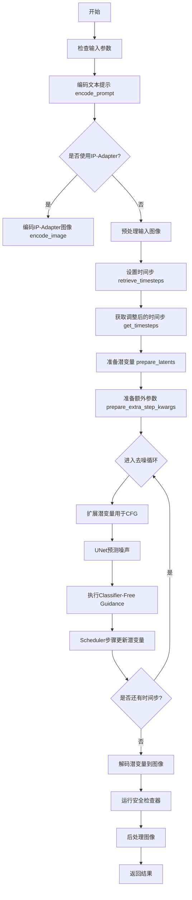
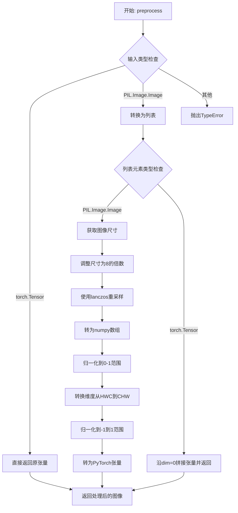
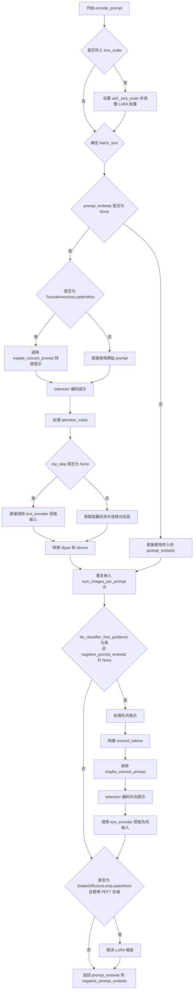
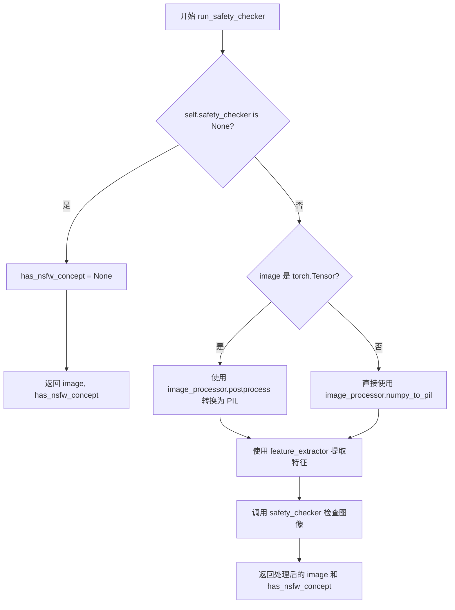
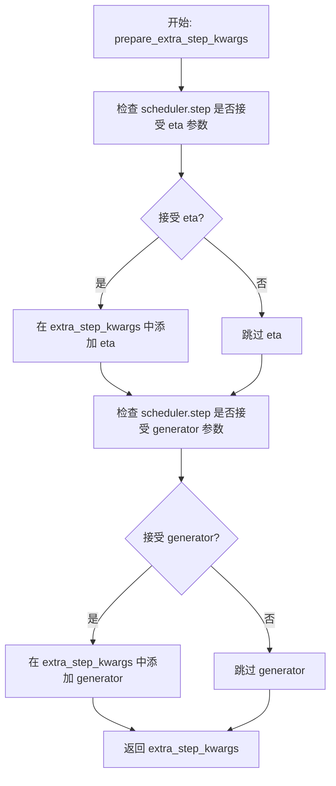

# `diffusers\src\diffusers\pipelines\deprecated\alt_diffusion\pipeline_alt_diffusion_img2img.py` 详细设计文档

AltDiffusionImg2ImgPipeline是一个用于文本引导的图像到图像生成的水diffusion pipeline，基于Alt Diffusion（多语言版本的Stable Diffusion），允许用户通过文本提示将输入图像转换为新的图像，支持多语言提示词。

## 整体流程



## 类结构

```
DiffusionPipeline (基类)
├── StableDiffusionMixin
├── TextualInversionLoaderMixin
├── IPAdapterMixin
├── StableDiffusionLoraLoaderMixin
├── FromSingleFileMixin
└── AltDiffusionImg2ImgPipeline
```

## 全局变量及字段


### `logger`
    
模块级日志记录器

类型：`logging.Logger`
    


### `EXAMPLE_DOC_STRING`
    
示例文档字符串

类型：`str`
    


### `AltDiffusionImg2ImgPipeline.vae`
    
VAE模型用于编码/解码图像

类型：`AutoencoderKL`
    


### `AltDiffusionImg2ImgPipeline.text_encoder`
    
冻结的文本编码器

类型：`RobertaSeriesModelWithTransformation`
    


### `AltDiffusionImg2ImgPipeline.tokenizer`
    
分词器

类型：`XLMRobertaTokenizer`
    


### `AltDiffusionImg2ImgPipeline.unet`
    
去噪UNet模型

类型：`UNet2DConditionModel`
    


### `AltDiffusionImg2ImgPipeline.scheduler`
    
扩散调度器

类型：`KarrasDiffusionSchedulers`
    


### `AltDiffusionImg2ImgPipeline.safety_checker`
    
安全检查器

类型：`StableDiffusionSafetyChecker`
    


### `AltDiffusionImg2ImgPipeline.feature_extractor`
    
特征提取器

类型：`CLIPImageProcessor`
    


### `AltDiffusionImg2ImgPipeline.image_encoder`
    
图像编码器(可选)

类型：`CLIPVisionModelWithProjection`
    


### `AltDiffusionImg2ImgPipeline.vae_scale_factor`
    
VAE缩放因子

类型：`int`
    


### `AltDiffusionImg2ImgPipeline.image_processor`
    
图像处理器

类型：`VaeImageProcessor`
    


### `AltDiffusionImg2ImgPipeline.model_cpu_offload_seq`
    
CPU卸载顺序

类型：`str`
    


### `AltDiffusionImg2ImgPipeline._optional_components`
    
可选组件列表

类型：`list`
    


### `AltDiffusionImg2ImgPipeline._exclude_from_cpu_offload`
    
排除CPU卸载的组件

类型：`list`
    


### `AltDiffusionImg2ImgPipeline._callback_tensor_inputs`
    
回调张量输入列表

类型：`list`
    


### `AltDiffusionImg2ImgPipeline._guidance_scale`
    
引导_scale

类型：`float`
    


### `AltDiffusionImg2ImgPipeline._clip_skip`
    
CLIP跳过的层数

类型：`int`
    


### `AltDiffusionImg2ImgPipeline._cross_attention_kwargs`
    
交叉注意力参数

类型：`dict`
    


### `AltDiffusionImg2ImgPipeline._num_timesteps`
    
时间步数量

类型：`int`
    
    

## 全局函数及方法


### `retrieve_latents`

从encoder输出中检索潜变量（latents），支持多种采样模式（sample/argmax）或直接从encoder_output中获取latents属性。

参数：

- `encoder_output`：`torch.Tensor`，编码器的输出对象，通常包含 `latent_dist` 或 `latents` 属性
- `generator`：`torch.Generator | None`，可选的随机数生成器，用于控制采样过程中的随机性
- `sample_mode`：`str`，采样模式，默认为 `"sample"`；可选值为 `"sample"`（从分布中采样）或 `"argmax"`（取分布的均值/众数）

返回值：`torch.Tensor`，检索到的潜变量张量

#### 流程图

```mermaid
flowchart TD
    A[开始] --> B{encoder_output 是否有 latent_dist 属性}
    B -->|是| C{sample_mode == 'sample'}
    B -->|否| D{encoder_output 是否有 latents 属性}
    C -->|是| E[返回 latent_dist.sample<br/>(generator)]
    C -->|否| F{使用 argmax 模式<br/>返回 latent_dist.mode()}
    D -->|是| G[返回 encoder_output.latents]
    D -->|否| H[抛出 AttributeError]
    
    F --> I[结束]
    E --> I
    G --> I
    H --> I
```

#### 带注释源码

```
def retrieve_latents(
    encoder_output: torch.Tensor, 
    generator: torch.Generator | None = None, 
    sample_mode: str = "sample"
):
    """
    从encoder输出中检索潜变量。
    
    该函数支持三种方式获取潜变量：
    1. 当encoder_output包含latent_dist属性且sample_mode为'sample'时，从分布中采样
    2. 当encoder_output包含latent_dist属性且sample_mode为'argmax'时，取分布的模式
    3. 当encoder_output直接包含latents属性时，直接返回该属性
    """
    # 方式1: 检查是否有latent_dist属性，并使用采样模式
    if hasattr(encoder_output, "latent_dist") and sample_mode == "sample":
        # 从潜在分布中采样，支持通过generator控制随机性
        return encoder_output.latent_dist.sample(generator)
    
    # 方式2: 检查是否有latent_dist属性，并使用argmax模式
    elif hasattr(encoder_output, "latent_dist") and sample_mode == "argmax":
        # 取潜在分布的模式（通常是均值）
        return encoder_output.latent_dist.mode()
    
    # 方式3: 直接返回latents属性
    elif hasattr(encoder_output, "latents"):
        return encoder_output.latents
    
    # 错误处理: 无法获取潜变量
    else:
        raise AttributeError("Could not access latents of provided encoder_output")
```


### `preprocess`

该函数是一个已弃用的图像预处理函数，用于将不同格式的输入图像（PIL图像或PyTorch张量）标准化为适合Diffusion模型处理的格式，包括图像尺寸调整（8的倍数）、像素值归一化（0-1到-1到1）以及维度转换（HWC到CHW）。

参数：

- `image`：`torch.Tensor | PIL.Image.Image | list[PIL.Image.Image]`，输入图像，可以是单个PIL图像、张量或图像列表

返回值：`torch.Tensor`，返回处理后的PyTorch张量，形状为(B, C, H, W)，值范围在[-1, 1]

#### 流程图



#### 带注释源码

```python
# Copied from diffusers.pipelines.stable_diffusion.pipeline_stable_diffusion_img2img.preprocess
def preprocess(image):
    """
    预处理输入图像（已弃用）
    
    将PIL图像或张量转换为标准化格式的PyTorch张量。
    注意：此方法已被弃用，请使用 VaeImageProcessor.preprocess(...) 代替
    """
    # 发出弃用警告
    deprecation_message = "The preprocess method is deprecated and will be removed in diffusers 1.0.0. Please use VaeImageProcessor.preprocess(...) instead"
    deprecate("preprocess", "1.0.0", deprecation_message, standard_warn=False)
    
    # 如果已经是张量，直接返回
    if isinstance(image, torch.Tensor):
        return image
    # 如果是单个PIL图像，转换为列表以便统一处理
    elif isinstance(image, PIL.Image.Image):
        image = [image]

    # 处理PIL图像列表
    if isinstance(image[0], PIL.Image.Image):
        # 获取图像尺寸
        w, h = image[0].size
        # 将尺寸调整为8的倍数（UNet要求）
        w, h = (x - x % 8 for x in (w, h))
        
        # 调整每个图像大小并转换为numpy数组
        # 使用lanczos重采样保持高质量
        image = [np.array(i.resize((w, h), resample=PIL_INTERPOLATION["lanczos"]))[None, :] for i in image]
        # 在batch维度拼接
        image = np.concatenate(image, axis=0)
        # 转换为float32并归一化到[0, 1]
        image = np.array(image).astype(np.float32) / 255.0
        # 转换维度从HWC到CHW（height, width, channel -> channel, height, width）
        image = image.transpose(0, 3, 1, 2)
        # 归一化到[-1, 1]范围（Diffusion模型常用）
        image = 2.0 * image - 1.0
        # 转换为PyTorch张量
        image = torch.from_numpy(image)
    # 处理张量列表
    elif isinstance(image[0], torch.Tensor):
        # 沿batch维度拼接
        image = torch.cat(image, dim=0)
    
    return image
```


### `retrieve_timesteps`

该函数是 AltDiffusionImg2ImgPipeline 的工具函数，用于从调度器检索并设置推理过程中的时间步（timesteps）。它支持三种模式：使用自定义时间步列表、使用自定义 sigmas 列表，或使用标准的 num_inference_steps 参数。该函数会验证调度器是否支持所请求的参数类型，并返回调度器更新后的时间步张量及实际推理步数。

参数：

- `scheduler`：`SchedulerMixin`，要获取时间步的调度器对象
- `num_inference_steps`：`int | None`，生成样本时使用的扩散步数，如果使用则 `timesteps` 必须为 `None`
- `device`：`str | torch.device | None`，时间步要移动到的设备，如果为 `None` 则不移动
- `timesteps`：`list[int] | None`，自定义时间步列表，用于覆盖调度器的默认时间步间隔策略
- `sigmas`：`list[float] | None`，自定义 sigmas 列表，用于覆盖调度器的默认 sigma 间隔策略
- `**kwargs`：任意关键字参数，将传递给调度器的 `set_timesteps` 方法

返回值：`tuple[torch.Tensor, int]`，元组包含两个元素——第一个是调度器的时间步张量，第二个是实际的推理步数

#### 流程图

```mermaid
flowchart TD
    A[开始 retrieve_timesteps] --> B{检查 timesteps 和 sigmas}
    B -->|同时存在| C[抛出 ValueError: 只能选择一个]
    B -->|只有 timesteps| D{调度器支持 timesteps?}
    B -->|只有 sigmas| E{调度器支持 sigmas?}
    B -->|都没有| F[调用 scheduler.set_timesteps num_inference_steps]
    
    D -->|不支持| G[抛出 ValueError]
    D -->|支持| H[调用 scheduler.set_timesteps timesteps=timesteps]
    E -->|不支持| I[抛出 ValueError]
    E -->|支持| J[调用 scheduler.set_timesteps sigmas=sigmas]
    
    H --> K[获取 scheduler.timesteps]
    J --> K
    F --> K
    
    K --> L[计算 num_inference_steps = len(timesteps)]
    L --> M[返回 timesteps, num_inference_steps]
```

#### 带注释源码

```python
# Copied from diffusers.pipelines.stable_diffusion.pipeline_stable_diffusion.retrieve_timesteps
def retrieve_timesteps(
    scheduler,
    num_inference_steps: int | None = None,
    device: str | torch.device | None = None,
    timesteps: list[int] | None = None,
    sigmas: list[float] | None = None,
    **kwargs,
):
    r"""
    Calls the scheduler's `set_timesteps` method and retrieves timesteps from the scheduler after the call. Handles
    custom timesteps. Any kwargs will be supplied to `scheduler.set_timesteps`.

    Args:
        scheduler (`SchedulerMixin`):
            The scheduler to get timesteps from.
        num_inference_steps (`int`):
            The number of diffusion steps used when generating samples with a pre-trained model. If used, `timesteps`
            must be `None`.
        device (`str` or `torch.device`, *optional*):
            The device to which the timesteps should be moved to. If `None`, the timesteps are not moved.
        timesteps (`list[int]`, *optional*):
            Custom timesteps used to override the timestep spacing strategy of the scheduler. If `timesteps` is passed,
            `num_inference_steps` and `sigmas` must be `None`.
        sigmas (`list[float]`, *optional*):
            Custom sigmas used to override the timestep spacing strategy of the scheduler. If `sigmas` is passed,
            `num_inference_steps` and `timesteps` must be `None`.

    Returns:
        `tuple[torch.Tensor, int]`: A tuple where the first element is the timestep schedule from the scheduler and the
        second element is the number of inference steps.
    """
    # 验证参数互斥：timesteps 和 sigmas 不能同时指定
    if timesteps is not None and sigmas is not None:
        raise ValueError("Only one of `timesteps` or `sigmas` can be passed. Please choose one to set custom values")
    
    # 模式1：使用自定义 timesteps
    if timesteps is not None:
        # 检查调度器的 set_timesteps 方法是否接受 timesteps 参数
        accepts_timesteps = "timesteps" in set(inspect.signature(scheduler.set_timesteps).parameters.keys())
        if not accepts_timesteps:
            raise ValueError(
                f"The current scheduler class {scheduler.__class__}'s `set_timesteps` does not support custom"
                f" timestep schedules. Please check whether you are using the correct scheduler."
            )
        # 调用调度器的 set_timesteps 方法设置自定义时间步
        scheduler.set_timesteps(timesteps=timesteps, device=device, **kwargs)
        # 从调度器获取更新后的时间步
        timesteps = scheduler.timesteps
        # 计算实际推理步数
        num_inference_steps = len(timesteps)
    
    # 模式2：使用自定义 sigmas
    elif sigmas is not None:
        # 检查调度器的 set_timesteps 方法是否接受 sigmas 参数
        accept_sigmas = "sigmas" in set(inspect.signature(scheduler.set_timesteps).parameters.keys())
        if not accept_sigmas:
            raise ValueError(
                f"The current scheduler class {scheduler.__class__}'s `set_timesteps` does not support custom"
                f" sigmas schedules. Please check whether you are using the correct scheduler."
            )
        # 调用调度器的 set_timesteps 方法设置自定义 sigmas
        scheduler.set_timesteps(sigmas=sigmas, device=device, **kwargs)
        # 从调度器获取更新后的时间步
        timesteps = scheduler.timesteps
        # 计算实际推理步数
        num_inference_steps = len(timesteps)
    
    # 模式3：使用标准的 num_inference_steps 参数
    else:
        scheduler.set_timesteps(num_inference_steps, device=device, **kwargs)
        timesteps = scheduler.timesteps
    
    # 返回时间步张量和推理步数
    return timesteps, num_inference_steps
```


### `AltDiffusionImg2ImgPipeline.__init__`

初始化 `AltDiffusionImg2ImgPipeline` 类的实例。该方法接收所有必要的模型组件（如 VAE、文本编码器、UNet、调度器等），进行配置校验与兼容性修正（如检查并修正 `scheduler` 的 `steps_offset` 和 `clip_sample` 参数），注册所有子模块，并初始化图像处理器和配置参数。

参数：

-  `vae`：`AutoencoderKL`，用于将图像编码和解码到潜在表示的变分自编码器模型。
-  `text_encoder`：`RobertaSeriesModelWithTransformation`，冻结的文本编码器 (clip-vit-large-patch14)。
-  `tokenizer`：`XLMRobertaTokenizer`，用于对文本进行分词。
-  `unet`：`UNet2DConditionModel`，用于对编码后的图像潜在表示进行去噪。
-  `scheduler`：`KarrasDiffusionSchedulers`，与 `unet` 结合使用以对潜在表示进行去噪的调度器。
-  `safety_checker`：`StableDiffusionSafetyChecker`，用于估计生成的图像是否被认为具有攻击性或有害的分类模块。
-  `feature_extractor`：`CLIPImageProcessor`，用于从生成的图像中提取特征；作为 `safety_checker` 的输入。
-  `image_encoder`：`CLIPVisionModelWithProjection`，可选，用于 IP-Adapter 的图像编码器。
-  `requires_safety_checker`：`bool`，是否需要安全检查器的标志。

返回值：无返回值（`None`），该方法主要进行对象状态的初始化。

#### 流程图

```mermaid
graph TD
    A[Start __init__] --> B[调用 super().__init__]
    B --> C{检查 scheduler.config.steps_offset != 1?}
    C -->|是| D[发出警告并修正 steps_offset 为 1]
    C -->|否| E{检查 scheduler.config.clip_sample == True?}
    D --> E
    E -->|是| F[发出警告并修正 clip_sample 为 False]
    E -->|否| G{safety_checker is None 且 requires_safety_checker is True?}
    F --> G
    G -->|是| H[发出警告: 建议启用安全检查器]
    G -->|否| I{safety_checker is not None 且 feature_extractor is None?}
    H --> I
    I -->|是| J[抛出 ValueError: 必须定义 feature_extractor]
    I -->|否| K{检查 unet 版本 & sample_size < 64?}
    J --> L[End __init__]
    K -->|是| M[发出警告并修正 sample_size 为 64]
    K -->|否| N[调用 self.register_modules 注册所有模块]
    M --> N
    N --> O[计算 vae_scale_factor 并初始化 image_processor]
    O --> P[调用 self.register_to_config 注册配置]
    P --> L
```

#### 带注释源码

```python
def __init__(
    self,
    vae: AutoencoderKL,
    text_encoder: RobertaSeriesModelWithTransformation,
    tokenizer: XLMRobertaTokenizer,
    unet: UNet2DConditionModel,
    scheduler: KarrasDiffusionSchedulers,
    safety_checker: StableDiffusionSafetyChecker,
    feature_extractor: CLIPImageProcessor,
    image_encoder: CLIPVisionModelWithProjection = None,
    requires_safety_checker: bool = True,
):
    # 调用父类 DiffusionPipeline 的初始化方法
    super().__init__()

    # --- 1. 校验并修正 Scheduler 配置 ---
    # 检查 scheduler 的 steps_offset 配置是否为默认值 1，如果不是则发出警告并修正
    if scheduler is not None and getattr(scheduler.config, "steps_offset", 1) != 1:
        deprecation_message = (...)
        deprecate("steps_offset!=1", "1.0.0", deprecation_message, standard_warn=False)
        new_config = dict(scheduler.config)
        new_config["steps_offset"] = 1
        scheduler._internal_dict = FrozenDict(new_config)

    # 检查 scheduler 的 clip_sample 配置，如果是 True 则发出警告并修正为 False
    if scheduler is not None and getattr(scheduler.config, "clip_sample", False) is True:
        deprecation_message = (...)
        deprecate("clip_sample not set", "1.0.0", deprecation_message, standard_warn=False)
        new_config = dict(scheduler.config)
        new_config["clip_sample"] = False
        scheduler._internal_dict = FrozenDict(new_config)

    # --- 2. 安全检查器 (Safety Checker) 校验 ---
    # 如果要求安全检查器但传入了 None，发出警告
    if safety_checker is None and requires_safety_checker:
        logger.warning(
            f"You have disabled the safety checker for {self.__class__} by passing `safety_checker=None`..."
        )

    # 如果提供了安全检查器但没有提供特征提取器，抛出错误
    if safety_checker is not None and feature_extractor is None:
        raise ValueError(
            "Make sure to define a feature extractor when loading {self.__class__} if you want to use the safety"
            " checker..."
        )

    # --- 3. UNet 配置校验与修正 ---
    # 检查 UNet 版本和 sample_size，如果版本较旧且 sample_size 小于 64，则发出警告并修正
    is_unet_version_less_0_9_0 = (...)
    is_unet_sample_size_less_64 = (...)
    if is_unet_version_less_0_9_0 and is_unet_sample_size_less_64:
        deprecation_message = (...)
        deprecate("sample_size<64", "1.0.0", deprecation_message, standard_warn=False)
        new_config = dict(unet.config)
        new_config["sample_size"] = 64
        unet._internal_dict = FrozenDict(new_config)

    # --- 4. 注册模块 ---
    # 将所有核心模型组件注册到 Pipeline 中，以便统一管理（如 enable_model_s_cpu_offload 等）
    self.register_modules(
        vae=vae,
        text_encoder=text_encoder,
        tokenizer=tokenizer,
        unet=unet,
        scheduler=scheduler,
        safety_checker=safety_checker,
        feature_extractor=feature_extractor,
        image_encoder=image_encoder,
    )

    # --- 5. 初始化图像处理器 ---
    # 计算 VAE 的缩放因子，通常为 2^(len(block_out_channels) - 1)
    self.vae_scale_factor = 2 ** (len(self.vae.config.block_out_channels) - 1) if getattr(self, "vae", None) else 8
    # 初始化 VaeImageProcessor，用于图像的预处理和后处理
    self.image_processor = VaeImageProcessor(vae_scale_factor=self.vae_scale_factor)

    # --- 6. 注册配置 ---
    # 将 requires_safety_checker 等配置保存到 self.config
    self.register_to_config(requires_safety_checker=requires_safety_checker)
```


### `AltDiffusionImg2ImgPipeline._encode_prompt`

该函数是 `AltDiffusionImg2ImgPipeline` 类的弃用方法，用于将文本提示编码为文本编码器的隐藏状态。由于已弃用，它委托给 `encode_prompt` 方法执行实际编码工作，但为了保持向后兼容性，它对返回结果进行了特殊处理（将负向提示嵌入和正向提示嵌入拼接后返回），这导致了输出格式从元组变为拼接的张量。

参数：

- `self`：类实例本身，包含 `text_encoder`、`tokenizer` 等用于编码的属性
- `prompt`：`str` 或 `list[str]`，要编码的提示文本
- `device`：`torch.device`，编码设备
- `num_images_per_prompt`：`int`，每个提示生成的图像数量
- `do_classifier_free_guidance`：`bool`，是否使用无分类器引导
- `negative_prompt`：`str` 或 `list[str]`，可选，负向提示
- `prompt_embeds`：`torch.Tensor | None`，可选，预生成的提示嵌入
- `negative_prompt_embeds`：`torch.Tensor | None`，可选，预生成的负向提示嵌入
- `lora_scale`：`float | None`，可选，LoRA 缩放因子
- `**kwargs`：其他关键字参数，传递给 `encode_prompt`

返回值：`torch.Tensor`，拼接后的提示嵌入（包含负向和正向嵌入），用于保持与旧版 API 的兼容性

#### 流程图

```mermaid
flowchart TD
    A[开始 _encode_prompt] --> B[记录弃用警告]
    B --> C[调用 encode_prompt 方法]
    C --> D[获取返回的元组 prompt_embeds_tuple]
    E[prompt_embeds_tuple = (negative_prompt_embeds, prompt_embeds)]
    D --> E
    E --> F[拼接: torch.cat[negative, positive]]
    F --> G[返回拼接后的张量]
    
    style B fill:#ffcccc
    style G fill:#ccffcc
```

#### 带注释源码

```python
def _encode_prompt(
    self,
    prompt,                              # 输入的提示文本（字符串或列表）
    device,                              # 计算设备（torch.device）
    num_images_per_prompt,               # 每个提示生成的图像数量
    do_classifier_free_guidance,         # 是否使用无分类器引导
    negative_prompt=None,                 # 可选的负向提示
    prompt_embeds: torch.Tensor | None = None,      # 可选的预计算提示嵌入
    negative_prompt_embeds: torch.Tensor | None = None,  # 可选的预计算负向嵌入
    lora_scale: float | None = None,     # LoRA 缩放因子
    **kwargs,                            # 其他传递给 encode_prompt 的参数
):
    # 记录弃用警告，提示用户使用 encode_prompt 替代
    deprecation_message = "`_encode_prompt()` is deprecated and it will be removed in a future version. Use `encode_prompt()` instead. Also, be aware that the output format changed from a concatenated tensor to a tuple."
    deprecate("_encode_prompt()", "1.0.0", deprecation_message, standard_warn=False)

    # 委托给新的 encode_prompt 方法执行实际编码
    # encode_prompt 返回 (prompt_embeds, negative_prompt_embeds) 元组
    prompt_embeds_tuple = self.encode_prompt(
        prompt=prompt,
        device=device,
        num_images_per_prompt=num_images_per_prompt,
        do_classifier_free_guidance=do_classifier_free_guidance,
        negative_prompt=negative_prompt,
        prompt_embeds=prompt_embeds,
        negative_prompt_embeds=negative_prompt_embeds,
        lora_scale=lora_scale,
        **kwargs,
    )

    # 为了向后兼容性进行拼接
    # 新版返回 (positive, negative)，旧版需要 [negative, positive] 顺序
    # 所以这里取 prompt_embeds_tuple[1] 是正向，prompt_embeds_tuple[0] 是负向
    # 拼接后变成 [negative, positive] 顺序
    prompt_embeds = torch.cat([prompt_embeds_tuple[1], prompt_embeds_tuple[0]])

    return prompt_embeds  # 返回拼接后的张量用于旧版兼容
```


### `AltDiffusionImg2ImgPipeline.encode_prompt`

该方法将文本提示（prompt）编码为文本编码器的隐藏状态（hidden states），用于后续的图像生成过程。支持正负提示的嵌入计算、LoRA 权重调整、CLIP skip 机制以及无分类器引导（classifier-free guidance）。

参数：

- `prompt`：`str` 或 `list[str]`，要编码的提示词
- `device`：`torch.device`，torch 设备
- `num_images_per_prompt`：`int`，每个提示生成的图像数量
- `do_classifier_free_guidance`：`bool`，是否使用无分类器引导
- `negative_prompt`：`str` 或 `list[str]`，负向提示词，用于指导不生成的内容
- `prompt_embeds`：`torch.Tensor | None`，预生成的文本嵌入，可用于提示词加权
- `negative_prompt_embeds`：`torch.Tensor | None`，预生成的负向文本嵌入
- `lora_scale`：`float | None`，应用于文本编码器所有 LoRA 层的 LoRA 缩放因子
- `clip_skip`：`int | None`，计算提示嵌入时跳过的 CLIP 层数

返回值：`(torch.Tensor, torch.Tensor)`，返回元组包含提示嵌入和负向提示嵌入

#### 流程图



#### 带注释源码

```python
def encode_prompt(
    self,
    prompt,                                  # str 或 list[str]: 要编码的提示词
    device,                                  # torch.device: torch 设备
    num_images_per_prompt,                  # int: 每个提示生成的图像数量
    do_classifier_free_guidance,            # bool: 是否使用无分类器引导
    negative_prompt=None,                    # str 或 list[str]: 负向提示词
    prompt_embeds: torch.Tensor | None = None,  # torch.Tensor: 预生成的文本嵌入
    negative_prompt_embeds: torch.Tensor | None = None,  # torch.Tensor: 预生成的负向嵌入
    lora_scale: float | None = None,         # float: LoRA 缩放因子
    clip_skip: int | None = None,            # int: 跳过的 CLIP 层数
):
    r"""
    Encodes the prompt into text encoder hidden states.

    Args:
        prompt (`str` or `list[str]`, *optional*):
            prompt to be encoded
        device: (`torch.device`):
            torch device
        num_images_per_prompt (`int`):
            number of images that should be generated per prompt
        do_classifier_free_guidance (`bool`):
            whether to use classifier free guidance or not
        negative_prompt (`str` or `list[str]`, *optional*):
            The prompt or prompts not to guide the image generation. If not defined, one has to pass
            `negative_prompt_embeds` instead. Ignored when not using guidance (i.e., ignored if `guidance_scale` is
            less than `1`).
        prompt_embeds (`torch.Tensor`, *optional*):
            Pre-generated text embeddings. Can be used to easily tweak text inputs, *e.g.* prompt weighting. If not
            provided, text embeddings will be generated from `prompt` input argument.
        negative_prompt_embeds (`torch.Tensor`, *optional*):
            Pre-generated negative text embeddings. Can be used to easily tweak text inputs, *e.g.* prompt
            weighting. If not provided, negative_prompt_embeds will be generated from `negative_prompt` input
            argument.
        lora_scale (`float`, *optional*):
            A LoRA scale that will be applied to all LoRA layers of the text encoder if LoRA layers are loaded.
        clip_skip (`int`, *optional*):
            Number of layers to be skipped from CLIP while computing the prompt embeddings. A value of 1 means that
            the output of the pre-final layer will be used for computing the prompt embeddings.
    """
    # 设置 lora scale 以便 text encoder 的 LoRA 函数能正确访问
    # 如果传入了 lora_scale 且当前 pipeline 包含 StableDiffusionLoraLoaderMixin
    if lora_scale is not None and isinstance(self, StableDiffusionLoraLoaderMixin):
        self._lora_scale = lora_scale

        # 动态调整 LoRA scale
        if not USE_PEFT_BACKEND:
            adjust_lora_scale_text_encoder(self.text_encoder, lora_scale)
        else:
            scale_lora_layers(self.text_encoder, lora_scale)

    # 确定 batch_size：根据 prompt 或 prompt_embeds 的形状
    if prompt is not None and isinstance(prompt, str):
        batch_size = 1
    elif prompt is not None and isinstance(prompt, list):
        batch_size = len(prompt)
    else:
        batch_size = prompt_embeds.shape[0]

    # 如果没有传入 prompt_embeds，则需要从 prompt 生成
    if prompt_embeds is None:
        # textual inversion: 处理多向量 token（如有必要）
        if isinstance(self, TextualInversionLoaderMixin):
            prompt = self.maybe_convert_prompt(prompt, self.tokenizer)

        # 使用 tokenizer 将文本转换为 token ID
        text_inputs = self.tokenizer(
            prompt,
            padding="max_length",
            max_length=self.tokenizer.model_max_length,
            truncation=True,
            return_tensors="pt",
        )
        text_input_ids = text_inputs.input_ids
        # 获取未截断的 token 序列用于检测截断
        untruncated_ids = self.tokenizer(prompt, padding="longest", return_tensors="pt").input_ids

        # 检查是否发生了截断，并记录警告信息
        if untruncated_ids.shape[-1] >= text_input_ids.shape[-1] and not torch.equal(
            text_input_ids, untruncated_ids
        ):
            removed_text = self.tokenizer.batch_decode(
                untruncated_ids[:, self.tokenizer.model_max_length - 1 : -1]
            )
            logger.warning(
                "The following part of your input was truncated because CLIP can only handle sequences up to"
                f" {self.tokenizer.model_max_length} tokens: {removed_text}"
            )

        # 处理 attention mask
        if hasattr(self.text_encoder.config, "use_attention_mask") and self.text_encoder.config.use_attention_mask:
            attention_mask = text_inputs.attention_mask.to(device)
        else:
            attention_mask = None

        # 根据 clip_skip 参数决定如何获取 prompt embeddings
        if clip_skip is None:
            # 直接获取文本编码器的输出
            prompt_embeds = self.text_encoder(text_input_ids.to(device), attention_mask=attention_mask)
            prompt_embeds = prompt_embeds[0]
        else:
            # 获取所有隐藏状态，然后选择对应层
            prompt_embeds = self.text_encoder(
                text_input_ids.to(device), attention_mask=attention_mask, output_hidden_states=True
            )
            # 访问隐藏状态元组，选择需要的层 (倒数第 clip_skip + 1 层)
            prompt_embeds = prompt_embeds[-1][-(clip_skip + 1)]
            # 应用最终的 LayerNorm 以获得正确的表示
            prompt_embeds = self.text_encoder.text_model.final_layer_norm(prompt_embeds)

    # 确定 prompt_embeds 的数据类型
    if self.text_encoder is not None:
        prompt_embeds_dtype = self.text_encoder.dtype
    elif self.unet is not None:
        prompt_embeds_dtype = self.unet.dtype
    else:
        prompt_embeds_dtype = prompt_embeds.dtype

    # 将 prompt_embeds 转换为适当的 dtype 和 device
    prompt_embeds = prompt_embeds.to(dtype=prompt_embeds_dtype, device=device)

    # 为每个提示生成多个图像而复制文本嵌入
    bs_embed, seq_len, _ = prompt_embeds.shape
    prompt_embeds = prompt_embeds.repeat(1, num_images_per_prompt, 1)
    prompt_embeds = prompt_embeds.view(bs_embed * num_images_per_prompt, seq_len, -1)

    # 获取无分类器引导的无条件嵌入
    if do_classifier_free_guidance and negative_prompt_embeds is None:
        uncond_tokens: list[str]
        if negative_prompt is None:
            # 如果没有负向提示，使用空字符串
            uncond_tokens = [""] * batch_size
        elif prompt is not None and type(prompt) is not type(negative_prompt):
            raise TypeError(
                f"`negative_prompt` should be the same type to `prompt`, but got {type(negative_prompt)} !="
                f" {type(prompt)}."
            )
        elif isinstance(negative_prompt, str):
            uncond_tokens = [negative_prompt]
        elif batch_size != len(negative_prompt):
            raise ValueError(
                f"`negative_prompt`: {negative_prompt} has batch size {len(negative_prompt)}, but `prompt`:"
                f" {prompt} has batch size {batch_size}. Please make sure that passed `negative_prompt` matches"
                " the batch size of `prompt`."
            )
        else:
            uncond_tokens = negative_prompt

        # textual inversion: 处理多向量 token（如有必要）
        if isinstance(self, TextualInversionLoaderMixin):
            uncond_tokens = self.maybe_convert_prompt(uncond_tokens, self.tokenizer)

        # 使用与 prompt_embeds 相同的长度进行 tokenize
        max_length = prompt_embeds.shape[1]
        uncond_input = self.tokenizer(
            uncond_tokens,
            padding="max_length",
            max_length=max_length,
            truncation=True,
            return_tensors="pt",
        )

        # 处理 attention mask
        if hasattr(self.text_encoder.config, "use_attention_mask") and self.text_encoder.config.use_attention_mask:
            attention_mask = uncond_input.attention_mask.to(device)
        else:
            attention_mask = None

        # 获取无条件嵌入
        negative_prompt_embeds = self.text_encoder(
            uncond_input.input_ids.to(device),
            attention_mask=attention_mask,
        )
        negative_prompt_embeds = negative_prompt_embeds[0]

    # 如果使用无分类器引导，复制无条件嵌入
    if do_classifier_free_guidance:
        seq_len = negative_prompt_embeds.shape[1]

        negative_prompt_embeds = negative_prompt_embeds.to(dtype=prompt_embeds_dtype, device=device)

        negative_prompt_embeds = negative_prompt_embeds.repeat(1, num_images_per_prompt, 1)
        negative_prompt_embeds = negative_prompt_embeds.view(batch_size * num_images_per_prompt, seq_len, -1)

    # 如果使用了 PEFT backend，恢复原始的 LoRA 缩放
    if isinstance(self, StableDiffusionLoraLoaderMixin) and USE_PEFT_BACKEND:
        # Retrieve the original scale by scaling back the LoRA layers
        unscale_lora_layers(self.text_encoder, lora_scale)

    return prompt_embeds, negative_prompt_embeds
```


### `AltDiffusionImg2ImgPipeline.encode_image`

该方法是 `AltDiffusionImg2ImgPipeline` 中的核心组件，专门用于对输入图像进行编码以服务于 IP-Adapter（图像提示适配器）。它通过内置的 `image_encoder`（CLIP Vision Model）将图像转换为高维向量表示（embeddings 或 hidden states），并生成对应的无条件（unconditional）嵌入，以支持后续扩散模型在 Classifier-Free Guidance 模式下进行图像生成。

参数：
- `self`：类的实例，包含 `image_encoder` 和 `feature_extractor` 等组件。
- `image`：`PipelineImageInput`，输入的图像数据，可以是 PIL Image, NumPy 数组, PyTorch Tensor 或列表。方法内部会将其转换为 PyTorch Tensor。
- `device`：`torch.device`，指定进行计算的设备（如 CPU 或 CUDA）。
- `num_images_per_prompt`：`int`，每个文本提示（prompt）需要生成的图像数量，用于对图像嵌入进行批次扩展。
- `output_hidden_states`：`bool | None`，可选参数。指定是否返回图像编码器的隐藏状态。如果为 `True`，则返回倒数第二个隐藏层（hidden states）；如果为 `False` 或 `None`，则返回图像嵌入（image_embeds）。

返回值：`tuple[torch.Tensor, torch.Tensor]`，返回一个元组，包含两个张量：
1.  **条件图像嵌入/隐藏状态**：对应输入图像的编码表示，形状已根据 `num_images_per_prompt` 进行扩展。
2.  **无条件图像嵌入/隐藏状态**：全零或无意义的编码表示，用于在 Classifier-Free Guidance 中与条件嵌入进行对比。

#### 流程图

```mermaid
graph TD
    A([开始 encode_image]) --> B[获取 image_encoder 的 dtype]
    B --> C{image 是否为 Tensor?}
    C -- 否 --> D[使用 feature_extractor 预处理 image]
    C -- 是 --> E
    D --> E[将 image 移至 device 并转换 dtype]
    E --> F{output_hidden_states?}
    F -- True --> G[调用 image_encoder<br/>output_hidden_states=True]
    G --> H[提取 hidden_states[-2]]
    H --> I[repeat_interleave 扩展<br/>num_images_per_prompt]
    I --> J[构造 zero image<br/>torch.zeros_like]
    J --> K[调用 image_encoder<br/>output_hidden_states=True]
    K --> L[提取 hidden_states[-2]]
    L --> M[repeat_interleave 扩展]
    M --> N[返回 (条件隐状态, 无条件隐状态)]
    F -- False/None --> O[调用 image_encoder]
    O --> P[提取 image_embeds]
    P --> Q[repeat_interleave 扩展<br/>num_images_per_prompt]
    Q --> R[构造全零张量<br/>zeros_like]
    R --> S[返回 (条件嵌入, 无条件嵌入)]
```

#### 带注释源码

```python
def encode_image(self, image, device, num_images_per_prompt, output_hidden_states=None):
    # 获取图像编码器的参数数据类型（dtype），确保后续计算一致
    dtype = next(self.image_encoder.parameters()).dtype

    # 如果输入的 image 不是 PyTorch Tensor，则使用特征提取器进行处理
    if not isinstance(image, torch.Tensor):
        image = self.feature_extractor(image, return_tensors="pt").pixel_values

    # 将图像数据转移到指定的计算设备，并转换为正确的 dtype
    image = image.to(device=device, dtype=dtype)
    
    # 根据 output_hidden_states 参数决定输出格式
    if output_hidden_states:
        # 1. 输出隐藏状态模式
        # 使用 image_encoder 获取隐藏状态，并指定输出所有隐藏状态
        image_enc_hidden_states = self.image_encoder(image, output_hidden_states=True).hidden_states[-2]
        # 扩展维度以匹配每个 prompt 生成的图像数量
        image_enc_hidden_states = image_enc_hidden_states.repeat_interleave(num_images_per_prompt, dim=0)
        
        # 生成无条件的图像隐藏状态（使用全零图像作为输入）
        uncond_image_enc_hidden_states = self.image_encoder(
            torch.zeros_like(image), output_hidden_states=True
        ).hidden_states[-2]
        # 同样扩展无条件隐藏状态
        uncond_image_enc_hidden_states = uncond_image_enc_hidden_states.repeat_interleave(
            num_images_per_prompt, dim=0
        )
        return image_enc_hidden_states, uncond_image_enc_hidden_states
    else:
        # 2. 默认模式（输出图像嵌入）
        # 直接获取图像嵌入向量
        image_embeds = self.image_encoder(image).image_embeds
        # 扩展嵌入维度以匹配批量大小
        image_embeds = image_embeds.repeat_interleave(num_images_per_prompt, dim=0)
        # 创建形状相同的全零张量作为无条件图像嵌入
        uncond_image_embeds = torch.zeros_like(image_embeds)

        return image_embeds, uncond_image_embeds
```

#### 关键组件信息
- **image_encoder**: `CLIPVisionModelWithProjection`，用于将图像像素值编码为向量表示。
- **feature_extractor**: `CLIPImageProcessor`，用于将 PIL 图像或 numpy 数组预处理为模型所需的像素值张量。

#### 潜在的技术债务与优化空间
1.  **重复计算优化**：在 `output_hidden_states=True` 的分支中，当前实现对全零图像（`torch.zeros_like(image)`）也进行了一次完整的 `image_encoder` 前向传播。虽然全零输入的计算通常很快，但可以考虑在已知结构的情况下直接构造符合隐藏层形状的全零张量，以节省微小的计算开销。
2.  **设备一致性**：虽然代码中使用了 `.to(device=device, dtype=dtype)`，但对于大型批量数据，频繁的数据迁移可能带来性能损耗，需确保调用前 `image` 已在正确的设备上。
3.  **返回值的一致性**：返回值的形状取决于 `output_hidden_states`，文档中虽然标注了 `tuple[torch.Tensor, torch.Tensor]`，但具体维度（特别是隐藏状态的维度）依赖于模型配置，建议在文档中明确说明。


### `AltDiffusionImg2ImgPipeline.run_safety_checker`

该方法用于对生成的图像进行安全检查，检测图像是否包含不适内容（NSFW）。如果安全检查器存在，则使用特征提取器处理图像并调用安全检查器进行判断；如果安全检查器不存在，则返回原始图像和 None。

参数：

- `image`：`torch.Tensor | PIL.Image.Image | np.ndarray | list`，待检查的图像输入，可以是张量、PIL图像、numpy数组或列表
- `device`：`torch.device | str`，执行安全检查的设备（如 "cuda" 或 "cpu"）
- `dtype`：`torch.dtype`，图像数据的数据类型（如 torch.float16）

返回值：`(tuple[torch.Tensor | PIL.Image.Image | np.ndarray, list[bool] | None])`，返回元组包含处理后的图像和一个布尔列表，表示每张图像是否检测到不适内容，若无安全检查器则返回 None

#### 流程图



#### 带注释源码

```python
def run_safety_checker(self, image, device, dtype):
    """
    对生成的图像运行安全检查器，检测是否包含不适内容（NSFW）。
    
    参数:
        image: 输入图像，可以是 torch.Tensor、PIL.Image、np.ndarray 或列表
        device: 执行检查的设备
        dtype: 图像数据的 dtype
    
    返回:
        tuple: (处理后的图像, NSFW检测结果列表或None)
    """
    # 检查安全检查器是否已配置
    if self.safety_checker is None:
        # 如果没有安全检查器，直接返回原始图像和 None
        has_nsfw_concept = None
    else:
        # 根据图像类型进行预处理
        if torch.is_tensor(image):
            # 如果是 PyTorch 张量，使用后处理器转换为 PIL 图像
            feature_extractor_input = self.image_processor.postprocess(image, output_type="pil")
        else:
            # 如果是 numpy 数组或列表，转换为 PIL 图像
            feature_extractor_input = self.image_processor.numpy_to_pil(image)
        
        # 使用特征提取器提取图像特征并转换为张量
        safety_checker_input = self.feature_extractor(feature_extractor_input, return_tensors="pt").to(device)
        
        # 调用安全检查器进行 NSFW 检测
        # 参数: images=原始图像, clip_input=特征提取后的像素值
        image, has_nsfw_concept = self.safety_checker(
            images=image, clip_input=safety_checker_input.pixel_values.to(dtype)
        )
    
    # 返回处理后的图像和 NSFW 检测结果
    return image, has_nsfw_concept
```


### `AltDiffusionImg2ImgPipeline.decode_latents`

该方法是 `AltDiffusionImg2ImgPipeline` 类的成员方法，主要功能是将 VAE 模型的潜在表示（latents）解码为实际图像。该方法已被弃用，推荐使用 `VaeImageProcessor.postprocess(...)` 替代。

参数：

- `self`：隐式参数，当前 `AltDiffusionImg2ImgPipeline` 实例
- `latents`：`torch.Tensor`，待解码的 VAE 潜在变量张量，通常来源于扩散模型的中间表示

返回值：`numpy.ndarray`，解码后的图像，形状为 `(batch_size, height, width, channels)`，像素值范围 `[0, 1]`

#### 流程图

```mermaid
flowchart TD
    A[开始 decode_latents] --> B[记录弃用警告]
    B --> C{latents 是否为空}
    C -->|是| D[抛出异常]
    C -->|否| E[缩放 latents: latents = 1/scaling_factor * latents]
    E --> F[调用 VAE decode: image = vae.decode(latents)]
    F --> G[图像归一化: image = (image/2 + 0.5).clamp(0, 1)]
    G --> H[转换到 CPU 并转为 numpy: image.cpu().permute(0,2,3,1).float().numpy()]
    H --> I[返回图像数组]
```

#### 带注释源码

```python
def decode_latents(self, latents):
    """
    将潜在变量解码为图像（已弃用）
    
    注意: 此方法已被弃用，将在 diffusers 1.0.0 版本中移除。
    建议使用 VaeImageProcessor.postprocess(...) 替代。
    """
    
    # 记录弃用警告，提示用户使用新方法
    deprecation_message = "The decode_latents method is deprecated and will be removed in 1.0.0. Please use VaeImageProcessor.postprocess(...) instead"
    deprecate("decode_latents", "1.0.0", deprecation_message, standard_warn=False)

    # 第一步：缩放潜在变量
    # VAE 在编码时会对潜在变量进行缩放（乘以 scaling_factor），
    # 解码时需要逆向操作（除以 scaling_factor）以恢复到正确的数值范围
    latents = 1 / self.vae.config.scaling_factor * latents
    
    # 第二步：使用 VAE 解码器将潜在变量转换为图像
    # vae.decode 返回一个元组 (image, ...)，取第一个元素 [0]
    image = self.vae.decode(latents, return_dict=False)[0]
    
    # 第三步：图像值域归一化
    # VAE 输出的图像值域通常在 [-1, 1]，需要转换到 [0, 1]
    # 公式: (image / 2 + 0.5).clamp(0, 1)
    image = (image / 2 + 0.5).clamp(0, 1)
    
    # 第四步：数据类型转换
    # 将张量从 GPU 移动到 CPU，转换维度顺序 (N,C,H,W) -> (N,H,W,C)
    # 并转换为 float32 类型的 numpy 数组
    # 选择 float32 是因为它不会导致显著的性能开销，同时与 bfloat16 兼容
    image = image.cpu().permute(0, 2, 3, 1).float().numpy()
    
    # 返回解码后的图像数组
    return image
```


### `AltDiffusionImg2ImgPipeline.prepare_extra_step_kwargs`

该方法用于为调度器（scheduler）的步骤准备额外的关键字参数。由于不同的调度器具有不同的签名，该方法通过检查调度器的`step`方法所接受的参数，动态地构建需要传递给调度器的额外参数字典。主要处理`eta`（DDIM调度器专用）和`generator`（随机数生成器）这两个参数。

参数：

- `self`：`AltDiffusionImg2ImgPipeline`，Pipeline 实例本身
- `generator`：`torch.Generator | list[torch.Generator] | None`，可选的随机数生成器，用于确保生成过程的可重复性
- `eta`：`float | None`，DDIM 调度器专用的 η 参数，对应 DDIM 论文中的 η，值应介于 [0, 1] 之间

返回值：`dict[str, Any]`，包含调度器额外关键字参数的字典，可能包含 `eta` 和/或 `generator` 键

#### 流程图



#### 带注释源码

```python
def prepare_extra_step_kwargs(self, generator, eta):
    # 准备调度器步骤所需的额外参数
    # 由于并非所有调度器都具有相同的签名，因此需要动态检查
    # eta (η) 仅用于 DDIMScheduler，其他调度器会忽略此参数
    # eta 对应 DDIM 论文 (https://huggingface.co/papers/2010.02502) 中的 η
    # eta 值应介于 [0, 1] 之间

    # 通过检查调度器 step 方法的签名来判断是否接受 eta 参数
    accepts_eta = "eta" in set(inspect.signature(self.scheduler.step).parameters.keys())
    
    # 初始化额外的参数字典
    extra_step_kwargs = {}
    
    # 如果调度器接受 eta 参数，则将其添加到 extra_step_kwargs
    if accepts_eta:
        extra_step_kwargs["eta"] = eta

    # 检查调度器是否接受 generator 参数
    accepts_generator = "generator" in set(inspect.signature(self.scheduler.step).parameters.keys())
    
    # 如果调度器接受 generator 参数，则将其添加到 extra_step_kwargs
    if accepts_generator:
        extra_step_kwargs["generator"] = generator
    
    # 返回构建好的额外参数字典
    return extra_step_kwargs
```


### `AltDiffusionImg2ImgPipeline.check_inputs`

该方法用于验证图像到图像扩散管道的输入参数有效性，确保 `prompt`、`strength`、`callback_steps` 等关键参数符合业务规则，并在参数不符合要求时抛出明确的错误信息。

参数：

- `self`：隐式参数，指向 `AltDiffusionImg2ImgPipeline` 实例本身
- `prompt`：`str` 或 `list[str]` 或 `None`，用户提供的文本提示词，用于指导图像生成
- `strength`：`float`，图像变换强度，必须在 [0.0, 1.0] 范围内
- `callback_steps`：`int` 或 `None`，每多少步回调一次，必须为正整数
- `negative_prompt`：`str` 或 `list[str]` 或 `None`，反向提示词，用于指导不包含在图像中的内容
- `prompt_embeds`：`torch.Tensor` 或 `None`，预生成的文本嵌入向量
- `negative_prompt_embeds`：`torch.Tensor` 或 `None`，预生成的负向文本嵌入向量
- `callback_on_step_end_tensor_inputs`：`list[str]` 或 `None`，在步骤结束时回调的张量输入列表

返回值：`None`，该方法不返回值，仅通过抛出异常来处理无效输入

#### 流程图

```mermaid
flowchart TD
    A[开始检查输入参数] --> B{strength 是否在 [0, 1] 范围内}
    B -->|否| C[抛出 ValueError: strength 超出范围]
    B -->|是| D{callback_steps 是否为正整数}
    D -->|否| E[抛出 ValueError: callback_steps 无效]
    D -->|是| F{callback_on_step_end_tensor_inputs 是否在允许列表中}
    F -->|否| G[抛出 ValueError: 包含不允许的 tensor 输入]
    F -->|是| H{prompt 和 prompt_embeds 是否同时提供}
    H -->|是| I[抛出 ValueError: 不能同时提供]
    H -->|否| J{prompt 和 prompt_embeds 是否都未提供}
    J -->|是| K[抛出 ValueError: 至少需要提供一个]
    J -->|否| L{prompt 类型是否正确 str 或 list}
    L -->|否| M[抛出 ValueError: prompt 类型错误]
    L -->|是| N{negative_prompt 和 negative_prompt_embeds 是否同时提供}
    N -->|是| O[抛出 ValueError: 不能同时提供]
    N -->|否| P{prompt_embeds 和 negative_prompt_embeds 形状是否相同}
    P -->|否| Q[抛出 ValueError: 形状不匹配]
    P -->|是| R[验证通过]
    C --> S[结束]
    E --> S
    G --> S
    I --> S
    K --> S
    M --> S
    O --> S
    Q --> S
    R --> S
```

#### 带注释源码

```python
def check_inputs(
    self,
    prompt,
    strength,
    callback_steps,
    negative_prompt=None,
    prompt_embeds=None,
    negative_prompt_embeds=None,
    callback_on_step_end_tensor_inputs=None,
):
    """
    检查图像到图像管道输入参数的有效性。
    
    该方法执行多项验证:
    1. strength 必须在 [0.0, 1.0] 范围内
    2. callback_steps 必须为正整数(如果提供)
    3. callback_on_step_end_tensor_inputs 必须属于允许的列表
    4. prompt 和 prompt_embeds 不能同时提供
    5. prompt 和 prompt_embeds 至少提供一个
    6. prompt 类型必须为 str 或 list
    7. negative_prompt 和 negative_prompt_embeds 不能同时提供
    8. prompt_embeds 和 negative_prompt_embeds 形状必须相同
    
    参数:
        prompt: 文本提示词
        strength: 图像变换强度
        callback_steps: 回调步数
        negative_prompt: 反向提示词
        prompt_embeds: 预生成文本嵌入
        negative_prompt_embeds: 预生成负向文本嵌入
        callback_on_step_end_tensor_inputs: 步骤结束时的张量输入
    
    异常:
        ValueError: 任一验证失败时抛出
    """
    
    # 验证 strength 参数范围
    if strength < 0 or strength > 1:
        raise ValueError(f"The value of strength should in [0.0, 1.0] but is {strength}")

    # 验证 callback_steps 为正整数
    if callback_steps is not None and (not isinstance(callback_steps, int) or callback_steps <= 0):
        raise ValueError(
            f"`callback_steps` has to be a positive integer but is {callback_steps} of type"
            f" {type(callback_steps)}."
        )

    # 验证回调张量输入是否在允许列表中
    if callback_on_step_end_tensor_inputs is not None and not all(
        k in self._callback_tensor_inputs for k in callback_on_step_end_tensor_inputs
    ):
        raise ValueError(
            f"`callback_on_step_end_tensor_inputs` has to be in {self._callback_tensor_inputs}, but found {[k for k in callback_on_step_end_tensor_inputs if k not in self._callback_tensor_inputs]}"
        )
    
    # 验证 prompt 和 prompt_embeds 不能同时提供
    if prompt is not None and prompt_embeds is not None:
        raise ValueError(
            f"Cannot forward both `prompt`: {prompt} and `prompt_embeds`: {prompt_embeds}. Please make sure to"
            " only forward one of the two."
        )
    # 验证至少提供一个
    elif prompt is None and prompt_embeds is None:
        raise ValueError(
            "Provide either `prompt` or `prompt_embeds`. Cannot leave both `prompt` and `prompt_embeds` undefined."
        )
    # 验证 prompt 类型
    elif prompt is not None and (not isinstance(prompt, str) and not isinstance(prompt, list)):
        raise ValueError(f"`prompt` has to be of type `str` or `list` but is {type(prompt)}")

    # 验证 negative_prompt 和 negative_prompt_embeds 不能同时提供
    if negative_prompt is not None and negative_prompt_embeds is not None:
        raise ValueError(
            f"Cannot forward both `negative_prompt`: {negative_prompt} and `negative_prompt_embeds`:"
            f" {negative_prompt_embeds}. Please make sure to only forward one of the two."
        )

    # 验证 prompt_embeds 和 negative_prompt_embeds 形状一致性
    if prompt_embeds is not None and negative_prompt_embeds is not None:
        if prompt_embeds.shape != negative_prompt_embeds.shape:
            raise ValueError(
                "`prompt_embeds` and `negative_prompt_embeds` must have the same shape when passed directly, but"
                f" got: `prompt_embeds` {prompt_embeds.shape} != `negative_prompt_embeds`"
                f" {negative_prompt_embeds.shape}."
            )
```


### `AltDiffusionImg2ImgPipeline.get_timesteps`

该方法根据 `strength`（强度）参数调整扩散过程的时间步，用于图像到图像（img2img）任务中控制图像变换程度。通过计算实际需要执行的推理步数，返回调整后的时间步序列。

参数：

- `num_inference_steps`：`int`，总推理步数，即扩散模型执行的去噪步数
- `strength`：`float`，变换强度，范围 0 到 1 之间，值越大表示对原图的变换程度越高
- `device`：`torch.device`，计算设备，用于确保返回的张量在正确的设备上

返回值：`tuple[torch.Tensor, int]`，元组包含两个元素：
- 第一个元素是 `torch.Tensor` 类型的调整后的时间步序列
- 第二个元素是 `int` 类型的有效推理步数（即实际执行的去噪步数）

#### 流程图

```mermaid
flowchart TD
    A[开始 get_timesteps] --> B[计算 init_timestep]
    B --> C{init_timestep > num_inference_steps?}
    C -->|是| D[init_timestep = num_inference_steps]
    C -->|否| E[init_timestep 保持原值]
    D --> F[计算 t_start]
    E --> F
    F --> G[t_start = max(num_inference_steps - init_timestep, 0)]
    G --> H[从 scheduler.timesteps 中切片获取时间步]
    H --> I[timesteps = scheduler.timesteps[t_start * order :]]
    I --> J[计算有效步数: num_inference_steps - t_start]
    J --> K[返回 timesteps 和有效步数]
```

#### 带注释源码

```python
def get_timesteps(self, num_inference_steps, strength, device):
    """
    根据图像变换强度调整时间步
    
    在图像到图像生成中，strength 参数决定了从原图开始添加多少噪声。
    较高强度意味着更多噪声注入，因此需要更少的推理步数来恢复图像。
    """
    # 计算初始时间步：基于推理步数和强度的乘积
    # 取 min 是为了确保不超过总步数
    init_timestep = min(int(num_inference_steps * strength), num_inference_steps)

    # 计算起始索引：从时间步序列的哪个位置开始
    # num_inference_steps - init_timestep 表示跳过的步数
    t_start = max(num_inference_steps - init_timestep, 0)
    
    # 从调度器的时间步序列中提取调整后的时间步
    # 使用 scheduler.order 确保正确处理多步调度器（如 DPM-Solver）
    timesteps = self.scheduler.timesteps[t_start * self.scheduler.order :]

    # 返回调整后的时间步和实际执行的推理步数
    # 有效步数 = 总步数 - 跳过的步数
    return timesteps, num_inference_steps - t_start
```


### `AltDiffusionImg2ImgPipeline.prepare_latents`

该方法是 AltDiffusion 图像到图像（Img2Img）流水线的核心组件，负责准备去噪过程的初始潜变量（latents）。它将输入图像编码为潜在表示，添加噪声，并与时间步结合，为后续的去噪循环准备初始状态。

参数：

- `self`：隐式参数，类实例，表示 `AltDiffusionImg2ImgPipeline` 的当前实例。
- `image`：`torch.Tensor | PIL.Image.Image | list`，输入图像，用于生成潜变量的初始图像。可以是 PyTorch 张量、PIL 图像或图像列表。
- `timestep`：`torch.Tensor`，去噪过程的时间步，用于将噪声添加到初始潜变量。
- `batch_size`：`int`，批次大小，即每个提示生成的图像批次数。
- `num_images_per_prompt`：`int`，每个提示生成的图像数量，用于扩展批次大小。
- `dtype`：`torch.dtype`，目标数据类型，用于将图像转换为指定的数据类型。
- `device`：`torch.device`，计算设备，用于将图像和张量移动到指定设备（如 CPU 或 CUDA）。
- `generator`：`torch.Generator | list[torch.Generator] | None`，可选的随机数生成器，用于确保生成过程的可重复性。

返回值：`torch.Tensor`，返回准备好的初始潜变量，包含已添加噪声的潜在表示，用于去噪过程的起始点。

#### 流程图

```mermaid
flowchart TD
    A[开始 prepare_latents] --> B{检查 image 类型是否合法}
    B -->|类型合法| C[将 image 移动到指定设备并转换数据类型]
    B -->|类型不合法| D[抛出 ValueError 异常]
    C --> E[计算有效批次大小: batch_size * num_images_per_prompt]
    F{判断 image 通道数}
    F -->|image.shape[1] == 4| G[直接作为 init_latents]
    F -->|image.shape[1] != 4| H{检查 generator 类型}
    H -->|generator 是列表且长度不匹配| I[抛出 ValueError 异常]
    H -->|generator 是列表| J[逐个编码图像并检索潜变量]
    J --> K[合并所有 init_latents]
    H -->|generator 不是列表| L[一次性编码图像并检索潜变量]
    L --> M[应用 VAE 缩放因子]
    G --> N{检查批次大小扩展需求}
    K --> N
    M --> N
    N -->|batch_size > init_latents.shape[0] 且可整除| O[扩展 init_latents 以匹配批次大小]
    N -->|batch_size > init_latents.shape[0] 且不可整除| P[抛出 ValueError 异常]
    N -->|batch_size <= init_latents.shape[0]| Q[保持 init_latents 不变]
    O --> R[生成随机噪声]
    Q --> R
    R --> S[使用 scheduler.add_noise 添加噪声到 init_latents]
    S --> T[返回最终 latents]
```

#### 带注释源码

```python
def prepare_latents(
    self,
    image,
    timestep,
    batch_size,
    num_images_per_prompt,
    dtype,
    device,
    generator=None,
):
    """
    准备去噪过程的初始潜变量（latents）。

    该方法执行以下步骤：
    1. 验证并转换输入图像到正确的设备和数据类型
    2. 使用 VAE 编码图像获取潜在表示
    3. 根据批次大小扩展潜在变量
    4. 添加噪声到潜在表示以支持去噪过程

    参数:
        image: 输入图像，torch.Tensor, PIL.Image.Image 或 list 类型
        timestep: 时间步，用于噪声调度
        batch_size: 基础批次大小
        num_images_per_prompt: 每个提示生成的图像数量
        dtype: 目标 torch 数据类型
        device: 目标计算设备
        generator: 可选的随机生成器，用于可重复生成

    返回:
        torch.Tensor: 包含噪声的初始潜变量
    """
    # 步骤 1: 验证图像类型是否合法
    # 支持三种输入类型：torch.Tensor（张量）、PIL.Image.Image（PIL图像）、list（图像列表）
    if not isinstance(image, (torch.Tensor, PIL.Image.Image, list)):
        raise ValueError(
            f"`image` has to be of type `torch.Tensor`, `PIL.Image.Image` or list but is {type(image)}"
        )

    # 将图像移动到目标设备并转换为目标数据类型
    # 这确保了后续计算在正确的设备和类型下进行
    image = image.to(device=device, dtype=dtype)

    # 步骤 2: 计算有效批次大小
    # 有效批次 = 基础批次 * 每个提示的图像数量
    # 例如：batch_size=2, num_images_per_prompt=3 -> effective_batch_size=6
    batch_size = batch_size * num_images_per_prompt

    # 步骤 3: 判断图像是否已经是潜变量格式
    # 如果图像通道数为 4（4通道），则认为是已经编码的潜变量
    if image.shape[1] == 4:
        # 直接使用图像作为初始潜变量，无需编码
        init_latents = image
    else:
        # 图像是普通图像（3通道 RGB），需要通过 VAE 编码为潜变量

        # 验证生成器列表长度是否与批次大小匹配
        if isinstance(generator, list) and len(generator) != batch_size:
            raise ValueError(
                f"You have passed a list of generators of length {len(generator)}, but requested an effective batch"
                f" size of {batch_size}. Make sure the batch size matches the length of the generators."
            )

        # 根据生成器类型选择编码策略
        if isinstance(generator, list):
            # 情况 A: 提供了生成器列表
            # 对每个图像单独编码，使用对应的生成器
            # retrieve_latents 函数负责从 VAE 输出中提取潜变量分布的样本
            init_latents = [
                retrieve_latents(self.vae.encode(image[i : i + 1]), generator=generator[i])
                for i in range(batch_size)
            ]
            # 沿批次维度合并所有潜变量
            init_latents = torch.cat(init_latents, dim=0)
        else:
            # 情况 B: 单一生成器或无生成器
            # 一次性编码整个图像批次
            init_latents = retrieve_latents(self.vae.encode(image), generator=generator)

        # 应用 VAE 缩放因子
        # 这是 Stable Diffusion 中将潜变量转换回原始尺度的关键步骤
        init_latents = self.vae.config.scaling_factor * init_latents

    # 步骤 4: 处理批次大小扩展
    # 当提示数量大于初始图像数量时，需要复制潜变量以匹配批次
    if batch_size > init_latents.shape[0] and batch_size % init_latents.shape[0] == 0:
        # 可以整除的情况：平滑复制潜变量
        deprecation_message = (
            f"You have passed {batch_size} text prompts (`prompt`), but only {init_latents.shape[0]} initial"
            " images (`image`). Initial images are now duplicating to match the number of text prompts. Note"
            " that this behavior is deprecated and will be removed in a version 1.0.0. Please make sure to update"
            " your script to pass as many initial images as text prompts to suppress this warning."
        )
        deprecate("len(prompt) != len(image)", "1.0.0", deprecation_message, standard_warn=False)
        # 计算每个潜变量需要复制的次数
        additional_image_per_prompt = batch_size // init_latents.shape[0]
        # 沿批次维度复制潜变量
        init_latents = torch.cat([init_latents] * additional_image_per_prompt, dim=0)
    elif batch_size > init_latents.shape[0] and batch_size % init_latents.shape[0] != 0:
        # 不可整除的情况：抛出错误，无法均匀分配
        raise ValueError(
            f"Cannot duplicate `image` of batch size {init_latents.shape[0]} to {batch_size} text prompts."
        )
    else:
        # 批次大小足够，保持原样
        init_latents = torch.cat([init_latents], dim=0)

    # 步骤 5: 生成随机噪声
    # 使用 randn_tensor 生成与潜变量形状相同的随机噪声
    # generator 参数确保噪声生成的可重复性
    shape = init_latents.shape
    noise = randn_tensor(shape, generator=generator, device=device, dtype=dtype)

    # 步骤 6: 添加噪声到初始潜变量
    # 使用调度器的 add_noise 方法将噪声添加到潜变量
    # timestep 参数决定了添加的噪声量（噪声调度的一部分）
    init_latents = self.scheduler.add_noise(init_latents, noise, timestep)
    latents = init_latents

    # 返回准备好的潜变量
    # 这些潜变量将作为去噪循环的起点
    return latents
```


### `AltDiffusionImg2ImgPipeline.get_guidance_scale_embedding`

该方法用于生成引导比例（guidance scale）的嵌入向量，将连续的guidance scale值映射到高维向量空间，以便在UNet的时间条件投影中使用。这是参考VDM论文中的实现，通过正弦和余弦函数创建位置编码风格的嵌入。

参数：

- `w`：`torch.Tensor`，一维张量，表示引导比例值（guidance scale）
- `embedding_dim`：`int`，嵌入向量的维度，默认为512
- `dtype`：`torch.dtype`，生成嵌入的数据类型，默认为torch.float32

返回值：`torch.Tensor`，形状为`(len(w), embedding_dim)`的嵌入向量

#### 流程图

```mermaid
flowchart TD
    A[开始] --> B[断言w是一维张量]
    B --> C[将w乘以1000进行缩放]
    C --> D[计算half_dim = embedding_dim // 2]
    D --> E[计算对数基础<br/>log10000 / (half_dim - 1)]
    E --> F[生成频率向量<br/>exp(-arange(half_dim) * log_base)]
    F --> G[将w与频率向量相乘<br/>w[:, None] * emb[None, :]]
    G --> H[连接sin和cos<br/>torch.cat([sin, cos], dim=1)]
    H --> I{embedding_dim<br/>是否为奇数?}
    I -->|是| J[零填充<br/>torch.nn.functional.pad]
    I -->|否| K[验证输出形状]
    J --> K
    K --> L[返回嵌入向量]
```

#### 带注释源码

```python
def get_guidance_scale_embedding(self, w, embedding_dim=512, dtype=torch.float32):
    """
    生成guidance scale的嵌入向量
    参考: https://github.com/google-research/vdm/blob/dc27b98a554f65cdc654b800da5aa1846545d41b/model_vdm.py#L298

    Args:
        w: 一维张量，guidance scale值
        embedding_dim: 嵌入维度，默认512
        dtype: 输出数据类型，默认float32

    Returns:
        嵌入向量，形状为(len(w), embedding_dim)
    """
    # 断言确保输入是一维张量
    assert len(w.shape) == 1
    
    # 将guidance scale缩放1000倍，以获得更好的数值范围
    w = w * 1000.0

    # 计算半维度（因为sin和cos各占一半）
    half_dim = embedding_dim // 2
    
    # 计算对数基础，用于生成频率向量
    # 这创建了一个从大到小的频率范围
    emb = torch.log(torch.tensor(10000.0)) / (half_dim - 1)
    
    # 生成指数衰减的频率向量
    # 较低索引对应较高频率
    emb = torch.exp(torch.arange(half_dim, dtype=dtype) * -emb)
    
    # 将w与频率向量相乘，创建加权的正弦/余弦输入
    # 结果形状: (batch_size, half_dim)
    emb = w.to(dtype)[:, None] * emb[None, :]
    
    # 连接正弦和余弦变换
    # 使用sin和cos的组合可以更好地表示周期性函数
    # 结果形状: (batch_size, embedding_dim)
    emb = torch.cat([torch.sin(emb), torch.cos(emb)], dim=1)
    
    # 如果embedding_dim是奇数，需要零填充以达到指定维度
    if embedding_dim % 2 == 1:
        emb = torch.nn.functional.pad(emb, (0, 1))
    
    # 验证输出形状正确
    assert emb.shape == (w.shape[0], embedding_dim)
    
    return emb
```


### AltDiffusionImg2ImgPipeline.__call__

这是 AltDiffusion 图像到图像（Image-to-Image）生成管道的主方法，负责接收文本提示和输入图像，通过去噪过程将输入图像转换为符合文本描述的目标图像。该方法整合了文本编码、图像编码、UNet 去噪、VAE 解码和安全检查等多个组件，是整个图像生成流程的核心入口。

参数：

- `prompt`：`str | list[str] | None`，用于引导图像生成的文本提示，如果未定义则需要传递 `prompt_embeds`
- `image`：`PipelineImageInput`，用作起点的图像批次，支持 torch.Tensor、PIL.Image.Image、np.ndarray 或其列表形式，期望值范围在 [0, 1] 之间
- `strength`：`float`，默认值 0.8，表示变换参考图像的程度，值必须在 0 到 1 之间，值越高添加的噪声越多
- `num_inference_steps`：`int | None`，默认值 50，去噪步骤数，更多步骤通常意味着更高质量的图像但推理速度更慢
- `timesteps`：`list[int] | None`，自定义时间步，用于支持 timesteps 参数的调度器
- `sigmas`：`list[float] | None`，自定义 sigma 值，用于支持 sigmas 参数的调度器
- `guidance_scale`：`float | None`，默认值 7.5，引导尺度，值越高生成的图像与文本提示相关性越高但质量可能降低
- `negative_prompt`：`str | list[str] | None`，用于引导不包含内容的负面提示
- `num_images_per_prompt`：`int | None`，默认值 1，每个提示生成的图像数量
- `eta`：`float | None`，默认值 0.0，DDIM 论文中的 eta 参数，仅适用于 DDIMScheduler
- `generator`：`torch.Generator | list[torch.Generator] | None`，用于使生成确定性的随机生成器
- `prompt_embeds`：`torch.Tensor | None`，预生成的文本嵌入，可用于调整文本输入
- `negative_prompt_embeds`：`torch.Tensor | None`，预生成的负面文本嵌入
- `ip_adapter_image`：`PipelineImageInput | None`，可选的图像输入，用于 IP Adapters
- `output_type`：`str | None`，默认值 "pil"，生成图像的输出格式，可选择 "pil" 或 "np.array"
- `return_dict`：`bool`，默认值 True，是否返回 AltDiffusionPipelineOutput 而不是元组
- `cross_attention_kwargs`：`dict[str, Any] | None`，传递给 AttentionProcessor 的 kwargs 字典
- `clip_skip`：`int`，从 CLIP 计算提示嵌入时跳过的层数
- `callback_on_step_end`：`Callable[[int, int], None] | None`，在每个去噪步骤结束时调用的函数
- `callback_on_step_end_tensor_inputs`：`list[str]`，值为 `callback_on_step_end` 函数指定的 tensor 输入列表

返回值：`AltDiffusionPipelineOutput | tuple`，当 `return_dict` 为 True 时返回 `AltDiffusionPipelineOutput`，包含生成的图像列表和 NSFW 内容检测布尔列表；否则返回元组

#### 流程图

```mermaid
flowchart TD
    A[开始 __call__] --> B{检查回调参数}
    B -->|callback存在| C[发出废弃警告]
    B -->|callback_steps存在| D[发出废弃警告]
    C --> E[调用 check_inputs 验证输入]
    D --> E
    
    E --> F[设置内部属性<br/>_guidance_scale, _clip_skip, _cross_attention_kwargs]
    F --> G[确定批次大小]
    G --> H[编码文本提示]
    H --> I{是否使用分类器自由引导?}
    I -->|是| J[拼接负面和正面提示嵌入]
    I -->|否| K
    
    J --> K{是否有IP-Adapter图像?}
    K -->|是| L[编码IP-Adapter图像]
    K -->|否| M[预处理输入图像]
    
    L --> M
    M --> N[获取时间步]
    N --> O[获取调整后的时间步和推理步数]
    O --> P[准备潜在变量]
    P --> Q[准备额外步骤参数]
    Q --> R{是否有IP-Adapter?}
    R -->|是| S[添加图像嵌入条件]
    R -->|否| T[计算引导尺度嵌入]
    
    S --> T
    T --> U[开始去噪循环]
    
    U --> V{遍历每个时间步}
    V -->|未完成| W[扩展潜在变量用于CFG]
    W --> X[缩放模型输入]
    X --> Y[UNet预测噪声残差]
    Y --> Z{使用CFG?}
    Z -->|是| AA[分割并计算引导噪声预测]
    Z -->|否| AB
    
    AA --> AB[ scheduler.step 计算上一步样本]
    AB --> AC{有callback_on_step_end?}
    AC -->|是| AD[执行回调并更新latents和embeds]
    AC -->|否| AE{是否在最后一步或暖身步后?]
    
    AD --> AE
    AE -->|是| AF[更新进度条并执行旧回调]
    AE -->|否| V
    
    V -->|完成| AG{output_type是否为latent?}
    AG -->|否| AH[VAE解码潜在变量]
    AG -->|是| AI[直接使用latents作为图像]
    
    AH --> AJ[运行安全检查器]
    AJ --> AK[后处理图像]
    AI --> AK
    
    AK --> AL{return_dict为真?}
    AL -->|是| AM[返回AltDiffusionPipelineOutput]
    AL -->|否| AN[返回元组]
    
    AM --> AO[释放模型钩子]
    AN --> AO
    
    AO --> AP[结束]
```

#### 带注释源码

```python
@torch.no_grad()
@replace_example_docstring(EXAMPLE_DOC_STRING)
def __call__(
    self,
    prompt: str | list[str] = None,
    image: PipelineImageInput = None,
    strength: float = 0.8,
    num_inference_steps: int | None = 50,
    timesteps: list[int] = None,
    sigmas: list[float] = None,
    guidance_scale: float | None = 7.5,
    negative_prompt: str | list[str] | None = None,
    num_images_per_prompt: int | None = 1,
    eta: float | None = 0.0,
    generator: torch.Generator | list[torch.Generator] | None = None,
    prompt_embeds: torch.Tensor | None = None,
    negative_prompt_embeds: torch.Tensor | None = None,
    ip_adapter_image: PipelineImageInput | None = None,
    output_type: str | None = "pil",
    return_dict: bool = True,
    cross_attention_kwargs: dict[str, Any] | None = None,
    clip_skip: int = None,
    callback_on_step_end: Callable[[int, int], None] | None = None,
    callback_on_step_end_tensor_inputs: list[str] = ["latents"],
    **kwargs,
):
    r"""
    管道生成的调用函数。
    
    参数包括：
    - prompt: 文本提示或提示列表
    - image: 起始图像（支持多种格式）
    - strength: 变换强度（0-1）
    - num_inference_steps: 去噪步数
    - timesteps/sigmas: 自定义时间步或sigma
    - guidance_scale: 引导尺度
    - negative_prompt: 负面提示
    - num_images_per_prompt: 每个提示生成的图像数
    - eta: DDIM参数
    - generator: 随机生成器
    - prompt_embeds/negative_prompt_embeds: 预计算的文本嵌入
    - ip_adapter_image: IP适配器图像
    - output_type: 输出格式
    - return_dict: 是否返回字典格式
    - cross_attention_kwargs: 交叉注意力kwargs
    - clip_skip: CLIP跳过的层数
    - callback_on_step_end: 步骤结束回调
    - callback_on_step_end_tensor_inputs: 回调张量输入列表
    """
    
    # 从kwargs中提取旧版回调参数
    callback = kwargs.pop("callback", None)
    callback_steps = kwargs.pop("callback_steps", None)

    # 检查并警告旧版回调参数已废弃
    if callback is not None:
        deprecate(
            "callback", "1.0.0",
            "Passing `callback` as an input argument to `__call__` is deprecated, consider use `callback_on_step_end`",
        )
    if callback_steps is not None:
        deprecate(
            "callback_steps", "1.0.0",
            "Passing `callback_steps` as an input argument to `__call__` is deprecated, consider use `callback_on_step_end`",
        )

    # 1. 检查输入参数，若不正确则抛出错误
    self.check_inputs(
        prompt, strength, callback_steps, negative_prompt,
        prompt_embeds, negative_prompt_embeds, callback_on_step_end_tensor_inputs,
    )

    # 设置内部属性供属性方法使用
    self._guidance_scale = guidance_scale
    self._clip_skip = clip_skip
    self._cross_attention_kwargs = cross_attention_kwargs

    # 2. 定义调用参数
    # 根据prompt类型确定批次大小
    if prompt is not None and isinstance(prompt, str):
        batch_size = 1
    elif prompt is not None and isinstance(prompt, list):
        batch_size = len(prompt)
    else:
        batch_size = prompt_embeds.shape[0]

    # 获取执行设备
    device = self._execution_device

    # 3. 编码输入文本提示
    text_encoder_lora_scale = (
        self.cross_attention_kwargs.get("scale", None) 
        if self.cross_attention_kwargs is not None else None
    )
    # 调用encode_prompt生成文本嵌入
    prompt_embeds, negative_prompt_embeds = self.encode_prompt(
        prompt, device, num_images_per_prompt,
        self.do_classifier_free_guidance, negative_prompt,
        prompt_embeds=prompt_embeds, negative_prompt_embeds=negative_prompt_embeds,
        lora_scale=text_encoder_lora_scale, clip_skip=self.clip_skip,
    )
    
    # 对于分类器自由引导，需要两次前向传播
    # 这里将无条件嵌入和文本嵌入拼接成单个批次以避免两次前向传播
    if self.do_classifier_free_guidance:
        prompt_embeds = torch.cat([negative_prompt_embeds, prompt_embeds])

    # 4. 处理IP-Adapter图像（如果提供）
    if ip_adapter_image is not None:
        output_hidden_state = False if isinstance(self.unet.encoder_hid_proj, ImageProjection) else True
        image_embeds, negative_image_embeds = self.encode_image(
            ip_adapter_image, device, num_images_per_prompt, output_hidden_state
        )
        if self.do_classifier_free_guidance:
            image_embeds = torch.cat([negative_image_embeds, image_embeds])

    # 5. 预处理图像
    image = self.image_processor.preprocess(image)

    # 6. 设置时间步
    timesteps, num_inference_steps = retrieve_timesteps(
        self.scheduler, num_inference_steps, device, timesteps, sigmas
    )
    # 根据strength调整时间步
    timesteps, num_inference_steps = self.get_timesteps(num_inference_steps, strength, device)
    latent_timestep = timesteps[:1].repeat(batch_size * num_images_per_prompt)

    # 7. 准备潜在变量
    latents = self.prepare_latents(
        image, latent_timestep, batch_size, num_images_per_prompt,
        prompt_embeds.dtype, device, generator,
    )

    # 8. 准备额外步骤参数
    extra_step_kwargs = self.prepare_extra_step_kwargs(generator, eta)

    # 9. 为IP-Adapter添加图像嵌入条件
    added_cond_kwargs = {"image_embeds": image_embeds} if ip_adapter_image is not None else None

    # 10. 可选获取引导尺度嵌入
    timestep_cond = None
    if self.unet.config.time_cond_proj_dim is not None:
        guidance_scale_tensor = torch.tensor(self.guidance_scale - 1).repeat(batch_size * num_images_per_prompt)
        timestep_cond = self.get_guidance_scale_embedding(
            guidance_scale_tensor, embedding_dim=self.unet.config.time_cond_proj_dim
        ).to(device=device, dtype=latents.dtype)

    # 11. 去噪循环
    num_warmup_steps = len(timesteps) - num_inference_steps * self.scheduler.order
    self._num_timesteps = len(timesteps)
    with self.progress_bar(total=num_inference_steps) as progress_bar:
        for i, t in enumerate(timesteps):
            # 如果使用分类器自由引导则扩展latents
            latent_model_input = torch.cat([latents] * 2) if self.do_classifier_free_guidance else latents
            latent_model_input = self.scheduler.scale_model_input(latent_model_input, t)

            # 预测噪声残差
            noise_pred = self.unet(
                latent_model_input, t, encoder_hidden_states=prompt_embeds,
                timestep_cond=timestep_cond, cross_attention_kwargs=self.cross_attention_kwargs,
                added_cond_kwargs=added_cond_kwargs, return_dict=False,
            )[0]

            # 执行引导
            if self.do_classifier_free_guidance:
                noise_pred_uncond, noise_pred_text = noise_pred.chunk(2)
                noise_pred = noise_pred_uncond + self.guidance_scale * (noise_pred_text - noise_pred_uncond)

            # 计算上一步样本 x_t -> x_t-1
            latents = self.scheduler.step(noise_pred, t, latents, **extra_step_kwargs, return_dict=False)[0]

            # 步骤结束回调
            if callback_on_step_end is not None:
                callback_kwargs = {}
                for k in callback_on_step_end_tensor_inputs:
                    callback_kwargs[k] = locals()[k]
                callback_outputs = callback_on_step_end(self, i, t, callback_kwargs)
                
                # 更新latents和embeds
                latents = callback_outputs.pop("latents", latents)
                prompt_embeds = callback_outputs.pop("prompt_embeds", prompt_embeds)
                negative_prompt_embeds = callback_outputs.pop("negative_prompt_embeds", negative_prompt_embeds)

            # 进度更新和旧版回调
            if i == len(timesteps) - 1 or ((i + 1) > num_warmup_steps and (i + 1) % self.scheduler.order == 0):
                progress_bar.update()
                if callback is not None and i % callback_steps == 0:
                    step_idx = i // getattr(self.scheduler, "order", 1)
                    callback(step_idx, t, latents)

    # 12. 解码或直接返回latents
    if not output_type == "latent":
        # VAE解码
        image = self.vae.decode(latents / self.vae.config.scaling_factor, return_dict=False, generator=generator)[0]
        # 运行安全检查
        image, has_nsfw_concept = self.run_safety_checker(image, device, prompt_embeds.dtype)
    else:
        image = latents
        has_nsfw_concept = None

    # 13. 处理NSFW检测结果进行去归一化
    if has_nsfw_concept is None:
        do_denormalize = [True] * image.shape[0]
    else:
        do_denormalize = [not has_nsfw for has_nsfw in has_nsfw_concept]

    # 14. 后处理图像
    image = self.image_processor.postprocess(image, output_type=output_type, do_denormalize=do_denormalize)

    # 15. 释放所有模型
    self.maybe_free_model_hooks()

    # 16. 返回结果
    if not return_dict:
        return (image, has_nsfw_concept)

    return AltDiffusionPipelineOutput(images=image, nsfw_content_detected=has_nsfw_concept)
```

## 关键组件


### 张量索引与惰性加载

代码使用`@torch.no_grad()`装饰器禁用梯度计算以实现惰性加载，减少内存占用。在`__call__`方法中通过`torch.cat([latents] * 2)`进行张量广播扩展，使用`.chunk(2)`分离无条件和有条件噪声预测，并通过`randn_tensor`动态生成噪声张量。

### 反量化支持

`decode_latents`方法将潜在空间向量反量化回图像空间，使用`self.vae.decode(latents / self.vae.config.scaling_factor)`进行解码。`VaeImageProcessor.preprocess`负责图像预处理，`postprocess`负责将解码后的张量转换为PIL图像或numpy数组。

### 量化策略

代码通过`lora_scale`参数和`scale_lora_layers`/`unscale_lora_layers`函数实现LoRA权重动态缩放，支持PEFT后端。`adjust_lora_scale_text_encoder`用于调整文本编码器的LoRA缩放因子，支持`clip_skip`参数跳过CLIP层数以控制提示嵌入的细粒度。

### AltDiffusionImg2ImgPipeline

主要的图像到图像扩散管道类，继承自`DiffusionPipeline`、`StableDiffusionMixin`和多个加载器混合类，负责协调VAE、文本编码器、UNet和调度器完成图像生成任务。

### retrieve_latents

从VAE编码器输出中检索潜在分布样本或已存在的潜在向量，支持`sample`和`argmax`两种采样模式，处理`latent_dist`和`latents`两种属性访问方式。

### retrieve_timesteps

从调度器获取去噪时间步，支持自定义`timesteps`或`sigmas`参数，验证调度器是否支持自定义时间步，并返回时间步列表和推理步数。

### encode_prompt

将文本提示编码为文本嵌入向量，支持文本反转（Textual Inversion）多向量标记处理，支持分类器自由引导（CFG），处理LoRA缩放和CLIP跳层，提供无条件嵌入用于CFG。

### encode_image

将输入图像编码为图像嵌入向量，支持IP-Adapter图像编码，返回条件和无条件图像嵌入，支持隐藏状态输出模式。

### prepare_latents

准备去噪过程的潜在变量，将输入图像编码为潜在表示，添加噪声到初始潜在变量，支持批量生成和多个生成器，处理图像与提示批大小不匹配情况。

### __call__主管道方法

执行完整的图像到图像生成流程，包含：输入验证、提示编码、图像预处理、时间步准备、潜在变量准备、去噪循环（UNet预测、CFG应用、调度器步进）、潜在解码、安全检查、图像后处理。

### Safety Checker

`StableDiffusionSafetyChecker`组件用于检测生成图像是否包含不当内容（NSFW），与`CLIPImageProcessor`配合提取图像特征进行安全评估。

### IP-Adapter支持

通过`IPAdapterMixin`混合类实现IP-Adapter支持，允许通过`encode_image`方法编码外部图像作为条件引导，修改`added_cond_kwargs`传递给UNet。

### 调度器集成

支持多种`KarrasDiffusionSchedulers`，通过`prepare_extra_step_kwargs`适配不同调度器的签名差异，通过`get_timesteps`根据`strength`参数调整时间步偏移。


## 问题及建议


### 已知问题

- **弃用方法仍被调用**: `preprocess`、`decode_latents` 和 `_encode_prompt` 方法已在代码中标记为弃用但仍被使用，未来版本可能移除导致兼容性问题。
- **旧版回调机制**: 代码同时支持旧版 (`callback`, `callback_steps`) 和新版 (`callback_on_step_end`) 回调接口，增加了维护复杂度。
- **类型检查使用 `type()` 而非 `isinstance()`**: 在 `_encode_prompt` 中使用 `type(prompt) is not type(negative_prompt)` 进行类型比较，不够规范且无法正确处理继承情况。
- **f-string 格式化错误**: 在 `check_inputs` 方法中存在 `f"Make sure to define a feature extractor when loading {self.__class__}..."` 的错误，变量未正确传入 f-string。
- **硬编码的 fallback 值**: `vae_scale_factor` 计算中硬编码了 `8` 作为 fallback 值，缺乏灵活性。
- **重复代码逻辑**: `_encode_prompt` 方法与 `encode_prompt` 存在重复逻辑，且前者返回的 tensor 拼接方式与后者不同，可能导致行为不一致。
- **条件判断中的副作用**: 在 `get_timesteps` 方法中直接修改 scheduler 的 timesteps 数组，可能影响其他调用。
- **图像预处理多次转换**: 在 `prepare_latents` 中对图像进行设备转换和类型转换，可能存在不必要的复制。
- **NSFW 检查后仍进行解码**: 即使检测到 NSFW 内容，仍然执行 VAE 解码操作，造成不必要的计算资源浪费。

### 优化建议

- **统一弃用策略**: 移除对弃用方法的依赖，使用 `VaeImageProcessor.preprocess` 替代 `preprocess`，使用 `encode_prompt` 替代 `_encode_prompt`。
- **简化回调接口**: 仅保留 `callback_on_step_end` 接口，移除旧版 `callback` 和 `callback_steps` 参数支持。
- **修复类型检查**: 使用 `isinstance(prompt, type(negative_prompt))` 或更健壮的检查方式替换 `type() is not type()`。
- **修复 f-string 错误**: 更正 `ValueError` 中的字符串格式化，确保所有变量正确传入。
- **移除硬编码**: 通过配置或计算获取 `vae_scale_factor`，避免硬编码 fallback 值。
- **优化 `encode_prompt`**: 移除 `_encode_prompt` 方法或在内部调用 `encode_prompt`，避免代码重复。
- **解耦状态修改**: `get_timesteps` 应返回新的 timesteps 数组而非修改原数组。
- **提前终止 NSFW 解码**: 在检测到 NSFW 内容后，跳过 VAE 解码步骤，直接返回占位符或原始潜在向量。
- **添加类型注解**: 为更多方法添加完整的类型注解，提高代码可读性和 IDE 支持。
- **优化图像处理流程**: 在 `prepare_latents` 中合并图像转换操作，减少中间张量创建。

## 其它


### 设计目标与约束

本管道的设计目标是实现一个支持多语言的文本引导图像到图像生成系统，基于Alt Diffusion模型，能够根据输入的文本提示和初始图像生成符合描述的图像。主要约束包括：1) 必须继承DiffusionPipeline标准接口以保持与diffusers库的兼容性；2) 支持多种可选加载机制（LoRA、Textual Inversion、IP Adapter、单文件加载）；3) 遵循diffusers库的版本兼容性要求，支持0.9.0以上版本的UNet配置；4) 需要在资源效率和生成质量之间取得平衡，支持CPU Offload和模型优化。

### 错误处理与异常设计

代码中的错误处理主要通过以下机制实现：1) **输入验证**：check_inputs方法检查strength参数范围、callback_steps有效性、prompt与prompt_embeds互斥关系、negative_prompt与negative_prompt_embeds互斥关系，以及embeds形状一致性；2) **类型检查**：多处使用isinstance检查输入类型（如image、prompt、generator），不匹配时抛出ValueError；3) **版本兼容性检查**：通过version.parse比较UNet版本和sample_size，必要时发出弃用警告并自动修复配置；4) **调度器参数检查**：retrieve_timesteps函数验证调度器是否支持自定义timesteps或sigmas；5) **缺失依赖处理**：safety_checker和feature_extractor作为可选组件，缺失时提供明确警告。

### 数据流与状态机

管道的数据流遵循以下状态转换：**初始化状态** → **输入验证** → **提示编码** → **图像预处理** → **潜在变量准备** → **去噪循环** → **潜在解码** → **安全检查** → **后处理输出**。在去噪循环内部，每个timestep执行：潜在变量扩展 → 模型输入缩放 → 噪声预测 → 分类器自由引导计算 → 调度器步骤更新潜在变量。在整个流程中，关键状态变量包括：guidance_scale（引导强度）、clip_skip（CLIP跳层数）、cross_attention_kwargs（交叉注意力参数）、num_timesteps（总时间步数）。

### 外部依赖与接口契约

本管道依赖以下外部组件：1) **transformers库**：CLIPImageProcessor、CLIPVisionModelWithProjection、XLMRobertaTokenizer、RobertaSeriesModelWithTransformation；2) **diffusers库**：AutoencoderKL、UNet2DConditionModel、KarrasDiffusionSchedulers、PipelineImageInput、VaeImageProcessor、DiffusionPipeline及各种Mixin类；3) **torch和numpy**：张量运算和数值计算；4) **PIL**：图像处理；5) **packaging**：版本解析。接口契约包括：encode_prompt返回(prompt_embeds, negative_prompt_embeds)元组、prepare_latents返回噪声潜在变量、__call__返回AltDiffusionPipelineOutput或(image, nsfw_content_detected)元组、调度器必须实现set_timesteps和step方法。

### 性能考虑与优化空间

性能优化方面：1) **模型卸载**：支持model_cpu_offload_seq指定顺序的CPU卸载，safety_checker被排除在卸载序列外；2) **批处理优化**：prompt_embeds和negative_prompt_embeds在生成前预先重复num_images_per_prompt次，减少循环内的重复计算；3) **潜在变量批处理**：当batch_size大于初始图像数量时，自动扩展init_latents；4) **MPS兼容**：使用repeat方法而非torch.repeat_interleave以支持MPS设备；5) **内存管理**：maybe_free_model_hooks在管道完成后释放模型。潜在优化空间：去噪循环中的callback_on_step_end使用locals()获取变量有性能开销，可考虑预构建回调参数字典；图像预处理中的numpy转换可进一步优化；可添加xformers支持以加速注意力计算。

### 安全性考虑

安全机制通过以下方式实现：1) **NSFW内容检测**：可选的StableDiffusionSafetyChecker对生成的图像进行安全检查；2) **安全检查结果处理**：has_nsfw_concept为None时默认进行去归一化，否则根据检测结果决定是否去归一化；3) **安全检查器缺失警告**：当safety_checker为None但requires_safety_checker为True时发出警告；4) **许可证合规**：代码头部包含Apache 2.0许可证声明，提示用户遵守Alt Diffusion许可条款；5) **敏感信息处理**：不记录或输出用户提示中的敏感信息。安全相关配置通过requires_safety_checker参数控制，默认启用安全检查。

### 并发与异步处理

当前实现为同步执行，但框架层面支持：1) **生成器支持**：prepare_latents和decode_latents接受torch.Generator参数以支持确定性生成；2) **回调机制**：callback_on_step_end允许在每个去噪步骤后执行自定义逻辑，可用于进度报告或中间结果处理；3) **进度条**：使用self.progress_bar提供去噪进度可视化；4) **设备抽象**：通过self._execution_device和device参数抽象硬件执行环境。并发优化空间：可考虑添加异步推理支持，允许多个管道实例并行执行；可添加流式输出支持以实现实时预览。

### 配置管理与扩展性

配置管理通过以下机制：1) **注册模块**：self.register_modules统一管理所有子模块（vae、text_encoder、tokenizer、unet、scheduler等）；2) **配置字典**：scheduler.config、unet.config存储模型特定配置；3) **FrozenDict**：使用FrozenDict防止运行时配置被意外修改；4) **弃用处理**：deprecate函数统一处理弃用警告和版本迁移。扩展性设计：1) **Mixin继承**：通过多重继承轻松添加新功能（LoRA、Textual Inversion、IP Adapter等）；2) **可选组件**：_optional_components列表支持组件热插拔；3) **回调系统**：callback_on_step_end和callback_on_step_end_tensor_inputs支持自定义扩展；4) **调度器抽象**：支持任意KarrasDiffusionSchedulers子类。

### 版本兼容性策略

代码实现了多层次的版本兼容性处理：1) **UNet版本检测**：检查unet.config._diffusers_version，低于0.9.0时调整sample_size为64；2) **调度器配置修复**：自动修正steps_offset为1、clip_sample为False的过时配置；3) **弃用方法桥接**：_encode_prompt调用encode_prompt并保持向后兼容的返回格式；4) **API演进适应**：逐步从callback迁移到callback_on_step_end；5) **类型提示演进**：使用Python 3.10+的联合类型语法（|）同时保持向后兼容。版本兼容性约束：要求Python 3.8+、torch 1.9.0+、diffusers 0.14.0+。


    