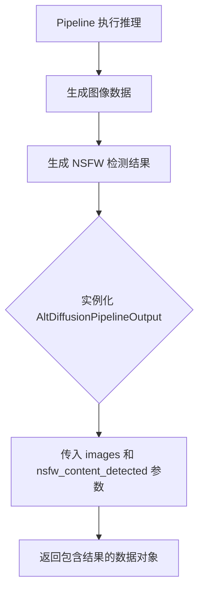
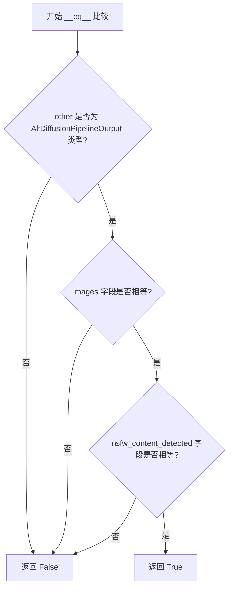

# `diffusers\src\diffusers\pipelines\deprecated\alt_diffusion\pipeline_output.py` 详细设计文档

该代码文件定义了一个名为 AltDiffusionPipelineOutput 的数据类（Dataclass），继承自 BaseOutput，用于结构化地存储 Alt Diffusion 图像生成流水线的输出结果，包括去噪后的图像列表以及可选的 NSFW（不适合在工作场所查看）内容检测标志。

## 整体流程



## 类结构

```
BaseOutput (基础输出类)
└── AltDiffusionPipelineOutput (Alt管道输出类)
```

## 全局变量及字段


### `AltDiffusionPipelineOutput.images`
    
生成的图像列表，可以是PIL图像列表或NumPy数组格式

类型：`list[PIL.Image.Image] | np.ndarray`
    


### `AltDiffusionPipelineOutput.nsfw_content_detected`
    
检测结果列表，标识对应图像是否包含NSFW内容，若无法检测则为None

类型：`list[bool] | None`
    
    

## 全局函数及方法


### AltDiffusionPipelineOutput.__init__

这是 AltDiffusionPipelineOutput 类的初始化方法，由 Python 的 `@dataclass` 装饰器自动生成。该类用于存储 Alt Diffusion 管道生成图像的输出结果，包含生成的图像列表以及对应的 NSFW（不适合工作场所）内容检测标志。

参数：

- `self`：隐式参数，表示类的实例本身
- `images`：`list[PIL.Image.Image] | np.ndarray`，生成的图像列表，可以是 PIL Image 列表或 NumPy 数组，形状为 (batch_size, height, width, num_channels)
- `nsfw_content_detected`：`list[bool] | None`，布尔标志列表，表示对应生成的图像是否包含 NSFW 内容，若为 None 则表示无法进行安全检查

返回值：无（`@dataclass` 自动生成的 `__init__` 方法返回 `None`）

#### 流程图

```mermaid
flowchart TD
    A[开始 __init__] --> B{检查 images 类型}
    B -->|list[PIL.Image.Image]| C[存储 PIL 图像列表]
    B -->|np.ndarray| D[存储 NumPy 数组]
    E{检查 nsfw_content_detected 类型} -->|list[bool]| F[存储布尔标志列表]
    E -->|None| G[存储 None 值]
    C --> H[完成初始化]
    D --> H
    F --> H
    G --> H
```

#### 带注释源码

```python
@dataclass
# Copied from diffusers.pipelines.stable_diffusion.pipeline_output.StableDiffusionPipelineOutput with Stable->Alt
class AltDiffusionPipelineOutput(BaseOutput):
    """
    Output class for Alt Diffusion pipelines.

    Args:
        images (`list[PIL.Image.Image]` or `np.ndarray`)
            list of denoised PIL images of length `batch_size` or NumPy array of shape `(batch_size, height, width,
            num_channels)`.
        nsfw_content_detected (`list[bool]` or `None`)
            list indicating whether the corresponding generated image contains "not-safe-for-work" (nsfw) content or
            `None` if safety checking could not be performed.
    """

    # images 字段：存储生成的图像，支持 PIL Image 列表或 NumPy 数组
    images: list[PIL.Image.Image] | np.ndarray
    # nsfw_content_detected 字段：存储 NSFW 内容检测结果
    nsfw_content_detected: list[bool] | None
    
    # 注意：由于使用了 @dataclass 装饰器，
    # Python 自动生成如下 __init__ 方法：
    #
    # def __init__(
    #     self,
    #     images: list[PIL.Image.Image] | np.ndarray,
    #     nsfw_content_detected: list[bool] | None
    # ) -> None:
    #     self.images = images
    #     self.nsfw_content_detected = nsfw_content_detected
```


### `AltDiffusionPipelineOutput.__repr__`

该方法是 Python dataclass 自动生成的 magic method，用于返回对象的字符串表示形式，包含类名和所有字段的名称及值。

参数：

- `self`：`AltDiffusionPipelineOutput`，隐式参数，表示当前实例对象

返回值：`str`，对象的字符串表示，包含类名和所有字段的名称及值

#### 流程图

```mermaid
flowchart TD
    A[__repr__ 被调用] --> B{self 是 AltDiffusionPipelineOutput 实例}
    B -->|是| C[构建包含类名的字符串]
    C --> D[依次添加字段名=字段值的键值对]
    D --> E[返回格式: AltDiffusionPipelineOutput(images=..., nsfw_content_detected=...)]
    B -->|否| F[返回默认对象表示]
```

#### 带注释源码

```
def __repr__(self):
    """
    自动生成的 __repr__ 方法，由 @dataclass 装饰器提供。
    返回包含类名和所有字段信息的字符串表示。
    
    返回格式示例:
    'AltDiffusionPipelineOutput(images=[...], nsfw_content_detected=[...])'
    """
    return (
        f"{self.__class__.__name__}("
        f"images={self.images!r}, "
        f"nsfw_content_detected={self.nsfw_content_detected!r})"
    )
```

> **注意**：由于 `AltDiffusionPipelineOutput` 使用了 `@dataclass` 装饰器但未设置 `repr=False`，Python 会自动为该类生成 `__repr__` 方法。该方法展示了对象的所有属性及其值，便于调试和日志输出。


### `AltDiffusionPipelineOutput.__eq__`

该方法在提供的代码中没有显式定义。由于 `AltDiffusionPipelineOutput` 是一个使用 `@dataclass` 装饰器定义的类，Python 会自动为其生成一个 `__eq__` 方法。该方法用于比较两个 `AltDiffusionPipelineOutput` 实例是否相等，基于所有字段的值进行比较。

参数：

- `self`：`AltDiffusionPipelineOutput`，当前对象（隐式参数）
- `other`：`Any`，要比较的其他对象

返回值：`bool`，如果两个对象相等则返回 `True`，否则返回 `False`

#### 流程图



#### 带注释源码

```python
# 由于 AltDiffusionPipelineOutput 是 dataclass 且 eq=True（默认），
# Python 会自动生成如下 __eq__ 方法：

def __eq__(self, other: object) -> bool:
    """
    比较两个 AltDiffusionPipelineOutput 实例是否相等。
    
    比较逻辑：
    1. 首先检查 other 是否为 AltDiffusionPipelineOutput 类型
    2. 如果是，则比较所有字段（images 和 nsfw_content_detected）的值
    3. 如果所有字段都相等，则返回 True，否则返回 False
    4. 如果 other 不是相同类型，直接返回 False
    """
    if not isinstance(other, AltDiffusionPipelineOutput):
        return NotImplemented
    
    # 比较 images 字段
    if self.images != other.images:
        return False
    
    # 比较 nsfw_content_detected 字段
    if self.nsfw_content_detected != other.nsfw_content_detected:
        return False
    
    return True
```

## 关键组件


### AltDiffusionPipelineOutput 类

继承自BaseOutput的数据类，用于Alt Diffusion管道的输出封装，包含生成图像和NSFW内容检测结果。

### images 字段

类型为 `list[PIL.Image.Image] | np.ndarray`，存储去噪后的PIL图像列表或NumPy数组，格式为`(batch_size, height, width, num_channels)`。

### nsfw_content_detected 字段

类型为 `list[bool] | None`，标识对应的生成图像是否包含"不适合工作场所"(NSFW)内容，若无法执行安全检查则为None。

### BaseOutput 继承

继承自 `....utils` 模块中的BaseOutput基类，提供了基础输出结构的接口契约。


## 问题及建议


### 已知问题

-   **代码重复**：该类是从 `diffusers.pipelines.stable_diffusion.pipeline_output.StableDiffusionPipelineOutput` 直接复制并修改类名而成，存在代码重复问题，建议抽取公共基类或使用组合方式复用代码
-   **类型注解兼容性**：使用 Python 3.10+ 的类型联合语法 (`|` 操作符)，不兼容 Python 3.9 及以下版本
-   **缺少输入验证**：`images` 和 `nsfw_content_detected` 字段没有在 `__post_init__` 中进行类型和长度一致性验证，可能导致运行时错误
-   **字段不可选**：所有字段都是必需的，没有默认值，在某些场景下使用不够灵活
-   **文档不完整**：注释中包含 "Copied from..." 和 "Stable->Alt" 等内部开发记录，不适合作为最终文档

### 优化建议

-   **添加类型验证**：实现 `__post_init__` 方法验证 `images` 和 `nsfw_content_detected` 的类型，以及两者长度的一致性
-   **支持可选字段**：考虑为 `nsfw_content_detected` 提供默认值 `None`，或使用 `field(default=None)` 使其可选
-   **兼容旧版 Python**：将 `list[PIL.Image.Image] | np.ndarray` 改为 `Union[List[PIL.Image.Image], np.ndarray]`，提高兼容性
-   **清理文档**：移除内部开发注释，使用更清晰的文档字符串描述类用途
-   **考虑泛型设计**：如果多个 Pipeline Output 类结构类似，可考虑使用泛型基类减少代码重复
-   **添加序列化支持**：如需要持久化，可考虑添加 `to_dict`、`from_dict` 方法或使用 Pydantic 替代 dataclass


## 其它


### 设计目标与约束

设计目标：定义Alt Diffusion管道输出数据的标准结构，支持批量图像生成结果的安全检测标注，兼容PIL.Image和NumPy数组两种图像格式。

设计约束：images字段必须为list类型或np.ndarray类型；nsfw_content_detected字段必须为list类型或None；两个字段长度需保持一致（当不为None时）。

### 错误处理与异常设计

字段类型检查在数据类实例化时由Python dataclass机制自动处理；若images与nsfw_content_detected类型不匹配，调用方需自行保证一致性；建议在管道上游进行批量大小一致性校验。

### 外部依赖与接口契约

依赖项：PIL.Image用于图像处理；numpy用于数值数组操作；BaseOutput来自....utils模块，定义了基础输出接口。

接口契约：AltDiffusionPipelineOutput实现了BaseOutput基类约定的输出协议；images字段返回原始图像数据（未经过后处理）；nsfw_content_detected字段返回安全检查结果列表，None表示未执行安全检测。

### 兼容性考虑

该类采用@dataclass装饰器，确保与Python 3.7+版本兼容；类型注解使用Python 3.10+的联合类型语法（|），需注意低版本Python的兼容处理；继承自BaseOutput以保证与diffusers库其他管道输出类的一致性。

### 性能考虑

数据类实例化开销较低；images字段直接引用传入的图像对象而非复制，利于内存效率；建议批量生成时复用同一输出实例以减少GC压力。

### 安全性考虑

nsfw_content_detected字段用于标记潜在不当内容，需确保检测结果与图像一一对应；敏感图像数据应在管道下游进行适当处理或脱敏。

### 使用示例与调用约定

该输出类通常由AltDiffusionPipeline的__call__方法返回；调用方需检查nsfw_content_detected是否为None以判断安全检测是否执行；建议在UI展示前过滤nsfw_content_detected为True的图像。


    