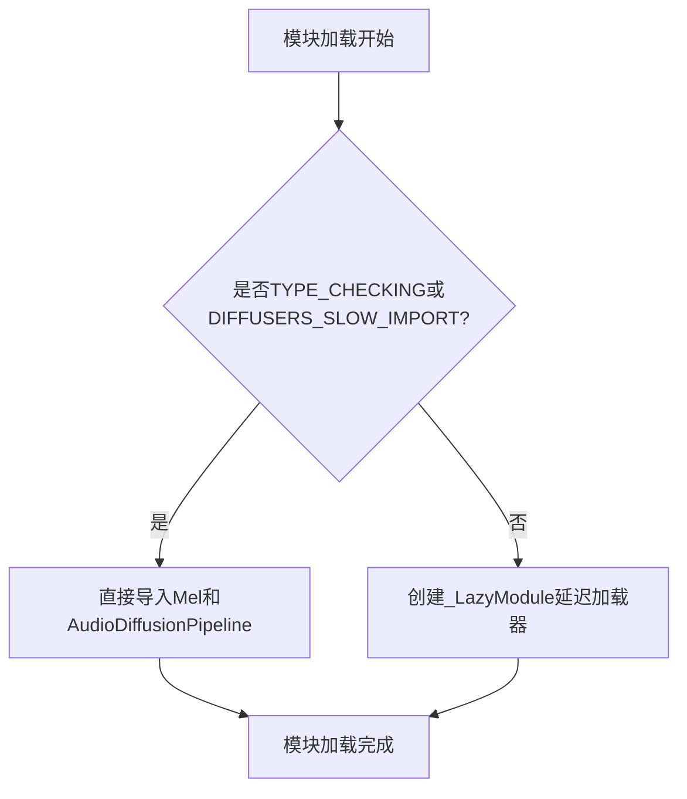

# `diffusers\src\diffusers\pipelines\deprecated\audio_diffusion\__init__.py` 详细设计文档

这是一个Python包的初始化文件，实现了diffusers音频处理模块的延迟加载机制。通过定义导入结构和条件导入逻辑，在保证类型检查支持的同时，优化了模块的导入性能。

## 整体流程



## 类结构

```
diffusers.audio (包)
└── __init__.py (延迟加载入口)
```

## 全局变量及字段


### `_import_structure`
    
定义可导入的子模块和类，键为子模块路径，值为对应的类名列表

类型：`dict`
    


### `TYPE_CHECKING`
    
typing检查标志，用于条件导入以避免运行时循环依赖

类型：`bool`
    


### `DIFFUSERS_SLOW_IMPORT`
    
延迟导入开关，控制是否启用LazyModule进行惰性加载

类型：`bool`
    


    

## 全局函数及方法


## 关键组件


### 延迟加载模块系统

该模块采用_LazyModule实现延迟加载机制，仅在真正需要时导入Mel和AudioDiffusionPipeline类，优化了导入速度并避免了循环依赖问题。

### 模块导入结构定义

_import_structure字典定义了模块的公共API接口，包含"mel"和"pipeline_audio_diffusion"两个子模块的导出映射，供LazyModule初始化使用。

### 条件类型检查支持

通过TYPE_CHECKING标志实现类型提示的导入，在静态类型检查时直接导入真实类，在运行时使用延迟加载的代理模块。

### Mel类组件

负责音频到梅尔频谱图的转换处理，是音频扩散管道的前处理组件。

### AudioDiffusionPipeline类组件

核心音频扩散管道类，封装了从噪声生成音频的完整扩散模型推理流程。


## 问题及建议


### 已知问题

-   **缺少模块级文档字符串**：整个模块缺少 docstring，导致无法直接了解该模块的用途和职责
-   **缺乏错误处理机制**：当 Mel 或 AudioDiffusionPipeline 导入失败时，没有异常捕获和友好错误提示
-   **未定义公开 API**：缺少 `__all__` 声明来明确哪些是公开导出的接口
-   **硬编码的导入结构**：_import_structure 字典内容硬编码，缺乏灵活性和可扩展性
-   **弱耦合的内部依赖**：直接依赖内部工具 `_LazyModule` 和 `DIFFUSERS_SLOW_IMPORT`，对底层实现细节耦合度过高
-   **无版本兼容性检查**：对导入的类没有版本或兼容性验证机制

### 优化建议

-   为模块添加 docstring，说明该模块是音频扩散管道的导入聚合模块
-   使用 try-except 包装导入逻辑，提供更友好的错误信息
-   添加 `__all__ = ["Mel", "AudioDiffusionPipeline"]` 明确公开接口
-   考虑将 _import_structure 抽取为配置或使用插件式架构提高可扩展性
-   封装对内部工具的依赖，通过抽象接口降低耦合度
-   在 TYPE_CHECKING 分支中添加类型检查和版本兼容性验证逻辑


## 其它


### 设计目标与约束

本模块的设计目标是实现音频扩散（Audio Diffusion）模块的延迟加载机制，优化导入速度并减少不必要的内存占用。约束条件包括：1) 必须兼容Python的TYPE_CHECKING模式以支持类型检查；2) 必须与Diffusers库的_LazyModule机制保持一致；3) 必须在DIFFUSERS_SLOW_IMPORT标志为True时进行完整导入；4) 模块导出结构必须遵循Diffusers库的约定。

### 错误处理与异常设计

本模块本身不直接抛出业务异常，其错误处理主要依赖于导入机制的异常传播。当延迟加载的模块（如mel.py或pipeline_audio_diffusion.py）不存在或导入失败时，Python的ImportError会被抛出。建议在调用方使用try-except捕获ImportError以处理可选依赖缺失的情况。同时，若__spec__为None（如在某些交互式环境中），延迟加载机制可能失效，需要做好降级处理。

### 外部依赖与接口契约

本模块依赖以下外部组件：1) typing.TYPE_CHECKING - 用于类型检查时的导入；2) ....utils.DIFFUSERS_SLOW_IMPORT - 控制是否使用延迟加载的标志；3) ....utils._LazyModule - Diffusers库的延迟加载实现类；4) .mel.Mel - 本地模块，需与mel.py接口一致；5) .pipeline_audio_diffusion.AudioDiffusionPipeline - 本地模块，需与pipeline_audio_diffusion.py接口一致。接口契约要求导出的Mel和AudioDiffusionPipeline类必须在对应的子模块中存在且可实例化。

### 模块初始化流程

本模块采用条件初始化策略：1) 当DIFFUSERS_SLOW_IMPORT为True或处于TYPE_CHECKING模式时，直接导入Mel和AudioDiffusionPipeline类；2) 否则，将当前模块注册为_LazyModule实例，实现运行时延迟导入。延迟加载的触发时机为首次访问模块属性时，此时_LazyModule会根据_import_structure字典加载对应的子模块。

### 性能考量与优化建议

本模块的性能优化主要体现在延迟加载机制上，可避免在主程序启动时加载不必要的模块。为进一步优化，建议：1) 确保mel.py和pipeline_audio_diffusion.py的导入操作尽可能轻量；2) 考虑使用__all__显式声明导出接口；3) 对于大型模型类，可考虑进一步的子模块延迟加载。

### 版本兼容性说明

本模块兼容Python 3.7+及Diffusers库0.x系列版本。由于使用了TYPE_CHECKING和_LazyModule机制，需要确保....utils模块中提供了相应的接口。Python版本差异可能导致__spec__属性的可用性不一致，建议在生产环境中进行多版本测试。

### 代码组织与模块关系

本模块位于音频扩散包的核心入口位置，负责整合Mel（音频特征提取）和AudioDiffusionPipeline（扩散管道）两个核心组件。上层调用者通过本模块统一的导出接口访问功能，无需关心具体的实现细节和加载策略。这种设计遵循了依赖倒置原则，便于模块的解耦和替换。


    