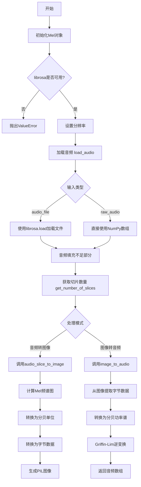
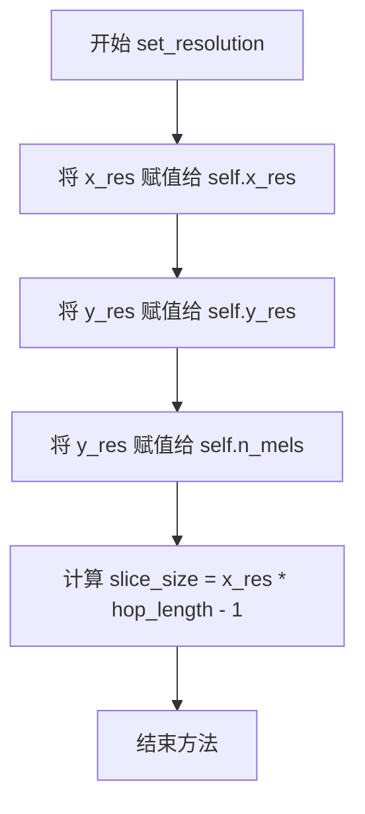
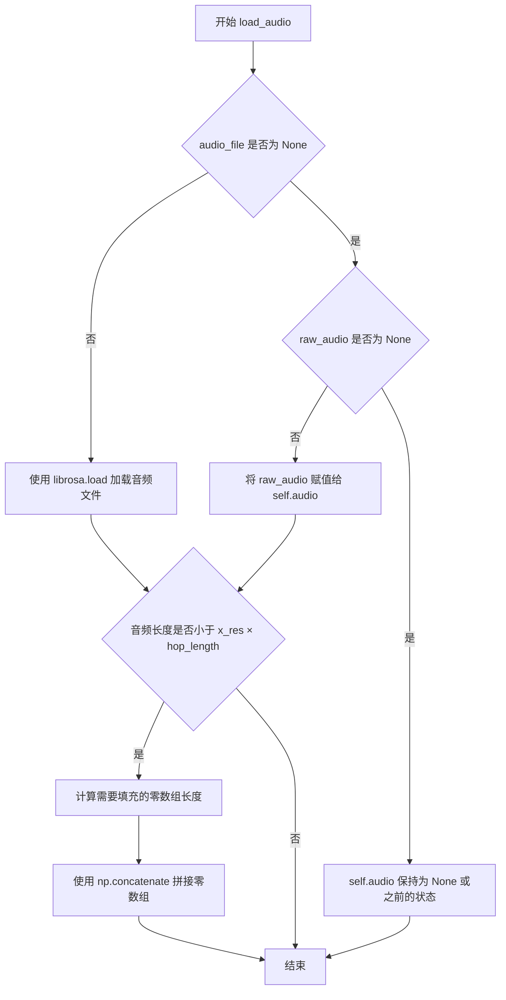
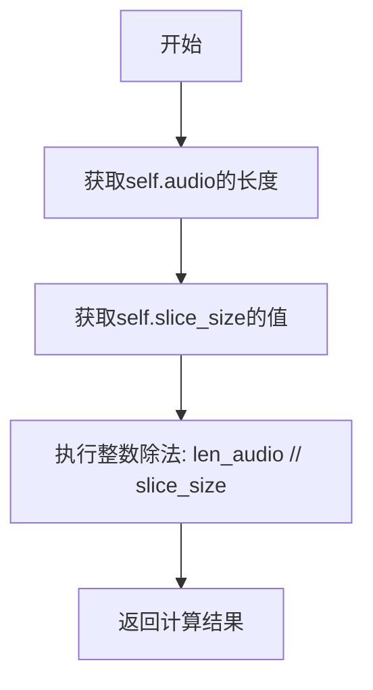
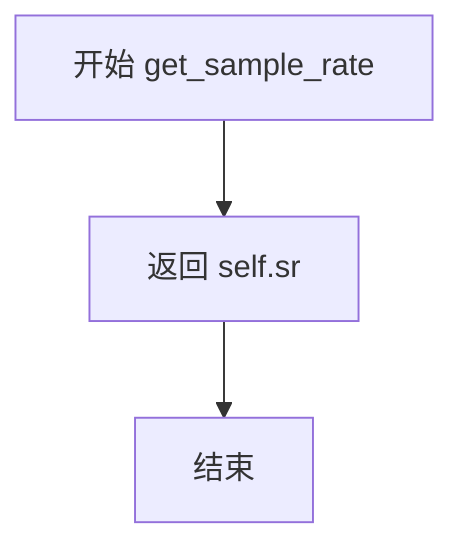
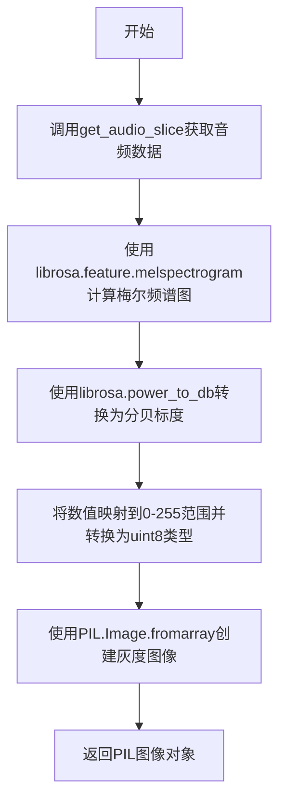
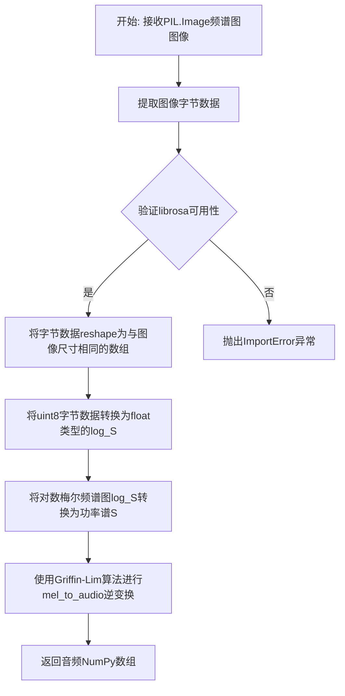

# `diffusers\src\diffusers\pipelines\deprecated\audio_diffusion\mel.py` 详细设计文档

该代码实现了一个Mel频谱图处理器类Mel，用于在音频和图像之间进行双向转换。它利用librosa库进行Mel频谱图计算和Griffin-Lim逆变换，通过PIL库将音频片段转换为频谱图像，或将频谱图像还原为音频片段，支持配置分辨率、采样率、FFT参数等音频处理参数。

## 整体流程



## 类结构

```
Mel (Mel频谱图处理器)
├── ConfigMixin (配置混入基类)
└── SchedulerMixin (调度器混入基类)
```

## 全局变量及字段


### `_librosa_can_be_imported`
    
librosa库是否可导入的标志

类型：`bool`
    


### `_import_error`
    
librosa导入错误信息

类型：`str`
    


### `Mel.hop_length`
    
帧移长度

类型：`int`
    


### `Mel.sr`
    
采样率

类型：`int`
    


### `Mel.n_fft`
    
FFT窗口大小

类型：`int`
    


### `Mel.top_db`
    
最大分贝值

类型：`int`
    


### `Mel.n_iter`
    
Griffin-Lim迭代次数

类型：`int`
    


### `Mel.x_res`
    
频谱图时间分辨率

类型：`int`
    


### `Mel.y_res`
    
频谱图频率分辨率

类型：`int`
    


### `Mel.n_mels`
    
Mel滤波器数量

类型：`int`
    


### `Mel.slice_size`
    
音频切片大小

类型：`int`
    


### `Mel.audio`
    
音频数据数组

类型：`np.ndarray`
    
    

## 全局函数及方法


### `Mel.__init__`

这是 `Mel` 类的初始化方法，用于配置梅尔频谱图（Mel Spectrogram）的相关参数，包括分辨率、采样率、FFT参数等，并检查依赖库 librosa 是否可用。

参数：

- `self`：隐式参数，表示类的实例本身
- `x_res`：`int`，默认为 256，梅尔频谱图的 x 轴分辨率（时间维度）
- `y_res`：`int`，默认为 256，梅尔频谱图的 y 轴分辨率（频率 bins 数量）
- `sample_rate`：`int`，默认为 22050，音频采样率
- `n_fft`：`int`，默认为 2048，快速傅里叶变换的样本数
- `hop_length`：`int`，默认为 512，帧移长度（如果 y_res < 256，建议使用较大的值）
- `top_db`：`int`，默认为 80，最响的分贝值
- `n_iter`：`int`，默认为 32，Griffin-Lim 梅尔反演迭代次数

返回值：无（`None`），构造函数不返回任何值

#### 流程图

```mermaid
flowchart TD
    A[开始 __init__] --> B[设置 self.hop_length]
    B --> C[设置 self.sr = sample_rate]
    C --> D[设置 self.n_fft]
    D --> E[设置 self.top_db]
    E --> F[设置 self.n_iter]
    F --> G[调用 set_resolution(x_res, y_res)]
    G --> H[初始化 self.audio = None]
    H --> I{检查 librosa 是否可用?}
    I -->|是| J[初始化完成]
    I -->|否| K[抛出 ValueError 异常]
    K --> L[结束]
```

#### 带注释源码

```python
@register_to_config
def __init__(
    self,
    x_res: int = 256,
    y_res: int = 256,
    sample_rate: int = 22050,
    n_fft: int = 2048,
    hop_length: int = 512,
    top_db: int = 80,
    n_iter: int = 32,
):
    """
    初始化 Mel 频谱图处理器。

    参数:
        x_res (int): 频谱图 x 分辨率（时间维度），默认 256
        y_res (int): 频谱图 y 分辨率（频率 bins），默认 256
        sample_rate (int): 音频采样率，默认 22050 Hz
        n_fft (int): FFT 窗口大小，默认 2048
        hop_length (int): 帧移长度，默认 512
        top_db (int): 最大分贝值，默认 80
        n_iter (int): Griffin-Lim 迭代次数，默认 32
    """
    # 设置帧移长度
    self.hop_length = hop_length
    
    # 设置采样率（sr 为 sample_rate 的缩写）
    self.sr = sample_rate
    
    # 设置 FFT 点数
    self.n_fft = n_fft
    
    # 设置最大分贝阈值
    self.top_db = top_db
    
    # 设置 Griffin-Lim 迭代次数
    self.n_iter = n_iter
    
    # 调用内部方法设置 x 和 y 分辨率，同时初始化 n_mels 和 slice_size
    self.set_resolution(x_res, y_res)
    
    # 初始化音频数据为 None，等待加载
    self.audio = None

    # 检查 librosa 库是否成功导入
    # 如果导入失败，抛出 ValueError 并提示错误信息
    if not _librosa_can_be_imported:
        raise ValueError(_import_error)
```


### `Mel.set_resolution`

设置频谱图的分辨率（x_res 和 y_res），并根据这些分辨率计算相关的内部属性，如 n_mels 和 slice_size。

参数：

- `x_res`：`int`，频谱图的 x 分辨率（时间维度）
- `y_res`：`int`，频谱图的 y 分辨率（频率 bins 数量）

返回值：`None`，该方法无返回值，仅修改实例的内部状态。

#### 流程图



#### 带注释源码

```python
def set_resolution(self, x_res: int, y_res: int):
    """Set resolution.

    Args:
        x_res (`int`):
            x resolution of spectrogram (time).
        y_res (`int`):
            y resolution of spectrogram (frequency bins).
    """
    # 设置频谱图的时间分辨率（x轴）
    self.x_res = x_res
    # 设置频谱图的频率分辨率（y轴）
    self.y_res = y_res
    # mel 滤波器的数量等于频率分辨率
    self.n_mels = self.y_res
    # 计算每个音频切片的大小：x_res * hop_length - 1
    # 用于后续将音频分割成多个片段
    self.slice_size = self.x_res * self.hop_length - 1
```


### `Mel.load_audio`

该方法用于加载音频文件或原始音频数据到Mel频谱图处理器中，支持从磁盘读取音频文件或直接接受NumPy数组形式的原始音频，并在音频长度不足时自动填充静音段以满足后续处理需求。

参数：

- `audio_file`：`str`，可选参数，用于指定磁盘上的音频文件路径，由于Librosa库的限制，音频文件必须存在于磁盘上
- `raw_audio`：`np.ndarray`，可选参数，以NumPy数组形式提供的原始音频数据

返回值：`None`，该方法直接修改实例的`self.audio`属性，不返回任何值

#### 流程图



#### 带注释源码

```python
def load_audio(self, audio_file: str = None, raw_audio: np.ndarray = None):
    """Load audio.

    Args:
        audio_file (`str`):
            An audio file that must be on disk due to [Librosa](https://librosa.org/) limitation.
        raw_audio (`np.ndarray`):
            The raw audio file as a NumPy array.
    """
    # 判断是否提供了音频文件路径
    if audio_file is not None:
        # 使用 librosa 库加载音频文件
        # mono=True 表示转换为单声道
        # sr=self.sr 表示按照实例配置的采样率进行重采样
        self.audio, _ = librosa.load(audio_file, mono=True, sr=self.sr)
    else:
        # 如果没有提供文件路径，则直接使用提供的原始音频数组
        self.audio = raw_audio

    # 检查加载后的音频长度是否满足最低处理要求
    # 需要确保音频长度至少为 x_res × hop_length 以便进行频谱图切片处理
    if len(self.audio) < self.x_res * self.hop_length:
        # 计算需要填充的静音长度
        padding_length = self.x_res * self.hop_length - len(self.audio)
        # 在音频末尾填充零数组（静音）
        self.audio = np.concatenate([self.audio, np.zeros((padding_length,))])
```


### Mel.get_number_of_slices

该方法用于计算音频可以被切片（分割）成多少个频谱图切片，基于音频长度和预先设置的切片大小（slice_size）进行整数除法运算。

参数：无需参数（仅包含隐式参数 `self`）

返回值：`int`，表示音频可以被切片成的频谱图数量

#### 流程图



#### 带注释源码

```python
def get_number_of_slices(self) -> int:
    """Get number of slices in audio.

    Returns:
        `int`:
            Number of spectograms audio can be sliced into.
    """
    # 使用整数除法计算音频可以切分的切片数量
    # len(self.audio): 当前加载的音频样本总数
    # self.slice_size: 每个切片包含的样本数 (等于 x_res * hop_length - 1)
    # 整数除法确保返回完整的切片数量，忽略不足一个切片的尾部音频
    return len(self.audio) // self.slice_size
```

---

### 补充信息

#### 关键组件信息

| 组件名称 | 一句话描述 |
|---------|-----------|
| `Mel` 类 | 音频到频谱图的转换器，支持切片、加载和互转 |
| `slice_size` | 每个音频切片包含的样本数，由 x_res 和 hop_length 计算 |
| `audio` | 当前加载的音频数据（NumPy 数组） |

#### 潜在技术债务与优化空间

1. **整数除法精度问题**：使用 `//` 整除会丢弃余数，可能导致部分音频数据未被利用。可考虑返回 `(total, remainder)` 元组或提供 `get_remainder_samples()` 方法。
2. **除零风险**：若 `slice_size` 为 0 会抛出异常，应在 `set_resolution` 中增加校验。
3. **硬编码减 1**：`self.slice_size = self.x_res * self.hop_length - 1` 中的 `-1` 缺乏注释说明其业务含义。

#### 其它项目

- **前置条件**：必须先调用 `load_audio()` 加载音频，否则 `self.audio` 为 `None` 会导致 `TypeError`。
- **异常处理**：当音频长度小于切片大小时，返回 0，此时 `get_audio_slice(0)` 将返回空数组。
- **设计意图**：该方法配合 `get_audio_slice(slice)` 使用，用于将长音频分割为固定大小的块以进行批量处理。


### `Mel.get_audio_slice`

获取音频切片方法，根据指定的切片编号返回对应的音频数据片段。

参数：

-  `slice`：`int`，切片编号（基于 `get_number_of_slices()` 方法返回的总切片数）

返回值：`np.ndarray`，返回的音频切片数据，以 NumPy 数组形式呈现

#### 流程图

```mermaid
graph TD
    A[开始 get_audio_slice] --> B[计算起始索引: start = slice_size * slice]
    B --> C[计算结束索引: end = slice_size * (slice + 1)]
    C --> D[返回音频切片: self.audio[start:end]]
    D --> E[结束]
```

#### 带注释源码

```python
def get_audio_slice(self, slice: int = 0) -> np.ndarray:
    """Get slice of audio.

    Args:
        slice (`int`):
            Slice number of audio (out of `get_number_of_slices()`).

    Returns:
        `np.ndarray`:
            The audio slice as a NumPy array.
    """
    # 根据切片索引计算起始位置：每个切片的大小乘以切片编号
    start_index = self.slice_size * slice
    # 根据切片索引计算结束位置：起始位置加上一个切片的宽度
    end_index = self.slice_size * (slice + 1)
    # 使用数组切片语法返回对应区间的音频数据
    return self.audio[start_index:end_index]
```


### `Mel.get_sample_rate`

获取音频的采样率。该方法是一个简单的getter方法，用于返回Mel类实例化时设置的采样率值。

参数： 无

返回值：`int`，音频的采样率（单位：Hz）。

#### 流程图



#### 带注释源码

```python
def get_sample_rate(self) -> int:
    """获取音频的采样率。
    
    Returns:
        `int`:
            音频的采样率（sample_rate），单位为Hz。
    """
    return self.sr  # 返回实例变量 self.sr，该值在 __init__ 方法中通过 sample_rate 参数初始化
```


### `Mel.audio_slice_to_image`

该方法将音频的指定切片转换为梅尔频谱图（Mel Spectrogram）图像。它首先通过librosa计算梅尔频谱图，然后将其转换为分贝标度，最后将数值映射到0-255范围并生成灰度PIL图像，用于可视化或进一步的图像处理任务。

参数：

- `slice`：`int`，音频切片编号，范围从0到`get_number_of_slice()`返回的总切片数减1

返回值：`PIL.Image`，一个x_res x y_res分辨率的灰度图像，表示音频切片的梅尔频谱图

#### 流程图



#### 带注释源码

```python
def audio_slice_to_image(self, slice: int) -> Image.Image:
    """Convert slice of audio to spectrogram.

    Args:
        slice (`int`):
            Slice number of audio to convert (out of `get_number_of_slices()`).

    Returns:
        `PIL Image`:
            A grayscale image of `x_res x y_res`.
    """
    # 第一步：获取指定切片的音频数据
    # 调用get_audio_slice方法，传入切片索引，返回该切片的音频数据（numpy数组）
    S = librosa.feature.melspectrogram(
        y=self.get_audio_slice(slice),  # 输入音频波形数据
        sr=self.sr,                      # 采样率，来自类属性
        n_fft=self.n_fft,                # FFT窗口大小，来自类属性
        hop_length=self.hop_length,      # 帧移长度，来自类属性
        n_mels=self.n_mels               # 梅尔滤波器组数量，等于y_res
    )
    
    # 第二步：将功率谱转换为分贝标度
    # librosa.power_to_db将功率谱转换为分贝（dB）标度
    # ref=np.max表示参考最大值为0dB，top_db限制动态范围
    log_S = librosa.power_to_db(S, ref=np.max, top_db=self.top_db)
    
    # 第三步：将分贝值归一化到0-255范围并转换为字节数据
    # 1. 将log_S从[-top_db, 0]范围映射到[0, 255]
    # 2. clip(0, 255)确保值不会超出字节范围
    # 3. +0.5用于四舍五入
    # 4. astype(np.uint8)转换为无符号字节类型
    bytedata = (((log_S + self.top_db) * 255 / self.top_db).clip(0, 255) + 0.5).astype(np.uint8)
    
    # 第四步：将numpy数组转换为PIL灰度图像
    # Image.fromarray将numpy数组转换为PIL图像对象
    # 图像尺寸为y_res x x_res（高度x宽度）
    image = Image.fromarray(bytedata)
    
    # 返回生成的梅尔频谱图图像
    return image
```


### `Mel.image_to_audio`

该方法将梅尔频谱图的灰度图像转换回音频波形数据。通过逆向处理图像生成流程，将像素值转换回对数梅尔频谱图，再利用librosa的Griffin-Lim算法进行逆变换得到音频信号。

参数：

- `image`：`PIL.Image`，一个 x_res × y_res 的灰度图像，表示梅尔频谱图

返回值：`np.ndarray`，转换后的音频数据，作为NumPy数组返回

#### 流程图



#### 带注释源码

```python
def image_to_audio(self, image: Image.Image) -> np.ndarray:
    """Converts spectrogram to audio.

    Args:
        image (`PIL Image`):
            An grayscale image of `x_res x y_res`.

    Returns:
        audio (`np.ndarray`):
            The audio as a NumPy array.
    """
    # 从PIL图像提取原始字节数据，并重塑为与图像尺寸(height x width)相同的NumPy数组
    # 这里的bytedata是uint8类型，范围0-255
    bytedata = np.frombuffer(image.tobytes(), dtype="uint8").reshape((image.height, image.width))
    
    # 将字节数据(0-255)转换回对数梅尔频谱图的浮点数表示
    # 步骤: 先归一化到0-1范围，乘以top_db(分贝最大值)，再减去top_db得到负的分贝值
    log_S = bytedata.astype("float") * self.top_db / 255 - self.top_db
    
    # 将分贝表示的对数功率谱转换为线性功率谱
    # librosa.db_to_power是power_to_db的逆操作
    S = librosa.db_to_power(log_S)
    
    # 使用Griffin-Lim算法从梅尔频谱图逆变换回音频波形
    # n_iter参数控制迭代次数，次数越多质量越好但计算越慢
    audio = librosa.feature.inverse.mel_to_audio(
        S, sr=self.sr, n_fft=self.n_fft, hop_length=self.hop_length, n_iter=self.n_iter
    )
    
    # 返回转换后的音频数据作为NumPy数组
    return audio
```

## 关键组件


### Mel 类

核心处理类，继承自 ConfigMixin 和 SchedulerMixin，负责梅尔频谱图的生成与逆转换，支持音频文件加载、切片以及与图像的双向转换。

### 张量索引与切片

`get_audio_slice` 方法通过计算切片索引 (`self.slice_size * slice : self.slice_size * (slice + 1)`) 从完整音频中提取指定片段，实现音频的离散化处理。`get_number_of_slices` 方法计算可划分的切片总数。

### 音频惰性加载

`load_audio` 方法支持两种音频加载方式：传入文件路径时使用 librosa.load 加载，或直接传入原始 NumPy 数组。音频数据存储在实例属性 `self.audio` 中，按需加载而非初始化时加载。

### 梅尔频谱图生成

`audio_slice_to_image` 方法将音频切片转换为梅尔频谱图，使用 librosa.feature.melspectrogram 计算梅尔频谱，通过 librosa.power_to_db 转换为分贝表示，最后量化为字节数据并转换为 PIL 图像。

### 反量化与音频重建

`image_to_audio` 方法实现从图像到音频的逆转换：将字节数据反量化回分贝值，通过 librosa.db_to_power 转换回功率谱，最后使用 Griffin-Lim 算法的 mel_to_audio 实现梅尔频谱图到音频的逆转换。

### 配置管理

通过 @register_to_config 装饰器实现配置参数的注册与管理，支持 x_res、y_res、sample_rate、n_fft、hop_length、top_db、n_iter 等参数的配置化。


## 问题及建议


### 已知问题

-   **缺少音频数据校验**：在调用 `get_number_of_slices()` 和 `get_audio_slice()` 前未检查 `self.audio` 是否为 `None`，可能导致 `AttributeError`
-   **无效参数未验证**：`hop_length` 为 0 时会导致除零错误；`x_res`、`y_res` 等参数未进行非负或非零校验
-   **魔法数字**：`slice_size = self.x_res * self.hop_length - 1` 中的 `-1` 缺乏注释说明，语义不明确
-   **资源释放缺失**：未实现 `__del__` 或上下文管理器接口，无法显式释放大型音频数据内存
-   **继承冗余**：类同时继承 `ConfigMixin` 和 `SchedulerMixin`，但未使用 `SchedulerMixin` 的任何功能
-   **错误处理不足**：`load_audio` 未捕获 librosa 可能抛出的文件读取异常
-   **类型注解不完整**：部分方法如 `set_resolution` 缺少返回类型注解

### 优化建议

-   在关键方法入口添加参数校验，抛出 `ValueError` 或 `TypeError` 异常
-   将 `slice_size` 计算逻辑提取为属性或方法，并添加文档说明 `-1` 的作用
-   实现 `__enter__` / `__exit__` 上下文管理器协议，或添加 `close()` 方法释放资源
-   考虑使用 `abc` 或接口明确类的职责，移除不必要的继承
-   添加 `try-except` 块包装 `librosa.load` 调用，并提供更友好的错误信息
-   在 `__init__` 方法中初始化 `self.audio = None` 后，可在 `get_number_of_slices` 中显式检查并抛出更有意义的错误

## 其它


### 设计目标与约束

本模块旨在实现音频数据与Mel频谱图图像之间的双向转换，支持音频预处理和后处理流程。设计约束包括：(1) 依赖librosa和PIL库；(2) 仅支持单声道音频处理；(3) 音频文件加载受限于librosa的I/O能力；(4) 图像转换为灰度模式；(5) 切片大小由x_res和hop_length共同决定。

### 错误处理与异常设计

1. **导入错误**：当librosa不可用时，类初始化抛出ValueError并携带导入错误详情；
2. **音频长度不足**：当加载的音频长度小于最小切片要求时，自动补零至最小长度；
3. **参数校验**：x_res、y_res、sample_rate、n_fft、hop_length、top_db、n_iter需为正整数，其中n_fft必须大于等于n_mels；
4. **索引越界**：get_audio_slice和audio_slice_to_image方法未对slice参数进行边界检查，可能返回空数组或引发异常；
5. **图像格式错误**：image_to_audio未验证输入图像的尺寸是否与配置匹配。

### 数据流与状态机

音频处理流程状态机包含以下状态：
- **INITIAL**：对象初始化完成，audio为None；
- **AUDIO_LOADED**：音频已加载至内存，audio属性不为None；
- **READY**：音频长度满足切片要求，可进行转换操作；
- **PROCESSING**：正在进行音频到图像或图像到音频的转换。

数据流：
1. 外部音频源（文件路径或NumPy数组）→ load_audio() → self.audio
2. self.audio + slice索引 → get_audio_slice() → 音频片段
3. 音频片段 → librosa.feature.melspectrogram() → Mel频谱矩阵
4. Mel频谱矩阵 → librosa.power_to_db() + 归一化 → 字节数据 → PIL Image
5. PIL Image → 反归一化 + librosa.db_to_power() → Mel频谱矩阵
6. Mel频谱矩阵 → librosa.feature.inverse.mel_to_audio() → 音频数组

### 外部依赖与接口契约

**外部依赖**：
- numpy：数值计算和数组操作
- librosa：音频特征提取和Mel频谱图转换
- PIL (Pillow)：图像创建和处理
- configuration_utils：配置混入机制
- scheduling_utils：调度器混入基类

**接口契约**：
- load_audio()：audio_file和raw_audio参数互斥，优先处理audio_file
- get_number_of_slices()：依赖audio已加载且长度大于slice_size
- audio_slice_to_image()：返回x_res × y_res的灰度PIL Image
- image_to_audio()：输入图像尺寸必须为x_res × y_res

### 性能考虑与优化空间

1. **内存占用**：音频数据整体加载可能导致大文件内存溢出，建议支持流式处理或分块加载；
2. **计算效率**：Griffin-Lim迭代次数(n_iter=32)较高，可通过配置降低以提升速度；
3. **缓存优化**：多次调用audio_slice_to_image相同slice时，未使用缓存机制；
4. **向量化操作**：图像与音频的转换可考虑批量处理以提高吞吐量。

### 安全与权限

1. **文件访问**：load_audio的audio_file参数需注意路径遍历攻击风险；
2. **内存安全**：np.concatenate和np.zeros操作需确保不会引发MemoryError；
3. **数据类型安全**：image_to_audio中使用np.frombuffer时未验证图像数据完整性。

### 配置管理

- 默认配置文件名：mel_config.json
- 配置参数通过@register_to_config装饰器注册
- 支持ConfigMixin的save_pretrained和from_pretrained方法
- 配置项包括：x_res、y_res、sample_rate、n_fft、hop_length、top_db、n_iter

### 测试策略建议

1. **单元测试**：覆盖各方法的边界条件和异常场景；
2. **集成测试**：验证完整音频→图像→音频往返转换的保真度；
3. **性能测试**：测量大音频文件的处理时间和内存占用；
4. **回归测试**：确保不同版本间转换结果一致。

### 版本兼容性说明

- 当前版本基于librosa API设计
- n_fft默认值为2048，与常见配置兼容
- hop_length默认值为512，适用于22.05kHz采样率
- 后续版本需关注librosa API变更可能带来的兼容性影响

    