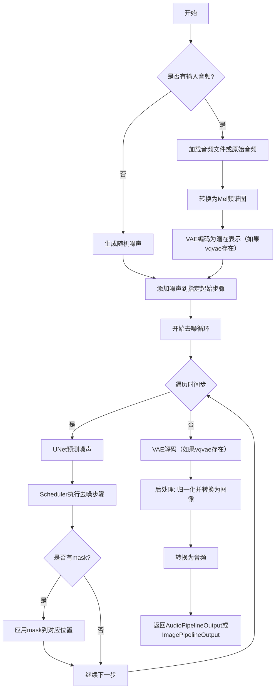
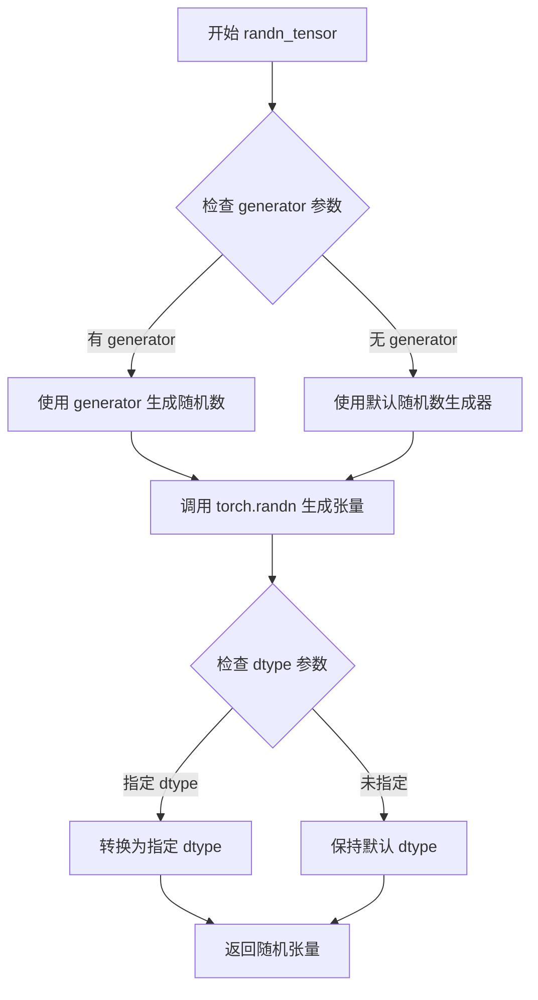
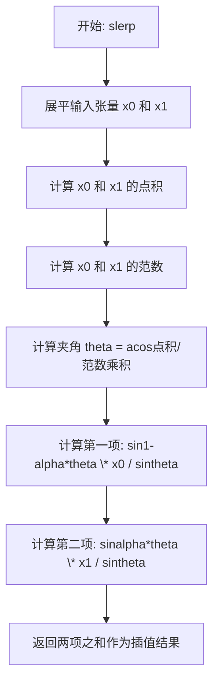
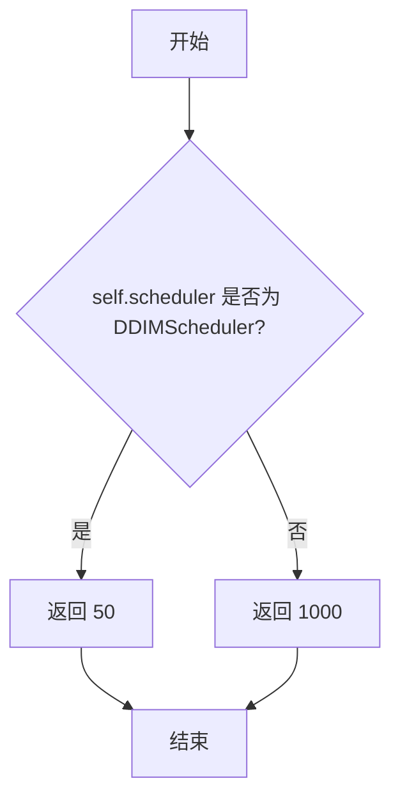
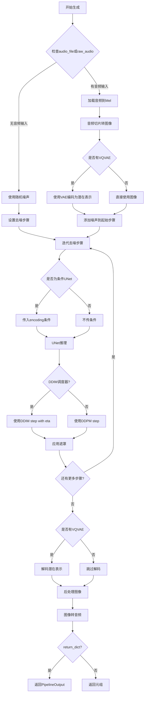
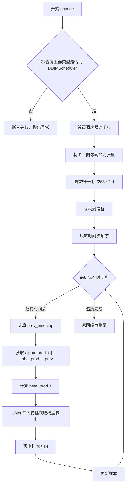

# `diffusers\src\diffusers\pipelines\deprecated\audio_diffusion\pipeline_audio_diffusion.py` 详细设计文档

音频扩散管道（AudioDiffusionPipeline）是一个基于扩散模型的音频生成/处理管道，通过VAE模型编码解码潜在表示，使用UNet模型进行去噪，结合Mel频谱图变换和DDIM/DDPM调度器实现音频的生成、变分、修复等任务。

## 整体流程



## 类结构

```
DiffusionPipeline (基类)
└── AudioDiffusionPipeline
    ├── 依赖组件:
    │   ├── AutoencoderKL (VAE模型)
    │   ├── UNet2DConditionModel (去噪模型)
    │   ├── Mel (音频-频谱图转换)
    │   ├── DDIMScheduler/DDPMScheduler (调度器)
    │   └── vqvae (可选变分自编码器)
```

## 全局变量及字段


### `_optional_components`
    
可选组件列表，包含vqvae

类型：`list[str]`
    


### `AudioDiffusionPipeline.vqvae`
    
可选的变分自编码器，用于编码/解码潜在表示

类型：`AutoencoderKL`
    


### `AudioDiffusionPipeline.unet`
    
UNet去噪模型

类型：`UNet2DConditionModel`
    


### `AudioDiffusionPipeline.mel`
    
音频与Mel频谱图转换器

类型：`Mel`
    


### `AudioDiffusionPipeline.scheduler`
    
扩散调度器

类型：`DDIMScheduler | DDPMScheduler`
    
    

## 全局函数及方法


### `math.acos` 和 `math.sin`

这两个数学函数用于 SLERP（Spherical Linear intERPolation）球面线性插值计算，通过计算夹角 theta 并利用正弦函数对两个张量进行球面插值，实现张量间平滑过渡。

参数：
-  `x0`：`torch.Tensor`，第一个用于插值的张量
-  `x1`：`torch.Tensor`，第二个用于插值的张量
-  `alpha`：`float`，插值因子，范围在 0 到 1 之间

返回值：`torch.Tensor`，球面线性插值后的张量

#### 流程图

```mermaid
flowchart TD
    A[开始 SLERP 插值] --> B[将 x0 和 x1 展平为一维]
    B --> C[计算点积: torch.dot<br>计算范数: torch.norm]
    C --> D[计算归一化余弦值<br>cos_theta = dot / norm_x0 / norm_x1]
    D --> E[调用 acos 计算夹角 theta]
    E --> F[计算 sin_theta = sin<br>计算 sin((1-alpha)\*theta)<br>计算 sin(alpha\*theta)]
    F --> G[计算第一项: sin((1-alpha)\*theta) \* x0 / sin_theta]
    G --> H[计算第二项: sin(alpha\*theta) \* x1 / sin_theta]
    H --> I[返回两项之和作为插值结果]
    I --> J[结束]
```

#### 带注释源码

```python
@staticmethod
def slerp(x0: torch.Tensor, x1: torch.Tensor, alpha: float) -> torch.Tensor:
    """Spherical Linear intERPolation.
    
    这是一个用于在两个张量之间进行球面线性插值的静态方法。
    SLERP 常用于在四元数或方向向量之间进行平滑过渡。

    Args:
        x0 (`torch.Tensor`):
            The first tensor to interpolate between.
            第一个用于插值的张量
        x1 (`torch.Tensor`):
            Second tensor to interpolate between.
            第二个用于插值的张量
        alpha (`float`):
            Interpolation between 0 and 1
            插值因子，0 返回 x0，1 返回 x1，0.5 返回球面中点

    Returns:
        `torch.Tensor`:
            The interpolated tensor.
            球面线性插值后的张量
    """

    # 计算两个张量之间的夹角 theta
    # 步骤：
    # 1. torch.flatten(x0) 和 torch.flatten(x1) 将张量展平为一维向量
    # 2. torch.dot 计算两个向量的点积
    # 3. torch.norm 计算每个向量的 L2 范数（长度）
    # 4. 除以两个范数的乘积得到余弦值
    # 5. acos 将余弦值转换为弧度夹角
    theta = acos(torch.dot(torch.flatten(x0), torch.flatten(x1)) / torch.norm(x0) / torch.norm(x1))
    
    # 计算球面线性插值
    # SLERP 公式：sin((1-α)θ) * x0 / sin(θ) + sin(αθ) * x1 / sin(θ)
    # 其中：
    # - sin((1-α)*theta) 是 x0 的权重，alpha=0 时为 1，alpha=1 时为 0
    # - sin(alpha*theta) 是 x1 的权重，alpha=0 时为 0，alpha=1 时为 1
    # - sin(theta) 是归一化因子
    # sin 函数来自 math 模块，用于计算正弦值
    return sin((1 - alpha) * theta) * x0 / sin(theta) + sin(alpha * theta) * x1 / sin(theta)
```

#### 关键说明

| 组件 | 说明 |
|------|------|
| `acos` | 反余弦函数，输入值范围 [-1, 1]，输出弧度范围 [0, π]，用于计算两个向量间的夹角 |
| `sin` | 正弦函数，用于计算插值权重，在 θ=0 时通过极限思想处理（虽然代码未做此处理） |
| `torch.dot` | 计算两个张量的点积 |
| `torch.norm` | 计算张量的 L2 范数（欧几里得范数） |
| `torch.flatten` | 将多维张量展平为一维向量，用于点积计算 |

#### 潜在问题

1. **零除问题**：当 `theta` 接近 0 时（两向量方向相同或相反），`sin(theta)` 趋近于 0，可能导致数值不稳定
2. **数值精度**：对于非常接近的向量，归一化计算可能引入数值误差
3. **未使用的方法**：虽然 `slerp` 方法已实现，但在 `__call__` 方法中并未被调用，可能存在未完成的集成


### `randn_tensor`

随机噪声生成工具函数，用于生成指定形状的随机张量（通常用于扩散模型的噪声输入）。

参数：

- `shape`：元组，输出的张量形状，格式为 `(batch_size, channels, height, width)`
- `generator`：`torch.Generator`（可选），用于控制随机数生成的生成器，以确保可重复性
- `device`：`torch.device`（可选），指定生成张量所在的设备（CPU 或 CUDA）
- `dtype`：`torch.dtype`（可选），指定输出张量的数据类型

返回值：`torch.Tensor`，符合指定形状的随机噪声张量

#### 流程图



#### 带注释源码

```python
# 从 torch_utils 模块导入的 randn_tensor 函数
# 这是一个工具函数，用于生成随机噪声张量
# 具体实现未在此文件中显示

# 使用示例（在 AudioDiffusionPipeline.__call__ 方法中）:
if noise is None:
    noise = randn_tensor(
        (
            batch_size,
            self.unet.config.in_channels,
            self.unet.config.sample_size[0],
            self.unet.config.sample_size[1],
        ),
        generator=generator,
        device=self.device,
    )

# 参数说明:
# - 第一个参数 shape: 元组 (batch_size, channels, height, width)
#   指定了输出张量的维度
# - generator: torch.Generator 对象，用于控制随机性
#   传入时可以确保噪声的可重复生成
# - device: torch.device，指定张量创建在哪个设备上
#   配合 pipeline 的 device 属性使用

# 返回值:
# - torch.Tensor: 形状为 (batch_size, channels, height, width) 的随机张量
#   符合正态分布（均值=0，标准差=1）
```


### `AudioDiffusionPipeline.slerp`

这是一个球面线性插值（Spherical Linear Interpolation）静态方法，用于在两个张量（向量）之间进行球面上的平滑插值，常用于动画中旋转的四元数插值或在球面上进行平滑过渡。

参数：

- `x0`：`torch.Tensor`，第一个要插值的张量（向量）
- `x1`：`torch.Tensor`，第二个要插值的张量（向量）
- `alpha`：`float`，插值参数，范围在 0 到 1 之间

返回值：`torch.Tensor`，插值后的张量结果

#### 流程图



#### 带注释源码

```python
@staticmethod
def slerp(x0: torch.Tensor, x1: torch.Tensor, alpha: float) -> torch.Tensor:
    """Spherical Linear intERPolation.

    Args:
        x0 (`torch.Tensor`):
            The first tensor to interpolate between.
        x1 (`torch.Tensor`):
            Second tensor to interpolate between.
        alpha (`float`):
            Interpolation between 0 and 1

    Returns:
        `torch.Tensor`:
            The interpolated tensor.
    """
    # 步骤1: 将输入张量展平为一维向量，以便进行点积运算
    # 这是因为 SLERP 最初是为向量设计的
    x0_flat = torch.flatten(x0)
    x1_flat = torch.flatten(x1)
    
    # 步骤2: 计算两个向量之间的夹角 theta
    # 使用点积公式: cos(theta) = (a · b) / (|a| * |b|)
    # torch.dot 计算点积，torch.norm 计算向量的 L2 范数
    dot_product = torch.dot(x0_flat, x1_flat)
    norm_product = torch.norm(x0_flat) * torch.norm(x1_flat)
    
    # 步骤3: 使用反余弦函数计算夹角 theta
    # 使用 clamp 确保数值稳定性，防止因浮点误差导致超出 [-1, 1] 范围
    theta = acos(torch.clamp(dot_product / norm_product, -1.0, 1.0))
    
    # 步骤4: 计算正弦值用于归一化
    # 当 theta 接近 0 时，sin(theta) 接近 0，需要特殊处理以避免除零
    sin_theta = torch.sin(theta)
    
    # 步骤5: 计算 SLERP 插值结果
    # SLERP 公式: sin((1-α)θ)/sin(θ) * x₀ + sin(αθ)/sin(θ) * x₁
    # 这个公式确保插值路径始终在球面上
    term1 = torch.sin((1 - alpha) * theta) * x0_flat / sin_theta
    term2 = torch.sin(alpha * theta) * x1_flat / sin_theta
    
    # 步骤6: 合并两项并返回结果
    # 注意: 当 theta 接近 0 时，应该退化为线性插值
    if sin_theta.abs() < 1e-6:
        # 当夹角非常小时，退化为线性插值以避免数值不稳定
        result = (1 - alpha) * x0_flat + alpha * x1_flat
    else:
        result = term1 + term2
    
    # 将结果重塑为原始输入形状（如果需要）
    # 但在当前实现中直接返回展平后的张量
    return result
```


### `AudioDiffusionPipeline.__init__`

这是音频扩散管道的构造函数，负责初始化管道并注册各个核心模块（VQ-VAE编码器、UNet去噪模型、梅尔频谱图转换器和调度器），以便后续进行音频生成和处理。

参数：

- `vqvae`：`AutoencoderKL`，变分自编码器模型，用于将音频编码到潜在空间并从潜在空间解码恢复音频
- `unet`：`UNet2DConditionModel`，条件UNet模型，用于对潜在表示进行去噪处理
- `mel`：`Mel`，梅尔频谱图转换器，负责将音频与梅尔频谱图之间进行转换
- `scheduler`：`DDIMScheduler | DDPMScheduler`，扩散调度器，用于控制去噪过程中的噪声调度策略

返回值：`None`，构造函数不返回值

#### 流程图

```mermaid
flowchart TD
    A[开始 __init__] --> B[调用 super().__init__ 初始化父类]
    B --> C[调用 register_modules 注册 unet 模块]
    C --> D[调用 register_modules 注册 scheduler 模块]
    D --> E[调用 register_modules 注册 mel 模块]
    E --> F[调用 register_modules 注册 vqvae 模块]
    F --> G[结束 __init__]
```

#### 带注释源码

```python
def __init__(
    self,
    vqvae: AutoencoderKL,
    unet: UNet2DConditionModel,
    mel: Mel,
    scheduler: DDIMScheduler | DDPMScheduler,
):
    """
    初始化音频扩散管道
    
    参数:
        vqvae: 变分自编码器，用于音频的潜在表示编码/解码
        unet: 条件UNet模型，用于去噪
        mel: 梅尔频谱图转换器
        scheduler: 扩散调度器(DDIM或DDPM)
    """
    # 调用父类DiffusionPipeline的构造函数
    # 父类负责基础初始化工作
    super().__init__()
    
    # 注册所有模块到管道中
    # register_modules是DiffusionPipeline提供的方法
    # 它会将各个模块注册到self的同名属性中
    # 例如: self.unet = unet, self.scheduler = scheduler 等
    self.register_modules(unet=unet, scheduler=scheduler, mel=mel, vqvae=vqvae)
```


### `AudioDiffusionPipeline.get_default_steps`

获取默认推理步数，根据调度器类型返回推荐的默认去噪步数。

参数：

- （无参数，仅使用实例属性 `self.scheduler`）

返回值：`int`，返回默认推理步数（DDIM调度器返回50，DDPM调度器返回1000）

#### 流程图



#### 带注释源码

```python
def get_default_steps(self) -> int:
    """Returns default number of steps recommended for inference.

    Returns:
        `int`:
            The number of steps.
    """
    # 判断调度器类型：
    # - DDIMScheduler: 返回50步（较快的确定性采样）
    # - DDPMScheduler: 返回1000步（较慢但质量更高的随机采样）
    return 50 if isinstance(self.scheduler, DDIMScheduler) else 1000
```


### `AudioDiffusionPipeline.__call__`

音频扩散管道的主生成/推理方法，通过接收原始音频或音频文件，使用预训练的UNet模型进行去噪扩散过程，最终生成Mel频谱图并转换为音频。

参数：

- `batch_size`：`int`，要生成的样本数量
- `audio_file`：`str`，由于Librosa限制，必须位于磁盘上的音频文件路径
- `raw_audio`：`np.ndarray`，原始音频数据作为NumPy数组
- `slice`：`int`，要转换的音频切片编号
- `start_step`：`int`，从哪个扩散步骤开始
- `steps`：`int`，去噪步骤数（默认为50用于DDIM，1000用于DDPM）
- `generator`：`torch.Generator`，用于生成确定性噪声的随机数生成器
- `mask_start_secs`：`float`，音频开头要遮罩（不生成）的秒数
- `mask_end_secs`：`float`，音频末尾要遮罩（不生成）的秒数
- `step_generator`：`torch.Generator`，用于去噪步骤的随机数生成器
- `eta`：`float`，DDIM论文中的参数η，仅适用于DDIMScheduler
- `noise`：`torch.Tensor`，形状为`(batch_size, 1, height, width)`的噪声张量或None
- `encoding`：`torch.Tensor`，形状为`(batch_size, seq_length, cross_attention_dim)`的UNet条件张量
- `return_dict`：`bool`，是否返回AudioPipelineOutput、ImagePipelineOutput或普通元组

返回值：`AudioPipelineOutput | ImagePipelineOutput | tuple[list[Image.Image], tuple[int, list[np.ndarray]]]`，返回Mel频谱图列表（PIL Image）和包含采样率及原始音频的元组

#### 流程图



#### 带注释源码

```python
@torch.no_grad()
def __call__(
    self,
    batch_size: int = 1,
    audio_file: str = None,
    raw_audio: np.ndarray = None,
    slice: int = 0,
    start_step: int = 0,
    steps: int = None,
    generator: torch.Generator = None,
    mask_start_secs: float = 0,
    mask_end_secs: float = 0,
    step_generator: torch.Generator = None,
    eta: float = 0,
    noise: torch.Tensor = None,
    encoding: torch.Tensor = None,
    return_dict=True,
) -> AudioPipelineOutput | ImagePipelineOutput | tuple[list[Image.Image], tuple[int, list[np.ndarray]]]:
    """
    The call function to the pipeline for generation.
    管道的主生成调用函数
    
    Args:
        batch_size: 生成样本数量
        audio_file: 磁盘上的音频文件路径
        raw_audio: 原始音频数据
        slice: 音频切片编号
        start_step: 扩散起始步骤
        steps: 去噪步骤数
        generator: 随机数生成器
        mask_start_secs: 开头遮罩秒数
        mask_end_secs: 末尾遮罩秒数
        step_generator: 去噪步骤生成器
        eta: DDIM参数η
        noise: 噪声张量
        encoding: UNet条件编码
        return_dict: 是否返回字典格式
    """
    
    # 获取默认步骤数（DDIM:50, DDPM:1000）
    steps = steps or self.get_default_steps()
    # 设置调度器的去噪步骤
    self.scheduler.set_timesteps(steps)
    # 步骤生成器默认为主生成器
    step_generator = step_generator or generator
    
    # 为了向后兼容，确保sample_size是元组格式
    if isinstance(self.unet.config.sample_size, int):
        self.unet.config.sample_size = (self.unet.config.sample_size, self.unet.config.sample_size)
    
    # 如果没有提供噪声，则生成随机噪声
    if noise is None:
        noise = randn_tensor(
            (
                batch_size,
                self.unet.config.in_channels,
                self.unet.config.sample_size[0],
                self.unet.config.sample_size[1],
            ),
            generator=generator,
            device=self.device,
        )
    
    # 初始化图像和遮罩
    images = noise
    mask = None

    # 检查是否有输入音频（文件或原始数据）
    if audio_file is not None or raw_audio is not None:
        # 加载音频到Mel处理器
        self.mel.load_audio(audio_file, raw_audio)
        # 获取音频切片转换为图像
        input_image = self.mel.audio_slice_to_image(slice)
        # 将图像转换为NumPy数组并归一化到[-1, 1]
        input_image = np.frombuffer(input_image.tobytes(), dtype="uint8").reshape(
            (input_image.height, input_image.width)
        )
        input_image = (input_image / 255) * 2 - 1
        # 转换为PyTorch张量并移到设备
        input_images = torch.tensor(input_image[np.newaxis, :, :], dtype=torch.float).to(self.device)

        # 如果有VQVAE，先编码到潜在空间
        if self.vqvae is not None:
            input_images = self.vqvae.encode(torch.unsqueeze(input_images, 0)).latent_dist.sample(
                generator=generator
            )[0]
            # 应用缩放因子
            input_images = self.vqvae.config.scaling_factor * input_images

        # 如果有起始步骤，添加噪声到起始点
        if start_step > 0:
            images[0, 0] = self.scheduler.add_noise(input_images, noise, self.scheduler.timesteps[start_step - 1])

        # 计算像素/秒用于遮罩
        pixels_per_second = (
            self.unet.config.sample_size[1] * self.mel.get_sample_rate() / self.mel.x_res / self.mel.hop_length
        )
        mask_start = int(mask_start_secs * pixels_per_second)
        mask_end = int(mask_end_secs * pixels_per_second)
        # 创建遮罩噪声
        mask = self.scheduler.add_noise(input_images, noise, torch.tensor(self.scheduler.timesteps[start_step:]))

    # 迭代去噪过程
    for step, t in enumerate(self.progress_bar(self.scheduler.timesteps[start_step:])):
        # UNet推理：根据是否为条件模型决定是否传入encoding
        if isinstance(self.unet, UNet2DConditionModel):
            model_output = self.unet(images, t, encoding)["sample"]
        else:
            model_output = self.unet(images, t)["sample"]

        # 调度器步骤：根据调度器类型选择不同的step方法
        if isinstance(self.scheduler, DDIMScheduler):
            images = self.scheduler.step(
                model_output=model_output,
                timestep=t,
                sample=images,
                eta=eta,
                generator=step_generator,
            )["prev_sample"]
        else:
            images = self.scheduler.step(
                model_output=model_output,
                timestep=t,
                sample=images,
                generator=step_generator,
            )["prev_sample"]

        # 应用遮罩（保留原始音频部分）
        if mask is not None:
            if mask_start > 0:
                images[:, :, :, :mask_start] = mask[:, step, :, :mask_start]
            if mask_end > 0:
                images[:, :, :, -mask_end:] = mask[:, step, :, -mask_end:]

    # 如果有VQVAE，解码回图像空间
    if self.vqvae is not None:
        # 0.18215是训练时使用的缩放因子以确保单位方差
        images = 1 / self.vqvae.config.scaling_factor * images
        images = self.vqvae.decode(images)["sample"]

    # 后处理：将输出归一化到[0, 1]并转换为uint8
    images = (images / 2 + 0.5).clamp(0, 1)
    images = images.cpu().permute(0, 2, 3, 1).numpy()
    images = (images * 255).round().astype("uint8")
    # 转换为PIL图像
    images = list(
        (Image.fromarray(_[:, :, 0]) for _ in images)
        if images.shape[3] == 1
        else (Image.fromarray(_, mode="RGB").convert("L") for _ in images)
    )

    # 将Mel频谱图转换回音频
    audios = [self.mel.image_to_audio(_) for _ in images]
    
    # 根据return_dict决定返回格式
    if not return_dict:
        return images, (self.mel.get_sample_rate(), audios)

    return BaseOutput(**AudioPipelineOutput(np.array(audios)[:, np.newaxis, :]), **ImagePipelineOutput(images))
```


### `AudioDiffusionPipeline.encode`

逆向编码方法，通过反向去噪过程从生成的图像恢复噪声表示。该方法仅适用于 DDIM 调度器，因为它具有确定性特性。

参数：

- `self`：`AudioDiffusionPipeline`，Pipeline 实例本身，包含 UNet、调度器和 MEL 转换器等组件
- `images`：`list[Image.Image]`，要编码的 PIL 图像列表
- `steps`：`int`，执行编码的步数，默认为 50

返回值：`np.ndarray`，形状为 `(batch_size, 1, height, width)` 的噪声张量

#### 流程图



#### 带注释源码

```python
@torch.no_grad()
def encode(self, images: list[Image.Image], steps: int = 50) -> np.ndarray:
    """
    Reverse the denoising step process to recover a noisy image from the generated image.

    Args:
        images (`list[PIL Image]`):
            list of images to encode.
        steps (`int`):
            Number of encoding steps to perform (defaults to `50`).

    Returns:
        `np.ndarray`:
            A noise tensor of shape `(batch_size, 1, height, width)`.
    """

    # Only works with DDIM as this method is deterministic
    # 由于该方法需要确定性结果，只能使用 DDIM 调度器
    assert isinstance(self.scheduler, DDIMScheduler)
    
    # 设置推理的时间步数
    self.scheduler.set_timesteps(steps)
    
    # 将 PIL 图像转换为 NumPy 数组并重塑为 (batch, 1, height, width)
    # 使用 frombuffer 将图像字节数据转换为 uint8 数组
    sample = np.array(
        [np.frombuffer(image.tobytes(), dtype="uint8").reshape((1, image.height, image.width)) for image in images]
    )
    
    # 将像素值从 [0, 255] 归一化到 [-1, 1]
    sample = (sample / 255) * 2 - 1
    
    # 转换为 PyTorch 张量并移动到计算设备
    sample = torch.Tensor(sample).to(self.device)

    # 反转时间步顺序，从最后一步向前遍历
    for t in self.progress_bar(torch.flip(self.scheduler.timesteps, (0,))):
        # 计算前一个时间步
        # num_train_timesteps // num_inference_steps 表示每个推理步对应的训练时间步数
        prev_timestep = t - self.scheduler.config.num_train_timesteps // self.scheduler.num_inference_steps
        
        # 获取当前时间步的累积 alpha 值
        alpha_prod_t = self.scheduler.alphas_cumprod[t]
        
        # 获取前一个时间步的累积 alpha 值
        # 如果 prev_timestep < 0，则使用 final_alpha_cumprod
        alpha_prod_t_prev = (
            self.scheduler.alphas_cumprod[prev_timestep]
            if prev_timestep >= 0
            else self.scheduler.final_alpha_cumprod
        )
        
        # 计算 beta 累积积: beta_prod_t = 1 - alpha_prod_t
        beta_prod_t = 1 - alpha_prod_t
        
        # 使用 UNet 模型预测噪声
        # 输入: 当前样本和时间步 t
        model_output = self.unet(sample, t)["sample"]
        
        # 计算预测样本方向
        # 这是 DDIM 采样公式中的方向向量
        pred_sample_direction = (1 - alpha_prod_t_prev) ** (0.5) * model_output
        
        # 第一步: 从样本中减去预测方向并根据 alpha_prod_t_prev 缩放
        sample = (sample - pred_sample_direction) * alpha_prod_t_prev ** (-0.5)
        
        # 第二步: 根据 alpha_prod_t 和 beta_prod_t 重新组合样本
        # 这是逆向扩散过程的核心计算
        sample = sample * alpha_prod_t ** (0.5) + beta_prod_t ** (0.5) * model_output

    # 返回噪声张量 (NumPy 数组格式)
    return sample
```


### `AudioDiffusionPipeline.slerp`

这是一个静态方法，用于在两个张量之间执行球面线性插值（Spherical Linear intERPolation, SLERP）。SLERP 常用于在球面空间（如旋转或高维潜空间）中生成平滑的过渡路径，比标准线性插值更能保持角度变化的恒定性。

参数：

- `x0`：`torch.Tensor`，用于插值的第一个张量。
- `x1`：`torch.Tensor`，用于插值的第二个张量。
- `alpha`：`float`，插值系数，范围 [0, 1]，其中 0 对应 `x0`，1 对应 `x1`。

返回值：`torch.Tensor`，基于球面几何插值后的张量。

#### 流程图

```mermaid
graph TD
    A[Start: Inputs x0, x1, alpha] --> B[Flatten x0 & x1 to 1D Vectors]
    B --> C[Compute Dot Product and Norms]
    C --> D[Calculate Angle: theta = acos(dot / norms)]
    D --> E[Calculate SLERP Weights: w0, w1]
    E --> F[Compute Result: w0 * x0 + w1 * x1]
    F --> G[End: Return Interpolated Tensor]
```

#### 带注释源码

```python
@staticmethod
def slerp(x0: torch.Tensor, x1: torch.Tensor, alpha: float) -> torch.Tensor:
    """Spherical Linear intERPolation.

    Args:
        x0 (`torch.Tensor`):
            The first tensor to interpolate between.
        x1 (`torch.Tensor`):
            Second tensor to interpolate between.
        alpha (`float`):
            Interpolation between 0 and 1

    Returns:
        `torch.Tensor`:
            The interpolated tensor.
    """

    # 步骤1: 计算两个张量之间的夹角 theta
    # 计算点积 (a · b) 和 模长 (|a|, |b|)
    # cos(theta) = (a · b) / (|a| * |b|)
    # Flatten inputs to ensure they are 1D vectors for dot product calculation
    theta = acos(
        torch.dot(torch.flatten(x0), torch.flatten(x1)) 
        / torch.norm(x0) 
        / torch.norm(x1)
    )
    
    # 步骤2: 计算正弦值 sin(theta)，作为归一化分母
    sin_theta = sin(theta)

    # 步骤3: 计算球面插值的权重
    # 权重公式: sin((1 - alpha) * theta) 和 sin(alpha * theta)
    # Interpolate using spherical linear interpolation formula
    return (
        sin((1 - alpha) * theta) * x0 / sin_theta 
        + sin(alpha * theta) * x1 / sin_theta
    )
```

## 关键组件


### Tensor Indexing & Lazy Loading

代码在推理过程中通过`randn_tensor`按需生成噪声张量，避免一次性加载完整数据；音频数据通过`self.mel.load_audio(audio_file, raw_audio)`实现惰性加载，仅在调用时才读取磁盘或内存中的音频文件。

### Dequantization Support

通过VQVAE解码器将潜在表示转换回图像/音频域，包含缩放因子处理（`1 / self.vqvae.config.scaling_factor`）和潜在分布采样，实现从压缩潜在空间到原始数据的反量化过程。

### Quantization Strategy

集成`AutoencoderKL`（VQVAE）进行潜在空间扩散，支持基于VQVAE的图像/音频编解码，通过`scaling_factor`确保训练时单位方差，并在推理时通过编码器将输入映射到潜在空间。

## 问题及建议


### 已知问题

- **类型注解兼容性问题**：使用 `|` 联合类型语法（Python 3.10+），代码注释显示支持 Python 3.9 之前的版本，应改用 `Union` 或添加 `from __future__ import annotations`
- **硬编码魔数**：`0.18215` 缩放因子被硬编码，应从 `vqvae.config.scaling_factor` 读取以保持一致性
- **参数命名与关键字冲突**：`slice` 参数与 Python 内置关键字同名，容易引起混淆，应改为 `audio_slice` 或类似名称
- **不安全的配置修改**：直接修改 `self.unet.config.sample_size` 来处理向后兼容性问题（`isinstance(self.unet.config.sample_size, int)`），这种在运行时修改配置对象的方式不符合最佳实践
- **编码方法断言滥用**：`encode` 方法使用 `assert` 进行类型检查，生产环境中会被优化掉，应抛出明确的异常
- **变量命名不一致**：`step_generator` 和 `generator` 两个参数功能重叠但名称不同，增加了理解成本
- **循环内重复计算**：`pixels_per_second` 在循环外计算是正确的，但 mask 处理逻辑中 `mask[:, step, :, :mask_start]` 假设 step 索引与 timesteps 一一对应，可能存在边界问题
- **图像转换效率低下**：先转 numpy 再转 PIL Image，进行了不必要的类型转换循环
- **缺失类型注解**：部分方法如 `encode` 的 `sample` 变量缺少类型注解，`__call__` 中部分分支返回类型不一致
- **缺乏输入验证**：没有对 `batch_size`、`steps`、`start_step` 等关键参数进行有效性检查，可能导致运行时错误

### 优化建议

- 引入 `from __future__ import annotations` 或改用 `Union` 类型注解以支持更低版本 Python
- 移除硬编码的 `0.18215`，统一使用 `self.vqvae.config.scaling_factor`
- 将 `slice` 参数重命名为 `audio_slice` 以避免与关键字冲突
- 使用配置默认值或工厂方法处理 `sample_size` 兼容性，而不是运行时修改配置对象
- 将 `assert` 检查替换为 `raise ValueError` 或 `TypeError` 异常
- 统一 `generator` 和 `step_generator` 参数，或明确区分两者的用途
- 添加输入参数范围验证（如 `batch_size > 0`、`0 <= start_step < steps` 等）
- 考虑使用类型提示中的 `TypeAlias` 明确复杂返回类型
- 将图像转换逻辑提取为独立方法以提高可读性和可测试性
- 考虑添加 `@functools.lru_cache` 或其他缓存机制以优化重复调用

## 其它


### 设计目标与约束

1. **核心目标**：实现一个音频扩散管道，能够从噪声生成音频，或对现有音频进行变分、修复、扩展等操作
2. **支持的任务类型**：音频生成、潜在音频扩散、变分（variation）、修复（inpainting）、扩展（outpainting）
3. **约束条件**：
   - 仅支持DDIMScheduler进行确定性编码（encode方法）
   - 输入音频必须通过Librosa加载（audio_file参数）或直接提供NumPy数组（raw_audio参数）
   - vqvae模型为可选组件（_optional_components）
   - mask_start_secs和mask_end_secs仅在start_step > 0时有效

### 错误处理与异常设计

1. **断言检查**：encode方法中使用assert验证scheduler为DDIMScheduler，否则抛出AssertionError
2. **参数默认值处理**：
   - steps参数默认为None，通过get_default_steps()获取（DDIM: 50步，DDPM: 1000步）
   - step_generator默认为None，赋值为generator以保持向后兼容
3. **类型转换处理**：
   - 图像数据从[0,1]归一化到[-1,1]，再转换回[0,255]的uint8
   - NumPy数组与PyTorch Tensor之间的相互转换
4. **潜在问题**：
   - 当audio_file和raw_audio都提供时，优先使用audio_file
   - 未对slice索引越界进行检查

### 数据流与状态机

**主生成流程（__call__方法）**：
1. 初始化阶段：设置timesteps、生成噪声、加载音频（可选）
2. 编码阶段（可选）：使用vqvae将输入图像编码为潜在表示
3. 掩码处理（可选）：在指定位置添加噪声掩码
4. 去噪循环：对每个timestep执行UNet推理和scheduler.step()
5. 解码阶段（可选）：使用vqvae将潜在表示解码为图像
6. 后处理：将张量转换为PIL图像，再转换为音频

**编码流程（encode方法）**：
1. 图像预处理：归一化并转换为张量
2. 逆扩散过程：从最终状态反向遍历timesteps
3. 返回最终噪声/潜在表示

### 外部依赖与接口契约

1. **核心依赖**：
   - torch：张量操作和模型推理
   - numpy：数组操作
   - PIL (Pillow)：图像处理
   - transformers：AutoencoderKL和UNet2DConditionModel
   - diffusers：DiffusionPipeline基类、Scheduler类、工具函数

2. **内部模块依赖**：
   - .mel.Mel：音频与梅尔频谱图之间的转换

3. **接口契约**：
   - 管道输入：batch_size、audio_file/raw_audio、生成器、噪声等
   - 管道输出：AudioPipelineOutput（音频数据+采样率）或ImagePipelineOutput（梅尔频谱图图像）或元组
   - encode方法输入：PIL图像列表、步数；输出：NumPy数组

4. **配置依赖**：
   - unet.config.sample_size：可以是int或tuple，用于确定输出尺寸
   - unet.config.in_channels：输入通道数
   - vqvae.config.scaling_factor：VAE缩放因子（0.18215）
   - scheduler.config.num_train_timesteps：训练时的timestep数量
   - scheduler.final_alpha_cumprod：最终累积alpha值

### 性能考量与优化空间

1. **设备管理**：使用self.device确保张量在正确设备上
2. **内存优化**：使用@torch.no_grad()装饰器禁用梯度计算
3. **批处理支持**：batch_size参数支持批量生成
4. **进度条**：使用self.progress_bar显示去噪进度

### 安全性与扩展性

1. **模块注册**：通过register_modules动态注册组件，支持热插拔
2. **可选组件**：vqvae作为可选组件，未提供时管道仍可运行
3. **向后兼容**：step_generator默认赋值为generator保持兼容性

    