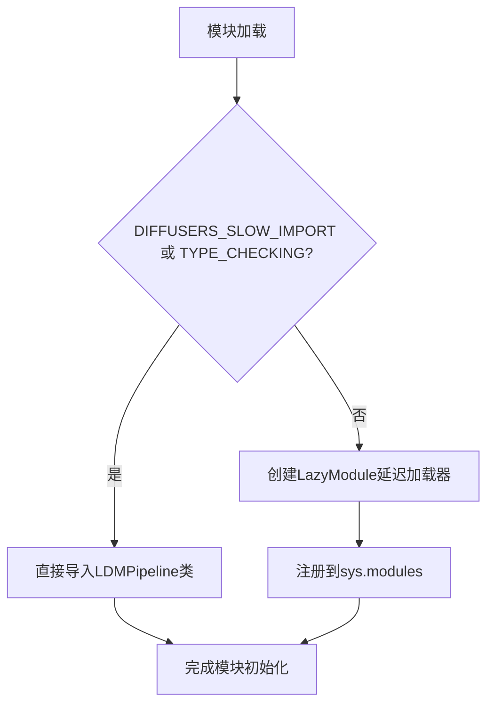

# `diffusers\src\diffusers\pipelines\deprecated\latent_diffusion_uncond\__init__.py` 详细设计文档

这是一个diffusers库的延迟加载模块初始化文件，通过LazyModule机制实现LDMPipeline类的延迟导入，以优化包导入速度和减少内存占用。该模块在类型检查时直接导入LDMPipeline，在运行时则使用延迟加载机制。

## 整体流程



## 类结构

```
diffusers.pipelines (包)
└── latent_diffusion_uncond (子模块)
    └── __init__.py (延迟加载入口)
```

## 全局变量及字段


### `_import_structure`
    
定义模块的导入结构，映射子模块到其导出的类名列表

类型：`Dict[str, List[str]]`
    


### `DIFFUSERS_SLOW_IMPORT`
    
标志是否进行慢速导入的布尔值，控制是否使用延迟加载机制

类型：`bool`
    


### `__name__`
    
Python内置变量，表示当前模块的名称

类型：`str`
    


### `__file__`
    
Python内置变量，表示当前模块文件的路径

类型：`str`
    


### `__spec__`
    
Python内置变量，表示模块的规格说明对象，用于模块导入和延迟加载

类型：`ModuleSpec`
    


    

## 全局函数及方法


## 关键组件


### TYPE_CHECKING 条件导入

用于类型检查时的导入，避免在运行时导入，提高性能

### DIFFUSERS_SLOW_IMPORT 延迟导入标志

控制是否使用延迟加载模式的标志，来自工具模块

### _import_structure 导入结构字典

定义了模块的导入结构，包含管道类 LDMPipeline 的导入映射

### _LazyModule 延迟加载模块

实现惰性加载机制，允许模块在首次访问时才加载实际内容，优化启动时间

### LDMPipeline 管道类

条件导入的管道类，用于潜在扩散模型的无条件生成

### sys.modules 动态模块注册

将延迟模块注册到系统模块缓存中，实现动态导入

### __spec__ 模块规格

保留模块的规格信息，用于延迟模块的正确初始化


## 问题及建议


### 已知问题

-   **过度设计的延迟加载架构**：仅导出单个类 `LDMPipeline`，却使用了完整的 `_LazyModule` 延迟加载机制，增加了不必要的复杂度
-   **缺少错误处理**：如果 `LDMPipeline` 导入失败（如模块不存在），只会得到 Python 标准的 `AttributeError`，缺乏友好的错误提示
-   **依赖隐式耦合**：`DIFFUSERS_SLOW_IMPORT` 和 `_LazyModule` 从 `....utils` 导入，但代码中没有明确的版本兼容性说明或依赖检查
-   **导出结构不完整**：仅导出了 `LDMPipeline` 类，未导出相关的配置类、模型类或工具函数，可能导致用户无法访问完整的功能集

### 优化建议

-   **简化导入结构**：如果仅有单个类需要导出，可考虑使用 `__getattr__` 实现轻量级延迟加载，或在 `TYPE_CHECKING` 分支中直接导入
-   **添加错误处理**：捕获导入异常，提供更清晰的错误信息，例如提示用户检查是否安装了完整的依赖包
-   **完善导出列表**：根据实际功能需求，在 `_import_structure` 中添加更多可导出的组件（如配置类、预处理函数等）
-   **添加文档注释**：为模块和导出结构添加 docstring，说明模块用途和版本要求
-   **考虑兼容性检查**：添加对 `DIFFUSERS_SLOW_IMPORT` 和 `_LazyModule` 可用性的检查，确保在各类导入场景下都能正常工作

## 其它


### 设计目标与约束

该模块旨在实现Diffusers库的延迟加载（Lazy Loading）机制，通过`_LazyModule`将导入操作延迟到实际使用时，从而优化库的初始化性能。设计约束包括：仅在TYPE_CHECKING或DIFFUSERS_SLOW_IMPORT为True时进行完整导入，其他情况下使用延迟加载；保持与现有Diffusers导入结构的一致性；支持类型检查时的静态分析。

### 错误处理与异常设计

本模块主要依赖LazyModule的内部错误处理机制。若模块未正确安装或导入路径错误，将在尝试访问模块属性时抛出AttributeError或ImportError。设计遵循"fail-fast"原则，延迟加载失败时立即向上传播异常，便于调试定位问题。

### 数据流与状态机

该模块不涉及复杂的数据流或状态机。其核心数据流为：导入请求 → 检查导入条件 → 选择性执行完整导入或注册延迟模块 → 返回模块/类对象。状态转换包括：初始状态（模块加载）→ 延迟注册状态（LazyModule已注册）→ 完全解析状态（实际使用时）。

### 外部依赖与接口契约

主要外部依赖包括：1) `typing.TYPE_CHECKING` - 用于类型检查时的静态导入；2) `utils.DIFFUSERS_SLOW_IMPORT` - 控制导入模式的标志；3) `utils._LazyModule` - 延迟加载实现类；4) `pipeline_latent_diffusion_uncond.LDMPipeline` - 目标Pipeline类。接口契约要求：模块必须导出`LDMPipeline`类，且在TYPE_CHECKING环境下可被类型检查器识别。

### 模块结构与导出设计

模块采用分层导出结构：顶层通过`_import_structure`字典定义可导出的内容映射，使用字符串键"pipeline_latent_diffusion_uncond"对应LDMPipeline类。这种设计允许在包级别统一管理子模块导出，同时保持内部模块结构的灵活性。

### 性能优化与延迟加载机制

采用延迟加载模式的核心优势包括：1) 减少程序启动时的导入开销；2) 降低内存占用，未使用的模块不会被加载；3) 加快import语句执行速度。_LazyModule通过拦截__getattr__实现按需加载，sys.modules中的模块引用指向LazyModule实例而非实际模块。

### 兼容性考虑

该设计兼容Python 3.7+的TYPE_CHECKING用法，支持主流版本控制工具（git）的版本管理，并遵循Diffusers库内部的模块组织规范。TYPE_CHECKING分支确保静态类型检查工具（如mypy、pyright）能够正确识别类型信息。

### 版本与维护信息

该模块作为Diffusers库的内部模块，其版本随主库版本统一管理。维护重点在于确保_import_structure与实际模块结构保持同步，以及LazyModule实现的稳定性。

    