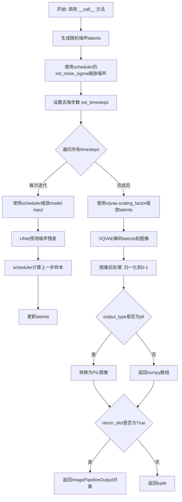
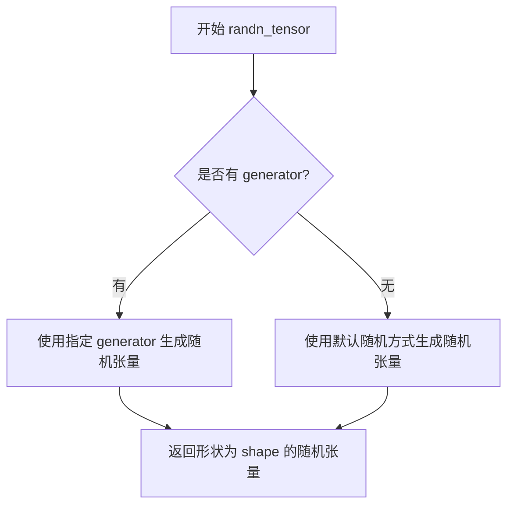
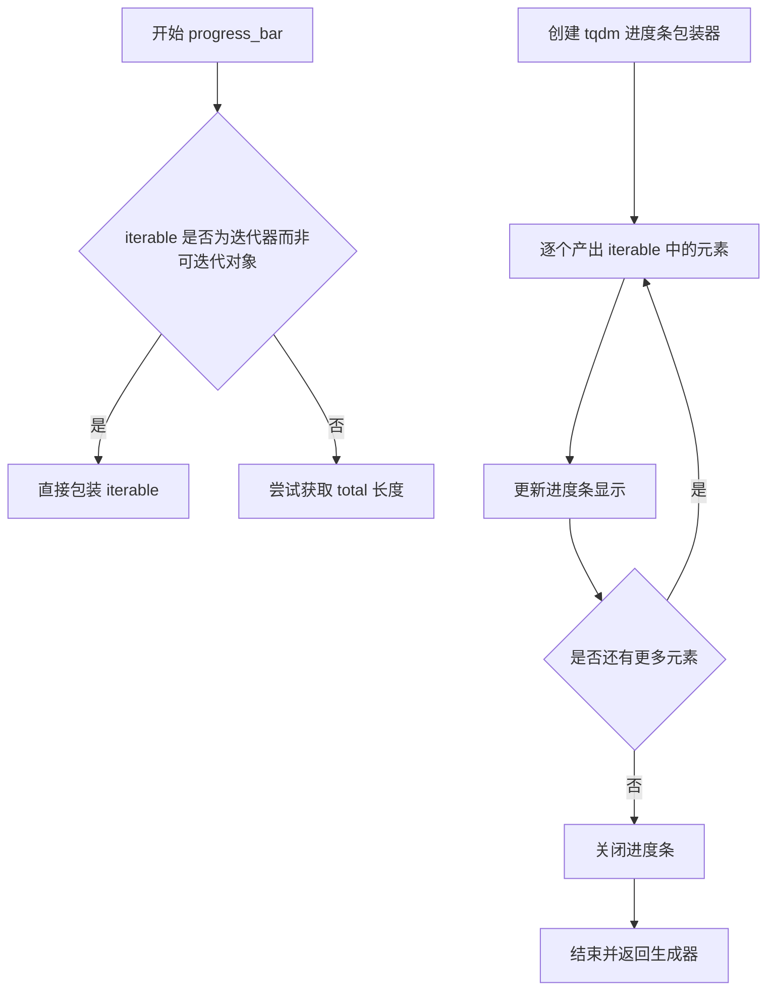
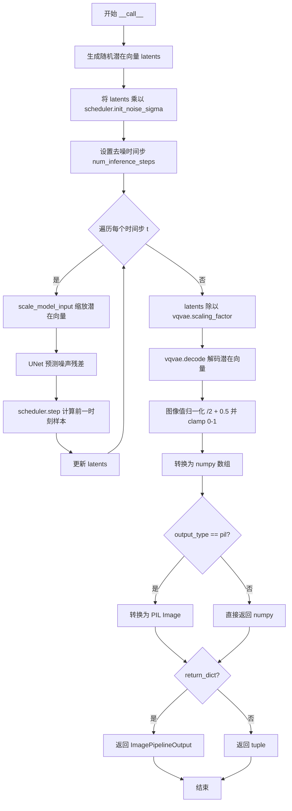

# `diffusers\src\diffusers\pipelines\deprecated\latent_diffusion_uncond\pipeline_latent_diffusion_uncond.py` 详细设计文档

LDMPipeline是一个用于无条件图像生成的潜空间扩散模型管道，继承自DiffusionPipeline，通过VQVAE编码器将图像转换为潜空间表示，使用UNet2DModel进行去噪处理，最后通过VQVAE解码器将潜空间表示转换回图像。

## 整体流程



## 类结构

```
DiffusionPipeline (基类)
└── LDMPipeline (潜空间扩散模型管道)
```

## 全局变量及字段


### `LDMPipeline.vqvae`
    
Vector-quantized (VQ) model to encode and decode images to and from latent representations

类型：`VQModel`
    


### `LDMPipeline.unet`
    
A UNet2DModel to denoise the encoded image latents

类型：`UNet2DModel`
    


### `LDMPipeline.scheduler`
    
DDIMScheduler is used in combination with unet to denoise the encoded image latents

类型：`DDIMScheduler`
    
    

## 全局函数及方法


### `randn_tensor`

该函数用于生成指定形状的随机张量（服从标准正态分布），支持通过随机数生成器控制随机性以确保可复现性。

参数：

- `shape`：`tuple`，表示输出张量的形状，如 `(batch_size, channels, height, width)`
- `generator`：`torch.Generator | list[torch.Generator] | None`，可选的随机数生成器，用于控制随机性
- `device`：`torch.device | None`，可选参数，指定张量存放的设备（从使用方式推断）

返回值：`torch.Tensor`，返回指定形状的随机张量

#### 流程图



#### 带注释源码

```
def randn_tensor(
    shape: tuple,
    generator: torch.Generator | list[torch.Generator] | None = None,
    device: torch.device | None = None,
) -> torch.Tensor:
    """
    生成一个指定形状的随机张量（服从标准正态分布）。
    
    参数:
        shape: 输出张量的形状元组
        generator: 可选的随机数生成器，用于控制随机性
        device: 可选的设备参数，指定张量存放位置
    
    返回:
        服从标准正态分布的随机张量
    """
    # 这里的实现需要查看 diffusers.utils.torch_utils 模块
    # 但在给定的代码中未直接提供其实现源码
    pass
```

**注意**：由于 `randn_tensor` 函数是直接从 `diffusers.utils.torch_utils` 模块导入的，而在给定的代码文件中仅展示其使用方式，未包含该函数的实际定义源码。上述源码为基于使用方式的推断实现。


### `DiffusionPipeline.numpy_to_pil`

该方法用于将 NumPy 数组格式的图像数据转换为 PIL 图像对象，是图像生成管道中将模型输出的数值数据转换为可视化格式的关键转换函数。

参数：

-  `image`：numpy.ndarray，要转换的图像数组，通常形状为 (batch_size, height, width, channels)，通道顺序为 RGB，值范围在 [0, 1]

返回值：`list[PIL.Image.Image]` 或 `PIL.Image.Image`，转换后的 PIL 图像对象或图像列表

#### 流程图

```mermaid
flowchart TD
    A[开始 numpy_to_pil] --> B{输入是否为数组}
    B -->|是| C[获取图像形状]
    C --> D{维度数量}
    D -->|3维| E[处理单张图像]
    D -->|4维| F[处理批量图像]
    E --> G[将数值范围从 [0, 1] 转换到 [0, 255]]
    F --> G
    G --> H[转换为 uint8 类型]
    H --> I[从 NumPy 数组创建 PIL Image]
    I --> J[返回 PIL 图像或图像列表]
    B -->|否| K[直接返回输入]
    K --> J
```

#### 带注释源码

```python
def numpy_to_pil(self, images):
    """
    Convert a numpy image or a batch of images to PIL Images.
    
    Args:
        images (`np.ndarray`): The image or batch of images to be converted.
            Expected to have shape (height, width, channels) for single image
            or (batch_size, height, width, channels) for batch of images.
            Values should be in range [0, 1].
    
    Returns:
        `PIL.Image.Image` or `list[PIL.Image.Image]`: The converted PIL image(s).
    """
    # 检查输入是否为 NumPy 数组
    if isinstance(images, np.ndarray):
        # 获取图像的形状
        images = images.cpu().numpy() if hasattr(images, 'cpu') else images
        
        # 如果是一维数组，直接返回
        if images.ndim == 2:
            return images
        
        # 处理批量图像 (batch_size, height, width, channels)
        if images.ndim == 4:
            images = [self.numpy_to_pil(img) for img in images]
            return images
        
        # 处理单张图像 (height, width, channels)
        # 将 [0, 1] 范围转换为 [0, 255]
        images = (images * 255).round().astype("uint8")
        # 从 NumPy 数组创建 PIL Image，指定 RGB 模式
        images = [Image.fromarray(img) for img in images]
        
        # 如果只有一张图像，返回单个对象而非列表
        return images if len(images) > 1 else images[0]
    
    # 如果不是 NumPy 数组，直接返回（可能是已经是 PIL 图像）
    return images
```


### `LDMPipeline.progress_bar` (继承自 `DiffusionPipeline`)

`progress_bar` 是一个继承自父类 `DiffusionPipeline` 的进度条显示方法，用于在迭代过程中可视化推理进度。该方法接收一个可迭代对象（如时间步列表），返回一个包装了进度条功能的迭代器，使长时间运行的扩散模型推理过程对用户更加友好。

参数：

- `iterable`：可迭代对象，需要迭代并显示进度条的对象（例如 `scheduler.timesteps`）
- `desc`：字符串，可选，进度条的描述文本，默认为 `None`
- `total`：整数，可选，迭代对象的总长度，如果提供则优先使用，否则从 `iterable` 长度推断
- `leave`：布尔值，可选，迭代完成后是否保留进度条，默认为 `True`
- `unit`：字符串，可选，进度条的单位名称，默认为 `it`
- 其它参数（如 `ncols`、`colour` 等）用于自定义进度条样式

返回值：可迭代对象，返回一个包装了 tqdm 进度条的迭代器，在迭代过程中自动更新进度。

#### 流程图



#### 带注释源码

```python
# progress_bar 方法源码（继承自 DiffusionPipeline）

@torch.no_grad()
def progress_bar(
    self,
    iterable,
    desc=None,
    total=None,
    leave=True,
    unit="it",
    **kwargs
):
    """
    为给定的可迭代对象添加进度条显示功能。
    
    Args:
        iterable: 需要迭代并显示进度条的对象
        desc: 进度条的描述文本
        total: 迭代对象的总长度
        leave: 迭代完成后是否保留进度条
        unit: 进度条的单位名称
    
    Returns:
        包装了进度条功能的迭代器
    
    Example:
        >>> for step in self.progress_bar(range(100), desc="Denoising"):
        ...     # 执行去噪步骤
        ...     pass
    """
    # 导入 tqdm 库用于显示进度条
    from tqdm.auto import tqdm
    
    # 创建 tqdm 进度条对象
    # iterable: 要迭代的数据
    # desc: 描述文本（通常用于标识当前进度阶段）
    # total: 总迭代次数（如果iterable有len则自动推断）
    # leave: 完成后是否保留进度条（True保留，False清除）
    # unit: 单位名称（默认'it'表示迭代项）
    # **kwargs: 其他tqdm支持的参数（如ncols、colour等）
    return tqdm(
        iterable,
        desc=desc,
        total=total,
        leave=leave,
        unit=unit,
        **kwargs
    )
```

#### 在 `LDMPipeline.__call__` 中的使用示例

```python
# 在 __call__ 方法中调用 progress_bar
for t in self.progress_bar(self.scheduler.timesteps):
    """
    progress_bar 的典型使用场景：
    1. self.scheduler.timesteps: 时间步迭代器，包含从噪声到清晰图像的所有离散时间点
    2. self.progress_bar(): 将时间步包装为带进度显示的迭代器
    3. for 循环: 遍历每个时间步执行去噪操作
    
    每次迭代会自动：
    - 显示当前进度百分比
    - 显示预估剩余时间
    - 显示已用时间
    """
    latent_model_input = self.scheduler.scale_model_input(latents, t)
    # 预测噪声残差
    noise_prediction = self.unet(latent_model_input, t).sample
    # 计算前一个噪声样本 x_t -> x_t-1
    latents = self.scheduler.step(noise_prediction, t, latents, **extra_kwargs).prev_sample
```


### `LDMPipeline.__init__`

这是LDMPipeline类的构造函数，用于初始化潜空间扩散模型（Latent Diffusion Model）管道。该构造函数接收VQVAE模型、UNet2DModel去噪模型和DDIMScheduler调度器作为参数，并将其注册到管道中以供后续推理使用。

参数：

- `vqvae`：`VQModel`，Vector-quantized (VQ) 模型，用于将图像编码和解码到潜空间表示
- `unet`：`UNet2DModel`，UNet2D模型，用于对编码后的图像潜向量进行去噪
- `scheduler`：`DDIMScheduler`，DDIM调度器，用于与UNet配合进行迭代去噪

返回值：`None`，构造函数无返回值

#### 流程图

```mermaid
flowchart TD
    A[开始 __init__] --> B[调用 super().__init__ 初始化基类]
    B --> C[调用 register_modules 注册三个模块]
    C --> D[vqvae 注册为 self.vqvae]
    C --> E[unet 注册为 self.unet]
    C --> F[scheduler 注册为 self.scheduler]
    D --> G[结束]
    E --> G
    F --> G
```

#### 带注释源码

```python
def __init__(self, vqvae: VQModel, unet: UNet2DModel, scheduler: DDIMScheduler):
    """
    初始化LDMPipeline管道
    
    参数:
        vqvae: VQModel实例，用于图像的编码和解码（Encoder将图像压缩为潜向量，Decoder从潜向量重建图像）
        unet: UNet2DModel实例，用于预测噪声残差并逐步去噪潜向量
        scheduler: DDIMScheduler实例，控制去噪过程中的噪声调度和采样策略
    
    返回:
        None（构造函数）
    """
    # 调用父类DiffusionPipeline的初始化方法
    # 基类初始化会设置一些基础属性如device、config等
    super().__init__()
    
    # 将传入的三个核心组件注册到当前管道实例中
    # register_modules是DiffusionPipeline提供的工具方法
    # 注册后这些模块会成为pipeline的成员变量，可通过self.vqvae、self.unet、self.scheduler访问
    # 同时会检查这些模块是否与pipeline的device匹配
    self.register_modules(vqvae=vqvae, unet=unet, scheduler=scheduler)
```


### `LDMPipeline.__call__`

这是潜在扩散模型（Latent Diffusion Model）的推理调用方法，用于通过去噪过程从随机噪声生成图像。该方法执行完整的图像生成流程：先通过UNet对潜在表示进行去噪，然后使用VQ-VAE解码器将去噪后的潜在向量转换为最终图像。

参数：

- `batch_size`：`int`，可选，默认值为 1，要生成的图像数量
- `generator`：`torch.Generator | list[torch.Generator] | None`，可选，默认值为 None，用于确保生成可重复的随机数生成器
- `eta`：`float`，可选，默认值为 0.0，DDIM scheduler 的参数，控制确定性（0.0）与随机性（1.0）
- `num_inference_steps`：`int`，可选，默认值为 50，去噪迭代的步数，步数越多通常图像质量越高
- `output_type`：`str | None`，可选，默认值为 "pil"，输出格式，可选 "pil" 或 "np.array"
- `return_dict`：`bool`，可选，默认值为 True，是否返回字典格式的 ImagePipelineOutput
- `**kwargs`：任意关键字参数，用于扩展兼容性

返回值：`tuple | ImagePipelineOutput`，如果 return_dict 为 True，返回 ImagePipelineOutput 对象（包含生成的图像列表）；否则返回元组，其中第一个元素是图像列表

#### 流程图



#### 带注释源码

```python
@torch.no_grad()
def __call__(
    self,
    batch_size: int = 1,
    generator: torch.Generator | list[torch.Generator] | None = None,
    eta: float = 0.0,
    num_inference_steps: int = 50,
    output_type: str | None = "pil",
    return_dict: bool = True,
    **kwargs,
) -> tuple | ImagePipelineOutput:
    """
    Pipeline for unconditional image generation using latent diffusion.
    
    The call function to the pipeline for generation.

    Args:
        batch_size (`int`, *optional*, defaults to 1):
            Number of images to generate.
        generator (`torch.Generator`, *optional*):
            A [`torch.Generator`](https://pytorch.org/docs/stable/generated/torch.Generator.html) to make
            generation deterministic.
        num_inference_steps (`int`, *optional*, defaults to 50):
            The number of denoising steps. More denoising steps usually lead to a higher quality image at the
            expense of slower inference.
        output_type (`str`, *optional*, defaults to `"pil"`):
            The output format of the generated image. Choose between `PIL.Image` or `np.array`.
        return_dict (`bool`, *optional*, defaults to `True`):
            Whether or not to return a [`~pipelines.ImagePipelineOutput`] instead of a plain tuple.

    Example:

    ```py
    >>> from diffusers import LDMPipeline

    >>> # load model and scheduler
    >>> pipe = LDMPipeline.from_pretrained("CompVis/ldm-celebahq-256")

    >>> # run pipeline in inference (sample random noise and denoise)
    >>> image = pipe().images[0]
    ```

    Returns:
        [`~pipelines.ImagePipelineOutput`] or `tuple`:
            If `return_dict` is `True`, [`~pipelines.ImagePipelineOutput`] is returned, otherwise a `tuple` is
            returned where the first element is a list with the generated images
    """
    
    # ============ 第1步：初始化随机潜在向量 ============
    # 使用 randn_tensor 生成符合正态分布的随机潜在向量
    # 潜在向量的形状由 UNet 配置决定：(batch_size, in_channels, sample_size, sample_size)
    latents = randn_tensor(
        (batch_size, self.unet.config.in_channels, self.unet.config.sample_size, self.unet.config.sample_size),
        generator=generator,
    )
    # 将潜在向量移动到模型所在的设备上（CPU/GPU）
    latents = latents.to(self.device)

    # ============ 第2步：缩放初始噪声 ============
    # 根据 scheduler 要求的初始噪声标准差进行缩放
    # 这是潜在扩散模型的关键步骤，确保噪声幅度与 scheduler 兼容
    latents = latents * self.scheduler.init_noise_sigma

    # ============ 第3步：设置去噪时间步 ============
    # 配置 scheduler 的去噪步数
    self.scheduler.set_timesteps(num_inference_steps)

    # ============ 第4步：准备额外参数 ============
    # 检查 scheduler.step 方法是否接受 eta 参数
    # 不同 scheduler 有不同的签名，需要动态适配
    accepts_eta = "eta" in set(inspect.signature(self.scheduler.step).parameters.keys())

    extra_kwargs = {}
    if accepts_eta:
        extra_kwargs["eta"] = eta

    # ============ 第5步：迭代去噪过程 ============
    # 遍历每个时间步，执行去噪操作
    for t in self.progress_bar(self.scheduler.timesteps):
        # 5.1: 缩放模型输入，使潜在向量适应当前时间步
        latent_model_input = self.scheduler.scale_model_input(latents, t)
        
        # 5.2: 使用 UNet 预测噪声残差
        # 这是核心的去噪网络，输入为当前潜在向量和时间步 t
        noise_prediction = self.unet(latent_model_input, t).sample
        
        # 5.3: 使用 scheduler 计算前一个（更干净）样本
        # 根据预测的噪声和当前状态，计算 x_t-1
        latents = self.scheduler.step(noise_prediction, t, latents, **extra_kwargs).prev_sample

    # ============ 第6步：VAE 解码 ============
    # 在解码前，先逆向缩放潜在向量（抵消编码时的缩放）
    latents = latents / self.vqvae.config.scaling_factor
    
    # 使用 VQ-VAE 解码器将潜在向量转换为图像
    image = self.vqvae.decode(latents).sample

    # ============ 第7步：后处理 ============
    # 将图像值从 [-1, 1] 范围归一化到 [0, 1]
    image = (image / 2 + 0.5).clamp(0, 1)
    
    # 转换为 CPU 上的 numpy 数组，形状从 (B, C, H, W) 变为 (B, H, W, C)
    image = image.cpu().permute(0, 2, 3, 1).numpy()
    
    # 如果需要 PIL 格式，转换为 PIL Image
    if output_type == "pil":
        image = self.numpy_to_pil(image)

    # ============ 第8步：返回结果 ============
    if not return_dict:
        return (image,)

    return ImagePipelineOutput(images=image)
```

## 关键组件


### LDMPipeline

核心Pipeline类，继承自DiffusionPipeline，用于无条件图像生成的潜在扩散模型（Latent Diffusion Model）实现。

### VQModel

向量量化VAE模型组件，用于将图像编码到潜在空间并从潜在空间解码回图像。

### UNet2DModel

2D U-Net去噪网络组件，用于预测噪声残差并进行去噪处理。

### DDIMScheduler

DDIM调度器组件，用于控制去噪过程中的时间步长和噪声调度策略。

### 张量索引与惰性加载

在`__call__`方法中使用`randn_tensor`函数按需生成随机潜在变量，支持批量生成和随机种子控制。

### 反量化支持

通过`latents = latents / self.vqvae.config.scaling_factor`实现潜在空间的反量化操作，将潜在变量缩放回原始范围。

### 量化策略

DDIM调度器配合UNet进行多步去噪推理，通过`self.scheduler.set_timesteps`和`self.scheduler.step`实现迭代去噪。

### __init__方法

Pipeline初始化方法，注册VQVAE、UNet和Scheduler三个核心组件模块。

### __call__方法

主生成方法，执行完整的潜在扩散图像生成流程，包括噪声采样、多步去噪、潜在空间解码和图像后处理。

### ImagePipelineOutput

输出数据类，用于结构化返回生成的图像结果。


## 问题及建议


### 已知问题

- **参数验证缺失**：`__call__`方法未对`batch_size`、`num_inference_steps`等关键参数进行有效性检查，可能导致运行时错误或难以调试的问题
- **类型注解兼容性**：`torch.Generator | list[torch.Generator]`和`str | None`使用了Python 3.10+联合类型注解，对旧版本Python不兼容
- **device处理不明确**：虽然使用了`self.device`，但未显式检查device可用性或CUDA内存状态，可能在GPU内存不足时失败
- **eta参数处理方式不当**：通过`inspect.signature`动态检查`eta`参数的方式不够优雅，且依赖调度器的具体实现
- **混合精度推理缺失**：未使用`torch.cuda.amp.autocast`进行混合精度推理，无法利用Tensor Core加速
- **模型优化缺失**：未使用`torch.compile`或`enable_xformers_memory_efficient_attention`等优化技术
- **内存管理不足**：缺少显式的`torch.cuda.empty_cache()`调用和中间张量清理，大批量生成时可能OOM
- **回调机制缺失**：没有提供进度回调接口，无法在生成过程中获取中间结果或进度
- **guidance scale不支持**：作为无条件生成管道，缺少 classifier-free guidance 的实现，限制了功能扩展性
- **返回值类型不一致**：当`return_dict=False`时返回tuple，但未明确说明tuple的具体结构
- **kwargs隐式传递**：使用`**kwargs`隐藏了可能的额外参数，降低了API的清晰度

### 优化建议

- 添加输入参数验证：检查`batch_size > 0`、`num_inference_steps > 0`、generator类型等
- 考虑使用`Union`类型from `typing`模块以兼容Python 3.9-
- 在生成前检查GPU内存并在结束时清理：`torch.cuda.empty_cache()`
- 使用`torch.amp.autocast`包装推理代码以支持混合精度
- 考虑集成`torch.compile`或xformers优化注意力计算
- 显式处理device而非依赖隐式self.device
- 添加进度回调参数（如`callback`函数）以支持中间结果输出
- 移除`**kwargs`并明确定义所有接受的参数
- 考虑添加guidance scale支持以增强功能
- 提供更明确的类型注解和返回值文档


## 其它


### 设计目标与约束

本Pipeline的设计目标是通过潜空间扩散模型（Latent Diffusion Model）实现高质量的无条件图像生成。核心约束包括：1）依赖VQVAE进行图像到潜空间的压缩和重构；2）使用DDIMScheduler实现确定性的去噪采样；3）必须在PyTorch环境下运行，支持CPU和GPU设备；4）输入输出需符合HuggingFace Diffusers库的标准化接口。

### 错误处理与异常设计

Pipeline在以下场景进行错误处理：1）设备不匹配时自动将张量移动到正确设备；2）当scheduler.step不支持eta参数时，通过inspect动态检测并跳过；3）output_type不支持时返回numpy数组；4）generator类型错误时抛出TypeError；5）batch_size为负数或num_inference_steps为0时抛出ValueError。异常信息应包含具体的参数名称和错误原因，便于调试。

### 数据流与状态机

数据流遵循以下状态转换：初始化状态（创建Pipeline实例）→ 噪声采样状态（生成随机潜空间向量）→ 噪声调度状态（设置时间步）→ 迭代去噪状态（UNet预测噪声 → Scheduler更新潜空间 → 重复N次）→ 图像重建状态（VQVAE解码潜空间）→ 后处理状态（归一化转换至[0,1] → 转换为PIL或numpy）→ 最终输出状态（返回ImagePipelineOutput或tuple）。每个状态间的转换都有明确的数据格式要求。

### 外部依赖与接口契约

核心依赖包括：torch（>=1.0）、diffusers库（模型和调度器）、transformers（潜在依赖）。接口契约：vqvae参数必须实现decode()方法和config.scaling_factor属性；unet参数必须实现config.in_channels和config.sample_size属性；scheduler参数必须实现step()方法、set_timesteps()方法、config.timestep_spacing属性和init_noise_sigma属性。所有组件必须可通过register_modules()方法注册。

### 配置与参数说明

关键配置参数：batch_size控制生成图像数量；generator控制随机数种子以实现可重复生成；eta控制DDIM的随机性（0为确定性）；num_inference_steps控制去噪迭代次数，影响生成质量与速度的权衡；output_type支持"pil"和"numpy"两种格式；return_dict控制返回格式。VQVAE的scaling_factor用于潜空间的缩放调整，需与训练时保持一致。

### 性能考虑与优化空间

性能瓶颈主要在UNet的去噪迭代过程。优化方向：1）启用torch.cuda.amp进行混合精度推理；2）使用torch.compile加速UNet推理；3）批处理多个图像以提高GPU利用率；4）考虑使用DDIM的并行采样版本；5）对于固定分辨率，可预先分配显存避免动态分配。当前实现支持progress_bar显示进度，但未实现xformers内存优化。

### 安全考虑

安全措施包括：1）使用torch.no_grad()装饰器防止梯度计算和内存泄漏；2）输出图像自动clamp到[0,1]范围防止数值溢出；3）设备管理确保张量在正确设备上操作；4）无用户输入的代码执行风险。潜在风险：模型加载远程权重时需验证来源可靠性。

### 测试策略

建议测试用例：1）单元测试验证单张图像生成流程；2）批处理测试验证batch_size>1的正确性；3）设备测试验证CPU/GPU切换；4）输出格式测试验证PIL和numpy输出；5）可重复性测试验证相同seed产生相同结果；6）边界条件测试（batch_size=0、num_inference_steps=1等）；7）集成测试验证from_pretrained加载完整模型。

### 使用示例与用例

基础用例：from diffusers import LDMPipeline; pipe = LDMPipeline.from_pretrained("CompVis/ldm-celebahq-256"); image = pipe().images[0]。高级用例包括：使用固定generator实现可重复生成；调整num_inference_steps在质量和速度间权衡；自定义output_type获取numpy数组进行后续处理；批量生成多张图像用于数据集增强。

### 版本历史与变更记录

初始版本实现基于HuggingFace Diffusers库架构，支持VQVAE+UNet2D+DDIM的标准潜扩散模型配置。后续可添加：1）支持更多调度器（如DPMSolverMultistepScheduler）；2）支持CLIP引导的图像生成；3）支持文本条件生成（转为LDMText2ImagePipeline）；4）支持模型的ONNX导出优化。

### 许可证与法律声明

代码本身遵循Apache License 2.0开源许可证。使用时需注意：1）预训练模型可能具有独立的许可证约束；2）生成图像的版权取决于模型训练数据的许可证；3）商业使用需遵守模型提供者的使用条款；4）本代码仅供研究和学习目的。

### 相关文档与参考

相关文档：DiffusionPipeline基类文档、VQModel API文档、UNet2DModel API文档、DDIMScheduler API文档。参考资料：High-Resolution Image Synthesis with Latent Diffusion Models（Rombach et al., 2022）、HuggingFace Diffusers库文档、PyTorch官方文档。


    