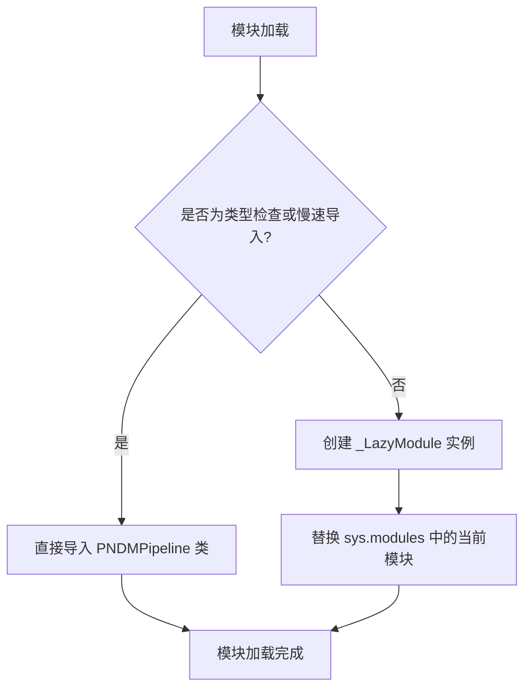

# `diffusers\src\diffusers\pipelines\deprecated\pndm\__init__.py` 详细设计文档

这是Hugging Face Diffusers库中的PNDM（Principal Component Analysis-guided Diffusion Model）流水线的延迟导入模块，通过LazyModule机制实现PNDMPipeline类的延迟加载，优化了导入性能和内存占用。

## 整体流程



## 类结构

```
无类定义（纯导入模块）
依赖: _LazyModule (utils._LazyModule)
目标: PNDMPipeline (pipeline_pndm.PNDMPipeline)
```

## 全局变量及字段


### `_import_structure`
    
导出结构映射表，包含pipeline_pndm到PNDMPipeline的映射

类型：`dict`
    


### `__name__`
    
当前模块名称

类型：`str`
    


### `__file__`
    
当前模块文件路径

类型：`str`
    


### `__spec__`
    
模块规格对象

类型：`ModuleSpec`
    


    

## 全局函数及方法


### `sys.modules` 赋值操作（延迟模块注册）

该代码实现了延迟加载机制，通过将 `_LazyModule` 实例替换当前模块注册到 `sys.modules` 中，从而实现按需导入 `PNDMPipeline`，避免在模块初始化时立即加载所有子模块，提升导入速度和内存效率。

参数：
- `__name__`：`str`，当前模块的绝对名称（`__name__`）
- `globals()["__file__"]`：`str`，当前模块文件的绝对路径（从全局字典获取）
- `_import_structure`：`dict`，定义了延迟加载的模块结构映射，键为子模块名，值为要导出的类/函数名列表
- `module_spec`：`ModuleSpec`，当前模块的规格对象（`__spec__`），用于模块解析

返回值：`None`（赋值操作无返回值，直接修改 `sys.modules` 字典）

#### 流程图

```mermaid
flowchart TD
    A[模块导入开始] --> B{是否为 TYPE_CHECKING<br/>或 DIFFUSERS_SLOW_IMPORT?}
    B -->|是| C[直接导入 PNDMPipeline]
    B -->|否| D[创建 _LazyModule 实例]
    D --> E[将 _LazyModule 赋值给 sys.modules[__name__]]
    C --> F[模块加载完成]
    E --> F
```

#### 带注释源码

```python
# 导入类型检查标志和延迟模块工具类
from typing import TYPE_CHECKING
from ....utils import DIFFUSERS_SLOW_IMPORT, _LazyModule

# 定义延迟加载的模块结构：子模块名 -> 导出类列表
_import_structure = {"pipeline_pndm": ["PNDMPipeline"]}

# 条件分支：类型检查/慢导入模式 vs 延迟加载模式
if TYPE_CHECKING or DIFFUSERS_SLOW_IMPORT:
    # 场景1：类型检查或需要完整导入时，直接导入模块
    from .pipeline_pndm import PNDMPipeline
else:
    # 场景2：生产环境使用延迟加载
    import sys
    
    # 核心操作：将当前模块替换为 _LazyModule 实例
    # _LazyModule 会在首次访问属性时动态加载对应的子模块
    sys.modules[__name__] = _LazyModule(
        __name__,                      # 模块名称
        globals()["__file__"],         # 模块文件路径
        _import_structure,             # 导入结构定义
        module_spec=__spec__,          # 模块规格信息
    )
```

## 关键组件


### 类型检查导入机制 (TYPE_CHECKING)

用于在类型检查时导入 PNDMPipeline 类，避免在运行时导入，提高导入速度。

### 延迟加载配置 (DIFFUSERS_SLOW_IMPORT)

控制是否使用延迟加载模式，当需要类型提示时可完整导入模块。

### 延迟加载模块 (_LazyModule)

Diffusers 框架的延迟加载实现，通过动态替换模块对象实现按需导入，减少启动时间。

### 导入结构定义 (_import_structure)

定义模块的公共接口，声明可以从该模块导出的类名列表。

### PNDM 管道组件 (PNDMPipeline)

PNDM (Pseudo Numerical Methods for Diffusion Models) 扩散模型推理管道，核心组件。


## 问题及建议


### 已知问题

-   **硬编码的导入结构**：`_import_structure` 字典和类名 `"PNDMPipeline"` 被硬编码，若未来添加新pipeline或修改类名，需要手动同步更新多个位置
-   **缺乏错误处理**：当 `PNDMPipeline` 导入失败时，没有任何异常捕获或用户友好的错误提示，可能导致后续使用时才暴露问题
-   **文档缺失**：模块级别没有 docstring 说明其用途和功能
-   **TYPE_CHECKING 分支重复导入**：在 `TYPE_CHECKING` 为 True 时会立即导入真实模块，而其他情况使用延迟加载，可能导致类型检查与运行时行为不一致
-   **魔法字符串依赖**：依赖 `"pipeline_pndm"` 字符串路径，缺少对该路径存在性的验证

### 优化建议

-   添加模块级 docstring 说明这是 PNDM Pipeline 的延迟加载模块
-   考虑在 `else` 分支中添加 try-except 捕获导入错误，并提供更明确的错误信息
-   可以将 `_import_structure` 提取为常量或使用枚举，提高可维护性
-   考虑使用 `__all__` 显式导出公共 API，增强模块接口的清晰度
-   对于 DIFFUSERS_SLOW_IMPORT 的处理逻辑可以添加注释说明其设计意图
</think>

## 其它


### 设计目标与约束

本模块采用延迟加载（Lazy Loading）模式，主要目标是在保证类型检查（TYPE_CHECKING）支持的同时，优化导入性能，避免在模块初始化时立即加载PNDMPipeline等重量级组件。约束条件包括：必须与diffusers库的_LazyModule机制兼容，需要维护正确的模块规范（module_spec），且必须在Python 3.7+环境中运行。

### 错误处理与异常设计

本模块本身不直接抛出业务异常，主要异常来源于底层导入机制。若LazyModule初始化失败或import_structure配置错误，可能引发AttributeError或ImportError。TYPE_CHECKING导入路径错误时会导致类型检查失败。建议通过捕获导入时的异常并提供有意义的错误信息。

### 外部依赖与接口契约

本模块依赖以下外部组件：1) `typing.TYPE_CHECKING` - 类型检查时导入标志；2) `diffusers.utils.DIFFUSERS_SLOW_IMPORT` - 控制延迟加载行为的配置开关；3) `diffusers.utils._LazyModule` - 延迟加载模块实现类；4) `PNDMPipeline` - 目标管道类，需从pipeline_pndm模块导入。接口契约要求PNDMPipeline类必须实现预期的管道接口，且LazyModule需正确绑定到sys.modules。

### 版本兼容性

需兼容Python 3.7+版本，与diffusers主库版本保持同步。TYPE_CHECKING机制自Python 3.5+可用，LazyModule机制需Python 3.7+的importlib完整支持。建议记录最低依赖版本要求。

### 性能考虑

延迟加载策略可显著减少初始导入时间，适用于不需要立即使用PNDMPipeline的场景。DIFFUSERS_SLOW_IMPORT标志允许开发者在调试时切换到即时导入模式。潜在性能开销在于首次实际访问时的动态导入延迟。

### 测试策略

建议测试：1) TYPE_CHECKING模式下能否正确导入类型；2) 非TYPE_CHECKING模式下LazyModule是否正确工作；3) sys.modules是否正确注册；4) 切换DIFFUSERS_SLOW_IMPORT标志的行为差异；5) 模块spec是否正确传递。

### 部署与配置

本模块为纯Python实现，无需额外编译或系统依赖。部署时需确保diffusers包正确安装，且utils模块可用。DIFFUSERS_SLOW_IMPORT通常通过环境变量或配置文件控制。

### 模块规范与元数据

`__spec__`属性必须正确传递以支持Python的import系统。`_import_structure`字典定义了公开API边界，PNDMPipeline为唯一公开导出项。建议在模块__doc__中添加文档字符串说明模块用途。

### 维护注意事项

添加新导出项时需同步更新_import_structure字典。模块路径`....utils`采用相对导入，需确保与项目目录结构一致。随着diffusers库演进，需关注_LazyModule实现的向后兼容性。

    