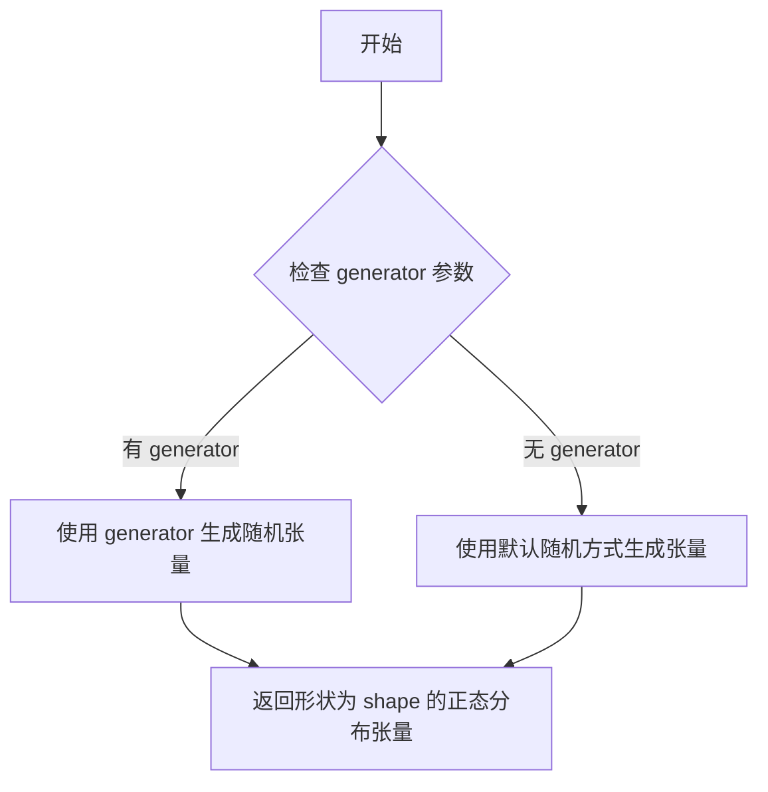
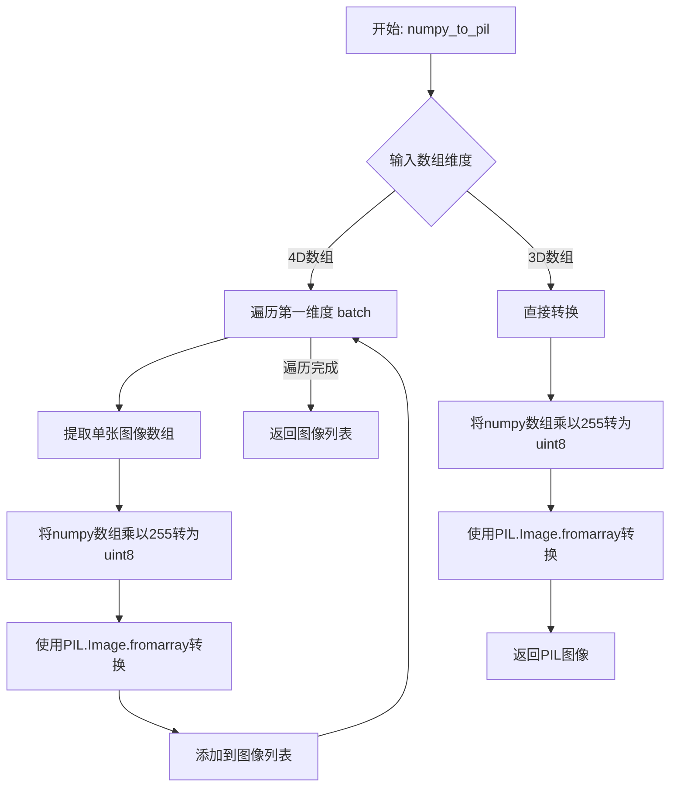
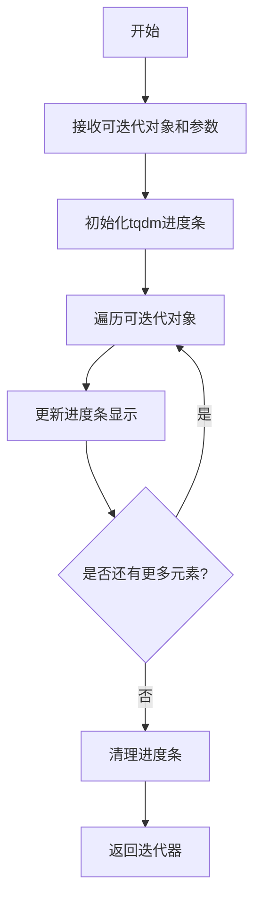
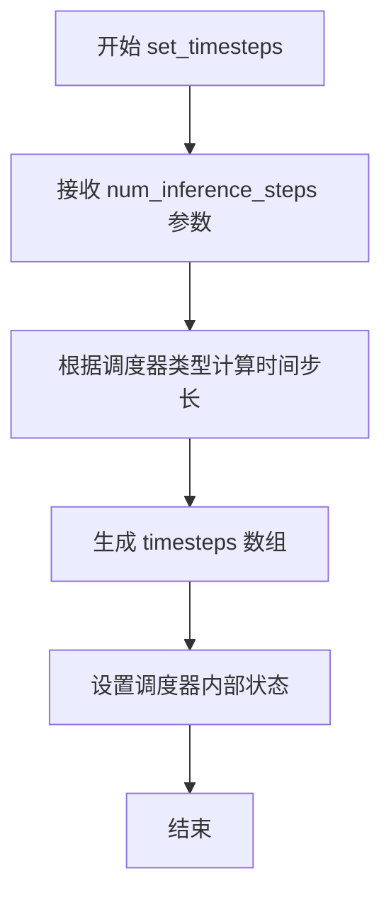
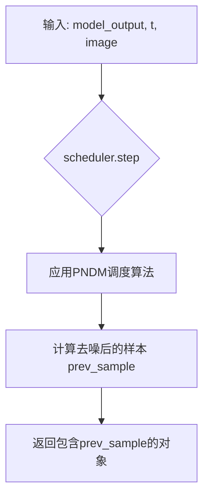
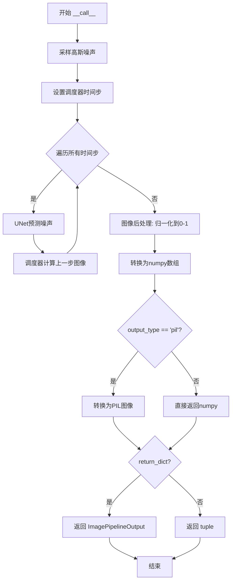

# `diffusers\src\diffusers\pipelines\deprecated\pndm\pipeline_pndm.py` 详细设计文档

PNDMPipeline是一个用于无条件图像生成的扩散模型管道，继承自DiffusionPipeline，通过预训练的UNet2DModel对噪声图像进行去噪处理，并使用PNDMScheduler调度算法逐步生成高质量图像。

## 整体流程

```mermaid
graph TD
A[开始] --> B[初始化管道: __init__]
B --> C[调用管道: __call__]
C --> D[采样高斯噪声]
D --> E[设置去噪时间步]
E --> F{时间步循环}
F -- 未完成 --> G[UNet推理: model_output = self.unet(image, t)]
G --> H[调度器步进: image = self.scheduler.step(model_output, t, image)]
H --> F
F -- 完成 --> I[图像后处理: 归一化与类型转换]
I --> J{output_type == 'pil'}
J -- 是 --> K[转换为PIL图像]
J -- 否 --> L[保持numpy数组]
K --> M[返回ImagePipelineOutput或tuple]
```

## 类结构

```
DiffusionPipeline (基类)
└── PNDMPipeline (具体实现类)
```

## 全局变量及字段


### `torch`
    
PyTorch深度学习框架

类型：`module`
    


### `UNet2DModel`
    
2D UNet模型类，用于图像去噪和生成

类型：`class`
    


### `PNDMScheduler`
    
PNDM调度器类，用于控制扩散模型的去噪过程

类型：`class`
    


### `randn_tensor`
    
随机张量生成工具函数，用于生成高斯噪声

类型：`function`
    


### `DiffusionPipeline`
    
扩散管道基类，提供通用的管道功能和方法

类型：`class`
    


### `ImagePipelineOutput`
    
图像管道输出数据类，包含生成的图像列表

类型：`class`
    


### `PNDMPipeline.unet`
    
UNet2DModel模型实例，用于对编码图像进行去噪

类型：`UNet2DModel`
    


### `PNDMPipeline.scheduler`
    
PNDMScheduler调度器实例，用于控制去噪过程

类型：`PNDMScheduler`
    
    

## 全局函数及方法


### `randn_tensor`

生成高斯（正态）分布的随机张量，用于 diffusion 模型的噪声采样。

参数：

- `shape`：`tuple`，张量的形状，格式为 (batch_size, channels, height, width)
- `generator`：`torch.Generator | list[torch.Generator] | None`，可选的随机数生成器，用于确保生成的可重复性
- `device`：`torch.device`，指定生成张量的设备（CPU/CUDA）

返回值：`torch.Tensor`，符合正态分布的随机张量

#### 流程图



#### 带注释源码

```python
def randn_tensor(
    shape: tuple,
    generator: Optional[Union[torch.Generator, List[torch.Generator]]] = None,
    device: Optional[torch.device] = None,
    dtype: Optional[torch.dtype] = torch.float32,
) -> torch.Tensor:
    """
    生成符合高斯（正态）分布的随机张量。
    
    参数:
        shape: 张量的形状元组，如 (batch_size, channels, height, width)
        generator: 可选的 torch.Generator，用于控制随机数生成
                   如果是 list，则为每个样本使用对应的生成器
        device: 指定张量存放的设备
        dtype: 张量的数据类型，默认为 torch.float32
    
    返回:
        符合标准正态分布 N(0, 1) 的随机张量
    """
    # 导入基础随机工具函数
    from . import randn
    
    # 如果提供了生成器列表，使用每个生成器为对应样本生成随机数
    if isinstance(generator, list):
        # 遍历形状维度，为每个位置生成随机数
        tensor = torch.randn(
            shape[0], *shape[1:], generator=generator[0], device=device, dtype=dtype
        )
        # 拼接所有生成器产生的张量
        for i, gen in enumerate(generator[1:]):
            tensor = torch.cat([
                tensor,
                torch.randn(shape[1:], generator=gen, device=device, dtype=dtype)
            ], dim=0)
        return tensor
    
    # 单个生成器或无生成器情况
    return torch.randn(
        shape, 
        generator=generator,  # 如果为 None，则使用全局随机状态
        device=device,
        dtype=dtype
    )
```

注意：实际源码位于 `diffusers/src/diffusers/utils/torch_utils.py` 中，以上为基于使用方式的推断实现。核心功能是利用 PyTorch 的 `torch.randn` 从标准正态分布生成随机张量，并支持通过 `generator` 参数控制随机性以确保扩散采样过程的可重复性。


### `PNDMPipeline.numpy_to_pil`

将归一化的numpy数组（值域为[0, 1]）转换为PIL图像对象列表。

参数：

- `self`：`PNDMPipeline` 实例，隐含的self参数
- `image`：`numpy.ndarray`，输入的numpy数组，形状为(batch_size, height, width, channels)，值域为[0, 1]

返回值：`list[PIL.Image.Image]` 或 `PIL.Image.Image`，转换后的PIL图像对象

#### 流程图



#### 带注释源码

```python
def numpy_to_pil(self, images):
    """
    Convert a numpy image or a batch of images to a PIL image.
    
    Args:
        images (`np.ndarray`): The image(s) to convert.
    
    Returns:
        `PIL.Image.Image` or `list[PIL.Image.Image]`: The converted image(s).
    """
    if images.ndim == 3:
        # 单张图像: (H, W, C) -> PIL Image
        images = (images * 255).round().astype("uint8")
        images = images.transpose(2, 0, 1)  # (H, W, C) -> (C, H, W)
        images = Image.fromarray(images)
    elif images.ndim == 4:
        # 批量图像: (B, H, W, C) -> PIL Image列表
        images = [(image * 255).round().astype("uint8") for image in images]
        images = np.stack([image.transpose(2, 0, 1) for image in images], axis=0)
        images = [Image.fromarray(image) for image in images]
    
    return images
```

> **注意**：由于 `numpy_to_pil` 方法定义在父类 `DiffusionPipeline` 中（未在当前代码文件中显示），上述源码是基于常见的diffusers库实现模式推断的。该方法将归一化的numpy数组（值域[0, 1]）转换为PIL图像对象。


### `PNDMPipeline.progress_bar`

这是一个继承自 `DiffusionPipeline` 的进度条显示方法，用于在推理过程中可视化去噪步骤的进度。

参数：

-  ` iterable`，`可迭代对象`，需要显示进度条的可迭代对象（如时间步列表）
-  `desc`，`str`（可选），进度条的描述文本
-  `total`，`int`（可选），迭代对象的总长度，如果已知的话
-  `leave`，`bool`（可选），进度条完成后是否保留在终端
-  `ncols`，`int`（可选），进度条的宽度
-  `tqdm_class`，`type`（可选），使用的 tqdm 类

返回值：`迭代器`，返回带有进度条包装的迭代器。

#### 流程图



#### 带注释源码

```
# 注意: 该方法继承自DiffusionPipeline父类，源码未在当前文件中显示
# 根据调用上下文，推断其实现逻辑如下：

def progress_bar(
    iterable,
    desc: str = None,
    total: int = None,
    leave: bool = True,
    ncols: int = None,
    tqdm_class: type = None
):
    """
    进度条显示方法，用于包装可迭代对象并显示进度。
    
    参数:
        iterable: 需要迭代的数据源
        desc: 进度条的描述信息
        total: 迭代对象的总长度
        leave: 是否在完成后保留进度条
        ncols: 进度条的宽度
        tqdm_class: 使用的tqdm类
    
    返回:
        包装后的迭代器，带有进度条功能
    """
    # 导入tqdm库
    from tqdm import tqdm
    
    # 创建tqdm实例
    pbar = tqdm(
        iterable,
        desc=desc,
        total=total,
        leave=leave,
        ncols=ncols,
        # 如果指定了tqdm类则使用，否则使用默认tqdm
        class=tqdm_class if tqdm_class else tqdm
    )
    
    # 返回包装后的迭代器
    return pbar

# 在PNDMPipeline.__call__中的调用示例:
# for t in self.progress_bar(self.scheduler.timesteps):
#     # 执行去噪步骤
#     ...
```

#### 实际使用示例

在 `PNDMPipeline.__call__` 方法中的实际调用：

```python
# 设置去噪步骤的时间步
self.scheduler.set_timesteps(num_inference_steps)

# 使用进度条遍历所有时间步
for t in self.progress_bar(self.scheduler.timesteps):
    # 获取UNet模型输出
    model_output = self.unet(image, t).sample
    
    # 使用调度器执行去噪步骤
    image = self.scheduler.step(model_output, t, image).prev_sample
```

这个方法的作用是在图像生成的去噪循环中显示当前进度，让用户了解还有多少个时间步需要处理。

#### 注意事项

- 该方法的具体实现未在当前文件中显示，继承自 `DiffusionPipeline` 基类
- 通常使用 Python 的 `tqdm` 库实现进度条功能
- 在 Hugging Face Diffusers 库中，该方法提供了优雅的进度反馈，特别是在处理大量去噪步骤时非常有用


### `scheduler.set_timesteps`

设置去噪时间步，根据推理步数配置调度器的时间步长，用于控制扩散模型的去噪过程。

参数：

- `num_inference_steps`：`int`，推理过程中执行的去噪步骤数量，决定生成图像的质量和推理速度

返回值：`None`，该方法直接修改调度器内部的 timesteps 数组，无返回值

#### 流程图



#### 带注释源码

```python
# 代码中调用位置 - PNDPipeline.__call__ 方法内
# 用于设置去噪推理的时间步

self.scheduler.set_timesteps(num_inference_steps)
# 参数: num_inference_steps - 整数类型，表示去噪步骤数量（默认50）
# 作用: 根据指定的推理步数生成对应的时间步序列
# 返回: None（直接修改scheduler内部状态）

# 之后在循环中使用：
for t in self.progress_bar(self.scheduler.timesteps):
    # t 表示当前去噪时间步
    model_output = self.unet(image, t).sample
    image = self.scheduler.step(model_output, t, image).prev_sample
```


### `scheduler.step`

执行单步去噪操作，根据UNet模型输出的噪声预测和时间步，利用PNDM调度算法更新图像潜空间，生成去噪后的图像。

参数：

- `model_output`：`torch.Tensor`，UNet模型对当前噪声图像的预测输出（通常是噪声或v-prediction）
- `t`：`int` 或 `torch.Tensor`，当前去噪步骤的时间步（timestep）
- `image`：`torch.Tensor`，当前要更新的图像潜空间表示（噪声图像）

返回值：`object`，返回一个包含 `prev_sample` 属性的对象，其 `prev_sample` 为 `torch.Tensor`，表示去噪一步后的图像潜空间。

#### 流程图



#### 带注释源码

由于 `scheduler.step` 方法定义在 `PNDMScheduler` 类中（未在当前代码文件中列出），以下为根据 `PNDMPipeline` 调用方式推断的签名和功能说明：

```python
# PNDMScheduler.step 方法签名（推断）
def step(
    self,
    model_output: torch.Tensor,  # UNet模型的输出（噪声预测）
    timestep: int,                # 当前时间步
    sample: torch.Tensor          # 当前图像样本
) -> object:                     # 返回包含 prev_sample 的对象
    r"""
    执行调度器的一步计算。

    Parameters:
        model_output (`torch.Tensor`):
            The output from the UNet model.
        timestep (`int`):
            The current timestep in the denoising chain.
        sample (`torch.Tensor`):
            The current instance of image being denoised.

    Returns:
        `object`:
            A object with `prev_sample` attribute containing the denoised image.
    """
    # 1. 根据model_output和timestep计算系数
    # 2. 利用PNDM算法（如公式所示）更新sample
    # 3. 返回包含prev_sample的对象
    
    # 此处代码依赖于diffusers库中PNDMScheduler的具体实现
    # ...
    return scheduler_output
```


### `PNDMPipeline.__init__`

初始化PNDM管道，注册UNet和调度器，为后续的图像生成任务准备好扩散模型和调度器组件。

参数：

- `self`：隐式参数，PNDMPipeline实例本身
- `unet`：`UNet2DModel`，用于去噪编码图像的潜在表示的UNet2DModel实例
- `scheduler`：`PNDMScheduler`，与unet一起使用来去噪编码图像的PNDMScheduler实例

返回值：`None`，该方法初始化实例属性，不返回任何值（隐式返回`self`）

#### 流程图

```mermaid
flowchart TD
    A[开始 __init__] --> B[调用 super().__init__]
    B --> C[从 scheduler.config 加载并重新配置 PNDMScheduler]
    C --> D[调用 self.register_modules 注册 unet 和 scheduler]
    D --> E[结束 __init__]
```

#### 带注释源码

```python
def __init__(self, unet: UNet2DModel, scheduler: PNDMScheduler):
    """
    初始化PNDM管道，注册UNet和调度器
    
    参数:
        unet: UNet2DModel，用于去噪图像潜在表示的模型
        scheduler: PNDMScheduler，用于控制去噪过程的调度器
    """
    # 调用父类 DiffusionPipeline 的初始化方法
    # 父类会执行基础初始化工作，如设备设置等
    super().__init__()

    # 从传入的 scheduler 配置中重新创建 PNDMScheduler 实例
    # 确保 scheduler 使用正确的配置进行初始化
    scheduler = PNDMScheduler.from_config(scheduler.config)

    # 将 unet 和 scheduler 注册为管道的模块
    # 使得管道可以正确管理这些组件的生命周期和设备移动
    self.register_modules(unet=unet, scheduler=scheduler)
```


### `PNDMPipeline.__call__`

执行图像生成的主方法，通过去噪过程将随机噪声转换为图像。这是PNDM（Pseudo Numerical Methods for Diffusion Models）扩散流水线的核心入口点，负责协调UNet模型和调度器完成图像生成。

参数：

- `batch_size`：`int`，可选，默认值为 `1`，要生成的图像数量
- `num_inference_steps`：`int`，可选，默认值为 `50`，去噪步数。更多去噪步数通常能生成更高质量的图像，但推理速度会更慢
- `generator`：`torch.Generator | list[torch.Generator] | None`，可选，用于确保生成结果可复现的随机数生成器
- `output_type`：`str | None`，可选，默认值为 `"pil"`，生成图像的输出格式，可在 `PIL.Image` 或 `np.array` 之间选择
- `return_dict`：`bool`，可选，默认值为 `True`，是否返回 `ImagePipelineOutput` 而非普通元组
- `**kwargs`：任意关键字参数，用于扩展兼容

返回值：`ImagePipelineOutput | tuple`，当 `return_dict` 为 `True` 时返回包含生成图像列表的 `ImagePipelineOutput` 对象，否则返回元组（第一个元素为图像列表）

#### 流程图



#### 带注释源码

```python
@torch.no_grad()
def __call__(
    self,
    batch_size: int = 1,
    num_inference_steps: int = 50,
    generator: torch.Generator | list[torch.Generator] | None = None,
    output_type: str | None = "pil",
    return_dict: bool = True,
    **kwargs,
) -> ImagePipelineOutput | tuple:
    # 根据batch_size、UNet配置的通道数和样本尺寸，创建高斯噪声张量作为去噪循环的起点
    # generator参数确保噪声可复现，device指定运行设备
    image = randn_tensor(
        (batch_size, self.unet.config.in_channels, self.unet.config.sample_size, self.unet.config.sample_size),
        generator=generator,
        device=self.device,
    )

    # 配置调度器的时间步，通常从大到小排列用于渐进式去噪
    self.scheduler.set_timesteps(num_inference_steps)
    
    # 遍历调度器中的每个时间步，逐步去噪
    for t in self.progress_bar(self.scheduler.timesteps):
        # 将当前图像和时间步输入UNet，获取模型预测的噪声
        model_output = self.unet(image, t).sample

        # 使用调度器根据PNDM算法计算去噪后的图像
        image = self.scheduler.step(model_output, t, image).prev_sample

    # 图像后处理：将图像从[-1,1]范围clamp并转换到[0,1]范围
    image = (image / 2 + 0.5).clamp(0, 1)
    
    # 转换为numpy数组，维度从[B,C,H,W]转为[B,H,W,C]
    image = image.cpu().permute(0, 2, 3, 1).numpy()
    
    # 根据output_type决定输出格式：PIL.Image或numpy数组
    if output_type == "pil":
        image = self.numpy_to_pil(image)

    # 根据return_dict决定返回值格式
    if not return_dict:
        return (image,)

    return ImagePipelineOutput(images=image)
```

## 关键组件


### PNDM 调度器 (PNDMScheduler)

PNDM (Pseudo Numerical Methods for Diffusion Models) 调度器，用于在去噪过程中计算上一步的样本，是扩散模型推理的核心组件，控制噪声调度和时间步进。

### UNet2DModel

UNet 2D 模型，用于对噪声图像进行去噪处理，预测每一步的噪声残差，是扩散模型的去噪核心网络。

### 图像批生成 (Batch Generation)

通过 `randn_tensor` 生成初始高斯噪声，并在批处理维度上复制，以支持批量图像生成。

### 去噪循环 (Denoising Loop)

核心采样循环，迭代调用 UNet 预测噪声，并使用 PNDM 调度器的 `step` 方法逐步去除噪声，生成最终图像。

### 图像后处理 (Post-processing)

将去噪后的图像从 [-1, 1] 范围归一化到 [0, 1]，转换为 numpy 数组，并根据需要转换为 PIL 图像格式。

### 管道输出 (ImagePipelineOutput)

封装生成图像的数据类，包含生成的图像列表作为输出，提供统一的返回格式。


## 问题及建议


### 已知问题

- **调度器重复初始化问题**：在`__init__`方法中，传入的`scheduler`参数被`PNDMScheduler.from_config(scheduler.config)`重新初始化，导致原始传入的调度器对象被忽略，这种行为可能造成混淆且浪费计算资源
- **生成器参数支持不完整**：`generator`参数支持`list[torch.Generator]`类型，但实际使用时将其直接传递给`randn_tensor`，而后续的`scheduler.step`调用可能无法正确处理批量生成器，导致多图生成时确定性无法保证
- **类型提示兼容性问题**：使用了`torch.Generator | list[torch.Generator]`（Python 3.10+语法）和`ImagePipelineOutput | tuple`（Python 3.10+联合类型语法），与Python 3.9不兼容
- **设备一致性缺乏验证**：代码未检查`unet`和`scheduler`是否在同一设备上，可能导致运行时设备不匹配错误
- **缺少输入参数校验**：`batch_size`、`num_inference_steps`等关键参数没有进行有效性验证，负值或过大的值可能导致异常或资源耗尽
- **未使用的kwargs参数**：方法签名接收`**kwargs`但完全未使用，这些参数可能被忽略而用户不知情
- **硬编码的归一化常量**：图像归一化使用`(image / 2 + 0.5).clamp(0, 1)`，其中的`2`和`0.5`应为命名常量以提高可读性和可维护性

### 优化建议

- 在`__init__`中直接使用传入的`scheduler`而非重新初始化，或者如果需要从配置恢复，应在文档中明确说明此行为
- 添加完整的参数校验逻辑，确保`batch_size > 0`、`num_inference_steps > 0`等
- 添加设备一致性检查，在pipeline初始化或调用时验证所有组件在同一设备上
- 考虑将生成器处理逻辑封装，确保批量生成时每个图像都能独立设置随机种子
- 将Python版本兼容的类型提示改为`Union[...]`形式，或明确声明支持的Python版本
- 将魔法数字提取为类级别常量，如`IMAGE_NORMALIZE_FACTOR = 2`、`IMAGE_NORMALIZE_OFFSET = 0.5`
- 在文档或类型提示中说明哪些`kwargs`参数会被忽略，或移除未使用的参数
- 添加对模型输出类型的预检查，确保`output_type`参数值有效
- 考虑添加上下文管理器支持以实现资源自动释放


## 其它


### 设计目标与约束

本PNDMPipeline的设计目标是实现高效的无条件图像生成，基于扩散模型的去噪过程。核心约束包括：1) 必须继承DiffusionPipeline基类以保持与HuggingFace diffusers框架的一致性；2) 仅支持2D图像生成，不支持视频或多模态输出；3) 输出格式限定为PIL.Image或numpy数组；4) batch_size受设备内存限制；5) 去噪步数num_inference_steps直接影响生成质量和推理速度的权衡。

### 错误处理与异常设计

代码中主要通过以下方式处理错误：1) 依赖DiffusionPipeline基类的设备管理（self.device）和张量设备一致性；2) numpy_to_pil转换时若output_type不匹配会返回numpy数组而非报错；3) 缺少显式的参数验证，如batch_size必须为正整数、num_inference_steps必须为非负整数等；4) Generator参数支持单个或列表但未做类型深度校验；5) 未捕获UNet推理或Scheduler.step可能抛出的异常（如CUDA OOM）。

### 数据流与状态机

数据流遵循以下路径：1) 初始化阶段：接收UNet2DModel和PNDMScheduler，scheduler从配置重新实例化以确保状态一致；2) 推理阶段：首先生成随机噪声张量(batch_size, channels, H, W)，然后通过scheduler.set_timesteps设置时间步序列，接着迭代执行去噪循环：UNet推理→Scheduler计算上一步→更新图像；3) 后处理阶段：图像归一化至[0,1]并转换为目标输出格式。状态机表现为：Ready→Generating(循环中)→Finished。

### 外部依赖与接口契约

本pipeline依赖以下核心外部模块：1) torch - 张量运算和设备管理；2) UNet2DModel - 去噪模型输入输出规范为(batch, channels, height, width)的Float32张量；3) PNDMScheduler - 必须实现set_timesteps、step方法，step返回包含prev_sample属性的对象；4) randn_tensor - 工具函数用于生成指定形状和设备的随机张量；5) DiffusionPipeline基类 - 提供progress_bar、numpy_to_pil、设备管理等通用能力；6) ImagePipelineOutput - 输出数据结构，包含images属性。

### 性能考虑与优化建议

性能关键点：1) 推理耗时与num_inference_steps成正比，建议根据质量要求调整步数；2) 图像分辨率(self.unet.config.sample_size平方)直接影响UNet推理内存占用；3) 当前实现使用torch.no_grad()但未启用channels-last内存布局优化；4) 可考虑使用xformers等注意力优化库；5) batch生成比逐个生成更高效，因UNet前向传播可并行化；6) 图像后处理(clamp、permute、numpy转换)在GPU-CPU数据传输上有开销。

### 安全性考虑

当前代码安全性考虑：1) 无用户输入持久化风险（仅生成图像）；2) Generator参数来自用户代码，需确保其安全性；3) 未实现水印或元数据嵌入功能；4) 模型下载存在供应链风险（from_pretrained），建议验证模型hash；5) 无内置内容过滤机制，可能生成不当图像；6) CUDA设备使用若未正确管理可能造成资源泄漏。

### 使用示例与最佳实践

```python
# 基础用法
pndm = PNDMPipeline.from_pretrained("google/ddpm-cifar10-32")
image = pndm(num_inference_steps=100).images[0]

# 指定随机种子
generator = torch.Generator(device="cuda").manual_seed(42)
image = pndm(generator=generator).images[0]

# 批量生成
images = pndm(batch_size=4, num_inference_steps=50).images

# 自定义输出格式
result = pndm(output_type="numpy", return_dict=True)
numpy_images = result.images
```
最佳实践：1) 优先使用GPU加速；2) 根据内存调整batch_size；3) reuse generator可复现结果；4) 较短的num_inference_steps可用于快速预览。

### 版本兼容性

兼容性说明：1) 代码标注基于Apache License 2.0；2) 依赖torch.rand的新版本API兼容性；3) Python 3.8+类型注解使用 | 联合类型语法；4) from_pretrained模型格式需与当前diffusers版本匹配；5) 未来可能需要适配更新的Scheduler接口。

### 配置参数详解

关键配置参数：1) batch_size - 生成图像数量，受显存线性限制；2) num_inference_steps - 去噪步数，典型值50-1000，与质量正相关；3) generator - torch.Generator对象，用于确定性生成；4) output_type - 输出格式，"pil"或"numpy"；5) return_dict - 是否返回PipelineOutput对象；6) unet.config.in_channels - 决定输入噪声通道数；7) unet.config.sample_size - 输出图像分辨率（需配合scheduler）。

### 资源管理与内存优化

内存管理要点：1) 图像张量在设备间传输（GPU生成→CPU输出）是主要开销；2) 中间变量image在循环中被覆盖但保留计算图引用（虽在no_grad下优化）；3) 可通过torch.cuda.empty_cache()显式释放缓存；4) 多batch生成时建议梯度累积模拟大batch；5) 混合精度(FP16)可显著降低显存占用但可能影响质量。

### 扩展性与未来改进

扩展方向：1) 添加CLIP引导或CFG等条件生成能力；2) 支持LoRA权重加载进行微调；3) 实现图像到图像的inpainting/编辑能力；4) 添加进度回调函数支持自定义监控；5) 支持分布式推理加速；6) 集成VAE后处理提升图像质量；7) 添加水印和元数据嵌入。


    