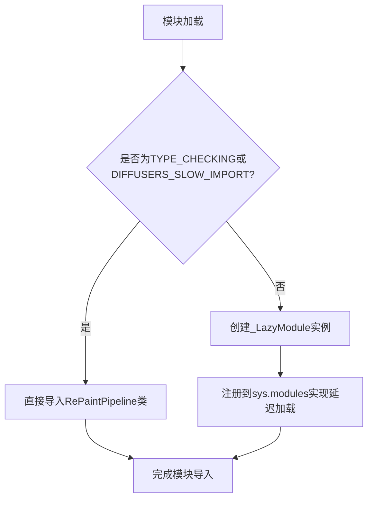

# `diffusers\src\diffusers\pipelines\deprecated\repaint\__init__.py` 详细设计文档

这是Diffusers库中RePaint管道的延迟加载模块导入文件，通过_LazyModule机制实现RePaintPipeline的按需导入，优化了包的初始化加载时间。

## 整体流程



## 类结构

```
DiffusersPipelineRegistry
└── RepaintPipeline (RePaintPipeline)
```

## 全局变量及字段


### `_import_structure`
    
存储模块导入结构的字典，映射子模块名称到导出的类名列表

类型：`Dict[str, List[str]]`
    


### `DIFFUSERS_SLOW_IMPORT`
    
从utils导入的标志变量，用于控制是否进行慢速导入

类型：`bool`
    


### `_LazyModule`
    
延迟加载模块的类，用于在运行时动态导入子模块

类型：`class`
    


    

## 全局函数及方法


## 关键组件


### 延迟加载模块（Lazy Loading Module）

通过 _LazyModule 实现模块的惰性加载，仅在真正需要时加载 RePaintPipeline 类，提升导入性能和内存效率。

### 导入结构定义（Import Structure）

定义了可导出的类 RePaintPipeline，通过 _import_structure 字典结构化管理，便于后续的延迟导入和模块规范查询。

### 条件导入机制（Conditional Import）

使用 TYPE_CHECKING 和 DIFFUSERS_SLOW_IMPORT 双条件判断，在类型检查时直接导入，在运行时使用惰性加载，平衡开发体验和运行性能。

### 动态模块替换（Dynamic Module Replacement）

通过 sys.modules[__name__] 直接替换当前模块为 _LazyModule 实例，实现透明的惰性加载包装。


## 问题及建议


### 已知问题

-   缺少模块级别的文档字符串（docstring），难以理解该模块的整体用途和设计意图
-   `__spec__` 在运行时动态创建模块时可能为 `None`，导致潜在的空引用风险
-   `DIFFUSERS_SLOW_IMPORT` 从上级目录导入（`....utils`），但未验证该依赖可用性，导入失败时缺乏清晰的错误信息
-   相对导入路径层级较深（`....utils`），维护成本较高，路径变更时容易出现破坏
-   仅暴露单一 `RePaintPipeline` 类，缺乏扩展性，未来增加新类需要修改导入结构
-   没有版本兼容性检查或废弃警告机制

### 优化建议

-   为模块添加文档字符串，说明其作为 RePaintPipeline 延迟加载入口的职责
-   在使用 `__spec__` 前添加空值检查：`module_spec=__spec__ if __spec__ else None`
-   使用 `try-except` 包装 `DIFFUSERS_SLOW_IMPORT` 和 `_LazyModule` 的导入，提供更友好的错误提示
-   考虑将导入结构设计为可配置或插件式，便于扩展新 pipeline 类
-   提取魔法数字和字符串（如 `pipeline_repaint`）为常量，减少硬编码
-   添加类型注解以提升 IDE 支持和代码可维护性


## 其它


### 设计目标与约束

本模块的设计目标是实现Diffusers库中RePaintPipeline的延迟加载机制，在保证类型提示可用性的同时优化冷启动性能。核心约束包括：1) 仅在需要时导入重型模块，减少内存占用；2) 保持与TYPE_CHECKING环境的兼容性；3) 遵循Diffusers库的模块导入规范。

### 错误处理与异常设计

本模块的错误处理主要依赖于_LazyModule的内部机制。当RePaintPipeline模块不存在或导入失败时，_LazyModule会抛出AttributeError。模块未找到时抛出ModuleNotFoundError。建议在调用方使用try-except捕获ImportError以处理RePaintPipeline不可用的情况。

### 外部依赖与接口契约

本模块依赖以下外部组件：1) typing.TYPE_CHECKING用于类型检查时的导入；2) utils.DIFFUSERS_SLOW_IMPORT标志控制延迟加载策略；3) utils._LazyModule提供延迟加载实现；4) .pipeline_repaint.RePaintPipeline为实际导入的类。接口契约规定：仅导出RePaintPipeline类，其他内部实现细节不对外暴露。

### 性能考虑

延迟加载机制显著降低了首次导入该模块时的开销。实际RePaintPipeline类及其依赖仅在首次访问时被加载。建议在生产环境中确保DIFFUSERS_SLOW_IMPORT配置合理，以平衡类型检查需求和运行时性能。

### 兼容性考虑

本模块兼容Python 3.7+及Diffusers库各版本。TYPE_CHECKING分支确保了IDE和类型检查器能够识别RePaintPipeline类型。_import_structure字典定义了公开API表面，任何对该字典外部成员的访问将触发AttributeError。

### 模块初始化流程

模块首次导入时执行以下流程：1) 定义_import_structure字典声明可导出项；2) 检查是否为类型检查模式或慢速导入模式；3) 若是，则同步导入RePaintPipeline；4) 否则，创建_LazyModule代理对象并注册到sys.modules；5) 后续通过该代理对象访问RePaintPipeline时触发实际导入。

### 可扩展性设计

当前设计支持通过_import_structure字典扩展导出项。若需导出更多类（如RePaintScheduler等），只需在字典中添加相应条目即可。_LazyModule的模块规范（module_spec）由Python运行时提供，确保与importlib的完全兼容。

### 配置与环境变量

DIFFUSERS_SLOW_IMPORT为关键配置标志，控制是否启用延迟加载。当设为True时，模块会在导入时立即加载所有依赖。建议在开发环境设为False以便于调试，生产环境设为True以优化性能。


    