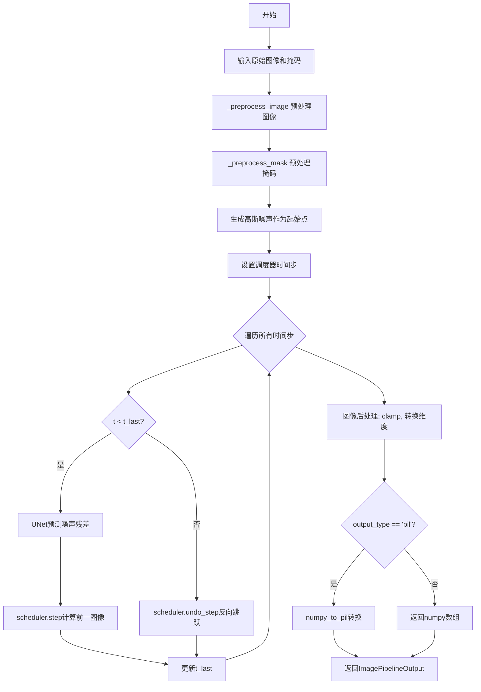
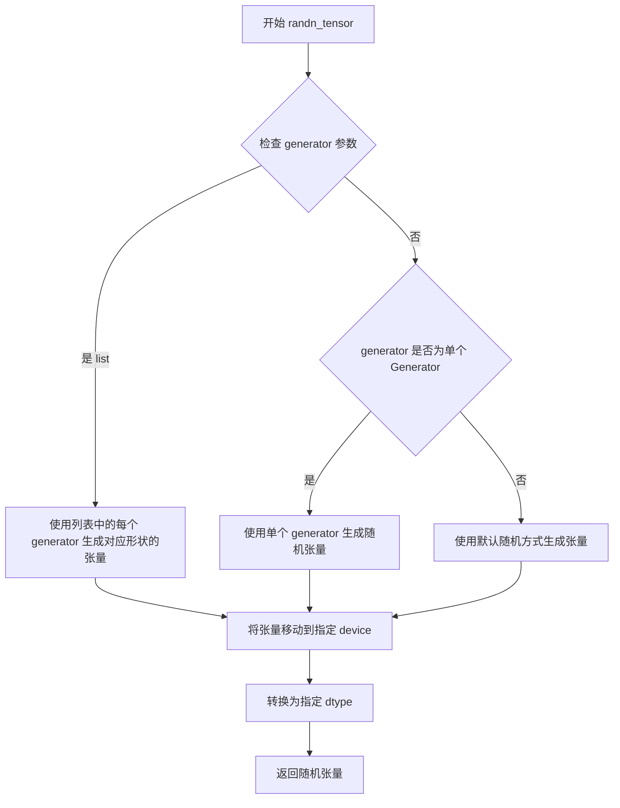
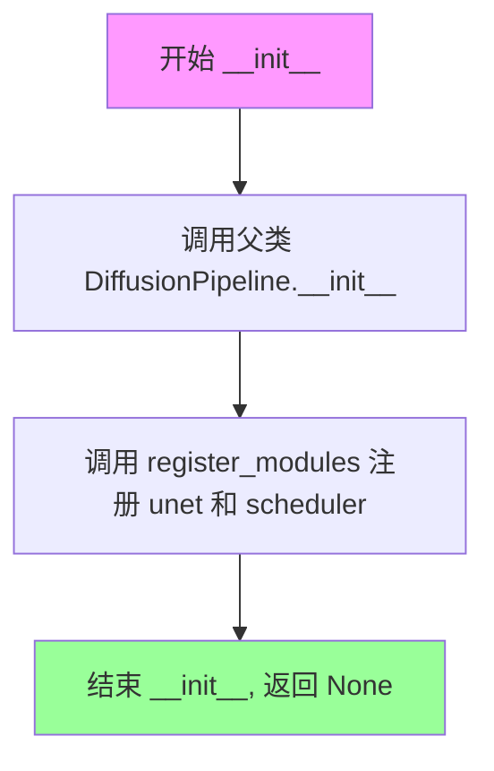
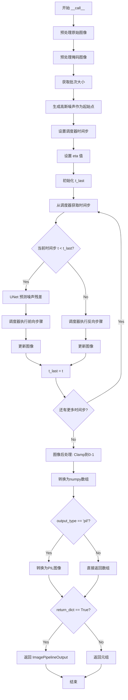

# `diffusers\src\diffusers\pipelines\deprecated\repaint\pipeline_repaint.py` 详细设计文档

RePaintPipeline是一个基于RePaint算法的图像修复（inpainting）扩散管道，通过预训练的UNet2DModel对带掩码的图像进行去噪处理，利用RePaintScheduler调度跳跃式采样策略，实现高质量的图像内容填充与修复。

## 整体流程



## 类结构

```
DiffusionPipeline (基类)
└── RePaintPipeline (图像修复管道)
    ├── 依赖: UNet2DModel
    ├── 依赖: RePaintScheduler
    └── 依赖: ImagePipelineOutput
```

## 全局变量及字段


### `logger`
    
模块级日志记录器，用于记录管道运行时的警告和信息

类型：`logging.Logger`
    


### `deprecation_message`
    
弃用警告消息，说明预处理方法将在diffusers 1.0.0版本移除

类型：`str`
    


### `original_image`
    
原始输入图像，用于进行图像修复

类型：`torch.Tensor | PIL.Image.Image`
    


### `mask_image`
    
掩码图像，0.0值区域定义需要修复的部分

类型：`torch.Tensor | PIL.Image.Image`
    


### `batch_size`
    
批次大小，表示同时处理的图像数量

类型：`int`
    


### `image`
    
当前噪声/图像状态，在去噪循环中不断更新

类型：`torch.Tensor`
    


### `image_shape`
    
图像形状，记录原始图像的维度信息

类型：`tuple`
    


### `t_last`
    
上一个时间步，用于判断是否需要执行反向跳跃

类型：`int`
    


### `model_output`
    
模型预测输出，包含UNet预测的噪声残差

类型：`torch.Tensor`
    


### `num_inference_steps`
    
推理步数，控制去噪过程的迭代次数

类型：`int`
    


### `eta`
    
噪声权重，控制在扩散步骤中添加的噪声量

类型：`float`
    


### `jump_length`
    
跳跃长度，RePaint算法中向前的时间步数

类型：`int`
    


### `jump_n_sample`
    
跳跃采样数，对每个时间样本执行向前跳跃的次数

类型：`int`
    


### `generator`
    
随机数生成器，用于确保生成过程的可重复性

类型：`torch.Generator | list[torch.Generator] | None`
    


### `output_type`
    
输出类型，指定生成图像的格式(pil或numpy数组)

类型：`str | None`
    


### `return_dict`
    
是否返回字典格式结果，True返回ImagePipelineOutput否则返回元组

类型：`bool`
    


### `RePaintPipeline.unet`
    
去噪模型，用于预测噪声残差并逐步恢复图像

类型：`UNet2DModel`
    


### `RePaintPipeline.scheduler`
    
扩散调度器，管理去噪时间步和跳跃操作

类型：`RePaintScheduler`
    


### `RePaintPipeline.model_cpu_offload_seq`
    
CPU卸载序列，指定模型组件的卸载顺序

类型：`str`
    
    

## 全局函数及方法


### `_preprocess_image`

预处理图像函数，用于将不同格式的输入图像（PIL Image、Tensor或列表）统一调整为PyTorch张量格式，包含大小调整、归一化和通道重排等步骤。

参数：

- `image`：`list | PIL.Image.Image | torch.Tensor`，需要预处理的原始图像，可以是PIL图像、PyTorch张量或它们的列表

返回值：`torch.Tensor`，预处理后的PyTorch张量，格式为NCHW，数值范围[-1, 1]

#### 流程图

```mermaid
flowchart TD
    A[开始: _preprocess_image] --> B{image是否为Tensor?}
    B -->|是| C[直接返回image]
    B -->|否| D{image是否为PIL Image?}
    D -->|是| E[将image转换为列表]
    D -->|否| F[假设image是列表]
    E --> G{image[0]是否为PIL Image?}
    G -->|是| H[获取图像宽高w, h]
    G -->|否| I{image[0]是否为Tensor?}
    H --> J[调整w, h为8的整数倍]
    J --> K[使用Lanczos重采样调整图像大小]
    K --> L[将图像转换为numpy数组]
    L --> M[归一化到[0, 1]范围]
    M --> N[转置通道顺序: HWC -> CHW]
    O[2.0 * image - 1.0] --> P[数值范围变换到[-1, 1]]
    I --> Q[在dim=0上拼接多个Tensor]
    P --> R[转换为PyTorch张量]
    Q --> R
    C --> S[结束: 返回torch.Tensor]
    R --> S
```

#### 带注释源码

```python
def _preprocess_image(image: list | PIL.Image.Image | torch.Tensor):
    """
    预处理图像：调整大小、归一化、转换为张量
    
    参数:
        image: 输入图像，可以是以下格式之一:
            - torch.Tensor: 直接返回
            - PIL.Image.Image: 转换为列表处理
            - list: 包含PIL图像或Tensor的列表
    
    返回:
        torch.Tensor: 预处理后的图像张量，格式为NCHW，数值范围[-1, 1]
    """
    # 发出弃用警告，提示用户使用新的VaeImageProcessor.preprocess方法
    deprecation_message = "The preprocess method is deprecated and will be removed in diffusers 1.0.0. Please use VaeImageProcessor.preprocess(...) instead"
    deprecate("preprocess", "1.0.0", deprecation_message, standard_warn=False)
    
    # 如果输入已经是Tensor，直接返回
    if isinstance(image, torch.Tensor):
        return image
    # 如果是单个PIL图像，转换为列表以便统一处理
    elif isinstance(image, PIL.Image.Image):
        image = [image]

    # 处理PIL图像列表
    if isinstance(image[0], PIL.Image.Image):
        # 获取图像尺寸
        w, h = image[0].size
        # 将宽高调整为8的整数倍，确保与UNet的下采样步长兼容
        w, h = (x - x % 8 for x in (w, h))
        
        # 使用Lanczos重采样调整每张图像大小，然后转换为numpy数组
        image = [np.array(i.resize((w, h), resample=PIL_INTERPOLATION["lanczos"]))[None, :] for i in image]
        # 在batch维度拼接所有图像
        image = np.concatenate(image, axis=0)
        # 转换为float32并归一化到[0, 1]范围
        image = np.array(image).astype(np.float32) / 255.0
        # 转换通道顺序: 从HWC (Height, Width, Channel) 改为CHW (Channel, Height, Width)
        image = image.transpose(0, 3, 1, 2)
        # 将数值范围从[0, 1]变换到[-1, 1]，符合diffusers模型的输入约定
        image = 2.0 * image - 1.0
        # 转换为PyTorch张量
        image = torch.from_numpy(image)
    # 处理Tensor列表
    elif isinstance(image[0], torch.Tensor):
        # 在batch维度(dim=0)上拼接多个张量
        image = torch.cat(image, dim=0)
    
    return image
```


### `_preprocess_mask`

该函数是 RePaint Pipeline 中的掩码预处理函数，负责将不同格式（`torch.Tensor`、`PIL.Image.Image` 或列表）的掩码输入统一转换为标准的二值化 `torch.Tensor` 格式，包括尺寸调整（调整为 32 的倍数以适配 UNet 的下采样）、灰度转换、最近邻插值、归一化以及阈值二值化处理。

参数：

- `mask`：`list | PIL.Image.Image | torch.Tensor`，输入的掩码数据，可以是单个 PIL 图像、图像列表或已经处理过的张量

返回值：`torch.Tensor`，返回标准化后的二值化掩码张量，形状为 (batch_size, 1, H, W)，值为 0.0 或 1.0

#### 流程图

```mermaid
flowchart TD
    A[开始: _preprocess_mask] --> B{检查 mask 类型}
    B -->|torch.Tensor| C[直接返回]
    B -->|PIL.Image.Image| D[转换为列表]
    B -->|list| E{检查列表首元素类型}
    
    D --> E
    
    E -->|PIL.Image.Image| F[获取图像尺寸 w, h]
    F --> G[调整尺寸为32的倍数]
    G --> H[转换为灰度图并resize]
    H --> I[转换为numpy数组]
    I --> J[在batch维度拼接]
    J --> K[归一化到[0, 1]]
    K --> L[二值化: <0.5设为0, >=0.5设为1]
    L --> M[转换为torch.Tensor]
    
    E -->|torch.Tensor| N[在batch维度拼接]
    
    C --> O[返回处理后的mask]
    M --> O
    N --> O
```

#### 带注释源码

```python
def _preprocess_mask(mask: list | PIL.Image.Image | torch.Tensor):
    """
    预处理掩码图像或张量，将其转换为标准化的二值化张量格式
    
    参数:
        mask: 输入掩码，支持三种格式:
            - torch.Tensor: 直接返回
            - PIL.Image.Image: 转换为列表处理
            - list: 逐个处理其中的元素
    
    返回:
        torch.Tensor: 形状为 (batch_size, 1, H, W) 的二值化掩码张量
    """
    # 如果输入已经是张量，直接返回（避免重复处理）
    if isinstance(mask, torch.Tensor):
        return mask
    # 单一PIL图像转换为列表，以便统一处理
    elif isinstance(mask, PIL.Image.Image):
        mask = [mask]

    # 处理PIL图像列表
    if isinstance(mask[0], PIL.Image.Image):
        # 获取图像尺寸
        w, h = mask[0].size
        # 调整尺寸为32的倍数，确保与UNet的下采样倍数对齐
        # UNet通常有5个下采样层，2^5=32
        w, h = (x - x % 32 for x in (w, h))
        
        # 对每个掩码图像进行处理：
        # 1. 转换为灰度图 (L模式)
        # 2. 使用最近邻插值resize（保持二值特性）
        # 3. 转换为numpy数组并添加batch维度
        mask = [np.array(m.convert("L").resize((w, h), resample=PIL_INTERPOLATION["nearest"]))[None, :] for m in mask]
        
        # 在batch维度拼接所有掩码
        mask = np.concatenate(mask, axis=0)
        
        # 归一化到[0, 1]范围
        mask = mask.astype(np.float32) / 255.0
        
        # 二值化处理：使用0.5作为阈值
        # 小于0.5设为0，大于等于0.5设为1
        mask[mask < 0.5] = 0
        mask[mask >= 0.5] = 1
        
        # 转换为PyTorch张量
        mask = torch.from_numpy(mask)
    
    # 处理已有的张量列表
    elif isinstance(mask[0], torch.Tensor):
        # 在batch维度拼接
        mask = torch.cat(mask, dim=0)
    
    return mask
```


### `randn_tensor`

生成符合正态分布（高斯分布）的随机张量，用于扩散模型的噪声采样。

参数：

- `shape`：`tuple` 或 `list`，输出张量的形状
- `generator`：`torch.Generator` 或 `list[torch.Generator]` 或 `None`，用于控制随机数生成的可选生成器，以确保结果可复现
- `device`：`torch.device`，张量应放置的设备（如 CUDA 或 CPU）
- `dtype`：`torch.dtype`，张量的数据类型（如 `torch.float32`）

返回值：`torch.Tensor`，符合标准正态分布的随机张量

#### 流程图



#### 带注释源码

```python
# 由于该函数定义在 diffusers.utils.torch_utils 模块中
# 以下是基于调用上下文的推断实现

def randn_tensor(
    shape: tuple,
    generator: torch.Generator | list[torch.Generator] | None = None,
    device: torch.device = None,
    dtype: torch.dtype = torch.float32,
) -> torch.Tensor:
    """
    生成符合标准正态分布（均值=0，标准差=1）的随机张量。
    
    参数:
        shape: 输出张量的形状，例如 (batch_size, channels, height, width)
        generator: 可选的 PyTorch 生成器，用于确定性随机数生成
        device: 目标设备
        dtype: 张量的数据类型
    
    返回:
        符合高斯分布的随机张量
    """
    # 1. 处理 generator 参数
    if isinstance(generator, list):
        # 如果是生成器列表，为每个生成器生成对应的张量
        # 这种情况下 shape 的第一个维度应与 generator 列表长度匹配
        tensor = torch.cat(
            [torch.randn(generator=gen, device=device, dtype=dtype) for gen in generator]
        ).unsqueeze(0)
    elif generator is not None:
        # 使用单个生成器
        tensor = torch.randn(generator=generator, device=device, dtype=dtype)
    else:
        # 使用全局默认随机状态
        tensor = torch.randn(shape, device=device, dtype=dtype)
    
    return tensor
```

> **注意**: 该函数源码位于 `diffusers/src/diffusers/utils/torch_utils.py` 中，此处为基于调用的推断实现。在 `RePaintPipeline` 中的调用方式为：
> ```python
> image = randn_tensor(image_shape, generator=generator, device=self._execution_device, dtype=self.unet.dtype)
> ```
> 其中 `image_shape` 为原始图像的形状，用于初始化扩散过程的起始噪声。


### `ImagePipelineOutput`

ImagePipelineOutput 是一个输出数据类，用于封装图像生成管道的输出结果。该类包含生成的图像列表，是 RePaintPipeline 等扩散管道返回的标准输出格式。

参数：

-  `images`：`List[PIL.Image.Image] | np.ndarray | torch.Tensor`，生成的图像列表

返回值：`ImagePipelineOutput`，包含生成图像的输出对象

#### 流程图

```mermaid
flowchart TD
    A[RePaintPipeline.__call__ 执行完毕] --> B{return_dict=True?}
    B -->|Yes| C[返回 ImagePipelineOutput 对象]
    B -->|No| D[返回元组 (image,)]
    C --> E[ImagePipelineOutput 包含 images 属性]
    D --> E
    
    F[外部调用 output.images] --> G[获取生成的图像列表]
```

#### 带注释源码

```
# ImagePipelineOutput 在 pipeline_utils 中定义，此处为导入使用
from ...pipeline_utils import DiffusionPipeline, ImagePipelineOutput

# 在 RePaintPipeline.__call__ 方法中的使用示例：
if not return_dict:
    return (image,)

return ImagePipelineOutput(images=image)

# ImagePipelineOutput 类的典型结构（基于使用方式推断）：
# class ImagePipelineOutput:
#     def __init__(self, images):
#         self.images = images
```

#### 补充说明

`ImagePipelineOutput` 类本身不在当前代码文件中定义，而是从 `....pipeline_utils` 模块导入。根据其在代码中的使用方式：

1. **images 属性**：存储生成的图像，可以是 PIL.Image、numpy 数组或 PyTorch 张量列表
2. **使用场景**：作为扩散管道的标准返回类型，提供结构化的输出封装
3. **设计模式**：这是一种数据传输对象（DTO）模式，便于返回多个值时保持代码整洁


### `RePaintPipeline.__init__`

初始化 RePaintPipeline 管道实例，注册 UNet2DModel 和 RePaintScheduler 模块，用于图像修复（inpainting）任务。

参数：

- `unet`：`UNet2DModel`，用于对编码后的图像潜在表示进行去噪的 UNet 模型
- `scheduler`：`RePaintScheduler`，与 `unet` 结合使用以对编码图像进行去噪的调度器

返回值：`None`，该方法仅初始化实例状态，不返回任何值

#### 流程图



#### 带注释源码

```python
def __init__(self, unet: UNet2DModel, scheduler: RePaintScheduler):
    """
    初始化 RePaintPipeline 管道。
    
    参数:
        unet: UNet2DModel 实例，用于图像去噪的 UNet 模型
        scheduler: RePaintScheduler 实例，用于控制去噪过程的调度器
    """
    # 调用父类 DiffusionPipeline 的初始化方法
    # 继承基础管道的通用功能（设备管理、模型加载等）
    super().__init__()
    
    # 注册 UNet 和 Scheduler 模块到管道中
    # 使得这些模块可以通过 self.unet 和 self.scheduler 访问
    # 同时支持 Pipeline 的 save/load 功能
    self.register_modules(unet=unet, scheduler=scheduler)
```


### `RePaintPipeline.__call__`

执行RePaint图像修复推理的主方法，通过调度器和UNet模型对输入图像进行去噪处理，生成修复后的图像。

参数：

- `self`：RePaintPipeline实例，隐式参数
- `image`：`torch.Tensor | PIL.Image.Image`，要修复的原始图像
- `mask_image`：`torch.Tensor | PIL.Image.Image`，掩码图像，0.0定义需要修复的区域
- `num_inference_steps`：`int`，去噪步骤数，默认为250，值越大质量越高但推理越慢
- `eta`：`float`，扩散步骤中添加噪声的权重，0.0对应DDIM，1.0对应DDPM，默认为0.0
- `jump_length`：`int`，RePaint跳转长度，默认为10，控制时间跳转的前向步数
- `jump_n_sample`：`int`，给定时间样本的跳转采样次数，默认为10
- `generator`：`torch.Generator | list[torch.Generator] | None`，随机数生成器，用于确保生成的可重复性
- `output_type`：`str | None`，输出格式，可选"pil"或"np.array"，默认为"pil"
- `return_dict`：`bool`，是否返回ImagePipelineOutput，默认为True

返回值：`ImagePipelineOutput | tuple`，返回修复后的图像，若return_dict为True则返回ImagePipelineOutput，否则返回包含图像列表的元组

#### 流程图



#### 带注释源码

```python
@torch.no_grad()  # 禁用梯度计算以节省内存
def __call__(
    self,
    image: torch.Tensor | PIL.Image.Image,
    mask_image: torch.Tensor | PIL.Image.Image,
    num_inference_steps: int = 250,
    eta: float = 0.0,
    jump_length: int = 10,
    jump_n_sample: int = 10,
    generator: torch.Generator | list[torch.Generator] | None = None,
    output_type: str | None = "pil",
    return_dict: bool = True,
) -> ImagePipelineOutput | tuple:
    """
    执行图像修复推理的主方法
    
    参数:
        image: 原始输入图像
        mask_image: 掩码图像,0.0表示需要修复的区域
        num_inference_steps: 去噪步数
        eta: DDIM/DDPM噪声权重
        jump_length: RePaint跳转长度
        jump_n_sample: 跳转采样次数
        generator: 随机生成器
        output_type: 输出格式
        return_dict: 是否返回字典格式
    """
    
    original_image = image  # 保存原始图像引用

    # 预处理图像: 转换为torch.Tensor并标准化到[-1, 1]
    original_image = _preprocess_image(original_image)
    # 将图像移到执行设备(通常是GPU)并转换为UNet所需的数据类型
    original_image = original_image.to(device=self._execution_device, dtype=self.unet.dtype)
    
    # 预处理掩码: 转换为torch.Tensor并二值化
    mask_image = _preprocess_mask(mask_image)
    # 将掩码移到执行设备
    mask_image = mask_image.to(device=self._execution_device, dtype=self.unet.dtype)

    batch_size = original_image.shape[0]  # 获取批次大小

    # 验证generator列表长度与批次大小是否匹配
    if isinstance(generator, list) and len(generator) != batch_size:
        raise ValueError(
            f"You have passed a list of generators of length {len(generator)}, but requested an effective batch"
            f" size of {batch_size}. Make sure the batch size matches the length of the generators."
        )

    image_shape = original_image.shape  # 获取图像形状
    
    # 生成高斯噪声作为扩散过程的起始点
    image = randn_tensor(image_shape, generator=generator, device=self._execution_device, dtype=self.unet.dtype)

    # 设置调度器的时间步,包括跳转长度和采样数参数
    self.scheduler.set_timesteps(num_inference_steps, jump_length, jump_n_sample, self._execution_device)
    self.scheduler.eta = eta  # 设置噪声权重

    t_last = self.scheduler.timesteps[0] + 1  # 初始化最后一个时间步
    generator = generator[0] if isinstance(generator, list) else generator  # 提取单个生成器
    
    # 遍历调度器的所有时间步进行去噪
    for i, t in enumerate(self.progress_bar(self.scheduler.timesteps)):
        if t < t_last:
            # 前向去噪步骤: 预测噪声并重建图像
            model_output = self.unet(image, t).sample  # UNet预测噪声残差
            # 调用调度器计算前一时间步的图像: x_t -> x_t-1
            image = self.scheduler.step(
                model_output, t, image, original_image, mask_image, generator
            ).prev_sample

        else:
            # 反向跳转步骤: x_t-1 -> x_t (RePaint特有机制)
            image = self.scheduler.undo_step(image, t_last, generator)
        t_last = t  # 更新最后时间步

    # 后处理: 将图像从[-1, 1]映射到[0, 1]
    image = (image / 2 + 0.5).clamp(0, 1)
    # 转换为numpy数组并调整维度顺序: (B, C, H, W) -> (B, H, W, C)
    image = image.cpu().permute(0, 2, 3, 1).numpy()
    
    # 根据输出类型转换图像格式
    if output_type == "pil":
        image = self.numpy_to_pil(image)

    # 根据return_dict决定返回格式
    if not return_dict:
        return (image,)

    return ImagePipelineOutput(images=image)
```

## 关键组件


### RePaintPipeline

RePaint图像修复管道的主类，继承自DiffusionPipeline，用于通过RePaint算法对图像进行修复（inpainting）。该类整合了UNet2DModel去噪模型和RePaintScheduler调度器，实现了基于跳步采样（jump sampling）的去噪推理流程，能够根据原始图像和掩码生成修复后的图像。

### _preprocess_image

图像预处理函数，负责将PIL.Image.Image或numpy数组转换为torch.Tensor格式。函数确保输入图像尺寸为8的整数倍，进行归一化处理（将像素值从[0,255]映射到[-1,1]），并移动到指定设备。该函数已标记为deprecated，推荐使用VaeImageProcessor.preprocess替代。

### _preprocess_mask

掩码预处理函数，负责将掩码图像转换为torch.Tensor格式。函数确保掩码尺寸为32的整数倍，使用最近邻插值进行缩放，并将掩码值二值化（阈值0.5），最终转换为浮点张量格式。

### RePaintScheduler

RePaint调度器类，用于管理去噪过程的时间步和跳步采样逻辑。调度器通过set_timesteps方法配置推理步数、跳步长度和跳步样本数，支持正向去噪步骤和逆向跳步步骤（undo_step），实现RePaint论文中描述的conditional sampling策略。

### UNet2DModel

UNet2DModel去噪模型，作为RePaintPipeline的核心组件，负责根据当前噪声图像、时间步t、原始图像和掩码预测噪声残差。模型接收原始图像作为条件输入，通过交叉注意力机制引导修复过程。

### ImagePipelineOutput

输出数据类，用于封装管道生成的图像结果。包含images属性，存储修复后的图像列表，支持PIL.Image或numpy数组格式。

### 图像后处理模块

包含图像反归一化和格式转换逻辑，将[-1,1]范围的张量值clamp到[0,1]，转换为numpy数组，并根据output_type参数决定是否转换为PIL.Image格式。

### 噪声采样与生成器管理

使用randn_tensor生成高斯噪声作为去噪循环的起点，支持通过torch.Generator设置随机种子以确保可重复性，并对批量生成器进行校验。

### 设备与数据类型管理

通过_execution_device和unet.dtype属性管理模型运行设备和数据类型，确保预处理后的图像和掩码与模型设备及数据类型一致。


## 问题及建议


### 已知问题

-   **已弃用的预处理方法**：`_preprocess_image` 函数使用了已弃用的 `deprecate` 方法，在 diffusers 1.0.0 中将被移除，应改用 `VaeImageProcessor.preprocess(...)` 替代
-   **硬编码的尺寸参数**：图像预处理使用 8 的倍数（`x - x % 8`），掩码预处理使用 32 的倍数（`x - x % 32`），这些值应基于模型配置动态获取而非硬编码
-   **文档与代码默认值不一致**：`num_inference_steps` 参数在代码中默认值为 250，但在 docstring 中描述默认值为 1000，会造成混淆
-   **缺少输入验证**：未验证 `image` 和 `mask_image` 的尺寸是否匹配，可能导致运行时错误
-   **generator 类型处理**：当传入 list 类型的 generator 时，仅取第一个元素（`generator = generator[0]`），这种隐式行为容易导致意外结果
-   **torch 与 numpy 转换开销**：预处理过程中多次在 torch 和 numpy 之间转换数据（`np.array` -> `torch.from_numpy`），增加不必要的内存开销
-   **进度条不可配置**：`self.progress_bar(self.scheduler.timesteps)` 直接使用，无法禁用或自定义回调

### 优化建议

-   移除已弃用的预处理函数，改用 `VaeImageProcessor` 统一处理图像和掩码预处理
-   将硬编码的尺寸倍数（8 和 32）替换为从 `unet.config.sample_size` 或 scheduler 配置中动态获取
-   统一文档和代码中的默认值，确保 `num_inference_steps` 的默认值为 250（与 RePaint 算法推荐值一致）
-   在 `__call__` 方法开头添加输入验证逻辑，检查 image 和 mask_image 的 batch size 和空间尺寸是否匹配
-   明确 generator 参数的处理逻辑，当传入 list 时应明确文档说明或抛出更清晰的错误信息
-   优化数据流，尽可能在 torch 域内完成处理，减少与 numpy 之间的转换
-   将 `output_type` 参数改为 Enum 类型，提供类型安全和自动补全支持
-   考虑添加 `enable_progress_bar` 参数，允许用户控制是否显示进度条

## 其它


### 设计目标与约束

**设计目标**：
- 实现基于RePaint算法的图像修复（inpainting）功能
- 提供可配置的扩散推理过程，支持用户自定义去噪步数、噪声权重等参数
- 遵循Diffusers库的通用pipeline架构设计规范

**设计约束**：
- 依赖预训练的UNet2DModel和RePaintScheduler
- 输入图像尺寸需为32的倍数（mask）和8的倍数（image）
- 计算资源密集度高，需GPU支持
- 仅支持特定格式的输入（PIL.Image或torch.Tensor）

### 错误处理与异常设计

**参数校验异常**：
- 当generator列表长度与batch_size不匹配时，抛出`ValueError`，提示"You have passed a list of generators of length {len(generator)}, but requested an effective batch size of {batch_size}. Make sure the batch size matches the length of the generators."
- 图像预处理阶段对输入类型进行检查，非torch.Tensor或PIL.Image类型将导致类型错误

**弃用警告**：
- `_preprocess_image`函数使用`deprecate`触发弃用警告，提示用户使用`VaeImageProcessor.preprocess()`替代
- 警告信息："The preprocess method is deprecated and will be removed in diffusers 1.0.0. Please use VaeImageProcessor.preprocess(...) instead"

**设备与类型兼容性**：
- 自动将数据和模型转换到执行设备（`self._execution_device`）
- 模型权重dtype需与输入tensor dtype匹配

### 数据流与状态机

**主数据流**：
1. 原始图像和mask图像输入
2. 图像预处理（resize、normalize、转换为tensor）
3. 高斯噪声采样初始化
4. Scheduler设置时间步（包含jump_length和jump_n_sample）
5. 迭代去噪循环：
   - 前向跳跃：执行去噪step（predict noise -> compute prev_sample）
   - 反向跳跃：执行undo_step（x_t-1 -> x_t）
6. 输出后处理（clamp、transpose、转换为PIL if needed）
7. 返回ImagePipelineOutput或tuple

**状态转换逻辑**：
- Scheduler维护`timesteps`数组，包含正向和反向跳跃的时间步
- 通过`t < t_last`判断当前是进行去噪还是回退操作
- 每个iteration更新`t_last`为当前时间步t

### 外部依赖与接口契约

**核心依赖**：
- `numpy`：数值计算，图像数组操作
- `PIL.Image`：图像加载与处理
- `torch`：深度学习 tensor 操作
- `diffusers.models.UNet2DModel`：去噪模型
- `diffusers.schedulers.RePaintScheduler`：RePaint调度器
- `diffusers.utils`：工具函数（PIL_INTERPOLATION、deprecate、logging、randn_tensor）
- `diffusers.pipelines.pipeline_utils.DiffusionPipeline`：基类
- `diffusers.pipelines.ImagePipelineOutput`：输出封装

**公开接口**：
- `RePaintPipeline.__call__`：主生成方法
- 输入参数：image, mask_image, num_inference_steps, eta, jump_length, jump_n_sample, generator, output_type, return_dict
- 输出：ImagePipelineOutput（images: List[PIL.Image]）或tuple

**模块级别私有函数**：
- `_preprocess_image`：图像预处理（已弃用）
- `_preprocess_mask`：mask预处理

### 性能考量

**内存优化**：
- 使用`torch.no_grad()`装饰器禁用梯度计算
- 支持模型CPU offload（`model_cpu_offload_seq = "unet"`）
- 中间tensor及时转移到计算设备

**计算优化**：
- Batch处理支持
- 支持generator列表实现多generator并行
- 进度条显示（`self.progress_bar`）

### 版本兼容性

- 依赖diffusers库版本≥1.0.0（因preprocess方法在该版本移除）
- Scheduler需实现`set_timesteps`、`step`、`undo_step`方法
- UNet2DModel需实现`sample`属性访问

### 安全性与限制

- 许可证：Apache License 2.0
- 仅用于图像修复任务
- 输入mask中0.0区域为需要修复的区域，1.0区域保留原图
- 输出图像经clamp(0,1)确保像素值合法

    