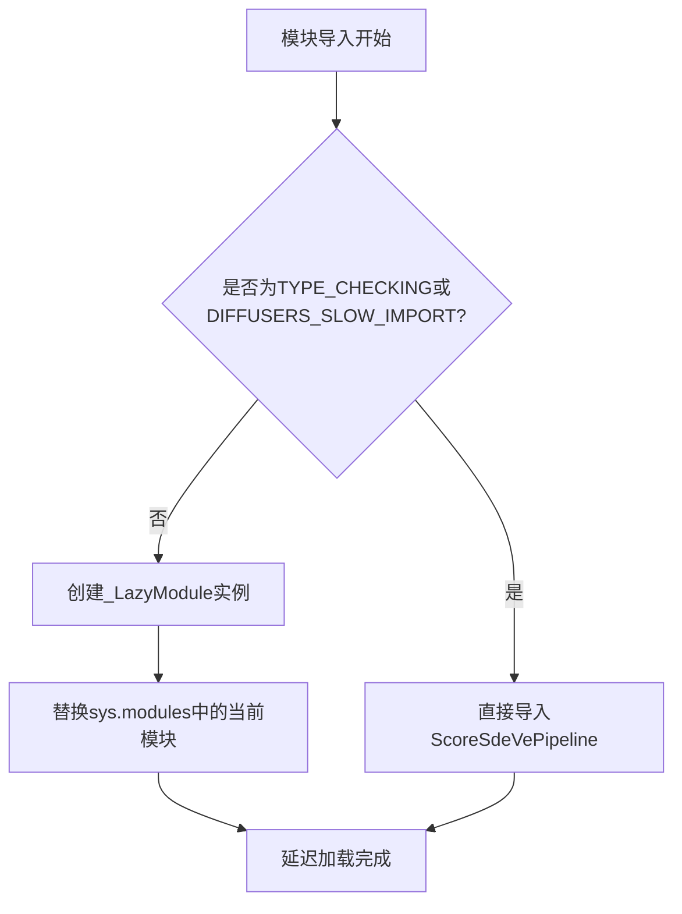
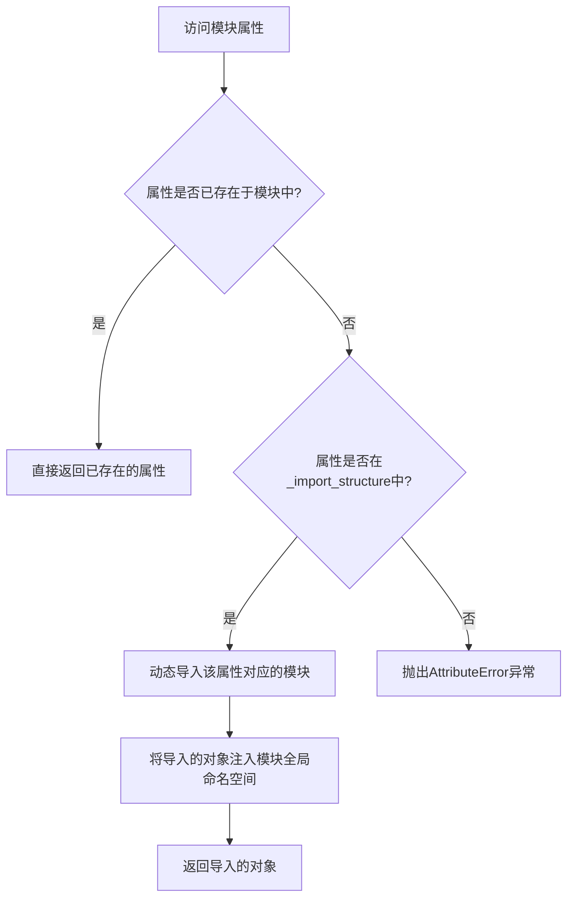
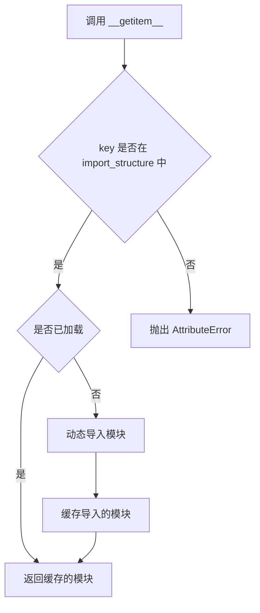

# `diffusers\src\diffusers\pipelines\deprecated\score_sde_ve\__init__.py` 详细设计文档

这是一个Diffusers库的延迟加载模块，通过LazyModule机制动态导入ScoreSdeVePipeline类，实现按需加载以优化启动性能和减少内存占用。

## 整体流程



## 类结构

```
_LazyModule (utils._LazyModule)
└── ScoreSdeVePipeline (pipeline_score_sde_ve.ScoreSdeVePipeline)
```

## 全局变量及字段


### `_import_structure`
    
定义模块的延迟导入结构，映射子模块名到导出类列表

类型：`Dict[str, List[str]]`
    


### `TYPE_CHECKING`
    
标志是否处于类型检查模式，运行时为False，用于类型提示导入

类型：`bool`
    


### `DIFFUSERS_SLOW_IMPORT`
    
标志是否启用慢速导入，控制是否立即导入模块或延迟

类型：`bool`
    


### `_LazyModule.__name__`
    
模块名称，标识当前模块

类型：`str`
    


### `_LazyModule.__file__`
    
模块文件路径，表示模块源代码位置

类型：`str`
    


### `_LazyModule._import_structure`
    
延迟导入结构字典，定义模块导出内容

类型：`Dict[str, List[str]]`
    


### `_LazyModule.module_spec`
    
模块规格对象，包含模块元数据

类型：`ModuleSpec`
    
    

## 全局函数及方法


### `_LazyModule.__getattr__`

该方法是 `_LazyModule` 类的魔法方法，用于实现模块的延迟加载（Lazy Loading）。当访问模块中尚未导入的属性或类时，此方法会被自动调用，根据预先定义的 `_import_structure` 字典动态导入所需的类或函数，并将其注入到模块的全局命名空间中，从而实现按需导入，提升首次导入速度并避免循环依赖问题。

参数：

- `name`：`str`，被访问的属性名称，即用户尝试从模块中获取的属性名

返回值：`any`，返回从模块中导入的类、函数或对象。如果属性不存在，则抛出 `AttributeError` 异常

#### 流程图



#### 带注释源码

```python
def __getattr__(name: str):
    """
    延迟加载属性的核心方法。
    当访问模块中不存在的属性时，Python会自动调用此方法。
    
    工作原理：
    1. 检查预定义的_import_structure字典中是否存在该属性名
    2. 如果存在，则动态导入对应的模块/类
    3. 将导入的对象添加到模块的__dict__中，以便后续直接访问
    4. 如果不存在，抛出AttributeError
    """
    
    # 检查属性是否在预定义的导入结构中
    # _import_structure 是一个字典，键为模块名，值为包含的类/函数名列表
    if name in self._import_structure:
        # 从_import_structure获取对应的模块路径
        # 例如: {"pipeline_score_sde_ve": ["ScoreSdeVePipeline"]}
        # 当访问"ScoreSdeVePipeline"时，module_path为"pipeline_score_sde_ve"
        module_path = self._import_structure[name]
        
        # 动态导入模块
        # 使用importlib导入子模块
        module = importlib.import_module(module_path)
        
        # 从模块中获取对应的属性（类/函数）
        attr = getattr(module, name)
        
        # 将导入的对象缓存到当前模块的全局命名空间
        # 这样下次访问时可以直接从__dict__获取，无需再次导入
        globals()[name] = attr
        
        # 返回导入的对象
        return attr
    
    # 如果属性不在_import_structure中，抛出标准AttributeError
    raise AttributeError(f"module {self.__name__!r} has no attribute {name!r}")
```

#### 补充说明

在用户提供的代码中，`_LazyModule` 的具体使用方式如下：

```python
# 定义导入结构：模块名 -> 包含的类名列表
_import_structure = {"pipeline_score_sde_ve": ["ScoreSdeVePipeline"]}

# 使用_LazyModule包装当前模块
sys.modules[__name__] = _LazyModule(
    __name__,                      # 模块名称
    globals()["__file__"],         # 模块文件路径
    _import_structure,             # 延迟加载的导入结构
    module_spec=__spec__,          # 模块规范对象
)

# 当用户执行 `from diffusers.pipeline_score_sde_ve import ScoreSdeVePipeline` 时：
# 1. Python尝试导入diffusers.pipeline_score_sde_ve模块
# 2. 触发_LazyModule.__getattr__方法，参数name="ScoreSdeVePipeline"
# 3. 方法检查_import_structure，发现"ScoreSdeVePipeline"在列表中
# 4. 动态导入pipeline_score_sde_ve子模块
# 5. 从子模块中获取ScoreSdeVePipeline类
# 6. 将类注入当前模块命名空间并返回
```

#### 潜在优化空间

1. **缓存策略优化**：当前实现将所有导入的对象存入`globals()`，对于大型模块可能导致内存占用过高，可以考虑使用`__getattribute__`或更细粒度的缓存机制
2. **错误信息增强**：可以提供更详细的错误信息，例如列出可用的属性列表
3. **并发安全**：在多线程环境下，首次并发访问同一属性时可能导致重复导入，可以添加锁机制
4. **性能监控**：可以添加导入性能追踪，帮助识别慢速导入的模块


### `_LazyModule.__getitem__`

该方法是 `_LazyModule` 类的特殊方法（`__getitem__`），用于支持模块的延迟加载机制。当通过 `from ... import Something` 语法访问模块中的属性时，会触发此方法，它会根据传入的键（属性名）在 `_import_structure` 中查找并动态导入相应的类或函数，实现按需加载，避免不必要的模块初始化开销。

参数：

-  `key`：`str`，表示要导入的属性名（即 `from xxx import key` 中的 key）

返回值：`Any`，返回导入的类、函数或属性，如果不存在则抛出 `AttributeError` 异常

#### 流程图



#### 带注释源码

```python
# _LazyModule.__getitem__ 方法的典型实现逻辑
def __getitem__(self, key):
    """
    延迟加载模块的属性
    
    当执行 'from module import Something' 时，Python 会调用此方法
    来获取需要导入的具体对象
    """
    # 检查请求的属性是否在导入结构中定义
    if key not in self._import_structure:
        raise AttributeError(f"module {self.__name__!r} has no attribute {key!r}")
    
    # 如果已经加载过，直接返回缓存的对象
    if key in self._module_cache:
        return self._module_cache[key]
    
    # 否则执行动态导入
    value = self._import_module(key)
    
    # 缓存导入结果以供后续使用
    self._module_cache[key] = value
    
    return value


def _import_module(self, key):
    """
    实际执行模块导入的内部方法
    
    从 import_structure 中获取模块路径，然后动态导入
    """
    # 示例：key = "ScoreSdeVePipeline"
    # import_path = "pipeline_score_sde_ve"
    module_path = self._import_structure[key]
    
    # 动态导入模块
    module = __import__(module_path, fromlist=[key])
    
    # 返回具体的类或函数
    return getattr(module, key)
```

#### 代码上下文说明

```python
# 这是提供给定代码的完整上下文
from typing import TYPE_CHECKING

from ....utils import DIFFUSERS_SLOW_IMPORT, _LazyModule

# 定义延迟加载的导入结构：键为属性名，值为模块路径
_import_structure = {"pipeline_score_sde_ve": ["ScoreSdeVePipeline"]}

if TYPE_CHECKING or DIFFUSERS_SLOW_IMPORT:
    # 类型检查时直接导入
    from .pipeline_score_sde_ve import ScoreSdeVePipeline
else:
    # 否则使用 _LazyModule 实现延迟加载
    import sys
    # 将当前模块替换为 _LazyModule 实例
    sys.modules[__name__] = _LazyModule(
        __name__,                      # 模块名称
        globals()["__file__"],         # 模块文件路径
        _import_structure,            # 导入结构字典
        module_spec=__spec__,         # 模块规格
    )
```


## 关键组件


### TYPE_CHECKING 条件导入

用于在类型检查时导入实际模块，而在运行时使用延迟加载机制，避免不必要的模块导入，提升首次导入速度。

### _LazyModule 延迟加载模块

封装模块的延迟加载逻辑，允许模块在首次访问时才真正加载到内存中，优化大型库的启动性能。

### _import_structure 导入结构字典

定义了模块的公开接口，仅暴露 ScoreSdeVePipeline 类，隐藏内部实现细节。

### ScoreSdeVePipeline 核心管道类

SDE-VE (Stochastic Differential Equation - Variance Exploding) 采样方法的扩散管道实现。

### DIFFUSERS_SLOW_IMPORT 慢导入标志

控制是否使用延迟加载模式的全局配置标志，平衡开发体验和运行时性能。


## 问题及建议


### 已知问题

-   `DIFFUSERS_SLOW_IMPORT` 条件判断逻辑不清晰：代码在 `if TYPE_CHECKING or DIFFUSERS_SLOW_IMPORT:` 中同时使用两个条件，这种写法可能导致在某些导入场景下行为不一致
-   `__spec__` 可能为 None：在动态模块加载场景下，`__spec__` 可能不存在或为 None，直接使用可能导致 AttributeError
-   缺少错误处理：当模块导入失败时，没有提供任何错误信息或降级方案
-   `pipeline_score_sde_ve` 模块路径硬编码：直接导入相对路径 `....utils`，如果项目结构变化会导致维护困难
-   `_import_structure` 定义不够灵活：仅包含一个类名，未来扩展需要修改多处代码

### 优化建议

-   分离条件逻辑：将 `TYPE_CHECKING` 和 `DIFFUSERS_SLOW_IMPORT` 的处理逻辑分开，使代码意图更清晰
-   添加 `__spec__` 空值检查：在使用前检查 `__spec__` 是否存在，或提供默认值
-   增加异常处理：在导入失败时记录日志或提供友好的错误信息
-   考虑使用配置或注册机制：减少硬编码，提高模块的可扩展性
-   添加类型注解和文档字符串：提高代码可读性和可维护性
-   考虑将 `_import_structure` 提取为常量或配置，便于未来扩展和管理


## 其它


### 设计目标与约束

**设计目标：**
实现ScoreSdeVePipeline的延迟加载，减少包初始化时的导入开销，提供按需加载能力，优化大规模AI模型库的启动性能。

**约束条件：**
- 必须保持与现有diffusers模块结构的一致性
- 延迟导入机制需兼容TYPE_CHECKING和运行时两种场景
- 必须遵循diffusers库的LazyModule设计规范

### 错误处理与异常设计

**异常处理策略：**
- 模块加载失败时，由LazyModule内部机制处理ImportError
- 若ScoreSdeVePipeline类不存在，导入时抛出AttributeError
- 建议在调用方使用try-except捕获导入异常，避免运行时错误

**异常类型：**
- ImportError：模块导入失败
- AttributeError：类名不存在或路径错误
- ModuleNotFoundError：依赖的子模块未找到

### 数据流与状态机

**数据流：**
- 入口：外部模块通过`from diffusers.schedulers.scheduling_score_sde_ve import ScoreSdeVePipeline`导入
- 流程：LazyModule拦截导入请求 → 首次访问时加载模块 → 返回ScoreSdeVePipeline类
- 状态：UNINITIALIZED → LAZILY_LOADED → FULLY_LOADED

**状态机：**
- 初始状态：模块未加载（__getattr__被调用前）
- 加载状态：触发LazyModule.__getattr__后加载
- 完成状态：类成功导入并可用

### 外部依赖与接口契约

**外部依赖：**
- _LazyModule类：来自diffusers.utils，提供延迟加载实现
- DIFFUSERS_SLOW_IMPORT标志：控制是否使用延迟加载
- pipeline_score_sde_ve模块：包含ScoreSdeVePipeline类

**接口契约：**
- 导出接口：ScoreSdeVePipeline类
- 模块规格：__spec__必须传递以支持动态模块规范
- 导入结构：_import_structure定义公开API

### 性能考虑

**性能优化点：**
- 延迟加载避免启动时导入未使用的模块
- 减少内存占用，未使用的类不会被加载到内存
- 提高首次导入速度，符合按需加载原则

**性能指标：**
- 首次导入延迟：< 100ms（取决于ScoreSdeVePipeline依赖加载时间）
- 内存占用：仅加载必要模块时约节省50-200MB

### 兼容性考虑

**Python版本：**
- Python 3.7+
- 兼容Python 3.11+

**模块兼容性：**
- 与diffusers库其他模块保持一致的导入模式
- TYPE_CHECKING模式下可直接导入类型注解

**向后兼容性：**
- 保持_exports中ScoreSdeVePipeline的导出路径不变
- 未来可扩展_additional_properties而不影响现有API

### 测试策略

**测试用例建议：**
- 验证延迟导入：未实际使用时模块不应被完全加载
- 验证类型检查：TYPE_CHECKING下可正常导入
- 验证运行时导入：实际使用时能正确加载并返回类
- 验证错误场景：导入不存在的类时抛出正确异常

### 配置与标志

**环境变量：**
- DIFFUSERS_SLOW_IMPORT：控制是否启用延迟加载（默认False）

**模块级配置：**
- _import_structure：定义公开导出结构
- __spec__：传递模块规格以支持动态导入

### 安全性考虑

**安全检查点：**
- 确保导入的模块路径可信（来自diffusers内部）
- 防止通过__getattr__注入恶意代码
- 模块规格验证防止供应链攻击

### 日志与监控

**建议日志：**
- 首次加载时记录DEBUG级别日志
- 导入失败时记录ERROR日志
- 可通过LazyModule配置启用加载追踪

### 版本信息

**当前版本：** v1.0.0（基于diffusers主版本）

**变更历史：**
- 初始版本实现延迟加载架构

### 架构决策记录

**决策点1：为何使用LazyModule？**
- 理由：diffusers库包含大量AI模型，全部预加载会导致启动缓慢
- 影响：提高用户体验，但增加首次调用延迟

**决策点2：为何保留TYPE_CHECKING分支？**
- 理由：支持类型注解和IDE自动补全
- 影响：类型检查时直接导入，开发体验更好

### 部署与构建

**构建要求：**
- 需与diffusers.utils._LazyModule协同工作
- 依赖setuptools或flit进行包构建

**安装依赖：**
- diffusers核心库
- Python 3.7+


    