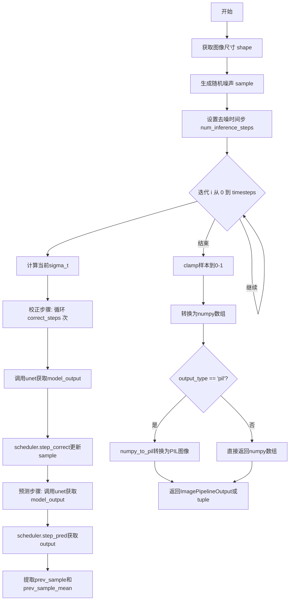
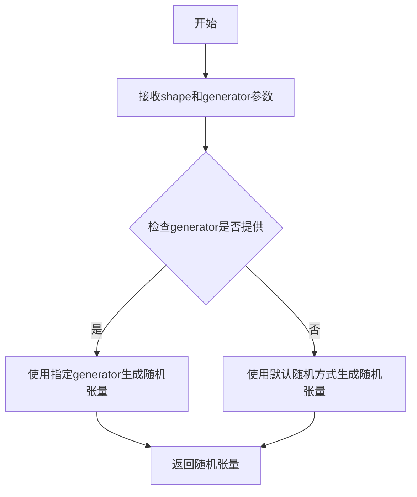
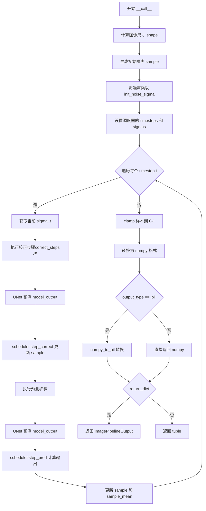

# `diffusers\src\diffusers\pipelines\deprecated\score_sde_ve\pipeline_score_sde_ve.py` 详细设计文档

这是一个基于Score-Based Stochastic Differential Equations (SDE)变体（ScoreSdeVe）的无条件图像生成扩散管道，继承自DiffusionPipeline，利用UNet2DModel进行去噪和ScoreSdeVeScheduler进行噪声调度，在迭代过程中交替执行校正步骤和预测步骤以逐步从随机噪声生成图像。

## 整体流程



## 类结构

```
DiffusionPipeline (抽象基类)
└── ScoreSdeVePipeline (图像生成管道)
    ├── unet: UNet2DModel
    └── scheduler: ScoreSdeVeScheduler
```

## 全局变量及字段


### `ScoreSdeVePipeline.unet`
    
去噪模型，用于对编码图像进行去噪处理

类型：`UNet2DModel`
    


### `ScoreSdeVePipeline.scheduler`
    
噪声调度器，用于在去噪过程中调度噪声参数

类型：`ScoreSdeVeScheduler`
    
    

## 全局函数及方法


### `randn_tensor`

生成符合正态分布的随机张量，用于初始化扩散模型的噪声样本。

参数：

- `shape`：`tuple` 或 `list[int]`，指定生成张量的形状，例如 `(batch_size, 3, img_size, img_size)`
- `generator`：`torch.Generator | list[torch.Generator] | None`，可选的随机生成器，用于控制随机性，确保结果可复现

返回值：`torch.Tensor`，符合指定形状的正态分布随机张量

#### 流程图



#### 带注释源码

```python
# 该函数定义位于 ....utils.torch_utils 模块中
# 以下为在 ScoreSdeVePipeline 中的调用方式和使用场景

# 从 torch_utils 导入 randn_tensor 函数
from ....utils.torch_utils import randn_tensor

# ...

# 在 __call__ 方法中使用 randn_tensor 生成初始噪声样本
# 参数 shape 指定了输出张量的形状：(batch_size, 3, img_size, img_size)
# generator 参数可选，用于控制随机数生成的随机种子，确保结果可复现
sample = randn_tensor(shape, generator=generator) * self.scheduler.init_noise_sigma

# randn_tensor 生成的是标准正态分布随机数
# 乘以 self.scheduler.init_noise_sigma 是为了根据调度器的初始噪声sigma值进行缩放
# 这在 ScoreSDE-VE 等扩散模型中用于初始化采样过程
```


### `ScoreSdeVePipeline.numpy_to_pil`

该方法继承自 `DiffusionPipeline` 基类，负责将 numpy 数组格式的图像数据转换为 PIL Image 对象，以便于显示和保存。在扩散管道生成的图像需要以 PIL 格式输出时调用此方法进行格式转换。

参数：

- `self`：`ScoreSdeVePipeline` 实例，隐式参数，调用该方法的对象本身
- `sample`：`numpy.ndarray`，待转换的 numpy 数组，形状为 (batch_size, height, width, channels)，通道顺序为 RGB，数值范围通常在 [0, 1] 或 [0, 255]

返回值：`PIL.Image.Image` 或 `list[PIL.Image.Image]`，转换后的 PIL 图像对象。如果是批量图像，则返回图像列表

#### 流程图

```mermaid
flowchart TD
    A[开始 numpy_to_pil] --> B{输入数组维度检查}
    B -->|一维数组| C[处理单张图像]
    B -->|四维数组| D[处理批量图像]
    
    C --> E[将数值范围从 [0, 1] 映射到 [0, 255]]
    D --> F[遍历每个图像批次]
    F --> E
    
    E --> G[转换数据类型为 uint8]
    G --> H[创建 PIL Image 对象]
    H --> I[返回 PIL 图像或图像列表]
```

#### 带注释源码

```python
# 该方法定义在 DiffusionPipeline 基类中
# 以下为推断的标准实现模式

def numpy_to_pil(self, images):
    """
    Convert a numpy image or a batch of images to a PIL Image.
    
    Args:
        images (`np.ndarray`): The image or batch of images to be converted.
            Expected shape for single image: (H, W, C)
            Expected shape for batch: (B, H, W, C)
            Values should be in the range [0, 1] or [0, 255]
    
    Returns:
        `PIL.Image.Image` or `list[PIL.Image.Image]`: The converted PIL image(s).
    """
    if images.ndim == 3:
        # 处理单张图像: (H, W, C)
        images = (images * 255).round().astype("uint8")
        images = images.transpose(2, 0, 1)  # (H, W, C) -> (C, H, W)
        images = Image.fromarray(images)
    elif images.ndim == 4:
        # 处理批量图像: (B, H, W, C)
        images = (images * 255).round().astype("uint8")
        images = images.transpose(0, 3, 1, 2)  # (B, H, W, C) -> (B, C, H, W)
        images = [Image.fromarray(img) for img in images]
    else:
        raise ValueError(f"Unsupported image array dimensions: {images.ndim}")
    
    return images
```

#### 补充说明

1. **数据流位置**：在 `ScoreSdeVePipeline.__call__` 方法中，该方法被调用于图像生成的最终阶段，将 numpy 数组格式的生成结果转换为 PIL 图像格式以供输出

2. **类型契约**：
   - 输入：numpy.ndarray，形状为 (batch_size, height, width, channels)，RGB 格式
   - 输出：PIL.Image 或列表

3. **设计约束**：该方法假设输入的数值范围为 [0, 1]，因此在调用前会在 `__call__` 中执行 `sample.clamp(0, 1)` 操作确保数值范围正确


### `ScoreSdeVePipeline.__init__`

初始化ScoreSdeVePipeline扩散管道，注册UNet2DModel和ScoreSdeVeScheduler模块。

参数：

- `unet`：`UNet2DModel`，用于去噪编码图像的UNet2DModel模型
- `scheduler`：`ScoreSdeVeScheduler`，与unet配合去噪编码图像的调度器

返回值：`None`，构造函数不返回任何值

#### 流程图

```mermaid
graph TD
    A[开始 __init__] --> B[调用父类构造函数 super().__init__]
    B --> C[调用 register_modules 注册 unet 和 scheduler]
    C --> D[结束 __init__]
```

#### 带注释源码

```python
def __init__(self, unet: UNet2DModel, scheduler: ScoreSdeVeScheduler):
    """
    初始化ScoreSdeVePipeline扩散管道
    
    参数:
        unet: UNet2DModel实例，用于图像去噪的UNet模型
        scheduler: ScoreSdeVeScheduler实例，用于扩散过程的调度
    
    返回值:
        None
    """
    # 调用父类DiffusionPipeline的初始化方法
    # 父类会初始化一些基础属性如device、torch_dtype等
    super().__init__()
    
    # 注册UNet2DModel和ScoreSdeVeScheduler模块
    # register_modules是DiffusionPipeline提供的通用方法
    # 会将传入的模块注册到self属性中，并进行类型检查
    self.register_modules(unet=unet, scheduler=scheduler)
```


### `ScoreSdeVePipeline.__call__`

执行基于 Score-SDE VE（Variational Encryption）方法的图像生成管道，通过预训练的 UNet2DModel 对随机噪声进行去噪，生成目标图像。

参数：

- `batch_size`：`int`，可选，默认为 1，要生成的图像数量
- `num_inference_steps`：`int`，可选，默认为 2000，推理过程中的去噪步数
- `generator`：`torch.Generator | list[torch.Generator] | None`，可选，默认为 None，用于确保生成可复现性的随机数生成器
- `output_type`：`str | None`，可选，默认为 "pil"，输出图像的格式，可选 "pil"（PIL.Image）或 "np.array"
- `return_dict`：`bool`，可选，默认为 True，是否返回 ImagePipelineOutput 格式而不是元组
- `**kwargs`：任意关键字参数，用于扩展

返回值：`ImagePipelineOutput | tuple`，生成的图像结果。如果 `return_dict` 为 True，返回 `ImagePipelineOutput` 对象，包含生成的图像列表；否则返回元组，第一个元素为图像列表。

#### 流程图



#### 带注释源码

```python
@torch.no_grad()
def __call__(
    self,
    batch_size: int = 1,
    num_inference_steps: int = 2000,
    generator: torch.Generator | list[torch.Generator] | None = None,
    output_type: str | None = "pil",
    return_dict: bool = True,
    **kwargs,
) -> ImagePipelineOutput | tuple:
    r"""
    The call function to the pipeline for generation.

    Args:
        batch_size (`int`, *optional*, defaults to 1):
            The number of images to generate.
        generator (`torch.Generator`, `optional`):
            A [`torch.Generator`](https://pytorch.org/docs/stable/generated/torch.Generator.html) to make
            generation deterministic.
        output_type (`str`, *optional*, defaults to `"pil"`):
            The output format of the generated image. Choose between `PIL.Image` or `np.array`.
        return_dict (`bool`, *optional*, defaults to `True`):
            Whether or not to return a [`ImagePipelineOutput`] instead of a plain tuple.

    Returns:
        [`~pipelines.ImagePipelineOutput`] or `tuple`:
            If `return_dict` is `True`, [`~pipelines.ImagePipelineOutput`] is returned, otherwise a `tuple` is
            returned where the first element is a list with the generated images.
    """

    # 从 UNet 配置中获取样本尺寸
    img_size = self.unet.config.sample_size
    # 构建形状: (batch_size, channels, height, width)
    shape = (batch_size, 3, img_size, img_size)

    model = self.unet

    # 生成初始随机噪声并乘以初始噪声标准差
    sample = randn_tensor(shape, generator=generator) * self.scheduler.init_noise_sigma
    # 将样本移动到计算设备上
    sample = sample.to(self.device)

    # 设置调度器的 timesteps（时间步）
    self.scheduler.set_timesteps(num_inference_steps)
    # 设置调度器的 sigmas（噪声标准差）
    self.scheduler.set_sigmas(num_inference_steps)

    # 遍历每个时间步
    for i, t in enumerate(self.progress_bar(self.scheduler.timesteps)):
        # 获取当前步骤的 sigma 值
        sigma_t = self.scheduler.sigmas[i] * torch.ones(shape[0], device=self.device)

        # ===== 校正步骤 (Correction Step) =====
        # 执行多次校正以提高采样质量
        for _ in range(self.scheduler.config.correct_steps):
            # 使用 UNet 预测去噪后的输出
            model_output = self.unet(sample, sigma_t).sample
            # 使用调度器进行校正步骤
            sample = self.scheduler.step_correct(model_output, sample, generator=generator).prev_sample

        # ===== 预测步骤 (Prediction Step) =====
        # 使用 UNet 进行最终预测
        model_output = model(sample, sigma_t).sample
        # 使用调度器进行预测步骤
        output = self.scheduler.step_pred(model_output, t, sample, generator=generator)

        # 获取更新后的样本和均值
        sample, sample_mean = output.prev_sample, output.prev_sample_mean

    # 后处理：将样本限制在 [0, 1] 范围内
    sample = sample_mean.clamp(0, 1)
    # 转换为 numpy 格式: (batch, height, width, channels)
    sample = sample.cpu().permute(0, 2, 3, 1).numpy()
    
    # 根据输出类型转换图像格式
    if output_type == "pil":
        sample = self.numpy_to_pil(sample)

    # 根据 return_dict 返回结果
    if not return_dict:
        return (sample,)

    return ImagePipelineOutput(images=sample)
```

## 关键组件


### ScoreSdeVePipeline

基于Score-SDE VE方法的扩散模型推理管道，用于无条件图像生成。该管道实现了随机微分方程（Score SDE）方法来逐步去噪随机噪声，生成高质量图像。

### UNet2DModel

2D U-Net神经网络模型，用于预测给定噪声样本和sigma值下的去噪输出。管道中作为核心去噪模型执行预测和校正步骤。

### ScoreSdeVeScheduler

Score-SDE VE调度器，管理去噪过程中的时间步（timesteps）和sigma值，实现预测步骤和校正步骤的数学计算。

### randn_tensor

工具函数，用于生成符合正态分布的张量噪声，作为扩散过程的初始输入，并支持通过generator控制随机性。

### ImagePipelineOutput

输出数据类，封装生成的图像列表，提供统一的管道输出格式。

### 校正步骤（Correction Step）

管道中的迭代校正阶段，使用模型的输出对当前样本进行多次校正，以更精确地逼近真实的去噪路径。

### 预测步骤（Prediction Step）

管道中的预测阶段，使用UNet模型预测当前噪声样本的输出，并结合调度器计算去噪后的样本。

### 进度条机制

通过`self.progress_bar`实现对迭代过程的视觉化显示，跟踪去噪步骤的进度。

### 噪声初始化

使用randn_tensor生成初始噪声，并乘以scheduler的init_noise_sigma进行尺度调整，作为扩散过程的起点。

### 批量生成支持

管道支持通过batch_size参数生成多张图像，支持独立或共享的随机数生成器。

### 输出格式转换

将生成的张量从(CHW)格式转换为HWC格式，并可选地将numpy数组转换为PIL图像。


## 问题及建议


### 已知问题

- **变量使用不一致**：代码中先定义了 `model = self.unet`，但在随后的循环中同时使用了 `model` 和 `self.unet`（如 `self.unet(sample, sigma_t).sample`），这种不一致会导致代码可读性差和维护困难。
- **类型注解兼容性**：使用了 Python 3.10+ 的联合类型注解 `torch.Generator | list[torch.Generator]` 和 `str | None`，可能与旧版本 Python 不兼容。
- **重复计算 tensor**：在每个推理步骤中，`sigma_t = self.scheduler.sigmas[i] * torch.ones(shape[0], device=self.device)` 都会创建新的 tensor，没有预先分配或复用。
- **缺少参数验证**：没有对输入参数（如 `batch_size`、`num_inference_steps`）的有效性检查，可能导致运行时错误或难以调试的问题。
- **scheduler 配置访问风险**：直接访问 `self.scheduler.config.correct_steps`，如果配置对象结构不匹配或属性不存在，会引发 AttributeError。
- **变量命名混淆**：`sample` 和 `sample_mean` 在循环中被反复赋值，最终使用 `sample_mean` 但没有明确说明为何不直接使用 `sample`，增加了理解成本。
- **默认值过大**：`num_inference_steps` 默认为 2000，对于大多数使用场景来说过高，可能导致不必要的计算开销，且没有提供更优的默认值或配置指导。

### 优化建议

- **统一变量使用**：统一使用 `model` 或 `self.unet`，避免混用，建议全程使用 `self.unet` 以保持一致性。
- **类型注解降级**：考虑使用 `Optional`、`Union` 等兼容性更好的类型注解，以支持更低版本的 Python。
- **预分配 tensor**：在循环外部预先创建 `sigma_t` 所需的 tensor 形状，或使用 `torch.full` 并原地更新，以减少内存分配开销。
- **添加参数验证**：在 `__call__` 方法开头添加参数有效性检查，如 `batch_size > 0`、`num_inference_steps > 0` 等，并给出明确的错误信息。
- **安全访问 scheduler 配置**：使用 `getattr(self.scheduler.config, 'correct_steps', 1)` 提供默认值，或在初始化时验证配置完整性。
- **明确变量语义**：添加注释解释 `sample` 和 `sample_mean` 的区别，或在满足条件时直接使用 `sample`，减少不必要的变量维护。
- **提供更合理的默认值**：将 `num_inference_steps` 默认值调整为更通用的数值（如 100 或 500），或在文档中明确说明高数值的必要性。
- **性能优化**：考虑添加 `@torch.jit.export` 或使用 `torch.compile` 加速推理（如果兼容）。

## 其它


### 设计目标与约束

本Pipeline的设计目标是实现基于随机微分方程(SDE)VE(Variance Exploding)方法的无条件图像生成。设计约束包括：1) 继承自DiffusionPipeline基类，确保与其他扩散Pipeline接口一致性；2) 必须配合UNet2DModel和ScoreSdeVeScheduler使用；3) 支持批量生成图像，支持随机数生成器以实现可重复性；4) 输出支持PIL.Image和numpy数组两种格式；5) 默认执行2000步推理以保证生成质量。

### 错误处理与异常设计

代码主要依赖DiffusionPipeline基类的设备管理、模块注册和numpy_to_pil转换功能。潜在异常包括：1) batch_size为负数或0时可能导致内存分配异常；2) num_inference_steps为0时会导致timesteps为空，循环不执行；3) 当output_type不为"pil"且不为None时，可能导致类型不匹配；4) 如果unet或scheduler未正确注册到pipeline，调用时会抛出AttributeError；5) GPU内存不足时torch操作可能抛出OutOfMemoryError。建议在调用前验证参数合法性，并在推理过程中捕获CUDA相关异常。

### 数据流与状态机

Pipeline的数据流如下：1) 初始化阶段：接收unet和scheduler，创建随机噪声样本sample，噪声幅度为scheduler的init_noise_sigma；2) 推理循环阶段：对每个timestep执行两步处理——correction step（多次调用scheduler.step_correct进行方差减少）和prediction step（调用scheduler.step_pred进行预测）；3) 输出阶段：对sample_mean进行clamp(0,1)操作，转换为numpy数组，可选转换为PIL图像。状态机包含：初始化状态→推理循环状态→后处理状态→输出状态。

### 外部依赖与接口契约

主要依赖：1) torch - 张量运算和设备管理；2) UNet2DModel - 去噪模型，输入为(sample, sigma_t)，输出为带sample属性的对象；3) ScoreSdeVeScheduler - 调度器，提供timesteps、sigmas、init_noise_sigma、config.correct_steps，以及step_correct和step_pred方法；4) randn_tensor工具函数 - 生成随机张量；5) DiffusionPipeline基类 - 提供register_modules、progress_bar、device、numpy_to_pil等基础设施；6) ImagePipelineOutput - 标准输出格式。接口契约要求unet必须具有config.sample_size属性，scheduler必须实现set_timesteps、set_sigmas、step_correct、step_pred等方法。

### 配置参数详细说明

关键配置参数包括：1) batch_size：生成图像数量，默认1，受GPU显存限制；2) num_inference_steps：推理步数，默认2000，值越大生成质量越高但速度越慢；3) generator：torch.Generator实例，用于控制随机性实现可重复生成；4) output_type：输出格式，"pil"返回PIL.Image列表，None或"numpy"返回numpy数组；5) return_dict：是否返回ImagePipelineOutput对象，默认True；6) self.unet.config.sample_size：图像分辨率参数；7) self.scheduler.init_noise_sigma：初始噪声强度；8) self.scheduler.config.correct_steps：每步correction迭代次数。

### 性能考虑与优化空间

性能瓶颈：1) 默认2000步推理耗时较长；2) correction step的循环次数(config.correct_steps)会显著影响速度；3) 每步都执行两次unet前向传播。优化建议：1) 提供num_inference_steps的自动调整机制；2) 考虑使用torch.cuda.amp进行混合精度推理；3) 对于correction_steps，可以根据采样质量自适应调整；4) 可以添加early stopping机制，当样本收敛时提前结束；5) 批量处理时注意内存管理，避免峰值显存过高。

### 安全性考虑

代码本身不直接涉及用户输入处理，但需注意：1) 生成过程中的随机数如果使用固定generator，需要注意随机数状态的安全性；2) 生成的图像应进行适当的content safety检查；3) 模型权重加载应来自可信来源；4) GPU内存管理需防止显存泄漏，建议使用torch.cuda.empty_cache()。

### 测试策略建议

单元测试应覆盖：1) 不同batch_size的生成；2) generator参数的可重复性验证；3) output_type不同值的输出格式验证；4) return_dict不同值的返回值类型验证；5) 异常输入参数的处理。集成测试应验证：1) Pipeline完整生成流程；2) 与不同UNet2DModel配置的兼容性；3) 与不同ScoreSdeVeScheduler配置的兼容性；4) 多设备(CPU/GPU)兼容性。

### 使用示例

```python
from diffusers import UNet2DModel, ScoreSdeVeScheduler, ScoreSdeVePipeline

# 初始化模型和调度器
unet = UNet2DModel.from_pretrained("path/to/model")
scheduler = ScoreSdeVeScheduler.from_pretrained("path/to/scheduler")

# 创建Pipeline
pipeline = ScoreSdeVePipeline(unet=unet, scheduler=scheduler)
pipeline.to("cuda")

# 生成图像
output = pipeline(
    batch_size=4,
    num_inference_steps=2000,
    return_dict=True
)

# 访问生成的图像
images = output.images
```

### 已知限制

1) 默认2000步推理可能导致生成时间过长，不适合实时应用；2) 代码未提供进度回调机制，难以监控长时推理任务；3) 缺少对生成图像质量的自动评估；4) 未支持classifier-free guidance；5) 调度器特定参数(如correct_steps)硬编码依赖config，配置灵活性不足。

### 参考资料

1) Diffusion Pipeline基础架构：DiffusionPipeline基类设计文档；2) SDE方法理论：Song et al. "Score-Based Generative Modeling through Stochastic Differential Equations"；3) VE Scheduler：Variance Exploding噪声调度器相关论文；4) HuggingFace Diffusers库架构文档。


    