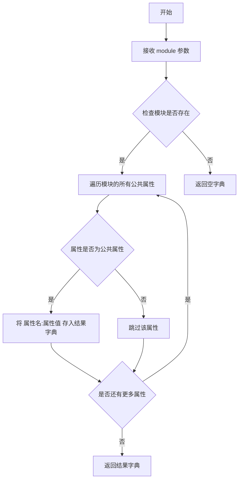
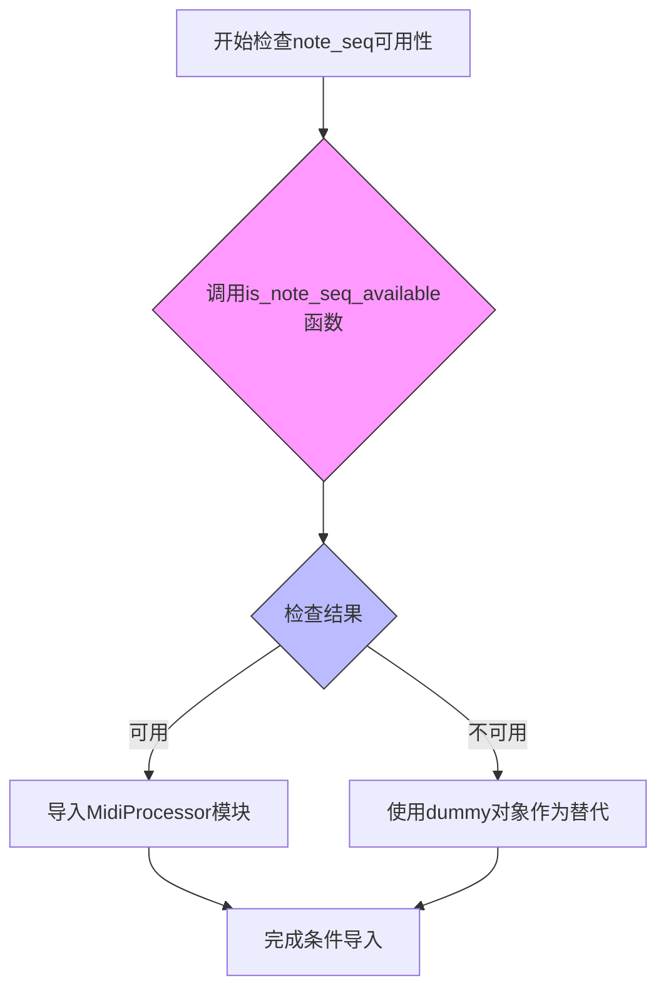
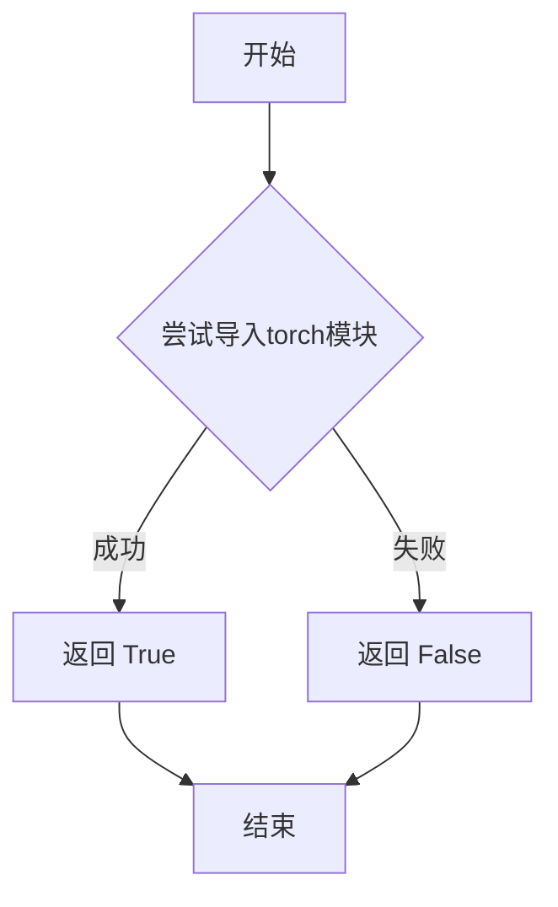
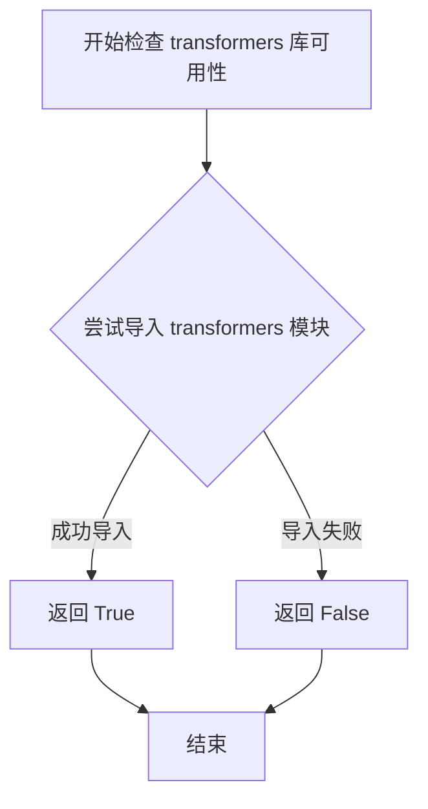
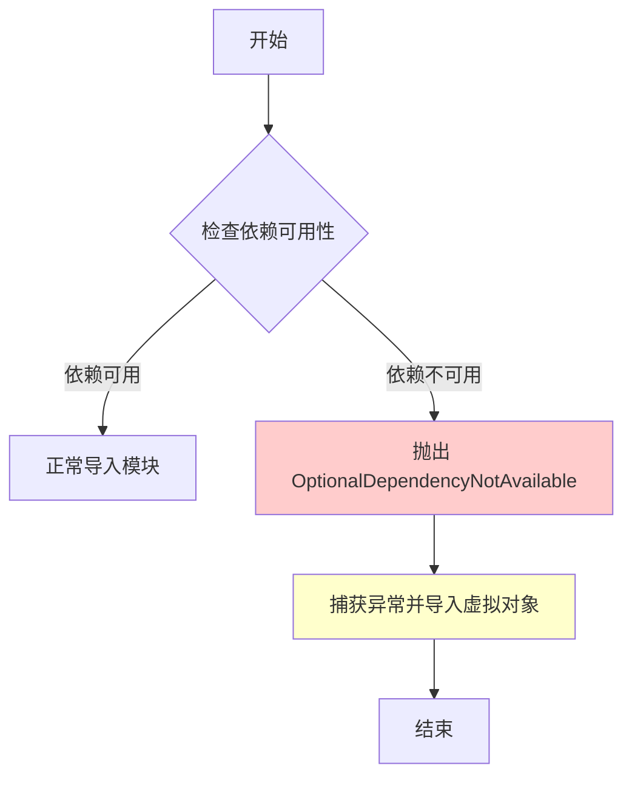

# `diffusers\src\diffusers\pipelines\deprecated\spectrogram_diffusion\__init__.py` 详细设计文档

这是Diffusers库中的一个模块初始化文件（__init__.py），用于实现可选依赖的延迟加载机制。它通过检查torch、transformers和note_seq等可选依赖的可用性，动态导入频谱图扩散管道的相关类（包括SpectrogramDiffusionPipeline、SpectrogramContEncoder、SpectrogramNotesEncoder、T5FilmDecoder和MidiProcessor），当依赖不可用时提供虚拟对象以保持API一致性。

## 整体流程

```mermaid
graph TD
    A[模块加载] --> B{检查TYPE_CHECKING或DIFFUSERS_SLOW_IMPORT}
    B -- 是 --> C[尝试导入真实模块]
    B -- 否 --> D[设置LazyModule]
    C --> E{依赖可用?}
    E -- 是 --> F[从子模块导入类]
    E -- 否 --> G[导入dummy对象]
    D --> H[遍历_dummy_objects]
    I[结束] --> F
    I --> G
    I --> H
```



## 类结构

```
Module Initialization (无继承层次结构)
└── 主要导出类:
    ├── SpectrogramDiffusionPipeline
    ├── SpectrogramContEncoder
    ├── SpectrogramNotesEncoder
    ├── T5FilmDecoder
    └── MidiProcessor
```

## 全局变量及字段


### `_dummy_objects`
    
存储虚拟对象的字典，用于依赖不可用时提供替代

类型：`dict`
    


### `_import_structure`
    
定义模块导入结构的字典，映射子模块到导出的类名列表

类型：`dict`
    


    

## 全局函数及方法


### `get_objects_from_module`

从给定模块获取所有公共对象（函数、类等），并以字典形式返回，供懒加载模块初始化使用。

参数：

-  `module`：`module`，要提取对象的源模块

返回值：`dict`，键为对象名称（字符串），值为模块中的实际对象

#### 流程图



#### 带注释源码

```python
def get_objects_from_module(module):
    """
    从给定模块获取所有公共对象，并以字典形式返回。
    常用于获取 dummy 模块中的所有占位对象，以便在可选依赖不可用时
    动态注册到 _dummy_objects 中，实现懒加载的兼容性处理。
    
    参数:
        module: 要提取对象的 Python 模块
        
    返回:
        dict: 包含模块中所有公共对象的字典，键为对象名称，值为对象本身
    """
    # 初始化结果字典
    objects = {}
    
    # 遍历模块的所有属性
    for name in dir(module):
        # 跳过私有属性（以双下划线开头的属性）
        if name.startswith('__'):
            continue
            
        # 获取属性值
        attr = getattr(module, name)
        
        # 将名称和对象存入字典
        objects[name] = attr
        
    return objects
```


# 详细设计文档

### `is_note_seq_available`

检查note_seq库是否可用的函数，用于条件导入和可选依赖管理。

参数：
- 该函数无参数

返回值：`bool`，如果note_seq库可用返回True，否则返回False

#### 流程图



#### 带注释源码

```python
# 从上级utils模块导入is_note_seq_available函数
# 该函数用于检测note_seq库是否已安装可用
from ....utils import (
    DIFFUSERS_SLOW_IMPORT,
    _LazyModule,
    is_note_seq_available,  # <--- 导入此函数用于检测note_seq可用性
    OptionalDependencyNotAvailable,
    is_torch_available,
    is_transformers_available,
    get_objects_from_module,
)

# 在try-except块中使用is_note_seq_available函数
try:
    # 检查条件：transformers和torch可用 且 note_seq可用
    if not (is_transformers_available() and is_torch_available() and is_note_seq_available()):
        # 如果任一依赖不可用，则抛出OptionalDependencyNotAvailable异常
        raise OptionalDependencyNotAvailable()
except OptionalDependencyNotAvailable:
    # 如果捕获到异常，说明note_seq不可用
    # 从dummy模块导入替代对象
    from ....utils import dummy_transformers_and_torch_and_note_seq_objects
    # 更新_dummy_objects字典
    _dummy_objects.update(get_objects_from_module(dummy_transformers_and_torch_and_note_seq_objects))
else:
    # 如果所有依赖可用（包括note_seq），则导入MidiProcessor
    _import_structure["midi_utils"] = ["MidiProcessor"]
```

#### 说明

**注意**：提供的代码片段中，`is_note_seq_available` 函数是**从上级模块导入的**，并非在此文件中定义。该函数由`....utils`模块提供，用于检测`note_seq`库是否已安装并可用。

在当前代码中，`is_note_seq_available()` 被使用了**两次**：
1. 在 `try-except` 块中用于条件导入 MidiProcessor
2. 在 `TYPE_CHECKING` 块的另一个 `try-except` 中用于条件类型提示导入

这种模式是典型的**可选依赖处理机制**，允许库在某些依赖不存在时仍然能够导入（使用dummy对象替代），同时保持完整功能时的正常导入。


### `is_torch_available`

该函数用于检查当前环境中 PyTorch 库是否可用，通过尝试导入 torch 模块来判断，返回布尔值以便在其他模块中进行条件导入或功能切换。

参数：无

返回值：`bool`，返回 `True` 表示 torch 库可用，返回 `False` 表示不可用

#### 流程图



#### 带注释源码

```python
# 从上层工具模块导入 is_torch_available 函数
# 该函数用于检测 PyTorch 是否安装可用
from ....utils import (
    DIFFUSERS_SLOW_IMPORT,
    _LazyModule,
    is_note_seq_available,
    OptionalDependencyNotAvailable,
    is_torch_available,  # <-- 目标函数：检查 torch 是否可用
    is_transformers_available,
    get_objects_from_module,
)

# 示例：在条件导入中使用 is_torch_available
try:
    # 检查 transformers 和 torch 是否同时可用
    if not (is_transformers_available() and is_torch_available()):
        # 如果任一不可用，抛出可选依赖不可用异常
        raise OptionalDependencyNotAvailable()
except OptionalDependencyNotAvailable:
    # 导入虚拟对象作为替代
    from ....utils import dummy_torch_and_transformers_objects
    _dummy_objects.update(get_objects_from_module(dummy_torch_and_transformers_objects))
else:
    # 如果两者都可用，定义实际的导入结构
    _import_structure["continous_encoder"] = ["SpectrogramContEncoder"]
    _import_structure["notes_encoder"] = ["SpectrogramNotesEncoder"]
    _import_structure["pipeline_spectrogram_diffusion"] = [
        "SpectrogramContEncoder",
        "SpectrogramDiffusionPipeline",
        "T5FilmDecoder",
    ]

# 在 TYPE_CHECKING 模式下再次使用该函数进行类型检查导入
if TYPE_CHECKING or DIFFUSERS_SLOW_IMPORT:
    try:
        if not (is_transformers_available() and is_torch_available()):
            raise OptionalDependencyNotAvailable()
    except OptionalDependencyNotAvailable:
        from ....utils.dummy_torch_and_transformers_objects import *
    else:
        from .pipeline_spectrogram_diffusion import SpectrogramDiffusionPipeline
        # ... 其他导入
```


### `is_transformers_available`

检查 `transformers` 库是否可用，返回布尔值以表示该依赖库是否已正确安装。

参数：

- 无参数

返回值：`bool`，返回 `True` 表示 `transformers` 库可用，返回 `False` 表示不可用。

#### 流程图



#### 带注释源码

```python
# is_transformers_available 函数的实现（在 ....utils 模块中）
# 这是一个典型的可选依赖检查函数实现模式

def is_transformers_available() -> bool:
    """
    检查 transformers 库是否可用。
    
    该函数尝试导入 transformers 模块，如果成功则返回 True，
    如果发生 ImportError 或其他异常则返回 False。
    
    Returns:
        bool: 如果 transformers 库可用返回 True，否则返回 False
    """
    try:
        # 尝试导入 transformers 库
        import transformers
        return True
    except ImportError:
        # 如果导入失败，返回 False
        return False
```

#### 使用示例

在提供的代码中，`is_transformers_available` 的典型使用方式如下：

```python
# 从 utils 模块导入 is_transformers_available 函数
from ....utils import is_transformers_available

# 检查 transformers 和 torch 是否都可用
if not (is_transformers_available() and is_torch_available()):
    raise OptionalDependencyNotAvailable()
except OptionalDependencyNotAvailable:
    # 导入虚拟对象作为后备
    from ....utils import dummy_torch_and_transformers_objects
    _dummy_objects.update(get_objects_from_module(dummy_torch_and_transformers_objects))
else:
    # 如果依赖可用，导入实际模块
    _import_structure["continous_encoder"] = ["SpectrogramContEncoder"]
    # ... 其他导入
```


### `OptionalDependencyNotAvailable`

异常类，用于表示可选依赖不可用。当检测到某个可选依赖（如 transformers、torch、note_seq 等）不可用时抛出此异常，以便程序能够优雅地处理依赖缺失的情况。

参数：

- 无参数

返回值：无返回值（异常类）

#### 流程图



#### 带注释源码

```python
# 从 utils 模块导入 OptionalDependencyNotAvailable 异常类
from ....utils import (
    DIFFUSERS_SLOW_IMPORT,
    _LazyModule,
    is_note_seq_available,
    OptionalDependencyNotAvailable,  # <-- 目标异常类：用于表示可选依赖不可用
    is_torch_available,
    is_transformers_available,
    get_objects_from_module,
)

# 初始化空字典用于存储虚拟对象和导入结构
_dummy_objects = {}
_import_structure = {}

# ============================================================
# 第一个 try-except 块：检查 transformers 和 torch 是否可用
# ============================================================
try:
    # 如果 transformers 或 torch 不可用，则抛出异常
    if not (is_transformers_available() and is_torch_available()):
        raise OptionalDependencyNotAvailable()
except OptionalDependencyNotAvailable:
    # 异常被触发时，导入虚拟对象作为替代
    from ....utils import dummy_torch_and_transformers_objects  # noqa F403
    # 将虚拟对象更新到 _dummy_objects 字典中
    _dummy_objects.update(get_objects_from_module(dummy_torch_and_transformers_objects))
else:
    # 依赖可用时，定义实际的导入结构
    _import_structure["continous_encoder"] = ["SpectrogramContEncoder"]
    _import_structure["notes_encoder"] = ["SpectrogramNotesEncoder"]
    _import_structure["pipeline_spectrogram_diffusion"] = [
        "SpectrogramContEncoder",
        "SpectrogramDiffusionPipeline",
        "T5FilmDecoder",
    ]

# ============================================================
# 第二个 try-except 块：检查 transformers、torch 和 note_seq 是否可用
# ============================================================
try:
    # 如果三者中有任何一个不可用，则抛出异常
    if not (is_transformers_available() and is_torch_available() and is_note_seq_available()):
        raise OptionalDependencyNotAvailable()
except OptionalDependencyNotAvailable:
    # 异常被触发时，导入对应的虚拟对象模块
    from ....utils import dummy_transformers_and_torch_and_note_seq_objects
    # 更新虚拟对象字典
    _dummy_objects.update(get_objects_from_module(dummy_transformers_and_torch_and_note_seq_objects))
else:
    # 依赖可用时，添加 midi_utils 到导入结构
    _import_structure["midi_utils"] = ["MidiProcessor"]


# ============================================================
# TYPE_CHECKING 或 DIFFUSERS_SLOW_IMPORT 条件分支
# 用于类型检查和慢速导入场景
# ============================================================
if TYPE_CHECKING or DIFFUSERS_SLOW_IMPORT:
    # 重复相同的依赖检查逻辑，但使用不同的导入路径
    try:
        if not (is_transformers_available() and is_torch_available()):
            raise OptionalDependencyNotAvailable()
    except OptionalDependencyNotAvailable:
        from ....utils.dummy_torch_and_transformers_objects import *
    else:
        from .pipeline_spectrogram_diffusion import SpectrogramDiffusionPipeline
        from .pipeline_spectrogram_diffusion import SpectrogramContEncoder
        from .pipeline_spectrogram_diffusion import SpectrogramNotesEncoder
        from .pipeline_spectrogram_diffusion import T5FilmDecoder

    try:
        if not (is_transformers_available() and is_torch_available() and is_note_seq_available()):
            raise OptionalDependencyNotAvailable()
    except OptionalDependencyNotAvailable:
        from ....utils.dummy_transformers_and_torch_and_note_seq_objects import *
    else:
        from .midi_utils import MidiProcessor

else:
    # ============================================================
    # 正常运行时，使用 LazyModule 进行延迟加载
    # ============================================================
    import sys

    # 将当前模块替换为 LazyModule 实例
    sys.modules[__name__] = _LazyModule(
        __name__,
        globals()["__file__"],
        _import_structure,
        module_spec=__spec__,
    )

    # 将虚拟对象设置到模块中，确保访问时不会报错
    for name, value in _dummy_objects.items():
        setattr(sys.modules[__name__], name, value)
```

## 关键组件


### _import_structure

一个字典类型变量，用于定义模块的导入结构。键为子模块名称，值为该子模块中可导出的类或函数名列表。它是延迟加载机制的核心配置，决定了哪些类（ SpectrogramContEncoder、 SpectrogramDiffusionPipeline、 T5FilmDecoder、 SpectrogramNotesEncoder、 MidiProcessor）可以在运行时被动态导入。

### _dummy_objects

一个字典类型变量，用于存储当可选依赖不可用时的虚拟对象。它通过 get_objects_from_module 函数从 dummy 模块中获取，并在延迟模块初始化后被设置到 sys.modules 中，以确保模块在缺少依赖时不会导入失败。

### _LazyModule

一个从 utils 导入的延迟加载模块类。它接收当前模块名称、文件路径、导入结构和模块规格（__spec__），并在访问模块属性时动态执行实际的导入操作。这是实现 Diffusers 库惰性加载的关键组件。

### OptionalDependencyNotAvailable

一个从 utils 导入的异常类，用于表示可选依赖项不可用的情况。代码使用 try-except 模式捕获该异常，以判断是否需要使用虚拟对象或更新导入结构。

### is_transformers_available / is_torch_available / is_note_seq_available

三个依赖检查函数，用于检测 transformers、torch 和 note_seq 包是否可用。它们是条件导入逻辑的前提条件，确保代码仅在依赖满足时加载相应的模块和类。

### SpectrogramContEncoder / SpectrogramNotesEncoder / SpectrogramDiffusionPipeline / T5FilmDecoder

四个从 pipeline_spectrogram_diffusion 子模块导出的类。当 transformers 和 torch 都可用时，这些类会被添加到 _import_structure 中，并通过延迟加载机制在需要时导入。它们是频谱图扩散管道和编码器的核心组件。

### MidiProcessor

一个从 midi_utils 子模块导出的类。当 transformers、torch 和 note_seq 都可用时，该类会被添加到 _import_structure 中，用于处理 MIDI 相关的音乐处理任务。

### TYPE_CHECKING 条件分支

一个代码块，用于在类型检查时（静态分析工具）提前导入所有类型，以便 IDE 和类型检查器能够正确识别模块中的类。它与运行时延迟加载形成互补，确保静态类型检查的准确性。


## 问题及建议


### 已知问题

-   **重复代码**：依赖检查逻辑 `is_transformers_available() and is_torch_available()` 在代码中重复出现4次，增加维护成本
-   **拼写错误**：`"continous_encoder"` 应为 `"continuous_encoder"`，可能导致后续导入或文档生成问题
-   **变量重复赋值**：在非TYPE_CHECKING分支中，`SpectrogramContEncoder` 被同时添加到 `"continous_encoder"` 和 `"pipeline_spectrogram_diffusion"` 两个key下，可能导致意外行为
-   **类型注解缺失**：使用了 `TYPE_CHECKING` 但没有为 `DIFFUSERS_SLOW_IMPORT` 等变量提供类型注解
-   **裸except语句**：虽然使用了特定异常类型，但异常处理逻辑分散，增加复杂性

### 优化建议

-   **提取公共函数**：将依赖检查逻辑封装为独立函数，如 `check_transformers_and_torch()`，避免重复代码
-   **修正拼写**：将 `"continous_encoder"` 更正为 `"continuous_encoder"` 以保持一致性
-   **重构导入结构**：确保每个类只在一个 `import_structure` key下定义，避免潜在的命名冲突
-   **添加日志或警告**：对于可选依赖不可用的情况，可添加调试日志以便追踪问题
-   **考虑使用装饰器或上下文管理器**：简化延迟加载逻辑，提高代码可读性

## 其它


### 设计目标与约束

该模块旨在实现Diffusers库中SpectrogramDiffusion相关的条件导入机制，通过延迟加载和可选依赖管理来优化导入性能并减少不必要的依赖。核心约束包括：仅在torch、transformers和note_seq均可用时加载完整功能，否则提供虚拟对象以保持API一致性。

### 错误处理与异常设计

模块采用OptionalDependencyNotAvailable异常进行依赖检查，通过try-except捕获该异常并从dummy模块导入虚拟对象。这些虚拟对象确保代码在缺少可选依赖时仍能导入，但调用时会触发实际错误，这是Diffusers库的标准模式。

### 数据流与状态机

数据流主要涉及_import_structure字典和_dummy_objects字典的构建过程。模块首先检查依赖可用性，根据结果填充不同的导入结构。在运行时（TYPE_CHECKING或DIFFUSERS_SLOW_IMPORT为真时）执行实际导入，否则设置LazyModule进行延迟导入。无复杂状态机，仅依赖布尔标志位控制导入路径。

### 外部依赖与接口契约

主要外部依赖包括：torch、transformers、note_seq（可选）。提供的公开接口包括SpectrogramDiffusionPipeline、SpectrogramContEncoder、SpectrogramNotesEncoder、T5FilmDecoder和MidiProcessor。所有接口通过_import_structure字典声明，LazyModule确保按需加载。dummy对象与真实对象具有相同接口签名，实现API透明切换。

### 模块初始化流程

模块初始化分为两个阶段：第一阶段在import时执行依赖检查和结构填充，使用get_objects_from_module收集dummy对象；第二阶段在首次访问属性时通过LazyModule触发实际导入。此设计遵循Diffusers库的lazy import规范，支持DIFFUSERS_SLOW_IMPORT环境变量控制导入行为。

    