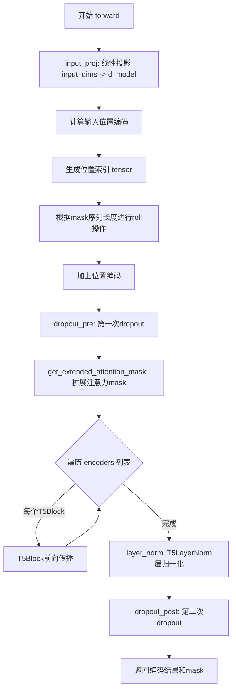
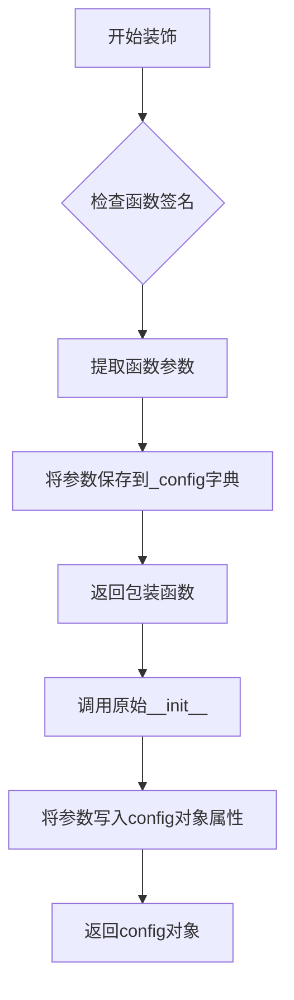
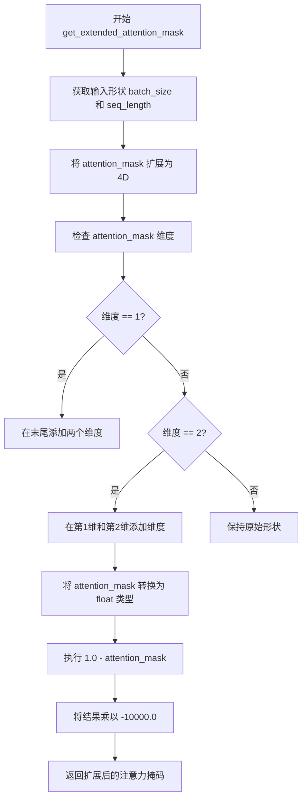
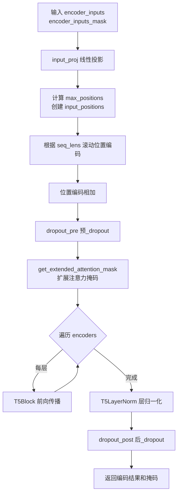

# `diffusers\src\diffusers\pipelines\deprecated\spectrogram_diffusion\continuous_encoder.py` 详细设计文档

这是一个基于T5 Transformer架构的连续频谱图编码器，用于音乐频谱图扩散模型。它将输入的频谱图特征通过线性投影映射到d_model维度，添加可学习的位置编码，经过多层T5Block编码器层进行特征提取，最后通过层归一化和dropout输出编码后的特征表示。

## 整体流程



## 类结构

```
SpectrogramContEncoder (继承自 ModelMixin, ConfigMixin, ModuleUtilsMixin)
├── __init__ (初始化方法)
│   ├── input_proj (nn.Linear)
│   ├── position_encoding (nn.Embedding)
│   ├── dropout_pre (nn.Dropout)
│   ├── encoders (nn.ModuleList[T5Block])
 │  └── T5Block (来自 transformers)
│   ├── layer_norm (T5LayerNorm)
 │  └── T5LayerNorm (来自 transformers)
 │  └── dropout_post (nn.Dropout)
 └── forward (前向传播方法)
```

## 全局变量及字段


### `SpectrogramContEncoder.input_proj`
    
输入特征投影层，将input_dims映射到d_model

类型：`nn.Linear`
    


### `SpectrogramContEncoder.position_encoding`
    
位置编码层，权重设为不可训练

类型：`nn.Embedding`
    


### `SpectrogramContEncoder.dropout_pre`
    
编码前的dropout层

类型：`nn.Dropout`
    


### `SpectrogramContEncoder.encoders`
    
包含多个T5Block的模块列表

类型：`nn.ModuleList`
    


### `SpectrogramContEncoder.layer_norm`
    
T5风格的层归一化

类型：`T5LayerNorm`
    


### `SpectrogramContEncoder.dropout_post`
    
编码后的dropout层

类型：`nn.Dropout`
    
    

## 全局函数及方法


### `register_to_config`

该装饰器用于将配置类的 `__init__` 方法参数自动注册为配置类的属性，使得这些参数可以在配置对象中持久化保存，方便模型的配置序列化和反序列化。

参数：

- `func`：`Callable`，被装饰的函数（通常是 `__init__` 方法），包含模型初始化所需的全部参数

返回值：`Callable`，装饰后的函数，返回原函数的返回值

#### 流程图



#### 带注释源码

```python
# 位置：....configuration_utils
# 说明：由于源码未直接提供，以下为基于HuggingFace transformers库中register_to_config装饰器的典型实现逻辑

def register_to_config(func):
    """
    装饰器：用于将__init__方法的参数注册为配置类的属性
    
    使用方式：
        @register_to_config
        def __init__(self, param1, param2, ...):
            ...
    """
    def wrapper(self, *args, **kwargs):
        # 获取函数签名
        sig = inspect.signature(func)
        # 绑定参数到签名
        bound_args = sig.bind(self, *args, **kwargs)
        bound_args.apply_defaults()
        
        # 获取除self外的所有参数
        params = list(bound_args.arguments.keys())
        # 遍历参数，将参数名和值保存到self._config字典
        for param_name in params[1:]:  # 跳过self
            if param_name in bound_args.arguments:
                setattr(self, param_name, bound_args.arguments[param_name])
        
        # 调用原始__init__方法
        return func(self, *args, **kwargs)
    
    return wrapper
```


### `ModuleUtilsMixin.get_extended_attention_mask`

该方法用于将原始的注意力掩码（attention_mask）扩展为适合多头自注意力机制计算的4D张量格式。通过反转掩码值并扩展维度，使其能够正确地在注意力计算中屏蔽不需要关注的位置。

参数：

- `self`：`ModuleUtilsMixin`，Mixin类实例本身
- `attention_mask`：`torch.Tensor`，原始的2D注意力掩码，形状为`(batch_size, sequence_length)`，其中0表示有效token，1表示需要屏蔽的位置
- `input_shape`：`Tuple[int]`或`torch.Size`，输入张量的形状，通常为`(batch_size, sequence_length)`

返回值：`torch.Tensor`，扩展后的4D注意力掩码，形状为`(batch_size, 1, 1, sequence_length)`，可直接用于注意力计算

#### 流程图



#### 带注释源码

```
def get_extended_attention_mask(
    self, attention_mask: torch.Tensor, input_shape: Tuple[int], device: device = None
) -> torch.Tensor:
    """
    將原始注意力掩碼轉換為適合多頭注意力計算的格式。
    
    參數:
        attention_mask: 原始2D注意力掩碼
            - 0 表示有效token（需要关注）
            - 1 表示需要屏蔽的位置（padding或无效位置）
        input_shape: 輸入張量的形狀
        device: 目標設備（可選）
    
    返回:
        擴展後的4D注意力掩碼，形狀為 (batch_size, 1, 1, seq_length)
        值為 0.0 表示可關注，值為 -10000.0 表示需屏蔽
    """
    # 判斷是否提供device參數，否則使用attention_mask的設備
    if device is None:
        device = attention_mask.device
    
    # 獲取批次大小和序列長度
    # input_shape 通常為 (batch_size, sequence_length)
    batch_size, seq_length = input_shape
    
    # 將attention_mask轉換為4D張量
    # 原始形狀: (batch_size, seq_length)
    # 目標形狀: (batch_size, 1, 1, seq_length)
    if attention_mask.dim() == 2:
        # 標準的2D掩碼，擴展維度以適應注意力計算
        extended_attention_mask = attention_mask[:, None, None, :]
    elif attention_mask.dim() == 3:
        # 3D掩碼，擴展一個維度
        extended_attention_mask = attention_mask[:, None, :, :]
    else:
        # 已經是4D或其他維度，保持不變
        extended_attention_mask = attention_mask
    
    # 將掩碼轉換為浮點類型以便計算
    extended_attention_mask = extended_attention_mask.to(dtype=torch.float32)
    
    # 關鍵反轉操作：
    # 原始: 0=有效, 1=屏蔽
    # 轉換後: 0.0=可關注, -10000.0=需屏蔽
    # 注意力分數加上大負值後，softmax會趨近於0
    extended_attention_mask = (1.0 - extended_attention_mask) * -10000.0
    
    return extended_attention_mask
```

> **注意**：该方法继承自 Hugging Face Transformers 库的 `ModuleUtilsMixin` 类，并非在本代码文件中直接实现。在 `SpectrogramContEncoder` 类中通过多重继承获得此功能，并在 `forward` 方法的第86行调用它来准备 T5 编码器的注意力掩码。


### `SpectrogramContEncoder.__init__`

该方法是 `SpectrogramContEncoder` 类的构造函数，负责初始化音频频谱图连续编码器的所有层组件，包括输入投影层、位置编码层、Transformer编码器堆栈（T5Block）、层归一化以及dropout层，并使用 T5Config 配置所有编码器块的参数。

参数：

- `input_dims`：`int`，输入特征的维度数
- `targets_context_length`：`int`，目标序列的上下文长度，用于初始化位置编码
- `d_model`：`int`，模型隐藏层维度
- `dropout_rate`：`float`，dropout 概率
- `num_layers`：`int`，T5 编码器层的数量
- `num_heads`：`int`，注意力机制的头数
- `d_kv`：`int`，键值对的维度
- `d_ff`：`int`，前馈神经网络的隐藏层维度
- `feed_forward_proj`：`str`，前馈网络的激活函数类型
- `is_decoder`：`bool`，是否为解码器模式，默认为 `False`

返回值：`None`，构造函数无返回值

#### 流程图

```mermaid
flowchart TD
    A[开始 __init__] --> B[调用 super().__init__]
    B --> C[创建 input_proj 线性层<br/>nn.Linear(input_dims, d_model)]
    C --> D[创建 position_encoding 嵌入层<br/>nn.Embedding(targets_context_length, d_model)]
    D --> E[设置 position_encoding.weight.requires_grad = False]
    E --> F[创建 dropout_pre Dropout 层<br/>nn.Dropout(dropout_rate)]
    F --> G[创建 T5Config 配置对象]
    G --> H{循环遍历 num_layers}
    H -->|是| I[创建 T5Block 实例]
    I --> J[添加到 encoders ModuleList]
    J --> H
    H -->|否| K[创建 layer_norm 层归一化<br/>T5LayerNorm(d_model)]
    K --> L[创建 dropout_post Dropout 层<br/>nn.Dropout(dropout_rate)]
    L --> M[结束 __init__]
    
    style G fill:#f9f,stroke:#333
    style I fill:#ff9,stroke:#333
    style J fill:#ff9,stroke:#333
```

#### 带注释源码

```python
@register_to_config
def __init__(
    self,
    input_dims: int,                 # 输入特征的维度
    targets_context_length: int,      # 目标上下文长度（位置编码的最大序列长度）
    d_model: int,                    # 模型隐藏层维度
    dropout_rate: float,             # Dropout 概率
    num_layers: int,                 # T5 编码器层的数量
    num_heads: int,                  # 注意力机制的头数
    d_kv: int,                       # 键值对的维度
    d_ff: int,                       # 前馈神经网络的隐藏层维度
    feed_forward_proj: str,          # 前馈网络激活函数类型（如 'relu', 'gated-gelu'）
    is_decoder: bool = False,        # 是否为解码器模式
):
    # 调用父类的初始化方法
    # ModelMixin: 提供模型加载/保存功能
    # ConfigMixin: 提供配置注册功能
    # ModuleUtilsMixin: 提供注意力掩码等工具函数
    super().__init__()

    # 1. 输入投影层：将原始输入特征映射到 d_model 维度空间
    # 不使用偏置 (bias=False)
    self.input_proj = nn.Linear(input_dims, d_model, bias=False)

    # 2. 位置编码层：使用可学习的嵌入表示位置信息
    # 嵌入维度为 d_model，序列长度最大为 targets_context_length
    self.position_encoding = nn.Embedding(targets_context_length, d_model)
    # 位置编码权重设置为不可训练（推理时复用预计算的位置编码）
    self.position_encoding.weight.requires_grad = False

    # 3. 编码器输入前的 Dropout 层
    self.dropout_pre = nn.Dropout(p=dropout_rate)

    # 4. 创建 T5 模型配置对象
    # 用于配置所有 T5Block 的结构参数
    t5config = T5Config(
        d_model=d_model,
        num_heads=num_heads,
        d_kv=d_kv,
        d_ff=d_ff,
        feed_forward_proj=feed_forward_proj,
        dropout_rate=dropout_rate,
        is_decoder=is_decoder,
        is_encoder_decoder=False,  # 仅作为编码器使用
    )

    # 5. 编码器层堆栈：使用 ModuleList 管理多个 T5Block
    self.encoders = nn.ModuleList()
    for lyr_num in range(num_layers):
        # 为每一层创建一个 T5Block 实例
        lyr = T5Block(t5config)
        self.encoders.append(lyr)

    # 6. 最后的层归一化：对所有编码器输出进行归一化
    self.layer_norm = T5LayerNorm(d_model)

    # 7. 编码器输出后的 Dropout 层
    self.dropout_post = nn.Dropout(p=dropout_rate)
```


### `SpectrogramContEncoder.forward`

该方法执行频谱图连续编码器的前向传播，通过输入投影、相对位置编码、T5 Blocks堆叠和层归一化处理输入的频谱图序列，输出编码后的隐藏状态序列及对应的注意力掩码。

参数：

- `encoder_inputs`：`torch.Tensor`，输入的频谱图序列张量，形状为 `[batch_size, seq_len, input_dims]`，表示批量大小的序列数据
- `encoder_inputs_mask`：`torch.Tensor`，输入序列的注意力掩码，形状为 `[batch_size, seq_len]`，用于标识有效位置

返回值：`tuple[torch.Tensor, torch.Tensor]`，返回元组包含：

- 第一个元素为编码后的隐藏状态张量，形状为 `[batch_size, seq_len, d_model]`
- 第二个元素为原始的 `encoder_inputs_mask`，用于下游模块继续使用

#### 流程图



#### 带注释源码

```python
def forward(self, encoder_inputs, encoder_inputs_mask):
    # Step 1: 线性投影 - 将输入维度映射到模型维度 d_model
    # 输入: [batch_size, seq_len, input_dims] -> 输出: [batch_size, seq_len, d_model]
    x = self.input_proj(encoder_inputs)

    # Step 2: 计算终端相对位置编码
    # 获取序列长度
    max_positions = encoder_inputs.shape[1]
    
    # 创建基础位置索引 [0, 1, 2, ..., seq_len-1]
    input_positions = torch.arange(max_positions, device=encoder_inputs.device)

    # Step 3: 计算每个序列的实际有效长度（用于位置编码滚动）
    # encoder_inputs_mask 求和得到每个样本的实际长度
    seq_lens = encoder_inputs_mask.sum(-1)
    
    # 根据每个样本的实际长度滚动位置编码
    # 使得不同长度的序列能正确对齐
    input_positions = torch.roll(
        input_positions.unsqueeze(0), 
        tuple(seq_lens.tolist()), 
        dims=0
    )
    
    # Step 4: 加上位置编码
    x += self.position_encoding(input_positions)

    # Step 5: 应用预 dropout
    x = self.dropout_pre(x)

    # Step 6: 扩展注意力掩码以适配多头注意力机制
    # 这是 Transformer 模型的标准步骤，将 [batch, seq_len] 扩展为
    # [batch, 1, 1, seq_len] 或 [batch, heads, seq_len, seq_len] 的形式
    input_shape = encoder_inputs.size()
    extended_attention_mask = self.get_extended_attention_mask(
        encoder_inputs_mask, 
        input_shape
    )

    # Step 7: 逐层通过 T5 编码器块
    for lyr in self.encoders:
        # 每个 T5Block 包含自注意力和前馈网络
        # 返回元组 (output, attention_output)，取第一个输出
        x = lyr(x, extended_attention_mask)[0]

    # Step 8: 最终层归一化
    x = self.layer_norm(x)

    # Step 9: 应用后 dropout 并返回结果
    return self.dropout_post(x), encoder_inputs_mask
```

## 关键组件


### SpectrogramContEncoder

基于T5架构的频谱图连续编码器，用于音乐频谱图扩散模型，实现从输入频谱到高维表示的编码转换。

### input_proj

输入投影层，将原始频谱特征维度映射到d_model维度的语义空间。

### position_encoding

可学习的相对位置编码，用于为序列中的每个位置提供位置信息，支持最长targets_context_length个位置。

### t5config

T5模型配置对象，封装了d_model、num_heads、d_kv、d_ff等Transformer核心超参数。

### encoders

T5Block模块列表，包含num_layers个Transformer编码器层，每层由自注意力机制和前馈网络组成。

### layer_norm

T5LayerNorm层归一化，对编码器输出进行均值方差归一化，稳定训练过程。

### forward

编码器前向传播方法，将输入频谱转换为上下文感知的语义表示，并返回编码结果和掩码。


## 问题及建议


### 已知问题

-   **T5Config重复创建**：在for循环中每次迭代都创建新的T5Config对象，导致配置对象被重复实例化num_layers次，造成不必要的内存开销
-   **位置编码实现复杂**：使用torch.roll和unsqueeze操作实现相对位置编码，逻辑复杂且难以理解，可读性较差
-   **未使用的encoder_inputs_mask**：方法签名接收encoder_inputs_mask参数，但在forward中未对其进行任何处理，仅在返回值中原样返回，调用方可能期望经过处理的mask
-   **Transformer dropout位置不标准**：在input projection之后和layer norm之后都使用了dropout，这与标准Transformer架构实践不一致，标准做法通常只在最终输出使用dropout
-   **缺少类型注解**：forward方法的参数和返回值都缺少Python类型注解，影响代码可读性和静态类型检查
-   **硬编码的weight.requires_grad = False**：位置编码的梯度要求被硬编码，缺乏灵活性，无法根据训练/推理模式动态调整
-   **循环遍历编码器层**：使用for循环遍历nn.ModuleList而非利用ModuleList的原生索引或apply方式，可能错失潜在的优化机会

### 优化建议

-   **提取T5Config到循环外**：在循环前创建单个T5Config对象并在循环中复用，减少对象创建开销
-   **简化位置编码逻辑**：考虑使用标准的正弦位置编码或可学习的相对位置编码替代当前实现，提高可读性和可维护性
-   **标准化dropout使用**：移除dropout_pre，仅保留dropout_post以符合标准Transformer架构实践，或提供配置选项
-   **添加类型注解**：为forward方法添加完整的类型注解，提升代码清晰度和IDE支持
-   **优化mask处理**：如果encoder_inputs_mask无需处理，考虑从方法签名中移除该参数；或者添加注释说明为何需要此参数
-   **移除冗余注释**：代码中的"terminal relative positional encodings"注释与实际实现可能不符，应更新或移除
-   **考虑设备迁移支持**：虽然使用了encoder_inputs.device，但可显式添加.to(device)调用以提高代码健壮性


## 其它


### 设计目标与约束

该代码旨在实现一个基于T5架构的频谱图连续编码器，用于音乐频谱图扩散模型的编码部分。设计目标包括：1）提供可配置的Transformer编码器架构，支持灵活的模型深度和宽度；2）实现高效的位置编码机制，支持变长序列处理；3）与HuggingFace Transformers库深度集成，复用成熟的T5实现。约束条件包括：输入维度、目标上下文长度、模型维度等必须提前确定，不支持动态修改；依赖PyTorch和Transformers库；仅支持GPU/CPU计算，不支持分布式训练的直接接口。

### 错误处理与异常设计

代码主要通过PyTorch的张量操作进行数据处理，异常处理设计如下：1）输入验证：在forward方法中，假设encoder_inputs和encoder_inputs_mask维度匹配，若不匹配将导致张量操作错误；2）设备一致性：使用encoder_inputs.device获取设备，确保位置编码与输入在同一设备上；3）序列长度验证：encoder_inputs_mask.sum(-1)假设mask为布尔类型或整数类型，若类型不匹配可能导致错误；4）模块初始化：T5Config参数验证由Transformers库内部处理。改进建议：添加输入形状验证、类型检查、设备兼容性检查。

### 数据流与状态机

数据流处理流程如下：1）输入接收阶段：接收encoder_inputs（频谱图特征，形状为[batch, seq_len, input_dims]）和encoder_inputs_mask（掩码，形状为[batch, seq_len]）；2）线性投影阶段：通过input_proj将输入维度映射到d_model维度；3）位置编码阶段：计算相对位置编码并添加到输入；4）Dropout预处理：对输入应用dropout；5）注意力掩码处理：调用get_extended_attention_mask生成扩展注意力掩码；6）编码器层堆栈：依次通过num_layers个T5Block；7）层归一化：对输出应用T5LayerNorm；8）Dropout后处理：应用最终的dropout并返回输出和掩码。该过程为单向数据流，无状态机设计。

### 外部依赖与接口契约

外部依赖包括：1）torch和torch.nn：PyTorch核心库和神经网络模块；2）transformers.modeling_utils.ModuleUtilsMixin：提供注意力掩码处理工具；3）transformers.models.t5.modeling_t5：T5Block、T5Config、T5LayerNorm三个核心类；4）transformers.configuration_utils.ConfigMixin和register_to_config：配置注册机制；5）diffusers.models.ModelMixin：模型基类。接口契约：输入encoder_inputs为torch.Tensor，形状[batch_size, seq_length, input_dims]；encoder_inputs_mask为torch.Tensor，形状[batch_size, seq_length]；输出为元组（output, mask），output形状[batch_size, seq_length, d_model]，mask为原始掩码。

### 配置参数说明

核心配置参数包括：input_dims（int）：输入特征维度；targets_context_length（int）：目标上下文长度，决定位置编码表大小；d_model（int）：模型隐藏维度；dropout_rate（float）：Dropout概率，范围[0,1]；num_layers（int）：编码器层数，必须为正整数；num_heads（int）：注意力头数，d_model必须能被整除；d_kv（int）：键值向量维度；d_ff（int）：前馈网络中间层维度；feed_forward_proj（str）：前馈网络类型，可选"gated-gelu"或"relu"；is_decoder（bool）：是否为解码器模式，默认为False。

### 性能考虑与优化空间

性能优化点包括：1）位置编码缓存：position_encoding权重设为requires_grad=False，避免不必要的梯度计算；2）模块列表：使用nn.ModuleList存储编码器层，确保参数正确注册到GPU；3）掩码处理：使用get_extended_attention_mask进行高效的掩码转换。优化空间：1）可添加梯度检查点（gradient checkpointing）以节省显存；2）可支持混合精度训练；3）位置编码可考虑使用更高效的相对位置编码实现；4）可添加推理优化（如TorchScript导出）；5）可支持批次间动态长度以减少填充。

### 安全性考虑

安全相关设计：1）模型可配置为is_decoder=False，防止误用为解码器导致功能错误；2）位置编码权重不可训练，避免恶意修改；3）dropout在训练和推理时的行为由PyTorch自动处理。潜在安全风险：1）无输入验证机制，恶意输入可能导致内存溢出；2）无用户权限控制；3）依赖第三方库需关注供应链安全。建议添加输入长度限制、参数合法性检查。

### 使用示例

```python
# 初始化编码器
encoder = SpectrogramContEncoder(
    input_dims=128,
    targets_context_length=1024,
    d_model=512,
    dropout_rate=0.1,
    num_layers=8,
    num_heads=8,
    d_kv=64,
    d_ff=2048,
    feed_forward_proj="gated-gelu",
    is_decoder=False
)

# 准备输入
batch_size = 4
seq_len = 256
encoder_inputs = torch.randn(batch_size, seq_len, 128)
encoder_inputs_mask = torch.ones(batch_size, seq_len)

# 前向传播
output, mask = encoder(encoder_inputs, encoder_inputs_mask)
# output shape: [4, 256, 512]
```

### 版本历史与变更记录

该代码基于Music Spectrogram Diffusion项目改编，原始版权归属Music Spectrogram Diffusion Authors（2022），现由HuggingFace Team维护（2025）。主要变更：1）从原项目迁移至diffusers库架构；2）集成Transformers库的T5实现；3）添加ConfigMixin和register_to_config装饰器支持配置化；4）移除部分原项目特定组件，保留核心编码器功能。


    