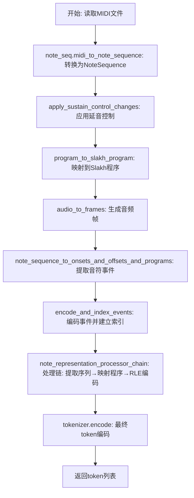
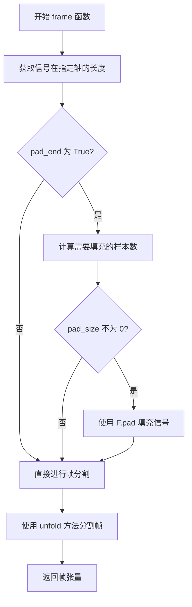
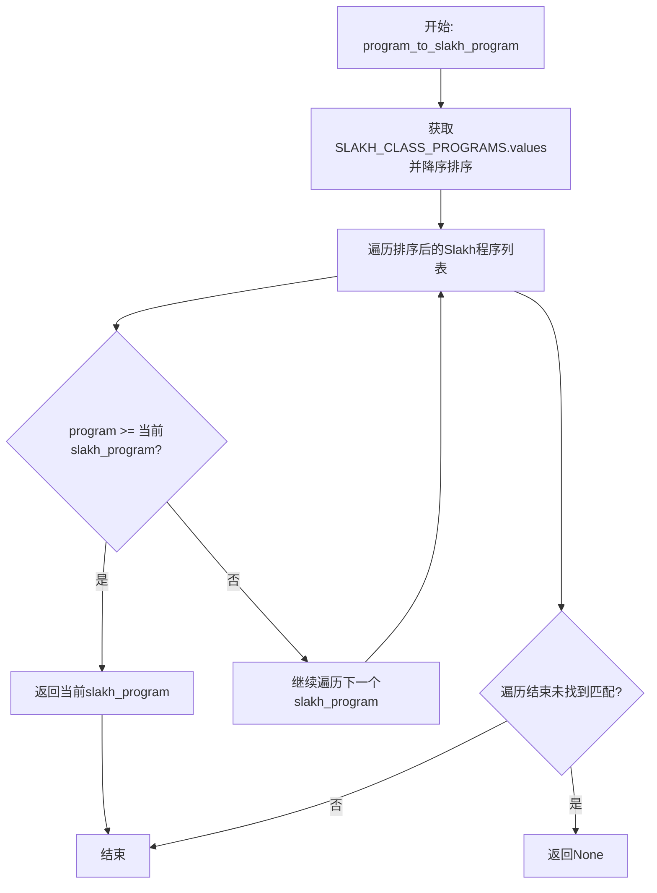
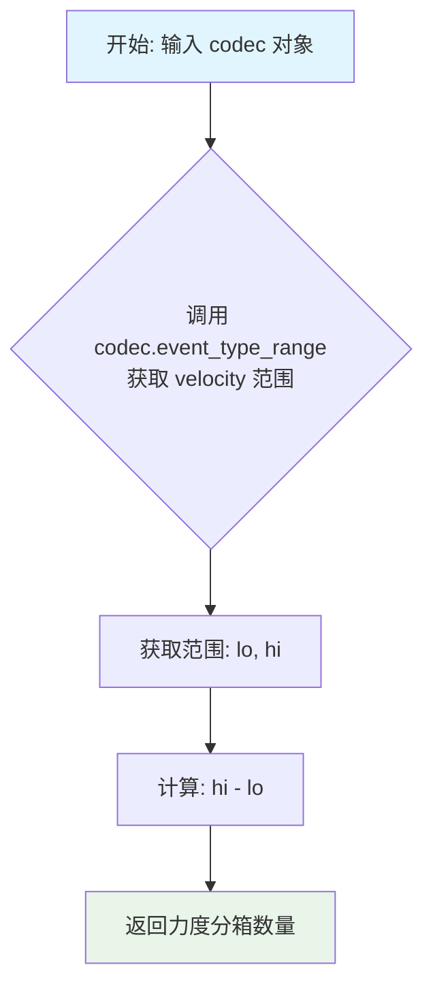
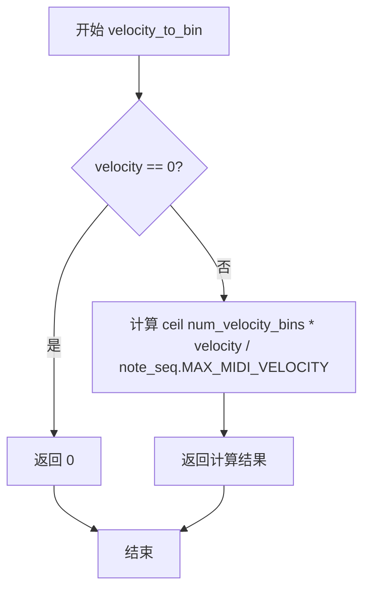
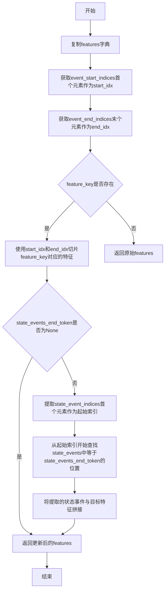
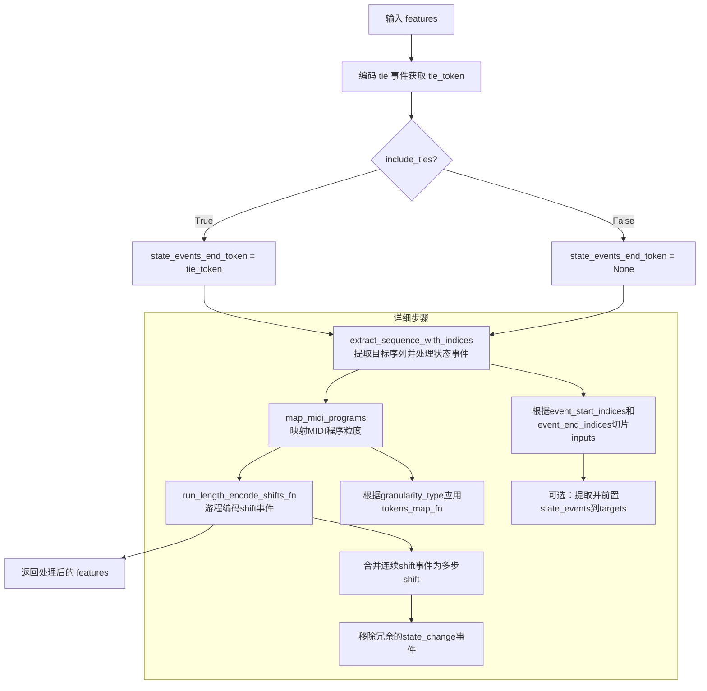
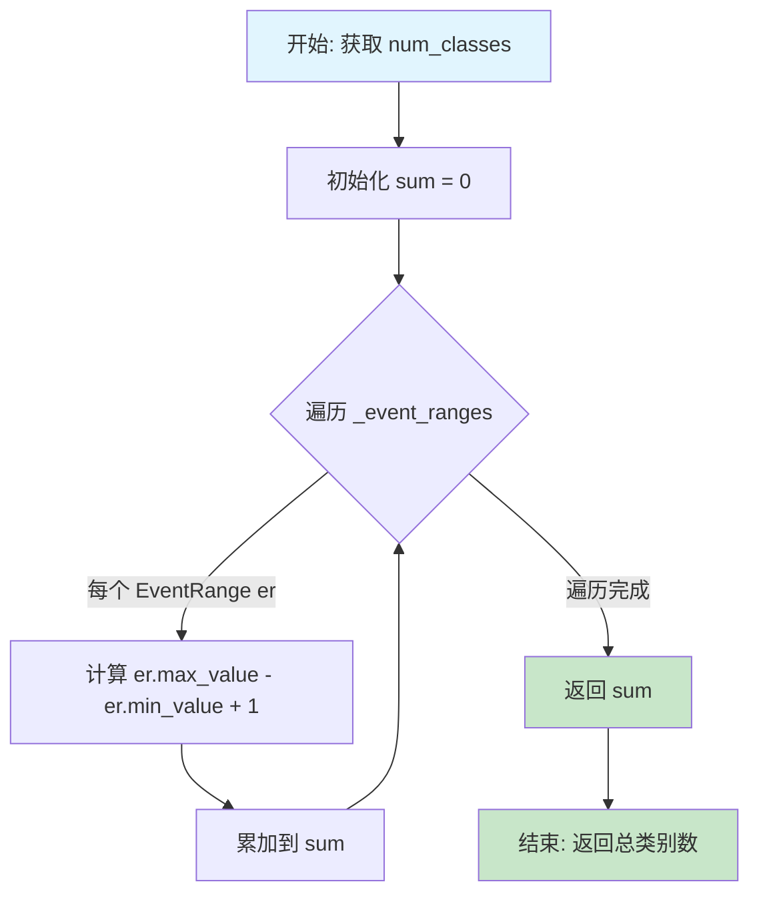
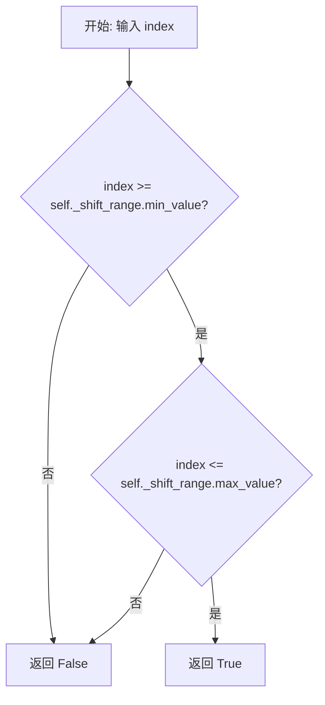

# `diffusers\src\diffusers\pipelines\deprecated\spectrogram_diffusion\midi_utils.py` 详细设计文档

这是一个音乐MIDI处理和token化工具，主要用于Music Spectrogram Diffusion模型的预处理。它能够读取MIDI文件，提取音符的onset/offset/program信息，并将其编码为模型可用的token序列，支持run-length编码优化和多种MIDI程序粒度处理。

## 整体流程



## 类结构

```
数据类 (Dataclasses)
├── NoteRepresentationConfig
├── NoteEventData
├── NoteEncodingState
├── EventRange
├── Event
└── ProgramGranularity

核心类
├── Tokenizer
├── Codec
└── MidiProcessor
```

## 全局变量及字段


### `INPUT_FEATURE_LENGTH`
    
输入特征长度

类型：`int`
    


### `SAMPLE_RATE`
    
音频采样率

类型：`int`
    


### `HOP_SIZE`
    
音频帧跳跃大小

类型：`int`
    


### `FRAME_RATE`
    
音频帧率

类型：`int`
    


### `DEFAULT_STEPS_PER_SECOND`
    
默认每秒步数

类型：`int`
    


### `DEFAULT_MAX_SHIFT_SECONDS`
    
默认最大平移秒数

类型：`int`
    


### `DEFAULT_NUM_VELOCITY_BINS`
    
默认力度分箱数

类型：`int`
    


### `SLAKH_CLASS_PROGRAMS`
    
Slakh乐器程序映射表

类型：`Dict[str, int]`
    


### `PROGRAM_GRANULARITIES`
    
程序粒度配置字典

类型：`Dict[str, ProgramGranularity]`
    


### `NoteRepresentationConfig.onsets_only`
    
是否仅包含onset事件

类型：`bool`
    


### `NoteRepresentationConfig.include_ties`
    
是否包含tie事件

类型：`bool`
    


### `NoteEventData.pitch`
    
音符音高

类型：`int`
    


### `NoteEventData.velocity`
    
音符力度

类型：`int | None`
    


### `NoteEventData.program`
    
乐器程序号

类型：`int | None`
    


### `NoteEventData.is_drum`
    
是否为鼓音

类型：`bool | None`
    


### `NoteEventData.instrument`
    
乐器音轨

类型：`int | None`
    


### `NoteEncodingState.active_pitches`
    
当前活跃的音高和程序组合

类型：`MutableMapping[tuple[int, int], int]`
    


### `EventRange.type`
    
事件类型

类型：`str`
    


### `EventRange.min_value`
    
事件值最小范围

类型：`int`
    


### `EventRange.max_value`
    
事件值最大范围

类型：`int`
    


### `Event.type`
    
事件类型

类型：`str`
    


### `Event.value`
    
事件值

类型：`int`
    


### `ProgramGranularity.tokens_map_fn`
    
token映射函数

类型：`Callable[[Sequence[int], Codec], Sequence[int]]`
    


### `ProgramGranularity.program_map_fn`
    
程序映射函数

类型：`Callable[[int], int]`
    


### `Tokenizer._num_special_tokens`
    
特殊token数量

类型：`int`
    


### `Tokenizer._num_regular_tokens`
    
常规token数量

类型：`int`
    


### `Codec.steps_per_second`
    
每秒步数

类型：`float`
    


### `Codec._shift_range`
    
shift事件范围

类型：`EventRange`
    


### `Codec._event_ranges`
    
所有事件范围列表

类型：`list[EventRange]`
    


### `MidiProcessor.codec`
    
编解码器实例

类型：`Codec`
    


### `MidiProcessor.tokenizer`
    
分词器实例

类型：`Tokenizer`
    


### `MidiProcessor.note_representation_config`
    
音符表示配置

类型：`NoteRepresentationConfig`
    
    

## 全局函数及方法


### `drop_programs`

该函数用于从输入的 token 序列中移除所有代表 MIDI 程序改变（Program Change）事件的 token。它通过查询 Codec 获取 "program" 事件类型的 ID 范围，并利用布尔索引筛选出不在该范围内的 token，从而实现过滤。

参数：
-  `tokens`：`numpy.ndarray`，输入的 token 序列（整数 ID 数组）。
-  `codec`：`Codec`，编解码器对象，用于查询 "program" 事件的 ID 范围。

返回值：`numpy.ndarray`，过滤后的新 token 序列，不包含任何程序改变事件。

#### 流程图

```mermaid
graph TD
    A[开始: 输入 tokens, codec] --> B[获取程序 ID 范围]
    B --> C{codec.event_type_range('program')}
    C -->|返回| D[min_program_id, max_program_id]
    D --> E[创建布尔掩码]
    E --> F[(tokens < min_program_id) | (tokens > max_program_id)]
    F --> G[使用掩码过滤数组]
    G --> H[返回过滤后的 tokens]
```

#### 带注释源码

```python
def drop_programs(tokens, codec: Codec):
    """Drops program change events from a token sequence."""
    # 1. 从 codec 中获取 "program" 事件类型对应的 ID 范围
    #    返回值为一个元组 (min_id, max_id)
    min_program_id, max_program_id = codec.event_type_range("program")
    
    # 2. 创建布尔掩码
    #    掩码为 True 的位置表示该 token 不是程序改变事件
    #    即：token ID 小于最小程序 ID，或者 token ID 大于最大程序 ID
    mask = (tokens < min_program_id) | (tokens > max_program_id)
    
    # 3. 返回应用掩码后的新数组
    #    这样就去除了所有落在 [min_program_id, max_program_id] 区间内的 program 事件
    return tokens[mask]
```


### `programs_to_midi_classes`

该函数将程序事件（program events）映射到MIDI类的第一个程序。每个MIDI类包含8个程序号（例如0-7为第一类，8-15为第二类），函数将所有程序事件转换为其所属MIDI类的第一个程序号。

参数：

- `tokens`：numpy.ndarray，音乐事件的token序列
- `codec`：`Codec`编解码器对象，用于获取program事件的范围

返回值：`numpy.ndarray`，修改后的token序列，其中所有program事件都被替换为其所属MIDI类的第一个程序号

#### 流程图

```mermaid
flowchart TD
    A[开始: programs_to_midi_classes] --> B[获取program事件范围]
    B --> C[min_program_id, max_program_id = codec.event_type_range('program')]
    C --> D[创建布尔掩码]
    D --> E{判断每个token是否为program事件}
    E -->|是program| F[计算MIDI类第一个程序号]
    F --> G[min_program_id + 8 * ((tokens - min_program_id) // 8)]
    E -->|不是program| H[保留原token值]
    G --> I[使用np.where生成新序列]
    H --> I
    I --> J[返回修改后的token序列]
```

#### 带注释源码

```python
def programs_to_midi_classes(tokens, codec):
    """Modifies program events to be the first program in the MIDI class.
    
    该函数将token序列中的所有program事件映射到其所属MIDI类的第一个程序。
    MIDI乐器程序号从0-127共128个，每8个为一类（共16类）。
    例如：程序8-15映射到8，程序16-23映射到16，以此类推。
    
    Args:
        tokens: numpy.ndarray，音乐事件的token序列，包含program、pitch、velocity等事件
        codec: Codec对象，提供event_type_range方法用于获取program事件的范围ID
    
    Returns:
        numpy.ndarray：修改后的token序列，program事件被替换为其MIDI类的第一个程序号
    """
    # 获取program事件在codec中的ID范围（最小ID和最大ID）
    min_program_id, max_program_id = codec.event_type_range("program")
    
    # 创建一个布尔掩码，标记哪些token是program事件
    # (tokens >= min_program_id) & (tokens <= max_program_id) 为真表示该token是program
    is_program = (tokens >= min_program_id) & (tokens <= max_program_id)
    
    # 使用np.where进行条件替换：
    # 对于program事件：计算其所属MIDI类的第一个程序号
    #   - (tokens - min_program_id) // 8 计算该program在其MIDI类中的偏移位置（0-7）
    #   - min_program_id + 8 * (...) 将偏移位置转换回绝对程序号，得到该类的第一个程序号
    # 对于非program事件：保留原token值不变
    return np.where(is_program, min_program_id + 8 * ((tokens - min_program_id) // 8), tokens)
```


### `frame`

该函数是帧分割函数，实现类似于 TensorFlow 的 `tf.signal.frame` 功能，用于将连续信号分割成重叠的帧序列，支持在信号末尾填充以确保帧的完整性。

参数：

- `signal`：`torch.Tensor`，输入的连续信号张量
- `frame_length`：`int`，每个帧的样本数量
- `frame_step`：`int`，相邻帧之间的步长（样本数）
- `pad_end`：`bool`，是否在信号末尾填充以确保完整帧，默认为 False
- `pad_value`：`int | float`，填充值，默认为 0
- `axis`：`int`，进行帧分割的轴，默认为 -1（最后一轴）

返回值：`torch.Tensor`，分割后的帧张量，形状为 (..., N, frame_length, ...)，其中 N 是生成的帧数量

#### 流程图



#### 带注释源码

```python
def frame(signal, frame_length, frame_step, pad_end=False, pad_value=0, axis=-1):
    """
    equivalent of tf.signal.frame
    """
    # 获取信号在指定轴上的长度
    signal_length = signal.shape[axis]
    
    # 如果需要末尾填充
    if pad_end:
        # 计算帧重叠的样本数（每个帧超出下一个帧的样本数）
        frames_overlap = frame_length - frame_step
        # 计算剩余样本数（不足以形成完整帧的部分）
        rest_samples = np.abs(signal_length - frames_overlap) % np.abs(frame_length - frames_overlap)
        # 计算需要填充的样本数
        pad_size = int(frame_length - rest_samples)

        # 如果需要填充
        if pad_size != 0:
            # 创建填充轴的零列表
            pad_axis = [0] * signal.ndim
            # 在指定轴设置填充大小
            pad_axis[axis] = pad_size
            # 使用常量值填充信号
            signal = F.pad(signal, pad_axis, "constant", pad_value)
    
    # 使用 PyTorch 的 unfold 方法进行帧分割
    # 该方法会在指定轴上创建滑动窗口
    frames = signal.unfold(axis, frame_length, frame_step)
    return frames
```


### `program_to_slakh_program`

将MIDI程序号映射到最接近的Slakh程序号。该函数通过遍历已排序的Slakh程序列表，找到小于或等于给定MIDI程序的最大Slakh程序值，从而实现从标准MIDI程序到Slakh格式的映射。

参数：

- `program`：`int`，MIDI程序号（0-127），表示要转换的MIDI乐器程序

返回值：`int`，映射后的Slakh程序号，如果输入程序小于所有Slakh程序则返回`None`

#### 流程图



#### 带注释源码

```python
def program_to_slakh_program(program):
    # this is done very hackily, probably should use a custom mapping
    # 获取SLAKH_CLASS_PROGRAMS字典中所有的程序号值，并按降序排序
    # 降序排列是为了从最大的程序号开始查找，找到第一个小于等于输入值的程序
    for slakh_program in sorted(SLAKH_CLASS_PROGRAMS.values(), reverse=True):
        # 如果输入的MIDI程序号大于等于当前Slakh程序号
        # 则返回这个Slakh程序号（这是最接近且不超过输入值的程序）
        if program >= slakh_program:
            return slakh_program
    
    # 如果循环结束仍未返回（例如program小于所有Slakh程序），则默认返回None
    # 注意：代码中没有显式的return None，但Python函数默认返回None
```

#### 代码上下文与调用关系

该函数在 `MidiProcessor.__call__` 方法中被调用，用于在处理MIDI文件时将每个音符的MIDI程序号转换为对应的Slakh程序号：

```python
for note in ns_sus.notes:
    if not note.is_drum:
        note.program = program_to_slakh_program(note.program)
```

#### 潜在技术债务与优化空间

1. **排序开销**：每次调用函数时都对 `SLAKH_CLASS_PROGRAMS.values()` 进行排序，时间复杂度为 O(n log n)。建议在模块加载时预计算排序结果并缓存。

2. **硬编码映射**：函数使用动态遍历而非预定义的映射表（当前实现确实比较"hackily"），可考虑使用更高效的查找方式，如二分查找或预计算的映射字典。

3. **返回值不一致**：当输入 program 小于最小 Slakh 程序(0)时，函数隐式返回 `None`，可能导致调用方出现类型错误。建议明确处理边界情况或添加断言。


### `audio_to_frames`

将音频样本转换为非重叠帧并生成对应的帧时间戳，用于音频处理和特征提取。

参数：

- `samples`：numpy.ndarray，输入的原始音频样本数据
- `hop_size`：int，帧移大小（等于帧大小），用于确定每个帧的样本数
- `frame_rate`：int，帧率（每秒帧数），用于计算帧时间戳

返回值：`tuple[Sequence[Sequence[int]], torch.Tensor]`，返回一个元组，包含帧数据（torch.Tensor，形状为 [1, num_frames, frame_size]）和对应的帧时间戳（numpy.ndarray）

#### 流程图

```mermaid
flowchart TD
    A[开始: audio_to_frames] --> B[设置frame_size = hop_size]
    B --> C[使用np.pad对samples进行填充]
    C --> D[填充模式: constant, 填充长度: frame_size - len samples % frame_size]
    D --> E[将numpy数组转换为torch.Tensor]
    E --> F[使用unsqueeze(0)增加批次维度]
    F --> G[调用frame函数进行分帧]
    G --> H[frame_length = frame_size, frame_step = frame_size, pad_end = False]
    H --> I[计算num_frames = len samples // frame_size]
    I --> J[使用np.arange生成帧时间戳序列]
    J --> K[times = np.arange num_frames / frame_rate]
    K --> L[返回frames和times]
```

#### 带注释源码

```python
def audio_to_frames(
    samples,
    hop_size: int,
    frame_rate: int,
) -> tuple[Sequence[Sequence[int]], torch.Tensor]:
    """Convert audio samples to non-overlapping frames and frame times.
    
    此函数将连续的音频样本分割成固定大小的非重叠帧，并计算每个帧对应的时间戳。
    常用于音频处理流水线中，将原始音频转换为帧级表示以便进行特征提取或模型输入。
    
    Args:
        samples: 输入的音频样本数组，通常为1D numpy数组
        hop_size: 帧移大小，在非重叠帧场景下等于帧大小
        frame_rate: 帧率，用于将帧索引转换为实际时间（秒）
    
    Returns:
        frames: 分割后的帧数据，形状为 [1, num_frames, frame_size] 的 torch.Tensor
        times: 每个帧对应的时间戳（秒），形状为 [num_frames] 的 numpy 数组
    """
    # 帧大小等于hop_size，在非重叠分割场景下两者相同
    frame_size = hop_size
    
    # 对音频样本进行填充，使其长度能够被frame_size整除
    # 使用constant模式填充0，确保音频末尾完整
    samples = np.pad(samples, [0, frame_size - len(samples) % frame_size], mode="constant")

    # 将numpy数组转换为PyTorch张量，并增加批次维度以适应frame函数的输入要求
    # frame函数期望输入形状为 [..., signal_length, ...]
    frames = frame(
        torch.Tensor(samples).unsqueeze(0),
        frame_length=frame_size,
        frame_step=frame_size,
        pad_end=False,  # TODO check why its off by 1 here when True
    )

    # 计算生成的帧数量
    num_frames = len(samples) // frame_size

    # 生成每个帧对应的时间戳（单位：秒）
    # 帧索引除以帧率得到实际时间位置
    times = np.arange(num_frames) / frame_rate
    
    # 返回分割后的帧和对应的时间戳
    return frames, times
```


### `note_sequence_to_onsets_and_offsets_and_programs`

该函数是音频处理管道中的关键转换函数，负责将MIDI格式的`NoteSequence`对象解构为时间序列和事件数据序列。它从音符序列中提取非鼓音符的onset（起始）和offset（结束）时间点，并将每个音符映射为包含音高、力度、程序号和打击乐标记的`NoteEventData`对象，为后续的令牌化（tokenization）和神经网络处理做准备。

参数：

- `ns`：`note_seq.NoteSequence`，输入的MIDI NoteSequence对象，包含所有音符信息

返回值：`tuple[Sequence[float], Sequence[NoteEventData]]`，返回一个元组，包含时间列表（浮点数序列）和NoteEventData对象列表，其中非鼓音符的offset事件的velocity被设置为0

#### 流程图

```mermaid
flowchart TD
    A[开始: 输入 NoteSequence ns] --> B[对音符排序<br/>key=lambda note: note.is_drum, note.program, note.pitch]
    B --> C[提取非鼓音符的offset时间<br/>note.end_time for note in notes if not note.is_drum]
    C --> D[提取所有音符的onset时间<br/>note.start_time for note in notes]
    D --> E[组合时间列表: times = offsets + onsets]
    E --> F[为非鼓音符创建NoteEventData<br/>velocity=0, is_drum=False]
    F --> G[为所有音符创建NoteEventData<br/>保留原始velocity和is_drum]
    G --> H[组合values列表: values = offset_events + onset_events]
    H --> I[返回 tuple[times, values]]
```

#### 带注释源码

```python
def note_sequence_to_onsets_and_offsets_and_programs(
    ns: note_seq.NoteSequence,
) -> tuple[Sequence[float], Sequence[NoteEventData]]:
    """Extract onset & offset times and pitches & programs from a NoteSequence.

    The onset & offset times will not necessarily be in sorted order.

    Args:
      ns: NoteSequence from which to extract onsets and offsets.

    Returns:
      times: A list of note onset and offset times. 
      values: A list of NoteEventData objects where velocity is zero for
          note offsets.
    """
    # 步骤1: 对音符进行稳定排序
    # 排序优先级: is_drum(鼓/非鼓) -> program(乐器程序) -> pitch(音高)
    # 使用is_drum作为第一排序键可以将鼓和非鼓音符分开处理
    notes = sorted(ns.notes, key=lambda note: (note.is_drum, note.program, note.pitch))
    
    # 步骤2: 提取时间序列
    # 注意: offset时间(非鼓音符的结束时间)在onset时间之前
    # 这是一种特殊的排序策略，用于处理音符的tie关系
    # 列表拼接顺序: [所有非鼓音符的结束时间] + [所有音符的开始时间]
    times = [note.end_time for note in notes if not note.is_drum] + [note.start_time for note in notes]
    
    # 步骤3: 构建NoteEventData列表
    # 3a: 为非鼓音符的offset创建事件数据
    # velocity设为0表示这是offset事件(而非onset)
    # is_drum设为False明确标记为非鼓音符
    values = [
        NoteEventData(pitch=note.pitch, velocity=0, program=note.program, is_drum=False)
        for note in notes
        if not note.is_drum
    ] + [
        # 3b: 为所有音符(包含鼓)的onset创建事件数据
        # 保留原始velocity和is_drum属性
        NoteEventData(pitch=note.pitch, velocity=note.velocity, program=note.program, is_drum=note.is_drum)
        for note in notes
    ]
    
    # 步骤4: 返回元组
    # times和values长度相同，索引i对应第i个事件
    return times, values
```


### `num_velocity_bins_from_codec`

从 Codec 对象中获取 "velocity" 事件类型的范围，并计算返回力度分箱的数量。

参数：

- `codec`：`Codec`，从中获取力度分箱数的 Codec 对象

返回值：`int`，力度分箱的数量

#### 流程图



#### 带注释源码

```python
def num_velocity_bins_from_codec(codec: Codec):
    """Get number of velocity bins from event codec.
    
    从 event codec 中获取 velocity 事件类型的范围，
    并计算返回该范围内的分箱数量。
    
    Args:
        codec: Codec 对象，包含事件类型定义
        
    Returns:
        int: velocity 事件的分箱数量，即 hi - lo
    """
    # 调用 codec 的 event_type_range 方法获取 velocity 事件类型的索引范围
    # 返回值为元组 (min_id, max_id)
    lo, hi = codec.event_type_range("velocity")
    
    # 返回范围的大小，即分箱数量
    return hi - lo
```


### `segment`

将数组按固定长度分割为多个子数组的辅助函数，常用于将长序列拆分为模型输入所需的固定长度片段。

参数：

- `a`：列表或数组，要分割的输入序列
- `n`：int，每个片段的长度

返回值：`list[list[Any]]`，分割后的子数组列表

#### 流程图

```mermaid
flowchart TD
    A[开始] --> B{len(a) == 0?}
    B -->|是| C[返回空列表]
    B -->|否| D[i = 0]
    D --> E{i < len(a)?}
    E -->|是| F[取子数组 a[i:i+n]]
    F --> G[添加到结果列表]
    G --> H[i = i + n]
    H --> E
    E -->|否| I[返回结果列表]
    I --> J[结束]
```

#### 带注释源码

```python
def segment(a, n):
    """
    将数组分割为固定长度段的辅助函数
    
    参数:
        a: 要分割的数组/列表
        n: 每个段的长度
        
    返回:
        包含所有分割后子数组的列表
    """
    # 使用列表推导式生成器模式
    # i 从 0 开始，每次增加 n，直到超过数组长度
    # a[i:i+n] 使用 Python 切片语法截取从索引 i 开始、长度为 n 的子数组
    # 当 i+n 超过数组末尾时，切片会自动截取到末尾，不会引发索引错误
    return [a[i : i + n] for i in range(0, len(a), n)]
```

#### 使用示例

```python
# 示例 1: 完整分割
>>> segment([1, 2, 3, 4, 5, 6, 7, 8, 9], 3)
[[1, 2, 3], [4, 5, 6], [7, 8, 9]]

# 示例 2: 最后一段不足 n 个元素
>>> segment([1, 2, 3, 4, 5], 2)
[[1, 2], [3, 4], [5]]

# 示例 3: 空数组
>>> segment([], 3)
[]
```


### `velocity_to_bin`

将MIDI力度值（velocity）转换为力度分箱（velocity bin）的索引值，用于将连续的力度值离散化到指定的分箱数量中。

参数：

- `velocity`：`int`，MIDI力度值，范围通常为0-127，0表示静音/关闭状态
- `num_velocity_bins`：`int`，力度分箱的总数量，用于将力度值量化到指定数量的区间中

返回值：`int`，力度分箱的索引值，范围为0到num_velocity_bins-1

#### 流程图



#### 带注释源码

```python
def velocity_to_bin(velocity, num_velocity_bins):
    """
    将MIDI力度值转换为力度分箱索引。
    
    Args:
        velocity: MIDI力度值，范围0-127
        num_velocity_bins: 力度分箱数量
    
    Returns:
        力度分箱索引值
    """
    # 力度为0表示静音/关闭状态，直接返回0
    if velocity == 0:
        return 0
    else:
        # 使用向上取整计算力度分箱索引
        # note_seq.MAX_MIDI_VELOCITY 通常为127
        # 公式将velocity映射到[1, num_velocity_bins]区间
        return math.ceil(num_velocity_bins * velocity / note_seq.MAX_MIDI_VELOCITY)
```


### `note_event_data_to_events`

将 NoteEventData 转换为事件序列，根据音符数据是否包含速度、音高、程序和鼓点标记等信息，生成不同类型的事件列表（如 pitch 事件、velocity 事件、program 事件、drum 事件），用于后续的编码处理。

参数：

- `state`：`NoteEncodingState | None`，可选的编码状态对象，用于跟踪活跃的音符（pitch, program）及其速度区间，以便在后续生成 tie 事件时使用
- `value`：`NoteEventData`，包含音符事件数据的对象，包含 pitch（音高）、velocity（速度）、program（程序号）、is_drum（是否为鼓）、instrument（乐器）等属性
- `codec`：`Codec`，编解码器对象，用于获取速度区间数量等配置信息

返回值：`Sequence[Event]`，返回事件序列列表，每个 Event 包含 type（事件类型，如 "pitch", "velocity", "program", "drum"）和 value（事件值）

#### 流程图

```mermaid
flowchart TD
    A[开始: note_event_data_to_events] --> B{value.velocity is None?}
    B -->|Yes| C[返回 [Event('pitch', value.pitch)] - 仅onset]
    B -->|No| D[计算 num_velocity_bins]
    D --> E[计算 velocity_bin = velocity_to_bin<br/>value.velocity, num_velocity_bins]
    E --> F{value.program is None?}
    F -->|Yes| G{state is not None?}
    G -->|Yes| H[更新 state.active_pitches<br/>key=(value.pitch, 0)]
    G -->|No| I[跳过状态更新]
    H --> J[返回 [Event('velocity', velocity_bin), Event('pitch', value.pitch)]]
    I --> J
    F -->|No| K{value.is_drum is True?}
    K -->|Yes| L[返回 [Event('velocity', velocity_bin), Event('drum', value.pitch)] - 鼓事件]
    K -->|No| M{state is not None?}
    M -->|Yes| N[更新 state.active_pitches<br/>key=(value.pitch, value.program)]
    M -->|No| O[跳过状态更新]
    N --> P[返回 [Event('program', value.program), Event('velocity', velocity_bin), Event('pitch', value.pitch)] - 完整事件]
    O --> P
    C --> Q[结束]
    J --> Q
    L --> Q
    P --> Q
```

#### 带注释源码

```python
def note_event_data_to_events(
    state: NoteEncodingState | None,
    value: NoteEventData,
    codec: Codec,
) -> Sequence[Event]:
    """Convert note event data to a sequence of events.
    
    根据 NoteEventData 的内容生成对应的事件序列：
    - 仅包含音高的 onset 事件
    - 包含速度和音高的事件（无 program）
    - 鼓点事件（使用 drum 事件类型）
    - 完整的 program + velocity + pitch 事件
    
    同时维护 NoteEncodingState 中的 active_pitches 字典，
    用于跟踪当前活跃的音符，以便后续生成 tie 事件。
    """
    # 情况1：velocity 为 None，表示仅需要 onset（仅编码音高）
    if value.velocity is None:
        # onsets only, no program or velocity
        return [Event("pitch", value.pitch)]
    else:
        # 从 codec 中获取速度区间的数量
        num_velocity_bins = num_velocity_bins_from_codec(codec)
        # 将原始速度值转换为离散的速度区间
        velocity_bin = velocity_to_bin(value.velocity, num_velocity_bins)
        
        # 情况2：program 为 None，表示只有 onsets + offsets + velocities，没有 program 信息
        if value.program is None:
            # onsets + offsets + velocities only, no programs
            # 如果提供了 state，则记录当前活跃的音符（pitch, program=0）
            if state is not None:
                state.active_pitches[(value.pitch, 0)] = velocity_bin
            # 返回 velocity 和 pitch 事件
            return [Event("velocity", velocity_bin), Event("pitch", value.pitch)]
        else:
            # 情况3：program 存在，进一步区分是否为鼓点
            if value.is_drum:
                # drum events use a separate vocabulary
                # 鼓点使用单独的 drum 事件类型，而不是 pitch
                return [Event("velocity", velocity_bin), Event("drum", value.pitch)]
            else:
                # 情况4：完整的音符事件（program + velocity + pitch）
                # 如果提供了 state，则记录当前活跃的音符（pitch, program）
                if state is not None:
                    state.active_pitches[(value.pitch, value.program)] = velocity_bin
                # 返回完整的 program, velocity, pitch 事件序列
                return [
                    Event("program", value.program),
                    Event("velocity", velocity_bin),
                    Event("pitch", value.pitch),
                ]
```


### `note_encoding_state_to_events`

将NoteEncodingState（编码状态）中记录的活跃音符转换为对应的事件序列（program、pitch事件），并在末尾追加一个tie事件以表示状态结束。

参数：

- `state`：`NoteEncodingState`，包含当前编码状态的活跃音符信息（活跃音高与速度映射）

返回值：`Sequence[Event]`，生成的事件序列，包含program事件、pitch事件以及末尾的tie事件

#### 流程图

```mermaid
graph TD
    A[开始] --> B[输入: NoteEncodingState]
    B --> C[初始化空事件列表 events]
    C --> D[按program降序、pitch降序排序 active_pitches.keys]
    D --> E{遍历每个 (pitch, program) 键}
    E -->|是| F{active_pitches[key] > 0?}
    F -->|是| G[添加 Event&#40;program, program&#41;]
    G --> H[添加 Event&#40;pitch, pitch&#41;]
    H --> E
    F -->|否| E
    E -->|否| I[添加 Event&#40;tie, 0&#41;]
    I --> J[返回 events 序列]
    J --> K[结束]
```

#### 带注释源码

```python
def note_encoding_state_to_events(state: NoteEncodingState) -> Sequence[Event]:
    """Output program and pitch events for active notes plus a final tie event.
    
    将编码状态中记录的活跃音符转换为事件序列。
    遍历所有活跃的(pitch, program)组合，为每个非零速度的音符
    生成对应的program和pitch事件，最后添加一个tie事件表示状态结束。
    
    Args:
        state: NoteEncodingState 对象，包含 active_pitches 字典，
               键为 (pitch, program) 元组，值为速度箱索引
        
    Returns:
        Sequence[Event]: 事件序列，包含 program、pitch 事件以及末尾的 tie 事件
    """
    # 初始化空事件列表
    events = []
    
    # 按 program 降序、pitch 降序排序（使用 key=lambda k: k[::-1] 实现）
    # 这样可以确保相同 program 的音符聚集在一起，便于编码
    for pitch, program in sorted(state.active_pitches.keys(), key=lambda k: k[::-1]):
        # 仅当该音符的速度箱索引大于 0 时才生成事件
        # 速度为 0 表示该音符已结束或无效
        if state.active_pitches[(pitch, program)]:
            # 先添加 program 事件，再添加 pitch 事件
            # 符合事件编码的顺序要求
            events += [Event("program", program), Event("pitch", pitch)]
    
    # 在事件序列末尾添加 tie 事件，值为 0
    # tie 事件用于表示当前编码状态的结束，
    # 让解码器知道在某个时间点之后应该清除所有活跃音符
    events.append(Event("tie", 0))
    
    return events
```


### `encode_and_index_events`

编码时间事件并建立音频帧索引，将时间事件序列转换为离散的token序列，同时维护事件与音频帧时间之间的映射关系，支持可选的状态事件编码用于表示每个音频帧对应的编码状态。

参数：

- `state`：`NoteEncodingState | None`，初始的事件编码状态，用于跟踪活跃的音符
- `event_times`：`Sequence[float]`，事件时间序列，表示每个事件的发生时间（秒）
- `event_values`：`Sequence[NoteEventData]`，事件值序列，包含音符的音高、速度、程序等信息
- `codec`：`Codec`，编解码器对象，负责将Event对象映射到索引
- `frame_times`：`Sequence[float]`，音频帧时间序列，表示每个音频帧的时间戳
- `encode_event_fn`：`Callable[[NoteEncodingState | None, NoteEventData, Codec], Sequence[Event]]`，将事件值转换为Event对象序列的函数
- `encoding_state_to_events_fn`：`Callable[[NoteEncodingState], Sequence[Event]] | None`，可选函数，将编码状态转换为Event对象序列

返回值：`list[dict[str, np.ndarray]]`，包含以下键的字典列表：
- `inputs`：编码后的事件token数组
- `event_start_indices`：每个音频帧对应的起始事件索引
- `event_end_indices`：每个音频帧对应的结束事件索引
- `state_events`：编码的状态事件数组
- `state_event_indices`：每个音频帧对应的状态事件索引

#### 流程图

```mermaid
flowchart TD
    A[开始] --> B[对event_times进行排序, 获取排序索引]
    B --> C[将event_times转换为event_steps<br/>每step = time * steps_per_second]
    D[初始化变量cur_step=0, cur_event_idx=0<br/>cur_state_event_idx=0, events=[], state_events=[]<br/>event_start_indices=[], state_event_indices=[]]
    
    D --> E{遍历event_steps和event_values}
    E --> F{event_step > cur_step?}
    F -->|是| G[添加shift事件token到events]
    G --> H[cur_step += 1]
    H --> I[调用fill_event_start_indices_to_cur_step<br/>填充frame_times对应的索引]
    I --> J[更新cur_event_idx和cur_state_event_idx]
    J --> F
    F -->|否| K{encoding_state_to_events_fn存在?}
    
    K -->|是| L[调用encoding_state_to_events_fn<br/>将state编码为state_events]
    K -->|否| M[调用encode_event_fn<br/>将event_value编码为events]
    
    L --> M
    M --> N[cur_event_idx = len(events)<br/>cur_state_event_idx = len(state_events)]
    N --> E
    
    E --> O{遍历结束?<br/>cur_step/steps_per_second <= frame_times[-1]?}
    O -->|是| P[继续添加shift事件并填充索引]
    P --> O
    O -->|否| Q[计算event_end_indices<br/>= event_start_indices[1:] + [len(events)]]
    
    Q --> R[将events, state_events等转换为numpy数组<br/>并分段为TARGET_FEATURE_LENGTH长度]
    R --> S[构建输出字典列表]
    S --> T[返回outputs]
```

#### 带注释源码

```python
def encode_and_index_events(
    state, event_times, event_values, codec, frame_times, encode_event_fn, encoding_state_to_events_fn=None
):
    """Encode a sequence of timed events and index to audio frame times.

    Encodes time shifts as repeated single step shifts for later run length encoding.

    Optionally, also encodes a sequence of "state events", keeping track of the current encoding state at each audio
    frame. This can be used e.g. to prepend events representing the current state to a targets segment.

    Args:
      state: Initial event encoding state.
      event_times: Sequence of event times.
      event_values: Sequence of event values.
      encode_event_fn: Function that transforms event value into a sequence of one
          or more Event objects.
      codec: An Codec object that maps Event objects to indices.
      frame_times: Time for every audio frame.
      encoding_state_to_events_fn: Function that transforms encoding state into a
          sequence of one or more Event objects.

    Returns:
      events: Encoded events and shifts. event_start_indices: Corresponding start event index for every audio frame.
          Note: one event can correspond to multiple audio indices due to sampling rate differences. This makes
          splitting sequences tricky because the same event can appear at the end of one sequence and the beginning of
          another.
      event_end_indices: Corresponding end event index for every audio frame. Used
          to ensure when slicing that one chunk ends where the next begins. Should always be true that
          event_end_indices[i] = event_start_indices[i + 1].
      state_events: Encoded "state" events representing the encoding state before
          each event.
      state_event_indices: Corresponding state event index for every audio frame.
    """
    # 使用稳定排序对事件时间进行排序，获取排序后的索引
    indices = np.argsort(event_times, kind="stable")
    # 将事件时间转换为步数（时间 * 每秒步数）
    event_steps = [round(event_times[i] * codec.steps_per_second) for i in indices]
    # 根据排序索引重新排列事件值
    event_values = [event_values[i] for i in indices]

    # 初始化结果列表和索引跟踪变量
    events = []
    state_events = []
    event_start_indices = []
    state_event_indices = []

    # 当前步数、事件索引和状态事件索引的游标
    cur_step = 0
    cur_event_idx = 0
    cur_state_event_idx = 0

    def fill_event_start_indices_to_cur_step():
        """填充音频帧时间对应的起始事件索引
        
        遍历所有尚未填充的音频帧，当帧时间小于当前步数对应的时间时，
        为该帧分配当前的事件索引
        """
        while (
            len(event_start_indices) < len(frame_times)
            and frame_times[len(event_start_indices)] < cur_step / codec.steps_per_second
        ):
            event_start_indices.append(cur_event_idx)
            state_event_indices.append(cur_state_event_idx)

    # 遍历每个事件，填充shift事件直到达到事件时间
    for event_step, event_value in zip(event_steps, event_values):
        # 当需要前进到下一个事件的步数时，添加shift事件
        while event_step > cur_step:
            events.append(codec.encode_event(Event(type="shift", value=1)))
            cur_step += 1
            # 填充当前步数对应的音频帧索引
            fill_event_start_indices_to_cur_step()
            # 更新当前事件和状态事件的索引
            cur_event_idx = len(events)
            cur_state_event_idx = len(state_events)
        
        # 如果提供了状态转换函数，在处理事件前先编码当前状态
        # 这样可以捕获事件发生前的状态
        if encoding_state_to_events_fn:
            # Dump state to state events *before* processing the next event, because
            # we want to capture the state prior to the occurrence of the event.
            for e in encoding_state_to_events_fn(state):
                state_events.append(codec.encode_event(e))

        # 编码当前事件值
        for e in encode_event_fn(state, event_value, codec):
            events.append(codec.encode_event(e))

    # 最后一个事件之后，继续填充剩余音频帧的索引
    # 使用非严格不等式，因为当当前步数恰好对齐音频帧开始时，
    # 需要额外的shift事件来"覆盖"该帧
    while cur_step / codec.steps_per_second <= frame_times[-1]:
        events.append(codec.encode_event(Event(type="shift", value=1)))
        cur_step += 1
        fill_event_start_indices_to_cur_step()
        cur_event_idx = len(events)

    # 构建event_end_indices数组，确保切片时每个分片结束位置
    # 恰好是下一个分片的开始位置
    event_end_indices = event_start_indices[1:] + [len(events)]

    # 转换为numpy数组并分段
    events = np.array(events).astype(np.int32)
    state_events = np.array(state_events).astype(np.int32)
    event_start_indices = segment(np.array(event_start_indices).astype(np.int32), TARGET_FEATURE_LENGTH)
    event_end_indices = segment(np.array(event_end_indices).astype(np.int32), TARGET_FEATURE_LENGTH)
    state_event_indices = segment(np.array(state_event_indices).astype(np.int32), TARGET_FEATURE_LENGTH)

    # 构建输出列表，每个元素对应一个分片
    outputs = []
    for start_indices, end_indices, event_indices in zip(event_start_indices, event_end_indices, state_event_indices):
        outputs.append(
            {
                "inputs": events,
                "event_start_indices": start_indices,
                "event_end_indices": end_indices,
                "state_events": state_events,
                "state_event_indices": event_indices,
            }
        )

    return outputs
```


### `extract_sequence_with_indices`

该函数用于从特征字典中提取与音频token段对应的目标序列。它根据`event_start_indices`和`event_end_indices`确定需要提取的序列范围，并在需要时将状态事件（state events）预先添加到目标序列的前面，以保持状态的连续性。

参数：

- `features`：`MutableMapping[str, Any]`，特征字典，包含`event_start_indices`、`event_end_indices`、`state_events`、`state_event_indices`等键
- `state_events_end_token`：`int | None`，状态事件的结束标记，用于确定状态事件的提取范围，默认为`None`
- `feature_key`：`str`，要处理的特征键，默认为`"inputs"`

返回值：`MutableMapping[str, Any]`，处理后的特征字典，其中指定键的特征已被提取和更新

#### 流程图



#### 带注释源码

```python
def extract_sequence_with_indices(features, state_events_end_token=None, feature_key="inputs"):
    """Extract target sequence corresponding to audio token segment.
    
    从给定的特征字典中提取与音频token段对应的目标序列。
    该函数用于在处理音频分段时，确保每个分段的目标序列能够正确对应到
    相应的音频帧，同时保持状态事件的连续性。
    
    Args:
      features: 包含事件索引和特征数据的字典
      state_events_end_token: 状态事件的结束标记，用于确定需要提取的状态事件范围
      feature_key: 要处理的特征键名，默认为"inputs"
    
    Returns:
      更新后的features字典，其中指定键的特征已被提取和更新
    """
    # 复制特征字典，避免修改原始数据
    features = features.copy()
    
    # 获取当前音频分段对应的起始和结束事件索引
    # event_start_indices记录每个音频帧对应的事件起始索引
    # event_end_indices记录每个音频帧对应的事件结束索引
    start_idx = features["event_start_indices"][0]
    end_idx = features["event_end_indices"][-1]

    # 根据索引范围提取对应的特征序列
    # 这一步确保我们只保留当前音频分段所需的token
    features[feature_key] = features[feature_key][start_idx:end_idx]

    # 如果提供了状态事件结束标记，则需要提取并预置状态事件
    # 状态事件用于记录编码状态，确保在分段边界处状态能够正确传递
    if state_events_end_token is not None:
        # 获取当前分段对应的状态事件索引范围
        state_event_start_idx = features["state_event_indices"][0]
        state_event_end_idx = state_event_start_idx + 1
        
        # 从起始索引开始向后查找，直到找到结束标记
        # 这样可以确定需要提取的完整状态事件序列
        while features["state_events"][state_event_end_idx - 1] != state_events_end_token:
            state_event_end_idx += 1
        
        # 将提取的状态事件序列拼接到目标序列的前面
        # 这样每个分段都能获得正确的初始状态
        features[feature_key] = np.concatenate(
            [
                # 提取状态事件：记录编码状态的事件序列
                features["state_events"][state_event_start_idx:state_event_end_idx],
                # 原始目标特征序列
                features[feature_key],
            ],
            axis=0,
        )

    return features
```


### `map_midi_programs`

对token序列应用MIDI程序映射，根据指定的粒度类型（flat、midi_class或full）转换特征中的MIDI程序标记，并返回处理后的特征字典。

参数：

- `feature`：`Mapping[str, Any]` - 输入特征字典，包含待处理的token序列
- `codec`：`Codec` - 编解码器对象，用于确定程序事件的范围
- `granularity_type`：`str` = "full" - 粒度类型，指定程序映射模式，可选值为"flat"（平坦）、"midi_class"（MIDI类）、"full"（完整）
- `feature_key`：`str` = "inputs" - 特征字典中token序列的键名

返回值：`Mapping[str, Any]`，处理后的特征字典，token序列已根据粒度类型进行映射

#### 流程图

```mermaid
flowchart TD
    A[开始 map_midi_programs] --> B[根据granularity_type获取ProgramGranularity对象]
    B --> C{granularity_type}
    C -->|flat| D[使用drop_programs函数]
    C -->|midi_class| E[使用programs_to_midi_classes函数]
    C -->|full| F[使用恒等函数]
    D --> G[调用tokens_map_fn处理feature中的token序列]
    E --> G
    F --> G
    G --> H[将处理后的token序列存回feature[feature_key]]
    H --> I[返回处理后的feature]
```

#### 带注释源码

```python
def map_midi_programs(
    feature, codec: Codec, granularity_type: str = "full", feature_key: str = "inputs"
) -> Mapping[str, Any]:
    """Apply MIDI program map to token sequences.
    
    根据指定的粒度类型对token序列中的MIDI程序事件进行映射转换。
    该函数是音符表示处理链中的关键步骤，用于控制程序变化的粒度级别。
    
    Args:
        feature: 输入特征字典，包含待处理的token序列
        codec: Codec对象，用于确定程序事件在token空间中的范围
        granularity_type: 粒度类型，可选'flat'、'midi_class'或'full'
        feature_key: 特征字典中token序列对应的键名
        
    Returns:
        处理后的特征字典，token序列已根据粒度类型进行映射
    """
    # 根据granularity_type从预定义的PROGRAM_GRANULARITIES字典中获取对应的粒度配置对象
    granularity = PROGRAM_GRANULARITIES[granularity_type]

    # 调用粒度对象的tokens_map_fn函数对feature中的token序列进行映射处理
    # tokens_map_fn可以是drop_programs、programs_to_midi_classes或恒等函数
    feature[feature_key] = granularity.tokens_map_fn(feature[feature_key], codec)
    
    # 返回处理后的特征字典，以便链式调用
    return feature
```


### `run_length_encode_shifts_fn`

该函数是一个高阶函数，返回一个用于对音频事件序列中的shift（时间偏移）事件进行游程编码（Run-Length Encoding, RLE）的预处理函数。它会将连续的单个时间步偏移合并为更大的偏移值，以减少序列长度并提高编码效率。

参数：

- `features`：`MutableMapping[str, Any]`，输入的特征字典，包含待处理的事件序列
- `codec`：`Codec`，编解码器对象，用于判断事件是否为shift事件以及获取最大偏移步数
- `feature_key`：`str`，特征键名，默认为 `"inputs"`，指定要处理的事件序列在features字典中的键
- `state_change_event_types`：`Sequence[str]`，状态变更事件类型序列，默认为空元组，这些事件类型会被视为状态变更，冗余的状态变更事件将被移除

返回值：`Callable[[Mapping[str, Any]], Mapping[str, Any]]`，返回一个预处理函数，该函数接收特征字典并返回经过游程编码处理后的特征字典

#### 流程图

```mermaid
flowchart TD
    A[开始] --> B[计算状态变更事件范围]
    B --> C[定义内部函数 run_length_encode_shifts]
    C --> D[从 features 获取事件序列]
    D --> E[初始化变量: shift_steps=0, total_shift_steps=0, output=空数组]
    E --> F[初始化当前状态数组]
    F --> G{遍历每个事件}
    G --> H{是否为 shift 事件?}
    H -->|是| I[shift_steps += 1, total_shift_steps += 1]
    I --> G
    H -->|否| J{是否为状态变更事件且冗余?}
    J -->|是| G
    J -->|否| K{RLE 之前的 shift 事件}
    K --> L[将当前事件添加到 output]
    L --> G
    G --> M{遍历结束?}
    M -->|否| G
    M -->|是| N[更新 features[feature_key] 为 output]
    N --> O[返回 features]
    
    K --> K1[计算 output_steps = min max_shift_steps, shift_steps]
    K1 --> K2[将 output_steps 添加到 output]
    K2 --> K3[shift_steps -= output_steps]
    K3 --> K4{shift_steps > 0?}
    K4 -->|是| K1
    K4 -->|否| L
```

#### 带注释源码

```python
def run_length_encode_shifts_fn(
    features,
    codec: Codec,
    feature_key: str = "inputs",
    state_change_event_types: Sequence[str] = (),
) -> Callable[[Mapping[str, Any]], Mapping[str, Any]]:
    """Return a function that run-length encodes shifts for a given codec.

    Args:
      codec: The Codec to use for shift events.
      feature_key: The feature key for which to run-length encode shifts.
      state_change_event_types: A list of event types that represent state
          changes; tokens corresponding to these event types will be interpreted as state changes and redundant ones
          will be removed.

    Returns:
      A preprocessing function that run-length encodes single-step shifts.
    """
    # 根据传入的状态变更事件类型列表，从codec中获取对应的事件范围
    # 事件范围是一个(min_index, max_index)的元组，用于判断事件是否属于该类型
    state_change_event_ranges = [codec.event_type_range(event_type) for event_type in state_change_event_types]

    def run_length_encode_shifts(features: MutableMapping[str, Any]) -> Mapping[str, Any]:
        """Combine leading/interior shifts, trim trailing shifts.

        Args:
          features: Dict of features to process.

        Returns:
          A dict of features.
        """
        # 从features字典中获取指定键对应的事件序列
        events = features[feature_key]

        # shift_steps: 当前连续shift事件的数量（用于RLE计算）
        # total_shift_steps: 累计的shift事件总数
        shift_steps = 0
        total_shift_steps = 0
        # output: 存储RLE编码后的事件序列
        output = np.array([], dtype=np.int32)

        # current_state: 记录当前每种状态变更事件的最新值，用于检测冗余事件
        # 数组长度与state_change_event_types的数量相同
        current_state = np.zeros(len(state_change_event_ranges), dtype=np.int32)

        # 遍历事件序列
        for event in events:
            # 使用codec的is_shift_event_index方法判断当前事件是否为shift事件
            if codec.is_shift_event_index(event):
                shift_steps += 1
                total_shift_steps += 1

            else:
                # 当前事件不是shift事件，需要处理之前累积的shift事件
                # 检查当前事件是否为状态变更事件且与当前状态冗余
                is_redundant = False
                for i, (min_index, max_index) in enumerate(state_change_event_ranges):
                    # 判断事件是否属于状态变更事件类型
                    if (min_index <= event) and (event <= max_index):
                        # 如果事件值与当前状态相同，则为冗余事件
                        if current_state[i] == event:
                            is_redundant = True
                        # 更新当前状态
                        current_state[i] = event
                
                # 如果是冗余事件，跳过本次循环，不输出该事件
                if is_redundant:
                    continue

                # 一旦遇到非shift事件，需要对之前累积的所有shift事件进行RLE编码
                if shift_steps > 0:
                    # 使用total_shift_steps确保编码所有累积的shift
                    shift_steps = total_shift_steps
                    # 循环将大量shift步数分块为最大允许的shift步数
                    while shift_steps > 0:
                        # 计算本次输出的步数（不超过codec允许的最大shift步数）
                        output_steps = np.minimum(codec.max_shift_steps, shift_steps)
                        # 将编码后的步数添加到输出序列
                        output = np.concatenate([output, [output_steps]], axis=0)
                        shift_steps -= output_steps
                
                # 将当前非shift事件添加到输出序列
                output = np.concatenate([output, [event]], axis=0)

        # 将处理后的输出序列更新到features字典中
        features[feature_key] = output
        return features

    # 返回内部函数，使其成为可调用对象
    return run_length_encode_shifts(features)
```


### `note_representation_processor_chain`

该函数是音符表示处理链的核心入口，负责将提取的序列特征依次进行状态事件提取、MIDI程序映射和移位事件游程编码，最终返回处理后的特征字典。

参数：

- `features`：`MutableMapping[str, Any]`，输入的特征字典，包含事件索引、状态事件等字段
- `codec`：`Codec`，编解码器对象，用于编码事件和获取事件类型范围
- `note_representation_config`：`NoteRepresentationConfig`，音符表示配置，决定是否包含tie事件

返回值：`MutableMapping[str, Any]`，处理后的特征字典，包含游程编码后的输入tokens

#### 流程图



#### 带注释源码

```python
def note_representation_processor_chain(features, codec: Codec, note_representation_config: NoteRepresentationConfig):
    """
    音符表示处理链主函数，依次执行序列提取、程序映射和游程编码。
    
    该函数是处理流程的入口点，接收原始特征并依次通过三个处理阶段：
    1. 提取目标序列并处理状态事件（tie事件）
    2. 应用MIDI程序映射（flat/midi_class/full）
    3. 对shift事件进行游程编码以减少序列长度
    
    Args:
      features: 包含事件索引和状态事件的特征字典
      codec: 编解码器，用于编码事件和获取事件类型范围
      note_representation_config: 配置对象，决定是否包含tie事件
    
    Returns:
      处理后的特征字典，inputs字段已进行游程编码
    """
    # Step 1: 编码tie事件，用于标识状态事件的结束位置
    # tie事件用于标记活跃音符的结束，后续用于提取对应的状态事件
    tie_token = codec.encode_event(Event("tie", 0))
    
    # Step 2: 根据配置决定是否包含tie事件作为状态事件结束标记
    # 如果include_ties为True，则提取序列时会包含tie事件之前的所有状态事件
    state_events_end_token = tie_token if note_representation_config.include_ties else None

    # Step 3: 提取目标序列
    # 根据event_start_indices和event_end_indices从完整事件序列中切分出对应音频帧的子序列
    # 可选地，将state_events（表示编码前的状态）前置到目标序列
    features = extract_sequence_with_indices(
        features, state_events_end_token=state_events_end_token, feature_key="inputs"
    )

    # Step 4: 应用MIDI程序映射
    # 根据配置的粒度类型（flat/midi_class/full）处理program事件：
    # - flat: 移除program事件，将所有program设为0
    # - midi_class: 将program映射到其MIDI类别的第一个program
    # - full: 保留原始program不变
    features = map_midi_programs(features, codec)

    # Step 5: 对shift事件进行游程编码
    # 将连续的单个step shift事件合并为多步shift事件，减少序列长度
    # 同时移除冗余的state_change事件（velocity和program）
    features = run_length_encode_shifts_fn(features, codec, state_change_event_types=["velocity", "program"])

    # Step 6: 返回处理后的特征字典
    return features
```


### `Tokenizer.encode`

该方法负责将原始token_id列表编码为模型可处理的固定长度输入序列，包括范围校验、特殊token偏移、添加结束符以及填充至固定长度（2048）。

参数：

- `token_ids`：任意（待编码的原始token ID列表，应为整数序列）

返回值：`list[int]`，编码后的整数列表，长度固定为2048

#### 流程图

```mermaid
flowchart TD
    A[开始 encode] --> B[初始化空列表 encoded]
    B --> C{遍历 token_ids}
    C --> D{检查 token_id 合法性}
    D -->|不合法| E[抛出 ValueError]
    D -->|合法| F[token_id + 3 加入 encoded]
    F --> C
    C -->|遍历完成| G[添加 EOS token (1) 到 encoded]
    G --> H[计算填充长度: 2048 - len(encoded)]
    H --> I[用 PAD token (0) 填充至长度2048]
    I --> J[返回 encoded]
```

#### 带注释源码

```python
def encode(self, token_ids):
    """将原始token_id列表编码为模型输入格式
    
    Args:
        token_ids: 原始token ID列表，每个ID应在[0, regular_ids)范围内
        
    Returns:
        编码后的整数列表，长度固定为INPUT_FEATURE_LENGTH(2048)
    """
    encoded = []
    for token_id in token_ids:
        # 校验token_id是否在有效范围内 [0, regular_ids)
        if not 0 <= token_id < self._num_regular_tokens:
            raise ValueError(
                f"token_id {token_id} does not fall within valid range of [0, {self._num_regular_tokens})"
            )
        # 特殊token偏移: 0=PAD, 1=EOS, 2=UNK, 原始token从3开始
        encoded.append(token_id + self._num_special_tokens)

    # 添加EOS (End of Sequence) token，值为1
    encoded.append(1)

    # 填充PAD token (值为0) 至固定长度 INPUT_FEATURE_LENGTH (2048)
    encoded = encoded + [0] * (INPUT_FEATURE_LENGTH - len(encoded))

    return encoded
```


### `Codec.num_classes`

该属性用于计算并返回 Codec 编码器支持的总类别数，通过遍历所有事件范围（包括 shift 事件范围），将每个事件范围的类别数量相加得到总类别数。这在初始化 Tokenizer 时用于指定常规 token 的数量。

参数：无需参数

返回值：`int`，返回所有事件类型的总类别数（即词汇表大小）

#### 流程图



#### 带注释源码

```python
@property
def num_classes(self) -> int:
    """返回 Codec 支持的总类别数。
    
    通过遍历所有事件范围（包括 shift 事件范围），计算每个范围的类别数量
    （max_value - min_value + 1），并将它们相加得到总类别数。
    
    这个值通常用于初始化 Tokenizer，以确定常规 token 的数量（不包括
    特殊 token如 PAD、EOS、UNK）。
    
    Returns:
        int: 所有事件类型的总类别数
    """
    return sum(er.max_value - er.min_value + 1 for er in self._event_ranges)
```


### `Codec.is_shift_event_index`

该方法属于 `Codec` 类，用于判断给定的 token 索引是否属于“shift”（时间偏移）事件。在音频合成或音乐事件编码中，shift 事件用于表示时间的推进。此方法通过比较输入索引与 `_shift_range` 属性中定义的最小值（通常为0）和最大值来确定索引是否落在 shift 事件的词汇范围内。这主要用于在后续的游程编码（RLE）或事件处理逻辑中区分时间步进事件和其他类型的事件（如 pitch、velocity）。

参数：

-  `index`：`int`，待检测的 token 索引值。

返回值：`bool`，如果索引位于 shift 事件的索引区间 `[min_value, max_value]` 内则返回 `True`，否则返回 `False`。

#### 流程图



#### 带注释源码

```python
def is_shift_event_index(self, index: int) -> bool:
    """
    判断是否为 shift 事件索引。

    Shift 事件在词汇表中通常是第一个连续块（从索引 0 开始）。
    此方法通过检查 index 是否在 _shift_range 定义的区间内来判定。
    """
    # 获取初始化时定义的 shift 范围对象
    # 范围通常是 [0, max_shift_steps]
    return (self._shift_range.min_value <= index) and (index <= self._shift_range.max_value)
```


### `Codec.max_shift_steps`

该属性用于获取Codec编码器中允许的最大shift步数。max_shift_steps定义了时间偏移事件能够编码的最大步数，用于控制音频帧之间的时间跳跃范围。

参数：无（该方法为属性，无参数）

返回值：`int`，返回允许的最大shift步数值，即shift事件范围的最大边界值。

#### 流程图

```mermaid
flowchart TD
    A[开始] --> B{访问max_shift_steps属性}
    B --> C[读取self._shift_range.max_value]
    C --> D[返回整数值]
    D --> E[结束]
```

#### 带注释源码

```python
@property
def max_shift_steps(self) -> int:
    """返回允许的最大shift步数。
    
    该属性是只读的，返回在Codec初始化时通过max_shift_steps参数
    指定的shift事件范围的最大值。这个值决定了时间偏移事件能够编码的
    最大步数，从而影响音频帧之间的时间分辨率。
    
    Returns:
        int: shift事件范围的最大边界值，即最大允许的shift步数。
    """
    return self._shift_range.max_value
```

**补充说明**：
- `self._shift_range`是在`__init__`方法中创建的`EventRange`对象，其`max_value`被设置为初始化时传入的`max_shift_steps`参数值
- 该属性为只读属性（使用`@property`装饰器），不支持外部修改
- 在`run_length_encode_shifts_fn`函数中会使用此属性来进行游程编码（Run-Length Encoding），将多个单步shift合并为最大步数的shift事件


### `Codec.encode_event`

将 Event 事件对象编码为对应的索引值，通过遍历事件类型范围来计算偏移量并返回最终的索引。

参数：

- `event`：`Event`，待编码的事件对象，包含事件类型和事件值

返回值：`int`，编码后的索引值，用于表示该事件在词汇表中的位置

#### 流程图

```mermaid
flowchart TD
    A([开始]) --> B[初始化 offset = 0]
    B --> C{遍历 self._event_ranges}
    C --> D{event.type == er.type?}
    D -->|是| E{er.min_value <= event.value <= er.max_value?}
    D -->|否| F[offset += er.max_value - er.min_value + 1]
    F --> C
    E -->|是| G[返回 offset + event.value - er.min_value]
    E -->|否| H[抛出 ValueError: 事件值超出有效范围]
    H --> I([结束])
    G --> I
    C -->|循环结束| J[抛出 ValueError: 未知事件类型]
    J --> I
```

#### 带注释源码

```python
def encode_event(self, event: Event) -> int:
    """Encode an event to an index.
    
    将 Event 事件对象编码为对应的索引值。该方法通过遍历预定义的
    事件类型范围（event_ranges），找到匹配的事件类型，然后根据
    事件值计算对应的索引偏移量。
    
    Args:
        event: Event 对象，包含 type（事件类型）和 value（事件值）
    
    Returns:
        int: 编码后的索引值
    
    Raises:
        ValueError: 当事件值超出有效范围或事件类型未知时
    """
    # 初始化偏移量，用于累计前面事件类型的索引范围
    offset = 0
    
    # 遍历所有事件类型范围
    for er in self._event_ranges:
        # 检查当前事件类型是否匹配
        if event.type == er.type:
            # 验证事件值是否在当前事件类型的有效范围内
            if not er.min_value <= event.value <= er.max_value:
                raise ValueError(
                    f"Event value {event.value} is not within valid range "
                    f"[{er.min_value}, {er.max_value}] for type {event.type}"
                )
            # 计算并返回索引：偏移量 + (事件值 - 最小值)
            return offset + event.value - er.min_value
        
        # 当前事件类型不匹配，累加偏移量到下一个事件类型的起始位置
        # 偏移量增加当前事件类型的索引范围大小
        offset += er.max_value - er.min_value + 1
    
    # 遍历完所有事件类型仍未找到匹配，抛出未知事件类型错误
    raise ValueError(f"Unknown event type: {event.type}")
```


### `Codec.event_type_range`

获取给定事件类型在编解码器词汇表中的索引范围（最小索引和最大索引）。该方法通过遍历所有已注册的事件类型范围，计算并返回对应事件类型的起始偏移量和结束偏移量。

参数：

- `event_type`：`str`，要查询的事件类型名称（如 "pitch"、"velocity"、"program" 等）

返回值：`tuple[int, int]`，包含两个整数的元组，表示该事件类型对应的索引范围 `[min_id, max_id]`

#### 流程图

```mermaid
flowchart TD
    A[开始 event_type_range] --> B[初始化 offset = 0]
    B --> C{遍历 self._event_ranges}
    C -->|当前 EventRange| D{event_type == er.type?}
    D -->|是| E[返回 (offset, offset + er.max_value - er.min_value)]
    D -->|否| F[offset += er.max_value - er.min_value + 1]
    F --> C
    C -->|遍历完毕未找到| G[抛出 ValueError: Unknown event type]
    E --> H[结束]
    G --> H
```

#### 带注释源码

```python
def event_type_range(self, event_type: str) -> tuple[int, int]:
    """Return [min_id, max_id] for an event type.
    
    通过遍历已注册的事件范围列表，找到指定事件类型对应的索引范围。
    索引范围的计算基于前面所有事件类型的累积偏移量。
    
    Args:
      event_type: 要查询的事件类型名称，如 "shift"、"pitch"、"velocity" 等
      
    Returns:
      包含最小索引和最大索引的元组 (min_id, max_id)
      
    Raises:
      ValueError: 当指定的事件类型未在编解码器中注册时抛出
    """
    # 初始化偏移量，从 0 开始计算累积的索引范围
    offset = 0
    
    # 遍历所有已注册的事件范围
    for er in self._event_ranges:
        # 检查当前遍历到的事件范围类型是否匹配查询的类型
        if event_type == er.type:
            # 找到匹配的事件类型，返回其索引范围
            # 范围计算：起始偏移量 到 起始偏移量加上该类型的值域宽度
            return offset, offset + (er.max_value - er.min_value)
        
        # 当前事件类型不匹配，累加偏移量到下一个事件类型的起始位置
        # 偏移量增加量为当前事件类型能表示的不同值的数量
        offset += er.max_value - er.min_value + 1

    # 遍历完所有事件范围仍未找到匹配的类型，抛出异常
    raise ValueError(f"Unknown event type: {event_type}")
```


### `Codec.decode_event_index`

该方法将给定的事件索引解码为对应的 Event 对象，通过遍历 Codec 中定义的所有事件范围来确定索引所属的类型，并计算实际的事件值。

参数：

- `index`：`int`，待解码的事件索引

返回值：`Event`，解码后的事件对象，包含事件类型和事件值

#### 流程图

```mermaid
flowchart TD
    A[开始解码事件索引] --> B[初始化 offset = 0]
    B --> C{遍历事件范围列表}
    C --> D{检查索引是否在当前范围内<br>offset ≤ index ≤ offset + (max_value - min_value)}
    D -->|是| E[计算事件值: value = min_value + index - offset]
    E --> F[返回 Event 对象]
    D -->|否| G[offset += max_value - min_value + 1]
    G --> C
    C -->|遍历完毕未找到| H[抛出 ValueError: Unknown event index]
    F --> I[结束]
    H --> I
```

#### 带注释源码

```python
def decode_event_index(self, index: int) -> Event:
    """Decode an event index to an Event.
    
    将一个整数索引映射回原始的 Event 对象。
    通过遍历预定义的事件范围来定位索引对应的类型。
    
    Args:
      index: 事件索引，范围从 0 到 num_classes - 1
        
    Returns:
      Event: 包含事件类型和事件值的 Event 对象
        
    Raises:
      ValueError: 如果索引超出所有定义的事件范围
    """
    # 初始化偏移量，用于追踪当前已遍历的事件范围的总大小
    offset = 0
    
    # 遍历所有事件范围（包括 shift 事件和其他自定义事件类型）
    for er in self._event_ranges:
        # 计算当前事件范围的索引上界
        # 当前范围的索引区间为 [offset, offset + (max_value - min_value)]
        range_max = offset + er.max_value - er.min_value
        
        # 检查给定的索引是否落在当前事件范围内
        if offset <= index <= range_max:
            # 找到匹配的范围，计算实际的事件值
            # 事件值 = 范围的最小值 + (索引 - 当前偏移量)
            value = er.min_value + index - offset
            
            # 返回包含事件类型和事件值的 Event 对象
            return Event(type=er.type, value=value)
        
        # 如果索引不在当前范围，将偏移量增加当前范围的宽度
        # 为检查下一个事件范围做准备
        offset += er.max_value - er.min_value + 1

    # 如果遍历完所有事件范围都没有找到匹配的索引，抛出异常
    raise ValueError(f"Unknown event index: {index}")
```


### 1. 代码核心功能概述
该代码是一个 MIDI 音频处理工具库（主要用于音乐生成扩散模型的前处理），核心功能是将 MIDI 文件解析、编码并转换为固定长度的整数 Token 序列。它处理音符的起始/结束时间、力度、音高和程序变化，并支持运行长度编码（RLE）以优化 token 长度。

### 2. 文件整体运行流程
1.  **配置初始化**：定义采样率、帧率、MIDI 程序映射表等常量；实例化 `Codec`（编解码器）和 `Tokenizer`（分词器）。
2.  **MIDI 解析**：读取 MIDI 字节流，通过 `note_seq` 库转换为 `NoteSequence` 对象，并应用延音踏板处理。
3.  **事件提取与对齐**：将音符数据转换为事件（pitch, velocity, program），并利用占位音频帧时间将事件与音频时间轴对齐。
4.  **后处理链**：对事件序列进行去重、运行长度编码（RLE）以及 Token 填充，最终生成符合模型输入要求的 token 矩阵。

### 3. 类与全局变量详细信息

#### 3.1 全局变量与常量
- `SAMPLE_RATE`: `int` (16000)，音频采样率。
- `HOP_SIZE`: `int` (320)，帧移。
- `FRAME_RATE`: `int` (50)，帧率。
- `INPUT_FEATURE_LENGTH`: `int` (2048)，模型输入的特征长度。
- `SLAKH_CLASS_PROGRAMS`: `dict`，MIDI 乐器程序到 Slakh 数据集类别的映射。
- `DEFAULT_STEPS_PER_SECOND`: `int` (100)，时间步进精度。
- `DEFAULT_MAX_SHIFT_SECONDS`: `int` (10)，最大时间偏移。

#### 3.2 类定义

##### MidiProcessor
- **描述**：主处理器类，负责将 MIDI 文件转换为模型可用的 token 序列。
- **字段**：
    - `codec`: `Codec` 实例，负责将事件映射到索引。
    - `tokenizer`: `Tokenizer` 实例，负责将索引列表填充并添加特殊标记。
    - `note_representation_config`: `NoteRepresentationConfig`，音符表示配置（onsets_only, include_ties）。

##### Codec
- **描述**：定义事件词汇表（Shift, Pitch, Velocity, Program 等），负责编码和解码事件。
- **方法**：
    - `encode_event`: 将 Event 对象转换为整数索引。
    - `decode_event_index`: 将整数索引转换回 Event 对象。

##### Tokenizer
- **描述**：简单的分词器，负责添加填充（PAD）和结束符（EOS）。
- **方法**：
    - `encode`: 将原始 ID 列表转换为固定长度的模型输入向量。

---

### 4. `MidiProcessor.__call__` 详细设计

#### 4.1 函数签名与说明
- **名称**: `MidiProcessor.__call__`
- **参数**:
    - `midi`: `bytes | os.PathLike | str`，MIDI 文件的路径或原始字节内容。
- **返回值**: `list[list[int]]`，返回处理后的 token 序列列表。每个元素对应一个时间片段（通常为一个音频帧窗口），包含整数类型的 token IDs。
- **描述**: 这是一个可调用对象，接受 MIDI 文件，依次执行 MIDI 解析、事件编码、对齐、分词处理，最终输出符合扩散模型输入格式的 token 矩阵。

#### 4.2 流程图

```mermaid
flowchart TD
    A[输入: midi bytes/path] --> B{判断类型: Is Bytes?}
    B -- Yes --> C[直接使用]
    B -- No --> D[打开文件读取为 bytes]
    D --> C
    C --> E[note_seq.midi_to_note_sequence]
    E --> F[note_seq.apply_sustain_control_changes]
    F --> G[program_to_slakh_program: 映射乐器程序]
    G --> H[生成 Dummy Audio Samples]
    H --> I[audio_to_frames: 计算音频帧时间线]
    I --> J[note_sequence_to_onsets_and_offsets_and_programs: 提取音符事件]
    J --> K[encode_and_index_events: 事件编码与时间对齐]
    K --> L{遍历每个事件块}
    L -->|每块| M[note_representation_processor_chain: RLE与状态处理]
    M --> N[tokenizer.encode: 填充与添加EOS]
    N --> O[输出: List of Token IDs]
```

#### 4.3 带注释源码

```python
def __call__(self, midi: bytes | os.PathLike | str):
    """处理MIDI文件并返回token序列。
    
    Args:
        midi: MIDI文件路径或字节数据。
        
    Returns:
        包含整数token的列表，每个子列表代表一个时间片段的编码结果。
    """
    # 1. 文件读取与类型检查
    if not isinstance(midi, bytes):
        with open(midi, "rb") as f:
            midi = f.read()

    # 2. MIDI转NoteSequence (使用note_seq库)
    # 将MIDI二进制数据解析为结构化的音符序列对象
    ns = note_seq.midi_to_note_sequence(midi)
    # 应用延音控制踏板效果，处理钢琴Roll的 sustain 状态
    ns_sus = note_seq.apply_sustain_control_changes(ns)

    # 3. 程序映射 (Program Mapping)
    # 将MIDI乐器程序映射到Slakh数据集的特定程序子集
    for note in ns_sus.notes:
        if not note.is_drum:
            note.program = program_to_slakh_program(note.program)

    # 4. 时间轴对齐准备
    # 由于我们没有真实的音频文件，这里生成全零音频来利用 audio_to_frames 函数
    # 的逻辑计算出于MIDI总时长对应的帧时间点（frame_times）。
    # 这一步是必须的，因为后续编码需要知道音频帧的采样率时间戳。
    samples = np.zeros(int(ns_sus.total_time * SAMPLE_RATE))
    
    # 提取音符的起始时间、结束时间、力度和程序信息
    _, frame_times = audio_to_frames(samples, HOP_SIZE, FRAME_RATE)
    times, values = note_sequence_to_onsets_and_offsets_and_programs(ns_sus)

    # 5. 核心编码：事件到音频帧的对齐
    # 将离散的音符事件（onset, offset, velocity）转换为连续的Event序列，
    # 并记录每个音频帧对应的Event索引。
    events = encode_and_index_events(
        state=NoteEncodingState(), # 初始化空的活跃音符状态
        event_times=times,         # 事件发生的绝对时间
        event_values=values,      # 事件的具体数据（NoteEventData）
        frame_times=frame_times,  # 音频帧的时间戳序列
        codec=self.codec,          # 编码器实例
        encode_event_fn=note_event_data_to_events, # 事件转换函数
        encoding_state_to_events_fn=note_encoding_state_to_events, # 状态编码函数
    )

    # 6. 后处理与分词
    # 对每个编码后的事件块进行后处理：
    # - 提取有效序列
    # - 处理Tie（延音）事件
    # - 运行长度编码（RLE）压缩 Shift 事件
    events = [
        note_representation_processor_chain(event, self.codec, self.note_representation_config) 
        for event in events
    ]
    
    # 7. 最终分词
    # 将处理后的事件ID转换为固定长度的Token向量（包含PAD和EOS）
    input_tokens = [self.tokenizer.encode(event["inputs"]) for event in events]

    return input_tokens
```

### 5. 关键组件信息
- **note_seq**: 外部依赖库，用于处理 MIDI 和音频信号抽象（NoteSequence）。
- **Codec (EventRange)**: 定义了词汇表的大小，是连接离散事件和整数 ID 的桥梁。
- **encode_and_index_events**: 最复杂的逻辑单元，负责将不等长的音符事件流与等长的音频帧流进行同步对齐。

### 6. 潜在技术债务与优化空间
1.  **冗余音频生成**: 在第 4 步中，代码创建了一个全零的 `samples` 数组仅仅为了调用 `audio_to_frames` 来获取 `frame_times`。这是不必要的计算开销，可以直接根据 `total_time` 和 `frame_rate` 计算 `frame_times`，无需生成音频 tensor。
2.  **硬编码配置**: `NoteRepresentationConfig` 在 `__init__` 中被硬编码为 `onsets_only=False, include_ties=True`，缺乏灵活性。
3.  **程序映射**: `program_to_slakh_program` 的实现较为简陋，使用简单的数值比较进行映射，可能不够精确。

### 7. 其它项目
- **错误处理**: 代码依赖于 `note_seq` 库，如果 MIDI 文件格式损坏，可能会抛出异常。缺少显式的 try-except 块来捕获 MIDI 解析错误。
- **数据流**: 数据流主要是单向的（File -> NoteSequence -> Events -> Tokens）。状态（`NoteEncodingState`）在 `encode_and_index_events` 内部维护，用于生成 "tie" 和程序事件。
- **外部依赖**: 强依赖 `note_seq`，确保该库正确安装至关重要。

## 关键组件


### MidiProcessor

MIDI文件处理主类，负责将MIDI文件转换为模型可用的token序列，整合编解码器、分帧、事件编码等完整流程。

### Codec

事件编解码器，定义事件类型（shift、pitch、velocity、program、drum、tie）的词汇表范围，将Event对象编码为索引，支持事件范围查询和索引到事件的映射。

### Tokenizer

分词器，将token id列表编码为固定长度的模型输入（INPUT_FEATURE_LENGTH），添加特殊token（PAD=0, EOS=1, UNK=2）并进行填充。

### NoteRepresentationConfig

音符表示配置数据类，控制是否仅使用onsets、是否包含tie事件，用于配置音符编码行为。

### NoteEncodingState

音符编码状态追踪类，维护活动音符的音高和程序映射，用于在编码过程中跟踪当前激活的音符状态。

### encode_and_index_events

事件编码与索引建立函数，将带时间戳的事件序列编码为token序列，并为每个音频帧建立事件起始和结束索引，支持状态事件追踪。

### run_length_encode_shifts_fn

游程编码函数，返回一个预处理函数，将连续的shift事件合并为多步shift，减少序列长度，同时处理状态变化事件的去重。

### note_event_data_to_events

音符事件数据转事件序列函数，根据音符的velocity、program、is_drum属性生成对应的事件序列（velocity、program、pitch、drum事件）。

### audio_to_frames

音频分帧函数，将音频样本转换为非重叠帧，计算帧时间戳，使用torch和numpy实现。

### note_sequence_to_onsets_and_offsets_and_programs

NoteSequence解析函数，从note_seq库提取音符的onset和offset时间、pitch、velocity、program等数据。

### map_midi_programs

MIDI程序映射函数，根据粒度类型（flat/midi_class/full）对token序列中的program事件进行映射转换。

### PROGRAM_GRANULARITIES

程序粒度映射字典，定义三种粒度模式：flat（丢弃程序信息）、midi_class（映射到MIDI类别首程序）、full（保留原始程序）。

### frame

音频分帧核心函数，实现类似tf.signal.frame的功能，使用torch.unfold进行张量索引和惰性加载，支持可变步长和填充。


## 问题及建议


### 已知问题

-   **硬编码常量缺乏灵活性**：`INPUT_FEATURE_LENGTH`、`SAMPLE_RATE`、`HOP_SIZE`、`DEFAULT_STEPS_PER_SECOND` 等常量被硬编码在模块级别，难以在不同配置下复用。
-   **类型注解不完整**：多处函数缺少返回类型注解和参数类型注解，如 `Tokenizer.encode`、`drop_programs`、`programs_to_midi_classes`、`segment` 等函数。
-   **潜在的 None 返回值未处理**：`program_to_slakh_program` 函数在循环结束且未找到匹配时隐式返回 `None`，但在 `MidiProcessor.__call__` 中调用时未做空值检查，可能导致后续错误。
-   **循环中重复分配内存**：`encode_and_index_events` 和 `run_length_encode_shifts` 函数中多次使用 `np.concatenate` 在循环内拼接数组，这会导致性能问题，应预先分配数组或使用列表累积后一次性转换。
-   **`audio_to_frames` 函数效率低**：先将 numpy 数组转换为 torch.Tensor，过程涉及不必要的内存复制和设备传输。
-   **`MidiProcessor.__call__` 方法职责过重**：该方法同时处理文件读取、MIDI 解析、音频生成、事件编码等多个职责，违反了单一职责原则。
-   **`Codec` 和 `Tokenizer` 耦合度高**：`Tokenizer` 内部硬编码了特殊 token 数量（3个），且与 `Codec.num_classes` 没有显式关联，容易产生同步问题。
-   **`SLAKH_CLASS_PROGRAMS` 字典过于庞大**：包含40个乐器映射，放在全局作用域中增加了模块加载时间，可考虑迁移至配置文件或数据库。
-   **Magic Number 缺乏说明**：如 `min_program_id + 8 * ((tokens - min_program_id) // 8)` 中的乘数 8 缺少注释解释其含义。
-   **`frame` 函数与 TensorFlow 对应函数行为不完全一致**：注释提到 `pad_end=True` 时会偏移1帧，但未详细说明原因或修复方案。

### 优化建议

-   **重构为配置驱动**：将硬编码常量封装到配置类或从配置文件/YAML 加载，提高代码的可配置性。
-   **完善类型注解**：为所有公开函数添加完整的类型注解，使用 `typing.Optional` 替代 `| None` 以兼容旧版 Python，并添加 mypy 类型检查。
-   **添加空值检查**：在 `program_to_slakh_program` 返回值处添加类型标注并在调用处进行空值检查或提供默认值。
-   **优化数组操作**：使用列表推导式预分配列表替代循环中的 `np.concatenate`，或使用 `np.empty` + 索引赋值方式提高性能。
-   **拆分 `MidiProcessor` 类**：将文件读取、MIDI 解析、音频生成等逻辑拆分为独立的处理器类或函数。
-   **优化 `audio_to_frames`**：直接在 GPU 上进行分帧操作，或使用 `torch.nn.functional.unfold` 避免不必要的类型转换。
-   **增强 `Tokenizer` 与 `Codec` 的内聚性**：在 `Tokenizer` 初始化时传入 `Codec` 实例，确保 token 数量计算的一致性。
-   **外置乐器映射配置**：将 `SLAKH_CLASS_PROGRAMS` 移至独立的 JSON/YAML 配置文件，或实现一个专门的 `InstrumentRegistry` 类管理。
-   **补充关键逻辑注释**：为算法中关键的数值计算（如 8 的倍数运算）添加注释说明业务含义。
-   **统一 `frame` 函数行为**：明确 `pad_end` 参数的具体行为，修复潜在的偏移问题并补充单元测试验证。


## 其它


### 设计目标与约束

本代码的核心设计目标是将MIDI音乐文件转换为神经网络可处理的token序列，用于音乐频谱图扩散模型的输入。主要约束包括：支持标准MIDI格式（GM标准）、处理音符的onset/offset和velocity信息、支持program变化、输出固定长度（2048）的token序列、依赖note_seq库进行MIDI解析。

### 错误处理与异常设计

代码中的错误处理主要包括：1) ImportError：当note_seq库未安装时抛出；2) ValueError：当token_id超出有效范围、事件值超出有效范围、未知事件类型时抛出；3) 文件读取异常：MidiProcessor.__call__方法中使用try-except处理文件读取。异常设计遵循快速失败原则，在编码早期阶段进行验证。

### 数据流与状态机

数据流如下：MIDI文件 → note_seq解析 → NoteSequence → 音符事件(onsets/offsets/programs) → 事件编码 → 填充shift事件 → 状态事件 → RLE编码 → Tokenizer编码 → 固定长度token序列。状态机主要体现在NoteEncodingState类维护的active_pitches映射，用于跟踪当前活跃的音符。

### 外部依赖与接口契约

主要外部依赖：1) note_seq库：MIDI解析和NoteSequence数据结构；2) numpy：数值计算和数组操作；3) torch和torch.nn.functional：音频帧分割；4) 内置库：dataclasses、math、os、typing。接口契约：MidiProcessor接受bytes|os.PathLike|str类型的MIDI输入，返回List[List[int]]类型的token序列。

### 配置参数与常量定义

代码中定义了多个关键配置常量：INPUT_FEATURE_LENGTH=2048（目标token长度）、SAMPLE_RATE=16000（音频采样率）、HOP_SIZE=320（帧移）、DEFAULT_STEPS_PER_SECOND=100（每秒步数）、DEFAULT_MAX_SHIFT_SECONDS=10（最大时间偏移秒数）、DEFAULT_NUM_VELOCITY_BINS=1（速度分箱数）。这些参数影响编码的精度和输出长度。

### 性能考量与优化建议

当前实现中存在的性能瓶颈：1) 多次循环遍历事件列表进行编码；2) numpy数组的频繁切片和拼接；3) 字符串到NoteEventData对象的反复转换。优化方向：1) 使用向量化操作替代部分循环；2) 预分配数组空间减少内存分配；3) 缓存program映射表；4) 对于大批量处理场景，可考虑使用JIT编译。

### 版本兼容性与扩展性

代码使用Python 3.10+的类型注解语法（如int|None），需要Python 3.10及以上版本。Codec类设计支持扩展新的事件类型（通过event_ranges参数），ProgramGranularity支持不同的program处理策略（flat/midi_class/full）。未来可扩展方向：支持更多MIDI控制事件、增加音频特征提取、添加后处理功能。

### 测试与验证要点

关键测试场景：1) 空MIDI文件处理；2) 包含大量音符的复杂MIDI；3) 多轨道MIDI；4) 包含drum轨道的MIDI；5) 不同program的MIDI；6) 边界情况（最小/最大pitch值）。验证方法：比较输出token序列的确定性、检查event_start_indices和event_end_indices的连续性、验证RLE编码的正确性。


    