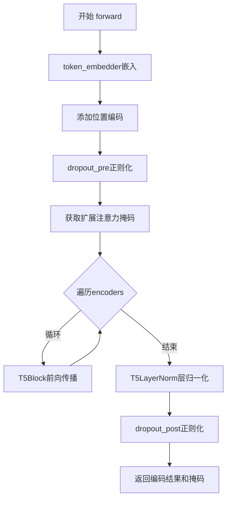
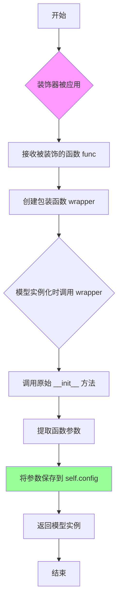
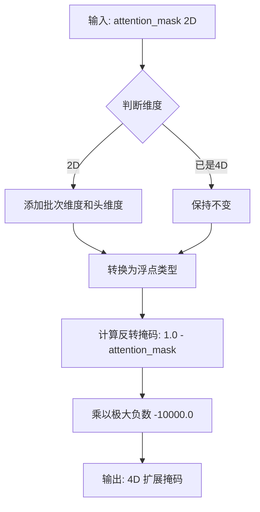
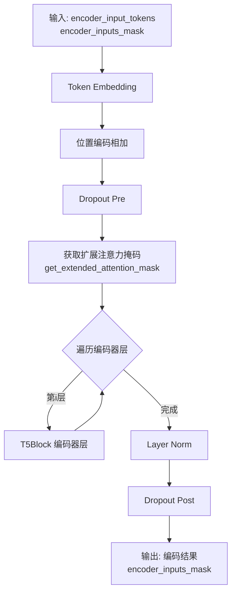

# `diffusers\src\diffusers\pipelines\deprecated\spectrogram_diffusion\notes_encoder.py` 详细设计文档

这是一个基于T5架构的谱图音符编码器（Spectrogram Notes Encoder），用于将音符序列编码为高维特征向量，支持可学习的token嵌入和位置编码，通过堆叠T5Block实现深层transformer编码，并集成了dropout和层归一化技术。

## 整体流程



## 类结构

```
ModelMixin (diffusers基类)
ConfigMixin (diffusers配置基类)
ModuleUtilsMixin (transformers工具混入)
└── SpectrogramNotesEncoder (谱图音符编码器)
```

## 全局变量及字段


### `max_length`
    
最大序列长度

类型：`int`
    


### `vocab_size`
    
词汇表大小

类型：`int`
    


### `d_model`
    
模型维度

类型：`int`
    


### `dropout_rate`
    
dropout概率

类型：`float`
    


### `num_layers`
    
编码器层数

类型：`int`
    


### `num_heads`
    
注意力头数

类型：`int`
    


### `d_kv`
    
key/value维度

类型：`int`
    


### `d_ff`
    
前馈网络维度

类型：`int`
    


### `feed_forward_proj`
    
前馈网络类型

类型：`str`
    


### `is_decoder`
    
是否为解码器模式

类型：`bool`
    


### `SpectrogramNotesEncoder.token_embedder`
    
token嵌入层

类型：`nn.Embedding`
    


### `SpectrogramNotesEncoder.position_encoding`
    
位置编码层

类型：`nn.Embedding`
    


### `SpectrogramNotesEncoder.dropout_pre`
    
前置dropout层

类型：`nn.Dropout`
    


### `SpectrogramNotesEncoder.encoders`
    
T5Block模块列表

类型：`nn.ModuleList`
    


### `SpectrogramNotesEncoder.layer_norm`
    
层归一化

类型：`T5LayerNorm`
    


### `SpectrogramNotesEncoder.dropout_post`
    
后置dropout层

类型：`nn.Dropout`
    
    

## 全局函数及方法


### `register_to_config`

`register_to_config` 是 HuggingFace Diffusers 库中的配置注册装饰器，用于自动将 `__init__` 方法的参数保存到模型的配置对象中，使得这些参数可以通过 `model.config` 属性访问，同时支持模型的序列化与反序列化。

参数：

-  `func`：`Callable`，被装饰的函数（通常是 `__init__` 方法），包含模型的初始化参数

返回值：`Callable`，返回一个新的包装函数，该函数在调用原始函数的同时，将参数注册到模型的配置中

#### 流程图



#### 带注释源码

```python
# register_to_config 是 ConfigMixin 类提供的装饰器方法
# 以下是基于其使用行为的推断实现

def register_to_config(func):
    """
    装饰器：自动将函数参数注册到模型的配置中
    
    工作原理：
    1. 拦截被装饰函数的调用
    2. 提取所有参数（除了 self）
    3. 将参数存储在 self.config 对象中
    4. 支持模型的 from_pretrained 和 save_pretrained 功能
    """
    def wrapper(self, *args, **kwargs):
        # 调用原始的 __init__ 方法
        result = func(self, *args, **kwargs)
        
        # 获取函数签名
        import inspect
        sig = inspect.signature(func)
        param_names = list(sig.parameters.keys())
        
        # 排除 'self' 参数
        if 'self' in param_names:
            param_names.remove('self')
        
        # 创建配置字典
        config_dict = {}
        
        # 从位置参数中提取
        for i, param_name in enumerate(param_names):
            if i < len(args):
                config_dict[param_name] = args[i]
        
        # 从关键字参数中提取
        for param_name, value in kwargs.items():
            config_dict[param_name] = value
        
        # 将参数保存到 self.config
        if hasattr(self, 'config'):
            # 更新现有配置
            self.config.update(**config_dict)
        else:
            # 创建新配置对象
            from dataclasses import dataclass, asdict
            @dataclass
            class Config:
                pass
            self.config = Config()
            for key, value in config_dict.items():
                setattr(self.config, key, value)
        
        return result
    
    return wrapper


# 使用示例
class ExampleModel:
    def __init__(self, num_layers: int, hidden_size: int):
        self.num_layers = num_layers
        self.hidden_size = hidden_size

# 应用装饰器（在实际库中，register_to_config 会作为装饰器使用）
# 装饰后的 __init__ 会自动保存参数到 self.config
```

#### 补充说明

**设计目标与约束：**
- 目的是实现模型的配置与模型权重的分离存储
- 确保模型可以通过配置对象重建
- 支持 HuggingFace 的 `from_pretrained` 和 `save_pretrained` 序列化流程

**外部依赖：**
- 依赖于 `transformers.configuration_utils.ConfigMixin`
- 需要 `inspect` 模块来获取函数签名

**注意事项：**
- 代码中未直接提供 `register_to_config` 的实现源码，以上为基于使用行为的推断
- 实际实现可能位于 `transformers` 库的 `configuration_utils` 模块中
- 该装饰器通常与 `ConfigMixin` 类配合使用


### `SpectrogramNotesEncoder.get_extended_attention_mask`

获取扩展注意力掩码，继承自 `ModuleUtilsMixin`，用于将 2D 注意力掩码扩展为 4D 以适配多头注意力机制，并反转掩码值使得被掩码的位置在 softmax 后注意力权重接近 0。

参数：

- `attention_mask`：`torch.Tensor`，2D 张量，表示输入序列中哪些位置是有效的（1 表示有效，0 表示需要掩码）
- `input_shape`：`torch.Size` 或 `tuple`，输入张量的形状，通常为 `(batch_size, sequence_length)`

返回值：`torch.Tensor`，4D 张量，形状为 `(batch_size, 1, 1, seq_length)`，可直接用于多头注意力计算的反转掩码。

#### 流程图



#### 带注释源码

```
def get_extended_attention_mask(self, attention_mask: Tensor, input_shape: Tuple[int, ...]) -> Tensor:
    """
    继承自 ModuleUtilsMixin
    将 2D 注意力掩码 [batch_size, seq_length] 扩展为 4D 掩码
    [batch_size, 1, 1, seq_length] 以适配多头注意力机制
    
    参数:
        attention_mask: 2D 张量，值为 0 或 1，1 表示有效位置，0 表示需掩码
        input_shape: 输入张量的形状 (batch_size, seq_length)
    
    返回:
        4D 张量，形状为 (batch_size, 1, 1, seq_length)
        被掩码位置的值接近负无穷 (-10000.0)，使得 softmax 后权重接近 0
    """
    # 步骤1: 获取输入形状
    # input_shape 包含 (batch_size, sequence_length)
    
    # 步骤2: 扩展维度以适配注意力计算
    # 从 [batch_size, seq_length] 扩展为 [batch_size, 1, 1, seq_length]
    # 第二个维度对应 num_heads，第三个维度对应 sequence_length (用于 broadcast)
    extended_attention_mask = attention_mask.unsqueeze(1).unsqueeze(2)
    
    # 步骤3: 转换为浮点类型以便计算
    extended_attention_mask = extended_attention_mask.to(dtype=self.dtype)
    
    # 步骤4: 反转掩码并应用极大负数
    # 原掩码: 1=有效, 0=需掩码
    # 反转后: 0=有效, 1=需掩码
    # 乘以 -10000.0: 有效位置=0, 需掩码位置=-10000.0
    # 这样在 softmax 之后，掩码位置的权重会接近 0
    extended_attention_mask = (1.0 - extended_attention_mask) * -10000.0
    
    return extended_attention_mask
```


### `SpectrogramNotesEncoder.__init__`

这是 `SpectrogramNotesEncoder` 类的初始化方法，负责构建一个基于 T5 架构的音符谱图编码器。该编码器包含词嵌入层、位置编码层、多个 T5 编码器块（由 `num_layers` 指定数量）以及层归一化和 dropout 机制。

参数：

- `max_length`：`int`，输入序列的最大长度，用于初始化位置编码的嵌入维度
- `vocab_size`：`int`，词汇表大小，用于初始化 token 嵌入层和 T5 配置
- `d_model`：`int`，模型的隐藏维度，控制 token 嵌入和所有层的特征维度
- `dropout_rate`：`float`，dropout 概率，用于正则化模型
- `num_layers`：`int`，T5 编码器块的数量，决定网络的深度
- `num_heads`：`int`，多头注意力机制中注意力头的数量
- `d_kv`：`int`，键（Key）和值（Value）向量的维度
- `d_ff`：`int`，前馈神经网络的隐藏层维度
- `feed_forward_proj`：`str`，前馈网络的激活函数类型（如 "relu" 或 "gated-gelu"）
- `is_decoder`：`bool`，指定是否为解码器模式，默认为 `False`

返回值：`None`，该方法为构造函数，不返回任何值，仅初始化对象状态

#### 流程图

```mermaid
flowchart TD
    A[开始 __init__] --> B[调用 super().__init__]
    B --> C[创建 nn.Embedding token_embedder]
    C --> D[创建 nn.Embedding position_encoding]
    D --> E[设置 position_encoding.weight.requires_grad = False]
    E --> F[创建 nn.Dropout dropout_pre]
    F --> G[构建 T5Config 对象]
    G --> H[创建 nn.ModuleList encoders]
    H --> I[循环 num_layers 次创建 T5Block]
    I --> J[创建 T5LayerNorm layer_norm]
    J --> K[创建 nn.Dropout dropout_post]
    K --> L[结束 __init__]
```

#### 带注释源码

```python
@register_to_config
def __init__(
    self,
    max_length: int,
    vocab_size: int,
    d_model: int,
    dropout_rate: float,
    num_layers: int,
    num_heads: int,
    d_kv: int,
    d_ff: int,
    feed_forward_proj: str,
    is_decoder: bool = False,
):
    # 调用父类的初始化方法，完成基础初始化
    # 包括 ModelMixin 和 ConfigMixin 的初始化逻辑
    super().__init__()

    # 创建词嵌入层，将词汇表中的 token ID 映射到 d_model 维度的向量空间
    # vocab_size: 词汇表大小，决定嵌入矩阵的行数
    # d_model: 嵌入向量的维度
    self.token_embedder = nn.Embedding(vocab_size, d_model)

    # 创建位置编码嵌入层，用于为序列中的每个位置添加位置信息
    # max_length: 最大序列长度，决定嵌入矩阵的行数
    # 位置编码权重被冻结，不参与训练（requires_grad = False）
    self.position_encoding = nn.Embedding(max_length, d_model)
    self.position_encoding.weight.requires_grad = False

    # 创建第一个 dropout 层，用于在嵌入层之后进行正则化
    self.dropout_pre = nn.Dropout(p=dropout_rate)

    # 构建 T5 模型配置对象
    # 使用传入的参数初始化 T5 特有配置
    # is_encoder_decoder=False 表示仅使用 T5 的编码器部分
    t5config = T5Config(
        vocab_size=vocab_size,
        d_model=d_model,
        num_heads=num_heads,
        d_kv=d_kv,
        d_ff=d_ff,
        dropout_rate=dropout_rate,
        feed_forward_proj=feed_forward_proj,
        is_decoder=is_decoder,
        is_encoder_decoder=False,
    )

    # 创建 T5 编码器块的模块列表
    # 使用 nn.ModuleList 以确保其中的所有 T5Block 都被正确注册为模块参数
    self.encoders = nn.ModuleList()
    for lyr_num in range(num_layers):
        # 循环创建 num_layers 个 T5Block 实例
        # 每个 Block 包含自注意力机制和前馈网络
        lyr = T5Block(t5config)
        self.encoders.append(lyr)

    # 创建最终的层归一化，用于稳定训练过程
    self.layer_norm = T5LayerNorm(d_model)

    # 创建第二个 dropout 层，用于在最终输出之前进行正则化
    self.dropout_post = nn.Dropout(p=dropout_rate)
```


### `SpectrogramNotesEncoder.forward`

该方法实现音符谱图编码器的前向传播，将输入的音符token序列通过嵌入层、位置编码、T5编码器块堆栈和层归一化处理，输出编码后的隐藏状态序列及原始输入掩码。

参数：

- `encoder_input_tokens`：`torch.LongTensor`，输入的音符token序列，形状为 `(batch_size, seq_length)`
- `encoder_inputs_mask`：`torch.Tensor`，输入序列的掩码，指示有效位置（1表示有效，0表示填充），形状为 `(batch_size, seq_length)`

返回值：`Tuple[torch.Tensor, torch.Tensor]`，第一项为编码后的隐藏状态张量，形状为 `(batch_size, seq_length, d_model)`，第二项为原始的 `encoder_inputs_mask`

#### 流程图



#### 带注释源码

```python
def forward(self, encoder_input_tokens, encoder_inputs_mask):
    """
    前向传播方法，对输入的音符token序列进行编码
    
    参数:
        encoder_input_tokens: 输入的token序列，形状为 (batch_size, seq_length)
        encoder_inputs_mask: 输入掩码，形状为 (batch_size, seq_length)
    
    返回:
        tuple: (编码后的隐藏状态, 原始输入掩码)
    """
    # 第一步：将token索引转换为d_model维的嵌入向量
    # encoder_input_tokens 的形状: (batch_size, seq_length)
    # x 的形状: (batch_size, seq_length, d_model)
    x = self.token_embedder(encoder_input_tokens)

    # 第二步：获取序列长度并创建位置编码
    # 生成 [0, 1, 2, ..., seq_length-1] 的位置索引
    seq_length = encoder_input_tokens.shape[1]
    inputs_positions = torch.arange(seq_length, device=encoder_input_tokens.device)
    
    # 将位置编码加到嵌入向量上
    # inputs_positions 自动广播到 (batch_size, seq_length)
    x += self.position_encoding(inputs_positions)

    # 第三步：应用编码前的dropout
    x = self.dropout_pre(x)

    # 第四步：获取扩展的注意力掩码
    # 将原始的注意力掩码（1=有效，0=填充）转换为适合T5的格式
    # 转换后的掩码用于在注意力计算中屏蔽填充位置
    input_shape = encoder_input_tokens.size()
    extended_attention_mask = self.get_extended_attention_mask(encoder_inputs_mask, input_shape)

    # 第五步：逐层通过T5编码器块
    # 每个T5Block包含自注意力机制和前馈网络
    for lyr in self.encoders:
        # lyr 返回 tuple: (hidden_states, ...)
        # 只取第一个元素 hidden_states
        x = lyr(x, extended_attention_mask)[0]
    
    # 第六步：应用层归一化
    x = self.layer_norm(x)

    # 第七步：应用编码后的dropout并返回结果
    # 返回编码后的隐藏状态和原始输入掩码（传递给下游任务使用）
    return self.dropout_post(x), encoder_inputs_mask
```

## 关键组件


### SpectrogramNotesEncoder

频谱图音符编码器，基于T5架构将音符序列编码为高维表示，支持位置编码和注意力掩码处理。

### token_embedder

词嵌入层，将音符token索引映射到d_model维度的稠密向量空间。

### position_encoding

位置编码层，为序列中的每个位置添加位置信息，权重设置为不可训练。

### dropout_pre / dropout_post

Dropout层，分别在注意力机制前后应用，用于正则化防止过拟合。

### encoders

T5Block模块列表，堆叠多个Transformer编码层实现深度特征提取。

### layer_norm

T5LayerNorm层，对编码器输出进行层归一化，稳定训练过程。

### forward方法

前向传播方法，执行token嵌入、位置编码、注意力掩码反转、多层T5编码和层归一化，返回编码结果和掩码。

### T5Config

T5模型配置类，封装词汇量、模型维度、注意力头数、键值维度、前馈网络维度等超参数。

### get_extended_attention_mask

注意力掩码扩展方法，将输入掩码转换为适合多头注意力计算的扩展掩码格式。


## 问题及建议


### 已知问题

- **位置编码重复计算**：每次forward都通过`torch.arange`创建位置编码，GPU内存和计算开销较大，应预计算并缓存
- **输入验证缺失**：未检查`encoder_input_tokens`和`encoder_inputs_mask`的有效性（如维度匹配、数据类型、值范围），可能导致隐藏的运行时错误
- **设备兼容性问题**：位置编码直接使用输入tensor的device，在CPU和GPU混合环境下可能出现设备不匹配风险
- **attention mask注释误导**：注释称"inverted the attention mask"，但实际调用的是`get_extended_attention_mask`，语义不一致可能导致维护困惑
- **T5Config重复实例化**：在循环中重复使用同一个config对象创建T5Block，虽然功能正确但语义上应提取为单例
- **编码器输出未池化**：直接返回最后一层输出，对于变长输入可能包含大量padding token的噪声信息
- **dropout策略固定**：pre和post dropout率相同且在推理时仍会生效（虽然通常不运行dropout层），缺乏灵活的dropout策略配置
- **变量命名冗余**：如`lyr_num`和`lyr`的命名不够直观，影响代码可读性

### 优化建议

- **预计算位置编码**：将位置编码在`__init__`中一次性创建为buffer，forward时通过索引取用，避免重复分配内存
- **添加输入验证**：在forward方法入口处添加必要的断言检查输入合法性
- **明确设备管理**：添加`to()`方法支持或显式处理设备转移逻辑
- **统一attention mask语义**：修正注释或重构代码使其语义清晰
- **考虑池化策略**：根据下游任务需求添加mean pooling或CLS token pooling
- **改进变量命名**：使用更清晰的命名如`layer_index`和`layer`
- **添加配置验证**：检查config参数的有效性（如d_model必须能被num_heads整除）

## 其它


### 设计目标与约束

本模块的设计目标是将乐谱音符序列编码为高维向量表示，供下游的扩散模型使用。设计约束包括：1）必须继承ModelMixin和ConfigMixin以支持HuggingFace Transformers的模型加载机制；2）内部使用T5Block实现自回归或双向注意力编码；3）位置编码采用非可学习的方式以减少过拟合风险；4）输入序列长度受max_length约束，输出维度固定为d_model。

### 错误处理与异常设计

1）输入验证：encoder_input_tokens的形状必须为(batch_size, seq_length)，且值必须在[0, vocab_size)范围内；encoder_inputs_mask必须与输入形状匹配且为布尔类型或浮点类型。2）设备一致性：position_encoding生成的位置向量会自动转移到与encoder_input_tokens相同的设备上。3）维度不匹配：T5Block内部会进行维度验证，若d_model、num_heads、d_kv、d_ff参数不兼容会抛出异常。4）梯度传播：dropout层在训练模式下生效，评估模式下自动关闭。

### 数据流与状态机

数据流如下：1）输入阶段：encoder_input_tokens (batch, seq_len) → token_embedder → (batch, seq_len, d_model)；2）位置编码阶段：添加position_encoding得到位置感知表示；3）注意力掩码阶段：encoder_inputs_mask → get_extended_attention_mask → 扩展为(batch, 1, 1, seq_len)的注意力掩码；4）编码阶段：逐层通过T5Block进行自注意力+前馈网络变换；5）输出阶段：LayerNorm + Dropout → (batch, seq_len, d_model) 和原始mask。本模块为无状态模块，不涉及状态机设计。

### 外部依赖与接口契约

主要外部依赖包括：1）torch.nn模块提供基础神经网络组件；2）transformers.modeling_utils.ModuleUtilsMixin提供注意力掩码处理工具；3）transformers.models.t5.modeling_t5中的T5Block、T5Config、T5LayerNorm提供T5架构核心组件；4）transformers.configuration_utils.ConfigMixin和register_to_config装饰器提供配置管理；5）diffusers.models.ModelMixin提供模型基类。接口契约：forward方法接收encoder_input_tokens (LongTensor, shape=[batch, seq_len])和encoder_inputs_mask (Tensor, shape=[batch, seq_len])，返回编码后的隐藏状态 (FloatTensor, shape=[batch, seq_len, d_model])和原始mask。

### 配置参数说明

max_length: int - 输入序列的最大长度，决定position_encoding的表大小，默认值由注册配置决定。vocab_size: int - 音符词汇表大小，决定token_embedder的嵌入矩阵维度。d_model: int - 模型隐藏层维度，也是位置编码和输出的维度。dropout_rate: float - Dropout概率，用于正则化。num_layers: int - T5Block堆叠层数，决定编码深度。num_heads: int - 注意力头数，d_model必须能被num_heads整除。d_kv: int - 键值对的维度，每个头的维度。d_ff: int - 前馈网络中间层维度。feed_forward_proj: str - 前馈网络类型，可选"gated-gelu"或"relu"等。is_decoder: bool - 是否为解码器模式，默认为False表示编码器模式。

### 性能考虑与优化空间

性能考虑：1）nn.ModuleList中的T5Block会注册所有参数到模型参数列表，支持梯度计算和GPU并行；2）位置编码采用查表方式，计算效率高但无法处理超过max_length的序列。优化空间：1）可考虑使用torch.compile或export优化推理性能；2）可添加梯度checkpointing以减少大模型的显存占用；3）可实现缓存机制支持增量推理；4）当前实现为密集编码，可考虑添加稀疏注意力机制处理超长序列。

### 版本兼容性说明

本模块依赖transformers库和diffusers库。T5Block和T5Config的接口在不同版本的transformers中可能存在细微差异，需锁定版本。ModelMixin和ConfigMixin的接口相对稳定。建议依赖版本：transformers>=4.20.0, diffusers>=0.10.0, torch>=1.9.0。后续升级时需关注T5Config参数名称变化和ModuleUtilsMixin的get_extended_attention_mask方法签名变更。

    