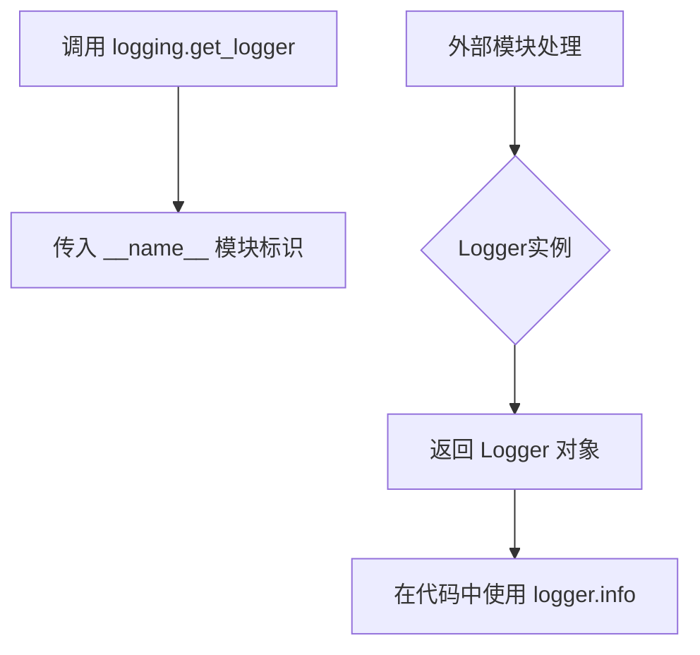
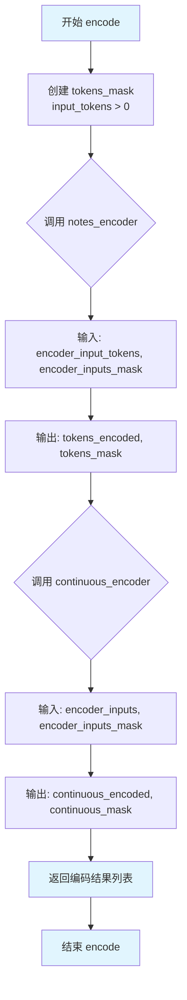
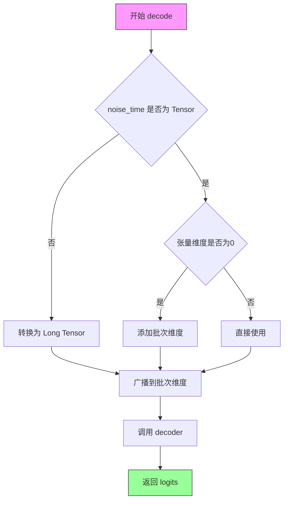
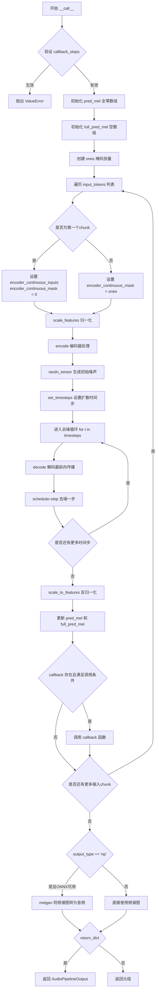
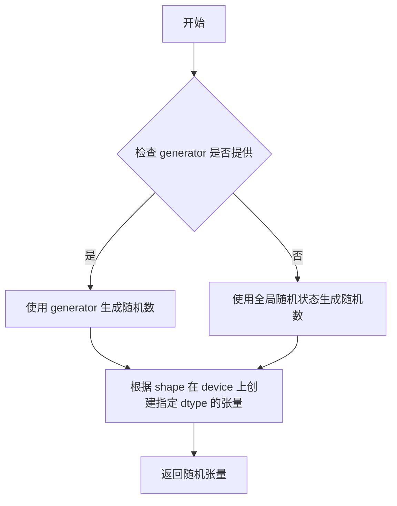
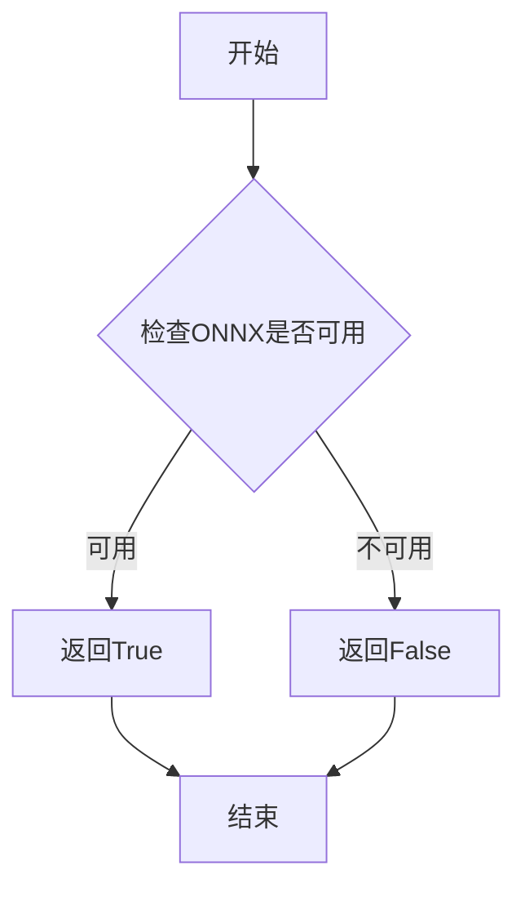
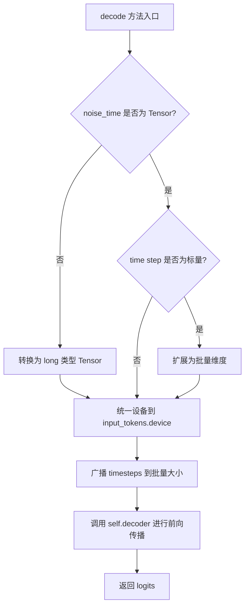
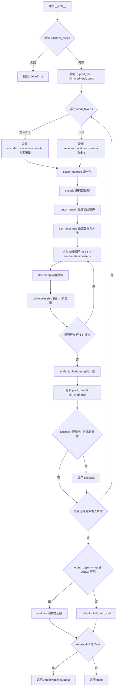

# `diffusers\src\diffusers\pipelines\deprecated\spectrogram_diffusion\pipeline_spectrogram_diffusion.py` 详细设计文档

SpectrogramDiffusionPipeline是一个用于无条件音频生成的扩散模型管道，将MIDI音符标记转换为梅尔谱图，并利用T5FilmDecoder去噪器在DDPMScheduler调度下进行迭代去噪，最后通过MelGAN声码器将生成的梅尔谱图转换为音频波形。

## 整体流程

```mermaid
graph TD
A[开始: 输入MIDI tokens] --> B[初始化pred_mel和full_pred_mel]
B --> C{for each encoder_input_tokens}
C --> D{是否为第一个chunk?}
D -- 是 --> E[设置encoder_continuous_inputs为零]
D -- 否 --> F[使用上一轮预测作为连续输入]
E --> G[scale_features到[-1, 1]]
F --> G
G --> H[调用encode编码tokens和continuous_inputs]
H --> I[采样高斯噪声x]
I --> J[设置scheduler的timesteps]
J --> K{for each timestep t}
K --> L[调用decode获取logits]
L --> M[scheduler.step去噪: x_t -> x_t-1]
M --> K
K --> N[scale_to_features逆缩放]
N --> O[更新pred_mel和full_pred_mel]
O --> C
C --> P{output_type == 'np'?}
P -- 是 --> Q[调用melgan生成音频]
P -- 否 --> R[直接返回mel谱图]
Q --> S[返回AudioPipelineOutput]
R --> S
```

## 类结构

```
DiffusionPipeline (基类)
└── SpectrogramDiffusionPipeline (音频生成管道)
    ├── 依赖组件:
    │   ├── SpectrogramNotesEncoder (音符编码器)
    │   ├── SpectrogramContEncoder (连续特征编码器)
    │   ├── T5FilmDecoder (T5去噪解码器)
    │   ├── DDPMScheduler (DDPM调度器)
    │   └── OnnxRuntimeModel (MelGAN声码器)
```

## 全局变量及字段


### `TARGET_FEATURE_LENGTH`
    
目标特征长度常量，值为256，用于指定梅尔谱图的特征维度

类型：`int`
    


### `logger`
    
模块级别的日志记录器，用于输出管道运行时的信息和调试消息

类型：`logging.Logger`
    


### `SpectrogramDiffusionPipeline.min_value`
    
MELGAN训练的最小值，用于特征缩放，值为math.log(1e-5)

类型：`float`
    


### `SpectrogramDiffusionPipeline.max_value`
    
MELGAN训练的最大值，用于特征缩放，大多数样本的最大值为4.0

类型：`float`
    


### `SpectrogramDiffusionPipeline.n_dims`
    
梅尔频谱的维度数，固定为128

类型：`int`
    


### `SpectrogramDiffusionPipeline.notes_encoder`
    
音符编码器，用于将输入的音符标记序列编码为特征表示

类型：`SpectrogramNotesEncoder`
    


### `SpectrogramDiffusionPipeline.continuous_encoder`
    
连续特征编码器，用于将连续的梅尔谱图特征编码为特征表示

类型：`SpectrogramContEncoder`
    


### `SpectrogramDiffusionPipeline.decoder`
    
T5去噪解码器，用于根据编码后的特征和时间步信息去噪生成梅尔谱图

类型：`T5FilmDecoder`
    


### `SpectrogramDiffusionPipeline.scheduler`
    
DDPM调度器，用于控制扩散模型的去噪过程和噪声调度

类型：`DDPMScheduler`
    


### `SpectrogramDiffusionPipeline.melgan`
    
MelGAN声码器（可选组件），用于将梅尔频谱转换为音频波形

类型：`OnnxRuntimeModel | Any`
    
    

## 全局函数及方法


# 提取与分析

经过仔细检查代码，我发现代码中并没有定义 `logger.get_logger` 函数。代码中使用的是：

```python
logger = logging.get_logger(__name__)  # pylint: disable=invalid-name
```

这里的 `logging` 是从 `....utils import logging` 导入的外部模块（来自 HuggingFace Diffusers 库），`get_logger` 是该模块提供的函数，而非在当前代码中定义。

不过，我可以基于代码中 `logger` 的实际使用情况，为您提供以下分析：

---


### `logging.get_logger(__name__)`

获取一个以当前模块命名的日志记录器实例，用于在代码中记录运行时信息。

参数：

- `__name__`：`str`，Python 模块的 `__name__` 变量，自动传入以标识日志来源

返回值：`logging.Logger`，返回一个 Python 标准库的 Logger 对象，用于记录日志

#### 流程图



#### 带注释源码

```python
# 从 HuggingFace Diffusers 工具模块导入 logging 工具类
from ....utils import is_onnx_available, logging

# 调用外部模块的 get_logger 函数创建模块级 logger
# __name__ 会自动替换为当前模块的完整路径，例如：
# "models.spectrogram_diffusion.pipeline_spectrogram_diffusion"
logger = logging.get_logger(__name__)  # pylint: disable=invalid-name

# 在代码中使用 logger 记录信息
logger.info("Generated segment", i)  # i 是当前生成的片段索引
```

---

### 补充说明：logger 在代码中的实际使用

在 `SpectrogramDiffusionPipeline` 类中，`logger` 被用于记录管道执行信息：

```python
# 在 __call__ 方法中，每生成一个片段后记录日志
logger.info("Generated segment", i)
```

这是一个标准的 Python logging 用法，属于外部依赖模块提供的功能，非本代码库定义。


### `SpectrogramDiffusionPipeline.scale_features`

该方法用于将输入的特征值线性缩放到网络输出的指定范围。首先将特征值从原始的 [min_value, max_value] 范围映射到 [0, 1]，然后再线性变换到用户指定的输出范围（如 [-1.0, 1.0]）。可选地，在缩放前对输入进行裁剪以防止异常值。

参数：

- `features`：`torch.Tensor`，需要缩放的特征输入张量
- `output_range`：`tuple[float, float]`，目标输出范围，默认为 (-1.0, 1.0)
- `clip`：`bool`，是否在缩放前将输入裁剪到 [min_value, max_value] 范围，默认为 False

返回值：`torch.Tensor`，缩放后的特征张量

#### 流程图

```mermaid
flowchart TD
    A[开始 scale_features] --> B{clip 参数是否为 True?}
    B -->|是| C[将 features 裁剪到 [self.min_value, self.max_value]]
    B -->|否| D[保持 features 不变]
    C --> E[计算 zero_one = (features - min_value) / (max_value - min_value)]
    D --> E
    E --> F[计算输出 zero_one * (max_out - min_out) + min_out]
    F --> G[返回缩放后的结果]
```

#### 带注释源码

```python
def scale_features(self, features, output_range=(-1.0, 1.0), clip=False):
    """Linearly scale features to network outputs range."""
    # 解包目标输出范围
    min_out, max_out = output_range
    
    # 如果需要裁剪，则将输入特征限制在 [min_value, max_value] 范围内
    # self.min_value = math.log(1e-5)，self.max_value = 4.0
    if clip:
        features = torch.clip(features, self.min_value, self.max_value)
    
    # 第一步：将特征从 [min_value, max_value] 范围缩放到 [0, 1]
    # zero_one 代表归一化后的值，范围在 [0, 1]
    zero_one = (features - self.min_value) / (self.max_value - self.min_value)
    
    # 第二步：将 [0, 1] 范围线性变换到目标输出范围 [min_out, max_out]
    # 使用线性变换: output = zero_one * (max_out - min_out) + min_out
    return zero_one * (max_out - min_out) + min_out
```


### `SpectrogramDiffusionPipeline.scale_to_features`

该方法执行 `scale_features` 的逆操作，将网络输出的数值范围从 `input_range` 线性映射回特征值的原始范围（`self.min_value` 到 `self.max_value`），常用于将模型预测的 log-mel 频谱图从归一化状态恢复到实际的特征空间。

参数：

- `outputs`：`torch.Tensor`，网络输出的张量，需要进行逆缩放
- `input_range`：`tuple[float, float]`，输入数据的范围，默认为 (-1.0, 1.0)
- `clip`：`bool`，是否在缩放前将输出裁剪到 `input_range` 范围内，默认为 False

返回值：`torch.Tensor`，缩放后的特征值张量

#### 流程图

```mermaid
flowchart TD
    A[开始: scale_to_features] --> B[解包 input_range<br/>min_out, max_out = input_range]
    B --> C{clip == True?}
    C -->|是| D[裁剪 outputs 到 [min_out, max_out]<br/>outputs = torch.clip(outputs, min_out, max_out)]
    C -->|否| E[保持 outputs 不变]
    D --> F
    E --> F[计算归一化到 [0, 1]<br/>zero_one = (outputs - min_out) / (max_out - min_out)]
    F --> G[映射到特征范围<br/>result = zero_one * (max_value - min_value) + min_value]
    G --> H[返回缩放后的特征张量]
```

#### 带注释源码

```python
def scale_to_features(self, outputs, input_range=(-1.0, 1.0), clip=False):
    """Invert by linearly scaling network outputs to features range."""
    # 解包输入范围的下界和上界
    min_out, max_out = input_range
    
    # 可选：如果 clip 为 True，则先将输出裁剪到指定范围内
    # 这确保输入值不会超出 input_range，避免除以零等问题
    outputs = torch.clip(outputs, min_out, max_out) if clip else outputs
    
    # 第一步缩放：将 [min_out, max_out] 范围内的值归一化到 [0, 1]
    # 公式：(x - min) / (max - min)
    zero_one = (outputs - min_out) / (max_out - min_out)
    
    # 第二步缩放：将 [0, 1] 范围内的值映射到特征的实际范围 [self.min_value, self.max_value]
    # self.min_value = log(1e-5)，self.max_value = 4.0
    # 公式：zero_one * (feature_max - feature_min) + feature_min
    return zero_one * (self.max_value - self.min_value) + self.min_value
```


### `SpectrogramDiffusionPipeline.encode`

该方法负责将输入的音符标记（notes）和连续特征（continuous features）分别通过对应的编码器进行编码，并返回编码后的结果及其掩码。这是 SpectrogramDiffusionPipeline 音频生成管道的关键预处理步骤，用于将原始输入转换为适合后续解码处理的特征表示。

参数：

- `input_tokens`：`torch.Tensor` 或类似结构，输入的音符标记序列，表示音乐的离散音符信息
- `continuous_inputs`：`torch.Tensor`，连续输入特征，通常是之前生成的梅尔频谱图（mel-spectrogram）片段
- `continuous_mask`：`torch.Tensor`，连续输入的注意力掩码，用于标识有效的时间步

返回值：`list[tuple]`，返回一个包含两个元组的列表。第一个元组是 `(tokens_encoded, tokens_mask)`，表示编码后的音符标记及其掩码；第二个元组是 `(continuous_encoded, continuous_mask)`，表示编码后的连续特征及其掩码。这些编码结果将传递给解码器进行去噪处理。

#### 流程图



#### 带注释源码

```python
def encode(self, input_tokens, continuous_inputs, continuous_mask):
    """
    编码输入的音符标记和连续特征。
    
    该方法将两种不同类型的输入分别通过专用的编码器进行处理：
    1. 音符标记通过 notes_encoder 进行编码
    2. 连续特征通过 continuous_encoder 进行编码
    
    Args:
        input_tokens: 输入的音符标记张量，形状为 [batch, seq_len]，
                      值通常为非负整数，表示MIDI音符或其他音符编码
        continuous_inputs: 连续输入特征，形状为 [batch, time_steps, features]，
                          通常是梅尔频谱图特征
        continuous_mask: 连续输入的掩码张量，形状为 [batch, time_steps]，
                        用于标识哪些时间步是有效的
    
    Returns:
        list: 包含两个元组的列表
              - 第一个元组: (tokens_encoded, tokens_mask) - 编码后的标记及其掩码
              - 第二个元组: (continuous_encoded, continuous_mask) - 编码后的连续特征及其掩码
    """
    # Step 1: 根据 input_tokens 创建掩码
    # 标记大于0的位置视为有效输入，用于 notes_encoder 的注意力掩码
    tokens_mask = input_tokens > 0
    
    # Step 2: 调用音符编码器 (SpectrogramNotesEncoder)
    # 将离散音符标记编码为高维特征表示
    # 输入: 原始音符标记和对应的掩码
    # 输出: 编码后的特征和更新后的掩码
    tokens_encoded, tokens_mask = self.notes_encoder(
        encoder_input_tokens=input_tokens, 
        encoder_inputs_mask=tokens_mask
    )

    # Step 3: 调用连续特征编码器 (SpectrogramContEncoder)
    # 将连续的梅尔频谱图特征编码为适合扩散模型的表示
    # 输入: 连续特征和对应的掩码
    # 输出: 编码后的特征和更新后的掩码
    continuous_encoded, continuous_mask = self.continuous_encoder(
        encoder_inputs=continuous_inputs, 
        encoder_inputs_mask=continuous_mask
    )

    # Step 4: 返回编码结果
    # 返回格式为列表，包含两组 (编码特征, 掩码) 元组
    # 这种格式方便后续 decode 方法进行批量处理
    return [(tokens_encoded, tokens_mask), (continuous_encoded, continuous_mask)]
```


### `SpectrogramDiffusionPipeline.decode`

该方法是扩散管道中的解码步骤，负责将编码后的表示和噪声时间步转换为解码器的logits输出，用于去噪过程。

参数：

- `encodings_and_masks`：`list[tuple[torch.Tensor, torch.Tensor]]`，编码器输出的编码和掩码列表，包含来自音符编码器和连续编码器的结果
- `input_tokens`：`torch.Tensor`，输入的标记或潜在变量，通常是噪声张量
- `noise_time`：`int` 或 `torch.Tensor`，噪声时间步，用于调度去噪过程

返回值：`torch.Tensor`，解码器生成的logits输出，用于后续的去噪调度步骤

#### 流程图



#### 带注释源码

```python
def decode(self, encodings_and_masks, input_tokens, noise_time):
    """
    解码方法：将编码表示和时间步转换为解码器logits
    
    参数:
        encodings_and_masks: 编码器输出的编码和掩码列表
        input_tokens: 输入标记（通常是噪声）
        noise_time: 噪声时间步
    
    返回:
        解码器的logits输出
    """
    # 获取时间步
    timesteps = noise_time
    
    # 如果时间步不是张量，转换为张量
    if not torch.is_tensor(timesteps):
        timesteps = torch.tensor([timesteps], dtype=torch.long, device=input_tokens.device)
    # 如果是标量张量，添加批次维度
    elif torch.is_tensor(timesteps) and len(timesteps.shape) == 0:
        timesteps = timesteps[None].to(input_tokens.device)

    # 广播到批次维度，兼容 ONNX/Core ML
    timesteps = timesteps * torch.ones(
        input_tokens.shape[0], 
        dtype=timesteps.dtype, 
        device=timesteps.device
    )

    # 调用解码器生成logits
    logits = self.decoder(
        encodings_and_masks=encodings_and_masks, 
        decoder_input_tokens=input_tokens, 
        decoder_noise_time=timesteps
    )
    
    return logits
```


### `SpectrogramDiffusionPipeline.__call__`

这是管道的主入口方法，用于基于输入的音符tokens生成音频频谱图（mel-spectrogram），并可选地将其转换为音频波形。

参数：

- `input_tokens`：`list[list[int]]`，输入的音符标记列表，每个子列表代表一个时间步的音符编码
- `generator`：`torch.Generator | None`，可选的PyTorch随机生成器，用于控制去噪过程的随机性，实现可复现生成
- `num_inference_steps`：`int`，去噪扩散的总步数，步数越多通常生成质量越高但推理速度越慢，默认为100
- `return_dict`：`bool`，是否返回`AudioPipelineOutput`字典格式而非元组，默认为True
- `output_type`：`str`，输出格式类型，"np"返回numpy音频数组，"mel"返回频谱图，默认为"np"
- `callback`：`Callable[[int, int, torch.Tensor], None] | None`，可选的回调函数，每隔`callback_steps`步被调用，用于监控生成进度
- `callback_steps`：`int`，回调函数被调用的频率，默认为1

返回值：`AudioPipelineOutput | tuple`，当`return_dict=True`时返回包含生成音频的`AudioPipelineOutput`对象，否则返回元组

#### 流程图



#### 带注释源码

```python
@torch.no_grad()
def __call__(
    self,
    input_tokens: list[list[int]],
    generator: torch.Generator | None = None,
    num_inference_steps: int = 100,
    return_dict: bool = True,
    output_type: str = "np",
    callback: Callable[[int, int, torch.Tensor], None] | None = None,
    callback_steps: int = 1,
) -> AudioPipelineOutput | tuple:
    # 验证 callback_steps 参数的有效性
    if (callback_steps is None) or (
        callback_steps is not None and (not isinstance(callback_steps, int) or callback_steps <= 0)
    ):
        raise ValueError(
            f"`callback_steps` has to be a positive integer but is {callback_steps} of type"
            f" {type(callback_steps)}."
        )
    r"""
    The call function to the pipeline for generation.

    Args:
        input_tokens (`list[list[int]]`): 输入的音符tokens列表
        generator (`torch.Generator` or `list[torch.Generator]`, *optional*): 随机生成器
        num_inference_steps (`int`, *optional*, defaults to 100): 去噪步数
        return_dict (`bool`, *optional*, defaults to `True`): 是否返回字典格式
        output_type (`str`, *optional*, defaults to `"np"`): 输出格式
        callback (`Callable`, *optional*): 回调函数
        callback_steps (`int`, *optional*, defaults to 1): 回调频率

    Returns:
        [`pipelines.AudioPipelineOutput`] or `tuple`: 生成的音频输出
    """

    # 初始化预测的mel频谱图数组，用于存储当前chunk的预测结果
    pred_mel = np.zeros([1, TARGET_FEATURE_LENGTH, self.n_dims], dtype=np.float32)
    # 初始化完整的mel频谱图数组，用于累积所有chunk的预测结果
    full_pred_mel = np.zeros([1, 0, self.n_dims], np.float32)
    # 创建全1掩码张量，用于表示有完整的上下文输入
    ones = torch.ones((1, TARGET_FEATURE_LENGTH), dtype=bool, device=self.device)

    # 遍历每个输入token chunk，进行自回归生成
    for i, encoder_input_tokens in enumerate(input_tokens):
        if i == 0:
            # 第一个chunk没有之前的上下文，使用初始化的pred_mel
            encoder_continuous_inputs = torch.from_numpy(pred_mel[:1].copy()).to(
                device=self.device, dtype=self.decoder.dtype
            )
            # 第一个chunk没有之前的上下文，所以mask全为0
            encoder_continuous_mask = torch.zeros((1, TARGET_FEATURE_LENGTH), dtype=bool, device=self.device)
        else:
            # 后续chunk有完整的上下文信息（来自前一个chunk的预测），mask全为1
            encoder_continuous_mask = ones

        # 将特征值从原始范围线性缩放到[-1, 1]网络输入范围
        encoder_continuous_inputs = self.scale_features(
            encoder_continuous_inputs, output_range=[-1.0, 1.0], clip=True
        )

        # 调用encode方法，对token和continuous输入进行编码
        encodings_and_masks = self.encode(
            input_tokens=torch.IntTensor([encoder_input_tokens]).to(device=self.device),
            continuous_inputs=encoder_continuous_inputs,
            continuous_mask=encoder_continuous_mask,
        )

        # 生成与encoder_continuous_inputs形状相同的随机噪声作为去噪起点
        x = randn_tensor(
            shape=encoder_continuous_inputs.shape,
            generator=generator,
            device=self.device,
            dtype=self.decoder.dtype,
        )

        # 根据num_inference_steps设置扩散调度器的时间步
        self.scheduler.set_timesteps(num_inference_steps)

        # 去噪扩散循环：逐步从噪声恢复出mel频谱图
        for j, t in enumerate(self.progress_bar(self.scheduler.timesteps)):
            # 解码器前向传播，预测当前时刻的噪声
            output = self.decode(
                encodings_and_masks=encodings_and_masks,
                input_tokens=x,
                noise_time=t / self.scheduler.config.num_train_timesteps,  # 重缩放到[0,1)
            )

            # 使用调度器执行去噪步骤，从x_t得到x_{t-1}
            x = self.scheduler.step(output, t, x, generator=generator).prev_sample

        # 将生成的mel频谱图从[-1,1]范围反归一化回原始特征范围
        mel = self.scale_to_features(x, input_range=[-1.0, 1.0])
        # 更新encoder_continuous_inputs用于下一个chunk的输入
        encoder_continuous_inputs = mel[:1]
        # 转换为numpy数组保存
        pred_mel = mel.cpu().float().numpy()

        # 将当前chunk的预测结果拼接到完整预测中
        full_pred_mel = np.concatenate([full_pred_mel, pred_mel[:1]], axis=1)

        # 如果提供了callback且满足调用条件，则调用回调函数
        if callback is not None and i % callback_steps == 0:
            callback(i, full_pred_mel)

        logger.info("Generated segment", i)

    # 检查output_type为'np'时的有效性条件
    if output_type == "np" and not is_onnx_available():
        raise ValueError(
            "Cannot return output in 'np' format if ONNX is not available. Make sure to have ONNX installed or set 'output_type' to 'mel'."
        )
    elif output_type == "np" and self.melgan is None:
        raise ValueError(
            "Cannot return output in 'np' format if melgan component is not defined. Make sure to define `self.melgan` or set 'output_type' to 'mel'."
        )

    # 根据output_type决定输出格式
    if output_type == "np":
        # 使用MelGAN将mel频谱图转换为音频波形
        output = self.melgan(input_features=full_pred_mel.astype(np.float32))
    else:
        # 直接输出mel频谱图
        output = full_pred_mel

    # 根据return_dict决定返回格式
    if not return_dict:
        return (output,)

    return AudioPipelineOutput(audios=output)
```


### `randn_tensor`

外部导入的随机张量生成函数，用于生成指定形状的随机噪声张量（从标准正态分布采样）。

参数：

- `shape`：`tuple` 或 `int`，生成张量的形状
- `generator`：`torch.Generator` 或 `None`，可选的随机数生成器，用于确保结果可复现
- `device`：`torch.device`，张量应放置的设备
- `dtype`：`torch.dtype`，张量的数据类型

返回值：`torch.Tensor`，从标准正态分布采样的随机张量

#### 流程图



#### 带注释源码

```python
def randn_tensor(
    shape: Tuple[int, ...],
    generator: Optional[torch.Generator] = None,
    device: Optional[torch.device] = None,
    dtype: Optional[torch.dtype] = None,
) -> torch.Tensor:
    """
    生成符合标准正态分布的随机张量。
    
    参数:
        shape: 张量的形状，可以是整数或整数元组
        generator: 可选的 PyTorch 随机数生成器，用于确保可复现性
        device: 目标设备（CPU/CUDA）
        dtype: 张量的数据类型
    
    返回:
        从标准正态分布 N(0, 1) 采样的随机张量
    """
    # 如果提供了 generator，使用它生成随机数
    # 否则使用 PyTorch 的默认随机数生成器
    if generator is not None:
        # 使用指定的生成器
        tensor = torch.randn(
            size=shape,
            generator=generator,
            device=device,
            dtype=dtype,
        )
    else:
        # 使用默认的随机数生成方式
        tensor = torch.randn(
            size=shape,
            device=device,
            dtype=dtype,
        )
    
    return tensor
```


### `is_onnx_available`

这是一个从外部模块导入的工具函数，用于检查当前环境是否安装了 ONNX 运行时库，以便决定是否可以使用 ONNX 相关的功能和模型。

参数： 无

返回值：`bool`，返回 `True` 表示 ONNX 可用，`False` 表示不可用。

#### 流程图



#### 带注释源码

```
# 注：is_onnx_available 函数定义在 ....utils 模块中（位于 src/diffusers/utils/）
# 以下为该函数在本文件中的使用方式和常见实现模式：

# 1. 条件导入 ONNX 相关模块
if is_onnx_available():
    from ...onnx_utils import OnnxRuntimeModel

# 2. 在类型注解中使用（延迟求值）
melgan: OnnxRuntimeModel if is_onnx_available() else Any

# 3. 在运行时检查 ONNX 可用性
if output_type == "np" and not is_onnx_available():
    raise ValueError(
        "Cannot return output in 'np' format if ONNX is not available. Make sure to have ONNX installed or set 'output_type' to 'mel'."
    )

# 典型实现逻辑（基于常见模式）：
# def is_onnx_available() -> bool:
#     """检查 ONNX Runtime 是否已安装"""
#     try:
#         import onnxruntime
#         return True
#     except ImportError:
#         return False
```

#### 备注

- **来源**：该函数定义在 `diffusers` 库的 `utils` 模块中，并非在本文件中实现
- **用途**：用于条件导入和功能分支，确保代码在有/无 ONNX 运行时的情况下都能正常运行
- **依赖**：需要 `onnxruntime` 包的存在


### `SpectrogramDiffusionPipeline.__init__`

这是 `SpectrogramDiffusionPipeline` 类的初始化方法，负责接收并注册音频生成管道所需的所有组件，包括音符编码器、连续编码器、解码器、调度器和可选的 MelGAN 声码器，同时配置 MELGAN 相关的缩放参数。

参数：

- `self`：隐式参数，类实例本身
- `notes_encoder`：`SpectrogramNotesEncoder`，音符编码器，用于编码离散的音符信息
- `continuous_encoder`：`SpectrogramContEncoder`，连续编码器，用于编码连续的频谱图特征
- `decoder`：`T5FilmDecoder`，T5-FILM 解码器，用于对编码后的音频潜在表示进行去噪
- `scheduler`：`DDPMScheduler`，DDPM 调度器，用于在去噪过程中计算噪声调度
- `melgan`：`OnnxRuntimeModel | Any`，可选的 MelGAN 声码器，用于将频谱图转换为音频波形（如果 ONNX 可用）

返回值：`None`，初始化方法无返回值

#### 流程图

```mermaid
flowchart TD
    A[开始 __init__] --> B[调用 super().__init__]
    B --> C[设置 MELGAN 配置参数]
    C --> D[设置 min_value = math.log1e-5]
    C --> E[设置 max_value = 4.0]
    C --> F[设置 n_dims = 128]
    F --> G[调用 register_modules 注册所有模块]
    G --> H[结束 __init__]
```

#### 带注释源码

```python
def __init__(
    self,
    notes_encoder: SpectrogramNotesEncoder,        # 音符编码器实例
    continuous_encoder: SpectrogramContEncoder,    # 连续特征编码器实例
    decoder: T5FilmDecoder,                         # T5-FILM 解码器实例
    scheduler: DDPMScheduler,                      # DDPM 噪声调度器实例
    melgan: OnnxRuntimeModel if is_onnx_available() else Any,  # 可选的 MelGAN 声码器
) -> None:
    # 调用父类 DiffusionPipeline 的初始化方法
    super().__init__()

    # 配置 MELGAN 训练相关的参数
    self.min_value = math.log(1e-5)  # 对应 MelGAN 训练的最小值
    self.max_value = 4.0              # 大多数样本的最大值
    self.n_dims = 128                 # 频谱图的维度数

    # 注册所有子模块，使它们可以通过 pipeline 访问和保存
    self.register_modules(
        notes_encoder=notes_encoder,
        continuous_encoder=continuous_encoder,
        decoder=decoder,
        scheduler=scheduler,
        melgan=melgan,
    )
```


### SpectrogramDiffusionPipeline.scale_features

该方法用于将输入的特征（梅尔频谱图特征）线性缩放到指定的输出范围。它首先将特征从原始范围 [min_value, max_value] 归一化到 [0, 1]，然后再线性变换到目标输出范围（如 [-1.0, 1.0]），是音频扩散管道中预处理阶段的关键组件。

参数：

- `features`：`torch.Tensor`，输入的梅尔频谱图特征张量，需要进行缩放处理
- `output_range`：元组 `(float, float)`，默认为 `(-1.0, 1.0)`，目标输出范围的最小值和最大值
- `clip`：布尔值，默认为 `False`，是否在缩放前将特征裁剪到 [min_value, max_value] 范围内

返回值：`torch.Tensor`，缩放后的特征张量

#### 流程图

```mermaid
flowchart TD
    A([开始 scale_features]) --> B[解包 output_range 获取 min_out, max_out]
    B --> C{clip == True?}
    C -->|Yes| D[torch.clip features 到 [self.min_value, self.max_value]]
    C -->|No| E[跳过裁剪直接使用原始 features]
    D --> F[计算 zero_one = (features - min_value) / (max_value - min_value)]
    E --> F
    F --> G[计算 scaled = zero_one * (max_out - min_out) + min_out]
    G --> H([返回缩放后的张量])
```

#### 带注释源码

```python
def scale_features(self, features, output_range=(-1.0, 1.0), clip=False):
    """Linearly scale features to network outputs range."""
    # 解包目标输出范围
    min_out, max_out = output_range
    
    # 如果 clip 为 True，先将特征裁剪到 [min_value, max_value] 范围内
    # min_value = log(1e-5), max_value = 4.0
    if clip:
        features = torch.clip(features, self.min_value, self.max_value)
    
    # 第一步：将特征从 [min_value, max_value] 归一化到 [0, 1]
    # 公式: (x - min) / (max - min)
    zero_one = (features - self.min_value) / (self.max_value - self.min_value)
    
    # 第二步：将 [0, 1] 范围内的值线性变换到目标输出范围 [min_out, max_out]
    # 公式: zero_one * (max_out - min_out) + min_out
    return zero_one * (max_out - min_out) + min_out
```


### `SpectrogramDiffusionPipeline.scale_to_features`

该方法执行与 `scale_features` 相反的操作，将网络输出的数值范围（通常为 [-1.0, 1.0]）线性逆变换回原始特征范围（mel频谱的数值范围，通常为 [log(1e-5), 4.0]）。这是在扩散模型的去噪过程完成后，将生成的数值转换回mel频谱表示的关键步骤。

参数：

- `outputs`：`torch.Tensor`，网络生成的输出张量，通常是去噪后的数值，范围在 input_range 内
- `input_range`：`tuple[float, float]`，输入数值的预期范围，默认为 (-1.0, 1.0)，表示网络输出的目标范围
- `clip`：`bool`，是否在缩放前将输出裁剪到 input_range 范围内，默认为 False

返回值：`torch.Tensor`，已缩放到特征范围的张量，其数值范围从 input_range 映射到 [self.min_value, self.max_value]，即 [log(1e-5), 4.0]

#### 流程图

```mermaid
flowchart TD
    A[开始 scale_to_features] --> B[解包 input_range 得到 min_out, max_out]
    B --> C{clip 是否为 True?}
    C -->|Yes| D[将 outputs 裁剪到 [min_out, max_out]]
    C -->|No| E[保持 outputs 不变]
    D --> F[计算 zero_one = (outputs - min_out) / (max_out - min_out)]
    E --> F
    F --> G[计算 result = zero_one * (max_value - min_value) + min_value]
    G --> H[返回 result]
```

#### 带注释源码

```python
def scale_to_features(self, outputs, input_range=(-1.0, 1.0), clip=False):
    """Invert by linearly scaling network outputs to features range."""
    # 解包输入范围的上限和下限
    min_out, max_out = input_range
    
    # 可选：如果 clip 为 True，则将输出裁剪到指定范围
    # 这确保输入值不会超出预期范围，避免异常值
    outputs = torch.clip(outputs, min_out, max_out) if clip else outputs
    
    # 第一步缩放：将输入范围 [min_out, max_out] 映射到 [0, 1]
    # 通过减去最小值并除以范围长度实现归一化
    zero_one = (outputs - min_out) / (max_out - min_out)
    
    # 第二步缩放：将 [0, 1] 范围映射到特征的实际范围 [self.min_value, self.max_value]
    # self.min_value = log(1e-5) ≈ -11.5129（MelGAN 训练的匹配值）
    # self.max_value = 4.0（大多数样本的最大值）
    # 使用线性变换：y = zero_one * (max - min) + min
    return zero_one * (self.max_value - self.min_value) + self.min_value
```


### `SpectrogramDiffusionPipeline.encode`

该方法负责将输入的音符标记和连续特征分别编码为向量表示，并通过掩码机制保留有效信息，最终返回两个编码器输出的元组列表。

参数：

- `input_tokens`：`torch.Tensor`（或 `list[list[int]]`），输入的音符标记序列，用于表示音乐符号信息
- `continuous_inputs`：`torch.Tensor`，连续特征输入，通常为梅尔频谱图（Mel spectrogram）数据
- `continuous_mask`：`torch.Tensor`，连续特征的掩码（布尔类型），用于标识有效的时间步

返回值：`list[tuple[torch.Tensor, torch.Tensor]]`，返回一个包含两个元组的列表，每个元组由（编码后的张量，掩码张量）组成，分别对应音符编码器和连续特征编码器的输出

#### 流程图

```mermaid
flowchart TD
    A[开始 encode] --> B[创建 tokens_mask: input_tokens > 0]
    B --> C{调用 notes_encoder}
    C --> D[输入: encoder_input_tokens, encoder_inputs_mask]
    D --> E[输出: tokens_encoded, tokens_mask]
    E --> F{调用 continuous_encoder}
    F --> G[输入: encoder_inputs, encoder_inputs_mask]
    G --> H[输出: continuous_encoded, continuous_mask]
    H --> I[组装返回值]
    I --> J[(返回 [(tokens_encoded, tokens_mask), (continuous_encoded, continuous_mask)])]
```

#### 带注释源码

```python
def encode(self, input_tokens, continuous_inputs, continuous_mask):
    """
    编码输入的音符标记和连续特征。
    
    该方法将音符标记通过音符编码器(SpectrogramNotesEncoder)编码，
    将连续特征通过连续特征编码器(SpectrogramContEncoder)编码，
    并返回各自的编码结果及掩码。
    
    参数:
        input_tokens: 输入的音符标记，形状为 [batch, seq_len] 的整数张量
        continuous_inputs: 连续的梅尔频谱图特征，形状为 [batch, 256, 128]
        continuous_mask: 连续特征的布尔掩码，标识有效时间步
    
    返回:
        包含两个元组的列表:
        - (tokens_encoded, tokens_mask): 音符编码器的输出
        - (continuous_encoded, continuous_mask): 连续特征编码器的输出
    """
    # 第一步：创建音符标记的掩码
    # 标记值大于0的位置视为有效输入
    tokens_mask = input_tokens > 0
    
    # 第二步：调用音符编码器对标记进行编码
    # notes_encoder 将离散的音乐符号转换为向量表示
    tokens_encoded, tokens_mask = self.notes_encoder(
        encoder_input_tokens=input_tokens, 
        encoder_inputs_mask=tokens_mask
    )

    # 第三步：调用连续特征编码器对梅尔频谱图进行编码
    # continuous_encoder 将连续的音频特征转换为向量表示
    continuous_encoded, continuous_mask = self.continuous_encoder(
        encoder_inputs=continuous_inputs, 
        encoder_inputs_mask=continuous_mask
    )

    # 第四步：返回编码结果
    # 返回格式为列表，包含两个元组:
    # 1. 音符编码结果和其掩码
    # 2. 连续特征编码结果和其掩码
    # 这些编码结果将传递给解码器进行去噪处理
    return [(tokens_encoded, tokens_mask), (continuous_encoded, continuous_mask)]
```


### `SpectrogramDiffusionPipeline.decode`

该方法是 Diffusion Pipeline 的解码核心方法，负责将编码后的特征和噪声时间步输入到 T5FilmDecoder 中，生成去噪后的 logit 输出。在去噪循环的每一步被调用，逐步将噪声样本转换为目标 spectrogram。

参数：

- `encodings_and_masks`：`list[tuple[torch.Tensor, torch.Tensor]]`，编码器输出的特征和掩码列表，包含 notes_encoder 和 continuous_encoder 的编码结果
- `input_tokens`：`torch.Tensor`，decoder 的输入 token 或噪声样本，用于去噪过程
- `noise_time`：`int` 或 `torch.Tensor`，噪声时间步，用于调度器决定去噪的当前步骤

返回值：`torch.Tensor`，decoder 生成的 logit 输出，供后续调度器进行去噪步骤计算

#### 流程图



#### 带注释源码

```python
def decode(self, encodings_and_masks, input_tokens, noise_time):
    """将编码特征和噪声时间步解码为 logit 输出"""
    timesteps = noise_time
    
    # 如果 timesteps 不是 Tensor，转换为 long 类型 Tensor
    if not torch.is_tensor(timesteps):
        timesteps = torch.tensor([timesteps], dtype=torch.long, device=input_tokens.device)
    # 如果是标量 Tensor，扩展维度以匹配批量大小
    elif torch.is_tensor(timesteps) and len(timesteps.shape) == 0:
        timesteps = timesteps[None].to(input_tokens.device)

    # 广播到批量维度，兼容 ONNX/Core ML
    timesteps = timesteps * torch.ones(
        input_tokens.shape[0], 
        dtype=timesteps.dtype, 
        device=input_tokens.device
    )

    # 调用 T5FilmDecoder 进行前向推理
    logits = self.decoder(
        encodings_and_masks=encodings_and_masks, 
        decoder_input_tokens=input_tokens, 
        decoder_noise_time=timesteps
    )
    return logits
```


### `SpectrogramDiffusionPipeline.__call__`

该方法是 `SpectrogramDiffusionPipeline` 的核心调用函数，用于通过扩散模型（Diffusion Model）从音乐符号（音符 tokens）生成音频频谱图（Audio Spectrogram）。它接受音符编码作为输入，经过编码器处理、噪声扩散去噪过程，最终通过 MelGAN 将频谱图转换为音频波形。

参数：

- `input_tokens`：`list[list[int]]`，输入的音符 token 列表，每个内部列表代表一个音频片段的音符编码
- `generator`：`torch.Generator | None`，可选的 PyTorch 随机数生成器，用于确保生成过程的可重复性
- `num_inference_steps`：`int`，扩散模型的去噪步数，默认为 100，步数越多生成的音频质量越高但推理速度越慢
- `return_dict`：`bool`，是否返回 `AudioPipelineOutput` 对象，默认为 True
- `output_type`：`str`，输出格式，可选 "np"（返回音频 numpy 数组）或 "mel"（返回频谱图），默认为 "np"
- `callback`：`Callable[[int, int, torch.Tensor], None] | None`，可选的回调函数，每隔 callback_steps 步被调用
- `callback_steps`：`int`，回调函数被调用的频率，默认为 1

返回值：`AudioPipelineOutput | tuple`，当 return_dict 为 True 时返回包含生成音频的 AudioPipelineOutput 对象，否则返回元组

#### 流程图



#### 带注释源码

```python
@torch.no_grad()
def __call__(
    self,
    input_tokens: list[list[int]],
    generator: torch.Generator | None = None,
    num_inference_steps: int = 100,
    return_dict: bool = True,
    output_type: str = "np",
    callback: Callable[[int, int, torch.Tensor], None] | None = None,
    callback_steps: int = 1,
) -> AudioPipelineOutput | tuple:
    # 验证 callback_steps 参数的有效性
    # 必须为正整数，否则抛出错误
    if (callback_steps is None) or (
        callback_steps is not None and (not isinstance(callback_steps, int) or callback_steps <= 0)
    ):
        raise ValueError(
            f"`callback_steps` has to be a positive integer but is {callback_steps} of type"
            f" {type(callback_steps)}."
        )
    
    # 初始化用于存储预测的梅尔频谱图
    # pred_mel: 当前片段的预测梅尔频谱图，形状 [1, 256, 128]
    pred_mel = np.zeros([1, TARGET_FEATURE_LENGTH, self.n_dims], dtype=np.float32)
    # full_pred_mel: 完整的梅尔频谱图，用于拼接所有片段
    full_pred_mel = np.zeros([1, 0, self.n_dims], np.float32)
    # ones: 用于后续批次维度创建的全 1 张量
    ones = torch.ones((1, TARGET_FEATURE_LENGTH), dtype=bool, device=self.device)

    # 遍历每一个输入 token 片段（音乐生成是分段处理的）
    for i, encoder_input_tokens in enumerate(input_tokens):
        # 第一个片段没有之前的上下文，连续输入初始化为零
        if i == 0:
            encoder_continuous_inputs = torch.from_numpy(pred_mel[:1].copy()).to(
                device=self.device, dtype=self.decoder.dtype
            )
            # 第一个片段没有之前的上下文，连续 mask 设为全 0
            encoder_continuous_mask = torch.zeros((1, TARGET_FEATURE_LENGTH), dtype=bool, device=self.device)
        else:
            # 后续片段使用前一个片段的预测作为上下文
            # 由于已知输入的是完整的上下文块，将 mask 设为全 1
            encoder_continuous_mask = ones

        # 将特征值从原始范围 [min_value, max_value] 缩放到 [-1.0, 1.0]
        encoder_continuous_inputs = self.scale_features(
            encoder_continuous_inputs, output_range=[-1.0, 1.0], clip=True
        )

        # 调用 encode 方法对音符 tokens 和连续特征进行编码
        # 返回编码后的表示和掩码，供解码器使用
        encodings_and_masks = self.encode(
            input_tokens=torch.IntTensor([encoder_input_tokens]).to(device=self.device),
            continuous_inputs=encoder_continuous_inputs,
            continuous_mask=encoder_continuous_mask,
        )

        # 采样与 encoder_continuous_inputs 形状相同的标准高斯噪声
        # 作为扩散过程的起点
        x = randn_tensor(
            shape=encoder_continuous_inputs.shape,
            generator=generator,
            device=self.device,
            dtype=self.decoder.dtype,
        )

        # 从调度器获取去噪的时间步序列
        self.scheduler.set_timesteps(num_inference_steps)

        # 扩散模型的去噪循环
        # 从纯噪声开始，逐步去噪直到得到干净的梅尔频谱图
        for j, t in enumerate(self.progress_bar(self.scheduler.timesteps)):
            # 解码器根据编码信息和当前噪声预测去噪后的样本
            output = self.decode(
                encodings_and_masks=encodings_and_masks,
                input_tokens=x,
                noise_time=t / self.scheduler.config.num_train_timesteps,  # 重新缩放到 [0, 1)
            )

            # 使用调度器执行一步去噪：从 x_t 得到 x_t-1
            # scheduler.step 根据预测的噪声计算前一步的样本
            x = self.scheduler.step(output, t, x, generator=generator).prev_sample

        # 将解码器输出从 [-1.0, 1.0] 范围反缩放回原始特征范围
        mel = self.scale_to_features(x, input_range=[-1.0, 1.0])
        # 更新用于下一个片段的连续输入
        encoder_continuous_inputs = mel[:1]
        pred_mel = mel.cpu().float().numpy()

        # 将当前片段的预测拼接到完整的梅尔频谱图
        full_pred_mel = np.concatenate([full_pred_mel, pred_mel[:1]], axis=1)

        # 如果提供了回调函数且满足调用条件，则调用回调
        # 回调函数接收：片段索引、完整梅尔频谱图
        if callback is not None and i % callback_steps == 0:
            callback(i, full_pred_mel)

        logger.info("Generated segment", i)

    # 处理输出格式验证
    # 如果要求返回 numpy 数组格式但 ONNX 不可用，抛出错误
    if output_type == "np" and not is_onnx_available():
        raise ValueError(
            "Cannot return output in 'np' format if ONNX is not available. Make sure to have ONNX installed or set 'output_type' to 'mel'."
        )
    # 如果要求返回 numpy 数组格式但 melgan 组件未定义，抛出错误
    elif output_type == "np" and self.melgan is None:
        raise ValueError(
            "Cannot return output in 'np' format if melgan component is not defined. Make sure to define `self.melgan` or set 'output_type' to 'mel'."
        )

    # 根据 output_type 决定输出格式
    # "np": 使用 MelGAN 将梅尔频谱图转换为音频波形
    # "mel": 直接返回梅尔频谱图
    if output_type == "np":
        output = self.melgan(input_features=full_pred_mel.astype(np.float32))
    else:
        output = full_pred_mel

    # 根据 return_dict 决定返回格式
    if not return_dict:
        return (output,)

    # 返回包含生成音频的 AudioPipelineOutput 对象
    return AudioPipelineOutput(audios=output)
```

## 关键组件


### 核心功能概述

SpectrogramDiffusionPipeline是一个用于无条件音频生成的扩散模型管道，通过结合音符编码器(SpectrogramNotesEncoder)和连续编码器(SpectrogramContEncoder)对输入进行编码，然后利用T5FilmDecoder解码器和DDPMScheduler调度器进行去噪扩散过程，最终通过MelGAN将频谱图转换为音频波形。

### 文件运行流程

1. **初始化阶段**：加载notes_encoder、continuous_encoder、decoder、scheduler和melgan模型组件
2. **编码阶段**：对输入的音符token和连续特征分别进行编码，得到编码后的表示和掩码
3. **扩散去噪循环**：对每个输入片段，随机采样噪声作为初始输入，通过调度器进行多步去噪
4. **特征缩放**：在编码输入时进行特征缩放（scale_features），在解码输出时进行逆缩放（scale_to_features）
5. **自回归生成**：将上一片段的预测作为下一片段的上下文，实现长音频连续生成
6. **音频合成**：最终通过MelGAN将完整的频谱图转换为音频输出

### 关键组件

#### 张量索引与惰性加载

代码使用randn_tensor生成随机噪声张量作为去噪过程的起点，采用torch.no_grad()装饰器禁止梯度计算以提高推理效率，使用torch.IntTensor和torch.tensor进行显式张量设备转换和管理。

#### 反量化支持

提供了scale_features方法将特征线性缩放到网络输出范围，以及scale_to_features方法将网络输出逆缩放回原始特征范围，支持clip参数进行值截断，确保数值在合理范围内。

#### 量化策略

使用DDPMScheduler作为扩散调度器，支持通过num_inference_steps参数控制去噪步数，通过generator参数支持确定性生成，通过timesteps归一化实现与训练时长的对齐。

### 类详细信息

#### 类字段

| 字段名 | 类型 | 描述 |
|--------|------|------|
| min_value | float | MelGAN训练的最小对数值(log(1e-5)) |
| max_value | float | 最大特征值(4.0) |
| n_dims | int | 频谱图维度(128) |
| notes_encoder | SpectrogramNotesEncoder | 音符编码器模块 |
| continuous_encoder | SpectrogramContEncoder | 连续特征编码器模块 |
| decoder | T5FilmDecoder | T5Film解码器模块 |
| scheduler | DDPMScheduler | DDPM扩散调度器 |
| melgan | OnnxRuntimeModel | MelGAN声码器模块 |

#### 类方法

**__init__**

- 参数：notes_encoder, continuous_encoder, decoder, scheduler, melgan
- 返回值：None
- 功能：初始化管道，注册所有子模块和特征缩放参数

**scale_features**

- 参数：features (torch.Tensor), output_range (tuple), clip (bool)
- 返回值：torch.Tensor
- 功能：将输入特征线性缩放到指定输出范围

**scale_to_features**

- 参数：outputs (torch.Tensor), input_range (tuple), clip (bool)
- 返回值：torch.Tensor
- 功能：将网络输出逆缩放回原始特征范围

**encode**

- 参数：input_tokens, continuous_inputs, continuous_mask
- 返回值：list of tuples [(tokens_encoded, tokens_mask), (continuous_encoded, continuous_mask)]
- 功能：分别对音符token和连续特征进行编码

**decode**

- 参数：encodings_and_masks, input_tokens, noise_time
- 返回值：logits (torch.Tensor)
- 功能：使用解码器对编码进行去噪处理

**__call__**

- 参数：input_tokens, generator, num_inference_steps, return_dict, output_type, callback, callback_steps
- 返回值：AudioPipelineOutput or tuple
- 功能：管道主入口，执行完整的音频生成流程

### 全局变量

| 变量名 | 类型 | 描述 |
|--------|------|------|
| TARGET_FEATURE_LENGTH | int | 目标特征长度(256) |
| logger | logging.Logger | 模块日志记录器 |

### 潜在技术债务与优化空间

1. **硬编码参数**：min_value、max_value、n_dims和TARGET_FEATURE_LENGTH硬编码在代码中，缺乏配置灵活性
2. **设备转换冗余**：多次使用.to(device=self.device)进行设备转换，可优化为一次性操作
3. **类型检查缺失**：部分参数如callback_steps的类型检查逻辑复杂，可简化
4. **错误处理不完善**：缺少对input_tokens格式的有效验证
5. **ONNX依赖处理**：条件导入is_onnx_available()分散在多处，可统一管理

### 设计目标与约束

- 设计目标：实现高质量的无条件音频生成，支持长音频的自回归生成
- 约束：需要ONNX支持才能输出numpy格式音频，必须提供melgan组件
- 性能考虑：使用torch.no_grad()禁用梯度计算，批量处理时广播timesteps

### 错误处理与异常设计

- callback_steps必须为正整数，否则抛出ValueError
- output_type为"np"时必须满足ONNX可用且melgan已定义
- 不支持非ONNX环境下的numpy输出格式

### 数据流与状态机

管道采用自回归生成模式，每个片段生成后将其频谱图作为下一片段的连续输入上下文，通过encoder_continuous_mask标志位控制是否使用上一片段的上下文信息。

### 外部依赖与接口契约

- 依赖：DiffusionPipeline基类、T5FilmDecoder、 SpectrogramNotesEncoder、 SpectrogramContEncoder、 DDPMScheduler、 OnnxRuntimeModel
- 输出格式：AudioPipelineOutput包含audios属性，支持numpy数组或mel频谱图输出


## 问题及建议


### 已知问题

-   **全局变量 `TARGET_FEATURE_LENGTH = 256`** - 作为魔法数字硬编码在模块级别，应作为类常量或配置参数管理
-   **硬编码的归一化参数** - `self.min_value = math.log(1e-5)`、`self.max_value = 4.0`、`self.n_dims = 128` 未从配置或构造函数传入，缺乏灵活性
-   **回调函数签名不匹配** - 传入的回调期望签名 `callback(step: int, timestep: int, latents: torch.Tensor)`，但实际调用 `callback(i, full_pred_mel)` 缺少 timestep 和 latents 参数
-   **设备处理不明确** - 代码使用 `self.device` 但未在此类中定义，依赖于父类 DiffusionPipeline 的实现，增加了代码理解和维护难度
-   **ONNX 检查冗余** - 对 `is_onnx_available()` 和 `self.melgan` 是否为 None 的检查重复出现，可合并简化
- **张量创建方式不一致** - 循环中混合使用 `torch.tensor`、`torch.from_numpy`、`torch.IntTensor` 和 `randn_tensor`，影响代码可读性和潜在性能
- **decode 方法中的时间步处理冗余** - 时间步广播逻辑复杂且包含多个条件分支，可简化为更清晰的实现
- **缺少输入验证** - `input_tokens` 未检查是否为空列表，可能导致运行时错误

### 优化建议

-   将 `TARGET_FEATURE_LENGTH` 改为类属性或构造函数参数，并从配置对象中读取归一化参数
-   统一张量创建方式，使用 `torch.as_tensor` 或 `torch.from_numpy` 替代显式复制
-   修复回调函数调用，使其与声明的接口签名一致，或更新文档说明实际行为
-   添加输入验证：检查 `input_tokens` 非空、类型正确，必要时抛出明确的 ValueError
-   简化 `decode` 方法中的时间步处理逻辑，提取为独立工具方法
-   考虑将 ONNX 可用性检查封装到工具方法中，减少代码重复
-   为 `encode` 和 `decode` 方法添加完整的类型注解，提升代码可维护性
-   考虑预分配 `full_pred_mel` 数组大小而非动态 concatenate，提升内存效率

## 其它


### 设计目标与约束

本管道的设计目标是实现基于扩散模型的无条件音频生成，通过梅尔频谱图（Mel Spectrogram）作为中间表示来完成音频合成。核心约束包括：1）输入为MIDI格式的音符token序列；2）输出为真实音频波形；3）必须支持分段处理长序列音频；4）模型推理需要在合理时间内完成（默认100步去噪）；5）需要兼容ONNX运行时以支持跨平台部署。

### 错误处理与异常设计

管道在以下场景进行错误处理：1）callback_steps参数验证：若为非正整数则抛出ValueError；2）output_type为"np"时需满足ONNX可用且melgan组件已注册，否则抛出相应错误；3）timesteps处理时进行设备兼容性转换和维度适配；4）encode/decode方法假设输入已正确放置在目标设备上。潜在改进：可增加对input_tokens格式的校验、generator类型检查、以及对空输入序列的处理。

### 数据流与状态机

主数据流分为三个阶段：【编码阶段】input_tokens和continuous_inputs分别经过SpectrogramNotesEncoder和SpectrogramContEncoder编码，输出编码表示和掩码；【扩散去噪阶段】从随机噪声开始，通过DDPM调度器进行多步迭代，每步调用T5FilmDecoder预测噪声并逐步去噪；【后处理阶段】去噪后的梅尔频谱图经过scale_to_features反变换，再通过MelGAN声码器转换为实际音频波形。状态机体现为：初始化→分段迭代处理（编码→去噪→预测下一段）→最终合成。

### 外部依赖与接口契约

主要外部依赖包括：1）diffusers库的DiffusionPipeline基类；2）T5FilmDecoder模型（来自models模块）；3）DDPMScheduler调度器（来自schedulers模块）；4）MelGAN声码器（ONNX格式，来自onnx_utils）；5）辅助工具：randn_tensor（生成随机张量）、progress_bar（进度显示）、logging（日志记录）。接口契约：__call__方法接受input_tokens（list[list[int]]）和其他可选参数，返回AudioPipelineOutput或tuple；encode/decode方法为内部方法，需正确传入编码和掩码。

### 性能考虑与优化空间

当前实现的主要性能考量：1）TARGET_FEATURE_LENGTH=256为硬编码，可考虑参数化；2）分段处理时每个片段都重新初始化噪声，可考虑增量生成；3）melgan推理可能成为瓶颈（特别是在CPU上）；4）设备转换（.to(device)）和类型转换可能引入开销。优化方向：实现KV-cache以加速decoder推理；使用torch.compile加速；支持批处理多个片段；将部分计算移至ONNX Runtime优化。

### 配置与可扩展性

通过可选组件机制（_optional_components = ["melgan"]）支持melgan的动态加载。管道支持自定义调度器（需与DDPMScheduler接口兼容）、自定义声码器（需实现__call__接口接受input_features参数）。可扩展方向：添加更多输出格式支持（如保存为音频文件）、支持条件生成（通过额外输入通道）、集成更高效的声码器（如HiFi-GAN）。

### 测试策略建议

应覆盖：1）单元测试：scale_features/scale_to_features的数值稳定性；2）集成测试：完整pipeline在真实MIDI输入下的输出验证；3）边界测试：空输入、单段输入、多段长序列输入；4）性能测试：不同num_inference_steps下的推理时间和内存占用；5）兼容性测试：ONNX/CPU/GPU不同环境下的运行。

### 版本兼容性与依赖管理

代码依赖Python typing语法（list[list[int]]，需Python 3.9+）；torch.no_grad()装饰器用于推理优化；条件导入OnnxRuntimeModel（当ONNX可用时）。版本兼容性考虑：DiffusionPipeline基类接口随版本可能变化；T5FilmDecoder的调用签名需保持稳定；建议固定diffusers版本（如>=0.23.0）以确保兼容性。

    