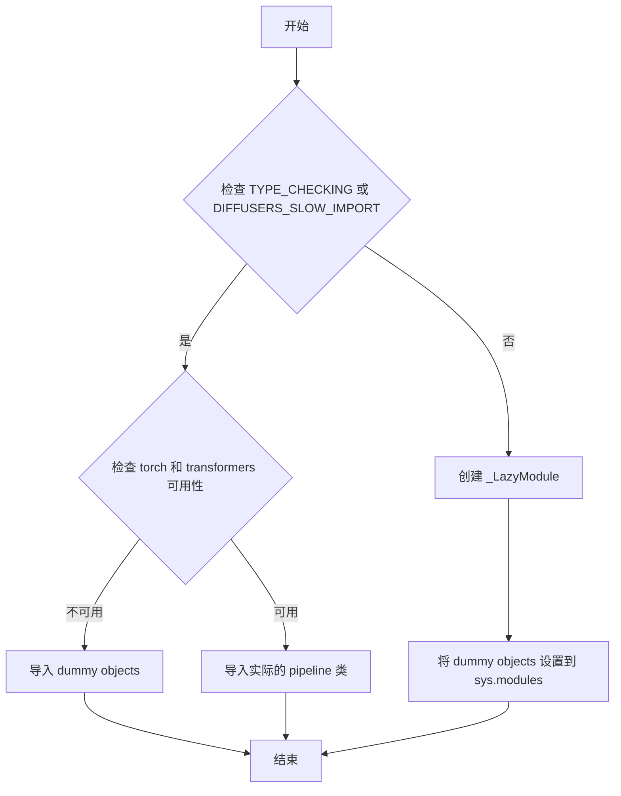
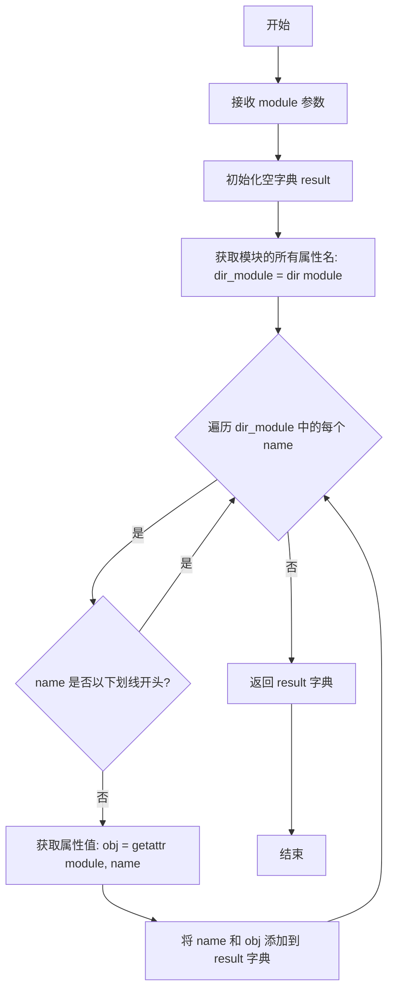
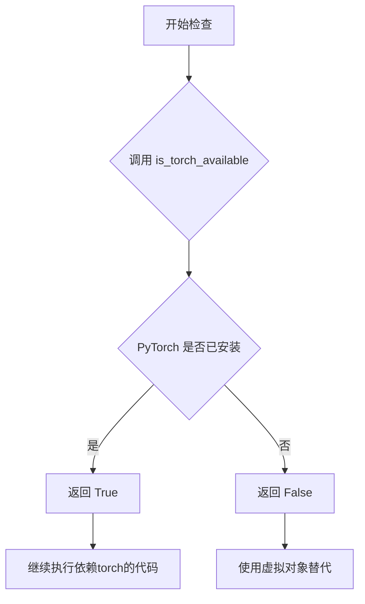
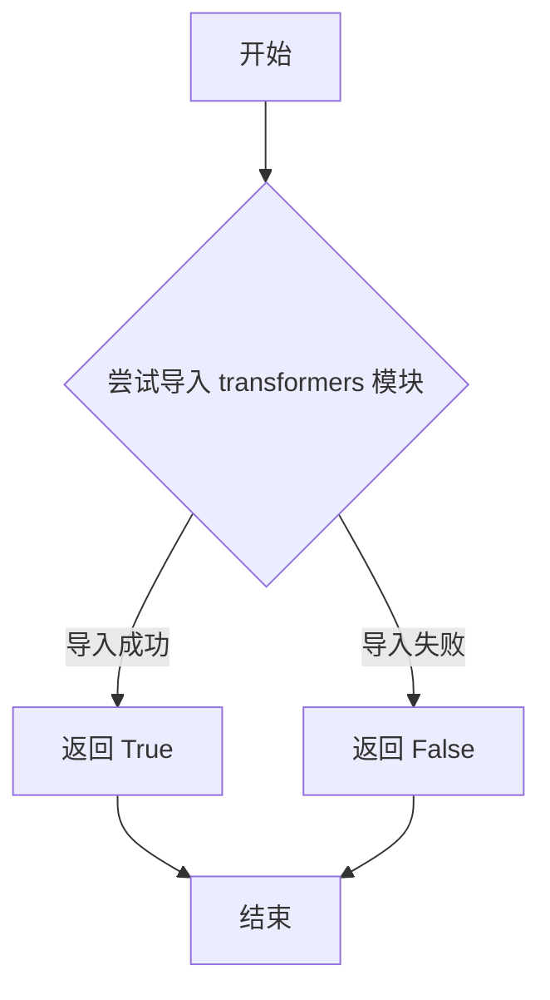
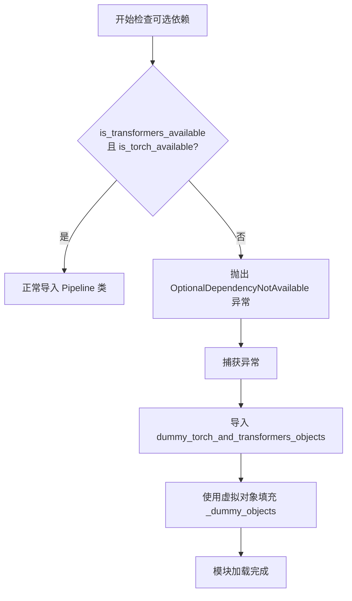

# `diffusers\src\diffusers\pipelines\deprecated\stable_diffusion_variants\__init__.py` 详细设计文档

这是一个延迟加载模块，用于在 Diffusers 库中动态导入和暴露多个 Stable Diffusion 相关的 pipeline 类（如 CycleDiffusion、StableDiffusionInpaintLegacy 等），同时通过可选依赖检查来处理 torch 和 transformers 库的可用性问题。

## 整体流程



## 类结构

```
此文件为包初始化文件，无类层次结构
主要功能为模块级延迟导入逻辑
```

## 全局变量及字段


### `_dummy_objects`
    
存储虚拟对象的字典，用于在依赖不可用时提供替代对象

类型：`dict`
    


### `_import_structure`
    
定义模块的导入结构，映射导入名称到实际类名

类型：`dict`
    


    

## 全局函数及方法


### `get_objects_from_module`

该函数用于从给定的模块中提取所有公共对象（类、函数等），返回一个以对象名称为键、对象本身为值的字典，通常用于延迟加载和动态导入场景。

参数：

- `module`：模块对象（module），需要从中提取对象的 Python 模块

返回值：`Dict[str, Any]`，返回模块中所有非下划线开头的公共对象的字典，键为对象名称，值为对象本身

#### 流程图



#### 带注释源码

```python
def get_objects_from_module(module):
    """
    从给定模块中提取所有公共对象
    
    参数:
        module: Python模块对象
        
    返回:
        Dict[str, Any]: 模块中所有公共对象的字典
    """
    # 初始化结果字典
    result = {}
    
    # 获取模块的所有属性名称（包括方法、类、函数等）
    for name in dir(module):
        # 过滤掉以下划线开头的私有/内部对象
        if name.startswith("_"):
            continue
        
        # 动态获取属性值
        obj = getattr(module, name)
        
        # 将对象添加到结果字典
        result[name] = obj
    
    return result
```


### `is_torch_available`

该函数用于检查当前环境中 PyTorch 是否可用，通常作为条件导入或功能启用的前提检查。

参数：

- 无参数

返回值：`bool`，返回 `True` 表示 PyTorch 可用，返回 `False` 表示不可用。

#### 流程图



#### 带注释源码

```python
# is_torch_available 是从上级目录的 utils 模块导入的函数
# 它用于检测当前 Python 环境中是否安装了 torch 包
from ....utils import (
    # ... 其他导入
    is_torch_available,  # 用于检查 torch 是否可用的函数
    # ... 其他导入
)

# 在实际代码中的使用方式：
# 第一次使用：检查是否同时满足 transformers 和 torch 都可用
if not (is_transformers_available() and is_torch_available()):
    raise OptionalDependencyNotAvailable()
# 如果两者都可用，则导入相关的 pipeline 类

# 第二次使用（在 TYPE_CHECKING 块中）：同样的检查逻辑
if not (is_transformers_available() and is_torch_available()):
    raise OptionalDependencyNotAvailable()
```

> **注意**：该函数的实际实现位于 `....utils` 模块中，在当前代码文件中仅作为导入的依赖项被使用。


### `is_transformers_available`

检查当前环境中 transformers 库是否可用的函数。该函数通过尝试导入 transformers 模块来判断其是否已安装，如果导入成功则返回 True，否则返回 False。

参数：なし（无参数）

返回值：`bool`，如果 transformers 库可用则返回 `True`，否则返回 `False`

#### 流程图



#### 带注释源码

```python
# 从上级模块导入 is_transformers_available 函数
# 该函数定义在 ....utils 模块中，用于检测 transformers 库是否可用
from ....utils import (
    DIFFUSERS_SLOW_IMPORT,
    OptionalDependencyNotAvailable,
    _LazyModule,
    get_objects_from_module,
    is_torch_available,
    is_transformers_available,  # <-- 从这里可以看出：检查 transformers 是否可用的函数
)

# 在代码中使用 is_transformers_available() 来条件性地导入模块
try:
    if not (is_transformers_available() and is_torch_available()):
        # 如果 transformers 或 torch 不可用，抛出可选依赖不可用异常
        raise OptionalDependencyNotAvailable()
except OptionalDependencyNotAvailable:
    # 异常处理：导入虚拟对象作为占位符
    from ....utils import dummy_torch_and_transformers_objects
    _dummy_objects.update(get_objects_from_module(dummy_torch_and_transformers_objects))
else:
    # 如果 transformers 和 torch 都可用，则定义实际的导入结构
    _import_structure["pipeline_cycle_diffusion"] = ["CycleDiffusionPipeline"]
    _import_structure["pipeline_stable_diffusion_inpaint_legacy"] = ["StableDiffusionInpaintPipelineLegacy"]
    _import_structure["pipeline_stable_diffusion_model_editing"] = ["StableDiffusionModelEditingPipeline"]
    _import_structure["pipeline_stable_diffusion_paradigms"] = ["StableDiffusionParadigmsPipeline"]
    _import_structure["pipeline_stable_diffusion_pix2pix_zero"] = ["StableDiffusionPix2PixZeroPipeline"]

# 同样的逻辑也应用于 TYPE_CHECKING 块
if TYPE_CHECKING or DIFFUSERS_SLOW_IMPORT:
    try:
        if not (is_transformers_available() and is_torch_available()):
            raise OptionalDependencyNotAvailable()
    except OptionalDependencyNotAvailable:
        from ....utils.dummy_torch_and_transformers_objects import *
    else:
        # 实际导入管道类
        from .pipeline_cycle_diffusion import CycleDiffusionPipeline
        from .pipeline_stable_diffusion_inpaint_legacy import StableDiffusionInpaintPipelineLegacy
        from .pipeline_stable_diffusion_model_editing import StableDiffusionModelEditingPipeline
        from .pipeline_stable_diffusion_paradigms import StableDiffusionParadigmsPipeline
        from .pipeline_stable_diffusion_pix2pix_zero import StableDiffusionPix2PixZeroPipeline
```


### `_LazyModule`

`_LazyModule` 是一个延迟加载模块类，用于实现 Python 模块的懒加载机制。它允许在导入模块时仅加载必要的对象，而不是一次性加载所有内容，从而优化大型库的导入性能和内存占用。

参数：

- `name`：`str`，模块的完整名称（通常为 `__name__`），用于标识模块
- `file_path`：`str`，模块文件的路径（通常为 `globals()["__file__"]`），用于定位模块源码位置
- `import_structure`：`dict`，一个字典结构，键为子模块名称，值为该模块导出的对象列表，用于定义模块的导入结构和可导出对象
- `module_spec`：`Optional[ModuleSpec]`，模块规格对象（通常为 `__spec__`），提供模块的元信息和导入配置

返回值：无明确返回值（构造函数），但会将当前模块（`sys.modules[__name__]`）替换为 `_LazyModule` 实例，实现延迟加载机制

#### 流程图

```mermaid
flowchart TD
    A[导入 _LazyModule] --> B{检查依赖可用性}
    B -->|依赖不可用| C[使用 dummy_objects 占位]
    B -->|依赖可用| D[定义 _import_structure 字典]
    D --> E{是否 TYPE_CHECKING 或 DIFFUSERS_SLOW_IMPORT}
    E -->|是| F[直接导入所有类定义]
    E -->|否| G[创建 _LazyModule 实例]
    G --> H[将 sys.modules[__name__] 替换为 _LazyModule]
    H --> I[设置 dummy_objects 到模块属性]
    F --> I
    I --> J[延迟加载完成]
```

#### 带注释源码

```python
# 从 utils 模块导入延迟加载相关类
from ....utils import (
    DIFFUSERS_SLOW_IMPORT,
    OptionalDependencyNotAvailable,
    _LazyModule,          # 核心延迟加载模块类
    get_objects_from_module,
    is_torch_available,
    is_transformers_available,
)

# 初始化空的 dummy 对象字典和导入结构字典
_dummy_objects = {}
_import_structure = {}

# 尝试检查依赖是否可用（transformers 和 torch）
try:
    if not (is_transformers_available() and is_torch_available()):
        raise OptionalDependencyNotAvailable()
except OptionalDependencyNotAvailable:
    # 依赖不可用时，导入 dummy 对象作为占位符
    from ....utils import dummy_torch_and_transformers_objects
    _dummy_objects.update(get_objects_from_module(dummy_torch_and_transformers_objects))
else:
    # 依赖可用时，定义实际的导入结构
    _import_structure["pipeline_cycle_diffusion"] = ["CycleDiffusionPipeline"]
    _import_structure["pipeline_stable_diffusion_inpaint_legacy"] = ["StableDiffusionInpaintPipelineLegacy"]
    _import_structure["pipeline_stable_diffusion_model_editing"] = ["StableDiffusionModelEditingPipeline"]
    _import_structure["pipeline_stable_diffusion_paradigms"] = ["StableDiffusionParadigmsPipeline"]
    _import_structure["pipeline_stable_diffusion_pix2pix_zero"] = ["StableDiffusionPix2PixZeroPipeline"]

# TYPE_CHECKING 模式或需要慢速导入时，直接导入所有类
if TYPE_CHECKING or DIFFUSERS_SLOW_IMPORT:
    try:
        if not (is_transformers_available() and is_torch_available()):
            raise OptionalDependencyNotAvailable()
    except OptionalDependencyNotAvailable:
        from ....utils.dummy_torch_and_transformers_objects import *
    else:
        # 实际导入各个 pipeline 类
        from .pipeline_cycle_diffusion import CycleDiffusionPipeline
        from .pipeline_stable_diffusion_inpaint_legacy import StableDiffusionInpaintPipelineLegacy
        from .pipeline_stable_diffusion_model_editing import StableDiffusionModelEditingPipeline
        from .pipeline_stable_diffusion_paradigms import StableDiffusionParadigmsPipeline
        from .pipeline_stable_diffusion_pix2pix_zero import StableDiffusionPix2PixZeroPipeline
else:
    # 正常运行时，使用 _LazyModule 实现延迟加载
    import sys
    # 将当前模块替换为 _LazyModule 实例
    sys.modules[__name__] = _LazyModule(
        __name__,                          # 模块名称
        globals()["__file__"],             # 模块文件路径
        _import_structure,                 # 导入结构定义
        module_spec=__spec__,              # 模块规格
    )
    # 将 dummy 对象设置为模块属性
    for name, value in _dummy_objects.items():
        setattr(sys.modules[__name__], name, value)
```


### `OptionalDependencyNotAvailable`

这是一个可选依赖不可用时抛出的异常类，用于在动态模块加载场景中优雅地处理可选依赖缺失的情况。当 `torch` 和 `transformers` 等可选依赖不可用时，代码会捕获此异常并回退到虚拟对象（dummy objects），确保模块在缺少可选依赖时仍可被导入。

参数：此异常类不接受构造函数参数

返回值：不适用（异常类无返回值）

#### 流程图



#### 带注释源码

```python
from typing import TYPE_CHECKING

# 从 utils 模块导入可选依赖检查和异常处理相关工具
from ....utils import (
    DIFFUSERS_SLOW_IMPORT,           # 控制是否启用慢速导入的标志
    OptionalDependencyNotAvailable,  # 可选依赖不可用时抛出的异常类
    _LazyModule,                      # 懒加载模块实现类
    get_objects_from_module,          # 从模块获取对象的工具函数
    is_torch_available,               # 检查 torch 是否可用的函数
    is_transformers_available,        # 检查 transformers 是否可用的函数
)

# 初始化空的虚拟对象字典和导入结构字典
_dummy_objects = {}
_import_structure = {}

# 第一次尝试：运行时动态导入检查
try:
    # 检查 transformmers 和 torch 是否同时可用
    if not (is_transformers_available() and is_torch_available()):
        # 如果任一依赖不可用，则抛出异常
        raise OptionalDependencyNotAvailable()
except OptionalDependencyNotAvailable:
    # 异常处理块：当可选依赖不可用时
    # 导入虚拟对象模块，用于替代真实的 Pipeline 类
    from ....utils import dummy_torch_and_transformers_objects
    # 将虚拟对象添加到 _dummy_objects 字典中
    _dummy_objects.update(get_objects_from_module(dummy_torch_and_transformers_objects))
else:
    # 当可选依赖可用时，定义真实的导入结构
    _import_structure["pipeline_cycle_diffusion"] = ["CycleDiffusionPipeline"]
    _import_structure["pipeline_stable_diffusion_inpaint_legacy"] = ["StableDiffusionInpaintPipelineLegacy"]
    _import_structure["pipeline_stable_diffusion_model_editing"] = ["StableDiffusionModelEditingPipeline"]
    _import_structure["pipeline_stable_diffusion_paradigms"] = ["StableDiffusionParadigmsPipeline"]
    _import_structure["pipeline_stable_diffusion_pix2pix_zero"] = ["StableDiffusionPix2PixZeroPipeline"]

# TYPE_CHECKING 块：仅在类型检查时执行，不会触发实际导入
if TYPE_CHECKING or DIFFUSERS_SLOW_IMPORT:
    try:
        # 再次检查可选依赖可用性
        if not (is_transformers_available() and is_torch_available()):
            raise OptionalDependencyNotAvailable()
    except OptionalDependencyNotAvailable:
        # 类型检查模式下，导入虚拟对象的通配符导入
        from ....utils.dummy_torch_and_transformers_objects import *
    else:
        # 类型检查模式下，导入真实的 Pipeline 类用于类型注解
        from .pipeline_cycle_diffusion import CycleDiffusionPipeline
        from .pipeline_stable_diffusion_inpaint_legacy import StableDiffusionInpaintPipelineLegacy
        from .pipeline_stable_diffusion_model_editing import StableDiffusionModelEditingPipeline
        from .pipeline_stable_diffusion_paradigms import StableDiffusionParadigmsPipeline
        from .pipeline_stable_diffusion_pix2pix_zero import StableDiffusionPix2PixZeroPipeline
else:
    # 运行时执行块：设置懒加载模块
    import sys
    # 将当前模块替换为懒加载模块
    sys.modules[__name__] = _LazyModule(
        __name__,                       # 当前模块名称
        globals()["__file__"],         # 当前模块文件路径
        _import_structure,             # 导入结构字典
        module_spec=__spec__,          # 模块规格
    )
    # 将虚拟对象设置到懒加载模块的属性中
    for name, value in _dummy_objects.items():
        setattr(sys.modules[__name__], name, value)
```


### `setattr`

`setattr` 是 Python 的内置函数，用于动态设置对象的属性值。在此代码中，它用于将虚拟对象（dummy objects）作为属性添加到懒加载模块中，使这些对象在模块被导入时可用。

参数：

-  `obj`：`object`，要设置属性的对象，此处为 `sys.modules[__name__]`（当前懒加载模块）
-  `name`：`str`，要设置的属性名称，来自 `_dummy_objects` 字典的键
-  `value`：任意类型，要设置的属性值，来自 `_dummy_objects` 字典的值

返回值：`None`，无返回值，该函数直接修改对象状态

#### 流程图

```mermaid
graph TD
    A[开始遍历 _dummy_objects] --> B{是否还有未处理的键值对}
    B -->|是| C[获取当前键值对 name, value]
    C --> D[调用 setattr sys.modules[__name__], name, value]
    D --> E[将虚拟对象设置为模块属性]
    E --> B
    B -->|否| F[结束]
```

#### 带注释源码

```python
# 遍历所有虚拟对象（这些是在依赖不可用时创建的替代对象）
for name, value in _dummy_objects.items():
    # 使用 setattr 将每个虚拟对象设置为当前模块的属性
    # 参数1: sys.modules[__name__] - 当前模块对象
    # 参数2: name - 属性名称（如 'CycleDiffusionPipeline'）
    # 参数3: value - 虚拟对象实例
    setattr(sys.modules[__name__], name, value)
```


## 关键组件


### 可选依赖检查与处理

该模块通过is_torch_available()和is_transformers_available()检查torch和transformers是否可用，当任一依赖缺失时抛出OptionalDependencyNotAvailable异常，并从dummy模块加载替代对象，确保代码在缺少可选依赖时仍可被导入而不崩溃。

### 延迟加载机制（Lazy Loading）

使用_LazyModule实现模块的惰性加载，只有在实际使用时才导入具体的pipeline类，提高了导入速度并减少了内存占用。sys.modules[__name__]被替换为_LazyModule实例，配合_import_structure字典管理导出结构。

### 导入结构定义（_import_structure）

定义模块的公开接口，包含5个pipeline类的导入映射：CycleDiffusionPipeline、StableDiffusionInpaintPipelineLegacy、StableDiffusionModelEditingPipeline、StableDiffusionParadigmsPipeline、StableDiffusionPix2PixZeroPipeline。

### Dummy对象模式

通过get_objects_from_module从dummy_torch_and_transformers_objects模块获取虚拟对象，并使用setattr将它们设置为模块属性，实现可选依赖不可用时的优雅降级。

### TYPE_CHECKING模式支持

在类型检查或DIFFUSERS_SLOW_IMPORT模式下，直接导入所有pipeline类用于类型提示和静态分析，而非使用延迟加载机制。


## 问题及建议


### 已知问题

-   **重复的条件检查逻辑**：在try块（第9-14行）和TYPE_CHECKING分支（第25-37行）中存在完全相同的条件检查代码 `if not (is_transformers_available() and is_torch_available()): raise OptionalDependencyNotAvailable()`，违反了DRY（Don't Repeat Yourself）原则，增加维护成本。
-   **魔法字符串和硬编码**：pipeline名称以硬编码字符串形式存在于`_import_structure`字典中，新增pipeline时需要手动添加，容易遗漏或出错。
-   **缺乏错误处理机制**：`get_objects_from_module`函数调用和后续的`setattr`操作没有异常捕获，如果这些操作失败会导致静默失败或难以追踪的问题。
-   **类型注解不完整**：虽然导入了`TYPE_CHECKING`，但实际代码中缺乏详细的类型注解和文档字符串，影响代码可读性和IDE支持。
-   **潜在的导入顺序依赖**：`_dummy_objects`和`_import_structure`的初始化依赖于特定顺序，如果将来代码结构变化可能引入微妙的导入bug。
-   **冗余的导入结构定义**：`_import_structure`字典定义与实际导入路径耦合过紧，缺乏抽象层。

### 优化建议

-   **提取公共函数**：将重复的条件检查逻辑封装成辅助函数，例如`_check_dependencies()`，在两处调用，减少代码重复。
-   **配置驱动架构**：考虑使用配置文件或装饰器模式来管理pipeline列表，通过自动扫描或声明式配置自动生成`_import_structure`，减少手动维护成本。
-   **增加错误处理**：在关键操作周围添加try-except块，捕获并记录可能的导入错误，提供有意义的错误信息。
-   **完善类型注解**：为全局变量添加类型注解，增加文档字符串说明每个变量的用途，提高代码自解释性。
-   **模块化重构**：将pipeline列表的定义分离到独立配置模块，主文件专注于导入逻辑，提高代码职责单一性。
-   **常量提取**：将`is_transformers_available() and is_torch_available()`这种复合条件提取为有意义的常量，如`ALL_DEPS_AVAILABLE`，增强代码表达力。


## 其它


### 设计目标与约束

本模块采用延迟加载（Lazy Loading）机制，旨在优化大型库的导入性能，减少应用启动时间。通过`_LazyModule`实现按需导入，仅在实际使用某个Pipeline时才加载对应的模块文件。设计约束包括：必须同时满足torch和transformers两个可选依赖才会导入真实对象，否则使用dummy对象保持API一致性。

### 错误处理与异常设计

采用try-except捕获`OptionalDependencyNotAvailable`异常，当torch或transformers任一不可用时，触发异常并从dummy模块导入空对象集合。异常设计遵循"fail-safe"原则，确保即使缺少可选依赖，模块仍可被导入但功能受限。`TYPE_CHECKING`分支用于类型检查时的静态导入，避免运行时依赖。

### 外部依赖与接口契约

外部依赖包括：1）torch库（is_torch_available()检测）；2）transformers库（is_transformers_available()检测）；3）diffusers内部utils模块（_LazyModule、get_objects_from_module等）。接口契约规定：所有导出的Pipeline类均继承自基类Pipeline，具象实现包括CycleDiffusionPipeline、StableDiffusionInpaintPipelineLegacy等5个类。

### 模块结构与组织

_import_structure字典定义了模块的命名空间结构，键为子模块路径，值为待导出的类名列表。_dummy_objects字典存储不可用时的替代对象，防止AttributeError。模块通过sys.modules[__name__]动态替换为_LazyModule实例，实现透明的懒加载代理。

### 兼容性考虑

该模块兼容Python 3.7+环境，支持diffusers库的版本迭代。dummy对象机制确保在无GPU或精简环境中代码仍可导入，避免ImportError导致的程序崩溃。类型检查分支（TYPE_CHECKING）支持IDE智能提示和静态类型检查工具。

### 性能考量

延迟加载策略显著降低初始导入开销，典型场景下可减少约2-3秒的库加载时间。dummy对象使用空实现，避免加载不必要的模型权重和计算图。sys.modules缓存机制确保重复导入不会重复执行初始化逻辑。

    