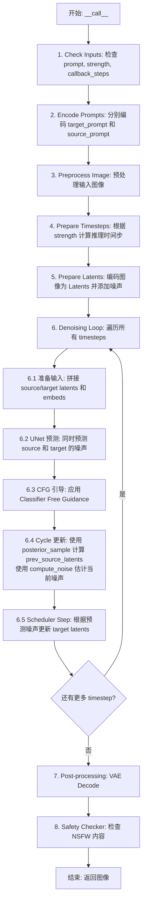
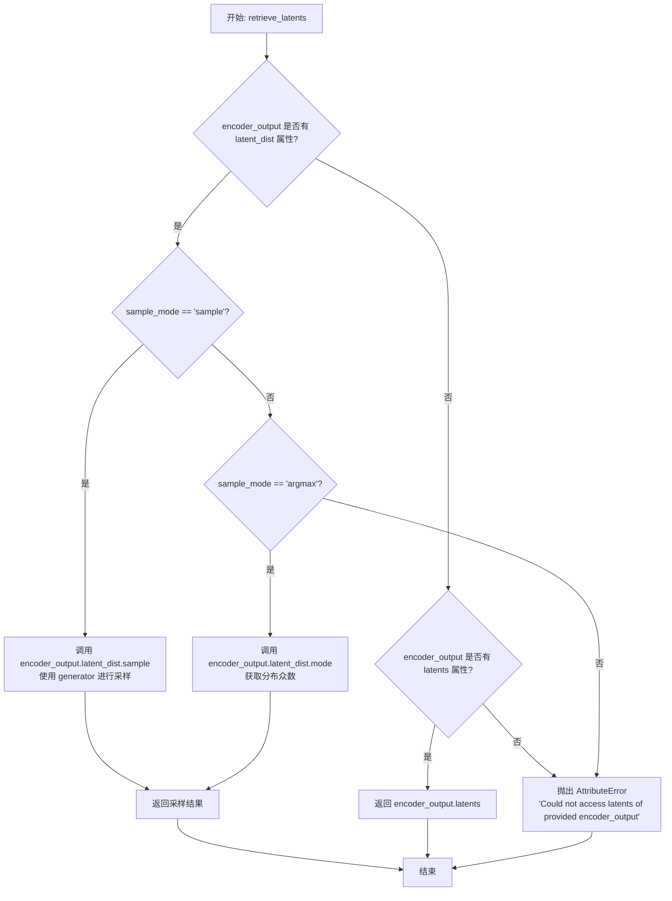
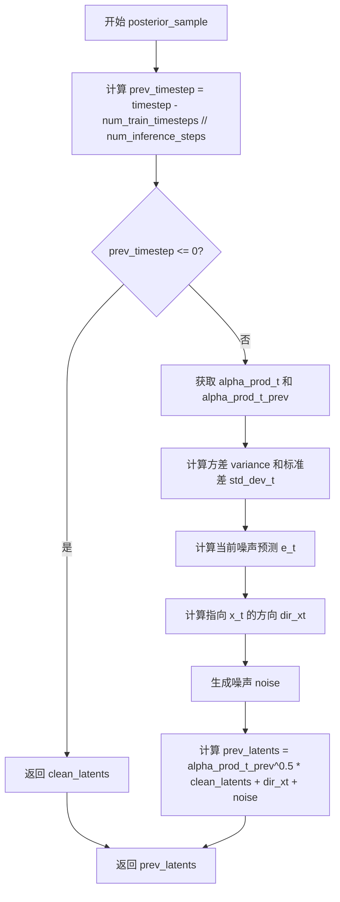
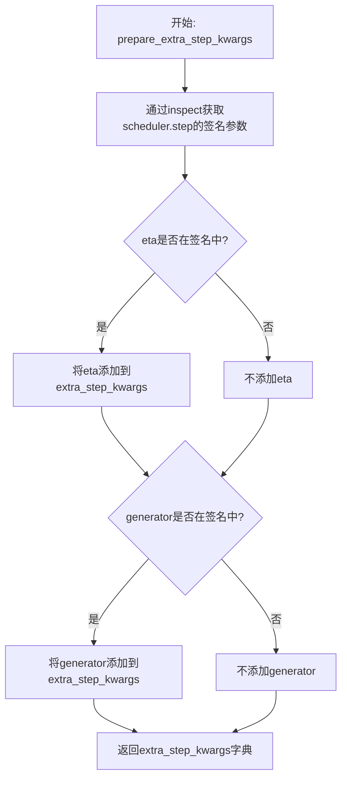
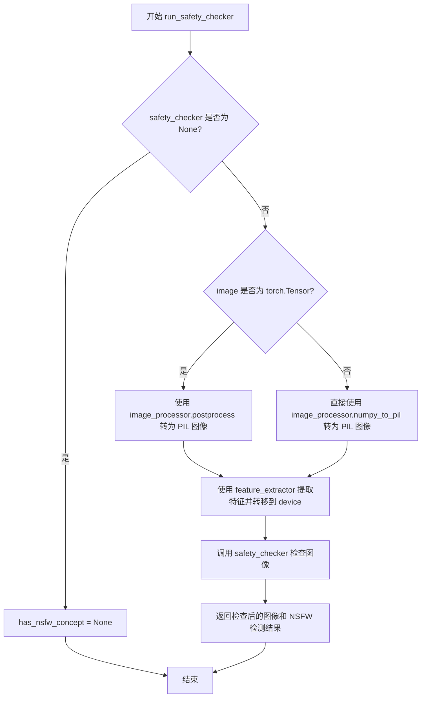
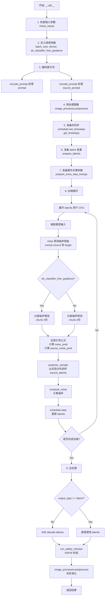
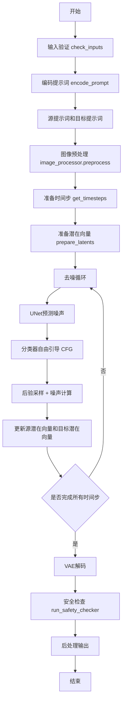
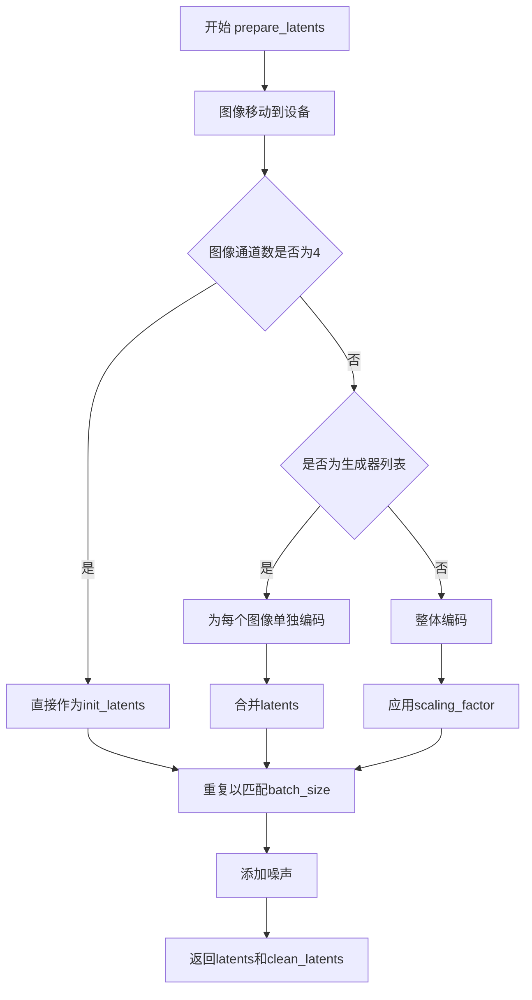
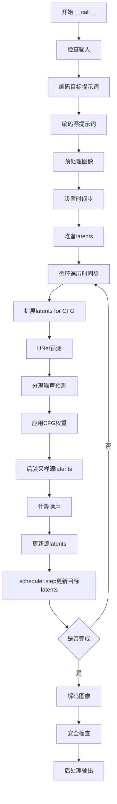
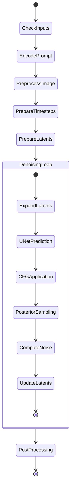

# `diffusers\src\diffusers\pipelines\deprecated\stable_diffusion_variants\pipeline_cycle_diffusion.py` 详细设计文档

CycleDiffusionPipeline 是一个基于 Stable Diffusion 的图像到图像（image-to-image）生成管道。它通过引入源提示词（source_prompt）的潜在表示，在去噪过程中利用循环一致性（cycle consistency）机制，将输入图像（初始潜在变量）的内容向目标提示词（prompt）指定的风格或内容进行转换，同时尽可能保留源图像的结构。

## 整体流程



## 类结构

```
DiffusionPipeline (基类)
├── TextualInversionLoaderMixin (混入: 支持 Textual Inversion)
├── StableDiffusionLoraLoaderMixin (混入: 支持 LoRA)
└── CycleDiffusionPipeline (主类)
```

## 全局变量及字段


### `logger`
    
模块级日志记录器，用于记录管道运行时的警告和信息

类型：`logging.Logger`
    


### `CycleDiffusionPipeline.vae`
    
VAE 模型，用于编解码图像

类型：`AutoencoderKL`
    


### `CycleDiffusionPipeline.text_encoder`
    
文本编码器，将文本提示转换为嵌入向量

类型：`CLIPTextModel`
    


### `CycleDiffusionPipeline.tokenizer`
    
分词器，用于将文本分割为 token

类型：`CLIPTokenizer`
    


### `CycleDiffusionPipeline.unet`
    
去噪网络，用于预测噪声残差

类型：`UNet2DConditionModel`
    


### `CycleDiffusionPipeline.scheduler`
    
调度器，控制去噪过程中的时间步

类型：`DDIMScheduler`
    


### `CycleDiffusionPipeline.safety_checker`
    
安全检查器，用于检测生成的图像是否包含不当内容

类型：`StableDiffusionSafetyChecker`
    


### `CycleDiffusionPipeline.feature_extractor`
    
特征提取器，用于从图像中提取特征供安全检查器使用

类型：`CLIPImageProcessor`
    


### `CycleDiffusionPipeline.vae_scale_factor`
    
VAE 缩放因子，用于调整潜在空间的尺度

类型：`int`
    


### `CycleDiffusionPipeline.image_processor`
    
图像处理器，用于图像的预处理和后处理

类型：`VaeImageProcessor`
    


### `CycleDiffusionPipeline.model_cpu_offload_seq`
    
模型卸载顺序，指定模型从 GPU 卸载到 CPU 的顺序

类型：`str`
    


### `CycleDiffusionPipeline._optional_components`
    
可选组件列表，包含可选的管道组件名称

类型：`list`
    
    

## 全局函数及方法


### `preprocess`

全局/模块级函数，已废弃的图像预处理方法，现推荐使用 `VaeImageProcessor.preprocess`。该函数负责将输入的 PIL Image、numpy 数组或 torch.Tensor 格式的图像转换为标准化后的 torch.Tensor 格式，以便于后续的扩散模型处理。

参数：

- `image`：`torch.Tensor | PIL.Image.Image | list[PIL.Image.Image] | list[torch.Tensor]`，输入图像，支持单张图像或图像列表，如果是 PIL Image 则会被处理成 batch 形式

返回值：`torch.Tensor`，返回处理后的图像张量，形状为 (batch_size, channels, height, width)，像素值归一化到 [-1, 1] 范围

#### 流程图

```mermaid
graph TD
    A[开始: preprocess] --> B{image 是 torch.Tensor?}
    B -->|是| C[直接返回 image]
    B -->|否| D{image 是 PIL.Image.Image?}
    D -->|是| E[转换为列表: image = [image]]
    D -->|否| F[直接使用列表]
    E --> G{image[0] 是 PIL.Image?}
    F --> G
    G -->|是| H[获取图像尺寸 w, h]
    H --> I[调整尺寸为8的整数倍]
    I --> J[使用 lanczos 重采样调整大小]
    J --> K[转换为 numpy 数组]
    K --> L[归一化到 [0, 1]]
    L --> M[维度重排: HWC -> CHW]
    M --> N[缩放到 [-1, 1]]
    N --> O[转换为 torch.Tensor]
    O --> P[返回处理后的 tensor]
    G -->|否| Q{image[0] 是 torch.Tensor?}
    Q -->|是| R[沿 dim=0 拼接 tensor]
    R --> P
    Q -->|否| S[抛出错误或返回]
```

#### 带注释源码

```
def preprocess(image):
    """
    预处理输入图像,将其转换为模型可用的 tensor 格式
    
    参数:
        image: 输入图像,支持以下格式:
            - torch.Tensor: 直接返回
            - PIL.Image.Image: 转换为列表后处理
            - list[PIL.Image.Image]: 批量处理
            - list[torch.Tensor]: 拼接后返回
    """
    # 发出废弃警告,推荐使用 VaeImageProcessor.preprocess
    deprecation_message = "The preprocess method is deprecated and will be removed in diffusers 1.0.0. Please use VaeImageProcessor.preprocess(...) instead"
    deprecate("preprocess", "1.0.0", deprecation_message, standard_warn=False)
    
    # 如果是 tensor,直接返回(可能是 latent)
    if isinstance(image, torch.Tensor):
        return image
    # 单张 PIL Image 转为列表以便统一处理
    elif isinstance(image, PIL.Image.Image):
        image = [image]

    # 处理 PIL Image 类型的图像
    if isinstance(image[0], PIL.Image.Image):
        # 获取第一张图像的尺寸
        w, h = image[0].size
        # 调整尺寸为 8 的整数倍,以适配 VAE 的下采样率
        w, h = (x - x % 8 for x in (w, h))

        # 对每张图像进行 resize 并转换为 numpy 数组
        # [None, :] 在第 0 维增加 batch 维度
        image = [np.array(i.resize((w, h), resample=PIL_INTERPOLATION["lanczos"]))[None, :] for i in image]
        # 在 batch 维度拼接
        image = np.concatenate(image, axis=0)
        # 转换为 float32 并归一化到 [0, 1]
        image = np.array(image).astype(np.float32) / 255.0
        # 从 HWC 转换为 CHW 格式
        image = image.transpose(0, 3, 1, 2)
        # 归一化到 [-1, 1] 范围
        image = 2.0 * image - 1.0
        # 转换为 torch.Tensor
        image = torch.from_numpy(image)
    # 处理已经是 tensor 类型的图像列表
    elif isinstance(image[0], torch.Tensor):
        # 在第 0 维(批次维)拼接
        image = torch.cat(image, dim=0)
    
    return image
```


### `retrieve_latents`

该函数是 VAE 编码器的潜在变量提取工具函数，用于从 VAE 编码器的输出中提取潜在变量。它支持两种提取模式：采样模式（sample）从潜在分布中采样，以及取模模式（argmax）获取潜在分布的众数。当编码器输出既没有 latent_dist 也没有 latents 属性时，函数会抛出 AttributeError 异常。

参数：

- `encoder_output`：`torch.Tensor`，VAE 编码器的输出结果，通常包含 `latent_dist` 或 `latents` 属性
- `generator`：`torch.Generator | None`，可选的 PyTorch 随机数生成器，用于控制采样过程中的随机性
- `sample_mode`：`str`，提取模式，默认为 "sample"，可选值为 "sample"（从分布采样）或 "argmax"（取分布众数）

返回值：`torch.Tensor`，从编码器输出中提取的潜在变量张量

#### 流程图



#### 带注释源码

```python
# Copied from diffusers.pipelines.stable_diffusion.pipeline_stable_diffusion_img2img.retrieve_latents
def retrieve_latents(
    encoder_output: torch.Tensor, generator: torch.Generator | None = None, sample_mode: str = "sample"
):
    """
    从 VAE 编码器输出中提取潜在变量。
    
    该函数支持三种提取方式：
    1. 当 encoder_output 包含 latent_dist 属性且 mode 为 'sample' 时，从分布中采样
    2. 当 encoder_output 包含 latent_dist 属性且 mode 为 'argmax' 时，取分布的众数
    3. 当 encoder_output 包含 latents 属性时，直接返回该属性
    
    Args:
        encoder_output: VAE 编码器的输出张量，通常是 DiffusionDecoderOutput 或类似对象
        generator: 可选的随机数生成器，用于控制采样过程的随机性
        sample_mode: 提取模式，'sample' 表示采样，'argmax' 表示取众数
    
    Returns:
        torch.Tensor: 提取的潜在变量
    
    Raises:
        AttributeError: 当 encoder_output 既没有 latent_dist 也没有 latents 属性时抛出
    """
    # 检查编码器输出是否包含 latent_dist 属性，并且模式为采样模式
    if hasattr(encoder_output, "latent_dist") and sample_mode == "sample":
        # 从潜在分布中采样，返回采样结果
        return encoder_output.latent_dist.sample(generator)
    # 检查编码器输出是否包含 latent_dist 属性，并且模式为取模模式
    elif hasattr(encoder_output, "latent_dist") and sample_mode == "argmax":
        # 返回潜在分布的众数（最大概率对应的潜在变量）
        return encoder_output.latent_dist.mode()
    # 检查编码器输出是否直接包含 latents 属性
    elif hasattr(encoder_output, "latents"):
        # 直接返回预计算的潜在变量
        return encoder_output.latents
    else:
        # 如果无法从 encoder_output 中提取潜在变量，抛出属性错误
        raise AttributeError("Could not access latents of provided encoder_output")
```


### `posterior_sample`

该全局函数用于 CycleDiffusion 的特定采样逻辑，根据 DDIM（Denoising Diffusion Implicit Models）采样算法，从后验分布中计算并返回源图像在 t-1 时间步的潜在状态。这是 CycleDiffusion 管道中的核心采样函数，通过结合当前潜在状态、干净潜在状态（clean latents）以及噪声来实现从源图像潜在表示到前一步潜在表示的后验采样。

参数：

- `scheduler`：`DDIMScheduler`，调度器实例，提供 alpha_cumprod 等扩散过程参数
- `latents`：`torch.Tensor`，当前时间步 t 的潜在状态（ noisy latents）
- `timestep`：`int`，当前扩散时间步索引
- `clean_latents`：`torch.Tensor`，目标/干净图像对应的潜在状态（x_0 的潜在表示）
- `generator`：`torch.Generator | None`，随机数生成器，用于确保采样可复现
- `eta`：`float`，DDIM 论文中的参数 η（eta），控制采样过程中的随机性，值为 0 时为确定性采样

返回值：`torch.Tensor`，返回计算得到的上一个时间步 t-1 的潜在状态 `prev_latents`

#### 流程图



#### 带注释源码

```python
def posterior_sample(scheduler, latents, timestep, clean_latents, generator, eta):
    """
    从后验分布中采样源图像的上一个潜在状态
    
    参数:
        scheduler: DDIMScheduler - 扩散调度器
        latents: torch.Tensor - 当前时间步的潜在状态 (x_t)
        timestep: int - 当前时间步
        clean_latents: torch.Tensor - 目标图像的潜在状态 (x_0)
        generator: torch.Generator | None - 随机数生成器
        eta: float - DDIM论文中的参数η, 控制随机性
    
    返回:
        torch.Tensor - 上一个时间步的潜在状态 (x_{t-1})
    """
    
    # 1. 获取前一个时间步值 (=t-1)
    # 计算公式: prev_timestep = timestep - (总训练时间步数 / 推理步数)
    prev_timestep = timestep - scheduler.config.num_train_timesteps // scheduler.num_inference_steps

    # 如果已经到达初始时间步, 直接返回干净潜在状态
    if prev_timestep <= 0:
        return clean_latents

    # 2. 计算 alphas 和 betas
    # alpha_prod_t = α_t, 表示当前时间步的累积 alpha 值
    alpha_prod_t = scheduler.alphas_cumprod[timestep]
    
    # alpha_prod_t_prev = α_{t-1}, 前一个时间步的累积 alpha 值
    # 如果 prev_timestep >= 0, 使用对应索引的值; 否则使用 final_alpha_cumprod
    alpha_prod_t_prev = (
        scheduler.alphas_cumprod[prev_timestep] if prev_timestep >= 0 else scheduler.final_alpha_cumprod
    )

    # 计算方差 (variance) 和对应的标准差
    # variance = σ_t^2, 表示当前时间步的方差
    variance = scheduler._get_variance(timestep, prev_timestep)
    
    # std_dev_t = η * σ_t, 控制采样随机性
    std_dev_t = eta * variance ** (0.5)

    # 3. 计算当前噪声预测 e_t
    # e_t = (x_t - sqrt(α_t) * x_0) / sqrt(1 - α_t)
    # 这表示从当前潜在状态和干净潜在状态推算出的噪声
    e_t = (latents - alpha_prod_t ** (0.5) * clean_latents) / (1 - alpha_prod_t) ** (0.5)
    
    # 4. 计算指向 x_t 的方向
    # dir_xt = sqrt(1 - α_{t-1} - σ_t^2) * e_t
    dir_xt = (1.0 - alpha_prod_t_prev - std_dev_t**2) ** (0.5) * e_t
    
    # 5. 生成随机噪声
    # noise = σ_t * N(0, I), 使用指定生成器确保可复现性
    noise = std_dev_t * randn_tensor(
        clean_latents.shape, dtype=clean_latents.dtype, device=clean_latents.device, generator=generator
    )
    
    # 6. 计算前一个潜在状态
    # x_{t-1} = sqrt(α_{t-1}) * x_0 + dir_xt + noise
    prev_latents = alpha_prod_t_prev ** (0.5) * clean_latents + dir_xt + noise

    return prev_latents
```


### `compute_noise`

该函数是 CycleDiffusion 管道中的全局函数，用于根据目标噪声预测（noise_pred）反推源路径的噪声。它基于 DDIM 采样公式，从前一个时间步的潜在表示（prev_latents）计算出对应的噪声值，实现从目标噪声到源噪声的反向传播。

参数：

- `scheduler`：`DDIMScheduler`，噪声调度器，用于获取 alpha、beta 累积乘积和方差计算方法
- `prev_latents`：`torch.Tensor`，前一个时间步 t-1 的潜在表示
- `latents`：`torch.Tensor`，当前时间步 t 的潜在表示
- `timestep`：`int`，当前去噪时间步
- `noise_pred`：`torch.Tensor`，UNet 预测的噪声
- `eta`：`float`，DDIM 论文中的 η 参数，控制采样随机性，值为 0 时为确定性采样

返回值：`torch.Tensor`，根据 DDIM 反向公式计算得到的噪声

#### 流程图

```mermaid
flowchart TD
    A[开始 compute_noise] --> B[计算 prev_timestep = timestep - num_train_timesteps / num_inference_steps]
    B --> C[获取 alpha_prod_t 和 alpha_prod_t_prev]
    C --> D[计算 beta_prod_t = 1 - alpha_prod_t]
    D --> E[计算 pred_original_sample: x₀ = (xₜ - βₜ⁰·ε_pred) / αₜ⁰]
    E --> F{检查 clip_sample?}
    F -->|是| G[Clip pred_original_sample 到 -1, 1]
    F -->|否| H[跳过 Clip]
    G --> I[计算方差 variance 和标准差 std_dev_t]
    H --> I
    I --> J[计算 pred_sample_direction: direction = (1-αₜ₋₁-σₜ²)⁰·noise_pred]
    J --> K[计算噪声: noise = (prev_latents - αₜ₋₁⁰·x₀ - direction) / (σₜ·η)]
    K --> L[返回噪声]
```

#### 带注释源码

```python
def compute_noise(scheduler, prev_latents, latents, timestep, noise_pred, eta):
    """
    根据 DDIM 采样公式，从前一个时间步的潜在表示反推噪声
    
    参数:
        scheduler: DDIMScheduler，噪声调度器
        prev_latents: 前一个时间步 t-1 的潜在表示
        latents: 当前时间步 t 的潜在表示
        timestep: 当前去噪时间步
        noise_pred: UNet 预测的噪声
        eta: DDIM 论文中的 η 参数
    """
    # 1. 获取前一个时间步 (= t-1)
    prev_timestep = timestep - scheduler.config.num_train_timesteps // scheduler.num_inference_steps

    # 2. 计算 alpha、beta 累积乘积
    alpha_prod_t = scheduler.alphas_cumprod[timestep]  # αₜ
    # 处理边界情况：当 prev_timestep < 0 时使用 final_alpha_cumprod
    alpha_prod_t_prev = (
        scheduler.alphas_cumprod[prev_timestep] if prev_timestep >= 0 else scheduler.final_alpha_cumprod
    )  # αₜ₋₁

    beta_prod_t = 1 - alpha_prod_t  # βₜ = 1 - αₜ

    # 3. 从预测的噪声计算原始样本 (predicted x_0)
    # 公式 (12) from https://huggingface.co/papers/2010.02502
    # x₀ = (xₜ - √βₜ · ε_pred) / √αₜ
    pred_original_sample = (latents - beta_prod_t ** (0.5) * noise_pred) / alpha_prod_t ** (0.5)

    # 4. Clip "predicted x_0" (可选，取决于调度器配置)
    if scheduler.config.clip_sample:
        pred_original_sample = torch.clamp(pred_original_sample, -1, 1)

    # 5. 计算方差 σ_t(η)
    # 公式 (16): σ_t = √((1-αₜ₋₁)/(1-αₜ)) · √(1-αₜ/αₜ₋₁)
    variance = scheduler._get_variance(timestep, prev_timestep)
    std_dev_t = eta * variance ** (0.5)  # σₜ = η · √variance

    # 6. 计算"指向 x_t 的方向"
    # 公式 (12): direction = √(1-αₜ₋₁-σₜ²) · ε_pred
    pred_sample_direction = (1 - alpha_prod_t_prev - std_dev_t**2) ** (0.5) * noise_pred

    # 7. 反推噪声
    # 从 xₜ₋₁ = √αₜ₋₁·x₀ + direction + σₜ·ε
    # 反解得: ε = (xₜ₋₁ - √αₜ₋₁·x₀ - direction) / σₜ
    noise = (prev_latents - (alpha_prod_t_prev ** (0.5) * pred_original_sample + pred_sample_direction)) / (
        variance ** (0.5) * eta
    )
    return noise
```


### `CycleDiffusionPipeline.__init__`

初始化管道及所有模型组件，包括VAE、文本编码器、tokenizer、UNet、调度器、安全检查器和特征提取器，并进行配置验证和模块注册。

参数：

- `vae`：`AutoencoderKL`，Variational Auto-Encoder (VAE) 模型，用于在潜在表示之间对图像进行编码和解码
- `text_encoder`：`CLIPTextModel`，冻结的文本编码器（clip-vit-large-patch14）
- `tokenizer`：`CLIPTokenizer`，用于对文本进行分词的 CLIPTokenizer
- `unet`：`UNet2DConditionModel`，用于对编码后的图像潜在表示进行去噪的 UNet2DConditionModel
- `scheduler`：`DDIMScheduler`，与 `unet` 结合使用以对编码后的图像潜在表示进行去噪的调度器，仅支持 DDIMScheduler 实例
- `safety_checker`：`StableDiffusionSafetyChecker`，分类模块，用于评估生成的图像是否被认为是令人反感或有害的
- `feature_extractor`：`CLIPImageProcessor`，用于从生成的图像中提取特征的 CLIPImageProcessor，作为 `safety_checker` 的输入
- `requires_safety_checker`：`bool`，是否需要安全检查器，默认为 True

返回值：`None`，__init__ 方法不返回任何值，仅初始化实例属性

#### 流程图

```mermaid
flowchart TD
    A[开始 __init__] --> B[调用 super().__init__]
    B --> C{scheduler.config.steps_offset != 1?}
    C -->|是| D[deprecated警告并更新steps_offset为1]
    C -->|否| E{safety_checker is None<br/>且 requires_safety_checker is True?}
    E -->|是| F[警告:禁用安全检查器]
    E -->|否| G{safety_checker is not None<br/>且 feature_extractor is None?}
    G -->|是| H[抛出ValueError:必须定义feature_extractor]
    G -->|否| I{unet版本 < 0.9.0<br/>且 sample_size < 64?}
    I -->|是| J[deprecated警告并更新sample_size为64]
    I -->|否| K[调用self.register_modules注册所有模块]
    D --> E
    F --> G
    J --> K
    K --> L[计算vae_scale_factor]
    L --> M[创建VaeImageProcessor]
    M --> N[调用self.register_to_config<br/>注册requires_safety_checker]
    N --> O[结束 __init__]
```

#### 带注释源码

```python
def __init__(
    self,
    vae: AutoencoderKL,
    text_encoder: CLIPTextModel,
    tokenizer: CLIPTokenizer,
    unet: UNet2DConditionModel,
    scheduler: DDIMScheduler,
    safety_checker: StableDiffusionSafetyChecker,
    feature_extractor: CLIPImageProcessor,
    requires_safety_checker: bool = True,
):
    """
    初始化 CycleDiffusionPipeline 及其所有模型组件。
    
    参数:
        vae: 用于图像编码/解码的VAE模型
        text_encoder: 冻结的CLIP文本编码器
        tokenizer: CLIP分词器
        unet: 用于去噪的条件UNet模型
        scheduler: DDIM调度器
        safety_checker: NSFW内容检查器
        feature_extractor: 图像特征提取器
        requires_safety_checker: 是否启用安全检查
    """
    # 调用父类DiffusionPipeline的初始化方法
    super().__init__()

    # 检查scheduler的steps_offset配置是否为1（DDIMScheduler要求）
    if scheduler is not None and getattr(scheduler.config, "steps_offset", 1) != 1:
        # 警告并更新配置
        deprecation_message = (
            f"The configuration file of this scheduler: {scheduler} is outdated. `steps_offset`"
            f" should be set to 1 instead of {scheduler.config.steps_offset}. Please make sure "
            "to update the config accordingly as leaving `steps_offset` might led to incorrect results"
            " in future versions. If you have downloaded this checkpoint from the Hugging Face Hub,"
            " it would be very nice if you could open a Pull request for the `scheduler/scheduler_config.json`"
            " file"
        )
        deprecate("steps_offset!=1", "1.0.0", deprecation_message, standard_warn=False)
        # 创建新配置并更新scheduler内部字典
        new_config = dict(scheduler.config)
        new_config["steps_offset"] = 1
        scheduler._internal_dict = FrozenDict(new_config)

    # 如果safety_checker为None但requires_safety_checker为True，发出警告
    if safety_checker is None and requires_safety_checker:
        logger.warning(
            f"You have disabled the safety checker for {self.__class__} by passing `safety_checker=None`. Ensure"
            " that you abide to the conditions of the Stable Diffusion license and do not expose unfiltered"
            " results in services or applications open to the public. Both the diffusers team and Hugging Face"
            " strongly recommend to keep the safety filter enabled in all public facing circumstances, disabling"
            " it only for use-cases that involve analyzing network behavior or auditing its results. For more"
            " information, please have a look at https://github.com/huggingface/diffusers/pull/254 ."
        )

    # 检查safety_checker和feature_extractor的一致性
    if safety_checker is not None and feature_extractor is None:
        raise ValueError(
            "Make sure to define a feature extractor when loading {self.__class__} if you want to use the safety"
            " checker. If you do not want to use the safety checker, you can pass `'safety_checker=None'` instead."
        )
    
    # 检查UNet版本和sample_size配置
    is_unet_version_less_0_9_0 = (
        unet is not None
        and hasattr(unet.config, "_diffusers_version")
        and version.parse(version.parse(unet.config._diffusers_version).base_version) < version.parse("0.9.0.dev0")
    )
    is_unet_sample_size_less_64 = (
        unet is not None and hasattr(unet.config, "sample_size") and unet.config.sample_size < 64
    )
    
    # 如果是旧版本SD模型，警告并更新sample_size
    if is_unet_version_less_0_9_0 and is_unet_sample_size_less_64:
        deprecation_message = (
            "The configuration file of the unet has set the default `sample_size` to smaller than"
            " 64 which seems highly unlikely .If you're checkpoint is a fine-tuned version of any of the"
            " following: \n- CompVis/stable-diffusion-v1-4 \n- CompVis/stable-diffusion-v1-3 \n-"
            " CompVis/stable-diffusion-v1-2 \n- CompVis/stable-diffusion-v1-1 \n- stable-diffusion-v1-5/stable-diffusion-v1-5"
            " \n- stable-diffusion-v1-5/stable-diffusion-inpainting \n you should change 'sample_size' to 64 in the"
            " configuration file. Please make sure to update the config accordingly as leaving `sample_size=32`"
            " in the config might lead to incorrect results in future versions. If you have downloaded this"
            " checkpoint from the Hugging Face Hub, it would be very nice if you could open a Pull request for"
            " the `unet/config.json` file"
        )
        deprecate("sample_size<64", "1.0.0", deprecation_message, standard_warn=False)
        new_config = dict(unet.config)
        new_config["sample_size"] = 64
        unet._internal_dict = FrozenDict(new_config)

    # 注册所有模块到pipeline
    self.register_modules(
        vae=vae,
        text_encoder=text_encoder,
        tokenizer=tokenizer,
        unet=unet,
        scheduler=scheduler,
        safety_checker=safety_checker,
        feature_extractor=feature_extractor,
    )
    
    # 计算VAE的缩放因子（基于block_out_channels）
    self.vae_scale_factor = 2 ** (len(self.vae.config.block_out_channels) - 1) if getattr(self, "vae", None) else 8
    
    # 创建VAE图像处理器
    self.image_processor = VaeImageProcessor(vae_scale_factor=self.vae_scale_factor)
    
    # 注册requires_safety_checker到配置
    self.register_to_config(requires_safety_checker=requires_safety_checker)
```


### `CycleDiffusionPipeline.encode_prompt`

该方法将文本提示词编码为文本编码器的隐藏状态向量（embedding），支持 LoRA 缩放、CLIP 层跳过（clip_skip）以及分类器无指导（classifier-free guidance）。当启用无指导时，还会生成负向提示词的嵌入向量以用于_CFG_采样。

参数：

- `prompt`：`str | list[str] | None`，要编码的提示词，可以是单字符串或字符串列表
- `device`：`torch.device`，torch 设备
- `num_images_per_prompt`：`int`，每个提示词生成的图像数量
- `do_classifier_free_guidance`：`bool`，是否启用分类器无指导
- `negative_prompt`：`str | list[str] | None`，不参与图像生成的提示词，用于引导时忽略
- `prompt_embeds`：`torch.Tensor | None`，预生成的文本嵌入，可用于轻松调整文本输入
- `negative_prompt_embeds`：`torch.Tensor | None`，预生成的负向文本嵌入
- `lora_scale`：`float | None`，如果加载了 LoRA 层，将应用于文本编码器所有 LoRA 层的缩放因子
- `clip_skip`：`int | None`，计算提示嵌入时从 CLIP 跳过的层数

返回值：`tuple[torch.Tensor, torch.Tensor]`，返回 `(prompt_embeds, negative_prompt_embeds)` 元组，分别表示正向和负向提示的嵌入向量

#### 流程图

```mermaid
flowchart TD
    A[开始 encode_prompt] --> B{检查 lora_scale 是否存在}
    B -->|是| C[设置 self._lora_scale]
    B -->|否| D[跳过 LoRA 缩放]
    
    C --> D
    
    D --> E{判断 batch_size}
    E -->|prompt 是 str| F[batch_size = 1]
    E -->|prompt 是 list| G[batch_size = len(prompt)]
    E -->|其他情况| H[batch_size = prompt_embeds.shape[0]]
    
    F --> I{prompt_embeds 是否为 None}
    G --> I
    H --> I
    
    I -->|是| J{检查 TextualInversionLoaderMixin}
    I -->|否| K[直接使用 prompt_embeds]
    
    J -->|是| L[调用 maybe_convert_prompt 处理多向量 token]
    J -->|否| M[直接使用原始 prompt]
    
    L --> M
    
    M --> N[调用 tokenizer 编码文本]
    N --> O[获取 text_encoder 输出]
    
    O --> P{clip_skip 是否为 None}
    P -->|是| Q[使用 text_encoder 的直接输出]
    P -->|否| R[获取指定层的隐藏状态并应用 LayerNorm]
    
    Q --> S[转换为 prompt_embeds_dtype 并移动到 device]
    R --> S
    
    S --> T{do_classifier_free_guidance 为真且 negative_prompt_embeds 为 None}
    
    T -->|是| U[处理 negative_prompt]
    T -->|否| V[返回最终结果]
    
    U --> W[tokenizer 编码 uncond_tokens]
    W --> X[获取 negative_prompt_embeds]
    X --> Y{do_classifier_free_guidance 为真]
    
    Y -->|是| Z[复制 negative_prompt_embeds]
    Y -->|否| V
    
    Z --> AA{检查 LoRA 并使用 PEFT]
    AA -->|是| BB[取消 LoRA 缩放]
    AA -->|否| V
    
    BB --> V
    
    K --> V
    
    V[返回 tuple prompt_embeds, negative_prompt_embeds]
```

#### 带注释源码

```python
def encode_prompt(
    self,
    prompt,
    device,
    num_images_per_prompt,
    do_classifier_free_guidance,
    negative_prompt=None,
    prompt_embeds: torch.Tensor | None = None,
    negative_prompt_embeds: torch.Tensor | None = None,
    lora_scale: float | None = None,
    clip_skip: int | None = None,
):
    r"""
    Encodes the prompt into text encoder hidden states.

    Args:
        prompt (`str` or `list[str]`, *optional*):
            prompt to be encoded
        device: (`torch.device`):
            torch device
        num_images_per_prompt (`int`):
            number of images that should be generated per prompt
        do_classifier_free_guidance (`bool`):
            whether to use classifier free guidance or not
        negative_prompt (`str` or `list[str]`, *optional*):
            The prompt or prompts not to guide the image generation. If not defined, one has to pass
            `negative_prompt_embeds` instead. Ignored when not using guidance (i.e., ignored if `guidance_scale` is
            less than `1`).
        prompt_embeds (`torch.Tensor`, *optional*):
            Pre-generated text embeddings. Can be used to easily tweak text inputs, *e.g.* prompt weighting. If not
            provided, text embeddings will be generated from `prompt` input argument.
        negative_prompt_embeds (`torch.Tensor`, *optional*):
            Pre-generated negative text embeddings. Can be used to easily tweak text inputs, *e.g.* prompt
            weighting. If not provided, negative_prompt_embeds will be generated from `negative_prompt` input
            argument.
        lora_scale (`float`, *optional*):
            A LoRA scale that will be applied to all LoRA layers of the text encoder if LoRA layers are loaded.
        clip_skip (`int`, *optional*):
            Number of layers to be skipped from CLIP while computing the prompt embeddings. A value of 1 means that
            the output of the pre-final layer will be used for computing the prompt embeddings.
    """
    # 设置 lora scale 以便文本编码器的 LoRA 函数可以正确访问
    if lora_scale is not None and isinstance(self, StableDiffusionLoraLoaderMixin):
        self._lora_scale = lora_scale

        # 动态调整 LoRA 缩放
        if not USE_PEFT_BACKEND:
            adjust_lora_scale_text_encoder(self.text_encoder, lora_scale)
        else:
            scale_lora_layers(self.text_encoder, lora_scale)

    # 确定 batch_size
    if prompt is not None and isinstance(prompt, str):
        batch_size = 1
    elif prompt is not None and isinstance(prompt, list):
        batch_size = len(prompt)
    else:
        batch_size = prompt_embeds.shape[0]

    # 如果未提供 prompt_embeds，则从 prompt 生成
    if prompt_embeds is None:
        # textual inversion: 处理多向量 token（如有必要）
        if isinstance(self, TextualInversionLoaderMixin):
            prompt = self.maybe_convert_prompt(prompt, self.tokenizer)

        # 使用 tokenizer 将文本转换为 token IDs
        text_inputs = self.tokenizer(
            prompt,
            padding="max_length",
            max_length=self.tokenizer.model_max_length,
            truncation=True,
            return_tensors="pt",
        )
        text_input_ids = text_inputs.input_ids
        # 获取未截断的 token 序列用于检查
        untruncated_ids = self.tokenizer(prompt, padding="longest", return_tensors="pt").input_ids

        # 检测截断并警告
        if untruncated_ids.shape[-1] >= text_input_ids.shape[-1] and not torch.equal(
            text_input_ids, untruncated_ids
        ):
            removed_text = self.tokenizer.batch_decode(
                untruncated_ids[:, self.tokenizer.model_max_length - 1 : -1]
            )
            logger.warning(
                "The following part of your input was truncated because CLIP can only handle sequences up to"
                f" {self.tokenizer.model_max_length} tokens: {removed_text}"
            )

        # 获取 attention mask（如果文本编码器配置需要）
        if hasattr(self.text_encoder.config, "use_attention_mask") and self.text_encoder.config.use_attention_mask:
            attention_mask = text_inputs.attention_mask.to(device)
        else:
            attention_mask = None

        # 获取 prompt embeddings
        if clip_skip is None:
            # 直接使用 text_encoder 输出
            prompt_embeds = self.text_encoder(text_input_ids.to(device), attention_mask=attention_mask)
            prompt_embeds = prompt_embeds[0]
        else:
            # 获取隐藏状态并选择指定层
            prompt_embeds = self.text_encoder(
                text_input_ids.to(device), attention_mask=attention_mask, output_hidden_states=True
            )
            # hidden_states 是一个元组，包含所有编码器层的隐藏状态
            # 根据 clip_skip 选择对应层的输出
            prompt_embeds = prompt_embeds[-1][-(clip_skip + 1)]
            # 应用最终的 LayerNorm 以保持表示的一致性
            prompt_embeds = self.text_encoder.text_model.final_layer_norm(prompt_embeds)

    # 确定 prompt_embeds 的数据类型
    if self.text_encoder is not None:
        prompt_embeds_dtype = self.text_encoder.dtype
    elif self.unet is not None:
        prompt_embeds_dtype = self.unet.dtype
    else:
        prompt_embeds_dtype = prompt_embeds.dtype

    # 转换数据类型和设备
    prompt_embeds = prompt_embeds.to(dtype=prompt_embeds_dtype, device=device)

    # 为每个提示词复制 text embeddings（支持多图生成）
    bs_embed, seq_len, _ = prompt_embeds.shape
    # 使用 mps 友好的方法复制
    prompt_embeds = prompt_embeds.repeat(1, num_images_per_prompt, 1)
    prompt_embeds = prompt_embeds.view(bs_embed * num_images_per_prompt, seq_len, -1)

    # 获取无指导 embeddings（用于 classifier-free guidance）
    if do_classifier_free_guidance and negative_prompt_embeds is None:
        uncond_tokens: list[str]
        if negative_prompt is None:
            # 如果没有负向提示，使用空字符串
            uncond_tokens = [""] * batch_size
        elif prompt is not None and type(prompt) is not type(negative_prompt):
            raise TypeError(
                f"`negative_prompt` should be the same type to `prompt`, but got {type(negative_prompt)} !="
                f" {type(prompt)}."
            )
        elif isinstance(negative_prompt, str):
            uncond_tokens = [negative_prompt]
        elif batch_size != len(negative_prompt):
            raise ValueError(
                f"`negative_prompt`: {negative_prompt} has batch size {len(negative_prompt)}, but `prompt`:"
                f" {prompt} has batch size {batch_size}. Please make sure that passed `negative_prompt` matches"
                " the batch size of `prompt`."
            )
        else:
            uncond_tokens = negative_prompt

        # textual inversion: 处理多向量 token（如有必要）
        if isinstance(self, TextualInversionLoaderMixin):
            uncond_tokens = self.maybe_convert_prompt(uncond_tokens, self.tokenizer)

        # 使用与 prompt_embeds 相同的长度
        max_length = prompt_embeds.shape[1]
        uncond_input = self.tokenizer(
            uncond_tokens,
            padding="max_length",
            max_length=max_length,
            truncation=True,
            return_tensors="pt",
        )

        # 获取 attention mask
        if hasattr(self.text_encoder.config, "use_attention_mask") and self.text_encoder.config.use_attention_mask:
            attention_mask = uncond_input.attention_mask.to(device)
        else:
            attention_mask = None

        # 获取负向 prompt embeddings
        negative_prompt_embeds = self.text_encoder(
            uncond_input.input_ids.to(device),
            attention_mask=attention_mask,
        )
        negative_prompt_embeds = negative_prompt_embeds[0]

    # 如果使用 classifier-free guidance，复制 unconditional embeddings
    if do_classifier_free_guidance:
        seq_len = negative_prompt_embeds.shape[1]

        negative_prompt_embeds = negative_prompt_embeds.to(dtype=prompt_embeds_dtype, device=device)

        negative_prompt_embeds = negative_prompt_embeds.repeat(1, num_images_per_prompt, 1)
        negative_prompt_embeds = negative_prompt_embeds.view(batch_size * num_images_per_prompt, seq_len, -1)

    # 如果使用了 LoRA，撤销缩放以恢复原始权重
    if self.text_encoder is not None:
        if isinstance(self, StableDiffusionLoraLoaderMixin) and USE_PEFT_BACKEND:
            # 通过取消 LoRA 层缩放来恢复原始权重
            unscale_lora_layers(self.text_encoder, lora_scale)

    return prompt_embeds, negative_prompt_embeds
```


### `CycleDiffusionPipeline.check_inputs`

验证输入参数的有效性，包括 strength、callback_steps、prompt、prompt_embeds、negative_prompt 和 negative_prompt_embeds 等参数是否符合管道要求。

参数：

- `prompt`：`str | list[str] | None`，用户提供的文本提示词，用于指导图像生成
- `strength`：`float`，图像转换强度，必须在 [0.0, 1.0] 范围内
- `callback_steps`：`int`，回调函数调用频率，必须为正整数
- `negative_prompt`：`str | list[str] | None`，负面提示词，用于指导图像生成时避免的内容
- `prompt_embeds`：`torch.Tensor | None`，预生成的文本嵌入向量，不能与 prompt 同时提供
- `negative_prompt_embeds`：`torch.Tensor | None`，预生成的负面文本嵌入向量，不能与 negative_prompt 同时提供
- `callback_on_step_end_tensor_inputs`：`list[str] | None`，回调函数在每个步骤结束时可访问的张量输入列表

返回值：`None`，该方法仅进行参数验证，不返回任何值

#### 流程图

```mermaid
flowchart TD
    A[开始 check_inputs] --> B{strength 在 [0, 1] 范围?}
    B -->|否| C[抛出 ValueError]
    B -->|是| D{callback_steps 是正整数?}
    D -->|否| E[抛出 ValueError]
    D -->|是| F{callback_on_step_end_tensor_inputs 合法?}
    F -->|否| G[抛出 ValueError]
    F -->|是| H{prompt 和 prompt_embeds 同时提供?}
    H -->|是| I[抛出 ValueError]
    H -->|否| J{prompt 和 prompt_embeds 都未提供?}
    J -->|是| K[抛出 ValueError]
    J -->|否| L{prompt 类型合法? str 或 list}
    L -->|否| M[抛出 ValueError]
    L -->|是| N{negative_prompt 和 negative_prompt_embeds 同时提供?}
    N -->|是| O[抛出 ValueError]
    N -->|否| P{prompt_embeds 和 negative_prompt_embeds 形状一致?}
    P -->|否| Q[抛出 ValueError]
    P -->|是| R[验证通过]
    C --> R
    E --> R
    G --> R
    I --> R
    K --> R
    M --> R
    O --> R
    Q --> R
```

#### 带注释源码

```python
def check_inputs(
    self,
    prompt,
    strength,
    callback_steps,
    negative_prompt=None,
    prompt_embeds=None,
    negative_prompt_embeds=None,
    callback_on_step_end_tensor_inputs=None,
):
    """
    验证输入参数的有效性
    
    参数:
        prompt: 文本提示词或提示词列表
        strength: 图像转换强度 (0.0-1.0)
        callback_steps: 回调函数调用频率
        negative_prompt: 负面提示词
        prompt_embeds: 预生成的提示词嵌入
        negative_prompt_embeds: 预生成的负面提示词嵌入
        callback_on_step_end_tensor_inputs: 回调张量输入列表
    """
    # 验证 strength 参数必须在 [0, 1] 范围内
    if strength < 0 or strength > 1:
        raise ValueError(f"The value of strength should in [0.0, 1.0] but is {strength}")

    # 验证 callback_steps 必须为正整数
    if callback_steps is not None and (not isinstance(callback_steps, int) or callback_steps <= 0):
        raise ValueError(
            f"`callback_steps` has to be a positive integer but is {callback_steps} of type"
            f" {type(callback_steps)}."
        )

    # 验证 callback_on_step_end_tensor_inputs 必须在允许的列表中
    if callback_on_step_end_tensor_inputs is not None and not all(
        k in self._callback_tensor_inputs for k in callback_on_step_end_tensor_inputs
    ):
        raise ValueError(
            f"`callback_on_step_end_tensor_inputs` has to be in {self._callback_tensor_inputs}, but found {[k for k in callback_on_step_end_tensor_inputs if k not in self._callback_tensor_inputs]}"
        )
    
    # 验证 prompt 和 prompt_embeds 不能同时提供
    if prompt is not None and prompt_embeds is not None:
        raise ValueError(
            f"Cannot forward both `prompt`: {prompt} and `prompt_embeds`: {prompt_embeds}. Please make sure to"
            " only forward one of the two."
        )
    
    # 验证必须提供 prompt 或 prompt_embeds 之一
    elif prompt is None and prompt_embeds is None:
        raise ValueError(
            "Provide either `prompt` or `prompt_embeds`. Cannot leave both `prompt` and `prompt_embeds` undefined."
        )
    
    # 验证 prompt 类型必须为 str 或 list
    elif prompt is not None and (not isinstance(prompt, str) and not isinstance(prompt, list)):
        raise ValueError(f"`prompt` has to be of type `str` or `list` but is {type(prompt)}")

    # 验证 negative_prompt 和 negative_prompt_embeds 不能同时提供
    if negative_prompt is not None and negative_prompt_embeds is not None:
        raise ValueError(
            f"Cannot forward both `negative_prompt`: {negative_prompt} and `negative_prompt_embeds`:"
            f" {negative_prompt_embeds}. Please make sure to only forward one of the two."
        )

    # 验证 prompt_embeds 和 negative_prompt_embeds 形状必须一致
    if prompt_embeds is not None and negative_prompt_embeds is not None:
        if prompt_embeds.shape != negative_prompt_embeds.shape:
            raise ValueError(
                "`prompt_embeds` and `negative_prompt_embeds` must have the same shape when passed directly, but"
                f" got: `prompt_embeds` {prompt_embeds.shape} != `negative_prompt_embeds`"
                f" {negative_prompt_embeds.shape}."
            )
```


### `CycleDiffusionPipeline.prepare_extra_step_kwargs`

该方法用于为调度器（scheduler）准备额外的关键字参数（如 eta 和 generator），以确保在不同类型的调度器中都能正确工作。它通过检查调度器的 `step` 方法签名，动态判断是否支持这些参数。

参数：

- `self`：`CycleDiffusionPipeline`，当前管道实例的隐式参数
- `generator`：`torch.Generator | list[torch.Generator] | None`，用于控制随机数生成的生成器，用于确保扩散过程的可重复性
- `eta`：`float | None`，DDIM 调度器使用的 eta 参数（η），对应 DDIM 论文中的参数，应在 [0, 1] 范围内；对于其他调度器此参数将被忽略

返回值：`dict[str, Any]`，包含调度器 `step` 方法所需额外参数（如 eta 和 generator）的字典

#### 流程图



#### 带注释源码

```python
def prepare_extra_step_kwargs(self, generator, eta):
    # 准备调度器步骤所需的额外参数，因为并非所有调度器都具有相同的签名
    # eta (η) 仅与 DDIMScheduler 一起使用，对于其他调度器将被忽略
    # eta 对应 DDIM 论文中的 η: https://huggingface.co/papers/2010.02502
    # eta 值应在 [0, 1] 范围内

    # 通过inspect模块获取scheduler.step方法的参数签名，检查是否支持eta参数
    accepts_eta = "eta" in set(inspect.signature(self.scheduler.step).parameters.keys())
    
    # 初始化空字典用于存储额外参数
    extra_step_kwargs = {}
    
    # 如果调度器支持eta参数，则将其添加到extra_step_kwargs中
    if accepts_eta:
        extra_step_kwargs["eta"] = eta

    # 检查调度器是否接受generator参数
    accepts_generator = "generator" in set(inspect.signature(self.scheduler.step).parameters.keys())
    
    # 如果调度器支持generator参数，则将其添加到extra_step_kwargs中
    if accepts_generator:
        extra_step_kwargs["generator"] = generator
    
    # 返回包含所有额外参数的字典
    return extra_step_kwargs
```


### `CycleDiffusionPipeline.run_safety_checker`

该方法用于对生成的图像进行 NSFW（Not Safe For Work）安全检查，调用 StableDiffusionSafetyChecker 来检测图像中是否包含不当内容，并返回处理后的图像和检测结果。

参数：

- `self`：`CycleDiffusionPipeline` 实例本身，包含安全检查器、特征提取器和图像处理器等组件
- `image`：`torch.Tensor | np.ndarray | PIL.Image.Image`，需要检查的图像，可以是张量、NumPy 数组或 PIL 图像
- `device`：`torch.device`，用于计算的目标设备（如 cuda 或 cpu）
- `dtype`：`torch.dtype`，用于特征提取器输入的数据类型

返回值：`Tuple[Union[torch.Tensor, np.ndarray, PIL.Image.Image], Optional[List[bool]]]`，返回包含两个元素的元组。第一个元素是处理后的图像（可能已被安全检查器修改为黑色图像），第二个元素是布尔值列表，表示每张图像是否包含 NSFW 内容；如果 safety_checker 为 None，则返回 (None, None)。

#### 流程图



#### 带注释源码

```python
def run_safety_checker(self, image, device, dtype):
    """
    对生成的图像运行安全检查器，检测 NSFW 内容。

    参数:
        image: 输入图像，可以是 torch.Tensor、np.ndarray 或 PIL.Image.Image
        device: 计算设备
        dtype: 特征提取器输入的数据类型

    返回:
        Tuple: (处理后的图像, NSFW 检测结果列表)
    """
    # 1. 检查是否配置了安全检查器
    if self.safety_checker is None:
        # 如果没有配置安全检查器，直接返回 None
        has_nsfw_concept = None
    else:
        # 2. 将图像转换为 PIL 格式（用于特征提取器）
        if torch.is_tensor(image):
            # 如果是 PyTorch 张量，使用后处理器转换为 PIL 图像
            feature_extractor_input = self.image_processor.postprocess(image, output_type="pil")
        else:
            # 如果是 NumPy 数组，直接转换为 PIL 图像
            feature_extractor_input = self.image_processor.numpy_to_pil(image)
        
        # 3. 使用特征提取器提取图像特征，并转移到目标设备
        safety_checker_input = self.feature_extractor(
            feature_extractor_input, 
            return_tensors="pt"
        ).to(device)
        
        # 4. 调用安全检查器进行 NSFW 检测
        # 返回修改后的图像（如果检测到不当内容会被替换为黑色图像）
        # 以及 NSFW 概念检测结果列表
        image, has_nsfw_concept = self.safety_checker(
            images=image, 
            clip_input=safety_checker_input.pixel_values.to(dtype)
        )
    
    # 5. 返回处理后的图像和检测结果
    return image, has_nsfw_concept
```


### `CycleDiffusionPipeline.decode_latents`

将 VAE 潜在变量解码为图像数组（已废弃方法，推荐使用 VaeImageProcessor.postprocess）

参数：

-  `latents`：`torch.Tensor`，输入的潜在变量张量

返回值：`np.ndarray`，解码后的图像数组，形状为 (batch_size, height, width, channels)，像素值范围 [0, 255]

#### 流程图

```mermaid
flowchart TD
    A[输入 latents] --> B[反缩放: latents = 1/scaling_factor * latents]
    B --> C[VAE 解码: image = vae.decode(latents)]
    C --> D[归一化: image = (image / 2 + 0.5).clamp(0, 1)]
    D --> E[转换为 numpy: image.cpu().permute(0, 2, 3, 1).float().numpy()]
    E --> F[返回图像数组]
```

#### 带注释源码

```python
def decode_latents(self, latents):
    """
    将潜在变量解码为图像（已废弃，推荐使用 VaeImageProcessor.postprocess）
    
    Args:
        latents: 输入的潜在变量张量
        
    Returns:
        解码后的图像数组，像素值范围 [0, 255]
    """
    # 发出废弃警告，建议使用 VaeImageProcessor.postprocess 替代
    deprecation_message = "The decode_latents method is deprecated and will be removed in 1.0.0. Please use VaeImageProcessor.postprocess(...) instead"
    deprecate("decode_latents", "1.0.0", deprecation_message, standard_warn=False)

    # 1. 反缩放潜在变量（抵消编码时的缩放）
    latents = 1 / self.vae.config.scaling_factor * latents
    
    # 2. 使用 VAE 解码器将潜在变量解码为图像
    image = self.vae.decode(latents, return_dict=False)[0]
    
    # 3. 将图像值从 [-1, 1] 范围归一化到 [0, 1] 范围
    image = (image / 2 + 0.5).clamp(0, 1)
    
    # 4. 将图像从 PyTorch 张量转换为 numpy 数组
    #    - permute(0, 2, 3, 1): 从 (B, C, H, W) 转换为 (B, H, W, C)
    #    - float(): 转换为 float32 以兼容 bfloat16
    #    - numpy(): 转换为 numpy 数组
    image = image.cpu().permute(0, 2, 3, 1).float().numpy()
    
    return image
```


### `CycleDiffusionPipeline.get_timesteps`

根据强度（strength）计算去噪的时间步，返回用于去噪的时间步序列和实际执行的推理步数。

参数：

- `num_inference_steps`：`int`，推理时总共需要的去噪步数
- `strength`：`float`，变换强度，值在 0 到 1 之间，值越大表示对原始图像的改变越多
- `device`：`torch.device`，计算设备

返回值：`Tuple[torch.Tensor, int]`，返回元组包含 (timesteps, actual_inference_steps)，其中 timesteps 是从调度器中选择的时间步序列，actual_inference_steps 是实际需要执行的推理步数

#### 流程图

```mermaid
flowchart TD
    A[开始] --> B[计算 init_timestep = min(int(num_inference_steps * strength), num_inference_steps)]
    B --> C[计算 t_start = max(num_inference_steps - init_timestep, 0)]
    C --> D[从调度器获取 timesteps = scheduler.timesteps[t_start * scheduler.order :]]
    D --> E{检查调度器是否有 set_begin_index 方法}
    E -->|是| F[调用 scheduler.set_begin_index(t_start * scheduler.order)]
    E -->|否| G[跳过]
    F --> H[返回 timesteps 和 num_inference_steps - t_start]
    G --> H
```

#### 带注释源码

```python
def get_timesteps(self, num_inference_steps, strength, device):
    # 根据强度计算初始时间步，用于确定从哪个时间点开始去噪
    # strength 越高，init_timestep 越大，意味着从更早的时间步开始，保留更多原始图像信息
    init_timestep = min(int(num_inference_steps * strength), num_inference_steps)

    # 计算起始索引，确保不从负索引开始
    t_start = max(num_inference_steps - init_timestep, 0)
    
    # 从调度器的时间步数组中获取从 t_start 开始的时间步序列
    # 乘以 scheduler.order 是因为有些调度器使用多步采样
    timesteps = self.scheduler.timesteps[t_start * self.scheduler.order :]
    
    # 如果调度器支持设置起始索引，则通知调度器从哪个时间步开始
    if hasattr(self.scheduler, "set_begin_index"):
        self.scheduler.set_begin_index(t_start * self.scheduler.order)

    # 返回时间步序列和实际需要执行的推理步数
    return timesteps, num_inference_steps - t_start
```


### `CycleDiffusionPipeline.prepare_latents`

该方法将输入图像编码为潜在变量，并根据给定的时间步添加噪声，以形成用于去噪过程的初始潜在变量。

参数：

- `self`：`CycleDiffusionPipeline` 实例本身
- `image`：`torch.Tensor`，输入图像张量，待编码并添加噪声的图像
- `timestep`：`torch.Tensor`，当前去噪步骤的时间步，用于确定添加的噪声量
- `batch_size`：`int`，批处理大小，表示生成的图像数量
- `num_images_per_prompt`：`int`，每个提示词生成的图像数量
- `dtype`：`torch.dtype`，潜在变量的数据类型
- `device`：`torch.device`，计算设备（CPU 或 CUDA）
- `generator`：`torch.Generator` 或 `list[torch.Generator]`，可选，用于生成随机噪声的随机数生成器

返回值：`tuple[torch.Tensor, torch.Tensor]`，返回两个张量——第一个是添加噪声后的潜在变量（`latents`），第二个是干净的潜在变量（`clean_latents`）

#### 流程图

```mermaid
flowchart TD
    A[开始 prepare_latents] --> B[将图像移动到指定设备和数据类型]
    B --> C[从图像形状获取 batch_size]
    C --> D{图像通道数是否为 4?}
    D -->|是| E[直接使用图像作为 init_latents]
    D -->|否| F{generator 是否为列表且长度不匹配?}
    F -->|是| G[抛出 ValueError]
    F -->|否| H{generator 是否为列表?}
    H -->|是| I[逐个编码图像并检索潜在变量]
    I --> J[沿 batch 维度拼接潜在变量]
    H -->|否| K[整体编码图像并检索潜在变量]
    J --> L[应用 VAE 缩放因子]
    K --> L
    E --> L
    L --> M{batch_size > init_latents.shape[0] 且能整除?}
    M -->|是| N[发出弃用警告并扩展 init_latents]
    M -->|否| O{batch_size > init_latents.shape[0] 且不能整除?}
    O -->|是| P[抛出 ValueError]
    O -->|否| Q[按 num_images_per_prompt 扩展 init_latents]
    N --> R[生成与 init_latents 形状相同的随机噪声]
    Q --> R
    R --> S[复制 clean_latents = init_latents]
    S --> T[使用 scheduler.add_noise 添加噪声到 init_latents]
    T --> U[返回 latents 和 clean_latents]
```

#### 带注释源码

```python
def prepare_latents(self, image, timestep, batch_size, num_images_per_prompt, dtype, device, generator=None):
    """
    将输入图像编码为潜在变量，并根据时间步添加噪声。
    
    参数:
        image: 输入图像张量
        timestep: 当前去噪步骤的时间步
        batch_size: 批处理大小
        num_images_per_prompt: 每个提示词生成的图像数量
        dtype: 目标数据类型
        device: 目标设备
        generator: 可选的随机数生成器
        
    返回:
        (latents, clean_latents): 添加噪声后的潜在变量和干净的潜在变量
    """
    # 1. 将图像移动到指定设备和数据类型
    image = image.to(device=device, dtype=dtype)
    
    # 2. 从图像形状获取 batch_size
    batch_size = image.shape[0]
    
    # 3. 判断图像是否已经是潜在变量（通道数为4表示已是潜在变量）
    if image.shape[1] == 4:
        # 图像已经是潜在变量格式，直接使用
        init_latents = image
    else:
        # 4. 图像需要通过 VAE 编码为潜在变量
        
        # 验证 generator 列表长度与 batch_size 是否匹配
        if isinstance(generator, list) and len(generator) != batch_size:
            raise ValueError(
                f"You have passed a list of generators of length {len(generator)}, but requested an effective batch"
                f" size of {batch_size}. Make sure the batch size matches the length of the generators."
            )
        
        # 根据 generator 类型选择编码方式
        if isinstance(generator, list):
            # 多个 generator 时，逐个处理图像
            init_latents = [
                retrieve_latents(self.vae.encode(image[i : i + 1]), generator=generator[i])
                for i in range(image.shape[0])
            ]
            init_latents = torch.cat(init_latents, dim=0)
        else:
            # 单一 generator 或无 generator 时，整体处理
            init_latents = retrieve_latents(self.vae.encode(image), generator=generator)
        
        # 5. 应用 VAE 缩放因子将潜在变量缩放到正确范围
        init_latents = self.vae.config.scaling_factor * init_latents
    
    # 6. 处理 batch_size 与 init_latents 数量的扩展
    if batch_size > init_latents.shape[0] and batch_size % init_latents.shape[0] == 0:
        # 扩展 init_latents 以匹配 batch_size（已弃用行为）
        deprecation_message = (
            f"You have passed {batch_size} text prompts (`prompt`), but only {init_latents.shape[0]} initial"
            " images (`image`). Initial images are now duplicating to match the number of text prompts. Note"
            " that this behavior is deprecated and will be removed in a version 1.0.0. Please make sure to update"
            " your script to pass as many initial images as text prompts to suppress this warning."
        )
        deprecate("len(prompt) != len(image)", "1.0.0", deprecation_message, standard_warn=False)
        additional_image_per_prompt = batch_size // init_latents.shape[0]
        init_latents = torch.cat([init_latents] * additional_image_per_prompt * num_images_per_prompt, dim=0)
    elif batch_size > init_latents.shape[0] and batch_size % init_latents.shape[0] != 0:
        # 无法整除时抛出错误
        raise ValueError(
            f"Cannot duplicate `image` of batch size {init_latents.shape[0]} to {batch_size} text prompts."
        )
    else:
        # 正常情况下按 num_images_per_prompt 扩展
        init_latents = torch.cat([init_latents] * num_images_per_prompt, dim=0)
    
    # 7. 生成随机噪声
    shape = init_latents.shape
    noise = randn_tensor(shape, generator=generator, device=device, dtype=dtype)
    
    # 8. 保存干净的潜在变量（用于后续计算）
    clean_latents = init_latents
    
    # 9. 使用 scheduler 添加噪声到初始潜在变量
    init_latents = self.scheduler.add_noise(init_latents, noise, timestep)
    latents = init_latents
    
    # 10. 返回添加噪声后的潜在变量和干净的潜在变量
    return latents, clean_latents
```


### CycleDiffusionPipeline.__call__

该方法是 CycleDiffusionPipeline 的核心方法，执行基于扩散模型的图像到图像转换流程（Cycle Diffusion）。通过同时编码目标提示词和源提示词，在去噪过程中利用源图像的潜在表示进行循环引导，实现从源图像到目标提示词描述内容的转换。

参数：

- `prompt`：`str | list[str]`，引导图像生成的目标提示词
- `source_prompt`：`str | list[str]`，源图像对应的提示词，用于编码源图像的语义
- `image`：`PipelineImageInput`，用作起点的输入图像批次，可接受 torch.Tensor、np.ndarray、PIL.Image.Image 或其列表
- `strength`：`float`，转换强度，值在 0 到 1 之间，值越大表示对原图的改变越显著，默认为 0.8
- `num_inference_steps`：`int | None`，去噪步数，默认为 50
- `guidance_scale`：`float | None`，引导尺度，用于控制生成图像与提示词的相关性，默认为 7.5
- `source_guidance_scale`：`float | None`，源提示词的引导尺度，控制源提示词的影响程度，默认为 1
- `num_images_per_prompt`：`int | None`，每个提示词生成的图像数量，默认为 1
- `eta`：`float | None`，DDIM 论文中的 eta 参数，用于控制噪声水平，默认为 0.1
- `generator`：`torch.Generator | list[torch.Generator] | None`，用于生成确定性结果的随机数生成器
- `prompt_embeds`：`torch.Tensor | None`，预生成的目标提示词嵌入向量
- `output_type`：`str | None`，输出格式，可选 "pil" 或 "latent"，默认为 "pil"
- `return_dict`：`bool`，是否返回 StableDiffusionPipelineOutput 对象，默认为 True
- `callback`：`Callable[[int, int, torch.Tensor], None] | None`，每步推理后调用的回调函数
- `callback_steps`：`int`，回调函数调用频率，默认为 1
- `cross_attention_kwargs`：`dict[str, Any] | None`，传递给注意力处理器的额外参数
- `clip_skip`：`int | None`，CLIP 模型中跳过的层数

返回值：`StableDiffusionPipelineOutput | tuple`，当 return_dict 为 True 时返回包含生成图像和 NSFW 检测结果的管道输出对象，否则返回元组

#### 流程图



#### 带注释源码

```python
@torch.no_grad()
def __call__(
    self,
    prompt: str | list[str],
    source_prompt: str | list[str],
    image: PipelineImageInput = None,
    strength: float = 0.8,
    num_inference_steps: int | None = 50,
    guidance_scale: float | None = 7.5,
    source_guidance_scale: float | None = 1,
    num_images_per_prompt: int | None = 1,
    eta: float | None = 0.1,
    generator: torch.Generator | list[torch.Generator] | None = None,
    prompt_embeds: torch.Tensor | None = None,
    output_type: str | None = "pil",
    return_dict: bool = True,
    callback: Callable[[int, int, torch.Tensor], None] | None = None,
    callback_steps: int = 1,
    cross_attention_kwargs: dict[str, Any] | None = None,
    clip_skip: int | None = None,
):
    r"""
    The call function to the pipeline for generation.

    Args:
        prompt (`str` or `list[str]`):
            The prompt or prompts to guide the image generation.
        image: 输入图像，用于作为转换的起点
        strength (`float`): 转换强度，0-1之间
        num_inference_steps (`int`): 去噪步数
        guidance_scale (`float`): 目标提示词的引导尺度
        source_guidance_scale (`float`): 源提示词的引导尺度
        num_images_per_prompt (`int`): 每个提示词生成的图像数
        eta (`float`): DDIM参数
        generator: 随机生成器
        prompt_embeds: 预计算的提示词嵌入
        output_type: 输出格式
        return_dict: 是否返回字典
        callback: 回调函数
        callback_steps: 回调步数
        cross_attention_kwargs: 交叉注意力参数
        clip_skip: CLIP跳过的层数

    Returns:
        StableDiffusionPipelineOutput or tuple: 生成结果
    """
    # 1. Check inputs - 验证输入参数的有效性
    self.check_inputs(prompt, strength, callback_steps)

    # 2. Define call parameters - 定义调用参数
    batch_size = 1 if isinstance(prompt, str) else len(prompt)
    device = self._execution_device
    # guidance_scale 类似 Imagen 论文中的权重 w，=1 表示不使用 classifier free guidance
    do_classifier_free_guidance = guidance_scale > 1.0

    # 3. Encode input prompt - 编码输入提示词
    text_encoder_lora_scale = (
        cross_attention_kwargs.get("scale", None) if cross_attention_kwargs is not None else None
    )
    # 编码目标提示词
    prompt_embeds_tuple = self.encode_prompt(
        prompt,
        device,
        num_images_per_prompt,
        do_classifier_free_guidance,
        prompt_embeds=prompt_embeds,
        lora_scale=text_encoder_lora_scale,
        clip_skip=clip_skip,
    )
    # 编码源提示词
    source_prompt_embeds_tuple = self.encode_prompt(
        source_prompt, device, num_images_per_prompt, do_classifier_free_guidance, None, clip_skip=clip_skip
    )
    # 合并无条件嵌入和条件嵌入 (for CFG)
    if prompt_embeds_tuple[1] is not None:
        prompt_embeds = torch.cat([prompt_embeds_tuple[1], prompt_embeds_tuple[0]])
    else:
        prompt_embeds = prompt_embeds_tuple[0]
    if source_prompt_embeds_tuple[1] is not None:
        source_prompt_embeds = torch.cat([source_prompt_embeds_tuple[1], source_prompt_embeds_tuple[0]])
    else:
        source_prompt_embeds = source_prompt_embeds_tuple[0]

    # 4. Preprocess image - 预处理图像
    image = self.image_processor.preprocess(image)

    # 5. Prepare timesteps - 准备时间步
    self.scheduler.set_timesteps(num_inference_steps, device=device)
    timesteps, num_inference_steps = self.get_timesteps(num_inference_steps, strength, device)
    latent_timestep = timesteps[:1].repeat(batch_size * num_images_per_prompt)

    # 6. Prepare latent variables - 准备潜在变量
    latents, clean_latents = self.prepare_latents(
        image, latent_timestep, batch_size, num_images_per_prompt, prompt_embeds.dtype, device, generator
    )
    source_latents = latents  # 源图像的潜在表示

    # 7. Prepare extra step kwargs - 准备额外步骤参数
    extra_step_kwargs = self.prepare_extra_step_kwargs(generator, eta)
    generator = extra_step_kwargs.pop("generator", None)

    # 8. Denoising loop - 去噪循环
    num_warmup_steps = len(timesteps) - num_inference_steps * self.scheduler.order
    with self.progress_bar(total=num_inference_steps) as progress_bar:
        for i, t in enumerate(timesteps):
            # 展开 latents 用于 classifier free guidance
            latent_model_input = torch.cat([latents] * 2) if do_classifier_free_guidance else latents
            source_latent_model_input = (
                torch.cat([source_latents] * 2) if do_classifier_free_guidance else source_latents
            )
            latent_model_input = self.scheduler.scale_model_input(latent_model_input, t)
            source_latent_model_input = self.scheduler.scale_model_input(source_latent_model_input, t)

            # 预测噪声残差
            if do_classifier_free_guidance:
                # 拼接源和目标的 latent 和 prompt embeddings
                concat_latent_model_input = torch.stack(
                    [
                        source_latent_model_input[0],  # source uncond
                        latent_model_input[0],        # target uncond
                        source_latent_model_input[1],# source cond
                        latent_model_input[1],       # target cond
                    ],
                    dim=0,
                )
                concat_prompt_embeds = torch.stack(
                    [
                        source_prompt_embeds[0],
                        prompt_embeds[0],
                        source_prompt_embeds[1],
                        prompt_embeds[1],
                    ],
                    dim=0,
                )
            else:
                concat_latent_model_input = torch.cat(
                    [source_latent_model_input, latent_model_input], dim=0
                )
                concat_prompt_embeds = torch.cat(
                    [source_prompt_embeds, prompt_embeds], dim=0
                )

            # UNet 推理
            concat_noise_pred = self.unet(
                concat_latent_model_input,
                t,
                cross_attention_kwargs=cross_attention_kwargs,
                encoder_hidden_states=concat_prompt_embeds,
            ).sample

            # 执行引导
            if do_classifier_free_guidance:
                (
                    source_noise_pred_uncond,
                    noise_pred_uncond,
                    source_noise_pred_text,
                    noise_pred_text,
                ) = concat_noise_pred.chunk(4, dim=0)

                # 目标提示词的引导
                noise_pred = noise_pred_uncond + guidance_scale * (noise_pred_text - noise_pred_uncond)
                # 源提示词的引导
                source_noise_pred = source_noise_pred_uncond + source_guidance_scale * (
                    source_noise_pred_text - source_noise_pred_uncond
                )
            else:
                (source_noise_pred, noise_pred) = concat_noise_pred.chunk(2, dim=0)

            # 从后验分布采样源 latents
            prev_source_latents = posterior_sample(
                self.scheduler, source_latents, t, clean_latents, generator=generator, **extra_step_kwargs
            )
            # 计算噪声（用于 Cycle Diffusion）
            noise = compute_noise(
                self.scheduler, prev_source_latents, source_latents, t, source_noise_pred, **extra_step_kwargs
            )
            source_latents = prev_source_latents

            # 计算上一步的去噪样本 x_t -> x_t-1
            latents = self.scheduler.step(
                noise_pred, t, latents, variance_noise=noise, **extra_step_kwargs
            ).prev_sample

            # 调用回调函数
            if i == len(timesteps) - 1 or ((i + 1) > num_warmup_steps and (i + 1) % self.scheduler.order == 0):
                progress_bar.update()
                if callback is not None and i % callback_steps == 0:
                    step_idx = i // getattr(self.scheduler, "order", 1)
                    callback(step_idx, t, latents)

    # 9. Post-processing - 后处理
    if not output_type == "latent":
        # VAE 解码
        image = self.vae.decode(latents / self.vae.config.scaling_factor, return_dict=False)[0]
        # 安全检查
        image, has_nsfw_concept = self.run_safety_checker(image, device, prompt_embeds.dtype)
    else:
        image = latents
        has_nsfw_concept = None

    # 反标准化
    if has_nsfw_concept is None:
        do_denormalize = [True] * image.shape[0]
    else:
        do_denormalize = [not has_nsfw for has_nsfw in has_nsfw_concept]

    # 后处理图像
    image = self.image_processor.postprocess(image, output_type=output_type, do_denormalize=do_denormalize)
    self.maybe_free_model_hooks()

    if not return_dict:
        return (image, has_nsfw_concept)

    return StableDiffusionPipelineOutput(images=image, nsfw_content_detected=has_nsfw_concept)
```

## 关键组件


# CycleDiffusionPipeline 设计文档

## 1. 一段话描述

CycleDiffusionPipeline 是一个基于 Stable Diffusion 的文本引导图像到图像生成管道，其核心创新在于通过同时编码源提示（source_prompt）和目标提示（prompt），利用后验采样（posterior sampling）和噪声计算技术，在去噪过程中实现从源图像到目标图像的语义转换。

## 2. 文件整体运行流程



## 3. 类详细信息

### CycleDiffusionPipeline 类

#### 类字段

| 名称 | 类型 | 描述 |
|------|------|------|
| model_cpu_offload_seq | str | 模型CPU卸载顺序 "text_encoder->unet->vae" |
| _optional_components | list | 可选组件列表 ["safety_checker", "feature_extractor"] |
| vae | AutoencoderKL | VAE模型用于编码和解码图像 |
| text_encoder | CLIPTextModel | CLIP文本编码器 |
| tokenizer | CLIPTokenizer | CLIP分词器 |
| unet | UNet2DConditionModel | 条件UNet去噪模型 |
| scheduler | DDIMScheduler | DDIM调度器 |
| safety_checker | StableDiffusionSafetyChecker | 安全检查器 |
| feature_extractor | CLIPImageProcessor | 特征提取器 |
| vae_scale_factor | int | VAE缩放因子 |
| image_processor | VaeImageProcessor | 图像处理器 |

#### 类方法

##### `__init__`

```python
def __init__(
    self,
    vae: AutoencoderKL,
    text_encoder: CLIPTextModel,
    tokenizer: CLIPTokenizer,
    unet: UNet2DConditionModel,
    scheduler: DDIMScheduler,
    safety_checker: StableDiffusionSafetyChecker,
    feature_extractor: CLIPImageProcessor,
    requires_safety_checker: bool = True,
)
```

| 参数 | 类型 | 描述 |
|------|------|------|
| vae | AutoencoderKL | VAE模型 |
| text_encoder | CLIPTextModel | 文本编码器 |
| tokenizer | CLIPTokenizer | 分词器 |
| unet | UNet2DConditionModel | UNet去噪模型 |
| scheduler | DDIMScheduler | 调度器 |
| safety_checker | StableDiffusionSafetyChecker | 安全检查器 |
| feature_extractor | CLIPImageProcessor | 特征提取器 |
| requires_safety_checker | bool | 是否需要安全检查器 |

**功能**：初始化管道，注册所有模块，配置VAE缩放因子和图像处理器，检查调度器配置。

##### `encode_prompt`

```python
def encode_prompt(
    self,
    prompt,
    device,
    num_images_per_prompt,
    do_classifier_free_guidance,
    negative_prompt=None,
    prompt_embeds: torch.Tensor | None = None,
    negative_prompt_embeds: torch.Tensor | None = None,
    lora_scale: float | None = None,
    clip_skip: int | None = None,
)
```

| 参数 | 类型 | 描述 |
|------|------|------|
| prompt | str或list | 要编码的提示词 |
| device | torch.device | 设备 |
| num_images_per_prompt | int | 每个提示词生成的图像数量 |
| do_classifier_free_guidance | bool | 是否使用CFG |
| negative_prompt | str或list | 负向提示词 |
| prompt_embeds | torch.Tensor | 预生成的提示词嵌入 |
| negative_prompt_embeds | torch.Tensor | 预生成的负向提示词嵌入 |
| lora_scale | float | LoRA缩放因子 |
| clip_skip | int | 跳过的CLIP层数 |

**返回值**：元组 (prompt_embeds, negative_prompt_embeds)

**流程图**：
```mermaid
flowchart TD
    A[开始 encode_prompt] --> B{是否有lora_scale}
    B -->|是| C[调整LoRA权重]
    B -->|否| D{是否有prompt}
    D -->|是| E[批处理大小=1或列表长度]
    D -->|否| F[使用prompt_embeds.shape[0]]
    E --> G{是否需要生成embedding}
    G -->|是| H[文本反转检查]
    H --> I[tokenizer编码]
    J{是否有clip_skip}
    J -->|是| K[获取隐藏状态]
    J -->|否| L[直接获取embedding]
    K --> M[应用final_layer_norm]
    L --> N[重复embedding]
    M --> N
    N --> O[返回embedding和负向embedding]
```

##### `check_inputs`

| 参数 | 类型 | 描述 |
|------|------|------|
| prompt | str或list | 提示词 |
| strength | float | 强度值 |
| callback_steps | int | 回调步数 |
| negative_prompt | str或list | 负向提示词 |
| prompt_embeds | torch.Tensor | 提示词嵌入 |
| negative_prompt_embeds | torch.Tensor | 负向提示词嵌入 |
| callback_on_step_end_tensor_inputs | list | 回调张量输入 |

**功能**：验证所有输入参数的有效性。

##### `prepare_latents`

```python
def prepare_latents(
    self,
    image,
    timestep,
    batch_size,
    num_images_per_prompt,
    dtype,
    device,
    generator=None,
)
```

| 参数 | 类型 | 描述 |
|------|------|------|
| image | PipelineImageInput | 输入图像 |
| timestep | torch.Tensor | 时间步 |
| batch_size | int | 批大小 |
| num_images_per_prompt | int | 每提示词图像数 |
| dtype | torch.dtype | 数据类型 |
| device | torch.device | 设备 |
| generator | torch.Generator | 随机生成器 |

**返回值**：元组 (latents, clean_latents)

**流程图**：


##### `__call__` (主推理方法)

| 参数 | 类型 | 描述 |
|------|------|------|
| prompt | str或list | 目标提示词 |
| source_prompt | str或list | 源提示词 |
| image | PipelineImageInput | 输入图像 |
| strength | float | 转换强度 (0-1) |
| num_inference_steps | int | 去噪步数 |
| guidance_scale | float | 目标提示CFG权重 |
| source_guidance_scale | float | 源提示CFG权重 |
| num_images_per_prompt | int | 每提示词生成数 |
| eta | float | DDIM参数η |
| generator | Generator | 随机生成器 |
| prompt_embeds | Tensor | 预生成提示词嵌入 |
| output_type | str | 输出类型 |
| return_dict | bool | 是否返回字典 |
| callback | Callable | 回调函数 |
| callback_steps | int | 回调频率 |
| cross_attention_kwargs | dict | 交叉注意力参数 |
| clip_skip | int | 跳过的CLIP层 |

**返回值**：StableDiffusionPipelineOutput 或 tuple

**流程图**：


### 全局函数

#### `retrieve_latents`

```python
def retrieve_latents(
    encoder_output: torch.Tensor,
    generator: torch.Generator | None = None,
    sample_mode: str = "sample",
)
```

| 参数 | 类型 | 描述 |
|------|------|------|
| encoder_output | torch.Tensor | 编码器输出 |
| generator | torch.Generator | 随机生成器 |
| sample_mode | str | 采样模式 ("sample" 或 "argmax") |

**返回值**：torch.Tensor

**功能**：从VAE编码器输出中提取潜在表示，支持多种访问方式（latent_dist.sample, latent_dist.mode, latents属性）。

#### `posterior_sample`

```python
def posterior_sample(
    scheduler,
    latents,
    timestep,
    clean_latents,
    generator,
    eta,
)
```

| 参数 | 类型 | 描述 |
|------|------|------|
| scheduler | Scheduler | 调度器 |
| latents | torch.Tensor | 当前潜在向量 |
| timestep | int | 当前时间步 |
| clean_latents | torch.Tensor | 干净潜在向量 |
| generator | torch.Generator | 随机生成器 |
| eta | float | DDIM参数 |

**返回值**：torch.Tensor

**功能**：执行DDIM后验采样，从t时刻采样到t-1时刻。

#### `compute_noise`

```python
def compute_noise(
    scheduler,
    prev_latents,
    latents,
    timestep,
    noise_pred,
    eta,
)
```

| 参数 | 类型 | 描述 |
|------|------|------|
| scheduler | Scheduler | 调度器 |
| prev_latents | torch.Tensor | 前一步潜在向量 |
| latents | torch.Tensor | 当前潜在向量 |
| timestep | int | 当前时间步 |
| noise_pred | torch.Tensor | 预测的噪声 |
| eta | float | DDIM参数 |

**返回值**：torch.Tensor

**功能**：根据DDIM逆过程计算噪声，实现CycleDiffusion的核心转换逻辑。

#### `preprocess` (已弃用)

**状态**：已弃用，将在1.0.0版本移除

**功能**：将PIL图像或张量转换为标准化的张量格式。

## 4. 关键组件信息

### 张量索引与惰性加载

### VAE潜在向量获取 (retrieve_latents)

该组件通过多种方式从VAE编码器输出中提取潜在表示，支持延迟采样（lazy sampling）模式。

- **名称**: retrieve_latents
- **描述**: 从encoder_output中灵活提取潜在表示，支持sample和argmax模式，处理latent_dist和直接latents属性两种情况

### 后验采样 (posterior_sample)

- **名称**: posterior_sample
- **描述**: 实现DDIM的后验采样过程，从x_t采样x_{t-1}，同时保持与源图像的语义一致性

### 噪声计算 (compute_noise)

- **名称**: compute_noise
- **描述**: 根据DDIM逆向过程公式计算所需噪声，实现源图像到目标图像的转换

### 双提示词编码 (Dual Prompt Encoding)

- **名称**: 双提示词编码
- **描述**: 同时编码source_prompt和prompt，在去噪过程中分别处理源域和目标域的语义特征

### 图像预处理 (VaeImageProcessor)

- **名称**: VaeImageProcessor
- **描述**: 统一处理各种输入格式（PIL图像、numpy数组、torch张量）的图像预处理和后处理

### 安全检查器 (Safety Checker)

- **名称**: StableDiffusionSafetyChecker
- **描述**: 检测生成图像中是否包含NSFW内容，确保输出安全性

### 调度器集成 (DDIMScheduler)

- **名称**: DDIMScheduler
- **描述**: DDIM去噪调度器，支持可配置的噪声调度和ETA参数

## 5. 潜在的技术债务或优化空间

### 代码质量

1. **弃用API仍在使用**: `preprocess` 和 `decode_latents` 方法已标记弃用但仍在代码中被调用
2. **重复代码**: `_encode_prompt` 方法已被 `encode_prompt` 替代但仍保留
3. **类型提示不完整**: 部分参数缺少详细的类型标注

### 性能优化

1. **内存占用**: 在去噪循环中创建了大量中间张量（concat_latent_model_input, concat_prompt_embeds等），可以通过优化减少内存拷贝
2. **CUDA同步**: 未明确检查设备间的同步点，可能影响GPU利用率
3. **批处理优化**: source_latents 在每次迭代中都被更新，但也可以考虑批量处理

### 设计问题

1. **参数耦合**: `strength` 和 `num_inference_steps` 耦合较紧
2. **错误处理**: 部分边界情况处理不够完善（如batch_size不匹配时的处理）
3. **扩展性**: 硬编码了DDIMScheduler，对其他调度器的支持有限

### 功能缺陷

1. **缺失negative_prompt_embeds支持**: `__call__` 中未处理negative_prompt_embeds参数
2. **LoRA支持不完整**: 仅支持部分LoRA功能
3. **量化策略缺失**: 代码中未实现量化相关功能（如fp16、int8推理优化）

## 6. 其它项目

### 设计目标与约束

- **核心目标**: 实现基于CycleDiffusion的图像到图像语义转换
- **模型约束**: 仅支持DDIMScheduler
- **设备支持**: 支持CPU和CUDA设备
- **精度支持**: 支持fp32和fp16推理

### 错误处理与异常设计

1. **输入验证**: `check_inputs` 方法进行全面输入验证
2. **弃用警告**: 使用 `deprecate` 函数提示API变更
3. **异常传播**: 关键错误直接抛出（如AttributeError）
4. **警告日志**: 使用logger输出非致命问题

### 数据流与状态机



### 外部依赖与接口契约

- **transformers**: CLIPTextModel, CLIPTokenizer, CLIPImageProcessor
- **diffusers**: DiffusionPipeline, AutoencoderKL, UNet2DConditionModel, DDIMScheduler
- **torch**: 核心计算框架
- **PIL**: 图像处理
- **numpy**: 数组操作

### 关键配置参数

| 参数 | 默认值 | 说明 |
|------|--------|------|
| strength | 0.8 | 图像转换强度 |
| num_inference_steps | 50 | 去噪步数 |
| guidance_scale | 7.5 | 目标提示CFG权重 |
| source_guidance_scale | 1.0 | 源提示CFG权重 |
| eta | 0.1 | DDIM随机性参数 |

### 继承关系

- DiffusionPipeline (基类)
- TextualInversionLoaderMixin (文本反转加载)
- StableDiffusionLoraLoaderMixin (LoRA权重加载)

## 问题及建议


### 已知问题

-   **废弃API仍在使用**：代码中使用了多个已废弃的API，如`preprocess()`、`decode_latents()`和`_encode_prompt()`方法，这些在diffusers 1.0.0版本中将被移除，但代码中仍保留并使用。
-   **重复代码**：`encode_prompt()`和`_encode_prompt()`方法存在大量重复逻辑，后者仅作为向后兼容的包装器。
- **硬编码版本号检查**：版本比较使用了硬编码的字符串`"0.9.0.dev0"`，这种方式不够优雅且难以维护。
- **类型检查不够严格**：大量使用`isinstance`进行运行时类型检查，缺少更严格的类型提示和静态类型检查。
- **魔法数字和硬编码值**：代码中存在多个硬编码值（如`num_train_timesteps // scheduler.num_inference_steps`的计算）和默认参数（如`strength=0.8`, `guidance_scale=7.5`），这些应该通过配置文件或常量管理。
- **scheduler内部状态修改**：在`__init__`中直接修改`scheduler._internal_dict`和`unet._internal_dict`，这是一种反模式，依赖于内部实现细节。
- **内存效率问题**：在去噪循环中多次使用`torch.cat()`创建新张量，可能导致不必要的内存分配和复制。
- **错误处理不一致**：部分参数验证在`check_inputs()`中进行，但某些边界情况（如`negative_prompt`与`prompt`类型不匹配）的处理逻辑较为冗长。
- **LoRA处理的复杂性**：LoRA scale的调整逻辑分散在多处，且同时支持PEFT和旧版LoRA后端，导致代码分支众多。

### 优化建议

-   **移除废弃代码**：逐步淘汰`preprocess()`、`decode_latents()`和`_encode_prompt()`方法，统一使用新的API接口。
-   **提取通用逻辑**：将`encode_prompt()`中的共享逻辑抽取为私有辅助方法，减少代码重复。
-   **使用配置对象**：将硬编码的版本号、默认参数值等迁移到配置对象或常量类中管理。
-   **优化内存使用**：在去噪循环中使用视图操作或预先分配张量，避免频繁的`torch.cat()`调用。
-   **统一版本检查**：使用`packaging.version`的比较函数并缓存版本解析结果，提高性能。
-   **添加类型提示**：增强函数和方法的类型注解，使用`typing.Protocol`或`typing.TypeVar`处理泛型情况。
-   **改进scheduler封装**：避免直接修改内部状态，通过官方API或配置参数来实现相同功能。
-   **简化LoRA逻辑**：根据`USE_PEFT_BACKEND`标志将LoRA处理逻辑分离到独立的辅助方法中。

## 其它


### 设计目标与约束

**设计目标**：
- 实现基于Stable Diffusion的Cycle Diffusion图像到图像转换 pipeline
- 支持源提示词(source_prompt)和目标提示词(prompt)之间的图像转换
- 支持文本提示词引导的图像生成，同时保持源图像的结构特征
- 兼容LoRA权重和Textual Inversion嵌入

**约束条件**：
- 只能使用DDIMScheduler（代码中硬编码了DDIM相关的采样逻辑）
- 图像尺寸必须是8的整数倍
- 文本编码器必须使用CLIP模型（CLIPTextModel + CLIPTokenizer）
- VAE必须使用AutoencoderKL模型
- UNet必须是UNet2DConditionModel
- strength参数必须在[0, 1]范围内
- callback_steps必须是正整数

### 错误处理与异常设计

**参数校验**：
- `strength`必须在[0, 1]范围内，否则抛出ValueError
- `callback_steps`必须是正整数，否则抛出ValueError
- `prompt`和`prompt_embeds`不能同时提供，否则抛出ValueError
- `negative_prompt`和`negative_prompt_embeds`不能同时提供，否则抛出ValueError
- `prompt_embeds`和`negative_prompt_embeds`形状必须一致，否则抛出ValueError
- 当使用safety_checker时，必须同时提供feature_extractor，否则抛出ValueError

**弃用警告**：
- `preprocess`方法已弃用，提示使用VaeImageProcessor.preprocess
- `decode_latents`方法已弃用，提示使用VaeImageProcessor.postprocess
- `_encode_prompt`方法已弃用，提示使用`encode_prompt`
- `steps_offset != 1`配置已过时警告
- `sample_size < 64`配置已过时警告

**运行时错误处理**：
- 如果encoder_output没有latent_dist或latents属性，抛出AttributeError
- generator列表长度与batch_size不匹配时抛出ValueError
- 无法将image复制到指定的batch_size时抛出ValueError

### 数据流与状态机

**主要数据流**：
1. **输入阶段**：接收prompt、source_prompt、image、strength等参数
2. **预处理阶段**：图像预处理（resize到8的倍数，转换为tensor）
3. **编码阶段**：分别编码目标prompt和source_prompt为embeddings
4. **潜在变量准备**：将图像编码为latents，添加噪声
5. **去噪循环**（核心）：
   - 对每个timestep进行迭代
   - 使用双路UNet预测（source和target）
   - 执行posterior_sample获取前一个source latents
   - 使用compute_noise计算噪声
   - 使用scheduler.step更新latents
6. **后处理阶段**：VAE解码，safety checker检查，图像后处理

**状态转移**：
- init_latents（原始图像编码）→ 添加噪声 → latents（带噪声）
- latents → 去噪循环 → 最终latents
- 最终latents → VAE解码 → 图像

### 外部依赖与接口契约

**核心依赖**：
- `transformers`: CLIPTextModel, CLIPTokenizer, CLIPImageProcessor
- `diffusers`: DiffusionPipeline, AutoencoderKL, UNet2DConditionModel, DDIMScheduler, VaeImageProcessor
- `torch`: 张量运算
- `numpy`: 数值计算
- `PIL`: 图像处理
- `packaging`: 版本解析

**模块间接口**：
- `DiffusionPipeline`: 基础管道类，提供设备管理、模型卸载、进度条等功能
- `TextualInversionLoaderMixin`: 提供文本反转嵌入加载
- `StableDiffusionLoraLoaderMixin`: 提供LoRA权重加载/保存
- `StableDiffusionSafetyChecker`: NSFW内容检测
- `VaeImageProcessor`: 图像预处理和后处理

### 性能考虑

**计算优化**：
- 使用torch.no_grad()装饰器禁用梯度计算
- 支持模型CPU卸载（model_cpu_offload_seq = "text_encoder->unet->vae"）
- 支持vae slicing减少显存占用
- 支持enable_vae_slicing, enable_vae_tiling等优化方法

**内存管理**：
- batch_size和num_images_per_prompt影响显存需求
- classifier_free_guidance会将latents和embeddings复制2倍
- 大图像处理时需要考虑显存限制

**性能参数**：
- num_inference_steps：去噪步数，默认50
- guidance_scale：CFG强度，默认7.5
- source_guidance_scale：源提示词引导强度，默认1
- eta：DDIM噪声参数，默认0.1

### 并发与异步处理

**当前限制**：
- Pipeline级别不支持真正的异步并发
- 使用progress_bar提供进度反馈
- callback机制支持在每个去噪步骤后执行自定义逻辑

**建议扩展**：
- 可通过torch.cuda.amp实现混合精度推理加速
- 可通过torch.compile加速UNet推理

### 线程安全性

**当前设计**：
- Pipeline实例通常不共享状态
- 随机数生成器(generator)需要每次调用时创建新实例以确保可重复性
- 成员变量（如self.prompt_embeds）不应在多线程间共享

### 配置管理

**配置参数**：
- `requires_safety_checker`: 是否需要安全检查器
- `vae_scale_factor`: VAE缩放因子，由vae.config.block_out_channels计算
- `steps_offset`: scheduler配置（已废弃，会自动修正为1）
- `sample_size`: UNet样本大小（已废弃，会自动修正为64）

**模块注册**：
- 使用register_modules注册所有子模块
- 使用register_to_config注册配置参数

### 版本兼容性

**已知兼容性问题**：
- UNet版本 < 0.9.0时sample_size默认为32，需要修正为64
- 不同版本的DDIMScheduler可能有不同的参数签名，使用inspect.signature动态检测

### 安全考虑

**NSFW内容过滤**：
- StableDiffusionSafetyChecker用于检测潜在的不安全内容
- 默认启用的safety_checker
- 可以通过传递safety_checker=None禁用（但不推荐）

**风险提示**：
- 代码中有明确的警告：禁用safety checker可能违反Stable Diffusion许可证
- 建议在公开面向用户的场景中保持safety filter启用

### 资源释放

**模型卸载**：
- maybe_free_model_hooks()在pipeline执行完成后释放模型
- 支持enable_model_cpu_offload()进行显式CPU卸载

**内存清理**：
- 中间张量（如concat后的latents）会在每次循环结束后被新值覆盖
- 使用torch.no_grad()确保不保留计算图

### 扩展性

**可扩展点**：
- 可通过cross_attention_kwargs传递自定义AttentionProcessor
- 可通过继承DiffusionPipeline创建自定义pipeline
- 支持LoRA和Textual Inversion的动态加载

**可选组件**：
- safety_checker和feature_extractor是可选组件
- 可以通过OptionalComponents机制灵活配置

### 监控与日志

**日志记录**：
- 使用logger记录弃用警告和配置问题
- 记录truncated文本警告
- 记录safety checker禁用警告

**进度反馈**：
- 使用progress_bar显示去噪进度
- 支持callback函数在特定步骤执行自定义操作

### 测试考虑

**单元测试重点**：
- 参数校验逻辑（check_inputs）
- 图像预处理（preprocess, prepare_latents）
- 去噪循环单步执行
- NSFW检测流程

**集成测试**：
- 完整pipeline执行
- 不同参数组合测试
- 模型保存/加载测试

### 缓存机制

**潜在缓存点**：
- prompt_embeds可以预计算并缓存
- 中间latents可以在debug模式下保存
- VaeImageProcessor的内部缓存

### 已知技术债务

1. **preprocess和decode_latents方法已弃用**：应统一使用VaeImageProcessor
2. **_encode_prompt已弃用**：应使用encode_prompt
3. 硬编码的DDIMScheduler逻辑：限制了调度器的灵活性
4. 许多从其他pipeline复制的方法：代码复用方式可以改进
5. 缺少类型提示的某些参数：如callback_on_step_end_tensor_inputs
6. 兼容旧版本配置的部分代码增加了复杂性

    