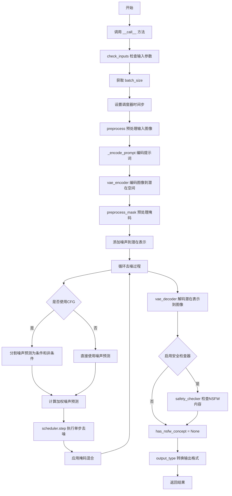
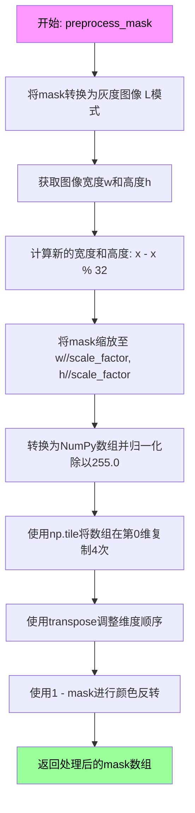
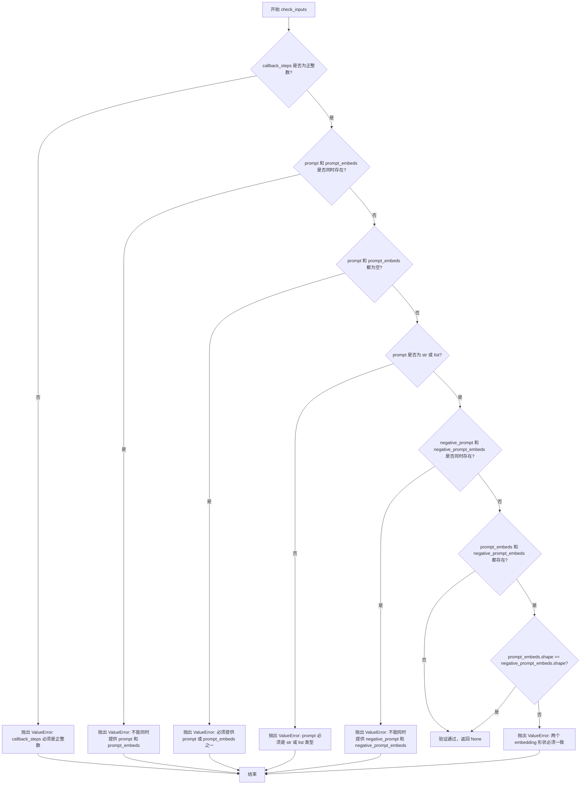

# `diffusers\src\diffusers\pipelines\deprecated\stable_diffusion_variants\pipeline_onnx_stable_diffusion_inpaint_legacy.py` 详细设计文档

这是一个用于文本引导图像修复（Inpainting）的Stable Diffusion ONNX运行时管道，提供与Legacy版本的兼容性。该管道通过接收文本提示、原始图像和掩码图像，利用VAE编码器/解码器、文本编码器、U-Net和调度器进行去噪处理，最终生成修复后的图像。

## 整体流程



## 类结构

```
DiffusionPipeline (基类)
└── OnnxStableDiffusionInpaintPipelineLegacy
```

## 全局变量及字段


### `logger`
    
模块级日志记录器，用于记录管道运行过程中的信息、警告和错误

类型：`logging.Logger`
    


### `OnnxStableDiffusionInpaintPipelineLegacy.vae_encoder`
    
VAE编码器模型，用于将输入图像编码到潜在空间

类型：`OnnxRuntimeModel`
    


### `OnnxStableDiffusionInpaintPipelineLegacy.vae_decoder`
    
VAE解码器模型，用于将潜在表示解码回图像

类型：`OnnxRuntimeModel`
    


### `OnnxStableDiffusionInpaintPipelineLegacy.text_encoder`
    
文本编码器模型，用于将文本提示转换为嵌入向量

类型：`OnnxRuntimeModel`
    


### `OnnxStableDiffusionInpaintPipelineLegacy.tokenizer`
    
CLIP分词器，用于将文本分割成token序列

类型：`CLIPTokenizer`
    


### `OnnxStableDiffusionInpaintPipelineLegacy.unet`
    
条件U-Net去噪模型，用于预测噪声残差

类型：`OnnxRuntimeModel`
    


### `OnnxStableDiffusionInpaintPipelineLegacy.scheduler`
    
去噪调度器，用于控制扩散过程中的噪声调度

类型：`DDIMScheduler | PNDMScheduler | LMSDiscreteScheduler`
    


### `OnnxStableDiffusionInpaintPipelineLegacy.safety_checker`
    
NSFW安全检查器，用于检测生成图像是否包含不当内容

类型：`OnnxRuntimeModel`
    


### `OnnxStableDiffusionInpaintPipelineLegacy.feature_extractor`
    
图像特征提取器，用于提取图像特征供安全检查器使用

类型：`CLIPImageProcessor`
    


### `OnnxStableDiffusionInpaintPipelineLegacy._optional_components`
    
可选组件列表，定义哪些组件是可选的

类型：`list`
    


### `OnnxStableDiffusionInpaintPipelineLegacy._is_onnx`
    
ONNX标志，标识该管道是否为ONNX版本

类型：`bool`
    
    

## 全局函数及方法


### `preprocess`

该函数用于对输入的PIL图像进行预处理，将其调整为Stable Diffusion模型所需的格式。具体操作包括：将图像尺寸调整为32的整数倍、转换为浮点numpy数组、归一化到[0,1]范围、调整通道顺序（从HWC转换为CHW）、添加批次维度，并最后将像素值缩放到[-1, 1]范围。

参数：

- `image`：`PIL.Image.Image`，待处理的PIL图像对象

返回值：`np.ndarray`，形状为(1, 3, H, W)的numpy数组，值为[-1, 1]范围的浮点数，表示预处理后的图像张量

#### 流程图

```mermaid
graph TD
    A[开始: 输入 PIL 图像] --> B[获取图像宽度w和高度h]
    B --> C[将w和h调整为32的整数倍: x - x % 32]
    C --> D[使用LANCZOS重采样将图像resize到w, h]
    D --> E[将图像转换为numpy数组并转为float32类型]
    E --> F[归一化: 除以255.0, 范围变为0-1]
    F --> G[添加批次维度: image[None], 形状变为1×H×W×3]
    G --> H[转置维度: transpose(0, 3, 1, 2), 形状变为1×3×H×W]
    H --> I[缩放到-1到1范围: 2.0 * image - 1.0]
    I --> J[返回预处理后的图像数组]
```

#### 带注释源码

```python
def preprocess(image):
    """
    预处理输入图像，转换为Stable Diffusion模型所需的格式。
    
    参数:
        image: PIL.Image.Image对象，输入的RGB图像
        
    返回:
        numpy.ndarray: 形状为(1, 3, H, W)的浮点数组，值域[-1, 1]
    """
    # 获取图像的原始宽高
    w, h = image.size
    
    # 将宽高调整为32的整数倍，确保尺寸符合模型要求
    # 使用生成器表达式对w和h分别进行处理
    w, h = (x - x % 32 for x in (w, h))
    
    # 使用LANCZOS重采样算法将图像resize到调整后的尺寸
    image = image.resize((w, h), resample=PIL.Image.LANCZOS)
    
    # 将PIL图像转换为numpy数组，并转换为float32类型
    image = np.array(image).astype(np.float32)
    
    # 归一化：将像素值从[0, 255]范围映射到[0, 1]范围
    image = image / 255.0
    
    # 添加批次维度：将HWC格式转换为CHW格式
    # image[None] 相当于 np.expand_dims(image, axis=0)
    # transpose(0, 3, 1, 2) 将 (1, H, W, 3) 转换为 (1, 3, H, W)
    image = image[None].transpose(0, 3, 1, 2)
    
    # 缩放：将[0, 1]范围映射到[-1, 1]范围
    # 这是Stable Diffusion模型预期的输入范围
    return 2.0 * image - 1.0
```


### `preprocess_mask`

该函数用于将输入的掩码图像进行预处理，以适配 Stable Diffusion 模型的输入要求。主要完成灰度转换、尺寸调整、归一化、维度变换和颜色反转等操作，将 PIL 图像转换为模型可用的 NumPy 数组格式。

#### 参数

- `mask`：`PIL.Image.Image`，输入的掩码图像，支持 RGB 或其他格式，PIL Image 对象
- `scale_factor`：`int`，缩放因子，用于将掩码图像尺寸缩小至对应的潜空间尺寸，默认为 8

#### 返回值

- `numpy.ndarray`，预处理后的掩码图像数组，形状为 (1, H/scale_factor, W/scale_factor, 4)，数据类型为 float32，值域为 [0, 1]，其中白色区域（待重绘）转换为低数值，黑色区域（保留）转换为高数值

#### 流程图



#### 带注释源码

```python
def preprocess_mask(mask, scale_factor=8):
    """
    预处理掩码图像以适配Stable Diffusion模型输入
    
    参数:
        mask: PIL图像对象，输入的掩码图像
        scale_factor: 缩放因子，用于将图像尺寸缩小到对应的潜空间维度
    
    返回:
        numpy.ndarray: 预处理后的掩码数组
    """
    # Step 1: 将图像转换为灰度模式（L模式），只保留亮度通道
    # 这样可以确保掩码是单通道的，便于后续处理
    mask = mask.convert("L")
    
    # Step 2: 获取当前图像的宽度和高度
    w, h = mask.size
    
    # Step 3: 将宽度和高度调整为32的整数倍
    # 这是因为Stable Diffusion模型通常要求输入尺寸是32的倍数
    w, h = (x - x % 32 for x in (w, h))
    
    # Step 4: 调整掩码图像尺寸
    # 使用缩放因子将图像尺寸缩小到潜空间（latent space）的尺寸
    # 使用NEAREST重采样以保持掩码的边缘清晰
    mask = mask.resize((w // scale_factor, h // scale_factor), resample=PIL.Image.NEAREST)
    
    # Step 5: 转换为NumPy数组并归一化
    # 将像素值从 [0, 255] 转换到 [0.0, 1.0] 范围
    mask = np.array(mask).astype(np.float32) / 255.0
    
    # Step 6: 在第0维（通道维）复制4次
    # 这是为了匹配Stable Diffusion的4通道潜空间表示
    mask = np.tile(mask, (4, 1, 1))
    
    # Step 7: 调整数组维度顺序
    # 从 (4, H, W) 转换为 (1, H, W, 4) 以适配后续处理
    # 添加批次维度到最前面
    mask = mask[None].transpose(0, 1, 2, 3)  # what does this step do?
    
    # Step 8: 颜色反转
    # 原始掩码中：白色表示需要重绘的区域，黑色表示保留的区域
    # 反转后：白色（255）变为0（需要重绘），黑色（0）变为1（保留）
    # 这样符合Stable Diffusion中 1-mask 的语义：白色区域会被噪声替代
    mask = 1 - mask  # repaint white, keep black
    
    # 返回处理后的掩码数组，形状为 (1, H/scale_factor, W/scale_factor, 4)
    return mask
```


### OnnxStableDiffusionInpaintPipelineLegacy.__init__

初始化 OnnxStableDiffusionInpaintPipelineLegacy 管道，用于文本引导的图像修复（inpainting）。该方法是管道的构造函数，负责验证调度器配置、注册所有模型组件（VAE、文本编码器、分词器、U-Net、调度器、安全检查器和特征提取器）到管道中，并处理可选组件的兼容性。

参数：

- `vae_encoder`：`OnnxRuntimeModel`，VAE 编码器模型，用于将图像编码到潜在表示空间
- `vae_decoder`：`OnnxRuntimeModel`，VAE 解码器模型，用于将潜在表示解码回图像
- `text_encoder`：`OnnxRuntimeModel`，冻结的文本编码器模型（CLIP），用于将文本提示转换为嵌入向量
- `tokenizer`：`CLIPTokenizer`，CLIP 分词器，用于将文本分词为 token
- `unet`：`OnnxRuntimeModel`，条件 U-Net 架构，用于对编码后的图像潜在表示进行去噪
- `scheduler`：`DDIMScheduler | PNDMScheduler | LMSDiscreteScheduler`，调度器，用于与 unet 结合对图像潜在表示进行去噪
- `safety_checker`：`OnnxRuntimeModel`，安全检查器模块，用于估计生成的图像是否包含不当或有害内容
- `feature_extractor`：`CLIPImageProcessor`，特征提取器，用于从生成的图像中提取特征作为安全检查器的输入
- `requires_safety_checker`：`bool`，是否需要安全检查器，默认为 True

返回值：无（`None`），构造函数不返回值，通过副作用初始化实例属性

#### 流程图

```mermaid
flowchart TD
    A[__init__ 开始] --> B[调用 super().__init__]
    B --> C{scheduler 不为空且 steps_offset != 1?}
    C -->|是| D[发出 deprecation 警告]
    D --> E[将 steps_offset 强制设为 1]
    C -->|否| F{scheduler 不为空且 clip_sample == True?}
    F -->|是| G[发出 deprecation 警告]
    G --> H[将 clip_sample 强制设为 False]
    F -->|否| I{safety_checker 为 None 且 requires_safety_checker 为 True?}
    I -->|是| J[发出安全警告]
    I -->|否| K{safety_checker 不为 None 但 feature_extractor 为 None?}
    K -->|是| L[抛出 ValueError 异常]
    K -->|否| M[调用 register_modules 注册所有模块]
    M --> N[调用 register_to_config 注册配置]
    N --> O[__init__ 结束]
    
    J --> M
```

#### 带注释源码

```python
def __init__(
    self,
    vae_encoder: OnnxRuntimeModel,
    vae_decoder: OnnxRuntimeModel,
    text_encoder: OnnxRuntimeModel,
    tokenizer: CLIPTokenizer,
    unet: OnnxRuntimeModel,
    scheduler: DDIMScheduler | PNDMScheduler | LMSDiscreteScheduler,
    safety_checker: OnnxRuntimeModel,
    feature_extractor: CLIPImageProcessor,
    requires_safety_checker: bool = True,
):
    """
    初始化 OnnxStableDiffusionInpaintPipelineLegacy 管道
    
    参数:
        vae_encoder: VAE 编码器模型
        vae_decoder: VAE 解码器模型
        text_encoder: CLIP 文本编码器
        tokenizer: CLIP 分词器
        unet: 条件 U-Net 去噪模型
        scheduler: 噪声调度器
        safety_checker: 安全检查器
        feature_extractor: CLIP 图像特征提取器
        requires_safety_checker: 是否需要安全检查器
    """
    # 调用父类 DiffusionPipeline 的初始化方法
    super().__init__()

    # === 步骤 1: 检查并修正 scheduler 配置 (steps_offset) ===
    # 如果 scheduler 存在且 steps_offset 不为 1，发出弃用警告并强制修正
    if scheduler is not None and getattr(scheduler.config, "steps_offset", 1) != 1:
        deprecation_message = (
            f"The configuration file of this scheduler: {scheduler} is outdated. `steps_offset`"
            f" should be set to 1 instead of {scheduler.config.steps_offset}. Please make sure "
            "to update the config accordingly as leaving `steps_offset` might led to incorrect results"
            " in future versions. If you have downloaded this checkpoint from the Hugging Face Hub,"
            " it would be very nice if you could open a Pull request for the `scheduler/scheduler_config.json`"
            " file"
        )
        deprecate("steps_offset!=1", "1.0.0", deprecation_message, standard_warn=False)
        # 创建新配置并将 steps_offset 强制设为 1
        new_config = dict(scheduler.config)
        new_config["steps_offset"] = 1
        scheduler._internal_dict = FrozenDict(new_config)

    # === 步骤 2: 检查并修正 scheduler 配置 (clip_sample) ===
    # 如果 scheduler 存在且 clip_sample 为 True，发出弃用警告并强制修正
    if scheduler is not None and getattr(scheduler.config, "clip_sample", False) is True:
        deprecation_message = (
            f"The configuration file of this scheduler: {scheduler} has not set the configuration `clip_sample`."
            " `clip_sample` should be set to False in the configuration file. Please make sure to update the"
            " config accordingly as not setting `clip_sample` in the config might lead to incorrect results in"
            " future versions. If you have downloaded this checkpoint from the Hugging Face Hub, it would be very"
            " nice if you could open a Pull request for the `scheduler/scheduler_config.json` file"
        )
        deprecate("clip_sample not set", "1.0.0", deprecation_message, standard_warn=False)
        new_config = dict(scheduler.config)
        new_config["clip_sample"] = False
        scheduler._internal_dict = FrozenDict(new_config)

    # === 步骤 3: 安全检查器警告 ===
    # 如果 safety_checker 为 None 但 requires_safety_checker 为 True，发出警告
    if safety_checker is None and requires_safety_checker:
        logger.warning(
            f"You have disabled the safety checker for {self.__class__} by passing `safety_checker=None`. Ensure"
            " that you abide to the conditions of the Stable Diffusion license and do not expose unfiltered"
            " results in services or applications open to the public. Both the diffusers team and Hugging Face"
            " strongly recommend to keep the safety filter enabled in all public facing circumstances, disabling"
            " it only for use-cases that involve analyzing network behavior or auditing its results. For more"
            " information, please have a look at https://github.com/huggingface/diffusers/pull/254 ."
        )

    # === 步骤 4: 验证 feature_extractor 必要性 ===
    # 如果使用安全检查器但未提供 feature_extractor，抛出错误
    if safety_checker is not None and feature_extractor is None:
        raise ValueError(
            "Make sure to define a feature extractor when loading {self.__class__} if you want to use the safety"
            " checker. If you do not want to use the safety checker, you can pass `'safety_checker=None'` instead."
        )

    # === 步骤 5: 注册所有模块 ===
    # 将所有模型组件注册到管道中，使其可通过 self.xxx 访问
    self.register_modules(
        vae_encoder=vae_encoder,
        vae_decoder=vae_decoder,
        text_encoder=text_encoder,
        tokenizer=tokenizer,
        unet=unet,
        scheduler=scheduler,
        safety_checker=safety_checker,
        feature_extractor=feature_extractor,
    )

    # === 步骤 6: 注册配置到 config ===
    # 将 requires_safety_checker 保存到管道配置中
    self.register_to_config(requires_safety_checker=requires_safety_checker)
```


### `OnnxStableDiffusionInpaintPipelineLegacy._encode_prompt`

该方法负责将文本提示（prompt）编码为文本编码器的隐藏状态向量，支持批量处理、单提示多图生成、负面提示引导以及预计算的嵌入向量，是Stable Diffusion图像生成管道的关键前置步骤，用于将用户输入的文本转换为模型可理解的数值表示。

参数：

- `prompt`：`str | list[str]`，要编码的文本提示，可以是单个字符串或字符串列表
- `num_images_per_prompt`：`int | None`，每个提示要生成的图像数量，用于扩展嵌入维度
- `do_classifier_free_guidance`：`bool`，是否启用无分类器自由guidance，决定是否生成负面提示嵌入
- `negative_prompt`：`str | None`，负面提示，用于引导模型避免生成不希望的内容
- `prompt_embeds`：`np.ndarray | None`，可选的预计算文本嵌入，如果提供则直接使用而忽略prompt参数
- `negative_prompt_embeds`：`np.ndarray | None`，可选的预计算负面文本嵌入

返回值：`np.ndarray`，编码后的文本嵌入向量，形状为 `[batch_size * num_images_per_prompt, seq_len, hidden_dim]`，当启用guidance时前半部分为无条件嵌入，后半部分为条件文本嵌入

#### 流程图

```mermaid
flowchart TD
    A[开始 _encode_prompt] --> B{判断 prompt 类型}
    B -->|str| C[batch_size = 1]
    B -->|list| D[batch_size = len(prompt)]
    B -->|None| E[batch_size = prompt_embeds.shape[0]]
    C --> F{prompt_embeds is None?}
    D --> F
    E --> G[跳转到重复嵌入]
    F -->|Yes| H[调用 tokenizer 处理 prompt]
    H --> I[检查是否被截断]
    I --> J[调用 text_encoder 生成 embeddings]
    J --> G
    F -->|No| G
    G --> K{do_classifier_free_guidance 且 negative_prompt_embeds is None?}
    K -->|Yes| L[处理 uncond_tokens]
    K -->|No| O
    L --> M[调用 tokenizer 处理 uncond_tokens]
    M --> N[调用 text_encoder 生成 negative_prompt_embeds]
    N --> O{do_classifier_free_guidance?}
    O -->|Yes| P[重复 negative_prompt_embeds]
    O -->|No| R
    P --> Q[连接 negative_prompt_embeds 和 prompt_embeds]
    Q --> R[返回最终 embeddings]
    O -->|No| R
```

#### 带注释源码

```python
def _encode_prompt(
    self,
    prompt: str | list[str],
    num_images_per_prompt: int | None,
    do_classifier_free_guidance: bool,
    negative_prompt: str | None,
    prompt_embeds: np.ndarray | None = None,
    negative_prompt_embeds: np.ndarray | None = None,
):
    r"""
    Encodes the prompt into text encoder hidden states.

    Args:
        prompt (`str` or `list[str]`):
            prompt to be encoded
        num_images_per_prompt (`int`):
            number of images that should be generated per prompt
        do_classifier_free_guidance (`bool`):
            whether to use classifier free guidance or not
        negative_prompt (`str` or `list[str]`):
            The prompt or prompts not to guide the image generation. Ignored when not using guidance (i.e., ignored
            if `guidance_scale` is less than `1`).
        prompt_embeds (`np.ndarray`, *optional*):
            Pre-generated text embeddings. Can be used to easily tweak text inputs, *e.g.* prompt weighting. If not
            provided, text embeddings will be generated from `prompt` input argument.
        negative_prompt_embeds (`np.ndarray`, *optional*):
            Pre-generated negative text embeddings. Can be used to easily tweak text inputs, *e.g.* prompt
            weighting. If not provided, negative_prompt_embeds will be generated from `negative_prompt` input
            argument.
    """
    # Step 1: Determine batch_size based on prompt type or prompt_embeds shape
    if prompt is not None and isinstance(prompt, str):
        batch_size = 1
    elif prompt is not None and isinstance(prompt, list):
        batch_size = len(prompt)
    else:
        batch_size = prompt_embeds.shape[0]

    # Step 2: Generate prompt embeddings if not provided
    if prompt_embeds is None:
        # Tokenize the prompt text into token IDs
        text_inputs = self.tokenizer(
            prompt,
            padding="max_length",
            max_length=self.tokenizer.model_max_length,
            truncation=True,
            return_tensors="np",
        )
        text_input_ids = text_inputs.input_ids
        
        # Get untruncated token IDs for truncation warning
        untruncated_ids = self.tokenizer(prompt, padding="max_length", return_tensors="np").input_ids

        # Check if truncation occurred and warn user
        if not np.array_equal(text_input_ids, untruncated_ids):
            removed_text = self.tokenizer.batch_decode(
                untruncated_ids[:, self.tokenizer.model_max_length - 1 : -1]
            )
            logger.warning(
                "The following part of your input was truncated because CLIP can only handle sequences up to"
                f" {self.tokenizer.model_max_length} tokens: {removed_text}"
            )

        # Encode text input IDs to embeddings using text encoder model
        prompt_embeds = self.text_encoder(input_ids=text_input_ids.astype(np.int32))[0]

    # Step 3: Repeat embeddings for multiple images per prompt
    prompt_embeds = np.repeat(prompt_embeds, num_images_per_prompt, axis=0)

    # Step 4: Generate unconditional embeddings for classifier free guidance
    if do_classifier_free_guidance and negative_prompt_embeds is None:
        uncond_tokens: list[str]
        
        # Handle different negative_prompt scenarios
        if negative_prompt is None:
            # Use empty string if no negative prompt provided
            uncond_tokens = [""] * batch_size
        elif type(prompt) is not type(negative_prompt):
            # Type mismatch error
            raise TypeError(
                f"`negative_prompt` should be the same type to `prompt`, but got {type(negative_prompt)} !="
                f" {type(prompt)}."
            )
        elif isinstance(negative_prompt, str):
            # Single negative prompt string, repeat for batch
            uncond_tokens = [negative_prompt] * batch_size
        elif batch_size != len(negative_prompt):
            # Batch size mismatch error
            raise ValueError(
                f"`negative_prompt`: {negative_prompt} has batch size {len(negative_prompt)}, but `prompt`:"
                f" {prompt} has batch size {batch_size}. Please make sure that passed `negative_prompt` matches"
                " the batch size of `prompt`."
            )
        else:
            # Negative prompt is a list
            uncond_tokens = negative_prompt

        # Get the sequence length from prompt_embeds
        max_length = prompt_embeds.shape[1]
        
        # Tokenize unconditional (negative) prompts
        uncond_input = self.tokenizer(
            uncond_tokens,
            padding="max_length",
            max_length=max_length,
            truncation=True,
            return_tensors="np",
        )
        
        # Encode negative prompts to embeddings
        negative_prompt_embeds = self.text_encoder(input_ids=uncond_input.input_ids.astype(np.int32))[0]

    # Step 5: Apply guidance if enabled
    if do_classifier_free_guidance:
        # Repeat negative embeddings for multiple images per prompt
        negative_prompt_embeds = np.repeat(negative_prompt_embeds, num_images_per_prompt, axis=0)

        # For classifier free guidance, concatenate unconditional and text embeddings
        # This allows single forward pass instead of two separate passes
        # Format: [negative_prompt_embeds, prompt_embeds]
        prompt_embeds = np.concatenate([negative_prompt_embeds, prompt_embeds])

    return prompt_embeds
```


### `OnnxStableDiffusionInpaintPipelineLegacy.check_inputs`

验证图像修复管道的输入参数，确保prompt和embedding参数正确提供且一致。如果验证失败，该方法会抛出`ValueError`异常。

参数：

- `self`：`OnnxStableDiffusionInpaintPipelineLegacy`，管道实例本身
- `prompt`：`str | list[str] | None`，用于引导图像生成的文本提示，可以是单个字符串或字符串列表
- `callback_steps`：`int`，整数类型，指定回调函数的调用频率，必须为正整数
- `negative_prompt`：`str | list[str] | None`，可选参数，用于指定不希望出现的图像内容
- `prompt_embeds`：`np.ndarray | None`，可选参数，预生成的文本嵌入向量
- `negative_prompt_embeds`：`np.ndarray | None`，可选参数，预生成的负面文本嵌入向量

返回值：`None`，无返回值。该方法通过抛出`ValueError`异常来处理验证失败的情况。

#### 流程图



#### 带注释源码

```python
def check_inputs(
    self,
    prompt,
    callback_steps,
    negative_prompt=None,
    prompt_embeds=None,
    negative_prompt_embeds=None,
):
    """
    验证输入参数的合法性。

    检查以下内容:
    1. callback_steps 必须是正整数
    2. prompt 和 prompt_embeds 不能同时提供
    3. prompt 和 prompt_embeds 至少提供一个
    4. prompt 必须是 str 或 list 类型
    5. negative_prompt 和 negative_prompt_embeds 不能同时提供
    6. 如果同时提供 prompt_embeds 和 negative_prompt_embeds，它们的形状必须一致

    参数:
        prompt: 文本提示，str 或 list[str] 类型
        callback_steps: 回调函数调用频率，必须为正整数
        negative_prompt: 可选的负面提示
        prompt_embeds: 可选的预生成文本嵌入
        negative_prompt_embeds: 可选的预生成负面文本嵌入
    """
    # 验证 callback_steps 参数
    # 必须是非 None 的正整数
    if (callback_steps is None) or (
        callback_steps is not None and (not isinstance(callback_steps, int) or callback_steps <= 0)
    ):
        raise ValueError(
            f"`callback_steps` has to be a positive integer but is {callback_steps} of type"
            f" {type(callback_steps)}."
        )

    # 验证 prompt 和 prompt_embeds 不能同时提供
    # 两者是互斥的，只能选择其中一种方式传递文本
    if prompt is not None and prompt_embeds is not None:
        raise ValueError(
            f"Cannot forward both `prompt`: {prompt} and `prompt_embeds`: {prompt_embeds}. Please make sure to"
            " only forward one of the two."
        )
    # 验证必须至少提供 prompt 或 prompt_embeds 之一
    # 不能两者都为空
    elif prompt is None and prompt_embeds is None:
        raise ValueError(
            "Provide either `prompt` or `prompt_embeds`. Cannot leave both `prompt` and `prompt_embeds` undefined."
        )
    # 验证 prompt 的类型必须是 str 或 list
    # 不接受其他类型如整数、字典等
    elif prompt is not None and (not isinstance(prompt, str) and not isinstance(prompt, list)):
        raise ValueError(f"`prompt` has to be of type `str` or `list` but is {type(prompt)}")

    # 验证 negative_prompt 和 negative_prompt_embeds 不能同时提供
    # 两者也是互斥的
    if negative_prompt is not None and negative_prompt_embeds is not None:
        raise ValueError(
            f"Cannot forward both `negative_prompt`: {negative_prompt} and `negative_prompt_embeds`:"
            f" {negative_prompt_embeds}. Please make sure to only forward one of the two."
        )

    # 如果同时提供了两种 embedding，验证它们的形状是否一致
    # 确保后续的 guidance 计算能够正确进行
    if prompt_embeds is not None and negative_prompt_embeds is not None:
        if prompt_embeds.shape != negative_prompt_embeds.shape:
            raise ValueError(
                "`prompt_embeds` and `negative_prompt_embeds` must have the same shape when passed directly, but"
                f" got: `prompt_embeds` {prompt_embeds.shape} != `negative_prompt_embeds`"
                f" {negative_prompt_embeds.shape}."
            )
```


### `OnnxStableDiffusionInpaintPipelineLegacy.__call__`

执行基于文本提示的图像修复（inpainting）推理，通过去噪过程填充图像中被遮罩的区域。

参数：

- `prompt`：`str | list[str]`，用于指导图像生成的文本提示
- `image`：`np.ndarray | PIL.Image.Image`，作为起点的输入图像，将被修复的区域由此图像确定
- `mask_image`：`np.ndarray | PIL.Image.Image`，用于遮罩输入图像的遮罩，白色像素将被噪声替换并重新绘制，黑色像素将被保留
- `strength`：`float`，默认值 0.8，概念上表示对参考图像的变换程度，必须在 0 到 1 之间
- `num_inference_steps`：`int | None`，默认值 50，去噪步数越多通常图像质量越高但推理越慢
- `guidance_scale`：`float | None`，默认值 7.5，分类器自由引导（Classifier-Free Guidance）比例
- `negative_prompt`：`str | list[str] | None`，不用于指导图像生成的负面提示
- `num_images_per_prompt`：`int | None`，默认值 1，每个提示生成的图像数量
- `eta`：`float | None`，默认值 0.0，仅适用于 DDIM 调度器
- `generator`：`np.random.RandomState | None`，用于使生成具有确定性的随机状态
- `prompt_embeds`：`np.ndarray | None`，预生成的文本嵌入，可用于轻松调整文本输入
- `negative_prompt_embeds`：`np.ndarray | None`，预生成的负面文本嵌入
- `output_type`：`str | None`，默认值 "pil"，输出格式，可选 "pil" 或 "np"
- `return_dict`：`bool`，默认值 True，是否返回 PipelineOutput 而非元组
- `callback`：`Callable[[int, int, np.ndarray], None] | None`，每 callback_steps 步调用的回调函数
- `callback_steps`：`int`，默认值 1，回调函数调用频率

返回值：`StableDiffusionPipelineOutput | tuple`，当 return_dict 为 True 时返回包含生成图像和 NSFW 检测结果的 PipelineOutput，否则返回元组 (images, has_nsfw_concept)

#### 流程图

```mermaid
flowchart TD
    A[开始 __call__] --> B[check_inputs 验证输入参数]
    B --> C[确定 batch_size]
    C --> D{strength 在 [0,1] 范围?}
    D -->|否| E[抛出 ValueError]
    D -->|是| F[设置随机数生成器]
    F --> G[scheduler.set_timesteps 设置时间步]
    G --> H{image 是 PIL Image?}
    H -->|是| I[preprocess 预处理图像]
    H -->|否| J[继续]
    I --> J
    J --> K[do_classifier_free_guidance = guidance_scale > 1.0]
    K --> L[_encode_prompt 编码提示词]
    L --> M[转换图像数据类型]
    M --> N[vae_encoder 编码图像到 latent]
    N --> O[init_latents = 0.18215 * init_latents]
    O --> P[扩展 init_latents 批量]
    P --> Q[preprocess_mask 预处理遮罩]
    Q --> R[检查遮罩与图像尺寸匹配]
    R --> S[计算 init_timestep]
    S --> T[生成噪声并添加到 latents]
    T --> U[进入去噪循环]
    U --> V{循环结束?}
    V -->|否| W[扩展 latent_model_input]
    W --> X[scheduler.scale_model_input 缩放输入]
    X --> Y[unet 预测噪声残差]
    Y --> Z{使用 CFG?}
    Z -->|是| AA[分割噪声预测并进行引导]
    Z -->|否| AB[继续]
    AA --> AC[计算上一步 x_t -> x_t-1]
    AB --> AC
    AC --> AD[添加噪声到原始 latents]
    AD --> AE[根据遮罩混合 latents]
    AE --> AF[调用 callback 如果提供]
    AF --> U
    V -->|是| AG[latents = 1 / 0.18215 * latents]
    AG --> AH[vae_decoder 解码到图像]
    AH --> AI[clip 图像到 [0,1]]
    AI --> AJ[transpose 维度转换]
    AJ --> AK{safety_checker 不为 None?}
    AK -->|是| AL[feature_extractor 提取特征]
    AL --> AM[safety_checker 检查 NSFW]
    AK -->|否| AN[has_nsfw_concept = None]
    AM --> AN
    AN --> AO{output_type == 'pil'?}
    AO -->|是| AP[numpy_to_pil 转换]
    AO -->|否| AQ[继续]
    AP --> AR
    AQ --> AR{return_dict == True?}
    AR -->|是| AS[返回 StableDiffusionPipelineOutput]
    AR -->|否| AT[返回 tuple]
```

#### 带注释源码

```python
def __call__(
    self,
    prompt: str | list[str],
    image: np.ndarray | PIL.Image.Image = None,
    mask_image: np.ndarray | PIL.Image.Image = None,
    strength: float = 0.8,
    num_inference_steps: int | None = 50,
    guidance_scale: float | None = 7.5,
    negative_prompt: str | list[str] | None = None,
    num_images_per_prompt: int | None = 1,
    eta: float | None = 0.0,
    generator: np.random.RandomState | None = None,
    prompt_embeds: np.ndarray | None = None,
    negative_prompt_embeds: np.ndarray | None = None,
    output_type: str | None = "pil",
    return_dict: bool = True,
    callback: Callable[[int, int, np.ndarray], None] | None = None,
    callback_steps: int = 1,
):
    # 1. 验证输入参数，确保 prompt、callback_steps 等合法
    self.check_inputs(prompt, callback_steps, negative_prompt, prompt_embeds, negative_prompt_embeds)

    # 2. 确定批次大小
    if prompt is not None and isinstance(prompt, str):
        batch_size = 1
    elif prompt is not None and isinstance(prompt, list):
        batch_size = len(prompt)
    else:
        batch_size = prompt_embeds.shape[0]

    # 3. 检查 strength 必须在 [0, 1] 范围内
    if strength < 0 or strength > 1:
        raise ValueError(f"The value of strength should in [0.0, 1.0] but is {strength}")

    # 4. 如果没有提供 generator，则使用全局随机数生成器
    if generator is None:
        generator = np.random

    # 5. 设置调度器的时间步
    self.scheduler.set_timesteps(num_inference_steps)

    # 6. 如果输入是 PIL Image，则进行预处理转换为 numpy 数组并归一化到 [-1, 1]
    if isinstance(image, PIL.Image.Image):
        image = preprocess(image)

    # 7. 确定是否使用分类器自由引导（CFG）
    # guidance_scale > 1.0 时启用 CFG
    do_classifier_free_guidance = guidance_scale > 1.0

    # 8. 编码 prompt 获取文本嵌入
    prompt_embeds = self._encode_prompt(
        prompt,
        num_images_per_prompt,
        do_classifier_free_guidance,
        negative_prompt,
        prompt_embeds=prompt_embeds,
        negative_prompt_embeds=negative_prompt_embeds,
    )

    # 9. 确定 latents 的数据类型（与 prompt_embeds 保持一致）
    latents_dtype = prompt_embeds.dtype
    # 10. 将图像转换为 latents_dtype
    image = image.astype(latents_dtype)

    # 11. 使用 VAE 编码器将图像编码为 latent 表示，并按比例缩放
    init_latents = self.vae_encoder(sample=image)[0]
    init_latents = 0.18215 * init_latents

    # 12. 为 batch_size 和 num_images_per_prompt 扩展 init_latents
    init_latents = np.concatenate([init_latents] * num_images_per_prompt, axis=0)
    init_latents_orig = init_latents  # 保存原始值用于后续混合

    # 13. 预处理 mask 图像
    if not isinstance(mask_image, np.ndarray):
        mask_image = preprocess_mask(mask_image, 8)  # scale_factor=8
    mask_image = mask_image.astype(latents_dtype)
    # 扩展遮罩以匹配生成的图像数量
    mask = np.concatenate([mask_image] * num_images_per_prompt, axis=0)

    # 14. 验证遮罩和图像尺寸必须相同
    if not mask.shape == init_latents.shape:
        raise ValueError("The mask and image should be the same size!")

    # 15. 计算初始时间步
    offset = self.scheduler.config.get("steps_offset", 0)
    init_timestep = int(num_inference_steps * strength) + offset
    init_timestep = min(init_timestep, num_inference_steps)

    # 16. 获取时间步并准备噪声
    timesteps = self.scheduler.timesteps.numpy()[-init_timestep]
    timesteps = np.array([timesteps] * batch_size * num_images_per_prompt)

    # 17. 生成噪声并添加到 latents（根据 strength 决定添加的噪声量）
    noise = generator.randn(*init_latents.shape).astype(latents_dtype)
    init_latents = self.scheduler.add_noise(
        torch.from_numpy(init_latents), torch.from_numpy(noise), torch.from_numpy(timesteps)
    )
    init_latents = init_latents.numpy()

    # 18. 准备调度器额外参数（eta）
    accepts_eta = "eta" in set(inspect.signature(self.scheduler.step).parameters.keys())
    extra_step_kwargs = {}
    if accepts_eta:
        extra_step_kwargs["eta"] = eta

    # 19. 初始化 latents 为带噪声的 latents
    latents = init_latents

    # 20. 确定去噪循环的起始位置
    t_start = max(num_inference_steps - init_timestep + offset, 0)
    timesteps = self.scheduler.timesteps[t_start:].numpy()
    # 获取 UNet 输入的 timestep 类型
    timestep_dtype = next(
        (input.type for input in self.unet.model.get_inputs() if input.name == "timestep"), "tensor(float)"
    )
    timestep_dtype = ORT_TO_NP_TYPE[timestep_dtype]

    # 21. 去噪循环（主推理过程）
    for i, t in enumerate(self.progress_bar(timesteps)):
        # 如果使用 CFG，则扩展 latents（一份 unconditional，一份 conditional）
        latent_model_input = np.concatenate([latents] * 2) if do_classifier_free_guidance else latents
        latent_model_input = self.scheduler.scale_model_input(latent_model_input, t)

        # 使用 UNet 预测噪声残差
        timestep = np.array([t], dtype=timestep_dtype)
        noise_pred = self.unet(sample=latent_model_input, timestep=timestep, encoder_hidden_states=prompt_embeds)[
            0
        ]

        # 执行分类器自由引导
        if do_classifier_free_guidance:
            noise_pred_uncond, noise_pred_text = np.split(noise_pred, 2)
            noise_pred = noise_pred_uncond + guidance_scale * (noise_pred_text - noise_pred_uncond)

        # 计算上一步的 latents（去噪过程）
        latents = self.scheduler.step(
            torch.from_numpy(noise_pred), t, torch.from_numpy(latents), **extra_step_kwargs
        ).prev_sample

        latents = latents.numpy()

        # 重新添加噪声到原始 latents（保持原始图像信息）
        init_latents_proper = self.scheduler.add_noise(
            torch.from_numpy(init_latents_orig), torch.from_numpy(noise), torch.from_numpy(np.array([t]))
        )
        init_latents_proper = init_latents_proper.numpy()

        # 根据遮罩混合：保留原始区域（mask=1），去噪区域（mask=0）
        latents = (init_latents_proper * mask) + (latents * (1 - mask))

        # 调用回调函数（如果提供）
        if callback is not None and i % callback_steps == 0:
            step_idx = i // getattr(self.scheduler, "order", 1)
            callback(step_idx, t, latents)

    # 22. 反缩放 latents
    latents = 1 / 0.18215 * latents

    # 23. 使用 VAE 解码器将 latents 解码为图像
    # 使用循环避免半精度 VAE 解码器在 batchsize>1 时的问题
    image = np.concatenate(
        [self.vae_decoder(latent_sample=latents[i : i + 1])[0] for i in range(latents.shape[0])]
    )

    # 24. 后处理：将图像值从 [-1,1] 转换到 [0,1]
    image = np.clip(image / 2 + 0.5, 0, 1)
    # 转换维度顺序从 (B, C, H, W) 到 (B, H, W, C)
    image = image.transpose((0, 2, 3, 1))

    # 25. 安全检查（如果启用）
    if self.safety_checker is not None:
        safety_checker_input = self.feature_extractor(
            self.numpy_to_pil(image), return_tensors="np"
        ).pixel_values.astype(image.dtype)
        # 逐个检查以避免批处理错误
        images, has_nsfw_concept = [], []
        for i in range(image.shape[0]):
            image_i, has_nsfw_concept_i = self.safety_checker(
                clip_input=safety_checker_input[i : i + 1], images=image[i : i + 1]
            )
            images.append(image_i)
            has_nsfw_concept.append(has_nsfw_concept_i[0])
        image = np.concatenate(images)
    else:
        has_nsfw_concept = None

    # 26. 输出格式转换
    if output_type == "pil":
        image = self.numpy_to_pil(image)

    # 27. 返回结果
    if not return_dict:
        return (image, has_nsfw_concept)

    return StableDiffusionPipelineOutput(images=image, nsfw_content_detected=has_nsfw_concept)
```

## 关键组件


### 张量索引与惰性加载

在VAE解码器推理中使用显式循环逐个处理样本，当batch_size > 1时通过列表推导式逐个解码以避免半精度VAE解码器的异常结果。

### 反量化支持

在推理过程中使用`init_latents = 0.18215 * init_latents`进行缩放，最终通过`latents = 1 / 0.18215 * latents`进行反量化以恢复原始 latent space 范围。

### 量化策略

ONNX Runtime模型通过`OnnxRuntimeModel`封装，支持动态量化输入输出类型转换，使用`ORT_TO_NP_TYPE`映射表将ONNX张量类型转换为NumPy类型。

### 图像预处理管道

`preprocess()`函数将PIL图像转换为符合模型输入要求的张量格式：调整尺寸为32的倍数→归一化到[0,1]→添加batch维度并转换为CHW格式→映射到[-1,1]。

### 掩码预处理管道

`preprocess_mask()`函数将掩码图像下采样8倍（对应latent space的分辨率），并进行维度扩展和反转处理，使白色像素区域被重绘。

### 调度器兼容性设计

通过检查`steps_offset`和`clip_sample`配置参数并进行自动修正，确保DDIMScheduler、PNDMScheduler和LMSDiscreteScheduler三种调度器的兼容性。

### 安全检查器批处理限制

由于安全检查器不支持批量处理，使用显式循环逐个处理图像以避免错误，同时保持与原有接口的兼容性。


## 问题及建议


### 已知问题

-   **类型检查不当**：使用 `type(prompt) is not type(negative_prompt)` 进行类型比较，建议使用 `isinstance()` 进行更可靠的类型检查
-   **硬编码常量**：`0.18215` VAE缩放因子和 `scale_factor=8` 被硬编码在多处，缺少常量定义，降低了代码可维护性
-   **硬编码mask处理逻辑**：`np.tile(mask, (4, 1, 1))` 的tile逻辑和 `mask = 1 - mask` 的反色逻辑缺乏说明，且可能不适用于所有VAE配置
-   **批处理性能问题**：VAE解码器使用循环逐个处理样本（`for i in range(latents.shape[0])`），当batch_size较大时性能低下，且注释提到"strange result for using half-precision vae decoder if batchsize>1"说明存在已知bug
-   **安全检查器串行处理**：安全检查器在循环中逐个调用而非批量处理，降低推理效率
-   **scheduler配置直接修改**：通过 `scheduler._internal_dict = FrozenDict(new_config)` 直接修改scheduler内部状态，这种非公开API的访问方式脆弱且易导致未来兼容性问题
-   **变量命名混淆**：`init_latents` 和 `init_latents_orig` 的命名和用途不清晰，增加了代码理解难度
-   **缺失完整类型注解**：类字段 `scheduler` 使用联合类型但缺少详细的泛型支持，`_optional_components` 的类型注解不完整
-   **deprecated API使用**：使用 `deprecate` 函数但通过 `standard_warn=False` 抑制标准警告，可能导致用户忽略重要更新信息

### 优化建议

-   **提取常量**：将硬编码的缩放因子和scale_factor提取为类常量或配置参数
-   **重构类型检查**：将 `type(x) is not type(y)` 替换为 `not isinstance(x, type(y))` 或更合适的类型检查逻辑
-   **优化批处理**：修复VAE解码器的批量处理问题，研究并解决half-precision下的batch>1问题
-   **批量安全检查**：修改安全检查器调用逻辑，支持批量推理
-   **提取mask预处理**：将mask处理的复杂逻辑封装为独立函数并添加详细文档
-   **文档完善**：为关键算法步骤（如mask处理、VAE缩放）添加代码注释说明
-   **移除内部API访问**：通过scheduler提供的公共方法或配置初始化参数来设置steps_offset和clip_sample，而非直接修改_internal_dict

## 其它


### 设计目标与约束

本Pipeline的设计目标是提供一个基于Stable Diffusion的图像修复（inpainting）功能，利用ONNX运行时实现跨平台部署和推理加速。该Pipeline是Legacy版本，用于兼容旧版的StableDiffusionInpaintPipelineLegacy接口。核心约束包括：1）仅支持ONNX Runtime模型（vae_encoder、vae_decoder、text_encoder、unet、safety_checker）；2）输入图像和mask必须调整到32的整数倍；3）批处理大小受限于VAE decoder的安全检查器实现（batchsize>1时会逐个处理）；4）仅支持DDIMScheduler、PNDMScheduler和LMSDiscreteScheduler三种调度器。

### 错误处理与异常设计

本Pipeline采用多层错误处理机制。在初始化阶段（`__init__`），若`scheduler.config.steps_offset != 1`或`clip_sample`配置不当，会发出deprecation警告并自动修正配置；若`safety_checker`为None但`requires_safety_checker`为True，会发出安全警告；若`safety_checker`不为None但`feature_extractor`为None，则抛出`ValueError`。在`check_inputs`方法中，对`callback_steps`、`prompt`与`prompt_embeds`的互斥关系、`negative_prompt`与`negative_prompt_embeds`的互斥关系、以及embeds的shape一致性进行全面校验，不符合要求时抛出`ValueError`。在`__call__`方法中，对`strength`参数范围（必须为0-1之间）进行校验，对mask与image的尺寸一致性进行校验，尺寸不匹配时抛出`ValueError`。

### 数据流与状态机

Pipeline的核心数据流如下：1）输入阶段：接收prompt、image、mask_image、strength等参数；2）预处理阶段：对image进行resize到32整数倍、转换为numpy数组、归一化到[-1,1]；对mask_image进行resize（scale_factor=8）、转换为灰度、tile扩展到4通道、反转掩码；3）编码阶段：调用`_encode_prompt`生成prompt_embeds（包含unconditional embeddings用于classifier-free guidance）；调用vae_encoder将image编码为latents；4）噪声注入阶段：根据strength计算init_timestep，向latents添加噪声；5）去噪循环阶段：遍历timesteps，对latents进行逐步去噪，每次迭代中执行UNet预测噪声、classifier-free guidance计算、scheduler.step更新latents、mask混合操作；6）解码阶段：使用vae_decoder将latents解码为image；7）安全检查阶段（可选）：调用safety_checker检测NSFW内容；8）输出阶段：将numpy数组转换为PIL Image或保持数组格式输出。状态机主要体现在scheduler的timesteps管理，从init_timestep开始逐步递减至0。

### 外部依赖与接口契约

本Pipeline依赖以下外部组件：1）transformers库：提供CLIPTokenizer和CLIPImageProcessor；2）numpy：用于数值计算和数组操作；3）PIL（Pillow）：用于图像加载和resize；4）torch：用于张量操作和scheduler交互；5）diffusers库：提供DiffusionPipeline基类、各类Scheduler（DDIMScheduler、LMSDiscreteScheduler、PNDMScheduler）、OnnxRuntimeModel封装、ORT_TO_NP_TYPE映射、StableDiffusionPipelineOutput等。接口契约方面：所有ONNX模型输入输出均为numpy数组；tokenizer返回的input_ids为int32类型；scheduler的timesteps可转换为numpy数组；vae_encoder/decoder、unet、text_encoder、safety_checker均通过OnnxRuntimeModel封装调用。Pipeline的公开调用接口为`__call__`方法，返回值为StableDiffusionPipelineOutput（包含images和nsfw_content_detected字段）或tuple（image, has_nsfw_concept）。

### 版本兼容性说明

该Pipeline标记为`Legacy`版本，主要为了与旧版的StableDiffusionInpaintPipelineLegacy保持兼容。代码中包含从ONNX版本Pipeline复制的`_encode_prompt`方法。`_is_onnx = True`标志表明这是专门为ONNX Runtime设计的Pipeline，不应与PyTorch版本的Pipeline混淆使用。

    