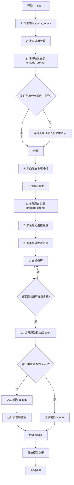
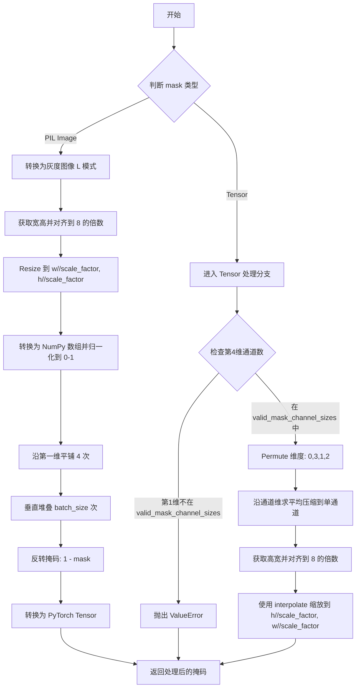
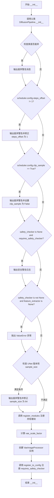
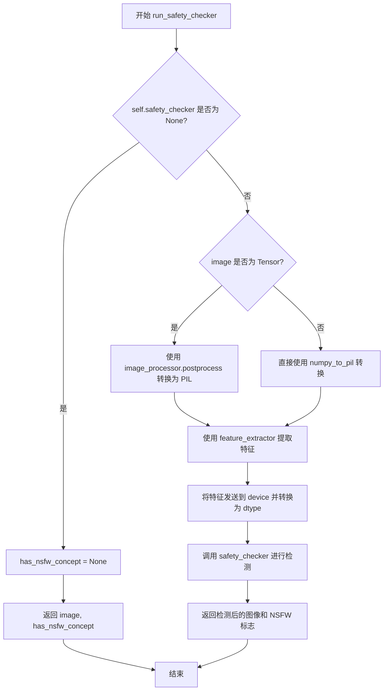
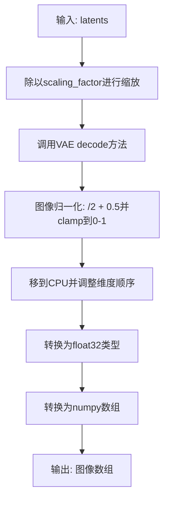
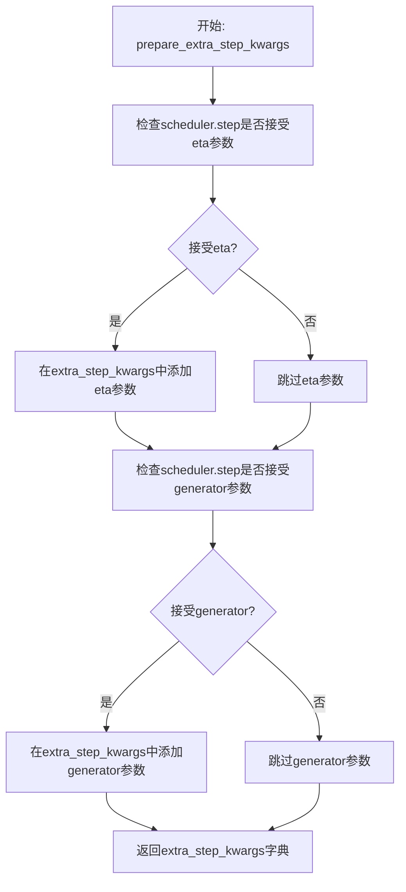
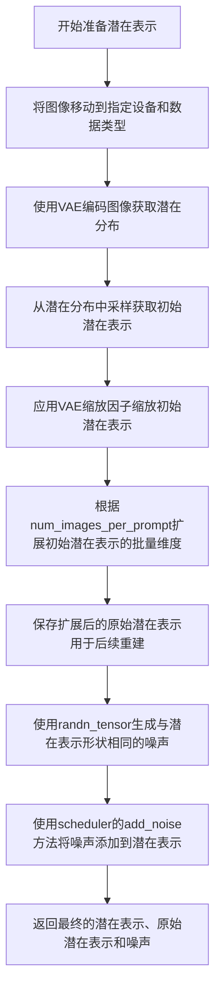
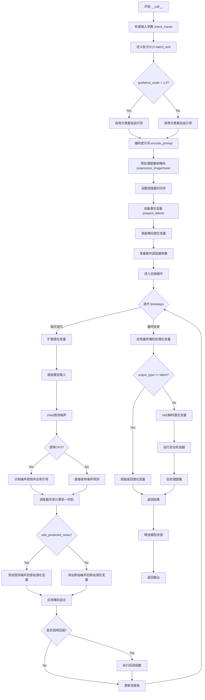

# `diffusers\src\diffusers\pipelines\deprecated\stable_diffusion_variants\pipeline_stable_diffusion_inpaint_legacy.py` 详细设计文档

这是一个用于文本引导图像修复（inpainting）的 Stable Diffusion 管道，通过接收原始图像、掩码图像和文本提示，利用 VAE、UNet 和 CLIP 文本编码器在潜在空间中进行去噪操作，最终生成修复后的图像。该管道继承自 DiffusionPipeline，支持 Textual-Inversion、LoRA 和单文件加载方式。

## 整体流程



## 类结构

```
DiffusionPipeline (基类)
├── TextualInversionLoaderMixin
├── StableDiffusionLoraLoaderMixin
└── FromSingleFileMixin
    └── StableDiffusionInpaintPipelineLegacy
```

## 全局变量及字段


### `logger`
    
用于记录警告和信息的日志记录器

类型：`logging.Logger`
    


### `StableDiffusionInpaintPipelineLegacy.model_cpu_offload_seq`
    
模型 CPU 卸载顺序

类型：`str`
    


### `StableDiffusionInpaintPipelineLegacy._optional_components`
    
可选组件列表

类型：`list`
    


### `StableDiffusionInpaintPipelineLegacy._exclude_from_cpu_offload`
    
需排除的 CPU 卸载组件

类型：`list`
    


### `StableDiffusionInpaintPipelineLegacy.vae`
    
VAE 变分自编码器

类型：`AutoencoderKL`
    


### `StableDiffusionInpaintPipelineLegacy.text_encoder`
    
CLIP 文本编码器

类型：`CLIPTextModel`
    


### `StableDiffusionInpaintPipelineLegacy.tokenizer`
    
CLIP 分词器

类型：`CLIPTokenizer`
    


### `StableDiffusionInpaintPipelineLegacy.unet`
    
条件 UNet 去噪网络

类型：`UNet2DConditionModel`
    


### `StableDiffusionInpaintPipelineLegacy.scheduler`
    
扩散调度器

类型：`KarrasDiffusionSchedulers`
    


### `StableDiffusionInpaintPipelineLegacy.safety_checker`
    
安全检查器

类型：`StableDiffusionSafetyChecker`
    


### `StableDiffusionInpaintPipelineLegacy.feature_extractor`
    
特征提取器

类型：`CLIPImageProcessor`
    


### `StableDiffusionInpaintPipelineLegacy.vae_scale_factor`
    
VAE 缩放因子

类型：`int`
    


### `StableDiffusionInpaintPipelineLegacy.image_processor`
    
图像处理器

类型：`VaeImageProcessor`
    
    

## 全局函数及方法


### `preprocess_image`

该函数负责将PIL图像预处理为Stable Diffusion模型所需的张量格式，包括将图像尺寸调整为8的整数倍、归一化像素值到[0,1]、转换维度顺序为PyTorch标准格式(C,H,W)、堆叠批量图像，最后将像素值缩放到[-1,1]范围以符合模型输入要求。

参数：

-  `image`：`PIL.Image.Image`，输入的PIL格式图像对象
-  `batch_size`：`int`，批量大小，用于生成相同图像的多个副本

返回值：`torch.Tensor`，预处理后的图像张量，形状为(batch_size, C, H, W)，像素值范围为[-1.0, 1.0]

#### 流程图

```mermaid
flowchart TD
    A[开始: 接收PIL图像和batch_size] --> B[获取图像宽度w和高度h]
    B --> C{检查尺寸是否能被8整除}
    C -->|不能| D[将w和h调整为8的整数倍: w = w - w%8, h = h - h%8]
    C -->|能| E[保持原尺寸]
    D --> F[使用Lanczos重采样调整图像大小到w x h]
    E --> F
    F --> G[将PIL图像转换为numpy数组并转换为float32类型]
    G --> H[归一化像素值到[0, 1]范围: 除以255]
    H --> I[添加批次维度并转置: 从HWC转为CHW格式]
    I --> J[堆叠batch_size个图像副本]
    J --> K[转换为PyTorch张量]
    K --> L[缩放像素值: 2.0 * image - 1.0, 从[0,1]映射到[-1,1]]
    L --> M[结束: 返回预处理后的张量]
```

#### 带注释源码

```python
def preprocess_image(image, batch_size):
    # 获取输入图像的宽度和高度
    w, h = image.size
    
    # 计算宽度和高度相对于8的余数，并将尺寸调整为8的整数倍
    # 这是因为Stable Diffusion的U-Net使用8倍下采样，需要输入尺寸能被8整除
    w, h = (x - x % 8 for x in (w, h))
    
    # 使用Lanczos重采样算法调整图像大小到目标尺寸
    # Lanczos是一种高质量的图像缩放算法，适合缩小图像
    image = image.resize((w, h), resample=PIL_INTERPOLATION["lanczos"])
    
    # 将PIL图像转换为numpy数组，并转换为float32类型以进行数值计算
    # 同时将像素值从[0, 255]归一化到[0, 1]范围
    image = np.array(image).astype(np.float32) / 255.0
    
    # 为图像添加批次维度，然后转置维度顺序
    # 原始形状: (H, W, C) -> 添加批次维度后: (1, H, W, C) -> 转置后: (1, C, H, W)
    # 这里使用np.vstack将单个图像复制batch_size次，形成批量数据
    image = np.vstack([image[None].transpose(0, 3, 1, 2)] * batch_size)
    
    # 将numpy数组转换为PyTorch张量
    image = torch.from_numpy(image)
    
    # 将像素值从[0, 1]范围线性变换到[-1, 1]范围
    # 这是Stable Diffusion模型的标准输入格式要求
    return 2.0 * image - 1.0
```


### `preprocess_mask`

该函数用于将输入的掩码（mask）图像进行预处理，以适配 Stable Diffusion 模型的输入要求。支持两种输入类型：PIL 图像或 PyTorch 张量。处理流程包括尺寸调整（对齐到 8 的倍数）、数值归一化、通道处理（统一为单通道）以及批次扩展等操作，最终返回符合模型输入格式的 PyTorch 张量。

参数：

- `mask`：`torch.Tensor | PIL.Image.Image`，输入的掩码图像，可以是 PIL 图像或 PyTorch 张量。张量格式可以是 `(B, H, W, C)` 或 `(B, C, H, W)`，其中 C 为 1 或 3
- `batch_size`：`int`，批次大小，用于生成对应数量的掩码副本
- `scale_factor`：`int`，可选，默认为 8，掩码尺寸的缩放因子，用于将掩码调整到与潜在空间对应的尺寸

返回值：`torch.Tensor`，预处理后的掩码张量，形状为 `(batch_size, 1, H/scale_factor, W/scale_factor)`

#### 流程图



#### 带注释源码

```python
def preprocess_mask(mask, batch_size, scale_factor=8):
    """
    预处理掩码图像，使其适配 Stable Diffusion 模型的输入格式
    
    参数:
        mask: 输入的掩码，可以是 PIL.Image 或 torch.Tensor
        batch_size: 批次大小
        scale_factor: 缩放因子，默认为 8（对应 VAE 的下采样倍数）
    
    返回:
        处理后的 torch.Tensor，形状为 (batch_size, 1, H//scale_factor, W//scale_factor)
    """
    # 判断是否为 PyTorch Tensor
    if not isinstance(mask, torch.Tensor):
        # ----------- 处理 PIL Image 输入 -----------
        # 转换为灰度图像（L 模式），确保是单通道
        mask = mask.convert("L")
        
        # 获取图像宽高，并将尺寸对齐到 8 的倍数
        # 这是因为 Stable Diffusion 的 U-Net 使用下采样，需要确保尺寸是 8 的倍数
        w, h = mask.size
        w, h = (x - x % 8 for x in (w, h))
        
        # 调整掩码尺寸到与潜在空间对应的分辨率
        # 例如：如果原图是 512x512，scale_factor=8，则掩码调整为 64x64
        mask = mask.resize((w // scale_factor, h // scale_factor), resample=PIL_INTERPOLATION["nearest"])
        
        # 转换为 NumPy 数组并归一化到 [0, 1] 范围
        mask = np.array(mask).astype(np.float32) / 255.0
        
        # 复制掩码 4 次（对应 RGBA 或 RGB 的 4 通道概念）
        # 这是为了与图像处理的传统方式保持一致
        mask = np.tile(mask, (4, 1, 1))
        
        # 垂直堆叠以扩展到 batch_size 维度
        mask = np.vstack([mask[None]] * batch_size)
        
        # 反转掩码：在 inpainting 中，白色像素表示需要重绘区域
        # 黑色像素表示保留区域，因此使用 1 - mask 进行反转
        mask = 1 - mask
        
        # 转换为 PyTorch 张量
        mask = torch.from_numpy(mask)
        return mask
    
    else:
        # ----------- 处理 torch.Tensor 输入 -----------
        valid_mask_channel_sizes = [1, 3]
        
        # 如果掩码的第四维是通道数（形状为 B,H,W,C）
        # 需要转换为 PyTorch 标准格式 (B,C,H,W)
        if mask.shape[3] in valid_mask_channel_sizes:
            mask = mask.permute(0, 3, 1, 2)
        # 如果既不是 B,C,H,W 也不是 B,H,W,C 格式，抛出异常
        elif mask.shape[1] not in valid_mask_channel_sizes:
            raise ValueError(
                f"Mask channel dimension of size in {valid_mask_channel_sizes} should be second or fourth dimension,"
                f" but received mask of shape {tuple(mask.shape)}"
            )
        
        # 沿通道维度求平均，将 3 通道掩码转换为单通道
        # 这样可以与潜在空间的单通道表示进行广播
        mask = mask.mean(dim=1, keepdim=True)
        
        # 获取高宽并对齐到 8 的倍数
        h, w = mask.shape[-2:]
        h, w = (x - x % 8 for x in (h, w))
        
        # 使用双线性插值调整掩码尺寸到潜在空间分辨率
        mask = torch.nn.functional.interpolate(mask, (h // scale_factor, w // scale_factor))
        return mask
```


### `StableDiffusionInpaintPipelineLegacy.__init__`

该方法是Stable Diffusion图像修复管道的初始化构造函数，负责接收并配置所有必需的模型组件（如VAE、文本编码器、UNet、调度器等），同时执行废弃警告、配置验证与更新，并注册所有模块以供后续推理使用。

参数：

-  `vae`：`AutoencoderKL`，变分自编码器模型，用于将图像编码到潜在空间并从潜在空间解码重建图像
-  `text_encoder`：`CLIPTextModel`，冻结的CLIP文本编码器，用于将文本提示转换为嵌入向量
-  `tokenizer`：`CLIPTokenizer`，CLIP分词器，用于将文本分割为token
-  `unet`：`UNet2DConditionModel`，条件U-Net网络，用于对编码后的图像潜在表示进行去噪
-  `scheduler`：`KarrasDiffusionSchedulers`，扩散调度器，用于控制去噪过程的采样策略
-  `safety_checker`：`StableDiffusionSafetyChecker`，安全检查器，用于检测并过滤可能的有害内容
-  `feature_extractor`：`CLIPImageProcessor`，CLIP图像特征提取器，用于为安全检查器提取图像特征
-  `requires_safety_checker`：`bool`，是否启用安全检查器，默认为True

返回值：`None`，构造函数无返回值

#### 流程图



#### 带注释源码

```python
def __init__(
    self,
    vae: AutoencoderKL,
    text_encoder: CLIPTextModel,
    tokenizer: CLIPTokenizer,
    unet: UNet2DConditionModel,
    scheduler: KarrasDiffusionSchedulers,
    safety_checker: StableDiffusionSafetyChecker,
    feature_extractor: CLIPImageProcessor,
    requires_safety_checker: bool = True,
):
    """
    初始化 Stable Diffusion 图像修复管道
    
    参数:
        vae: Variational Auto-Encoder (VAE) 模型，用于图像与潜在表示之间的编码和解码
        text_encoder: Frozen text-encoder，Stable Diffusion 使用 CLIP 的文本部分
        tokenizer: CLIPTokenizer，用于将文本转换为 token 序列
        unet: Conditional U-Net 架构，用于对图像潜在表示进行去噪
        scheduler: 调度器，与 unet 配合使用来去噪图像潜在表示
        safety_checker: 分类模块，估计生成图像是否具有攻击性或有害
        feature_extractor: 用于提取生成图像特征以供 safety_checker 使用
        requires_safety_checker: 是否需要安全检查器，默认为 True
    """
    # 调用父类 DiffusionPipeline 的初始化方法
    super().__init__()

    # 检查类是否已废弃，并输出废弃警告
    deprecation_message = (
        f"The class {self.__class__} is deprecated and will be removed in v1.0.0. You can achieve exactly the same functionality"
        "by loading your model into `StableDiffusionInpaintPipeline` instead. See https://github.com/huggingface/diffusers/pull/3533"
        "for more information."
    )
    deprecate("legacy is outdated", "1.0.0", deprecation_message, standard_warn=False)

    # 检查 scheduler 的 steps_offset 配置是否正确
    if scheduler is not None and getattr(scheduler.config, "steps_offset", 1) != 1:
        deprecation_message = (
            f"The configuration file of this scheduler: {scheduler} is outdated. `steps_offset`"
            f" should be set to 1 instead of {scheduler.config.steps_offset}. Please make sure "
            "to update the config accordingly as leaving `steps_offset` might led to incorrect results"
            " in future versions. If you have downloaded this checkpoint from the Hugging Face Hub,"
            " it would be very nice if you could open a Pull request for the `scheduler/scheduler_config.json`"
            " file"
        )
        deprecate("steps_offset!=1", "1.0.0", deprecation_message, standard_warn=False)
        # 更新 scheduler 内部配置
        new_config = dict(scheduler.config)
        new_config["steps_offset"] = 1
        scheduler._internal_dict = FrozenDict(new_config)

    # 检查 scheduler 的 clip_sample 配置
    if scheduler is not None and getattr(scheduler.config, "clip_sample", False) is True:
        deprecation_message = (
            f"The configuration file of this scheduler: {scheduler} has not set the configuration `clip_sample`."
            " `clip_sample` should be set to False in the configuration file. Please make sure to update the"
            " config accordingly as not setting `clip_sample` in the config might lead to incorrect results in"
            " future versions. If you have downloaded this checkpoint from the Hugging Face Hub, it would be very"
            " nice if you could open a Pull request for the `scheduler/scheduler_config.json` file"
        )
        deprecate("clip_sample not set", "1.0.0", deprecation_message, standard_warn=False)
        new_config = dict(scheduler.config)
        new_config["clip_sample"] = False
        scheduler._internal_dict = FrozenDict(new_config)

    # 如果 safety_checker 为 None 但 requires_safety_checker 为 True，则输出警告
    if safety_checker is None and requires_safety_checker:
        logger.warning(
            f"You have disabled the safety checker for {self.__class__} by passing `safety_checker=None`. Ensure"
            " that you abide to the conditions of the Stable Diffusion license and do not expose unfiltered"
            " results in services or applications open to the public. Both the diffusers team and Hugging Face"
            " strongly recommend to keep the safety filter enabled in all public facing circumstances, disabling"
            " it only for use-cases that involve analyzing network behavior or auditing its results. For more"
            " information, please have a look at https://github.com/huggingface/diffusers/pull/254 ."
        )

    # 如果使用了 safety_checker 但没有提供 feature_extractor，则抛出错误
    if safety_checker is not None and feature_extractor is None:
        raise ValueError(
            "Make sure to define a feature extractor when loading {self.__class__} if you want to use the safety"
            " checker. If you do not want to use the safety checker, you can pass `'safety_checker=None'` instead."
        )

    # 检查 UNet 版本和 sample_size 配置
    is_unet_version_less_0_9_0 = (
        unet is not None
        and hasattr(unet.config, "_diffusers_version")
        and version.parse(version.parse(unet.config._diffusers_version).base_version) < version.parse("0.9.0.dev0")
    )
    is_unet_sample_size_less_64 = (
        unet is not None and hasattr(unet.config, "sample_size") and unet.config.sample_size < 64
    )
    if is_unet_version_less_0_9_0 and is_unet_sample_size_less_64:
        deprecation_message = (
            "The configuration file of the unet has set the default `sample_size` to smaller than"
            " 64 which seems highly unlikely. If your checkpoint is a fine-tuned version of any of the"
            " following: \n- CompVis/stable-diffusion-v1-4 \n- CompVis/stable-diffusion-v1-3 \n-"
            " CompVis/stable-diffusion-v1-2 \n- CompVis/stable-diffusion-v1-1 \n- stable-diffusion-v1-5/stable-diffusion-v1-5"
            " \n- stable-diffusion-v1-5/stable-diffusion-inpainting \n you should change 'sample_size' to 64 in the"
            " configuration file. Please make sure to update the config accordingly as leaving `sample_size=32`"
            " in the config might lead to incorrect results in future versions. If you have downloaded this"
            " checkpoint from the Hugging Face Hub, it would be very nice if you could open a Pull request for"
            " the `unet/config.json` file"
        )
        deprecate("sample_size<64", "1.0.0", deprecation_message, standard_warn=False)
        new_config = dict(unet.config)
        new_config["sample_size"] = 64
        unet._internal_dict = FrozenDict(new_config)

    # 注册所有模块到管道中，使其可以通过 self.xxx 访问
    self.register_modules(
        vae=vae,
        text_encoder=text_encoder,
        tokenizer=tokenizer,
        unet=unet,
        scheduler=scheduler,
        safety_checker=safety_checker,
        feature_extractor=feature_extractor,
    )
    
    # 计算 VAE 缩放因子，用于图像预处理和后处理
    self.vae_scale_factor = 2 ** (len(self.vae.config.block_out_channels) - 1) if getattr(self, "vae", None) else 8
    
    # 创建图像处理器，用于图像与潜在表示之间的转换
    self.image_processor = VaeImageProcessor(vae_scale_factor=self.vae_scale_factor)
    
    # 将 requires_safety_checker 注册到配置中
    self.register_to_config(requires_safety_checker=requires_safety_checker)
```


### `StableDiffusionInpaintPipelineLegacy._encode_prompt`

该方法是Stable Diffusion图像修复管道中用于将文本提示编码为文本嵌入向量的核心功能模块。它是一个已废弃的兼容性包装方法，内部委托给`encode_prompt`方法执行实际编码工作，但为了向后兼容性，它将返回的元组格式重新合并为单一的拼接张量。该方法支持分类器-free引导（CFG），可以同时处理正向提示和负向提示，并应用LoRA缩放因子。

参数：

- `self`：`StableDiffusionInpaintPipelineLegacy`，管道实例本身
- `prompt`：`str` 或 `list[str]` 或 `None`，要编码的文本提示，可以是单个字符串或字符串列表
- `device`：`torch.device`，指定计算设备（CPU/CUDA）
- `num_images_per_prompt`：`int`，每个提示生成的图像数量，用于批量嵌入复制
- `do_classifier_free_guidance`：`bool`，是否启用分类器-free guidance
- `negative_prompt`：`str` 或 `list[str]` 或 `None`，可选的负向提示，用于引导图像生成远离特定内容
- `prompt_embeds`：`torch.Tensor | None`，可选的预计算提示嵌入，如果提供则直接使用
- `negative_prompt_embeds`：`torch.Tensor | None`，可选的预计算负向提示嵌入
- `lora_scale`：`float | None`，LoRA层的缩放因子，用于调整LoRA权重的影响
- `**kwargs`：其他关键字参数，会传递给`encode_prompt`方法

返回值：`torch.Tensor`，拼接后的文本嵌入张量，格式为`[negative_prompt_embeds, prompt_embeds]`（为了向后兼容）

#### 流程图

```mermaid
flowchart TD
    A[开始 _encode_prompt] --> B[记录废弃警告]
    B --> C{检查lora_scale}
    C -->|非None| D[设置self._lora_scale]
    C -->|None| E{检查prompt类型}
    D --> E
    E -->|str| F[batch_size = 1]
    E -->|list| G[batch_size = len]
    E -->|None| H[使用prompt_embeds.shape[0]]
    F --> I{检查prompt_embeds为None}
    G --> I
    H --> I
    I -->|是| J[调用maybe_convert_prompt处理TextualInversion]
    I -->|否| K[跳过文本处理]
    J --> L[tokenizer分词]
    K --> L
    L --> M[text_encoder编码得到embeddings]
    M --> N[处理attention_mask]
    N --> O{do_classifier_free_guidance}
    O -->|是| P{negative_prompt_embeds为None}
    O -->|否| Q[直接返回embeddings]
    P -->|是| R[处理negative_prompt]
    P -->|否| S[使用提供的negative_prompt_embeds]
    R --> T[生成unconditional embeddings]
    S --> T
    T --> U[重复embeddings num_images_per_prompt次]
    U --> V[torch.cat合并negative和prompt]
    V --> W[返回拼接后的张量]
    Q --> W
```

#### 带注释源码

```
def _encode_prompt(
    self,
    prompt,                          # 输入的文本提示
    device,                         # torch设备对象
    num_images_per_prompt,          # 每个提示生成的图像数量
    do_classifier_free_guidance,    # 是否启用CFG
    negative_prompt=None,           # 负向提示
    prompt_embeds: torch.Tensor | None = None,    # 预计算的提示嵌入
    negative_prompt_embeds: torch.Tensor | None = None,  # 预计算的负向嵌入
    lora_scale: float | None = None,  # LoRA缩放因子
    **kwargs,                       # 其他参数
):
    # 记录废弃警告，提示用户使用encode_prompt方法
    deprecation_message = "`_encode_prompt()` is deprecated and it will be removed in a future version. Use `encode_prompt()` instead. Also, be aware that the output format changed from a concatenated tensor to a tuple."
    deprecate("_encode_prompt()", "1.0.0", deprecation_message, standard_warn=False)

    # 调用新的encode_prompt方法获取元组格式的嵌入
    prompt_embeds_tuple = self.encode_prompt(
        prompt=prompt,
        device=device,
        num_images_per_prompt=num_images_per_prompt,
        do_classifier_free_guidance=do_classifier_free_guidance,
        negative_prompt=negative_prompt,
        prompt_embeds=prompt_embeds,
        negative_prompt_embeds=negative_prompt_embeds,
        lora_scale=lora_scale,
        **kwargs,
    )

    # 为了向后兼容性，将元组重新拼接为单一张量
    # 注意：encode_prompt返回(prompt_embeds, negative_prompt_embeds)
    # 但旧版本返回的是[negative_prompt_embeds, prompt_embeds]的拼接
    prompt_embeds = torch.cat([prompt_embeds_tuple[1], prompt_embeds_tuple[0]])

    return prompt_embeds
```


### `StableDiffusionInpaintPipelineLegacy.encode_prompt`

该方法负责将文本提示（prompt）编码为文本编码器（CLIP Text Encoder）的隐藏状态。它处理LoRA缩放、文本标记化、文本嵌入生成、无条件嵌入（用于无分类器自由引导）以及可选的CLIP层跳过功能，最终返回提示嵌入和负面提示嵌入元组。

参数：

- `prompt`：`str | list[str] | None`，要编码的文本提示，可以是单个字符串或字符串列表
- `device`：`torch.device`，PyTorch设备，用于将计算结果移动到指定设备
- `num_images_per_prompt`：`int`，每个提示要生成的图像数量
- `do_classifier_free_guidance`：`bool`，是否使用无分类器自由引导（Classifier-Free Guidance）
- `negative_prompt`：`str | list[str] | None`，不用于指导图像生成的提示，如果未定义则需传递`negative_prompt_embeds`
- `prompt_embeds`：`torch.Tensor | None`，预生成的文本嵌入，可用于轻松调整文本输入
- `negative_prompt_embeds`：`torch.Tensor | None`，预生成的负面文本嵌入
- `lora_scale`：`float | None`，如果加载了LoRA层，将应用于文本编码器所有LoRA层的LoRA缩放因子
- `clip_skip`：`int | None`，计算提示嵌入时从CLIP跳过的层数

返回值：`tuple[torch.Tensor, torch.Tensor]`，返回包含提示嵌入和负面提示嵌入的元组

#### 流程图

```mermaid
flowchart TD
    A[开始 encode_prompt] --> B{检查 lora_scale 是否存在}
    B -->|是| C[设置 self._lora_scale]
    B -->|否| D[跳过LoRA调整]
    C --> E{USE_PEFT_BACKEND?}
    E -->|否| F[adjust_lora_scale_text_encoder]
    E -->|是| G[scale_lora_layers]
    F --> H
    G --> H
    D --> H{检查 prompt 类型}
    H -->|str| I[batch_size = 1]
    H -->|list| J[batch_size = len(prompt)]
    H -->|其他| K[batch_size = prompt_embeds.shape[0]]
    I --> L
    J --> L
    K --> L{prompt_embeds 为空?}
    L -->|是| M[检查 TextualInversionLoaderMixin]
    L -->|否| R
    M -->|是| N[maybe_convert_prompt]
    M -->|否| O
    N --> O
    O --> P[tokenizer 处理 prompt]
    P --> Q[检查 use_attention_mask]
    Q -->|是| S[获取 attention_mask]
    Q -->|否| T[attention_mask = None]
    S --> U
    T --> U
    R --> V{clip_skip 为空?}
    U --> V
    V -->|否| W[调用 text_encoder 获取 hidden_states]
    V -->|是| X[调用 text_encoder 获取输出]
    W --> Y[获取指定层的 hidden_states]
    Y --> Z[应用 final_layer_norm]
    X --> AA[获取 last_hidden_state]
    AA --> AB[转换 dtype 和 device]
    AB --> AC[重复嵌入 for num_images_per_prompt]
    AC --> AD{do_classifier_free_guidance?}
    AD -->|是 且 negative_prompt_embeds 为空| AE[处理 negative_prompt]
    AD -->|否| AG
    AE --> AF[tokenizer 处理 uncond_tokens]
    AF --> AH[调用 text_encoder 获取负向嵌入]
    AH --> AI[重复 negative_prompt_embeds]
    AG --> AJ[返回 prompt_embeds, negative_prompt_embeds]
    AI --> AG
```

#### 带注释源码

```python
def encode_prompt(
    self,
    prompt,
    device,
    num_images_per_prompt,
    do_classifier_free_guidance,
    negative_prompt=None,
    prompt_embeds: torch.Tensor | None = None,
    negative_prompt_embeds: torch.Tensor | None = None,
    lora_scale: float | None = None,
    clip_skip: int | None = None,
):
    r"""
    Encodes the prompt into text encoder hidden states.

    Args:
        prompt (`str` or `list[str]`, *optional*):
            prompt to be encoded
        device: (`torch.device`):
            torch device
        num_images_per_prompt (`int`):
            number of images that should be generated per prompt
        do_classifier_free_guidance (`bool`):
            whether to use classifier free guidance or not
        negative_prompt (`str` or `list[str]`, *optional*):
            The prompt or prompts not to guide the image generation. If not defined, one has to pass
            `negative_prompt_embeds` instead. Ignored when not using guidance (i.e., ignored if `guidance_scale` is
            less than `1`).
        prompt_embeds (`torch.Tensor`, *optional*):
            Pre-generated text embeddings. Can be used to easily tweak text inputs, *e.g.* prompt weighting. If not
            provided, text embeddings will be generated from `prompt` input argument.
        negative_prompt_embeds (`torch.Tensor`, *optional*):
            Pre-generated negative text embeddings. Can be used to easily tweak text inputs, *e.g.* prompt
            weighting. If not provided, negative_prompt_embeds will be generated from `negative_prompt` input
            argument.
        lora_scale (`float`, *optional*):
            A LoRA scale that will be applied to all LoRA layers of the text encoder if LoRA layers are loaded.
        clip_skip (`int`, *optional*):
            Number of layers to be skipped from CLIP while computing the prompt embeddings. A value of 1 means that
            the output of the pre-final layer will be used for computing the prompt embeddings.
    """
    # 设置lora scale以便text encoder的LoRA函数可以正确访问
    if lora_scale is not None and isinstance(self, StableDiffusionLoraLoaderMixin):
        self._lora_scale = lora_scale

        # 动态调整LoRA scale
        if not USE_PEFT_BACKEND:
            adjust_lora_scale_text_encoder(self.text_encoder, lora_scale)
        else:
            scale_lora_layers(self.text_encoder, lora_scale)

    # 确定batch_size
    if prompt is not None and isinstance(prompt, str):
        batch_size = 1
    elif prompt is not None and isinstance(prompt, list):
        batch_size = len(prompt)
    else:
        batch_size = prompt_embeds.shape[0]

    # 如果没有提供prompt_embeds，则从prompt生成
    if prompt_embeds is None:
        # textual inversion: 如果需要，处理多向量token
        if isinstance(self, TextualInversionLoaderMixin):
            prompt = self.maybe_convert_prompt(prompt, self.tokenizer)

        # 使用tokenizer将prompt转换为token IDs
        text_inputs = self.tokenizer(
            prompt,
            padding="max_length",
            max_length=self.tokenizer.model_max_length,
            truncation=True,
            return_tensors="pt",
        )
        text_input_ids = text_inputs.input_ids
        # 获取未截断的token IDs用于比较
        untruncated_ids = self.tokenizer(prompt, padding="longest", return_tensors="pt").input_ids

        # 检查是否发生截断并记录警告
        if untruncated_ids.shape[-1] >= text_input_ids.shape[-1] and not torch.equal(
            text_input_ids, untruncated_ids
        ):
            removed_text = self.tokenizer.batch_decode(
                untruncated_ids[:, self.tokenizer.model_max_length - 1 : -1]
            )
            logger.warning(
                "The following part of your input was truncated because CLIP can only handle sequences up to"
                f" {self.tokenizer.model_max_length} tokens: {removed_text}"
            )

        # 检查text_encoder是否使用attention_mask
        if hasattr(self.text_encoder.config, "use_attention_mask") and self.text_encoder.config.use_attention_mask:
            attention_mask = text_inputs.attention_mask.to(device)
        else:
            attention_mask = None

        # 根据clip_skip决定如何获取prompt embeddings
        if clip_skip is None:
            # 直接获取最后一层的隐藏状态
            prompt_embeds = self.text_encoder(text_input_ids.to(device), attention_mask=attention_mask)
            prompt_embeds = prompt_embeds[0]
        else:
            # 获取所有隐藏状态，选择指定层的输出
            prompt_embeds = self.text_encoder(
                text_input_ids.to(device), attention_mask=attention_mask, output_hidden_states=True
            )
            # 访问hidden_states，这是一个包含所有编码器层输出的元组
            # 然后索引到 desired layer
            prompt_embeds = prompt_embeds[-1][-(clip_skip + 1)]
            # 还需要应用最终的LayerNorm以免干扰表示
            prompt_embeds = self.text_encoder.text_model.final_layer_norm(prompt_embeds)

    # 确定prompt_embeds的dtype
    if self.text_encoder is not None:
        prompt_embeds_dtype = self.text_encoder.dtype
    elif self.unet is not None:
        prompt_embeds_dtype = self.unet.dtype
    else:
        prompt_embeds_dtype = prompt_embeds.dtype

    # 将prompt_embeds转换为正确的dtype和device
    prompt_embeds = prompt_embeds.to(dtype=prompt_embeds_dtype, device=device)

    # 获取嵌入的形状并为每个prompt复制多个生成结果
    bs_embed, seq_len, _ = prompt_embeds.shape
    # 复制text embeddings以匹配每个prompt的生成数量
    prompt_embeds = prompt_embeds.repeat(1, num_images_per_prompt, 1)
    prompt_embeds = prompt_embeds.view(bs_embed * num_images_per_prompt, seq_len, -1)

    # 获取无条件嵌入用于无分类器自由引导
    if do_classifier_free_guidance and negative_prompt_embeds is None:
        uncond_tokens: list[str]
        if negative_prompt is None:
            # 如果没有negative_prompt，使用空字符串
            uncond_tokens = [""] * batch_size
        elif prompt is not None and type(prompt) is not type(negative_prompt):
            raise TypeError(
                f"`negative_prompt` should be the same type to `prompt`, but got {type(negative_prompt)} !="
                f" {type(prompt)}."
            )
        elif isinstance(negative_prompt, str):
            uncond_tokens = [negative_prompt]
        elif batch_size != len(negative_prompt):
            raise ValueError(
                f"`negative_prompt`: {negative_prompt} has batch size {len(negative_prompt)}, but `prompt`:"
                f" {prompt} has batch size {batch_size}. Please make sure that passed `negative_prompt` matches"
                " the batch size of `prompt`."
            )
        else:
            uncond_tokens = negative_prompt

        # textual inversion: 如果需要，处理多向量token
        if isinstance(self, TextualInversionLoaderMixin):
            uncond_tokens = self.maybe_convert_prompt(uncond_tokens, self.tokenizer)

        max_length = prompt_embeds.shape[1]
        # 对unconditional tokens进行tokenize
        uncond_input = self.tokenizer(
            uncond_tokens,
            padding="max_length",
            max_length=max_length,
            truncation=True,
            return_tensors="pt",
        )

        # 处理attention_mask
        if hasattr(self.text_encoder.config, "use_attention_mask") and self.text_encoder.config.use_attention_mask:
            attention_mask = uncond_input.attention_mask.to(device)
        else:
            attention_mask = None

        # 获取negative prompt embeddings
        negative_prompt_embeds = self.text_encoder(
            uncond_input.input_ids.to(device),
            attention_mask=attention_mask,
        )
        negative_prompt_embeds = negative_prompt_embeds[0]

    # 处理negative_prompt_embeds
    if do_classifier_free_guidance:
        seq_len = negative_prompt_embeds.shape[1]

        negative_prompt_embeds = negative_prompt_embeds.to(dtype=prompt_embeds_dtype, device=device)

        # 复制以匹配生成数量
        negative_prompt_embeds = negative_prompt_embeds.repeat(1, num_images_per_prompt, 1)
        negative_prompt_embeds = negative_prompt_embeds.view(batch_size * num_images_per_prompt, seq_len, -1)

    # 如果使用了PEFT backend，恢复LoRA层到原始scale
    if self.text_encoder is not None:
        if isinstance(self, StableDiffusionLoraLoaderMixin) and USE_PEFT_BACKEND:
            # 通过取消缩放LoRA层来恢复原始scale
            unscale_lora_layers(self.text_encoder, lora_scale)

    return prompt_embeds, negative_prompt_embeds
```


### `StableDiffusionInpaintPipelineLegacy.run_safety_checker`

该方法用于对生成的图像进行安全检查（NSFW检测），通过安全检查器（safety_checker）判断图像是否包含不适合公开显示的内容。如果安全检查器未启用，则直接返回原始图像和None。

参数：

- `self`：`StableDiffusionInpaintPipelineLegacy`，管道实例本身
- `image`：`torch.Tensor | Any`，需要进行检查的图像，可以是PyTorch张量或其他格式
- `device`：`torch.device`，用于运行安全检查器的设备（如CPU或CUDA设备）
- `dtype`：`torch.dtype`，图像数据的dtype，用于确保安全检查器输入数据类型一致

返回值：`(Any, torch.Tensor | None)`，返回元组，第一个元素是处理后的图像，第二个元素是NSFW概念检测结果（如果安全检查器启用则返回张量，否则返回None）

#### 流程图



#### 带注释源码

```python
def run_safety_checker(self, image, device, dtype):
    """
    运行安全检查器对生成的图像进行NSFW检测
    
    参数:
        image: 输入图像，tensor或PIL图像
        device: 运行设备
        dtype: 数据类型
        
    返回:
        (image, has_nsfw_concept): 处理后的图像和NSFW检测结果
    """
    # 如果安全检查器未配置，直接返回None表示无NSFW概念
    if self.safety_checker is None:
        has_nsfw_concept = None
    else:
        # 判断输入图像是否为PyTorch张量
        if torch.is_tensor(image):
            # 将张量图像转换为PIL图像供特征提取器使用
            feature_extractor_input = self.image_processor.postprocess(image, output_type="pil")
        else:
            # 直接将numpy数组转换为PIL图像
            feature_extractor_input = self.image_processor.numpy_to_pil(image)
        
        # 使用特征提取器提取图像特征，并转换为指定设备和数据类型
        safety_checker_input = self.feature_extractor(feature_extractor_input, return_tensors="pt").to(device)
        
        # 调用安全检查器进行NSFW检测
        # safety_checker 接收原始图像和CLIP特征作为输入
        image, has_nsfw_concept = self.safety_checker(
            images=image, 
            clip_input=safety_checker_input.pixel_values.to(dtype)
        )
    
    # 返回处理后的图像和NSFW检测标志
    return image, has_nsfw_concept
```


### `StableDiffusionInpaintPipelineLegacy.decode_latents`

该方法用于将潜在表示（latents）解码为图像，是Stable Diffusion管道的核心组件，负责将去噪过程中的潜在空间表示转换回可显示的图像格式。

参数：

- `latents`：`torch.Tensor`，需要解码的潜在表示张量，通常来自UNet去噪过程的输出

返回值：`np.ndarray`，解码后的图像，形状为(batch_size, height, width, channels)，像素值范围为[0, 1]

#### 流程图



#### 带注释源码

```python
def decode_latents(self, latents):
    """
    将潜在表示解码为图像。
    
    Args:
        latents: 需要解码的潜在表示张量
        
    Returns:
        解码后的图像数组，像素值范围[0, 1]
    """
    # 发出弃用警告，建议使用VaeImageProcessor.postprocess替代
    deprecation_message = "The decode_latents method is deprecated and will be removed in 1.0.0. Please use VaeImageProcessor.postprocess(...) instead"
    deprecate("decode_latents", "1.0.0", deprecation_message, standard_warn=False)

    # 第一步：缩放latents，除以scaling_factor以恢复到原始潜在空间
    # VAE的scaling_factor用于在训练时缩放潜在表示
    latents = 1 / self.vae.config.scaling_factor * latents
    
    # 第二步：使用VAE解码器将潜在表示解码为图像
    # return_dict=False返回元组，取第一个元素[0]为图像张量
    image = self.vae.decode(latents, return_dict=False)[0]
    
    # 第三步：图像归一化处理
    # 将图像从[-1, 1]范围转换到[0, 1]范围
    # 除以2将范围从[-1,1]映射到[-0.5, 0.5]
    # 加0.5将范围映射到[0, 1]
    # clamp(0, 1)确保像素值在有效范围内
    image = (image / 2 + 0.5).clamp(0, 1)
    
    # 第四步：转换为numpy数组以便后续处理
    # .cpu()将张量从GPU移到CPU
    # .permute(0, 2, 3, 1)调整维度顺序，从(B, C, H, W)变为(B, H, W, C)
    # .float()转换为float32类型，兼容bfloat16且不会导致显著性能开销
    # .numpy()将PyTorch张量转换为numpy数组
    image = image.cpu().permute(0, 2, 3, 1).float().numpy()
    
    # 返回解码后的图像数组
    return image
```


### `StableDiffusionInpaintPipelineLegacy.prepare_extra_step_kwargs`

该方法用于准备调度器（scheduler）的额外参数。由于不同的调度器具有不同的签名，该方法通过检查调度器的`step`方法是否接受`eta`和`generator`参数来动态构建需要传递给调度器的参数字典。

参数：

- `generator`：`torch.Generator | list[torch.Generator] | None`，随机数生成器，用于确保生成结果的可重复性
- `eta`：`float | None`，DDIM调度器的η参数，对应DDIM论文中的η，取值范围应在[0,1]之间

返回值：`dict`，包含调度器额外参数的字典，可能包含`eta`和/或`generator`参数

#### 流程图



#### 带注释源码

```python
def prepare_extra_step_kwargs(self, generator, eta):
    # prepare extra kwargs for the scheduler step, since not all schedulers have the same signature
    # eta (η) is only used with the DDIMScheduler, it will be ignored for other schedulers.
    # eta corresponds to η in DDIM paper: https://huggingface.co/papers/2010.02502
    # and should be between [0, 1]

    # 使用inspect模块检查scheduler.step方法的签名，判断是否接受eta参数
    accepts_eta = "eta" in set(inspect.signature(self.scheduler.step).parameters.keys())
    
    # 初始化额外的参数字典
    extra_step_kwargs = {}
    
    # 如果scheduler接受eta参数，则将其添加到extra_step_kwargs中
    if accepts_eta:
        extra_step_kwargs["eta"] = eta

    # 检查scheduler.step方法是否接受generator参数
    accepts_generator = "generator" in set(inspect.signature(self.scheduler.step).parameters.keys())
    
    # 如果scheduler接受generator参数，则将其添加到extra_step_kwargs中
    if accepts_generator:
        extra_step_kwargs["generator"] = generator
    
    # 返回构建好的参数字典，供scheduler.step()调用使用
    return extra_step_kwargs
```


### `StableDiffusionInpaintPipelineLegacy.check_inputs`

该方法用于验证图像修复管道的输入参数是否合法，包括检查 `strength` 的有效范围、`callback_steps` 的有效性、回调张量输入是否在允许列表中、以及 `prompt` 和 `prompt_embeds` 等参数的互斥性和一致性。

参数：

- `self`：类的实例引用
- `prompt`：`str | list[str] | None`，用于引导图像生成的文本提示，可以是单个字符串或字符串列表
- `strength`：`float`，修复强度，必须在 [0.0, 1.0] 范围内
- `callback_steps`：`int | None`，回调函数的调用频率，必须为正整数
- `negative_prompt`：`str | list[str] | None`，用于引导图像生成的负面提示
- `prompt_embeds`：`torch.Tensor | None`，预生成的文本嵌入向量
- `negative_prompt_embeds`：`torch.Tensor | None`，预生成的负面文本嵌入向量
- `callback_on_step_end_tensor_inputs`：`list[str] | None`，在步骤结束时需要传递给回调的张量输入列表

返回值：`None`，该方法不返回任何值，主要通过抛出异常来处理无效输入

#### 流程图

```mermaid
flowchart TD
    A[开始 check_inputs] --> B{strength 是否在 [0, 1] 范围}
    B -->|否| C[抛出 ValueError]
    B -->|是| D{callback_steps 是否有效}
    D -->|否| E[抛出 ValueError]
    D -->|是| F{callback_on_step_end_tensor_inputs 是否合法}
    F -->|否| G[抛出 ValueError]
    F -->|是| H{prompt 和 prompt_embeds 是否同时存在}
    H -->|是| I[抛出 ValueError]
    H -->|否| J{prompt 和 prompt_embeds 是否都未定义}
    J -->|是| K[抛出 ValueError]
    J -->|否| L{prompt 类型是否合法]
    L -->|否| M[抛出 ValueError]
    L -->|是| N{negative_prompt 和 negative_prompt_embeds 是否同时存在}
    N -->|是| O[抛出 ValueError]
    N -->|否| P{prompt_embeds 和 negative_prompt_embeds 是否形状一致}
    P -->|否| Q[抛出 ValueError]
    P -->|是| R[通过所有验证]
    
    C --> R
    E --> R
    G --> R
    I --> R
    K --> R
    M --> R
    O --> R
    Q --> R
```

#### 带注释源码

```python
def check_inputs(
    self,
    prompt,
    strength,
    callback_steps,
    negative_prompt=None,
    prompt_embeds=None,
    negative_prompt_embeds=None,
    callback_on_step_end_tensor_inputs=None,
):
    """
    验证输入参数的有效性，确保管道能够正确执行图像修复任务。
    
    该方法会检查所有输入参数的合法性，包括：
    1. strength 必须在 [0.0, 1.0] 范围内
    2. callback_steps 必须为正整数
    3. callback_on_step_end_tensor_inputs 必须在允许的回调张量输入列表中
    4. prompt 和 prompt_embeds 只能二选一，不能同时提供
    5. prompt 和 prompt_embeds 至少提供一个
    6. prompt 类型必须为 str 或 list
    7. negative_prompt 和 negative_prompt_embeds 只能二选一
    8. prompt_embeds 和 negative_prompt_embeds 形状必须一致
    """
    
    # 检查 strength 参数是否在有效范围内 [0.0, 1.0]
    if strength < 0 or strength > 1:
        raise ValueError(f"The value of strength should in [0.0, 1.0] but is {strength}")

    # 检查 callback_steps 是否为正整数
    if callback_steps is not None and (not isinstance(callback_steps, int) or callback_steps <= 0):
        raise ValueError(
            f"`callback_steps` has to be a positive integer but is {callback_steps} of type"
            f" {type(callback_steps)}."
        )

    # 验证回调张量输入是否在允许列表中
    if callback_on_step_end_tensor_inputs is not None and not all(
        k in self._callback_tensor_inputs for k in callback_on_step_end_tensor_inputs
    ):
        raise ValueError(
            f"`callback_on_step_end_tensor_inputs` has to be in {self._callback_tensor_inputs}, but found {[k for k in callback_on_step_end_tensor_inputs if k not in self._callback_tensor_inputs]}"
        )
    
    # 检查 prompt 和 prompt_embeds 是否互斥
    if prompt is not None and prompt_embeds is not None:
        raise ValueError(
            f"Cannot forward both `prompt`: {prompt} and `prompt_embeds`: {prompt_embeds}. Please make sure to"
            " only forward one of the two."
        )
    # 检查 prompt 和 prompt_embeds 是否至少提供一个
    elif prompt is None and prompt_embeds is None:
        raise ValueError(
            "Provide either `prompt` or `prompt_embeds`. Cannot leave both `prompt` and `prompt_embeds` undefined."
        )
    # 检查 prompt 的类型是否合法
    elif prompt is not None and (not isinstance(prompt, str) and not isinstance(prompt, list)):
        raise ValueError(f"`prompt` has to be of type `str` or `list` but is {type(prompt)}")

    # 检查 negative_prompt 和 negative_prompt_embeds 是否互斥
    if negative_prompt is not None and negative_prompt_embeds is not None:
        raise ValueError(
            f"Cannot forward both `negative_prompt`: {negative_prompt} and `negative_prompt_embeds`:"
            f" {negative_prompt_embeds}. Please make sure to only forward one of the two."
        )

    # 检查 prompt_embeds 和 negative_prompt_embeds 形状是否一致
    if prompt_embeds is not None and negative_prompt_embeds is not None:
        if prompt_embeds.shape != negative_prompt_embeds.shape:
            raise ValueError(
                "`prompt_embeds` and `negative_prompt_embeds` must have the same shape when passed directly, but"
                f" got: `prompt_embeds` {prompt_embeds.shape} != `negative_prompt_embeds`"
                f" {negative_prompt_embeds.shape}."
            )
```


### `StableDiffusionInpaintPipelineLegacy.get_timesteps`

该方法用于根据推理步数和修复强度计算时间步（timesteps），以支持图像修复（inpainting）任务中的噪声调度。

参数：

- `num_inference_steps`：`int`，推理过程中所需的去噪步数
- `strength`：`float`，修复强度，值为0到1之间，表示对遮罩区域进行修复的程度
- `device`：`torch.device`，计算设备（CPU或GPU）

返回值：`tuple`，返回一个元组，包含计算得到的时间步序列（`torch.Tensor`）和实际使用的推理步数（`int`）

#### 流程图

```mermaid
flowchart TD
    A[开始 get_timesteps] --> B[计算 init_timestep]
    B --> C[init_timestep = min(num_inference_steps × strength, num_inference_steps)]
    C --> D[计算 t_start]
    D --> E[t_start = max(num_inference_steps - init_timestep, 0)]
    E --> F[从 scheduler.timesteps 中提取子序列]
    F --> G[timesteps = scheduler.timesteps[t_start × order :]]
    G --> H[计算实际步数]
    H --> I[actual_steps = num_inference_steps - t_start]
    I --> J[返回 timesteps 和 actual_steps]
```

#### 带注释源码

```python
def get_timesteps(self, num_inference_steps, strength, device):
    """
    根据推理步数和强度获取时间步序列。
    
    参数:
        num_inference_steps: 总推理步数
        strength: 修复强度 (0-1)
        device: 计算设备
    """
    # 根据强度计算初始时间步数
    # 强度越高，init_timestep越大，表示对遮罩区域进行更多步的去噪
    init_timestep = min(int(num_inference_steps * strength), num_inference_steps)

    # 计算起始索引
    # 从时间步序列的末尾开始，确保遮罩区域从较晚的时间步开始处理
    t_start = max(num_inference_steps - init_timestep, 0)
    
    # 从调度器的时间步序列中提取子序列
    # 使用 scheduler.order 来正确处理多步调度器（如 DPM-Solver）
    timesteps = self.scheduler.timesteps[t_start * self.scheduler.order :]

    # 返回时间步序列和实际推理步数
    return timesteps, num_inference_steps - t_start
```


### `StableDiffusionInpaintPipelineLegacy.prepare_latents`

该方法用于在图像修复（inpainting）流程中准备潜在的噪声表示。它接收原始图像、时间步、批处理参数等，将图像编码为VAE潜在空间表示，扩展批量大小以匹配生成的图像数量，并添加噪声以启动去噪过程。

参数：

- `self`：隐式参数，StableDiffusionInpaintPipelineLegacy的实例
- `image`：`torch.Tensor`，输入图像张量，将被编码到潜在空间
- `timestep`：`torch.Tensor` 或 int，时间步，用于确定添加的噪声量
- `num_images_per_prompt`：int，每个提示词生成的图像数量，用于扩展潜在表示
- `dtype`：`torch.dtype`，目标数据类型，用于设备转换
- `device`：`torch.device`，目标设备（CPU/CUDA）
- `generator`：`torch.Generator` 或 None，用于生成确定性噪声的随机数生成器

返回值：`Tuple[torch.Tensor, torch.Tensor, torch.Tensor]`，返回三个张量组成的元组：
- 第一个元素 `latents`：添加噪声后的潜在表示，用于去噪过程
- 第二个元素 `init_latents_orig`：原始（未添加噪声）的扩展潜在表示，用于后续的图像重建
- 第三个元素 `noise`：生成的噪声张量，用于追溯和可能的噪声预测

#### 流程图



#### 带注释源码

```python
def prepare_latents(self, image, timestep, num_images_per_prompt, dtype, device, generator):
    """
    准备图像修复（inpainting）所需的潜在表示
    
    参数:
        image: 输入图像张量
        timestep: 时间步，用于确定添加的噪声量
        num_images_per_prompt: 每个提示生成的图像数量
        dtype: 目标数据类型
        device: 目标设备
        generator: 随机数生成器，用于确定性采样
    
    返回:
        (latents, init_latents_orig, noise): 包含加噪潜在表示、原始潜在表示和噪声的元组
    """
    # 步骤1: 将图像移动到指定设备和数据类型
    image = image.to(device=device, dtype=dtype)
    
    # 步骤2: 使用VAE编码图像，获取潜在分布
    init_latent_dist = self.vae.encode(image).latent_dist
    
    # 步骤3: 从潜在分布中采样获取初始潜在表示
    init_latents = init_latent_dist.sample(generator=generator)
    
    # 步骤4: 应用VAE缩放因子缩放初始潜在表示（这是VAE缩放的逆过程）
    init_latents = self.vae.config.scaling_factor * init_latents

    # 步骤5: 扩展init_latents以匹配batch_size和num_images_per_prompt
    # 例如: 如果batch_size=1, num_images_per_prompt=2, 则复制2份
    init_latents = torch.cat([init_latents] * num_images_per_prompt, dim=0)
    
    # 步骤6: 保存扩展后的原始潜在表示，用于后续在去噪过程中重建未掩码区域
    init_latents_orig = init_latents

    # 步骤7: 使用timestep生成与潜在表示形状相同的噪声
    # 使用generator确保噪声的可重复性（当提供generator时）
    noise = randn_tensor(init_latents.shape, generator=generator, device=device, dtype=dtype)
    
    # 步骤8: 使用调度器的add_noise方法将噪声添加到潜在表示
    # 这模拟了扩散过程中的前向加噪步骤
    init_latents = self.scheduler.add_noise(init_latents, noise, timestep)
    
    # 步骤9: 将处理后的潜在表示赋给latents变量
    latents = init_latents
    
    # 返回三个关键张量:
    # - latents: 加噪后的潜在表示，用于去噪过程
    # - init_latents_orig: 原始潜在表示，用于最终图像重建时的掩码区域处理
    # - noise: 生成的噪声，可用于追踪或预测
    return latents, init_latents_orig, noise
```


### `StableDiffusionInpaintPipelineLegacy.__call__`

这是一个用于文本引导图像修复（inpainting）的核心方法。该方法接收原始图像、掩码图像和文本提示，通过去噪过程在掩码区域重新生成图像内容，并支持分类器自由引导（CFG）以提高生成质量。

参数：

- `prompt`：`str | list[str] | None`，引导图像生成的文本提示词，若未定义则需提供`prompt_embeds`
- `image`：`torch.Tensor | PIL.Image.Image`，用作起点的图像，掩码区域将作为修复参考
- `mask_image`：`torch.Tensor | PIL.Image.Image`，掩码图像，白色像素区域将被重新绘制，黑色像素保留
- `strength`：`float`，修复强度，值在0到1之间，1表示完整迭代，0表示不进行修复
- `num_inference_steps`：`int | None`，去噪迭代次数，默认50
- `guidance_scale`：`float | None`，分类器自由引导（CFG）权重，默认7.5
- `negative_prompt`：`str | list[str] | None`，负面提示词，用于引导不生成的内容
- `num_images_per_prompt`：`int | None`，每个提示词生成的图像数量，默认1
- `add_predicted_noise`：`bool | None`，是否使用预测噪声而非随机噪声，默认False
- `eta`：`float | None`，DDIM调度器的eta参数，用于控制随机性
- `generator`：`torch.Generator | list[torch.Generator] | None`，随机数生成器，用于结果复现
- `prompt_embeds`：`torch.Tensor | None`，预生成的文本嵌入向量
- `negative_prompt_embeds`：`torch.Tensor | None`，预生成的负面文本嵌入向量
- `output_type`：`str | None`，输出格式，可选"pil"或"latent"，默认"pil"
- `return_dict`：`bool`，是否返回字典格式结果，默认True
- `callback`：`Callable[[int, int, torch.Tensor], None] | None`，每步调用的回调函数
- `callback_steps`：`int`，回调函数调用频率，默认每步调用
- `cross_attention_kwargs`：`dict[str, Any] | None`，传递给注意力处理器的额外参数
- `clip_skip`：`int | None`，CLIP模型跳过的层数

返回值：`StableDiffusionPipelineOutput`，包含生成的图像列表和NSFW检测布尔列表；若`return_dict=False`则返回元组`(image, nsfw_content_detected)`

#### 流程图



#### 带注释源码

```python
@torch.no_grad()
def __call__(
    self,
    prompt: str | list[str] = None,
    image: torch.Tensor | PIL.Image.Image = None,
    mask_image: torch.Tensor | PIL.Image.Image = None,
    strength: float = 0.8,
    num_inference_steps: int | None = 50,
    guidance_scale: float | None = 7.5,
    negative_prompt: str | list[str] | None = None,
    num_images_per_prompt: int | None = 1,
    add_predicted_noise: bool | None = False,
    eta: float | None = 0.0,
    generator: torch.Generator | list[torch.Generator] | None = None,
    prompt_embeds: torch.Tensor | None = None,
    negative_prompt_embeds: torch.Tensor | None = None,
    output_type: str | None = "pil",
    return_dict: bool = True,
    callback: Callable[[int, int, torch.Tensor], None] | None = None,
    callback_steps: int = 1,
    cross_attention_kwargs: dict[str, Any] | None = None,
    clip_skip: int | None = None,
):
    r"""
    Function invoked when calling the pipeline for generation.
    """
    # 1. Check inputs - 验证所有输入参数的有效性
    self.check_inputs(prompt, strength, callback_steps, negative_prompt, prompt_embeds, negative_prompt_embeds)

    # 2. Define call parameters - 根据输入确定批次大小
    if prompt is not None and isinstance(prompt, str):
        batch_size = 1
    elif prompt is not None and isinstance(prompt, list):
        batch_size = len(prompt)
    else:
        batch_size = prompt_embeds.shape[0]

    device = self._execution_device
    
    # 判断是否启用分类器自由引导（CFG）
    do_classifier_free_guidance = guidance_scale > 1.0

    # 3. Encode input prompt - 编码文本提示为嵌入向量
    text_encoder_lora_scale = (
        cross_attention_kwargs.get("scale", None) if cross_attention_kwargs is not None else None
    )
    prompt_embeds, negative_prompt_embeds = self.encode_prompt(
        prompt,
        device,
        num_images_per_prompt,
        do_classifier_free_guidance,
        negative_prompt,
        prompt_embeds=prompt_embeds,
        negative_prompt_embeds=negative_prompt_embeds,
        lora_scale=text_encoder_lora_scale,
        clip_skip=clip_skip,
    )
    
    # 对于CFG，需要将无条件嵌入和文本嵌入拼接，避免两次前向传播
    if do_classifier_free_guidance:
        prompt_embeds = torch.cat([negative_prompt_embeds, prompt_embeds])

    # 4. Preprocess image and mask - 预处理输入图像和掩码
    if not isinstance(image, torch.Tensor):
        image = preprocess_image(image, batch_size)

    mask_image = preprocess_mask(mask_image, batch_size, self.vae_scale_factor)

    # 5. set timesteps - 设置扩散调度器的时间步
    self.scheduler.set_timesteps(num_inference_steps, device=device)
    timesteps, num_inference_steps = self.get_timesteps(num_inference_steps, strength, device)
    latent_timestep = timesteps[:1].repeat(batch_size * num_images_per_prompt)

    # 6. Prepare latent variables - 准备潜在变量（编码图像到潜在空间）
    latents, init_latents_orig, noise = self.prepare_latents(
        image, latent_timestep, num_images_per_prompt, prompt_embeds.dtype, device, generator
    )

    # 7. Prepare mask latent - 准备掩码潜在变量
    mask = mask_image.to(device=device, dtype=latents.dtype)
    mask = torch.cat([mask] * num_images_per_prompt)

    # 8. Prepare extra step kwargs - 准备调度器额外参数
    extra_step_kwargs = self.prepare_extra_step_kwargs(generator, eta)

    # 9. Denoising loop - 核心去噪循环
    num_warmup_steps = len(timesteps) - num_inference_steps * self.scheduler.order
    with self.progress_bar(total=num_inference_steps) as progress_bar:
        for i, t in enumerate(timesteps):
            # 扩展潜在变量以进行分类器自由引导
            latent_model_input = torch.cat([latents] * 2) if do_classifier_free_guidance else latents
            latent_model_input = self.scheduler.scale_model_input(latent_model_input, t)

            # 使用UNet预测噪声残差
            noise_pred = self.unet(
                latent_model_input,
                t,
                encoder_hidden_states=prompt_embeds,
                cross_attention_kwargs=cross_attention_kwargs,
                return_dict=False,
            )[0]

            # 执行分类器自由引导
            if do_classifier_free_guidance:
                noise_pred_uncond, noise_pred_text = noise_pred.chunk(2)
                noise_pred = noise_pred_uncond + guidance_scale * (noise_pred_text - noise_pred_uncond)

            # 计算前一时刻的潜在变量 x_t-1
            latents = self.scheduler.step(noise_pred, t, latents, **extra_step_kwargs, return_dict=False)[0]
            
            # 掩码处理：混合原始潜在变量和去噪后的潜在变量
            if add_predicted_noise:
                init_latents_proper = self.scheduler.add_noise(
                    init_latents_orig, noise_pred_uncond, torch.tensor([t])
                )
            else:
                init_latents_proper = self.scheduler.add_noise(init_latents_orig, noise, torch.tensor([t]))

            latents = (init_latents_proper * mask) + (latents * (1 - mask))

            # 调用回调函数（如果提供）
            if i == len(timesteps) - 1 or ((i + 1) > num_warmup_steps and (i + 1) % self.scheduler.order == 0):
                progress_bar.update()
                if callback is not None and i % callback_steps == 0:
                    step_idx = i // getattr(self.scheduler, "order", 1)
                    callback(step_idx, t, latents)

    # 使用原始潜在变量对应于图像的非掩码部分
    latents = (init_latents_orig * mask) + (latents * (1 - mask))

    # 解码潜在变量到图像空间
    if not output_type == "latent":
        image = self.vae.decode(latents / self.vae.config.scaling_factor, return_dict=False)[0]
        image, has_nsfw_concept = self.run_safety_checker(image, device, prompt_embeds.dtype)
    else:
        image = latents
        has_nsfw_concept = None

    # 反规范化处理
    if has_nsfw_concept is None:
        do_denormalize = [True] * image.shape[0]
    else:
        do_denormalize = [not has_nsfw for has_nsfw in has_nsfw_concept]

    # 后处理图像到指定输出格式
    image = self.image_processor.postprocess(image, output_type=output_type, do_denormalize=do_denormalize)

    # 释放所有模型资源
    self.maybe_free_model_hooks()

    # 返回结果
    if not return_dict:
        return (image, has_nsfw_concept)

    return StableDiffusionPipelineOutput(images=image, nsfw_content_detected=has_nsfw_concept)
```

## 关键组件


### 图像预处理 (preprocess_image)

将PIL图像转换为PyTorch张量，调整大小为8的整数倍，并归一化到[-1, 1]范围，用于模型输入。

### 掩码预处理 (preprocess_mask)

处理修复掩码，支持PIL和tensor格式，调整掩码大小以匹配潜在空间，并处理不同的通道维度布局。

### StableDiffusionInpaintPipelineLegacy

主修复管道类，继承DiffusionPipeline、TextualInversionLoaderMixin、StableDiffusionLoraLoaderMixin和FromSingleFileMixin，提供完整的文本引导图像修复功能。

### 提示编码 (encode_prompt)

使用CLIP文本编码器将文本提示转换为嵌入向量，支持LoRA权重调整、textual inversion和classifier-free guidance。

### 安全检查器 (run_safety_checker)

调用StableDiffusionSafetyChecker检查生成图像是否包含不当内容(NFSW)，确保输出安全性。

### 潜在向量解码 (decode_latents)

将VAE潜在表示解码为可见图像，已标记为弃用，建议使用VaeImageProcessor.postprocess替代。

### 潜在向量准备 (prepare_latents)

将输入图像编码到VAE潜在空间，添加噪声并准备去噪循环的初始潜在向量。

### 推理入口 (__call__)

主推理方法，协调文本编码、图像编码、去噪循环、掩码应用和图像解码的完整修复流程。

### UNet2DConditionModel

条件U-Net网络，负责去噪预测，根据文本嵌入和当前潜在向量预测噪声残差。

### AutoencoderKL

变分自编码器，用于将图像编码到潜在空间以及从潜在空间解码回图像。

### VaeImageProcessor

VAE图像处理器，管理图像的预处理和后处理，包括归一化和反归一化操作。

### 潜在空间缩放因子 (vae_scale_factor)

基于VAE块输出通道数计算的缩放因子，用于潜在空间的缩放和解缩放操作。

### 调度器 (scheduler)

KarrasDiffusionSchedulers实现，控制去噪过程中的时间步调度和噪声添加策略。


## 问题及建议


### 已知问题

- **遗留代码标记**：类名包含 `Legacy` 后缀，已在代码中标记为废弃（`deprecated`），将在 v1.0.0 版本移除，但仍然维护完整功能导致代码冗余
- **重复代码**：`decode_latents` 方法已被标记废弃并建议使用 `VaeImageProcessor.postprocess`，但仍保留完整实现
- **类型转换开销**：在 `encode_prompt` 中多次进行 dtype 和 device 的重复转换，如 `prompt_embeds.to(dtype=prompt_embeds_dtype, device=device)` 被调用多次
- **硬编码默认值**：vae_scale_factor 计算依赖 `len(self.vae.config.block_out_channels) - 1`，假设了特定的 VAE 结构，缺乏灵活性
- **张量复制操作**：在多处使用 `torch.cat` 和 `repeat` 进行批次扩展，如 `init_latents = torch.cat([init_latents] * num_images_per_prompt, dim=0)`，可优化为视图操作
- **重复的类型检查**：在 `__call__` 和 `encode_prompt` 中多次进行 `isinstance(prompt, str/list)` 的类型判断
- **隐式假设**：mask 处理假设了特定的通道维度顺序 `(B, H, W, C)` 或 `(B, C, H, W)`，缺乏明确的文档说明
- **回调机制局限**：回调仅支持特定的 tensor 输入列表 `_callback_tensor_inputs`，扩展性受限

### 优化建议

- **移除遗留实现**：按照废弃警告直接迁移到新的 `StableDiffusionInpaintPipeline`，完全移除此遗留类
- **提取公共方法**：将 `encode_prompt`、批次大小计算、设备获取等重复逻辑提取为基类或工具函数
- **缓存 dtype 信息**：在初始化时缓存 `prompt_embeds_dtype`，避免每次调用时重复查询
- **使用视图替代复制**：对于批次扩展，优先考虑使用 `expand` 或 `view` 而非 `repeat`
- **统一类型检查**：使用 Python 3.10+ 的联合类型注解和模式匹配简化类型判断逻辑
- **增强错误信息**：在 `check_inputs` 中添加更详细的上下文信息，便于调试
- **异步安全检查**：将 `run_safety_checker` 改为异步或流式处理，避免阻塞主去噪循环
- **参数化配置**：将硬编码的缩放因子、默认值等提取为可配置参数
- **优化内存管理**：使用 `torch.no_grad()` 包裹不需要梯度计算的部分，减少内存占用

## 其它


### 设计目标与约束

本管道旨在实现文本引导的图像修复（inpainting）功能，允许用户通过文本提示指定想要生成的内容来填充图像中的遮罩区域。核心设计约束包括：1）支持批处理生成多张图像；2）兼容LoRA权重加载和文本反转嵌入；3）遵循 classifier-free guidance 机制提升生成质量；4）必须在内存受限环境下支持模型CPU卸载。设计目标强调模块化、可扩展性和与现有Stable Diffusion生态的兼容性。

### 错误处理与异常设计

代码中实现了多层次错误检查机制。在`check_inputs`方法中验证：strength参数必须在[0,1]范围内；callback_steps必须为正整数；prompt与prompt_embeds不能同时传递；negative_prompt与negative_prompt_embeds互斥；prompt_embeds与negative_prompt_embeds形状必须一致。构造函数中检查safety_checker与feature_extractor的依赖关系，若未提供feature_extractor但启用了safety_checker则抛出ValueError。mask维度验证在`preprocess_mask`中执行，确保通道维度符合预期。Scheduler配置验证包括steps_offset和clip_sample参数的兼容性检查，deprecated配置会自动修正并记录警告。

### 数据流与状态机

整体数据流如下：输入图像和mask经过预处理→编码文本提示为embeddings→初始化latent变量→执行去噪循环（UNet预测噪声→CFGguidance计算→scheduler步骤更新latents）→应用mask混合原始与生成区域→VAE解码latents为图像→安全检查→后处理输出。状态转换由scheduler的timesteps驱动，每个timestep执行一次UNet前向传播和latent更新。Mask应用采用线性混合策略：latents = init_latents_orig * mask + latents * (1 - mask)，确保未遮罩区域保持原始内容。

### 外部依赖与接口契约

主要依赖包括：transformers库提供的CLIPTextModel和CLIPTokenizer用于文本编码；diffusers库的AutoencoderKL、UNet2DConditionModel和各类Schedulers；PIL和numpy用于图像处理；torch用于张量运算。外部接口契约：输入图像支持PIL.Image或torch.Tensor；mask支持相同格式且自动转换为单通道；prompt支持字符串或字符串列表；输出默认返回PIL.Image或np.array，可配置为latent空间。模型通过register_modules注册，支持动态替换各组件。

### 性能考量与优化空间

管道实现了模型CPU卸载序列（model_cpu_offload_seq = "text_encoder->unet->vae"）和可选的VAE分块解码以降低显存占用。性能优化建议：1）当前mask预处理中对tensor输入的resize操作可考虑提前到预处理阶段；2）preprocess_image中多次数组转换可优化为单次操作；3）decode_latents方法已标记deprecated但仍保留代码，建议统一使用VaeImageProcessor；4）Denoising循环中每次创建tensor可复用设备上的缓存tensor减少分配开销。

### 安全考虑与内容过滤

管道集成StableDiffusionSafetyChecker进行NSFW内容检测，默认要求启用safety_checker。若禁用safety_checker会输出警告建议保持启用。安全检查在VAE解码后执行，输入为解码图像和CLIP提取的特征。检测到不当内容时返回对应标志位，图像处理阶段会进行去归一化处理以确保检查准确性。

### 版本兼容性与弃用处理

代码对多个版本兼容性问题进行处理：UNet版本低于0.9.0时自动调整sample_size配置；Scheduler的steps_offset和clip_sample参数会自动修正为推荐值。类级别已标记deprecated（将于v1.0.0移除），建议迁移至StableDiffusionInpaintPipeline。_encode_prompt方法已deprecated，建议使用encode_prompt替代且输出格式从单一tensor改为tuple。decode_latents方法已deprecated，建议使用VaeImageProcessor.postprocess替代。

### 配置管理与状态持久化

管道通过register_to_config保存配置到self.config，支持的config参数包括requires_safety_checker等。模型组件通过register_modules注册，支持save_pretrained和from_pretrained的完整序列化。LoRA权重和Textual Inversion嵌入通过对应的Mixin方法加载和保存。Scheduler配置以FrozenDict形式存储，内部字典修改需要创建新字典实例以确保不可变性。

### 关键组件信息

1. **VAE (AutoencoderKL)**: 用于图像编码到latent空间和解码回图像空间，scale_factor根据block_out_channels计算
2. **UNet2DConditionModel**: 条件去噪网络，接收latent、timestep和encoder_hidden_states预测噪声残差
3. **CLIPTextModel + CLIPTokenizer**: 将文本提示转换为text embeddings供UNet使用
4. **Scheduler**: 继承自SchedulerMixin，实现DDIM、LMS、PNDM等采样策略
5. **StableDiffusionSafetyChecker**: 基于CLIP的安全检查器，检测NSFW内容
6. **VaeImageProcessor**: 统一图像预处理和后处理工具，处理归一化和格式转换

    