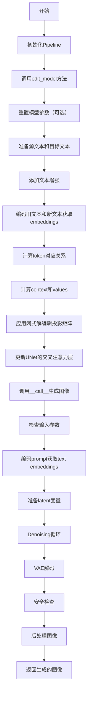
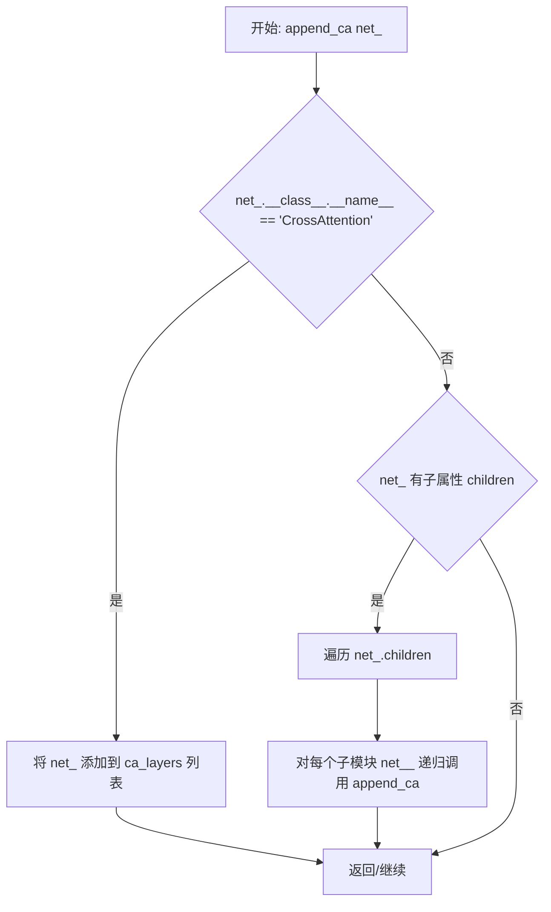
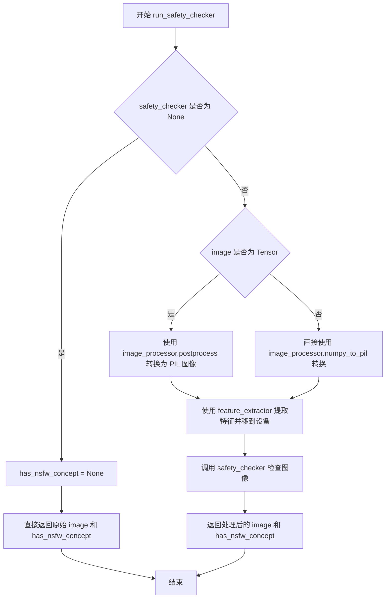
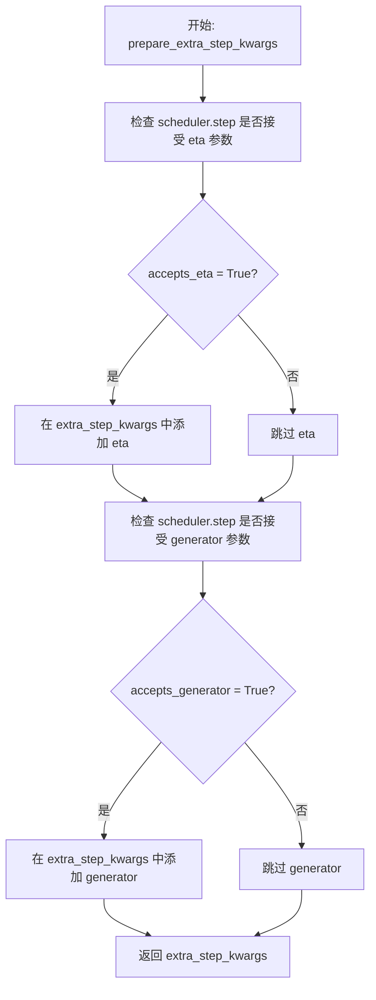
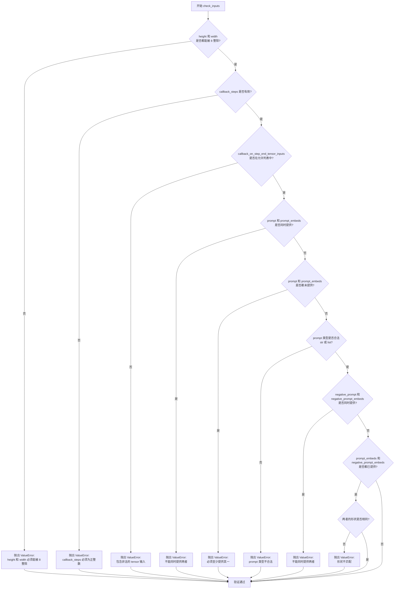
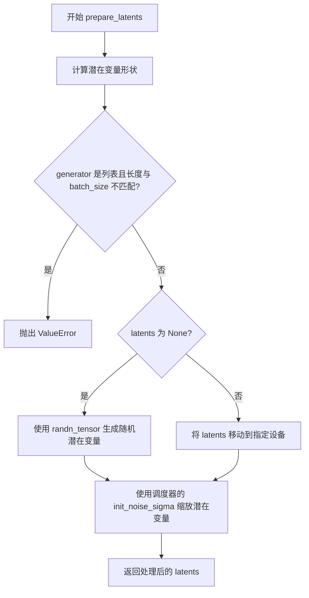
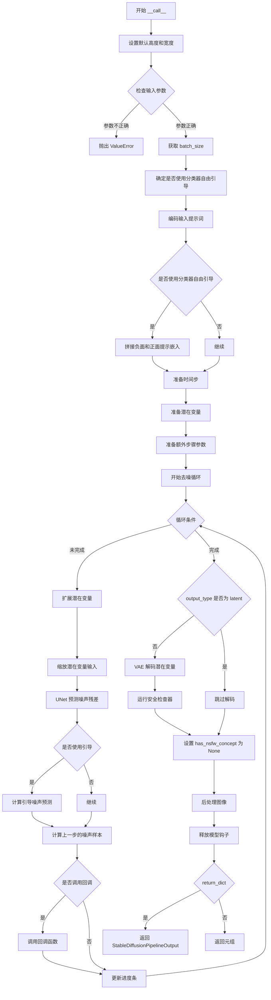

# `diffusers\src\diffusers\pipelines\deprecated\stable_diffusion_variants\pipeline_stable_diffusion_model_editing.py` 详细设计文档

这是一个基于TIME论文方法的Stable Diffusion模型编辑Pipeline，通过编辑CLIP文本编码器中的交叉注意力层投影矩阵来实现文本到图像模型的语义编辑，允许用户将源概念（如'A pack of roses'）编辑为目标概念（如'A pack of blue roses'），并在后续图像生成中应用这些编辑。

## 整体流程



## 类结构

```
DiffusionPipeline (基类)
├── StableDiffusionMixin
├── TextualInversionLoaderMixin
├── StableDiffusionLoraLoaderMixin
└── StableDiffusionModelEditingPipeline (核心类)
```

## 全局变量及字段


### `logger`
    
模块级日志记录器，用于记录管道运行过程中的信息、警告和错误

类型：`logging.Logger`
    


### `AUGS_CONST`
    
文本增强常量列表，包含用于模型编辑时增强文本的预设前缀

类型：`list[str]`
    


### `StableDiffusionModelEditingPipeline.vae`
    
VAE模型用于编码和解码图像与潜在表示之间的转换

类型：`AutoencoderKL`
    


### `StableDiffusionModelEditingPipeline.text_encoder`
    
冻结的文本编码器，用于将文本提示转换为嵌入向量

类型：`CLIPTextModel`
    


### `StableDiffusionModelEditingPipeline.tokenizer`
    
CLIP分词器，用于将文本分词为token ID序列

类型：`CLIPTokenizer`
    


### `StableDiffusionModelEditingPipeline.unet`
    
去噪UNet模型，用于在潜在空间中逐步去噪生成图像

类型：`UNet2DConditionModel`
    


### `StableDiffusionModelEditingPipeline.scheduler`
    
调度器，用于控制去噪过程中的噪声调度和时间步

类型：`SchedulerMixin`
    


### `StableDiffusionModelEditingPipeline.safety_checker`
    
安全检查器，用于检测生成的图像是否包含不当内容

类型：`StableDiffusionSafetyChecker | None`
    


### `StableDiffusionModelEditingPipeline.feature_extractor`
    
CLIP图像特征提取器，用于从生成的图像中提取特征供安全检查器使用

类型：`CLIPImageProcessor | None`
    


### `StableDiffusionModelEditingPipeline.vae_scale_factor`
    
VAE缩放因子，用于计算潜在空间与像素空间之间的缩放比例

类型：`int`
    


### `StableDiffusionModelEditingPipeline.image_processor`
    
VAE图像处理器，用于图像的后处理和格式转换

类型：`VaeImageProcessor`
    


### `StableDiffusionModelEditingPipeline.with_to_k`
    
标志位，控制是否在模型编辑时同时修改key投影矩阵

类型：`bool`
    


### `StableDiffusionModelEditingPipeline.with_augs`
    
文本增强列表，包含在模型编辑过程中应用的文本前缀增强

类型：`list[str]`
    


### `StableDiffusionModelEditingPipeline.ca_clip_layers`
    
CLIP交叉注意力层列表，存储所有与CLIP文本编码器维度匹配的交叉注意力层

类型：`list[CrossAttention]`
    


### `StableDiffusionModelEditingPipeline.projection_matrices`
    
投影矩阵列表，存储可编辑的value和key投影矩阵，用于模型编辑

类型：`list[torch.nn.Linear]`
    


### `StableDiffusionModelEditingPipeline.og_matrices`
    
原始投影矩阵备份，存储编辑前投影矩阵的深拷贝，用于参数重置

类型：`list[torch.nn.Linear]`
    
    

## 全局函数及方法


### `append_ca` (内部函数)

递归查找神经网络中的交叉注意力层（CrossAttention），并将找到的层添加到外部列表 `ca_layers` 中。

参数：

- `net_`：任意对象，需要检查是否为 CrossAttention 层或递归检查其子模块

返回值：`None`，该函数通过修改外部变量 `ca_layers` 列表来返回结果。

#### 流程图



#### 带注释源码

```python
def append_ca(net_):
    """
    递归查找神经网络中的交叉注意力层（CrossAttention）。
    
    该函数是 __init__ 方法内的嵌套函数，通过修改外部变量 ca_layers 来收集
    所有找到的 CrossAttention 层。
    
    参数:
        net_: 任意网络层对象，会检查其类型或递归检查其子模块
    """
    # 检查当前层是否是 CrossAttention 类型
    if net_.__class__.__name__ == "CrossAttention":
        # 如果是，则添加到外部的 ca_layers 列表中
        ca_layers.append(net_)
    # 如果当前层不是 CrossAttention，检查是否有子模块
    elif hasattr(net_, "children"):
        # 遍历所有子模块，递归调用 append_ca 进行查找
        for net__ in net_.children():
            append_ca(net__)
```


### `StableDiffusionModelEditingPipeline.__init__`

该方法是 `StableDiffusionModelEditingPipeline` 类的构造函数，负责初始化整个模型编辑管道的所有核心组件，包括VAE、文本编码器、UNet、调度器、安全检查器等，并自动提取交叉注意力层以支持后续的模型编辑操作。

参数：

- `vae`：`AutoencoderKL`，用于将图像编码和解码到潜在表示的变分自编码器模型
- `text_encoder`：`CLIPTextModel`，冻结的文本编码器（clip-vit-large-patch14）
- `tokenizer`：`CLIPTokenizer`，用于对文本进行分词的CLIP分词器
- `unet`：`UNet2DConditionModel`，用于对编码后的图像潜在表示进行去噪的UNet模型
- `scheduler`：`SchedulerMixin`，与UNet结合使用来去噪图像潜在表示的调度器
- `safety_checker`：`StableDiffusionSafetyChecker`，用于评估生成图像是否可能被认为是冒犯性或有害的分类模块
- `feature_extractor`：`CLIPImageProcessor`，用于从生成图像中提取特征的CLIP图像处理器
- `requires_safety_checker`：`bool`，是否需要安全检查器，默认为True
- `with_to_k`：`bool`，是否同时编辑键投影矩阵，默认为True
- `with_augs`：`list`，模型编辑时应用的文本增强列表，默认为AUGS_CONST

返回值：无（构造函数不返回值）

#### 流程图

```mermaid
flowchart TD
    A[开始 __init__] --> B[调用 super().__init__]
    B --> C{scheduler 是 PNDMScheduler?}
    C -->|是| D[记录错误日志: PNDMScheduler 不支持]
    C -->|否| E{safety_checker 为 None 且 requires_safety_checker 为 True?}
    E -->|是| F[记录警告: 禁用安全检查器]
    E -->|否| G{safety_checker 不为 None 且 feature_extractor 为 None?}
    G -->|是| H[抛出 ValueError: 必须定义 feature_extractor]
    G -->|否| I[调用 register_modules 注册所有模块]
    I --> J[计算 vae_scale_factor]
    J --> K[创建 VaeImageProcessor]
    K --> L[调用 register_to_config]
    L --> M[设置 with_to_k 和 with_augs 属性]
    M --> N[定义 append_ca 函数查找 CrossAttention 层]
    N --> O[遍历 unet 的 down/up/mid 部分查找交叉注意力层]
    O --> P[筛选 CLIP 相关的交叉注意力层]
    P --> Q[提取投影矩阵并保存原始矩阵]
    Q --> R[结束 __init__]
```

#### 带注释源码

```python
def __init__(
    self,
    vae: AutoencoderKL,
    text_encoder: CLIPTextModel,
    tokenizer: CLIPTokenizer,
    unet: UNet2DConditionModel,
    scheduler: SchedulerMixin,
    safety_checker: StableDiffusionSafetyChecker,
    feature_extractor: CLIPImageProcessor,
    requires_safety_checker: bool = True,
    with_to_k: bool = True,
    with_augs: list = AUGS_CONST,
):
    # 调用父类构造函数进行基础初始化
    super().__init__()

    # 检查调度器类型，PNDMScheduler 当前不支持
    if isinstance(scheduler, PNDMScheduler):
        logger.error("PNDMScheduler for this pipeline is currently not supported.")

    # 如果用户要求安全检查但未提供安全检查器，发出警告
    if safety_checker is None and requires_safety_checker:
        logger.warning(
            f"You have disabled the safety checker for {self.__class__} by passing `safety_checker=None`. Ensure"
            " that you abide to the conditions of the Stable Diffusion license and do not expose unfiltered"
            " results in services or applications open to the public. Both the diffusers team and Hugging Face"
            " strongly recommend to keep the safety filter enabled in all public facing circumstances, disabling"
            " it only for use-cases that involve analyzing network behavior or auditing its results. For more"
            " information, please have a look at https://github.com/huggingface/diffusers/pull/254 ."
        )

    # 如果提供了安全检查器但没有特征提取器，抛出错误
    if safety_checker is not None and feature_extractor is None:
        raise ValueError(
            "Make sure to define a feature extractor when loading {self.__class__} if you want to use the safety"
            " checker. If you do not want to use the safety checker, you can pass `'safety_checker=None'` instead."
        )

    # 注册所有模块到管道中
    self.register_modules(
        vae=vae,
        text_encoder=text_encoder,
        tokenizer=tokenizer,
        unet=unet,
        scheduler=scheduler,
        safety_checker=safety_checker,
        feature_extractor=feature_extractor,
    )

    # 计算 VAE 缩放因子，基于 VAE 的块输出通道数
    self.vae_scale_factor = 2 ** (len(self.vae.config.block_out_channels) - 1) if getattr(self, "vae", None) else 8

    # 创建 VAE 图像处理器
    self.image_processor = VaeImageProcessor(vae_scale_factor=self.vae_scale_factor)

    # 将 requires_safety_checker 注册到配置中
    self.register_to_config(requires_safety_checker=requires_safety_checker)

    # 设置模型编辑相关的属性
    self.with_to_k = with_to_k
    self.with_augs = with_augs

    # 获取交叉注意力层
    ca_layers = []

    # 定义递归函数用于查找所有 CrossAttention 层
    def append_ca(net_):
        if net_.__class__.__name__ == "CrossAttention":
            ca_layers.append(net_)
        elif hasattr(net_, "children"):
            for net__ in net_.children():
                append_ca(net__)

    # 递归查找 unet 中 down/up/mid 部分的交叉注意力层
    for net in self.unet.named_children():
        if "down" in net[0]:
            append_ca(net[1])
        elif "up" in net[0]:
            append_ca(net[1])
        elif "mid" in net[0]:
            append_ca(net[1])

    # 筛选出与 CLIP 文本编码器维度匹配的交叉注意力层（768维）
    self.ca_clip_layers = [l for l in ca_layers if l.to_v.in_features == 768]

    # 提取投影矩阵（Value 投影）
    self.projection_matrices = [l.to_v for l in self.ca_clip_layers]

    # 深拷贝原始投影矩阵，用于后续可能的模型编辑重置
    self.og_matrices = [copy.deepcopy(l.to_v) for l in self.ca_clip_layers]

    # 如果需要同时编辑 Key 投影矩阵
    if self.with_to_k:
        self.projection_matrices = self.projection_matrices + [l.to_k for l in self.ca_clip_layers]
        self.og_matrices = self.og_matrices + [copy.deepcopy(l.to_k) for l in self.ca_clip_layers]
```


### `StableDiffusionModelEditingPipeline._encode_prompt`

该方法是一个已弃用的提示词编码封装函数，用于将文本提示转换为文本编码器的隐藏状态。它通过调用 `encode_prompt()` 方法获取提示嵌入，并对返回值进行后向兼容处理（将无条件嵌入和条件嵌入拼接后返回）。该方法已被弃用，建议使用 `encode_prompt()` 替代。

参数：

- `prompt`：`str` 或 `list[str]`，要编码的提示词
- `device`：`torch.device`，torch 设备
- `num_images_per_prompt`：`int`，每个提示词生成的图像数量
- `do_classifier_free_guidance`：`bool`，是否使用无分类器自由引导
- `negative_prompt`：`str` 或 `list[str]`，可选，不用于引导图像生成的提示词
- `prompt_embeds`：`torch.Tensor | None`，可选，预生成的文本嵌入
- `negative_prompt_embeds`：`torch.Tensor | None`，可选，预生成的无条件文本嵌入
- `lora_scale`：`float | None`，可选，要应用于文本编码器所有 LoRA 层的 LoRA 缩放因子
- `**kwargs`：其他关键字参数

返回值：`torch.Tensor`，拼接后的提示嵌入张量

#### 流程图

```mermaid
flowchart TD
    A[开始 _encode_prompt] --> B[记录弃用警告]
    B --> C[调用 encode_prompt 方法]
    C --> D[获取返回的元组 prompt_embeds_tuple]
    D --> E[拼接 embeddings: torch.cat[prompt_embeds_tuple[1], prompt_embeds_tuple[0]]]
    E --> F[返回拼接后的 prompt_embeds]
```

#### 带注释源码

```python
def _encode_prompt(
    self,
    prompt,  # str or list[str]: 要编码的提示词
    device,  # torch.device: torch 设备
    num_images_per_prompt,  # int: 每个提示词生成的图像数量
    do_classifier_free_guidance,  # bool: 是否使用无分类器自由引导
    negative_prompt=None,  # str or list[str]: 可选，不用于引导图像生成的提示词
    prompt_embeds: torch.Tensor | None = None,  # torch.Tensor: 可选，预生成的文本嵌入
    negative_prompt_embeds: torch.Tensor | None = None,  # torch.Tensor: 可选，预生成的无条件文本嵌入
    lora_scale: float | None = None,  # float: 可选，LoRA 缩放因子
    **kwargs,  # dict: 其他关键字参数
):
    # 记录弃用警告信息，提示用户使用 encode_prompt() 替代
    deprecation_message = "`_encode_prompt()` is deprecated and it will be removed in a future version. Use `encode_prompt()` instead. Also, be aware that the output format changed from a concatenated tensor to a tuple."
    deprecate("_encode_prompt()", "1.0.0", deprecation_message, standard_warn=False)

    # 调用 encode_prompt 方法获取嵌入元组
    prompt_embeds_tuple = self.encode_prompt(
        prompt=prompt,
        device=device,
        num_images_per_prompt=num_images_per_prompt,
        do_classifier_free_guidance=do_classifier_free_guidance,
        negative_prompt=negative_prompt,
        prompt_embeds=prompt_embeds,
        negative_prompt_embeds=negative_prompt_embeds,
        lora_scale=lora_scale,
        **kwargs,
    )

    # 为了后向兼容，将元组中的 embeddings 拼接起来
    # prompt_embeds_tuple[1] 是条件嵌入，prompt_embeds_tuple[0] 是无条件嵌入
    # 拼接顺序为 [negative_prompt_embeds, prompt_embeds] 用于兼容旧版本
    prompt_embeds = torch.cat([prompt_embeds_tuple[1], prompt_embeds_tuple[0]])

    return prompt_embeds
```


### `StableDiffusionModelEditingPipeline.encode_prompt`

该方法用于将文本提示（prompt）编码为文本编码器的隐藏状态（hidden states），支持文本提示、负面提示、LoRA 权重调整、CLIP 跳过层等功能，并可生成分类器无关引导（Classifier-Free Guidance）所需的无条件嵌入。

参数：

- `prompt`：`str | list[str] | None`，要编码的提示文本，可以是单个字符串或字符串列表
- `device`：`torch.device`，PyTorch 设备对象，用于指定计算设备
- `num_images_per_prompt`：`int`，每个提示要生成的图像数量
- `do_classifier_free_guidance`：`bool`，是否使用分类器无关引导
- `negative_prompt`：`str | list[str] | None`，不希望出现在生成图像中的提示文本
- `prompt_embeds`：`torch.Tensor | None`，可选的预生成文本嵌入，用于轻松调整文本输入
- `negative_prompt_embeds`：`torch.Tensor | None`，可选的预生成负面文本嵌入
- `lora_scale`：`float | None`，可选的 LoRA 缩放因子，用于调整文本编码器的 LoRA 层
- `clip_skip`：`int | None`，可选的从 CLIP 反向跳过层数，用于计算提示嵌入

返回值：`tuple[torch.Tensor, torch.Tensor]`，返回元组包含 (prompt_embeds, negative_prompt_embeds)，其中 prompt_embeds 是编码后的文本嵌入，negative_prompt_embeds 是编码后的负面文本嵌入（在启用分类器无关引导时）

#### 流程图

```mermaid
flowchart TD
    A[开始 encode_prompt] --> B{检查 lora_scale 是否设置}
    B -->|是| C[调整 LoRA 缩放]
    B -->|否| D{检查 prompt 类型}
    D -->|str| E[batch_size = 1]
    D -->|list| F[batch_size = len(prompt)]
    D -->|其他| G[batch_size = prompt_embeds.shape[0]]
    E --> H{prompt_embeds 为空?}
    F --> H
    G --> H
    H -->|是| I[进行文本标记化]
    I --> J{检查 use_attention_mask}
    J -->|是| K[获取 attention_mask]
    J -->|否| L[attention_mask = None]
    K --> M{clip_skip 为空?}
    L --> M
    M -->|是| N[调用 text_encoder 获取嵌入]
    M -->|否| O[获取隐藏状态并应用 clip_skip]
    N --> P[转换为正确的数据类型和设备]
    O --> P
    H -->|否| P
    P --> Q[重复嵌入 num_images_per_prompt 次]
    Q --> R{do_classifier_free_guidance 为真且 negative_prompt_embeds 为空?}
    R -->|是| S[处理 uncond_tokens]
    R -->|否| T{返回结果}
    S --> U[标记化 uncond_tokens]
    U --> V[获取 negative_prompt_embeds]
    V --> W{do_classifier_free_guidance 为真?}
    W -->|是| X[重复 negative_prompt_embeds]
    W -->|否| T
    X --> T
    T[返回 prompt_embeds, negative_prompt_embeds]
```

#### 带注释源码

```python
def encode_prompt(
    self,
    prompt,
    device,
    num_images_per_prompt,
    do_classifier_free_guidance,
    negative_prompt=None,
    prompt_embeds: torch.Tensor | None = None,
    negative_prompt_embeds: torch.Tensor | None = None,
    lora_scale: float | None = None,
    clip_skip: int | None = None,
):
    r"""
    Encodes the prompt into text encoder hidden states.

    Args:
        prompt (`str` or `list[str]`, *optional*):
            prompt to be encoded
        device: (`torch.device`):
            torch device
        num_images_per_prompt (`int`):
            number of images that should be generated per prompt
        do_classifier_free_guidance (`bool`):
            whether to use classifier free guidance or not
        negative_prompt (`str` or `list[str]`, *optional*):
            The prompt or prompts not to guide the image generation. If not defined, one has to pass
            `negative_prompt_embeds` instead. Ignored when not using guidance (i.e., ignored if `guidance_scale` is
            less than `1`).
        prompt_embeds (`torch.Tensor`, *optional*):
            Pre-generated text embeddings. Can be used to easily tweak text inputs, *e.g.* prompt weighting. If not
            provided, text embeddings will be generated from `prompt` input argument.
        negative_prompt_embeds (`torch.Tensor`, *optional*):
            Pre-generated negative text embeddings. Can be used to easily tweak text inputs, *e.g.* prompt
            weighting. If not provided, negative_prompt_embeds will be generated from `negative_prompt` input
            argument.
        lora_scale (`float`, *optional*):
            A LoRA scale that will be applied to all LoRA layers of the text encoder if LoRA layers are loaded.
        clip_skip (`int`, *optional*):
            Number of layers to be skipped from CLIP while computing the prompt embeddings. A value of 1 means that
            the output of the pre-final layer will be used for computing the prompt embeddings.
    """
    # set lora scale so that monkey patched LoRA
    # function of text encoder can correctly access it
    if lora_scale is not None and isinstance(self, StableDiffusionLoraLoaderMixin):
        self._lora_scale = lora_scale

        # dynamically adjust the LoRA scale
        if not USE_PEFT_BACKEND:
            adjust_lora_scale_text_encoder(self.text_encoder, lora_scale)
        else:
            scale_lora_layers(self.text_encoder, lora_scale)

    if prompt is not None and isinstance(prompt, str):
        batch_size = 1
    elif prompt is not None and isinstance(prompt, list):
        batch_size = len(prompt)
    else:
        batch_size = prompt_embeds.shape[0]

    if prompt_embeds is None:
        # textual inversion: process multi-vector tokens if necessary
        if isinstance(self, TextualInversionLoaderMixin):
            prompt = self.maybe_convert_prompt(prompt, self.tokenizer)

        text_inputs = self.tokenizer(
            prompt,
            padding="max_length",
            max_length=self.tokenizer.model_max_length,
            truncation=True,
            return_tensors="pt",
        )
        text_input_ids = text_inputs.input_ids
        untruncated_ids = self.tokenizer(prompt, padding="longest", return_tensors="pt").input_ids

        if untruncated_ids.shape[-1] >= text_input_ids.shape[-1] and not torch.equal(
            text_input_ids, untruncated_ids
        ):
            removed_text = self.tokenizer.batch_decode(
                untruncated_ids[:, self.tokenizer.model_max_length - 1 : -1]
            )
            logger.warning(
                "The following part of your input was truncated because CLIP can only handle sequences up to"
                f" {self.tokenizer.model_max_length} tokens: {removed_text}"
            )

        if hasattr(self.text_encoder.config, "use_attention_mask") and self.text_encoder.config.use_attention_mask:
            attention_mask = text_inputs.attention_mask.to(device)
        else:
            attention_mask = None

        if clip_skip is None:
            prompt_embeds = self.text_encoder(text_input_ids.to(device), attention_mask=attention_mask)
            prompt_embeds = prompt_embeds[0]
        else:
            prompt_embeds = self.text_encoder(
                text_input_ids.to(device), attention_mask=attention_mask, output_hidden_states=True
            )
            # Access the `hidden_states` first, that contains a tuple of
            # all the hidden states from the encoder layers. Then index into
            # the tuple to access the hidden states from the desired layer.
            prompt_embeds = prompt_embeds[-1][-(clip_skip + 1)]
            # We also need to apply the final LayerNorm here to not mess with the
            # representations. The `last_hidden_states` that we typically use for
            # obtaining the final prompt representations passes through the LayerNorm
            # layer.
            prompt_embeds = self.text_encoder.text_model.final_layer_norm(prompt_embeds)

    if self.text_encoder is not None:
        prompt_embeds_dtype = self.text_encoder.dtype
    elif self.unet is not None:
        prompt_embeds_dtype = self.unet.dtype
    else:
        prompt_embeds_dtype = prompt_embeds.dtype

    prompt_embeds = prompt_embeds.to(dtype=prompt_embeds_dtype, device=device)

    bs_embed, seq_len, _ = prompt_embeds.shape
    # duplicate text embeddings for each generation per prompt, using mps friendly method
    prompt_embeds = prompt_embeds.repeat(1, num_images_per_prompt, 1)
    prompt_embeds = prompt_embeds.view(bs_embed * num_images_per_prompt, seq_len, -1)

    # get unconditional embeddings for classifier free guidance
    if do_classifier_free_guidance and negative_prompt_embeds is None:
        uncond_tokens: list[str]
        if negative_prompt is None:
            uncond_tokens = [""] * batch_size
        elif prompt is not None and type(prompt) is not type(negative_prompt):
            raise TypeError(
                f"`negative_prompt` should be the same type to `prompt`, but got {type(negative_prompt)} !="
                f" {type(prompt)}."
            )
        elif isinstance(negative_prompt, str):
            uncond_tokens = [negative_prompt]
        elif batch_size != len(negative_prompt):
            raise ValueError(
                f"`negative_prompt`: {negative_prompt} has batch size {len(negative_prompt)}, but `prompt`:"
                f" {prompt} has batch size {batch_size}. Please make sure that passed `negative_prompt` matches"
                " the batch size of `prompt`."
            )
        else:
            uncond_tokens = negative_prompt

        # textual inversion: process multi-vector tokens if necessary
        if isinstance(self, TextualInversionLoaderMixin):
            uncond_tokens = self.maybe_convert_prompt(uncond_tokens, self.tokenizer)

        max_length = prompt_embeds.shape[1]
        uncond_input = self.tokenizer(
            uncond_tokens,
            padding="max_length",
            max_length=max_length,
            truncation=True,
            return_tensors="pt",
        )

        if hasattr(self.text_encoder.config, "use_attention_mask") and self.text_encoder.config.use_attention_mask:
            attention_mask = uncond_input.attention_mask.to(device)
        else:
            attention_mask = None

        negative_prompt_embeds = self.text_encoder(
            uncond_input.input_ids.to(device),
            attention_mask=attention_mask,
        )
        negative_prompt_embeds = negative_prompt_embeds[0]

    if do_classifier_free_guidance:
        # duplicate unconditional embeddings for each generation per prompt, using mps friendly method
        seq_len = negative_prompt_embeds.shape[1]

        negative_prompt_embeds = negative_prompt_embeds.to(dtype=prompt_embeds_dtype, device=device)

        negative_prompt_embeds = negative_prompt_embeds.repeat(1, num_images_per_prompt, 1)
        negative_prompt_embeds = negative_prompt_embeds.view(batch_size * num_images_per_prompt, seq_len, -1)

    if self.text_encoder is not None:
        if isinstance(self, StableDiffusionLoraLoaderMixin) and USE_PEFT_BACKEND:
            # Retrieve the original scale by scaling back the LoRA layers
            unscale_lora_layers(self.text_encoder, lora_scale)

    return prompt_embeds, negative_prompt_embeds
```


### `StableDiffusionModelEditingPipeline.run_safety_checker`

该方法用于检查生成的图像是否包含不适合公开显示的内容（NSFW），通过安全检查器对图像进行分类，返回处理后的图像以及是否存在不安全内容的标识。

参数：

- `image`：`torch.Tensor | numpy.ndarray`，待检查的图像数据
- `device`：`torch.device`，用于将特征提取器输入移动到指定设备
- `dtype`：`torch.dtype`，数据类型，用于将像素值转换为指定的数据类型以匹配安全检查器的输入要求

返回值：`(torch.Tensor | numpy.ndarray, torch.Tensor | None)`，返回元组，第一个元素是处理后的图像（可能被替换为安全图像），第二个元素是是否存在NSFW概念的布尔标识

#### 流程图



#### 带注释源码

```python
def run_safety_checker(self, image, device, dtype):
    """
    运行安全检查器，对生成的图像进行NSFW内容检测
    
    参数:
        image: 待检查的图像，可以是torch.Tensor或numpy.ndarray格式
        device: 计算设备（CPU/CUDA），用于特征提取器输入
        dtype: 数据类型，用于将像素值转换为安全检查器所需的数据类型
    
    返回:
        tuple: (处理后的图像, NSFW检测结果)
            - image: 处理后的图像，如果检测到NSFW内容可能被替换为黑色图像
            - has_nsfw_concept: 布尔张量或None，指示每个图像是否包含NSFW内容
    """
    # 如果安全检查器未配置，直接返回，不进行任何检查
    if self.safety_checker is None:
        has_nsfw_concept = None
    else:
        # 根据图像类型进行不同的预处理
        if torch.is_tensor(image):
            # 如果是PyTorch张量，先转换为PIL图像列表
            feature_extractor_input = self.image_processor.postprocess(image, output_type="pil")
        else:
            # 如果是numpy数组，直接转换为PIL图像
            feature_extractor_input = self.image_processor.numpy_to_pil(image)
        
        # 使用CLIP特征提取器提取图像特征，并移动到指定设备
        safety_checker_input = self.feature_extractor(feature_extractor_input, return_tensors="pt").to(device)
        
        # 调用安全检查器进行NSFW检测，传入图像和CLIP特征
        image, has_nsfw_concept = self.safety_checker(
            images=image, clip_input=safety_checker_input.pixel_values.to(dtype)
        )
    
    # 返回处理后的图像和NSFW检测结果
    return image, has_nsfw_concept
```

#### 关键组件信息

- **safety_checker** (`StableDiffusionSafetyChecker`)：用于检测图像中是否包含不适合公开内容（NSFW）的模型
- **feature_extractor** (`CLIPImageProcessor`)：CLIP图像处理器，用于提取图像特征供安全检查器使用
- **image_processor** (`VaeImageProcessor`)：VAE图像处理器，用于图像格式转换和后处理

#### 技术债务与优化空间

1. **重复代码**：该方法是从 `StableDiffusionPipeline` 复制的，可以考虑提取为基类或工具函数以提高代码复用性
2. **缺少异步处理**：安全检查器推理是同步的，在批量生成时可能成为性能瓶颈
3. **硬编码输出类型**：图像预处理时硬编码了 `"pil"` 输出类型，缺乏灵活性


### `StableDiffusionModelEditingPipeline.decode_latents`

将输入的潜在表示（latents）通过 VAE 解码器转换为实际的图像数组。该方法包含反缩放、VAE 解码、像素值归一化以及格式转换操作。

参数：

- `latents`：`torch.Tensor`，需要解码的潜在表示张量，通常来自 UNet 的输出

返回值：`numpy.ndarray`，解码后的图像，形状为 (batch_size, height, width, channels)，像素值范围 [0, 1]

#### 流程图

```mermaid
flowchart TD
    A[输入: latents 潜在表示] --> B[反缩放: latents = 1 / scaling_factor × latents]
    B --> C[VAE 解码: image = vae.decode(latents)]
    C --> D[像素值归一化: image = (image / 2 + 0.5).clamp(0, 1)]
    D --> E[格式转换: 张量→numpy数组<br/>permute + cpu + float]
    E --> F[输出: numpy.ndarray 图像数组]
```

#### 带注释源码

```python
def decode_latents(self, latents):
    """
    将潜在表示解码为实际图像。
    
    注意：此方法已被弃用，将在 1.0.0 版本中移除。
    建议使用 VaeImageProcessor.postprocess(...) 代替。
    """
    # 发出弃用警告，提示用户使用新方法
    deprecation_message = "The decode_latents method is deprecated and will be removed in 1.0.0. Please use VaeImageProcessor.postprocess(...) instead"
    deprecate("decode_latents", "1.0.0", deprecation_message, standard_warn=False)

    # 步骤1: 反缩放潜在表示
    # VAE 在编码时会对 latents 进行缩放 (乘以 scaling_factor)
    # 解码前需要除以 scaling_factor 恢复到原始尺度
    latents = 1 / self.vae.config.scaling_factor * latents
    
    # 步骤2: 使用 VAE 解码器将潜在表示解码为图像
    # vae.decode 返回一个元组 (image, ...)，取第一个元素 [0]
    image = self.vae.decode(latents, return_dict=False)[0]
    
    # 步骤3: 像素值归一化到 [0, 1] 范围
    # VAE 输出通常在 [-1, 1] 范围，通过 (x/2 + 0.5) 转换到 [0, 1]
    image = (image / 2 + 0.5).clamp(0, 1)
    
    # 步骤4: 格式转换 - 从 PyTorch 张量转换为 NumPy 数组
    # - .cpu(): 将张量从 GPU 移到 CPU
    # - .permute(0, 2, 3, 1): 调整维度顺序从 (B, C, H, W) 变为 (B, H, W, C)
    # - .float(): 转换为 float32，避免 bfloat16 兼容性问题
    # - .numpy(): 转换为 NumPy 数组
    image = image.cpu().permute(0, 2, 3, 1).float().numpy()
    
    # 返回解码后的图像数组
    return image
```


### `StableDiffusionModelEditingPipeline.prepare_extra_step_kwargs`

该方法用于为调度器（scheduler）的步骤准备额外的关键字参数。由于不同调度器的签名不完全相同，此方法通过检查调度器的 `step` 方法是否接受 `eta` 和 `generator` 参数来动态构建需要传递的额外参数字典。

参数：

- `generator`：`torch.Generator | list[torch.Generator] | None`，随机数生成器，用于确保生成过程的可重复性
- `eta`：`float`，DDIM 调度器（DDIMScheduler）使用的 eta 参数（η），对应 DDIM 论文中的参数，取值范围应为 [0, 1]；其他调度器会忽略此参数

返回值：`dict[str, Any]`，包含调度器 `step` 方法所需的关键字参数字典，可能包含 `eta` 和/或 `generator` 键

#### 流程图



#### 带注释源码

```
def prepare_extra_step_kwargs(self, generator, eta):
    # 准备调度器步骤所需的额外参数，因为并非所有调度器都具有相同的签名
    # eta (η) 仅在 DDIMScheduler 中使用，其他调度器会将其忽略
    # eta 对应 DDIM 论文 (https://huggingface.co/papers/2010.02502) 中的 η 参数
    # 取值应在 [0, 1] 范围内
    
    # 检查调度器的 step 方法是否接受 eta 参数
    accepts_eta = "eta" in set(inspect.signature(self.scheduler.step).parameters.keys())
    # 初始化空字典用于存储额外参数
    extra_step_kwargs = {}
    # 如果调度器接受 eta 参数，则将其添加到 extra_step_kwargs 中
    if accepts_eta:
        extra_step_kwargs["eta"] = eta
    
    # 检查调度器是否接受 generator 参数
    accepts_generator = "generator" in set(inspect.signature(self.scheduler.step).parameters.keys())
    # 如果调度器接受 generator 参数，则将其添加到 extra_step_kwargs 中
    if accepts_generator:
        extra_step_kwargs["generator"] = generator
    
    # 返回包含调度器所需额外参数的字典
    return extra_step_kwargs
```


### `StableDiffusionModelEditingPipeline.check_inputs`

该方法用于验证图像生成管道的输入参数是否合法，确保 `height` 和 `width` 能被 8 整除、`callback_steps` 为正整数、且 `prompt` 与 `prompt_embeds` 不能同时提供（只能选择其中一种输入方式），同时检查负向提示与嵌入的完整性及形状一致性。

参数：

- `self`：`StableDiffusionModelEditingPipeline` 实例本身，隐式传递
- `prompt`：`str | list[str] | None`，正向提示词，用于指导图像生成
- `height`：`int`，生成图像的高度（像素），必须能被 8 整除
- `width`：`int`，生成图像的宽度（像素），必须能被 8 整除
- `callback_steps`：`int`，每经过多少步调用一次回调函数，必须为正整数
- `negative_prompt`：`str | list[str] | None`，负向提示词，用于指导不希望出现的图像特征
- `prompt_embeds`：`torch.Tensor | None`，预生成的文本嵌入向量，不能与 `prompt` 同时提供
- `negative_prompt_embeds`：`torch.Tensor | None`，预生成的负向文本嵌入向量，不能与 `negative_prompt` 同时提供
- `callback_on_step_end_tensor_inputs`：`list[str] | None`，回调函数在每步结束时可访问的张量输入列表

返回值：`None`，该方法不返回任何值，仅通过抛出 `ValueError` 来指示输入错误

#### 流程图



#### 带注释源码

```python
def check_inputs(
    self,
    prompt,
    height,
    width,
    callback_steps,
    negative_prompt=None,
    prompt_embeds=None,
    negative_prompt_embeds=None,
    callback_on_step_end_tensor_inputs=None,
):
    """
    检查输入参数的合法性，验证图像生成所需的尺寸、提示词和嵌入向量是否符合要求。
    
    该方法会进行多项验证：
    1. 图像尺寸必须能被 8 整除（由于 VAE 的下采样系数）
    2. callback_steps 必须为正整数
    3. prompt 和 prompt_embeds 不能同时提供
    4. prompt 和 prompt_embeds 至少提供一个
    5. prompt 类型必须为 str 或 list
    6. negative_prompt 和 negative_prompt_embeds 不能同时提供
    7. prompt_embeds 和 negative_prompt_embeds 形状必须一致
    """
    
    # 检查图像高度和宽度是否能被 8 整除
    # 这是因为 VAE 通常有 2^(len(block_out_channels)-1) 的下采样因子
    # 最常见的情况是下采样 8 倍 (2^3)
    if height % 8 != 0 or width % 8 != 0:
        raise ValueError(f"`height` and `width` have to be divisible by 8 but are {height} and {width}.")

    # 验证 callback_steps 参数
    # 必须是整数类型且大于 0，用于控制回调函数的调用频率
    if callback_steps is not None and (not isinstance(callback_steps, int) or callback_steps <= 0):
        raise ValueError(
            f"`callback_steps` has to be a positive integer but is {callback_steps} of type"
            f" {type(callback_steps)}."
        )
    
    # 验证回调函数可访问的张量输入是否在允许列表中
    # _callback_tensor_inputs 是 Pipeline 基类中定义的允许使用的张量名称集合
    if callback_on_step_end_tensor_inputs is not None and not all(
        k in self._callback_tensor_inputs for k in callback_on_step_end_tensor_inputs
    ):
        raise ValueError(
            f"`callback_on_step_end_tensor_inputs` has to be in {self._callback_tensor_inputs}, but found {[k for k in callback_on_step_end_tensor_inputs if k not in self._callback_tensor_inputs]}"
        )

    # 检查 prompt 和 prompt_embeds 是否同时提供
    # 这两种输入方式只能选择一种，不能同时使用
    if prompt is not None and prompt_embeds is not None:
        raise ValueError(
            f"Cannot forward both `prompt`: {prompt} and `prompt_embeds`: {prompt_embeds}. Please make sure to"
            " only forward one of the two."
        )
    # 检查是否两者都未提供
    # 至少需要提供其中一种输入方式
    elif prompt is None and prompt_embeds is None:
        raise ValueError(
            "Provide either `prompt` or `prompt_embeds`. Cannot leave both `prompt` and `prompt_embeds` undefined."
        )
    # 检查 prompt 的类型是否合法
    # 必须是字符串或字符串列表
    elif prompt is not None and (not isinstance(prompt, str) and not isinstance(prompt, list)):
        raise ValueError(f"`prompt` has to be of type `str` or `list` but is {type(prompt)}")

    # 检查 negative_prompt 和 negative_prompt_embeds 是否同时提供
    # 与上述 prompt 的检查逻辑相同
    if negative_prompt is not None and negative_prompt_embeds is not None:
        raise ValueError(
            f"Cannot forward both `negative_prompt`: {negative_prompt} and `negative_prompt_embeds`:"
            f" {negative_prompt_embeds}. Please make sure to only forward one of the two."
        )

    # 检查 prompt_embeds 和 negative_prompt_embeds 的形状是否一致
    # 这对于分类器自由引导（Classifier-Free Guidance）很重要
    # 两个嵌入向量需要有相同的批次大小、序列长度和隐藏维度
    if prompt_embeds is not None and negative_prompt_embeds is not None:
        if prompt_embeds.shape != negative_prompt_embeds.shape:
            raise ValueError(
                "`prompt_embeds` and `negative_prompt_embeds` must have the same shape when passed directly, but"
                f" got: `prompt_embeds` {prompt_embeds.shape} != `negative_prompt_embeds`"
                f" {negative_prompt_embeds.shape}."
            )
```


### `StableDiffusionModelEditingPipeline.prepare_latents`

该方法用于准备扩散模型的潜在变量（latents）。它根据指定的批次大小、图像尺寸创建或使用预生成的潜在变量，并根据调度器的初始噪声标准差对潜在变量进行缩放，以适配去噪过程的起始条件。

参数：

- `batch_size`：`int`，生成的图像数量
- `num_channels_latents`：`int`，潜在变量的通道数，通常对应于 UNet 的输入通道数
- `height`：`int`，生成图像的高度（像素）
- `width`：`int`，生成图像的宽度（像素）
- `dtype`：`torch.dtype`，潜在变量的数据类型
- `device`：`torch.device`，潜在变量所在的设备
- `generator`：`torch.Generator` 或 `list[torch.Generator]`，用于生成随机数的随机数生成器，确保可重复性
- `latents`：`torch.Tensor | None`，可选的预生成潜在变量。如果为 `None`，则随机生成

返回值：`torch.Tensor`，处理后的潜在变量张量，已根据调度器的初始噪声标准差进行缩放

#### 流程图



#### 带注释源码

```python
def prepare_latents(
    self,
    batch_size: int,
    num_channels_latents: int,
    height: int,
    width: int,
    dtype: torch.dtype,
    device: torch.device,
    generator: torch.Generator | list[torch.Generator] | None,
    latents: torch.Tensor | None = None
):
    """
    准备用于扩散过程的潜在变量。
    
    Args:
        batch_size: 生成的图像数量
        num_channels_latents: 潜在变量的通道数
        height: 输出图像高度
        width: 输出图像宽度
        dtype: 潜在变量的数据类型
        device: 潜在变量存放的设备
        generator: 随机数生成器，用于确保可重复性
        latents: 可选的预生成潜在变量
    
    Returns:
        处理后的潜在变量张量
    """
    # 计算潜在变量的形状：批次大小 x 通道数 x (高度/VAE缩放因子) x (宽度/VAE缩放因子)
    # VAE 缩放因子用于将像素空间转换为潜在空间
    shape = (
        batch_size,
        num_channels_latents,
        int(height) // self.vae_scale_factor,
        int(width) // self.vae_scale_factor,
    )
    
    # 验证：如果传入多个生成器，其数量必须与批次大小匹配
    if isinstance(generator, list) and len(generator) != batch_size:
        raise ValueError(
            f"You have passed a list of generators of length {len(generator)}, but requested an effective batch"
            f" size of {batch_size}. Make sure the batch size matches the length of the generators."
        )

    # 如果没有提供预生成的潜在变量，则随机生成
    if latents is None:
        latents = randn_tensor(shape, generator=generator, device=device, dtype=dtype)
    else:
        # 将提供的潜在变量移动到目标设备
        latents = latents.to(device)

    # 根据调度器的初始噪声标准差缩放初始噪声
    # 这确保了潜在变量与调度器的去噪计划相匹配
    latents = latents * self.scheduler.init_noise_sigma
    return latents
```


### `StableDiffusionModelEditingPipeline.edit_model`

该函数通过闭式解（closed-form solution）对Stable Diffusion模型进行编辑，基于TIME论文中的方法修改UNet的交叉注意力投影矩阵（key和value projections），从而改变模型对特定概念的认知。

参数：

- `source_prompt`：`str`，包含待编辑概念的原提示词
- `destination_prompt`：`str`，目标提示词，需包含原提示词的所有词汇并添加额外词汇指定编辑目标
- `lamb`：`float`，正则化强度参数，值越小编辑能力越强，默认值为0.1
- `restart_params`：`bool`，是否在编辑前将模型参数重置为预训练版本，默认值为True

返回值：`None`，该函数直接修改模型的投影矩阵，无返回值

#### 流程图

```mermaid
flowchart TD
    A[开始 edit_model] --> B{restart_params?}
    B -->|True| C[重置投影矩阵到原始值]
    B -->|False| D[跳过重置]
    C --> D
    D --> E[设置句子列表: 源提示词 + 目标提示词]
    E --> F[添加文本增强: with_augs]
    F --> G[为每个句子对获取文本嵌入]
    G --> H[计算源提示词和目标提示词的token对应关系]
    H --> I[准备context和values向量]
    I --> J[对每个投影矩阵层应用闭式解]
    J --> K[更新投影矩阵权重]
    K --> L[结束]
    
    J --> J1[mat1 = λW + Σv kᵀ]
    J --> J2[mat2 = λI + Σk kᵀ]
    J --> J3[mat1 = mat1 + Σ value@contextᵀ]
    J --> J4[mat2 = mat2 + Σ context@contextᵀ]
    J --> J5[weight = mat1 @ inv(mat2)]
```

#### 带注释源码

```python
@torch.no_grad()
def edit_model(
    self,
    source_prompt: str,
    destination_prompt: str,
    lamb: float = 0.1,
    restart_params: bool = True,
):
    r"""
    通过闭式解应用模型编辑（参见TIME论文中的公式5）。
    
    Args:
        source_prompt: 包含待编辑概念的源提示词
        destination_prompt: 目标提示词，需包含源提示词的所有词汇并添加额外词指定编辑目标
        lamb: 正则化强度参数，较小值增加编辑能力
        restart_params: 是否在编辑前重置模型参数以避免编辑累积
    """
    
    # 1. 如果restart_params为True，重置LDM参数到原始预训练版本
    if restart_params:
        num_ca_clip_layers = len(self.ca_clip_layers)
        for idx_, l in enumerate(self.ca_clip_layers):
            # 将value投影矩阵重置为原始值
            l.to_v = copy.deepcopy(self.og_matrices[idx_])
            self.projection_matrices[idx_] = l.to_v
            # 如果需要同时编辑key投影矩阵
            if self.with_to_k:
                l.to_k = copy.deepcopy(self.og_matrices[num_ca_clip_layers + idx_])
                self.projection_matrices[num_ca_clip_layers + idx_] = l.to_k

    # 2. 设置句子列表
    old_texts = [source_prompt]  # 源提示词列表
    new_texts = [destination_prompt]  # 目标提示词列表
    
    # 添加文本增强（默认为["A photo of ", "An image of ", "A picture of "])
    base = old_texts[0] if old_texts[0][0:1] != "A" else "a" + old_texts[0][1:]
    for aug in self.with_augs:
        old_texts.append(aug + base)
    
    base = new_texts[0] if new_texts[0][0:1] != "A" else "a" + new_texts[0][1:]
    for aug in self.with_augs:
        new_texts.append(aug + base)

    # 3. 准备输入k*和v*：获取源提示词和目标提示词的文本嵌入
    old_embs, new_embs = [], []
    for old_text, new_text in zip(old_texts, new_texts):
        # 使用tokenizer将文本转换为token IDs
        text_input = self.tokenizer(
            [old_text, new_text],
            padding="max_length",
            max_length=self.tokenizer.model_max_length,
            truncation=True,
            return_tensors="pt",
        )
        # 通过text_encoder获取文本嵌入
        text_embeddings = self.text_encoder(text_input.input_ids.to(self.device))[0]
        old_emb, new_emb = text_embeddings
        old_embs.append(old_emb)
        new_embs.append(new_emb)

    # 4. 识别源提示词中每个token在目标提示词中的对应位置
    idxs_replaces = []
    for old_text, new_text in zip(old_texts, new_texts):
        tokens_a = self.tokenizer(old_text).input_ids
        tokens_b = self.tokenizer(new_text).input_ids
        # 处理"an"到"a"的转换
        tokens_a = [self.tokenizer.encode("a ")[1] if self.tokenizer.decode(t) == "an" else t for t in tokens_a]
        tokens_b = [self.tokenizer.encode("a ")[1] if self.tokenizer.decode(t) == "an" else t for t in tokens_b]
        
        num_orig_tokens = len(tokens_a)
        idxs_replace = []
        j = 0
        # 找到源token在目标token序列中的位置
        for i in range(num_orig_tokens):
            curr_token = tokens_a[i]
            while tokens_b[j] != curr_token:
                j += 1
            idxs_replace.append(j)
            j += 1
        # 填充剩余位置
        while j < 77:
            idxs_replace.append(j)
            j += 1
        while len(idxs_replace) < 77:
            idxs_replace.append(76)
        idxs_replaces.append(idxs_replace)

    # 5. 准备batch：为每个句子对准备旧上下文和新值
    contexts, valuess = [], []
    for old_emb, new_emb, idxs_replace in zip(old_embs, new_embs, idxs_replaces):
        context = old_emb.detach()
        values = []
        with torch.no_grad():
            # 使用投影矩阵将新的文本嵌入投影到值空间
            for layer in self.projection_matrices:
                values.append(layer(new_emb[idxs_replace]).detach())
        contexts.append(context)
        valuess.append(values)

    # 6. 编辑模型：应用闭式解更新投影矩阵
    for layer_num in range(len(self.projection_matrices)):
        # mat1 = λW + Σv kᵀ
        mat1 = lamb * self.projection_matrices[layer_num].weight

        # mat2 = λI + Σk kᵀ
        mat2 = lamb * torch.eye(
            self.projection_matrices[layer_num].weight.shape[1],
            device=self.projection_matrices[layer_num].weight.device,
        )

        # 聚合mat1和mat2的求和项
        for context, values in zip(contexts, valuess):
            context_vector = context.reshape(context.shape[0], context.shape[1], 1)
            context_vector_T = context.reshape(context.shape[0], 1, context.shape[1])
            value_vector = values[layer_num].reshape(values[layer_num].shape[0], values[layer_num].shape[1], 1)
            for_mat1 = (value_vector @ context_vector_T).sum(dim=0)
            for_mat2 = (context_vector @ context_vector_T).sum(dim=0)
            mat1 += for_mat1
            mat2 += for_mat2

        # 更新投影矩阵权重：新权重 = mat1 @ mat2⁻¹
        self.projection_matrices[layer_num].weight = torch.nn.Parameter(mat1 @ torch.inverse(mat2))
```


### StableDiffusionModelEditingPipeline.__call__

这是 `StableDiffusionModelEditingPipeline` 的核心调用方法，负责执行文本到图像的生成流程。该方法通过编码提示词、准备潜在变量、执行去噪循环（UNet 推理）、解码潜在表示，最后进行安全检查并输出生成的图像。该管道特点是可以预先通过 `edit_model` 方法编辑模型的交叉注意力投影矩阵，从而实现对生成图像概念的直接编辑。

#### 参数

- `prompt`：`str | list[str] | None`，用于引导图像生成的提示词。如果未定义，则需要传递 `prompt_embeds`。
- `height`：`int | None`，生成图像的高度（像素），默认为 `self.unet.config.sample_size * self.vae_scale_factor`。
- `width`：`int | None`，生成图像的宽度（像素），默认为 `self.unet.config.sample_size * self.vae_scale_factor`。
- `num_inference_steps`：`int | None`，去噪步数，默认为 50。更多的去噪步数通常能获得更高质量的图像，但推理速度会更慢。
- `guidance_scale`：`float | None`，引导比例，默认为 7.5。较高的引导比例值鼓励模型生成与文本提示紧密相关的图像，但会牺牲图像质量。当 `guidance_scale > 1` 时启用引导。
- `negative_prompt`：`str | list[str] | None`，用于指导不要包含在图像生成中的提示词。如果未定义，则需要传递 `negative_prompt_embeds`。仅在启用引导时生效（`guidance_scale >= 1`）。
- `num_images_per_prompt`：`int | None`，每个提示词生成的图像数量，默认为 1。
- `eta`：`float | None`，对应 DDIM 论文中的 eta 参数，仅适用于 DDIMScheduler，其他调度器会忽略此参数。
- `generator`：`torch.Generator | list[torch.Generator] | None`，用于使生成具有确定性。
- `latents`：`torch.Tensor | None`，预生成的噪声潜在变量，用于图像生成。如果未提供，将使用随机 generator 生成潜在张量。
- `prompt_embeds`：`torch.Tensor | None`，预生成的文本嵌入，可用于轻松调整文本输入（提示词加权）。
- `negative_prompt_embeds`：`torch.Tensor | None`，预生成的负面文本嵌入，可用于轻松调整文本输入。
- `output_type`：`str | None`，生成图像的输出格式，默认为 `"pil"`，可选 `PIL.Image` 或 `np.array`。
- `return_dict`：`bool | None`，是否返回 `StableDiffusionPipelineOutput`，默认为 `True`。
- `callback`：`Callable[[int, int, torch.Tensor], None] | None`，每 `callback_steps` 步调用的回调函数，调用时传递 `callback(step: int, timestep: int, latents: torch.Tensor)`。
- `callback_steps`：`int | None`，回调函数被调用的频率，默认为每步调用。
- `cross_attention_kwargs`：`dict[str, Any] | None`，传递给 AttentionProcessor 的参数字典。
- `clip_skip`：`int | None`，计算提示嵌入时从 CLIP 跳过的层数。

#### 流程图



#### 带注释源码

```python
@torch.no_grad()
def __call__(
    self,
    prompt: str | list[str] = None,
    height: int | None = None,
    width: int | None = None,
    num_inference_steps: int = 50,
    guidance_scale: float = 7.5,
    negative_prompt: str | list[str] | None = None,
    num_images_per_prompt: int | None = 1,
    eta: float = 0.0,
    generator: torch.Generator | list[torch.Generator] | None = None,
    latents: torch.Tensor | None = None,
    prompt_embeds: torch.Tensor | None = None,
    negative_prompt_embeds: torch.Tensor | None = None,
    output_type: str | None = "pil",
    return_dict: bool = True,
    callback: Callable[[int, int, torch.Tensor], None] | None = None,
    callback_steps: int = 1,
    cross_attention_kwargs: dict[str, Any] | None = None,
    clip_skip: int | None = None,
):
    r"""
    The call function to the pipeline for generation.

    Args:
        prompt (`str` or `list[str]`, *optional*):
            The prompt or prompts to guide image generation. If not defined, you need to pass `prompt_embeds`.
        height (`int`, *optional*, defaults to `self.unet.config.sample_size * self.vae_scale_factor`):
            The height in pixels of the generated image.
        width (`int`, *optional*, defaults to `self.unet.config.sample_size * self.vae_scale_factor`):
            The width in pixels of the generated image.
        num_inference_steps (`int`, *optional*, defaults to 50):
            The number of denoising steps. More denoising steps usually lead to a higher quality image at the
            expense of slower inference.
        guidance_scale (`float`, *optional*, defaults to 7.5):
            A higher guidance scale value encourages the model to generate images closely linked to the text
            `prompt` at the expense of lower image quality. Guidance scale is enabled when `guidance_scale > 1`.
        negative_prompt (`str` or `list[str]`, *optional*):
            The prompt or prompts to guide what to not include in image generation. If not defined, you need to
            pass `negative_prompt_embeds` instead. Ignored when not using guidance (`guidance_scale < 1`).
        num_images_per_prompt (`int`, *optional*, defaults to 1):
            The number of images to generate per prompt.
        eta (`float`, *optional*, defaults to 0.0):
            Corresponds to parameter eta (η) from the [DDIM](https://huggingface.co/papers/2010.02502) paper. Only
            applies to the [`~schedulers.DDIMScheduler`], and is ignored in other schedulers.
        generator (`torch.Generator` or `list[torch.Generator]`, *optional*):
            A [`torch.Generator`](https://pytorch.org/docs/stable/generated/torch.Generator.html) to make
            generation deterministic.
        latents (`torch.Tensor`, *optional*):
            Pre-generated noisy latents sampled from a Gaussian distribution, to be used as inputs for image
            generation. Can be used to tweak the same generation with different prompts. If not provided, a latents
            tensor is generated by sampling using the supplied random `generator`.
        prompt_embeds (`torch.Tensor`, *optional*):
            Pre-generated text embeddings. Can be used to easily tweak text inputs (prompt weighting). If not
            provided, text embeddings are generated from the `prompt` input argument.
        negative_prompt_embeds (`torch.Tensor`, *optional*):
            Pre-generated negative text embeddings. Can be used to easily tweak text inputs (prompt weighting). If
            not provided, `negative_prompt_embeds` are generated from the `negative_prompt` input argument.
        output_type (`str`, *optional*, defaults to `"pil"`):
            The output format of the generated image. Choose between `PIL.Image` or `np.array`.
        return_dict (`bool`, *optional*, defaults to `True`):
            Whether or not to return a [`~pipelines.stable_diffusion.StableDiffusionPipelineOutput`] instead of a
            plain tuple.
        callback (`Callable`, *optional*):
            A function that calls every `callback_steps` steps during inference. The function is called with the
            following arguments: `callback(step: int, timestep: int, latents: torch.Tensor)`.
        callback_steps (`int`, *optional*, defaults to 1):
            The frequency at which the `callback` function is called. If not specified, the callback is called at
            every step.
        cross_attention_kwargs (`dict`, *optional*):
            A kwargs dictionary that if specified is passed along to the [`AttentionProcessor`] as defined in
            [`self.processor`](https://github.com/huggingface/diffusers/blob/main/src/diffusers/models/attention_processor.py).
        clip_skip (`int`, *optional*):
            Number of layers to be skipped from CLIP while computing the prompt embeddings. A value of 1 means that
            the output of the pre-final layer will be used for computing the prompt embeddings.

    Examples:

    ```py
    >>> import torch
    >>> from diffusers import StableDiffusionModelEditingPipeline

    >>> model_ckpt = "CompVis/stable-diffusion-v1-4"
    >>> pipe = StableDiffusionModelEditingPipeline.from_pretrained(model_ckpt)

    >>> pipe = pipe.to("cuda")

    >>> source_prompt = "A pack of roses"
    >>> destination_prompt = "A pack of blue roses"
    >>> pipe.edit_model(source_prompt, destination_prompt)

    >>> prompt = "A field of roses"
    >>> image = pipe(prompt).images[0]
    ```

    Returns:
        [`~pipelines.stable_diffusion.StableDiffusionPipelineOutput`] or `tuple`:
            If `return_dict` is `True`, [`~pipelines.stable_diffusion.StableDiffusionPipelineOutput`] is returned,
            otherwise a `tuple` is returned where the first element is a list with the generated images and the
            second element is a list of `bool`s indicating whether the corresponding generated image contains
            "not-safe-for-work" (nsfw) content.
    """
    # 0. Default height and width to unet
    # 如果未提供 height 和 width，则使用 UNet 配置中的 sample_size 乘以 VAE 缩放因子
    height = height or self.unet.config.sample_size * self.vae_scale_factor
    width = width or self.unet.config.sample_size * self.vae_scale_factor

    # 1. Check inputs. Raise error if not correct
    # 验证输入参数的有效性
    self.check_inputs(
        prompt, height, width, callback_steps, negative_prompt, prompt_embeds, negative_prompt_embeds
    )

    # 2. Define call parameters
    # 根据 prompt 或 prompt_embeds 确定批次大小
    if prompt is not None and isinstance(prompt, str):
        batch_size = 1
    elif prompt is not None and isinstance(prompt, list):
        batch_size = len(prompt)
    else:
        batch_size = prompt_embeds.shape[0]

    # 获取执行设备
    device = self._execution_device
    # here `guidance_scale` is defined analog to the guidance weight `w` of equation (2)
    # of the Imagen paper: https://huggingface.co/papers/2205.11487 . `guidance_scale = 1`
    # corresponds to doing no classifier free guidance.
    # 确定是否使用分类器自由引导（CFG）
    do_classifier_free_guidance = guidance_scale > 1.0

    # 3. Encode input prompt
    # 获取 LoRA 缩放因子
    text_encoder_lora_scale = (
        cross_attention_kwargs.get("scale", None) if cross_attention_kwargs is not None else None
    )
    # 编码提示词为文本嵌入
    prompt_embeds, negative_prompt_embeds = self.encode_prompt(
        prompt,
        device,
        num_images_per_prompt,
        do_classifier_free_guidance,
        negative_prompt,
        prompt_embeds=prompt_embeds,
        negative_prompt_embeds=negative_prompt_embeds,
        lora_scale=text_encoder_lora_scale,
        clip_skip=clip_skip,
    )
    # For classifier free guidance, we need to do two forward passes.
    # Here we concatenate the unconditional and text embeddings into a single batch
    # to avoid doing two forward passes
    # 如果使用 CFG，将无条件嵌入和文本嵌入拼接为一个批次以避免两次前向传播
    if do_classifier_free_guidance:
        prompt_embeds = torch.cat([negative_prompt_embeds, prompt_embeds])

    # 4. Prepare timesteps
    # 设置去噪调度器的时间步
    self.scheduler.set_timesteps(num_inference_steps, device=device)
    timesteps = self.scheduler.timesteps

    # 5. Prepare latent variables
    # 获取潜在变量的通道数
    num_channels_latents = self.unet.config.in_channels
    # 准备潜在变量（噪声）
    latents = self.prepare_latents(
        batch_size * num_images_per_prompt,
        num_channels_latents,
        height,
        width,
        prompt_embeds.dtype,
        device,
        generator,
        latents,
    )

    # 6. Prepare extra step kwargs. TODO: Logic should ideally just be moved out of the pipeline
    # 准备调度器步骤的额外参数
    extra_step_kwargs = self.prepare_extra_step_kwargs(generator, eta)

    # 7. Denoising loop
    # 计算预热步数
    num_warmup_steps = len(timesteps) - num_inference_steps * self.scheduler.order
    # 进度条上下文
    with self.progress_bar(total=num_inference_steps) as progress_bar:
        # 遍历每个时间步进行去噪
        for i, t in enumerate(timesteps):
            # expand the latents if we are doing classifier free guidance
            # 如果使用 CFG，扩展潜在变量（复制一倍）
            latent_model_input = torch.cat([latents] * 2) if do_classifier_free_guidance else latents
            # 缩放潜在变量输入（根据调度器）
            latent_model_input = self.scheduler.scale_model_input(latent_model_input, t)

            # predict the noise residual
            # 使用 UNet 预测噪声残差
            noise_pred = self.unet(
                latent_model_input,
                t,
                encoder_hidden_states=prompt_embeds,
                cross_attention_kwargs=cross_attention_kwargs,
            ).sample

            # perform guidance
            # 执行分类器自由引导
            if do_classifier_free_guidance:
                # 将噪声预测分为无条件预测和文本条件预测
                noise_pred_uncond, noise_pred_text = noise_pred.chunk(2)
                # 计算引导后的噪声预测
                noise_pred = noise_pred_uncond + guidance_scale * (noise_pred_text - noise_pred_uncond)

            # compute the previous noisy sample x_t -> x_t-1
            # 使用调度器步骤计算上一步的噪声样本
            latents = self.scheduler.step(noise_pred, t, latents, **extra_step_kwargs).prev_sample

            # call the callback, if provided
            # 调用回调函数（如果提供）
            if i == len(timesteps) - 1 or ((i + 1) > num_warmup_steps and (i + 1) % self.scheduler.order == 0):
                progress_bar.update()
                if callback is not None and i % callback_steps == 0:
                    step_idx = i // getattr(self.scheduler, "order", 1)
                    callback(step_idx, t, latents)

    # 8. Post-processing
    # 如果输出类型不是 latent，则使用 VAE 解码潜在变量
    if not output_type == "latent":
        # 使用 VAE 解码潜在变量得到图像
        image = self.vae.decode(latents / self.vae.config.scaling_factor, return_dict=False)[0]
        # 运行安全检查器检查生成的图像
        image, has_nsfw_concept = self.run_safety_checker(image, device, prompt_embeds.dtype)
    else:
        # 如果 output_type 是 latent，直接使用潜在变量作为输出
        image = latents
        has_nsfw_concept = None

    # 处理 NSFW 检测结果，用于反归一化
    if has_nsfw_concept is None:
        do_denormalize = [True] * image.shape[0]
    else:
        do_denormalize = [not has_nsfw for has_nsfw in has_nsfw_concept]

    # 后处理图像：将图像转换为目标输出类型
    image = self.image_processor.postprocess(image, output_type=output_type, do_denormalize=do_denormalize)

    # Offload all models
    # 释放所有模型以节省内存
    self.maybe_free_model_hooks()

    # 9. Return output
    # 根据 return_dict 返回结果
    if not return_dict:
        return (image, has_nsfw_concept)

    # 返回包含图像和 NSFW 检测结果的管道输出对象
    return StableDiffusionPipelineOutput(images=image, nsfw_content_detected=has_nsfw_concept)
```

## 关键组件


### 张量索引与投影矩阵管理

在`__init__`方法中，代码通过递归遍历UNet的子模块来识别并收集所有交叉注意力层（CrossAttention），然后提取这些层的投影矩阵（`to_v`和可选的`to_k`）。这些投影矩阵被存储在`self.projection_matrices`列表中，用于后续的模型编辑。同时，原始矩阵通过`copy.deepcopy`被深拷贝到`self.og_matrices`中保存，以便在需要时恢复原始状态。这种设计允许管道在编辑过程中对模型参数进行灵活的操作和重置。

### 惰性加载与延迟计算

在`edit_model`方法中，代码使用了惰性计算的策略。投影矩阵的更新通过闭式解（closed-form solution）进行计算，但只有在调用该方法时才会实际执行矩阵运算。具体来说，`values`列表中的元素通过`layer(new_emb[idxs_replace]).detach()`生成，其中`.detach()`确保了计算图不会意外地反向传播到文本编码器，这体现了惰性加载的思想——只有在需要时才进行计算，并且避免不必要的梯度追踪。

### 模型编辑的闭式解实现

`edit_model`方法实现了TIME论文中描述的模型编辑算法，使用了矩阵求逆的闭式解来更新投影矩阵。代码通过构建两个矩阵（`mat1`和`mat2`）并进行矩阵乘法来计算新的权重，其中包含正则化参数`lamb`来控制编辑强度。这种方法不需要迭代优化，能够快速地实现模型编辑功能。

### 文本嵌入的索引与映射

在模型编辑过程中，代码需要处理源提示词和目标提示词之间的token对应关系。通过`tokenizer`将文本转换为token ID，然后构建`idxs_replace`索引映射表，用于将旧文本的嵌入重新排列以匹配新文本的token顺序。这种索引机制允许在保持语义一致性的同时修改模型的生成行为。

### 增强提示词的处理

代码在`__init__`中定义了`with_augs`属性，默认包含多种文本增强（"A photo of ", "An image of ", "A picture of "）。在`edit_model`方法中，这些增强被动态地添加到源提示词和目标提示词中，以增加编辑的鲁棒性。这种数据增强策略有助于模型更好地泛化编辑效果。


## 问题及建议


### 已知问题

- **魔法数字硬编码**：代码中 `768`（CLIP hidden size）和 `77`（tokenizer max length）被硬编码，缺乏灵活性，若 CLIP 模型配置改变会导致错误
- **不安全的权重赋值**：在 `edit_model` 方法中使用 `self.projection_matrices[layer_num].weight = torch.nn.Parameter(...)` 直接赋值，可能破坏计算图和梯度流
- **递归查找 cross-attention 层逻辑脆弱**：`append_ca` 递归函数依赖于特定的模型结构命名（"down", "up", "mid", "CrossAttention"），不同版本的 UNet 可能导致查找失败
- **内存占用风险**：`edit_model` 中创建大量中间张量（`contexts`, `valuess`, `for_mat1`, `for_mat2`），且使用 `torch.inverse` 进行矩阵求逆，大批量编辑时可能导致 OOM
- **PNDMScheduler 处理不当**：检测到 `PNDMScheduler` 时仅记录错误但继续执行，可能导致运行时异常
- **类型注解兼容性**：使用 `|` 联合类型语法（如 `str | list[str]`），仅支持 Python 3.10+，降低了对旧版本 Python 的兼容性
- **弃用方法仍保留**：`_encode_prompt` 已标记弃用但未移除，增加代码维护负担
- **缺失错误边界**：tokenizer 解码和 token 对齐逻辑（`idxs_replace`）缺乏充分的错误处理，输入格式异常时可能导致索引越界

### 优化建议

- **消除魔法数字**：从 `text_encoder.config.hidden_size` 和 `tokenizer.model_max_length` 动态获取配置，而非硬编码
- **改进权重更新方式**：使用 `torch.nn.Parameter.copy_()` 或 `with torch.no_grad()` 块进行权重更新，避免直接赋值破坏参数结构
- **重构 cross-attention 查找逻辑**：使用更通用的方式遍历模型层，例如通过 `isinstance` 检查或注册机制，而非依赖名称字符串
- **矩阵求逆优化**：对大矩阵求逆可考虑使用 `torch.linalg.solve` 替代 `torch.inverse`，提高数值稳定性和性能
- **添加_scheduler 兼容性检查**：在初始化时若检测到不支持的 scheduler，应抛出异常或自动回退到默认 scheduler，而非仅记录警告
- **类型注解降级**：使用 `typing.Union` 替代 `|` 语法以兼容 Python 3.9
- **清理弃用代码**：移除 `_encode_prompt` 或将其完全重定向到 `encode_prompt`
- **增强错误处理**：在 token 对齐逻辑中添加异常捕获和默认值处理，防止索引越界异常

## 其它


### 设计目标与约束

该管道的设计目标是实现文本到图像模型的编辑能力，基于TIME论文（https://huggingface.co/papers/2303.08084）的闭式解方法，通过修改交叉注意力层的投影矩阵来实现概念编辑。核心约束包括：1）仅支持修改UNet中的交叉注意力层（to_v和可选的to_k投影）；2）编辑后的模型参数通过闭式解计算更新；3）支持文本增强（augmentations）以提高编辑鲁棒性；4）必须保持与Stable Diffusion基础管道接口的兼容性。

### 错误处理与异常设计

管道实现了多层次的错误检查机制：1）**调度器兼容性检查**：在初始化时检测PNDMScheduler并记录错误，因为当前实现不支持该调度器；2）**Safety Checker一致性检查**：当safety_checker不为None但feature_extractor为None时抛出ValueError，确保两者必须同时存在或同时为None；3）**输入参数验证**：check_inputs方法验证height和width必须能被8整除、callback_steps必须为正整数、prompt和prompt_embeds不能同时传递、negative_prompt和negative_prompt_embeds不能同时传递、prompt_embeds和negative_prompt_embeds维度必须一致；4）**生成器批次检查**：prepare_latents方法验证generator列表长度与batch_size匹配。

### 数据流与状态机

整体数据流遵循标准Stable Diffusion管道流程：用户输入prompt → encode_prompt生成文本嵌入 → prepare_latents初始化噪声 → denoising loop通过UNet迭代去噪 → VAE解码潜在向量 → run_safety_checker检查NSFW内容 → image_processor后处理输出图像。模型编辑状态机包含：1）**初始化态**：加载预训练模型，提取交叉注意力层并保存原始投影矩阵；2）**编辑态**：edit_model方法执行闭式解计算，更新投影矩阵权重；3）**生成态**：__call__方法执行文本到图像生成，可多次调用而无需重新编辑。

### 外部依赖与接口契约

主要依赖包括：1）**transformers库**：CLIPTextModel（文本编码器）、CLIPTokenizer（分词器）、CLIPImageProcessor（图像特征提取）；2）**diffusers库核心组件**：AutoencoderKL（VAE模型）、UNet2DConditionModel（去噪网络）、SchedulerMixin及其具体实现（PNDMScheduler等）、VaeImageProcessor（图像后处理）；3）**加载器Mixin**：TextualInversionLoaderMixin和StableDiffusionLoraLoaderMixin分别支持文本反演和LoRA权重加载；4）**安全检查器**：StableDiffusionSafetyChecker用于NSFW内容过滤。接口契约遵循DiffusionPipeline基类规范，输出兼容StableDiffusionPipelineOutput格式。

### 并发与线程安全性

管道本身不维护可变状态，但edit_model方法会修改投影矩阵权重。注意事项：1）edit_model方法使用@torch.no_grad()装饰器，确保不计算梯度；2）投影矩阵更新通过torch.inverse计算矩阵逆，建议在GPU上执行以提高性能；3）多线程场景下，不同管道实例之间无共享状态，但同一实例的并发调用可能导致不可预期结果；4）建议edit_model和__call__方法在单线程中顺序执行，或使用锁保护共享管道实例。

### 配置与可扩展性

管道提供了灵活的配置选项：1）**可选组件机制**：通过_optional_components定义safety_checker和feature_extractor为可选，允许禁用安全检查；2）**CPU卸载序列**：model_cpu_offload_seq定义text_encoder→unet→vae的卸载顺序，优化内存使用；3）**LoRA支持**：完整支持PEFT和原生LoRA后端，可通过cross_attention_kwargs传递lora_scale；4）**回调机制**：支持callback和callback_steps参数，允许用户自定义推理过程中的监控逻辑；5）**输出格式**：支持PIL.Image和numpy数组两种输出格式，通过output_type参数控制。

### 版本兼容性说明

代码中存在若干版本兼容性处理：1）**废弃警告**：_encode_prompt方法标记为已废弃，建议使用encode_prompt；2）**decode_latents废弃**：该方法已标记为废弃，推荐使用VaeImageProcessor.postprocess替代；3）**调度器参数兼容**：prepare_extra_step_kwargs动态检测调度器是否支持eta和generator参数，确保与不同调度器实现的兼容性；4）**数据类型兼容**：在多处使用dtype检测和转换逻辑（如prompt_embeds_dtype），确保与不同精度（float32、bfloat16）的兼容性。

    