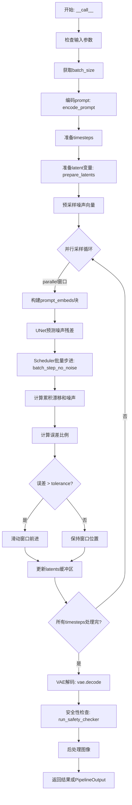
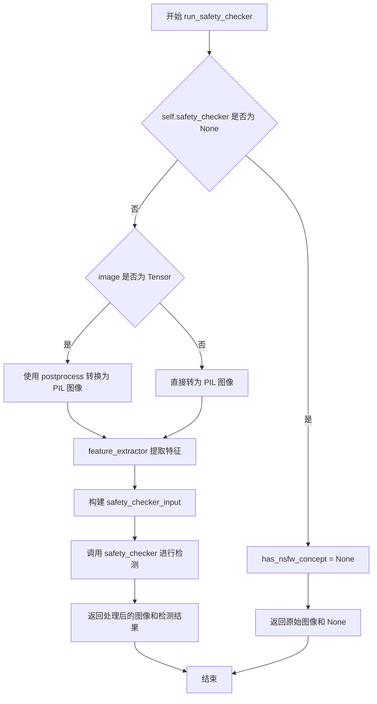
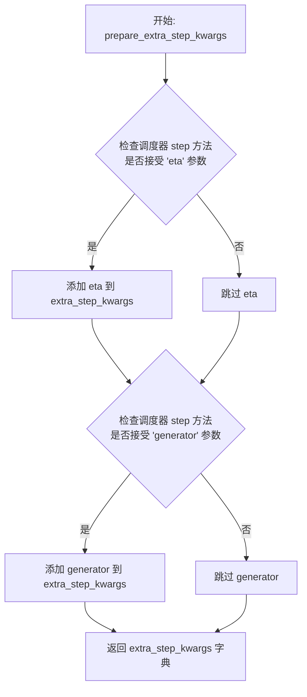
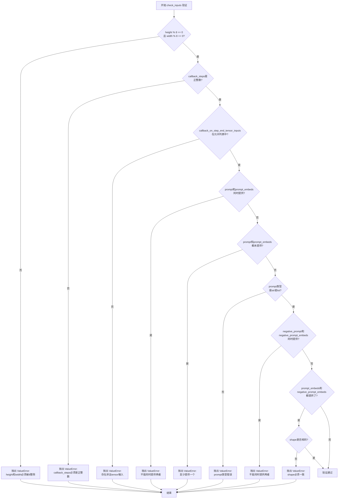
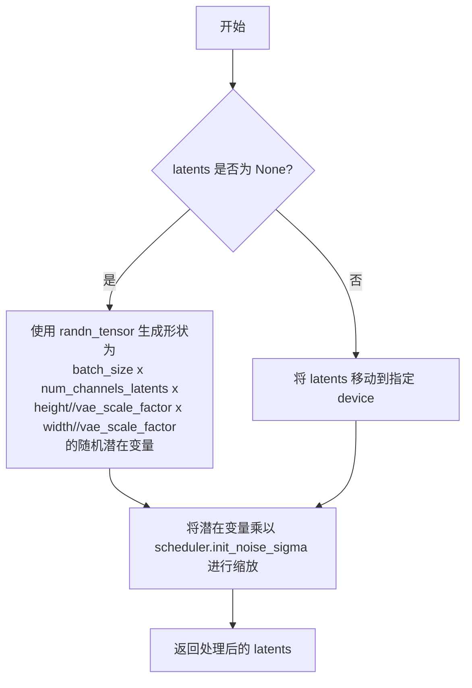
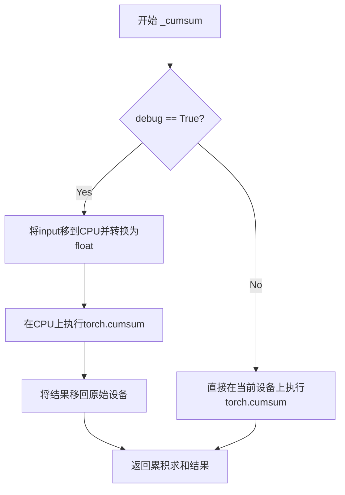
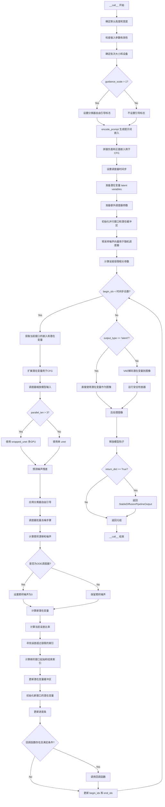

# `diffusers\src\diffusers\pipelines\deprecated\stable_diffusion_variants\pipeline_stable_diffusion_paradigms.py` 详细设计文档

这是一个基于Stable Diffusion的并行化文本到图像生成pipeline，通过滑动窗口批处理策略实现多GPU并行推理，在保证生成质量的同时显著提升推理速度。该pipeline支持LoRA、Textual Inversion等高级特性，并集成了安全性检查器。

## 整体流程



## 类结构

```
DiffusionPipeline (抽象基类)
├── StableDiffusionMixin (混入类)
├── TextualInversionLoaderMixin (文本反演加载混入)
├── StableDiffusionLoraLoaderMixin (LoRA加载混入)
├── FromSingleFileMixin (单文件加载混入)
└── StableDiffusionParadigmsPipeline (主实现类)
```

## 全局变量及字段


### `logger`
    
模块级日志记录器，用于记录运行时信息

类型：`logging.Logger`
    


### `EXAMPLE_DOC_STRING`
    
示例文档字符串，包含Pipeline使用示例代码

类型：`str`
    


### `model_cpu_offload_seq`
    
CPU卸载顺序字符串，定义模型卸载到CPU的顺序

类型：`str`
    


### `_optional_components`
    
可选组件列表，包含safety_checker和feature_extractor

类型：`list[str]`
    


### `_exclude_from_cpu_offload`
    
需排除CPU卸载的组件列表，包含safety_checker

类型：`list[str]`
    


### `StableDiffusionParadigmsPipeline.vae`
    
VAE模型，用于编码和解码图像与潜在表示

类型：`AutoencoderKL`
    


### `StableDiffusionParadigmsPipeline.text_encoder`
    
冻结的文本编码器，用于将文本转换为嵌入向量

类型：`CLIPTextModel`
    


### `StableDiffusionParadigmsPipeline.tokenizer`
    
CLIP分词器，用于将文本分词为token

类型：`CLIPTokenizer`
    


### `StableDiffusionParadigmsPipeline.unet`
    
去噪UNet模型，用于预测噪声残差

类型：`UNet2DConditionModel`
    


### `StableDiffusionParadigmsPipeline.scheduler`
    
扩散调度器，控制去噪过程的噪声调度

类型：`KarrasDiffusionSchedulers`
    


### `StableDiffusionParadigmsPipeline.safety_checker`
    
安全性检查器，用于检测生成图像是否包含不当内容

类型：`StableDiffusionSafetyChecker`
    


### `StableDiffusionParadigmsPipeline.feature_extractor`
    
图像特征提取器，用于提取图像特征供安全检查器使用

类型：`CLIPImageProcessor`
    


### `StableDiffusionParadigmsPipeline.vae_scale_factor`
    
VAE缩放因子，用于计算潜在空间的尺寸

类型：`int`
    


### `StableDiffusionParadigmsPipeline.image_processor`
    
图像处理器，用于图像的后处理和格式转换

类型：`VaeImageProcessor`
    


### `StableDiffusionParadigmsPipeline.wrapped_unet`
    
包装后的UNet，用于多GPU并行推理

类型：`torch.nn.DataParallel`
    
    

## 全局函数及方法


### `StableDiffusionParadigmsPipeline.__init__`

该方法是 `StableDiffusionParadigmsPipeline` 类的构造函数，用于初始化一个用于文本到图像生成的并行化 Stable Diffusion 管道。它接收 VAE、文本编码器、分词器、UNet、调度器、安全检查器和特征提取器等核心组件，并进行模块注册、配置存储和图像处理器的初始化。

参数：

-  `vae`：`AutoencoderKL`，用于将图像编码和解码到潜在表示的变分自编码器模型
-  `text_encoder`：`CLIPTextModel`，冻结的文本编码器（clip-vit-large-patch14）
-  `tokenizer`：`CLIPTokenizer`，用于对文本进行分词的 CLIP 分词器
-  `unet`：`UNet2DConditionModel`，用于对编码后的图像潜在表示进行去噪的 UNet 模型
-  `scheduler`：`KarrasDiffusionSchedulers`，与 `unet` 结合使用以对编码图像潜在表示进行去噪的调度器
-  `safety_checker`：`StableDiffusionSafetyChecker`，用于估计生成图像是否被认为具有攻击性或有害的分类模块
-  `feature_extractor`：`CLIPImageProcessor`，用于从生成图像中提取特征的图像处理器
-  `requires_safety_checker`：`bool`，是否需要安全检查器，默认为 `True`

返回值：`None`，该方法为构造函数，不返回任何值

#### 流程图

```mermaid
flowchart TD
    A[开始 __init__] --> B[调用 super().__init__]
    B --> C{safety_checker is None<br/>且 requires_safety_checker?}
    C -->|是| D[发出安全检查器禁用的警告]
    C -->|否| E{safety_checker is not None<br/>且 feature_extractor is None?}
    D --> E
    E -->|是| F[抛出 ValueError: 必须定义特征提取器]
    E -->|否| G[调用 self.register_modules 注册所有模块]
    G --> H[计算 vae_scale_factor]
    H --> I[创建 VaeImageProcessor 实例]
    I --> J[注册 requires_safety_checker 到配置]
    J --> K[初始化 wrapped_unet 为 self.unet]
    K --> L[结束 __init__]
```

#### 带注释源码

```
def __init__(
    self,
    vae: AutoencoderKL,
    text_encoder: CLIPTextModel,
    tokenizer: CLIPTokenizer,
    unet: UNet2DConditionModel,
    scheduler: KarrasDiffusionSchedulers,
    safety_checker: StableDiffusionSafetyChecker,
    feature_extractor: CLIPImageProcessor,
    requires_safety_checker: bool = True,
):
    # 调用父类 DiffusionPipeline 的初始化方法
    super().__init__()

    # 如果 safety_checker 为 None 但 requires_safety_checker 为 True，发出警告
    if safety_checker is None and requires_safety_checker:
        logger.warning(
            f"You have disabled the safety checker for {self.__class__} by passing `safety_checker=None`. Ensure"
            " that you abide to the conditions of the Stable Diffusion license and do not expose unfiltered"
            " results in services or applications open to the public. Both the diffusers team and Hugging Face"
            " strongly recommend to keep the safety filter enabled in all public facing circumstances, disabling"
            " it only for use-cases that involve analyzing network behavior or auditing its results. For more"
            " information, please have a look at https://github.com/huggingface/diffusers/pull/254 ."
        )

    # 如果提供了 safety_checker 但没有提供 feature_extractor，抛出错误
    if safety_checker is not None and feature_extractor is None:
        raise ValueError(
            "Make sure to define a feature extractor when loading {self.__class__} if you want to use the safety"
            " checker. If you do not want to use the safety checker, you can pass `'safety_checker=None'` instead."
        )

    # 将所有模块注册到管道中，使其可通过 self.xxx 访问
    self.register_modules(
        vae=vae,
        text_encoder=text_encoder,
        tokenizer=tokenizer,
        unet=unet,
        scheduler=scheduler,
        safety_checker=safety_checker,
        feature_extractor=feature_extractor,
    )
    
    # 计算 VAE 缩放因子，基于 VAE 的块输出通道数
    # 默认为 8 (2^(3-1)=4, 但实际代码使用 len(...)-1)
    self.vae_scale_factor = 2 ** (len(self.vae.config.block_out_channels) - 1) if getattr(self, "vae", None) else 8
    
    # 创建图像后处理器，用于将 VAE 输出转换为图像
    self.image_processor = VaeImageProcessor(vae_scale_factor=self.vae_scale_factor)
    
    # 将 requires_safety_checker 注册到配置中
    self.register_to_config(requires_safety_checker=requires_safety_checker)

    # 属性：用于在使用多个 GPU 运行多个去噪步骤时用 DataParallel 包装 unet
    self.wrapped_unet = self.unet
```


### `StableDiffusionParadigmsPipeline._encode_prompt`

该方法是一个已废弃的提示词编码封装函数，用于将文本提示转换为文本编码器的隐藏状态。它通过调用新的 `encode_prompt` 方法来实现功能，但为了向后兼容性，将返回的结果进行拼接后返回。

参数：

- `prompt`：`str | list[str] | None`，要编码的文本提示，可以是单个字符串或字符串列表
- `device`：`torch.device`，PyTorch 设备，用于指定计算设备
- `num_images_per_prompt`：`int`，每个提示生成的图像数量
- `do_classifier_free_guidance`：`bool`，是否使用无分类器自由引导
- `negative_prompt`：`str | list[str] | None`，不包含在图像生成中的提示词
- `prompt_embeds`：`torch.Tensor | None`，预先生成的文本嵌入，可用于轻松调整文本输入
- `negative_prompt_embeds`：`torch.Tensor | None`，预先生成的负面文本嵌入
- `lora_scale`：`float | None`，应用于文本编码器所有 LoRA 层的 LoRA 缩放因子
- `**kwargs`：额外的关键字参数

返回值：`torch.Tensor`，拼接后的提示嵌入张量（为了向后兼容，将负面提示嵌入和正面提示嵌入进行拼接）

#### 流程图

```mermaid
flowchart TD
    A[开始 _encode_prompt] --> B[发出废弃警告]
    B --> C{检查 lora_scale 是否存在}
    C -->|是| D[设置 self._lora_scale]
    C -->|否| E[跳过 LoRA 缩放设置]
    D --> E
    E --> F[调用 encode_prompt 方法]
    F --> G[获取返回的元组 prompt_embeds_tuple]
    G --> H[拼接: torch.cat<br/>[prompt_embeds_tuple[1],<br/>prompt_embeds_tuple[0]]]
    H --> I[返回拼接后的 prompt_embeds]
    I --> J[结束]
    
    style A fill:#f9f,stroke:#333
    style I fill:#9f9,stroke:#333
    style J fill:#9ff,stroke:#333
```

#### 带注释源码

```python
def _encode_prompt(
    self,
    prompt,                       # str | list[str] | None: 要编码的文本提示
    device,                       # torch.device: PyTorch 计算设备
    num_images_per_prompt,        # int: 每个提示生成的图像数量
    do_classifier_free_guidance,  # bool: 是否使用无分类器自由引导
    negative_prompt=None,         # str | list[str] | None: 负面提示词
    prompt_embeds: torch.Tensor | None = None,   # 预计算的文本嵌入
    negative_prompt_embeds: torch.Tensor | None = None,  # 预计算的负面文本嵌入
    lora_scale: float | None = None,  # LoRA 缩放因子
    **kwargs,                     # 额外的关键字参数
):
    """
    已废弃的提示词编码方法。
    建议使用 encode_prompt() 代替。
    """
    
    # 发出废弃警告，提示用户使用新方法
    deprecation_message = (
        "`_encode_prompt()` is deprecated and it will be removed in a future version. "
        "Use `encode_prompt()` instead. Also, be aware that the output format changed "
        "from a concatenated tensor to a tuple."
    )
    deprecate("_encode_prompt()", "1.0.0", deprecation_message, standard_warn=False)

    # 调用新的 encode_prompt 方法获取嵌入
    # 返回值为元组 (negative_prompt_embeds, prompt_embeds)
    prompt_embeds_tuple = self.encode_prompt(
        prompt=prompt,
        device=device,
        num_images_per_prompt=num_images_per_prompt,
        do_classifier_free_guidance=do_classifier_free_guidance,
        negative_prompt=negative_prompt,
        prompt_embeds=prompt_embeds,
        negative_prompt_embeds=negative_prompt_embeds,
        lora_scale=lora_scale,
        **kwargs,
    )

    # 为了向后兼容性，将负面和正面提示嵌入拼接
    # 旧版本返回的是 [negative_prompt_embeds, prompt_embeds] 顺序
    # 新的 encode_prompt 返回 (negative_prompt_embeds, prompt_embeds) 元组
    # 这里通过 [1], [0] 重新排列以匹配旧行为
    prompt_embeds = torch.cat([prompt_embeds_tuple[1], prompt_embeds_tuple[0]])

    return prompt_embeds
```


### `StableDiffusionParadigmsPipeline.encode_prompt`

该方法负责将文本提示（prompt）编码为文本编码器的隐藏状态（text encoder hidden states），支持批量生成、分类器自由引导（Classifier-Free Guidance）、LoRA 权重调整以及 CLIP 层跳过等功能，是文本到图像扩散管道的关键预处理步骤。

参数：

- `self`：`StableDiffusionParadigmsPipeline`，Pipeline 实例本身
- `prompt`：`str` 或 `list[str]`，要编码的文本提示，支持单个字符串或字符串列表
- `device`：`torch.device`，执行编码操作的设备（如 CUDA 或 CPU）
- `num_images_per_prompt`：`int`，每个提示要生成的图像数量，用于批量 embeddings 扩展
- `do_classifier_free_guidance`：`bool`，是否启用分类器自由引导，启用时需要生成无条件 embeddings
- `negative_prompt`：`str` 或 `list[str]`，可选，用于引导图像生成过程中"不希望出现"的内容，与 `prompt` 类型需一致
- `prompt_embeds`：`torch.Tensor | None`，可选，预生成的文本 embeddings，若提供则直接使用而不从 prompt 生成
- `negative_prompt_embeds`：`torch.Tensor | None`，可选，预生成的负面文本 embeddings
- `lora_scale`：`float | None`，可选，LoRA 权重缩放因子，用于动态调整 LoRA 层的影响程度
- `clip_skip`：`int | None`，可选，从 CLIP 文本编码器最后 N 层获取 hidden states，用于调整生成质量

返回值：`tuple[torch.Tensor, torch.Tensor]`，返回两个张量 —— 第一个是 `prompt_embeds`（正向提示 embeddings），第二个是 `negative_prompt_embeds`（负面提示 embeddings），两者形状均为 `(batch_size * num_images_per_prompt, seq_len, hidden_dim)`

#### 流程图

```mermaid
flowchart TD
    A[开始 encode_prompt] --> B{检查 lora_scale 是否设置}
    B -->|是| C[设置 self._lora_scale 并调整 LoRA 层权重]
    B -->|否| D[跳过 LoRA 调整]
    
    C --> D
    D --> E{判断 prompt 类型确定 batch_size}
    E -->|str| F[batch_size = 1]
    E -->|list| G[batch_size = len<prompt>]
    E -->|embeds provided| H[batch_size = prompt_embeds.shape[0]]
    
    F --> I{prompt_embeds 为空?}
    G --> I
    H --> J[直接使用传入的 embeddings]
    
    I -->|是| K{检查 TextualInversion}
    I -->|否| J
    
    K -->|是| L[转换 prompt 为多向量 tokens]
    K -->|否| M[直接 tokenize]
    
    L --> M
    M --> N[tokenizer 处理: padding, max_length, truncation]
    N --> O{检查 text_encoder 是否使用 attention_mask}
    O -->|是| P[使用 text_inputs.attention_mask]
    O -->|否| Q[attention_mask = None]
    
    P --> R{clip_skip 是否设置?}
    Q --> R
    
    R -->|否| S[text_encoder 输出 last_hidden_state]
    R -->|是| T[text_encoder 输出 hidden_states, 选取目标层]
    T --> U[应用 final_layer_norm]
    S --> V[转换为 prompt_embeds]
    U --> V
    
    V --> W{确定 prompt_embeds 的 dtype}
    W --> X[转换为目标 dtype 和 device]
    
    X --> Y{do_classifier_free_guidance 且 negative_prompt_embeds 为空?}
    Y -->|是| Z[处理 negative_prompt]
    Y -->|否| AA[返回最终 embeddings]
    
    Z -->|None| AB[uncond_tokens = [''] * batch_size]
    Z -->|str| AC[uncond_tokens = [negative_prompt]]
    Z -->|list| AD[uncond_tokens = negative_prompt]
    
    AB --> AE[tokenize uncond_tokens]
    AC --> AE
    AD --> AE
    
    AE --> AF[text_encoder 编码生成 negative_prompt_embeds]
    AF --> AG{do_classifier_free_guidance?}
    
    AG -->|是| AH[重复 negative_prompt_embeds 以匹配 num_images_per_prompt]
    AG -->|否| AA
    
    AH --> AI[调整形状为 batch_size * num_images_per_prompt]
    AI --> AA
    
    J --> AA[返回 prompt_embeds, negative_prompt_embeds]
```

#### 带注释源码

```python
def encode_prompt(
    self,
    prompt,
    device,
    num_images_per_prompt,
    do_classifier_free_guidance,
    negative_prompt=None,
    prompt_embeds: torch.Tensor | None = None,
    negative_prompt_embeds: torch.Tensor | None = None,
    lora_scale: float | None = None,
    clip_skip: int | None = None,
):
    r"""
    Encodes the prompt into text encoder hidden states.

    Args:
        prompt (`str` or `list[str]`, *optional*):
            prompt to be encoded
        device: (`torch.device`):
            torch device
        num_images_per_prompt (`int`):
            number of images that should be generated per prompt
        do_classifier_free_guidance (`bool`):
            whether to use classifier free guidance or not
        negative_prompt (`str` or `list[str]`, *optional*):
            The prompt or prompts not to guide the image generation. If not defined, one has to pass
            `negative_prompt_embeds` instead. Ignored when not using guidance (i.e., ignored if `guidance_scale` is
            less than `1`).
        prompt_embeds (`torch.Tensor`, *optional*):
            Pre-generated text embeddings. Can be used to easily tweak text inputs, *e.g.* prompt weighting. If not
            provided, text embeddings will be generated from `prompt` input argument.
        negative_prompt_embeds (`torch.Tensor`, *optional*):
            Pre-generated negative text embeddings. Can be used to easily tweak text inputs, *e.g.* prompt
            weighting. If not provided, negative_prompt_embeds will be generated from `negative_prompt` input
            argument.
        lora_scale (`float`, *optional*):
            A LoRA scale that will be applied to all LoRA layers of the text encoder if LoRA layers are loaded.
        clip_skip (`int`, *optional*):
            Number of layers to be skipped from CLIP while computing the prompt embeddings. A value of 1 means that
            the output of the pre-final layer will be used for computing the prompt embeddings.
    """
    # 设置 lora scale 以便 text encoder 的 monkey patched LoRA 函数可以正确访问
    # 如果传入了 lora_scale 且当前 pipeline 支持 LoRA
    if lora_scale is not None and isinstance(self, StableDiffusionLoraLoaderMixin):
        self._lora_scale = lora_scale

        # 动态调整 LoRA scale
        # 根据是否使用 PEFT backend 选择不同的缩放方式
        if not USE_PEFT_BACKEND:
            adjust_lora_scale_text_encoder(self.text_encoder, lora_scale)
        else:
            scale_lora_layers(self.text_encoder, lora_scale)

    # 根据 prompt 类型确定 batch_size
    if prompt is not None and isinstance(prompt, str):
        batch_size = 1
    elif prompt is not None and isinstance(prompt, list):
        batch_size = len(prompt)
    else:
        # 如果没有提供 prompt，则使用 prompt_embeds 的 batch size
        batch_size = prompt_embeds.shape[0]

    # 如果没有提供 prompt_embeds，则需要从 prompt 生成
    if prompt_embeds is None:
        # textual inversion: 处理多向量 tokens（如果需要）
        # 检查是否加载了 Textual Inversion 嵌入
        if isinstance(self, TextualInversionLoaderMixin):
            prompt = self.maybe_convert_prompt(prompt, self.tokenizer)

        # 使用 tokenizer 将 prompt 转换为 token IDs
        text_inputs = self.tokenizer(
            prompt,
            padding="max_length",
            max_length=self.tokenizer.model_max_length,
            truncation=True,
            return_tensors="pt",
        )
        text_input_ids = text_inputs.input_ids
        
        # 同时进行不截断的 tokenize，用于检测是否有内容被截断
        untruncated_ids = self.tokenizer(prompt, padding="longest", return_tensors="pt").input_ids

        # 检查是否有内容被截断，并记录警告
        if untruncated_ids.shape[-1] >= text_input_ids.shape[-1] and not torch.equal(
            text_input_ids, untruncated_ids
        ):
            removed_text = self.tokenizer.batch_decode(
                untruncated_ids[:, self.tokenizer.model_max_length - 1 : -1]
            )
            logger.warning(
                "The following part of your input was truncated because CLIP can only handle sequences up to"
                f" {self.tokenizer.model_max_length} tokens: {removed_text}"
            )

        # 检查 text_encoder 是否配置了 use_attention_mask
        if hasattr(self.text_encoder.config, "use_attention_mask") and self.text_encoder.config.use_attention_mask:
            attention_mask = text_inputs.attention_mask.to(device)
        else:
            attention_mask = None

        # 根据是否设置 clip_skip 决定如何获取 embeddings
        if clip_skip is None:
            # 直接获取 last_hidden_state
            prompt_embeds = self.text_encoder(text_input_ids.to(device), attention_mask=attention_mask)
            prompt_embeds = prompt_embeds[0]  # 提取 hidden states
        else:
            # 获取所有 hidden states（以元组形式返回）
            prompt_embeds = self.text_encoder(
                text_input_ids.to(device), attention_mask=attention_mask, output_hidden_states=True
            )
            # hidden_states 是一个元组，包含所有 encoder 层的输出
            # 倒数第一层是最后的 pooler output，倒数第二层是最后一层 encoder 的输出
            # -(clip_skip + 1) 表示从后往前数第 clip_skip + 1 层
            prompt_embeds = prompt_embeds[-1][-(clip_skip + 1)]
            # 需要应用 final_layer_norm 以获得正确的表示
            # 因为通常使用的 last_hidden_states 会经过 LayerNorm
            prompt_embeds = self.text_encoder.text_model.final_layer_norm(prompt_embeds)

    # 确定 prompt_embeds 的数据类型
    # 优先使用 text_encoder 的 dtype，其次使用 unet 的 dtype
    if self.text_encoder is not None:
        prompt_embeds_dtype = self.text_encoder.dtype
    elif self.unet is not None:
        prompt_embeds_dtype = self.unet.dtype
    else:
        prompt_embeds_dtype = prompt_embeds.dtype

    # 将 prompt_embeds 转换为正确的 dtype 和 device
    prompt_embeds = prompt_embeds.to(dtype=prompt_embeds_dtype, device=device)

    # 获取 embeddings 的形状
    bs_embed, seq_len, _ = prompt_embeds.shape
    
    # 为每个 prompt 复制 num_images_per_prompt 次
    # 使用 mps 友好的方法（repeat 而不是 expand）
    prompt_embeds = prompt_embeds.repeat(1, num_images_per_prompt, 1)
    prompt_embeds = prompt_embeds.view(bs_embed * num_images_per_prompt, seq_len, -1)

    # 获取无条件 embeddings 用于分类器自由引导
    if do_classifier_free_guidance and negative_prompt_embeds is None:
        uncond_tokens: list[str]
        
        # 处理 negative_prompt
        if negative_prompt is None:
            # 如果没有提供 negative_prompt，使用空字符串
            uncond_tokens = [""] * batch_size
        elif prompt is not None and type(prompt) is not type(negative_prompt):
            # 类型不匹配时抛出错误
            raise TypeError(
                f"`negative_prompt` should be the same type to `prompt`, but got {type(negative_prompt)} !="
                f" {type(prompt)}."
            )
        elif isinstance(negative_prompt, str):
            # 单个负向 prompt 扩展为列表
            uncond_tokens = [negative_prompt]
        elif batch_size != len(negative_prompt):
            # batch size 不匹配时抛出错误
            raise ValueError(
                f"`negative_prompt`: {negative_prompt} has batch size {len(negative_prompt)}, but `prompt`:"
                f" {prompt} has batch size {batch_size}. Please make sure that passed `negative_prompt` matches"
                " the batch size of `prompt`."
            )
        else:
            uncond_tokens = negative_prompt

        # textual inversion: 处理多向量 tokens（如果需要）
        if isinstance(self, TextualInversionLoaderMixin):
            uncond_tokens = self.maybe_convert_prompt(uncond_tokens, self.tokenizer)

        # 获取 prompt_embeds 的长度作为 max_length
        max_length = prompt_embeds.shape[1]
        
        # tokenize negative prompt
        uncond_input = self.tokenizer(
            uncond_tokens,
            padding="max_length",
            max_length=max_length,
            truncation=True,
            return_tensors="pt",
        )

        # 处理 attention_mask
        if hasattr(self.text_encoder.config, "use_attention_mask") and self.text_encoder.config.use_attention_mask:
            attention_mask = uncond_input.attention_mask.to(device)
        else:
            attention_mask = None

        # 编码 negative prompt 生成无条件 embeddings
        negative_prompt_embeds = self.text_encoder(
            uncond_input.input_ids.to(device),
            attention_mask=attention_mask,
        )
        negative_prompt_embeds = negative_prompt_embeds[0]

    # 如果启用分类器自由引导，处理无条件 embeddings
    if do_classifier_free_guidance:
        # 复制无条件 embeddings 以匹配每个 prompt 生成的图像数量
        seq_len = negative_prompt_embeds.shape[1]

        # 转换为正确的 dtype 和 device
        negative_prompt_embeds = negative_prompt_embeds.to(dtype=prompt_embeds_dtype, device=device)

        # 重复 embeddings
        negative_prompt_embeds = negative_prompt_embeds.repeat(1, num_images_per_prompt, 1)
        # 调整形状
        negative_prompt_embeds = negative_prompt_embeds.view(batch_size * num_images_per_prompt, seq_len, -1)

    # 如果使用了 LoRA 并且使用 PEFT backend，需要恢复 LoRA 层的原始 scale
    if self.text_encoder is not None:
        if isinstance(self, StableDiffusionLoraLoaderMixin) and USE_PEFT_BACKEND:
            # 通过 unscale 恢复原始 scale
            unscale_lora_layers(self.text_encoder, lora_scale)

    # 返回正向和负向 embeddings 元组
    return prompt_embeds, negative_prompt_embeds
```


### `StableDiffusionParadigmsPipeline.run_safety_checker`

该方法用于对生成的图像进行安全检查（NSFW 检测），通过特征提取器提取图像特征，并调用安全检查器判断图像是否包含不当内容。

参数：

- `image`：`torch.Tensor | list[Image] | np.ndarray`，待检查的图像，可以是 PyTorch 张量、PIL 图像或 NumPy 数组
- `device`：`torch.device`，用于计算的目标设备
- `dtype`：`torch.dtype`，用于计算的数据类型

返回值：`tuple[torch.Tensor | list[Image], torch.Tensor | list[bool] | None]`，返回处理后的图像和 NSFW 检测结果元组。若未配置安全检查器，则 `has_nsfw_concept` 为 `None`。

#### 流程图



#### 带注释源码

```python
def run_safety_checker(self, image, device, dtype):
    """
    运行安全检查器对生成的图像进行 NSFW 检测。
    
    参数:
        image: 待检查的图像，支持 torch.Tensor、PIL.Image 或 numpy 数组格式
        device: 计算设备
        dtype: 计算数据类型
    
    返回:
        (image, has_nsfw_concept): 处理后的图像及 NSFW 检测标志
    """
    # 如果未配置安全检查器，直接返回空结果
    if self.safety_checker is None:
        has_nsfw_concept = None
    else:
        # 根据输入图像类型进行预处理
        if torch.is_tensor(image):
            # 将张量图像转换为 PIL 图像格式以供特征提取器使用
            feature_extractor_input = self.image_processor.postprocess(image, output_type="pil")
        else:
            # 已经是 PIL 图像或 numpy 数组，直接转换
            feature_extractor_input = self.image_processor.numpy_to_pil(image)
        
        # 使用特征提取器将图像转换为张量格式
        safety_checker_input = self.feature_extractor(feature_extractor_input, return_tensors="pt").to(device)
        
        # 调用安全检查器进行 NSFW 检测
        # 将像素值转换为指定数据类型以匹配检查器要求
        image, has_nsfw_concept = self.safety_checker(
            images=image, 
            clip_input=safety_checker_input.pixel_values.to(dtype)
        )
    
    # 返回处理后的图像和检测结果
    return image, has_nsfw_concept
```


### `StableDiffusionParadigmsPipeline.prepare_extra_step_kwargs`

该方法用于为调度器（scheduler）的 `step` 方法准备额外的关键字参数。由于不同调度器的签名不同，该方法通过动态检查调度器是否接受 `eta` 和 `generator` 参数，来构建并返回兼容的参数字典。

参数：

- `self`：`StableDiffusionParadigmsPipeline` 实例，管道对象本身
- `generator`：`torch.Generator` 或 `list[torch.Generator]` 或 `None`，用于控制生成随机性的 PyTorch 生成器
- `eta`：`float`，DDIM 调度器专用的 eta 参数（取值范围 [0, 1]），其他调度器会忽略此参数

返回值：`dict`，包含调度器 `step` 方法所需的关键字参数字典，可能包含 `eta` 和/或 `generator` 键

#### 流程图



#### 带注释源码

```python
# Copied from diffusers.pipelines.stable_diffusion.pipeline_stable_diffusion.StableDiffusionPipeline.prepare_extra_step_kwargs
def prepare_extra_step_kwargs(self, generator, eta):
    # 准备调度器步骤的额外关键字参数，因为并非所有调度器都具有相同的签名
    # eta (η) 仅在 DDIMScheduler 中使用，其他调度器将忽略它
    # eta 对应于 DDIM 论文 (https://huggingface.co/papers/2010.02502) 中的 η
    # 取值范围应为 [0, 1]

    # 通过 inspect 模块检查调度器的 step 方法签名，判断是否接受 'eta' 参数
    accepts_eta = "eta" in set(inspect.signature(self.scheduler.step).parameters.keys())
    # 初始化空字典用于存储额外的关键字参数
    extra_step_kwargs = {}
    # 如果调度器接受 eta 参数，则将其添加到 extra_step_kwargs 中
    if accepts_eta:
        extra_step_kwargs["eta"] = eta

    # 检查调度器是否接受 generator 参数
    accepts_generator = "generator" in set(inspect.signature(self.scheduler.step).parameters.keys())
    # 如果调度器接受 generator 参数，则将其添加到 extra_step_kwargs 中
    if accepts_generator:
        extra_step_kwargs["generator"] = generator
    
    # 返回构建好的参数字典，供调度器的 step 方法使用
    return extra_step_kwargs
```


### `StableDiffusionParadigmsPipeline.check_inputs`

该方法用于验证文本到图像生成管道的输入参数是否合法，确保`height`和`width`能被8整除，`callback_steps`为正整数，`prompt`和`prompt_embeds`不能同时提供且至少提供一个，`prompt`类型必须为字符串或列表，`negative_prompt`和`negative_prompt_embeds`不能同时提供，以及`prompt_embeds`和`negative_prompt_embeds`的shape必须一致。

参数：

- `self`：实例本身，包含管道组件和配置信息
- `prompt`：`str | list[str] | None`，用户输入的文本提示，用于指导图像生成
- `height`：`int`，生成图像的高度（像素），必须能被8整除
- `width`：`int`，生成图像的宽度（像素），必须能被8整除
- `callback_steps`：`int`，回调函数被调用的频率，必须为正整数
- `negative_prompt`：`str | list[str] | None`，负面提示，用于指导不包含在图像中的内容
- `prompt_embeds`：`torch.Tensor | None`，预生成的文本嵌入向量，不能与`prompt`同时提供
- `negative_prompt_embeds`：`torch.Tensor | None`，预生成的负面文本嵌入向量，不能与`negative_prompt`同时提供
- `callback_on_step_end_tensor_inputs`：`list[str] | None`，回调函数在每步结束时的张量输入参数列表

返回值：`None`，该方法不返回任何值，仅通过抛出`ValueError`来处理验证失败的情况

#### 流程图



#### 带注释源码

```python
def check_inputs(
    self,
    prompt,
    height,
    width,
    callback_steps,
    negative_prompt=None,
    prompt_embeds=None,
    negative_prompt_embeds=None,
    callback_on_step_end_tensor_inputs=None,
):
    """
    验证文本到图像生成管道的输入参数是否合法。
    
    检查项目包括：
    1. height和width必须能被8整除（VAE的下采样因子）
    2. callback_steps必须为正整数
    3. callback_on_step_end_tensor_inputs必须在允许的tensor输入列表中
    4. prompt和prompt_embeds不能同时提供
    5. prompt和prompt_embeds至少提供一个
    6. prompt类型必须是str或list
    7. negative_prompt和negative_prompt_embeds不能同时提供
    8. prompt_embeds和negative_prompt_embeds的shape必须一致
    """
    
    # 验证图像尺寸必须能被8整除（VAE的缩放因子为2^(层数-1)，最小为8）
    if height % 8 != 0 or width % 8 != 0:
        raise ValueError(f"`height` and `width` have to be divisible by 8 but are {height} and {width}.")

    # 验证callback_steps必须是正整数
    if callback_steps is not None and (not isinstance(callback_steps, int) or callback_steps <= 0):
        raise ValueError(
            f"`callback_steps` has to be a positive integer but is {callback_steps} of type"
            f" {type(callback_steps)}."
        )
    
    # 验证回调函数的tensor输入参数是否在允许列表中
    if callback_on_step_end_tensor_inputs is not None and not all(
        k in self._callback_tensor_inputs for k in callback_on_step_end_tensor_inputs
    ):
        raise ValueError(
            f"`callback_on_step_end_tensor_inputs` has to be in {self._callback_tensor_inputs}, but found {[k for k in callback_on_step_end_tensor_inputs if k not in self._callback_tensor_inputs]}"
        )

    # 验证prompt和prompt_embeds的互斥关系
    if prompt is not None and prompt_embeds is not None:
        raise ValueError(
            f"Cannot forward both `prompt`: {prompt} and `prompt_embeds`: {prompt_embeds}. Please make sure to"
            " only forward one of the two."
        )
    # 验证至少提供一个prompt输入
    elif prompt is None and prompt_embeds is None:
        raise ValueError(
            "Provide either `prompt` or `prompt_embeds`. Cannot leave both `prompt` and `prompt_embeds` undefined."
        )
    # 验证prompt的类型
    elif prompt is not None and (not isinstance(prompt, str) and not isinstance(prompt, list)):
        raise ValueError(f"`prompt` has to be of type `str` or `list` but is {type(prompt)}")

    # 验证negative_prompt和negative_prompt_embeds的互斥关系
    if negative_prompt is not None and negative_prompt_embeds is not None:
        raise ValueError(
            f"Cannot forward both `negative_prompt`: {negative_prompt} and `negative_prompt_embeds`:"
            f" {negative_prompt_embeds}. Please make sure to only forward one of the two."
        )

    # 验证prompt_embeds和negative_prompt_embeds的shape一致性
    if prompt_embeds is not None and negative_prompt_embeds is not None:
        if prompt_embeds.shape != negative_prompt_embeds.shape:
            raise ValueError(
                "`prompt_embeds` and `negative_prompt_embeds` must have the same shape when passed directly, but"
                f" got: `prompt_embeds` {prompt_embeds.shape} != `negative_prompt_embeds`"
                f" {negative_prompt_embeds.shape}."
            )
```


### `StableDiffusionParadigmsPipeline.prepare_latents`

该方法负责为扩散模型生成或处理初始的潜在变量（latents）。它根据指定的批次大小、图像尺寸和潜在通道数构建潜在张量的形状，如果是新生成的潜在变量，则使用随机噪声进行初始化，并按照调度器的初始噪声标准差进行缩放；如果已提供了潜在变量，则将其移动到指定设备上。

参数：

- `batch_size`：`int`，生成的图像批次大小
- `num_channels_latents`：`int`，潜在变量的通道数，通常对应于 UNet 的输入通道数
- `height`：`int`，生成图像的高度（像素单位）
- `width`：`int`，生成图像的宽度（像素单位）
- `dtype`：`torch.dtype`，潜在变量的数据类型
- `device`：`torch.device`，潜在变量所在的设备
- `generator`：`torch.Generator` 或 `list[torch.Generator]`，可选的随机数生成器，用于确保生成的可重复性
- `latents`：`torch.Tensor | None`，可选的预生成潜在变量，如果为 `None` 则新生成随机潜在变量

返回值：`torch.Tensor`，处理后的潜在变量张量，已按照调度器的初始噪声标准差进行缩放

#### 流程图



#### 带注释源码

```python
def prepare_latents(
    self,
    batch_size: int,
    num_channels_latents: int,
    height: int,
    width: int,
    dtype: torch.dtype,
    device: torch.device,
    generator: torch.Generator | list[torch.Generator] | None,
    latents: torch.Tensor | None = None
) -> torch.Tensor:
    """
    准备扩散模型所需的潜在变量（latents）。
    
    参数:
        batch_size: 批次大小
        num_channels_latents: 潜在变量的通道数
        height: 生成图像的高度
        width: 生成图像的宽度
        dtype: 潜在变量的数据类型
        device: 潜在变量应放置的设备
        generator: 用于生成随机数的生成器
        latents: 可选的预生成潜在变量
        
    返回:
        处理后的潜在变量张量
    """
    # 计算潜在变量的形状，除以 vae_scale_factor 是因为 VAE 会进行下采样
    shape = (
        batch_size,
        num_channels_latents,
        int(height) // self.vae_scale_factor,
        int(width) // self.vae_scale_factor,
    )
    
    # 检查 generator 列表长度是否与 batch_size 匹配
    if isinstance(generator, list) and len(generator) != batch_size:
        raise ValueError(
            f"You have passed a list of generators of length {len(generator)}, but requested an effective batch"
            f" size of {batch_size}. Make sure the batch size matches the length of the generators."
        )

    # 如果没有提供 latents，则生成随机潜在变量
    if latents is None:
        latents = randn_tensor(shape, generator=generator, device=device, dtype=dtype)
    else:
        # 如果提供了 latents，则确保其在正确的设备上
        latents = latents.to(device)

    # 使用调度器的初始噪声标准差对潜在变量进行缩放
    # 这是扩散模型采样的关键步骤，确保初始噪声与调度器的噪声调度策略一致
    latents = latents * self.scheduler.init_noise_sigma
    
    return latents
```


### `StableDiffusionParadigmsPipeline._cumsum`

该方法是一个辅助函数，用于在并行采样算法中计算累积和。当`debug`参数为`True`时，在CPU上进行累积求和以获得确定性结果（避免CUDA内核的非确定性实现）；当`debug`为`False`时，直接在GPU上执行标准的`torch.cumsum`操作。

参数：

- `input`：`torch.Tensor`，要进行累积求和的张量
- `dim`：`int`，要沿其进行累积求和的维度
- `debug`：`bool`，是否在调试模式下运行（在CPU上进行累积求和以获得确定性结果）

返回值：`torch.Tensor`，累积求和后的张量

#### 流程图



#### 带注释源码

```python
def _cumsum(self, input, dim, debug=False):
    """
    计算输入张量的累积和。
    
    该方法用于并行采样算法中计算累积漂移和预采样噪声。
    当debug=True时，在CPU上执行以获得确定性结果（避免CUDA内核的非确定性实现）。
    
    Args:
        input: 要进行累积求和的张量
        dim: 要沿其进行累积求和的维度
        debug: 是否在调试模式下运行
    
    Returns:
        累积求和后的张量
    """
    if debug:
        # cumsum_cuda_kernel does not have a deterministic implementation
        # so perform cumsum on cpu for debugging purposes
        # 当debug模式开启时，将张量移到CPU上执行cumsum
        # 这样可以避免CUDA内核的非确定性实现问题
        # 这对于调试和测试非常有用，因为可以保证结果的可复现性
        return torch.cumsum(input.cpu().float(), dim=dim).to(input.device)
    else:
        # 直接在当前设备（可能是GPU）上执行标准的cumsum操作
        # 这种方式性能更高，但结果可能因CUDA版本等因素而略有不同
        return torch.cumsum(input, dim=dim)
```


### `StableDiffusionParadigmsPipeline.__call__`

这是一个并行化的文本到图像生成方法，实现了基于Stable Diffusion的并行采样算法。该方法通过滑动窗口机制在多个去噪步骤间并行处理，同时利用误差容限（tolerance）动态调整窗口推进步长，以在保持图像质量的同时加速推理过程。

参数：

- `prompt`：`str | list[str] | None`，用于指导图像生成的提示词，如未定义则需传递`prompt_embeds`
- `height`：`int | None`，生成图像的高度（像素），默认为`self.unet.config.sample_size * self.vae_scale_factor`
- `width`：`int | None`，生成图像的宽度（像素），默认为`self.unet.config.sample_size * self.vae_scale_factor`
- `num_inference_steps`：`int`，去噪步数，默认为50
- `parallel`：`int`，并行采样时使用的批次大小，默认为10，较大的值可加速推理但需要更多内存
- `tolerance`：`float`，并行采样时判断是否滑动批处理窗口的误差容限，默认为0.1
- `guidance_scale`：`float`，引导比例，值越高生成的图像与提示词越相关但质量可能降低，默认为7.5
- `negative_prompt`：`str | list[str] | None`，不希望出现在图像中的提示词
- `num_images_per_prompt`：`int`，每个提示词生成的图像数量，默认为1
- `eta`：`float`，DDIM调度器的η参数，默认为0.0
- `generator`：`torch.Generator | list[torch.Generator] | None`，用于生成确定性结果的随机数生成器
- `latents`：`torch.Tensor | None`，预生成的噪声潜在向量
- `prompt_embeds`：`torch.Tensor | None`，预生成的文本嵌入
- `negative_prompt_embeds`：`torch.Tensor | None`，预生成的负面文本嵌入
- `output_type`：`str`，输出格式，默认为"pil"
- `return_dict`：`bool`，是否返回`StableDiffusionPipelineOutput`，默认为True
- `callback`：`Callable[[int, int, torch.Tensor], None] | None`，每`callback_steps`步调用的回调函数
- `callback_steps`：`int`，回调函数调用频率，默认为1
- `cross_attention_kwargs`：`dict[str, Any] | None`，传递给注意力处理器的额外参数
- `debug`：`bool`，是否启用调试模式，启用时`torch.cumsum`将在CPU上执行以确保确定性，默认为False
- `clip_skip`：`int | None`，CLIP计算提示词嵌入时跳过的层数

返回值：`StableDiffusionPipelineOutput`或`tuple`，包含生成的图像列表和NSFW内容检测标志

#### 流程图



#### 带注释源码

```python
@torch.no_grad()
@replace_example_docstring(EXAMPLE_DOC_STRING)
def __call__(
    self,
    prompt: str | list[str] = None,
    height: int | None = None,
    width: int | None = None,
    num_inference_steps: int = 50,
    parallel: int = 10,
    tolerance: float = 0.1,
    guidance_scale: float = 7.5,
    negative_prompt: str | list[str] | None = None,
    num_images_per_prompt: int | None = 1,
    eta: float = 0.0,
    generator: torch.Generator | list[torch.Generator] | None = None,
    latents: torch.Tensor | None = None,
    prompt_embeds: torch.Tensor | None = None,
    negative_prompt_embeds: torch.Tensor | None = None,
    output_type: str | None = "pil",
    return_dict: bool = True,
    callback: Callable[[int, int, torch.Tensor], None] | None = None,
    callback_steps: int = 1,
    cross_attention_kwargs: dict[str, Any] | None = None,
    debug: bool = False,
    clip_skip: int = None,
):
    # 0. 默认高度和宽度设置为unet的样本大小乘以vae缩放因子
    height = height or self.unet.config.sample_size * self.vae_scale_factor
    width = width or self.unet.config.sample_size * self.vae_scale_factor

    # 1. 检查输入参数有效性，不合法则抛出异常
    self.check_inputs(
        prompt, height, width, callback_steps, negative_prompt, prompt_embeds, negative_prompt_embeds
    )

    # 2. 确定批次大小和执行设备
    if prompt is not None and isinstance(prompt, str):
        batch_size = 1
    elif prompt is not None and isinstance(prompt, list):
        batch_size = len(prompt)
    else:
        batch_size = prompt_embeds.shape[0]

    device = self._execution_device
    
    # 确定是否启用分类器自由引导（CFG），当guidance_scale > 1时启用
    do_classifier_free_guidance = guidance_scale > 1.0

    # 3. 编码输入提示词生成文本嵌入
    prompt_embeds, negative_prompt_embeds = self.encode_prompt(
        prompt,
        device,
        num_images_per_prompt,
        do_classifier_free_guidance,
        negative_prompt,
        prompt_embeds=prompt_embeds,
        negative_prompt_embeds=negative_prompt_embeds,
        clip_skip=clip_skip,
    )
    
    # 对于分类器自由引导，需要进行两次前向传播
    # 将无条件嵌入和文本嵌入拼接为单个批次以避免两次前向传播
    if do_classifier_free_guidance:
        prompt_embeds = torch.cat([negative_prompt_embeds, prompt_embeds])

    # 4. 准备时间步
    self.scheduler.set_timesteps(num_inference_steps, device=device)

    # 5. 准备潜在变量
    num_channels_latents = self.unet.config.in_channels
    latents = self.prepare_latents(
        batch_size * num_images_per_prompt,
        num_channels_latents,
        height,
        width,
        prompt_embeds.dtype,
        device,
        generator,
        latents,
    )

    # 6. 准备调度器的额外参数
    extra_step_kwargs = self.prepare_extra_step_kwargs(generator, eta)
    extra_step_kwargs.pop("generator", None)

    # 7. 并行去噪循环
    scheduler = self.scheduler
    # 限制并行度不超过总时间步数
    parallel = min(parallel, len(scheduler.timesteps))

    begin_idx = 0  # 窗口起始索引
    end_idx = parallel  # 窗口结束索引
    
    # 创建潜在变量时间演化缓冲区，存储每个时间步的潜在变量
    latents_time_evolution_buffer = torch.stack([latents] * (len(scheduler.timesteps) + 1))

    # 必须确保随机调度器（如DDPM）的噪声只在每个时间步采样一次
    # 在去噪循环内采样会破坏这一点，因此在循环外预采样噪声向量
    noise_array = torch.zeros_like(latents_time_evolution_buffer)
    for j in range(len(scheduler.timesteps)):
        base_noise = randn_tensor(
            shape=latents.shape, generator=generator, device=latents.device, dtype=prompt_embeds.dtype
        )
        # 根据调度器方差缩放噪声
        noise = (self.scheduler._get_variance(scheduler.timesteps[j]) ** 0.5) * base_noise
        noise_array[j] = noise.clone()

    # 将误差容限指定为调度器噪声幅度的比率
    # 在去噪循环外计算以避免每步重复计算
    # 由于需要除以噪声的范数，这里存储其倒数以避免每步除法
    inverse_variance_norm = 1.0 / torch.tensor(
        [scheduler._get_variance(scheduler.timesteps[j]) for j in range(len(scheduler.timesteps))] + [0]
    ).to(noise_array.device)
    latent_dim = noise_array[0, 0].numel()
    inverse_variance_norm = inverse_variance_norm[:, None] / latent_dim

    scaled_tolerance = tolerance ** 2  # 平方误差容限

    with self.progress_bar(total=num_inference_steps) as progress_bar:
        steps = 0
        # 并行去噪主循环：滑动窗口机制
        while begin_idx < len(scheduler.timesteps):
            # 当前窗口形状：(parallel_dim, 2*batch_size, ...)
            # parallel_len 最多为 parallel，但如果已到时间步末尾则可能更小
            # 处理时间步窗口 [begin_idx, end_idx)
            parallel_len = end_idx - begin_idx

            # 准备当前块的提示词嵌入、潜在变量和时间步
            block_prompt_embeds = torch.stack([prompt_embeds] * parallel_len)
            block_latents = latents_time_evolution_buffer[begin_idx:end_idx]
            block_t = scheduler.timesteps[begin_idx:end_idx, None].repeat(1, batch_size * num_images_per_prompt)
            t_vec = block_t
            if do_classifier_free_guidance:
                t_vec = t_vec.repeat(1, 2)

            # 如果并行长度较小，则不需要使用多GPU
            net = self.wrapped_unet if parallel_len > 3 else self.unet
            
            # 预测噪声残差，形状：[parallel_len * 2 * batch_size * num_images_per_prompt, ...]
            model_output = net(
                latent_model_input.flatten(0, 1),
                t_vec.flatten(0, 1),
                encoder_hidden_states=block_prompt_embeds.flatten(0, 1),
                cross_attention_kwargs=cross_attention_kwargs,
                return_dict=False,
            )[0]

            per_latent_shape = model_output.shape[1:]
            
            # 应用分类器自由引导
            if do_classifier_free_guidance:
                model_output = model_output.reshape(
                    parallel_len, 2, batch_size * num_images_per_prompt, *per_latent_shape
                )
                noise_pred_uncond, noise_pred_text = model_output[:, 0], model_output[:, 1]
                # 引导公式：noise_pred = noise_pred_uncond + guidance_scale * (noise_pred_text - noise_pred_uncond)
                model_output = noise_pred_uncond + guidance_scale * (noise_pred_text - noise_pred_uncond)
            
            model_output = model_output.reshape(
                parallel_len * batch_size * num_images_per_prompt, *per_latent_shape
            )

            # 执行单步去噪
            block_latents_denoise = scheduler.batch_step_no_noise(
                model_output=model_output,
                timesteps=block_t.flatten(0, 1),
                sample=block_latents.flatten(0, 1),
                **extra_step_kwargs,
            ).reshape(block_latents.shape)

            # 计算累积漂移（从窗口开始到当前位置的累积变化）
            delta = block_latents_denoise - block_latents
            cumulative_delta = self._cumsum(delta, dim=0, debug=debug)
            cumulative_noise = self._cumsum(noise_array[begin_idx:end_idx], dim=0, debug=debug)

            # 如果使用ODE类调度器（如DDIM），不应添加噪声
            if scheduler._is_ode_scheduler:
                cumulative_noise = 0

            # 计算窗口内的新潜在变量
            block_latents_new = (
                latents_time_evolution_buffer[begin_idx][None,] + cumulative_delta + cumulative_noise
            )
            
            # 计算当前误差（预测轨迹与实际轨迹的差异）
            cur_error = torch.linalg.norm(
                (block_latents_new - latents_time_evolution_buffer[begin_idx + 1 : end_idx + 1]).reshape(
                    parallel_len, batch_size * num_images_per_prompt, -1
                ),
                dim=-1,
            ).pow(2)
            
            # 误差比率 = 当前误差 * 预计算的反方差范数
            error_ratio = cur_error * inverse_variance_norm[begin_idx + 1 : end_idx + 1]

            # 找到误差比率首次超过容限的索引
            # 该索引决定了下一迭代窗口可以向前移动多远
            error_ratio = torch.nn.functional.pad(
                error_ratio, (0, 0, 0, 1), value=1e9
            )  # 处理所有值都低于容限的情况
            any_error_at_time = torch.max(error_ratio > scaled_tolerance, dim=1).values.int()
            ind = torch.argmax(any_error_at_time).item()

            # 计算新的窗口起始和结束索引
            new_begin_idx = begin_idx + min(1 + ind, parallel)
            new_end_idx = min(new_begin_idx + parallel, len(scheduler.timesteps))

            # 将当前窗口计算的潜在变量存储到全局缓冲区
            latents_time_evolution_buffer[begin_idx + 1 : end_idx + 1] = block_latents_new
            
            # 用当前窗口末尾的潜在变量初始化新的滑动窗口
            # 这比随机初始化更好
            latents_time_evolution_buffer[end_idx : new_end_idx + 1] = latents_time_evolution_buffer[end_idx][
                None,
            ]

            steps += 1

            # 更新进度条
            progress_bar.update(new_begin_idx - begin_idx)
            if callback is not None and steps % callback_steps == 0:
                callback(begin_idx, block_t[begin_idx], latents_time_evolution_buffer[begin_idx])

            # 更新窗口索引
            begin_idx = new_begin_idx
            end_idx = new_end_idx

    # 去噪循环结束，取最后一个时间步的潜在变量
    latents = latents_time_evolution_buffer[-1]

    # 8. 如果不需要潜在向量输出，则用VAE解码到图像空间
    if not output_type == "latent":
        image = self.vae.decode(latents / self.vae.config.scaling_factor, return_dict=False)[0]
        # 运行安全检查器检测NSFW内容
        image, has_nsfw_concept = self.run_safety_checker(image, device, prompt_embeds.dtype)
    else:
        image = latents
        has_nsfw_concept = None

    # 9. 处理去归一化
    if has_nsfw_concept is None:
        do_denormalize = [True] * image.shape[0]
    else:
        do_denormalize = [not has_nsfw for has_nsfw in has_nsfw_concept]

    # 10. 后处理图像
    image = self.image_processor.postprocess(image, output_type=output_type, do_denormalize=do_denormalize)

    # 11. 释放所有模型
    self.maybe_free_model_hooks()

    # 12. 返回结果
    if not return_dict:
        return (image, has_nsfw_concept)

    return StableDiffusionPipelineOutput(images=image, nsfw_content_detected=has_nsfw_concept)
```

## 关键组件


### 滑动窗口并行去噪机制

通过`latents_time_evolution_buffer`张量存储所有时间步的潜在变量演化，使用动态滑动窗口（parallel参数控制窗口大小）在多个时间步上并行执行去噪过程，根据误差比率（error_ratio）与容差（tolerance）动态调整窗口推进速度。

### 张量索引与缓冲区管理

使用`torch.stack`创建`latents_time_evolution_buffer`缓冲区存储`(len(scheduler.timesteps) + 1)`个时间步的潜在变量状态，通过`begin_idx`和`end_idx`索引管理当前处理的时间窗口，并通过`block_latents[begin_idx:end_idx]`切片获取子批次数据。

### 累积求和与噪声预采样

`_cumsum`方法实现确定性或调试模式的累积求和，用于计算并行采样算法中的累积漂移；预采样噪声数组`noise_array`在去噪循环外一次性生成，确保随机调度器（如DDPM）在每个时间步仅采样一次噪声。

### 误差容忍度与动态窗口调整

通过`scaled_tolerance = tolerance**2`和`inverse_variance_norm`计算归一化误差比率，使用`torch.argmax(any_error_ratio > scaled_tolerance)`找到第一个超过容差的索引，动态计算`new_begin_idx`和`new_end_idx`实现自适应的并行窗口推进。

### 多GPU模型并行封装

`self.wrapped_unet`属性包装UNet模型以支持`torch.nn.DataParallel`，在`__call__`中根据`parallel_len > 3`条件选择使用`wrapped_unet`或原始`unet`，实现多GPU上的模型并行推理。

### 调度器批处理与ODE检测

调用`scheduler.batch_step_no_noise`进行批量去噪步骤，通过`scheduler._is_ode_scheduler`属性检测是否为ODE类调度器（如DDIM），在ODE模式下将累积噪声置零以避免额外噪声注入。

### 提示词编码与条件嵌入

`encode_prompt`方法支持文本反转（Textual Inversion）和LoRA权重调整，处理分类器自由引导（CFG）的条件与无条件嵌入分离与拼接，并通过`clip_skip`参数控制CLIP层跳跃。


## 问题及建议


### 已知问题

-   **DataParallel 效率低下**：使用 `torch.nn.DataParallel` 进行多GPU并行，建议改用 `DistributedDataParallel` (DDP) 以获得更好的性能和更合理的负载均衡。
-   **硬编码的并行阈值**：代码中 `parallel_len > 3` 是硬编码的 magic number，缺乏灵活性，不同硬件配置下可能表现不佳。
-   **非公开 API 依赖**：代码依赖调度器的私有属性 `_is_ode_scheduler` 和私有方法 `batch_step_no_noise`，这些 API 不在官方接口契约中，可能导致与未来版本调度器不兼容。
-   **遗留废弃代码**：`_encode_prompt` 方法已标记废弃但仍保留，且其实现与 `encode_prompt` 存在冗余，增加维护成本。
-   **内存占用优化不足**：`latents_time_evolution_buffer` 和 `noise_array` 保存了完整的时序数据，在长时间步或大分辨率下可能占用大量内存。
-   **缺乏输入验证**：未检查 `parallel` 参数是否超过实际可用 GPU 数量，也未验证 `wrapped_unet` 是否已正确初始化。
-   **循环计算可向量化**：`inverse_variance_norm` 使用 Python 循环计算，可改为向量化操作提升效率。
-   **CUDA 确定性警告**：`debug` 模式下使用 CPU 计算 cumsum，虽然解决了非确定性问题，但性能代价较高。

### 优化建议

-   将 `torch.nn.DataParallel` 替换为 `torch.nn.parallel.DistributedDataParallel`，并提供配置接口让用户选择并行策略。
-   将 `parallel_len > 3` 阈值参数化，或根据 GPU 数量自动调整。
-   封装调度器调用逻辑，使用 `getattr` 或抽象基类方式处理不同调度器接口差异，减少对私有 API 的直接依赖。
-   移除 `_encode_prompt` 废弃方法，统一使用 `encode_prompt`。
-   实现内存优化策略：支持分块处理或提供配置选项控制 `latents_time_evolution_buffer` 的大小。
-   在 `__call__` 方法入口增加 `parallel` 参数与 GPU 数量的合法性校验。
-   将 `inverse_variance_norm` 的计算改为张量向量化操作，减少 Python 循环开销。
-   考虑提供混合精度训练支持，进一步优化显存使用和推理速度。

## 其它


### 设计目标与约束

本pipeline的设计目标是通过并行化采样技术加速Stable Diffusion的图像生成过程，在多GPU环境下实现高效推理。设计约束包括：1) 仅支持DDIM等ODE类调度器或DDPM等随机调度器的有限支持；2) height和width必须能被8整除；3) 内存占用随parallel参数线性增长；4) debug模式会显著降低性能因为使用CPU计算cumsum。

### 错误处理与异常设计

代码采用分层错误处理策略：1) 参数校验层通过check_inputs方法验证height/width可被8整除、callback_steps为正整数、prompt与prompt_embeds不同时传递等；2) 调度器兼容性检查通过inspect.signature动态判断调度器是否接受eta和generator参数；3) 数值错误通过tolerance参数控制的误差容忍度机制在运行时检测并行采样偏差；4) 运行时警告包括safety_checker为None时的许可证提醒和文本截断提示。所有异常均抛出ValueError或TypeError并携带描述性错误信息。

### 数据流与状态机

Pipeline的数据流遵循以下状态转换：初始化状态(加载模型) → 编码状态(encode_prompt生成文本嵌入) → 调度器准备状态(set_timesteps) → 潜在变量准备状态(prepare_latents) → 降噪循环状态(并行滑动窗口迭代) → 解码状态(VAE decode) → 安全检查状态(run_safety_checker) → 后处理状态(image postprocess)。降噪循环内部通过滑动窗口机制维护latents_time_evolution_buffer，每次迭代根据误差比动态调整窗口起始位置，实现自适应步长的并行采样。

### 外部依赖与接口契约

核心依赖包括：1) transformers库的CLIPTextModel和CLIPTokenizer用于文本编码；2) diffusers库的AutoencoderKL、UNet2DConditionModel、KarrasDiffusionSchedulers用于扩散模型；3) VaeImageProcessor用于图像后处理；4) StableDiffusionSafetyChecker用于NSFW检测。接口契约规定：调用者必须提供prompt或prompt_embeds、height/width必须为8的倍数、parallel参数必须大于0、调度器需实现batch_step_no_noise方法。

### 性能优化策略

性能优化主要体现在三个层面：1) GPU并行化通过wrapped_unet属性支持torch.nn.DataParallel封装；2) 噪声预采样在循环外一次性生成所有噪声向量，避免在并行窗口内重复采样；3) 误差容忍机制通过inverse_variance_norm预计算和误差比向量比较实现自适应窗口滑动；4) 内存优化通过latents_time_evolution_buffer全局缓冲避免中间变量重复分配。

### 安全性与伦理考虑

代码实现了StableDiffusionSafetyChecker用于检测生成图像是否包含不当内容。默认情况下requires_safety_checker为True，safety_checker为可选组件但默认启用。当safety_checker为None时，系统会发出警告提醒开发者遵守Stable Diffusion许可证。NSFW检测结果通过StableDiffusionPipelineOutput的nsfw_content_detected字段返回，供调用者决定如何处理。

### 配置管理与版本兼容性

Pipeline通过register_modules方法动态注册所有模型组件，支持热插拔。配置通过register_to_config保存到self.config，supports_vae_slicing等特性通过属性动态检测。_optional_components定义了可选组件列表(_optional_components = ["safety_checker", "feature_extractor"])，_exclude_from_cpu_offload指定了不参与CPU offload的组件。版本兼容性通过deprecate函数标记过时接口(_encode_prompt已标记为将在1.0.0版本移除)。

### 测试与调试策略

代码提供debug参数支持两种运行模式：正常模式使用GPU加速的cumsum实现，debug模式使用CPU实现以支持确定性测试。并行采样算法的正确性可通过对比debug模式与正常模式的结果来验证。callback机制允许在每个推理步骤后注入自定义检查逻辑。tolerance参数可调整为0以禁用自适应窗口滑动，便于回归测试。

### 并发与线程安全考量

wrapped_unet属性设计支持多GPU并行，但本身不保证线程安全。在单次__call__调用内，latents_time_evolution_buffer、noise_array等张量在GPU上顺序更新，不存在并发访问问题。跨GPU通信依赖PyTorch的DataParallel内部机制。调度器的batch_step_no_noise方法必须在主线程顺序调用，因其维护内部状态。


    