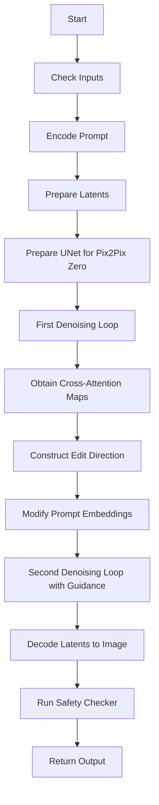
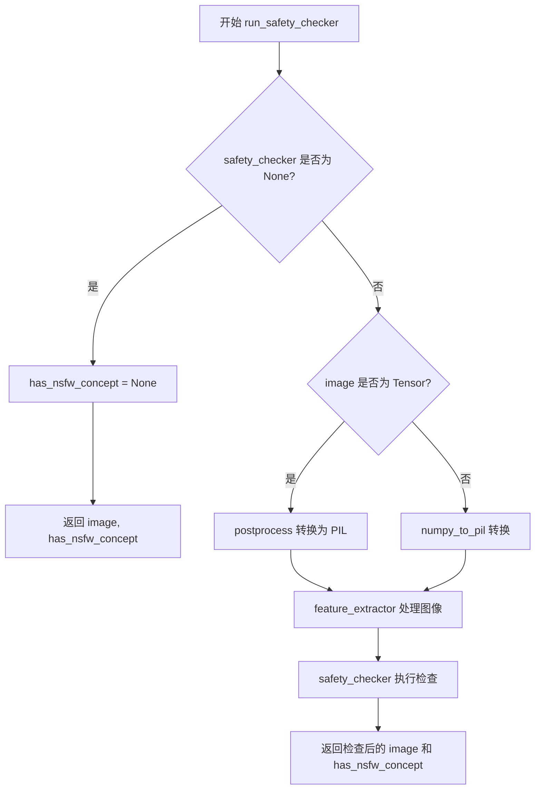
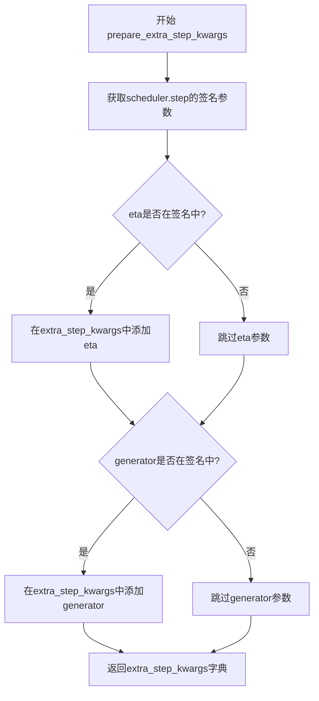
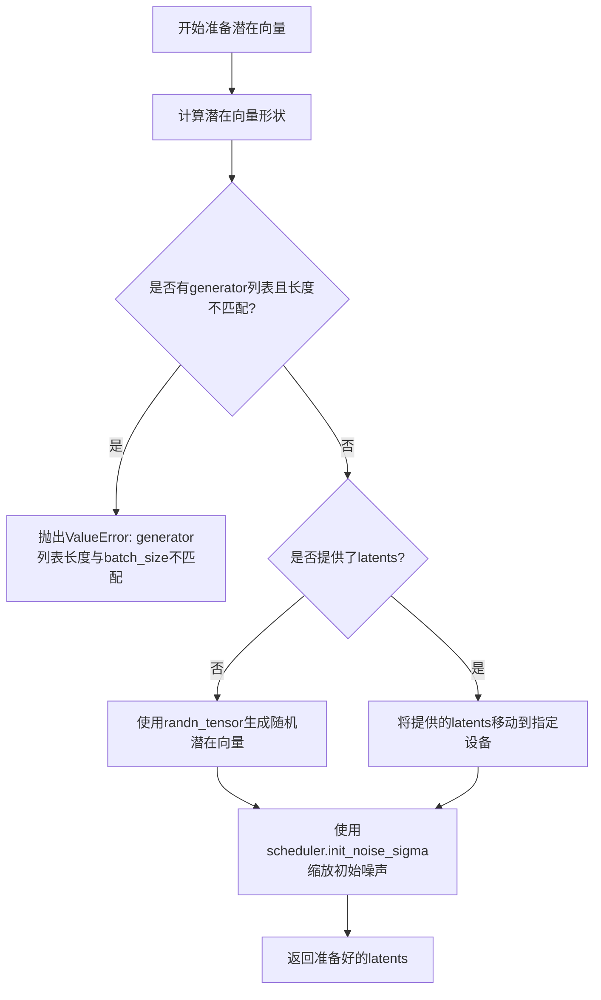
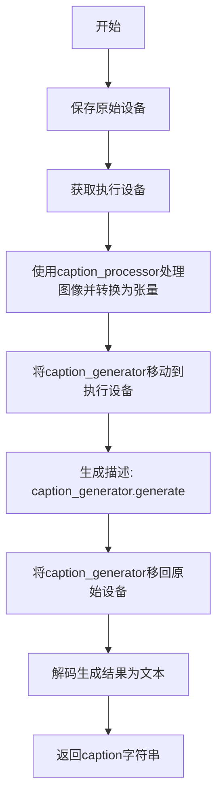

```mermaid
flowchart TD
    A[开始] --> B[计算embs_target的平均值<br>embs_target.mean&#40;0&#41;]
    B --> C[计算embs_source的平均值<br>embs_source.mean&#40;0&#41;]
    C --> D[计算差值<br>embs_target.mean&#40;0&#41; - embs_source.mean&#40;0&#41;]
    D --> E[扩展维度<br>.unsqueeze&#40;0&#41;]
    E --> F[返回编辑方向张量]
```

# `diffusers\src\diffusers\pipelines\deprecated\stable_diffusion_variants\pipeline_stable_diffusion_pix2pix_zero.py` 详细设计文档

Stable Diffusion Pix2Pix Zero pipeline for semantic image editing. It uses a two-pass denoising process: first to obtain cross-attention maps between source and target concepts, then to guide the generation towards the target direction using these attention maps.

## 整体流程



## 类结构

```
DiffusionPipeline (Base)
└── StableDiffusionPix2PixZeroPipeline
    ├── Pix2PixZeroAttnProcessor (Helper Class)
    ├── Pix2PixZeroL2Loss (Helper Class)
    └── Pix2PixInversionPipelineOutput (Data Class)
```

## 全局变量及字段


### `logger`
    
Module-level logger for tracking runtime information and warnings

类型：`logging.Logger`
    


### `EXAMPLE_DOC_STRING`
    
Documentation string containing usage examples for the pipeline's main generation method

类型：`str`
    


### `EXAMPLE_INVERT_DOC_STRING`
    
Documentation string containing usage examples for the image inversion method

类型：`str`
    


### `Pix2PixInversionPipelineOutput.latents`
    
Inverted latents tensor representing the latent space transformation of the input image

类型：`torch.Tensor`
    


### `Pix2PixInversionPipelineOutput.images`
    
Denoised images either as PIL Image objects or numpy arrays after the diffusion process

类型：`list[PIL.Image.Image] | np.ndarray`
    


### `Pix2PixZeroL2Loss.loss`
    
Accumulated L2 loss value used for computing attention-guided edits

类型：`float`
    


### `Pix2PixZeroAttnProcessor.is_pix2pix_zero`
    
Flag indicating whether this processor is used for Pix2Pix Zero cross-attention operations

类型：`bool`
    


### `Pix2PixZeroAttnProcessor.reference_cross_attn_map`
    
Dictionary storing reference cross-attention maps keyed by timestep for loss computation

类型：`dict`
    


### `StableDiffusionPix2PixZeroPipeline.vae`
    
Variational Auto-Encoder model for encoding images to latent space and decoding latents back to images

类型：`AutoencoderKL`
    


### `StableDiffusionPix2PixZeroPipeline.text_encoder`
    
CLIP text encoder for converting text prompts into embedding vectors

类型：`CLIPTextModel`
    


### `StableDiffusionPix2PixZeroPipeline.tokenizer`
    
CLIP tokenizer for converting text strings into token IDs for the text encoder

类型：`CLIPTokenizer`
    


### `StableDiffusionPix2PixZeroPipeline.unet`
    
Conditional U-Net architecture for denoising latent representations conditioned on text embeddings

类型：`UNet2DConditionModel`
    


### `StableDiffusionPix2PixZeroPipeline.scheduler`
    
Diffusion scheduler for managing denoising steps and noise scheduling during image generation

类型：`SchedulerMixin`
    


### `StableDiffusionPix2PixZeroPipeline.safety_checker`
    
Safety checker module for detecting and filtering potentially harmful generated content

类型：`StableDiffusionSafetyChecker`
    


### `StableDiffusionPix2PixZeroPipeline.feature_extractor`
    
CLIP image processor for extracting features from images to be used by the safety checker

类型：`CLIPImageProcessor`
    


### `StableDiffusionPix2PixZeroPipeline.inverse_scheduler`
    
Inverse DDIM scheduler for performing the inversion process to obtain latents from real images

类型：`DDIMInverseScheduler`
    


### `StableDiffusionPix2PixZeroPipeline.caption_generator`
    
BLIP conditional generation model for automatically generating captions from input images

类型：`BlipForConditionalGeneration`
    


### `StableDiffusionPix2PixZeroPipeline.caption_processor`
    
BLIP processor for tokenizing and preprocessing images and text for the caption generator

类型：`BlipProcessor`
    


### `StableDiffusionPix2PixZeroPipeline.vae_scale_factor`
    
Scaling factor derived from VAE block output channels used for computing latent dimensions

类型：`int`
    


### `StableDiffusionPix2PixZeroPipeline.image_processor`
    
VAE image processor for preprocessing images and postprocessing decoded latents

类型：`VaeImageProcessor`
    


### `StableDiffusionPix2PixZeroPipeline.model_cpu_offload_seq`
    
String defining the sequence of models for CPU offloading to manage memory usage

类型：`str`
    


### `StableDiffusionPix2PixZeroPipeline._optional_components`
    
List of optional pipeline components that may not always be required or loaded

类型：`list`
    


### `StableDiffusionPix2PixZeroPipeline._exclude_from_cpu_offload`
    
List of components to exclude from automatic CPU offload management

类型：`list`
    
    

## 全局函数及方法


### `preprocess`

该函数是 Pix2Pix Zero pipeline 中的图像预处理函数，用于将不同格式的输入图像（PIL.Image、torch.Tensor、numpy 数组）统一转换为标准化的 torch.Tensor 格式，以便后续 pipeline 处理。函数已被标记为弃用，建议使用 VaeImageProcessor.preprocess 替代。

参数：

- `image`：`PIL.Image.Image | torch.Tensor | list[PIL.Image.Image] | list[torch.Tensor]`，待处理的输入图像，支持单张图像或图像列表

返回值：`torch.Tensor`，返回标准化后的图像张量，形状为 (batch_size, channels, height, width)，像素值范围为 [-1, 1]

#### 流程图

```mermaid
flowchart TD
    A[开始 preprocess] --> B{image 是 torch.Tensor?}
    B -->|Yes| C[直接返回 image]
    B -->|No| D{image 是 PIL.Image?}
    D -->|Yes| E[将 image 包装为列表]
    D -->|No| F[假设是列表，保持原样]
    E --> G{image[0] 是 PIL.Image?}
    F --> G
    G -->|Yes| H[获取图像尺寸 w, h]
    H --> I[将 w, h 调整为 8 的倍数]
    I --> J[使用 lanczos 重采样调整图像大小]
    J --> K[将每张图像转为 numpy 数组]
    K --> L[在第0维拼接所有图像]
    L --> M[归一化到 [0, 1] 范围]
    M --> N[转置维度从 HWC 到 CHW]
    N --> O[归一化到 [-1, 1] 范围]
    O --> P[转换为 torch.Tensor]
    G -->|No| Q{image[0] 是 torch.Tensor?}
    Q -->|Yes| R[在第0维拼接所有张量]
    P --> S[返回处理后的 tensor]
    R --> S
    Q -->|No| T[抛出异常或返回]
```

#### 带注释源码

```python
def preprocess(image):
    """
    预处理图像函数，将不同格式的输入转换为标准化的 torch.Tensor
    
    参数:
        image: 支持 PIL.Image.Image, torch.Tensor, 
               list[PIL.Image.Image], list[torch.Tensor] 格式
    
    返回:
        torch.Tensor: 标准化后的图像张量，形状 (B, C, H, W)
    """
    # 发出弃用警告，提示用户使用 VaeImageProcessor.preprocess 替代
    deprecation_message = "The preprocess method is deprecated and will be removed in diffusers 1.0.0. Please use VaeImageProcessor.preprocess(...) instead"
    deprecate("preprocess", "1.0.0", deprecation_message, standard_warn=False)
    
    # 如果已经是 torch.Tensor，直接返回（不做任何处理）
    if isinstance(image, torch.Tensor):
        return image
    # 如果是单张 PIL 图像，转换为列表以便统一处理
    elif isinstance(image, PIL.Image.Image):
        image = [image]

    # 处理 PIL 图像列表
    if isinstance(image[0], PIL.Image.Image):
        # 获取图像尺寸
        w, h = image[0].size
        # 将尺寸调整为 8 的倍数（Stable Diffusion 的 VAE 要求）
        w, h = (x - x % 8 for x in (w, h))
        
        # 对每张图像进行 resize 和转换
        image = [np.array(i.resize((w, h), resample=PIL_INTERPOLATION["lanczos"]))[None, :] for i in image]
        # 在第0维（batch 维）拼接所有图像
        image = np.concatenate(image, axis=0)
        # 转换为 float32 并归一化到 [0, 1] 范围
        image = np.array(image).astype(np.float32) / 255.0
        # 转换维度从 (B, H, W, C) 到 (B, C, H, W)
        image = image.transpose(0, 3, 1, 2)
        # 归一化到 [-1, 1] 范围（Stable Diffusion 使用的范围）
        image = 2.0 * image - 1.0
        # 转换为 torch.Tensor
        image = torch.from_numpy(image)
    # 处理 torch.Tensor 列表
    elif isinstance(image[0], torch.Tensor):
        # 在第0维（batch 维）拼接所有张量
        image = torch.cat(image, dim=0)
    
    return image
```


### `prepare_unet`

该函数用于修改 UNet 模型，替换其注意力处理器为 Pix2Pix Zero 自定义的注意力处理器，以支持跨注意力图提取和编辑方向引导。它根据注意力类型（attn2 为交叉注意力）决定是否启用可学习参数。

参数：

- `unet`：`UNet2DConditionModel`，需要修改的 UNet2DConditionModel 模型实例

返回值：`UNet2DConditionModel`，返回修改后的 UNet 模型

#### 流程图

```mermaid
flowchart TD
    A[开始: prepare_unet] --> B[创建空字典 pix2pix_zero_attn_procs]
    B --> C{遍历 unet.attn_processors 的每个 name}
    C --> D[计算 module_name = name.replace
    D --> E[获取 submodule: unet.get_submodule
    E --> F{判断 'attn2' 是否在 name 中}
    F -->|是| G[创建 Pix2PixZeroAttnProcessor is_pix2pix_zero=True]
    G --> H[启用梯度: module.requires_grad_True]
    H --> I[添加到字典]
    F -->|否| J[创建 Pix2PixZeroAttnProcessor is_pix2pix_zero=False]
    J --> K[禁用梯度: module.requires_grad_False]
    K --> I
    I --> C
    C -->|遍历完成| L[设置新的注意力处理器: unet.set_attn_processor]
    L --> M[返回修改后的 unet]
    M --> N[结束]
```

#### 带注释源码

```python
def prepare_unet(unet: UNet2DConditionModel):
    """
    Modifies the UNet (`unet`) to perform Pix2Pix Zero optimizations.
    
    该函数将 UNet 中的默认注意力处理器替换为 Pix2PixZeroAttnProcessor。
    对于 cross-attention (attn2)，启用梯度以便学习注意力权重用于编辑方向计算；
    对于 self-attention (attn1)，禁用梯度以保持固定特征。
    
    Args:
        unet: UNet2DConditionModel，需要修改的 UNet 模型
        
    Returns:
        UNet2DConditionModel，配置好自定义注意力处理器的 UNet 模型
    """
    # 创建一个字典用于存储自定义的注意力处理器
    pix2pix_zero_attn_procs = {}
    
    # 遍历 UNet 中所有的注意力处理器名称
    for name in unet.attn_processors.keys():
        # 移除 ".processor" 后缀获取模块名称
        module_name = name.replace(".processor", "")
        
        # 获取对应的子模块
        module = unet.get_submodule(module_name)
        
        # 判断是否为交叉注意力 (attn2)
        # attn2 通常指 cross-attention，用于处理文本条件
        if "attn2" in name:
            # 为交叉注意力创建支持 Pix2Pix Zero 的处理器
            pix2pix_zero_attn_procs[name] = Pix2PixZeroAttnProcessor(is_pix2pix_zero=True)
            # 启用梯度以便在训练过程中学习注意力权重
            module.requires_grad_(True)
        else:
            # 为自注意力创建不支持 Pix2Pix Zero 的处理器
            pix2pix_zero_attn_procs[name] = Pix2PixZeroAttnProcessor(is_pix2pix_zero=False)
            # 禁用梯度以减少计算开销并保持固定特征
            module.requires_grad_(False)

    # 使用新的注意力处理器替换原有的处理器
    unet.set_attn_processor(pix2pix_zero_attn_procs)
    
    # 返回修改后的 UNet 模型
    return unet
```


### `Pix2PixZeroL2Loss.compute_loss`

该方法用于计算预测值与目标值之间的L2损失（均方误差），并将损失累加到类的 `loss` 属性中。在 Pix2Pix Zero 图像编辑pipeline中，该方法被用于比较当前时刻与前一时刻的交叉注意力图（cross-attention maps），以指导图像生成过程。

参数：

-  `predictions`：`torch.Tensor`，当前步骤计算得到的交叉注意力概率图
-  `targets`：`torch.Tensor`，参考的交叉注意力概率图（通常来自前一时间步）

返回值：`None`，无返回值。计算结果通过累加更新 `self.loss` 实例属性。

#### 流程图

```mermaid
flowchart TD
    A[开始 compute_loss] --> B[计算差值: predictions - targets]
    B --> C[平方运算: (差值)²]
    C --> D[维度求和: sum(dim=1,2)]
    D --> E[取平均值: mean dim=0]
    E --> F[累加到self.loss]
    F --> G[结束]
```

#### 带注释源码

```python
class Pix2PixZeroL2Loss:
    """用于计算Pix2Pix Zero中交叉注意力图L2损失的类"""
    
    def __init__(self):
        """初始化损失值为0.0"""
        self.loss = 0.0  # 累积的L2损失值
    
    def compute_loss(self, predictions, targets):
        """
        计算预测值与目标值之间的L2损失并累加到self.loss
        
        Args:
            predictions (torch.Tensor): 当前注意力概率图
            targets (torch.Tensor): 参考/之前的注意力概率图
        """
        # 步骤1: 计算预测值与目标值的差值
        # 步骤2: 对差值进行平方 ((predictions - targets) ** 2)
        # 步骤3: 在空间维度(通道和高度宽度)求和 .sum((1, 2))
        # 步骤4: 对batch维度取平均 .mean(0)
        # 步骤5: 将计算结果累加到self.loss
        self.loss += ((predictions - targets) ** 2).sum((1, 2)).mean(0)
```


### `Pix2PixZeroAttnProcessor.__call__`

该方法是 Pix2Pix Zero 注意力处理器的核心实现，用于在扩散模型的交叉注意力块中执行注意力计算，并根据是否为 Pix2Pix Zero 模式保存注意力权重用于后续的编辑方向学习。

参数：

- `self`：`Pix2PixZeroAttnProcessor` 实例本身
- `attn`：`Attention`，注意力模块实例，提供查询、键、值的投影矩阵以及注意力掩码处理方法
- `hidden_states`：`torch.Tensor`，隐藏状态张量，形状为 (batch_size, sequence_length, hidden_dim)
- `encoder_hidden_states`：`torch.Tensor | None`，编码器的隐藏状态，用于交叉注意力计算，默认为 None 时使用 hidden_states
- `attention_mask`：`torch.Tensor | None`，注意力掩码，用于控制注意力计算的哪些位置被屏蔽
- `timestep`：`int | None`，当前扩散时间步，用于在 Pix2Pix Zero 模式下按时间步存储和检索注意力权重
- `loss`：`Pix2PixZeroL2Loss | None`，损失对象，用于在 Pix2Pix Zero 模式下计算注意力引导损失

返回值：`torch.Tensor`，经过注意力计算和线性投影后的隐藏状态，形状与输入 hidden_states 相同

#### 流程图

```mermaid
flowchart TD
    A[开始 __call__] --> B[获取 batch_size, sequence_length]
    B --> C[调用 attn.prepare_attention_mask 准备注意力掩码]
    C --> D[使用 attn.to_q 对 hidden_states 投影得到 query]
    D --> E{encoder_hidden_states 是否为 None?}
    E -->|是| F[使用 hidden_states 作为 encoder_hidden_states]
    E -->|否| G{attn.norm_cross 是否存在?}
    G -->|是| H[使用 attn.norm_encoder_hidden_states 标准化]
    G -->|否| I[直接使用 encoder_hidden_states]
    H --> J[使用 attn.to_k 和 attn.to_v 投影得到 key 和 value]
    F --> J
    I --> J
    J --> K[使用 attn.head_to_batch_dim 转换维度]
    K --> L[调用 attn.get_attention_scores 计算注意力概率]
    L --> M{is_pix2pix_zero 且 timestep 不为 None?}
    M -->|是| N{loss 是否为 None?}
    N -->|是| O[保存 attention_probs 到 reference_cross_attn_map]
    N -->|否| P[检索之前的 attention_probs 并计算损失]
    M -->|否| Q[跳过 Pix2Pix Zero 处理]
    O --> Q
    P --> Q
    Q --> R[使用 torch.bmm 计算 hidden_states = attention_probs × value]
    R --> S[使用 attn.batch_to_head_dim 转换回原始维度]
    S --> T[依次通过 attn.to_out[0] 线性投影和 attn.to_out[1] Dropout]
    T --> U[返回 hidden_states]
```

#### 带注释源码

```python
def __call__(
    self,
    attn: Attention,
    hidden_states,
    encoder_hidden_states=None,
    attention_mask=None,
    timestep=None,
    loss=None,
):
    """
    执行注意力计算的核心方法，支持 Pix2Pix Zero 的注意力权重保存和损失计算。
    
    参数:
        attn: Attention 模块，包含投影矩阵和注意力计算方法
        hidden_states: 输入的隐藏状态张量
        encoder_hidden_states: 编码器隐藏状态（交叉注意力用）
        attention_mask: 注意力掩码
        timestep: 扩散时间步，用于索引保存的注意力图
        loss: Pix2PixZeroL2Loss 实例，用于累积损失
    """
    # 从 hidden_states 获取批量大小和序列长度
    batch_size, sequence_length, _ = hidden_states.shape
    
    # 准备注意力掩码，处理不同形状和批量大小的掩码
    attention_mask = attn.prepare_attention_mask(attention_mask, sequence_length, batch_size)
    
    # 使用注意力模块的 to_q 线性层将 hidden_states 投影为查询向量 query
    query = attn.to_q(hidden_states)

    # 处理编码器隐藏状态
    if encoder_hidden_states is None:
        # 如果未提供编码器隐藏状态，则使用自身的隐藏状态（自注意力）
        encoder_hidden_states = hidden_states
    elif attn.norm_cross:
        # 如果存在交叉注意力标准化配置，则对编码器隐藏状态进行标准化
        encoder_hidden_states = attn.norm_encoder_hidden_states(encoder_hidden_states)

    # 使用 to_k 和 to_v 将编码器隐藏状态投影为键 key 和值 value
    key = attn.to_k(encoder_hidden_states)
    value = attn.to_v(encoder_hidden_states)

    # 将查询、键、值从 (batch, seq, dim) 转换为多头注意力的批次格式
    # 形状从 (batch, seq, dim) 变为 (batch, heads, seq, head_dim)
    query = attn.head_to_batch_dim(query)
    key = attn.head_to_batch_dim(key)
    value = attn.head_to_batch_dim(value)

    # 计算注意力分数（概率），返回形状为 (batch, heads, seq, seq) 的注意力权重
    attention_probs = attn.get_attention_scores(query, key, attention_mask)
    
    # Pix2Pix Zero 特殊处理：根据是否为 Pix2Pix Zero 模式以及是否提供时间步进行处理
    if self.is_pix2pix_zero and timestep is not None:
        # 新的注意力权重记录逻辑
        if loss is None:
            # 前向传播阶段（推理）：保存当前时间步的注意力概率图到 CPU
            # 使用 timestep.item() 作为键存储.detach() 和 .cpu() 后的副本以节省显存
            self.reference_cross_attn_map[timestep.item()] = attention_probs.detach().cpu()
        elif loss is not None:
            # 反向传播阶段（学习）：检索之前保存的注意力概率图并计算 L2 损失
            # 将保存的注意力图移动到当前设备以进行损失计算
            prev_attn_probs = self.reference_cross_attn_map.pop(timestep.item())
            loss.compute_loss(attention_probs, prev_attn_probs.to(attention_probs.device))

    # 注意力加权计算：使用注意力概率对值进行加权
    # torch.bmm 执行批量矩阵乘法，形状: (batch, heads, seq, head_dim)
    hidden_states = torch.bmm(attention_probs, value)
    # 将隐藏状态从多头格式转回原始格式 (batch, seq, dim)
    hidden_states = attn.batch_to_head_dim(hidden_states)

    # 线性投影层：将隐藏状态投影回原始维度
    hidden_states = attn.to_out[0](hidden_states)
    # Dropout 层：用于推理时随机丢弃神经元（通常在训练时使用）
    hidden_states = attn.to_out[1](hidden_states)

    # 返回处理后的隐藏状态
    return hidden_states
```


### `StableDiffusionPix2PixZeroPipeline.__init__`

这是 Stable Diffusion Pix2Pix Zero 管道类的初始化方法，负责接收并注册所有必需的模型组件（VAE、文本编码器、UNet、调度器等）和可选组件（安全检查器、字幕生成器等），同时进行参数校验并初始化图像处理器。

参数：

- `vae`：`AutoencoderKL`，Variational Auto-Encoder (VAE) 模型，用于编码和解码图像与潜在表示
- `text_encoder`：`CLIPTextModel`，冻结的文本编码器，Stable Diffusion 使用 CLIP 的文本部分
- `tokenizer`：`CLIPTokenizer`，CLIPTokenizer 类的分词器
- `unet`：`UNet2DConditionModel`，条件 U-Net 架构，用于对编码后的图像潜在表示进行去噪
- `scheduler`：`DDPMScheduler | DDIMScheduler | EulerAncestralDiscreteScheduler | LMSDiscreteScheduler`，与 `unet` 结合使用对编码图像潜在表示进行去噪的调度器
- `feature_extractor`：`CLIPImageProcessor`，从生成的图像中提取特征用于安全检查器的输入
- `safety_checker`：`StableDiffusionSafetyChecker`，分类模块，用于评估生成的图像是否被认为具有攻击性或有害
- `inverse_scheduler`：`DDIMInverseScheduler`，用于图像反转的逆调度器
- `caption_generator`：`BlipForConditionalGeneration`，BLIP 条件生成模型，用于为图像生成字幕
- `caption_processor`：`BlipProcessor`，BLIP 模型的处理器
- `requires_safety_checker`：`bool`，是否需要安全检查器，默认为 True

返回值：`None`，构造函数无返回值，仅初始化对象状态

#### 流程图

```mermaid
flowchart TD
    A[开始 __init__] --> B[调用 super().__init__]
    B --> C{safety_checker is None<br/>且 requires_safety_checker is True?}
    C -->|是| D[输出安全检查器禁用警告]
    C -->|否| E{safety_checker is not None<br/>且 feature_extractor is None?}
    D --> E
    E -->|是| F[抛出 ValueError: 缺少特征提取器]
    E -->|否| G[调用 register_modules 注册所有模块]
    G --> H[计算 vae_scale_factor]
    H --> I[创建 VaeImageProcessor 实例]
    I --> J[调用 register_to_config 注册配置]
    J --> K[结束 __init__]
```

#### 带注释源码

```
def __init__(
    self,
    vae: AutoencoderKL,  # VAE 模型，用于图像编码/解码
    text_encoder: CLIPTextModel,  # CLIP 文本编码器
    tokenizer: CLIPTokenizer,  # CLIP 分词器
    unet: UNet2DConditionModel,  # 条件 U-Net 去噪模型
    scheduler: DDPMScheduler | DDIMScheduler | EulerAncestralDiscreteScheduler | LMSDiscreteScheduler,  # 去噪调度器
    feature_extractor: CLIPImageProcessor,  # 图像特征提取器
    safety_checker: StableDiffusionSafetyChecker,  # NSFW 安全检查器
    inverse_scheduler: DDIMInverseScheduler,  # DDIM 逆调度器用于图像反转
    caption_generator: BlipForConditionalGeneration,  # BLIP 字幕生成模型
    caption_processor: BlipProcessor,  # BLIP 处理器
    requires_safety_checker: bool = True,  # 是否启用安全检查器
):
    # 调用父类 DiffusionPipeline 和 StableDiffusionMixin 的初始化
    super().__init__()

    # 如果 safety_checker 为 None 但 requires_safety_checker 为 True，发出警告
    if safety_checker is None and requires_safety_checker:
        logger.warning(
            f"You have disabled the safety checker for {self.__class__} by passing `safety_checker=None`. Ensure"
            " that you abide to the conditions of the Stable Diffusion license and do not expose unfiltered"
            " results in services or applications open to the public. Both the diffusers team and Hugging Face"
            " strongly recommend to keep the safety filter enabled in all public facing circumstances, disabling"
            " it only for use-cases that involve analyzing network behavior or auditing its results. For more"
            " information, please have a look at https://github.com/huggingface/diffusers/pull/254 ."
        )

    # 如果提供了 safety_checker 但没有 feature_extractor，抛出错误
    if safety_checker is not None and feature_extractor is None:
        raise ValueError(
            "Make sure to define a feature extractor when loading {self.__class__} if you want to use the safety"
            " checker. If you do not want to use the safety checker, you can pass `'safety_checker=None'` instead."
        )

    # 注册所有模块到管道中，使它们可通过管道对象访问
    self.register_modules(
        vae=vae,
        text_encoder=text_encoder,
        tokenizer=tokenizer,
        unet=unet,
        scheduler=scheduler,
        safety_checker=safety_checker,
        feature_extractor=feature_extractor,
        caption_processor=caption_processor,
        caption_generator=caption_generator,
        inverse_scheduler=inverse_scheduler,
    )

    # 计算 VAE 缩放因子，基于 VAE 块输出通道数的幂
    # 默认为 2^(len(block_out_channels) - 1)，如果 VAE 不存在则为 8
    self.vae_scale_factor = 2 ** (len(self.vae.config.block_out_channels) - 1) if getattr(self, "vae", None) else 8

    # 创建 VAE 图像处理器，用于图像预处理和后处理
    self.image_processor = VaeImageProcessor(vae_scale_factor=self.vae_scale_factor)

    # 将 requires_safety_checker 配置注册到管道配置中
    self.register_to_config(requires_safety_checker=requires_safety_checker)
```


### `StableDiffusionPix2PixZeroPipeline._encode_prompt`

该方法是 `StableDiffusionPix2PixZeroPipeline` 类的成员函数，主要用于将文本提示（prompt）编码为文本编码器的隐藏状态。该方法是已弃用的旧版方法，它内部调用了新版 `encode_prompt` 方法，为了向后兼容性，将返回的元组重新拼接为单个张量。

参数：

- `self`：隐式参数，指向类的实例
- `prompt`：`str` 或 `list[str]`，要编码的提示文本
- `device`：`torch.device`，PyTorch 设备
- `num_images_per_prompt`：`int`，每个提示要生成的图像数量
- `do_classifier_free_guidance`：`bool`，是否使用无分类器自由引导
- `negative_prompt`：`str` 或 `list[str]` 或 `None`，不用于引导图像生成的提示
- `prompt_embeds`：`torch.Tensor` 或 `None`，预先生成的文本嵌入
- `negative_prompt_embeds`：`torch.Tensor` 或 `None`，预先生成的负面文本嵌入
- `lora_scale`：`float` 或 `None`，应用于文本编码器所有 LoRA 层的 LoRA 缩放因子
- `**kwargs`：可变关键字参数，用于传递其他参数

返回值：`torch.Tensor`，拼接后的提示嵌入张量（将负面提示嵌入和正向提示嵌入在维度0上拼接）

#### 流程图

```mermaid
flowchart TD
    A[开始 _encode_prompt] --> B[记录弃用警告]
    B --> C[调用 self.encode_prompt 方法]
    C --> D[获取返回的元组 prompt_embeds_tuple]
    E[prompt_embeds_tuple[1]] --> F[torch.cat]
    E1[prompt_embeds_tuple[0]] --> F
    F --> G[拼接: torch.cat[negative, positive]]
    G --> H[返回拼接后的 prompt_embeds]
```

#### 带注释源码

```python
def _encode_prompt(
    self,
    prompt,
    device,
    num_images_per_prompt,
    do_classifier_free_guidance,
    negative_prompt=None,
    prompt_embeds: torch.Tensor | None = None,
    negative_prompt_embeds: torch.Tensor | None = None,
    lora_scale: float | None = None,
    **kwargs,
):
    """
    已弃用的提示编码方法，为了向后兼容保留。
    内部调用新版的 encode_prompt 方法，并将返回的元组格式转换回旧的拼接张量格式。
    """
    # 记录弃用警告，提示用户使用 encode_prompt 替代
    deprecation_message = "`_encode_prompt()` is deprecated and it will be removed in a future version. Use `encode_prompt()` instead. Also, be aware that the output format changed from a concatenated tensor to a tuple."
    deprecate("_encode_prompt()", "1.0.0", deprecation_message, standard_warn=False)

    # 调用新版的 encode_prompt 方法获取编码结果
    # 返回值为元组 (negative_prompt_embeds, prompt_embeds)
    prompt_embeds_tuple = self.encode_prompt(
        prompt=prompt,
        device=device,
        num_images_per_prompt=num_images_per_prompt,
        do_classifier_free_guidance=do_classifier_free_guidance,
        negative_prompt=negative_prompt,
        prompt_embeds=prompt_embeds,
        negative_prompt_embeds=negative_prompt_embeds,
        lora_scale=lora_scale,
        **kwargs,
    )

    # 为了向后兼容性，将元组中的元素重新拼接
    # 旧版格式: [negative_prompt_embeds, prompt_embeds] 拼接在 batch 维度
    # 元组格式: (negative_prompt_embeds, prompt_embeds)
    # 因此需要 [1, 0] 的顺序来恢复旧版格式
    prompt_embeds = torch.cat([prompt_embeds_tuple[1], prompt_embeds_tuple[0]])

    return prompt_embeds
```


### `StableDiffusionPix2PixZeroPipeline.encode_prompt`

该方法将文本提示词编码为文本编码器的隐藏状态，用于后续的图像生成过程。它处理提示词的Token化、文本编码器的正向传播，并支持LoRA权重调整、文本反转、分类器自由引导等功能。

参数：

- `prompt`：`str | list[str] | None`，要编码的提示词，可以是单个字符串或字符串列表
- `device`：`torch.device`，torch设备，用于执行编码操作
- `num_images_per_prompt`：`int`，每个提示词需要生成的图像数量
- `do_classifier_free_guidance`：`bool`，是否启用分类器自由引导
- `negative_prompt`：`str | list[str] | None`，不引导图像生成的提示词，如果未定义则需传递`negative_prompt_embeds`
- `prompt_embeds`：`torch.Tensor | None`，预生成的文本嵌入，可用于轻松调整文本输入
- `negative_prompt_embeds`：`torch.Tensor | None`，预生成的负面文本嵌入
- `lora_scale`：`float | None`，如果加载了LoRA层，将应用于文本编码器所有LoRA层的LoRA比例
- `clip_skip`：`int | None`，计算提示嵌入时从CLIP跳过的层数

返回值：`tuple[torch.Tensor, torch.Tensor]`，返回两个张量——`prompt_embeds`和`negative_prompt_embeds`，分别表示正面提示词和负面提示词的文本嵌入

#### 流程图

```mermaid
flowchart TD
    A[开始 encode_prompt] --> B{检查 lora_scale}
    B -->|非空且是 StableDiffusionLoraLoaderMixin| C[设置 self._lora_scale]
    C --> D{USE_PEFT_BACKEND?}
    D -->|是| E[scale_lora_layers]
    D -->|否| F[adjust_lora_scale_text_encoder]
    E --> G[计算 batch_size]
    F --> G
    B -->|空或不是| G
    
    G --> H{prompt_embeds 为空?}
    H -->|是| I{检查 TextualInversionLoaderMixin}
    I -->|是| J[maybe_convert_prompt]
    I -->|否| K[tokenizer 处理 prompt]
    J --> K
    
    K --> L[获取 text_input_ids]
    L --> M{text_encoder 使用 attention_mask?}
    M -->|是| N[获取 attention_mask]
    M -->|否| O[attention_mask = None]
    N --> P
    O --> P
    
    P{clip_skip 为空?} 
    -->|是| Q[text_encoder forward]
    -->R[取 prompt_embeds = output[0]]
    P -->|否| S[text_encoder forward with hidden_states]
    S --> T[根据 clip_skip 获取对应层的 hidden_states]
    T --> U[应用 final_layer_norm]
    U --> R
    
    R --> V[转换为 prompt_embeds_dtype]
    V --> W[重复 prompt_embeds 以匹配 num_images_per_prompt]
    
    H -->|否| X[直接使用 prompt_embeds]
    X --> W
    
    W --> Y{do_classifier_free_guidance 且 negative_prompt_embeds 为空?}
    Y -->|是| Z[处理 uncond_tokens]
    Y -->|否| AA[返回结果]
    
    Z --> AA1[tokenizer 处理 uncond_tokens]
    AA1 --> AB[text_encoder 编码]
    AB --> AC[转换为 prompt_embeds_dtype]
    AC --> AD[重复 negative_prompt_embeds]
    
    AD --> AE{是 StableDiffusionLoraLoaderMixin 且 USE_PEFT_BACKEND?}
    AE -->|是| AF[unscale_lora_layers]
    AE -->|否| AA
    
    AF --> AA
    
    AA --> AG[返回 prompt_embeds, negative_prompt_embeds]
```

#### 带注释源码

```python
def encode_prompt(
    self,
    prompt,
    device,
    num_images_per_prompt,
    do_classifier_free_guidance,
    negative_prompt=None,
    prompt_embeds: torch.Tensor | None = None,
    negative_prompt_embeds: torch.Tensor | None = None,
    lora_scale: float | None = None,
    clip_skip: int | None = None,
):
    r"""
    Encodes the prompt into text encoder hidden states.

    Args:
        prompt (`str` or `list[str]`, *optional*):
            prompt to be encoded
        device: (`torch.device`):
            torch device
        num_images_per_prompt (`int`):
            number of images that should be generated per prompt
        do_classifier_free_guidance (`bool`):
            whether to use classifier free guidance or not
        negative_prompt (`str` or `list[str]`, *optional*):
            The prompt or prompts not to guide the image generation. If not defined, one has to pass
            `negative_prompt_embeds` instead. Ignored when not using guidance (i.e., ignored if `guidance_scale` is
            less than `1`).
        prompt_embeds (`torch.Tensor`, *optional*):
            Pre-generated text embeddings. Can be used to easily tweak text inputs, *e.g.* prompt weighting. If not
            provided, text embeddings will be generated from `prompt` input argument.
        negative_prompt_embeds (`torch.Tensor`, *optional*):
            Pre-generated negative text embeddings. Can be used to easily tweak text inputs, *e.g.* prompt
            weighting. If not provided, negative_prompt_embeds will be generated from `negative_prompt` input
            argument.
        lora_scale (`float`, *optional*):
            A LoRA scale that will be applied to all LoRA layers of the text encoder if LoRA layers are loaded.
        clip_skip (`int`, *optional*):
            Number of layers to be skipped from CLIP while computing the prompt embeddings. A value of 1 means that
            the output of the pre-final layer will be used for computing the prompt embeddings.
    """
    # 设置 lora scale，以便 text encoder 的 monkey patched LoRA 函数可以正确访问
    # 如果 lora_scale 不为空且当前对象是 StableDiffusionLoraLoaderMixin 的实例
    if lora_scale is not None and isinstance(self, StableDiffusionLoraLoaderMixin):
        self._lora_scale = lora_scale

        # 动态调整 LoRA scale
        if not USE_PEFT_BACKEND:
            # 如果不使用 PEFT 后端，则直接调整 text encoder 的 LoRA scale
            adjust_lora_scale_text_encoder(self.text_encoder, lora_scale)
        else:
            # 如果使用 PEFT 后端，则缩放 LoRA 层
            scale_lora_layers(self.text_encoder, lora_scale)

    # 确定 batch_size
    # 如果 prompt 是字符串，则 batch_size 为 1
    if prompt is not None and isinstance(prompt, str):
        batch_size = 1
    # 如果 prompt 是列表，则 batch_size 为列表长度
    elif prompt is not None and isinstance(prompt, list):
        batch_size = len(prompt)
    # 否则使用 prompt_embeds 的 batch size
    else:
        batch_size = prompt_embeds.shape[0]

    # 如果 prompt_embeds 为 None，则需要从 prompt 生成
    if prompt_embeds is None:
        # 文本反转：如果有必要，处理多向量 token
        if isinstance(self, TextualInversionLoaderMixin):
            prompt = self.maybe_convert_prompt(prompt, self.tokenizer)

        # 使用 tokenizer 将 prompt 转换为 token ids
        text_inputs = self.tokenizer(
            prompt,
            padding="max_length",
            max_length=self.tokenizer.model_max_length,
            truncation=True,
            return_tensors="pt",
        )
        text_input_ids = text_inputs.input_ids
        
        # 获取未截断的 token ids（用于检查是否发生了截断）
        untruncated_ids = self.tokenizer(prompt, padding="longest", return_tensors="pt").input_ids

        # 检查是否发生了截断，并记录警告
        if untruncated_ids.shape[-1] >= text_input_ids.shape[-1] and not torch.equal(
            text_input_ids, untruncated_ids
        ):
            removed_text = self.tokenizer.batch_decode(
                untruncated_ids[:, self.tokenizer.model_max_length - 1 : -1]
            )
            logger.warning(
                "The following part of your input was truncated because CLIP can only handle sequences up to"
                f" {self.tokenizer.model_max_length} tokens: {removed_text}"
            )

        # 获取 attention_mask（如果 text_encoder 配置中启用了 attention_mask）
        if hasattr(self.text_encoder.config, "use_attention_mask") and self.text_encoder.config.use_attention_mask:
            attention_mask = text_inputs.attention_mask.to(device)
        else:
            attention_mask = None

        # 根据是否需要 skip clip 层来决定如何获取 prompt_embeds
        if clip_skip is None:
            # 直接使用 text_encoder 获取 embeddings
            prompt_embeds = self.text_encoder(text_input_ids.to(device), attention_mask=attention_mask)
            prompt_embeds = prompt_embeds[0]
        else:
            # 获取所有 hidden states，然后根据 clip_skip 选择对应层的输出
            prompt_embeds = self.text_encoder(
                text_input_ids.to(device), attention_mask=attention_mask, output_hidden_states=True
            )
            # 访问 hidden_states，这是一个包含所有编码器层输出的元组
            # 然后根据 clip_skip 选择对应层的 hidden states
            prompt_embeds = prompt_embeds[-1][-(clip_skip + 1)]
            # 还需要应用 final_layer_norm，以确保表示正确
            prompt_embeds = self.text_encoder.text_model.final_layer_norm(prompt_embeds)

    # 确定 prompt_embeds 的数据类型
    if self.text_encoder is not None:
        prompt_embeds_dtype = self.text_encoder.dtype
    elif self.unet is not None:
        prompt_embeds_dtype = self.unet.dtype
    else:
        prompt_embeds_dtype = prompt_embeds.dtype

    # 将 prompt_embeds 转换为正确的设备和数据类型
    prompt_embeds = prompt_embeds.to(dtype=prompt_embeds_dtype, device=device)

    # 获取 embeddings 的形状信息
    bs_embed, seq_len, _ = prompt_embeds.shape
    # 为每个 prompt 复制 text embeddings（使用对 MPS 友好的方法）
    prompt_embeds = prompt_embeds.repeat(1, num_images_per_prompt, 1)
    prompt_embeds = prompt_embeds.view(bs_embed * num_images_per_prompt, seq_len, -1)

    # 如果使用分类器自由引导且 negative_prompt_embeds 为空，则生成无条件 embeddings
    if do_classifier_free_guidance and negative_prompt_embeds is None:
        uncond_tokens: list[str]
        if negative_prompt is None:
            # 如果没有提供 negative_prompt，使用空字符串
            uncond_tokens = [""] * batch_size
        elif prompt is not None and type(prompt) is not type(negative_prompt):
            raise TypeError(
                f"`negative_prompt` should be the same type to `prompt`, but got {type(negative_prompt)} !="
                f" {type(prompt)}."
            )
        elif isinstance(negative_prompt, str):
            uncond_tokens = [negative_prompt]
        elif batch_size != len(negative_prompt):
            raise ValueError(
                f"`negative_prompt`: {negative_prompt} has batch size {len(negative_prompt)}, but `prompt`:"
                f" {prompt} has batch size {batch_size}. Please make sure that passed `negative_prompt` matches"
                " the batch size of `prompt`."
            )
        else:
            uncond_tokens = negative_prompt

        # 文本反转：如果有必要，处理多向量 token
        if isinstance(self, TextualInversionLoaderMixin):
            uncond_tokens = self.maybe_convert_prompt(uncond_tokens, self.tokenizer)

        # 确定序列长度
        max_length = prompt_embeds.shape[1]
        # 使用 tokenizer 处理 uncond_tokens
        uncond_input = self.tokenizer(
            uncond_tokens,
            padding="max_length",
            max_length=max_length,
            truncation=True,
            return_tensors="pt",
        )

        # 获取 attention_mask
        if hasattr(self.text_encoder.config, "use_attention_mask") and self.text_encoder.config.use_attention_mask:
            attention_mask = uncond_input.attention_mask.to(device)
        else:
            attention_mask = None

        # 编码 negative_prompt
        negative_prompt_embeds = self.text_encoder(
            uncond_input.input_ids.to(device),
            attention_mask=attention_mask,
        )
        negative_prompt_embeds = negative_prompt_embeds[0]

    # 如果使用分类器自由引导
    if do_classifier_free_guidance:
        # 获取序列长度
        seq_len = negative_prompt_embeds.shape[1]

        # 转换为正确的设备和数据类型
        negative_prompt_embeds = negative_prompt_embeds.to(dtype=prompt_embeds_dtype, device=device)

        # 复制 negative_prompt_embeds 以匹配 num_images_per_prompt
        negative_prompt_embeds = negative_prompt_embeds.repeat(1, num_images_per_prompt, 1)
        negative_prompt_embeds = negative_prompt_embeds.view(batch_size * num_images_per_prompt, seq_len, -1)

    # 如果是 StableDiffusionLoraLoaderMixin 且使用 PEFT 后端，恢复原始 scale
    if self.text_encoder is not None:
        if isinstance(self, StableDiffusionLoraLoaderMixin) and USE_PEFT_BACKEND:
            # 通过 unscale LoRA 层来恢复原始 scale
            unscale_lora_layers(self.text_encoder, lora_scale)

    # 返回 prompt_embeds 和 negative_prompt_embeds
    return prompt_embeds, negative_prompt_embeds
```


### `StableDiffusionPix2PixZeroPipeline.run_safety_checker`

该方法用于检查生成图像是否包含不当内容（NSFW），通过调用 `StableDiffusionSafetyChecker` 对图像进行安全检查，如果未配置安全检查器则直接返回原始图像和 `None`。

参数：

- `image`：`torch.Tensor | np.ndarray | PIL.Image.Image`，需要检查安全性的图像输入
- `device`：`torch.device`，用于运行安全检查器的设备
- `dtype`：`torch.dtype`，输入数据的精度类型（如 `torch.float16`）

返回值：`tuple[torch.Tensor | np.ndarray | list[PIL.Image.Image], torch.Tensor | None]`，返回处理后的图像和 NSFW 检测结果元组

#### 流程图



#### 带注释源码

```
def run_safety_checker(self, image, device, dtype):
    # 如果未配置安全检查器，直接返回原始图像和 None
    if self.safety_checker is None:
        has_nsfw_concept = None
    else:
        # 将图像转换为特征提取器所需格式
        if torch.is_tensor(image):
            # Tensor 类型需要 postprocess 转换为 PIL 图像
            feature_extractor_input = self.image_processor.postprocess(image, output_type="pil")
        else:
            # numpy 数组直接转换为 PIL 图像
            feature_extractor_input = self.image_processor.numpy_to_pil(image)
        
        # 使用特征提取器提取图像特征
        safety_checker_input = self.feature_extractor(feature_extractor_input, return_tensors="pt").to(device)
        
        # 调用安全检查器进行 NSFW 检测
        image, has_nsfw_concept = self.safety_checker(
            images=image, clip_input=safety_checker_input.pixel_values.to(dtype)
        )
    
    # 返回处理后的图像和 NSFW 检测结果
    return image, has_nsfw_concept
```


### StableDiffusionPix2PixZeroPipeline.decode_latents

该方法是StableDiffusionPix2PixZeroPipeline管道类的一个成员方法，用于将潜在表示（latents）解码为图像。该方法已被标记为弃用，将在未来版本中移除，建议使用VaeImageProcessor.postprocess方法替代。

参数：

- `latents`：`torch.Tensor`，需要解码的潜在表示张量，通常来自扩散模型的推理过程

返回值：`numpy.ndarray`，解码后的图像，形状为(batch_size, height, width, channels)，像素值范围为[0, 1]

#### 流程图

```mermaid
flowchart TD
    A[开始 decode_latents] --> B[记录弃用警告]
    B --> C[反向缩放 latents: latents = 1/scaling_factor * latents]
    C --> D[使用 VAE 解码: vae.decode]
    D --> E[图像归一化: (image/2 + 0.5).clamp(0, 1)]
    E --> F[转换为 numpy 数组]
    F --> G[返回图像]
```

#### 带注释源码

```python
# Copied from diffusers.pipelines.stable_diffusion.pipeline_stable_diffusion.StableDiffusionPipeline.decode_latents
def decode_latents(self, latents):
    """
    将潜在表示解码为图像。
    
    注意：此方法已被弃用，将在 diffusers 1.0.0 版本中移除。
    建议使用 VaeImageProcessor.postprocess(...) 方法替代。
    """
    
    # 记录弃用警告，提示用户使用新方法
    deprecation_message = "The decode_latents method is deprecated and will be removed in 1.0.0. Please use VaeImageProcessor.postprocess(...) instead"
    deprecate("decode_latents", "1.0.0", deprecation_message, standard_warn=False)

    # 第一步：反向缩放潜在表示
    # 扩散模型在编码时会将 latents 乘以 scaling_factor，这里需要除以它来还原
    latents = 1 / self.vae.config.scaling_factor * latents
    
    # 第二步：使用 VAE 解码器将潜在表示解码为图像
    # vae.decode 返回一个元组，第一个元素是解码后的图像
    image = self.vae.decode(latents, return_dict=False)[0]
    
    # 第三步：图像归一化
    # VAE 输出的图像范围是 [-1, 1]，需要转换为 [0, 1]
    # 公式: (image / 2 + 0.5).clamp(0, 1) 将范围从 [-1, 1] 映射到 [0, 1]
    image = (image / 2 + 0.5).clamp(0, 1)
    
    # 第四步：转换为 numpy 数组以便后续处理
    # 将图像从 PyTorch 张量格式 [B, C, H, W] 转换为 numpy 数组格式 [B, H, W, C]
    # 使用 float32 精度以兼容 bfloat16 设备且不会造成显著的性能开销
    image = image.cpu().permute(0, 2, 3, 1).float().numpy()
    
    # 返回解码后的图像
    return image
```


### `StableDiffusionPix2PixZeroPipeline.prepare_extra_step_kwargs`

该方法用于准备调度器（scheduler）的额外参数。由于不同的调度器具有不同的签名（如DDIMScheduler支持`eta`参数而其他调度器可能不支持），该方法通过检查调度器的`step`函数签名来动态构建需要传递给调度器的额外关键字参数字典。

参数：

- `generator`：`torch.Generator | list[torch.Generator] | None`，用于控制随机数生成以确保可重复的图像生成
- `eta`：`float`，DDIM调度器的eta参数（η），对应DDIM论文中的参数，应在[0, 1]范围内

返回值：`dict[str, Any]`，包含调度器step方法所需的额外参数字典（如`eta`和/或`generator`）

#### 流程图



#### 带注释源码

```python
def prepare_extra_step_kwargs(self, generator, eta):
    # 准备调度器step方法的额外参数，因为并非所有调度器都具有相同的签名
    # eta (η) 仅在与DDIMScheduler一起使用时会生效，其他调度器会忽略该参数
    # eta对应DDIM论文 (https://huggingface.co/papers/2010.02502) 中的η参数
    # 取值范围应为 [0, 1]

    # 使用inspect模块检查调度器的step方法是否接受eta参数
    accepts_eta = "eta" in set(inspect.signature(self.scheduler.step).parameters.keys())
    
    # 初始化额外的参数字典
    extra_step_kwargs = {}
    
    # 如果调度器接受eta参数，则将其添加到extra_step_kwargs中
    if accepts_eta:
        extra_step_kwargs["eta"] = eta

    # 检查调度器是否接受generator参数
    accepts_generator = "generator" in set(inspect.signature(self.scheduler.step).parameters.keys())
    
    # 如果调度器接受generator参数，则将其添加到extra_step_kwargs中
    if accepts_generator:
        extra_step_kwargs["generator"] = generator
    
    # 返回构建好的额外参数字典，供调度器的step方法使用
    return extra_step_kwargs
```


### `StableDiffusionPix2PixZeroPipeline.check_inputs`

该方法用于验证管道输入参数的有效性，确保用户在调用图像生成管道时提供了正确的参数组合，避免因参数错误导致的运行时异常。

参数：

- `self`：隐式参数，管道实例本身
- `prompt`：`str | list[str] | None`，用户提供的文本提示，可以是单个字符串、字符串列表或 None
- `source_embeds`：`torch.Tensor`，源概念嵌入向量，用于发现编辑方向
- `target_embeds`：`torch.Tensor`，目标概念嵌入向量，用于发现编辑方向
- `callback_steps`：`int`，回调函数调用频率，必须为正整数
- `prompt_embeds`：`torch.Tensor | None`，预生成的文本嵌入，可选

返回值：`None`，该方法不返回任何值，仅进行参数验证并可能在验证失败时抛出 `ValueError`

#### 流程图

```mermaid
flowchart TD
    A[开始 check_inputs] --> B{callback_steps 是否为 None}
    B -->|是| C{callback_steps 是否为正整数}
    C -->|否| D[抛出 ValueError: callback_steps 必须是正整数]
    C -->|是| E{source_embeds 和 target_embeds 是否都为 None}
    B -->|否| F{callback_steps 是否为 int 类型且大于 0}
    F -->|否| D
    F -->|是| E
    E -->|是| G[抛出 ValueError: source_embeds 和 target_embeds 不能同时为 None]
    E -->|否| H{prompt 和 prompt_embeds 是否都提供了}
    H -->|是| I[抛出 ValueError: 不能同时提供 prompt 和 prompt_embeds]
    H -->|否| J{prompt 和 prompt_embeds 是否都为 None}
    J -->|是| K[抛出 ValueError: 必须提供 prompt 或 prompt_embeds 之一]
    J -->|否| L{prompt 是否为 str 或 list 类型]
    L -->|否| M[抛出 ValueError: prompt 必须是 str 或 list 类型]
    L -->|是| N[验证通过]
    D --> O[结束]
    G --> O
    I --> O
    K --> O
    M --> O
    N --> O
```

#### 带注释源码

```python
def check_inputs(
    self,
    prompt,
    source_embeds,
    target_embeds,
    callback_steps,
    prompt_embeds=None,
):
    # 验证 callback_steps 参数
    # 检查 callback_steps 是否为 None 或者不是正整数
    if (callback_steps is None) or (
        callback_steps is not None and (not isinstance(callback_steps, int) or callback_steps <= 0)
    ):
        raise ValueError(
            f"`callback_steps` has to be a positive integer but is {callback_steps} of type"
            f" {type(callback_steps)}."
        )
    
    # 验证 source_embeds 和 target_embeds 不能同时为 None
    # 这两个嵌入向量用于计算编辑方向，是 Pix2Pix Zero 的核心输入
    if source_embeds is None and target_embeds is None:
        raise ValueError("`source_embeds` and `target_embeds` cannot be undefined.")

    # 验证 prompt 和 prompt_embeds 不能同时提供
    # 用户应该选择使用文本提示或预计算的嵌入向量之一
    if prompt is not None and prompt_embeds is not None:
        raise ValueError(
            f"Cannot forward both `prompt`: {prompt} and `prompt_embeds`: {prompt_embeds}. Please make sure to"
            " only forward one of the two."
        )
    # 验证至少需要提供 prompt 或 prompt_embeds 之一
    elif prompt is None and prompt_embeds is None:
        raise ValueError(
            "Provide either `prompt` or `prompt_embeds`. Cannot leave both `prompt` and `prompt_embeds` undefined."
        )
    # 验证 prompt 的类型必须是字符串或字符串列表
    elif prompt is not None and (not isinstance(prompt, str) and not isinstance(prompt, list)):
        raise ValueError(f"`prompt` has to be of type `str` or `list` but is {type(prompt)}")
```


### `StableDiffusionPix2PixZeroPipeline.prepare_latents`

该方法用于为Stable Diffusion pipeline准备潜在向量（latents），根据指定的批次大小、图像尺寸和潜在通道数生成随机噪声或使用提供的潜在向量，并按调度器的初始噪声标准差进行缩放。

参数：

- `batch_size`：`int`，生成的批次大小
- `num_channels_latents`：`int`，潜在向量的通道数，通常对应于UNet的输入通道数
- `height`：`int`，生成图像的高度（像素）
- `width`：`int`，生成图像的宽度（像素）
- `dtype`：`torch.dtype`，潜在向量的数据类型
- `device`：`torch.device`，潜在向量所在的设备
- `generator`：`torch.Generator | list[torch.Generator] | None`，可选的随机数生成器，用于确保可重复性
- `latents`：`torch.Tensor | None`，可选的预生成潜在向量，如果提供则直接使用，否则生成新的随机潜在向量

返回值：`torch.Tensor`，准备好的潜在向量，已按调度器的初始噪声标准差进行缩放

#### 流程图



#### 带注释源码

```python
def prepare_latents(
    self,
    batch_size: int,
    num_channels_latents: int,
    height: int,
    width: int,
    dtype: torch.dtype,
    device: torch.device,
    generator: torch.Generator | list[torch.Generator] | None,
    latents: torch.Tensor | None = None,
):
    """
    为pipeline准备latents（潜在向量）。
    
    根据批次大小、潜在通道数和图像尺寸计算潜在向量的形状，
    然后生成随机噪声或使用提供的潜在向量，并按调度器的
    初始噪声标准差进行缩放。
    """
    # 计算潜在向量的形状：批次大小 × 通道数 × (高度/vae缩放因子) × (宽度/vae缩放因子)
    shape = (
        batch_size,
        num_channels_latents,
        int(height) // self.vae_scale_factor,
        int(width) // self.vae_scale_factor,
    )
    
    # 检查generator列表长度是否与batch_size匹配
    if isinstance(generator, list) and len(generator) != batch_size:
        raise ValueError(
            f"You have passed a list of generators of length {len(generator)}, but requested an effective batch"
            f" size of {batch_size}. Make sure the batch size matches the length of the generators."
        )

    # 如果没有提供latents，则生成随机噪声
    if latents is None:
        # 使用randn_tensor生成符合正态分布的随机潜在向量
        latents = randn_tensor(shape, generator=generator, device=device, dtype=dtype)
    else:
        # 否则将提供的latents移动到指定设备
        latents = latents.to(device)

    # 使用调度器的初始噪声标准差缩放初始噪声
    # 这确保了噪声的尺度与调度器的预期一致
    latents = latents * self.scheduler.init_noise_sigma
    
    return latents
```


### `StableDiffusionPix2PixZeroPipeline.generate_caption`

该方法用于为输入的图像生成文字描述（caption）。它利用预训练的 BLIP 图像描述生成模型，将图像转换为文本描述。

参数：

- `images`：`PIL.Image.Image | torch.Tensor | np.ndarray | list[PIL.Image.Image]`，需要生成描述的输入图像

返回值：`str`，生成的图像描述文本

#### 流程图



#### 带注释源码

```python
@torch.no_grad()  # 禁用梯度计算以节省内存
def generate_caption(self, images):
    """Generates caption for a given image."""
    # 预设的提示文本前缀，用于引导图像描述生成
    text = "a photography of"

    # 保存 caption_generator 原来所在的设备，以便后续恢复
    prev_device = self.caption_generator.device

    # 获取当前执行设备（通常是 GPU）
    device = self._execution_device
    
    # 使用 caption_processor 对图像进行预处理：
    # 1. 将图像转换为模型需要的格式
    # 2. 添加预设的文本前缀
    # 3. 返回 PyTorch 张量格式
    inputs = self.caption_processor(images, text, return_tensors="pt").to(
        device=device, dtype=self.caption_generator.dtype
    )
    
    # 将 caption_generator 模型移动到执行设备
    self.caption_generator.to(device)
    
    # 调用模型的 generate 方法生成图像描述
    # max_new_tokens=128 限制生成的最多 token 数量
    outputs = self.caption_generator.generate(**inputs, max_new_tokens=128)

    # 完成生成后将 caption_generator 移回原始设备，释放当前设备资源
    self.caption_generator.to(prev_device)

    # 使用 caption_processor 的 batch_decode 方法将生成的 token ids 解码为字符串
    # skip_special_tokens=True 跳过特殊 token（如 pad、eos 等）
    caption = self.caption_processor.batch_decode(outputs, skip_special_tokens=True)[0]
    
    # 返回生成的图像描述文本
    return caption
```


### `StableDiffusionPix2PixZeroPipeline.construct_direction`

该方法通过计算目标概念嵌入与源概念嵌入之间的均值差来构建编辑方向，用于在图像生成过程中语义地引导模型生成目标概念的内容。

参数：

- `embs_source`：`torch.Tensor`，源概念嵌入向量，表示待编辑的原始概念特征
- `embs_target`：`torch.Tensor`，目标概念嵌入向量，表示目标概念的特征

返回值：`torch.Tensor`，编辑方向张量，通过目标嵌入均值减去源嵌入均值并扩展维度得到，用于后续引导图像生成

#### 流程图



#### 带注释源码

```python
def construct_direction(self, embs_source: torch.Tensor, embs_target: torch.Tensor):
    """
    Constructs the edit direction to steer the image generation process semantically.
    
    该方法实现了Pix2Pix Zero的核心思想：通过计算源概念和目标概念嵌入之间的方向向量，
    来引导图像从源概念向目标概念进行语义编辑。
    
    参数:
        embs_source (torch.Tensor): 源概念嵌入，形状为 [batch_size, hidden_dim]
                                   代表原始概念（如"猫"）的文本嵌入
        embs_target (torch.Tensor): 目标概念嵌入，形状为 [batch_size, hidden_dim]
                                   代表目标概念（如"狗"）的文本嵌入
    
    返回:
        torch.Tensor: 编辑方向向量，形状为 [1, hidden_dim]
                    通过目标嵌入均值减去源嵌入均值得到，表示从源概念到目标概念的语义迁移方向
    """
    # 计算目标概念嵌入的均值，沿batch维度求平均
    # shape: [hidden_dim]
    target_mean = embs_target.mean(0)
    
    # 计算源概念嵌入的均值，沿batch维度求平均
    # shape: [hidden_dim]
    source_mean = embs_source.mean(0)
    
    # 计算语义方向：目标均值 - 源均值
    # 这代表了从源概念到目标概念的语义偏移量
    # shape: [hidden_dim]
    direction = target_mean - source_mean
    
    # 扩展维度以适配后续操作
    # 添加batch维度，使其可以与prompt_embeds进行运算
    # shape: [1, hidden_dim]
    return direction.unsqueeze(0)
```


### `StableDiffusionPix2PixZeroPipeline.get_embeds`

该方法用于将文本提示列表编码为文本嵌入向量。它通过分批处理提示词，使用分词器将文本转换为token ID，然后利用文本编码器生成嵌入表示，最后返回所有嵌入的均值。

参数：

- `prompt`：`list[str]`，要编码为嵌入的文本提示列表
- `batch_size`：`int`（默认值 16），每次处理的提示词数量

返回值：`torch.Tensor`，文本提示的嵌入向量，形状为 (1, seq_len, hidden_size)

#### 流程图

```mermaid
flowchart TD
    A[开始 get_embeds] --> B[获取提示数量 num_prompts]
    B --> C[初始化空列表 embeds]
    C --> D{遍历提示: i from 0 to num_prompts step batch_size}
    D --> E[提取提示切片 prompt_slice]
    E --> F[使用 tokenizer 将提示转换为 input_ids]
    F --> G[将 input_ids 移动到 text_encoder 设备]
    G --> H[调用 text_encoder 获取嵌入]
    H --> I[将嵌入添加到 embeds 列表]
    I --> D
    D --> J{所有提示处理完成?}
    J -->|是| K[沿 dim=0 拼接所有嵌入]
    K --> L[计算均值 mean]
    L --> M[添加维度 [None] 保持形状]
    M --> N[返回最终嵌入]
    
    style A fill:#f9f,stroke:#333
    style N fill:#9f9,stroke:#333
```

#### 带注释源码

```python
@torch.no_grad()
def get_embeds(self, prompt: list[str], batch_size: int = 16) -> torch.Tensor:
    """
    将文本提示列表编码为嵌入向量。
    
    Args:
        prompt: 要编码的文本提示列表
        batch_size: 每次处理的提示数量，默认16
    
    Returns:
        文本提示的嵌入向量，形状为 (1, seq_len, hidden_size)
    """
    # 获取提示总数
    num_prompts = len(prompt)
    
    # 初始化嵌入列表用于存储每批的嵌入
    embeds = []
    
    # 分批处理提示，每批batch_size个
    for i in range(0, num_prompts, batch_size):
        # 提取当前批的提示切片
        prompt_slice = prompt[i : i + batch_size]

        # 使用tokenizer将文本提示转换为token IDs
        # padding="max_length": 填充到最大长度
        # truncation=True: 截断超过最大长度的序列
        # return_tensors="pt": 返回PyTorch张量
        input_ids = self.tokenizer(
            prompt_slice,
            padding="max_length",
            max_length=self.tokenizer.model_max_length,
            truncation=True,
            return_tensors="pt",
        ).input_ids

        # 将input_ids移动到text_encoder所在的设备上（CPU/GPU）
        input_ids = input_ids.to(self.text_encoder.device)
        
        # 使用text_encoder编码input_ids获取嵌入
        # [0]表示获取隐藏状态而非全部输出
        embeds.append(self.text_encoder(input_ids)[0])

    # 沿batch维度拼接所有批次的嵌入
    # 结果形状: (num_prompts, seq_len, hidden_size)
    return torch.cat(embeds, dim=0).mean(0)[None]
    # .mean(0)[None] 计算沿batch维度的均值
    # 并添加维度以保持输出形状为 (1, seq_len, hidden_size)
```


### `StableDiffusionPix2PixZeroPipeline.prepare_image_latents`

该方法负责将输入图像编码为潜在表示（latents），支持直接传入潜在表示或通过VAE编码图像得到潜在表示，并处理批处理大小不匹配的情况。

参数：

- `self`：`StableDiffusionPix2PixZeroPipeline` 实例本身
- `image`：`torch.Tensor | PIL.Image.Image | list`，输入图像，可以是PyTorch张量、PIL图像或图像列表。如果传入的图像已经包含4个通道（image.shape[1] == 4），则被视为已编码的潜在表示
- `batch_size`：`int`，期望的批处理大小
- `dtype`：`torch.dtype`，目标数据类型，用于将图像转换为指定的数据类型
- `device`：`torch.device`，目标设备，用于将图像移动到指定设备
- `generator`：`torch.Generator | list[torch.Generator] | None`，可选的随机数生成器，用于确保生成的可重复性

返回值：`torch.Tensor`，编码后的潜在表示张量，形状为 (batch_size, 4, height/vae_scale_factor, width/vae_scale_factor)

#### 流程图

```mermaid
flowchart TD
    A[开始: prepare_image_latents] --> B{检查 image 类型是否合法}
    B -->|不合法| C[抛出 ValueError]
    B -->|合法| D[将 image 移动到 device 和 dtype]
    E{判断 image.shape[1] == 4?}
    D --> E
    E -->|是| F[直接使用 image 作为 latents]
    E -->|否| G{检查 generator 列表长度}
    G -->|长度不匹配| H[抛出 ValueError]
    G -->|长度匹配或非列表| I{判断 generator 是否为列表}
    I -->|是| J[使用列表推导式对每张图像分别编码]
    I -->|否| K[直接对整批图像进行 VAE 编码]
    J --> L[拼接所有 latents]
    K --> M[从 latent_dist 中采样得到 latents]
    L --> N[乘以 vae.config.scaling_factor]
    M --> N
    N --> O{检查 batch_size 与 latents.shape[0] 是否匹配}
    O -->|不匹配且可整除| P[发出 deprecation warning]
    O -->|不匹配且不可整除| Q[抛出 ValueError]
    O -->|匹配| R[拼接 latents]
    P --> S[复制 latents 以匹配 batch_size]
    Q --> C
    R --> T[返回 latents]
    S --> T
    F --> O
```

#### 带注释源码

```python
def prepare_image_latents(self, image, batch_size, dtype, device, generator=None):
    """
    将输入图像编码为潜在表示（latents）
    
    参数:
        image: 输入图像，torch.Tensor、PIL.Image.Image 或 list 类型
        batch_size: 期望的批处理大小
        dtype: 目标数据类型
        device: 目标设备
        generator: 可选的随机数生成器，用于采样
    
    返回:
        编码后的潜在表示张量
    """
    # 1. 类型检查：确保 image 是支持的类型
    if not isinstance(image, (torch.Tensor, PIL.Image.Image, list)):
        raise ValueError(
            f"`image` has to be of type `torch.Tensor`, `PIL.Image.Image` or list but is {type(image)}"
        )

    # 2. 将图像移动到指定设备和数据类型
    image = image.to(device=device, dtype=dtype)

    # 3. 判断输入是否为已编码的潜在表示（通道数为4）
    if image.shape[1] == 4:
        # 图像已经是潜在表示，直接使用
        latents = image
    else:
        # 4. 需要通过 VAE 编码图像
        # 检查 generator 列表长度是否与 batch_size 匹配
        if isinstance(generator, list) and len(generator) != batch_size:
            raise ValueError(
                f"You have passed a list of generators of length {len(generator)}, but requested an effective batch"
                f" size of {batch_size}. Make sure the batch size matches the length of the generators."
            )

        # 5. 根据是否有多个 generator 进行编码
        if isinstance(generator, list):
            # 多个 generator 时，对每张图像分别编码
            latents = [
                self.vae.encode(image[i : i + 1]).latent_dist.sample(generator[i]) for i in range(batch_size)
            ]
            # 沿批次维度拼接
            latents = torch.cat(latents, dim=0)
        else:
            # 单个 generator 或无 generator 时，整体编码
            latents = self.vae.encode(image).latent_dist.sample(generator)

        # 6. 应用 VAE 缩放因子
        latents = self.vae.config.scaling_factor * latents

    # 7. 处理批处理大小不匹配的情况
    if batch_size != latents.shape[0]:
        if batch_size % latents.shape[0] == 0:
            # 可以整除时，复制 latents 以匹配 batch_size
            # 发出废弃警告
            deprecation_message = (
                f"You have passed {batch_size} text prompts (`prompt`), but only {latents.shape[0]} initial"
                " images (`image`). Initial images are now duplicating to match the number of text prompts. Note"
                " that this behavior is deprecated and will be removed in a version 1.0.0. Please make sure to update"
                " your script to pass as many initial images as text prompts to suppress this warning."
            )
            deprecate("len(prompt) != len(image)", "1.0.0", deprecation_message, standard_warn=False)
            additional_latents_per_image = batch_size // latents.shape[0]
            latents = torch.cat([latents] * additional_latents_per_image, dim=0)
        else:
            # 无法整除时抛出错误
            raise ValueError(
                f"Cannot duplicate `image` of batch size {latents.shape[0]} to {batch_size} text prompts."
            )
    else:
        # 匹配时确保是张量格式
        latents = torch.cat([latents], dim=0)

    # 8. 返回编码后的潜在表示
    return latents
```


### `StableDiffusionPix2PixZeroPipeline.get_epsilon`

该函数用于在图像反演过程中，根据不同的预测类型（epsilon、sample、v_prediction）将模型输出转换为噪声预测 epsilon。这是 Pix2Pix Zero 管道中进行噪声正则化的核心辅助方法，确保反演过程中的噪声预测符合标准正态分布。

**参数：**

- `model_output`：`torch.Tensor`，模型的输出预测值，可能是噪声预测、样本预测或 v-prediction
- `sample`：`torch.Tensor`，当前的去噪样本/潜在向量
- `timestep`：`int`，当前的去噪时间步，用于获取对应的 alpha 累积值

**返回值：**`torch.Tensor`，转换后的噪声预测 epsilon 值

#### 流程图

```mermaid
flowchart TD
    A[开始 get_epsilon] --> B[获取 prediction_type]
    B --> C[获取 alphas_cumprod[timestep]]
    C --> D[计算 beta_prod_t = 1 - alpha_prod_t]
    D --> E{预测类型是 epsilon?}
    E -->|是| F[直接返回 model_output]
    E -->|否| G{预测类型是 sample?}
    G -->|是| H[计算: (sample - √α * model_output) / √β]
    G -->|否| I{预测类型是 v_prediction?}
    I -->|是| J[计算: √α * model_output + √β * sample]
    I -->|否| K[抛出 ValueError]
    H --> L[返回 epsilon]
    J --> L
    F --> L
    K --> M[结束]
    L --> M
```

#### 带注释源码

```python
def get_epsilon(self, model_output: torch.Tensor, sample: torch.Tensor, timestep: int):
    """
    根据预测类型将模型输出转换为噪声预测 epsilon。
    
    在图像反演过程中，模型可以输出不同类型的预测：
    - epsilon: 直接预测噪声
    - sample: 预测去噪后的样本
    - v_prediction: 预测速度向量
    
    此方法将这些不同类型的预测统一转换为 epsilon 格式，
    以便进行后续的正则化处理（auto-correlation loss 和 KL divergence）。
    """
    
    # 从反向调度器配置中获取预测类型
    pred_type = self.inverse_scheduler.config.prediction_type
    
    # 获取当前时间步的 alpha 累积值（从调度器获取预计算的 alpha 值）
    alpha_prod_t = self.inverse_scheduler.alphas_cumprod[timestep]
    
    # 计算 beta 累积值（beta = 1 - alpha）
    beta_prod_t = 1 - alpha_prod_t
    
    # 根据预测类型进行不同的转换
    if pred_type == "epsilon":
        # epsilon 预测：模型直接输出噪声预测，无需转换
        return model_output
    
    elif pred_type == "sample":
        # sample 预测：模型预测的是去噪后的样本 x_0
        # 需要反推原始噪声：ε = (x_t - √α * x_0) / √β
        return (sample - alpha_prod_t ** (0.5) * model_output) / beta_prod_t ** (0.5)
    
    elif pred_type == "v_prediction":
        # v-prediction：模型预测的是速度向量 v
        # 根据 DDIM 论文：ε = √α * v + √β * x_t
        return (alpha_prod_t**0.5) * model_output + (beta_prod_t**0.5) * sample
    
    else:
        # 不支持的预测类型，抛出错误
        raise ValueError(
            f"prediction_type given as {pred_type} must be one of `epsilon`, `sample`, or `v_prediction`"
        )
```


### `StableDiffusionPix2PixZeroPipeline.auto_corr_loss`

该方法实现了Pix2Pix Zero中的自动相关损失（Auto-Correlation Loss），用于在图像反转过程中对噪声预测进行正则化，通过计算隐藏状态在不同空间位置之间的相关性来鼓励生成更加随机的噪声模式，从而帮助模型更好地学习图像到噪声的反转过程。

参数：

- `self`：隐藏参数，指向StableDiffusionPix2PixZeroPipeline实例本身
- `hidden_states`：`torch.Tensor`，需要进行自动相关损失计算的隐藏状态张量，通常是UNet模型的噪声预测输出，形状为(batch_size, channels, height, width)
- `generator`：`torch.Generator | None`，可选的PyTorch随机数生成器，用于确保随机滚动操作的确定性

返回值：`float`，返回计算得到的自动相关损失值，用于正则化噪声预测

#### 流程图

```mermaid
flowchart TD
    A[开始 auto_corr_loss] --> B[初始化 reg_loss = 0.0]
    B --> C[外层循环: 遍历 batch 维度]
    C --> D[内层循环: 遍历 channel 维度]
    D --> E[提取单个通道切片: noise = hidden_states[i:i+1, j:j+1, :, :]]
    E --> F[while True 循环]
    F --> G[随机生成滚动量: roll_amount = randint(noise.shape[2] // 2)]
    G --> H[计算水平方向相关性: loss1 = (noise * roll(noise, dims=2)).mean() ** 2]
    H --> I[计算垂直方向相关性: loss2 = (noise * roll(noise, dims=3)).mean() ** 2]
    I --> J[累加损失: reg_loss += loss1 + loss2]
    J --> K{检查终止条件: noise.shape[2] <= 8?}
    K -->|是| L[跳出 while 循环]
    K -->|否| M[进行 2x2 平均池化: noise = F.avg_pool2d(noise, kernel_size=2)]
    M --> F
    L --> N[内层循环 j + 1]
    D -->|循环结束| O[外层循环 i + 1]
    C -->|循环结束| P[返回 reg_loss]
```

#### 带注释源码

```python
def auto_corr_loss(self, hidden_states, generator=None):
    """
    计算自动相关损失（Auto-Correlation Loss），用于Pix2Pix Zero图像反转过程中的正则化。
    
    该损失函数通过计算隐藏状态在空间维度上的自相关性来鼓励生成更加随机的噪声模式。
    使用多尺度池化策略捕获不同层次的特征相关性。
    
    Args:
        hidden_states: 输入的隐藏状态张量，形状为 (batch_size, channels, height, width)
        generator: 可选的随机数生成器，用于确保可重复性
    
    Returns:
        float: 计算得到的自动相关损失值
    """
    # 初始化累计损失值
    reg_loss = 0.0
    
    # 遍历批量维度
    for i in range(hidden_states.shape[0]):
        # 遍历通道维度
        for j in range(hidden_states.shape[1]):
            # 提取单个通道的空间切片，形状变为 (1, 1, H, W)
            noise = hidden_states[i : i + 1, j : j + 1, :, :]
            
            # 多尺度循环：逐步减小特征图尺寸进行计算
            while True:
                # 随机生成滚动位移量，范围为 [0, height//2)
                # 使用generator确保可重复性（如果提供）
                roll_amount = torch.randint(noise.shape[2] // 2, (1,), generator=generator).item()
                
                # 水平方向（dim=2）滚动后计算相关性
                # torch.roll 将张量沿指定维度循环移位
                # 计算原始张量与滚动后张量的元素级乘积的均值，再平方
                reg_loss += (noise * torch.roll(noise, shifts=roll_amount, dims=2)).mean() ** 2
                
                # 垂直方向（dim=3）滚动后计算相关性
                reg_loss += (noise * torch.roll(noise, shifts=roll_amount, dims=3)).mean() ** 2

                # 终止条件：当空间维度小于等于8时停止
                # 这是为了避免过小的特征图导致计算无意义
                if noise.shape[2] <= 8:
                    break
                    
                # 2x2 平均池化，将空间尺寸减半
                # 实现多尺度特征提取
                noise = F.avg_pool2d(noise, kernel_size=2)
                
    # 返回累计的自动相关损失
    return reg_loss
```


### `StableDiffusionPix2PixZeroPipeline.kl_divergence`

计算隐藏状态的KL散度（Kullback-Leibler Divergence），用于正则化噪声预测，使其接近标准正态分布。

参数：

- `hidden_states`：`torch.Tensor`，输入的隐藏状态张量，通常是模型预测的噪声

返回值：`torch.Tensor`，计算的KL散度值，表示隐藏变量的分布与标准正态分布之间的差异

#### 流程图

```mermaid
flowchart TD
    A[开始] --> B[计算hidden_states的均值 mean]
    B --> C[计算hidden_states的方差 var]
    C --> D[计算KL散度: var + mean² - 1 - log(var + 1e-7)]
    D --> E[返回KL散度值]
```

#### 带注释源码

```python
def kl_divergence(self, hidden_states):
    """
    计算隐藏状态的KL散度（Kullback-Leibler Divergence），
    用于在图像逆过程（invert）中正则化噪声预测。
    
    KL散度公式：KL(N(μ,σ²) || N(0,1)) = log(1/σ²) + σ² + μ² - 1
    简化后为：σ² + μ² - 1 - log(σ²)
    """
    # 计算隐藏状态的均值 (mean)
    mean = hidden_states.mean()
    
    # 计算隐藏状态的方差 (variance)
    var = hidden_states.var()
    
    # 计算KL散度：var + mean² - 1 - log(var + 1e-7)
    # 1e-7用于防止log(0)的情况
    return var + mean**2 - 1 - torch.log(var + 1e-7)
```


### `StableDiffusionPix2PixZeroPipeline.__call__`

这是 Pix2Pix Zero 图像编辑 pipeline 的核心方法，通过两阶段去噪过程实现语义图像编辑：第一阶段获取交叉注意力图用于指导，第二阶段利用编辑方向向量修改提示词嵌入并通过梯度优化潜在变量，最终生成符合目标语义编辑的图像。

参数：

- `prompt`：`str | list[str] | None`，引导图像生成的提示词，若未定义则需传递 `prompt_embeds`
- `source_embeds`：`torch.Tensor`，源概念嵌入，用于发现编辑方向
- `target_embeds`：`torch.Tensor`，目标概念嵌入，用于发现编辑方向
- `height`：`int | None`，生成图像的高度（像素），默认为 `self.unet.config.sample_size * self.vae_scale_factor`
- `width`：`int | None`，生成图像的宽度（像素），默认为 `self.unet.config.sample_size * self.vae_scale_factor`
- `num_inference_steps`：`int`，去噪步数，默认为 50
- `guidance_scale`：`float`，分类器自由引导比例，默认为 7.5
- `negative_prompt`：`str | list[str] | None`，不引导图像生成的提示词
- `num_images_per_prompt`：`int`，每个提示词生成的图像数量，默认为 1
- `eta`：`float`，DDIM 论文中的 eta 参数，默认为 0.0
- `generator`：`torch.Generator | list[torch.Generator] | None`，随机数生成器，用于确保生成的可确定性
- `latents`：`torch.Tensor | None`，预生成的噪声潜在变量
- `prompt_embeds`：`torch.Tensor | None`，预生成的文本嵌入
- `negative_prompt_embeds`：`torch.Tensor | None`，预生成的负面文本嵌入
- `cross_attention_guidance_amount`：`float`，交叉注意力引导量，默认为 0.1
- `output_type`：`str | None`，输出格式，默认为 "pil"
- `return_dict`：`bool`，是否返回 `StableDiffusionPipelineOutput`，默认为 True
- `callback`：`Callable[[int, int, torch.Tensor], None] | None`，每步调用的回调函数
- `callback_steps`：`int | None`，回调函数调用频率
- `cross_attention_kwargs`：`dict[str, Any] | None`，交叉注意力额外参数
- `clip_skip`：`int | None`，CLIP 层跳跃数量

返回值：`StableDiffusionPipelineOutput | tuple`，包含生成的图像列表和 NSFW 内容检测标志

#### 流程图

```mermaid
flowchart TD
    A[开始 __call__] --> B[确定图像分辨率 height/width]
    B --> C{检查输入参数有效性}
    C -->|失败| Z[抛出 ValueError]
    C -->|成功| D[确定 batch_size]
    D --> E[准备 cross_attention_kwargs]
    E --> F[判断是否使用分类器自由引导]
    F -->|是| G[设置 do_classifier_free_guidance = True]
    F -->|否| H[设置 do_classifier_free_guidance = False]
    G --> I[编码输入提示词]
    H --> I
    I --> J[编码提示词: encode_prompt]
    J --> K{do_classifier_free_guidance?}
    K -->|是| L[拼接负面和正面提示词嵌入]
    K -->|否| M[仅使用提示词嵌入]
    L --> N[设置去噪时间步]
    M --> N
    N --> O[准备潜在变量 prepare_latents]
    O --> P[准备额外步参数 prepare_extra_step_kwargs]
    P --> Q[准备 UNet 以获取交叉注意力图]
    Q --> R[第一阶段去噪循环 - 获取注意力图]
    R --> S[遍历时间步]
    S --> T[扩展潜在变量]
    T --> U[缩放模型输入]
    U --> V[UNet 预测噪声残差]
    V --> W[分类器自由引导]
    W --> X[scheduler.step 计算上一步]
    X --> Y{是否需要回调?}
    Y -->|是| YA[调用 callback]
    Y -->|否| YB[继续下一步]
    YA --> YB
    YB --> S
    S --> YC[计算编辑方向 construct_direction]
    YC --> YD[修改提示词嵌入]
    YD --> YE[第二阶段去噪循环 - 生成编辑后图像]
    YE --> YF[遍历时间步]
    YF --> YG[扩展潜在变量并设置 requires_grad]
    YG --> YH[使用 SGD 优化潜在变量]
    YH --> YI[UNet 预测噪声]
    YI --> YJ[计算损失并反向传播]
    YJ --> YK[优化器更新潜在变量]
    YK --> YL[重新计算噪声预测]
    YL --> YM[执行分类器自由引导]
    YM --> YN[scheduler.step 计算上一步]
    YN --> YO{是否需要回调?}
    YO -->|是| YP[调用 callback]
    YO -->|否| YQ[继续下一步]
    YP --> YQ
    YQ --> YF
    YF --> YR{output_type != latent?}
    YR -->|是| YS[VAE 解码潜在变量]
    YR -->|否| YT[直接使用潜在变量]
    YS --> YT
    YT --> YU[运行安全检查器]
    YU --> YV[后处理图像]
    YV --> YW[释放模型资源]
    YW --> YX{return_dict?}
    YX -->|是| YZ[返回 StableDiffusionPipelineOutput]
    YX -->|否| Za[返回元组 image, has_nsfw_concept]
```

#### 带注释源码

```python
@torch.no_grad()
@replace_example_docstring(EXAMPLE_DOC_STRING)
def __call__(
    self,
    prompt: str | list[str] | None = None,
    source_embeds: torch.Tensor = None,
    target_embeds: torch.Tensor = None,
    height: int | None = None,
    width: int | None = None,
    num_inference_steps: int = 50,
    guidance_scale: float = 7.5,
    negative_prompt: str | list[str] | None = None,
    num_images_per_prompt: int | None = 1,
    eta: float = 0.0,
    generator: torch.Generator | list[torch.Generator] | None = None,
    latents: torch.Tensor | None = None,
    prompt_embeds: torch.Tensor | None = None,
    negative_prompt_embeds: torch.Tensor | None = None,
    cross_attention_guidance_amount: float = 0.1,
    output_type: str | None = "pil",
    return_dict: bool = True,
    callback: Callable[[int, int, torch.Tensor], None] | None = None,
    callback_steps: int | None = 1,
    cross_attention_kwargs: dict[str, Any] | None = None,
    clip_skip: int | None = None,
):
    r"""
    Function invoked when calling the pipeline for generation.

    Args:
        prompt (`str` or `list[str]`, *optional*):
            The prompt or prompts to guide the image generation. If not defined, one has to pass `prompt_embeds`.
            instead.
        source_embeds (`torch.Tensor`):
            Source concept embeddings. Generation of the embeddings as per the [original
            paper](https://huggingface.co/papers/2302.03027). Used in discovering the edit direction.
        target_embeds (`torch.Tensor`):
            Target concept embeddings. Generation of the embeddings as per the [original
            paper](https://huggingface.co/papers/2302.03027). Used in discovering the edit direction.
        height (`int`, *optional*, defaults to self.unet.config.sample_size * self.vae_scale_factor):
            The height in pixels of the generated image.
        width (`int`, *optional*, defaults to self.unet.config.sample_size * self.vae_scale_factor):
            The width in pixels of the generated image.
        num_inference_steps (`int`, *optional*, defaults to 50):
            The number of denoising steps. More denoising steps usually lead to a higher quality image at the
            expense of slower inference.
        guidance_scale (`float`, *optional*, defaults to 7.5):
            Guidance scale as defined in [Classifier-Free Diffusion
            Guidance](https://huggingface.co/papers/2207.12598). `guidance_scale` is defined as `w` of equation 2.
            of [Imagen Paper](https://huggingface.co/papers/2205.11487). Guidance scale is enabled by setting
            `guidance_scale > 1`. Higher guidance scale encourages to generate images that are closely linked to
            the text `prompt`, usually at the expense of lower image quality.
        negative_prompt (`str` or `list[str]`, *optional*):
            The prompt or prompts not to guide the image generation. If not defined, one has to pass
            `negative_prompt_embeds` instead. Ignored when not using guidance (i.e., ignored if `guidance_scale` is
            less than `1`).
        num_images_per_prompt (`int`, *optional*, defaults to 1):
            The number of images to generate per prompt.
        eta (`float`, *optional*, defaults to 0.0):
            Corresponds to parameter eta (η) in the DDIM paper: https://huggingface.co/papers/2010.02502. Only
            applies to [`schedulers.DDIMScheduler`], will be ignored for others.
        generator (`torch.Generator` or `list[torch.Generator]`, *optional*):
            One or a list of [torch generator(s)](https://pytorch.org/docs/stable/generated/torch.Generator.html)
            to make generation deterministic.
        latents (`torch.Tensor`, *optional*):
            Pre-generated noisy latents, sampled from a Gaussian distribution, to be used as inputs for image
            generation. Can be used to tweak the same generation with different prompts. If not provided, a latents
            tensor will be generated by sampling using the supplied random `generator`.
        prompt_embeds (`torch.Tensor`, *optional*):
            Pre-generated text embeddings. Can be used to easily tweak text inputs, *e.g.* prompt weighting. If not
            provided, text embeddings will be generated from `prompt` input argument.
        negative_prompt_embeds (`torch.Tensor`, *optional*):
            Pre-generated negative text embeddings. Can be used to easily tweak text inputs, *e.g.* prompt
            weighting. If not provided, negative_prompt_embeds will be generated from `negative_prompt` input
            argument.
        cross_attention_guidance_amount (`float`, defaults to 0.1):
            Amount of guidance needed from the reference cross-attention maps.
        output_type (`str`, *optional*, defaults to `"pil"`):
            The output format of the generate image. Choose between
            [PIL](https://pillow.readthedocs.io/en/stable/): `PIL.Image.Image` or `np.array`.
        return_dict (`bool`, *optional*, defaults to `True`):
            Whether or not to return a [`~pipelines.stable_diffusion.StableDiffusionPipelineOutput`] instead of a
            plain tuple.
        callback (`Callable`, *optional*):
            A function that will be called every `callback_steps` steps during inference. The function will be
            called with the following arguments: `callback(step: int, timestep: int, latents: torch.Tensor)`.
        callback_steps (`int`, *optional*, defaults to 1):
            The frequency at which the `callback` function will be called. If not specified, the callback will be
            called at every step.
        clip_skip (`int`, *optional*):
            Number of layers to be skipped from CLIP while computing the prompt embeddings. A value of 1 means that
            the output of the pre-final layer will be used for computing the prompt embeddings.

    Returns:
        [`~pipelines.stable_diffusion.StableDiffusionPipelineOutput`] or `tuple`:
        [`~pipelines.stable_diffusion.StableDiffusionPipelineOutput`] if `return_dict` is True, otherwise a `tuple.
        When returning a tuple, the first element is a list with the generated images, and the second element is a
        list of `bool`s denoting whether the corresponding generated image likely represents "not-safe-for-work"
        (nsfw) content, according to the `safety_checker`.
    """
    # 0. 定义空间分辨率
    # 如果未指定 height/width，则使用 UNet 配置的样本大小乘以 VAE 缩放因子
    height = height or self.unet.config.sample_size * self.vae_scale_factor
    width = width or self.unet.config.sample_size * self.vae_scale_factor

    # 1. 检查输入参数有效性，如果无效则抛出错误
    self.check_inputs(
        prompt,
        source_embeds,
        target_embeds,
        callback_steps,
        prompt_embeds,
    )

    # 3. 定义调用参数
    # 根据 prompt 类型确定 batch_size
    if prompt is not None and isinstance(prompt, str):
        batch_size = 1
    elif prompt is not None and isinstance(prompt, list):
        batch_size = len(prompt)
    else:
        batch_size = prompt_embeds.shape[0]
    
    # 初始化交叉注意力额外参数字典
    if cross_attention_kwargs is None:
        cross_attention_kwargs = {}

    # 获取执行设备
    device = self._execution_device
    
    # 判断是否使用分类器自由引导（guidance_scale > 1.0）
    do_classifier_free_guidance = guidance_scale > 1.0

    # 3. 编码输入提示词
    prompt_embeds, negative_prompt_embeds = self.encode_prompt(
        prompt,
        device,
        num_images_per_prompt,
        do_classifier_free_guidance,
        negative_prompt,
        prompt_embeds=prompt_embeds,
        negative_prompt_embeds=negative_prompt_embeds,
        clip_skip=clip_skip,
    )
    
    # 对于分类器自由引导，需要进行两次前向传播
    # 这里将无条件嵌入和文本嵌入拼接成单个批次，以避免两次前向传播
    if do_classifier_free_guidance:
        prompt_embeds = torch.cat([negative_prompt_embeds, prompt_embeds])

    # 4. 准备时间步
    self.scheduler.set_timesteps(num_inference_steps, device=device)
    timesteps = self.scheduler.timesteps

    # 5. 从输入图像或提示词生成的任何其他图像生成反转噪声
    num_channels_latents = self.unet.config.in_channels
    latents = self.prepare_latents(
        batch_size * num_images_per_prompt,
        num_channels_latents,
        height,
        width,
        prompt_embeds.dtype,
        device,
        generator,
        latents,
    )
    # 克隆初始潜在变量用于后续第二阶段去噪
    latents_init = latents.clone()

    # 6. 准备额外步参数
    extra_step_kwargs = self.prepare_extra_step_kwargs(generator, eta)

    # 8. 重新配置 UNet 以获取交叉注意力图
    # 并用它们来指导后续的图像生成
    self.unet = prepare_unet(self.unet)

    # 7. 去噪循环 - 获取交叉注意力图
    num_warmup_steps = len(timesteps) - num_inference_steps * self.scheduler.order
    with self.progress_bar(total=num_inference_steps) as progress_bar:
        for i, t in enumerate(timesteps):
            # 如果使用分类器自由引导，则扩展潜在变量
            latent_model_input = torch.cat([latents] * 2) if do_classifier_free_guidance else latents
            latent_model_input = self.scheduler.scale_model_input(latent_model_input, t)

            # 预测噪声残差
            noise_pred = self.unet(
                latent_model_input,
                t,
                encoder_hidden_states=prompt_embeds,
                cross_attention_kwargs={"timestep": t},
            ).sample

            # 执行引导
            if do_classifier_free_guidance:
                noise_pred_uncond, noise_pred_text = noise_pred.chunk(2)
                noise_pred = noise_pred_uncond + guidance_scale * (noise_pred_text - noise_pred_uncond)

            # 计算上一个噪声样本 x_t -> x_t-1
            latents = self.scheduler.step(noise_pred, t, latents, **extra_step_kwargs).prev_sample

            # 调用回调函数（如果提供）
            if i == len(timesteps) - 1 or ((i + 1) > num_warmup_steps and (i + 1) % self.scheduler.order == 0):
                progress_bar.update()
                if callback is not None and i % callback_steps == 0:
                    step_idx = i // getattr(self.scheduler, "order", 1)
                    callback(step_idx, t, latents)

    # 8. 计算编辑方向
    edit_direction = self.construct_direction(source_embeds, target_embeds).to(prompt_embeds.device)

    # 9. 根据发现的编辑方向修改提示词嵌入
    prompt_embeds_edit = prompt_embeds.clone()
    prompt_embeds_edit[1:2] += edit_direction

    # 10. 第二个去噪循环 - 生成编辑后的图像
    self.scheduler.set_timesteps(num_inference_steps, device=device)
    timesteps = self.scheduler.timesteps

    # 重置潜在变量为初始值
    latents = latents_init
    num_warmup_steps = len(timesteps) - num_inference_steps * self.scheduler.order
    with self.progress_bar(total=num_inference_steps) as progress_bar:
        for i, t in enumerate(timesteps):
            # 如果使用分类器自由引导，则扩展潜在变量
            latent_model_input = torch.cat([latents] * 2) if do_classifier_free_guidance else latents
            latent_model_input = self.scheduler.scale_model_input(latent_model_input, t)

            # 我们希望学习潜在变量，使其引导生成过程朝向编辑方向
            # 因此使初始噪声可学习
            x_in = latent_model_input.detach().clone()
            x_in.requires_grad = True

            # 优化器
            opt = torch.optim.SGD([x_in], lr=cross_attention_guidance_amount)

            with torch.enable_grad():
                # 初始化损失
                loss = Pix2PixZeroL2Loss()

                # 预测噪声残差
                noise_pred = self.unet(
                    x_in,
                    t,
                    encoder_hidden_states=prompt_embeds_edit.detach(),
                    cross_attention_kwargs={"timestep": t, "loss": loss},
                ).sample

                loss.loss.backward(retain_graph=False)
                opt.step()

            # 重新计算噪声
            noise_pred = self.unet(
                x_in.detach(),
                t,
                encoder_hidden_states=prompt_embeds_edit,
                cross_attention_kwargs={"timestep": None},
            ).sample

            latents = x_in.detach().chunk(2)[0]

            # 执行引导
            if do_classifier_free_guidance:
                noise_pred_uncond, noise_pred_text = noise_pred.chunk(2)
                noise_pred = noise_pred_uncond + guidance_scale * (noise_pred_text - noise_pred_uncond)

            # 计算上一个噪声样本 x_t -> x_t-1
            latents = self.scheduler.step(noise_pred, t, latents, **extra_step_kwargs).prev_sample

            # 调用回调函数（如果提供）
            if i == len(timesteps) - 1 or ((i + 1) > num_warmup_steps and (i + 1) % self.scheduler.order == 0):
                progress_bar.update()

    # 如果不需要输出潜在变量，则解码
    if not output_type == "latent":
        # 使用 VAE 解码潜在变量到图像
        image = self.vae.decode(latents / self.vae.config.scaling_factor, return_dict=False)[0]
        # 运行安全检查器
        image, has_nsfw_concept = self.run_safety_checker(image, device, prompt_embeds.dtype)
    else:
        image = latents
        has_nsfw_concept = None

    # 处理 NSFW 检测结果，确定是否需要反归一化
    if has_nsfw_concept is None:
        do_denormalize = [True] * image.shape[0]
    else:
        do_denormalize = [not has_nsfw for has_nsfw in has_nsfw_concept]

    # 后处理图像
    image = self.image_processor.postprocess(image, output_type=output_type, do_denormalize=do_denormalize)

    # 释放所有模型
    self.maybe_free_model_hooks()

    # 根据 return_dict 返回结果
    if not return_dict:
        return (image, has_nsfw_concept)

    return StableDiffusionPipelineOutput(images=image, nsfw_content_detected=has_nsfw_concept)
```


### `StableDiffusionPix2PixZeroPipeline.invert`

该方法用于在给定提示和图像的情况下生成反演潜码（inverted latents）。它是 Pix2Pix Zero 图像编辑流程的关键组成部分，通过反向扩散过程将输入图像转换为潜码表示，以便后续进行有方向的图像编辑。

参数：

- `prompt`：`str | list[str] | None`，用于引导图像生成的文本提示。如果未定义，则必须传递 `prompt_embeds`
- `image`：`PipelineImageInput`，将用于条件处理的图像批次，可以是张量、NumPy 数组、PIL 图像或其列表。如果传递图像潜码，则不会再次编码
- `num_inference_steps`：`int`，去噪步骤数，默认为 50。更多去噪步骤通常能获得更高质量的图像，但推理速度会变慢
- `guidance_scale`：`float`，分类器自由引导（Classifier-Free Guidance）比例，默认为 1。当设置为大于 1 时启用引导
- `generator`：`torch.Generator | list[torch.Generator] | None`，用于使生成具有确定性的随机生成器
- `latents`：`torch.Tensor | None`，预生成的噪声潜码，从高斯分布采样，可用于通过不同提示调整相同生成
- `prompt_embeds`：`torch.Tensor | None`，预生成的文本嵌入，可用于轻松调整文本输入
- `cross_attention_guidance_amount`：`float`，从参考交叉注意力图需要的引导量，默认为 0.1
- `output_type`：`str | None`，生成图像的输出格式，默认为 "pil"，可选 PIL.Image.Image 或 np.array
- `return_dict`：`bool`，是否返回字典格式的输出，默认为 True
- `callback`：`Callable[[int, int, torch.Tensor], None] | None`，每 callback_steps 步调用的回调函数
- `callback_steps`：`int`，回调函数调用频率，默认为 1
- `cross_attention_kwargs`：`dict[str, Any] | None`，交叉注意力的额外关键字参数
- `lambda_auto_corr`：`float`，控制自动校正的 Lambda 参数，默认为 20.0
- `lambda_kl`：`float`，控制 Kullback-Leibler 散度的 Lambda 参数，默认为 20.0
- `num_reg_steps`：`int`，正则化损失步骤数，默认为 5
- `num_auto_corr_rolls`：`int`，自动校正滚动次数，默认为 5

返回值：`Pix2PixInversionPipelineOutput`，包含反演潜码和对应解码图像的输出对象。如果 `return_dict` 为 False，则返回元组 `(inverted_latents, image)`

#### 流程图

```mermaid
flowchart TD
    A[开始 invert 方法] --> B{检查 prompt 参数}
    B -->|string| C[batch_size = 1]
    B -->|list| D[batch_size = len(prompt)]
    B -->|None| E[batch_size = prompt_embeds.shape[0]]
    C --> F[预处理图像]
    D --> F
    E --> F
    F --> G[准备图像潜码: prepare_image_latents]
    G --> H[编码输入提示: encode_prompt]
    H --> I{guidance_scale > 1.0?}
    I -->|Yes| J[拼接负面和正面提示嵌入]
    I -->|No| K[仅使用提示嵌入]
    J --> L[设置反向调度器时间步]
    K --> L
    L --> M[准备 UNet: prepare_unet]
    M --> N[初始化进度条]
    N --> O[遍历时间步 t]
    O --> P[扩展潜码用于分类器自由引导]
    P --> Q[缩放输入: inverse_scheduler.scale_model_input]
    Q --> R[预测噪声残差: unet]
    R --> S{guidance_scale > 1.0?}
    S -->|Yes| T[执行分类器自由引导]
    S -->|No| U[使用原始预测]
    T --> V[正则化噪声预测]
    U --> V
    V --> W[计算上一步: inverse_scheduler.step]
    W --> X{是否需要回调?}
    X -->|Yes| Y[执行回调函数]
    X -->|No| Z[更新进度条]
    Y --> Z
    Z --> AA{还有更多时间步?}
    AA -->|Yes| O
    AA -->|No| AB[复制反演潜码]
    AB --> AC[解码潜码到图像: vae.decode]
    AC --> AD[后处理图像: image_processor.postprocess]
    AD --> AE[卸载模型]
    AE --> AF{return_dict?}
    AF -->|Yes| AG[返回 Pix2PixInversionPipelineOutput]
    AF -->|No| AH[返回元组]
    AG --> AI[结束]
    AH --> AI
```

#### 带注释源码

```python
@torch.no_grad()
@replace_example_docstring(EXAMPLE_INVERT_DOC_STRING)
def invert(
    self,
    prompt: str | None = None,
    image: PipelineImageInput = None,
    num_inference_steps: int = 50,
    guidance_scale: float = 1,
    generator: torch.Generator | list[torch.Generator] | None = None,
    latents: torch.Tensor | None = None,
    prompt_embeds: torch.Tensor | None = None,
    cross_attention_guidance_amount: float = 0.1,
    output_type: str | None = "pil",
    return_dict: bool = True,
    callback: Callable[[int, int, torch.Tensor], None] | None = None,
    callback_steps: int | None = 1,
    cross_attention_kwargs: dict[str, Any] | None = None,
    lambda_auto_corr: float = 20.0,
    lambda_kl: float = 20.0,
    num_reg_steps: int = 5,
    num_auto_corr_rolls: int = 5,
):
    r"""
    用于在给定提示和图像的情况下生成反演潜码的函数。

    参数:
        prompt: 引导图像生成的提示，如果未定义则必须传递 prompt_embeds
        image: 用于条件处理的图像批次，也可以是图像潜码
        num_inference_steps: 去噪步骤数
        guidance_scale: 分类器自由引导比例
        generator: 用于使生成确定性的随机生成器
        latents: 预生成的噪声潜码
        prompt_embeds: 预生成的文本嵌入
        cross_attention_guidance_amount: 交叉注意力引导量
        output_type: 生成图像的输出格式
        return_dict: 是否返回字典格式的输出
        callback: 每隔 callback_steps 步调用的回调函数
        callback_steps: 回调函数调用频率
        lambda_auto_corr: 控制自动校正的 Lambda 参数
        lambda_kl: 控制 KL 散度的 Lambda 参数
        num_reg_steps: 正则化损失步骤数
        num_auto_corr_rolls: 自动校正滚动次数

    返回:
        Pix2PixInversionPipelineOutput 或元组: 包含反演潜码和对应解码图像
    """
    # 1. 定义调用参数，确定批次大小
    if prompt is not None and isinstance(prompt, str):
        batch_size = 1
    elif prompt is not None and isinstance(prompt, list):
        batch_size = len(prompt)
    else:
        batch_size = prompt_embeds.shape[0]
    
    # 初始化交叉注意力额外参数
    if cross_attention_kwargs is None:
        cross_attention_kwargs = {}

    # 获取执行设备
    device = self._execution_device
    
    # 确定是否使用分类器自由引导
    do_classifier_free_guidance = guidance_scale > 1.0

    # 3. 预处理图像
    image = self.image_processor.preprocess(image)

    # 4. 准备潜码变量
    # 使用 VAE 编码图像获取潜码表示
    latents = self.prepare_image_latents(image, batch_size, self.vae.dtype, device, generator)

    # 5. 编码输入提示
    num_images_per_prompt = 1
    prompt_embeds, negative_prompt_embeds = self.encode_prompt(
        prompt,
        device,
        num_images_per_prompt,
        do_classifier_free_guidance,
        prompt_embeds=prompt_embeds,
    )
    
    # 如果使用分类器自由引导，拼接无条件和有条件嵌入
    if do_classifier_free_guidance:
        prompt_embeds = torch.cat([negative_prompt_embeds, prompt_embeds])

    # 4. 准备时间步
    # 使用反向调度器设置推理步骤
    self.inverse_scheduler.set_timesteps(num_inference_steps, device=device)
    timesteps = self.inverse_scheduler.timesteps

    # 6. 重新配置 UNet
    # 准备 UNet 以获取交叉注意力图
    self.unet = prepare_unet(self.unet)

    # 7. 去噪循环，获取交叉注意力图
    num_warmup_steps = len(timesteps) - num_inference_steps * self.inverse_scheduler.order
    with self.progress_bar(total=num_inference_steps) as progress_bar:
        for i, t in enumerate(timesteps):
            # 扩展潜码用于分类器自由引导
            latent_model_input = torch.cat([latents] * 2) if do_classifier_free_guidance else latents
            latent_model_input = self.inverse_scheduler.scale_model_input(latent_model_input, t)

            # 预测噪声残差
            noise_pred = self.unet(
                latent_model_input,
                t,
                encoder_hidden_states=prompt_embeds,
                cross_attention_kwargs={"timestep": t},
            ).sample

            # 执行分类器自由引导
            if do_classifier_free_guidance:
                noise_pred_uncond, noise_pred_text = noise_pred.chunk(2)
                noise_pred = noise_pred_uncond + guidance_scale * (noise_pred_text - noise_pred_uncond)

            # 对噪声预测进行正则化
            # 使用自动相关性和 KL 散度正则化
            with torch.enable_grad():
                for _ in range(num_reg_steps):
                    # 自动相关性正则化
                    if lambda_auto_corr > 0:
                        for _ in range(num_auto_corr_rolls):
                            var = torch.autograd.Variable(noise_pred.detach().clone(), requires_grad=True)

                            # 正则化前从模型输出推导 epsilon
                            var_epsilon = self.get_epsilon(var, latent_model_input.detach(), t)

                            # 计算自动相关性损失
                            l_ac = self.auto_corr_loss(var_epsilon, generator=generator)
                            l_ac.backward()

                            grad = var.grad.detach() / num_auto_corr_rolls
                            noise_pred = noise_pred - lambda_auto_corr * grad

                    # KL 散度正则化
                    if lambda_kl > 0:
                        var = torch.autograd.Variable(noise_pred.detach().clone(), requires_grad=True)

                        # 正则化前从模型输出推导 epsilon
                        var_epsilon = self.get_epsilon(var, latent_model_input.detach(), t)

                        # 计算 KL 散度损失
                        l_kld = self.kl_divergence(var_epsilon)
                        l_kld.backward()

                        grad = var.grad.detach()
                        noise_pred = noise_pred - lambda_kl * grad

                    # 分离计算图
                    noise_pred = noise_pred.detach()

            # 计算上一步的潜码 x_t -> x_t-1
            latents = self.inverse_scheduler.step(noise_pred, t, latents).prev_sample

            # 调用回调函数（如果提供）
            if i == len(timesteps) - 1 or (
                (i + 1) > num_warmup_steps and (i + 1) % self.inverse_scheduler.order == 0
            ):
                progress_bar.update()
                if callback is not None and i % callback_steps == 0:
                    step_idx = i // getattr(self.scheduler, "order", 1)
                    callback(step_idx, t, latents)

    # 复制反演后的潜码
    inverted_latents = latents.detach().clone()

    # 8. 后处理
    # 使用 VAE 解码潜码到图像空间
    image = self.vae.decode(latents / self.vae.config.scaling_factor, return_dict=False)[0]
    # 后处理图像
    image = self.image_processor.postprocess(image, output_type=output_type)

    # 卸载所有模型
    self.maybe_free_model_hooks()

    # 返回结果
    if not return_dict:
        return (inverted_latents, image)

    return Pix2PixInversionPipelineOutput(latents=inverted_latents, images=image)
```

## 关键组件


### 张量索引与惰性加载

在`StableDiffusionPix2PixZeroPipeline`中，通过`prepare_latents`方法和`prepare_image_latents`方法实现张量的惰性加载与索引管理。张量在需要时才从生成器或潜在分布中采样，避免一次性加载全部数据到内存。

### 跨注意力图引导

`Pix2PixZeroAttnProcessor`是核心组件，负责在去噪过程中捕获和存储跨注意力权重。该处理器通过`reference_cross_attn_map`字典按时间步存储注意力概率图，用于后续的图像编辑引导。

### 图像反向过程

`invert`方法实现了图像的反向扩散过程，将输入图像转换为潜在表示。通过`auto_corr_loss`和`kl_divergence`正则化项来优化反向潜在码，确保生成结果的质量和稳定性。

### 方向构造与编辑

`construct_direction`方法通过计算源概念和目标概念嵌入之间的差异来构造语义编辑方向。这个方向向量用于在去噪过程中引导图像向目标概念转变。

### UNet适配器

`prepare_unet`函数修改标准UNet架构，将原始注意力处理器替换为`Pix2PixZeroAttnProcessor`，从而启用Pix2Pix Zero特有的交叉注意力图捕获和损失计算功能。

### L2损失计算

`Pix2PixZeroL2Loss`类用于计算预测注意力图与参考注意力图之间的L2损失，这是实现跨注意力引导的关键组件。

### 潜在变量管理

`get_epsilon`方法根据调度器的预测类型（epsilon、sample或v_prediction）将模型输出转换为噪声预测，支持不同的扩散模型变体。

### 文本嵌入编码

`encode_prompt`和`_encode_prompt`方法处理文本提示的编码，支持LoRA权重调整、文本反转和分类器自由引导。

## 问题及建议


### 已知问题

- **弃用方法仍在使用**：`decode_latents`、`preprocess` 和 `_encode_prompt` 方法已被标记为弃用（`deprecate`调用），但仍在代码中被调用，这些方法将在1.0.0版本中移除，应统一使用 `VaeImageProcessor` 和 `encode_prompt`。
- **重复代码块**：`__call__` 方法中包含两个几乎相同的去噪循环（步骤7和步骤10），代码重复度较高，可提取为独立方法以提高可维护性。
- **优化器重复创建**：在第二个去噪循环中，每次迭代都创建新的 `torch.optim.SGD` 优化器，应在循环外创建并复用。
- **损失对象重复初始化**：`Pix2PixZeroL2Loss` 在第二个去噪循环的每次迭代中都被重新实例化，导致不必要的内存分配和初始化开销。
- **内存泄漏风险**：`Pix2PixZeroAttnProcessor` 中的 `reference_cross_attn_map` 字典会持续累积注意力权重直到被 `pop`，在大批量处理或长时间运行时可能导致内存持续增长。
- **缺失输入验证**：虽然 `check_inputs` 方法验证了部分参数，但未验证 `source_embeds` 和 `target_embeds` 的维度兼容性，可能导致运行时错误。
- **梯度计算冗余**：在 `invert` 方法的正则化循环中，使用 `torch.autograd.Variable` 已过时，应使用 `torch.no_grad()` 或 `requires_grad` 上下文管理。

### 优化建议

- 将两个去噪循环提取为私有方法（如 `_denoise_step` 和 `_denoise_with_guidance`），减少代码重复。
- 将 SGD 优化器和损失对象移至循环外部初始化，只在每步调用 `opt.zero_grad()` 和 `loss.reset()`。
- 定期清理 `reference_cross_attn_map` 字典，或在完成每个样本处理后主动释放显存。
- 在 `check_inputs` 中添加 `source_embeds` 和 `target_embeds` 的形状兼容性验证，确保它们具有相同的维度和数据类型。
- 移除 `torch.autograd.Variable` 的使用，统一采用 `tensor.requires_grad_(True)` 方式。
- 为 `inverse_scheduler`、`caption_generator` 和 `caption_processor` 等可选组件添加延迟加载逻辑，减少初始化时的内存占用。
- 提取硬编码的超参数（如 `cross_attention_guidance_amount` 默认值、注册步骤数等）为类级别常量或配置项，提高可配置性。

## 其它


### 设计目标与约束

本Pipeline的设计目标是实现基于Stable Diffusion的Pix2Pix Zero图像编辑功能，支持语义方向的图像转换。主要约束包括：1) 仅支持512x512分辨率图像（vae_scale_factor=8，对应64x64 latent空间）；2) 依赖CLIPTextModel进行文本编码，不支持其他文本编码器；3) 需要GPU进行推理，不支持CPU实时生成；4) LoRA支持需要配合PEFT后端或传统LoraLoaderMixin；5) 图像编辑需要source_embeds和target_embeds同时提供。

### 错误处理与异常设计

代码中主要通过以下方式进行错误处理：1) check_inputs方法验证prompt、source_embeds、target_embeds的有效性，抛出ValueError；2) decode_latents和preprocess使用deprecate警告未来移除；3) 安全性检查has_nsfw_concept可能返回None；4) 异常情况包括：callback_steps为非正整数、source_embeds和target_embeds同时为None、prompt和prompt_embeds同时提供、batch_size不匹配等。

### 数据流与状态机

Pipeline主要状态转换包括：1) 初始化状态：加载VAE、TextEncoder、UNet、Scheduler等模型组件；2) 前向推理状态（__call__）：编码prompt → 准备latents → 第一次去噪循环（获取cross-attention map）→ 构建编辑方向 → 第二次去噪循环（应用编辑）→ VAE解码 → 后处理；3) 反向推理状态（invert）：预处理图像 → 编码到latent空间 → 反向去噪（含正则化）→ 输出inverted latents。

### 外部依赖与接口契约

核心依赖包括：1) transformers: BlipForConditionalGeneration、BlipProcessor、CLIPTextModel、CLIPTokenizer；2) diffusers: AutoencoderKL、UNet2DConditionModel、各类Scheduler、PipelineImageInput、VaeImageProcessor；3) torch: 基础张量计算；4) PIL/numpy: 图像处理。接口契约：encode_prompt返回(prompt_embeds, negative_prompt_embeds)元组；prepare_latents返回scaled latents；pipeline输出为StableDiffusionPipelineOutput或Pix2PixInversionPipelineOutput。

### 性能考虑与优化空间

性能瓶颈与优化方向：1) 双阶段去噪循环导致推理时间加倍，可考虑缓存策略；2) UNet每步需要两次forward（一次获取attention map，一次计算noise），可优化；3) torch.optim.SGD在循环中创建，建议复用optimizer或使用in-place操作；4) auto_corr_loss和kl_divergence计算可考虑向量化；5) 建议使用enable_model_cpu_offload()减少显存占用；6) caption_generator使用后建议显式offload。

### 安全性考虑

安全机制：1) StableDiffusionSafetyChecker进行NSFW内容检测；2) has_nsfw_concept为None时默认denormalize所有图像；3) requires_safety_checker参数控制安全检查开关；4) 警告用户禁用安全检查的法律风险；5) feature_extractor为safety_checker必需；6) 建议公开使用时保持safety_checker启用。

### 配置与参数设计

关键配置参数：1) vae_scale_factor: 基于VAE block_out_channels自动计算；2) model_cpu_offload_seq: "text_encoder->unet->vae"定义CPU卸载顺序；3) _optional_components: 安全检查器等可选组件；4) cross_attention_guidance_amount: 默认0.1控制编辑强度；5) num_inference_steps: 默认50步；6) guidance_scale: 默认7.5用于分类器自由引导。

### 版本兼容性与迁移路径

兼容性考虑：1) deprecate警告preprocess和decode_latents在1.0.0移除；2) _encode_promptdeprecated，建议使用encode_prompt；3) prompt_embeds输出格式从concatenated tensor改为tuple；4) VaeImageProcessor.preprocess替代旧preprocess方法；5) LoRA支持需区分PEFT_BACKEND和传统模式；6) 建议迁移到新接口以兼容未来版本。

### 测试策略建议

测试覆盖点：1) 单元测试：Pix2PixZeroAttnProcessor的attention计算、Pix2PixZeroL2Loss的MSE计算；2) 集成测试：完整pipeline生成、invert功能验证；3) 参数测试：不同guidance_scale、num_inference_steps效果；4) 边界测试：空prompt、单batch、多batch场景；5) 回归测试：确保编辑方向构建正确、latent维度正确。


    