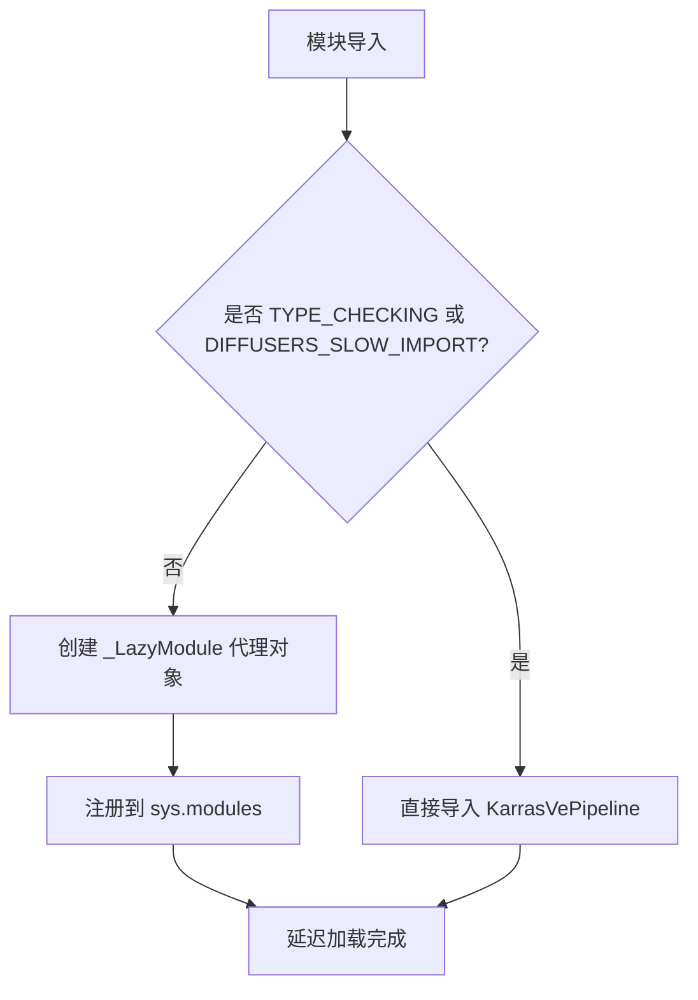

# `diffusers\src\diffusers\pipelines\deprecated\stochastic_karras_ve\__init__.py` 详细设计文档

这是一个Diffusers库的延迟加载模块初始化文件，通过LazyModule机制实现KarrasVePipeline类的按需导入，优化包导入速度和内存占用。

## 整体流程



## 类结构

```
此文件为模块初始化文件，无自定义类定义
主要使用 _LazyModule 实现延迟加载
依赖 KarrasVePipeline 类（在被引用时从子模块导入）
```

## 全局变量及字段


### `_import_structure`
    
A dictionary mapping module names to lists of exported names, defining the lazy loading structure for the KarrasVePipeline

类型：`Dict[str, List[str]]`
    


### `DIFFUSERS_SLOW_IMPORT`
    
A flag indicating whether slow import mode is enabled, imported from utils module

类型：`bool`
    


### `__name__`
    
Built-in Python variable representing the fully qualified name of the current module

类型：`str`
    


### `__file__`
    
Built-in Python variable representing the file path of the current module

类型：`str`
    


### `__spec__`
    
Built-in Python variable representing the module's specification object from importlib

类型：`ModuleSpec`
    


    

## 全局函数及方法


## 关键组件


### 延迟加载模块（_LazyModule）

通过 `sys.modules[__name__] = _LazyModule(...)` 实现模块的惰性加载，将模块的导入延迟到实际使用时，以提高导入速度和减少内存占用。

### 条件导入机制（TYPE_CHECKING / DIFFUSERS_SLOW_IMPORT）

使用类型检查条件分支，在 TYPE_CHECKING 或 DIFFUSERS_SLOW_IMPORT 为真时进行直接导入，否则使用延迟加载机制。这既支持了类型检查，又优化了运行时性能。

### 导入结构字典（_import_structure）

定义了模块的公共接口结构 `{"pipeline_stochastic_karras_ve": ["KarrasVePipeline"]}`，明确了该模块对外暴露的类和名称，是模块化设计的重要组成部分。

### KarrasVePipeline 类

从 `pipeline_stochastic_karras_ve` 子模块导入的主要管道类，属于扩散模型（Diffusion Model）中的 Karras Ve 变体实现，是该模块的核心功能类。


## 问题及建议


### 已知问题

-   缺少模块级文档字符串，未说明该模块的具体用途和功能
-   `_import_structure` 字典与实际导入之间缺乏自动化同步机制，人工维护容易导致不一致
-   没有显式声明 `__all__` 列表，公共API不够明确
-   依赖 `DIFFUSERS_SLOW_IMPORT` 环境变量控制导入行为，增加了理解和测试的复杂性
-   缺少导入错误处理，若 `KarrasVePipeline` 或模块不存在，错误信息可能不够友好
-   相对导入路径硬编码，文件重构时需要手动更新

### 优化建议

-   添加模块级 docstring，说明该模块是 Karras Ve Pipeline 的延迟加载导出模块
-   考虑使用 `__all__ = ["KarrasVePipeline"]` 显式声明导出接口
-   添加 try-except 包装导入逻辑，提供更友好的错误提示
-   将 `DIFFUSERS_SLOW_IMPORT` 的处理逻辑封装为更清晰的函数，减少魔法变量在多处重复
-   考虑使用静态分析工具验证 `_import_structure` 与实际导出的一致性


## 其它


### 一段话描述

该代码是Diffusers库的延迟加载模块初始化文件，通过`_LazyModule`实现KarrasVePipeline类的按需导入，避免在模块导入时立即加载所有依赖，提高库的初始化性能和内存效率。

### 文件的整体运行流程

1. 模块首次被导入时，Python执行该初始化文件
2. 若`TYPE_CHECKING`为True或`DIFFUSERS_SLOW_IMPORT`为True，直接导入`KarrasVePipeline`类
3. 否则，将当前模块注册为`_LazyModule`代理对象
4. 当代码真正访问`KarrasVePipeline`时，触发延迟加载机制，从`pipeline_stochastic_karras_ve`模块导入实际类

### 类的详细信息

#### KarrasVePipeline类

**模块**: `pipeline_stochastic_karras_ve`

**描述**: 基于Karras随机采样器的VE（Variational Euler）扩散Pipeline实现，用于图像生成任务

**类字段**:

| 名称 | 类型 | 描述 |
|------|------|------|
| unet | UNet2DVPipeline | U-Net模型，用于去噪过程 |
| scheduler | KarrasVeScheduler | Karras调度器，管理噪声调度 |
| tokenizer | CLIPTokenizer | 文本 tokenizer（可选） |
| text_encoder | CLIPTextModel | 文本编码器（可选） |

**类方法**:

| 方法名 | 参数 | 返回类型 | 描述 |
|--------|------|----------|------|
| __call__ | prompt, num_inference_steps, generator, eta, ... | PIL.Image | 执行图像生成 |

### 全局变量和全局函数详细信息

#### 全局变量

| 名称 | 类型 | 描述 |
|------|------|------|
| _import_structure | Dict[str, List[str]] | 模块导出结构定义，映射子模块到可导出类/函数列表 |
| TYPE_CHECKING | bool | 类型检查标志，由typing模块提供 |
| DIFFUSERS_SLOW_IMPORT | bool | 标志位，控制是否使用延迟加载模式 |
| __spec__ | ModuleSpec | 当前模块的规格定义，由Python导入系统提供 |

#### 全局函数

无独立全局函数，主要逻辑由`_LazyModule`类处理

### 关键组件信息

| 组件名称 | 描述 |
|----------|------|
| _LazyModule | 延迟加载模块代理类，实现按需导入机制 |
| KarrasVePipeline | 基于Karras VE算法的扩散Pipeline |
| _import_structure | 模块导出结构映射表 |
| DIFFUSERS_SLOW_IMPORT | 延迟加载开关控制变量 |

### 潜在的技术债务或优化空间

1. **无类型提示导出**: `_import_structure`中仅包含字符串类名，IDE无法直接推断类型
2. **缺少错误处理**: 延迟加载失败时缺少明确的错误提示
3. **文档缺失**: 未包含模块级文档字符串说明模块用途
4. **硬编码路径**: 相对导入路径`....utils`依赖项目结构，缺乏灵活性
5. **单类导出限制**: 当前仅导出KarrasVePipeline，扩展性受限

### 其它项目

#### 设计目标与约束

- **目标**: 实现模块级延迟加载，优化Diffusers库导入性能
- **约束**: 必须保持与TYPE_CHECKING模式的兼容性
- **约束**: 延迟加载不能改变模块的公共API接口

#### 错误处理与异常设计

- 当`pipeline_stochastic_karras_ve`模块不存在时，Python导入系统抛出ModuleNotFoundError
- 建议添加try-except包装延迟加载过程，提供更友好的错误信息

#### 数据流与状态机

- 初始状态: 模块注册为LazyModule代理
- 访问状态: 首次访问KarrasVePipeline时触发加载
- 缓存状态: 加载后类被缓存到sys.modules，后续访问直接返回

#### 外部依赖与接口契约

- **依赖模块**: `....utils`中的`_LazyModule`和`DIFFUSERS_SLOW_IMPORT`
- **依赖模块**: `pipeline_stochastic_karras_ve`中的`KarrasVePipeline`类
- **接口契约**: 必须导出`KarrasVePipeline`类到_import_structure中
- **Python版本**: 需支持Python 3.7+的TYPE_CHECKING机制

#### 版本兼容性

- 依赖typing.TYPE_CHECKING（Python 3.5+）
- 依赖importlib.resources或importlib.util（Python 3.7+）
- 需与Diffusers主版本保持同步更新

    