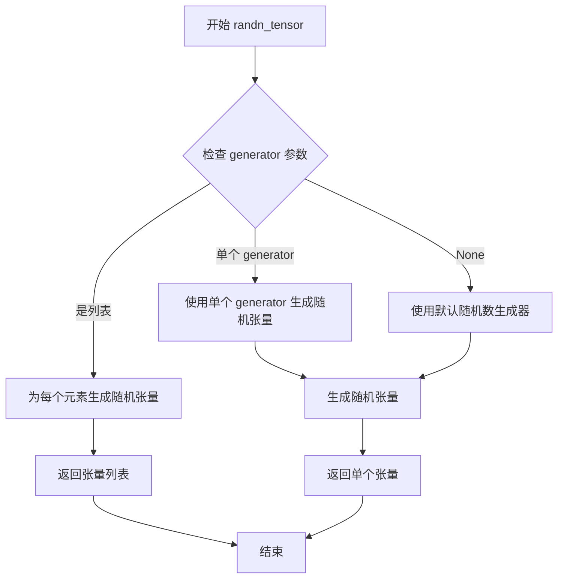
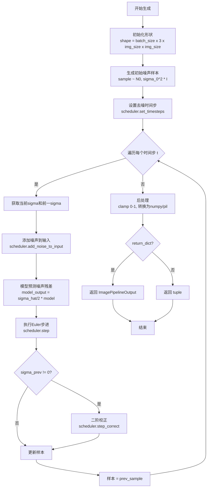

# `diffusers\src\diffusers\pipelines\deprecated\stochastic_karras_ve\pipeline_stochastic_karras_ve.py` 详细设计文档

KarrasVePipeline是一个用于无条件图像生成的去噪扩散模型管道，基于Karras等人的VE (Variational Embedding)调度器实现，通过UNet2DModel进行噪声预测，采用Euler方法结合二阶校正进行迭代去噪，最终生成高质量图像。

## 整体流程

```mermaid
graph TD
A[开始: __call__] --> B[计算图像尺寸shape]
B --> C[生成初始噪声样本: randn_tensor * init_noise_sigma]
C --> D[设置去噪时间步: scheduler.set_timesteps]
D --> E{遍历时间步: t in timesteps}
E --> F[获取当前和前一个sigma值]
F --> G[添加临时噪声: scheduler.add_noise_to_input]
G --> H[模型预测噪声: model((sample_hat+1)/2, sigma_hat/2)]
H --> I[Euler步进: scheduler.step]
I --> J{sigma_prev != 0?}
J -- 是 --> K[二阶校正: scheduler.step_correct]
J -- 否 --> L[更新样本]
K --> L
L --> M[更新sample为prev_sample]
M --> E
E -- 遍历完成 --> N[后处理: clamp /2+0.5, permute, numpy]
N --> O{output_type == 'pil'?}
O -- 是 --> P[转换为PIL图像: numpy_to_pil]
O -- 否 --> Q[返回numpy数组]
P --> R{return_dict?}
Q --> R
R -- 是 --> S[返回ImagePipelineOutput]
R -- 否 --> T[返回tuple]
```

## 类结构

```
DiffusionPipeline (基类)
└── KarrasVePipeline (图像生成管道)
```

## 全局变量及字段


### `KarrasVePipeline.unet`
    
去噪用的UNet模型

类型：`UNet2DModel`
    


### `KarrasVePipeline.scheduler`
    
噪声调度器

类型：`KarrasVeScheduler`
    
    

## 全局函数及方法


### `randn_tensor`

随机张量生成工具函数，用于生成指定形状的随机张量，支持指定随机数生成器以确保可复现性，并可指定目标设备。

参数：

- `shape`：`tuple` 或 `torch.Size`，要生成的张量的形状
- `generator`：`torch.Generator | list[torch.Generator] | None`，可选的随机数生成器，用于确保生成的可控性和可复现性
- `device`：`torch.device`，生成张量应放置的设备
- `dtype`：`torch.dtype`，可选，生成张量的数据类型，默认为 None
- `layout`：`torch.layout`，可选，生成张量的布局，默认为 None

返回值：`torch.Tensor`，符合指定形状和属性的随机张量

#### 流程图



#### 带注释源码

```python
def randn_tensor(
    shape: tuple,
    generator: Optional[Union[torch.Generator, List[torch.Generator]]] = None,
    device: Optional[torch.device] = None,
    dtype: Optional[torch.dtype] = torch.float32,
    layout: Optional[torch.layout] = torch.strided,
) -> torch.Tensor:
    """
    生成一个随机张量，类似于 torch.randn，但增加了对生成器的支持和设备参数。
    
    参数:
        shape: 张量的形状，例如 (batch_size, channels, height, width)
        generator: 可选的 torch.Generator 或生成器列表，用于确保随机数生成的可控性和可复现性
        device: 可选的目标设备，用于将张量放置到指定的设备上（如 CPU 或 GPU）
        dtype: 可选的数据类型，默认为 torch.float32
        layout: 可选的布局，默认为 torch.strided
    
    返回:
        torch.Tensor: 符合指定形状的随机张量
    
    注意:
        - 如果提供了 generator，张量将根据生成器的状态生成，确保结果可复现
        - 如果没有提供 generator，将使用 PyTorch 的默认随机数生成器
        - 张量值来自标准正态分布 N(0, 1)
    """
    # 便捷函数，用于生成符合正态分布的随机张量
    # 如果提供了 generator，则使用它来确保可复现性
    # 如果没有提供，则使用默认的随机数生成方式
    if generator is not None:
        # 如果有生成器，使用生成器生成随机张量
        # 这确保了在相同的种子下，生成的随机数是相同的
        if isinstance(generator, list):
            # 处理多个生成器的情况（用于批量生成）
            # 为每个生成器生成一个子张量，然后沿着新维度连接
            tensor_list = []
            for gen in generator:
                # 使用生成器生成符合正态分布的张量
                # 这里使用 PyTorch 的 randn 函数
                # 接受 generator 参数以确保随机性的可控性
                tensor = torch.randn(
                    shape,
                    generator=gen,
                    device=device if device is not None else None,
                    dtype=dtype,
                    layout=layout,
                )
                tensor_list.append(tensor)
            # 沿着新创建的维度（dim=0）连接所有张量
            return torch.cat(tensor_list, dim=0)
        else:
            # 单个生成器的情况
            return torch.randn(
                shape,
                generator=generator,
                device=device if device is not None else None,
                dtype=dtype,
                layout=layout,
            )
    else:
        # 没有提供生成器时，使用默认随机数生成
        # 这种情况下，每次调用可能产生不同的随机数
        return torch.randn(
            shape,
            device=device if device is not None else None,
            dtype=dtype,
            layout=layout,
        )
```


### `KarrasVePipeline.__init__`

初始化KarrasVePipeline管道实例，注册UNet2DModel和KarrasVeScheduler模块，使管道能够执行无条件图像生成任务。

参数：

- `unet`：`UNet2DModel`，用于对编码图像进行去噪的UNet2DModel模型实例
- `scheduler`：`KarrasVeScheduler`，与unet配合使用以对编码图像进行去噪的KarrasVeScheduler调度器实例

返回值：`None`，构造函数不返回任何值，仅初始化对象状态

#### 流程图

```mermaid
flowchart TD
    A[开始 __init__] --> B[调用 super().__init__ 初始化基类]
    B --> C[调用 self.register_modules 注册 unet 和 scheduler 模块]
    C --> D[结束 __init__，对象初始化完成]
    
    style A fill:#e1f5fe
    style D fill:#c8e6c9
```

#### 带注释源码

```python
def __init__(self, unet: UNet2DModel, scheduler: KarrasVeScheduler):
    """
    初始化KarrasVePipeline管道实例。
    
    参数:
        unet: UNet2DModel实例，用于图像去噪的UNet模型
        scheduler: KarrasVeScheduler实例，用于控制去噪过程的调度器
    """
    # 调用父类DiffusionPipeline的初始化方法
    # 设置基础管道配置和属性
    super().__init__()
    
    # 将unet和scheduler注册为管道的模块
    # 这些模块可以通过self.unet和self.scheduler访问
    # 注册过程还会将模块移动到正确的设备上
    self.register_modules(unet=unet, scheduler=scheduler)
```


### `KarrasVePipeline.__call__`

主生成方法，执行去噪扩散过程，基于Karras方差扩展（Karras Ve）采样算法生成无条件图像。该方法通过多次迭代去噪，从随机噪声逐步恢复出清晰图像。

参数：

- `batch_size`：`int`，可选，默认为 1，要生成的图像数量
- `num_inference_steps`：`int`，可选，默认为 50，去噪步数。更多去噪步骤通常能带来更高质量的图像，但会牺牲推理速度
- `generator`：`torch.Generator | list[torch.Generator] | None`，可选，默认为 None，用于生成确定性结果的随机数生成器
- `output_type`：`str | None`，可选，默认为 "pil"，生成图像的输出格式，可选 "pil"（PIL.Image）或 "np.array"
- `return_dict`：`bool`，可选，默认为 True，是否返回 ImagePipelineOutput 而不是普通元组
- `**kwargs`：可变关键字参数，用于传递额外的参数

返回值：`tuple | ImagePipelineOutput`，如果 `return_dict` 为 True，返回 `ImagePipelineOutput`（包含生成的图像列表），否则返回元组，其中第一个元素是生成的图像列表

#### 流程图



#### 带注释源码

```python
@torch.no_grad()
def __call__(
    self,
    batch_size: int = 1,
    num_inference_steps: int = 50,
    generator: torch.Generator | list[torch.Generator] | None = None,
    output_type: str | None = "pil",
    return_dict: bool = True,
    **kwargs,
) -> tuple | ImagePipelineOutput:
    r"""
    The call function to the pipeline for generation.

    Args:
        batch_size (`int`, *optional*, defaults to 1):
            The number of images to generate.
        generator (`torch.Generator`, *optional*):
            A [`torch.Generator`](https://pytorch.org/docs/stable/generated/torch.Generator.html) to make
            generation deterministic.
        num_inference_steps (`int`, *optional*, defaults to 50):
            The number of denoising steps. More denoising steps usually lead to a higher quality image at the
            expense of slower inference.
        output_type (`str`, *optional*, defaults to `"pil"`):
            The output format of the generated image. Choose between `PIL.Image` or `np.array`.
        return_dict (`bool`, *optional*, defaults to `True`):
            Whether or not to return a [`ImagePipelineOutput`] instead of a plain tuple.

    Example:

    Returns:
        [`~pipelines.ImagePipelineOutput`] or `tuple`:
            If `return_dict` is `True`, [`~pipelines.ImagePipelineOutput`] is returned, otherwise a `tuple` is
            returned where the first element is a list with the generated images.
    """

    # 从UNet配置中获取样本大小，确定生成图像的尺寸
    img_size = self.unet.config.sample_size
    # 构建批量形状：(batch_size, 通道数, 高度, 宽度)
    shape = (batch_size, 3, img_size, img_size)

    model = self.unet

    # 步骤1: 采样初始噪声 x_0 ~ N(0, sigma_0^2 * I)
    # 使用scheduler的初始噪声sigma进行缩放
    sample = randn_tensor(shape, generator=generator, device=self.device) * self.scheduler.init_noise_sigma

    # 步骤2: 根据推理步数设置去噪时间表
    self.scheduler.set_timesteps(num_inference_steps)

    # 步骤3: 遍历每个时间步进行去噪
    for t in self.progress_bar(self.scheduler.timesteps):
        # 获取当前时间步的sigma值（论文中的sigma_t）
        sigma = self.scheduler.schedule[t]
        # 获取前一时间步的sigma值，如果是第一个时间步则为0
        sigma_prev = self.scheduler.schedule[t - 1] if t > 0 else 0

        # 1. 暂时选择增加噪声水平sigma_hat
        # 2. 添加新噪声将样本从sample_i移动到sample_hat
        sample_hat, sigma_hat = self.scheduler.add_noise_to_input(sample, sigma, generator=generator)

        # 3. 给定噪声幅度sigma_hat预测噪声残差
        # 根据论文公式(213)调整模型输入和输出
        # 输入缩放: (sample_hat + 1) / 2 将[-1,1]范围映射到[0,1]
        # 输出缩放: sigma_hat / 2 调整噪声预测的幅度
        model_output = (sigma_hat / 2) * model((sample_hat + 1) / 2, sigma_hat / 2).sample

        # 4. 在sigma_hat处评估dx/dt
        # 5. 从sigma执行Euler步进到sigma_prev
        step_output = self.scheduler.step(model_output, sigma_hat, sigma_prev, sample_hat)

        # 如果不是第一个时间步，应用二阶校正
        if sigma_prev != 0:
            # 6. 应用二阶校正（Heun方法）
            # 根据论文公式(213)调整模型输入和输出
            model_output = (sigma_prev / 2) * model((step_output.prev_sample + 1) / 2, sigma_prev / 2).sample
            step_output = self.scheduler.step_correct(
                model_output,
                sigma_hat,
                sigma_prev,
                sample_hat,
                step_output.prev_sample,
                step_output["derivative"],
            )
        
        # 更新样本为去噪后的样本
        sample = step_output.prev_sample

    # 步骤4: 后处理
    # 将样本从[-1,1]范围转换回[0,1]范围
    sample = (sample / 2 + 0.5).clamp(0, 1)
    # 转换为numpy数组，形状从 (B, C, H, W) 变为 (B, H, W, C)
    image = sample.cpu().permute(0, 2, 3, 1).numpy()
    
    # 根据output_type转换为PIL图像或保持numpy数组
    if output_type == "pil":
        image = self.numpy_to_pil(image)

    # 步骤5: 返回结果
    if not return_dict:
        return (image,)

    return ImagePipelineOutput(images=image)
```

## 关键组件


### KarrasVePipeline

KarrasVePipeline 是用于无条件图像生成的扩散管道，基于 Karras Ve 调度器实现去噪过程。

### UNet2DModel (unet)

用于对编码图像进行去噪的 UNet2DModel 模型，在去噪迭代中预测噪声残差。

### KarrasVeScheduler (scheduler)

KarrasVeScheduler 调度器，用于管理去噪过程中的时间步和噪声调度，包含 add_noise_to_input、step 和 step_correct 方法。

### __call__ 方法

管道的主要推理方法，执行完整的图像生成流程，包括初始化噪声、迭代去噪（一阶和二阶校正）、后处理。

### randn_tensor

用于生成初始噪声样本的工具函数，支持指定 generator 和 device。

### 张量索引与调度

使用 scheduler.schedule[t] 和 scheduler.schedule[t-1] 进行时间步索引，获取当前和前一个噪声水平。

### 反量化支持

在模型输入输出时进行缩放调整：输入从 [0,1] 映射到 [0,1] 范围（(sample_hat + 1) / 2），输出乘以 sigma/2 进行缩放。

### 一阶与二阶校正

去噪过程包含一阶 Euler 步和可选的二阶校正（step 和 step_correct），用于提高生成质量。

### 图像后处理

将生成的张量从 [-1,1] 范围 clamp 到 [0,1]，转换为 numpy 数组，可选转换为 PIL 图像。

### ImagePipelineOutput

管道输出类，包含生成的图像列表。


## 问题及建议


### 已知问题

- **类型提示不完整**：虽然对 `unet` 和 `scheduler` 添加了类级别类型提示，但未对 `__init__` 方法的参数进行详细类型注解，且缺少对 `ImagePipelineOutput` 等返回类型的导入说明
- **硬编码的魔法数字**：代码中多处出现 `(sigma_hat / 2)`、`(sample_hat + 1) / 2` 等魔法数字，缺乏常量定义或注释说明其数学含义（如遵循论文 eq.213 的具体实现）
- **缺少输入参数验证**：未对 `batch_size`、`num_inference_steps` 等关键参数进行有效性检查，可能导致运行时错误或难以调试的问题
- **Scheduler 索引访问风险**：使用 `self.scheduler.schedule[t - 1]` 当 `t=0` 时会产生负索引（虽然有 `if t > 0` 判断，但逻辑可读性较差），且假设 `scheduler.schedule` 长度足够
- **文档字符串不完整**：类文档中的 `Example:` 部分为空，缺少使用示例代码
- **Generator 处理不完善**：虽然支持传入单个或列表形式的 `generator`，但未对列表长度与 `batch_size` 不匹配的情况进行处理
- **output_type 检查不完整**：仅检查 `"pil"` 字符串，未对不支持的输出类型给出警告或默认处理
- **设备管理不明确**：使用 `self.device` 但未在当前类中定义，依赖父类 `DiffusionPipeline` 的实现

### 优化建议

- **提取魔法数字**：将 `(sample_hat + 1) / 2` 和乘以 `sigma_hat / 2` 等操作封装为私有方法或定义为类常量，并添加注释说明其数学背景
- **增强参数校验**：在 `__call__` 方法开始处添加 `batch_size > 0`、`num_inference_steps > 0` 等断言或校验逻辑
- **完善文档**：补充 `Example:` 部分的具体使用代码，展示如何调用 pipeline 生成图像
- **改进 Generator 处理**：当 `generator` 为列表时，确保其长度与 `batch_size` 匹配，或提供明确的错误提示
- **统一错误处理**：对不支持的 `output_type` 返回警告并提供默认行为（如返回 numpy 数组）
- **优化索引访问**：考虑使用 `scheduler.get_prev_timestep()` 等更安全的方法访问前一时间步，避免直接索引操作

## 其它


### 设计目标与约束

**设计目标**：
- 实现基于Karras Ve方法的无条件图像生成扩散管道
- 提供灵活的多样化图像生成能力，支持批量生成
- 确保生成过程的可重复性（通过随机数生成器）
- 支持不同的输出格式（PIL图像或numpy数组）

**设计约束**：
- 依赖PyTorch框架
- 输入batch_size必须为正整数
- num_inference_steps必须为正整数
- 图像尺寸由UNet2DModel的sample_size配置决定
- 必须在GPU上运行以获得合理性能

### 错误处理与异常设计

**异常处理机制**：
- 输入验证：检查batch_size、num_inference_steps等参数的有效性
- 设备兼容性：确保模型和数据在同一设备上
- 调度器状态验证：检查timesteps是否正确设置
- 输出格式验证：检查output_type是否为有效值（"pil"或"numpy"）
- 内存不足处理：批处理过大时可能触发OOM异常

**边界条件处理**：
- t=0时sigma_prev=0，不进行二阶校正
- generator参数支持单个或列表形式
- kwargs中的未知参数会被忽略

### 数据流与状态机

**数据流转过程**：
1. 初始化阶段：创建初始噪声样本x_0 ~ N(0, sigma_0^2 * I)
2. 噪声调度阶段：设置timesteps和调度计划
3. 迭代去噪阶段（主循环）：
   - 选择临时增加的噪声水平sigma_hat
   - 添加新噪声从sample_i到sample_hat
   - 预测噪声残差
   - 评估导数并执行Euler步骤
   - （可选）应用二阶校正
4. 后处理阶段：归一化到[0,1]范围并转换格式

**状态机**：
- 初始状态 → 噪声采样状态 → 迭代去噪状态 → 后处理状态 → 完成状态

### 外部依赖与接口契约

**核心依赖**：
- torch：深度学习框架
- UNet2DModel：去噪模型
- KarrasVeScheduler：噪声调度器
- randn_tensor：随机张量生成工具
- DiffusionPipeline：管道基类
- ImagePipelineOutput：输出数据结构

**接口契约**：
- __init__(unet, scheduler)：初始化管道组件
- __call__()：执行图像生成，返回ImagePipelineOutput或tuple
- register_modules()：注册子模块
- progress_bar()：进度条显示
- numpy_to_pil()：numpy数组到PIL图像转换

### 性能考虑

**性能优化点**：
- 使用torch.no_grad()禁用梯度计算以提高推理速度
- 支持批量处理以提高GPU利用率
- 中间张量尽量在GPU上操作，减少设备传输
- 二阶校正作为可选步骤，可根据质量/速度权衡决定是否启用

**性能瓶颈**：
- UNet前向传播是主要计算瓶颈
- 大批量大小可能导致GPU内存不足
- 迭代次数与生成时间成正比

### 安全性考虑

**输入安全**：
- 验证所有用户输入参数的类型和范围
- 防止通过恶意参数导致内存溢出
- kwargs参数需要过滤和验证

**模型安全**：
- 确保加载的模型来源可信
- 防止模型被恶意篡改

### 测试策略

**单元测试**：
- 测试管道初始化和模块注册
- 测试不同参数组合的调用
- 测试输出格式转换

**集成测试**：
- 测试完整的图像生成流程
- 测试批量生成
- 测试生成器的可重复性

**性能测试**：
- 测试不同批大小和迭代次数的性能
- 测试内存使用情况

### 配置管理

**配置参数**：
- unet.config.sample_size：输出图像尺寸
- scheduler.init_noise_sigma：初始噪声标准差
- scheduler.schedule：噪声调度计划
- 默认num_inference_steps=50
- 默认output_type="pil"

**配置方式**：
- 通过构造函数传入已配置的模型和调度器
- 通过__call__参数覆盖运行时配置

### 版本兼容性

**框架版本要求**：
- PyTorch 1.0+
- Transformers库兼容

**组件兼容性**：
- UNet2DModel版本需与KarrasVeScheduler兼容
- ImagePipelineOutput数据结构保持稳定

### 资源管理

**GPU资源**：
- 自动设备检测和分配
- 需要显式管理GPU内存
- 批量大小受GPU内存限制

**内存管理**：
- 中间变量在迭代结束后释放
- 最终图像转移到CPU内存

### 并发和线程安全

**线程安全考量**：
- Pipeline对象本身无状态，可安全共享
- 多个pipeline实例可并行运行
- 共享generator可能导致非确定性结果

**并发使用模式**：
- 每个线程创建独立的pipeline实例
- 共享模型权重以节省内存

### 日志和监控

**监控点**：
- 迭代进度显示（progress_bar）
- 生成的图像数量统计
- 推理时间监控

**调试信息**：
- 中间状态（sample_hat, sigma_hat等）可用于调试
- 可通过钩子扩展监控能力

### 缓存策略

**模型缓存**：
- UNet模型权重在首次加载后保持在内存/GPU中
- 调度器状态可在多次调用间复用

**结果缓存**：
- 不缓存生成结果
- 每次调用重新生成

### 扩展性设计

**扩展方向**：
- 支持更多输出格式（torch tensor, base64等）
- 支持条件生成（通过修改为条件管道）
- 支持更多噪声调度方法
- 支持模型混合和插值

**插件式设计**：
- 继承DiffusionPipeline基类
- 可替换的调度器接口
- 可扩展的后处理步骤


    