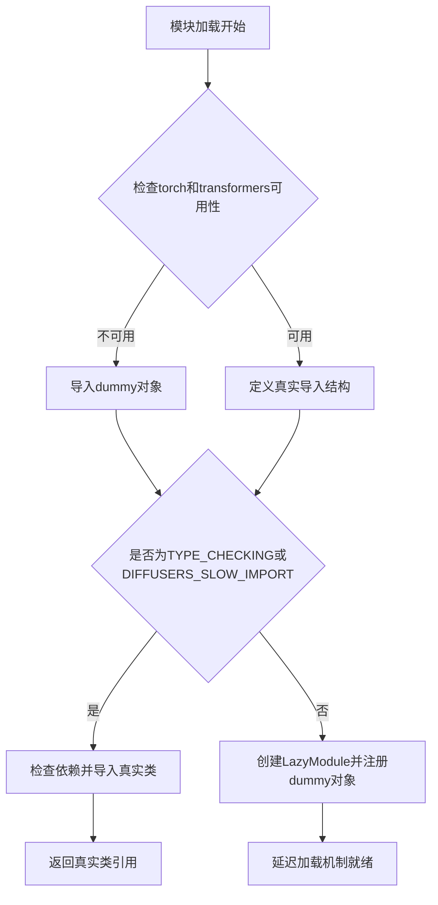
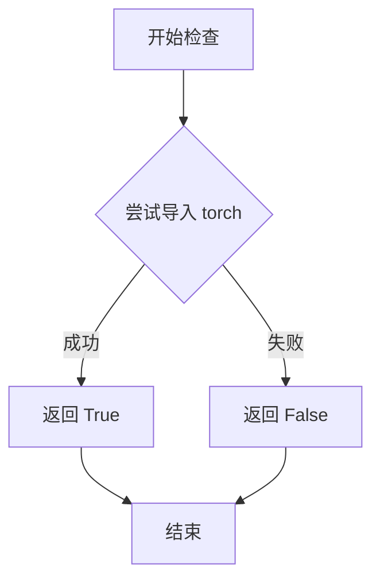
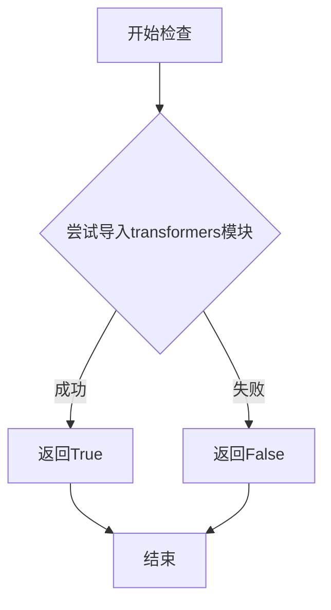
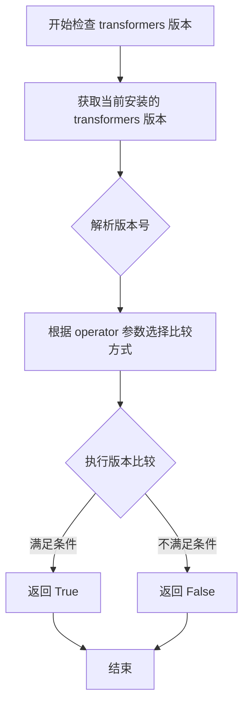

# `diffusers\src\diffusers\pipelines\deprecated\versatile_diffusion\__init__.py` 详细设计文档

VersatileDiffusion模块的初始化文件，负责延迟加载多个图像生成Pipeline类（文本到图像、双引导生成、图像变体），通过检查torch和transformers依赖的可用性来动态导入真实实现或使用dummy占位对象，确保库在缺少可选依赖时仍能正常导入。

## 整体流程



## 类结构

```
Pipeline初始化模块 (无继承关系)
├── VersatileDiffusionPipeline (真实/Pipeline类)
├── VersatileDiffusionTextToImagePipeline (真实/Pipeline类)
├── VersatileDiffusionDualGuidedPipeline (真实/Pipeline类)
└── VersatileDiffusionImageVariationPipeline (真实/Pipeline类)
```

## 全局变量及字段


### `_dummy_objects`
    
存储可选依赖不可用时的替代对象（dummy objects），用于延迟导入时的回退机制

类型：`dict`
    


### `_import_structure`
    
定义模块的导入结构，键为子模块路径，值为该模块导出的类或函数名称列表

类型：`dict`
    


    

## 全局函数及方法


### `is_torch_available`

检查当前 Python 环境中是否安装了 PyTorch（torch）库，如果安装则返回 `True`，否则返回 `False`。

参数：
- （无参数）

返回值：`bool`，返回 `True` 表示 torch 可用，返回 `False` 表示 torch 不可用。

#### 流程图



#### 带注释源码

```python
# is_torch_available 函数定义（位于 utils 模块中）
def is_torch_available():
    """
    检查 PyTorch (torch) 是否可用。
    
    该函数通常通过尝试导入 torch 模块来判断其是否已安装。
    如果导入成功则返回 True，否则返回 False。
    
    Returns:
        bool: 如果 torch 可用返回 True，否则返回 False。
    """
    try:
        import torch
        return True
    except ImportError:
        return False
```

#### 在当前代码中的使用示例

```python
# 从 utils 模块导入 is_torch_available
from ....utils import is_torch_available

# 使用方式：检查多个依赖是否同时满足
if not (is_transformers_available() and is_torch_available() and is_transformers_version(">=", "4.25.0")):
    # 如果任一依赖不可用，抛出 OptionalDependencyNotAvailable 异常
    raise OptionalDependencyNotAvailable()
else:
    # 所有依赖可用，正常导入相关模块
    _import_structure["modeling_text_unet"] = ["UNetFlatConditionModel"]
    # ... 其他模块导入
```

---

**备注**：该函数是 `diffusers` 库中用于可选依赖检查的通用工具函数，位于 `utils` 模块中。其核心作用是实现懒加载（lazy loading）机制，仅在所需依赖可用时才导入相关模块，从而避免因缺少可选依赖而导致整个库无法导入。


### `is_transformers_available()`

该函数用于检查当前Python环境中是否已安装并可用`transformers`库。它通过尝试导入`transformers`模块来判断库是否可用，返回布尔值以指示库的可用性状态，这是实现可选依赖功能的关键检查函数。

参数：此函数不需要任何参数。

返回值：`bool`，返回`True`表示`transformers`库已安装且可用，返回`False`表示不可用。

#### 流程图



#### 带注释源码

```python
# 注意：以下是基于代码使用方式推断的函数实现逻辑
# 实际源码位于 transformers.utils 中

def is_transformers_available():
    """
    检查transformers库是否可用
    
    实现原理：
    1. 尝试导入transformers模块
    2. 如果导入成功，返回True
    3. 如果导入失败（ModuleNotFoundError），返回False
    """
    try:
        # 尝试导入transformers库
        import transformers
        # 如果导入成功，返回True
        return True
    except ImportError:
        # 如果导入失败，返回False
        return False

# 在实际代码中的使用方式：
# if not (is_transformers_available() and is_torch_available() and is_transformers_version(">=", "4.25.0")):
#     raise OptionalDependencyNotAvailable()
```


### `is_transformers_version`

检查已安装的 transformers 库版本是否满足指定的条件要求。该函数通过比较运算符和目标版本号来判断当前环境中的 transformers 版本是否符合项目的依赖要求，常用于条件导入或功能特性检测。

参数：

- `operator`：字符串（`str`），比较运算符，支持 ">="、">"、"<="、"<"、"==" 等，用于指定版本比较的方式
- `version`：字符串（`str`），目标版本号，格式如 "4.25.0"，表示要与当前安装的 transformers 版本进行比较的版本

返回值：布尔值（`bool`），如果当前安装的 transformers 版本满足指定的条件则返回 `True`，否则返回 `False`

#### 流程图



#### 带注释源码

```python
# 注意：以下源码为基于使用方式推断的实现逻辑
# 实际源码位于 transformers 库或 diffusers 库的 utils 模块中

def is_transformers_version(operator: str, version: str) -> bool:
    """
    检查当前安装的 transformers 版本是否满足指定条件
    
    参数:
        operator: 比较运算符，如 ">=", ">", "<=", "<", "=="
        version: 目标版本号，如 "4.25.0"
    
    返回:
        bool: 版本是否满足条件
    """
    # 尝试导入 transformers 并获取当前版本
    try:
        import transformers
        current_version = transformers.__version__
    except ImportError:
        # 如果 transformers 未安装，返回 False
        return False
    
    # 解析版本号字符串为可比较的元组
    # 例如 "4.25.0" -> (4, 25, 0)
    def parse_version(v: str) -> tuple:
        return tuple(map(int, v.split('.')))
    
    current = parse_version(current_version)
    target = parse_version(version)
    
    # 根据运算符执行相应的比较
    if operator == ">=":
        return current >= target
    elif operator == ">":
        return current > target
    elif operator == "<=":
        return current <= target
    elif operator == "<":
        return current < target
    elif operator == "==":
        return current == target
    else:
        raise ValueError(f"不支持的比较运算符: {operator}")
```

#### 在项目中的使用示例

```python
# 在 provided 代码中的实际使用方式
if not (is_transformers_available() and is_torch_available() and is_transformers_version(">=", "4.25.0")):
    raise OptionalDependencyNotAvailable()
```

这段代码表明，只有当 transformers 和 torch 都可用，且 transformers 版本大于等于 4.25.0 时，才会导入完整的模块；否则会抛出 `OptionalDependencyNotAvailable` 异常并使用虚拟对象（dummy objects）。


### `setattr` (内置函数)

该代码中使用了Python内置的 `setattr()` 函数，用于在延迟加载模块时，将虚拟的dummy对象动态绑定到当前模块的属性上，使得这些类在导入时可用（即使实际的依赖库不可用）。

参数：

- `obj`：`module`，要设置属性的目标对象，此处为 `sys.modules[__name__]`（当前模块对象）
- `name`：`str`，要设置的属性名称，此处为 `_dummy_objects` 字典的键（如 "VersatileDiffusionPipeline"）
- `value`：`any`，要设置的属性值，此处为 `_dummy_objects` 字典的值（dummy对象或真实类）

返回值：`None`，无返回值

#### 流程图

```mermaid
flowchart TD
    A[开始] --> B{遍历 _dummy_objects 字典}
    B --> C[获取键值对 name, value]
    C --> D[调用 setattr sys.modules[__name__], name, value]
    D --> E{还有更多键值对?}
    E -->|是| C
    E -->|否| F[结束]
    
    style D fill:#f9f,stroke:#333,stroke-width:2px
    style F fill:#9f9,stroke:#333,stroke-width:2px
```

#### 带注释源码

```python
# 遍历 _dummy_objects 字典中的所有条目
# _dummy_objects 包含了当可选依赖不可用时的替代类（dummy objects）
for name, value in _dummy_objects.items():
    # 使用 setattr 动态设置模块属性
    # 参数1: sys.modules[__name__] - 当前模块对象
    # 参数2: name - 属性名（字符串），如 "VersatileDiffusionPipeline"
    # 参数3: value - 属性值，可以是 dummy 类或真实类
    # 作用: 将类赋值给模块的属性，使其可以通过 from xxx import VersatileDiffusionPipeline 导入
    setattr(sys.modules[__name__], name, value)
```

## 关键组件


### 延迟加载模块系统（_LazyModule）

使用 LazyModule 实现模块的延迟加载机制，只有在实际需要时才导入相关模块，优化导入速度并支持可选依赖。

### 虚拟对象占位符（_dummy_objects）

当torch和transformers等可选依赖不可用时，用于存储虚拟对象，确保模块结构完整性，避免导入错误。

### 导入结构定义（_import_structure）

定义模块的导入结构字典，映射子模块名称到对应的导出对象列表，支持动态导入机制。

### 可选依赖检查逻辑

通过 is_transformers_available()、is_torch_available() 和 is_transformers_version() 检查必要的依赖包是否可用及版本要求。

### 模块动态注册机制

在非 TYPE_CHECKING 模式下，通过 sys.modules 动态注册模块和虚拟对象，使模块可以直接从父模块导入子模块内容。


## 问题及建议


### 已知问题

-   **重复代码（DRY原则违背）**：try-except 块在整个文件中出现了两次完全相同的逻辑（检查 transformers、torch 可用性和版本号），违反了 DRY 原则，增加维护成本
-   **硬编码版本号**：版本号 "4.25.0" 被硬编码在条件判断中，应该提取为常量以便未来统一更新
-   **Pipeline 名称重复定义**：四个 Pipeline 的类名在 `_dummy_objects` 字典、`_import_structure` 字典和 TYPE_CHECKING 块中重复出现多次，缺乏统一管理
-   **延迟导入机制复杂**：使用 `_LazyModule` 配合 `setattr` 动态设置模块属性，使得代码流程较难追踪，调试困难
-   **缺少依赖缺失的明确错误信息**：当 OptionalDependencyNotAvailable 被抛出时，没有向用户说明具体缺少哪个依赖及其安装方式
-   **TYPE_CHECKING 分支逻辑重复**：TYPE_CHECKING 块内的 try-except-else 结构与外层几乎完全相同，造成冗余

### 优化建议

-   **提取公共逻辑**：将依赖检查条件封装为函数，如 `check_dependencies()`，避免重复代码
-   **定义常量**：将版本号 "4.25.0" 提取为模块级常量 `MIN_TRANSFORMERS_VERSION`
-   **集中管理 Pipeline 列表**：定义一个列表或元组存储所有 Pipeline 名称，通过循环生成 `_dummy_objects` 和 `_import_structure`，减少手动维护
-   **添加依赖提示**：在抛出 OptionalDependencyNotAvailable 之前，可考虑记录或打印更友好的错误信息，提示用户需要安装哪些包
-   **简化延迟导入逻辑**：可考虑重构为更清晰的导入模式，或添加详细注释说明 LazyModule 的工作原理
-   **重构 TYPE_CHECKING 块**：可考虑将公共导入逻辑提取为函数，在 TYPE_CHECKING 和运行时分别调用，减少代码冗余


## 其它


### 设计目标与约束

本模块旨在实现VersatileDiffusion相关Pipeline的延迟加载（Lazy Loading），通过条件导入机制在运行时动态加载必要的依赖项，同时提供友好的降级方案。设计约束包括：必须同时满足torch、transformers可用且transformers版本>=4.25.0才能导入真实实现，否则使用空壳dummy对象；采用LazyModule模式避免在模块导入时触发所有子模块的初始化，以提升导入速度并降低内存占用。

### 错误处理与异常设计

本模块主要依赖OptionalDependencyNotAvailable异常来处理可选依赖不可用的情况。当检测到torch、transformers或其版本不满足要求时，抛出该异常并捕获，随后从dummy模块导入空壳对象。这些dummy对象在实际调用时会触发真实的导入错误，从而告知用户缺少必要的依赖。此外，通过TYPE_CHECKING标志支持静态类型检查期间的完整导入。

### 外部依赖与接口契约

主要外部依赖包括：torch、transformers（版本>=4.25.0）、diffusers.utils中的_LazyModule、OptionalDependencyNotAvailable等工具函数。接口契约方面，本模块暴露的公共API包括VersatileDiffusionPipeline、VersatileDiffusionDualGuidedPipeline、VersatileDiffusionImageVariationPipeline、VersatileDiffusionTextToImagePipeline四个Pipeline类，以及UNetFlatConditionModel模型类。所有暴露的接口均通过_import_structure字典定义，由_LazyModule统一管理导出。

### 模块初始化流程

模块初始化分为两个阶段：第一阶段在普通导入时（DIFFUSERS_SLOW_IMPORT为False且非TYPE_CHECKING），创建_LazyModule代理对象并注册_import_structure中的所有成员，同时将_dummy_objects中的空壳对象注入到sys.modules；第二阶段在首次访问具体属性时，_LazyModule根据_import_structure动态加载对应的子模块。此外，TYPE_CHECKING或DIFFUSERS_SLOW_IMPORT为True时会立即导入真实模块用于类型检查。

### 条件导入逻辑详解

条件导入逻辑通过三层检查实现：首先检查is_torch_available()和is_transformers_available()确认依赖可用性；其次检查is_transformers_version(">=", "4.25.0")确认版本兼容性；最后通过try-except捕获OptionalDependencyNotAvailable异常。当任一条件不满足时，导入dummy_torch_and_transformers_objects中的空壳类；当所有条件满足时，从本地子模块导入真实实现。这种设计确保了模块在缺少可选依赖时仍可被导入，只是实际调用时会失败。

### 版本兼容性信息

本模块明确要求transformers>=4.25.0，这是因为VersatileDiffusion的相关功能（如新的pipeline特性）依赖于该版本引入的API。代码通过is_transformers_version(">=", "4.25.0")进行版本检查。对于torch版本的具体要求未在代码中显式声明，但VersatileDiffusion通常需要较新版本的torch以支持相关计算图和算子。

### 性能考虑

采用_LazyModule实现延迟加载的主要性能收益在于：避免在import时立即加载所有子模块及其依赖（如大型模型权重），显著减少首次导入时间和内存占用。只有当用户实际访问某个Pipeline类时，才会触发真实的模块加载。这种按需加载策略对于大型库如diffusers尤为重要，能够提升命令行工具的启动速度和IDE的响应性。

### 安全考虑

本模块通过dummy对象模式提供了一层安全保护：当用户尝试实例化一个缺少依赖的Pipeline时，会获得一个明确的错误信息而非隐蔽的导入失败。此外，模块级别的导入错误被捕获并降级为dummy对象，避免了因缺少可选依赖导致整个包无法导入的问题。代码未涉及用户输入验证或权限控制，这部分安全性由上层的Pipeline实现负责。

### 测试考虑

测试策略应包括：验证在完整依赖环境下能正确导入所有真实Pipeline类；验证在缺少任一依赖时能正确导入dummy对象并触发预期异常；验证LazyModule的延迟加载行为（导入模块本身不加载子模块，访问属性时才加载）；验证多轮导入（首次导入后再次导入应返回相同对象）。测试可通过mock torch/transformers的可用性状态来覆盖不同分支。

### 使用示例与典型场景

典型使用场景包括：用户在安装了完整深度学习环境后直接import并使用VersatileDiffusionPipeline；用户在未安装transformers的环境中导入模块，程序可正常运行但在调用pipeline时抛出ImportError；开发者在TYPE_CHECKING模式下进行类型检查时能看到完整的类型信息。示例代码：
```python
from diffusers import VersatileDiffusionPipeline
pipe = VersatileDiffusionPipeline.from_pretrained("...")
image = pipe.text_to_image("prompt")
```

### 已知限制与边界情况

已知限制包括：dummy对象的类型信息在运行时不可用（均为EmptyPipeline类），IDE无法提供完整的自动补全；模块在非TYPE_CHECKING模式下不会真正验证依赖可用性，问题可能在实际调用时才暴露；当DIFFUSERS_SLOW_IMPORT为True时行为等同于TYPE_CHECKING，会立即加载所有依赖，可能影响启动性能。边界情况包括：用户在不同时间点检查依赖可用性可能得到不同结果（如在import后安装依赖）；多线程环境下同时导入可能触发竞争条件（但_LazyModule内部有锁机制）。


    