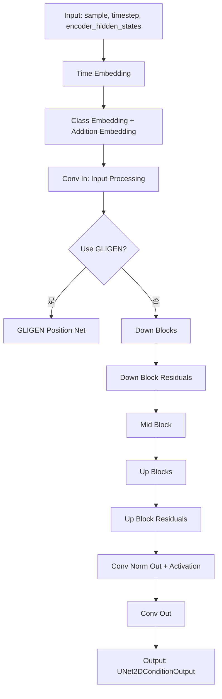
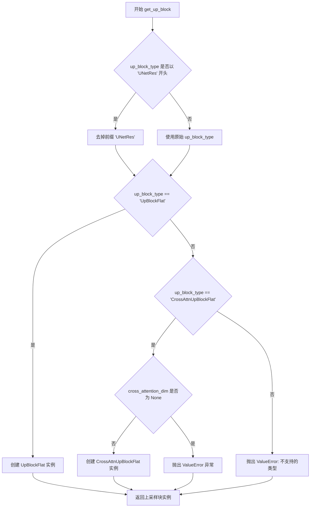
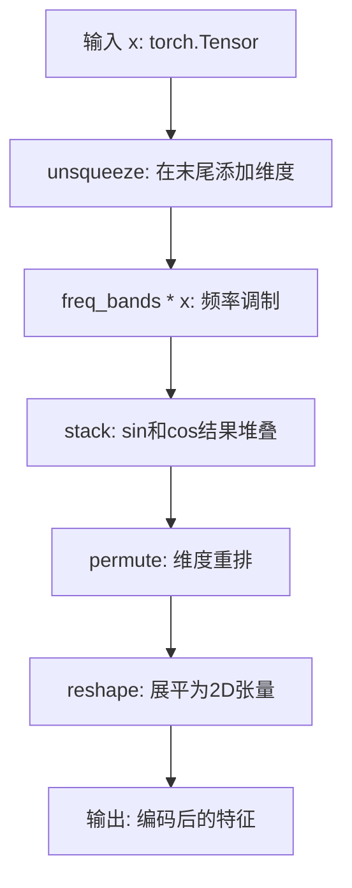
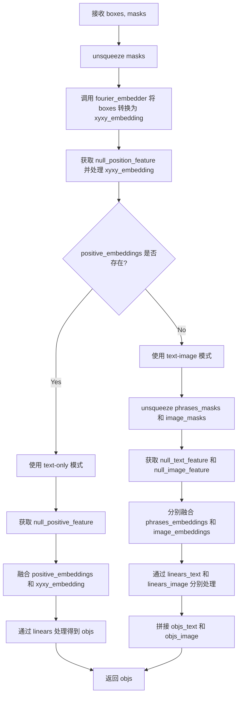
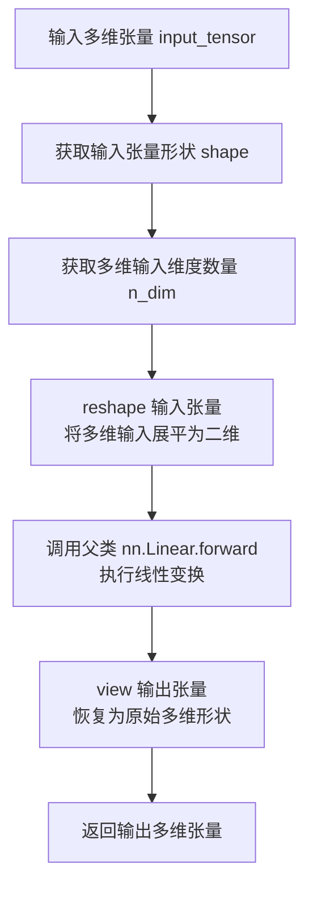
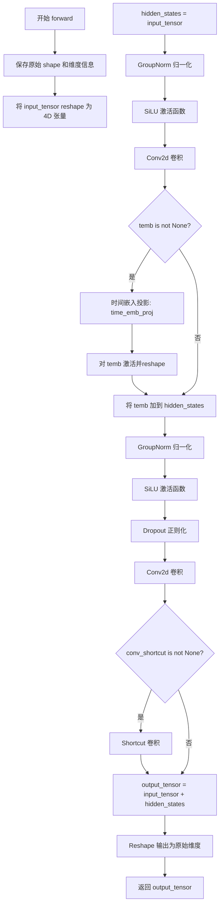
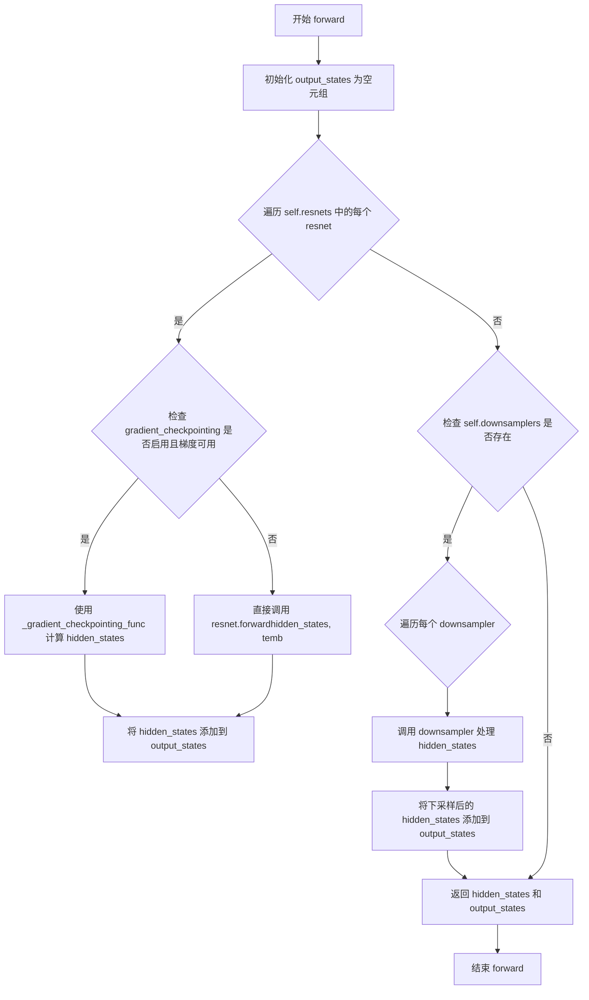
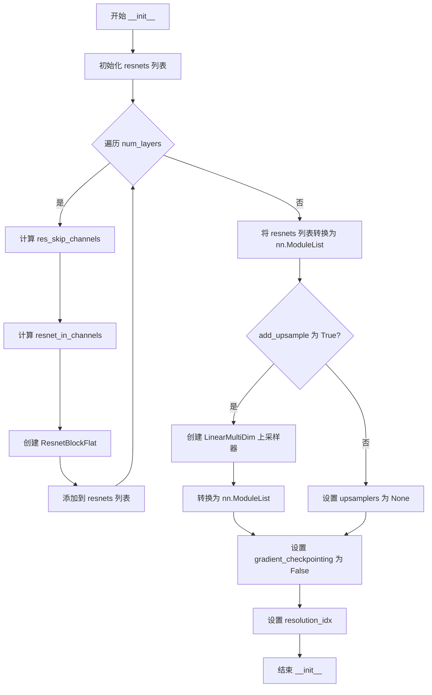
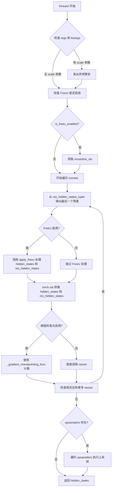
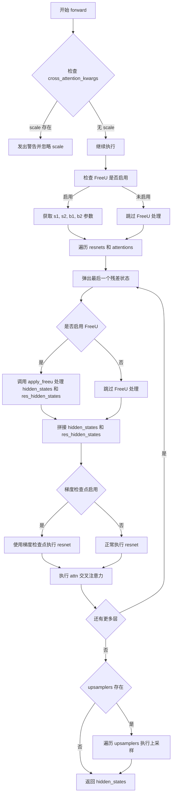

# `diffusers\src\diffusers\pipelines\deprecated\versatile_diffusion\modeling_text_unet.py` 详细设计文档

A conditional 2D UNet model for diffusion models that takes noisy input samples, conditional states (like text embeddings), and timesteps to iteratively denoise and generate output samples, featuring flat architecture blocks with cross-attention mechanisms.

## 整体流程



## 类结构

```
nn.Module (基类)
├── FourierEmbedder
├── GLIGENTextBoundingboxProjection
├── LinearMultiDim (继承 nn.Linear)
├── ResnetBlockFlat
├── DownBlockFlat
│   └── ResnetBlockFlat
├── CrossAttnDownBlockFlat
│   ├── ResnetBlockFlat
│   └── Transformer2DModel / DualTransformer2DModel
├── UpBlockFlat
│   └── ResnetBlockFlat
├── CrossAttnUpBlockFlat
│   ├── ResnetBlockFlat
│   └── Transformer2DModel / DualTransformer2DModel
├── UNetMidBlockFlat
│   ├── ResnetBlockFlat / ResnetBlockCondNorm2D
│   └── Attention
├── UNetMidBlockFlatCrossAttn
│   ├── ResnetBlockFlat
│   └── Transformer2DModel / DualTransformer2DModel
├── UNetMidBlockFlatSimpleCrossAttn
│   ├── ResnetBlockFlat
│   └── Attention (with added KV)
└── UNetFlatConditionModel (继承 ModelMixin, ConfigMixin)
    ├── time_embedding (TimestepEmbedding)
    ├── class_embedding (Embedding/Linear/Identity)
    ├── add_embedding (TextTimeEmbedding/ImageTimeEmbedding/...)
    ├── down_blocks (ModuleList)
    ├── mid_block
    ├── up_blocks (ModuleList)
    └── conv_in / conv_out
```

## 全局变量及字段


### `logger`
    
Logger instance for the module, obtained from the module's name

类型：`logging.Logger`
    


### `FourierEmbedder.num_freqs`
    
Number of frequency bands

类型：`int`
    


### `FourierEmbedder.temperature`
    
Temperature for frequency bands

类型：`float`
    


### `FourierEmbedder.freq_bands`
    
Registered buffer for frequency bands

类型：`torch.Tensor`
    


### `GLIGENTextBoundingboxProjection.positive_len`
    
Length of positive embeddings

类型：`int`
    


### `GLIGENTextBoundingboxProjection.out_dim`
    
Output dimension

类型：`int`
    


### `GLIGENTextBoundingboxProjection.fourier_embedder`
    
Fourier embedder for boxes

类型：`FourierEmbedder`
    


### `GLIGENTextBoundingboxProjection.position_dim`
    
Position dimension (fourier_freqs * 2 * 4)

类型：`int`
    


### `GLIGENTextBoundingboxProjection.linears`
    
MLPs for projection (text-only mode)

类型：`nn.Sequential`
    


### `GLIGENTextBoundingboxProjection.linears_text`
    
MLPs for text projection (text-image mode)

类型：`nn.Sequential`
    


### `GLIGENTextBoundingboxProjection.linears_image`
    
MLPs for image projection (text-image mode)

类型：`nn.Sequential`
    


### `GLIGENTextBoundingboxProjection.null_positive_feature`
    
Null feature for positive embedding masking

类型：`nn.Parameter`
    


### `GLIGENTextBoundingboxProjection.null_text_feature`
    
Null feature for text embedding masking

类型：`nn.Parameter`
    


### `GLIGENTextBoundingboxProjection.null_image_feature`
    
Null feature for image embedding masking

类型：`nn.Parameter`
    


### `GLIGENTextBoundingboxProjection.null_position_feature`
    
Null feature for position embedding masking

类型：`nn.Parameter`
    


### `LinearMultiDim.in_features_multidim`
    
Input features as multi-dim

类型：`list`
    


### `LinearMultiDim.out_features_multidim`
    
Output features as multi-dim

类型：`list`
    


### `ResnetBlockFlat.pre_norm`
    
Whether to use pre-normalization

类型：`bool`
    


### `ResnetBlockFlat.in_channels_prod`
    
Product of input channels

类型：`int`
    


### `ResnetBlockFlat.out_channels_multidim`
    
Output channels as multi-dim

类型：`list`
    


### `ResnetBlockFlat.channels_multidim`
    
Channel dimensions

类型：`list`
    


### `ResnetBlockFlat.time_embedding_norm`
    
Time embedding normalization type

类型：`str`
    


### `ResnetBlockFlat.norm1`
    
First normalization layer

类型：`nn.GroupNorm`
    


### `ResnetBlockFlat.norm2`
    
Second normalization layer

类型：`nn.GroupNorm`
    


### `ResnetBlockFlat.conv1`
    
First convolution layer

类型：`nn.Conv2d`
    


### `ResnetBlockFlat.conv2`
    
Second convolution layer

类型：`nn.Conv2d`
    


### `ResnetBlockFlat.conv_shortcut`
    
Shortcut connection convolution

类型：`nn.Conv2d`
    


### `ResnetBlockFlat.time_emb_proj`
    
Time embedding projection

类型：`nn.Linear`
    


### `ResnetBlockFlat.nonlinearity`
    
Activation function

类型：`nn.SiLU`
    


### `ResnetBlockFlat.use_in_shortcut`
    
Whether to use skip connection

类型：`bool`
    


### `DownBlockFlat.resnets`
    
List of ResNet blocks

类型：`nn.ModuleList`
    


### `DownBlockFlat.downsamplers`
    
Downsampling layers

类型：`nn.ModuleList or None`
    


### `DownBlockFlat.gradient_checkpointing`
    
Gradient checkpointing flag

类型：`bool`
    


### `CrossAttnDownBlockFlat.has_cross_attention`
    
Flag for cross attention

类型：`bool`
    


### `CrossAttnDownBlockFlat.num_attention_heads`
    
Number of attention heads

类型：`int`
    


### `CrossAttnDownBlockFlat.resnets`
    
List of ResNet blocks

类型：`nn.ModuleList`
    


### `CrossAttnDownBlockFlat.attentions`
    
List of attention modules

类型：`nn.ModuleList`
    


### `CrossAttnDownBlockFlat.downsamplers`
    
Downsampling layers

类型：`nn.ModuleList or None`
    


### `CrossAttnDownBlockFlat.gradient_checkpointing`
    
Gradient checkpointing flag

类型：`bool`
    


### `UpBlockFlat.resnets`
    
List of ResNet blocks

类型：`nn.ModuleList`
    


### `UpBlockFlat.upsamplers`
    
Upsampling layers

类型：`nn.ModuleList or None`
    


### `UpBlockFlat.gradient_checkpointing`
    
Gradient checkpointing flag

类型：`bool`
    


### `UpBlockFlat.resolution_idx`
    
Resolution index for FreeU

类型：`int or None`
    


### `CrossAttnUpBlockFlat.has_cross_attention`
    
Flag for cross attention

类型：`bool`
    


### `CrossAttnUpBlockFlat.num_attention_heads`
    
Number of attention heads

类型：`int`
    


### `CrossAttnUpBlockFlat.resnets`
    
List of ResNet blocks

类型：`nn.ModuleList`
    


### `CrossAttnUpBlockFlat.attentions`
    
List of attention modules

类型：`nn.ModuleList`
    


### `CrossAttnUpBlockFlat.upsamplers`
    
Upsampling layers

类型：`nn.ModuleList or None`
    


### `CrossAttnUpBlockFlat.gradient_checkpointing`
    
Gradient checkpointing flag

类型：`bool`
    


### `CrossAttnUpBlockFlat.resolution_idx`
    
Resolution index for FreeU

类型：`int or None`
    


### `UNetMidBlockFlat.add_attention`
    
Whether to add attention

类型：`bool`
    


### `UNetMidBlockFlat.resnets`
    
List of ResNet blocks

类型：`nn.ModuleList`
    


### `UNetMidBlockFlat.attentions`
    
List of attention modules

类型：`nn.ModuleList`
    


### `UNetMidBlockFlat.gradient_checkpointing`
    
Gradient checkpointing flag

类型：`bool`
    


### `UNetMidBlockFlatCrossAttn.in_channels`
    
Input channels

类型：`int`
    


### `UNetMidBlockFlatCrossAttn.out_channels`
    
Output channels

类型：`int`
    


### `UNetMidBlockFlatCrossAttn.has_cross_attention`
    
Flag for cross attention

类型：`bool`
    


### `UNetMidBlockFlatCrossAttn.num_attention_heads`
    
Number of attention heads

类型：`int`
    


### `UNetMidBlockFlatCrossAttn.resnets`
    
List of ResNet blocks

类型：`nn.ModuleList`
    


### `UNetMidBlockFlatCrossAttn.attentions`
    
List of attention modules

类型：`nn.ModuleList`
    


### `UNetMidBlockFlatCrossAttn.gradient_checkpointing`
    
Gradient checkpointing flag

类型：`bool`
    


### `UNetMidBlockFlatSimpleCrossAttn.has_cross_attention`
    
Flag for cross attention

类型：`bool`
    


### `UNetMidBlockFlatSimpleCrossAttn.attention_head_dim`
    
Attention head dimension

类型：`int`
    


### `UNetMidBlockFlatSimpleCrossAttn.num_heads`
    
Number of attention heads

类型：`int`
    


### `UNetMidBlockFlatSimpleCrossAttn.resnets`
    
List of ResNet blocks

类型：`nn.ModuleList`
    


### `UNetMidBlockFlatSimpleCrossAttn.attentions`
    
List of attention modules

类型：`nn.ModuleList`
    


### `UNetFlatConditionModel._supports_gradient_checkpointing`
    
Gradient checkpointing support

类型：`bool`
    


### `UNetFlatConditionModel._no_split_modules`
    
Modules that should not be split

类型：`list`
    


### `UNetFlatConditionModel.sample_size`
    
Sample size

类型：`int or None`
    


### `UNetFlatConditionModel.conv_in`
    
Input convolution

类型：`LinearMultiDim`
    


### `UNetFlatConditionModel.time_proj`
    
Time projection

类型：`GaussianFourierProjection or Timesteps`
    


### `UNetFlatConditionModel.time_embedding`
    
Time embedding layer

类型：`TimestepEmbedding`
    


### `UNetFlatConditionModel.encoder_hid_proj`
    
Encoder hidden projection

类型：`nn.Linear or TextImageProjection or ImageProjection or None`
    


### `UNetFlatConditionModel.class_embedding`
    
Class embedding

类型：`nn.Embedding or TimestepEmbedding or nn.Linear or nn.Identity or None`
    


### `UNetFlatConditionModel.add_embedding`
    
Additional embedding

类型：`TextTimeEmbedding or TextImageTimeEmbedding or ImageTimeEmbedding or ImageHintTimeEmbedding or None`
    


### `UNetFlatConditionModel.time_embed_act`
    
Time embedding activation

类型：`None or callable`
    


### `UNetFlatConditionModel.down_blocks`
    
Down sampling blocks

类型：`nn.ModuleList`
    


### `UNetFlatConditionModel.mid_block`
    
Middle block

类型：`UNetMidBlockFlat* or None`
    


### `UNetFlatConditionModel.up_blocks`
    
Up sampling blocks

类型：`nn.ModuleList`
    


### `UNetFlatConditionModel.conv_norm_out`
    
Output normalization

类型：`nn.GroupNorm or None`
    


### `UNetFlatConditionModel.conv_act`
    
Output activation

类型：`None or callable`
    


### `UNetFlatConditionModel.conv_out`
    
Output convolution

类型：`LinearMultiDim`
    


### `UNetFlatConditionModel.position_net`
    
GLIGEN position net

类型：`GLIGENTextBoundingboxProjection or None`
    


### `UNetFlatConditionModel.num_upsamplers`
    
Number of upsample layers

类型：`int`
    


### `UNetFlatConditionModel.original_attn_processors`
    
Original attention processors

类型：`dict or None`
    
    

## 全局函数及方法


### `get_down_block`

该函数是 UNet 下采样块的工厂函数，根据 `down_block_type` 参数动态创建并返回对应的下采样块（`DownBlockFlat` 或 `CrossAttnDownBlockFlat`），用于构建条件式 2D UNet 模型的下游路径。

参数：

- `down_block_type`：`str`，下采样块的类型标识符（如 "DownBlockFlat"、"CrossAttnDownBlockFlat"，或带 "UNetRes" 前缀的形式）
- `num_layers`：`int`，该块中 ResNet 层的数量
- `in_channels`：`int`，输入特征图的通道数
- `out_channels`：`int`，输出特征图的通道数
- `temb_channels`：`int`，时间嵌入（timestep embedding）的通道数
- `add_downsample`：`bool`，是否在块末尾添加下采样操作
- `resnet_eps`：`float`，ResNet 块中 GroupNorm 的 epsilon 值，用于数值稳定性
- `resnet_act_fn`：`str`，ResNet 块使用的激活函数名称（如 "silu"、"swish"）
- `num_attention_heads`：`int`，交叉注意力机制中的注意力头数量
- `transformer_layers_per_block`：`int | tuple[int]`，每个块中 Transformer 层的数量
- `attention_type`：`str`，注意力机制的类型（"default" 或其他）
- `attention_head_dim`：`int`，每个注意力头的维度
- `resnet_groups`：`int | None`，ResNet 块中 GroupNorm 的分组数，默认为 32
- `cross_attention_dim`：`int | None`，交叉注意力中 encoder_hidden_states 的维度，仅当使用 CrossAttn 类型块时需要
- `downsample_padding`：`int | None`，下采样卷积的填充大小
- `dual_cross_attention`：`bool`，是否使用双交叉注意力机制
- `use_linear_projection`：`bool`，是否在注意力中使用线性投影
- `only_cross_attention`：`bool`，是否仅使用交叉注意力（不使用自注意力）
- `upcast_attention`：`bool`，是否将注意力计算向上转换为 float32
- `resnet_time_scale_shift`：`str`，ResNet 时间尺度偏移的配置（"default" 或 "scale_shift"）
- `resnet_skip_time_act`：`bool`，是否在 ResNet 中跳过时间激活函数
- `resnet_out_scale_factor`：`float`，ResNet 输出缩放因子
- `cross_attention_norm`：`str | None`，交叉注意力中是否使用归一化
- `dropout`：`float`，Dropout 概率

返回值：`nn.Module`，返回创建的下采样块实例（`DownBlockFlat` 或 `CrossAttnDownBlockFlat`），若不支持的类型则抛出 `ValueError`

#### 流程图

```mermaid
flowchart TD
    A[开始: get_down_block] --> B{down_block_type 是否以 'UNetRes' 开头?}
    B -->|是| C[去除前缀 'UNetRes']
    B -->|否| D[保持原 down_block_type]
    C --> E
    D --> E
    E{down_block_type == 'DownBlockFlat'?}
    E -->|是| F[创建 DownBlockFlat 实例]
    E -->|否| G{down_block_type == 'CrossAttnDownBlockFlat'?}
    G -->|是| H{cross_attention_dim is None?}
    H -->|是| I[抛出 ValueError: cross_attention_dim must be specified]
    H -->|否| J[创建 CrossAttnDownBlockFlat 实例]
    G -->|否| K[抛出 ValueError: {down_block_type} is not supported]
    F --> L[返回下采样块实例]
    J --> L
    I --> M[结束: 抛出异常]
    K --> M
```

#### 带注释源码

```python
def get_down_block(
    down_block_type,
    num_layers,
    in_channels,
    out_channels,
    temb_channels,
    add_downsample,
    resnet_eps,
    resnet_act_fn,
    num_attention_heads,
    transformer_layers_per_block,
    attention_type,
    attention_head_dim,
    resnet_groups=None,
    cross_attention_dim=None,
    downsample_padding=None,
    dual_cross_attention=False,
    use_linear_projection=False,
    only_cross_attention=False,
    upcast_attention=False,
    resnet_time_scale_shift="default",
    resnet_skip_time_act=False,
    resnet_out_scale_factor=1.0,
    cross_attention_norm=None,
    dropout=0.0,
):
    """
    工厂函数：根据 down_block_type 创建对应的下采样块
    
    参数:
        down_block_type: 块类型字符串，可能带 "UNetRes" 前缀
        num_layers: ResNet 层数
        in_channels/out_channels: 输入输出通道数
        temb_channels: 时间嵌入通道数
        add_downsample: 是否添加下采样
        resnet_eps: GroupNorm epsilon
        resnet_act_fn: 激活函数名
        num_attention_heads: 注意力头数
        transformer_layers_per_block: Transformer 层数配置
        attention_type: 注意力类型
        attention_head_dim: 注意力头维度
        resnet_groups: ResNet 分组数
        cross_attention_dim: 交叉注意力维度
        downsample_padding: 下采样填充
        dual_cross_attention: 双交叉注意力标志
        use_linear_projection: 线性投影标志
        only_cross_attention: 仅交叉注意力标志
        upcast_attention: 注意力向上转换标志
        resnet_time_scale_shift: 时间尺度偏移配置
        resnet_skip_time_act: 跳过时间激活标志
        resnet_out_scale_factor: 输出缩放因子
        cross_attention_norm: 交叉注意力归一化
        dropout: Dropout 概率
    """
    
    # 兼容处理：去除 "UNetRes" 前缀（如 "UNetResDownBlockFlat" -> "DownBlockFlat"）
    down_block_type = down_block_type[7:] if down_block_type.startswith("UNetRes") else down_block_type
    
    # 基础下采样块：无交叉注意力
    if down_block_type == "DownBlockFlat":
        return DownBlockFlat(
            num_layers=num_layers,
            in_channels=in_channels,
            out_channels=out_channels,
            temb_channels=temb_channels,
            dropout=dropout,
            add_downsample=add_downsample,
            resnet_eps=resnet_eps,
            resnet_act_fn=resnet_act_fn,
            resnet_groups=resnet_groups,
            downsample_padding=downsample_padding,
            resnet_time_scale_shift=resnet_time_scale_shift,
        )
    
    # 带交叉注意力的下采样块
    elif down_block_type == "CrossAttnDownBlockFlat":
        # 交叉注意力需要指定 cross_attention_dim 参数
        if cross_attention_dim is None:
            raise ValueError("cross_attention_dim must be specified for CrossAttnDownBlockFlat")
        
        return CrossAttnDownBlockFlat(
            num_layers=num_layers,
            in_channels=in_channels,
            out_channels=out_channels,
            temb_channels=temb_channels,
            dropout=dropout,
            add_downsample=add_downsample,
            resnet_eps=resnet_eps,
            resnet_act_fn=resnet_act_fn,
            resnet_groups=resnet_groups,
            downsample_padding=downsample_padding,
            cross_attention_dim=cross_attention_dim,
            num_attention_heads=num_attention_heads,
            dual_cross_attention=dual_cross_attention,
            use_linear_projection=use_linear_projection,
            only_cross_attention=only_cross_attention,
            resnet_time_scale_shift=resnet_time_scale_shift,
        )
    
    # 不支持的块类型
    raise ValueError(f"{down_block_type} is not supported.")
```


### `get_up_block`

该函数是一个工厂函数，用于根据 `up_block_type` 参数创建对应的上采样（Up）块组件。它是 UNet 模型构建过程中的关键部分，根据配置动态实例化不同类型的上采样块，如 `UpBlockFlat` 或 `CrossAttnUpBlockFlat`，以支持不同的网络架构需求。

参数：

- `up_block_type`：`str`，上采样块的类型标识符，如 "UpBlockFlat"、"CrossAttnUpBlockFlat" 等
- `num_layers`：`int`，块内 ResNet 层的数量
- `in_channels`：`int`，输入通道数
- `out_channels`：`int`，输出通道数
- `prev_output_channel`：`int`，来自上一层的输出通道数
- `temb_channels`：`int`，时间嵌入通道数
- `add_upsample`：`bool`，是否添加上采样操作
- `resnet_eps`：`float`，ResNet 块的 epsilon 参数，用于防止除零
- `resnet_act_fn`：激活函数名称或配置
- `num_attention_heads`：`int`，注意力头的数量
- `transformer_layers_per_block`：`int` 或 `tuple`，每个块的 Transformer 层数
- `resolution_idx`：`int`，分辨率索引，用于 FreeU 等优化技术
- `attention_type`：`str`，注意力机制类型
- `attention_head_dim`：`int`，每个注意力头的维度
- `resnet_groups`：`int`，可选，ResNet 组归一化的组数
- `cross_attention_dim`：`int`，可选，交叉注意力维度
- `dual_cross_attention`：`bool`，可选，是否使用双交叉注意力
- `use_linear_projection`：`bool`，可选，是否使用线性投影
- `only_cross_attention`：`bool`，可选，是否仅使用交叉注意力
- `upcast_attention`：`bool`，可选，是否向上转换注意力计算
- `resnet_time_scale_shift`：`str`，可选，ResNet 时间尺度_shift配置
- `resnet_skip_time_act`：`bool`，可选，是否跳过时间激活
- `resnet_out_scale_factor`：`float`，可选，ResNet 输出缩放因子
- `cross_attention_norm`：`str`，可选，交叉注意力归一化类型
- `dropout`：`float`，可选，Dropout 概率

返回值：`nn.Module`，返回对应的上采样块实例（UpBlockFlat 或 CrossAttnUpBlockFlat）

#### 流程图



#### 带注释源码

```python
def get_up_block(
    up_block_type,                      # 上采样块类型字符串
    num_layers,                         # ResNet层数
    in_channels,                        # 输入通道数
    out_channels,                       # 输出通道数
    prev_output_channel,                # 上一输出通道数
    temb_channels,                      # 时间嵌入通道数
    add_upsample,                      # 是否添加上采样
    resnet_eps,                        # ResNet epsilon值
    resnet_act_fn,                     # ResNet激活函数
    num_attention_heads,               # 注意力头数
    transformer_layers_per_block,      # Transformer层数
    resolution_idx,                    # 分辨率索引
    attention_type,                    # 注意力类型
    attention_head_dim,                # 注意力头维度
    resnet_groups=None,                 # ResNet组数
    cross_attention_dim=None,          # 交叉注意力维度
    dual_cross_attention=False,        # 双交叉注意力
    use_linear_projection=False,       # 线性投影
    only_cross_attention=False,        # 仅交叉注意力
    upcast_attention=False,            # 上转注意力
    resnet_time_scale_shift="default", # 时间尺度偏移
    resnet_skip_time_act=False,        # 跳过时间激活
    resnet_out_scale_factor=1.0,       # 输出缩放因子
    cross_attention_norm=None,         # 交叉注意力归一化
    dropout=0.0,                       # Dropout概率
):
    # 处理块类型前缀，保持向后兼容性
    # 如果类型以 "UNetRes" 开头，则去掉前缀
    up_block_type = up_block_type[7:] if up_block_type.startswith("UNetRes") else up_block_type
    
    # 根据类型创建对应的上采样块
    if up_block_type == "UpBlockFlat":
        # 创建不带交叉注意力的平面上采样块
        return UpBlockFlat(
            num_layers=num_layers,
            in_channels=in_channels,
            out_channels=out_channels,
            prev_output_channel=prev_output_channel,
            temb_channels=temb_channels,
            dropout=dropout,
            add_upsample=add_upsample,
            resnet_eps=resnet_eps,
            resnet_act_fn=resnet_act_fn,
            resnet_groups=resnet_groups,
            resnet_time_scale_shift=resnet_time_scale_shift,
        )
    elif up_block_type == "CrossAttnUpBlockFlat":
        # 创建带交叉注意力的平面上采样块
        # 需要验证 cross_attention_dim 参数
        if cross_attention_dim is None:
            raise ValueError("cross_attention_dim must be specified for CrossAttnUpBlockFlat")
        return CrossAttnUpBlockFlat(
            num_layers=num_layers,
            in_channels=in_channels,
            out_channels=out_channels,
            prev_output_channel=prev_output_channel,
            temb_channels=temb_channels,
            dropout=dropout,
            add_upsample=add_upsample,
            resnet_eps=resnet_eps,
            resnet_act_fn=resnet_act_fn,
            resnet_groups=resnet_groups,
            cross_attention_dim=cross_attention_dim,
            num_attention_heads=num_attention_heads,
            dual_cross_attention=dual_cross_attention,
            use_linear_projection=use_linear_projection,
            only_cross_attention=only_cross_attention,
            resnet_time_scale_shift=resnet_time_scale_shift,
        )
    
    # 如果遇到不支持的块类型，抛出明确的错误信息
    raise ValueError(f"{up_block_type} is not supported.")
```


### `FourierEmbedder.__init__`

该方法是 `FourierEmbedder` 类的初始化方法，用于构建傅里叶特征嵌入器。它通过温度参数和频率数量计算频率带，并将其注册为非持久化的缓冲区，以供后续 `__call__` 方法进行正弦和余弦变换生成高频特征表示。

参数：

- `num_freqs`：`int`，傅里叶频率的数量，默认值为64，决定生成的频率带数量
- `temperature`：`int`，温度参数，默认值为100，用于控制频率带的分布密度

返回值：`None`，无返回值（`__init__` 方法）

#### 流程图

```mermaid
flowchart TD
    A[开始 __init__] --> B[调用 super().__init__]
    B --> C[保存 num_freqs 到实例属性]
    C --> D[保存 temperature 到实例属性]
    D --> E[计算 freq_bands: temperature<sup>i/num_freqs</sup> for i in rangenum_freqs]
    E --> F[扩展维度为 1x1x1xN]
    F --> G[注册为非持久化缓冲区 freq_bands]
    G --> H[结束 __init__]
```

#### 带注释源码

```python
class FourierEmbedder(nn.Module):
    def __init__(self, num_freqs=64, temperature=100):
        """
        初始化傅里叶嵌入器
        
        Args:
            num_freqs (int): 傅里叶频率的数量，默认64
            temperature (int): 温度参数，用于控制频率带分布，默认100
        """
        # 调用父类 nn.Module 的初始化方法
        super().__init__()

        # 保存频率数量到实例属性
        self.num_freqs = num_freqs
        # 保存温度参数到实例属性
        self.temperature = temperature

        # 计算频率带：temperature^(i/num_freqs) for i in [0, num_freqs)
        # 使用指数分布生成从1到temperature的频率点
        freq_bands = temperature ** (torch.arange(num_freqs) / num_freqs)
        
        # 将 freq_bands 扩展为 [1, 1, 1, num_freqs] 的四维张量
        # 以便后续与输入张量进行广播运算
        freq_bands = freq_bands[None, None, None]
        
        # 注册为非持久化缓冲区（不会保存到模型权重中）
        # persistent=False 表示该缓冲区不会被保存到 state_dict
        self.register_buffer("freq_bands", freq_bands, persistent=False)
```


### `FourierEmbedder.__call__`

该方法实现了傅里叶位置编码，将输入的空间坐标或特征通过正弦和余弦函数映射到高频特征空间，生成用于位置嵌入的编码向量。

参数：

- `x`：`torch.Tensor`，输入的4D张量，形状为 (batch, channel, height, width)，通常为空间坐标或特征图

返回值：`torch.Tensor`，返回形状为 (batch, channel, H*W*num_freqs*2) 的2D张量，其中包含正弦和余弦编码后的特征

#### 流程图



#### 带注释源码

```python
def __call__(self, x):
    # x: 输入张量，形状为 (batch, channel, height, width)
    # 示例：x.shape = [B, C, H, W]
    
    # 1. 频率调制：将预计算的频率 bands 与输入相乘
    # self.freq_bands 形状为 [1, 1, 1, num_freqs]
    # x.unsqueeze(-1) 将 x 从 [B, C, H, W] 扩展为 [B, C, H, W, 1]
    # 乘法结果 x 形状变为 [B, C, H, W, num_freqs]
    x = self.freq_bands * x.unsqueeze(-1)
    
    # 2. 计算正弦和余弦：对每个频率生成 sin 和 cos 编码
    # torch.stack((x.sin(), x.cos()), dim=-1) 形状变为 [B, C, H, W, num_freqs, 2]
    # 最后一个维度2分别代表 sin 和 cos
    # 3. 维度重排：从 [B, C, H, W, num_freqs, 2] 变为 [B, C, H, 2, num_freqs]
    # 4. 展平重塑：将后面的维度全部展平为一个大维度
    # 最终形状：[B, C, H * W * num_freqs * 2] = [batch, channel, -1]
    return torch.stack((x.sin(), x.cos()), dim=-1).permute(0, 1, 3, 4, 2).reshape(*x.shape[:2], -1)
```


### GLIGENTextBoundingboxProjection.__init__

该方法是 `GLIGENTextBoundingboxProjection` 类的构造函数，用于初始化 GLIGEN（Grounded Language-Image Feature Embedding）文本边界框投影模块。该模块主要负责将文本嵌入和边界框位置信息进行融合处理，支持纯文本和文本-图像两种特征类型，是 UNet 模型中处理交叉注意力机制的关键组件。

参数：

- `positive_len`：`int`，正样本（文本嵌入）的特征维度，用于定义输入文本特征的维度大小
- `out_dim`：`int` 或 `tuple`，输出特征的维度，若为元组则取第一个元素作为输出维度
- `feature_type`：`str`，特征类型标识，支持 "text-only"（纯文本模式）或 "text-image"（文本-图像模式）
- `fourier_freqs`：`int`，傅里叶嵌入的频率数量，默认为 8，用于生成位置编码的频率分量数量

返回值：`None`，该方法为构造函数，不返回任何值，仅初始化对象属性

#### 流程图

```mermaid
flowchart TD
    A[__init__ 开始] --> B[调用父类构造函数]
    B --> C[保存 positive_len 和 out_dim]
    C --> D[创建 FourierEmbedder 实例]
    D --> E[计算 position_dim = fourier_freqs * 2 * 4]
    E --> F{out_dim 是否为元组?}
    F -->|是| G[取 out_dim[0]]
    G --> H{feature_type == 'text-only'?}
    F -->|否| H
    H -->|是| I[构建 linears 序列网络]
    I --> J[创建 null_positive_feature 参数]
    H -->|否| K{feature_type == 'text-image'?}
    K -->|是| L[构建 linears_text 序列网络]
    L --> M[构建 linears_image 序列网络]
    M --> N[创建 null_text_feature 参数]
    N --> O[创建 null_image_feature 参数]
    K -->|否| P[不创建任何网络]
    J --> Q[创建 null_position_feature 参数]
    O --> Q
    P --> Q
    Q --> R[__init__ 结束]
```

#### 带注释源码

```python
def __init__(self, positive_len, out_dim, feature_type, fourier_freqs=8):
    """
    初始化 GLIGEN 文本边界框投影模块
    
    参数:
        positive_len: 正样本嵌入的维度长度
        out_dim: 输出特征维度
        feature_type: 特征类型，'text-only' 或 'text-image'
        fourier_freqs: 傅里叶频率数量，默认8
    """
    # 调用父类 nn.Module 的初始化方法
    super().__init__()
    
    # 保存正样本嵌入的维度长度
    self.positive_len = positive_len
    
    # 保存输出维度
    self.out_dim = out_dim

    # 创建傅里叶嵌入器，用于将边界框坐标编码为高频特征
    # 傅里叶嵌入可以将低维位置信息映射到高维空间，捕捉更丰富的位置关系
    self.fourier_embedder = FourierEmbedder(num_freqs=fourier_freqs)
    
    # 计算位置特征的维度
    # 公式: fourier_freqs * 2 * 4
    # - 2: sin 和 cos 两种频率成分
    # - 4: xyxy 四个坐标值 (x1, y1, x2, y2)
    self.position_dim = fourier_freqs * 2 * 4  # 2: sin/cos, 4: xyxy

    # 如果 out_dim 是元组，取第一个元素作为实际输出维度
    if isinstance(out_dim, tuple):
        out_dim = out_dim[0]

    # 根据特征类型构建不同的神经网络结构
    if feature_type == "text-only":
        # 纯文本模式：构建三层全连接网络
        # 输入维度 = 文本嵌入维度 + 位置编码维度
        # 输出维度 = out_dim
        self.linears = nn.Sequential(
            nn.Linear(self.positive_len + self.position_dim, 512),
            nn.SiLU(),  # Swish 激活函数
            nn.Linear(512, 512),
            nn.SiLU(),
            nn.Linear(512, out_dim),
        )
        # 创建可学习的空文本特征参数，用于填充无效位置
        self.null_positive_feature = torch.nn.Parameter(torch.zeros([self.positive_len]))

    elif feature_type == "text-image":
        # 文本-图像模式：分别构建文本和图像的处理网络
        self.linears_text = nn.Sequential(
            nn.Linear(self.positive_len + self.position_dim, 512),
            nn.SiLU(),
            nn.Linear(512, 512),
            nn.SiLU(),
            nn.Linear(512, out_dim),
        )
        self.linears_image = nn.Sequential(
            nn.Linear(self.positive_len + self.position_dim, 512),
            nn.SiLU(),
            nn.Linear(512, 512),
            nn.SiLU(),
            nn.Linear(512, out_dim),
        )
        # 创建可学习的空文本和图像特征参数
        self.null_text_feature = torch.nn.Parameter(torch.zeros([self.positive_len]))
        self.null_image_feature = torch.nn.Parameter(torch.zeros([self.positive_len]))

    # 创建可学习的空位置特征参数，用于边界框无效时的填充
    # 这是 GLIGEN 论文中的关键设计：通过可学习的空特征处理缺失或无效的边界框
    self.null_position_feature = torch.nn.Parameter(torch.zeros([self.position_dim]))
```


### `GLIGENTextBoundingboxProjection.forward`

该方法实现 GLIGEN (Grounded Language Image Generation) 的文本边界框投影功能，将边界框坐标转换为傅里叶嵌入，并与文本/图像嵌入融合，输出可用于交叉注意力机制的对象特征向量。

参数：

- `self`：`GLIGENTextBoundingboxProjection` 类实例
- `boxes`：`torch.Tensor`，边界框坐标，形状为 `(batch, num_objects, 4)`（xyxy 格式）
- `masks`：`torch.Tensor`，对象掩码，用于指示有效对象，形状为 `(batch, num_objects)`
- `positive_embeddings`：`torch.Tensor | None`，正样本文本嵌入，当 `feature_type="text-only"` 时使用
- `phrases_masks`：`torch.Tensor | None`，短语掩码，当使用分离的文本/图像嵌入时使用
- `image_masks`：`torch.Tensor | None`，图像掩码，当使用分离的文本/图像嵌入时使用
- `phrases_embeddings`：`torch.Tensor | None`，短语嵌入，当 `feature_type="text-image"` 时使用
- `image_embeddings`：`torch.Tensor | None`，图像嵌入，当 `feature_type="text-image"` 时使用

返回值：`torch.Tensor`，处理后的对象嵌入，形状为 `(batch, num_objects, out_dim)` 或 `(batch, num_objects*2, out_dim)`

#### 流程图



#### 带注释源码

```python
def forward(
    self,
    boxes,
    masks,
    positive_embeddings=None,
    phrases_masks=None,
    image_masks=None,
    phrases_embeddings=None,
    image_embeddings=None,
):
    """
    前向传播：将边界框和嵌入融合并投影到目标维度
    
    Args:
        boxes: 边界框坐标 (batch, num_objects, 4) xyxy 格式
        masks: 对象有效掩码 (batch, num_objects)
        positive_embeddings: 文本嵌入 (batch, num_objects, positive_len)
        phrases_masks: 短语掩码
        image_masks: 图像掩码
        phrases_embeddings: 短语嵌入
        image_embeddings: 图像嵌入
    
    Returns:
        objs: 投影后的对象嵌入
    """
    # 扩展掩码维度以便广播计算
    # 从 (batch, num_objects) -> (batch, num_objects, 1)
    masks = masks.unsqueeze(-1)
    
    # 使用傅里叶嵌入器将边界框坐标转换为高维特征
    # 输出形状: (batch, num_objects, position_dim)
    xyxy_embedding = self.fourier_embedder(boxes)
    
    # 获取空位置特征并reshape为 (1, 1, position_dim)
    xyxy_null = self.null_position_feature.view(1, 1, -1)
    
    # 根据掩码选择有效位置嵌入或空特征
    # masks=1: 使用真实位置嵌入, masks=0: 使用空特征
    xyxy_embedding = xyxy_embedding * masks + (1 - masks) * xyxy_null
    
    # 判断使用哪种模式
    if positive_embeddings:
        # === text-only 模式 ===
        # 获取空正样本特征
        positive_null = self.null_positive_feature.view(1, 1, -1)
        
        # 根据掩码融合正样本嵌入和空特征
        positive_embeddings = positive_embeddings * masks + (1 - masks) * positive_null
        
        # 拼接正样本嵌入和位置嵌入，通过线性层投影
        objs = self.linears(torch.cat([positive_embeddings, xyxy_embedding], dim=-1))
    else:
        # === text-image 模式 ===
        # 扩展短语和图像掩码维度
        phrases_masks = phrases_masks.unsqueeze(-1)
        image_masks = image_masks.unsqueeze(-1)
        
        # 获取空文本和图像特征
        text_null = self.null_text_feature.view(1, 1, -1)
        image_null = self.null_image_feature.view(1, 1, -1)
        
        # 分别融合短语/图像嵌入与对应空特征
        phrases_embeddings = phrases_embeddings * phrases_masks + (1 - phrases_masks) * text_null
        image_embeddings = image_embeddings * image_masks + (1 - image_masks) * image_null
        
        # 分别通过专用线性层处理文本和图像分支
        objs_text = self.linears_text(torch.cat([phrases_embeddings, xyxy_embedding], dim=-1))
        objs_image = self.linears_image(torch.cat([image_embeddings, xyxy_embedding], dim=-1))
        
        # 沿对象维度拼接文本和图像对象嵌入
        # 结果形状: (batch, num_objects*2, out_dim)
        objs = torch.cat([objs_text, objs_image], dim=1)
    
    return objs
```


### LinearMultiDim.__init__

该方法是`LinearMultiDim`类的构造函数，用于初始化一个多维线性变换层。它继承自PyTorch的`nn.Linear`，但扩展为支持多维输入（不仅仅是2D），通过将多维输入展平为2D进行线性变换，然后再 reshape 回原始多维形状。

参数：

- `in_features`：`int` 或 `list`/`tuple`，输入特征维度。如果为整数，则会被转换为 `[in_features, second_dim, 1]` 的列表形式；如果为列表或元组，则直接转换为列表。
- `out_features`：`int` 或 `list`/`tuple` 或 `None`，输出特征维度。默认为 `None`（等同于 `in_features`）。如果为整数，则会被转换为 `[out_features, second_dim, 1]` 的列表形式。
- `second_dim`：`int`，第二个维度的尺寸，默认为 4。用于处理多维输入张量的情况。
- `*args`：`tuple`，可变位置参数，传递给父类 `nn.Linear` 的额外位置参数。
- `**kwargs`：`dict`，可变关键字参数，传递给父类 `nn.Linear` 的额外关键字参数。

返回值：`None`，该方法为构造函数，不返回任何值，仅初始化对象状态。

#### 流程图

```mermaid
flowchart TD
    A[开始 __init__] --> B{判断 in_features 是否为整数}
    B -->|是| C[将 in_features 转换为列表 [in_features, second_dim, 1]]
    B -->|否| D[将 in_features 转换为 list]
    C --> E{判断 out_features 是否为 None}
    D --> E
    E -->|是| F[out_features = in_features]
    E -->|否| G{判断 out_features 是否为整数}
    G -->|是| H[将 out_features 转换为列表 [out_features, second_dim, 1]]
    G -->|否| I[将 out_features 转换为 list]
    F --> J[保存 in_features_multidim]
    H --> J
    I --> J
    J --> K[保存 out_features_multidim]
    K --> L[调用父类 __init__<br/>np.array(in_features).prod() 作为 in_features<br/>np.array(out_features).prod() 作为 out_features]
    L --> M[结束 __init__]
```

#### 带注释源码

```python
class LinearMultiDim(nn.Linear):
    """
    多维线性变换层，继承自 nn.Linear，支持多维输入张量的线性变换。
    
    该类通过将多维输入展平为2D进行线性变换，然后再reshape回原始多维形状，
    从而实现对多维张量的线性层操作。
    """
    
    def __init__(self, in_features, out_features=None, second_dim=4, *args, **kwargs):
        """
        初始化多维线性变换层。
        
        参数:
            in_features: 输入特征维度，可以是整数或列表/元组。
            out_features: 输出特征维度，可以是整数、列表/元组或None（默认等于in_features）。
            second_dim: 第二个维度的尺寸，用于构建多维特征表示。
            *args: 传递给父类nn.Linear的可变位置参数。
            **kwargs: 传递给父类nn.Linear的可变关键字参数。
        """
        
        # 处理输入特征维度
        # 如果in_features是整数，转换为 [in_features, second_dim, 1] 形式
        # 如果in_features是列表/元组，直接转换为list
        in_features = [in_features, second_dim, 1] if isinstance(in_features, int) else list(in_features)
        
        # 处理输出特征维度
        # 如果out_features为None，则默认等于in_features
        if out_features is None:
            out_features = in_features
        
        # 如果out_features是整数，转换为 [out_features, second_dim, 1] 形式
        # 如果out_features是列表/元组，直接转换为list
        out_features = [out_features, second_dim, 1] if isinstance(out_features, int) else list(out_features)
        
        # 保存多维形式的输入/输出特征维度，供forward方法使用
        self.in_features_multidim = in_features
        self.out_features_multidim = out_features
        
        # 调用父类nn.Linear的初始化
        # 将多维特征维度展平为单一数值（所有维度的乘积）传递给父类
        super().__init__(np.array(in_features).prod(), np.array(out_features).prod())
```

#### 关键设计说明

1. **多维支持机制**：通过将输入特征维度列表中的所有值相乘（即 `np.array(in_features).prod()`），将多维输入转换为父类 `nn.Linear` 能处理的 2D 形式。

2. **维度保存**：将原始的多维维度信息保存在 `in_features_multidim` 和 `out_features_multidim` 属性中，供 `forward` 方法在推理时进行正确的 reshape 操作。

3. **默认行为**：当 `out_features` 为 `None` 时，自动使用与输入相同的特征维度，实现对称的线性变换。


### `LinearMultiDim.forward`

该方法实现了多维线性层的前向传播，通过将输入张量reshape为二维后调用父类`nn.Linear`的forward方法，再将输出reshape回多维形式，从而支持任意维度的输入张量进行线性变换。

参数：

- `self`：`LinearMultiDim` 类实例本身
- `input_tensor`：`torch.Tensor`，输入的多维张量，形状为 `(batch, ..., in_features_multidim)`
- `*args`：传递给父类 `nn.Linear.forward` 的额外位置参数
- `**kwargs`：传递给父类 `nn.Linear.forward` 的额外关键字参数

返回值：`torch.Tensor`，经过线性变换后的输出张量，形状为 `(batch, ..., out_features_multidim)`

#### 流程图



#### 带注释源码

```python
def forward(self, input_tensor, *args, **kwargs):
    # 获取输入张量的原始形状
    # 例如: input_tensor.shape = (batch, ..., in_dim1, in_dim2, in_dim3)
    shape = input_tensor.shape
    
    # 获取多维输入特征的维度数量
    # 例如: self.in_features_multidim = [in_channels, second_dim, 1]
    n_dim = len(self.in_features_multidim)
    
    # 将输入张量reshape为二维形式
    # 保留batch维度和前面的维度，将后面的多维特征展平为二维
    # 例如: (*shape[0:-n_dim], self.in_features)
    # 输入: (batch, ..., in_c, 4, 1) -> 输出: (batch*..., in_c*4*1)
    input_tensor = input_tensor.reshape(*shape[0:-n_dim], self.in_features)
    
    # 调用父类 nn.Linear 的 forward 方法执行标准的线性变换
    # 执行: output = input @ W^T + b
    output_tensor = super().forward(input_tensor)
    
    # 将输出的二维张量view回多维形式
    # 恢复原始的批量维度和多维输出特征形状
    # 例如: (*shape[0:-n_dim], *self.out_features_multidim)
    # 输入: (batch*..., out_c*4*1) -> 输出: (batch, ..., out_c, 4, 1)
    output_tensor = output_tensor.view(*shape[0:-n_dim], *self.out_features_multidim)
    
    # 返回变换后的多维输出张量
    return output_tensor
```


### `ResnetBlockFlat.__init__`

用于初始化一个平坦化的 ResNet 块（ResnetBlockFlat），该块是 UNet 架构中的核心组件，支持多维输入通道、时间嵌入、条件归一化等功能。

参数：

- `in_channels`：`int`，输入通道数，如果为整数会被转换为 `[in_channels, second_dim, 1]` 的多维列表
- `out_channels`：`int | None`，输出通道数，默认为 None（等同于输入通道数）
- `dropout`：`float`，Dropout 概率，用于正则化，默认为 0.0
- `temb_channels`：`int`，时间嵌入通道数，默认为 512
- `groups`：`int`，GroupNorm 的组数，默认为 32
- `groups_out`：`int | None`，输出端的 GroupNorm 组数，默认为 None（等同于 groups）
- `pre_norm`：`bool`，是否使用预归一化，默认为 True
- `eps`：`float`，GroupNorm 的 epsilon 值，默认为 1e-6
- `time_embedding_norm`：`str`，时间嵌入的归一化方式，默认为 "default"
- `use_in_shortcut`：`bool | None`，是否在快捷连接中使用输入，默认为 None（自动判断）
- `second_dim`：`int`，第二维的大小，默认为 4（用于多维线性层）
- `**kwargs`：其他关键字参数，用于兼容性

返回值：`None`，该方法为构造函数，不返回任何值

#### 流程图

```mermaid
flowchart TD
    A[开始 __init__] --> B[调用 super().__init__]
    B --> C[设置 self.pre_norm = True]
    C --> D[将 in_channels 转换为多维列表]
    D --> E[计算 self.in_channels_prod]
    E --> F[保存 self.channels_multidim]
    F --> G{判断 out_channels 是否为 None}
    G -->|是| H[使用输入通道作为输出通道]
    G -->|否| I[将 out_channels 转换为多维列表]
    H --> J[保存 self.out_channels_multidim]
    I --> J
    J --> K[设置 self.time_embedding_norm]
    K --> L[设置 groups_out]
    L --> M[创建 self.norm1 GroupNorm 层]
    M --> N[创建 self.conv1 卷积层]
    N --> O{判断 temb_channels 是否为 None}
    O -->|是| P[self.time_emb_proj = None]
    O -->|否| Q[创建 self.time_emb_proj 线性层]
    P --> R[创建 self.norm2 GroupNorm 层]
    Q --> R
    R --> S[创建 self.dropout Dropout 层]
    S --> T[创建 self.conv2 卷积层]
    T --> U[创建 self.nonlinearity SiLU 激活函数]
    U --> V[计算 self.use_in_shortcut]
    V --> W{判断是否需要 shortcut}
    W -->|是| X[创建 self.conv_shortcut 卷积层]
    W -->|否| Y[self.conv_shortcut = None]
    X --> Z[结束 __init__]
    Y --> Z
```

#### 带注释源码

```python
def __init__(
    self,
    *,
    in_channels,
    out_channels=None,
    dropout=0.0,
    temb_channels=512,
    groups=32,
    groups_out=None,
    pre_norm=True,
    eps=1e-6,
    time_embedding_norm="default",
    use_in_shortcut=None,
    second_dim=4,
    **kwargs,
):
    """
    初始化 ResnetBlockFlat 模块。
    
    参数:
        in_channels: 输入通道数
        out_channels: 输出通道数，默认为 None（与输入相同）
        dropout: Dropout 概率
        temb_channels: 时间嵌入通道数
        groups: GroupNorm 的组数
        groups_out: 输出端的 GroupNorm 组数
        pre_norm: 是否使用预归一化
        eps: GroupNorm 的 epsilon 值
        time_embedding_norm: 时间嵌入归一化方式
        use_in_shortcut: 是否在 shortcut 中使用输入
        second_dim: 第二维的大小（用于多维输入）
        **kwargs: 其他关键字参数
    """
    super().__init__()  # 调用 nn.Module 的初始化方法
    
    # 注意：这里有一个代码冗余，pre_norm 被赋值两次
    self.pre_norm = pre_norm
    self.pre_norm = True
    
    # 将输入通道数转换为多维列表格式 [channels, second_dim, 1]
    # 如果已经是列表，则保持原样
    in_channels = [in_channels, second_dim, 1] if isinstance(in_channels, int) else list(in_channels)
    
    # 计算输入通道数的乘积，用于创建卷积层
    self.in_channels_prod = np.array(in_channels).prod()
    
    # 保存多维通道信息，用于后续 reshape 操作
    self.channels_multidim = in_channels
    
    # 处理输出通道数
    if out_channels is not None:
        out_channels = [out_channels, second_dim, 1] if isinstance(out_channels, int) else list(out_channels)
        out_channels_prod = np.array(out_channels).prod()
        self.out_channels_multidim = out_channels
    else:
        # 如果未指定输出通道数，则使用输入通道数
        out_channels_prod = self.in_channels_prod
        self.out_channels_multidim = self.channels_multidim
    
    # 保存时间嵌入归一化方式
    self.time_embedding_norm = time_embedding_norm
    
    # 如果未指定输出端的组数，则使用输入端的组数
    if groups_out is None:
        groups_out = groups
    
    # 第一个归一化层（GroupNorm）
    self.norm1 = torch.nn.GroupNorm(num_groups=groups, num_channels=self.in_channels_prod, eps=eps, affine=True)
    
    # 第一个卷积层（1x1 卷积）
    self.conv1 = torch.nn.Conv2d(self.in_channels_prod, out_channels_prod, kernel_size=1, padding=0)
    
    # 时间嵌入投影层（用于将时间嵌入添加到特征中）
    if temb_channels is not None:
        self.time_emb_proj = torch.nn.Linear(temb_channels, out_channels_prod)
    else:
        self.time_emb_proj = None
    
    # 第二个归一化层
    self.norm2 = torch.nn.GroupNorm(num_groups=groups_out, num_channels=out_channels_prod, eps=eps, affine=True)
    
    # Dropout 层
    self.dropout = torch.nn.Dropout(dropout)
    
    # 第二个卷积层
    self.conv2 = torch.nn.Conv2d(out_channels_prod, out_channels_prod, kernel_size=1, padding=0)
    
    # SiLU 激活函数
    self.nonlinearity = nn.SiLU()
    
    # 确定是否在 shortcut 中使用输入
    # 如果输入通道数和输出通道数不同，则使用 shortcut
    self.use_in_shortcut = (
        self.in_channels_prod != out_channels_prod if use_in_shortcut is None else use_in_shortcut
    )
    
    # 创建 shortcut 卷积层（如果需要）
    self.conv_shortcut = None
    if self.use_in_shortcut:
        self.conv_shortcut = torch.nn.Conv2d(
            self.in_channels_prod, out_channels_prod, kernel_size=1, stride=1, padding=0
        )
```


### `ResnetBlockFlat.forward`

该方法是 `ResnetBlockFlat` 类的前向传播函数，实现了一个带有时间嵌入条件的残差块（Residual Block），用于在 UNet 模型中进行特征提取和残差连接。该方法通过 GroupNorm 归一化、SiLU 激活、卷积层以及可选的跳跃连接（shortcut）对输入张量进行变换，并将时间嵌入（temb）通过线性层加到中间特征上。

参数：

- `input_tensor`：`torch.Tensor`，输入张量，形状为 (batch, channels, height, width) 或多维形式
- `temb`：`torch.Tensor` 或 `None`，时间嵌入向量，用于条件化特征变换

返回值：`torch.Tensor`，经过残差块处理后的输出张量，形状与输入相同但通道数可能改变

#### 流程图



#### 带注释源码

```python
def forward(self, input_tensor, temb):
    """
    ResnetBlockFlat 前向传播方法

    参数:
        input_tensor: 输入张量，形状为 (batch, *channels_multidim)
        temb: 时间嵌入张量，形状为 (batch, temb_channels)，可以为 None

    返回:
        处理后的输出张量，形状为 (batch, *out_channels_multidim)
    """
    # ========== 步骤 1: 形状预处理 ==========
    # 获取输入张量的原始形状和维度信息
    shape = input_tensor.shape
    n_dim = len(self.channels_multidim)  # 多维通道的维度数量

    # 将输入张量 reshape 为 4D: (batch, in_channels_prod, 1, 1)
    # 这样可以兼容 Conv2d 的输入要求
    input_tensor = input_tensor.reshape(*shape[0:-n_dim], self.in_channels_prod, 1, 1)
    input_tensor = input_tensor.view(-1, self.in_channels_prod, 1, 1)

    # ========== 步骤 2: 第一个残差分支 ==========
    hidden_states = input_tensor

    # 第一次 GroupNorm 归一化
    hidden_states = self.norm1(hidden_states)
    # SiLU (Swish) 激活函数
    hidden_states = self.nonlinearity(hidden_states)
    # 第一次卷积 (1x1 卷积，不改变空间维度)
    hidden_states = self.conv1(hidden_states)

    # ========== 步骤 3: 加入时间嵌入 ==========
    if temb is not None:
        # 对时间嵌入进行投影: (batch, temb_channels) -> (batch, out_channels_prod)
        temb = self.time_emb_proj(self.nonlinearity(temb))[:, :, None, None]
        # 扩展维度以便与 hidden_states 相加 (广播机制)
        hidden_states = hidden_states + temb

    # ========== 步骤 4: 第二个残差分支 ==========
    # 第二次 GroupNorm 归一化
    hidden_states = self.norm2(hidden_states)
    # SiLU 激活函数
    hidden_states = self.nonlinearity(hidden_states)
    # Dropout 正则化
    hidden_states = self.dropout(hidden_states)
    # 第二次卷积
    hidden_states = self.conv2(hidden_states)

    # ========== 步骤 5: 跳跃连接 (Shortcut) ==========
    if self.conv_shortcut is not None:
        # 如果输入输出通道数不同，使用卷积进行调整
        input_tensor = self.conv_shortcut(input_tensor)

    # 残差相加: output = input + hidden
    output_tensor = input_tensor + hidden_states

    # ========== 步骤 6: 形状恢复 ==========
    # 恢复原始的批量维度和多维通道结构
    output_tensor = output_tensor.view(*shape[0:-n_dim], -1)
    output_tensor = output_tensor.view(*shape[0:-n_dim], *self.out_channels_multidim)

    return output_tensor
```


### `DownBlockFlat.__init__`

用于初始化下采样块的构造函数，创建一系列残差网络（ResNet）块和一个可选的下采样器，用于在UNet架构中进行特征下采样。

参数：

- `in_channels`：`int`，输入特征图的通道数
- `out_channels`：`int`，输出特征图的通道数
- `temb_channels`：`int`，时间嵌入（temporal embedding）的通道数，用于条件归一化
- `dropout`：`float`，dropout概率，默认为0.0，用于正则化
- `num_layers`：`int`，ResNet块的数量，默认为1
- `resnet_eps`：`float`，ResNet块中GroupNorm的epsilon值，默认为1e-6
- `resnet_time_scale_shift`：`str`，时间嵌入的归一化方式，默认为"default"
- `resnet_act_fn`：`str`，ResNet块的激活函数，默认为"swish"
- `resnet_groups`：`int`，GroupNorm的分组数，默认为32
- `resnet_pre_norm`：`bool`，是否在ResNet块中使用预归一化，默认为True
- `output_scale_factor`：`float`，输出缩放因子，默认为1.0
- `add_downsample`：`bool`，是否添加下采样层，默认为True
- `downsample_padding`：`int`，下采样卷积的padding，默认为1

返回值：`None`，该方法为构造函数，不返回任何值

#### 流程图

```mermaid
flowchart TD
    A[开始 __init__] --> B[调用 super().__init__]
    B --> C[创建空列表 resnets]
    C --> D{遍历 num_layers}
    D -->|第i层| E[计算输入通道数: in_channels if i==0 else out_channels]
    E --> F[创建 ResnetBlockFlat 并添加到 resnets]
    F --> D
    D -->|完成| G[将 resnets 转换为 nn.ModuleList]
    G --> H{add_downsample 为 True?}
    H -->|是| I[创建 LinearMultiDim 下采样器]
    H -->|否| J[downsamplers 设为 None]
    I --> K[设置 gradient_checkpointing = False]
    J --> K
    K --> L[结束 __init__]
```

#### 带注释源码

```
class DownBlockFlat(nn.Module):
    def __init__(
        self,
        in_channels: int,           # 输入特征图的通道数
        out_channels: int,           # 输出特征图的通道数
        temb_channels: int,          # 时间嵌入通道数，用于条件归一化
        dropout: float = 0.0,        # Dropout概率，防止过拟合
        num_layers: int = 1,         # ResNet块的数量
        resnet_eps: float = 1e-6,    # GroupNorm的epsilon值，防止除零
        resnet_time_scale_shift: str = "default",  # 时间嵌入的归一化方式
        resnet_act_fn: str = "swish",  # 激活函数类型
        resnet_groups: int = 32,     # GroupNorm的分组数
        resnet_pre_norm: bool = True,  # 是否使用预归一化
        output_scale_factor: float = 1.0,  # 输出缩放因子
        add_downsample: bool = True, # 是否添加下采样层
        downsample_padding: int = 1,  # 下采样卷积的padding
    ):
        # 调用父类nn.Module的初始化方法
        super().__init__()
        
        # 创建空列表用于存储ResNet块
        resnets = []

        # 循环创建指定数量的ResNet块
        for i in range(num_layers):
            # 第一层的输入通道数使用传入的in_channels
            # 后续层的输入通道数等于输出通道数
            in_ch = in_channels if i == 0 else out_channels
            
            # 创建残差块并添加到列表中
            resnets.append(
                ResnetBlockFlat(
                    in_channels=in_ch,         # 当前层的输入通道
                    out_channels=out_channels, # 输出通道数（所有层输出相同）
                    temb_channels=temb_channels,  # 时间嵌入通道
                    eps=resnet_eps,             # GroupNorm的epsilon
                    groups=resnet_groups,       # 分组数
                    dropout=dropout,            # Dropout概率
                    time_embedding_norm=resnet_time_scale_shift,  # 时间嵌入归一化方式
                    non_linearity=resnet_act_fn,  # 激活函数
                    output_scale_factor=output_scale_factor,  # 输出缩放
                    pre_norm=resnet_pre_norm,   # 预归一化标志
                )
            )

        # 将ResNet块列表转换为nn.ModuleList以确保参数被正确注册
        self.resnets = nn.ModuleList(resnets)

        # 根据add_downsample标志决定是否添加下采样层
        if add_downsample:
            # 创建下采样器，使用LinearMultiDim进行维度变换
            self.downsamplers = nn.ModuleList(
                [
                    LinearMultiDim(
                        out_channels,              # 输入通道
                        use_conv=True,             # 使用卷积
                        out_channels=out_channels, # 输出通道
                        padding=downsample_padding, # Padding大小
                        name="op"                   # 操作名称
                    )
                ]
            )
        else:
            # 不需要下采样时设为None
            self.downsamplers = None

        # 初始化梯度检查点标志，用于节省显存
        self.gradient_checkpointing = False
```


### `DownBlockFlat.forward`

该方法实现了 UNet 模型中下采样块（DownBlockFlat）的前向传播，接收隐藏状态和时间嵌入，通过多个 ResNet 块逐层处理特征，并在需要时执行下采样操作，最后返回处理后的隐藏状态及所有中间输出状态。

参数：

- `hidden_states`：`torch.Tensor`，输入的隐藏状态/特征张量，形状为 `(batch, channel, height, width)`
- `temb`：`torch.Tensor | None`，时间嵌入张量，用于条件增强，可以为 None

返回值：`tuple[torch.Tensor, tuple[torch.Tensor, ...]]`，第一个元素是处理后的最终隐藏状态，第二个元素是所有输出状态（包括每个 ResNet 块的输出和下采样后的输出）组成的元组

#### 流程图



#### 带注释源码

```
def forward(
    self, hidden_states: torch.Tensor, temb: torch.Tensor | None = None
) -> tuple[torch.Tensor, tuple[torch.Tensor, ...]]:
    # 初始化输出状态元组，用于存储每个 ResNet 块的输出
    output_states = ()

    # 遍历所有 ResNet 块
    for resnet in self.resnets:
        # 检查是否启用梯度检查点且当前处于梯度计算模式
        if torch.is_grad_enabled() and self.gradient_checkpointing:
            # 使用梯度检查点函数以节省显存
            # 梯度检查点通过在前向传播时不保存中间激活值来节省内存
            hidden_states = self._gradient_checkpointing_func(resnet, hidden_states, temb)
        else:
            # 直接调用 ResNet 块的前向传播
            # ResnetBlockFlat 会处理输入特征、时间嵌入，并输出变换后的特征
            hidden_states = resnet(hidden_states, temb)

        # 将当前 ResNet 块的输出添加到输出状态元组
        output_states = output_states + (hidden_states,)

    # 检查是否存在下采样器
    if self.downsamplers is not None:
        # 遍历每个下采样器（通常为 LinearMultiDim）
        for downsampler in self.downsamplers:
            # 对特征进行下采样，降低空间分辨率
            hidden_states = downsampler(hidden_states)

        # 将下采样后的输出也添加到输出状态元组
        output_states = output_states + (hidden_states,)

    # 返回最终隐藏状态和所有中间输出状态
    return hidden_states, output_states
```


### `CrossAttnDownBlockFlat.__init__`

CrossAttnDownBlockFlat 是一个包含交叉注意力机制的下降块（Down Block），用于 UNet 模型的向下采样路径。它由多个 ResNet 块和 Transformer 块组成，用于逐步提取特征并引入文本条件信息。

参数：

- `in_channels`：`int`，输入通道数，定义进入块的特征维度
- `out_channels`：`int`，输出通道数，定义块输出的特征维度
- `temb_channels`：`int`，时间嵌入通道数，用于条件嵌入的维度
- `dropout`：`float`， dropout 概率，默认为 0.0，用于防止过拟合
- `num_layers`：`int`，块内 ResNet 层的数量，默认为 1
- `transformer_layers_per_block`：`int | tuple[int]`，每个块的 Transformer 层数，默认为 1
- `resnet_eps`：`float`，ResNet 块的 epsilon 值，默认为 1e-6，用于归一化层
- `resnet_time_scale_shift`：`str`，时间嵌入的归一化方式，默认为 "default"
- `resnet_act_fn`：`str`，ResNet 块的激活函数，默认为 "swish"
- `resnet_groups`：`int`，ResNet 块中 GroupNorm 的组数，默认为 32
- `resnet_pre_norm`：`bool`，是否在 ResNet 块中使用预归一化，默认为 True
- `num_attention_heads`：`int`，交叉注意力头的数量，默认为 1
- `cross_attention_dim`：`int`，交叉注意力维度，默认为 1280
- `output_scale_factor`：`float`，输出缩放因子，默认为 1.0
- `downsample_padding`：`int`，下采样填充大小，默认为 1
- `add_downsample`：`bool`，是否添加下采样层，默认为 True
- `dual_cross_attention`：`bool`，是否使用双交叉注意力，默认为 False
- `use_linear_projection`：`bool`，是否使用线性投影，默认为 False
- `only_cross_attention`：`bool`，是否仅使用交叉注意力（无自注意力），默认为 False
- `upcast_attention`：`bool`，是否上铸注意力计算，默认为 False
- `attention_type`：`str`，注意力类型，默认为 "default"

返回值：`None`，此为 `__init__` 方法，不返回任何值

#### 流程图

```mermaid
flowchart TD
    A[开始 __init__] --> B[初始化父类 nn.Module]
    B --> C[创建空列表 resnets 和 attentions]
    C --> D[设置 has_cross_attention = True]
    D --> E[设置 num_attention_heads]
    E --> F{transformer_layers_per_block 是否为 int?}
    F -->|是| G[转换为列表: [transformer_layers_per_block] * num_layers]
    F -->|否| H[保持原样]
    G --> I
    H --> I[循环 num_layers 次]
    I --> J{是否为第一层?}
    J -->|是| K[in_channels = in_channels]
    J -->|否| L[in_channels = out_channels]
    K --> M
    L --> M[创建 ResnetBlockFlat]
    M --> N[添加 ResnetBlockFlat 到 resnets 列表]
    N --> O{dual_cross_attention?}
    O -->|否| P[创建 Transformer2DModel 添加到 attentions]
    O -->|是| Q[创建 DualTransformer2DModel 添加到 attentions]
    P --> R
    Q --> R[将 resnets 和 attentions 转换为 nn.ModuleList]
    R --> S{add_downsample?}
    S -->|是| T[创建 LinearMultiDim 下采样器]
    S -->|否| U[设置 downsamplers = None]
    T --> V
    U --> V[设置 gradient_checkpointing = False]
    V --> Z[结束 __init__]
```

#### 带注释源码

```python
class CrossAttnDownBlockFlat(nn.Module):
    def __init__(
        self,
        in_channels: int,                      # 输入通道数
        out_channels: int,                     # 输出通道数
        temb_channels: int,                    # 时间嵌入通道数
        dropout: float = 0.0,                   # Dropout 概率
        num_layers: int = 1,                   # ResNet 层数
        transformer_layers_per_block: int | tuple[int] = 1,  # Transformer 层配置
        resnet_eps: float = 1e-6,               # ResNet epsilon
        resnet_time_scale_shift: str = "default",  # 时间嵌入归一化方式
        resnet_act_fn: str = "swish",          # 激活函数
        resnet_groups: int = 32,                # GroupNorm 组数
        resnet_pre_norm: bool = True,          # 预归一化标志
        num_attention_heads: int = 1,           # 注意力头数
        cross_attention_dim: int = 1280,       # 交叉注意力维度
        output_scale_factor: float = 1.0,      # 输出缩放因子
        downsample_padding: int = 1,           # 下采样填充
        add_downsample: bool = True,            # 是否下采样
        dual_cross_attention: bool = False,    # 双交叉注意力
        use_linear_projection: bool = False,   # 线性投影
        only_cross_attention: bool = False,    # 仅交叉注意力
        upcast_attention: bool = False,        # 上铸注意力
        attention_type: str = "default",       # 注意力类型
    ):
        # 调用父类初始化
        super().__init__()
        
        # 初始化空列表用于存储 ResNet 块和注意力模块
        resnets = []
        attentions = []

        # 设置交叉注意力标志
        self.has_cross_attention = True
        # 保存注意力头数量
        self.num_attention_heads = num_attention_heads
        
        # 如果 transformer_layers_per_block 是整数，转换为列表
        if isinstance(transformer_layers_per_block, int):
            transformer_layers_per_block = [transformer_layers_per_block] * num_layers

        # 循环创建 num_layers 个 ResNet 块和注意力模块
        for i in range(num_layers):
            # 第一层使用输入通道，其余层使用输出通道
            in_channels = in_channels if i == 0 else out_channels
            
            # 创建 ResNet 块并添加到列表
            resnets.append(
                ResnetBlockFlat(
                    in_channels=in_channels,
                    out_channels=out_channels,
                    temb_channels=temb_channels,
                    eps=resnet_eps,
                    groups=resnet_groups,
                    dropout=dropout,
                    time_embedding_norm=resnet_time_scale_shift,
                    non_linearity=resnet_act_fn,
                    output_scale_factor=output_scale_factor,
                    pre_norm=resnet_pre_norm,
                )
            )
            
            # 根据 dual_cross_attention 标志选择注意力模块类型
            if not dual_cross_attention:
                # 使用标准的 Transformer2DModel
                attentions.append(
                    Transformer2DModel(
                        num_attention_heads,
                        out_channels // num_attention_heads,
                        in_channels=out_channels,
                        num_layers=transformer_layers_per_block[i],
                        cross_attention_dim=cross_attention_dim,
                        norm_num_groups=resnet_groups,
                        use_linear_projection=use_linear_projection,
                        only_cross_attention=only_cross_attention,
                        upcast_attention=upcast_attention,
                        attention_type=attention_type,
                    )
                )
            else:
                # 使用双 Transformer 模型
                attentions.append(
                    DualTransformer2DModel(
                        num_attention_heads,
                        out_channels // num_attention_heads,
                        in_channels=out_channels,
                        num_layers=1,
                        cross_attention_dim=cross_attention_dim,
                        norm_num_groups=resnet_groups,
                    )
                )
        
        # 将列表转换为 ModuleList 以便 PyTorch 正确管理参数
        self.attentions = nn.ModuleList(attentions)
        self.resnets = nn.ModuleList(resnets)

        # 如果需要下采样，创建下采样器
        if add_downsample:
            self.downsamplers = nn.ModuleList(
                [
                    LinearMultiDim(
                        out_channels, use_conv=True, out_channels=out_channels, 
                        padding=downsample_padding, name="op"
                    )
                ]
            )
        else:
            self.downsamplers = None

        # 初始化梯度检查点标志
        self.gradient_checkpointing = False
```


### `CrossAttnDownBlockFlat.forward`

该方法是 `CrossAttnDownBlockFlat` 类的前向传播函数，负责在 UNet 下采样阶段处理输入特征。它通过交替执行 ResNet 残差块和 Transformer 交叉注意力块来提取特征，并在最后可选地进行下采样操作。同时支持梯度检查点以节省显存，并允许通过 `additional_residuals` 参数注入额外的残差连接。

**参数：**

- `self`：`CrossAttnDownBlockFlat` 实例本身
- `hidden_states`：`torch.Tensor`，输入的隐藏状态张量，形状为 `(batch, channel, height, width)`
- `temb`：`torch.Tensor | None`，时间嵌入向量，用于条件注入
- `encoder_hidden_states`：`torch.Tensor | None`，编码器输出的隐藏状态，用于交叉注意力计算
- `attention_mask`：`torch.Tensor | None`，注意力掩码，用于控制注意力计算时的 token 丢弃
- `cross_attention_kwargs`：`dict[str, Any] | None`，交叉注意力模块的额外关键字参数（如 scale 等）
- `encoder_attention_mask`：`torch.Tensor | None`，编码器注意力掩码，用于 encoder_hidden_states 的注意力计算
- `additional_residuals`：`torch.Tensor | None`，额外的残差张量，会被加到最后一组 resnet+attention 块的输出上

**返回值：** `tuple[torch.Tensor, tuple[torch.Tensor, ...]]`

- 第一个元素是经过所有处理后的 `hidden_states`
- 第二个元素是包含所有中间状态（每层输出）的元组

#### 流程图

```mermaid
flowchart TD
    A[开始 forward] --> B[初始化 output_states = ()]
    C[获取 resnets 和 attentions 配对列表] --> D{遍历每个 resnet, attn 配对}
    D -->|梯度检查点启用| E[使用 _gradient_checkpointing_func 执行 resnet]
    D -->|梯度检查点禁用| F[直接执行 resnet]
    E --> G[执行 attn 交叉注意力]
    F --> G
    G --> H{是否最后一个配对 AND additional_residuals 存在?}
    H -->|是| I[hidden_states += additional_residuals]
    H -->|否| J[将 hidden_states 加入 output_states]
    I --> J
    J --> K{还有更多配对?}
    K -->|是| D
    K -->|否| L{downsamplers 存在?}
    L -->|是| M[遍历 downsamplers 执行下采样]
    L -->|否| N[返回 hidden_states 和 output_states]
    M --> N
```

#### 带注释源码

```python
def forward(
    self,
    hidden_states: torch.Tensor,
    temb: torch.Tensor | None = None,
    encoder_hidden_states: torch.Tensor | None = None,
    attention_mask: torch.Tensor | None = None,
    cross_attention_kwargs: dict[str, Any] | None = None,
    encoder_attention_mask: torch.Tensor | None = None,
    additional_residuals: torch.Tensor | None = None,
) -> tuple[torch.Tensor, tuple[torch.Tensor, ...]]:
    """
    CrossAttnDownBlockFlat 前向传播方法。

    参数:
        hidden_states: 输入特征张量
        temb: 时间嵌入向量
        encoder_hidden_states: 文本/条件编码器的隐藏状态
        attention_mask: 注意力掩码
        cross_attention_kwargs: 交叉注意力额外参数
        encoder_attention_mask: 编码器注意力掩码
        additional_residuals: 额外的残差连接（如 T2I-Adapter 输出）

    返回:
        (处理后的 hidden_states, 中间状态元组)
    """
    # 初始化输出状态元组，用于存储每层的输出
    output_states = ()

    # 将 resnets 和 attentions 打包成列表，方便遍历
    blocks = list(zip(self.resnets, self.attentions))

    # 遍历每一组 resnet + attention
    for i, (resnet, attn) in enumerate(blocks):
        # 检查是否启用梯度检查点（用于节省显存）
        if torch.is_grad_enabled() and self.gradient_checkpointing:
            # 使用梯度检查点方式执行 resnet 块
            hidden_states = self._gradient_checkpointing_func(resnet, hidden_states, temb)
            # 执行交叉注意力块
            hidden_states = attn(
                hidden_states,
                encoder_hidden_states=encoder_hidden_states,
                cross_attention_kwargs=cross_attention_kwargs,
                attention_mask=attention_mask,
                encoder_attention_mask=encoder_attention_mask,
                return_dict=False,
            )[0]
        else:
            # 直接执行 resnet 块进行特征提取
            hidden_states = resnet(hidden_states, temb)
            # 执行交叉注意力块，将条件信息注入特征
            hidden_states = attn(
                hidden_states,
                encoder_hidden_states=encoder_hidden_states,
                cross_attention_kwargs=cross_attention_kwargs,
                attention_mask=attention_mask,
                encoder_attention_mask=encoder_attention_mask,
                return_dict=False,
            )[0]

        # 如果是最后一层且存在额外残差，将其加到输出上
        # 这通常用于 T2I-Adapter 等额外控制信号
        if i == len(blocks) - 1 and additional_residuals is not None:
            hidden_states = hidden_states + additional_residuals

        # 将当前层输出加入中间状态元组
        output_states = output_states + (hidden_states,)

    # 如果存在下采样器（可选的下采样操作）
    if self.downsamplers is not None:
        for downsampler in self.downsamplers:
            # 执行下采样以减小空间维度
            hidden_states = downsampler(hidden_states)

        # 同样将下采样后的结果加入中间状态
        output_states = output_states + (hidden_states,)

    # 返回最终隐藏状态和所有中间状态
    return hidden_states, output_states
```


### `UpBlockFlat.__init__`

`UpBlockFlat.__init__` 是 UpBlockFlat 类的构造函数，用于初始化一个上采样模块，该模块在 U-Net 解码器部分执行上采样操作。它创建指定数量的 ResNet 块（`ResnetBlockFlat`），用于处理来自编码器的跳跃连接特征，并通过上采样操作逐步恢复特征图的空间分辨率。

参数：

- `in_channels`：`int`，输入通道数，即当前模块的输入特征通道数。
- `prev_output_channel`：`int`，前一个模块输出的通道数，用于残差连接（skip connection）的通道数。
- `out_channels`：`int`，输出通道数，即经过该模块处理后的输出特征通道数。
- `temb_channels`：`int`，时间嵌入（temporal embedding）通道数，用于条件时间信息。
- `resolution_idx`：`int | None`，分辨率索引，用于标识当前模块处理的是第几个分辨率层级（可选）。
- `dropout`：`float`，Dropout 概率，用于防止过拟合（默认 0.0）。
- `num_layers`：`int`，该模块中包含的 ResNet 块数量（默认 1）。
- `resnet_eps`：`float`，ResNet 块中 GroupNorm 的 epsilon 值，用于数值稳定性（默认 1e-6）。
- `resnet_time_scale_shift`：`str`，时间尺度转移配置，可选 "default" 或 "scale_shift"（默认 "default"）。
- `resnet_act_fn`：`str`，ResNet 块中使用的激活函数名称（默认 "swish"）。
- `resnet_groups`：`int`，GroupNorm 中的分组数（默认 32）。
- `resnet_pre_norm`：`bool`，是否在 ResNet 块中使用预归一化（默认 True）。
- `output_scale_factor`：`float`，输出特征的缩放因子（默认 1.0）。
- `add_upsample`：`bool`，是否添加上采样层（默认 True）。

返回值：`None`，构造函数不返回任何值，仅初始化对象属性。

#### 流程图



#### 带注释源码

```python
class UpBlockFlat(nn.Module):
    def __init__(
        self,
        in_channels: int,              # 输入通道数
        prev_output_channel: int,       # 前一个模块输出的通道数，用于残差连接
        out_channels: int,              # 输出通道数
        temb_channels: int,             # 时间嵌入通道数
        resolution_idx: int | None = None,  # 分辨率索引，用于 FreeU 等机制
        dropout: float = 0.0,           # Dropout 概率
        num_layers: int = 1,            # ResNet 块数量
        resnet_eps: float = 1e-6,       # GroupNorm epsilon 值
        resnet_time_scale_shift: str = "default",  # 时间尺度转移方式
        resnet_act_fn: str = "swish",   # 激活函数
        resnet_groups: int = 32,        # GroupNorm 分组数
        resnet_pre_norm: bool = True,   # 是否使用预归一化
        output_scale_factor: float = 1.0,  # 输出缩放因子
        add_upsample: bool = True,      # 是否添加上采样层
    ):
        super().__init__()  # 调用父类 nn.Module 的初始化方法
        resnets = []  # 用于存储 ResNet 块的列表

        # 遍历创建指定数量的 ResNet 块
        for i in range(num_layers):
            # 计算跳跃连接的通道数：最后一层使用 in_channels，其他层使用 out_channels
            res_skip_channels = in_channels if (i == num_layers - 1) else out_channels
            # 计算 ResNet 块的输入通道数：第一层使用 prev_output_channel，其他层使用 out_channels
            resnet_in_channels = prev_output_channel if i == 0 else out_channels

            # 创建 ResNet 块并添加到列表
            # 输入通道数 = ResNet 输入通道 + 跳跃连接通道（通过 concat）
            resnets.append(
                ResnetBlockFlat(
                    in_channels=resnet_in_channels + res_skip_channels,  # 包含跳跃连接
                    out_channels=out_channels,
                    temb_channels=temb_channels,
                    eps=resnet_eps,
                    groups=resnet_groups,
                    dropout=dropout,
                    time_embedding_norm=resnet_time_scale_shift,
                    non_linearity=resnet_act_fn,
                    output_scale_factor=output_scale_factor,
                    pre_norm=resnet_pre_norm,
                )
            )

        # 将 ResNet 块列表转换为 nn.ModuleList，便于 PyTorch 管理
        self.resnets = nn.ModuleList(resnets)

        # 如果需要上采样，创建上采样器
        if add_upsample:
            # 使用 LinearMultiDim 进行上采样（替代传统的 Upsample2D）
            self.upsamplers = nn.ModuleList([LinearMultiDim(out_channels, use_conv=True, out_channels=out_channels)])
        else:
            self.upsamplers = None  # 不需要上采样时设为 None

        # 初始化梯度检查点标志（用于节省显存）
        self.gradient_checkpointing = False
        # 存储分辨率索引，用于 FreeU 等机制
        self.resolution_idx = resolution_idx
```


### `UpBlockFlat.forward`

该方法是 `UpBlockFlat` 类的前向传播函数，负责在 UNet 的上采样阶段处理隐藏状态和来自下采样阶段的残差连接。它通过残差块处理特征，并在需要时应用上采样操作，同时支持 FreeU 机制以增强特征融合。

参数：

- `hidden_states`：`torch.Tensor`，当前层的输入特征张量
- `res_hidden_states_tuple`：`tuple[torch.Tensor, ...]`，来自下采样块的残差特征元组
- `temb`：`torch.Tensor | None`，时间嵌入向量，用于条件归一化
- `upsample_size`：`int | None`，上采样输出尺寸（当特征图尺寸不是上采样因子整数倍时使用）
- `*args`：可变位置参数（已弃用）
- `**kwargs`：可变关键字参数（已弃用）

返回值：`torch.Tensor`，经过上采样块处理后的输出特征张量

#### 流程图



#### 带注释源码

```python
def forward(
    self,
    hidden_states: torch.Tensor,
    res_hidden_states_tuple: tuple[torch.Tensor, ...],
    temb: torch.Tensor | None = None,
    upsample_size: int | None = None,
    *args,
    **kwargs,
) -> torch.Tensor:
    # 检查是否传入了已弃用的 scale 参数，若有则发出警告
    if len(args) > 0 or kwargs.get("scale", None) is not None:
        deprecation_message = "The `scale` argument is deprecated and will be ignored. Please remove it, as passing it will raise an error in the future. `scale` should directly be passed while calling the underlying pipeline component i.e., via `cross_attention_kwargs`."
        deprecate("scale", "1.0.0", deprecation_message)

    # 检查 FreeU 机制是否启用（通过检查 s1, s2, b1, b2 属性是否存在且非 None）
    is_freeu_enabled = (
        getattr(self, "s1", None)
        and getattr(self, "s2", None)
        and getattr(self, "b1", None)
        and getattr(self, "b2", None)
    )

    # 遍历所有的 ResNet 块
    for resnet in self.resnets:
        # 从残差元组中弹出最后一个元素（后进先出顺序）
        res_hidden_states = res_hidden_states_tuple[-1]
        res_hidden_states_tuple = res_hidden_states_tuple[:-1]

        # FreeU: 仅在前两个阶段操作
        if is_freeu_enabled:
            hidden_states, res_hidden_states = apply_freeu(
                self.resolution_idx,
                hidden_states,
                res_hidden_states,
                s1=self.s1,
                s2=self.s2,
                b1=self.b1,
                b2=self.b2,
            )

        # 将当前隐藏状态与残差状态沿通道维度拼接
        hidden_states = torch.cat([hidden_states, res_hidden_states], dim=1)

        # 根据是否启用梯度检查点选择不同的计算路径
        if torch.is_grad_enabled() and self.gradient_checkpointing:
            hidden_states = self._gradient_checkpointing_func(resnet, hidden_states, temb)
        else:
            hidden_states = resnet(hidden_states, temb)

    # 如果存在上采样器，则执行上采样操作
    if self.upsamplers is not None:
        for upsampler in self.upsamplers:
            hidden_states = upsampler(hidden_states, upsample_size)

    return hidden_states
```


### CrossAttnUpBlockFlat.__init__

该方法是 `CrossAttnUpBlockFlat` 类的构造函数，用于初始化一个包含 ResNet 块和交叉注意力机制的上采样模块。该模块是 UNet 解码器部分的关键组件，通过结合残差连接和自注意力机制来逐步上采样特征图。

参数：

- `in_channels`：`int`，输入特征图的通道数
- `out_channels`：`int`，输出特征图的通道数
- `prev_output_channel`：`int`，来自解码器前一层的输出通道数
- `temb_channels`：`int`，时间嵌入（timestep embedding）的通道数
- `resolution_idx`：`int | None`，用于 FreeU 机制的分辨率索引
- `dropout`：`float`，Dropout 概率，默认为 0.0
- `num_layers`：`int`，ResNet 块的数量，默认为 1
- `transformer_layers_per_block`：`int | tuple[int]`，每个块的 Transformer 层数
- `resnet_eps`：`float`，ResNet 块中 GroupNorm 的 epsilon 值，默认为 1e-6
- `resnet_time_scale_shift`：`str`，时间嵌入的归一化方式，默认为 "default"
- `resnet_act_fn`：`str`，ResNet 块的激活函数，默认为 "swish"
- `resnet_groups`：`int`，GroupNorm 的组数，默认为 32
- `resnet_pre_norm`：`bool`，是否在 ResNet 中使用预归一化，默认为 True
- `num_attention_heads`：`int`，注意力头的数量，默认为 1
- `cross_attention_dim`：`int`，交叉注意力查询的维度，默认为 1280
- `output_scale_factor`：`float`，输出缩放因子，默认为 1.0
- `add_upsample`：`bool`，是否添加上采样层，默认为 True
- `dual_cross_attention`：`bool`，是否使用双交叉注意力，默认为 False
- `use_linear_projection`：`bool`，是否使用线性投影，默认为 False
- `only_cross_attention`：`bool`，是否仅使用交叉注意力，默认为 False
- `upcast_attention`：`bool`，是否上 cast 注意力计算，默认为 False
- `attention_type`：`str`，注意力类型，默认为 "default"

返回值：无（构造函数）

#### 流程图

```mermaid
flowchart TD
    A[开始 __init__] --> B[调用 super().__init__]
    B --> C[初始化空列表: resnets, attentions]
    C --> D[设置 has_cross_attention = True]
    D --> E[设置 num_attention_heads]
    E --> F{transformer_layers_per_block 是 int?}
    F -->|是| G[转换为列表: [transformer_layers_per_block] * num_layers]
    F -->|否| H[保持原样]
    G --> I[循环 i 从 0 到 num_layers-1]
    H --> I
    I --> J[计算 res_skip_channels 和 resnet_in_channels]
    J --> K[创建 ResnetBlockFlat 并添加到 resnets]
    K --> L{dual_cross_attention?}
    L -->|否| M[创建 Transformer2DModel 并添加到 attentions]
    L -->|是| N[创建 DualTransformer2DModel 并添加到 attentions]
    M --> O{还有更多层?}
    N --> O
    O -->|是| I
    O -->|否| P[将 resnets 转为 nn.ModuleList]
    P --> Q[将 attentions 转为 nn.ModuleList]
    Q --> R{add_upsample?}
    R -->|是| S[创建 LinearMultiDim upsamplers]
    R -->|否| T[设置 upsamplers = None]
    S --> U[设置 gradient_checkpointing = False]
    T --> U
    U --> V[设置 resolution_idx]
    V --> W[结束 __init__]
```

#### 带注释源码

```python
class CrossAttnUpBlockFlat(nn.Module):
    def __init__(
        self,
        in_channels: int,                    # 输入通道数
        out_channels: int,                   # 输出通道数
        prev_output_channel: int,            # 来自前一层的输出通道数
        temb_channels: int,                  # 时间嵌入通道数
        resolution_idx: int | None = None,   # 分辨率索引（用于FreeU）
        dropout: float = 0.0,                 # Dropout概率
        num_layers: int = 1,                 # ResNet层数
        transformer_layers_per_block: int | tuple[int] = 1,  # Transformer层数
        resnet_eps: float = 1e-6,            # GroupNorm的epsilon
        resnet_time_scale_shift: str = "default",  # 时间嵌入归一化方式
        resnet_act_fn: str = "swish",        # 激活函数
        resnet_groups: int = 32,              # GroupNorm组数
        resnet_pre_norm: bool = True,         # 是否预归一化
        num_attention_heads: int = 1,         # 注意力头数
        cross_attention_dim: int = 1280,      # 交叉注意力维度
        output_scale_factor: float = 1.0,     # 输出缩放因子
        add_upsample: bool = True,            # 是否添加上采样
        dual_cross_attention: bool = False,   # 双交叉注意力
        use_linear_projection: bool = False,  # 线性投影
        only_cross_attention: bool = False,   # 仅交叉注意力
        upcast_attention: bool = False,       # 上cast注意力
        attention_type: str = "default",      # 注意力类型
    ):
        # 调用父类 nn.Module 的初始化方法
        super().__init__()
        
        # 初始化空列表用于存储 ResNet 块和注意力模块
        resnets = []
        attentions = []

        # 设置标志：此模块具有交叉注意力机制
        self.has_cross_attention = True
        # 保存注意力头数量
        self.num_attention_heads = num_attention_heads

        # 如果 transformer_layers_per_block 是整数，则扩展为与 num_layers 相同长度的列表
        # 例如 num_layers=3, transformer_layers_per_block=2 -> [2, 2, 2]
        if isinstance(transformer_layers_per_block, int):
            transformer_layers_per_block = [transformer_layers_per_block] * num_layers

        # 遍历每一层，创建 ResNet 块和注意力模块
        for i in range(num_layers):
            # 计算残差跳跃通道数和 ResNet 输入通道数
            # 最后一层使用 in_channels作为跳跃连接通道，否则使用 out_channels
            res_skip_channels = in_channels if (i == num_layers - 1) else out_channels
            resnet_in_channels = prev_output_channel if i == 0 else out_channels

            # 创建 ResNet 块，输入通道 = ResNet输入通道 + 跳跃连接通道
            resnets.append(
                ResnetBlockFlat(
                    in_channels=resnet_in_channels + res_skip_channels,
                    out_channels=out_channels,
                    temb_channels=temb_channels,
                    eps=resnet_eps,
                    groups=resnet_groups,
                    dropout=dropout,
                    time_embedding_norm=resnet_time_scale_shift,
                    non_linearity=resnet_act_fn,
                    output_scale_factor=output_scale_factor,
                    pre_norm=resnet_pre_norm,
                )
            )
            
            # 根据是否使用双交叉注意力创建相应的注意力模块
            if not dual_cross_attention:
                # 创建标准的 Transformer2DModel（包含自注意力和交叉注意力）
                attentions.append(
                    Transformer2DModel(
                        num_attention_heads,
                        out_channels // num_attention_heads,
                        in_channels=out_channels,
                        num_layers=transformer_layers_per_block[i],
                        cross_attention_dim=cross_attention_dim,
                        norm_num_groups=resnet_groups,
                        use_linear_projection=use_linear_projection,
                        only_cross_attention=only_cross_attention,
                        upcast_attention=upcast_attention,
                        attention_type=attention_type,
                    )
                )
            else:
                # 创建 DualTransformer2DModel（用于双交叉注意力）
                attentions.append(
                    DualTransformer2DModel(
                        num_attention_heads,
                        out_channels // num_attention_heads,
                        in_channels=out_channels,
                        num_layers=1,
                        cross_attention_dim=cross_attention_dim,
                        norm_num_groups=resnet_groups,
                    )
                )
        
        # 将列表转换为 nn.ModuleList 以便 PyTorch 正确跟踪参数
        self.attentions = nn.ModuleList(attentions)
        self.resnets = nn.ModuleList(resnets)

        # 根据 add_upsample 标志决定是否添加上采样层
        if add_upsample:
            # 使用 LinearMultiDim 作为上采样器（替代传统的 Upsample2D）
            self.upsamplers = nn.ModuleList([LinearMultiDim(out_channels, use_conv=True, out_channels=out_channels)])
        else:
            self.upsamplers = None

        # 初始化梯度检查点标志为 False
        self.gradient_checkpointing = False
        # 保存分辨率索引，用于 FreeU 机制
        self.resolution_idx = resolution_idx
```


### CrossAttnUpBlockFlat.forward

该方法是 `CrossAttnUpBlockFlat` 类的前向传播函数，负责在 UNet 模型的上采样阶段处理隐藏状态。它结合残差连接、交叉注意力机制和可选的 FreeU 优化来逐步上采样特征图，是扩散模型中实现图像生成的关键组件。

参数：

- `hidden_states`：`torch.Tensor`，当前层的隐藏状态输入
- `res_hidden_states_tuple`：`tuple[torch.Tensor, ...]`（别名 `tuple`），来自下采样块的残差隐藏状态元组，用于跳跃连接
- `temb`：`torch.Tensor | None`，时间嵌入向量，用于条件注入
- `encoder_hidden_states`：`torch.Tensor | None`，编码器隐藏状态，用于交叉注意力计算
- `cross_attention_kwargs`：`dict[str, Any] | None`，交叉注意力模块的额外关键字参数
- `upsample_size`：`int | None`，上采样操作的尺寸参数
- `attention_mask`：`torch.Tensor | None`，自注意力掩码，用于控制注意力计算
- `encoder_attention_mask`：`torch.Tensor | None`，编码器交叉注意力掩码

返回值：`torch.Tensor`，经过上采样和注意力处理后的输出隐藏状态

#### 流程图



#### 带注释源码

```python
def forward(
    self,
    hidden_states: torch.Tensor,
    res_hidden_states_tuple: tuple[torch.Tensor, ...],
    temb: torch.Tensor | None = None,
    encoder_hidden_states: torch.Tensor | None = None,
    cross_attention_kwargs: dict[str, Any] | None = None,
    upsample_size: int | None = None,
    attention_mask: torch.Tensor | None = None,
    encoder_attention_mask: torch.Tensor | None = None,
) -> torch.Tensor:
    """
    CrossAttnUpBlockFlat 的前向传播方法
    
    参数:
        hidden_states: 输入的隐藏状态张量，形状为 (batch, channel, height, width)
        res_hidden_states_tuple: 来自下采样块的残差隐藏状态元组
        temb: 时间嵌入向量，用于条件信息注入
        encoder_hidden_states: 编码器输出的隐藏状态，用于交叉注意力
        cross_attention_kwargs: 传递给注意力处理器的额外参数字典
        upsample_size: 上采样操作的输出尺寸
        attention_mask: 自注意力掩码
        encoder_attention_mask: 交叉注意力掩码
        
    返回:
        处理后的隐藏状态张量
    """
    # 检查交叉注意力参数中是否包含 scale 参数，如果包含则发出警告并忽略
    if cross_attention_kwargs is not None:
        if cross_attention_kwargs.get("scale", None) is not None:
            logger.warning("Passing `scale` to `cross_attention_kwargs` is deprecated. `scale` will be ignored.")

    # 检查 FreeU 机制是否启用
    # FreeU 是一种用于减轻过度平滑的技术，通过跳跃特征进行衰减和骨干特征放大
    is_freeu_enabled = (
        getattr(self, "s1", None)
        and getattr(self, "s2", None)
        and getattr(self, "b1", None)
        and getattr(self, "b2", None)
    )

    # 遍历所有的 resnet 块和注意力块
    for resnet, attn in zip(self.resnets, self.attentions):
        # 从残差元组中弹出最后一个元素（从最深层到最浅层）
        res_hidden_states = res_hidden_states_tuple[-1]
        res_hidden_states_tuple = res_hidden_states_tuple[:-1]

        # FreeU: 仅在前两个阶段应用
        # s1, s2 用于衰减跳跃特征的贡献
        # b1, b2 用于放大骨干特征的贡献
        if is_freeu_enabled:
            hidden_states, res_hidden_states = apply_freeu(
                self.resolution_idx,
                hidden_states,
                res_hidden_states,
                s1=self.s1,
                s2=self.s2,
                b1=self.b1,
                b2=self.b2,
            )

        # 将当前隐藏状态与残差隐藏状态在通道维度上拼接
        # 这是 UNet 架构中的标准跳跃连接操作
        hidden_states = torch.cat([hidden_states, res_hidden_states], dim=1)

        # 根据是否启用梯度检查点选择不同的执行路径
        if torch.is_grad_enabled() and self.gradient_checkpointing:
            # 梯度检查点模式：节省显存但增加计算时间
            hidden_states = self._gradient_checkpointing_func(resnet, hidden_states, temb)
            # 执行交叉注意力模块
            hidden_states = attn(
                hidden_states,
                encoder_hidden_states=encoder_hidden_states,
                cross_attention_kwargs=cross_attention_kwargs,
                attention_mask=attention_mask,
                encoder_attention_mask=encoder_attention_mask,
                return_dict=False,
            )[0]
        else:
            # 正常模式：直接执行 resnet 块
            hidden_states = resnet(hidden_states, temb)
            # 执行交叉注意力模块
            hidden_states = attn(
                hidden_states,
                encoder_hidden_states=encoder_hidden_states,
                cross_attention_kwargs=cross_attention_kwargs,
                attention_mask=attention_mask,
                encoder_attention_mask=encoder_attention_mask,
                return_dict=False,
            )[0]

    # 如果存在上采样器，则执行上采样操作
    if self.upsamplers is not None:
        for upsampler in self.upsamplers:
            hidden_states = upsampler(hidden_states, upsample_size)

    return hidden_states
```


### `UNetMidBlockFlat.__init__`

该方法是 `UNetMidBlockFlat` 类的构造函数，用于初始化一个2D UNet中间块，包含多个残差块和可选的注意力块。该模块是UNet架构中的核心中间处理单元，负责在编码器和解码器之间进行特征处理和注意力计算。

参数：

- `in_channels`：`int`，输入张量的通道数
- `temb_channels`：`int`，时间嵌入的通道数
- `dropout`：`float`，dropout概率，默认为0.0
- `num_layers`：`int`，残差块的数量，默认为1
- `resnet_eps`：`float`，ResNet块的epsilon值，默认为1e-6
- `resnet_time_scale_shift`：`str`，时间嵌入的归一化类型，默认为"default"，可选"spatial"
- `resnet_act_fn`：`str`，ResNet块的激活函数，默认为"swish"
- `resnet_groups`：`int`，ResNet块中分组归一化的组数，默认为32
- `attn_groups`：`int | None`，注意力块的组数，默认为None
- `resnet_pre_norm`：`bool`，是否对ResNet块使用预归一化，默认为True
- `add_attention`：`bool`，是否添加注意力块，默认为True
- `attention_head_dim`：`int`，单个注意力头的维度，默认为1
- `output_scale_factor`：`float`，输出缩放因子，默认为1.0

返回值：`None`，该方法为构造函数，不返回任何值

#### 流程图

```mermaid
flowchart TD
    A[开始 __init__] --> B[调用 super().__init__]
    B --> C{resnet_groups 为 None?}
    C -->|是| D[resnet_groups = min(in_channels // 4, 32)]
    C -->|否| E[保持原 resnet_groups 值]
    D --> F{attn_groups 为 None?}
    E --> F
    F -->|是| G{resnet_time_scale_shift == 'default'?}
    G -->|是| H[attn_groups = resnet_groups]
    G -->|否| I[attn_groups = None]
    H --> J{resnet_time_scale_shift == 'spatial'?}
    I --> J
    J -->|是| K[创建 ResnetBlockCondNorm2D]
    J -->|否| L[创建 ResnetBlockFlat]
    K --> M[初始化空 attentions 列表]
    L --> M
    M --> N{attention_head_dim 为 None?}
    N -->|是| O[警告: 建议不使用 None<br/>attention_head_dim = in_channels]
    N -->|否| P[保持原 attention_head_dim 值]
    O --> Q[循环 num_layers 次]
    P --> Q
    Q --> R{当前次 add_attention 为 True?}
    R -->|是| S[创建 Attention 模块并添加到 attentions]
    R -->|否| T[添加 None 到 attentions]
    S --> U{resnet_time_scale_shift == 'spatial'?}
    T --> U
    U -->|是| V[创建 ResnetBlockCondNorm2D 并添加到 resnets]
    U -->|否| W[创建 ResnetBlockFlat 并添加到 resnets]
    V --> X{循环未结束?}
    W --> X
    X -->|是| R
    X -->|否| Y[self.attentions = nn.ModuleList(attentions)]
    Y --> Z[self.resnets = nn.ModuleList(resnets)]
    Z --> AA[self.gradient_checkpointing = False]
    AA --> AB[结束 __init__]
```

#### 带注释源码

```python
def __init__(
    self,
    in_channels: int,
    temb_channels: int,
    dropout: float = 0.0,
    num_layers: int = 1,
    resnet_eps: float = 1e-6,
    resnet_time_scale_shift: str = "default",  # default, spatial
    resnet_act_fn: str = "swish",
    resnet_groups: int = 32,
    attn_groups: int | None = None,
    resnet_pre_norm: bool = True,
    add_attention: bool = True,
    attention_head_dim: int = 1,
    output_scale_factor: float = 1.0,
):
    """
    初始化 UNetMidBlockFlat 模块
    
    参数:
        in_channels: 输入通道数
        temb_channels: 时间嵌入通道数
        dropout: Dropout概率
        num_layers: 残差层数量
        resnet_eps: ResNet块的epsilon值
        resnet_time_scale_shift: 时间嵌入的归一化类型
        resnet_act_fn: 激活函数
        resnet_groups: 分组归一化的组数
        attn_groups: 注意力组的数量
        resnet_pre_norm: 是否使用预归一化
        add_attention: 是否添加注意力模块
        attention_head_dim: 注意力头维度
        output_scale_factor: 输出缩放因子
    """
    super().__init__()
    
    # 如果未指定resnet_groups，则根据输入通道数自动计算
    # 限制最大值不超过32，最小为in_channels // 4
    resnet_groups = resnet_groups if resnet_groups is not None else min(in_channels // 4, 32)
    
    # 保存是否添加注意力块的配置
    self.add_attention = add_attention

    # 如果attn_groups未指定，根据resnet_time_scale_shift类型决定
    if attn_groups is None:
        attn_groups = resnet_groups if resnet_time_scale_shift == "default" else None

    # 总是至少有一个resnet块
    # 根据time_scale_shift类型选择不同的ResNet块
    if resnet_time_scale_shift == "spatial":
        # 使用带条件归一化的ResNet块
        resnets = [
            ResnetBlockCondNorm2D(
                in_channels=in_channels,
                out_channels=in_channels,
                temb_channels=temb_channels,
                eps=resnet_eps,
                groups=resnet_groups,
                dropout=dropout,
                time_embedding_norm="spatial",
                non_linearity=resnet_act_fn,
                output_scale_factor=output_scale_factor,
            )
        ]
    else:
        # 使用标准的Flat ResNet块
        resnets = [
            ResnetBlockFlat(
                in_channels=in_channels,
                out_channels=in_channels,
                temb_channels=temb_channels,
                eps=resnet_eps,
                groups=resnet_groups,
                dropout=dropout,
                time_embedding_norm=resnet_time_scale_shift,
                non_linearity=resnet_act_fn,
                output_scale_factor=output_scale_factor,
                pre_norm=resnet_pre_norm,
            )
        ]
    
    # 初始化空注意力列表
    attentions = []

    # 验证attention_head_dim参数
    if attention_head_dim is None:
        logger.warning(
            f"It is not recommend to pass `attention_head_dim=None`. "
            f"Defaulting `attention_head_dim` to `in_channels`: {in_channels}."
        )
        attention_head_dim = in_channels

    # 循环创建num_layers个注意力块和残差块
    for _ in range(num_layers):
        if self.add_attention:
            # 创建注意力模块
            attentions.append(
                Attention(
                    in_channels,
                    heads=in_channels // attention_head_dim,
                    dim_head=attention_head_dim,
                    rescale_output_factor=output_scale_factor,
                    eps=resnet_eps,
                    norm_num_groups=attn_groups,
                    spatial_norm_dim=temb_channels if resnet_time_scale_shift == "spatial" else None,
                    residual_connection=True,
                    bias=True,
                    upcast_softmax=True,
                    _from_deprecated_attn_block=True,
                )
            )
        else:
            # 不添加注意力时使用None占位
            attentions.append(None)

        # 根据类型添加相应的ResNet块
        if resnet_time_scale_shift == "spatial":
            resnets.append(
                ResnetBlockCondNorm2D(
                    in_channels=in_channels,
                    out_channels=in_channels,
                    temb_channels=temb_channels,
                    eps=resnet_eps,
                    groups=resnet_groups,
                    dropout=dropout,
                    time_embedding_norm="spatial",
                    non_linearity=resnet_act_fn,
                    output_scale_factor=output_scale_factor,
                )
            )
        else:
            resnets.append(
                ResnetBlockFlat(
                    in_channels=in_channels,
                    out_channels=in_channels,
                    temb_channels=temb_channels,
                    eps=resnet_eps,
                    groups=resnet_groups,
                    dropout=dropout,
                    time_embedding_norm=resnet_time_scale_shift,
                    non_linearity=resnet_act_fn,
                    output_scale_factor=output_scale_factor,
                    pre_norm=resnet_pre_norm,
                )
            )

    # 将列表转换为ModuleList以确保参数正确注册
    self.attentions = nn.ModuleList(attentions)
    self.resnets = nn.ModuleList(resnets)

    # 初始化梯度检查点标志为False
    self.gradient_checkpointing = False
```


### `UNetMidBlockFlat.forward`

该方法是 UNet 中间块的前向传播函数，负责对UNet编码器下采样后的特征图进行进一步处理（残差块和可选的注意力机制），并将处理后的特征图传递给解码器。

参数：

- `hidden_states`：`torch.Tensor`，输入的隐藏状态张量，通常是UNet下采样阶段最后一层的输出特征。
- `temb`：`torch.Tensor | None`，时间嵌入（timestep embedding），用于条件化UNet的生成过程。

返回值：`torch.Tensor`，经过中间块处理后的输出特征图。

#### 流程图

```mermaid
flowchart TD
    A[开始: forward] --> B[hidden_states = resnets0]
    B --> C{是否有注意力层?}
    C -->|是| D[attn hidden_states]
    C -->|否| E[直接进行resnet]
    D --> E
    E --> F[hidden_states = resnet hidden_states]
    F --> G{还有更多层?}
    G -->|是| C
    G -->|否| H[返回 hidden_states]
```

#### 带注释源码

```python
def forward(self, hidden_states: torch.Tensor, temb: torch.Tensor | None = None) -> torch.Tensor:
    """
    UNetMidBlockFlat 的前向传播方法。

    该方法实现了UNet中间块的数据处理流程：
    1. 首先通过第一个ResNet块处理输入
    2. 然后交替通过注意力层和ResNet块进行特征提取
    3. 支持梯度检查点以节省显存

    参数:
        hidden_states: 输入的隐藏状态张量
        temb: 时间嵌入，用于条件化处理

    返回:
        处理后的特征张量
    """
    # 第一层：直接通过第一个ResNet块，无需注意力
    hidden_states = self.resnets[0](hidden_states, temb)
    
    # 后续层：交替通过注意力和ResNet块
    for attn, resnet in zip(self.attentions, self.resnets[1:]):
        # 检查是否启用梯度检查点
        if torch.is_grad_enabled() and self.gradient_checkpointing:
            # 如果有注意力层，先应用注意力（带梯度检查点）
            if attn is not None:
                hidden_states = attn(hidden_states, temb=temb)
            # ResNet块使用梯度检查点
            hidden_states = self._gradient_checkpointing_func(resnet, hidden_states, temb)
        else:
            # 正常前向传播
            # 如果有注意力层，先应用注意力机制
            if attn is not None:
                hidden_states = attn(hidden_states, temb=temb)
            # 再通过ResNet块处理
            hidden_states = resnet(hidden_states, temb)

    return hidden_states
```


### `UNetMidBlockFlatCrossAttn.__init__`

该方法负责初始化 `UNetMidBlockFlatCrossAttn` 类，这是 Flat UNet 的中间块（Mid Block），主要用于在编码器和解码器之间进行特征处理。它通过堆叠 `ResnetBlockFlat`（残差网络块）和 `Transformer2DModel`（带交叉注意力的Transformer块）来实现特征的非线性变换和条件信息（文本或图像）的注入。

参数：

-  `in_channels`：`int`，输入特征图的通道数。
-  `temb_channels`：`int`，时间嵌入（Timestep Embedding）的通道维度。
-  `out_channels`：`int | None`，输出特征图的通道数，默认为 `None`（即等于 `in_channels`）。
-  `dropout`：`float`，Dropout 概率，用于防止过拟合。
-  `num_layers`：`int`，Transformer 层（注意力块）的数量。
-  `transformer_layers_per_block`：`int | tuple[int]`，每个块中的 Transformer 层数，支持整数或元组。
-  `resnet_eps`：`float`，ResNet 块中 GroupNorm 的 epsilon 值，确保数值稳定性。
-  `resnet_time_scale_shift`：`str`，时间嵌入的归一化方式（`"default"` 或 `"scale_shift"`）。
-  `resnet_act_fn`：`str`，ResNet 块中使用的激活函数名称（如 `"swish"`, `"silu"`）。
-  `resnet_groups`：`int`，GroupNorm 的分组数量。
-  `resnet_groups_out`：`int | None`，输出侧 ResNet 的分组数量，默认为 `None`（等于 `resnet_groups`）。
-  `resnet_pre_norm`：`bool`，是否在 ResNet 中使用预归一化（Pre-normalization）。
-  `num_attention_heads`：`int`，交叉注意力机制中的注意力头数量。
-  `output_scale_factor`：`float`，输出的缩放因子。
-  `cross_attention_dim`：`int`，交叉注意力中conditioning（例如文本）的特征维度。
-  `dual_cross_attention`：`bool`，是否启用双重交叉注意力（Dual Cross Attention），允许同时处理两种不同的条件。
-  `use_linear_projection`：`bool`，在注意力模块中是否使用线性投影代替卷积。
-  `upcast_attention`：`bool`，是否将注意力计算强制转换为 float32 以提高精度。
-  `attention_type`：`str`，注意力机制的类型（如 `"default"`, `"gated"`）。

返回值：`None`，该方法为构造函数，不返回任何值，仅初始化对象状态。

#### 流程图

```mermaid
flowchart TD
    A[开始初始化] --> B[设置输出通道与类属性]
    B --> C{transformer_layers_per_block<br>是否为整数?}
    C -->|是| D[将其转换为列表]
    C -->|否| E[保持原样]
    D --> F[计算 ResNet 分组数]
    E --> F
    F --> G[创建初始 ResNet 块列表]
    G --> H{循环 i 从 0 到 num_layers - 1}
    H -->|否| I[保存模块列表到 self.attentions 和 self.resnets]
    H -->|是| J{dual_cross_attention?}
    J -->|否| K[创建 Transformer2DModel]
    J -->|是| L[创建 DualTransformer2DModel]
    K --> M[创建 ResnetBlockFlat]
    L --> M
    M --> H
    I --> Z[结束初始化]
```

#### 带注释源码

```python
def __init__(
    self,
    in_channels: int,
    temb_channels: int,
    out_channels: int | None = None,
    dropout: float = 0.0,
    num_layers: int = 1,
    transformer_layers_per_block: int | tuple[int] = 1,
    resnet_eps: float = 1e-6,
    resnet_time_scale_shift: str = "default",
    resnet_act_fn: str = "swish",
    resnet_groups: int = 32,
    resnet_groups_out: int | None = None,
    resnet_pre_norm: bool = True,
    num_attention_heads: int = 1,
    output_scale_factor: float = 1.0,
    cross_attention_dim: int = 1280,
    dual_cross_attention: bool = False,
    use_linear_projection: bool = False,
    upcast_attention: bool = False,
    attention_type: str = "default",
):
    super().__init__()

    # 1. 确定输出通道：默认与输入通道一致
    out_channels = out_channels or in_channels
    self.in_channels = in_channels
    self.out_channels = out_channels

    # 2. 标记该块支持交叉注意力，并记录注意力头数
    self.has_cross_attention = True
    self.num_attention_heads = num_attention_heads
    
    # 3. 确定 GroupNorm 的分组数，通常取通道数的1/4，限制在32以内
    resnet_groups = resnet_groups if resnet_groups is not None else min(in_channels // 4, 32)

    # 4. 处理可变长的 Transformer 层配置
    # 如果传入的是整数，则复制该整数创建一个列表，长度为 num_layers
    if isinstance(transformer_layers_per_block, int):
        transformer_layers_per_block = [transformer_layers_per_block] * num_layers

    # 5. 确定输出侧的分组数
    resnet_groups_out = resnet_groups_out or resnet_groups

    # 6. 初始化 ResNet 块列表
    # 逻辑上：中间块总是至少包含一个 ResNet 块来处理输入
    resnets = [
        ResnetBlockFlat(
            in_channels=in_channels,
            out_channels=out_channels,
            temb_channels=temb_channels,
            eps=resnet_eps,
            groups=resnet_groups,
            groups_out=resnet_groups_out,
            dropout=dropout,
            time_embedding_norm=resnet_time_scale_shift,
            non_linearity=resnet_act_fn,
            output_scale_factor=output_scale_factor,
            pre_norm=resnet_pre_norm,
        )
    ]
    attentions = []

    # 7. 循环堆叠 Transformer 注意力块和 ResNet 块
    for i in range(num_layers):
        # 根据是否使用双重交叉注意力选择 Transformer 模型
        if not dual_cross_attention:
            attentions.append(
                Transformer2DModel(
                    num_attention_heads,
                    out_channels // num_attention_heads,
                    in_channels=out_channels,
                    num_layers=transformer_layers_per_block[i],
                    cross_attention_dim=cross_attention_dim,
                    norm_num_groups=resnet_groups_out,
                    use_linear_projection=use_linear_projection,
                    upcast_attention=upcast_attention,
                    attention_type=attention_type,
                )
            )
        else:
            attentions.append(
                DualTransformer2DModel(
                    num_attention_heads,
                    out_channels // num_attention_heads,
                    in_channels=out_channels,
                    num_layers=1,
                    cross_attention_dim=cross_attention_dim,
                    norm_num_groups=resnet_groups,
                )
            )
        
        # 每次注意力层后添加一个 ResNet 块
        resnets.append(
            ResnetBlockFlat(
                in_channels=out_channels,
                out_channels=out_channels,
                temb_channels=temb_channels,
                eps=resnet_eps,
                groups=resnet_groups_out,
                dropout=dropout,
                time_embedding_norm=resnet_time_scale_shift,
                non_linearity=resnet_act_fn,
                output_scale_factor=output_scale_factor,
                pre_norm=resnet_pre_norm,
            )
        )

    # 8. 将列表转换为 nn.ModuleList 以便 PyTorch 正确管理参数
    self.attentions = nn.ModuleList(attentions)
    self.resnets = nn.ModuleList(resnets)

    # 9. 初始化梯度检查点标志
    self.gradient_checkpointing = False
```


### `UNetMidBlockFlatCrossAttn.forward`

该方法是 UNet 中间块的前向传播函数，负责在 UNet 架构的中间层处理特征。它通过交替执行残差块和交叉注意力块来融合时间嵌入和文本（encoder）信息，实现对噪声样本的条件化处理。

参数：

- `hidden_states`：`torch.Tensor`，输入的隐藏状态张量，形状为 `(batch_size, in_channels, height, width)`
- `temb`：`torch.Tensor | None`，时间嵌入向量，用于条件化残差块
- `encoder_hidden_states`：`torch.Tensor | None`，编码器的隐藏状态（如文本嵌入），用于交叉注意力
- `attention_mask`：`torch.Tensor | None`，注意力掩码，用于掩盖不需要关注的 token
- `cross_attention_kwargs`：`dict[str, Any] | None`，传递给注意力处理器的额外关键字参数字典
- `encoder_attention_mask`：`torch.Tensor | None`，编码器注意力掩码，用于交叉注意力模块

返回值：`torch.Tensor`，经过中间块处理后的输出张量，形状为 `(batch_size, out_channels, height, width)`

#### 流程图

```mermaid
flowchart TD
    A[开始 forward] --> B{检查 cross_attention_kwargs 是否包含 scale}
    B -->|是| C[发出警告: scale 将被忽略]
    B -->|否| D[继续执行]
    C --> D
    
    D --> E[通过第一个残差块 resnets[0] 处理 hidden_states]
    E --> F[获取 attn 和 resnet 迭代器对]
    
    F --> G{是否启用梯度检查点}
    G -->|是| H[使用 attn 计算交叉注意力输出]
    H --> I[使用 _gradient_checkpointing_func 计算残差块输出]
    G -->|否| J[直接使用 attn 计算交叉注意力输出]
    J --> K[直接使用 resnet 计算残差块输出]
    
    H --> L[更新 hidden_states]
    I --> L
    J --> L
    K --> L
    
    L --> M{是否还有更多层}
    M -->|是| F
    M -->|否| N[返回最终 hidden_states]
    
    N --> O[结束 forward]
```

#### 带注释源码

```python
def forward(
    self,
    hidden_states: torch.Tensor,
    temb: torch.Tensor | None = None,
    encoder_hidden_states: torch.Tensor | None = None,
    attention_mask: torch.Tensor | None = None,
    cross_attention_kwargs: dict[str, Any] | None = None,
    encoder_attention_mask: torch.Tensor | None = None,
) -> torch.Tensor:
    """
    UNetMidBlockFlatCrossAttn 的前向传播方法。
    
    该方法实现了 UNet 中间块的典型结构：交替的交叉注意力层和残差块。
    支持梯度检查点以节省显存。
    
    参数:
        hidden_states: 输入特征张量
        temb: 时间嵌入向量
        encoder_hidden_states: 编码器隐藏状态（如文本嵌入）
        attention_mask: 注意力掩码
        cross_attention_kwargs: 传递给注意力处理器的额外参数
        encoder_attention_mask: 编码器注意力掩码
    
    返回:
        处理后的特征张量
    """
    # 检查是否传递了已废弃的 scale 参数，如果存在则发出警告
    if cross_attention_kwargs is not None:
        if cross_attention_kwargs.get("scale", None) is not None:
            logger.warning("Passing `scale` to `cross_attention_kwargs` is deprecated. `scale` will be ignored.")

    # 通过第一个残差块处理输入，这是中间块的入口
    # 第一个残差块不涉及注意力机制
    hidden_states = self.resnets[0](hidden_states, temb)
    
    # 遍历交叉注意力层和残差块（从第二个 resnet 开始）
    # self.attentions 和 self.resnets[1:] 长度相同
    for attn, resnet in zip(self.attentions, self.resnets[1:]):
        # 根据是否启用梯度检查点选择不同路径
        if torch.is_grad_enabled() and self.gradient_checkpointing:
            # 梯度检查点模式：节省显存但增加计算时间
            # 首先计算交叉注意力
            hidden_states = attn(
                hidden_states,
                encoder_hidden_states=encoder_hidden_states,
                cross_attention_kwargs=cross_attention_kwargs,
                attention_mask=attention_mask,
                encoder_attention_mask=encoder_attention_mask,
                return_dict=False,  # 返回元组而非对象
            )[0]  # 取输出张量（索引0是hidden_states）
            
            # 然后使用梯度检查点计算残差块
            hidden_states = self._gradient_checkpointing_func(resnet, hidden_states, temb)
        else:
            # 正常模式：直接计算
            # 先计算交叉注意力（融合 encoder 信息）
            hidden_states = attn(
                hidden_states,
                encoder_hidden_states=encoder_hidden_states,
                cross_attention_kwargs=cross_attention_kwargs,
                attention_mask=attention_mask,
                encoder_attention_mask=encoder_attention_mask,
                return_dict=False,
            )[0]
            
            # 再计算残差块（融合时间嵌入并进行特征变换）
            hidden_states = resnet(hidden_states, temb)

    # 返回最终处理后的特征
    return hidden_states
```


### `UNetMidBlockFlatSimpleCrossAttn.__init__`

这是 `UNetMidBlockFlatSimpleCrossAttn` 类的构造函数，用于初始化一个带有简化交叉注意力机制的 UNet 中间块。该模块是 2D UNet 架构的中间层，包含多个 ResNet 块和自/交叉注意力层，用于在去噪过程中处理图像特征与文本条件的交互。

参数：

- `in_channels`：`int`，输入通道数，指定特征图的通道维度
- `temb_channels`：`int`，时间嵌入通道数，用于接收时间步嵌入
- `dropout`：`float`， dropout 概率，默认为 0.0，用于正则化
- `num_layers`：`int`，注意力层数量，默认为 1，控制注意力块的深度
- `resnet_eps`：`float`，ResNet 块 epsilon 值，默认为 1e-6，用于归一化层数值稳定性
- `resnet_time_scale_shift`：`str`，时间嵌入归一化方式，默认为 "default"，可选择 "default" 或 "scale_shift"
- `resnet_act_fn`：`str`，ResNet 激活函数，默认为 "swish"
- `resnet_groups`：`int`，ResNet 分组归一化组数，默认为 32
- `resnet_pre_norm`：`bool`，是否使用 Pre-Norm，默认为 True
- `attention_head_dim`：`int`，注意力头维度，默认为 1
- `output_scale_factor`：`float`，输出缩放因子，默认为 1.0
- `cross_attention_dim`：`int`，交叉注意力维度，默认为 1280
- `skip_time_act`：`bool`，是否跳过时间激活，默认为 False
- `only_cross_attention`：`bool`，是否仅使用交叉注意力（禁用自注意力），默认为 False
- `cross_attention_norm`：`str | None`，交叉注意力归一化类型，默认为 None

返回值：无（`None`），构造函数仅初始化对象状态

#### 流程图

```mermaid
flowchart TD
    A[开始 __init__] --> B[调用 super().__init__]
    B --> C[设置 has_cross_attention = True]
    C --> D[设置 attention_head_dim]
    D --> E[计算 resnet_groups: min(in_channels // 4, 32)]
    E --> F[计算 num_heads: in_channels // attention_head_dim]
    F --> G[创建第一个 ResnetBlockFlat]
    G --> H{num_layers > 0?}
    H -->|是| I[遍历 range(num_layers)]
    H -->|否| J[创建空 attentions 列表]
    I --> K[选择 AttnProcessor]
    K --> L[创建 Attention 模块]
    L --> M[创建 ResnetBlockFlat]
    M --> N{循环结束?}
    N -->|否| I
    N -->|是| O[构建 nn.ModuleList: attentions]
    O --> P[构建 nn.ModuleList: resnets]
    P --> Q[结束 __init__]
```

#### 带注释源码

```python
def __init__(
    self,
    in_channels: int,                    # 输入特征图的通道数
    temb_channels: int,                   # 时间嵌入的通道数
    dropout: float = 0.0,                 # Dropout 概率，用于正则化
    num_layers: int = 1,                 # 注意力层的数量
    resnet_eps: float = 1e-6,            # ResNet 归一化层的 epsilon
    resnet_time_scale_shift: str = "default",  # 时间嵌入的归一化方式
    resnet_act_fn: str = "swish",        # ResNet 激活函数类型
    resnet_groups: int = 32,             # 分组归一化的组数
    resnet_pre_norm: bool = True,        # 是否使用 Pre-Normalization
    attention_head_dim: int = 1,         # 注意力头的维度
    output_scale_factor: float = 1.0,    # 输出缩放因子
    cross_attention_dim: int = 1280,     # 交叉注意力的维度
    skip_time_act: bool = False,         # 是否跳过时间激活
    only_cross_attention: bool = False,  # 是否仅使用交叉注意力
    cross_attention_norm: str | None = None,  # 交叉注意力归一化类型
):
    super().__init__()  # 调用 nn.Module 初始化

    # 标记该模块支持交叉注意力
    self.has_cross_attention = True

    # 保存注意力头维度
    self.attention_head_dim = attention_head_dim
    
    # 计算 ResNet 分组数：如果未指定，则默认为 in_channels // 4，最小为 32
    resnet_groups = resnet_groups if resnet_groups is not None else min(in_channels // 4, 32)

    # 计算注意力头的数量：in_channels / attention_head_dim
    self.num_heads = in_channels // self.attention_head_dim

    # ========== 构建 ResNet 块列表 ==========
    # 第一个 ResNet 块是必须的，作为入口层
    resnets = [
        ResnetBlockFlat(
            in_channels=in_channels,          # 输入通道
            out_channels=in_channels,         # 输出通道（保持不变）
            temb_channels=temb_channels,      # 时间嵌入通道
            eps=resnet_eps,                    # epsilon
            groups=resnet_groups,              # 分组数
            dropout=dropout,                   # Dropout
            time_embedding_norm=resnet_time_scale_shift,  # 时间嵌入归一化方式
            non_linearity=resnet_act_fn,       # 激活函数
            output_scale_factor=output_scale_factor,     # 输出缩放
            pre_norm=resnet_pre_norm,          # Pre-Norm
            skip_time_act=skip_time_act,       # 跳过时间激活
        )
    ]
    
    # ========== 构建注意力模块列表 ==========
    attentions = []

    # 根据 num_layers 创建对应数量的注意力层和 ResNet 块
    for _ in range(num_layers):
        # 选择注意力处理器：根据 PyTorch 版本选择 SDPA 或标准处理器
        processor = (
            AttnAddedKVProcessor2_0() if hasattr(F, "scaled_dot_product_attention") 
            else AttnAddedKVProcessor()
        )

        # 创建 Attention 模块
        attentions.append(
            Attention(
                query_dim=in_channels,                    # Query 维度
                cross_attention_dim=in_channels,          # 交叉注意力维度（这里使用自身维度）
                heads=self.num_heads,                      # 注意力头数量
                dim_head=self.attention_head_dim,         # 每个头的维度
                added_kv_proj_dim=cross_attention_dim,     # 额外 KV 投影维度
                norm_num_groups=resnet_groups,              # 分组归一化
                bias=True,                                  # 是否使用偏置
                upcast_softmax=True,                        # 是否向上转型 softmax
                only_cross_attention=only_cross_attention,  # 仅交叉注意力
                cross_attention_norm=cross_attention_norm,  # 交叉注意力归一化
                processor=processor,                        # 注意力处理器
            )
        )
        
        # 在每个注意力层后添加一个 ResNet 块
        resnets.append(
            ResnetBlockFlat(
                in_channels=in_channels,
                out_channels=in_channels,
                temb_channels=temb_channels,
                eps=resnet_eps,
                groups=resnet_groups,
                dropout=dropout,
                time_embedding_norm=resnet_time_scale_shift,
                non_linearity=resnet_act_fn,
                output_scale_factor=output_scale_factor,
                pre_norm=resnet_pre_norm,
                skip_time_act=skip_time_act,
            )
        )

    # 将列表转换为 nn.ModuleList 以便 PyTorch 正确注册参数
    self.attentions = nn.ModuleList(attentions)
    self.resnets = nn.ModuleList(resnets)
```


### `UNetMidBlockFlatSimpleCrossAttn.forward`

该方法实现了 UNet 中间块的简单交叉注意力前向传播，通过交替执行残差块和交叉注意力层来处理特征，支持可选的时间嵌入和编码器隐藏状态条件。

参数：

- `self`：`UNetMidBlockFlatSimpleCrossAttn` 实例本身
- `hidden_states`：`torch.Tensor`，输入的隐藏状态张量，形状为 `(batch, channel, height, width)`
- `temb`：`torch.Tensor | None`，时间嵌入张量，用于条件注入
- `encoder_hidden_states`：`torch.Tensor | None`，编码器的隐藏状态，用于交叉注意力
- `attention_mask`：`torch.Tensor | None`，注意力掩码，用于遮盖某些位置
- `cross_attention_kwargs`：`dict[str, Any] | None`，交叉注意力的额外关键字参数
- `encoder_attention_mask`：`torch.Tensor | None`，编码器的注意力掩码

返回值：`torch.Tensor`，经过中间块处理后的隐藏状态张量

#### 流程图

```mermaid
flowchart TD
    A[开始 forward] --> B[处理 cross_attention_kwargs]
    B --> C{attention_mask 是否为 None?}
    C -->|是| D[mask = encoder_attention_mask if encoder_hidden_states is not None else None]
    C -->|否| E[mask = attention_mask]
    D --> F[hidden_states = resnets[0](hidden_states, temb)]
    E --> F
    F --> G[遍历 attentions 和 resnets[1:]]
    G --> H[attn 处理: hidden_states = attn<br/>hidden_states, encoder_hidden_states, attention_mask=mask, **cross_attention_kwargs]
    H --> I[resnet 处理: hidden_states = resnet(hidden_states, temb)]
    I --> J{还有更多层?}
    J -->|是| G
    J -->|否| K[返回 hidden_states]
```

#### 带注释源码

```python
def forward(
    self,
    hidden_states: torch.Tensor,
    temb: torch.Tensor | None = None,
    encoder_hidden_states: torch.Tensor | None = None,
    attention_mask: torch.Tensor | None = None,
    cross_attention_kwargs: dict[str, Any] | None = None,
    encoder_attention_mask: torch.Tensor | None = None,
) -> torch.Tensor:
    # 处理交叉注意力参数，如果为None则使用空字典
    cross_attention_kwargs = cross_attention_kwargs if cross_attention_kwargs is not None else {}
    
    # 检查是否传递了scale参数，如果是则发出警告（已废弃）
    if cross_attention_kwargs.get("scale", None) is not None:
        logger.warning("Passing `scale` to `cross_attention_kwargs` is deprecated. `scale` will be ignored.")

    # 确定要使用的注意力掩码
    # 如果没有提供attention_mask，则使用encoder_attention_mask（当encoder_hidden_states存在时）
    # 否则使用传入的attention_mask
    if attention_mask is None:
        # 如果定义了encoder_hidden_states，则进行交叉注意力，使用encoder_attention_mask
        mask = None if encoder_hidden_states is None else encoder_attention_mask
    else:
        # 当attention_mask已定义时，直接使用它
        # 这是为了保持与UnCLIP的兼容性，UnCLIP使用'attention_mask'参数进行交叉注意力掩码
        mask = attention_mask

    # 第一个残差块（无需注意力处理）
    # 这是中间块的入口，接受hidden_states和temb（时间嵌入）
    hidden_states = self.resnets[0](hidden_states, temb)
    
    # 交替执行注意力层和残差块
    # attn: 交叉注意力层，使用encoder_hidden_states进行条件化
    # resnet: 残差块，继续处理特征
    for attn, resnet in zip(self.attentions, self.resnets[1:]):
        # 注意力层处理
        # 使用交叉注意力机制，将encoder_hidden_states的信息融合到hidden_states
        hidden_states = attn(
            hidden_states,
            encoder_hidden_states=encoder_hidden_states,
            attention_mask=mask,
            **cross_attention_kwargs,
        )

        # 残差块处理
        # 进一步处理特征，可选地添加时间嵌入条件
        hidden_states = resnet(hidden_states, temb)

    # 返回最终处理后的隐藏状态
    return hidden_states
```


### `UNetFlatConditionModel.__init__`

该方法是 `UNetFlatConditionModel` 类的构造函数，负责初始化条件 2D UNet 模型的所有组件，包括输入输出卷积、时间嵌入、类别嵌入、下采样块、中间块、上采样块以及注意力处理器等，并根据传入的参数构建完整的网络结构。

参数：

- `sample_size`：`int | None`，输入/输出样本的高度和宽度，默认为 `None`。
- `in_channels`：`int`，输入样本的通道数，默认为 `4`。
- `out_channels`：`int`，输出样本的通道数，默认为 `4`。
- `center_input_sample`：`bool`，是否对输入样本进行中心化处理，默认为 `False`。
- `flip_sin_to_cos`：`bool`，时间嵌入中是否将 sin 转换为 cos，默认为 `True`。
- `freq_shift`：`int`，时间嵌入的频率偏移量，默认为 `0`。
- `down_block_types`：`tuple[str]`，下采样块的类型元组，默认为 `("CrossAttnDownBlockFlat", "CrossAttnDownBlockFlat", "CrossAttnDownBlockFlat", "DownBlockFlat")`。
- `mid_block_type`：`str`，UNet 中间块的类型，默认为 `"UNetMidBlockFlatCrossAttn"`。
- `up_block_types`：`tuple[str]`，上采样块的类型元组，默认为 `("UpBlockFlat", "CrossAttnUpBlockFlat", "CrossAttnUpBlockFlat", "CrossAttnUpBlockFlat")`。
- `only_cross_attention`：`bool | tuple[bool]`，是否在基础 Transformer 块中包含自注意力，默认为 `False`。
- `block_out_channels`：`tuple[int]`，每个块的输出通道数元组，默认为 `(320, 640, 1280, 1280)`。
- `layers_per_block`：`int | tuple[int]`，每个块包含的层数，默认为 `2`。
- `downsample_padding`：`int`，下采样卷积使用的填充，默认为 `1`。
- `mid_block_scale_factor`：`float`，中间块的缩放因子，默认为 `1`。
- `dropout`：`float`，Dropout 概率，默认为 `0.0`。
- `act_fn`：`str`，激活函数名称，默认为 `"silu"`。
- `norm_num_groups`：`int | None`，归一化的组数，默认为 `32`。
- `norm_eps`：`float`，归一化的 epsilon 值，默认为 `1e-5`。
- `cross_attention_dim`：`int | tuple[int]`，交叉注意力特征的维度，默认为 `1280`。
- `transformer_layers_per_block`：`int | tuple[int] | tuple[tuple]`，每个块中 Transformer 块的数量，默认为 `1`。
- `reverse_transformer_layers_per_block`：`tuple[tuple[int]] | None`，上采样块中 Transformer 块的数量，默认为 `None`。
- `encoder_hid_dim`：`int | None`，编码器隐藏层维度，默认为 `None`。
- `encoder_hid_dim_type`：`str | None`，编码器隐藏层维度类型，默认为 `None`。
- `attention_head_dim`：`int | tuple[int]`，注意力头的维度，默认为 `8`。
- `num_attention_heads`：`int | tuple[int] | None`，注意力头的数量，默认为 `None`。
- `dual_cross_attention`：`bool`，是否使用双交叉注意力，默认为 `False`。
- `use_linear_projection`：`bool`，是否使用线性投影，默认为 `False`。
- `class_embed_type`：`str | None`，类别嵌入的类型，默认为 `None`。
- `addition_embed_type`：`str | None`，额外嵌入的类型，默认为 `None`。
- `addition_time_embed_dim`：`int | None`，额外时间嵌入的维度，默认为 `None`。
- `num_class_embeds`：`int | None`，类别嵌入矩阵的输入维度，默认为 `None`。
- `upcast_attention`：`bool`，是否上cast 注意力计算精度，默认为 `False`。
- `resnet_time_scale_shift`：`str`，ResNet 块的时间缩放偏移配置，默认为 `"default"`。
- `resnet_skip_time_act`：`bool`，是否跳过 ResNet 的时间激活，默认为 `False`。
- `resnet_out_scale_factor`：`int`，ResNet 输出的缩放因子，默认为 `1.0`。
- `time_embedding_type`：`str`，时间嵌入的类型，默认为 `"positional"`。
- `time_embedding_dim`：`int | None`，时间嵌入的维度覆盖值，默认为 `None`。
- `time_embedding_act_fn`：`str | None`，时间嵌入的激活函数，默认为 `None`。
- `timestep_post_act`：`str | None`，时间步嵌入的第二个激活函数，默认为 `None`。
- `time_cond_proj_dim`：`int | None`，时间步嵌入中 `cond_proj` 层的维度，默认为 `None`。
- `conv_in_kernel`：`int`，输入卷积层的卷积核大小，默认为 `3`。
- `conv_out_kernel`：`int`，输出卷积层的卷积核大小，默认为 `3`。
- `projection_class_embeddings_input_dim`：`int | None`，当 `class_embed_type="projection"` 时 `class_labels` 输入的维度，默认为 `None`。
- `attention_type`：`str`，注意力的类型，默认为 `"default"`。
- `class_embeddings_concat`：`bool`，是否将时间嵌入与类别嵌入拼接，默认为 `False`。
- `mid_block_only_cross_attention`：`bool | None`，中间块是否仅使用交叉注意力，默认为 `None`。
- `cross_attention_norm`：`str | None`，交叉注意力归一化类型，默认为 `None`。
- `addition_embed_type_num_heads`：`int`，当 `addition_embed_type` 设为 text 时的注意力头数，默认为 `64`。

返回值：`None`，无返回值（构造函数）。

#### 流程图

```mermaid
flowchart TD
    A[开始初始化] --> B[保存 sample_size 并校验参数]
    B --> C{time_embedding_type}
    C -->|fourier| D[初始化 GaussianFourierProjection]
    C -->|positional| E[初始化 Timesteps]
    D --> F[初始化 TimestepEmbedding]
    E --> F
    F --> G{encoder_hid_dim_type}
    G -->|text_proj| H[初始化 Linear 投影]
    G -->|text_image_proj| I[初始化 TextImageProjection]
    G -->|image_proj| J[初始化 ImageProjection]
    G -->|None| K[encoder_hid_proj = None]
    H --> L{class_embed_type}
    I --> L
    J --> L
    K --> L
    L -->|None| M[初始化 nn.Embedding 或 None]
    L -->|timestep| N[初始化 TimestepEmbedding]
    L -->|projection| O[初始化 TimestepEmbedding]
    M --> P{addition_embed_type}
    N --> P
    O --> P
    P -->|text| Q[初始化 TextTimeEmbedding]
    P -->|text_image| R[初始化 TextImageTimeEmbedding]
    P -->|None| S[add_embedding = None]
    Q --> T[初始化 Down Blocks]
    R --> T
    S --> T
    T --> U{mid_block_type}
    U -->|UNetMidBlockFlatCrossAttn| V[初始化 UNetMidBlockFlatCrossAttn]
    U -->|UNetMidBlockFlatSimpleCrossAttn| W[初始化 UNetMidBlockFlatSimpleCrossAttn]
    U -->|UNetMidBlockFlat| X[初始化 UNetMidBlockFlat]
    U -->|None| Y[mid_block = None]
    V --> Z[初始化 Up Blocks]
    W --> Z
    X --> Z
    Y --> Z
    Z --> AA[初始化 Conv Out & Norm]
    AA --> AB{attention_type}
    AB -->|gated| AC[初始化 GLIGENTextBoundingboxProjection]
    AB -->|default| AD[结束初始化]
    AC --> AD
```

#### 带注释源码

```python
    @register_to_config
    def __init__(
        self,
        sample_size: int | None = None,
        in_channels: int = 4,
        out_channels: int = 4,
        center_input_sample: bool = False,
        flip_sin_to_cos: bool = True,
        freq_shift: int = 0,
        down_block_types: tuple[str] = (
            "CrossAttnDownBlockFlat",
            "CrossAttnDownBlockFlat",
            "CrossAttnDownBlockFlat",
            "DownBlockFlat",
        ),
        mid_block_type: str = "UNetMidBlockFlatCrossAttn",
        up_block_types: tuple[str] = (
            "UpBlockFlat",
            "CrossAttnUpBlockFlat",
            "CrossAttnUpBlockFlat",
            "CrossAttnUpBlockFlat",
        ),
        only_cross_attention: bool | tuple[bool] = False,
        block_out_channels: tuple[int] = (320, 640, 1280, 1280),
        layers_per_block: int | tuple[int] = 2,
        downsample_padding: int = 1,
        mid_block_scale_factor: float = 1,
        dropout: float = 0.0,
        act_fn: str = "silu",
        norm_num_groups: int | None = 32,
        norm_eps: float = 1e-5,
        cross_attention_dim: int | tuple[int] = 1280,
        transformer_layers_per_block: int | tuple[int] | tuple[tuple] = 1,
        reverse_transformer_layers_per_block: tuple[tuple[int]] | None = None,
        encoder_hid_dim: int | None = None,
        encoder_hid_dim_type: str | None = None,
        attention_head_dim: int | tuple[int] = 8,
        num_attention_heads: int | tuple[int] | None = None,
        dual_cross_attention: bool = False,
        use_linear_projection: bool = False,
        class_embed_type: str | None = None,
        addition_embed_type: str | None = None,
        addition_time_embed_dim: int | None = None,
        num_class_embeds: int | None = None,
        upcast_attention: bool = False,
        resnet_time_scale_shift: str = "default",
        resnet_skip_time_act: bool = False,
        resnet_out_scale_factor: int = 1.0,
        time_embedding_type: str = "positional",
        time_embedding_dim: int | None = None,
        time_embedding_act_fn: str | None = None,
        timestep_post_act: str | None = None,
        time_cond_proj_dim: int | None = None,
        conv_in_kernel: int = 3,
        conv_out_kernel: int = 3,
        projection_class_embeddings_input_dim: int | None = None,
        attention_type: str = "default",
        class_embeddings_concat: bool = False,
        mid_block_only_cross_attention: bool | None = None,
        cross_attention_norm: str | None = None,
        addition_embed_type_num_heads=64,
    ):
        super().__init__()

        # 保存输入样本尺寸
        self.sample_size = sample_size

        # 校验 num_attention_heads 参数（如果提供）
        if num_attention_heads is not None:
            raise ValueError(
                "At the moment it is not possible to define the number of attention heads via `num_attention_heads` because of a naming issue as described in https://github.com/huggingface/diffusers/issues/2011#issuecomment-1547958131. Passing `num_attention_heads` will only be supported in diffusers v0.19."
            )

        # 如果未定义 num_attention_heads，则默认使用 attention_head_dim（兼容旧版本命名）
        num_attention_heads = num_attention_heads or attention_head_dim

        # 输入参数一致性校验
        if len(down_block_types) != len(up_block_types):
            raise ValueError(
                f"Must provide the same number of `down_block_types` as `up_block_types`. `down_block_types`: {down_block_types}. `up_block_types`: {up_block_types}."
            )

        if len(block_out_channels) != len(down_block_types):
            raise ValueError(
                f"Must provide the same number of `block_out_channels` as `down_block_types`. `block_out_channels`: {block_out_channels}. `down_block_types`: {down_block_types}."
            )

        if not isinstance(only_cross_attention, bool) and len(only_cross_attention) != len(down_block_types):
            raise ValueError(
                f"Must provide the same number of `only_cross_attention` as `down_block_types`. `only_cross_attention`: {only_cross_attention}. `down_block_types`: {down_block_types}."
            )

        if not isinstance(num_attention_heads, int) and len(num_attention_heads) != len(down_block_types):
            raise ValueError(
                f"Must provide the same number of `num_attention_heads` as `down_block_types`. `num_attention_heads`: {num_attention_heads}. `down_block_types`: {down_block_types}."
            )

        if not isinstance(attention_head_dim, int) and len(attention_head_dim) != len(down_block_types):
            raise ValueError(
                f"Must provide the same number of `attention_head_dim` as `down_block_types`. `attention_head_dim`: {attention_head_dim}. `down_block_types`: {down_block_types}."
            )

        if isinstance(cross_attention_dim, list) and len(cross_attention_dim) != len(down_block_types):
            raise ValueError(
                f"Must provide the same number of `cross_attention_dim` as `down_block_types`. `cross_attention_dim`: {cross_attention_dim}. `down_block_types`: {down_block_types}."
            )

        if not isinstance(layers_per_block, int) and len(layers_per_block) != len(down_block_types):
            raise ValueError(
                f"Must provide the same number of `layers_per_block` as `down_block_types`. `layers_per_block`: {layers_per_block}. `down_block_types`: {down_block_types}."
            )
        
        # 校验非对称 UNet 配置
        if isinstance(transformer_layers_per_block, list) and reverse_transformer_layers_per_block is None:
            for layer_number_per_block in transformer_layers_per_block:
                if isinstance(layer_number_per_block, list):
                    raise ValueError("Must provide 'reverse_transformer_layers_per_block` if using asymmetrical UNet.")

        # --- 输入卷积层初始化 ---
        conv_in_padding = (conv_in_kernel - 1) // 2
        self.conv_in = LinearMultiDim(
            in_channels, block_out_channels[0], kernel_size=conv_in_kernel, padding=conv_in_padding
        )

        # --- 时间嵌入初始化 ---
        if time_embedding_type == "fourier":
            time_embed_dim = time_embedding_dim or block_out_channels[0] * 2
            if time_embed_dim % 2 != 0:
                raise ValueError(f"`time_embed_dim` should be divisible by 2, but is {time_embed_dim}.")
            self.time_proj = GaussianFourierProjection(
                time_embed_dim // 2, set_W_to_weight=False, log=False, flip_sin_to_cos=flip_sin_to_cos
            )
            timestep_input_dim = time_embed_dim
        elif time_embedding_type == "positional":
            time_embed_dim = time_embedding_dim or block_out_channels[0] * 4
            self.time_proj = Timesteps(block_out_channels[0], flip_sin_to_cos, freq_shift)
            timestep_input_dim = block_out_channels[0]
        else:
            raise ValueError(
                f"{time_embedding_type} does not exist. Please make sure to use one of `fourier` or `positional`."
            )

        self.time_embedding = TimestepEmbedding(
            timestep_input_dim,
            time_embed_dim,
            act_fn=act_fn,
            post_act_fn=timestep_post_act,
            cond_proj_dim=time_cond_proj_dim,
        )

        # --- 编码器隐藏层投影初始化 ---
        if encoder_hid_dim_type is None and encoder_hid_dim is not None:
            encoder_hid_dim_type = "text_proj"
            self.register_to_config(encoder_hid_dim_type=encoder_hid_dim_type)
            logger.info("encoder_hid_dim_type defaults to 'text_proj' as `encoder_hid_dim` is defined.")

        if encoder_hid_dim is None and encoder_hid_dim_type is not None:
            raise ValueError(
                f"`encoder_hid_dim` has to be defined when `encoder_hid_dim_type` is set to {encoder_hid_dim_type}."
            )

        if encoder_hid_dim_type == "text_proj":
            self.encoder_hid_proj = nn.Linear(encoder_hid_dim, cross_attention_dim)
        elif encoder_hid_dim_type == "text_image_proj":
            self.encoder_hid_proj = TextImageProjection(
                text_embed_dim=encoder_hid_dim,
                image_embed_dim=cross_attention_dim,
                cross_attention_dim=cross_attention_dim,
            )
        elif encoder_hid_dim_type == "image_proj":
            self.encoder_hid_proj = ImageProjection(
                image_embed_dim=encoder_hid_dim,
                cross_attention_dim=cross_attention_dim,
            )
        elif encoder_hid_dim_type is not None:
            raise ValueError(
                f"`encoder_hid_dim_type`: {encoder_hid_dim_type} must be None, 'text_proj', 'text_image_proj' or 'image_proj'."
            )
        else:
            self.encoder_hid_proj = None

        # --- 类别嵌入初始化 ---
        if class_embed_type is None and num_class_embeds is not None:
            self.class_embedding = nn.Embedding(num_class_embeds, time_embed_dim)
        elif class_embed_type == "timestep":
            self.class_embedding = TimestepEmbedding(timestep_input_dim, time_embed_dim, act_fn=act_fn)
        elif class_embed_type == "identity":
            self.class_embedding = nn.Identity(time_embed_dim, time_embed_dim)
        elif class_embed_type == "projection":
            if projection_class_embeddings_input_dim is None:
                raise ValueError(
                    "`class_embed_type`: 'projection' requires `projection_class_embeddings_input_dim` be set"
                )
            self.class_embedding = TimestepEmbedding(projection_class_embeddings_input_dim, time_embed_dim)
        elif class_embed_type == "simple_projection":
            if projection_class_embeddings_input_dim is None:
                raise ValueError(
                    "`class_embed_type`: 'simple_projection' requires `projection_class_embeddings_input_dim` be set"
                )
            self.class_embedding = nn.Linear(projection_class_embeddings_input_dim, time_embed_dim)
        else:
            self.class_embedding = None

        # --- 额外嵌入初始化 ---
        if addition_embed_type == "text":
            if encoder_hid_dim is not None:
                text_time_embedding_from_dim = encoder_hid_dim
            else:
                text_time_embedding_from_dim = cross_attention_dim

            self.add_embedding = TextTimeEmbedding(
                text_time_embedding_from_dim, time_embed_dim, num_heads=addition_embed_type_num_heads
            )
        elif addition_embed_type == "text_image":
            self.add_embedding = TextImageTimeEmbedding(
                text_embed_dim=cross_attention_dim, image_embed_dim=cross_attention_dim, time_embed_dim=time_embed_dim
            )
        elif addition_embed_type == "text_time":
            self.add_time_proj = Timesteps(addition_time_embed_dim, flip_sin_to_cos, freq_shift)
            self.add_embedding = TimestepEmbedding(projection_class_embeddings_input_dim, time_embed_dim)
        elif addition_embed_type == "image":
            self.add_embedding = ImageTimeEmbedding(image_embed_dim=encoder_hid_dim, time_embed_dim=time_embed_dim)
        elif addition_embed_type == "image_hint":
            self.add_embedding = ImageHintTimeEmbedding(image_embed_dim=encoder_hid_dim, time_embed_dim=time_embed_dim)
        elif addition_embed_type is not None:
            raise ValueError(f"addition_embed_type: {addition_embed_type} must be None, 'text' or 'text_image'.")

        if time_embedding_act_fn is None:
            self.time_embed_act = None
        else:
            self.time_embed_act = get_activation(time_embedding_act_fn)

        # --- 块列表初始化 ---
        self.down_blocks = nn.ModuleList([])
        self.up_blocks = nn.ModuleList([])

        # 处理参数为单个值的情况，扩展为列表
        if isinstance(only_cross_attention, bool):
            if mid_block_only_cross_attention is None:
                mid_block_only_cross_attention = only_cross_attention
            only_cross_attention = [only_cross_attention] * len(down_block_types)

        if mid_block_only_cross_attention is None:
            mid_block_only_cross_attention = False

        if isinstance(num_attention_heads, int):
            num_attention_heads = (num_attention_heads,) * len(down_block_types)

        if isinstance(attention_head_dim, int):
            attention_head_dim = (attention_head_dim,) * len(down_block_types)

        if isinstance(cross_attention_dim, int):
            cross_attention_dim = (cross_attention_dim,) * len(down_block_types)

        if isinstance(layers_per_block, int):
            layers_per_block = [layers_per_block] * len(down_block_types)

        if isinstance(transformer_layers_per_block, int):
            transformer_layers_per_block = [transformer_layers_per_block] * len(down_block_types)

        # 确定传入块的时间嵌入维度（如果需要拼接类别嵌入，则翻倍）
        if class_embeddings_concat:
            blocks_time_embed_dim = time_embed_dim * 2
        else:
            blocks_time_embed_dim = time_embed_dim

        # --- 下采样块 (Down Blocks) 初始化 ---
        output_channel = block_out_channels[0]
        for i, down_block_type in enumerate(down_block_types):
            input_channel = output_channel
            output_channel = block_out_channels[i]
            is_final_block = i == len(block_out_channels) - 1

            down_block = get_down_block(
                down_block_type,
                num_layers=layers_per_block[i],
                transformer_layers_per_block=transformer_layers_per_block[i],
                in_channels=input_channel,
                out_channels=output_channel,
                temb_channels=blocks_time_embed_dim,
                add_downsample=not is_final_block,
                resnet_eps=norm_eps,
                resnet_act_fn=act_fn,
                resnet_groups=norm_num_groups,
                cross_attention_dim=cross_attention_dim[i],
                num_attention_heads=num_attention_heads[i],
                downsample_padding=downsample_padding,
                dual_cross_attention=dual_cross_attention,
                use_linear_projection=use_linear_projection,
                only_cross_attention=only_cross_attention[i],
                upcast_attention=upcast_attention,
                resnet_time_scale_shift=resnet_time_scale_shift,
                attention_type=attention_type,
                resnet_skip_time_act=resnet_skip_time_act,
                resnet_out_scale_factor=resnet_out_scale_factor,
                cross_attention_norm=cross_attention_norm,
                attention_head_dim=attention_head_dim[i] if attention_head_dim[i] is not None else output_channel,
                dropout=dropout,
            )
            self.down_blocks.append(down_block)

        # --- 中间块 (Mid Block) 初始化 ---
        if mid_block_type == "UNetMidBlockFlatCrossAttn":
            self.mid_block = UNetMidBlockFlatCrossAttn(
                transformer_layers_per_block=transformer_layers_per_block[-1],
                in_channels=block_out_channels[-1],
                temb_channels=blocks_time_embed_dim,
                dropout=dropout,
                resnet_eps=norm_eps,
                resnet_act_fn=act_fn,
                output_scale_factor=mid_block_scale_factor,
                resnet_time_scale_shift=resnet_time_scale_shift,
                cross_attention_dim=cross_attention_dim[-1],
                num_attention_heads=num_attention_heads[-1],
                resnet_groups=norm_num_groups,
                dual_cross_attention=dual_cross_attention,
                use_linear_projection=use_linear_projection,
                upcast_attention=upcast_attention,
                attention_type=attention_type,
            )
        elif mid_block_type == "UNetMidBlockFlatSimpleCrossAttn":
            self.mid_block = UNetMidBlockFlatSimpleCrossAttn(
                in_channels=block_out_channels[-1],
                temb_channels=blocks_time_embed_dim,
                dropout=dropout,
                resnet_eps=norm_eps,
                resnet_act_fn=act_fn,
                output_scale_factor=mid_block_scale_factor,
                cross_attention_dim=cross_attention_dim[-1],
                attention_head_dim=attention_head_dim[-1],
                resnet_groups=norm_num_groups,
                resnet_time_scale_shift=resnet_time_scale_shift,
                skip_time_act=resnet_skip_time_act,
                only_cross_attention=mid_block_only_cross_attention,
                cross_attention_norm=cross_attention_norm,
            )
        elif mid_block_type == "UNetMidBlockFlat":
            self.mid_block = UNetMidBlockFlat(
                in_channels=block_out_channels[-1],
                temb_channels=blocks_time_embed_dim,
                dropout=dropout,
                num_layers=0,
                resnet_eps=norm_eps,
                resnet_act_fn=act_fn,
                output_scale_factor=mid_block_scale_factor,
                resnet_groups=norm_num_groups,
                resnet_time_scale_shift=resnet_time_scale_shift,
                add_attention=False,
            )
        elif mid_block_type is None:
            self.mid_block = None
        else:
            raise ValueError(f"unknown mid_block_type : {mid_block_type}")

        # 统计上采样层数量
        self.num_upsamplers = 0

        # --- 上采样块 (Up Blocks) 初始化 ---
        reversed_block_out_channels = list(reversed(block_out_channels))
        reversed_num_attention_heads = list(reversed(num_attention_heads))
        reversed_layers_per_block = list(reversed(layers_per_block))
        reversed_cross_attention_dim = list(reversed(cross_attention_dim))
        reversed_transformer_layers_per_block = (
            list(reversed(transformer_layers_per_block))
            if reverse_transformer_layers_per_block is None
            else reverse_transformer_layers_per_block
        )
        only_cross_attention = list(reversed(only_cross_attention))

        output_channel = reversed_block_out_channels[0]
        for i, up_block_type in enumerate(up_block_types):
            is_final_block = i == len(block_out_channels) - 1

            prev_output_channel = output_channel
            output_channel = reversed_block_out_channels[i]
            input_channel = reversed_block_out_channels[min(i + 1, len(block_out_channels) - 1)]

            # 如果不是最后一层，则添加上采样层
            if not is_final_block:
                add_upsample = True
                self.num_upsamplers += 1
            else:
                add_upsample = False

            up_block = get_up_block(
                up_block_type,
                num_layers=reversed_layers_per_block[i] + 1,
                transformer_layers_per_block=reversed_transformer_layers_per_block[i],
                in_channels=input_channel,
                out_channels=output_channel,
                prev_output_channel=prev_output_channel,
                temb_channels=blocks_time_embed_dim,
                add_upsample=add_upsample,
                resnet_eps=norm_eps,
                resnet_act_fn=act_fn,
                resolution_idx=i,
                resnet_groups=norm_num_groups,
                cross_attention_dim=reversed_cross_attention_dim[i],
                num_attention_heads=reversed_num_attention_heads[i],
                dual_cross_attention=dual_cross_attention,
                use_linear_projection=use_linear_projection,
                only_cross_attention=only_cross_attention[i],
                upcast_attention=upcast_attention,
                resnet_time_scale_shift=resnet_time_scale_shift,
                attention_type=attention_type,
                resnet_skip_time_act=resnet_skip_time_act,
                resnet_out_scale_factor=resnet_out_scale_factor,
                cross_attention_norm=cross_attention_norm,
                attention_head_dim=attention_head_dim[i] if attention_head_dim[i] is not None else output_channel,
                dropout=dropout,
            )
            self.up_blocks.append(up_block)
            prev_output_channel = output_channel

        # --- 输出后处理层初始化 ---
        if norm_num_groups is not None:
            self.conv_norm_out = nn.GroupNorm(
                num_channels=block_out_channels[0], num_groups=norm_num_groups, eps=norm_eps
            )
            self.conv_act = get_activation(act_fn)
        else:
            self.conv_norm_out = None
            self.conv_act = None

        conv_out_padding = (conv_out_kernel - 1) // 2
        self.conv_out = LinearMultiDim(
            block_out_channels[0], out_channels, kernel_size=conv_out_kernel, padding=conv_out_padding
        )

        # --- GLIGEN 位置网络初始化 ---
        if attention_type in ["gated", "gated-text-image"]:
            positive_len = 768
            if isinstance(cross_attention_dim, int):
                positive_len = cross_attention_dim
            elif isinstance(cross_attention_dim, (list, tuple)):
                positive_len = cross_attention_dim[0]

            feature_type = "text-only" if attention_type == "gated" else "text-image"
            self.position_net = GLIGENTextBoundingboxProjection(
                positive_len=positive_len, out_dim=cross_attention_dim, feature_type=feature_type
            )
```


### `UNetFlatConditionModel.attn_processors`

该属性是一个只读属性，用于递归遍历模型的所有子模块，收集并返回所有包含注意力处理器的模块对应的处理器实例。它返回一个字典，以权重名称为键，注意力处理器对象为值。

参数：无（该属性不接受任何参数）

返回值：`dict[str, AttentionProcessor]`，返回一个字典，包含模型中所有注意力处理器，键为模块名称，值为对应的 `AttentionProcessor` 实例。

#### 流程图

```mermaid
flowchart TD
    A[开始: 访问 attn_processors 属性] --> B[初始化空字典 processors]
    B --> C[遍历 self.named_children]
    C --> D{当前模块是否有 get_processor 方法?}
    D -->|是| E[调用 module.get_processor 获取处理器]
    D -->|否| F[跳过获取处理器]
    E --> G[将处理器存储到 processors 字典<br/>键格式: {name}.processor]
    F --> H[递归遍历子模块]
    G --> H
    H --> I{还有未遍历的子模块?}
    I -->|是| C
    I -->|否| J[返回 processors 字典]
    J --> K[结束]

    subgraph fn_recursive_add_processors
        direction TB
        D2{检查模块属性} --> E2[获取处理器]
        E2 --> G2[存储到字典]
        G2 --> H2[递归子模块]
    end
```

#### 带注释源码

```python
@property
def attn_processors(self) -> dict[str, AttentionProcessor]:
    r"""
    返回:
        `dict` of attention processors: 包含模型中所有注意力处理器的字典，以权重名称为索引。
    """
    # 初始化一个空字典来存储注意力处理器
    processors = {}

    # 定义递归函数，用于遍历模型的所有子模块并收集注意力处理器
    def fn_recursive_add_processors(name: str, module: torch.nn.Module, processors: dict[str, AttentionProcessor]):
        # 如果当前模块有 get_processor 方法（表示它是注意力模块）
        if hasattr(module, "get_processor"):
            # 获取处理器并存储到字典中，键为 "模块名.processor"
            processors[f"{name}.processor"] = module.get_processor()

        # 递归遍历当前模块的所有子模块
        for sub_name, child in module.named_children():
            fn_recursive_add_processors(f"{name}.{sub_name}", child, processors)

        return processors

    # 遍历模型的第一层子模块，调用递归函数收集处理器
    for name, module in self.named_children():
        fn_recursive_add_processors(name, module, processors)

    # 返回包含所有注意力处理器的字典
    return processors
```


### `UNetFlatConditionModel.set_attn_processor`

该方法用于为 UNet 条件模型中的所有注意力层设置注意力处理器（AttentionProcessor），支持单个处理器或字典形式的处理器映射，便于在推理或训练中切换不同的注意力实现方式。

参数：

- `processor`：`AttentionProcessor | dict[str, AttentionProcessor]`，要设置的注意力处理器。可以是单个处理器实例（将应用于所有注意力层），也可以是字典（键为模块路径，值为处理器实例，用于设置可训练注意力处理器）。

返回值：无（`None`），该方法直接修改模型内部状态。

#### 流程图

```mermaid
flowchart TD
    A[开始 set_attn_processor] --> B{processor 是 dict?}
    B -->|是| C{len(processor) == 注意力层数量?}
    B -->|否| D[获取注意力层数量 count]
    C -->|否| E[抛出 ValueError 异常]
    C -->|是| F[定义递归函数 fn_recursive_attn_processor]
    D --> F
    F --> G{模块有 set_processor 方法?}
    G -->|是| H{processor 是 dict?}
    G -->|否| I[递归遍历子模块]
    H -->|否| J[直接调用 module.set_processor]
    H -->|是| K[从 dict 中弹出对应处理器]
    J --> I
    K --> L[调用 module.set_processor]
    L --> I
    I --> M{遍历完所有子模块?}
    M -->|否| G
    M -->|是| N[结束]
    E --> N
```

#### 带注释源码

```python
def set_attn_processor(self, processor: AttentionProcessor | dict[str, AttentionProcessor]):
    r"""
    设置用于计算注意力的注意力处理器。

    参数:
        processor (`AttentionProcessor` 的 `dict` 或仅 `AttentionProcessor`):
            要设置为所有 `Attention` 层的实例化处理器类或处理器类字典。

            如果 `processor` 是字典，则键需要定义相应的交叉注意力处理器路径。
            这在设置可训练注意力处理器时强烈推荐。

    返回值:
        None

    异常:
        ValueError: 当传入字典形式的处理器但数量与注意力层数量不匹配时抛出。
    """
    # 获取当前模型中所有注意力处理器的数量
    count = len(self.attn_processors.keys())

    # 验证：如果传入字典，检查数量是否匹配
    if isinstance(processor, dict) and len(processor) != count:
        raise ValueError(
            f"传入了处理器字典，但处理器数量 {len(processor)} 与"
            f"注意力层数量不匹配: {count}。请确保传入 {count} 个处理器类。"
        )

    # 递归函数：遍历模型的所有子模块并设置处理器
    def fn_recursive_attn_processor(name: str, module: torch.nn.Module, processor):
        # 如果模块有 set_processor 方法（说明是注意力模块）
        if hasattr(module, "set_processor"):
            # 如果不是字典，直接设置处理器
            if not isinstance(processor, dict):
                module.set_processor(processor)
            else:
                # 从字典中弹出当前模块对应的处理器
                # 键格式为: "{父模块名}.{子模块名}.processor"
                module.set_processor(processor.pop(f"{name}.processor"))

        # 递归遍历所有子模块
        for sub_name, child in module.named_children():
            fn_recursive_attn_processor(f"{name}.{sub_name}", child, processor)

    # 遍历模型的顶层子模块
    for name, module in self.named_children():
        fn_recursive_attn_processor(name, module, processor)
```


### `UNetFlatConditionModel.set_default_attn_processor`

该方法用于禁用自定义注意力处理器，并将注意力实现重置为默认处理器。它首先检查当前所有注意力处理器的类型，根据其类型选择相应的默认处理器（AttnAddedKVProcessor 或 AttnProcessor），然后调用 `set_attn_processor` 方法将选定的默认处理器应用到所有注意力层。

参数：

- 无参数（除隐式参数 `self`）

返回值：`None`，无返回值（方法直接修改对象状态）

#### 流程图

```mermaid
flowchart TD
    A[开始 set_default_attn_processor] --> B{检查所有处理器是否为 ADDED_KV_ATTENTION_PROCESSORS 类型}
    B -->|是| C[创建 AttnAddedKVProcessor 实例]
    B -->|否| D{检查所有处理器是否为 CROSS_ATTENTION_PROCESSORS 类型}
    D -->|是| E[创建 AttnProcessor 实例]
    D -->|否| F[抛出 ValueError 异常]
    C --> G[调用 self.set_attn_processor]
    E --> G
    G --> H[结束]
    F --> I[错误: 处理器类型不匹配]
```

#### 带注释源码

```python
def set_default_attn_processor(self):
    """
    Disables custom attention processors and sets the default attention implementation.
    """
    # 步骤1: 检查当前所有注意力处理器是否都属于 ADDED_KV_ATTENTION_PROCESSORS 类型
    # 如果是，则创建一个 AttnAddedKVProcessor 作为默认处理器
    if all(proc.__class__ in ADDED_KV_ATTENTION_PROCESSORS for proc in self.attn_processors.values()):
        processor = AttnAddedKVProcessor()
    
    # 步骤2: 检查当前所有注意力处理器是否都属于 CROSS_ATTENTION_PROCESSORS 类型
    # 如果是，则创建一个 AttnProcessor 作为默认处理器
    elif all(proc.__class__ in CROSS_ATTENTION_PROCESSORS for proc in self.attn_processors.values()):
        processor = AttnProcessor()
    
    # 步骤3: 如果处理器类型不匹配上述两种情况，抛出 ValueError 异常
    else:
        raise ValueError(
            f"Cannot call `set_default_attn_processor` when attention processors are of type {next(iter(self.attn_processors.values()))}"
        )

    # 步骤4: 调用 set_attn_processor 方法将选定的默认处理器应用到所有注意力层
    self.set_attn_processor(processor)
```


### `UNetFlatConditionModel.set_attention_slice`

设置 UNet 模型的注意力切片大小，用于在推理时通过将输入张量切分为多个切片来计算注意力，从而节省显存。这是一种内存优化技术，通过牺牲少量计算速度来换取更低的显存占用。

参数：

- `slice_size`：`str` 或 `int` 或 `list[int]`，切片大小。当为 `"auto"` 时，输入注意力头维度减半，注意力分两步计算；当为 `"max"` 时，每次只运行一个切片以最大程度节省显存；如果传入数字，则使用 `attention_head_dim // slice_size` 个切片。

返回值：`None`，该方法直接修改模型内部状态，不返回任何值。

#### 流程图

```mermaid
flowchart TD
    A[开始 set_attention_slice] --> B[收集可切片的注意力层维度]
    B --> C{slice_size == 'auto'}
    C -->|是| D[设置 slice_size = head_dims // 2]
    C -->|否| E{slice_size == 'max'}
    E -->|是| F[设置 slice_size = [1] * num_layers]
    E -->|否| G[直接使用传入的 slice_size]
    D --> H[规范化 slice_size 为列表]
    F --> H
    G --> H
    H --> I{len(slice_size) == len(sliceable_head_dims)}
    I -->|否| J[抛出 ValueError]
    I -->|是| K{验证每个 size <= dim}
    K -->|失败| L[抛出 ValueError]
    K -->|成功| M[反转 slice_size 列表]
    M --> N[递归遍历所有子模块]
    N --> O{子模块有 set_attention_slice 方法?}
    O -->|是| P[调用子模块的 set_attention_slice]
    O -->|否| Q[继续遍历子模块]
    P --> R[弹出对应切片大小]
    Q --> R
    R --> S[结束]
    J --> S
    L --> S
```

#### 带注释源码

```python
def set_attention_slice(self, slice_size):
    r"""
    Enable sliced attention computation.

    When this option is enabled, the attention module splits the input tensor in slices to compute attention in
    several steps. This is useful for saving some memory in exchange for a small decrease in speed.

    Args:
        slice_size (`str` or `int` or `list(int)`, *optional*, defaults to `"auto"`):
            When `"auto"`, input to the attention heads is halved, so attention is computed in two steps. If
            `"max"`, maximum amount of memory is saved by running only one slice at a time. If a number is
            provided, uses as many slices as `attention_head_dim // slice_size`. In this case, `attention_head_dim`
            must be a multiple of `slice_size`.
    """
    # 用于存储所有可切片注意力层的头维度
    sliceable_head_dims = []

    def fn_recursive_retrieve_sliceable_dims(module: torch.nn.Module):
        """递归遍历模块，找出所有支持切片的注意力层并获取其头维度"""
        if hasattr(module, "set_attention_slice"):
            # 如果模块有 set_attention_slice 方法，说明它是可切片的注意力层
            sliceable_head_dims.append(module.sliceable_head_dim)

        # 继续递归遍历子模块
        for child in module.children():
            fn_recursive_retrieve_sliceable_dims(child)

    # 遍历所有子模块，收集可切片的注意力层信息
    for module in self.children():
        fn_recursive_retrieve_sliceable_dims(module)

    # 获取可切片的注意力层数量
    num_sliceable_layers = len(sliceable_head_dims)

    # 根据不同的 slice_size 模式设置具体的切片大小
    if slice_size == "auto":
        # "auto" 模式：将注意力头维度减半，分两步计算
        # 这是一个平衡速度和内存的常用选择
        slice_size = [dim // 2 for dim in sliceable_head_dims]
    elif slice_size == "max":
        # "max" 模式：每次只运行一个切片，最大程度节省显存
        slice_size = num_sliceable_layers * [1]

    # 将 slice_size 规范化为列表形式
    # 如果是单个数字，则为每个注意力层复制一份
    slice_size = num_sliceable_layers * [slice_size] if not isinstance(slice_size, list) else slice_size

    # 验证 slice_size 列表长度与注意力层数量是否匹配
    if len(slice_size) != len(sliceable_head_dims):
        raise ValueError(
            f"You have provided {len(slice_size)}, but {self.config} has {len(sliceable_head_dims)} different"
            f" attention layers. Make sure to match `len(slice_size)` to be {len(sliceable_head_dims)}."
        )

    # 验证每个切片大小不超过对应注意力层的维度
    for i in range(len(slice_size)):
        size = slice_size[i]
        dim = sliceable_head_dims[i]
        if size is not None and size > dim:
            raise ValueError(f"size {size} has to be smaller or equal to {dim}.")

    # 定义递归函数，为所有支持切片的子模块设置切片大小
    def fn_recursive_set_attention_slice(module: torch.nn.Module, slice_size: list[int]):
        if hasattr(module, "set_attention_slice"):
            # 每次调用 pop() 获取一个切片大小，从列表末尾开始
            module.set_attention_slice(slice_size.pop())

        # 继续递归处理子模块
        for child in module.children():
            fn_recursive_set_attention_slice(child, slice_size)

    # 反转切片大小列表，以便按正确的顺序分配给各模块
    reversed_slice_size = list(reversed(slice_size))
    # 遍历所有顶层子模块，递归设置注意力切片
    for module in self.children():
        fn_recursive_set_attention_slice(module, reversed_slice_size)
```


### `UNetFlatConditionModel.enable_freeu`

该方法用于启用 FreeU 机制，通过设置缩放因子来调整 UNet 模型中上采样块的跳跃特征和主干特征的贡献，从而减轻去噪过程中的"过度平滑"效果。

**参数：**

- `s1`：`float`，第一阶段的缩放因子，用于衰减跳跃特征的贡献，以减轻增强去噪过程中的"过度平滑效应"。
- `s2`：`float`，第二阶段的缩放因子，用于衰减跳跃特征的贡献，以减轻增强去噪过程中的"过度平滑效应"。
- `b1`：`float`，第一阶段的缩放因子，用于放大主干特征的贡献。
- `b2`：`float`，第二阶段的缩放因子，用于放大主干特征的贡献。

**返回值：** `None`，该方法直接修改模型状态，不返回任何值。

#### 流程图

```mermaid
flowchart TD
    A[开始 enable_freeu] --> B[遍历 self.up_blocks 中的每个 upsample_block]
    B --> C{当前索引 i}
    C --> D[setattr(upsample_block, 's1', s1)]
    D --> E[setattr(upsample_block, 's2', s2)]
    E --> F[setattr(upsample_block, 'b1', b1)]
    F --> G[setattr(upsample_block, 'b2', b2)]
    G --> H{是否还有更多 upsample_block}
    H -->|是| B
    H -->|否| I[结束]
    
    style A fill:#f9f,stroke:#333
    style I fill:#9f9,stroke:#333
```

#### 带注释源码

```python
def enable_freeu(self, s1, s2, b1, b2):
    r"""Enables the FreeU mechanism from https://huggingface.co/papers/2309.11497.

    The suffixes after the scaling factors represent the stage blocks where they are being applied.

    Please refer to the [official repository](https://github.com/ChenyangSi/FreeU) for combinations of values that
    are known to work well for different pipelines such as Stable Diffusion v1, v2, and Stable Diffusion XL.

    Args:
        s1 (`float`):
            Scaling factor for stage 1 to attenuate the contributions of the skip features. This is done to
            mitigate the "oversmoothing effect" in the enhanced denoising process.
        s2 (`float`):
            Scaling factor for stage 2 to attenuate the contributions of the skip features. This is done to
            mitigate the "oversmoothing effect" in the enhanced denoising process.
        b1 (`float`): Scaling factor for stage 1 to amplify the contributions of backbone features.
        b2 (`float`): Scaling factor for stage 2 to amplify the contributions of backbone features.
    """
    # 遍历模型中所有的上采样块（up_blocks）
    for i, upsample_block in enumerate(self.up_blocks):
        # 为每个上采样块设置 FreeU 机制的第一阶段缩放因子 s1
        # s1 用于衰减第一阶段跳跃特征的贡献
        setattr(upsample_block, "s1", s1)
        
        # 为每个上采样块设置 FreeU 机制的第二阶段缩放因子 s2
        # s2 用于衰减第二阶段跳跃特征的贡献
        setattr(upsample_block, "s2", s2)
        
        # 为每个上采样块设置 FreeU 机制的第一阶段缩放因子 b1
        # b1 用于放大第一阶段主干特征的贡献
        setattr(upsample_block, "b1", b1)
        
        # 为每个上采样块设置 FreeU 机制的第二阶段缩放因子 b2
        # b2 用于放大第二阶段主干特征的贡献
        setattr(upsample_block, "b2", b2)
```


### `UNetFlatConditionModel.disable_freeu`

该方法用于禁用FreeU机制，通过遍历模型中所有的上采样块（up_blocks），将FreeU相关的属性（s1、s2、b1、b2）设置为None来关闭FreeU功能。

参数：无需参数

返回值：`None`，该方法不返回任何值，仅修改模型状态

#### 流程图

```mermaid
flowchart TD
    A[开始 disable_freeu] --> B[定义 freeu_keys = {'s1', 's2', 'b1', 'b2'}]
    B --> C[遍历 self.up_blocks]
    C --> D{还有更多 upsample_block?}
    D -->|是| E[遍历 freeu_keys 中的每个键 k]
    E --> F{upsample_block 有属性 k 或属性值不为 None?}
    F -->|是| G[setattr(upsample_block, k, None)]
    F -->|否| H[继续下一个键]
    G --> H
    H --> I{freeu_keys 遍历完成?}
    I -->|否| E
    I -->|是| J{up_blocks 遍历完成?}
    J -->|否| C
    J -->|是| K[结束]
    D -->|否| K
```

#### 带注释源码

```python
def disable_freeu(self):
    """Disables the FreeU mechanism."""
    # 定义FreeU机制相关的属性键名集合
    # 这些键名对应enable_freeu方法中设置的属性
    freeu_keys = {"s1", "s2", "b1", "b2"}
    
    # 遍历模型中所有的上采样块（up_blocks）
    # up_blocks是UNet的上采样模块集合
    for i, upsample_block in enumerate(self.up_blocks):
        # 遍历FreeU相关的每个属性键
        for k in freeu_keys:
            # 检查上采样块是否有该属性，或者属性值不为None
            # hasattr检查属性是否存在
            # getattr的默认值None用于处理属性不存在的情况
            if hasattr(upsample_block, k) or getattr(upsample_block, k, None) is not None:
                # 将FreeU相关属性设置为None，禁用FreeU机制
                # 这会阻止后续forward过程中apply_freeu函数的执行
                setattr(upsample_block, k, None)
```


### `UNetFlatConditionModel.fuse_qkv_projections`

该方法用于启用融合的QKV投影优化。对于自注意力模块，将查询（Query）、键（Key）和值（Value）的投影矩阵融合为一个统一的矩阵以提升计算效率；对于交叉注意力模块，则只融合键和值的投影矩阵。注意此API为实验性功能。

参数：无（仅含隐式参数 `self`）

返回值：`None`，无返回值

#### 流程图

```mermaid
flowchart TD
    A[开始] --> B[初始化 self.original_attn_processors = None]
    B --> C[遍历 attn_processors]
    C --> D{检查是否存在 Added KV 处理器?}
    D -->|是| E[抛出 ValueError]
    D -->|否| F[继续]
    F --> G[保存原始处理器到 self.original_attn_processors]
    G --> H[遍历所有模块]
    H --> I{模块类型是否为 Attention?}
    I -->|是| J[调用 module.fuse_projections(fuse=True)]
    I -->|否| K[跳过]
    J --> L[继续遍历下一个模块]
    K --> L
    L --> M{是否还有模块未遍历?}
    M -->|是| H
    M -->|否| N[结束]
    E --> N
```

#### 带注释源码

```python
def fuse_qkv_projections(self):
    """
    Enables fused QKV projections. For self-attention modules, all projection matrices (i.e., query, key, value)
    are fused. For cross-attention modules, key and value projection matrices are fused.

    > [!WARNING] > This API is 🧪 experimental.
    """
    # 初始化原始注意力处理器缓存为 None
    self.original_attn_processors = None

    # 遍历模型中所有的注意力处理器，检查是否包含 Added KV 处理器
    # Added KV 处理器不支持 QKV 融合，因此抛出异常
    for _, attn_processor in self.attn_processors.items():
        if "Added" in str(attn_processor.__class__.__name__):
            raise ValueError("`fuse_qkv_projections()` is not supported for models having added KV projections.")

    # 在进行融合之前，先保存原始的注意力处理器，以便后续可以通过 unfuse_qkv_projections 恢复
    self.original_attn_processors = self.attn_processors

    # 遍历模型中的所有模块，寻找 Attention 类型的模块并调用 fuse_projections 方法
    for module in self.modules():
        if isinstance(module, Attention):
            # 启用 QKV 投影融合
            module.fuse_projections(fuse=True)
```


### `UNetFlatConditionModel.unfuse_qkv_projections`

该方法用于禁用融合的 QKV 投影，将模型的注意力处理器恢复到原始状态。当之前通过 `fuse_qkv_projections()` 方法启用了融合 QKV 投影后，调用此方法可以还原到原始的非融合状态。

参数：

- 该方法无显式参数（除隐式 `self`）

返回值：`None`，无返回值

#### 流程图

```mermaid
flowchart TD
    A[开始 unfuse_qkv_projections] --> B{self.original_attn_processors is not None?}
    B -->|是| C[调用 set_attn_processor 恢复原始处理器]
    C --> D[结束]
    B -->|否| D
    
    style A fill:#f9f,stroke:#333
    style C fill:#9f9,stroke:#333
    style D fill:#9ff,stroke:#333
```

#### 带注释源码

```python
def unfuse_qkv_projections(self):
    """Disables the fused QKV projection if enabled.

    > [!WARNING] > This API is 🧪 experimental.

    """
    # 检查是否存在原始注意力处理器（由 fuse_qkv_projections 方法保存）
    if self.original_attn_processors is not None:
        # 调用 set_attn_processor 方法，将注意力处理器恢复到原始状态
        # 这将禁用融合的 QKV 投影，恢复各个独立的 Q、K、V 投影
        self.set_attn_processor(self.original_attn_processors)
```


### `UNetFlatConditionModel.unload_lora`

该方法用于卸载UNet模型中的LoRA权重，通过遍历模型的所有模块，将每个模块的LoRA层设置为None来移除LoRA权重。该方法已废弃，将在0.28.0版本移除，建议使用peft库的`disable_adapters()`方法替代。

参数：

- （无）

返回值：`None`，无返回值，执行完直接结束

#### 流程图

```mermaid
flowchart TD
    A[开始 unload_lora] --> B[发出废弃警告 deprecate]
    B --> C[遍历模型的所有模块]
    C --> D{当前模块是否有 set_lora_layer 方法?}
    D -->|是| E[调用 module.set_lora_layer(None)]
    E --> F[继续遍历下一个模块]
    D -->|否| F
    F --> G{是否还有未遍历的模块?}
    G -->|是| C
    G -->|否| H[结束]
```

#### 带注释源码

```python
def unload_lora(self):
    """Unloads LoRA weights."""
    # 发出废弃警告，提示用户该方法将在0.28.0版本移除
    # 建议用户安装peft库并使用disable_adapters()方法
    deprecate(
        "unload_lora",
        "0.28.0",
        "Calling `unload_lora()` is deprecated and will be removed in a future version. Please install `peft` and then call `disable_adapters().",
    )
    # 遍历模型中的所有子模块
    for module in self.modules():
        # 检查每个模块是否具有set_lora_layer方法（即是否支持LoRA）
        if hasattr(module, "set_lora_layer"):
            # 将LoRA层设置为None，实现卸载LoRA权重的效果
            module.set_lora_layer(None)
```


### `UNetFlatConditionModel.forward`

该方法是 UNet 条件模型的前向传播函数，负责将噪声样本、时间步、编码器隐藏状态等条件信息进行处理，通过下采样、中间处理和上采样三个阶段完成去噪任务，最终输出与输入形状相同的去噪样本或包含样本的 `UNet2DConditionOutput` 对象。

参数：

- `sample`：`torch.Tensor`，形状为 `(batch, channel, height, width)` 的噪声输入张量
- `timestep`：`torch.Tensor | float | int`，去噪所需的时间步数
- `encoder_hidden_states`：`torch.Tensor`，形状为 `(batch, sequence_length, feature_dim)` 的编码器隐藏状态
- `class_labels`：`torch.Tensor | None`，可选的类别标签，用于条件嵌入，其嵌入将与时间嵌入求和
- `timestep_cond`：`torch.Tensor | None`，可选的时间步条件嵌入，如果提供则与通过 `self.time_embedding` 层获得的嵌入求和以得到最终时间步嵌入
- `attention_mask`：`torch.Tensor | None`，形状为 `(batch, key_tokens)` 的注意力掩码，应用于 `encoder_hidden_states`，1 表示保留，0 表示丢弃
- `cross_attention_kwargs`：`dict[str, Any] | None`，可选的关键字参数字典，用于传递给 `AttentionProcessor`
- `added_cond_kwargs`：`dict[str, torch.Tensor] | None`，包含额外嵌入的字典，这些嵌入将被添加到传递给 UNet 块的嵌入中
- `down_block_additional_residuals`：`tuple[torch.Tensor] | None`，可选的张量元组，添加到 UNet 下采样块的残差连接中，例如来自 ControlNet 侧模型
- `mid_block_additional_residual`：`torch.Tensor | None`，可选的张量，添加到 UNet 中间块输出，例如来自 ControlNet 侧模型
- `down_intrablock_additional_residuals`：`tuple[torch.Tensor] | None`，可选的张量元组，添加到 UNet 下采样块内部，例如来自 T2I-Adapter 侧模型
- `encoder_attention_mask`：`torch.Tensor`，形状为 `(batch, sequence_length)` 的交叉注意力掩码，应用于 `encoder_hidden_states`
- `return_dict`：`bool`，默认为 `True`，是否返回 `UNet2DConditionOutput` 而不是元组

返回值：`UNet2DConditionOutput | tuple`，当 `return_dict` 为 `True` 时返回 `UNet2DConditionOutput`，否则返回元组，第一个元素为样本张量

#### 流程图

```mermaid
flowchart TD
    A[开始: 输入sample, timestep, encoder_hidden_states] --> B{检查upsample size是否需要前向传播}
    B -->|是| C[设置forward_upsample_size=True]
    B -->|否| D[继续]
    C --> D
    D --> E{attention_mask是否存在}
    E -->|是| F[将mask转换为bias: (1-mask)*-10000, 添加query维度]
    E -->|否| G
    F --> G
    G --> H{encoder_attention_mask是否存在}
    H -->|是| I[同样转换为bias并添加维度]
    H -->|否| J
    J --> K{config.center_input_sample}
    K -->|是| L[sample = 2 * sample - 1.0]
    K -->|否| M
    L --> M
    M --> N[时间步处理: 将timestep转换为tensor并广播到batch维度]
    N --> O[获取时间嵌入: t_emb = self.time_proj(timesteps)]
    O --> P[时间嵌入: emb = self.time_embedding(t_emb, timestep_cond)]
    P --> Q{class_embedding是否存在}
    Q -->|是| R[处理class_labels并添加class_embedding到emb]
    Q -->|否| S
    R --> S
    S --> T{addition_embed_type类型}
    T -->|text| U[aug_emb = self.add_embedding(encoder_hidden_states)]
    T -->|text_image| V[从added_cond_kwargs获取image_embeds和text_embeds]
    T -->|text_time| W[从added_cond_kwargs获取text_embeds和time_ids]
    T -->|image| X[从added_cond_kwargs获取image_embeds]
    T -->|image_hint| Y[从added_cond_kwargs获取image_embeds和hint]
    T -->|None| Z[aug_emb = None]
    U --> AA
    V --> AA
    W --> AA
    X --> AA
    Y --> AA
    Z --> AA
    AA --> AB[emb = emb + aug_emb]
    AB --> AC{time_embed_act是否存在}
    AC -->|是| AD[emb = self.time_embed_act(emb)]
    AC -->|否| AE
    AD --> AE
    AE --> AF{encoder_hid_proj是否存在}
    AF -->|是且type=text_proj| AG[encoder_hidden_states = self.encoder_hid_proj]
    AF -->|是且type=text_image_proj| AH[从added_cond_kwargs获取image_embeds并投影]
    AF -->|是且type=image_proj| AI[仅使用image_embeds]
    AF -->|否| AJ
    AG --> AJ
    AH --> AJ
    AI --> AJ
    AJ --> AK[sample = self.conv_in(sample)]
    AK --> AL{检查GLIGEN参数}
    AL -->|是| AM[处理gligen参数生成objs]
    AL -->|否| AN
    AM --> AN
    AN --> AO[判断is_controlnet和is_adapter]
    AO --> AP[初始化down_block_res_samples = (sample,)]
    AP --> AQ[遍历down_blocks进行下采样]
    AQ --> AR[收集res_samples]
    AR --> AS{is_controlnet}
    AS -->|是| AT[添加down_block_additional_residuals]
    AS -->|否| AU
    AT --> AU
    AU --> AV{mid_block是否存在}
    AV -->|是| AW[执行mid_block前向传播]
    AV -->|否| AX
    AW --> AY{is_adapter}
    AY -->|是| AZ[添加down_intrablock_additional_residuals]
    AY -->|否| BA
    AZ --> BA
    BA --> BB{is_controlnet}
    BB -->|是| BC[sample = sample + mid_block_additional_residual]
    BB -->|否| BD
    BC --> BD
    BD --> BE[遍历up_blocks进行上采样]
    BE --> BF[处理res_samples和upsample_size]
    BF --> BG[上采样块输出sample]
    BG --> BH{conv_norm_out是否存在}
    BH -->|是| BI[执行norm和act]
    BH -->|否| BJ
    BI --> BJ
    BJ --> BK{USE_PEFT_BACKEND}
    BK -->|是| BL[unscale_lora_layers]
    BK -->|否| BM
    BM --> BN{return_dict}
    BN -->|是| BO[返回UNet2DConditionOutput]
    BN -->|否| BP[返回tuple(sample,)]
    BO --> BQ[结束]
    BP --> BQ
```

#### 带注释源码

```python
def forward(
    self,
    sample: torch.Tensor,
    timestep: torch.Tensor | float | int,
    encoder_hidden_states: torch.Tensor,
    class_labels: torch.Tensor | None = None,
    timestep_cond: torch.Tensor | None = None,
    attention_mask: torch.Tensor | None = None,
    cross_attention_kwargs: dict[str, Any] | None = None,
    added_cond_kwargs: dict[str, torch.Tensor] | None = None,
    down_block_additional_residuals: tuple[torch.Tensor] | None = None,
    mid_block_additional_residual: torch.Tensor | None = None,
    down_intrablock_additional_residuals: tuple[torch.Tensor] | None = None,
    encoder_attention_mask: torch.Tensor | None = None,
    return_dict: bool = True,
) -> UNet2DConditionOutput | tuple:
    r"""
    The [`UNetFlatConditionModel`] forward method.

    Args:
        sample (`torch.Tensor`):
            The noisy input tensor with the following shape `(batch, channel, height, width)`.
        timestep (`torch.Tensor` or `float` or `int`): The number of timesteps to denoise an input.
        encoder_hidden_states (`torch.Tensor`):
            The encoder hidden states with shape `(batch, sequence_length, feature_dim)`.
        class_labels (`torch.Tensor`, *optional*, defaults to `None`):
            Optional class labels for conditioning. Their embeddings will be summed with the timestep embeddings.
        timestep_cond: (`torch.Tensor`, *optional*, defaults to `None`):
            Conditional embeddings for timestep. If provided, the embeddings will be summed with the samples passed
            through the `self.time_embedding` layer to obtain the timestep embeddings.
        attention_mask (`torch.Tensor`, *optional*, defaults to `None`):
            An attention mask of shape `(batch, key_tokens)` is applied to `encoder_hidden_states`. If `1` the mask
            is kept, otherwise if `0` it is discarded. Mask will be converted into a bias, which adds large
            negative values to the attention scores corresponding to "discard" tokens.
        cross_attention_kwargs (`dict`, *optional*):
            A kwargs dictionary that if specified is passed along to the `AttentionProcessor` as defined under
            `self.processor` in
            [diffusers.models.attention_processor](https://github.com/huggingface/diffusers/blob/main/src/diffusers/models/attention_processor.py).
        added_cond_kwargs: (`dict`, *optional*):
            A kwargs dictionary containing additional embeddings that if specified are added to the embeddings that
            are passed along to the UNet blocks.
        down_block_additional_residuals: (`tuple` of `torch.Tensor`, *optional*):
            A tuple of tensors that if specified are added to the residuals of down unet blocks.
        mid_block_additional_residual: (`torch.Tensor`, *optional*):
            A tensor that if specified is added to the residual of the middle unet block.
        encoder_attention_mask (`torch.Tensor`):
            A cross-attention mask of shape `(batch, sequence_length)` is applied to `encoder_hidden_states`. If
            `True` the mask is kept, otherwise if `False` it is discarded. Mask will be converted into a bias,
            which adds large negative values to the attention scores corresponding to "discard" tokens.
        return_dict (`bool`, *optional*, defaults to `True`):
            Whether or not to return a [`~models.unets.unet_2d_condition.UNet2DConditionOutput`] instead of a plain
            tuple.
        cross_attention_kwargs (`dict`, *optional*):
            A kwargs dictionary that if specified is passed along to the [`AttnProcessor`].
        added_cond_kwargs: (`dict`, *optional*):
            A kwargs dictionary containing additional embeddings that if specified are added to the embeddings that
            are passed along to the UNet blocks.
        down_block_additional_residuals (`tuple` of `torch.Tensor`, *optional*):
            additional residuals to be added to UNet long skip connections from down blocks to up blocks for
            example from ControlNet side model(s)
        mid_block_additional_residual (`torch.Tensor`, *optional*):
            additional residual to be added to UNet mid block output, for example from ControlNet side model
        down_intrablock_additional_residuals (`tuple` of `torch.Tensor`, *optional*):
            additional residuals to be added within UNet down blocks, for example from T2I-Adapter side model(s)

    Returns:
        [`~models.unets.unet_2d_condition.UNet2DConditionOutput`] or `tuple`:
            If `return_dict` is True, an [`~models.unets.unet_2d_condition.UNet2DConditionOutput`] is returned,
            otherwise a `tuple` is returned where the first element is the sample tensor.
    """
    # By default samples have to be AT least a multiple of the overall upsampling factor.
    # The overall upsampling factor is equal to 2 ** (# num of upsampling layers).
    # However, the upsampling interpolation output size can be forced to fit any upsampling size
    # on the fly if necessary.
    default_overall_up_factor = 2**self.num_upsamplers

    # upsample size should be forwarded when sample is not a multiple of `default_overall_up_factor`
    forward_upsample_size = False
    upsample_size = None

    for dim in sample.shape[-2:]:
        if dim % default_overall_up_factor != 0:
            # Forward upsample size to force interpolation output size.
            forward_upsample_size = True
            break

    # ensure attention_mask is a bias, and give it a singleton query_tokens dimension
    # expects mask of shape:
    #   [batch, key_tokens]
    # adds singleton query_tokens dimension:
    #   [batch,                    1, key_tokens]
    # this helps to broadcast it as a bias over attention scores, which will be in one of the following shapes:
    #   [batch,  heads, query_tokens, key_tokens] (e.g. torch sdp attn)
    #   [batch * heads, query_tokens, key_tokens] (e.g. xformers or classic attn)
    if attention_mask is not None:
        # assume that mask is expressed as:
        #   (1 = keep,      0 = discard)
        # convert mask into a bias that can be added to attention scores:
        #       (keep = +0,     discard = -10000.0)
        attention_mask = (1 - attention_mask.to(sample.dtype)) * -10000.0
        attention_mask = attention_mask.unsqueeze(1)

    # convert encoder_attention_mask to a bias the same way we do for attention_mask
    if encoder_attention_mask is not None:
        encoder_attention_mask = (1 - encoder_attention_mask.to(sample.dtype)) * -10000.0
        encoder_attention_mask = encoder_attention_mask.unsqueeze(1)

    # 0. center input if necessary
    if self.config.center_input_sample:
        sample = 2 * sample - 1.0

    # 1. time
    timesteps = timestep
    if not torch.is_tensor(timesteps):
        # TODO: this requires sync between CPU and GPU. So try to pass timesteps as tensors if you can
        # This would be a good case for the `match` statement (Python 3.10+)
        is_mps = sample.device.type == "mps"
        is_npu = sample.device.type == "npu"
        if isinstance(timestep, float):
            dtype = torch.float32 if (is_mps or is_npu) else torch.float64
        else:
            dtype = torch.int32 if (is_mps or is_npu) else torch.int64
        timesteps = torch.tensor([timesteps], dtype=dtype, device=sample.device)
    elif len(timesteps.shape) == 0:
        timesteps = timesteps[None].to(sample.device)

    # broadcast to batch dimension in a way that's compatible with ONNX/Core ML
    timesteps = timesteps.expand(sample.shape[0])

    t_emb = self.time_proj(timesteps)

    # `Timesteps` does not contain any weights and will always return f32 tensors
    # but time_embedding might actually be running in fp16. so we need to cast here.
    # there might be better ways to encapsulate this.
    t_emb = t_emb.to(dtype=sample.dtype)

    emb = self.time_embedding(t_emb, timestep_cond)
    aug_emb = None

    if self.class_embedding is not None:
        if class_labels is None:
            raise ValueError("class_labels should be provided when num_class_embeds > 0")

        if self.config.class_embed_type == "timestep":
            class_labels = self.time_proj(class_labels)

            # `Timesteps` does not contain any weights and will always return f32 tensors
            # there might be better ways to encapsulate this.
            class_labels = class_labels.to(dtype=sample.dtype)

        class_emb = self.class_embedding(class_labels).to(dtype=sample.dtype)

        if self.config.class_embeddings_concat:
            emb = torch.cat([emb, class_emb], dim=-1)
        else:
            emb = emb + class_emb

    if self.config.addition_embed_type == "text":
        aug_emb = self.add_embedding(encoder_hidden_states)
    elif self.config.addition_embed_type == "text_image":
        # Kandinsky 2.1 - style
        if "image_embeds" not in added_cond_kwargs:
            raise ValueError(
                f"{self.__class__} has the config param `addition_embed_type` set to 'text_image' which requires the keyword argument `image_embeds` to be passed in `added_cond_kwargs`"
            )

        image_embs = added_cond_kwargs.get("image_embeds")
        text_embs = added_cond_kwargs.get("text_embeds", encoder_hidden_states)
        aug_emb = self.add_embedding(text_embs, image_embs)
    elif self.config.addition_embed_type == "text_time":
        # SDXL - style
        if "text_embeds" not in added_cond_kwargs:
            raise ValueError(
                f"{self.__class__} has the config param `addition_embed_type` set to 'text_time' which requires the keyword argument `text_embeds` to be passed in `added_cond_kwargs`"
            )
        text_embeds = added_cond_kwargs.get("text_embeds")
        if "time_ids" not in added_cond_kwargs:
            raise ValueError(
                f"{self.__class__} has the config param `addition_embed_type` set to 'text_time' which requires the keyword argument `time_ids` to be passed in `added_cond_kwargs`"
            )
        time_ids = added_cond_kwargs.get("time_ids")
        time_embeds = self.add_time_proj(time_ids.flatten())
        time_embeds = time_embeds.reshape((text_embeds.shape[0], -1))
        add_embeds = torch.concat([text_embeds, time_embeds], dim=-1)
        add_embeds = add_embeds.to(emb.dtype)
        aug_emb = self.add_embedding(add_embeds)
    elif self.config.addition_embed_type == "image":
        # Kandinsky 2.2 - style
        if "image_embeds" not in added_cond_kwargs:
            raise ValueError(
                f"{self.__class__} has the config param `addition_embed_type` set to 'image' which requires the keyword argument `image_embeds` to be passed in `added_cond_kwargs`"
            )
        image_embs = added_cond_kwargs.get("image_embeds")
        aug_emb = self.add_embedding(image_embs)
    elif self.config.addition_embed_type == "image_hint":
        # Kandinsky 2.2 - style
        if "image_embeds" not in added_cond_kwargs or "hint" not in added_cond_kwargs:
            raise ValueError(
                f"{self.__class__} has the config param `addition_embed_type` set to 'image_hint' which requires the keyword arguments `image_embeds` and `hint` to be passed in `added_cond_kwargs`"
            )
        image_embs = added_cond_kwargs.get("image_embeds")
        hint = added_cond_kwargs.get("hint")
        aug_emb, hint = self.add_embedding(image_embs, hint)
        sample = torch.cat([sample, hint], dim=1)

    emb = emb + aug_emb if aug_emb is not None else emb

    if self.time_embed_act is not None:
        emb = self.time_embed_act(emb)

    if self.encoder_hid_proj is not None and self.config.encoder_hid_dim_type == "text_proj":
        encoder_hidden_states = self.encoder_hid_proj(encoder_hidden_states)
    elif self.encoder_hid_proj is not None and self.config.encoder_hid_dim_type == "text_image_proj":
        # Kandinsky 2.1 - style
        if "image_embeds" not in added_cond_kwargs:
            raise ValueError(
                f"{self.__class__} has the config param `encoder_hid_dim_type` set to 'text_image_proj' which requires the keyword argument `image_embeds` to be passed in  `added_conditions`"
            )

        image_embeds = added_cond_kwargs.get("image_embeds")
        encoder_hidden_states = self.encoder_hid_proj(encoder_hidden_states, image_embeds)
    elif self.encoder_hid_proj is not None and self.config.encoder_hid_dim_type == "image_proj":
        # Kandinsky 2.2 - style
        if "image_embeds" not in added_cond_kwargs:
            raise ValueError(
                f"{self.__class__} has the config param `encoder_hid_dim_type` set to 'image_proj' which requires the keyword argument `image_embeds` to be passed in  `added_conditions`"
            )
        image_embeds = added_cond_kwargs.get("image_embeds")
        encoder_hidden_states = self.encoder_hid_proj(image_embeds)
    elif self.encoder_hid_proj is not None and self.config.encoder_hid_dim_type == "ip_image_proj":
        if "image_embeds" not in added_cond_kwargs:
            raise ValueError(
                f"{self.__class__} has the config param `encoder_hid_dim_type` set to 'ip_image_proj' which requires the keyword argument `image_embeds` to be passed in  `added_conditions`"
            )
        image_embeds = added_cond_kwargs.get("image_embeds")
        image_embeds = self.encoder_hid_proj(image_embeds)
        encoder_hidden_states = (encoder_hidden_states, image_embeds)

    # 2. pre-process
    sample = self.conv_in(sample)

    # 2.5 GLIGEN position net
    if cross_attention_kwargs is not None and cross_attention_kwargs.get("gligen", None) is not None:
        cross_attention_kwargs = cross_attention_kwargs.copy()
        gligen_args = cross_attention_kwargs.pop("gligen")
        cross_attention_kwargs["gligen"] = {"objs": self.position_net(**gligen_args)}

    # 3. down
    lora_scale = cross_attention_kwargs.get("scale", 1.0) if cross_attention_kwargs is not None else 1.0
    if USE_PEFT_BACKEND:
        # weight the lora layers by setting `lora_scale` for each PEFT layer
        scale_lora_layers(self, lora_scale)

    is_controlnet = mid_block_additional_residual is not None and down_block_additional_residuals is not None
    # using new arg down_intrablock_additional_residuals for T2I-Adapters, to distinguish from controlnets
    is_adapter = down_intrablock_additional_residuals is not None
    # maintain backward compatibility for legacy usage, where
    #       T2I-Adapter and ControlNet both use down_block_additional_residuals arg
    #       but can only use one or the other
    if not is_adapter and mid_block_additional_residual is None and down_block_additional_residuals is not None:
        deprecate(
            "T2I should not use down_block_additional_residuals",
            "1.3.0",
            "Passing intrablock residual connections with `down_block_additional_residuals` is deprecated \
                   and will be removed in diffusers 1.3.0.  `down_block_additional_residuals` should only be used \
                   for ControlNet. Please make sure use `down_intrablock_additional_residuals` instead. ",
            standard_warn=False,
        )
        down_intrablock_additional_residuals = down_block_additional_residuals
        is_adapter = True

    down_block_res_samples = (sample,)
    for downsample_block in self.down_blocks:
        if hasattr(downsample_block, "has_cross_attention") and downsample_block.has_cross_attention:
            # For t2i-adapter CrossAttnDownBlockFlat
            additional_residuals = {}
            if is_adapter and len(down_intrablock_additional_residuals) > 0:
                additional_residuals["additional_residuals"] = down_intrablock_additional_residuals.pop(0)

            sample, res_samples = downsample_block(
                hidden_states=sample,
                temb=emb,
                encoder_hidden_states=encoder_hidden_states,
                attention_mask=attention_mask,
                cross_attention_kwargs=cross_attention_kwargs,
                encoder_attention_mask=encoder_attention_mask,
                **additional_residuals,
            )
        else:
            sample, res_samples = downsample_block(hidden_states=sample, temb=emb)
            if is_adapter and len(down_intrablock_additional_residuals) > 0:
                sample += down_intrablock_additional_residuals.pop(0)

        down_block_res_samples += res_samples

    if is_controlnet:
        new_down_block_res_samples = ()

        for down_block_res_sample, down_block_additional_residual in zip(
            down_block_res_samples, down_block_additional_residuals
        ):
            down_block_res_sample = down_block_res_sample + down_block_additional_residual
            new_down_block_res_samples = new_down_block_res_samples + (down_block_res_sample,)

        down_block_res_samples = new_down_block_res_samples

    # 4. mid
    if self.mid_block is not None:
        if hasattr(self.mid_block, "has_cross_attention") and self.mid_block.has_cross_attention:
            sample = self.mid_block(
                sample,
                emb,
                encoder_hidden_states=encoder_hidden_states,
                attention_mask=attention_mask,
                cross_attention_kwargs=cross_attention_kwargs,
                encoder_attention_mask=encoder_attention_mask,
            )
        else:
            sample = self.mid_block(sample, emb)

        # To support T2I-Adapter-XL
        if (
            is_adapter
            and len(down_intrablock_additional_residuals) > 0
            and sample.shape == down_intrablock_additional_residuals[0].shape
        ):
            sample += down_intrablock_additional_residuals.pop(0)

    if is_controlnet:
        sample = sample + mid_block_additional_residual

    # 5. up
    for i, upsample_block in enumerate(self.up_blocks):
        is_final_block = i == len(self.up_blocks) - 1

        res_samples = down_block_res_samples[-len(upsample_block.resnets) :]
        down_block_res_samples = down_block_res_samples[: -len(upsample_block.resnets)]

        # if we have not reached the final block and need to forward the
        # upsample size, we do it here
        if not is_final_block and forward_upsample_size:
            upsample_size = down_block_res_samples[-1].shape[2:]

        if hasattr(upsample_block, "has_cross_attention") and upsample_block.has_cross_attention:
            sample = upsample_block(
                hidden_states=sample,
                temb=emb,
                res_hidden_states_tuple=res_samples,
                encoder_hidden_states=encoder_hidden_states,
                cross_attention_kwargs=cross_attention_kwargs,
                upsample_size=upsample_size,
                attention_mask=attention_mask,
                encoder_attention_mask=encoder_attention_mask,
            )
        else:
            sample = upsample_block(
                hidden_states=sample,
                temb=emb,
                res_hidden_states_tuple=res_samples,
                upsample_size=upsample_size,
                scale=lora_scale,
            )

    # 6. post-process
    if self.conv_norm_out:
        sample = self.conv_norm_out(sample)
        sample = self.conv_act(sample)
    sample = self.conv_out(sample)

    if USE_PEFT_BACKEND:
        # remove `lora_scale` from each PEFT layer
        unscale_lora_layers(self, lora_scale)

    if not return_dict:
        return (sample,)

    return UNet2DConditionOutput(sample=sample)
```

## 关键组件


### UNetFlatConditionModel

主条件2D UNet模型类，接收噪声样本、条件状态和时间步，返回样本形状的输出。该模型继承自ModelMixin和ConfigMixin，支持梯度检查点、注意力处理器配置、FreeU机制、LoRA权重卸载和QKV投影融合等高级功能。

### FourierEmbedder

傅里叶特征嵌入器，用于将输入张量转换为傅里叶频率表示。支持可配置的正弦和余弦频率数量以及温度参数，通过注册缓冲区存储频率带，实现位置编码功能。

### GLIGENTextBoundingboxProjection

GLIGEN文本边界框投影模块，用于处理文本和图像提示的位置嵌入。支持"text-only"和"text-image"两种特征类型，通过傅里叶嵌入器编码边界框坐标，结合null特征处理掩码为0的情况。

### LinearMultiDim

多维线性层扩展类，继承自nn.Linear。支持任意多维输入张量的线性变换，通过reshape和view操作实现多维输入输出，适用于处理高维特征张量。

### ResnetBlockFlat

平面ResNet残差块，支持条件归一化、时间嵌入、多维输入输出。包含预归一化、残差连接、时间嵌入投影等组件，支持可配置的时间嵌入归一化方式和分组数。

### DownBlockFlat

下采样平面块，由多个ResnetBlockFlat组成，支持可选的下采样操作。实现梯度检查点功能，返回隐藏状态和所有输出状态的元组。

### CrossAttnDownBlockFlat

带交叉注意力的下采样平面块，结合ResnetBlockFlat和Transformer2DModel。支持双交叉注意力、线性投影、可选的额外残差连接，用于提取多尺度特征。

### UpBlockFlat

上采样平面块，实现上采样和残差连接。支持FreeU机制，根据分辨率索引应用不同的缩放因子，处理跳跃连接的特征融合。

### CrossAttnUpBlockFlat

带交叉注意力的上采样平面块，结合ResnetBlockFlat和Transformer2DModel。支持可配置的Transformer层数、交叉注意力维度和注意力类型。

### UNetMidBlockFlat

平面UNet中间块，包含多个ResnetBlockFlat和可选的Attention层。支持空间和时间尺度的归一化配置，用于UNet编码器-解码器结构的中间层。

### UNetMidBlockFlatCrossAttn

带交叉注意力的UNet中间块，使用Transformer2DModel实现跨模态注意力交互。支持可变的Transformer层数和双交叉注意力机制。

### UNetMidBlockFlatSimpleCrossAttn

简单交叉注意力的UNet中间块，使用Attention层实现交叉注意力。支持添加KV投影的注意力处理器，处理encoder_hidden_states条件输入。

### get_down_block / get_up_block

工厂函数，根据块类型动态创建对应的下采样/上采样块。支持DownBlockFlat、CrossAttnDownBlockFlat、UpBlockFlat、CrossAttnUpBlockFlat等类型。

### 注意力处理器系统

包含set_attn_processor、set_default_attn_processor、set_attention_slice等方法，支持自定义注意力处理器、QKV投影融合、切片注意力计算等高级功能。

### FreeU机制

通过enable_freeu和disable_freeu方法控制，支持可配置的缩放因子s1、s2和b1、b2，用于缓解过度平滑效应。

### 梯度检查点支持

所有块类都支持gradient_checkpointing标志，在前向传播时通过_gradient_checkpointing_func实现内存优化的梯度计算。


## 问题及建议


### 已知问题

-   **重复代码严重**：DownBlockFlat与CrossAttnDownBlockFlat、UpBlockFlat与CrossAttnUpBlockFlat、UNetMidBlockFlat系列类之间存在大量重复的初始化和前向传播逻辑，应该通过继承或混入类来共享代码。
-   **类型注解不完整**：get_down_block和get_up_block函数缺少返回类型注解，部分内部变量也缺少类型标注，影响代码可读性和静态分析。
-   **魔法数字和硬编码**：FourierEmbedder中的temperature=100、position_dim = fourier_freqs * 2 * 4等数值缺乏解释，应提取为常量或配置参数。
-   **类继承层次不合理**：多个Block类（ResnetBlockFlat、LinearMultiDim等）独立实现，未能利用继承来表达共性，导致维护困难。
-   **注释与实现不一致**：ResnetBlockFlat.__init__中self.pre_norm被赋值两次（pre_norm参数和True），第二个赋值覆盖了第一个，造成逻辑混乱。
-   **函数参数冗余**：UpBlockFlat.forward接收*args和**kwargs但仅用于兼容，内部直接忽略，与deprecate逻辑重复。
-   **GLIGENTextBoundingboxProjection设计冗余**：text-only和text-image两种模式使用几乎相同的网络结构，但代码未复用，造成维护负担。
-   **缺少输入验证**：forward方法未对sample、timestep等关键输入的shape和dtype进行充分验证，可能导致运行时难以追踪的错误。
-   **配置膨胀**：UNetFlatConditionModel.__init__接收超过50个参数，缺乏适当的分组和封装，可考虑使用dataclass或配置对象。

### 优化建议

-   **重构继承结构**：创建基类BlockBase，将ResnetBlockFlat、DownBlockFlat等共有逻辑提取出来，子类通过继承和组合实现差异化功能。
-   **完善类型注解**：为所有公共函数添加完整的类型注解，使用Python 3.10+的union语法或typing.Optional/Union。
-   **提取配置常量**：将temperature、position_dim计算公式等提取为类常量或配置参数，添加文档说明其物理意义。
-   **合并GLIGEN投影网络**：为text-only和text-image模式创建共享的基类或工厂方法，减少代码重复。
-   **增加输入验证**：在forward方法开头添加sample.shape、timestep类型等的断言或检查，提供清晰的错误信息。
-   **简化构造函数**：使用dataclass或嵌套配置类来组织UNetFlatConditionModel的大量参数，提升可读性和可维护性。
-   **清理重复赋值**：修正ResnetBlockFlat中self.pre_norm的重复赋值问题，移除冗余代码。
-   **优化函数签名**：UpBlockFlat.forward应明确接收参数而非使用*args/**kwargs，提高接口清晰度。

## 其它


### 设计目标与约束

设计目标：
1. 实现一个条件2D UNet模型，用于扩散模型的图像去噪任务
2. 支持多种条件嵌入方式：文本、图像、时间步、类别标签等
3. 提供灵活的块结构配置，支持自定义下采样/上采样块类型
4. 支持注意力机制的可配置性，包括自注意力、交叉注意力等
5. 兼容FreeU、LoRA、PEFT等高级特性

约束：
1. 输入必须满足上采样因子的倍数要求（默认为2的幂次方）
2. 时间步嵌入必须与模型配置一致
3. 编码器隐藏状态维度必须与cross_attention_dim匹配
4. 下块类型和上块类型数量必须一致

### 错误处理与异常设计

参数校验错误：
- `down_block_types`与`up_block_types`数量不一致时抛出ValueError
- `block_out_channels`与`down_block_types`长度不匹配时抛出ValueError
- `cross_attention_dim`为None但使用CrossAttn块时抛出ValueError
- `encoder_hid_dim`与`encoder_hid_dim_type`不匹配时抛出ValueError

数值错误处理：
- 时间步转换为张量时，根据设备类型选择正确的dtype（mps/npu使用float32/int32）
- 注意力掩码转换为偏置时，使用-10000.0作为"丢弃"标记值

弃用警告：
- 使用`down_block_additional_residuals`传递T2I适配器残差时，提示在后续版本中移除
- 使用`scale`参数时提示已弃用

### 数据流与状态机

数据流概述：
1. 输入预处理：将样本值域从[0,1]转换到[-1,1]（如果center_input_sample为True）
2. 时间嵌入：timestep → time_proj → time_embedding → 与条件嵌入相加
3. 编码器状态投影：根据encoder_hid_dim_type对encoder_hidden_states进行投影
4. 下采样阶段：逐级提取特征，产生多尺度残差连接
5. 中间处理：使用Transformer块进行全局信息交互
6. 上采样阶段：逐级恢复分辨率，结合下采样残差
7. 后处理：归一化、激活、输出卷积

状态机：
- 前向传播状态：初始 → 时间嵌入计算 → 编码器嵌入计算 → 下采样 → 中间处理 → 上采样 → 后处理 → 输出
- 注意力处理器状态：可动态切换custom/added KV/default处理器
- FreeU状态：可启用/禁用，用于调节跳跃特征贡献

### 外部依赖与接口契约

核心依赖：
- `torch>=1.0` - 张量计算
- `numpy` - 数值计算
- `diffusers`库 - 模型基类和工具类
  - `ModelMixin, ConfigMixin` - 模型配置mixin
  - `TimestepEmbedding, Timesteps` - 时间嵌入
  - `Transformer2DModel, DualTransformer2DModel` - Transformer块
  - `Attention, AttentionProcessor` - 注意力机制
  - `ResnetBlockCondNorm2D` - 条件归一化残差块

输入接口契约：
- sample: torch.Tensor, shape (batch, channel, height, width)
- timestep: torch.Tensor | float | int, 去噪时间步
- encoder_hidden_states: torch.Tensor, shape (batch, seq_len, embed_dim)
- class_labels: 可选的类别张量
- added_cond_kwargs: 额外的条件参数字典

输出接口契约：
- 返回UNet2DConditionOutput或tuple(sample,)
- sample: torch.Tensor, shape (batch, out_channels, height, width)

### 性能考虑

内存优化：
- 支持梯度检查点(gradient_checkpointing)减少内存占用
- 支持注意力切片(attention slice)分片计算注意力
- 支持QKV投影融合(fuse_qkv_projections)减少内存访问

计算优化：
- 使用torch.cuda.amp.autocast进行混合精度训练
- 支持xformers等高效注意力实现
- 支持SDPA(Scaled Dot Product Attention)加速

### 安全性考虑

输入验证：
- 检查timestep数据类型和设备兼容性
- 验证attention_mask和encoder_attention_mask的维度
- 确保added_cond_kwargs包含所有必需字段

数值安全：
- 使用-10000.0表示注意力丢弃，避免数值溢出
- 归一化层使用eps=1e-5防止除零

### 兼容性考虑

版本兼容性：
- 支持PyTorch 1.x和2.x
- 支持Apple Silicon (MPS) 和 NVIDIA GPU (CUDA)
- 支持PyTorch NPU后端

模块兼容性：
- 与HuggingFace Diffusers库其他组件兼容
- 支持PEFT后端进行LoRA训练
- 支持FreeU机制的各种配置组合

### 测试策略建议

单元测试：
- 各个Block类的初始化和前向传播
- 注意力处理器的设置和切换
- 参数验证逻辑

集成测试：
- 完整前向传播输出形状验证
- 梯度计算和反向传播
- 与Diffusers其他组件的集成

### 配置文件说明

主要配置参数：
- sample_size: 输入输出样本尺寸
- in_channels/out_channels: 输入输出通道数
- down_block_types/up_block_types: 块类型配置
- block_out_channels: 各块输出通道数
- cross_attention_dim: 交叉注意力维度
- attention_head_dim: 注意力头维度
- transformer_layers_per_block: Transformer层数
- class_embed_type: 类别嵌入类型
- addition_embed_type: 额外嵌入类型
- time_embedding_type: 时间嵌入类型

### 使用示例

```python
from diffusers import UNetFlatConditionModel

model = UNetFlatConditionModel(
    sample_size=64,
    in_channels=4,
    out_channels=4,
    down_block_types=("CrossAttnDownBlockFlat", "DownBlockFlat"),
    up_block_types=("UpBlockFlat", "CrossAttnUpBlockFlat"),
    block_out_channels=(320, 640),
    cross_attention_dim=768,
)

# 前向传播
import torch
sample = torch.randn(1, 4, 64, 64)
timestep = torch.tensor([500])
encoder_hidden_states = torch.randn(1, 77, 768)

output = model(sample, timestep, encoder_hidden_states)
```

    