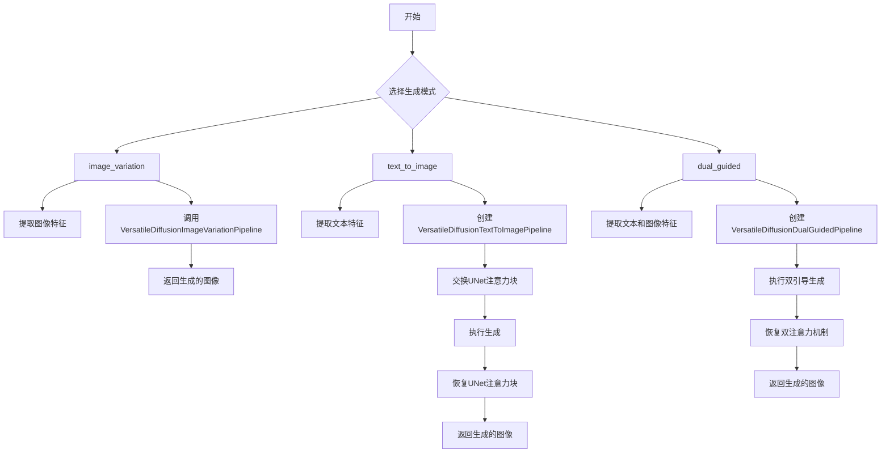
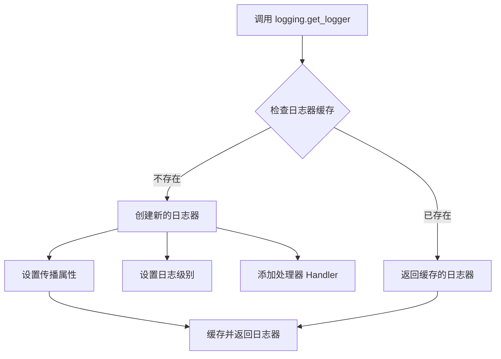
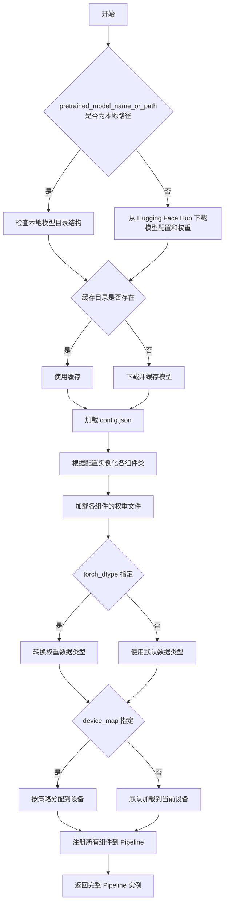
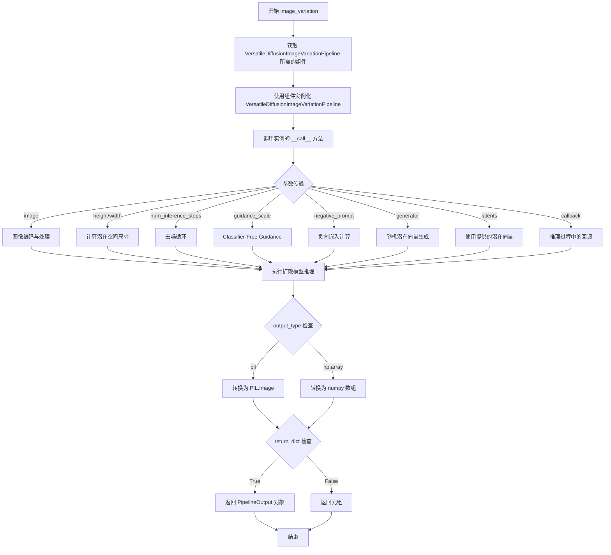
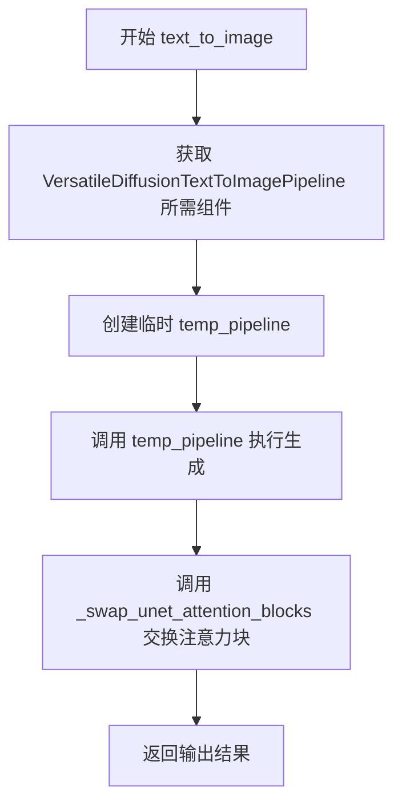
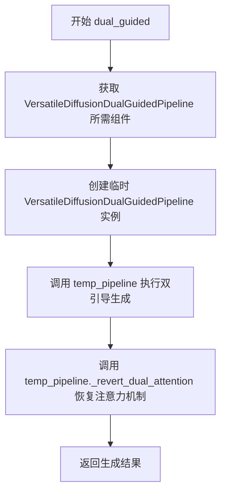
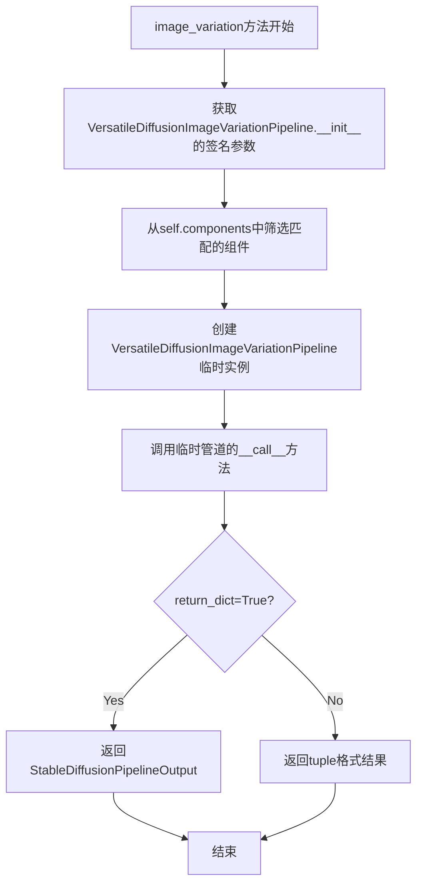
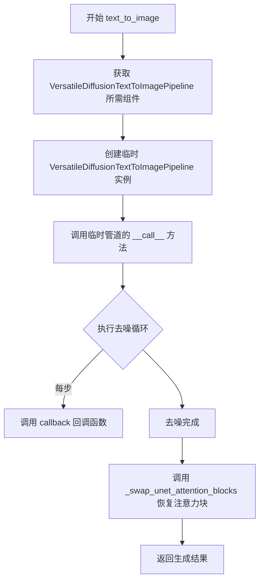
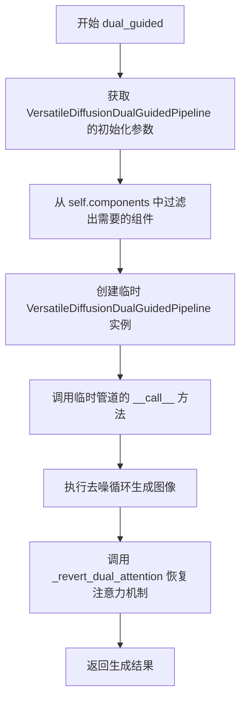

# `diffusers\src\diffusers\pipelines\deprecated\versatile_diffusion\pipeline_versatile_diffusion.py` 详细设计文档

VersatileDiffusionPipeline是一个多功能的扩散模型管道，支持文本到图像生成、图像变体生成和双引导生成三种模式。该管道集成了CLIP文本/图像编码器、图像和文本专用的UNet2DConditionModel以及VAE模型，通过调度器实现图像去噪生成过程。

## 整体流程



## 类结构

```
DiffusionPipeline (抽象基类)
└── VersatileDiffusionPipeline (主管道类)
    ├── VersatileDiffusionImageVariationPipeline (图像变体子管道)
    ├── VersatileDiffusionTextToImagePipeline (文本到图像子管道)
    └── VersatileDiffusionDualGuidedPipeline (双引导子管道)
```

## 全局变量及字段


### `logger`
    
用于记录管道运行日志的日志记录器

类型：`logging.Logger`
    


### `inspect`
    
Python内省模块，用于检查对象签名和属性

类型：`module`
    


### `torch`
    
PyTorch深度学习框架主模块

类型：`module`
    


### `PIL.Image`
    
Pillow图像处理库中的图像类

类型：`class`
    


### `VersatileDiffusionPipeline.tokenizer`
    
用于将文本输入转换为模型可处理的token序列

类型：`CLIPTokenizer`
    


### `VersatileDiffusionPipeline.image_feature_extractor`
    
从图像中提取CLIP特征用于图像编码和变体生成

类型：`CLIPImageProcessor`
    


### `VersatileDiffusionPipeline.text_encoder`
    
冻结的文本编码器，将文本提示编码为文本嵌入向量

类型：`CLIPTextModel`
    


### `VersatileDiffusionPipeline.image_encoder`
    
图像编码器模型，用于处理和编码图像输入

类型：`CLIPVisionModel`
    


### `VersatileDiffusionPipeline.image_unet`
    
图像条件去噪UNet，用于图像到图像的扩散过程

类型：`UNet2DConditionModel`
    


### `VersatileDiffusionPipeline.text_unet`
    
文本条件去噪UNet，用于文本到图像的扩散过程

类型：`UNet2DConditionModel`
    


### `VersatileDiffusionPipeline.vae`
    
变分自编码器，用于图像在潜空间的编码和解码

类型：`AutoencoderKL`
    


### `VersatileDiffusionPipeline.scheduler`
    
Karras扩散调度器，控制去噪过程中的噪声调度

类型：`KarrasDiffusionSchedulers`
    


### `VersatileDiffusionPipeline.vae_scale_factor`
    
VAE缩放因子，用于调整潜空间到像素空间的尺寸转换比例

类型：`int`
    
    

## 全局函数及方法


### `logging.get_logger`

获取与指定模块关联的日志记录器，用于在代码中记录日志信息。

参数：

- `name`：`str`，日志记录器的名称，通常使用 `__name__` 变量传入，以获取与当前模块对应的日志记录器

返回值：`logging.Logger`，返回对应的日志记录器实例

#### 流程图



#### 带注释源码

```python
# 从外部模块导入 logging 工具类
from ....utils import logging

# 获取当前模块的日志记录器
# __name__ 是 Python 内置变量，表示当前模块的完整路径
# 例如：'diffusers.pipelines.versatile_diffusion.pipeline_versatile_diffusion'
logger = logging.get_logger(__name__)  # pylint: disable=invalid-name

# 解释：
# 1. logging.get_logger() 是用于获取或创建日志记录器的工厂函数
# 2. 传入 __name__ 作为参数，使日志记录器与当前模块关联
# 3. 返回的 logger 对象用于记录不同级别的日志信息
# 4. 通常在模块级别声明，供整个模块使用
#
# 使用示例：
# logger.info("Starting pipeline initialization")
# logger.warning("Deprecated method called")
# logger.error("Failed to load model")
#
# 注意：pylint: disable=invalid-name 是为了禁用关于变量名 'logger' 的警告
```


### `DiffusionPipeline.from_pretrained`

`from_pretrained` 是一个类方法，继承自 `DiffusionPipeline` 基类，用于从预训练模型路径或 Hugging Face Hub 加载完整的扩散管道（包括文本编码器、VAE、UNet、调度器等组件）。

参数：

-  `pretrained_model_name_or_path`：`str` 或 `os.PathLike`，预训练模型的名称（如 "shi-labs/versatile-diffusion"）或本地路径
-  `torch_dtype`：`torch.dtype`，可选，指定模型加载的数据类型（如 `torch.float16` 用于 GPU 加速）
-  `cache_dir`：`str`，可选，用于缓存下载模型的目录路径
-  `use_safetensors`：`bool`，可选，是否使用 safetensors 格式加载模型权重
-  `device_map`：`str` 或 `dict`，可选，模型在多设备间的分配策略（如 "auto"）
-  `revision`：`str`，可选，模型版本号或提交哈希
-  `force_download`：`bool`，可选，是否强制重新下载模型
-  `proxies`：`dict`，可选，用于下载的代理服务器配置
-  `local_files_only`：`bool`，可选，是否仅使用本地缓存的文件
-  `token`：`str`，可选，用于访问私有模型的认证令牌
-  `**kwargs`：其他传递给组件加载器的关键字参数

返回值：`VersatileDiffusionPipeline`（继承自 DiffusionPipeline），返回已加载并配置好的完整扩散管道实例，包含所有模型组件（tokenizer、text_encoder、image_encoder、unet、vae、scheduler 等）

#### 流程图



#### 带注释源码

```python
# 这是 VersatileDiffusionPipeline 对 from_pretrained 的调用示例
# 该方法继承自 DiffusionPipeline 基类

# 使用示例 - 从 Hugging Face Hub 加载预训练模型
pipe = VersatileDiffusionPipeline.from_pretrained(
    "shi-labs/versatile-diffusion",  # 模型名称或本地路径
    torch_dtype=torch.float16,       # 使用半精度浮点数减少显存占用
)

# 可选：将模型移动到 CUDA 设备
pipe = pipe.to("cuda")

# 之后可以使用该 pipeline 进行各种生成任务
# 1. 文本到图像生成
image = pipe.text_to_image("an astronaut riding on a horse on mars").images[0]

# 2. 图像变体生成
image = pipe.image_variation(input_image).images[0]

# 3. 双重引导生成（文本+图像）
image = pipe.dual_guided(prompt=text, image=image).images[0]


# 父类 DiffusionPipeline.from_pretrained 的典型实现逻辑（概念性）
class DiffusionPipeline:
    @classmethod
    def from_pretrained(cls, pretrained_model_name_or_path, **kwargs):
        """
        从预训练模型加载完整的扩散管道
        
        加载流程：
        1. 解析模型路径或名称
        2. 加载模型配置文件 (config.json)
        3. 根据配置确定各组件类
        4. 逐个加载各组件的预训练权重
        5. 实例化各组件并注册到 pipeline
        6. 返回完整的 pipeline 实例
        """
        # 1. 加载配置
        config = cls.load_config(pretrained_model_name_or_path)
        
        # 2. 实例化各组件
        components = {}
        for component_name, component_class in config.components.items():
            components[component_name] = component_class.from_pretrained(...)
        
        # 3. 创建 pipeline 实例
        pipeline = cls(**components)
        
        return pipeline
```

#### 关键组件信息

| 组件名称 | 描述 |
|---------|------|
| `tokenizer` | CLIPTokenizer，用于将文本 prompt 转换为 token IDs |
| `text_encoder` | CLIPTextModel，冻结的文本编码器，将 token 转换为文本嵌入 |
| `image_encoder` | CLIPVisionModel，图像编码器，用于提取图像特征 |
| `image_unet` | UNet2DConditionModel，图像去噪 UNet（用于图像变体） |
| `text_unet` | UNet2DConditionModel，文本到图像去噪 UNet |
| `vae` | AutoencoderKL，变分自编码器，用于图像与潜在表示的编码/解码 |
| `scheduler` | KarrasDiffusionSchedulers，扩散调度器，控制去噪过程 |

#### 潜在技术债务

1. **组件动态加载开销**：使用 `inspect.signature` 动态获取期望组件，可能带来运行时开销
2. **临时 Pipeline 创建**：在 `text_to_image` 和 `dual_guided` 方法中创建临时 Pipeline 实例，完成后未显式释放资源
3. **注意力块交换**：`_swap_unet_attention_blocks()` 和 `_revert_dual_attention()` 操作可能存在状态不一致风险
4. **类型注解兼容性**：使用 `|` 联合类型语法（Python 3.10+），可能与旧版本 Python 不兼容
5. **硬编码的 VAE 缩放因子**：`vae_scale_factor` 计算逻辑依赖于 VAE 组件存在，若组件被替换可能出错


### `VersatileDiffusionPipeline.__init__`

这是 VersatileDiffusionPipeline 类的初始化方法，继承自 DiffusionPipeline 基类。该方法接收多个核心模型组件（分词器、图像特征提取器、文本编码器、图像编码器、图像UNet、文本UNet、VAE和调度器），通过 `register_modules` 方法将这些组件注册到 pipeline 中，并计算 VAE 的缩放因子。

参数：

- `tokenizer`：`CLIPTokenizer`，用于将文本输入转换为模型可处理的 token 序列
- `image_feature_extractor`：`CLIPImageProcessor`，用于从图像中提取特征作为输入
- `text_encoder`：`CLIPTextModel`，冻结的文本编码器模型，将文本转换为向量表示
- `image_encoder`：`CLIPVisionModel`，图像编码器模型，用于处理图像输入
- `image_unet`：`UNet2DConditionModel`，图像条件去噪 UNet 模型，用于图像变体生成
- `text_unet`：`UNet2DConditionModel`，文本条件去噪 UNet 模型，用于文本到图像生成
- `vae`：`AutoencoderKL`，变分自编码器模型，用于在潜在空间和像素空间之间进行图像编码和解码
- `scheduler`：`KarrasDiffusionSchedulers`，Karras 扩散调度器，用于控制去噪过程的噪声调度

返回值：无（`None`），`__init__` 方法不返回值，仅用于对象初始化

#### 流程图

```mermaid
flowchart TD
    A[开始 __init__] --> B[调用 super().__init__]
    B --> C[调用 self.register_modules 注册所有组件]
    C --> D{检查 vae 是否存在}
    D -->|是| E[计算 vae_scale_factor = 2^(len(vae.config.block_out_channels) - 1)]
    D -->|否| F[设置 vae_scale_factor = 8]
    E --> G[结束]
    F --> G
```

#### 带注释源码

```python
def __init__(
    self,
    tokenizer: CLIPTokenizer,
    image_feature_extractor: CLIPImageProcessor,
    text_encoder: CLIPTextModel,
    image_encoder: CLIPVisionModel,
    image_unet: UNet2DConditionModel,
    text_unet: UNet2DConditionModel,
    vae: AutoencoderKL,
    scheduler: KarrasDiffusionSchedulers,
):
    """
    初始化 VersatileDiffusionPipeline 实例
    
    参数:
        tokenizer: CLIP 分词器
        image_feature_extractor: CLIP 图像特征提取器
        text_encoder: CLIP 文本编码器
        image_encoder: CLIP 视觉编码器
        image_unet: 图像去噪 UNet 模型
        text_unet: 文本到图像 UNet 模型
        vae: 变分自编码器
        scheduler: Karras 扩散调度器
    """
    # 调用父类 DiffusionPipeline 的初始化方法
    # 父类会初始化一些基础属性如 components 字典等
    super().__init__()

    # 使用 register_modules 方法注册所有模型组件
    # 这些组件会被存储在 self.components 字典中供后续方法使用
    self.register_modules(
        tokenizer=tokenizer,
        image_feature_extractor=image_feature_extractor,
        text_encoder=text_encoder,
        image_encoder=image_encoder,
        image_unet=image_unet,
        text_unet=text_unet,
        vae=vae,
        scheduler=scheduler,
    )
    
    # 计算 VAE 缩放因子，用于潜在空间到像素空间的转换
    # 基于 VAE 的 block_out_channels 配置计算
    # 默认值为 8，如果 VAE 不存在则使用默认值
    self.vae_scale_factor = 2 ** (len(self.vae.config.block_out_channels) - 1) if getattr(self, "vae", None) else 8
```


### VersatileDiffusionPipeline.image_variation

该方法是 VersatileDiffusionPipeline 类的核心成员，负责根据输入图像生成图像变体（Image Variation）。它通过动态实例化 VersatileDiffusionImageVariationPipeline 并传递相应参数来实现图像到图像的生成任务，支持自定义推理步数、引导尺度、负提示词等高级控制选项。

参数：

- `image`：`torch.Tensor | PIL.Image.Image`，输入的图像提示符，用于指导图像生成，可以是单张图像或图像列表
- `height`：`int | None`，生成图像的高度（像素），默认为 `self.image_unet.config.sample_size * self.vae_scale_factor`
- `width`：`int | None`，生成图像的宽度（像素），默认为 `self.image_unet.config.sample_size * self.vae_scale_factor`
- `num_inference_steps`：`int`，去噪步数，默认为 50，步数越多通常图像质量越高但推理速度越慢
- `guidance_scale`：`float`，引导尺度，默认为 7.5，数值越大生成的图像与提示词越相关但质量可能下降
- `negative_prompt`：`str | list[str] | None`，负向提示词，用于指定不希望出现在生成图像中的内容
- `num_images_per_prompt`：`int`，每个提示词生成的图像数量，默认为 1
- `eta`：`float`，DDIM 论文中的 eta 参数，仅适用于 DDIMScheduler，默认为 0.0
- `generator`：`torch.Generator | list[torch.Generator] | None`，用于确保生成确定性的随机数生成器
- `latents`：`torch.Tensor | None`，预生成的噪声潜在向量，可用于通过不同提示词微调相同生成
- `output_type`：`str`，生成图像的输出格式，可选 "pil" 或 "np.array"，默认为 "pil"
- `return_dict`：`bool`，是否返回 PipelineOutput 对象而非元组，默认为 True
- `callback`：`Callable[[int, int, torch.Tensor], None] | None`，每 `callback_steps` 步调用的回调函数
- `callback_steps`：`int`，回调函数被调用的频率，默认为 1

返回值：`VersatileDiffusionImageVariationPipeline 的返回类型`，当 `return_dict=True` 时返回包含生成图像和 NSFW 标志的 PipelineOutput 对象，否则返回元组

#### 流程图



#### 带注释源码

```python
@torch.no_grad()
def image_variation(
    self,
    image: torch.Tensor | PIL.Image.Image,
    height: int | None = None,
    width: int | None = None,
    num_inference_steps: int = 50,
    guidance_scale: float = 7.5,
    negative_prompt: str | list[str] | None = None,
    num_images_per_prompt: int | None = 1,
    eta: float = 0.0,
    generator: torch.Generator | list[torch.Generator] | None = None,
    latents: torch.Tensor | None = None,
    output_type: str | None = "pil",
    return_dict: bool = True,
    callback: Callable[[int, int, torch.Tensor], None] | None = None,
    callback_steps: int = 1,
):
    r"""
    The call function to the pipeline for generation.

    Args:
        image (`PIL.Image.Image`, `list[PIL.Image.Image]` or `torch.Tensor`):
            The image prompt or prompts to guide the image generation.
        height (`int`, *optional*, defaults to `self.image_unet.config.sample_size * self.vae_scale_factor`):
            The height in pixels of the generated image.
        width (`int`, *optional*, defaults to `self.image_unet.config.sample_size * self.vae_scale_factor`):
            The width in pixels of the generated image.
        num_inference_steps (`int`, *optional*, defaults to 50):
            The number of denoising steps. More denoising steps usually lead to a higher quality image at the
            expense of slower inference.
        guidance_scale (`float`, *optional*, defaults to 7.5):
            A higher guidance scale value encourages the model to generate images closely linked to the text
            `prompt` at the expense of lower image quality. Guidance scale is enabled when `guidance_scale > 1`.
        negative_prompt (`str` or `list[str]`, *optional*):
            The prompt or prompts to guide what to not include in image generation. If not defined, you need to
            pass `negative_prompt_embeds` instead. Ignored when not using guidance (`guidance_scale < 1`).
        num_images_per_prompt (`int`, *optional*, defaults to 1):
            The number of images to generate per prompt.
        eta (`float`, *optional*, defaults to 0.0):
            Corresponds to parameter eta (η) from the [DDIM](https://huggingface.co/papers/2010.02502) paper. Only
            applies to the [`~schedulers.DDIMScheduler`], and is ignored in other schedulers.
        generator (`torch.Generator`, *optional*):
            A [`torch.Generator`](https://pytorch.org/docs/stable/generated/torch.Generator.html) to make
            generation deterministic.
        latents (`torch.Tensor`, *optional*):
            Pre-generated noisy latents sampled from a Gaussian distribution, to be used as inputs for image
            generation. Can be used to tweak the same generation with different prompts. If not provided, a latents
            tensor is generated by sampling using the supplied random `generator`.
        output_type (`str`, *optional*, defaults to `"pil"`):
            The output format of the generated image. Choose between `PIL.Image` or `np.array`.
        return_dict (`bool`, *optional*, defaults to `True`):
            Whether or not to return a [`~pipelines.stable_diffusion.StableDiffusionPipelineOutput`] instead of a
            plain tuple.
        callback (`Callable`, *optional*):
            A function that calls every `callback_steps` steps during inference. The function is called with the
            following arguments: `callback(step: int, timestep: int, latents: torch.Tensor)`.
        callback_steps (`int`, *optional*, defaults to 1):
            The frequency at which the `callback` function is called. If not specified, the callback is called at
            every step.

    Examples:

    ```py
    >>> from diffusers import VersatileDiffusionPipeline
    >>> import torch
    >>> import requests
    >>> from io import BytesIO
    >>> from PIL import Image

    >>> # let's download an initial image
    >>> url = "https://huggingface.co/datasets/diffusers/images/resolve/main/benz.jpg"

    >>> response = requests.get(url)
    >>> image = Image.open(BytesIO(response.content)).convert("RGB")

    >>> pipe = VersatileDiffusionPipeline.from_pretrained(
    ...     "shi-labs/versatile-diffusion", torch_dtype=torch.float16
    ... )
    >>> pipe = pipe.to("cuda")

    >>> generator = torch.Generator(device="cuda").manual_seed(0)
    >>> image = pipe.image_variation(image, generator=generator).images[0]
    >>> image.save("./car_variation.png")
    ```

    Returns:
        [`~pipelines.stable_diffusion.StableDiffusionPipelineOutput`] or `tuple`:
            If `return_dict` is `True`, [`~pipelines.stable_diffusion.StableDiffusionPipelineOutput`] is returned,
            otherwise a `tuple` is returned where the first element is a list with the generated images and the
            second element is a list of `bool`s indicating whether the corresponding generated image contains
            "not-safe-for-work" (nsfw) content.
    """
    # 通过 inspect 获取 VersatileDiffusionImageVariationPipeline 构造函数所需参数
    expected_components = inspect.signature(VersatileDiffusionImageVariationPipeline.__init__).parameters.keys()
    # 从当前 pipeline 的组件中筛选出目标 pipeline 需要的组件
    components = {name: component for name, component in self.components.items() if name in expected_components}
    # 创建临时的图像变体 pipeline 实例
    return VersatileDiffusionImageVariationPipeline(**components)(
        image=image,
        height=height,
        width=width,
        num_inference_steps=num_inference_steps,
        guidance_scale=guidance_scale,
        negative_prompt=negative_prompt,
        num_images_per_prompt=num_images_per_prompt,
        eta=eta,
        generator=generator,
        latents=latents,
        output_type=output_type,
        return_dict=return_dict,
        callback=callback,
        callback_steps=callback_steps,
    )
```


### VersatileDiffusionPipeline.text_to_image

该方法是一个文本到图像生成的核心方法，通过创建临时管道并动态传递参数来实现文本到图像的转换。该方法利用 VersatileDiffusionTextToImagePipeline 管道执行实际的生成逻辑，并在生成完成后通过交换注意力块来完成任务。

参数：

- `prompt`：`str | list[str]`，用于引导图像生成的文本提示词
- `height`：`int | None`，生成图像的高度（像素），默认为 `self.image_unet.config.sample_size * self.vae_scale_factor`
- `width`：`int | None`，生成图像的宽度（像素），默认为 `self.image_unet.config.sample_size * self.vae_scale_factor`
- `num_inference_steps`：`int`，去噪步数，默认值为 50，步数越多通常图像质量越高但推理速度越慢
- `guidance_scale`：`float`，引导比例，默认值为 7.5，较高的值会使生成的图像更贴近文本提示
- `negative_prompt`：`str | list[str] | None`，用于引导不包含内容的负面提示词
- `num_images_per_prompt`：`int | None`，每个提示词生成的图像数量，默认值为 1
- `eta`：`float`，DDIM 论文中的 eta 参数，仅适用于 DDIMScheduler，默认值为 0.0
- `generator`：`torch.Generator | list[torch.Generator] | None`，用于使生成过程确定性的随机数生成器
- `latents`：`torch.Tensor | None`，预生成的噪声潜在向量，用于图像生成调试和微调
- `output_type`：`str | None`，生成图像的输出格式，默认为 "pil"，可选 "pil" 或 "np.array"
- `return_dict`：`bool`，是否返回管道输出对象而非元组，默认值为 True
- `callback`：`Callable[[int, int, torch.Tensor], None] | None`，每一步调用的回调函数
- `callback_steps`：`int`，回调函数被调用的频率，默认值为 1

返回值：`~pipelines.stable_diffusion.StableDiffusionPipelineOutput` 或 `tuple`，如果 return_dict 为 True 返回 StableDiffusionPipelineOutput，否则返回包含生成图像列表和 NSFW 检测布尔值的元组

#### 流程图



#### 带注释源码

```python
@torch.no_grad()
def text_to_image(
    self,
    prompt: str | list[str],
    height: int | None = None,
    width: int | None = None,
    num_inference_steps: int = 50,
    guidance_scale: float = 7.5,
    negative_prompt: str | list[str] | None = None,
    num_images_per_prompt: int | None = 1,
    eta: float = 0.0,
    generator: torch.Generator | list[torch.Generator] | None = None,
    latents: torch.Tensor | None = None,
    output_type: str | None = "pil",
    return_dict: bool = True,
    callback: Callable[[int, int, torch.Tensor], None] | None = None,
    callback_steps: int = 1,
):
    r"""
    The call function to the pipeline for generation.

    Args:
        prompt (`str` or `list[str]`):
            The prompt or prompts to guide image generation.
        height (`int`, *optional*, defaults to `self.image_unet.config.sample_size * self.vae_scale_factor`):
            The height in pixels of the generated image.
        width (`int`, *optional*, defaults to `self.image_unet.config.sample_size * self.vae_scale_factor`):
            The width in pixels of the generated image.
        num_inference_steps (`int`, *optional*, defaults to 50):
            The number of denoising steps. More denoising steps usually lead to a higher quality image at the
            expense of slower inference.
        guidance_scale (`float`, *optional*, defaults to 7.5):
            A higher guidance scale value encourages the model to generate images closely linked to the text
            `prompt` at the expense of lower image quality. Guidance scale is enabled when `guidance_scale > 1`.
        negative_prompt (`str` or `list[str]`, *optional*):
            The prompt or prompts to guide what to not include in image generation. If not defined, you need to
            pass `negative_prompt_embeds` instead. Ignored when not using guidance (`guidance_scale < 1`).
        num_images_per_prompt (`int`, *optional*, defaults to 1):
            The number of images to generate per prompt.
        eta (`float`, *optional*, defaults to 0.0):
            Corresponds to parameter eta (η) from the [DDIM](https://huggingface.co/papers/2010.02502) paper. Only
            applies to the [`~schedulers.DDIMScheduler`], and is ignored in other schedulers.
        generator (`torch.Generator`, *optional*):
            A [`torch.Generator`](https://pytorch.org/docs/stable/generated/torch.Generator.html) to make
            generation deterministic.
        latents (`torch.Tensor`, *optional*):
            Pre-generated noisy latents sampled from a Gaussian distribution, to be used as inputs for image
            generation. Can be used to tweak the same generation with different prompts. If not provided, a latents
            tensor is generated by sampling using the supplied random `generator`.
        output_type (`str`, *optional*, defaults to `"pil"`):
            The output format of the generated image. Choose between `PIL.Image` or `np.array`.
        return_dict (`bool`, *optional*, defaults to `True`):
            Whether or not to return a [`~pipelines.stable_diffusion.StableDiffusionPipelineOutput`] instead of a
            plain tuple.
        callback (`Callable`, *optional*):
            A function that calls every `callback_steps` steps during inference. The function is called with the
            following arguments: `callback(step: int, timestep: int, latents: torch.Tensor)`.
        callback_steps (`int`, *optional*, defaults to 1):
            The frequency at which the `callback` function is called. If not specified, the callback is called at
            every step.

    Examples:

    ```py
    >>> from diffusers import VersatileDiffusionPipeline
    >>> import torch

    >>> pipe = VersatileDiffusionPipeline.from_pretrained(
    ...     "shi-labs/versatile-diffusion", torch_dtype=torch.float16
    ... )
    >>> pipe = pipe.to("cuda")

    >>> generator = torch.Generator(device="cuda").manual_seed(0)
    >>> image = pipe.text_to_image("an astronaut riding on a horse on mars", generator=generator).images[0]
    >>> image.save("./astronaut.png")
    ```

    Returns:
        [`~pipelines.stable_diffusion.StableDiffusionPipelineOutput`] or `tuple`:
            If `return_dict` is `True`, [`~pipelines.stable_diffusion.StableDiffusionPipelineOutput`] is returned,
            otherwise a `tuple` is returned where the first element is a list with the generated images and the
            second element is a list of `bool`s indicating whether the corresponding generated image contains
            "not-safe-for-work" (nsfw) content.
    """
    # 获取 VersatileDiffusionTextToImagePipeline 构造函数期望的参数名称
    expected_components = inspect.signature(VersatileDiffusionTextToImagePipeline.__init__).parameters.keys()
    # 从当前管道的组件中筛选出期望的组件
    components = {name: component for name, component in self.components.items() if name in expected_components}
    # 使用筛选出的组件创建临时管道实例
    temp_pipeline = VersatileDiffusionTextToImagePipeline(**components)
    # 调用临时管道执行文本到图像生成
    output = temp_pipeline(
        prompt=prompt,
        height=height,
        width=width,
        num_inference_steps=num_inference_steps,
        guidance_scale=guidance_scale,
        negative_prompt=negative_prompt,
        num_images_per_prompt=num_images_per_prompt,
        eta=eta,
        generator=generator,
        latents=latents,
        output_type=output_type,
        return_dict=return_dict,
        callback=callback,
        callback_steps=callback_steps,
    )
    # 交换注意力块回到原始状态
    temp_pipeline._swap_unet_attention_blocks()

    return output
```


### VersatileDiffusionPipeline.dual_guided

该方法是 VersatileDiffusionPipeline 类的双引导生成方法，通过同时使用文本提示和图像提示来引导图像生成，实现文本和图像的联合引导扩散生成。

参数：

- `prompt`：`PIL.Image.Image | list[PIL.Image.Image]`，图像提示或提示列表，用于引导图像生成
- `image`：`str | list[str]`，图像路径或路径列表
- `text_to_image_strength`：`float`，文本到图像的引导强度，默认为 0.5
- `height`：`int | None`，生成图像的高度，默认为 `self.image_unet.config.sample_size * self.vae_scale_factor`
- `width`：`int | None`，生成图像的宽度，默认为 `self.image_unet.config.sample_size * self.vae_scale_factor`
- `num_inference_steps`：`int`，去噪步数，默认为 50
- `guidance_scale`：`float`，引导比例，默认为 7.5
- `num_images_per_prompt`：`int | None`，每个提示生成的图像数量，默认为 1
- `eta`：`float`，DDIM 论文中的 eta 参数，默认为 0.0
- `generator`：`torch.Generator | list[torch.Generator] | None`，随机生成器，用于确保生成的可重复性
- `latents`：`torch.Tensor | None`，预生成的噪声潜在向量，可用于控制生成
- `output_type`：`str | None`，输出格式，默认为 "pil"
- `return_dict`：`bool`，是否返回字典格式，默认为 True
- `callback`：`Callable[[int, int, torch.Tensor], None] | None`，推理过程中的回调函数
- `callback_steps`：`int`，回调函数调用频率，默认为 1

返回值：`ImagePipelineOutput` 或 `tuple`，如果 `return_dict` 为 True，返回 `ImagePipelineOutput`，否则返回元组，第一个元素是生成的图像列表

#### 流程图



#### 带注释源码

```python
@torch.no_grad()
def dual_guided(
    self,
    prompt: PIL.Image.Image | list[PIL.Image.Image],
    image: str | list[str],
    text_to_image_strength: float = 0.5,
    height: int | None = None,
    width: int | None = None,
    num_inference_steps: int = 50,
    guidance_scale: float = 7.5,
    num_images_per_prompt: int | None = 1,
    eta: float = 0.0,
    generator: torch.Generator | list[torch.Generator] | None = None,
    latents: torch.Tensor | None = None,
    output_type: str | None = "pil",
    return_dict: bool = True,
    callback: Callable[[int, int, torch.Tensor], None] | None = None,
    callback_steps: int = 1,
):
    # 使用 inspect 获取 VersatileDiffusionDualGuidedPipeline 构造函数所需的参数
    expected_components = inspect.signature(VersatileDiffusionDualGuidedPipeline.__init__).parameters.keys()
    # 从当前 pipeline 的组件中筛选出需要的组件
    components = {name: component for name, component in self.components.items() if name in expected_components}
    # 创建临时的双引导 pipeline 实例
    temp_pipeline = VersatileDiffusionDualGuidedPipeline(**components)
    # 调用双引导 pipeline 执行生成
    output = temp_pipeline(
        prompt=prompt,
        image=image,
        text_to_image_strength=text_to_image_strength,
        height=height,
        width=width,
        num_inference_steps=num_inference_steps,
        guidance_scale=guidance_scale,
        num_images_per_prompt=num_images_per_prompt,
        eta=eta,
        generator=generator,
        latents=latents,
        output_type=output_type,
        return_dict=return_dict,
        callback=callback,
        callback_steps=callback_steps,
    )
    # 恢复原始的注意力块配置
    temp_pipeline._revert_dual_attention()

    return output
```


### `VersatileDiffusionPipeline.__init__`

初始化 VersatileDiffusionPipeline 管道，接收所有必要的模型组件（tokenizer、text_encoder、image_encoder、unet、vae、scheduler 等），通过 `register_modules` 方法注册这些组件，并计算 VAE 的缩放因子。

参数：

- `tokenizer`：`CLIPTokenizer`，用于将文本编码为token
- `image_feature_extractor`：`CLIPImageProcessor`，用于从生成的图像中提取特征
- `text_encoder`：`CLIPTextModel`，冻结的文本编码器，用于将文本转换为embedding
- `image_encoder`：`CLIPVisionModel`，图像编码器，用于处理图像输入
- `image_unet`：`UNet2DConditionModel`，用于对图像latents进行去噪的UNet模型
- `text_unet`：`UNet2DConditionModel`，用于对文本生成的latents进行去噪的UNet模型
- `vae`：`AutoencoderKL`，变分自编码器，用于在latent表示和图像之间进行编码和解码
- `scheduler`：`KarrasDiffusionSchedulers`，与unet结合使用的调度器，用于对编码的图像latents进行去噪

返回值：`None`，构造函数不返回值

#### 流程图

```mermaid
flowchart TD
    A[开始 __init__] --> B[调用父类 DiffusionPipeline.__init__]
    B --> C[调用 self.register_modules 注册所有组件]
    C --> D[检查 vae 是否存在并计算 vae_scale_factor]
    D --> E[vae_scale_factor = 2^(len(vae.config.block_out_channels) - 1)]
    E --> F[结束]
    
    C --> C1[tokenizer]
    C --> C2[image_feature_extractor]
    C --> C3[text_encoder]
    C --> C4[image_encoder]
    C --> C5[image_unet]
    C --> C6[text_unet]
    C --> C7[vae]
    C --> C8[scheduler]
```

#### 带注释源码

```python
def __init__(
    self,
    tokenizer: CLIPTokenizer,
    image_feature_extractor: CLIPImageProcessor,
    text_encoder: CLIPTextModel,
    image_encoder: CLIPVisionModel,
    image_unet: UNet2DConditionModel,
    text_unet: UNet2DConditionModel,
    vae: AutoencoderKL,
    scheduler: KarrasDiffusionSchedulers,
):
    """
    初始化 VersatileDiffusionPipeline 管道组件
    
    参数:
        tokenizer: CLIP分词器，用于将文本转换为token
        image_feature_extractor: CLIP图像处理器，用于提取图像特征
        text_encoder: CLIP文本编码器，将文本编码为向量表示
        image_encoder: CLIP视觉编码器，处理图像输入
        image_unet: 图像条件UNet2D模型，用于去噪图像latent
        text_unet: 文本条件UNet2D模型，用于去噪文本生成的latent
        vae: 变分自编码器，用于图像和latent之间的转换
        scheduler: Karras扩散调度器，控制去噪过程的噪声调度
    """
    # 调用父类DiffusionPipeline的初始化方法
    super().__init__()

    # 使用register_modules方法注册所有模块组件
    # 这些组件会被存储在self.components字典中供后续使用
    self.register_modules(
        tokenizer=tokenizer,
        image_feature_extractor=image_feature_extractor,
        text_encoder=text_encoder,
        image_encoder=image_encoder,
        image_unet=image_unet,
        text_unet=text_unet,
        vae=vae,
        scheduler=scheduler,
    )
    
    # 计算VAE缩放因子，用于将像素空间转换为latent空间
    # 基于VAE的block_out_channels计算下采样的倍数
    # 例如：如果block_out_channels为[128, 256, 512, 512]，则scale_factor为8
    self.vae_scale_factor = 2 ** (len(self.vae.config.block_out_channels) - 1) if getattr(self, "vae", None) else 8
```


### `VersatileDiffusionPipeline.image_variation`

该方法是VersatileDiffusionPipeline类中的图像变体生成核心方法，通过接收输入图像作为引导，利用预训练的VersatileDiffusion模型（包括VAE、Image UNet、Image Encoder等组件）进行去噪推理，生成与输入图像风格或内容相关的新变体图像。该方法内部委托给专门的`VersatileDiffusionImageVariationPipeline`来执行实际的去噪扩散过程。

参数：

- `image`：`torch.Tensor | PIL.Image.Image`，输入图像prompt，用于引导图像生成
- `height`：`int | None`，生成图像的高度像素值，默认为`self.image_unet.config.sample_size * self.vae_scale_factor`
- `width`：`int | None`，生成图像的宽度像素值，默认为`self.image_unet.config.sample_size * self.vae_scale_factor`
- `num_inference_steps`：`int`，去噪步骤数量，默认为50，步数越多通常图像质量越高但推理速度越慢
- `guidance_scale`：`float`，引导比例，默认为7.5，用于控制生成图像与输入图像的关联度
- `negative_prompt`：`str | list[str] | None`，负面prompt，用于指定生成时需要避免的内容
- `num_images_per_prompt`：`int | None`，每个prompt生成的图像数量，默认为1
- `eta`：`float`，DDIM论文中的eta参数，默认为0.0，仅适用于DDIMScheduler
- `generator`：`torch.Generator | list[torch.Generator] | None`，PyTorch随机生成器，用于确保生成的可重复性
- `latents`：`torch.Tensor | None`，预生成的噪声latents，可用于微调相同生成过程中的不同prompt
- `output_type`：`str | None`，生成图像的输出格式，默认为"pil"，可选PIL.Image或np.array
- `return_dict`：`bool`，是否返回字典格式的结果，默认为True
- `callback`：`Callable[[int, int, torch.Tensor], None] | None`，每步推理调用的回调函数
- `callback_steps`：`int`，回调函数被调用的频率，默认为每步都调用

返回值：`StableDiffusionPipelineOutput | tuple`，当`return_dict=True`时返回包含生成图像列表和NSFW标志列表的管道输出对象，否则返回元组

#### 流程图



#### 带注释源码

```python
@torch.no_grad()  # 装饰器：禁用梯度计算以节省内存
def image_variation(
    self,
    image: torch.Tensor | PIL.Image.Image,  # 输入图像：PIL图像或PyTorch张量
    height: int | None = None,  # 输出图像高度，默认由模型配置决定
    width: int | None = None,  # 输出图像宽度，默认由模型配置决定
    num_inference_steps: int = 50,  # 去噪推理步数
    guidance_scale: float = 7.5,  # CFG引导强度
    negative_prompt: str | list[str] | None = None,  # 负面提示词
    num_images_per_prompt: int | None = 1,  # 每个输入生成的图像数量
    eta: float = 0.0,  # DDIM scheduler的eta参数
    generator: torch.Generator | list[torch.Generator] | None = None,  # 随机数生成器
    latents: torch.Tensor | None = None,  # 预计算的噪声latents
    output_type: str | None = "pil",  # 输出格式：'pil'或'np'
    return_dict: bool = True,  # 是否返回字典对象
    callback: Callable[[int, int, torch.Tensor], None] | None = None,  # 推理进度回调
    callback_steps: int = 1,  # 回调调用频率
):
    r"""
    Pipeline for image variation generation.
    
    This method creates variations of the input image using the 
    VersatileDiffusion image variation pipeline.
    
    Args:
        image: The image prompt to guide the image generation
        height: Height in pixels of the generated image
        width: Width in pixels of the generated image
        num_inference_steps: Number of denoising steps
        guidance_scale: Guidance scale for classifier-free guidance
        negative_prompt: Prompt to guide what to NOT include
        num_images_per_prompt: Number of images to generate per prompt
        eta: DDIM eta parameter
        generator: Random generator for reproducibility
        latents: Pre-generated noisy latents
        output_type: Output format ('pil' or 'np')
        return_dict: Whether to return a dict or tuple
        callback: Callback function for progress
        callback_steps: Frequency of callback calls
    
    Returns:
        StableDiffusionPipelineOutput or tuple with images and nsfw flags
    """
    # 使用inspect模块获取目标pipeline构造函数需要的参数列表
    expected_components = inspect.signature(VersatileDiffusionImageVariationPipeline.__init__).parameters.keys()
    
    # 从当前pipeline的components字典中过滤出目标pipeline需要的组件
    components = {name: component for name, component in self.components.items() if name in expected_components}
    
    # 创建临时专用pipeline实例并调用执行推理
    return VersatileDiffusionImageVariationPipeline(**components)(
        image=image,
        height=height,
        width=width,
        num_inference_steps=num_inference_steps,
        guidance_scale=guidance_scale,
        negative_prompt=negative_prompt,
        num_images_per_prompt=num_images_per_prompt,
        eta=eta,
        generator=generator,
        latents=latents,
        output_type=output_type,
        return_dict=return_dict,
        callback=callback,
        callback_steps=callback_steps,
    )
```


### `VersatileDiffusionPipeline.text_to_image`

该方法是 VersatileDiffusionPipeline 类的核心文本到图像生成方法，通过委托给内部创建的 VersatileDiffusionTextToImagePipeline 临时管道来执行实际的图像生成过程，并在一系列降噪步骤后将文本提示转换为对应的图像。

参数：

- `prompt`：`str | list[str]`，用于指导图像生成的文本提示
- `height`：`int | None`，生成图像的高度（像素），默认值为 `self.image_unet.config.sample_size * self.vae_scale_factor`
- `width`：`int | None`，生成图像的宽度（像素），默认值为 `self.image_unet.config.sample_size * self.vae_scale_factor`
- `num_inference_steps`：`int`，去噪步数，默认值为 50，步数越多通常图像质量越高但推理速度越慢
- `guidance_scale`：`float`，引导比例，默认值为 7.5，用于控制生成图像与文本提示的关联度
- `negative_prompt`：`str | list[str] | None`，用于指导图像生成过程中应避免包含的内容
- `num_images_per_prompt`：`int | None`，每个提示生成的图像数量，默认值为 1
- `eta`：`float`，DDIM 调度器的 eta 参数，默认值为 0.0
- `generator`：`torch.Generator | list[torch.Generator] | None`，用于生成确定性结果的随机数生成器
- `latents`：`torch.Tensor | None`，预生成的噪声潜在向量，用于图像生成
- `output_type`：`str | None`，生成图像的输出格式，默认为 "pil"
- `return_dict`：`bool`，是否返回包含生成图像和 NSFW 标志的字典，默认值为 True
- `callback`：`Callable[[int, int, torch.Tensor], None] | None`，每步推理调用的回调函数
- `callback_steps`：`int`，回调函数被调用的频率，默认值为 1

返回值：`StableDiffusionPipelineOutput | tuple`，当 `return_dict=True` 时返回 `StableDiffusionPipelineOutput` 对象（包含图像列表和 NSFW 标志列表），否则返回元组

#### 流程图



#### 带注释源码

```python
@torch.no_grad()  # 禁用梯度计算以节省显存
def text_to_image(
    self,
    prompt: str | list[str],  # 文本提示，可以是单个字符串或字符串列表
    height: int | None = None,  # 生成图像的高度
    width: int | None = None,  # 生成图像的宽度
    num_inference_steps: int = 50,  # 去噪步数
    guidance_scale: float = 7.5,  # 引导比例
    negative_prompt: str | list[str] | None = None,  # 负面提示
    num_images_per_prompt: int | None = 1,  # 每个提示生成的图像数
    eta: float = 0.0,  # DDIM 调度器参数
    generator: torch.Generator | list[torch.Generator] | None = None,  # 随机生成器
    latents: torch.Tensor | None = None,  # 预定义潜在向量
    output_type: str | None = "pil",  # 输出格式
    return_dict: bool = True,  # 是否返回字典格式
    callback: Callable[[int, int, torch.Tensor], None] | None = None,  # 回调函数
    callback_steps: int = 1,  # 回调频率
):
    # 使用 inspect 获取目标管道初始化方法所需的参数
    expected_components = inspect.signature(VersatileDiffusionTextToImagePipeline.__init__).parameters.keys()
    # 从组件字典中筛选出目标管道需要的组件
    components = {name: component for name, component in self.components.items() if name in expected_components}
    # 创建临时管道实例
    temp_pipeline = VersatileDiffusionTextToImagePipeline(**components)
    # 调用临时管道的生成方法
    output = temp_pipeline(
        prompt=prompt,
        height=height,
        width=width,
        num_inference_steps=num_inference_steps,
        guidance_scale=guidance_scale,
        negative_prompt=negative_prompt,
        num_images_per_prompt=num_images_per_prompt,
        eta=eta,
        generator=generator,
        latents=latents,
        output_type=output_type,
        return_dict=return_dict,
        callback=callback,
        callback_steps=callback_steps,
    )
    # 将注意力块恢复到原始状态
    temp_pipeline._swap_unet_attention_blocks()
    # 返回生成结果
    return output
```


### VersatileDiffusionPipeline.dual_guided

双引导生成方法（Dual Guided Generation Method），通过同时使用文本提示和图像提示进行图像生成，实现文本到图像和图像变体的双重引导功能。

参数：

- `prompt`：`PIL.Image.Image | list[PIL.Image.Image]`，用于引导图像生成的图像提示（注意：虽然参数名为 prompt，但实际传入的是图像类型，根据文档和示例代码这里存在类型标注与实际使用的差异）
- `image`：`str | list[str]`，图像提示的路径或 URL
- `text_to_image_strength`：`float = 0.5`，文本到图像引导的强度权重，取值范围通常在 0 到 1 之间
- `height`：`int | None = None`，生成图像的高度（像素），默认为 `self.image_unet.config.sample_size * self.vae_scale_factor`
- `width`：`int | None = None`，生成图像的宽度（像素），默认为 `self.image_unet.config.sample_size * self.vae_scale_factor`
- `num_inference_steps`：`int = 50`，去噪步数，步数越多图像质量越高但推理速度越慢
- `guidance_scale`：`float = 7.5`，引导尺度，控制生成图像与提示的相关性，值越大相关性越高但质量可能下降
- `num_images_per_prompt`：`int | None = 1`，每个提示生成的图像数量
- `eta`：`float = 0.0`，DDIM 调度器参数 eta，仅对 DDIMScheduler 有效
- `generator`：`torch.Generator | list[torch.Generator] | None = None`，用于确保生成可复现的随机数生成器
- `latents`：`torch.Tensor | None = None`，预生成的噪声潜在向量，用于控制生成过程
- `output_type`：`str | None = "pil"`，输出格式，可选 "pil" 或 "np.array"
- `return_dict`：`bool = True`，是否返回字典格式的结果
- `callback`：`Callable[[int, int, torch.Tensor], None] | None = None`，每步推理调用的回调函数
- `callback_steps`：`int = 1`，回调函数被调用的频率

返回值：`ImagePipelineOutput` 或 `tuple`，当 `return_dict=True` 时返回 `ImagePipelineOutput`，否则返回包含生成图像列表的元组

#### 流程图



#### 带注释源码

```python
@torch.no_grad()
def dual_guided(
    self,
    prompt: PIL.Image.Image | list[PIL.Image.Image],
    image: str | list[str],
    text_to_image_strength: float = 0.5,
    height: int | None = None,
    width: int | None = None,
    num_inference_steps: int = 50,
    guidance_scale: float = 7.5,
    num_images_per_prompt: int | None = 1,
    eta: float = 0.0,
    generator: torch.Generator | list[torch.Generator] | None = None,
    latents: torch.Tensor | None = None,
    output_type: str | None = "pil",
    return_dict: bool = True,
    callback: Callable[[int, int, torch.Tensor], None] | None = None,
    callback_steps: int = 1,
):
    r"""
    双引导生成方法的调用函数，用于同时使用文本和图像提示生成图像。

    Args:
        prompt: 图像提示或提示列表，用于引导图像生成
        image: 图像提示的路径或 URL
        text_to_image_strength: 文本到图像引导的强度，默认为 0.5
        height: 生成图像的高度，默认为 unet 配置的样本大小乘以 vae 缩放因子
        width: 生成图像的宽度，默认为 unet 配置的样本大小乘以 vae 缩放因子
        num_inference_steps: 去噪步数，默认为 50
        guidance_scale: 引导尺度，默认为 7.5
        num_images_per_prompt: 每个提示生成的图像数量，默认为 1
        eta: DDIM 调度器参数，默认为 0.0
        generator: 随机数生成器，用于确保可复现性
        latents: 预生成的噪声潜在向量
        output_type: 输出格式，可选 "pil" 或 "np.array"
        return_dict: 是否返回字典格式，默认为 True
        callback: 每步推理调用的回调函数
        callback_steps: 回调函数调用频率
    """
    # 使用 inspect 获取 VersatileDiffusionDualGuidedPipeline 初始化方法所需的参数
    expected_components = inspect.signature(VersatileDiffusionDualGuidedPipeline.__init__).parameters.keys()
    
    # 从当前 pipeline 的组件中过滤出目标 pipeline 需要的组件
    components = {name: component for name, component in self.components.items() if name in expected_components}
    
    # 创建临时的双引导 pipeline 实例
    temp_pipeline = VersatileDiffusionDualGuidedPipeline(**components)
    
    # 调用临时 pipeline 执行双引导生成
    output = temp_pipeline(
        prompt=prompt,
        image=image,
        text_to_image_strength=text_to_image_strength,
        height=height,
        width=width,
        num_inference_steps=num_inference_steps,
        guidance_scale=guidance_scale,
        num_images_per_prompt=num_images_per_prompt,
        eta=eta,
        generator=generator,
        latents=latents,
        output_type=output_type,
        return_dict=return_dict,
        callback=callback,
        callback_steps=callback_steps,
    )
    
    # 恢复原始的注意力机制配置（临时修改后需要还原）
    temp_pipeline._revert_dual_attention()

    return output
```

## 关键组件


### 张量索引与惰性加载

通过 `inspect.signature` 检查子管道构造函数参数，按需从主pipeline的components字典中提取对应组件，实现按需加载而非全量加载，减少内存占用。

### 反量化支持

使用 `@torch.no_grad()` 装饰器包裹所有生成方法（image_variation、text_to_image、dual_guided），禁用梯度计算以减少显存占用和加速推理。

### 动态组件路由

通过 `self.components.items()` 配合 `expected_components` 集合过滤，将主pipeline的组件动态路由到对应的子pipeline（VersatileDiffusionImageVariationPipeline、VersatileDiffusionTextToImagePipeline、VersatileDiffusionDualGuidedPipeline）。

### 多模态UNet切换机制

在 `text_to_image` 方法中调用 `temp_pipeline._swap_unet_attention_blocks()`，在 `dual_guided` 方法中调用 `temp_pipeline._revert_dual_attention()`，实现文本UNet和图像UNet之间的注意力块切换。

### VAE缩放因子计算

通过 `self.vae_scale_factor = 2 ** (len(self.vae.config.block_out_channels) - 1)` 动态计算VAE的缩放因子，用于将潜在空间坐标映射到像素空间。

### 子管道临时实例化

每个生成方法都创建临时子管道实例进行处理，处理完成后自动释放，实现资源的高效利用。


## 问题及建议


### 已知问题

- **临时管道重复创建**：在 `text_to_image` 和 `dual_guided` 方法中，每次调用都会使用 `inspect.signature` 和组件过滤创建新的临时管道实例，导致额外的内存开销和性能损耗
- **注意力块状态管理风险**：通过 `_swap_unet_attention_blocks()` 和 `_revert_dual_attention()` 修改内部模型状态，在并发调用或异常情况下可能导致状态不一致
- **缺少输入参数验证**：未对 `image`、`prompt`、`height`、`width` 等关键参数进行类型校验和边界检查，可能导致运行时错误
- **文档与实现不匹配**：类文档字符串中提及 `safety_checker` 和 `feature_extractor`，但这些组件未在类属性中定义，也未在管道中使用
- **类型注解兼容性**：使用 Python 3.10+ 的 `|` 联合类型语法（如 `torch.Tensor | None`），可能与旧版本 Python 不兼容
- **返回值类型不一致**：不同方法的返回值类型定义在文档中，但实际返回可能因参数 `return_dict` 而异，缺乏统一的类型约束

### 优化建议

- **管道实例缓存**：考虑实现管道实例缓存机制，复用已创建的子管道而不是每次重新创建，或直接调用子管道方法而非实例化新管道
- **上下文管理器模式**：使用上下文管理器或 try/finally 确保注意力块状态在异常情况下能够正确回滚
- **参数验证装饰器**：为所有公共方法添加参数验证逻辑，确保传入参数类型和范围符合预期
- **统一接口抽象**：提取公共逻辑（如组件过滤、参数处理）到基类或工具方法中，减少代码重复
- **向后兼容类型提示**：考虑使用 `Union` 替代 `|` 操作符以提高兼容性，或在项目要求中明确 Python 版本
- **添加类型守卫**：在返回前显式检查并转换返回值类型，确保文档描述与实际返回一致

## 其它


### 设计目标与约束

该管道旨在提供一个统一的多功能扩散模型接口，支持文本到图像生成、图像变体生成和双重引导生成三种核心功能。设计约束包括：必须继承DiffusionPipeline基类以保持与diffusers库的一致性；所有推理操作必须在torch.no_grad()下执行以节省显存；管道组件通过register_modules方法注册，便于序列化和反序列化；支持CPU和CUDA设备自动适配。

### 错误处理与异常设计

管道主要依赖组件的延迟初始化和异常传播。当组件缺失时，会在调用相应方法时抛出AttributeError。对于图像输入类型，期望接受PIL.Image.Image或torch.Tensor类型，非期望类型将导致下游管道处理失败。推理过程中的异常（如CUDA内存不足）会直接向上抛出，调用方需进行捕获处理。负向提示词为空时自动忽略，不会触发异常。

### 数据流与状态机

管道存在三种工作状态：初始状态（组件已加载但未使用）、推理状态（执行image_variation/text_to_image/dual_guided方法中的一种）、完成状态（返回生成结果）。数据流遵循：输入预处理（图像编码/文本分词）→ 潜在空间噪声调度 → UNet去噪循环 → VAE解码 → 输出后处理的流程。各方法通过临时管道对象委托执行，dual_guided方法执行前后存在注意力块交换与恢复的状态切换。

### 外部依赖与接口契约

管道依赖的核心外部库包括：torch（张量计算）、transformers（CLIP模型族）、PIL（图像处理）、diffusers（扩散管线基类与调度器）。组件契约要求：tokenizer需实现CLIPTokenizer接口；text_encoder需实现CLIPTextModel接口；image_encoder需实现CLIPVisionModel接口；unet需实现UNet2DConditionModel接口；vae需实现AutoencoderKL接口；scheduler需实现KarrasDiffusionSchedulers接口。from_pretrained方法需传入预训练模型路径或shi-labs/versatile-diffusion标识。

### 性能考虑

推理性能主要受num_inference_steps（去噪步数）和图像分辨率影响。guidance_scale大于1时启用分类器自由引导，会显著增加推理时间。vae_scale_factor用于潜在空间与像素空间的尺寸转换，计算方式为2^(len(vae.config.block_out_channels)-1)。临时管道对象的创建存在一定开销，但相较于推理过程可忽略。显存占用与生成的图像数量（num_images_per_prompt）成正比。

### 安全性考虑

该管道继承自StableDiffusionSafetyChecker的设计思路，但当前版本代码中未包含显式的安全检查器组件。生成的图像可能包含不当内容，调用方需自行实现或集成安全过滤机制。模型输入的提示词和图像需进行合法性校验，防止注入攻击。

### 版本兼容性

代码使用Python 3.10+的类型联合语法（|运算符），需要Python 3.10及以上版本。依赖的diffusers库版本需支持VersatileDiffusion相关管道的注册。torch版本需支持Generator类的序列化。CLIP模型和VAE的版本需与预训练检查点匹配。

### 测试策略

建议测试用例包括：管道完整加载测试（from_pretrained方法）、三种生成方法的端到端测试（验证输出图像尺寸和类型）、设备迁移测试（CPU到CUDA的to方法）、序列化与反序列化测试（save_pretrained和from_pretrained）、参数边界测试（负向提示词、空提示词、极端guidance_scale值）、临时管道状态恢复测试（dual_guided的注意力块交换与恢复）。

### 使用示例与注意事项

image_variation方法接受图像输入生成变体；text_to_image方法接受文本提示词生成图像；dual_guided方法同时接受图像和文本进行混合生成。使用时需注意：首次调用from_pretrained会下载较大模型文件（约数GB）；dual_guided方法执行后会自动恢复UNet的注意力块状态；若generator参数未指定，则每次生成结果随机；callback参数可用于实现实时进度监控。

    