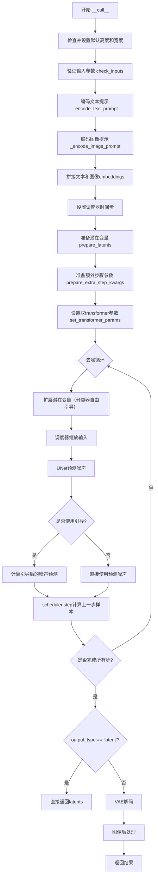
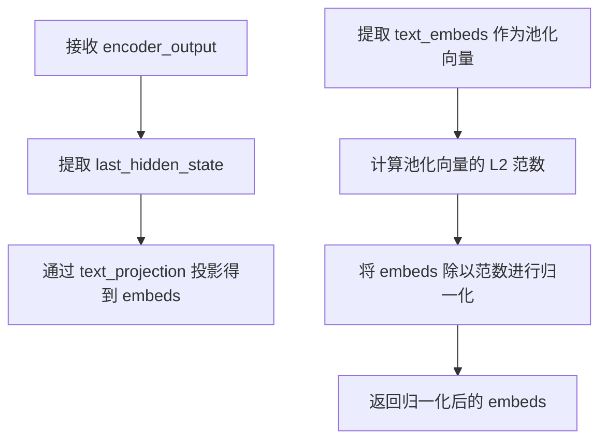
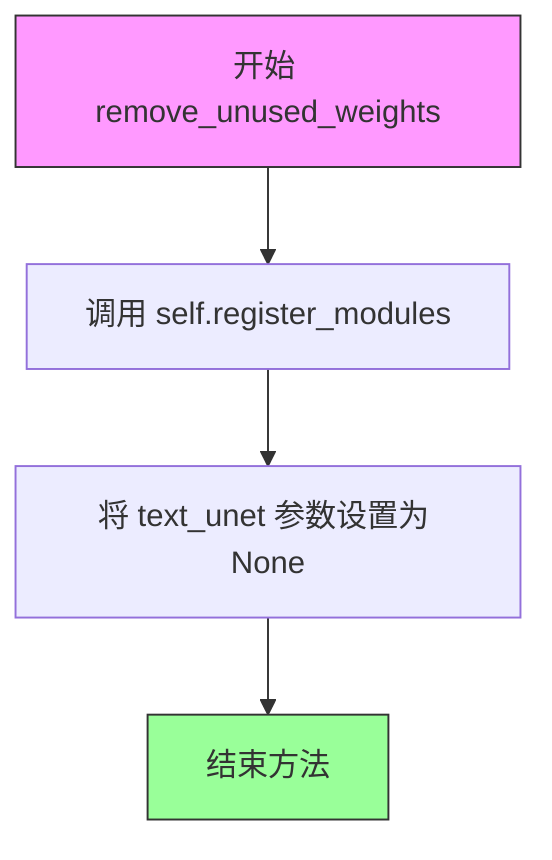
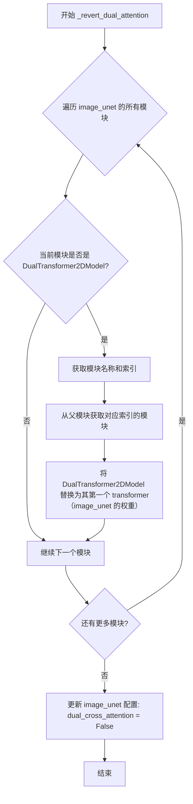
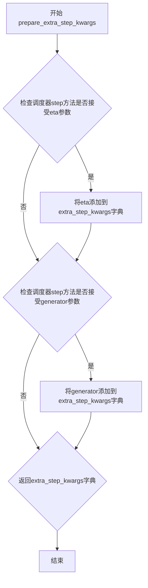
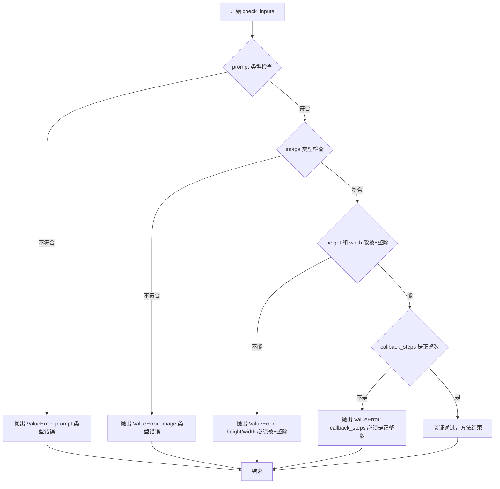
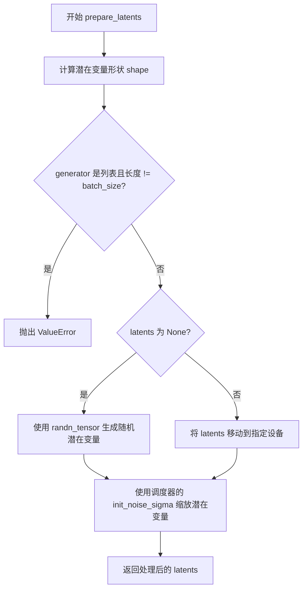
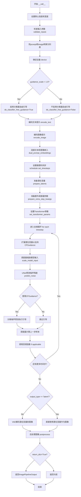

# `diffusers\src\diffusers\pipelines\deprecated\versatile_diffusion\pipeline_versatile_diffusion_dual_guided.py` 详细设计文档

VersatileDiffusionDualGuidedPipeline是一个用于图像-文本双引导生成的扩散管道，继承自DiffusionPipeline，结合了CLIP文本编码器和图像编码器，通过DualTransformer2DModel实现文本和图像条件的联合引导，生成融合两种条件的图像。

## 整体流程



## 类结构

```
DiffusionPipeline (基类)
└── VersatileDiffusionDualGuidedPipeline
```

## 全局变量及字段


### `logger`
    
用于记录日志信息的日志记录器对象

类型：`logging.Logger`
    


### `VersatileDiffusionDualGuidedPipeline.tokenizer`
    
用于将文本提示编码为token序列的CLIP分词器

类型：`CLIPTokenizer`
    


### `VersatileDiffusionDualGuidedPipeline.image_feature_extractor`
    
用于从输入图像中提取和预处理特征的CLIP图像处理器

类型：`CLIPImageProcessor`
    


### `VersatileDiffusionDualGuidedPipeline.text_encoder`
    
用于将文本token编码为文本嵌入向量的CLIP文本编码器模型（带projection）

类型：`CLIPTextModelWithProjection`
    


### `VersatileDiffusionDualGuidedPipeline.image_encoder`
    
用于将图像编码为视觉嵌入向量的CLIP视觉编码器模型（带projection）

类型：`CLIPVisionModelWithProjection`
    


### `VersatileDiffusionDualGuidedPipeline.image_unet`
    
用于在图像潜在空间中执行去噪操作的UNet条件模型

类型：`UNet2DConditionModel`
    


### `VersatileDiffusionDualGuidedPipeline.text_unet`
    
用于处理文本条件的UNet平铺条件模型（可选组件，用于双引导）

类型：`UNetFlatConditionModel`
    


### `VersatileDiffusionDualGuidedPipeline.vae`
    
用于将图像编码为潜在表示并从潜在表示解码回图像的变分自动编码器

类型：`AutoencoderKL`
    


### `VersatileDiffusionDualGuidedPipeline.scheduler`
    
用于控制扩散模型去噪过程调度策略的Karras扩散调度器

类型：`KarrasDiffusionSchedulers`
    


### `VersatileDiffusionDualGuidedPipeline.vae_scale_factor`
    
VAE缩放因子，用于将潜在空间坐标映射到像素空间的缩放系数

类型：`int`
    


### `VersatileDiffusionDualGuidedPipeline.image_processor`
    
用于对VAE生成的图像进行后处理（归一化、转换格式等）的图像处理器

类型：`VaeImageProcessor`
    


### `VersatileDiffusionDualGuidedPipeline.model_cpu_offload_seq`
    
指定模型组件CPU卸载顺序的字符串（bert->unet->vqvae）

类型：`str`
    


### `VersatileDiffusionDualGuidedPipeline._optional_components`
    
列出可选组件名称的列表，用于管道的可选功能（text_unet）

类型：`list`
    
    

## 全局函数及方法


### `_encode_text_prompt.normalize_embeddings`

该内部函数用于对文本编码器输出的embeddings进行L2归一化处理，通过将高维文本特征除以池化后文本嵌入的范数来实现单位向量转换，确保文本表示在不同样本间具有可比性。

参数：

- `encoder_output`：`CLIPTextModelWithProjection` 输出对象，包含 `last_hidden_state` 和 `text_embeds` 属性

返回值：`torch.Tensor`，归一化后的文本embeddings张量

#### 流程图



#### 带注释源码

```
def normalize_embeddings(encoder_output):
    # 从文本编码器输出中提取最后一层隐藏状态，并通过文本投影层获得embeddings
    # encoder_output.last_hidden_state: [batch_size, seq_len, hidden_dim]
    # self.text_encoder.text_projection: 线性层，将hidden_dim投影到embedding维度
    embeds = self.text_encoder.text_projection(encoder_output.last_hidden_state)
    
    # 提取池化后的文本嵌入（通常取[CLS] token对应的hidden state）
    # encoder_output.text_embeds: [batch_size, embedding_dim]
    embeds_pooled = encoder_output.text_embeds
    
    # 计算池化向量的L2范数，并在seq_len维度保持维度以便广播
    # torch.norm(embeds_pooled.unsqueeze(1), dim=-1, keepdim=True): [batch_size, 1, 1]
    # 对每个token位置的embedding除以池化向量的范数，实现单位向量归一化
    embeds = embeds / torch.norm(embeds_pooled.unsqueeze(1), dim=-1, keepdim=True)
    
    # 返回归一化后的embeddings: [batch_size, seq_len, embedding_dim]
    return embeds
```


### `_encode_image_prompt.normalize_embeddings`

该内部函数用于对图像编码器（image_encoder）的输出进行后处理和归一化。它首先通过后层归一化（post_layernorm）处理隐藏状态，然后通过视觉投影层（visual_projection）进行线性变换，最后利用池化后的首个 token embedding 的范数对所有 token 的 embedding 进行 L2 归一化，以确保嵌入向量具有统一的尺度，便于后续的对比学习和条件生成。

参数：

-  `encoder_output`：`CLIPVisionModelOutput`（或类似的模型输出对象），包含 `last_hidden_state` 属性，表示图像编码器输出的隐藏状态序列

返回值：`torch.Tensor`，归一化后的图像 embedding 张量，形状为 `(batch_size, seq_len, embedding_dim)`

#### 流程图

```mermaid
flowchart TD
    A[encoder_output] --> B[提取 last_hidden_state]
    B --> C[vision_model.post_layernorm 处理]
    C --> D[visual_projection 线性变换]
    D --> E[提取第一个 token: embeds_pooled = embeds[:, 0:1]]
    E --> F[计算范数: torch.norm embeds_pooled]
    F --> G[归一化: embeds / norm]
    G --> H[返回归一化后的 embeds]
```

#### 带注释源码

```python
def normalize_embeddings(encoder_output):
    """
    对图像编码器输出进行后处理和归一化
    
    处理流程:
    1. 通过后层归一化处理隐藏状态
    2. 通过视觉投影层进行线性变换
    3. 使用首个 token 的范数对所有 token embedding 进行归一化
    """
    # Step 1: 后层归一化 - 对图像编码器的最后隐藏状态进行归一化处理
    # 这一步类似 CLIP 视觉模型的最终归一化操作
    embeds = self.image_encoder.vision_model.post_layernorm(encoder_output.last_hidden_state)
    
    # Step 2: 视觉投影 - 将高维隐藏状态投影到统一的嵌入空间
    # 这是 CLIP 模型中连接视觉编码器和文本空间的线性层
    embeds = self.image_encoder.visual_projection(embeds)
    
    # Step 3: 提取池化表示 - 使用第一个 token (CLS token) 作为整个图像的全局表示
    embeds_pooled = embeds[:, 0:1]  # shape: (batch, 1, embedding_dim)
    
    # Step 4: L2 归一化 - 使用全局表示的范数对所有 token 进行归一化
    # 这样可以确保嵌入向量具有统一的尺度，便于后续的对比学习
    embeds = embeds / torch.norm(embeds_pooled, dim=-1, keepdim=True)
    
    # 返回归一化后的 embeddings，形状为 (batch, seq_len, embedding_dim)
    return embeds
```


### VersatileDiffusionDualGuidedPipeline.__init__

该方法是 VersatileDiffusionDualGuidedPipeline 类的构造函数，负责初始化管道所需的所有模型组件、调度器、图像处理器，并自动将单注意力UNet转换为支持文本和图像双引导的DualTransformer2DModel。

参数：

- `tokenizer`：`CLIPTokenizer`，CLIP文本分词器，用于将文本提示转换为token序列
- `image_feature_extractor`：`CLIPImageProcessor`，CLIP图像特征提取器，用于预处理输入图像
- `text_encoder`：`CLIPTextModelWithProjection`，CLIP文本编码器模型，带投影层用于生成文本嵌入
- `image_encoder`：`CLIPVisionModelWithProjection`，CLIP图像编码器模型，用于生成图像嵌入
- `image_unet`：`UNet2DConditionModel`，图像去噪UNet模型，用于在潜在空间中进行去噪操作
- `text_unet`：`UNetFlatConditionModel`，文本条件UNet模型，提供文本Transformer块用于双引导
- `vae`：`AutoencoderKL`，变分自编码器模型，用于编码图像到潜在空间和从潜在空间解码
- `scheduler`：`KarrasDiffusionSchedulers`，Karras扩散调度器，用于控制去噪过程的噪声调度

返回值：无（`None`），构造函数不返回任何值

#### 流程图

```mermaid
flowchart TD
    A[开始 __init__] --> B[调用 super().__init__ 初始化基类]
    B --> C[调用 register_modules 注册所有模型组件]
    C --> D{检查 vae 是否存在}
    D -->|是| E[计算 vae_scale_factor: 2^(len(vae.config.block_out_channels) - 1)]
    D -->|否| F[设置 vae_scale_factor = 8]
    E --> G[创建 VaeImageProcessor 并赋值给 self.image_processor]
    F --> G
    G --> H{检查 text_unet 存在且 image_unet 无 dual_cross_attention}
    H -->|是| I[调用 _convert_to_dual_attention 转换为双注意力模式]
    H -->|否| J[结束]
    I --> J
```

#### 带注释源码

```
def __init__(
    self,
    tokenizer: CLIPTokenizer,                          # CLIP文本分词器
    image_feature_extractor: CLIPImageProcessor,        # CLIP图像特征提取器
    text_encoder: CLIPTextModelWithProjection,          # CLIP文本编码器（带投影）
    image_encoder: CLIPVisionModelWithProjection,        # CLIP视觉编码器（带投影）
    image_unet: UNet2DConditionModel,                   # 图像去噪UNet
    text_unet: UNetFlatConditionModel,                   # 文本条件UNet（扁平条件）
    vae: AutoencoderKL,                                 # 变分自编码器
    scheduler: KarrasDiffusionSchedulers,                # Karras扩散调度器
):
    # 调用父类 DiffusionPipeline 的初始化方法
    # 负责设置基本的pipeline配置和设备管理
    super().__init__()
    
    # 注册所有模型组件到pipeline中
    # 这些组件将通过 self.<component_name> 访问
    # 同时注册为可选组件（_optional_components 中定义的）
    self.register_modules(
        tokenizer=tokenizer,
        image_feature_extractor=image_feature_extractor,
        text_encoder=text_encoder,
        image_encoder=image_encoder,
        image_unet=image_unet,
        text_unet=text_unet,
        vae=vae,
        scheduler=scheduler,
    )
    
    # 计算VAE缩放因子，用于潜在空间和像素空间的转换
    # 基于VAE块输出通道数计算：2^(层数-1)
    # 默认值为8，如果VAE不存在则使用8
    self.vae_scale_factor = 2 ** (len(self.vae.config.block_out_channels) - 1) if getattr(self, "vae", None) else 8
    
    # 创建图像处理器，用于预处理和后处理图像
    # 根据vae_scale_factor调整图像尺寸
    self.image_processor = VaeImageProcessor(vae_scale_factor=self.vae_scale_factor)

    # 检查是否需要转换为双注意力模式
    # 条件：text_unet存在 且 image_unet未配置dual_cross_attention
    # 这种情况出现在从通用检查点加载而非保存的双引导pipeline时
    if self.text_unet is not None and (
        "dual_cross_attention" not in self.image_unet.config or not self.image_unet.config.dual_cross_attention
    ):
        # 如果加载的是通用检查点而非保存的双引导pipeline
        # 将image_unet的Transformer2DModel块替换为DualTransformer2DModel
        # 融合image_unet和text_unet的transformer块实现双引导
        self._convert_to_dual_attention()
```


### `VersatileDiffusionDualGuidedPipeline.remove_unused_weights`

该方法用于移除并释放pipeline中未使用的text_unet模块权重，以减少显存占用，适用于只需要图像生成而不需要文本引导的场景。

参数： 无

返回值：`None`，无返回值（该方法直接修改对象状态）

#### 流程图



#### 带注释源码

```python
def remove_unused_weights(self):
    """
    移除未使用的权重以释放内存。
    
    该方法将 text_unet 模块设置为 None，在需要释放显存或只使用图像引导生成时调用。
    调用此方法后，pipeline 将只使用 image_unet 进行图像到图像的生成，
    而不再使用文本到图像的双引导功能。
    """
    # 使用 register_modules 方法将 text_unet 从已注册的模块列表中移除
    # 传入 None 会将该模块从 pipeline 中注销，释放相关的内存引用
    self.register_modules(text_unet=None)
```


### `VersatileDiffusionDualGuidedPipeline._convert_to_dual_attention`

该方法将 `image_unet` 中的 `Transformer2DModel` 模块替换为 `DualTransformer2DModel`，该双注意力转换器融合了来自 `image_unet`（图像分支）和 `text_unet`（文本分支）的变换器块，从而实现图像-文本双引导生成功能。

参数： 无

返回值： `None`，该方法直接修改 `image_unet` 的内部结构，不返回任何值。

#### 流程图

```mermaid
flowchart TD
    A[开始 _convert_to_dual_attention] --> B[遍历 image_unet 的所有子模块]
    B --> C{当前模块是否为 Transformer2DModel?}
    C -->|否| D[继续下一个模块]
    C -->|是| E[获取父模块名称和索引]
    E --> F[从 image_unet 提取对应位置的 image_transformer]
    F --> G[从 text_unet 提取对应位置的 text_transformer]
    G --> H[获取 image_transformer 的配置参数]
    H --> I[创建 DualTransformer2DModel 实例]
    I --> J[将 image_transformer 赋值给 dual_transformer.transformers[0]]
    J --> K[将 text_transformer 赋值给 dual_transformer.transformers[1]]
    K --> L[用 dual_transformer 替换原 image_unet 中的模块]
    L --> M[注册 dual_cross_attention=True 到 image_unet 配置]
    M --> D
    D --> N{还有更多模块?}
    N -->|是| B
    N -->|否| O[结束]
```

#### 带注释源码

```python
def _convert_to_dual_attention(self):
    """
    Replace image_unet's `Transformer2DModel` blocks with `DualTransformer2DModel` that contains transformer blocks
    from both `image_unet` and `text_unet`
    """
    # 遍历 image_unet 中的所有子模块
    for name, module in self.image_unet.named_modules():
        # 检查当前模块是否为 Transformer2DModel 类型
        if isinstance(module, Transformer2DModel):
            # 从模块名称中分离出父模块名称和索引
            # 例如: "transformer_blocks.0" -> parent_name="transformer_blocks", index=0
            parent_name, index = name.rsplit(".", 1)
            index = int(index)

            # 从 image_unet 和 text_unet 的相同位置获取对应的 transformer
            image_transformer = self.image_unet.get_submodule(parent_name)[index]
            text_transformer = self.text_unet.get_submodule(parent_name)[index]

            # 获取图像 transformer 的配置参数，用于创建双注意力 transformer
            config = image_transformer.config
            
            # 创建 DualTransformer2DModel 实例，使用图像 transformer 的配置
            dual_transformer = DualTransformer2DModel(
                num_attention_heads=config.num_attention_heads,
                attention_head_dim=config.attention_head_dim,
                in_channels=config.in_channels,
                num_layers=config.num_layers,
                dropout=config.dropout,
                norm_num_groups=config.norm_num_groups,
                cross_attention_dim=config.cross_attention_dim,
                attention_bias=config.attention_bias,
                sample_size=config.sample_size,
                num_vector_embeds=config.num_vector_embeds,
                activation_fn=config.activation_fn,
                num_embeds_ada_norm=config.num_embeds_ada_norm,
            )
            
            # 将原 image_unet 的 transformer 放入双注意力模型的第一个位置（图像）
            dual_transformer.transformers[0] = image_transformer
            # 将 text_unet 的 transformer 放入双注意力模型的第二个位置（文本）
            dual_transformer.transformers[1] = text_transformer

            # 用 DualTransformer2DModel 替换原 image_unet 中的 Transformer2DModel
            self.image_unet.get_submodule(parent_name)[index] = dual_transformer
            
            # 更新 image_unet 配置，标记已启用双交叉注意力
            self.image_unet.register_to_config(dual_cross_attention=True)
```


### `VersatileDiffusionDualGuidedPipeline._revert_dual_attention`

将 `image_unet` 中的 `DualTransformer2DModel` 双注意力块恢复为原始的 `Transformer2DModel` 单注意力块，仅保留图像 UNet 的权重。此方法用于在复用 `image_unet` 到其他管道（如 VersatileDiffusionPipeline）之前进行清理操作。

参数：

- 无显式参数（隐式接收 `self` 实例）

返回值：`None`，无返回值（方法执行副作用操作）

#### 流程图



#### 带注释源码

```python
def _revert_dual_attention(self):
    """
    Revert the image_unet `DualTransformer2DModel` blocks back to `Transformer2DModel` with image_unet weights Call
    this function if you reuse `image_unet` in another pipeline, e.g. `VersatileDiffusionPipeline`
    """
    # 遍历 image_unet 中的所有模块
    for name, module in self.image_unet.named_modules():
        # 检查当前模块是否是 DualTransformer2DModel（双注意力模型）
        if isinstance(module, DualTransformer2DModel):
            # 从模块名称中提取父模块名称和索引
            # 例如: "transformer_blocks.0" -> parent_name="transformer_blocks", index="0"
            parent_name, index = name.rsplit(".", 1)
            # 将索引字符串转换为整数
            index = int(index)
            # 将 DualTransformer2DModel 替换为其第一个 transformer（保存 image_unet 的权重）
            # module.transformers[0] 是图像 transformer，transformers[1] 是文本 transformer
            self.image_unet.get_submodule(parent_name)[index] = module.transformers[0]

    # 更新配置标志，表示不再使用双注意力机制
    self.image_unet.register_to_config(dual_cross_attention=False)
```


### `VersatileDiffusionDualGuidedPipeline._encode_text_prompt`

该方法负责将文本提示（prompt）编码为文本编码器的隐藏状态向量（embedding），支持批量处理、每提示生成多张图像以及无分类器自由引导（Classifier-Free Guidance）所需的 unconditional 嵌入计算。

参数：

- `prompt`：`str` 或 `list[str]`，需要编码的文本提示，支持单条或批量输入
- `device`：`torch.device`，PyTorch 设备对象，用于指定计算设备
- `num_images_per_prompt`：`int`，每个提示要生成的图像数量，用于复制嵌入向量
- `do_classifier_free_guidance`：`bool`，是否启用无分类器自由引导，决定是否计算 negative prompt 嵌入

返回值：`torch.Tensor`，形状为 `(batch_size * num_images_per_prompt, sequence_length, hidden_dim)` 的文本嵌入张量，包含条件嵌入和无条件嵌入（当启用 CFG 时两者拼接）

#### 流程图

```mermaid
flowchart TD
    A[开始: _encode_text_prompt] --> B[定义内部函数 normalize_embeddings]
    B --> C[计算 batch_size]
    C --> D[调用 tokenizer 对 prompt 进行分词]
    D --> E{检查是否被截断}
    E -->|是| F[记录警告日志]
    E -->|否| G[继续]
    F --> G
    G --> H{检查是否使用注意力掩码}
    H -->|是| I[获取 attention_mask]
    H -->|否| J[attention_mask = None]
    I --> K
    J --> K
    K[调用 text_encoder 编码文本]
    K --> L[调用 normalize_embeddings 归一化嵌入]
    L --> M[复制嵌入向量 num_images_per_prompt 次]
    M --> N{do_classifier_free_guidance?}
    N -->|否| O[返回 prompt_embeds]
    N -->|是| P[创建空字符串 uncond_tokens]
    P --> Q[tokenizer 处理 uncond_tokens]
    Q --> R{检查是否使用注意力掩码}
    R -->|是| S[获取 uncond attention_mask]
    R -->|否| T[attention_mask = None]
    S --> U
    T --> U
    U[编码 negative_prompt]
    U --> V[归一化 negative_prompt_embeds]
    V --> W[复制 negative_prompt_embeds]
    W --> X[拼接: torch.cat[negative_prompt_embeds, prompt_embeds]]
    X --> O
```

#### 带注释源码

```python
def _encode_text_prompt(self, prompt, device, num_images_per_prompt, do_classifier_free_guidance):
    r"""
    Encodes the prompt into text encoder hidden states.

    Args:
        prompt (`str` or `list[str]`):
            prompt to be encoded
        device: (`torch.device`):
            torch device
        num_images_per_prompt (`int`):
            number of images that should be generated per prompt
        do_classifier_free_guidance (`bool`):
            whether to use classifier free guidance or not
    """

    # 定义内部函数：对文本编码器输出进行归一化处理
    # 使用 text_projection 投影后，按 pooled embedding 的范数进行归一化
    def normalize_embeddings(encoder_output):
        # 投影到文本嵌入空间
        embeds = self.text_encoder.text_projection(encoder_output.last_hidden_state)
        # 获取 pooled 的文本嵌入（通常取第一个 token）
        embeds_pooled = encoder_output.text_embeds
        # 按 pooled embedding 的范数归一化，确保单位球面上的嵌入
        embeds = embeds / torch.norm(embeds_pooled.unsqueeze(1), dim=-1, keepdim=True)
        return embeds

    # 计算批量大小
    batch_size = len(prompt)

    # 使用 tokenizer 将文本 prompt 转换为 token ids
    # 填充到最大长度，启用截断，返回 PyTorch 张量
    text_inputs = self.tokenizer(
        prompt,
        padding="max_length",
        max_length=self.tokenizer.model_max_length,
        truncation=True,
        return_tensors="pt",
    )
    text_input_ids = text_inputs.input_ids
    
    # 获取未截断的 token ids 用于比较（用于检测截断情况）
    untruncated_ids = self.tokenizer(prompt, padding="max_length", return_tensors="pt").input_ids

    # 检查是否有内容被截断，如果被截断则记录警告
    if not torch.equal(text_input_ids, untruncated_ids):
        # 解码被截断的部分用于日志记录
        removed_text = self.tokenizer.batch_decode(untruncated_ids[:, self.tokenizer.model_max_length - 1 : -1])
        logger.warning(
            "The following part of your input was truncated because CLIP can only handle sequences up to"
            f" {self.tokenizer.model_max_length} tokens: {removed_text}"
        )

    # 检查文本编码器配置是否需要使用注意力掩码
    if hasattr(self.text_encoder.config, "use_attention_mask") and self.text_encoder.config.use_attention_mask:
        attention_mask = text_inputs.attention_mask.to(device)
    else:
        attention_mask = None

    # 调用文本编码器获取文本嵌入
    prompt_embeds = self.text_encoder(
        text_input_ids.to(device),
        attention_mask=attention_mask,
    )
    # 归一化文本嵌入
    prompt_embeds = normalize_embeddings(prompt_embeds)

    # 复制文本嵌入以匹配每个 prompt 生成的图像数量
    # 使用 mps 友好的方法（先扩展batch维度，再reshape）
    bs_embed, seq_len, _ = prompt_embeds.shape
    prompt_embeds = prompt_embeds.repeat(1, num_images_per_prompt, 1)
    prompt_embeds = prompt_embeds.view(bs_embed * num_images_per_prompt, seq_len, -1)

    # 如果启用无分类器自由引导，计算无条件嵌入（用于CFG）
    if do_classifier_free_guidance:
        # 创建空字符串作为无条件提示
        uncond_tokens = [""] * batch_size
        max_length = text_input_ids.shape[-1]
        # 对无条件提示进行 tokenize
        uncond_input = self.tokenizer(
            uncond_tokens,
            padding="max_length",
            max_length=max_length,
            truncation=True,
            return_tensors="pt",
        )

        # 同样检查是否需要注意力掩码
        if hasattr(self.text_encoder.config, "use_attention_mask") and self.text_encoder.config.use_attention_mask:
            attention_mask = uncond_input.attention_mask.to(device)
        else:
            attention_mask = None

        # 编码无条件提示
        negative_prompt_embeds = self.text_encoder(
            uncond_input.input_ids.to(device),
            attention_mask=attention_mask,
        )
        negative_prompt_embeds = normalize_embeddings(negative_prompt_embeds)

        # 复制无条件嵌入以匹配批量大小
        seq_len = negative_prompt_embeds.shape[1]
        negative_prompt_embeds = negative_prompt_embeds.repeat(1, num_images_per_prompt, 1)
        negative_prompt_embeds = negative_prompt_embeds.view(batch_size * num_images_per_prompt, seq_len, -1)

        # 拼接无条件嵌入和条件嵌入
        # 这样可以在单次前向传播中同时计算，避免两次前向传播
        # 格式: [negative_prompt_embeds, prompt_embeds]
        prompt_embeds = torch.cat([negative_prompt_embeds, prompt_embeds])

    return prompt_embeds
```


### `VersatileDiffusionDualGuidedPipeline._encode_image_prompt`

该函数负责将图像提示（prompt）编码为图像编码器（CLIP Vision Model）的隐藏状态向量，用于 Versatile Diffusion 双引导管道中的图像生成过程。它通过图像特征提取器和视觉编码器处理输入图像，生成可供 UNet 使用的条件嵌入向量，并支持无分类器自由引导（classifier-free guidance）技术。

参数：

- `prompt`：`str` 或 `list[str]`，要编码的图像提示，可以是单张图像或图像列表
- `device`：`torch.device`，torch 设备，用于计算
- `num_images_per_prompt`：`int`，每个提示要生成的图像数量，用于复制嵌入向量
- `do_classifier_free_guidance`：`bool`，是否使用无分类器自由引导技术

返回值：`torch.Tensor`，编码后的图像嵌入向量，形状为 `(batch_size * num_images_per_prompt, seq_len, embedding_dim)`

#### 流程图

```mermaid
flowchart TD
    A[开始 _encode_image_prompt] --> B{判断 prompt 类型}
    B -->|list| C[batch_size = len(prompt)]
    B -->|str| D[batch_size = 1]
    C --> E[调用 image_feature_extractor 处理图像]
    D --> E
    E --> F[提取 pixel_values 并移动到 device]
    F --> G[调用 image_encoder 获取原始嵌入]
    G --> H[调用 normalize_embeddings 归一化嵌入]
    H --> I[复制嵌入向量匹配 num_images_per_prompt]
    I --> J{do_classifier_free_guidance?}
    J -->|Yes| K[创建无条件图像: 全零 512x512 灰色图像]
    K --> L[通过 image_feature_extractor 处理]
    L --> M[通过 image_encoder 获取无条件嵌入]
    M --> N[归一化无条件嵌入]
    N --> O[复制无条件嵌入]
    O --> P[连接无条件嵌入和条件嵌入]
    P --> Q[返回最终嵌入]
    J -->|No| Q
```

#### 带注释源码

```python
def _encode_image_prompt(self, prompt, device, num_images_per_prompt, do_classifier_free_guidance):
    r"""
    Encodes the prompt into text encoder hidden states.

    Args:
        prompt (`str` or `list[str]`):
            prompt to be encoded
        device: (`torch.device`):
            torch device
        num_images_per_prompt (`int`):
            number of images that should be generated per prompt
        do_classifier_free_guidance (`bool`):
            whether to use classifier free guidance or not
    """

    # 定义内部归一化函数，用于对图像嵌入进行 L2 归一化
    # 处理流程：后层归一化 -> 视觉投影 -> 提取 CLS token -> 归一化
    def normalize_embeddings(encoder_output):
        # 对最后一层隐藏状态进行后层归一化
        embeds = self.image_encoder.vision_model.post_layernorm(encoder_output.last_hidden_state)
        # 通过视觉投影层进行线性变换
        embeds = self.image_encoder.visual_projection(embeds)
        # 提取第一个 token (CLS token) 作为池化表示
        embeds_pooled = embeds[:, 0:1]
        # 使用池化后的嵌入进行 L2 归一化，确保嵌入向量单位化
        embeds = embeds / torch.norm(embeds_pooled, dim=-1, keepdim=True)
        return embeds

    # 确定批处理大小：如果是列表则取长度，否则默认为 1
    batch_size = len(prompt) if isinstance(prompt, list) else 1

    # 使用图像特征提取器将 PIL Image 或图像列表转换为模型输入格式
    image_input = self.image_feature_extractor(images=prompt, return_tensors="pt")
    # 提取像素值并移动到指定设备，转换为图像编码器所需的数据类型
    pixel_values = image_input.pixel_values.to(device).to(self.image_encoder.dtype)
    # 通过 CLIP 图像编码器获取图像的原始嵌入表示
    image_embeddings = self.image_encoder(pixel_values)
    # 对图像嵌入进行归一化处理
    image_embeddings = normalize_embeddings(image_embeddings)

    # 复制图像嵌入以匹配每个提示生成的图像数量
    # 获取当前嵌入的形状: (batch_size, seq_len, embed_dim)
    bs_embed, seq_len, _ = image_embeddings.shape
    # 在序列维度重复，以支持每个提示生成多张图像
    image_embeddings = image_embeddings.repeat(1, num_images_per_prompt, 1)
    # 重塑为 (batch_size * num_images_per_prompt, seq_len, embed_dim)
    image_embeddings = image_embeddings.view(bs_embed * num_images_per_prompt, seq_len, -1)

    # 如果启用无分类器自由引导，需要生成无条件嵌入用于引导
    if do_classifier_free_guidance:
        # 创建灰色无条件图像 (512x512 RGB，值为 0.5)
        uncond_images = [np.zeros((512, 512, 3)) + 0.5] * batch_size
        # 通过图像特征提取器处理无条件图像
        uncond_images = self.image_feature_extractor(images=uncond_images, return_tensors="pt")
        # 移动到设备并转换数据类型
        pixel_values = uncond_images.pixel_values.to(device).to(self.image_encoder.dtype)
        # 通过图像编码器获取无条件嵌入
        negative_prompt_embeds = self.image_encoder(pixel_values)
        # 归一化无条件嵌入
        negative_prompt_embeds = normalize_embeddings(negative_prompt_embeds)

        # 复制无条件嵌入以匹配生成的图像数量
        seq_len = negative_prompt_embeds.shape[1]
        negative_prompt_embeds = negative_prompt_embeds.repeat(1, num_images_per_prompt, 1)
        negative_prompt_embeds = negative_prompt_embeds.view(batch_size * num_images_per_prompt, seq_len, -1)

        # 拼接无条件嵌入和条件嵌入
        # 格式: [negative_prompt_embeds, prompt_embeds]
        # 这样可以在单次前向传播中同时计算条件和无条件噪声预测
        image_embeddings = torch.cat([negative_prompt_embeds, image_embeddings])

    # 返回编码后的图像嵌入
    return image_embeddings
```


### `VersatileDiffusionDualGuidedPipeline.decode_latents`

该方法用于将VAE的潜在表示（latents）解码为最终的图像像素值。该方法已被弃用，将在1.0.0版本中移除，建议使用`VaeImageProcessor.postprocess(...)`替代。

参数：

- `self`：`VersatileDiffusionDualGuidedPipeline`，Pipeline实例本身
- `latents`：`torch.Tensor`，VAE编码后的潜在表示张量，形状为(batch_size, channels, height, width)

返回值：`numpy.ndarray`，解码后的图像张量，形状为(batch_size, height, width, channels)，像素值范围在[0, 1]之间

#### 流程图

```mermaid
flowchart TD
    A[开始 decode_latents] --> B[记录弃用警告]
    B --> C[缩放latents: latents = 1/scaling_factor * latents]
    C --> D[VAE解码: image = vae.decode(latents)]
    D --> E[图像归一化: image = (image/2 + 0.5).clamp(0, 1)]
    E --> F[转换为numpy: image.cpu().permute(0, 2, 3, 1).float().numpy()]
    F --> G[返回图像数组]
```

#### 带注释源码

```python
def decode_latents(self, latents):
    """
    将VAE潜在表示解码为图像像素值。
    
    注意：此方法已被弃用，将在1.0.0版本中移除。
    建议使用VaeImageProcessor.postprocess(...)替代。
    
    参数:
        latents (torch.Tensor): VAE编码后的潜在表示张量
        
    返回值:
        numpy.ndarray: 解码后的图像数组，像素值范围[0, 1]
    """
    # 记录弃用警告，提醒用户使用新方法
    deprecation_message = "The decode_latents method is deprecated and will be removed in 1.0.0. Please use VaeImageProcessor.postprocess(...) instead"
    deprecate("decode_latents", "1.0.0", deprecation_message, standard_warn=False)

    # 1. 反缩放latents（还原VAE编码时的缩放）
    # VAE编码时乘以了scaling_factor，这里需要除以回来
    latents = 1 / self.vae.config.scaling_factor * latents
    
    # 2. 使用VAE解码器将潜在表示转换为图像
    # return_dict=False返回tuple，取第一个元素[0]
    image = self.vae.decode(latents, return_dict=False)[0]
    
    # 3. 将图像值从[-1, 1]范围转换到[0, 1]范围
    # 这是因为训练时通常将图像归一化到[-1, 1]
    image = (image / 2 + 0.5).clamp(0, 1)
    
    # 4. 转换为numpy数组以便后续处理
    # - 移至CPU（避免CUDA内存问题）
    # - permute调整维度顺序: (B, C, H, W) -> (B, H, W, C)
    # - 转换为float32（兼容性考虑，与bfloat16兼容且开销可忽略）
    image = image.cpu().permute(0, 2, 3, 1).float().numpy()
    
    # 5. 返回解码后的图像数组
    return image
```


### `VersatileDiffusionDualGuidedPipeline.prepare_extra_step_kwargs`

该方法用于为调度器（scheduler）的步骤准备额外的关键字参数。由于不同的调度器具有不同的签名（例如 DDIMScheduler 使用 eta 参数，而其他调度器可能忽略该参数），该方法通过检查调度器的 `step` 函数签名来动态构建需要传递的参数字典。

参数：

- `generator`：`torch.Generator | list[torch.Generator] | None`，用于控制随机数生成，确保扩散过程的可重复性
- `eta`：`float`，DDIM 调度器专用的噪声尺度参数（η），取值范围为 [0, 1]，其他调度器会忽略此参数

返回值：`dict`，包含调度器 `step` 方法所需的关键字参数（如 `eta` 和/或 `generator`）

#### 流程图



#### 带注释源码

```python
def prepare_extra_step_kwargs(self, generator, eta):
    # 准备调度器步骤所需的额外参数，因为并非所有调度器都具有相同的签名
    # eta (η) 仅与 DDIMScheduler 一起使用，其他调度器将忽略它
    # eta 对应于 DDIM 论文中的 η：https://huggingface.co/papers/2010.02502
    # 取值应在 [0, 1] 范围内

    # 使用 inspect 模块检查调度器 step 方法的签名参数
    # 判断是否支持 eta 参数（主要用于 DDIM 调度器）
    accepts_eta = "eta" in set(inspect.signature(self.scheduler.step).parameters.keys())
    
    # 初始化空字典用于存储额外参数
    extra_step_kwargs = {}
    
    # 如果调度器支持 eta 参数，则将其添加到参数字典中
    if accepts_eta:
        extra_step_kwargs["eta"] = eta

    # 检查调度器是否接受 generator 参数
    # 用于支持需要随机数生成器的调度器
    accepts_generator = "generator" in set(inspect.signature(self.scheduler.step).parameters.keys())
    if accepts_generator:
        extra_step_kwargs["generator"] = generator
    
    # 返回构建好的参数字典，供 scheduler.step() 调用使用
    return extra_step_kwargs
```


### `VersatileDiffusionDualGuidedPipeline.check_inputs`

该方法用于验证图像生成管道的输入参数，确保`prompt`、`image`、`height`、`width`和`callback_steps`的类型和值符合要求，如果验证失败则抛出相应的`ValueError`异常。

参数：

- `prompt`：`str | PIL.Image.Image | list`，用户提供的文本提示，可以是字符串、PIL图像或它们的列表
- `image`：`str | PIL.Image.Image | list`，用户提供的图像输入，可以是字符串路径、PIL图像或它们的列表
- `height`：`int`，生成图像的高度（像素），必须是8的倍数
- `width`：`int`，生成图像的宽度（像素），必须是8的倍数
- `callback_steps`：`int`，回调函数被调用的频率，必须是正整数

返回值：`None`，该方法不返回任何值，仅进行参数验证

#### 流程图



#### 带注释源码

```python
def check_inputs(self, prompt, image, height, width, callback_steps):
    """
    验证输入参数的有效性
    
    参数:
        prompt: 文本提示，可以是 str、PIL.Image.Image 或 list
        image: 图像输入，可以是 str、PIL.Image.Image 或 list
        height: 生成图像的高度，必须是8的倍数
        width: 生成图像的宽度，必须是8的倍数
        callback_steps: 回调函数调用频率，必须是正整数
    """
    
    # 验证 prompt 的类型
    # 必须是字符串、PIL图像或列表之一
    if not isinstance(prompt, str) and not isinstance(prompt, PIL.Image.Image) and not isinstance(prompt, list):
        raise ValueError(f"`prompt` has to be of type `str` `PIL.Image` or `list` but is {type(prompt)}")
    
    # 验证 image 的类型
    # 必须是字符串、PIL图像或列表之一
    if not isinstance(image, str) and not isinstance(image, PIL.Image.Image) and not isinstance(image, list):
        raise ValueError(f"`image` has to be of type `str` `PIL.Image` or `list` but is {type(image)}")

    # 验证图像尺寸是否为8的倍数
    # VAE 解码器通常要求输入是8的倍数
    if height % 8 != 0 or width % 8 != 0:
        raise ValueError(f"`height` and `width` have to be divisible by 8 but are {height} and {width}.")

    # 验证 callback_steps 是正整数
    # 不能为 None，必须是 int 类型且大于0
    if (callback_steps is None) or (
        callback_steps is not None and (not isinstance(callback_steps, int) or callback_steps <= 0)
    ):
        raise ValueError(
            f"`callback_steps` has to be a positive integer but is {callback_steps} of type"
            f" {type(callback_steps)}."
        )
```


### `VersatileDiffusionDualGuidedPipeline.prepare_latents`

该方法用于准备扩散模型的潜在变量（latents），包括计算潜在变量的形状、生成随机噪声或使用提供的潜在变量，并通过调度器的初始噪声标准差进行缩放。

参数：

- `self`：`VersatileDiffusionDualGuidedPipeline` 实例， pipeline 对象本身
- `batch_size`：`int`，批处理大小，决定生成图像的数量
- `num_channels_latents`：`int`，潜在变量的通道数，通常对应于 UNet 的输入通道数
- `height`：`int`，目标生成图像的高度（像素）
- `width`：`int`，目标生成图像的宽度（像素）
- `dtype`：`torch.dtype`，潜在变量的数据类型（如 torch.float32）
- `device`：`torch.device`，计算设备（如 cuda 或 cpu）
- `generator`：`torch.Generator` 或 `list[torch.Generator]` 或 `None`，用于确保生成可重复性的随机数生成器
- `latents`：`torch.Tensor` 或 `None`，可选的预生成潜在变量，如果为 None 则随机生成

返回值：`torch.Tensor`，准备好的潜在变量张量，已按调度器的初始噪声标准差进行缩放

#### 流程图



#### 带注释源码

```python
def prepare_latents(self, batch_size, num_channels_latents, height, width, dtype, device, generator, latents=None):
    # 计算潜在变量的形状：batch_size × num_channels_latents × (height/vae_scale_factor) × (width/vae_scale_factor)
    # vae_scale_factor 用于将像素空间转换到潜在空间
    shape = (
        batch_size,
        num_channels_latents,
        int(height) // self.vae_scale_factor,
        int(width) // self.vae_scale_factor,
    )
    
    # 检查 generator 列表长度是否与 batch_size 匹配
    if isinstance(generator, list) and len(generator) != batch_size:
        raise ValueError(
            f"You have passed a list of generators of length {len(generator)}, but requested an effective batch"
            f" size of {batch_size}. Make sure the batch size matches the length of the generators."
        )

    # 如果没有提供预生成的 latents，则使用 randn_tensor 从随机正态分布生成
    # generator 参数确保在需要时可以重现结果
    if latents is None:
        latents = randn_tensor(shape, generator=generator, device=device, dtype=dtype)
    else:
        # 如果提供了 latents，则确保它们在正确的设备上
        latents = latents.to(device)

    # 使用调度器的 init_noise_sigma 缩放初始噪声
    # 这是扩散模型去噪过程的重要参数，控制初始噪声的幅度
    latents = latents * self.scheduler.init_noise_sigma
    
    return latents
```


### `VersatileDiffusionDualGuidedPipeline.set_transformer_params`

该方法用于配置双Transformer模型中的混合比例和条件类型参数，通过遍历图像UNet中的DualTransformer2DModel模块，根据传入的条件类型（文本或图像）设置相应的条件长度和转换器索引，从而实现文本和图像条件的动态混合。

参数：

- `self`：隐式参数，类实例本身
- `mix_ratio`：`float`，混合比例参数，用于控制文本和图像条件在双引导生成中的权重，默认值为0.5
- `condition_types`：`tuple`，条件类型元组，指定哪些条件类型被使用，默认值为("text", "image")，其中"text"表示文本条件，"image"表示图像条件

返回值：`None`，该方法无返回值，直接修改DualTransformer2DModel模块的内部属性

#### 流程图

```mermaid
flowchart TD
    A[开始 set_transformer_params] --> B[遍历 image_unet 所有模块]
    B --> C{当前模块是否是 DualTransformer2DModel?}
    C -->|否| D[继续下一个模块]
    C -->|是| E[设置 module.mix_ratio = mix_ratio]
    E --> F[遍历 condition_types 枚举索引和类型]
    F --> G{当前类型是否为 'text'?}
    G -->|是| H[设置 condition_lengths[i] = text_encoder.config.max_position_embeddings]
    H --> I[设置 transformer_index_for_condition[i] = 1 使用文本Transformer]
    G -->|否| J[设置 condition_lengths[i] = 257]
    J --> K[设置 transformer_index_for_condition[i] = 0 使用图像Transformer]
    I --> L{是否还有更多条件类型?}
    K --> L
    L -->|是| F
    L -->|否| M[结束]
    D --> B
    M --> N[方法返回]
```

#### 带注释源码

```python
def set_transformer_params(self, mix_ratio: float = 0.5, condition_types: tuple = ("text", "image")):
    """
    设置双Transformer模型的参数，用于控制文本和图像条件的混合
    
    参数:
        mix_ratio: 混合比例，控制文本和图像条件的权重平衡
        condition_types: 条件类型元组，指定哪些条件类型被激活
    """
    # 遍历图像UNet中的所有模块
    for name, module in self.image_unet.named_modules():
        # 检查当前模块是否为DualTransformer2DModel类型
        if isinstance(module, DualTransformer2DModel):
            # 设置混合比例参数
            module.mix_ratio = mix_ratio
            
            # 遍历条件类型，为每个条件设置对应的参数
            for i, type in enumerate(condition_types):
                if type == "text":
                    # 对于文本条件，设置条件长度为文本编码器的最大位置嵌入数
                    module.condition_lengths[i] = self.text_encoder.config.max_position_embeddings
                    # 使用第二个transformer（文本transformer）进行处理
                    module.transformer_index_for_condition[i] = 1  # use the second (text) transformer
                else:
                    # 对于图像条件，设置固定的条件长度257
                    module.condition_lengths[i] = 257
                    # 使用第一个transformer（图像transformer）进行处理
                    module.transformer_index_for_condition[i] = 0  # use the first (image) transformer
```


### `VersatileDiffusionDualGuidedPipeline.__call__`

该方法是VersatileDiffusionDualGuidedPipeline的核心调用函数，用于执行基于Versatile Diffusion的图像-文本双引导生成。它接收文本提示和图像输入，通过CLIP编码器分别提取文本和图像特征嵌入，然后将两者融合为双提示嵌入，在UNet中利用DualTransformer2DModel进行去噪处理，最终通过VAE解码器将潜在空间转换为生成的图像。

参数：

- `prompt`：`PIL.Image.Image | list[PIL.Image.Image]`，引导图像生成的提示或提示列表（注意：实际代码中应为文本提示，但类型标注为图像）
- `image`：`str | list[str]`，输入的图像路径或图像列表，用于图像引导
- `text_to_image_strength`：`float = 0.5`，文本到图像的混合强度，控制文本和图像条件的相对权重
- `height`：`int | None = None`，生成图像的高度，默认为image_unet配置sample_size乘以vae_scale_factor
- `width`：`int | None = None`，生成图像的宽度，默认为image_unet配置sample_size乘以vae_scale_factor
- `num_inference_steps`：`int = 50`，去噪步数，步数越多通常图像质量越高但推理速度越慢
- `guidance_scale`：`float = 7.5`，分类器自由引导尺度，值越大生成的图像与文本提示越相关
- `num_images_per_prompt`：`int | None = 1`，每个提示生成的图像数量
- `eta`：`float = 0.0`，DDIM调度器的eta参数，仅对DDIMScheduler有效
- `generator`：`torch.Generator | list[torch.Generator] | None = None`，用于确保生成确定性的随机数生成器
- `latents`：`torch.Tensor | None = None`，预生成的噪声潜在变量，用于在同一潜在变量基础上使用不同提示生成图像
- `output_type`：`str | None = "pil"`，输出格式，可选"pil"或"np.array"
- `return_dict`：`bool = True`，是否返回ImagePipelineOutput字典格式
- `callback`：`Callable[[int, int, torch.Tensor], None] | None = None`，每callback_steps步调用的回调函数，参数为步数、时间步和潜在变量
- `callback_steps`：`int = 1`，回调函数被调用的频率
- `**kwargs`：其他未明确指定的参数

返回值：`ImagePipelineOutput | tuple`，如果return_dict为True返回ImagePipelineOutput对象（包含images属性），否则返回元组（第一个元素为生成的图像列表）

#### 流程图



#### 带注释源码

```python
@torch.no_grad()
def __call__(
    self,
    prompt: PIL.Image.Image | list[PIL.Image.Image],
    image: str | list[str],
    text_to_image_strength: float = 0.5,
    height: int | None = None,
    width: int | None = None,
    num_inference_steps: int = 50,
    guidance_scale: float = 7.5,
    num_images_per_prompt: int | None = 1,
    eta: float = 0.0,
    generator: torch.Generator | list[torch.Generator] | None = None,
    latents: torch.Tensor | None = None,
    output_type: str | None = "pil",
    return_dict: bool = True,
    callback: Callable[[int, int, torch.Tensor], None] | None = None,
    callback_steps: int = 1,
    **kwargs,
):
    # 0. 默认高度和宽度设置为unet的sample_size乘以vae_scale_factor
    height = height or self.image_unet.config.sample_size * self.vae_scale_factor
    width = width or self.image_unet.config.sample_size * self.vae_scale_factor

    # 1. 检查输入参数，如果不合规则抛出错误
    self.check_inputs(prompt, image, height, width, callback_steps)

    # 2. 定义调用参数：将prompt和image转换为列表以支持批量处理
    prompt = [prompt] if not isinstance(prompt, list) else prompt
    image = [image] if not isinstance(image, list) else image
    batch_size = len(prompt)
    device = self._execution_device
    
    # 判断是否启用分类器自由引导（CFGuidance）
    # guidance_scale analog to guidance weight w in Imagen paper
    # guidance_scale = 1 表示不进行CFGuidance
    do_classifier_free_guidance = guidance_scale > 1.0

    # 3. 编码输入提示
    # 编码文本提示为嵌入向量
    prompt_embeds = self._encode_text_prompt(prompt, device, num_images_per_prompt, do_classifier_free_guidance)
    # 编码图像提示为嵌入向量
    image_embeddings = self._encode_image_prompt(image, device, num_images_per_prompt, do_classifier_free_guidance)
    # 在维度1上拼接文本和图像嵌入，形成双提示嵌入
    dual_prompt_embeddings = torch.cat([prompt_embeds], dim=1)
    # 定义提示类型顺序
    prompt_types = ("text", "image")

    # 4. 准备时间步
    self.scheduler.set_timesteps(num_inference_steps, device=device)
    timesteps = self.scheduler.timesteps

    # 5. 准备潜在变量
    num_channels_latents = self.image_unet.config.in_channels
    latents = self.prepare_latents(
        batch_size * num_images_per_prompt,
        num_channels_latents,
        height,
        width,
        dual_prompt_embeddings.dtype,
        device,
        generator,
        latents,
    )

    # 6. 准备额外调度器参数（如eta和generator）
    extra_step_kwargs = self.prepare_extra_step_kwargs(generator, eta)

    # 7. 组合图像和文本UNets的注意力块
    # 设置DualTransformer的混合比率和条件长度
    self.set_transformer_params(text_to_image_strength, prompt_types)

    # 8. 去噪循环
    for i, t in enumerate(self.progress_bar(timesteps)):
        # 如果使用CFGuidance，则复制latents以同时处理有条件和无条件预测
        latent_model_input = torch.cat([latents] * 2) if do_classifier_free_guidance else latents
        # 调度器对输入进行缩放（根据噪声计划）
        latent_model_input = self.scheduler.scale_model_input(latent_model_input, t)

        # 使用UNet预测噪声残差
        noise_pred = self.image_unet(latent_model_input, t, encoder_hidden_states=dual_prompt_embeddings).sample

        # 执行分类器自由引导
        if do_classifier_free_guidance:
            # 将噪声预测分割为无条件预测和条件预测
            noise_pred_uncond, noise_pred_text = noise_pred.chunk(2)
            # 应用引导：noise_pred = noise_pred_uncond + guidance_scale * (noise_pred_text - noise_pred_uncond)
            noise_pred = noise_pred_uncond + guidance_scale * (noise_pred_text - noise_pred_uncond)

        # 计算上一步的样本：x_t -> x_t-1
        latents = self.scheduler.step(noise_pred, t, latents, **extra_step_kwargs).prev_sample

        # 如果提供了回调函数，则在适当步数调用
        if callback is not None and i % callback_steps == 0:
            step_idx = i // getattr(self.scheduler, "order", 1)
            callback(step_idx, t, latents)

    # 解码潜在变量为图像
    if not output_type == "latent":
        # 使用VAE解码器将潜在变量转换为图像
        image = self.vae.decode(latents / self.vae.config.scaling_factor, return_dict=False)[0]
    else:
        # 如果output_type为latent，则直接返回潜在变量
        image = latents

    # 后处理图像（归一化、转换格式等）
    image = self.image_processor.postprocess(image, output_type=output_type)

    # 根据return_dict决定返回格式
    if not return_dict:
        return (image,)

    # 返回ImagePipelineOutput对象
    return ImagePipelineOutput(images=image)
```

## 关键组件


### Dual Cross-Attention Mechanism (双交叉注意力机制)

将图像UNet的`Transformer2DModel`块替换为`DualTransformer2DModel`，融合图像和文本transformer块，实现双引导生成的核心机制。

### Text Prompt Encoding (文本提示编码)

使用CLIPTextModelWithProjection对文本提示进行编码，并通过归一化处理生成文本嵌入向量，支持classifier-free guidance。

### Image Prompt Encoding (图像提示编码)

使用CLIPVisionModelWithProjection对输入图像进行编码，生成图像嵌入向量，支持双模态条件生成。

### Latent Variable Management (潜在变量管理)

通过prepare_latents初始化噪声潜在变量，通过vae.decode将潜在变量解码为图像，包含VAE scale factor处理。

### Dual Attention Conversion (双注意力转换)

_convert_to_dual_attention方法将单模态UNet转换为支持双模态交叉注意力的版本，_revert_dual_attention用于恢复原始状态。

### Transformer Parameter Setting (Transformer参数设置)

set_transformer_params方法控制文本和图像条件的混合比例(mix_ratio)和条件长度，支持灵活的双引导权重控制。

### Classifier-Free Guidance (无分类器引导)

支持CFG的实现，通过negative_prompt_embeds与正向embeds拼接，在去噪过程中实现CFG计算。

### VaeImageProcessor (VAE图像处理器)

使用VaeImageProcessor进行图像的后处理，将解码后的潜码转换为PIL图像或numpy数组。

### Model CPU Offload Sequence (模型CPU卸载顺序)

定义model_cpu_offload_seq = "bert->unet->vqvae"用于模型内存管理。

### Optional Component Handling (可选组件处理)

通过_optional_components和remove_unused_weights方法管理text_unet等可选组件的加载和卸载。


## 问题及建议


### 已知问题

-   **类型注解错误**：`__call__` 方法中 `prompt` 参数类型标注为 `PIL.Image.Image | list[PIL.Image.Image]`，但实际处理逻辑仅支持 `str | list[str]`；同样 `image` 参数类型为 `str | list[str]` 但实际应支持图像类型
-   **变量名与参数不匹配**：`__call__` 中调用 `self.set_transformer_params(text_to_image_strength, prompt_types)` 时，第一个参数是 `float` 类型变量，但 `set_transformer_params` 方法定义第一个参数为 `mix_ratio: float`，语义上应该传入 `text_to_image_strength` 参数值
-   **内置类型名冲突**：`set_transformer_params` 方法中使用 `type` 作为循环变量名，与 Python 内置 `type` 函数冲突
-   **硬编码值**：图像条件长度 `257` 在 `set_transformer_params` 中被硬编码，缺乏配置灵活性
-   **重复代码模式**：`_encode_text_prompt` 和 `_encode_image_prompt` 中处理 classifier-free guidance 的embeddings 复制和拼接逻辑几乎完全重复
-   **内存效率问题**：每次调用 `_encode_image_prompt` 进行 classifier-free guidance 时，都会创建新的零值图像数组用于 negative prompt，未进行缓存
-   **缺少输入验证**：未验证 `prompt` 和 `image` 列表长度是否一致；空列表情况未处理
-   **弃用方法残留**：`decode_latents` 方法已标记为 deprecated 但仍保留，且在 `__call__` 中未被调用

### 优化建议

-   **修复类型注解**：将 `prompt` 类型修正为 `str | list[str]`，将 `image` 类型修正为 `PIL.Image.Image | list[PIL.Image.Image] | str | list[str]`
-   **重构编码方法**：提取 classifier-free guidance 处理逻辑为独立方法，减少 `_encode_text_prompt` 和 `_encode_image_prompt` 中的重复代码
-   **优化内存使用**：对 negative prompt 的零值图像进行缓存，避免每次调用时重新创建
-   **移除内置类型 shadow**：将 `set_transformer_params` 中的 `type` 变量改为 `condition_type`
-   **添加输入验证**：在 `check_inputs` 中增加 `prompt` 和 `image` 列表长度一致性检查，以及空列表处理
-   **配置化硬编码值**：将图像条件长度 `257` 可配置化，通过初始化参数或配置文件传入
-   **清理弃用代码**：考虑移除 `decode_latents` 方法或确保其正确调用路径

## 其它


### 设计目标与约束

本Pipeline旨在实现图像-文本双引导生成（dual-guided generation），允许同时使用文本prompt和图像作为条件进行图像生成。设计目标包括：1）支持CLIP文本和图像编码器；2）使用DualTransformer2DModel实现跨模态注意力机制；3）支持classifier-free guidance；4）支持CPU offload序列管理。约束条件包括：输入图像和文本长度受tokenizer限制（通常为77个token），输出图像尺寸必须能被8整除。

### 错误处理与异常设计

代码中的错误处理主要通过以下方式实现：1）check_inputs方法验证prompt、image类型以及height/width必须能被8整除；2）callback_steps必须为正整数；3）generator列表长度必须与batch_size匹配；4）decode_latents方法已标记为deprecated并在1.0.0版本移除，提示使用VaeImageProcessor替代；5）tokenizer截断警告通过logger.warning输出；6）_encode_text_prompt中对untruncated_ids进行比对并警告截断的文本。

### 数据流与状态机

Pipeline的主要数据流如下：1）输入阶段：接收prompt（文本）和image（图像）作为条件输入；2）编码阶段：_encode_text_prompt将文本编码为prompt_embeds，_encode_image_prompt将图像编码为image_embeddings，然后拼接为dual_prompt_embeddings；3）噪声调度：scheduler.set_timesteps生成去噪时间步；4）潜在变量准备：prepare_latents生成初始噪声或使用提供的latents；5）去噪循环：对每个时间步，image_unet预测噪声残差，scheduler执行去噪步骤；6）解码阶段：vae.decode将latents解码为最终图像；7）后处理：image_processor.postprocess将图像转换为指定输出类型。

### 外部依赖与接口契约

主要依赖包括：1）transformers库：CLIPTokenizer、CLIPTextModelWithProjection、CLIPVisionModelWithProjection、CLIPImageProcessor；2）diffusers库：AutoencoderKL、UNet2DConditionModel、Transformer2DModel、DualTransformer2DModel、KarrasDiffusionSchedulers、VaeImageProcessor、DiffusionPipeline、ImagePipelineOutput；3）PyTorch和numpy；4）PIL图像处理。接口契约要求：prompt可为str/list/PIL.Image，image可为str/list，height和width必须能被8整除，callback_steps必须为正整数，返回值支持dict或tuple格式。

### 配置与参数说明

关键配置参数包括：1）vae_scale_factor：基于VAE block_out_channels计算，用于缩放潜在空间维度；2）model_cpu_offload_seq：定义CPU offload顺序为"bert->unet->vqvae"；3）text_to_image_strength：控制文本和图像条件混合比例，默认为0.5；4）condition_types：元组("text", "image")定义两种条件类型；5）mix_ratio：DualTransformer2DModel中的混合比例。Pipeline参数包括：guidance_scale（默认7.5）控制classifier-free guidance强度，num_inference_steps（默认50）控制去噪步数，eta（默认0.0）用于DDIM调度器。

### 性能考虑与优化点

性能优化方面：1）使用torch.no_grad()装饰器禁用梯度计算以加速推理；2）支持model_cpu_offload_seq实现模型在CPU和GPU间迁移以节省显存；3）duplicate embeddings使用repeat而非循环以提高MPS兼容性；4）scheduler.step的extra_step_kwargs通过inspect.signature动态获取以适配不同调度器。潜在优化空间包括：1）decode_latents已deprecated但仍保留代码，可完全移除；2）_encode_image_prompt中每次都创建零图像作为negative prompt，可缓存；3）set_transformer_params在每次调用时遍历所有模块，可考虑缓存；4）缺少对ONNX/TorchScript导出的支持。

### 版本与兼容性信息

代码版本信息：1）Copyright 2025 The HuggingFace Team；2）Apache License 2.0；3）decode_latents方法在1.0.0版本deprecated；4）依赖于diffusers库的KarrasDiffersSchedulers等组件；5）支持PyTorch和MPS设备。兼容性方面：代码从stable_diffusion pipeline复制了decode_latents、prepare_extra_step_kwargs等方法，需要确保与stable diffusion pipeline版本兼容。

    