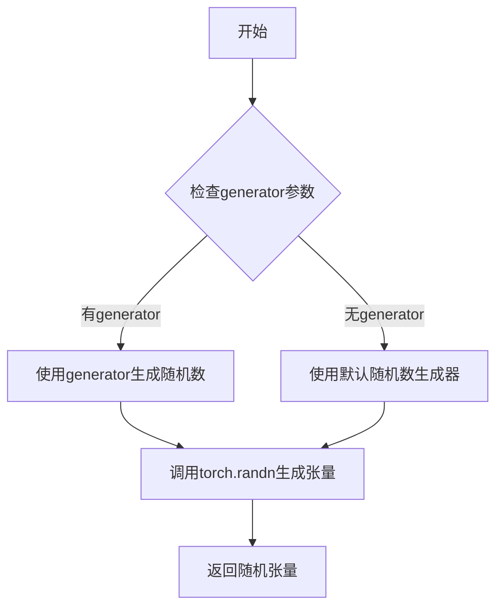
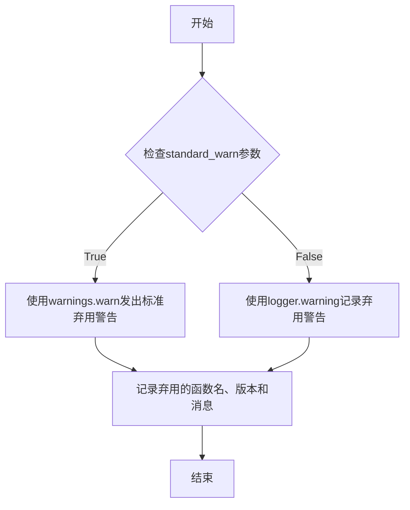
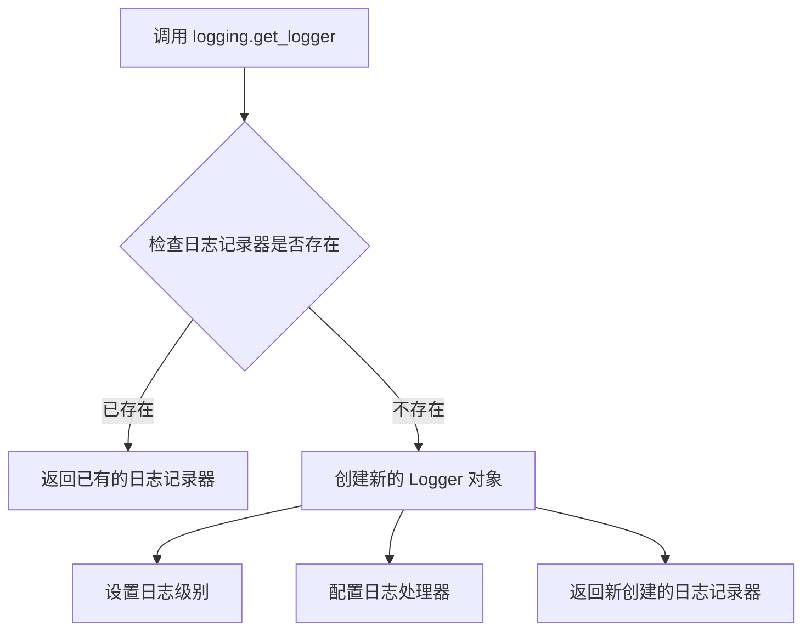
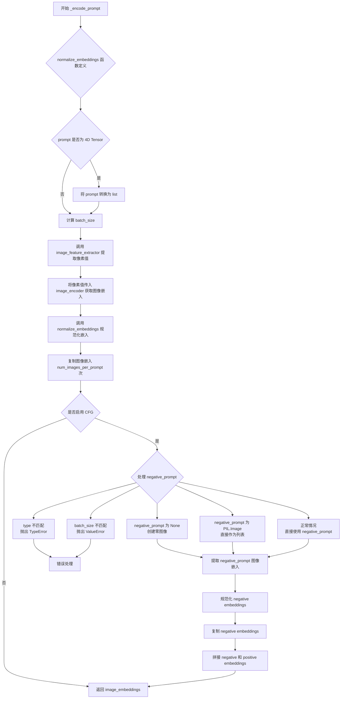
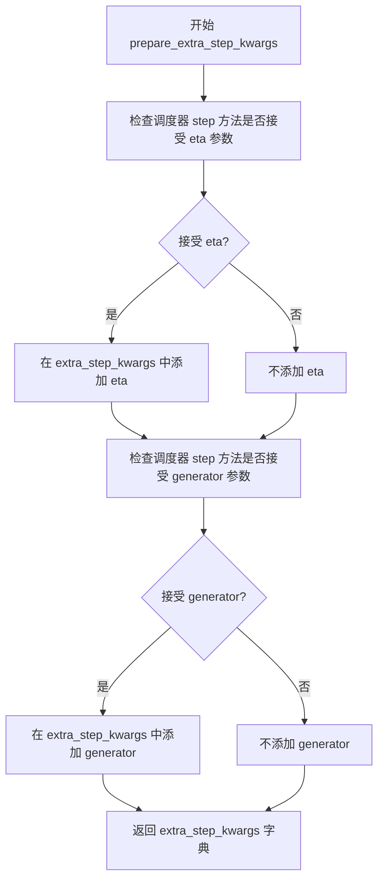
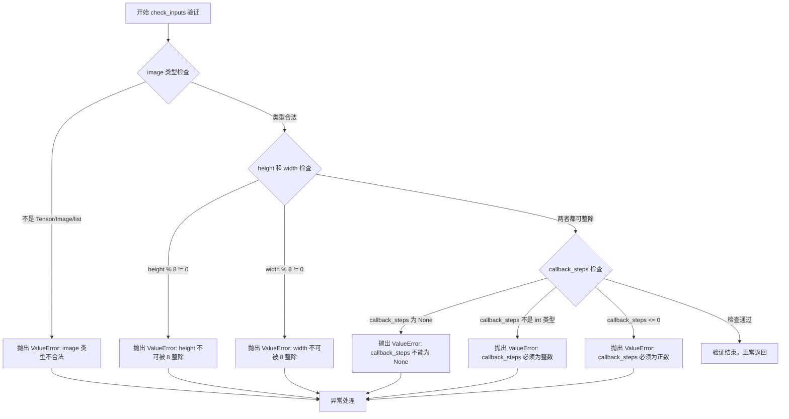
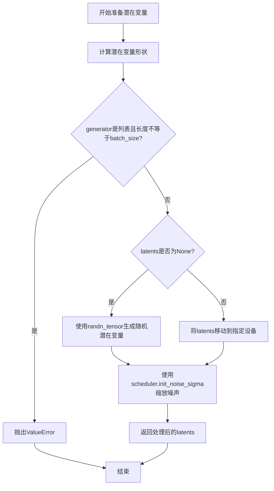
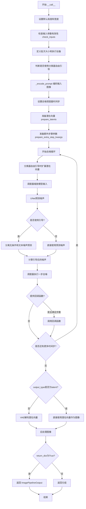

# `diffusers\src\diffusers\pipelines\deprecated\versatile_diffusion\pipeline_versatile_diffusion_image_variation.py` 详细设计文档

VersatileDiffusionImageVariationPipeline是Hugging Face Diffusers库中的一个图像变化生成管道，继承自DiffusionPipeline。它利用CLIP图像编码器提取图像特征，通过UNet2DConditionModel进行条件去噪扩散过程，并使用AutoencoderKL (VAE) 解码潜在表示生成图像变体。该管道支持分类器-free guidance、负面提示词、随机种子控制等高级功能，可生成与输入图像风格或内容相关联的新图像。

## 整体流程

```mermaid
graph TD
A[开始: 输入图像] --> B[检查输入有效性 check_inputs]
B --> C[定义批次大小和设备]
C --> D[编码输入图像 _encode_prompt]
D --> E[设置扩散调度器 timesteps]
E --> F[准备潜在变量 prepare_latents]
F --> G[准备额外调度器参数 prepare_extra_step_kwargs]
G --> H{迭代去噪循环}
H -->|是| I[扩展潜在变量 (classifier-free guidance)]
I --> J[调度器缩放模型输入]
J --> K[UNet预测噪声残差]
K --> L{是否启用guidance?}
L -->|是| M[计算guidance后的噪声预测]
L -->|否| N[直接使用预测噪声]
M --> O[调度器执行去噪步骤]
N --> O
O --> P{是否需要callback?}
P -->|是| Q[调用callback函数]
Q --> H
P -->|否| H
H -->|否| R{output_type == 'latent'?}
R -->|否| S[VAE解码潜在变量]
R -->|是| T[直接使用潜在变量]
S --> U[后处理图像 image_processor.postprocess]
T --> U
U --> V[结束: 返回生成的图像]
```

## 类结构

```
DiffusionPipeline (抽象基类)
└── VersatileDiffusionImageVariationPipeline (图像变化管道)
```

## 全局变量及字段


### `logger`
    
模块级日志记录器，用于输出运行时信息

类型：`logging.Logger`
    


### `np`
    
NumPy库，用于数值计算和数组操作

类型：`numpy`
    


### `PIL.Image`
    
Pillow图像处理模块，用于图像加载和处理

类型：`PIL.Image`
    


### `torch`
    
PyTorch深度学习框架，用于张量运算和模型构建

类型：`torch`
    


### `inspect`
    
Python内省模块，用于检查对象签名和源码

类型：`inspect`
    


### `Callable`
    
类型提示，表示可调用对象

类型：`typing.Callable`
    


### `VersatileDiffusionImageVariationPipeline.model_cpu_offload_seq`
    
CPU卸载顺序配置字符串，指定模型各组件的CPU卸载优先级

类型：`str`
    


### `VersatileDiffusionImageVariationPipeline.image_feature_extractor`
    
CLIP图像特征提取器，用于从输入图像中提取特征

类型：`CLIPImageProcessor`
    


### `VersatileDiffusionImageVariationPipeline.image_encoder`
    
CLIP视觉编码器，将图像转换为向量表示

类型：`CLIPVisionModelWithProjection`
    


### `VersatileDiffusionImageVariationPipeline.image_unet`
    
条件UNet去噪模型，用于在扩散过程中预测噪声

类型：`UNet2DConditionModel`
    


### `VersatileDiffusionImageVariationPipeline.vae`
    
VAE变分自编码器，用于图像的编码和解码

类型：`AutoencoderKL`
    


### `VersatileDiffusionImageVariationPipeline.scheduler`
    
Karras扩散调度器，控制扩散过程的噪声调度

类型：`KarrasDiffusionSchedulers`
    


### `VersatileDiffusionImageVariationPipeline.vae_scale_factor`
    
VAE缩放因子，用于调整潜在空间的尺寸

类型：`int`
    


### `VersatileDiffusionImageVariationPipeline.image_processor`
    
VAE图像处理器，用于图像的后处理和格式转换

类型：`VaeImageProcessor`
    
    

## 全局函数及方法


### randn_tensor

该函数用于生成指定形状的随机张量（服从标准正态分布），常用于扩散模型的噪声采样过程。

参数：

- `shape`：`tuple` 或 `int`，输出张量的形状
- `generator`：`torch.Generator`，可选，用于控制随机数生成的生成器，以确保可复现性
- `device`：`torch.device`，生成张量所在的设备（如CPU或CUDA）
- `dtype`：`torch.dtype`，生成张量的数据类型（如float32、float16等）

返回值：`torch.Tensor`，符合指定形状、设备和数据类型的随机张量

#### 流程图



#### 带注释源码

```
# randn_tensor 函数定义于 diffusers/src/diffusers/utils/torch_utils.py

def randn_tensor(
    shape: tuple,
    generator: Optional[torch.Generator] = None,
    device: Optional[torch.device] = None,
    dtype: Optional[torch.dtype] = None,
) -> torch.Tensor:
    """
    生成一个随机张量（服从标准正态分布）
    
    参数:
        shape: 张量的形状，可以是整数或整数元组
        generator: 可选的PyTorch生成器，用于生成确定性随机数
        device: 目标设备（cpu/cuda）
        dtype: 目标数据类型
        
    返回:
        随机张量
    """
    # 如果传入了生成器，使用生成器生成随机张量
    # 否则使用默认的随机数生成方式
    if generator is not None:
        # 使用生成器生成随机数，确保可复现性
        tensor = torch.randn(shape, generator=generator, device=device, dtype=dtype)
    else:
        # 直接生成随机张量
        tensor = torch.randn(shape, device=device, dtype=dtype)
    
    return tensor
```

**注意**：该函数在当前代码中通过 `from ....utils.torch_utils import randn_tensor` 导入，并在 `prepare_latents` 方法中被调用，用于生成扩散模型的初始噪声：

```python
latents = randn_tensor(shape, generator=generator, device=device, dtype=dtype)
```


### `deprecate`

该函数是diffusers库中的通用弃用工具函数，用于在代码中标记已弃用的功能，并向用户发出警告。

参数：

- `deprecated_fn_name`：`str`，被弃用的函数或方法的名称
- `deprecation_version`：`str`，计划移除该功能的版本号
- `deprecation_message`：`str`，详细的弃用说明信息
- `standard_warn`：`bool`，是否使用标准警告格式，默认为`True`

返回值：`None`，该函数不返回任何值，仅发出警告

#### 流程图



#### 带注释源码

```python
# 这是一个从diffusers.utils模块导入的通用弃用函数
# 用于标记代码中即将废弃的功能

# 在VersatileDiffusionImageVariationPipeline.decode_latents中的使用示例：
def decode_latents(self, latents):
    # 定义弃用说明消息
    deprecation_message = "The decode_latents method is deprecated and will be removed in 1.0.0. Please use VaeImageProcessor.postprocess(...) instead"
    
    # 调用deprecate函数发出弃用警告
    # 参数1: 被弃用的方法名
    # 参数2: 计划移除版本
    # 参数3: 弃用详细消息
    # 参数4: standard_warn=False使用自定义日志格式而非标准warnings
    deprecate("decode_latents", "1.0.0", deprecation_message, standard_warn=False)

    # 原有功能实现（将被移除）
    latents = 1 / self.vae.config.scaling_factor * latents
    image = self.vae.decode(latents, return_dict=False)[0]
    image = (image / 2 + 0.5).clamp(0, 1)
    # 转换为float32格式以兼容各种设备
    image = image.cpu().permute(0, 2, 3, 1).float().numpy()
    return image
```


### `logging.get_logger`

获取或创建一个与指定名称关联的日志记录器（Logger），用于在模块中记录日志信息。该函数是 Python 标准库 `logging.getLogger()` 的封装，通常在模块初始化时调用，为当前模块创建一个专属的日志记录器。

参数：

- `name`：`str`，日志记录器的名称，通常使用 `__name__` 变量来获取当前模块的全限定名（如 `diffusers.pipelines.versatile_diffusion.pipeline_versatile_diffusion_image_variation`）

返回值：`logging.Logger`，返回一个日志记录器（Logger）对象，用于记录日志信息

#### 流程图



#### 带注释源码

```python
# 从 diffusers 库的 utils 模块导入 logging 对象
from ....utils import deprecate, logging

# 使用当前模块的 __name__ 作为日志记录器的名称
# __name__ 会自动展开为模块的全限定路径，例如：
# diffusers.pipelines.versatile_diffusion.pipeline_versatile_diffusion_image_variation
logger = logging.get_logger(__name__)  # pylint: disable=invalid-name

# 源码逻辑（基于 Python 标准库 logging.getLogger）
# def get_logger(name: str) -> logging.Logger:
#     """
#     获取或创建一个日志记录器
#     
#     参数:
#         name: 日志记录器的名称，通常使用 __name__
#     
#     返回值:
#         Logger 对象
#     """
#     # 1. 检查内部缓存中是否已存在该名称的日志记录器
#     # 2. 如果存在，直接返回
#     # 3. 如果不存在，则创建新的 Logger 对象
#     #    - 设置 name 属性
#     #    - 设置日志级别（通常为 WARNING 级别）
#     #    - 添加默认的处理器（Handler）
#     #    - 设置日志格式
#     # 4. 将新创建的记录器缓存并返回
```


### `VersatileDiffusionImageVariationPipeline.__init__`

这是 Versatile Diffusion 图像变化管道的初始化方法，负责接收并注册各种模型组件（如图像特征提取器、图像编码器、UNet、VAE 和调度器），并初始化 VAE 比例因子和图像处理器，为后续的图像生成任务做好准备。

参数：

- `image_feature_extractor`：`CLIPImageProcessor`，用于从输入图像中提取特征的处理器
- `image_encoder`：`CLIPVisionModelWithProjection`，用于将图像编码为嵌入向量的视觉模型
- `image_unet`：`UNet2DConditionModel`，用于去噪图像潜在表示的 UNet 模型
- `vae`：`AutoencoderKL`，用于编码和解码图像潜在表示的变分自编码器
- `scheduler`：`KarrasDiffusionSchedulers`，用于控制去噪过程的调度器

返回值：`None`，该方法不返回任何值，仅初始化对象状态

#### 流程图

```mermaid
flowchart TD
    A[开始 __init__] --> B[调用 super().__init__ 初始化父类]
    B --> C[调用 register_modules 注册所有子模块]
    C --> D{检查 vae 是否存在}
    D -->|是| E[计算 vae_scale_factor: 2^(len(vae.config.block_out_channels) - 1)]
    D -->|否| F[设置 vae_scale_factor 为 8]
    E --> G[创建 VaeImageProcessor 实例]
    F --> G
    G --> H[结束 __init__]
```

#### 带注释源码

```python
def __init__(
    self,
    image_feature_extractor: CLIPImageProcessor,
    image_encoder: CLIPVisionModelWithProjection,
    image_unet: UNet2DConditionModel,
    vae: AutoencoderKL,
    scheduler: KarrasDiffusionSchedulers,
):
    """
    初始化 VersatileDiffusionImageVariationPipeline 管道。
    
    参数:
        image_feature_extractor: CLIP 图像特征提取器，用于预处理输入图像
        image_encoder: CLIP 视觉编码器带投影，将图像转换为嵌入向量
        image_unet: 条件 2D UNet 模型，用于去噪图像潜在表示
        vae: 自动编码器 KL，用于图像的编码和解码
        scheduler: Karras 扩散调度器，控制去噪过程的噪声调度
    """
    # 调用父类 DiffusionPipeline 的初始化方法
    super().__init__()
    
    # 注册所有子模块，使其可以通过 pipeline 的属性访问
    self.register_modules(
        image_feature_extractor=image_feature_extractor,
        image_encoder=image_encoder,
        image_unet=image_unet,
        vae=vae,
        scheduler=scheduler,
    )
    
    # 计算 VAE 缩放因子，用于调整潜在空间的维度
    # 基于 VAE 块输出通道数计算: 2^(num_blocks - 1)
    # 如果 VAE 不存在，则默认为 8
    self.vae_scale_factor = 2 ** (len(self.vae.config.block_out_channels) - 1) if getattr(self, "vae", None) else 8
    
    # 创建图像后处理器，用于将潜在表示转换为最终图像
    self.image_processor = VaeImageProcessor(vae_scale_factor=self.vae_scale_factor)
```


### `VersatileDiffusionImageVariationPipeline._encode_prompt`

该方法负责将输入的图像编码为图像嵌入向量（image embeddings），支持 classifier-free guidance（无分类器引导）技术，可根据是否启用引导来返回条件嵌入或同时包含无条件嵌入的组合。

参数：

- `prompt`：`str` or `list[str]` or `torch.Tensor`，输入的图像提示，用于生成图像变体
- `device`：`torch.device`，torch 设备，用于执行计算
- `num_images_per_prompt`：`int`，每个提示需要生成的图像数量
- `do_classifier_free_guidance`：`bool`，是否使用 classifier-free guidance
- `negative_prompt`：`str or list[str]`，不希望出现在生成图像中的负向提示

返回值：`torch.Tensor`，编码后的图像嵌入向量，用于后续的 UNet 去噪过程

#### 流程图



#### 带注释源码

```python
def _encode_prompt(self, prompt, device, num_images_per_prompt, do_classifier_free_guidance, negative_prompt):
    r"""
    Encodes the prompt into text encoder hidden states.

    Args:
        prompt (`str` or `list[str]`):
            prompt to be encoded
        device: (`torch.device`):
            torch device
        num_images_per_prompt (`int`):
            number of images that should be generated per prompt
        do_classifier_free_guidance (`bool`):
            whether to use classifier free guidance or not
        negative_prompt (`str` or `list[str]`):
            The prompt or prompts not to guide the image generation. Ignored when not using guidance (i.e., ignored
            if `guidance_scale` is less than `1`).
    """

    # 定义内部函数：规范化图像嵌入
    def normalize_embeddings(encoder_output):
        # 1. 通过 post_layernorm 处理隐藏状态
        embeds = self.image_encoder.vision_model.post_layernorm(encoder_output.last_hidden_state)
        # 2. 应用视觉投影层
        embeds = self.image_encoder.visual_projection(embeds)
        # 3. 提取池化后的嵌入（第0个token）
        embeds_pooled = embeds[:, 0:1]
        # 4. L2 规范化嵌入
        embeds = embeds / torch.norm(embeds_pooled, dim=-1, keepdim=True)
        return embeds

    # 处理输入：如果 prompt 是 4D Tensor，转换为 list
    if isinstance(prompt, torch.Tensor) and len(prompt.shape) == 4:
        prompt = list(prompt)

    # 计算批次大小
    batch_size = len(prompt) if isinstance(prompt, list) else 1

    # ========== 步骤1: 获取提示的图像嵌入 ==========
    # 使用图像特征提取器处理输入图像
    image_input = self.image_feature_extractor(images=prompt, return_tensors="pt")
    # 获取像素值并移动到指定设备，转换为 encoder 支持的数据类型
    pixel_values = image_input.pixel_values.to(device).to(self.image_encoder.dtype)
    # 通过图像编码器获取嵌入
    image_embeddings = self.image_encoder(pixel_values)
    # 规范化嵌入向量
    image_embeddings = normalize_embeddings(image_embeddings)

    # ========== 步骤2: 复制图像嵌入以匹配每个提示生成的图像数量 ==========
    # 获取嵌入的形状：(batch_size, seq_len, hidden_dim)
    bs_embed, seq_len, _ = image_embeddings.shape
    # 在序列维度重复，以匹配 num_images_per_prompt
    image_embeddings = image_embeddings.repeat(1, num_images_per_prompt, 1)
    # 重塑为：(batch_size * num_images_per_prompt, seq_len, hidden_dim)
    image_embeddings = image_embeddings.view(bs_embed * num_images_per_prompt, seq_len, -1)

    # ========== 步骤3: 获取无条件嵌入（用于 classifier-free guidance） ==========
    if do_classifier_free_guidance:
        uncond_images: list[str]
        # 处理不同的 negative_prompt 情况
        if negative_prompt is None:
            # 如果没有提供负向提示，创建灰色零图像
            uncond_images = [np.zeros((512, 512, 3)) + 0.5] * batch_size
        elif type(prompt) is not type(negative_prompt):
            # 类型不匹配，抛出类型错误
            raise TypeError(
                f"`negative_prompt` should be the same type to `prompt`, but got {type(negative_prompt)} !="
                f" {type(prompt)}."
            )
        elif isinstance(negative_prompt, PIL.Image.Image):
            # 负向提示是单张图像
            uncond_images = [negative_prompt]
        elif batch_size != len(negative_prompt):
            # 批次大小不匹配
            raise ValueError(
                f"`negative_prompt`: {negative_prompt} has batch size {len(negative_prompt)}, but `prompt`:"
                f" {prompt} has batch size {batch_size}. Please make sure that passed `negative_prompt` matches"
                " the batch size of `prompt`."
            )
        else:
            # 正常情况
            uncond_images = negative_prompt

        # 提取负向提示的图像嵌入
        uncond_images = self.image_feature_extractor(images=uncond_images, return_tensors="pt")
        pixel_values = uncond_images.pixel_values.to(device).to(self.image_encoder.dtype)
        negative_prompt_embeds = self.image_encoder(pixel_values)
        negative_prompt_embeds = normalize_embeddings(negative_prompt_embeds)

        # 复制无条件嵌入
        seq_len = negative_prompt_embeds.shape[1]
        negative_prompt_embeds = negative_prompt_embeds.repeat(1, num_images_per_prompt, 1)
        negative_prompt_embeds = negative_prompt_embeds.view(batch_size * num_images_per_prompt, seq_len, -1)

        # 为了避免两次前向传播，将无条件嵌入和条件嵌入拼接在一起
        # 拼接后的顺序：[negative_prompt_embeds, image_embeddings]
        image_embeddings = torch.cat([negative_prompt_embeds, image_embeddings])

    return image_embeddings
```


### `VersatileDiffusionImageVariationPipeline.decode_latents`

该方法用于将VAE的潜在表示解码为实际的图像输出。它通过逆缩放潜在向量、使用VAE解码器解码、调整像素值范围至[0,1]，并最终将张量转换为NumPy数组格式返回。

参数：

- `latents`：`torch.Tensor`，需要解码的VAE潜在表示张量

返回值：`numpy.ndarray`，解码后的图像，形状为(batch_size, height, width, channels)，像素值范围在[0, 1]

#### 流程图

```mermaid
flowchart TD
    A[开始: decode_latents] --> B[记录废弃警告]
    B --> C[缩放latents: latents = 1/scaling_factor * latents]
    C --> D[VAE解码: image = vae.decode(latents)]
    D --> E[调整像素范围: image = (image/2 + 0.5).clamp(0, 1)]
    E --> F[转换为NumPy: image.cpu().permute(0, 2, 3, 1).float().numpy()]
    F --> G[返回图像数组]
```

#### 带注释源码

```python
def decode_latents(self, latents):
    """
    将潜在表示解码为图像
    
    Args:
        latents: VAE潜在表示张量
        
    Returns:
        解码后的图像数组
    """
    # 记录废弃警告，提示用户使用VaeImageProcessor.postprocess替代
    deprecation_message = "The decode_latents method is deprecated and will be removed in 1.0.0. Please use VaeImageProcessor.postprocess(...) instead"
    deprecate("decode_latents", "1.0.0", deprecation_message, standard_warn=False)

    # 1. 逆缩放latents（抵消编码时的缩放）
    latents = 1 / self.vae.config.scaling_factor * latents
    
    # 2. 使用VAE解码器将潜在表示解码为图像
    image = self.vae.decode(latents, return_dict=False)[0]
    
    # 3. 将图像像素值从[-1,1]范围调整到[0,1]范围
    # VAE输出通常在[-1, 1]区间，通过(image/2 + 0.5)转换到[0, 1]
    image = (image / 2 + 0.5).clamp(0, 1)
    
    # 4. 将图像张量转换为NumPy数组
    # - .cpu() 将张量移至CPU（如果之前在GPU上）
    # - .permute(0, 2, 3, 1) 将通道维度从CHW重排为HWC
    # - .float() 确保转换为float32（兼容性好，不会造成显著开销）
    # - .numpy() 转换为NumPy数组
    image = image.cpu().permute(0, 2, 3, 1).float().numpy()
    
    # 5. 返回解码后的图像数组
    return image
```


### `VersatileDiffusionImageVariationPipeline.prepare_extra_step_kwargs`

该方法用于为调度器（scheduler）的步骤准备额外的关键字参数。由于不同调度器的 `step` 方法签名可能不同，该方法通过检查目标调度器是否接受特定参数（如 `eta` 和 `generator`）来动态构建参数字典，确保调用调度器时的兼容性。

参数：

- `generator`：`torch.Generator | list[torch.Generator] | None`，可选的随机数生成器，用于确保生成过程的可重复性
- `eta`：`float`，DDIM 调度器使用的 eta 参数（值为 0 到 1 之间），其他调度器会忽略此参数

返回值：`dict`，包含调度器 `step` 方法所需的关键字参数字典，可能包含 `eta` 和/或 `generator` 键

#### 流程图



#### 带注释源码

```python
def prepare_extra_step_kwargs(self, generator, eta):
    """
    为调度器步骤准备额外的关键字参数。
    
    由于并非所有调度器都具有相同的签名，此方法用于检查目标调度器
    是否支持特定参数（eta 和 generator），并构建兼容的参数字典。
    
    参数:
        generator: 可选的 torch.Generator，用于生成确定性随机数
        eta: float，仅被 DDIMScheduler 使用，其他调度器会忽略此参数
              对应 DDIM 论文中的 η 参数，范围应为 [0, 1]
    
    返回:
        dict: 包含调度器 step 方法所需参数的关键字参数字典
    """
    
    # 使用 inspect 模块检查调度器 step 方法的签名
    # 判断该调度器是否支持 eta 参数
    accepts_eta = "eta" in set(inspect.signature(self.scheduler.step).parameters.keys())
    
    # 初始化空字典用于存储额外参数
    extra_step_kwargs = {}
    
    # 如果调度器接受 eta 参数，则将其添加到参数字典中
    if accepts_eta:
        extra_step_kwargs["eta"] = eta

    # 检查调度器是否接受 generator 参数
    accepts_generator = "generator" in set(inspect.signature(self.scheduler.step).parameters.keys())
    
    # 如果调度器接受 generator 参数，则将其添加到参数字典中
    if accepts_generator:
        extra_step_kwargs["generator"] = generator
    
    # 返回构建好的参数字典，供调度器 step 方法使用
    return extra_step_kwargs
```


### `VersatileDiffusionImageVariationPipeline.check_inputs`

该方法用于验证图像生成管道的输入参数是否合法，包括检查图像类型是否为支持的格式（torch.Tensor、PIL.Image.Image 或列表），以及验证高度和宽度是否可被 8 整除，同时确保回调步骤为正整数。如果任何检查失败，该方法将抛出详细的 ValueError 异常。

参数：

- `image`：`torch.Tensor | PIL.Image.Image | list[PIL.Image.Image]`，需要生成图像变化的输入图像，支持单张 PIL 图像、图像列表或 PyTorch 张量
- `height`：`int`，生成图像的高度（像素），必须能被 8 整除
- `width`：`int`，生成图像的宽度（像素），必须能被 8 整除
- `callback_steps`：`int`，回调函数被调用的频率，必须为正整数

返回值：`None`，该方法不返回任何值，仅通过抛出 ValueError 异常来指示输入验证失败

#### 流程图



#### 带注释源码

```python
# Copied from diffusers.pipelines.stable_diffusion.pipeline_stable_diffusion_image_variation.StableDiffusionImageVariationPipeline.check_inputs
def check_inputs(self, image, height, width, callback_steps):
    """
    检查输入参数的有效性，确保生成管道能够正确执行。
    
    Args:
        image: 输入图像，可以是 PyTorch 张量、PIL 图像或图像列表
        height: 期望输出的图像高度
        width: 期望输出的图像宽度
        callback_steps: 回调函数被调用的步数间隔
    """
    
    # 检查 image 参数的类型是否为支持的格式
    # 支持的类型包括: torch.Tensor, PIL.Image.Image, list[PIL.Image.Image]
    if (
        not isinstance(image, torch.Tensor)
        and not isinstance(image, PIL.Image.Image)
        and not isinstance(image, list)
    ):
        raise ValueError(
            "`image` has to be of type `torch.Tensor` or `PIL.Image.Image` or `list[PIL.Image.Image]` but is"
            f" {type(image)}"
        )

    # 检查高度和宽度是否可被 8 整除
    # 这是因为 VAE 的下采样因子通常为 8，需要保证生成的潜在表示能够正确解码
    if height % 8 != 0 or width % 8 != 0:
        raise ValueError(f"`height` and `width` have to be divisible by 8 but are {height} and {width}.")

    # 检查 callback_steps 参数的有效性
    # 必须为正整数，用于控制推理过程中回调函数的调用频率
    if (callback_steps is None) or (
        callback_steps is not None and (not isinstance(callback_steps, int) or callback_steps <= 0)
    ):
        raise ValueError(
            f"`callback_steps` has to be a positive integer but is {callback_steps} of type"
            f" {type(callback_steps)}."
        )
```


### `VersatileDiffusionImageVariationPipeline.prepare_latents`

该方法用于准备扩散模型的初始潜在变量（latents），即生成图像所需的噪声表示。它根据指定的批次大小、图像尺寸和潜在变量通道数构建潜在变量张量，并使用随机生成器（若提供）或从外部传入的潜在变量进行初始化，最后按照调度器的要求进行噪声缩放。

参数：

- `batch_size`：`int`，批次大小，即一次生成多少个图像变体
- `num_channels_latents`：`int`，潜在变量的通道数，通常对应于UNet模型的输入通道数
- `height`：`int`，生成图像的高度（像素）
- `width`：`int`，生成图像的宽度（像素）
- `dtype`：`torch.dtype`，潜在变量的数据类型（如torch.float32）
- `device`：`torch.device`，潜在变量存放的设备（如cuda或cpu）
- `generator`：`torch.Generator | list[torch.Generator] | None`，用于生成随机潜在变量的随机生成器，可选
- `latents`：`torch.Tensor | None`，预生成的潜在变量，若为None则随机生成，可选

返回值：`torch.Tensor`，准备好的潜在变量张量，形状为(batch_size, num_channels_latents, height//vae_scale_factor, width//vae_scale_factor)

#### 流程图



#### 带注释源码

```python
def prepare_latents(self, batch_size, num_channels_latents, height, width, dtype, device, generator, latents=None):
    # 计算潜在变量的形状：批次大小 × 通道数 × (高度//VAE缩放因子) × (宽度//VAE缩放因子)
    # VAE的缩放因子用于将像素空间映射到潜在空间
    shape = (
        batch_size,
        num_channels_latents,
        int(height) // self.vae_scale_factor,
        int(width) // self.vae_scale_factor,
    )
    
    # 验证生成器列表长度与批次大小是否匹配
    # 如果不匹配说明用户提供的随机生成器数量与请求的批次数量不一致
    if isinstance(generator, list) and len(generator) != batch_size:
        raise ValueError(
            f"You have passed a list of generators of length {len(generator)}, but requested an effective batch"
            f" size of {batch_size}. Make sure the batch size matches the length of the generators."
        )

    # 根据是否有预提供的潜在变量进行不同处理
    if latents is None:
        # 未提供潜在变量时，使用randn_tensor从随机分布中采样生成
        # generator确保结果可复现，device和dtype确保张量在正确的设备和数据类型上
        latents = randn_tensor(shape, generator=generator, device=device, dtype=dtype)
    else:
        # 已提供潜在变量时，直接将其移动到目标设备
        # 注意：这里没有进行类型转换，假设传入的latents类型已正确
        latents = latents.to(device)

    # 使用调度器的初始噪声标准差缩放初始噪声
    # 不同的调度器（如DDIM、LMS等）可能对初始噪声有不同的缩放要求
    # 这是为了确保噪声的分布符合调度器算法的预期
    latents = latents * self.scheduler.init_noise_sigma
    
    return latents
```


### `VersatileDiffusionImageVariationPipeline.__call__`

该方法是VersatileDiffusion图像变化管道的核心调用函数，接收输入图像并通过CLIP图像编码器提取图像特征，然后利用UNet2DConditionModel在去噪循环中根据图像嵌入向量预测噪声，最终通过VAE解码器将潜在向量解码为输出图像，支持分类器自由引导、多图像生成、回调函数等高级功能。

参数：

- `image`：`PIL.Image.Image | list[PIL.Image.Image] | torch.Tensor`，输入图像prompt，用于引导图像生成
- `height`：`int | None`，生成图像的高度，默认为unet配置sample_size乘以vae_scale_factor
- `width`：`int | None`，生成图像的宽度，默认为unet配置sample_size乘以vae_scale_factor
- `num_inference_steps`：`int`，去噪步数，步数越多通常图像质量越高但推理速度越慢
- `guidance_scale`：`float`，引导尺度，值越大与输入图像关联越紧密但可能牺牲图像质量
- `negative_prompt`：`str | list[str] | None`，负面prompt，用于指定不想在图像中出现的内容
- `num_images_per_prompt`：`int`，每个prompt生成的图像数量
- `eta`：`float`，DDIM调度器参数η，仅对DDIMScheduler有效
- `generator`：`torch.Generator | list[torch.Generator] | None`，用于使生成过程确定性的随机生成器
- `latents`：`torch.Tensor | None`，预生成的噪声潜在向量，可用于相同生成的不同prompt
- `output_type`：`str | None`，生成图像的输出格式，可选"pil"或np.array
- `return_dict`：`bool`，是否返回PipelineOutput对象而非元组
- `callback`：`Callable[[int, int, torch.Tensor], None] | None`，每callback_steps步调用的回调函数
- `callback_steps`：`int`，回调函数被调用的频率
- `**kwargs`：其他关键字参数

返回值：`ImagePipelineOutput | tuple`，当return_dict为True时返回ImagePipelineOutput对象，包含生成的图像列表；否则返回元组

#### 流程图



#### 带注释源码

```python
@torch.no_grad()
def __call__(
    self,
    image: PIL.Image.Image | list[PIL.Image.Image] | torch.Tensor,
    height: int | None = None,
    width: int | None = None,
    num_inference_steps: int = 50,
    guidance_scale: float = 7.5,
    negative_prompt: str | list[str] | None = None,
    num_images_per_prompt: int | None = 1,
    eta: float = 0.0,
    generator: torch.Generator | list[torch.Generator] | None = None,
    latents: torch.Tensor | None = None,
    output_type: str | None = "pil",
    return_dict: bool = True,
    callback: Callable[[int, int, torch.Tensor], None] | None = None,
    callback_steps: int = 1,
    **kwargs,
):
    r"""
    The call function to the pipeline for generation.

    Args:
        image (`PIL.Image.Image`, `list[PIL.Image.Image]` or `torch.Tensor`):
            The image prompt or prompts to guide the image generation.
        height (`int`, *optional*, defaults to `self.image_unet.config.sample_size * self.vae_scale_factor`):
            The height in pixels of the generated image.
        width (`int`, *optional*, defaults to `self.image_unet.config.sample_size * self.vae_scale_factor`):
            The width in pixels of the generated image.
        num_inference_steps (`int`, *optional*, defaults to 50):
            The number of denoising steps. More denoising steps usually lead to a higher quality image at the
            expense of slower inference.
        guidance_scale (`float`, *optional*, defaults to 7.5):
            A higher guidance scale value encourages the model to generate images closely linked to the text
            `prompt` at the expense of lower image quality. Guidance scale is enabled when `guidance_scale > 1`.
        negative_prompt (`str` or `list[str]`, *optional*):
            The prompt or prompts to guide what to not include in image generation. If not defined, you need to
            pass `negative_prompt_embeds` instead. Ignored when not using guidance (`guidance_scale < 1`).
        num_images_per_prompt (`int`, *optional*, defaults to 1):
            The number of images to generate per prompt.
        eta (`float`, *optional*, defaults to 0.0):
            Corresponds to parameter eta (η) from the [DDIM](https://huggingface.co/papers/2010.02502) paper. Only
            applies to the [`~schedulers.DDIMScheduler`], and is ignored in other schedulers.
        generator (`torch.Generator`, *optional*):
            A [`torch.Generator`](https://pytorch.org/docs/stable/generated/torch.Generator.html) to make
            generation deterministic.
        latents (`torch.Tensor`, *optional*):
            Pre-generated noisy latents sampled from a Gaussian distribution, to be used as inputs for image
            generation. Can be used to tweak the same generation with different prompts. If not provided, a latents
            tensor is generated by sampling using the supplied random `generator`.
        output_type (`str`, *optional*, defaults to `"pil"`):
            The output format of the generated image. Choose between `PIL.Image` or `np.array`.
        return_dict (`bool`, *optional*, defaults to `True`):
            Whether or not to return a [`~pipelines.stable_diffusion.StableDiffusionPipelineOutput`] instead of a
            plain tuple.
        callback (`Callable`, *optional*):
            A function that calls every `callback_steps` steps during inference. The function is called with the
            following arguments: `callback(step: int, timestep: int, latents: torch.Tensor)`.
        callback_steps (`int`, *optional*, defaults to 1):
            The frequency at which the `callback` function is called. If not specified, the callback is called at
            every step.

    Examples:

    ```py
    >>> from diffusers import VersatileDiffusionImageVariationPipeline
    >>> import torch
    >>> import requests
    >>> from io import BytesIO
    >>> from PIL import Image

    >>> # let's download an initial image
    >>> url = "https://huggingface.co/datasets/diffusers/images/resolve/main/benz.jpg"

    >>> response = requests.get(url)
    >>> image = Image.open(BytesIO(response.content)).convert("RGB")

    >>> pipe = VersatileDiffusionImageVariationPipeline.from_pretrained(
    ...     "shi-labs/versatile-diffusion", torch_dtype=torch.float16
    ... )
    >>> pipe = pipe.to("cuda")

    >>> generator = torch.Generator(device="cuda").manual_seed(0)
    >>> image = pipe(image, generator=generator).images[0]
    >>> image.save("./car_variation.png")
    ```

    Returns:
        [`~pipelines.stable_diffusion.StableDiffusionPipelineOutput`] or `tuple`:
            If `return_dict` is `True`, [`~pipelines.stable_diffusion.StableDiffusionPipelineOutput`] is returned,
            otherwise a `tuple` is returned where the first element is a list with the generated images.
    """
    # 0. Default height and width to unet
    # 如果未提供height和width，则使用unet配置的sample_size乘以vae_scale_factor作为默认值
    height = height or self.image_unet.config.sample_size * self.vae_scale_factor
    width = width or self.image_unet.config.sample_size * self.vae_scale_factor

    # 1. Check inputs. Raise error if not correct
    # 验证输入参数是否符合要求：图像类型、高度宽度可被8整除、callback_steps为正整数
    self.check_inputs(image, height, width, callback_steps)

    # 2. Define call parameters
    # 确定批次大小：单个PIL图像为1，否则为图像列表长度
    batch_size = 1 if isinstance(image, PIL.Image.Image) else len(image)
    # 获取执行设备（可能已启用模型卸载）
    device = self._execution_device
    # here `guidance_scale` is defined analog to the guidance weight `w` of equation (2)
    # of the Imagen paper: https://huggingface.co/papers/2205.11487 . `guidance_scale = 1`
    # corresponds to doing no classifier free guidance.
    # 判断是否启用分类器自由引导（guidance_scale > 1.0）
    do_classifier_free_guidance = guidance_scale > 1.0

    # 3. Encode input prompt
    # 调用_encode_prompt方法将输入图像编码为图像嵌入向量
    # 同时处理负面提示嵌入（如果使用分类器自由引导）
    image_embeddings = self._encode_prompt(
        image, device, num_images_per_prompt, do_classifier_free_guidance, negative_prompt
    )

    # 4. Prepare timesteps
    # 设置去噪调度器的时间步，准备进行多步去噪
    self.scheduler.set_timesteps(num_inference_steps, device=device)
    timesteps = self.scheduler.timesteps

    # 5. Prepare latent variables
    # 获取UNet的输入通道数，确定潜在向量的维度
    num_channels_latents = self.image_unet.config.in_channels
    # 准备初始潜在向量（噪声），考虑批量大小和每prompt生成的图像数量
    latents = self.prepare_latents(
        batch_size * num_images_per_prompt,
        num_channels_latents,
        height,
        width,
        image_embeddings.dtype,
        device,
        generator,
        latents,
    )

    # 6. Prepare extra step kwargs.
    # 为调度器准备额外的关键字参数（如DDIM的eta参数和generator）
    extra_step_kwargs = self.prepare_extra_step_kwargs(generator, eta)

    # 7. Denoising loop
    # 遍历所有时间步进行去噪循环
    for i, t in enumerate(self.progress_bar(timesteps)):
        # expand the latents if we are doing classifier free guidance
        # 如果使用分类器自由引导，需要复制潜在向量（前半部分用于无条件预测，后半部分用于条件预测）
        latent_model_input = torch.cat([latents] * 2) if do_classifier_free_guidance else latents
        # 调度器根据当前时间步缩放模型输入
        latent_model_input = self.scheduler.scale_model_input(latent_model_input, t)

        # predict the noise residual
        # 使用UNet预测噪声残差，传入缩放后的潜在向量、时间步和图像嵌入
        noise_pred = self.image_unet(latent_model_input, t, encoder_hidden_states=image_embeddings).sample

        # perform guidance
        # 如果使用分类器自由引导，将噪声预测分离为无条件预测和条件预测
        # 然后按照guidance_scale加权组合
        if do_classifier_free_guidance:
            noise_pred_uncond, noise_pred_text = noise_pred.chunk(2)
            noise_pred = noise_pred_uncond + guidance_scale * (noise_pred_text - noise_pred_uncond)

        # compute the previous noisy sample x_t -> x_t-1
        # 使用调度器根据预测的噪声计算前一时间步的潜在向量
        latents = self.scheduler.step(noise_pred, t, latents, **extra_step_kwargs).prev_sample

        # call the callback, if provided
        # 如果提供了回调函数且满足调用条件，则调用回调
        if callback is not None and i % callback_steps == 0:
            step_idx = i // getattr(self.scheduler, "order", 1)
            callback(step_idx, t, latents)

    # 8. Decode latents
    # 如果不需要潜在向量输出，则使用VAE解码器将潜在向量解码为图像
    if not output_type == "latent":
        # 需要先将潜在向量除以scaling_factor以匹配VAE的期望输入范围
        image = self.vae.decode(latents / self.vae.config.scaling_factor, return_dict=False)[0]
    else:
        # 如果output_type为latent，则直接使用潜在向量作为输出
        image = latents

    # 9. Post-process image
    # 使用图像处理器对输出图像进行后处理（归一化、转换格式等）
    image = self.image_processor.postprocess(image, output_type=output_type)

    # 10. Return output
    # 根据return_dict决定返回格式
    if not return_dict:
        return (image,)

    return ImagePipelineOutput(images=image)
```

## 关键组件


### VersatileDiffusionImageVariationPipeline

主Pipeline类，继承自DiffusionPipeline，用于基于Versatile Diffusion模型生成图像变体。该管道通过CLIP图像编码器提取图像特征，将其作为条件输入到UNet进行去噪扩散处理，最终通过VAE解码器将latent空间转换为图像。

### _encode_prompt

核心图像编码方法，将输入图像（ PIL.Image.Image、列表或Tensor）转换为CLIP图像embedding用于条件生成。支持分类器自由引导（Classifier-Free Guidance），通过normalize_embeddings函数对embedding进行L2归一化，并处理负样本提示词。

### decode_latents

已弃用的latent解码方法，将VAE的latent空间解码为图像。已被VaeImageProcessor.postprocess替代，该方法保留了向后兼容性接口。

### prepare_extra_step_kwargs

调度器参数准备方法，通过inspect检查调度器的step函数签名，动态提取eta和generator参数，确保与不同类型的调度器（DDIMScheduler、LMSDiscreteScheduler等）兼容。

### check_inputs

输入验证方法，检查图像类型（Tensor、PIL.Image或列表）、高度和宽度是否为8的倍数、callback_steps为正整数等约束条件。

### prepare_latents

初始噪声准备方法，根据批次大小、latent通道数和图像尺寸生成随机latent张量，或使用提供的latent。应用调度器的init_noise_sigma进行噪声缩放。

### __call__

主管道执行方法，实现完整的扩散推理流程：编码图像提示词→准备时间步→准备latent变量→去噪循环（UNet预测噪声+调度器去噪）→VAE解码→后处理输出。支持分类器自由引导、回调函数、多种输出格式。

### image_encoder (CLIPVisionModelWithProjection)

CLIP视觉编码器模型，负责将图像转换为视觉embedding向量。配置有post_layernorm和visual_projection层进行特征投影和归一化。

### vae (AutoencoderKL)

变分自编码器，负责将图像编码到latent空间以及从latent空间解码回图像。使用vae_scale_factor计算latent与像素空间的尺寸比例关系。

### image_unet (UNet2DConditionModel)

条件UNet模型，以图像embedding为条件进行噪声预测，执行去噪扩散过程。输入通道数配置决定了latent的维度。

### scheduler (KarrasDiffusionSchedulers)

扩散调度器，管理去噪过程的时间步和噪声调度策略。支持Karras噪声调度，用于改进生成质量。

### image_processor (VaeImageProcessor)

VAE图像处理器，负责图像的预处理（归一化、缩放）和后处理（转换回PIL.Image或numpy数组）。

### 模型CPU卸载序列 (model_cpu_offload_seq)

定义模型组件的CPU卸载顺序为"bert->unet->vqvae"，用于优化显存管理，按顺序将模型从GPU卸载到CPU。

### 分类器自由引导实现

在_encode_prompt和__call__中实现，通过串联负样本embedding和正样本embedding为单次前向传播，推理时通过chunk分离并计算加权差值实现引导。

### 回调机制

支持在去噪循环的指定步数调用回调函数，通过callback_steps控制调用频率，传递step_idx、timestep和latents信息用于监控和自定义处理。


## 问题及建议


### 已知问题

-   **硬编码的图像尺寸**：在 `_encode_prompt` 方法中，negative_prompt 为 None 时使用了硬编码的 512x512 分辨率（`np.zeros((512, 512, 3)) + 0.5`），缺乏灵活性
-   **弃用方法仍保留**：`decode_latents` 方法已被标记为弃用（`deprecate("decode_latents", "1.0.0", ...)`），但仍保留在代码中，增加维护负担
-   **类型提示兼容性**：使用了 Python 3.10+ 的 `|` 联合类型语法（如 `PIL.Image.Image | list[PIL.Image.Image]`），可能与较低版本的 Python 不兼容
-   **重复代码**：多个方法（`check_inputs`、`prepare_extra_step_kwargs`、`prepare_latents`）是从其他 Pipeline 复制的，未进行适当的抽象和复用
-   **negative_prompt 类型检查逻辑冗余**：在 `_encode_prompt` 中对 `negative_prompt` 类型的检查逻辑复杂且容易出错，类型比较使用了 `type() is not type()` 而非 `isinstance()`
- **未使用的参数**：`__call__` 方法接收 `**kwargs` 但未使用，增加了代码复杂性
- **模型卸载序列硬编码**：`model_cpu_offload_seq = "bert->unet->vqvae"` 序列与实际使用的模型组件不匹配（实际使用的是 `image_encoder` 而非 `bert`）

### 优化建议

-   将硬编码的 512x512 尺寸提取为类属性或配置参数，提高灵活性
-   移除弃用的 `decode_latents` 方法，或将其完全重定向到新的 `VaeImageProcessor.postprocess` 方法
-   使用 `typing.Union` 替代 `|` 语法以提高 Python 版本兼容性
-   将重复代码提取到基类或工具模块中，通过继承或组合复用
-   简化 negative_prompt 的类型检查逻辑，使用更清晰的 `isinstance()` 判断
-   添加模型卸载（model offload）支持或移除未使用的 `model_cpu_offload_seq` 属性
-   移除 `**kwargs` 或明确列出所有预期参数
-   修正 `model_cpu_offload_seq` 以匹配实际使用的组件名称

## 其它


### 设计目标与约束

本Pipeline的设计目标是实现基于Versatile Diffusion模型的图像变体生成功能，通过接收输入图像作为"提示"，利用CLIP图像编码器提取图像特征，然后通过UNet去噪过程生成与输入图像风格相关的新图像变体。核心约束包括：输入图像尺寸必须能被8整除；支持分类器自由引导(CFG)以提升生成质量；仅支持推理模式(torch.no_grad)；设备兼容性受限于CUDA和CPU。

### 错误处理与异常设计

Pipeline在多个关键点实现了输入验证和错误处理。在`check_inputs`方法中检查图像类型(支持torch.Tensor、PIL.Image.Image或list)、尺寸可整除性(8的倍数)以及callback_steps的有效性(正整数)。在`_encode_prompt`中验证negative_prompt与prompt的类型一致性、批量大小匹配性。异常处理采用明确的ValueError和TypeError抛出，配合详细的错误消息说明期望类型与实际类型。潜在改进：可添加重试机制处理临时性硬件错误、添加更细粒度的自定义异常类。

### 数据流与状态机

数据流遵循以下路径：输入图像 → CLIPImageProcessor提取像素值 → CLIPVisionModelWithProjection编码 → 归一化处理 → 与negative_prompt_embeds拼接(CFG模式) → 初始化噪声latents → UNet2DConditionModel迭代去噪(50步默认) → VAE解码 → VaeImageProcessor后处理 → 输出图像。状态转换由KarrasDiffusionSchedulers管理，包括timesteps设置、scale_model_input、step调用等关键状态转换点。

### 外部依赖与接口契约

核心依赖包括：transformers(CLIPImageProcessor、CLIPVisionModelWithProjection)、diffusers内部模块(AutoencoderKL、UNet2DConditionModel、KarrasDiffusionSchedulers、VaeImageProcessor)、numpy、PIL、torch。接口契约：__call__方法接收PIL.Image.Image或list或torch.Tensor作为image参数，支持可选的height/width/num_inference_steps/guidance_scale/negative_prompt等生成参数，返回ImagePipelineOutput或tuple。版本要求：Python 3.8+、PyTorch 1.9+、diffusers 1.0.0+。

### 性能考虑与优化建议

当前实现已包含model_cpu_offload_seq = "bert->unet->vqvae"实现CPU卸载顺序优化。性能瓶颈分析：去噪循环中每步进行两次UNet前向传播(CFG模式)，可考虑使用vae_slicing加速VAE解码。优化建议：实现梯度检查点以支持更大分辨率生成；添加xformers内存高效注意力支持；考虑使用torch.compile加速UNet推理；实现批处理请求队列以提高吞吐量。

### 安全性考虑

Pipeline不直接处理用户敏感数据，但图像处理涉及PIL和torch操作需注意：输入图像尺寸限制可防止资源耗尽攻击；generator参数可控制随机性但需验证来源可靠性；模型加载涉及远程权重获取需确保来源可信(官方huggingface hub)。当前未实现输入图像消毒或恶意内容检测，建议添加PIL图像格式验证和尺寸上限检查。

### 兼容性说明

本Pipeline继承自DiffusionPipeline基类，遵循diffusers库的标准化接口设计。与StableDiffusionPipeline系列保持方法签名兼容性(如decode_latents已标记废弃建议使用VaeImageProcessor.postprocess)。向后兼容性：decode_latents方法在1.0.0版本废弃；未来可能移除对np.array输出类型的直接支持，统一使用PIL.Image。设备兼容性：支持cuda/cpu/mps设备，通过self._execution_device自动检测。

### 使用示例与最佳实践

标准使用流程：1)通过from_pretrained加载预训练模型(建议指定torch_dtype=float16以提升速度)；2)将pipeline移至目标设备(pipe.to("cuda"))；3)准备输入图像(PIL.Image格式)；4)调用pipeline生成变体图像；5)保存结果。最佳实践：使用固定seed的generator确保可复现性；guidance_scale建议7.5左右；num_inference_steps 50可平衡质量与速度；使用callback实现进度监控；处理大批量时注意内存管理。

### 资源管理与内存优化

当前内存管理机制：vae_scale_factor自动计算(基于vae.config.block_out_channels)；支持model_cpu_offload_seq实现模型卸载；VAE解码前进行latents缩放处理。内存优化建议：对高分辨率输出(>1024x1024)启用vae_slicing；使用enable_sequential_cpu_offload()替代model_cpu_offload进行更细粒度卸载；batch_size > 1时注意image_embeddings的重复复制开销；long outputs建议使用torch.inference_mode()替代torch.no_grad()。

### 并发与异步处理

当前实现为同步阻塞模式，未内置异步支持。并发改进建议：可基于asyncio封装异步调用接口；多pipeline实例可并行处理独立请求；diffusers库已提供DiffusionPipeline.from_pretrained的threading.Thread预加载；未来可集成HuggingFace Accelerate的异步推理后端。当前单次__call__调用内部循环无法中断，建议添加cancellation_token支持。

    