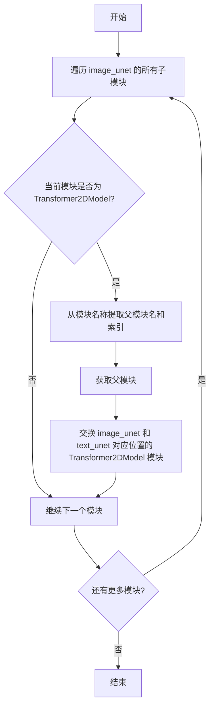
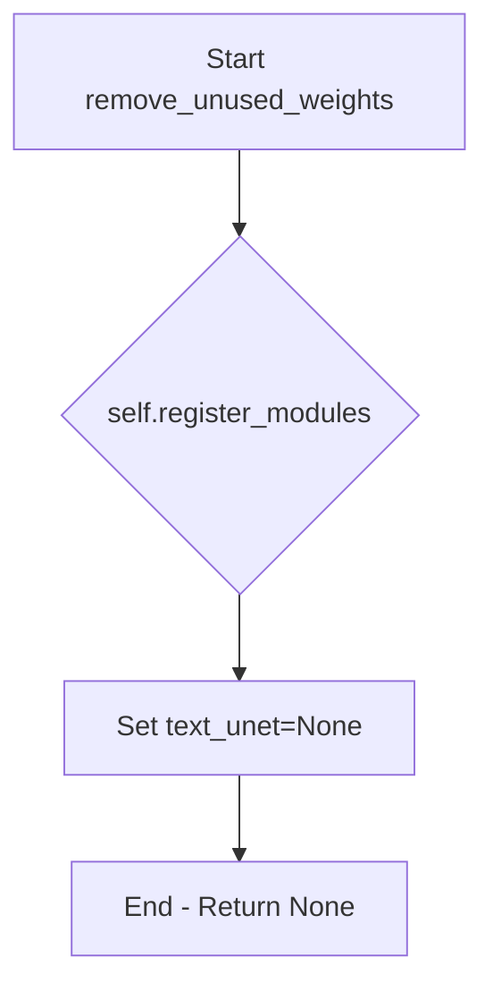
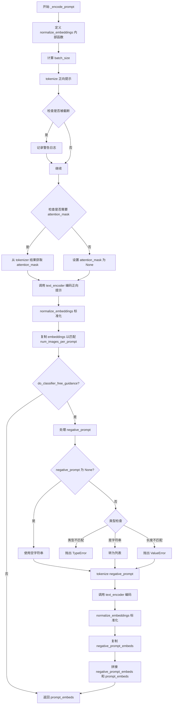
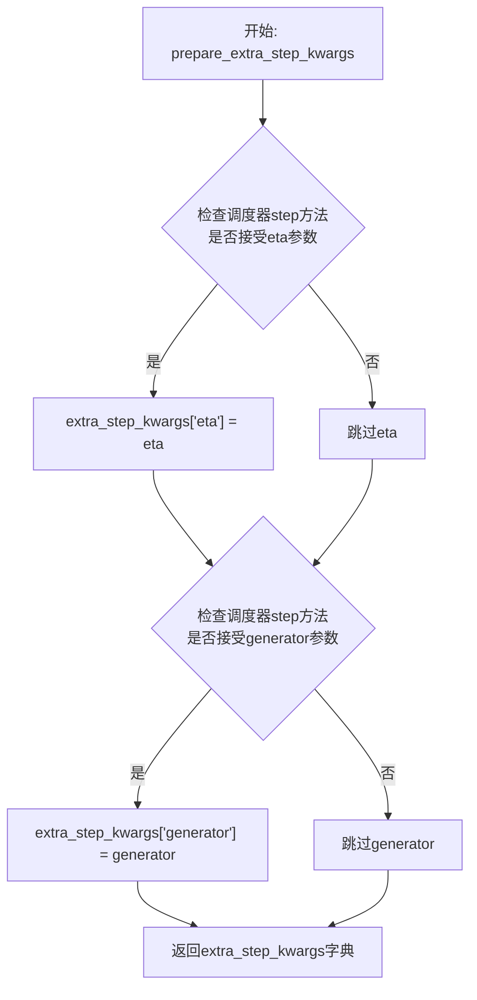
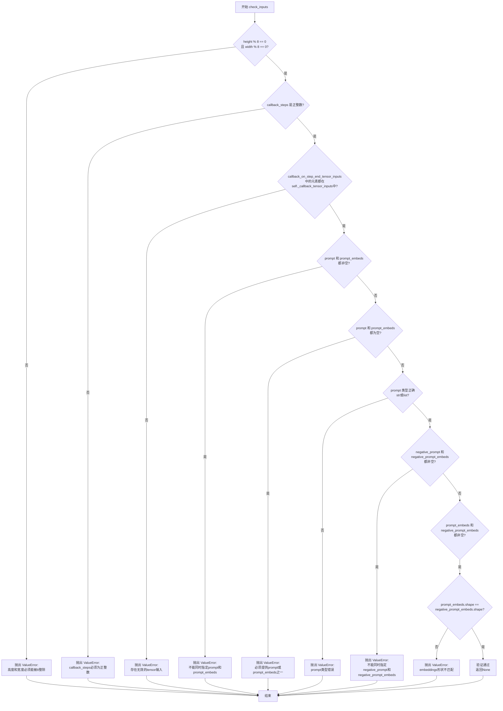
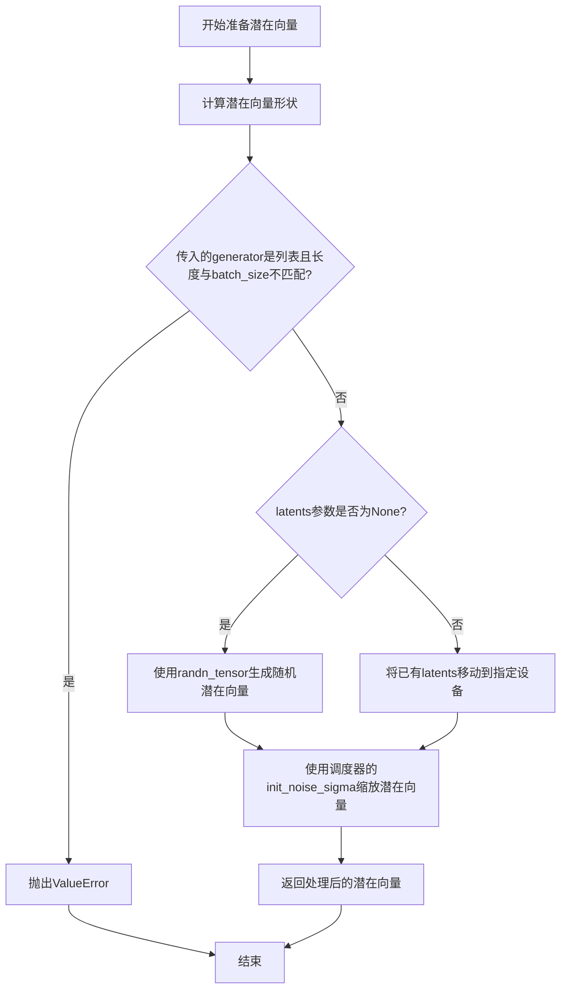
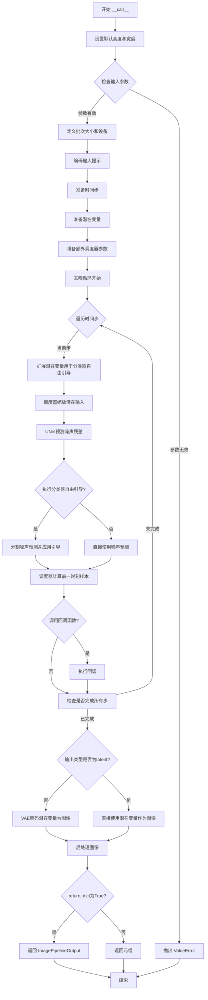

# `diffusers\src\diffusers\pipelines\deprecated\versatile_diffusion\pipeline_versatile_diffusion_text_to_image.py` 详细设计文档

VersatileDiffusionTextToImagePipeline是一个用于文本到图像生成的Diffusion Pipeline，继承自DiffusionPipeline，集成了CLIP文本编码器、图像UNet、文本UNet和VAE解码器，通过去噪过程将文本提示转换为图像。

## 整体流程

```mermaid
graph TD
    A[开始: __call__] --> B[检查输入参数]
    B --> C[设置默认高度和宽度]
    C --> D[定义批次大小和设备]
    D --> E[判断是否使用无分类器引导]
    E --> F[调用 _encode_prompt 编码文本]
    F --> G[设置去噪时间步]
    G --> H[准备潜在变量]
    H --> I[准备额外步骤参数]
    I --> J{开始去噪循环}
    J --> K[扩展潜在变量用于CF guidance]
    K --> L[使用scheduler缩放输入]
    L --> M[使用image_unet预测噪声]
    M --> N{是否使用CF guidance?}
    N -- 是 --> O[分割噪声预测并计算引导]
    N -- 否 --> P[直接使用噪声预测]
    O --> Q[执行scheduler.step更新latents]
    P --> Q
    Q --> R{是否执行callback?]
    R -- 是 --> S[调用callback函数]
    R -- 否 --> T[检查是否完成所有迭代]
    S --> T
    T -- 否 --> J
    T -- 是 --> U{output_type == 'latent'?]
    U -- 否 --> V[使用vae.decode解码图像]
    U -- 是 --> W[直接返回latents]
    V --> X[后处理图像]
    W --> X
    X --> Y[返回ImagePipelineOutput]
```

## 类结构

```
DiffusionPipeline (基类)
└── VersatileDiffusionTextToImagePipeline
```

## 全局变量及字段


### `logger`
    
模块级日志记录器，用于记录管道运行过程中的信息、警告和错误

类型：`logging.Logger`
    


### `VersatileDiffusionTextToImagePipeline.model_cpu_offload_seq`
    
CPU卸载顺序配置，指定模型组件在CPU和GPU之间迁移的顺序

类型：`str`
    


### `VersatileDiffusionTextToImagePipeline.tokenizer`
    
文本分词器，用于将文本输入转换为模型可处理的token序列

类型：`CLIPTokenizer`
    


### `VersatileDiffusionTextToImagePipeline.image_feature_extractor`
    
图像特征提取器，用于处理和预处理图像数据

类型：`CLIPImageProcessor`
    


### `VersatileDiffusionTextToImagePipeline.text_encoder`
    
文本编码器，将文本token转换为语义嵌入向量

类型：`CLIPTextModelWithProjection`
    


### `VersatileDiffusionTextToImagePipeline.image_unet`
    
图像去噪UNet，在扩散过程中预测并去除图像噪声

类型：`UNet2DConditionModel`
    


### `VersatileDiffusionTextToImagePipeline.text_unet`
    
文本去噪UNet，用于处理文本条件的UNet变体

类型：`UNetFlatConditionModel`
    


### `VersatileDiffusionTextToImagePipeline.vae`
    
VAE变分自编码器，用于将图像编码到潜在空间和解码回图像空间

类型：`AutoencoderKL`
    


### `VersatileDiffusionTextToImagePipeline.scheduler`
    
扩散调度器，控制扩散过程中的噪声调度和时间步长

类型：`KarrasDiffusionSchedulers`
    


### `VersatileDiffusionTextToImagePipeline._optional_components`
    
可选组件列表，定义哪些组件可以在运行时被移除或替换

类型：`list`
    


### `VersatileDiffusionTextToImagePipeline.vae_scale_factor`
    
VAE缩放因子，用于调整潜在空间到像素空间的尺寸转换比例

类型：`int`
    


### `VersatileDiffusionTextToImagePipeline.image_processor`
    
图像后处理器，将VAE解码后的潜在表示转换为最终的图像输出

类型：`VaeImageProcessor`
    
    

## 全局函数及方法


### `VersatileDiffusionTextToImagePipeline.__init__`

该方法是 VersatileDiffusionTextToImagePipeline 类的构造函数，负责初始化pipeline的所有核心组件（分词器、文本编码器、图像UNet、文本UNet、VAE和调度器），并配置图像处理器和潜在空间缩放因子。

参数：

- `tokenizer`：`CLIPTokenizer`，用于将文本提示编码为token序列
- `text_encoder`：`CLIPTextModelWithProjection`，将token编码为文本嵌入向量
- `image_unet`：`UNet2DConditionModel`，基于图像条件进行去噪的UNet模型
- `text_unet`：`UNetFlatConditionModel`，用于文本条件的扁平注意力UNet模型
- `vae`：`AutoencoderKL`，变分自编码器，用于将潜在表示编码/解码为图像
- `scheduler`：`KarrasDiffusionSchedulers`，Karras扩散调度器，控制去噪过程的时间步

返回值：`None`，构造函数无返回值，通过修改实例属性完成初始化

#### 流程图

```mermaid
flowchart TD
    A[__init__ 开始] --> B[调用父类初始化 super().__init__]
    B --> C[register_modules 注册所有模块]
    C --> D{self.vae 是否存在}
    D -->|是| E[计算 vae_scale_factor]
    D -->|否| F[设置 vae_scale_factor = 8]
    E --> G[创建 VaeImageProcessor]
    F --> G
    G --> H{text_unet 是否为 None}
    H -->|否| I[调用 _swap_unet_attention_blocks 交换注意力块]
    H -->|是| J[__init__ 结束]
    I --> J
    
    style A fill:#f9f,stroke:#333
    style J fill:#9f9,stroke:#333
```

#### 带注释源码

```
def __init__(
    self,
    tokenizer: CLIPTokenizer,
    text_encoder: CLIPTextModelWithProjection,
    image_unet: UNet2DConditionModel,
    text_unet: UNetFlatConditionModel,
    vae: AutoencoderKL,
    scheduler: KarrasDiffusionSchedulers,
):
    """
    初始化 VersatileDiffusion 文本到图像生成 pipeline
    
    Args:
        tokenizer: CLIP分词器，用于将文本转换为token ID序列
        text_encoder: CLIP文本编码器，带投影层，用于生成文本嵌入
        image_unet: 图像条件UNet，用于去噪生成图像
        text_unet: 文本条件UNet，用于特定文本生成任务
        vae: 变分自编码器，用于图像的编码和解码
        scheduler: Karras扩散调度器，管理去噪的时间步调度
    """
    
    # 调用父类 DiffusionPipeline 的初始化方法
    # 设置基本的pipeline配置和设备管理
    super().__init__()
    
    # 注册所有子模块，使pipeline能够正确保存/加载权重
    # 同时将各组件存储为实例属性供后续使用
    self.register_modules(
        tokenizer=tokenizer,
        text_encoder=text_encoder,
        image_unet=image_unet,
        text_unet=text_unet,
        vae=vae,
        scheduler=scheduler,
    )
    
    # 计算VAE的缩放因子，用于调整潜在空间的维度
    # 基于VAE配置中的block_out_channels计算: 2^(层数-1)
    # 如果VAE不存在，则使用默认值8
    self.vae_scale_factor = 2 ** (len(self.vae.config.block_out_channels) - 1) if getattr(self, "vae", None) else 8
    
    # 创建图像后处理器，用于将VAE输出的潜在表示转换为最终图像
    # 根据vae_scale_factor调整图像尺寸
    self.image_processor = VaeImageProcessor(vae_scale_factor=self.vae_scale_factor)
    
    # 如果text_unet存在，则交换image_unet和text_unet的Transformer模块
    # 这是Versatile Diffusion的关键特性，允许共享注意力机制
    if self.text_unet is not None:
        self._swap_unet_attention_blocks()
```


### `VersatileDiffusionTextToImagePipeline._swap_unet_attention_blocks`

该方法用于在 Versatile Diffusion 模型的图像 UNet (image_unet) 和文本 UNet (text_unet) 之间交换 `Transformer2DModel` 注意力块，以实现跨模态的特征共享。

参数：无（仅包含隐式参数 `self`）

返回值：`None`，该方法无返回值，直接修改对象内部状态

#### 流程图



#### 带注释源码

```python
def _swap_unet_attention_blocks(self):
    """
    Swap the `Transformer2DModel` blocks between the image and text UNets
    交换图像和文本UNet之间的Transformer2DModel块
    
    此方法实现了Versatile Diffusion模型的核心功能：
    将text_unet中的Transformer2DModel模块与image_unet中对应位置的模块进行交换，
    从而实现文本到图像生成过程中的注意力机制复用。
    """
    # 遍历image_unet的所有命名模块
    # image_unet: UNet2DConditionModel - 用于图像去噪的条件UNet模型
    for name, module in self.image_unet.named_modules():
        # 检查模块是否为Transformer2DModel类型
        # Transformer2DModel: 2D变换器模型，包含自注意力机制
        if isinstance(module, Transformer2DModel):
            # 使用rsplit从模块名称中分离出父模块名称和索引
            # 例如: 'transformer_blocks.0' -> parent_name='transformer_blocks', index='0'
            parent_name, index = name.rsplit(".", 1)
            # 将索引字符串转换为整数
            index = int(index)
            
            # 交换image_unet和text_unet中对应位置的Transformer2DModel模块
            # text_unet: UNetFlatConditionModel - 用于文本条件的UNet模型
            self.image_unet.get_submodule(parent_name)[index], self.text_unet.get_submodule(parent_name)[index] = (
                self.text_unet.get_submodule(parent_name)[index],
                self.image_unet.get_submodule(parent_name)[index],
            )
            # 通过交换，两个UNet现在共享相同的注意力块，
            # 可以在图像生成过程中利用文本理解能力
```


### `VersatileDiffusionTextToImagePipeline.remove_unused_weights`

该方法用于移除未使用的text_unet权重，通过将text_unet模块设置为None来释放相关资源。

参数： 无显式参数（仅包含隐式参数self）

返回值：`None`，该方法不返回任何值，仅执行模块注销操作

#### 流程图



#### 带注释源码

```python
def remove_unused_weights(self):
    """
    移除未使用的text_unet权重。
    
    该方法通过调用register_modules方法并将text_unet参数设置为None，
    来注销text_unet模块，从而释放相关内存资源。
    """
    self.register_modules(text_unet=None)
```


### `VersatileDiffusionTextToImagePipeline._encode_prompt`

该方法负责将文本提示（prompt）编码为文本Encoder的隐藏状态（embedding），用于后续的图像生成过程。它支持分类器无关引导（Classifier-Free Guidance），可以同时处理正向提示和负向提示，并对生成的embedding进行标准化处理。

参数：

- `prompt`：`str` 或 `list[str]`，要编码的提示文本
- `device`：`torch.device`，PyTorch设备对象
- `num_images_per_prompt`：`int`，每个提示生成的图像数量
- `do_classifier_free_guidance`：`bool`，是否使用分类器无关引导
- `negative_prompt`：`str` 或 `list[str]`，用于引导图像生成的负向提示

返回值：`torch.Tensor`，编码后的提示embeddings，形状为 `(batch_size * num_images_per_prompt, seq_len, hidden_dim)`

#### 流程图



#### 带注释源码

```python
def _encode_prompt(self, prompt, device, num_images_per_prompt, do_classifier_free_guidance, negative_prompt):
    r"""
    Encodes the prompt into text encoder hidden states.

    Args:
        prompt (`str` or `list[str]`):
            prompt to be encoded
        device: (`torch.device`):
            torch device
        num_images_per_prompt (`int`):
            number of images that should be generated per prompt
        do_classifier_free_guidance (`bool`):
            whether to use classifier free guidance or not
        negative_prompt (`str` or `list[str]`):
            The prompt or prompts not to guide the image generation. Ignored when not using guidance (i.e., ignored
            if `guidance_scale` is less than `1`).
    """

    # 内部函数：标准化 embeddings
    # 使用 text_projection 将 last_hidden_state 投影后，
    # 用 text_embeds 的范数对 embeddings 进行归一化
    def normalize_embeddings(encoder_output):
        # 获取投影后的 embeddings
        embeds = self.text_encoder.text_projection(encoder_output.last_hidden_state)
        # 获取 pooled embeddings（用于计算范数）
        embeds_pooled = encoder_output.text_embeds
        # 沿最后维度归一化
        embeds = embeds / torch.norm(embeds_pooled.unsqueeze(1), dim=-1, keepdim=True)
        return embeds

    # 计算批次大小：如果是列表则取长度，否则为 1
    batch_size = len(prompt) if isinstance(prompt, list) else 1

    # 使用 tokenizer 对正向提示进行编码
    # 填充到最大长度，截断超长部分，返回 PyTorch 张量
    text_inputs = self.tokenizer(
        prompt,
        padding="max_length",
        max_length=self.tokenizer.model_max_length,
        truncation=True,
        return_tensors="pt",
    )
    text_input_ids = text_inputs.input_ids
    # 同时获取未截断的版本用于比较
    untruncated_ids = self.tokenizer(prompt, padding="max_length", return_tensors="pt").input_ids

    # 如果截断前后不同，说明有内容被截断，记录警告
    if not torch.equal(text_input_ids, untruncated_ids):
        removed_text = self.tokenizer.batch_decode(untruncated_ids[:, self.tokenizer.model_max_length - 1 : -1])
        logger.warning(
            "The following part of your input was truncated because CLIP can only handle sequences up to"
            f" {self.tokenizer.model_max_length} tokens: {removed_text}"
        )

    # 检查 text_encoder 配置是否需要 attention_mask
    if hasattr(self.text_encoder.config, "use_attention_mask") and self.text_encoder.config.use_attention_mask:
        attention_mask = text_inputs.attention_mask.to(device)
    else:
        attention_mask = None

    # 调用 text_encoder 获取 embeddings
    prompt_embeds = self.text_encoder(
        text_input_ids.to(device),
        attention_mask=attention_mask,
    )
    # 标准化 embeddings
    prompt_embeds = normalize_embeddings(prompt_embeds)

    # 为每个提示生成多张图像复制 embeddings
    # 使用适合 MPS 的重复方法
    bs_embed, seq_len, _ = prompt_embeds.shape
    # 重复以匹配 num_images_per_prompt
    prompt_embeds = prompt_embeds.repeat(1, num_images_per_prompt, 1)
    # 调整形状：(batch_size, num_images_per_prompt, seq_len, hidden_dim) -> (batch_size * num_images_per_prompt, seq_len, hidden_dim)
    prompt_embeds = prompt_embeds.view(bs_embed * num_images_per_prompt, seq_len, -1)

    # 如果使用分类器无关引导，需要获取无条件 embeddings
    if do_classifier_free_guidance:
        uncond_tokens: list[str]
        if negative_prompt is None:
            # 如果未提供负向提示，使用空字符串
            uncond_tokens = [""] * batch_size
        elif type(prompt) is not type(negative_prompt):
            # 类型不匹配，抛出异常
            raise TypeError(
                f"`negative_prompt` should be the same type to `prompt`, but got {type(negative_prompt)} !="
                f" {type(prompt)}."
            )
        elif isinstance(negative_prompt, str):
            # 字符串转为单元素列表
            uncond_tokens = [negative_prompt]
        elif batch_size != len(negative_prompt):
            # 批次大小不匹配，抛出异常
            raise ValueError(
                f"`negative_prompt`: {negative_prompt} has batch size {len(negative_prompt)}, but `prompt`:"
                f" {prompt} has batch size {batch_size}. Please make sure that passed `negative_prompt` matches"
                " the batch size of `prompt`."
            )
        else:
            # 负向提示已经是列表
            uncond_tokens = negative_prompt

        # 获取正向提示的长度
        max_length = text_input_ids.shape[-1]
        # 对负向提示进行 tokenize
        uncond_input = self.tokenizer(
            uncond_tokens,
            padding="max_length",
            max_length=max_length,
            truncation=True,
            return_tensors="pt",
        )

        # 检查是否需要 attention_mask
        if hasattr(self.text_encoder.config, "use_attention_mask") and self.text_encoder.config.use_attention_mask:
            attention_mask = uncond_input.attention_mask.to(device)
        else:
            attention_mask = None

        # 编码负向提示
        negative_prompt_embeds = self.text_encoder(
            uncond_input.input_ids.to(device),
            attention_mask=attention_mask,
        )
        negative_prompt_embeds = normalize_embeddings(negative_prompt_embeds)

        # 复制负向 embeddings 以匹配 num_images_per_prompt
        seq_len = negative_prompt_embeds.shape[1]
        negative_prompt_embeds = negative_prompt_embeds.repeat(1, num_images_per_prompt, 1)
        negative_prompt_embeds = negative_prompt_embeds.view(batch_size * num_images_per_prompt, seq_len, -1)

        # 为了避免两次前向传播，将无条件 embeddings 和文本 embeddings 拼接
        # 拼接顺序：[negative_prompt_embeds, prompt_embeds]
        # 后续在推理时会用这种方式实现分类器无关引导
        prompt_embeds = torch.cat([negative_prompt_embeds, prompt_embeds])

    return prompt_embeds
```


### `VersatileDiffusionTextToImagePipeline.decode_latents`

该方法用于将VAE编码后的潜在表示(latents)解码为实际图像。该方法已被弃用，推荐使用`VaeImageProcessor.postprocess(...)`方法替代。

参数：

- `latents`：`torch.Tensor`，待解码的潜在表示张量，通常来自UNet去噪过程的输出

返回值：`numpy.ndarray`，解码后的图像，形状为(batch_size, height, width, channels)，像素值范围在[0,1]

#### 流程图

```mermaid
flowchart TD
    A[开始 decode_latents] --> B[发出弃用警告]
    B --> C[latents = 1 / scaling_factor * latents]
    C --> D[vae.decode 解码潜在表示]
    D --> E[image = (image / 2 + 0.5).clamp(0, 1)]
    E --> F[转换为 CPU float32 numpy 数组]
    F --> G[返回图像]
```

#### 带注释源码

```python
# Copied from diffusers.pipelines.stable_diffusion.pipeline_stable_diffusion.StableDiffusionPipeline.decode_latents
def decode_latents(self, latents):
    # 发出弃用警告，提示用户在未来版本中该方法将被移除
    deprecation_message = "The decode_latents method is deprecated and will be removed in 1.0.0. Please use VaeImageProcessor.postprocess(...) instead"
    deprecate("decode_latents", "1.0.0", deprecation_message, standard_warn=False)

    # 根据VAE的缩放因子对潜在表示进行缩放
    # 这是VAE编码的逆操作
    latents = 1 / self.vae.config.scaling_factor * latents
    
    # 使用VAE将潜在表示解码为图像
    # return_dict=False 返回元组，取第一个元素[0]为图像张量
    image = self.vae.decode(latents, return_dict=False)[0]
    
    # 将图像像素值从[-1,1]范围归一化到[0,1]范围
    # 这是因为训练时通常将图像标准化到[-1,1]
    image = (image / 2 + 0.5).clamp(0, 1)
    
    # 将图像从 PyTorch 张量转换为 NumPy 数组
    # 1. 移到CPU 2. 维度从 (B,C,H,W) 转换为 (B,H,W,C) 3. 转换为 float32
    # 这样做是为了兼容 bfloat16 且不会造成显著的性能开销
    image = image.cpu().permute(0, 2, 3, 1).float().numpy()
    
    # 返回解码后的图像数组
    return image
```


### `VersatileDiffusionTextToImagePipeline.prepare_extra_step_kwargs`

该方法用于准备调度器（scheduler）步骤所需的额外参数。由于不同调度器的签名可能不同，该方法通过检查调度器的`step`函数签名来动态确定需要传递哪些额外参数（如`eta`和`generator`），从而实现对多种调度器的兼容性。

参数：

- `generator`：`torch.Generator | list[torch.Generator] | None`，用于控制生成过程的随机性，确保可重复的生成结果
- `eta`：`float`，DDIM调度器专用的参数（η），取值范围为[0,1]，其他调度器会忽略此参数

返回值：`Dict[str, Any]`，包含调度器`step`方法所需额外参数（如`eta`和`generator`）的字典

#### 流程图



#### 带注释源码

```python
def prepare_extra_step_kwargs(self, generator, eta):
    # 准备调度器步骤所需的额外参数
    # 因为并非所有调度器都有相同的签名
    # eta (η) 仅在 DDIMScheduler 中使用，其他调度器会忽略它
    # eta 对应 DDIM 论文中的 η: https://huggingface.co/papers/2010.02502
    # 取值应在 [0, 1] 之间

    # 通过检查调度器step方法的签名来判断是否接受eta参数
    accepts_eta = "eta" in set(inspect.signature(self.scheduler.step).parameters.keys())
    # 初始化空字典用于存储额外参数
    extra_step_kwargs = {}
    # 如果调度器接受eta参数，则将其添加到extra_step_kwargs
    if accepts_eta:
        extra_step_kwargs["eta"] = eta

    # 检查调度器是否接受generator参数
    accepts_generator = "generator" in set(inspect.signature(self.scheduler.step).parameters.keys())
    # 如果调度器接受generator参数，则将其添加到extra_step_kwargs
    if accepts_generator:
        extra_step_kwargs["generator"] = generator
    
    # 返回包含调度器所需额外参数的字典
    return extra_step_kwargs
```


### `VersatileDiffusionTextToImagePipeline.check_inputs`

该方法用于验证文本到图像生成管道的输入参数有效性，检查高度和宽度是否为8的倍数、callback_steps参数有效性、prompt与prompt_embeds的互斥性、negative_prompt与negative_prompt_embeds的互斥性，以及prompt_embeds与negative_prompt_embeds的形状一致性。若任何检查失败，则抛出相应的ValueError异常。

参数：

- `self`：VersatileDiffusionTextToImagePipeline，管道实例本身
- `prompt`：`str | list[str] | None`，要生成图像的文本提示，可以是字符串或字符串列表
- `height`：`int`，生成图像的高度（像素），必须能被8整除
- `width`：`int`，生成图像的宽度（像素），必须能被8整除
- `callback_steps`：`int`，回调函数被调用的频率步数，必须为正整数
- `negative_prompt`：`str | list[str] | None`，用于引导不希望出现内容的负面提示
- `prompt_embeds`：`torch.Tensor | None`，预先编码的文本嵌入向量，与prompt互斥
- `negative_prompt_embeds`：`torch.Tensor | None`，预先编码的负面文本嵌入，与negative_prompt互斥
- `callback_on_step_end_tensor_inputs`：`list[str] | None`，在每步结束时需要传递给回调的张量输入名称列表

返回值：`None`，该方法不返回值，仅通过抛出ValueError来指示输入验证失败

#### 流程图



#### 带注释源码

```python
def check_inputs(
    self,
    prompt,
    height,
    width,
    callback_steps,
    negative_prompt=None,
    prompt_embeds=None,
    negative_prompt_embeds=None,
    callback_on_step_end_tensor_inputs=None,
):
    """
    检查文本到图像生成管道的输入参数有效性。
    
    该方法执行多项验证：
    1. 图像尺寸必须是8的倍数（由于VAE的下采样比例）
    2. callback_steps必须是正整数
    3. callback_on_step_end_tensor_inputs中的元素必须都是有效的张量输入
    4. prompt和prompt_embeds不能同时提供
    5. 必须提供prompt或prompt_embeds之一
    6. prompt必须是字符串或字符串列表
    7. negative_prompt和negative_prompt_embeds不能同时提供
    8. prompt_embeds和negative_prompt_embeds形状必须一致（如果都提供）
    
    如果任何验证失败，将抛出相应的ValueError异常。
    """
    
    # 验证图像高度和宽度是否为8的倍数
    # 这是因为VAE的解码器通常有8倍的下采样因子
    if height % 8 != 0 or width % 8 != 0:
        raise ValueError(f"`height` and `width` have to be divisible by 8 but are {height} and {width}.")

    # 验证callback_steps是否为正整数
    # callback_steps用于控制回调函数的调用频率
    if callback_steps is not None and (not isinstance(callback_steps, int) or callback_steps <= 0):
        raise ValueError(
            f"`callback_steps` has to be a positive integer but is {callback_steps} of type"
            f" {type(callback_steps)}."
        )
    
    # 验证callback_on_step_end_tensor_inputs中的所有键都在允许的列表中
    # 这些张量将在每个去噪步骤结束时传递给回调函数
    if callback_on_step_end_tensor_inputs is not None and not all(
        k in self._callback_tensor_inputs for k in callback_on_step_end_tensor_inputs
    ):
        raise ValueError(
            f"`callback_on_step_end_tensor_inputs` has to be in {self._callback_tensor_inputs}, but found {[k for k in callback_on_step_end_tensor_inputs if k not in self._callback_tensor_inputs]}"
        )

    # 验证prompt和prompt_embeds的互斥性
    # 用户可以选择提供原始文本或预计算的嵌入，但不能同时提供
    if prompt is not None and prompt_embeds is not None:
        raise ValueError(
            f"Cannot forward both `prompt`: {prompt} and `prompt_embeds`: {prompt_embeds}. Please make sure to"
            " only forward one of the two."
        )
    # 验证至少提供了prompt或prompt_embeds之一
    elif prompt is None and prompt_embeds is None:
        raise ValueError(
            "Provide either `prompt` or `prompt_embeds`. Cannot leave both `prompt` and `prompt_embeds` undefined."
        )
    # 验证prompt的类型必须是字符串或字符串列表
    elif prompt is not None and (not isinstance(prompt, str) and not isinstance(prompt, list)):
        raise ValueError(f"`prompt` has to be of type `str` or `list` but is {type(prompt)}")

    # 验证negative_prompt和negative_prompt_embeds的互斥性
    if negative_prompt is not None and negative_prompt_embeds is not None:
        raise ValueError(
            f"Cannot forward both `negative_prompt`: {negative_prompt} and `negative_prompt_embeds`:"
            f" {negative_prompt_embeds}. Please make sure to only forward one of the two."
        )

    # 验证prompt_embeds和negative_prompt_embeds的形状一致性
    # 这确保了在使用分类器自由引导时，条件和非条件嵌入可以正确对齐
    if prompt_embeds is not None and negative_prompt_embeds is not None:
        if prompt_embeds.shape != negative_prompt_embeds.shape:
            raise ValueError(
                "`prompt_embeds` and `negative_prompt_embeds` must have the same shape when passed directly, but"
                f" got: `prompt_embeds` {prompt_embeds.shape} != `negative_prompt_embeds`"
                f" {negative_prompt_embeds.shape}."
            )
```


### `VersatileDiffusionTextToImagePipeline.prepare_latents`

该方法负责为 Versatile Diffusion 文本到图像生成管道准备初始潜在向量（latents）。它根据指定的批量大小、通道数、高度和宽度创建适当形状的随机潜在向量，或使用提供的潜在向量，并通过调度器的初始噪声标准差进行缩放。

参数：

- `batch_size`：`int`，生成的图像批次大小
- `num_channels_latents`：`int`，潜在向量通道数，对应于图像 UNet 的输入通道数
- `height`：`int`，生成图像的高度（像素）
- `width`：`int`，生成图像的宽度（像素）
- `dtype`：`torch.dtype`，潜在向量的数据类型（如 torch.float32）
- `device`：`torch.device`，潜在向量存放的设备（如 cuda 或 cpu）
- `generator`：`torch.Generator` 或 `list[torch.Generator]`，可选的随机数生成器，用于确保生成的可重复性
- `latents`：`torch.Tensor` 或 `None`，可选的预生成潜在向量，如果为 None 则随机生成

返回值：`torch.Tensor`，处理后的潜在向量，已根据调度器的初始噪声标准差进行缩放

#### 流程图



#### 带注释源码

```python
def prepare_latents(
    self,
    batch_size: int,
    num_channels_latents: int,
    height: int,
    width: int,
    dtype: torch.dtype,
    device: torch.device,
    generator: torch.Generator | list[torch.Generator] | None,
    latents: torch.Tensor | None = None
):
    """
    准备用于图像生成的潜在向量。
    
    参数:
        batch_size: 批量大小
        num_channels_latents: 潜在向量通道数
        height: 生成图像高度
        width: 生成图像宽度
        dtype: 数据类型
        device: 设备
        generator: 随机生成器
        latents: 可选的预生成潜在向量
    
    返回:
        缩放后的潜在向量张量
    """
    # 计算潜在向量的形状，考虑VAE的缩放因子
    # 潜在向量形状: [batch_size, channels, height/vae_scale, width/vae_scale]
    shape = (
        batch_size,
        num_channels_latents,
        int(height) // self.vae_scale_factor,
        int(width) // self.vae_scale_factor,
    )
    
    # 验证传入的生成器列表长度是否与批量大小匹配
    if isinstance(generator, list) and len(generator) != batch_size:
        raise ValueError(
            f"You have passed a list of generators of length {len(generator)}, but requested an effective batch"
            f" size of {batch_size}. Make sure the batch size matches the length of the generators."
        )

    # 根据是否有预生成的潜在向量采取不同处理
    if latents is None:
        # 使用randn_tensor生成符合标准正态分布的随机潜在向量
        latents = randn_tensor(shape, generator=generator, device=device, dtype=dtype)
    else:
        # 将已存在的潜在向量移动到目标设备
        latents = latents.to(device)

    # 根据调度器要求的初始噪声标准差对潜在向量进行缩放
    # 这是扩散模型去噪过程的关键初始化步骤
    latents = latents * self.scheduler.init_noise_sigma
    
    return latents
```


### `VersatileDiffusionTextToImagePipeline.__call__`

该方法是 Versatile Diffusion 文本到图像生成管道的核心调用函数，通过对预训练的文本编码器、图像UNet和VAE解码器进行协同推理，将文本提示转换为对应的图像。流程包括：输入验证与默认参数设置、文本提示编码、去噪潜在变量的准备、噪声预测的去噪循环（支持分类器自由引导）、以及最终的潜在变量解码为图像。

参数：

- `prompt`：`str | list[str]`，要引导图像生成的文本提示或提示列表
- `height`：`int | None`，生成图像的高度（像素），默认为 `image_unet.config.sample_size * vae_scale_factor`
- `width`：`int | None`，生成图像的宽度（像素），默认为 `image_unet.config.sample_size * vae_scale_factor`
- `num_inference_steps`：`int`，去噪迭代次数，默认值为50，步数越多图像质量通常越高
- `guidance_scale`：`float`，引导比例系数，默认7.5，值越大生成的图像与提示越相关但质量可能降低
- `negative_prompt`：`str | list[str] | None`，用于引导图像生成的负面提示，指定不希望包含的内容
- `num_images_per_prompt`：`int | None`，每个提示生成的图像数量，默认1
- `eta`：`float`，DDIM调度器的η参数，仅对DDIMScheduler有效，默认0.0
- `generator`：`torch.Generator | list[torch.Generator] | None`，用于生成确定性结果的随机数生成器
- `latents`：`torch.Tensor | None`，预生成的噪声潜在向量，可用于相同提示的不同生成
- `output_type`：`str | None`，输出格式，可选"pil"或"np.array"，默认"pil"
- `return_dict`：`bool`，是否返回字典格式而非元组，默认True
- `callback`：`Callable[[int, int, torch.Tensor], None] | None`，每步调用的回调函数，参数为(step, timestep, latents)
- `callback_steps`：`int`，回调函数调用频率，默认每步调用
- `**kwargs`：其他未明确指定的参数

返回值：`ImagePipelineOutput | tuple`，如果 `return_dict` 为True，返回包含生成图像列表的 `ImagePipelineOutput` 对象；否则返回元组，第一个元素为生成的图像列表

#### 流程图



#### 带注释源码

```python
@torch.no_grad()
def __call__(
    self,
    prompt: str | list[str],
    height: int | None = None,
    width: int | None = None,
    num_inference_steps: int = 50,
    guidance_scale: float = 7.5,
    negative_prompt: str | list[str] | None = None,
    num_images_per_prompt: int | None = 1,
    eta: float = 0.0,
    generator: torch.Generator | list[torch.Generator] | None = None,
    latents: torch.Tensor | None = None,
    output_type: str | None = "pil",
    return_dict: bool = True,
    callback: Callable[[int, int, torch.Tensor], None] | None = None,
    callback_steps: int = 1,
    **kwargs,
):
    """
    The call function to the pipeline for generation.

    Args:
        prompt (`str` or `list[str]`):
            The prompt or prompts to guide image generation.
        height (`int`, *optional*, defaults to `self.image_unet.config.sample_size * self.vae_scale_factor`):
            The height in pixels of the generated image.
        width (`int`, *optional*, defaults to `self.image_unet.config.sample_size * self.vae_scale_factor`):
            The width in pixels of the generated image.
        num_inference_steps (`int`, *optional*, defaults to 50):
            The number of denoising steps. More denoising steps usually lead to a higher quality image at the
            expense of slower inference.
        guidance_scale (`float`, *optional*, defaults to 7.5):
            A higher guidance scale value encourages the model to generate images closely linked to the text
            `prompt` at the expense of lower image quality. Guidance scale is enabled when `guidance_scale > 1`.
        negative_prompt (`str` or `list[str]`, *optional*):
            The prompt or prompts to guide what to not include in image generation. If not defined, you need to
            pass `negative_prompt_embeds` instead. Ignored when not using guidance (`guidance_scale < 1`).
        num_images_per_prompt (`int`, *optional*, defaults to 1):
            The number of images to generate per prompt.
        eta (`float`, *optional*, defaults to 0.0):
            Corresponds to parameter eta (η) from the [DDIM](https://huggingface.co/papers/2010.02502) paper. Only
            applies to the [`~schedulers.DDIMScheduler`], and is ignored in other schedulers.
        generator (`torch.Generator`, *optional*):
            A [`torch.Generator`](https://pytorch.org/docs/stable/generated/torch.Generator.html) to make
            generation deterministic.
        latents (`torch.Tensor`, *optional`):
            Pre-generated noisy latents sampled from a Gaussian distribution, to be used as inputs for image
            generation. Can be used to tweak the same generation with different prompts. If not provided, a latents
            tensor is generated by sampling using the supplied random `generator`.
        output_type (`str`, *optional*, defaults to `"pil"`):
            The output format of the generated image. Choose between `PIL.Image` or `np.array`.
        return_dict (`bool`, *optional*, defaults to `True`):
            Whether or not to return a [`~pipelines.stable_diffusion.StableDiffusionPipelineOutput`] instead of a
            plain tuple.
        callback (`Callable`, *optional*):
            A function that calls every `callback_steps` steps during inference. The function is called with the
            following arguments: `callback(step: int, timestep: int, latents: torch.Tensor)`.
        callback_steps (`int`, *optional*, defaults to 1):
            The frequency at which the `callback` function is called. If not specified, the callback is called at
            every step.

    Returns:
        [`~pipelines.stable_diffusion.StableDiffusionPipelineOutput`] or `tuple`:
            If `return_dict` is `True`, [`~pipelines.stable_diffusion.StableDiffusionPipelineOutput`] is returned,
            otherwise a `tuple` is returned where the first element is a list with the generated images.
    """
    # 0. Default height and width to unet
    # 如果未提供height和width，则使用UNet配置中的sample_size乘以VAE缩放因子作为默认值
    height = height or self.image_unet.config.sample_size * self.vae_scale_factor
    width = width or self.image_unet.config.sample_size * self.vae_scale_factor

    # 1. Check inputs. Raise error if not correct
    # 验证所有输入参数的有效性，包括高度/宽度的8的倍数检查、回调步骤正整数检查等
    self.check_inputs(prompt, height, width, callback_steps)

    # 2. Define call parameters
    # 根据prompt类型确定批次大小（字符串为1，列表为列表长度）
    batch_size = 1 if isinstance(prompt, str) else len(prompt)
    # 获取执行设备（考虑设备放置和设备索引）
    device = self._execution_device
    # guidance_scale对应Imagen论文中的权重w，值为1表示不使用分类器自由引导
    do_classifier_free_guidance = guidance_scale > 1.0

    # 3. Encode input prompt
    # 将文本提示编码为文本嵌入向量，用于UNet的条件输入
    # 如果启用引导，同时编码负面提示以进行无分类器引导
    prompt_embeds = self._encode_prompt(
        prompt, device, num_images_per_prompt, do_classifier_free_guidance, negative_prompt
    )

    # 4. Prepare timesteps
    # 设置调度器的时间步，准备去噪过程
    self.scheduler.set_timesteps(num_inference_steps, device=device)
    timesteps = self.scheduler.timesteps

    # 5. Prepare latent variables
    # 获取UNet输入通道数，确定潜在变量的形状
    num_channels_latents = self.image_unet.config.in_channels
    # 准备初始噪声潜在变量，如果未提供则随机生成
    latents = self.prepare_latents(
        batch_size * num_images_per_prompt,
        num_channels_latents,
        height,
        width,
        prompt_embeds.dtype,
        device,
        generator,
        latents,
    )

    # 6. Prepare extra step kwargs.
    # 准备调度器step方法所需的其他参数，如eta和generator
    extra_step_kwargs = self.prepare_extra_step_kwargs(generator, eta)

    # 7. Denoising loop
    # 迭代去噪循环，逐步从噪声中恢复出清晰的图像潜在表示
    for i, t in enumerate(self.progress_bar(timesteps)):
        # expand the latents if we are doing classifier free guidance
        # 如果使用分类器自由引导，需要复制潜在变量用于无条件和有条件两个预测
        latent_model_input = torch.cat([latents] * 2) if do_classifier_free_guidance else latents
        # 调度器缩放输入（根据调度器类型进行缩放）
        latent_model_input = self.scheduler.scale_model_input(latent_model_input, t)

        # predict the noise residual
        # UNet预测噪声残差，基于当前潜在变量、时间步和文本嵌入
        noise_pred = self.image_unet(latent_model_input, t, encoder_hidden_states=prompt_embeds).sample

        # perform guidance
        # 如果使用分类器自由引导，将噪声预测分为无条件预测和条件预测
        # 然后根据guidance_scale加权组合
        if do_classifier_free_guidance:
            noise_pred_uncond, noise_pred_text = noise_pred.chunk(2)
            noise_pred = noise_pred_uncond + guidance_scale * (noise_pred_text - noise_pred_uncond)

        # compute the previous noisy sample x_t -> x_t-1
        # 使用调度器根据预测的噪声计算前一时刻的潜在变量
        latents = self.scheduler.step(noise_pred, t, latents, **extra_step_kwargs).prev_sample

        # call the callback, if provided
        # 在指定步数调用回调函数，允许外部监控生成过程
        if callback is not None and i % callback_steps == 0:
            step_idx = i // getattr(self.scheduler, "order", 1)
            callback(step_idx, t, latents)

    # 8. Decode latents to image
    # 检查输出类型，如果不是潜在向量格式，则使用VAE解码器将潜在变量转换为图像
    if not output_type == "latent":
        # VAE解码之前需要除以缩放因子
        image = self.vae.decode(latents / self.vae.config.scaling_factor, return_dict=False)[0]
    else:
        image = latents

    # 9. Post-process image
    # 对生成的图像进行后处理，包括归一化转换和格式转换
    image = self.image_processor.postprocess(image, output_type=output_type)

    # 10. Return output
    # 根据return_dict参数决定返回格式
    if not return_dict:
        return (image,)

    return ImagePipelineOutput(images=image)
```

## 关键组件


### 张量索引与惰性加载

代码使用 `@torch.no_grad()` 装饰器实现推理阶段的惰性加载，避免创建计算图。张量索引操作包括：`latents.repeat()` 用于批量复制、`torch.cat()` 用于classifier-free guidance时的条件与非条件latents拼接、`chunk(2)` 用于分割噪声预测结果。

### 反量化支持

VAE解码器将潜在空间表示反量化为图像像素。通过 `self.vae.decode(latents / self.vae.config.scaling_factor)` 执行反量化操作，其中 `scaling_factor` 用于缩放潜在变量以匹配VAE的训练尺度。

### 量化策略

代码支持通过 `torch_dtype=torch.float16` 加载半精度模型以减少显存占用。`prepare_latents` 方法接收 `dtype` 参数，支持不同精度张量的创建。

### VersatileDiffusionTextToImagePipeline 类

主 pipeline 类，继承自 `DiffusionPipeline`，实现了文本到图像的生成功能。核心组件包括 tokenizer、text_encoder、image_unet、text_unet、vae 和 scheduler。

### UNet注意力块交换机制

`_swap_unet_attention_blocks` 方法实现了 image_unet 和 text_unet 之间的 Transformer2DModel 注意力块交换，使单个pipeline同时支持图像和文本条件生成。

### 提示编码器 (_encode_prompt)

将文本提示编码为文本encoder的隐藏状态，包含embeddings归一化、条件/非条件embeddings复制、classifier-free guidance处理。内部嵌套函数 `normalize_embeddings` 对embeds进行L2归一化。

### 潜在变量准备器 (prepare_latents)

根据batch size、通道数、高度和宽度初始化或验证潜在变量张量，应用scheduler的初始噪声标准差进行缩放。

### 去噪循环核心逻辑

`__call__` 方法中的主循环执行迭代去噪：扩展latents → scale_model_input → UNet预测噪声 → classifier-free guidance计算 → scheduler.step更新latents → callback回调。

### 图像后处理器

使用 `VaeImageProcessor` 进行图像后处理，支持 "pil" 或 "np.array" 等输出格式，执行clamp、归一化和格式转换操作。

### 权重管理机制

`remove_unused_weights` 方法通过 `register_modules(text_unet=None)` 释放未使用的text_unet权重以节省显存，配合 `model_cpu_offload_seq` 实现模型各组件的CPU/GPU迁移。


## 问题及建议


### 已知问题

-   **废弃方法未移除**：`decode_latents` 方法已被标记为废弃（`deprecate`），但仍保留在代码中，应使用 `VaeImageProcessor.postprocess()` 替代。
-   **未使用的参数**：`__call__` 方法的 `negative_prompt_embeds` 参数在 `check_inputs` 中验证，但从未在实际的生成流程中被使用。
-   **未使用的类字段**：`image_feature_extractor: CLIPImageProcessor` 在类中声明，但从未被初始化或使用。
-   **硬编码的设备序列**：`model_cpu_offload_seq = "bert->unet->vqvae"` 硬编码了设备卸载顺序，但实际组件包含 `tokenizer`、`text_encoder`、`image_unet`、`text_unet`、`vae`、`scheduler`，序列不匹配。
- **类型检查不当**：在 `_encode_prompt` 中使用 `type(prompt) is not type(negative_prompt)` 进行类型比较，这是 Python 中不推荐的做法，应使用 `isinstance()`。
- **潜在空指针风险**：`_swap_unet_attention_blocks` 方法假设 `text_unet` 不为 None，但在 `remove_unused_weights` 将其设为 None 后，如果再次调用可能引发错误。
- **VAE 缩放因子计算**：虽然通过 `getattr(self, "vae", None)` 检查了 VAE，但后续直接访问 `self.vae.config.block_out_channels` 而未再次验证。
- **模块交换逻辑脆弱**：`_swap_unet_attention_blocks` 依赖特定的模块命名结构（包含索引），如果模型结构变化，该方法容易失效。

### 优化建议

-   **移除废弃代码**：删除 `decode_latents` 方法，强制使用 `VaeImageProcessor.postprocess()`。
-   **清理未使用字段**：移除未使用的 `image_feature_extractor` 字段声明，或在 `__init__` 中正确初始化它。
-   **修复设备序列**：根据实际组件更新 `model_cpu_offload_seq` 为更准确的顺序，如 `"text_encoder->image_unet->vae"`。
-   **改进类型检查**：将 `type(prompt) is not type(negative_prompt)` 改为 `isinstance()` 检查。
- **增强空值安全**：在 `_swap_unet_attention_blocks` 开头添加 `if self.text_unet is None: return` 保护，并在 `remove_unused_weights` 后提供安全的重置机制。
- **参数整合**：考虑将 `negative_prompt_embeds` 实际集成到 Pipeline 中，或者从 `check_inputs` 签名中移除以避免混淆。
- **代码复用**：将 `_encode_prompt` 中的 `normalize_embeddings` 逻辑提取为更通用的工具函数，减少重复代码。

## 其它


### 设计目标与约束

本Pipeline的设计目标是实现Versatile Diffusion模型的文本到图像生成功能，支持多模态扩散模型的核心能力。设计约束包括：1) 高度需为8的倍数以符合VAE的缩放因子；2) 支持classifier-free guidance以提升生成质量；3) 支持负向提示词引导；4) 兼容多种调度器（KarrasDiffusionSchedulers）；5) 支持CPU offload以处理大模型；6) 遵循Diffusers库的标准化Pipeline接口。

### 错误处理与异常设计

代码中的错误处理主要体现在以下几个方面：1) check_inputs方法验证输入参数合法性，包括高度宽度倍数检查、callback_steps正整数检查、prompt与prompt_embeds互斥检查、负向提示词与embeds互斥检查、embeds维度一致性检查；2) _encode_prompt中类型检查确保negative_prompt与prompt类型一致；3) prepare_latents中验证generator列表长度与batch_size匹配；4) 使用deprecate函数标记废弃方法；5) 异常信息包含详细的错误上下文和数值信息，便于调试。

### 数据流与状态机

Pipeline的核心数据流如下：1) 文本输入→Tokenizer分词→Text Encoder编码→Embeddings归一化；2) 噪声Latents初始化（randn_tensor）；3) 调度器设置 timesteps；4) Denoising Loop：Latents + Timesteps + Prompt Embeds → UNet预测噪声 → Scheduler步进→ 更新Latents；5) VAE解码Latents → Image Processor后处理 → 输出图像。状态转换通过Scheduler的step方法完成，每个step执行noise prediction和latent update。

### 外部依赖与接口契约

核心依赖包括：1) transformers库：CLIPTokenizer、CLIPTextModelWithProjection、CLIPImageProcessor；2) diffusers库：DiffusionPipeline、AutoencoderKL、UNet2DConditionModel、Transformer2DModel、KarrasDiffusionSchedulers、VaeImageProcessor、ImagePipelineOutput；3) PyTorch：Tensor操作、Generator随机数生成；4) 本地模块：modeling_text_unet.UNetFlatConditionModel。接口契约：__call__方法接收prompt字符串或列表，返回ImagePipelineOutput或tuple；支持通过from_pretrained加载预训练权重；遵循pipeline_utils的标准化接口。

### 性能考虑与优化建议

性能关键点：1) VAE scale factor计算使用延迟初始化；2) 支持torch.no_grad()推理模式减少显存占用；3) text_unet为可选组件，通过_swap_unet_attention_blocks动态交换注意力块；4) 支持model_cpu_offload_seq实现模型卸载；5) 使用repeat和view进行batch复制比tile更高效；6) 回调机制允许用户在特定步骤插入自定义逻辑。优化空间：decode_latents已标记废弃但仍保留造成冗余代码；可考虑将部分检查延迟到实际执行时；可增加ONNX导出支持。

### 安全性考虑

1) 输入验证检查防止无效参数导致运行时错误；2) 支持negative_prompt过滤不当内容；3) classifier-free guidance实现需正确处理unconditional embeddings；4) 模型加载需验证来源可靠性（shi-labs/versatile-diffusion）；5) 生成的图像应添加水印或元数据以标识AI生成；6) 敏感信息处理：日志中可能输出truncated text需注意脱敏。

### 可扩展性设计

1) _optional_components支持text_unet可选加载；2) register_modules方法支持灵活的模块注册；3) prepare_extra_step_kwargs通过反射机制兼容不同调度器签名；4) callback机制支持自定义干预生成过程；5) 输出类型可配置（pil/numpy/latent）；6) 支持自定义scheduler类型。扩展方向：可继承实现图像到图像、图像编辑等多模态能力。

### 版本兼容性与废弃管理

1) decode_latents方法使用deprecate标记将于1.0.0版本移除；2) 建议使用VaeImageProcessor.postprocess替代；3) 依赖transformers库的版本需匹配CLIP配置（use_attention_mask）；4) Scheduler接口通过inspect.signature动态适配；5) 需关注diffusers主版本升级带来的API变更。建议：定期运行deprecation检查，更新到最新稳定版本。

### 测试策略建议

1) 单元测试：check_inputs各种参数组合验证；2) 集成测试：from_pretrained加载模型执行完整推理流程；3) 回归测试：验证不同版本的生成结果一致性；4) 性能测试：测量推理时间和显存占用；5) 边界测试：最长prompt、最多图像数、最大分辨率；6) 回调测试：验证callback触发时机和参数正确性；7) 负向测试：无效输入的异常抛出验证。

### 部署注意事项

1) 模型权重较大（数GB），建议使用from_pretrained的cache_dir管理；2) float16推理可显著降低显存占用；3) device placement需显式管理；4) 多进程使用时需注意tokenizer和model的线程安全；5) 生产环境建议设置output_type为numpy避免PIL序列化开销；6) 监控GPU内存防止OOM，必要时调整batch_size和num_images_per_prompt；7) 日志级别建议设置为WARNING以减少IO开销。

    