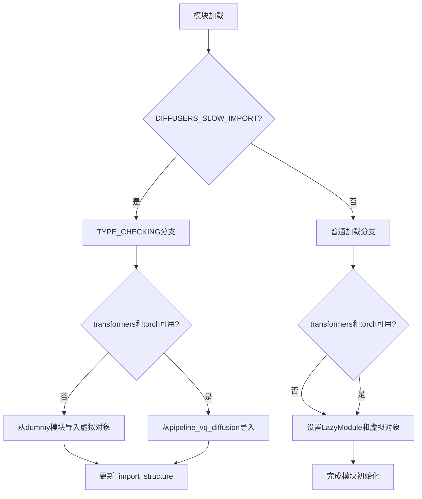
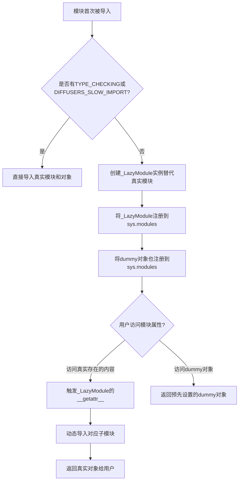
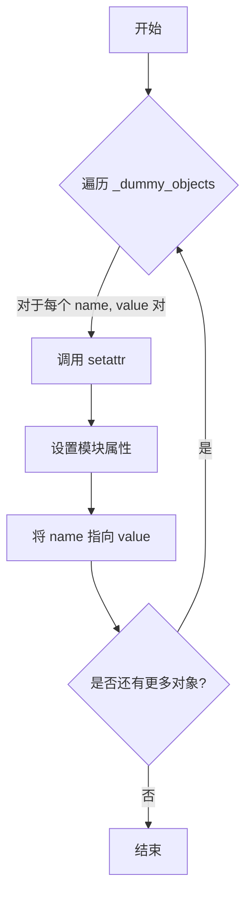

# `diffusers\src\diffusers\pipelines\deprecated\vq_diffusion\__init__.py` 详细设计文档

这是一个diffusers库的延迟加载模块初始化文件，用于实现VQDiffusionPipeline和相关类（LearnedClassifierFreeSamplingEmbeddings）的可选依赖处理和懒加载机制。当torch和transformers可用时正常导入，否则使用虚拟对象替代，确保库的整体导入不会因可选依赖缺失而失败。

## 整体流程



## 类结构

```
Module (模块初始化)
├── _LazyModule (延迟加载机制)
├── _import_structure (导入结构字典)
└── _dummy_objects (虚拟对象字典)
```

## 全局变量及字段


### `_dummy_objects`
    
A dictionary storing dummy objects for optional dependencies that are not available

类型：`dict`
    


### `_import_structure`
    
A dictionary storing the import structure for lazy loading of pipeline classes

类型：`dict`
    


### `DIFFUSERS_SLOW_IMPORT`
    
A flag indicating whether to use slow import mode for diffusors

类型：`bool`
    


### `OptionalDependencyNotAvailable`
    
Exception class raised when an optional dependency is not available

类型：`class`
    


### `is_torch_available`
    
Function to check if PyTorch is available in the environment

类型：`function`
    


### `is_transformers_available`
    
Function to check if Transformers is available in the environment

类型：`function`
    


### `TYPE_CHECKING`
    
Flag from typing module indicating whether type checking is being performed

类型：`bool`
    


### `_LazyModule.__name__`
    
The name of the module

类型：`str`
    


### `_LazyModule.__file__`
    
The file path of the module

类型：`str`
    


### `_LazyModule._import_structure`
    
Dictionary containing the import structure for lazy loading

类型：`dict`
    


### `_LazyModule.module_spec`
    
The module specification for the lazy module

类型：`ModuleSpec`
    


### `_LazyModule.__init__`
    
Constructor method that initializes the lazy module with name, file, import structure, and module spec

类型：`method`
    
    

## 全局函数及方法


### `_LazyModule`

`_LazyModule` 是一个用于实现延迟加载（Lazy Loading）的模块封装类，常见于大型Python库（如Hugging Face Diffusers）中。它通过拦截属性访问来动态导入子模块和对象，从而优化初始导入速度并减少内存占用。

参数：

- `name`：`str`，模块的完整名称，通常为 `__name__`
- `module_file`：`str`，模块文件的路径，通常为 `globals()["__file__"]`
- `import_structure`：`Dict[str, List[str]]`，定义了模块的导入结构，键为子模块路径，值为需要导出的对象名称列表
- `module_spec`：`Optional[ModuleSpec]`，模块规格对象，通常为 `__spec__`

返回值：`Module`，返回一个延迟加载的模块对象

#### 流程图



#### 带注释源码

```python
# 从 utils 模块导入延迟加载相关的工具和检查函数
from typing import TYPE_CHECKING

from ....utils import (
    DIFFUSERS_SLOW_IMPORT,
    OptionalDependencyNotAvailable,
    _LazyModule,          # 核心：延迟加载模块类
    is_torch_available,
    is_transformers_available,
)

# 初始化dummy对象字典和导入结构字典
_dummy_objects = {}
_import_structure = {}

# 第一次检查：尝试检查torch和transformers是否可用
try:
    if not (is_transformers_available() and is_torch_available()):
        raise OptionalDependencyNotAvailable()
except OptionalDependencyNotAvailable:
    # 如果依赖不可用，从dummy模块导入替代对象（这些对象会在访问时报错）
    from ....utils.dummy_torch_and_transformers_objects import (
        LearnedClassifierFreeSamplingEmbeddings,
        VQDiffusionPipeline,
    )
    
    # 将这些对象添加到dummy_objects字典中
    _dummy_objects.update(
        {
            "LearnedClassifierFreeSamplingEmbeddings": LearnedClassifierFreeSamplingEmbeddings,
            "VQDiffusionPipeline": VQDiffusionPipeline,
        }
    )
else:
    # 如果依赖可用，定义真实的导入结构
    _import_structure["pipeline_vq_diffusion"] = ["LearnedClassifierFreeSamplingEmbeddings", "VQDiffusionPipeline"]

# 第二次检查：TYPE_CHECKING或DIFFUSERS_SLOW_IMPORT时直接导入
if TYPE_CHECKING or DIFFUSERS_SLOW_IMPORT:
    try:
        if not (is_transformers_available() and is_torch_available()):
            raise OptionalDependencyNotAvailable()
    except OptionalDependencyNotAvailable:
        from ....utils.dummy_torch_and_transformers_objects import (
            LearnedClassifierFreeSamplingEmbeddings,
            VQDiffusionPipeline,
        )
    else:
        # 真实导入：直接从子模块导入
        from .pipeline_vq_diffusion import LearnedClassifierFreeSamplingEmbeddings, VQDiffusionPipeline
else:
    # 正常运行时：使用_LazyModule实现延迟加载
    import sys
    
    # 关键：创建_LazyModule实例
    # 参数1: 模块名 __name__
    # 参数2: 模块文件路径 globals()["__file__"]
    # 参数3: 导入结构 _import_structure
    # 参数4: 模块规格 __spec__
    sys.modules[__name__] = _LazyModule(
        __name__,
        globals()["__file__"],
        _import_structure,
        module_spec=__spec__,
    )
    
    # 同时将dummy对象设置到模块上
    for name, value in _dummy_objects.items():
        setattr(sys.modules[__name__], name, value)
```

#### 关键点说明

1. **双重检查模式**：代码使用了两次 `try-except` 检查依赖可用性，这是 Python 延迟加载模块的常见模式
2. **延迟加载原理**：当 `DIFFUSERS_SLOW_IMPORT` 为 False 时，真实的对象不会被立即导入，只有当用户访问时才会触发导入
3. **_LazyModule 的作用**：它会拦截 `__getattr__` 调用，根据 `_import_structure` 动态导入对应的子模块
4. **向后兼容**：即使依赖不可用，模块仍然可以导入（只是访问特定对象时会报错）


### `setattr(sys.modules[__name__], name, value)`

该函数调用用于将虚拟模块中的空对象（dummy objects）动态绑定到当前懒加载模块的属性上，使得在懒加载机制下，这些类在首次访问时能够被正确引用，同时保持模块的完整性。

参数：

- `sys.modules[__name__]`：`ModuleType`，目标模块，即当前懒加载模块的实例
- `name`：`str`，要设置的属性名称，通常为类名（如 `"LearnedClassifierFreeSamplingEmbeddings"` 或 `"VQDiffusionPipeline"`）
- `value`：`Any`，要绑定的值，通常为 dummy 对象或类对象

返回值：`None`，`setattr` 函数不返回任何值

#### 流程图



#### 带注释源码

```python
# 遍历 _dummy_objects 字典中的所有虚拟对象
for name, value in _dummy_objects.items():
    # 使用 setattr 将每个虚拟对象动态绑定到当前模块的属性上
    # 参数说明：
    #   sys.modules[__name__]: 当前模块的引用
    #   name: 要设置的属性名（类名）
    #   value: 虚拟对象（dummy object）
    # 作用：在懒加载模块初始化完成后，确保这些类可以通过模块属性直接访问
    setattr(sys.modules[__name__], name, value)
```


### `sys.modules`

本代码段通过操作 `sys.modules` 字典实现模块的延迟加载和动态绑定，将当前模块替换为 `_LazyModule` 实例，并手动挂载虚拟对象（dummy objects）到模块命名空间中，以支持可选依赖的平滑处理。

参数：无

返回值：无（直接操作 `sys.modules` 字典）

#### 流程图

```mermaid
flowchart TD
    A[开始] --> B{检查TYPE_CHECKING或DIFFUSERS_SLOW_IMPORT}
    B -->|是| C[尝试导入真实模块]
    B -->|否| D[进入延迟加载分支]
    C --> E{依赖可用?}
    E -->|是| F[从pipeline_vq_diffusion导入]
    E -->|否| G[导入dummy_objects]
    D --> H[创建_LazyModule实例]
    H --> I[sys.modules[__name__] = _LazyModule]
    I --> J[遍历_dummy_objects并setattr到sys.modules[__name__]]
    F --> K[结束]
    G --> K
    J --> K
```

#### 带注释源码

```python
# 导入类型检查支持（用于静态分析时不执行运行时导入）
from typing import TYPE_CHECKING

# 从utils模块导入必要的工具和函数
from ....utils import (
    DIFFUSERS_SLOW_IMPORT,        # 控制是否使用慢速导入的标志
    OptionalDependencyNotAvailable,  # 可选依赖不可用的异常类
    _LazyModule,                   # 延迟加载模块的封装类
    is_torch_available,            # 检查torch是否可用的函数
    is_transformers_available,     # 检查transformers是否可用的函数
)

# 初始化虚拟对象字典和导入结构字典
_dummy_objects = {}
_import_structure = {}

# 第一次尝试：运行时检查依赖是否可用
try:
    # 检查transformers和torch是否都可用
    if not (is_transformers_available() and is_torch_available()):
        raise OptionalDependencyNotAvailable()  # 抛出异常表示依赖不可用
except OptionalDependencyNotAvailable:
    # 依赖不可用：从dummy模块导入虚拟对象（用于静态类型检查不报错）
    from ....utils.dummy_torch_and_transformers_objects import (
        LearnedClassifierFreeSamplingEmbeddings,
        VQDiffusionPipeline,
    )

    # 将虚拟对象添加到_dummy_objects字典
    _dummy_objects.update(
        {
            "LearnedClassifierFreeSamplingEmbeddings": LearnedClassifierFreeSamplingEmbeddings,
            "VQDiffusionPipeline": VQDiffusionPipeline,
        }
    )
else:
    # 依赖可用：设置真实的导入结构
    _import_structure["pipeline_vq_diffusion"] = ["LearnedClassifierFreeSamplingEmbeddings", "VQDiffusionPipeline"]

# TYPE_CHECKING分支：静态类型检查时的导入逻辑
if TYPE_CHECKING or DIFFUSERS_SLOW_IMPORT:
    try:
        # 再次检查依赖可用性
        if not (is_transformers_available() and is_torch_available()):
            raise OptionalDependencyNotAvailable()
    except OptionalDependencyNotAvailable:
        # 静态检查时使用dummy对象
        from ....utils.dummy_torch_and_transformers_objects import (
            LearnedClassifierFreeSamplingEmbeddings,
            VQDiffusionPipeline,
        )
    else:
        # 静态检查时使用真实模块
        from .pipeline_vq_diffusion import LearnedClassifierFreeSamplingEmbeddings, VQDiffusionPipeline

else:
    # 运行时执行延迟加载逻辑
    import sys

    # 核心操作：将当前模块替换为_LazyModule实例
    # sys.modules是Python的模块缓存字典，键为模块名，值为模块对象
    sys.modules[__name__] = _LazyModule(
        __name__,                        # 当前模块的完整路径
        globals()["__file__"],           # 当前模块文件路径
        _import_structure,               # 导入结构定义（哪些成员可被延迟导入）
        module_spec=__spec__,            # 模块规格信息
    )

    # 手动将虚拟对象绑定到模块上，使其可以通过模块名直接访问
    # 例如：from xxx import VQDiffusionPipeline
    for name, value in _dummy_objects.items():
        setattr(sys.modules[__name__], name, value)
```

#### 关键技术点说明

| 操作 | 说明 |
|------|------|
| `sys.modules[__name__] = _LazyModule(...)` | 将当前模块对象替换为延迟加载代理对象，实现按需导入真实模块 |
| `setattr(sys.modules[__name__], name, value)` | 将虚拟对象动态绑定到模块命名空间，确保依赖不可用时模块仍可导入 |
| `_LazyModule` | 自定义延迟加载模块封装类，拦截属性访问并按需加载真实模块 |

#### 潜在技术债务与优化空间

1. **重复代码**：依赖检查逻辑在 `try-except` 块和 `TYPE_CHECKING` 分支中重复出现两次，可提取为独立函数
2. **魔法字符串**：`pipeline_vq_diffusion` 作为导入结构键名硬编码，缺乏灵活性
3. **异常处理流程**：`else` 分支中的异常捕获后直接进入 `except` 块，逻辑略显迂回
4. **模块规格依赖**：`module_spec=__spec__` 的使用假设 `__spec__` 始终存在，在某些动态导入场景下可能为 `None`
5. **虚拟对象管理**：所有虚拟对象手动添加到 `sys.modules`，当虚拟对象数量增加时维护成本升高


### `_LazyModule.__init__`

这是 `_LazyModule` 类的初始化方法，用于创建延迟加载模块的实例，管理模块的导入结构和规范。

参数：

- `name`：`str`，模块名称，通常为 `__name__`
- `module_file`：`str`，模块文件的路径，通常为 `globals()["__file__"]`
- `import_structure`：`Dict[str, List[str]]`，导入结构字典，定义模块可导出的成员
- `module_spec`：`Optional[ModuleSpec]`，模块规范对象，来自 `__spec__`

返回值：无（构造函数）

#### 流程图

```mermaid
flowchart TD
    A[开始 __init__] --> B[接收参数: name, module_file, import_structure, module_spec]
    B --> C[设置模块名称: self._module_name = name]
    C --> D[设置模块文件: self._module_file = module_file]
    C --> E[设置导入结构: self._import_structure = import_structure]
    C --> F[设置模块规范: self._module_spec = module_spec]
    E --> G[初始化导入缓冲: self._import_stack = {}]
    G --> H[初始化已加载标记: self._loaded = False]
    H --> I[返回模块实例]
```

#### 带注释源码

```python
# _LazyModule 类的 __init__ 方法实现（位于 utils/_lazy_module.py）

def __init__(self, name, module_file, import_structure, module_spec=None):
    """
    初始化延迟加载模块
    
    参数:
        name: 模块名称，用于标识模块
        module_file: 模块文件的实际路径
        import_structure: 字典结构，定义哪些子模块和成员可以被导入
        module_spec: 可选的模块规范对象，包含模块的元信息
    """
    # 设置模块的基本属性
    self._module_name = name          # 存储模块名称
    self._module_file = module_file  # 存储模块文件路径
    self._import_structure = import_structure  # 存储导入结构定义
    self._module_spec = module_spec   # 存储模块规范（可能为None）
    
    # 初始化内部状态
    self._import_stack = {}           # 用于跟踪哪些子模块已被导入
    self._loaded = False              # 标记模块是否已完全加载
    
    # 调用父类 ModuleType 的初始化
    super().__init__(name)
```

> **注意**：由于 `_LazyModule` 类的实际实现在 `diffusers.utils._lazy_module` 中，这里展示的是基于代码使用方式的推断。实际调用点位于文件的最后几行：
> ```python
> sys.modules[__name__] = _LazyModule(
>     __name__,                              # 模块名
>     globals()["__file__"],                 # 模块文件路径
>     _import_structure,                     # 导入结构字典
>     module_spec=__spec__,                  # 模块规范对象
> )
> ```

## 关键组件


### 可选依赖检查机制

负责检查torch和transformers是否可用，若不可用则抛出OptionalDependencyNotAvailable异常，用于条件化导入VQDiffusionPipeline相关类。

### 虚拟对象填充（_dummy_objects）

当torch或transformers不可用时，使用dummy对象填充模块，防止导入错误。这些对象从dummy_torch_and_transformers_objects模块导入，作为占位符保持API一致性。

### 导入结构定义（_import_structure）

字典类型，定义模块的导出结构，键为模块路径，值为可导出对象的列表。这里定义了pipeline_vq_diffusion模块中的LearnedClassifierFreeSamplingEmbeddings和VQDiffusionPipeline两个类。

### 懒加载模块（_LazyModule）

Diffusers框架的懒加载机制实现，通过sys.modules动态注册模块和属性，实现延迟导入以提升首次加载性能。只有在实际访问这些类时才触发真实导入。

### TYPE_CHECKING分支处理

用于类型检查时的导入逻辑，在类型检查期间直接导入真实类而非懒加载机制，确保IDE和类型检查器能正确识别类型信息。

### VQDiffusionPipeline类

扩散模型管道类，用于VQ（Vector Quantized）扩散模型的推理流程，继承自Diffusers的Pipeline基类。

### LearnedClassifierFreeSamplingEmbeddings类

学习无分类器自由采样嵌入类，用于实现Classifier-Free Guidance技术的可学习嵌入向量，提升扩散模型的条件生成质量。


## 问题及建议


### 已知问题

- **重复代码块**：第13-28行与第33-50行的依赖检查和导入逻辑完全重复，违反了DRY（Don't Repeat Yourself）原则
- **硬编码依赖条件**：第15行和第37行重复检查 `is_transformers_available() and is_torch_available()`，未提取为独立函数
- **无错误日志记录**：捕获 `OptionalDependencyNotAvailable` 异常后仅静默处理，未记录任何日志信息
- **模块命名空间污染风险**：通过 `setattr` 动态设置模块属性，可能与未来新增的导出项产生命名冲突
- **缺乏类型安全保证**：`_import_structure` 字典的键值对在运行时动态组装，静态类型检查工具难以验证完整性

### 优化建议

- **提取公共逻辑**：将依赖检查和导入逻辑封装为独立函数，例如 `get_vq_diffusion_imports()`，在两处调用
- **添加日志记录**：在 except 块中添加工具日志记录，便于排查缺失依赖问题
- **使用枚举或常量**：将依赖检查条件提取为模块级常量，提高可读性和可维护性
- **优化延迟加载策略**：考虑使用 `functools.lru_cache` 缓存导入结果，避免重复检查
- **增强错误信息**：在抛出 `OptionalDependencyNotAvailable` 时附带更详细的上下文信息，如缺失的库名称和安装建议


## 其它


### 设计目标与约束

本模块的设计目标是实现一个延迟加载的模块系统，支持可选依赖的动态导入。当torch和transformers都可用时，导入真实的VQDiffusionPipeline和LearnedClassifierFreeSamplingEmbeddings类；当任一依赖不可用时，提供dummy对象以保持接口一致性。设计约束包括：必须兼容Python的lazy import机制，需要在TYPE_CHECKING和运行时两种模式下正确处理导入逻辑。

### 错误处理与异常设计

异常处理采用OptionalDependencyNotAvailable异常来标识可选依赖不可用的情况。当is_transformers_available()或is_torch_available()返回False时，抛出OptionalDependencyNotAvailable异常。模块通过try-except块捕获该异常，并从dummy对象模块导入替代类，确保模块在缺少依赖时仍可被导入而不报ImportError。所有的导入错误都被限制在模块内部，不向上层传播。

### 数据流与状态机

模块的数据流主要涉及_import_structure字典和_dummy_objects字典的状态变化。在初始状态下，_import_structure为空字典，_dummy_objects为空字典。当检测到依赖可用时，_import_structure被填充为{"pipeline_vq_diffusion": ["LearnedClassifierFreeSamplingEmbeddings", "VQDiffusionPipeline"]}；当依赖不可用时，_dummy_objects被填充为对应的dummy类。状态转换由try-except块的条件分支决定，最终通过_LazyModule或setattr将类和模块注册到sys.modules中。

### 外部依赖与接口契约

外部依赖包括：1）torch库，用于深度学习计算；2）transformers库，用于Transformer模型；3）diffusers.utils中的辅助函数（is_torch_available、is_transformers_available、_LazyModule、OptionalDependencyNotAvailable等）。接口契约方面，模块暴露的主要接口包括：LearnedClassifierFreeSamplingEmbeddings类（用于学习无分类器自由采样嵌入）和VQDiffusionPipeline类（VQ扩散管道）。当从pipeline_vq_diffusion模块导入时，使用相同的接口名称，确保与直接导入模块的一致性。

### 模块初始化流程

模块初始化分为两个主要阶段：导入阶段和注册阶段。在导入阶段，根据DIFFUSERS_SLOW_IMPORT标志或TYPE_CHECKING类型检查模式，决定是立即导入真实类还是延迟导入。在注册阶段，使用_LazyModule创建延迟加载模块，并使用setattr将dummy对象设置为模块属性，确保即使不满足依赖条件，模块属性访问也不会失败。

    