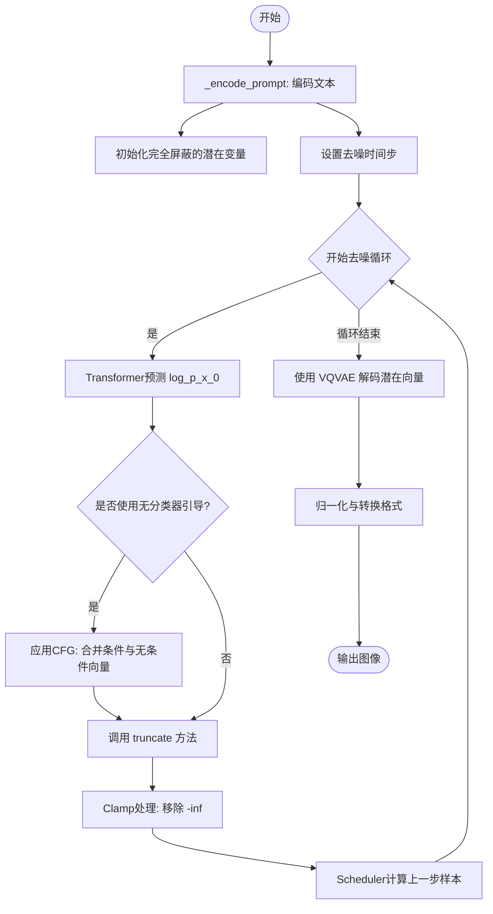
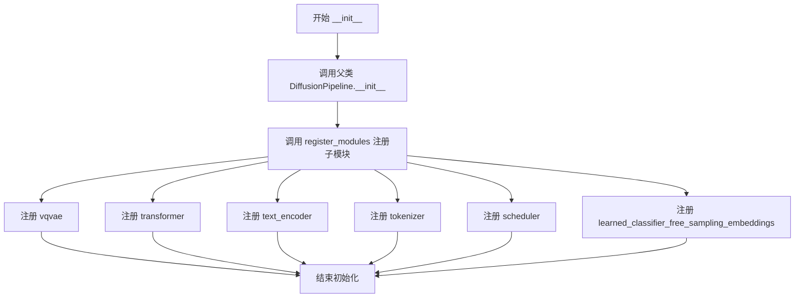
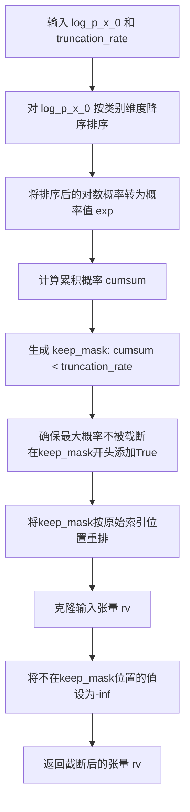

# `diffusers\src\diffusers\pipelines\deprecated\vq_diffusion\pipeline_vq_diffusion.py` 详细设计文档

这是一个用于文本到图像生成的开源Diffusers Pipeline实现。该代码实现了一个基于VQ-Diffusion模型的 pipeline，它结合了CLIP文本编码器、Transformer2DModel（用于去噪被屏蔽的潜在像素）以及VQVAE解码器，通过创新的截断（Truncation）技术从文本提示生成高质量图像。

## 整体流程



## 类结构

```
ConfigMixin, register_to_config (装饰器/基类)
├── LearnedClassifierFreeSamplingEmbeddings (ModelMixin, ConfigMixin)
DiffusionPipeline (基类)
└── VQDiffusionPipeline (DiffusionPipeline)
    ├── VQModel (vqvae)
    ├── CLIPTextModel (text_encoder)
    ├── CLIPTokenizer (tokenizer)
    ├── Transformer2DModel (transformer)
    ├── LearnedClassifierFreeSamplingEmbeddings (embeddings)
    └── VQDiffusionScheduler (scheduler)
```

## 全局变量及字段


### `logger`
    
模块级别的日志记录器，用于输出警告和信息。

类型：`logging.Logger`
    


### `VQDiffusionPipeline.vqvae`
    
向量量化变分自编码器，用于编解码图像。

类型：`VQModel`
    


### `VQDiffusionPipeline.text_encoder`
    
冻结的文本编码器。

类型：`CLIPTextModel`
    


### `VQDiffusionPipeline.tokenizer`
    
用于将文本分词。

类型：`CLIPTokenizer`
    


### `VQDiffusionPipeline.transformer`
    
条件Transformer模型，用于去噪潜在像素。

类型：`Transformer2DModel`
    


### `VQDiffusionPipeline.learned_classifier_free_sampling_embeddings`
    
存储无分类器采样的学习向量。

类型：`LearnedClassifierFreeSamplingEmbeddings`
    


### `VQDiffusionPipeline.scheduler`
    
去噪调度器。

类型：`VQDiffusionScheduler`
    


### `LearnedClassifierFreeSamplingEmbeddings.learnable`
    
标记embeddings是否可学习。

类型：`bool`
    


### `LearnedClassifierFreeSamplingEmbeddings.embeddings`
    
存储学习到的文本embeddings。

类型：`torch.nn.Parameter`
    
    

## 全局函数及方法


### `VQDiffusionPipeline.__init__`

初始化VQDiffusionPipeline并注册所有子模块，包括VQVAE模型、文本编码器、分词器、Transformer、调度器和分类器自由采样嵌入。

参数：

- `vqvae`：`VQModel`，向量量化变分自编码器（VAE）模型，用于将图像编码和解码到潜表示
- `text_encoder`：`CLIPTextModel`，冻结的文本编码器（clip-vit-base-patch32）
- `tokenizer`：`CLIPTokenizer`，用于对文本进行分词的CLIP分词器
- `transformer`：`Transformer2DModel`，条件Transformer2DModel，用于对编码后的图像潜变量进行去噪
- `scheduler`：`VQDiffusionScheduler`，与transformer结合使用以去噪编码图像潜变量的调度器
- `learned_classifier_free_sampling_embeddings`：`LearnedClassifierFreeSamplingEmbeddings`，用于存储分类器自由采样的可学习文本嵌入

返回值：`None`，构造函数无返回值

#### 流程图



#### 带注释源码

```python
def __init__(
    self,
    vqvae: VQModel,
    text_encoder: CLIPTextModel,
    tokenizer: CLIPTokenizer,
    transformer: Transformer2DModel,
    scheduler: VQDiffusionScheduler,
    learned_classifier_free_sampling_embeddings: LearnedClassifierFreeSamplingEmbeddings,
):
    """
    初始化VQDiffusionPipeline并注册所有子模块
    
    参数:
        vqvae: VQModel - 向量量化变分自编码器模型
        text_encoder: CLIPTextModel - 冻结的CLIP文本编码器
        tokenizer: CLIPTokenizer - 文本分词器
        transformer: Transformer2DModel - 条件Transformer去噪模型
        scheduler: VQDiffusionScheduler - 扩散调度器
        learned_classifier_free_sampling_embeddings: LearnedClassifierFreeSamplingEmbeddings - 分类器自由采样嵌入
    """
    # 调用父类DiffusionPipeline的初始化方法
    # 父类会执行基础初始化操作
    super().__init__()

    # 使用register_modules方法注册所有子模块
    # 这些模块会被保存为pipeline的内部属性，并可用于推理
    self.register_modules(
        vqvae=vqvae,                                     # VAE模型，用于图像编码/解码
        transformer=transformer,                       # Transformer去噪模型
        text_encoder=text_encoder,                      # 文本编码器
        tokenizer=tokenizer,                             # 文本分词器
        scheduler=scheduler,                             # 扩散调度器
        learned_classifier_free_sampling_embeddings=learned_classifier_free_sampling_embeddings,  # CFG嵌入
    )
```


### `VQDiffusionPipeline._encode_prompt`

该方法负责将文本提示（prompt）编码为高维嵌入向量（embeddings），同时处理CLIP tokenizer的序列长度截断、嵌入归一化，以及分类器自由引导（CFG）所需的正负样本嵌入准备工作。

参数：

- `prompt`：`str | list[str]`，用户输入的文本提示，可以是单个字符串或字符串列表
- `num_images_per_prompt`：`int`，每个提示需要生成的图像数量，用于复制嵌入向量以匹配批量生成
- `do_classifier_free_guidance`：`bool`，是否启用分类器自由引导，若为`True`则需要生成无条件嵌入向量

返回值：`torch.Tensor`，形状为`(batch_size * num_images_per_prompt * (2 if CFG else 1), seq_len, hidden_size)`的文本嵌入张量

#### 流程图

```mermaid
flowchart TD
    A[开始 _encode_prompt] --> B{判断 prompt 类型}
    B -->|list| C[batch_size = len(prompt)]
    B -->|str| D[batch_size = 1]
    C --> E[调用 tokenizer 编码文本]
    D --> E
    E --> F{检查 token 长度}
    F -->|超过最大长度| G[截断并记录警告日志]
    F -->|未超过| H[继续处理]
    G --> I[调用 text_encoder 获取嵌入]
    H --> I
    I --> J[归一化嵌入向量]
    J --> K{根据 num_images_per_prompt 复制}
    K --> L[重复嵌入维度0]
    L --> M{CFG 开关}
    M -->|是| N{learnable 是否为真}
    M -->|否| P[直接返回嵌入]
    N -->|是| O[使用学习的空嵌入]
    N -->|否| Q[使用空字符串生成负向嵌入]
    O --> R[复制负向嵌入匹配批次]
    Q --> R
    R --> S[拼接负向和正向嵌入]
    S --> P
    P --> T[返回 prompt_embeds]
```

#### 带注释源码

```python
def _encode_prompt(self, prompt, num_images_per_prompt, do_classifier_free_guidance):
    # 确定批次大小：若prompt为列表则取其长度，否则为1
    batch_size = len(prompt) if isinstance(prompt, list) else 1

    # 第一步：使用CLIP Tokenizer将文本提示转换为token ID序列
    # 设置padding到最大长度、返回PyTorch张量
    text_inputs = self.tokenizer(
        prompt,
        padding="max_length",
        max_length=self.tokenizer.model_max_length,
        return_tensors="pt",
    )
    text_input_ids = text_inputs.input_ids

    # 第二步：处理CLIP模型的最大序列长度限制，进行必要截断
    # 如果token序列长度超过模型支持的最大长度，需要截断并警告用户
    if text_input_ids.shape[-1] > self.tokenizer.model_max_length:
        # 解码被截断的部分以便日志记录
        removed_text = self.tokenizer.batch_decode(text_input_ids[:, self.tokenizer.model_max_length :])
        logger.warning(
            "The following part of your input was truncated because CLIP can only handle sequences up to"
            f" {self.tokenizer.model_max_length} tokens: {removed_text}"
        )
        # 保留前面的token，丢弃超出部分
        text_input_ids = text_input_ids[:, : self.tokenizer.model_max_length]
    
    # 第三步：通过文本编码器获取文本隐藏状态嵌入
    # text_encoder返回(last_hidden_state, pooler_output)等，此处取[0]获取last_hidden_state
    prompt_embeds = self.text_encoder(text_input_ids.to(self.device))[0]

    # 第四步：VQ-Diffusion特有的归一化步骤
    # CLIP本身只对pooled_output归一化，不对最后的hidden states归一化
    # 为保持与VQ-Diffusion训练一致，需要手动归一化
    prompt_embeds = prompt_embeds / prompt_embeds.norm(dim=-1, keepdim=True)

    # 第五步：为每个prompt生成多张图像而复制嵌入向量
    # repeat_interleave在维度0上重复每个嵌入num_images_per_prompt次
    prompt_embeds = prompt_embeds.repeat_interleave(num_images_per_prompt, dim=0)

    # 第六步：如果启用分类器自由引导（CFG），需要生成负向嵌入
    if do_classifier_free_guidance:
        # 检查是否使用学习的可学习嵌入（learnable embeddings）
        if self.learned_classifier_free_sampling_embeddings.learnable:
            # 直接使用预先学习的空嵌入作为负向提示
            negative_prompt_embeds = self.learned_classifier_free_sampling_embeddings.embeddings
            # 扩展维度并复制以匹配batch_size
            negative_prompt_embeds = negative_prompt_embeds.unsqueeze(0).repeat(batch_size, 1, 1)
        else:
            # 使用空字符串作为负向提示（对应无条件生成）
            uncond_tokens = [""] * batch_size

            # 使用与正向提示相同的长度进行tokenize
            max_length = text_input_ids.shape[-1]
            uncond_input = self.tokenizer(
                uncond_tokens,
                padding="max_length",
                max_length=max_length,
                truncation=True,
                return_tensors="pt",
            )
            # 获取负向提示的嵌入表示
            negative_prompt_embeds = self.text_encoder(uncond_input.input_ids.to(self.device))[0]
            # 同样进行归一化处理
            negative_prompt_embeds = negative_prompt_embeds / negative_prompt_embeds.norm(dim=-1, keepdim=True)

        # 第七步：复制负向嵌入以匹配每张图像的生成
        # 使用MPS友好的方法避免某些设备上的问题
        seq_len = negative_prompt_embeds.shape[1]
        negative_prompt_embeds = negative_prompt_embeds.repeat(1, num_images_per_prompt, 1)
        negative_prompt_embeds = negative_prompt_embeds.view(batch_size * num_images_per_prompt, seq_len, -1)

        # 第八步：拼接负向和正向嵌入用于单次前向传播
        # 这是CFguide的优化技巧：避免执行两次前向传播
        # 拼接后形状: (2 * batch_size * num_images_per_prompt, seq_len, hidden_size)
        prompt_embeds = torch.cat([negative_prompt_embeds, prompt_embeds])

    return prompt_embeds
```


### `VQDiffusionPipeline.__call__`

VQ Diffusion模型的主生成方法，执行去噪循环并返回图像。该方法接收文本提示，通过VQ-Diffusion Transformer进行条件去噪，最后使用VQ-VAE解码器将离散潜在表示转换为最终图像。

参数：

- `prompt`：`str | list[str]`，用于指导图像生成的文本提示
- `num_inference_steps`：`int`，去噪步骤数，默认为100，步数越多通常图像质量越高但推理速度越慢
- `guidance_scale`：`float`，引导比例，默认为5.0，用于平衡文本相关性和图像质量
- `truncation_rate`：`float`，截断率，默认为1.0，用于限制累积概率
- `num_images_per_prompt`：`int`，每个提示生成的图像数量，默认为1
- `generator`：`torch.Generator | list[torch.Generator] | None`，用于确保生成可复现性的随机生成器
- `latents`：`torch.Tensor | None`，预生成的噪声潜在向量，若不提供则生成完全掩码的潜在像素
- `output_type`：`str | None`，输出格式，默认为"pil"，可选PIL.Image或np.array
- `return_dict`：`bool`，是否返回字典格式，默认为True
- `callback`：`Callable[[int, int, torch.Tensor], None] | None`，推理过程中每callback_steps步调用的回调函数
- `callback_steps`：`int`，回调函数调用频率，默认为1

返回值：`ImagePipelineOutput | tuple`，返回生成的图像，若return_dict为True则返回ImagePipelineOutput，否则返回元组

#### 流程图

```mermaid
flowchart TD
    A[开始 __call__] --> B{检查 prompt 类型}
    B -->|str| C[batch_size = 1]
    B -->|list| D[batch_size = len(prompt)]
    B -->|其他| E[抛出 ValueError]
    C --> F[batch_size = batch_size * num_images_per_prompt]
    D --> F
    F --> G[计算 do_classifier_free_guidance = guidance_scale > 1.0]
    G --> H[_encode_prompt 生成文本嵌入]
    H --> I{检查 callback_steps 有效性}
    I -->|无效| J[抛出 ValueError]
    I -->|有效| K[确定 latents_shape]
    K --> L{用户是否提供 latents}
    L -->|否| M[生成完全掩码的 latents]
    L -->|是| N[验证 latents 形状和值范围]
    M --> O[scheduler 设置时间步]
    N --> O
    O --> P[初始化 sample = latents]
    P --> Q[开始去噪循环]
    Q --> R{是否执行 CFG}
    R -->|是| S[latent_model_input = sample * 2]
    R -->|否| T[latent_model_input = sample]
    S --> U[Transformer 预测 model_output]
    T --> U
    U --> V{是否执行 CFG}
    V -->|是| W[分离 uncond 和 text 输出<br/>应用 guidance_scale]
    V -->|否| X[model_output = model_output]
    W --> Y[执行 truncate 截断]
    X --> Y
    Y --> Z[clamp 移除 -inf]
    Z --> AA[scheduler.step 计算前一时刻 sample]
    AA --> BB{执行 callback}
    BB -->|是| CC[调用 callback 函数]
    BB -->|否| DD{是否完成所有步}
    CC --> DD
    DD -->|否| Q
    DD -->|是| EE[VQ-VAE quantize 获取 embeddings]
    EE --> FF[VQ-VAE decode 解码为图像]
    FF --> GG[归一化图像 [0,1]]
    GG --> HH{output_type == pil}
    HH -->|是| II[numpy_to_pil 转换]
    HH -->|否| JJ[保持 numpy 格式]
    II --> KK{return_dict}
    JJ --> KK
    KK -->|是| LL[返回 ImagePipelineOutput]
    KK -->|否| MM[返回 tuple]
    LL --> NN[结束]
    MM --> NN
```

#### 带注释源码

```python
@torch.no_grad()
def __call__(
    self,
    prompt: str | list[str],
    num_inference_steps: int = 100,
    guidance_scale: float = 5.0,
    truncation_rate: float = 1.0,
    num_images_per_prompt: int = 1,
    generator: torch.Generator | list[torch.Generator] | None = None,
    latents: torch.Tensor | None = None,
    output_type: str | None = "pil",
    return_dict: bool = True,
    callback: Callable[[int, int, torch.Tensor], None] | None = None,
    callback_steps: int = 1,
) -> ImagePipelineOutput | tuple:
    """
    The call function to the pipeline for generation.

    Args:
        prompt (`str` or `list[str]`):
            The prompt or prompts to guide image generation.
        num_inference_steps (`int`, *optional*, defaults to 100):
            The number of denoising steps. More denoising steps usually lead to a higher quality image at the
            expense of slower inference.
        guidance_scale (`float`, *optional*, defaults to 7.5):
            A higher guidance scale value encourages the model to generate images closely linked to the text
            `prompt` at the expense of lower image quality. Guidance scale is enabled when `guidance_scale > 1`.
        truncation_rate (`float`, *optional*, defaults to 1.0 (equivalent to no truncation)):
            Used to "truncate" the predicted classes for x_0 such that the cumulative probability for a pixel is at
            most `truncation_rate`. The lowest probabilities that would increase the cumulative probability above
            `truncation_rate` are set to zero.
        num_images_per_prompt (`int`, *optional*, defaults to 1):
            The number of images to generate per prompt.
        generator (`torch.Generator`, *optional*):
            A [`torch.Generator`](https://pytorch.org/docs/stable/generated/torch.Generator.html) to make
            generation deterministic.
        latents (`torch.Tensor` of shape (batch), *optional*):
            Pre-generated noisy latents sampled from a Gaussian distribution, to be used as inputs for image
            generation. Must be valid embedding indices.If not provided, a latents tensor will be generated of
            completely masked latent pixels.
        output_type (`str`, *optional*, defaults to `"pil"`):
            The output format of the generated image. Choose between `PIL.Image` or `np.array`.
        return_dict (`bool`, *optional*, defaults to `True`):
            Whether or not to return a [`~pipelines.ImagePipelineOutput`] instead of a plain tuple.
        callback (`Callable`, *optional*):
            A function that calls every `callback_steps` steps during inference. The function is called with the
            following arguments: `callback(step: int, timestep: int, latents: torch.Tensor)`.
        callback_steps (`int`, *optional*, defaults to 1):
            The frequency at which the `callback` function is called. If not specified, the callback is called at
            every step.

    Returns:
        [`~pipelines.ImagePipelineOutput`] or `tuple`:
            If `return_dict` is `True`, [`~pipelines.ImagePipelineOutput`] is returned, otherwise a `tuple` is
            returned where the first element is a list with the generated images.
    """
    # 确定批次大小：处理单个字符串或字符串列表
    if isinstance(prompt, str):
        batch_size = 1
    elif isinstance(prompt, list):
        batch_size = len(prompt)
    else:
        raise ValueError(f"`prompt` has to be of type `str` or `list` but is {type(prompt)}")

    # 根据每个提示生成的图像数量调整批次大小
    batch_size = batch_size * num_images_per_prompt

    # 确定是否启用无分类器引导（Classifier-Free Guidance）
    do_classifier_free_guidance = guidance_scale > 1.0

    # 编码文本提示为嵌入向量
    prompt_embeds = self._encode_prompt(prompt, num_images_per_prompt, do_classifier_free_guidance)

    # 验证回调步骤参数的有效性
    if (callback_steps is None) or (
        callback_steps is not None and (not isinstance(callback_steps, int) or callback_steps <= 0)
    ):
        raise ValueError(
            f"`callback_steps` has to be a positive integer but is {callback_steps} of type"
            f" {type(callback_steps)}."
        )

    # 确定潜在向量的形状
    latents_shape = (batch_size, self.transformer.num_latent_pixels)
    
    # 如果用户未提供latents，则生成完全掩码的初始潜在向量
    # 掩码类索引为 num_vector_embeds - 1
    if latents is None:
        mask_class = self.transformer.num_vector_embeds - 1
        latents = torch.full(latents_shape, mask_class).to(self.device)
    else:
        # 验证用户提供的latents形状是否符合预期
        if latents.shape != latents_shape:
            raise ValueError(f"Unexpected latents shape, got {latents.shape}, expected {latents_shape}")
        # 验证latents值是否为有效的嵌入索引
        if (latents < 0).any() or (latents >= self.transformer.num_vector_embeds).any():
            raise ValueError(
                "Unexpected latents value(s). All latents be valid embedding indices i.e. in the range 0,"
                f" {self.transformer.num_vector_embeds - 1} (inclusive)."
            )
        latents = latents.to(self.device)

    # 设置调度器的时间步
    self.scheduler.set_timesteps(num_inference_steps, device=self.device)

    # 获取时间步张量
    timesteps_tensor = self.scheduler.timesteps.to(self.device)

    # 初始化样本为latents
    sample = latents

    # 开始去噪循环
    for i, t in enumerate(self.progress_bar(timesteps_tensor)):
        # 如果启用CFG，需要复制样本以同时处理条件和无条件预测
        latent_model_input = torch.cat([sample] * 2) if do_classifier_free_guidance else sample

        # 使用Transformer预测去噪后的图像
        # model_output 是 log_p_x_0（对数概率）
        model_output = self.transformer(latent_model_input, encoder_hidden_states=prompt_embeds, timestep=t).sample

        # 如果启用CFG，执行引导操作
        if do_classifier_free_guidance:
            # 分离无条件输出和文本条件输出
            model_output_uncond, model_output_text = model_output.chunk(2)
            # 应用引导尺度
            model_output = model_output_uncond + guidance_scale * (model_output_text - model_output_uncond)
            # 应用log-sum-exp归一化以稳定训练
            model_output -= torch.logsumexp(model_output, dim=1, keepdim=True)

        # 对预测结果进行截断处理
        model_output = self.truncate(model_output, truncation_rate)

        # 移除-log(0)（即-inf）值，设置为-70
        model_output = model_output.clamp(-70)

        # 使用调度器计算前一时刻的样本
        sample = self.scheduler.step(model_output, timestep=t, sample=sample, generator=generator).prev_sample

        # 如果提供了回调函数且满足调用条件，则调用回调
        if callback is not None and i % callback_steps == 0:
            callback(i, t, sample)

    # 获取VQ-VAE的嵌入通道数
    embedding_channels = self.vqvae.config.vq_embed_dim
    
    # 计算嵌入形状
    embeddings_shape = (batch_size, self.transformer.height, self.transformer.width, embedding_channels)
    
    # 从码本中获取对应的嵌入向量
    embeddings = self.vqvae.quantize.get_codebook_entry(sample, shape=embeddings_shape)
    
    # 使用VQ-VAE解码器将嵌入解码为图像
    image = self.vqvae.decode(embeddings, force_not_quantize=True).sample

    # 将图像归一化到[0,1]范围
    image = (image / 2 + 0.5).clamp(0, 1)
    
    # 转换为numpy数组并调整维度顺序
    image = image.cpu().permute(0, 2, 3, 1).numpy()

    # 如果输出类型为PIL图像，则进行转换
    if output_type == "pil":
        image = self.numpy_to_pil(image)

    # 根据return_dict决定返回格式
    if not return_dict:
        return (image,)

    return ImagePipelineOutput(images=image)
```


### `VQDiffusionPipeline.truncate`

实现VQ-Diffusion特有的概率截断算法，通过对预测的类别对数概率进行截断，控制生成的多样性。该方法将每个像素位置的概率分布截断至累积概率不超过指定的truncation_rate，从而在生成过程中引入随机性。

参数：

- `self`：类的实例方法隐含参数
- `log_p_x_0`：`torch.Tensor`，形状为 (batch, num_classes, height*width) 或类似的多维张量，表示每个像素位置预测的类别对数概率（log probabilities）
- `truncation_rate`：`float`，截断率，控制保留概率的比例。值为1.0表示不截断（保留全部概率），值越小表示截断越激进，生成多样性越高

返回值：`torch.Tensor`，与输入 `log_p_x_0` 形状相同的张量，其中被截断的概率值被设置为 `-inf`（即 log(0)）

#### 流程图



#### 带注释源码

```python
def truncate(self, log_p_x_0: torch.Tensor, truncation_rate: float) -> torch.Tensor:
    """
    Truncates `log_p_x_0` such that for each column vector, the total cumulative probability is `truncation_rate`
    The lowest probabilities that would increase the cumulative probability above `truncation_rate` are set to
    zero.
    """
    # Step 1: 对log_p_x_0在类别维度(dim=1)上进行降序排序
    # 同时获取排序后的索引indices，用于后续恢复原始位置
    sorted_log_p_x_0, indices = torch.sort(log_p_x_0, 1, descending=True)
    
    # Step 2: 将对数概率转换为实际概率值 (exp(log(p)) = p)
    sorted_p_x_0 = torch.exp(sorted_log_p_x_0)
    
    # Step 3: 计算累积概率，使得累积概率不超过truncation_rate
    # keep_mask为True表示该位置的概率应被保留
    keep_mask = sorted_p_x_0.cumsum(dim=1) < truncation_rate

    # Step 4: 确保至少保留最大概率（避免完全截断导致-inf问题）
    # 创建一个全True的mask，放在keep_mask的最前面
    all_true = torch.full_like(keep_mask[:, 0:1, :], True)
    # 拼接全True mask和原keep_mask
    keep_mask = torch.cat((all_true, keep_mask), dim=1)
    # 移除最后一列（保持与原始长度一致）
    keep_mask = keep_mask[:, :-1, :]

    # Step 5: 将keep_mask按照原始索引位置重排（恢复原始类别顺序）
    # indices.argsort(1)可以得到从排序后位置恢复到原始位置的映射
    keep_mask = keep_mask.gather(1, indices.argsort(1))

    # Step 6: 克隆输入张量，避免修改原始数据
    rv = log_p_x_0.clone()

    # Step 7: 将被截断的位置设置为负无穷（即log(0)）
    # 这样在后续的采样中，这些低概率类别就不会被选中
    rv[~keep_mask] = -torch.inf  # -inf = log(0)

    return rv
```


### `LearnedClassifierFreeSamplingEmbeddings.__init__`

该方法是 `LearnedClassifierFreeSamplingEmbeddings` 类的初始化方法，根据 `learnable` 参数初始化可学习的文本嵌入张量（当 `learnable=True` 时创建零张量并注册为可学习参数）或 `None`（当 `learnable=False` 时）。

参数：

- `self`：`LearnedClassifierFreeSamplingEmbeddings` 实例本身
- `learnable`：`bool`，指示是否创建可学习的嵌入向量。如果为 `True`，则创建可训练的张量；如果为 `False`，则嵌入为 `None`
- `hidden_size`：`int | None = None`，隐藏层维度，仅当 `learnable=True` 时需要指定
- `length`：`int | None = None`，嵌入向量的序列长度，仅当 `learnable=True` 时需要指定

返回值：`None`，该方法为构造函数，不返回任何值（隐式返回 `self`）

#### 流程图

```mermaid
flowchart TD
    A[开始 __init__] --> B[调用父类 __init__]
    B --> C{learnable == True?}
    C -->|是| D{hidden_size is not None?}
    C -->|否| E[embeddings = None]
    D -->|否| F[抛出 AssertionError: learnable=True requires hidden_size to be set]
    D -->|是| G{length is not None?}
    G -->|否| H[抛出 AssertionError: learnable=True requires length to be set]
    G -->|是| I[embeddings = torch.zeros(length, hidden_size)]
    E --> J[创建 torch.nn.Parameter 并赋值给 self.embeddings]
    I --> J
    J --> K[结束 __init__]
```

#### 带注释源码

```python
@register_to_config
def __init__(self, learnable: bool, hidden_size: int | None = None, length: int | None = None):
    """
    初始化 LearnedClassifierFreeSamplingEmbeddings 实例
    
    参数:
        learnable: bool, 是否创建可学习的嵌入向量
        hidden_size: int | None, 嵌入向量的隐藏维度, 仅 learnable=True 时需要
        length: int | None, 嵌入序列的长度, 仅 learnable=True 时需要
    """
    # 调用父类 ModelMixin 和 ConfigMixin 的初始化方法
    # 这会注册配置到 config 对象中（由 @register_to_config 装饰器触发）
    super().__init__()
    
    # 将 learnable 参数存储为实例属性
    self.learnable = learnable
    
    # 根据 learnable 标志决定如何初始化 embeddings
    if self.learnable:
        # 当 learnable=True 时, 验证必需参数 hidden_size 和 length
        assert hidden_size is not None, "learnable=True requires `hidden_size` to be set"
        assert length is not None, "learnable=True requires `length` to be set"
        
        # 创建形状为 (length, hidden_size) 的零张量
        # 这些零值将在训练过程中通过梯度更新学习到最优的文本嵌入
        embeddings = torch.zeros(length, hidden_size)
    else:
        # 当 learnable=False 时, 不创建实际的嵌入张量
        # 在 VQDiffusionPipeline 中会使用空字符串作为无条件提示
        embeddings = None
    
    # 将 embeddings 包装为 torch.nn.Parameter
    # 只有被包装为 Parameter 的张量才会参与梯度更新（当 learnable=True 时）
    # 如果 embeddings 为 None, Parameter 包装的也是 None
    self.embeddings = torch.nn.Parameter(embeddings)
```

## 关键组件


### VQDiffusionPipeline

VQ-Diffusion 管道的主类，负责文本到图像的生成任务。它整合了 VQVAE、文本编码器、Transformer 和调度器，实现基于向量量化的扩散模型推理。

### LearnedClassifierFreeSamplingEmbeddings

用于存储分类器自由采样（Classifier-Free Guidance）学习文本嵌入的工具类。支持可学习和不可学习两种模式，在不可学习模式下嵌入为 None。

### _encode_prompt

将文本提示编码为嵌入向量的方法。负责分词、截断处理、CLIP 文本编码、嵌入归一化以及分类器自由引导的负向嵌入生成。

### __call__

管道的主推理方法，执行完整的文本到图像生成流程。包含潜在向量初始化、迭代去噪、分类器自由引导、截断处理、VQVAE 解码和图像后处理。

### truncate

对数概率分布截断方法，用于限制每个像素位置的累积概率不超过指定的截断率。该技术来自 VQ-Diffusion 论文，有助于提高生成质量。

### vqvae (VQModel)

向量量化变分自编码器，负责将潜在表示编码为离散码本索引，并将码本条目解码为图像。

### text_encoder (CLIPTextModel)

冻结的 CLIP 文本编码器模型，将分词后的文本转换为文本嵌入向量，用于引导图像生成。

### transformer (Transformer2DModel)

条件 Transformer2DModel，负责在去噪过程中根据文本嵌入预测下一个时间步的潜在表示。

### scheduler (VQDiffusionScheduler)

VQ 扩散调度器，负责管理去噪过程中的时间步和噪声调度。

### 分类器自由引导（Classifier-Free Guidance）

通过同时处理条件和无条件嵌入来实现引导生成的技术，在本代码中支持可学习嵌入和空字符串两种方式。

### 潜在向量索引与掩码机制

使用完全掩码的潜在像素作为初始输入，掩码值为 `num_vector_embeds - 1`，表示该位置尚未被预测。


## 问题及建议


### 已知问题

- **初始化embeddings为空时存在风险**：当`learnable=False`时，`embeddings`被设置为`None`，但在`_encode_prompt`中假设`learnable=True`时才使用该属性。若后续代码尝试访问`self.learned_classifier_free_sampling_embeddings.embeddings`而未正确检查，可能导致空指针异常。
- **truncate方法数值稳定性问题**：使用`torch.exp(sorted_log_p_x_0)`可能导致数值溢出（当log值很大时），尽管后续有`clamp(-70)`操作，但exp(-70)已经接近浮点数最小值。
- **generator参数类型验证缺失**：在`__call__`方法中接收`generator`参数，但未验证其类型是否为`torch.Generator`或`list[torch.Generator]`，不符合pipeline其他参数的类型检查风格。
- **latents验证不完整**：虽然检查了latents的值范围是否为有效的embedding索引，但未检查latents的dtype是否为整数类型，可能导致隐式类型转换问题。
- **缺少对learned_embeddings的序列化支持**：LearnedClassifierFreeSamplingEmbeddings类没有提供从配置文件加载或保存可学习embeddings的方法，限制了模型的持久化和迁移能力。

### 优化建议

- **改进embeddings初始化逻辑**：当`learnable=False`时，可以将embeddings初始化为全零或提供明确的`None`处理逻辑，避免后续访问时出现意外错误。
- **增强数值稳定性**：在truncate方法中，使用`torch.softmax`替代`torch.exp`来计算概率，或在exp操作前对log值进行shift操作以避免数值溢出。
- **添加generator类型验证**：在`__call__`方法开头添加对generator参数的类型检查，与callback_steps的验证风格保持一致。
- **完善latents验证**：添加对latents dtype的检查，确保其为整数类型（torch.long），并在类型不匹配时给出明确的错误提示。
- **优化tensor复制操作**：在_encode_prompt中，negative_prompt_embeds的复制操作可以合并为单步操作，减少中间tensor的创建。
- **添加性能优化装饰器**：对于推理过程，可以考虑使用`@torch.cuda.amp.autocast`来启用混合精度推理，提高在GPU上的性能。
- **增强文档和类型提示**：为关键方法添加更详细的文档字符串，说明截断率的具体行为和数值范围限制。


## 其它


### 设计目标与约束

本VQ Diffusion Pipeline的核心设计目标是实现高质量的文本到图像生成能力，支持通过向量量化扩散模型将自然语言描述转换为视觉图像。设计约束包括：必须继承DiffusionPipeline基类以保持与Hugging Face Diffusers框架的兼容性；文本编码器采用CLIP模型（clip-vit-base-patch32）以确保语义理解能力；图像生成过程中通过分类器自由引导（Classifier-Free Guidance）提升生成质量；模型必须支持批量生成和推理步骤可配置化。

### 错误处理与异常设计

代码中的错误处理机制主要体现在参数验证和边界检查两个方面。在__call__方法中，首先对prompt类型进行验证，仅接受str或list类型；对callback_steps进行正整数校验；latents输入必须符合预期的形状范围（0到num_vector_embeds-1之间），否则抛出ValueError异常。截断操作中通过clamp(-70)防止对数运算产生-inf值导致数值不稳定。潜在改进方向包括增加对device不匹配的检测、GPU内存不足的异常处理、以及对tokenizer.model_max_length超出时的更优雅处理。

### 数据流与状态机

Pipeline的执行流程遵循典型的扩散模型推理状态机。初始状态为完全掩码的latents（mask_class = num_vector_embeds - 1），经过num_inference_steps次迭代逐步去噪。每次迭代包含以下状态转换：获取当前timestep → 扩展latents用于分类器自由引导 → Transformer预测log_p_x_0 → 应用guidance scale计算 → 概率截断 → scheduler计算前一时刻样本 → 回调函数执行。最终状态通过VQVAE解码器将离散latent映射回像素空间，输出PIL图像或numpy数组。

### 外部依赖与接口契约

主要外部依赖包括：PyTorch作为深度学习计算框架；transformers库提供CLIPTextModel和CLIPTokenizer；diffusers库的ConfigMixin、ModelMixin、Transformer2DModel、VQModel、VQDiffusionScheduler等组件；DiffusionPipeline和ImagePipelineOutput基类。接口契约方面：VQVAE需提供quantize.get_codebook_entry方法和decode方法；scheduler需实现set_timesteps和step方法；transformer需提供sample属性访问。版本兼容性要求Python 3.8+和PyTorch 1.9+，transformers版本需支持CLIPTextModel。

### 配置参数详解

VQDiffusionPipeline的构造函数接收6个核心模块参数：vqvae（VQModel实例）、text_encoder（CLIPTextModel）、tokenizer（CLIPTokenizer）、transformer（Transformer2DModel）、scheduler（VQDiffusionScheduler）、learned_classifier_free_sampling_embeddings（LearnedClassifierFreeSamplingEmbeddings）。LearnedClassifierFreeSamplingEmbeddings的配置包含learnable（布尔值，控制是否使用可学习嵌入）、hidden_size（文本嵌入维度）、length（嵌入序列长度）。__call__方法的关键参数包括：num_inference_steps（去噪步数，默认100）、guidance_scale（引导强度，默认5.0）、truncation_rate（概率截断率，默认1.0）、num_images_per_prompt（单提示生成的图像数量）。

### 性能考虑与优化空间

当前实现的主要性能瓶颈在于：文本编码器对每个提示需要进行前向传播，在分类器自由引导模式下还需额外处理负向提示；Transformer推理占主要计算成本；VQVAE解码步骤在最后阶段执行。优化方向包括：实现提示缓存机制避免重复编码；使用ONNX或TorchScript进行模型加速；考虑使用FP16混合精度推理；实现批处理优化以提高GPU利用率。当前代码已采用repeat_interleave和view方法进行batch扩展，属于mps友好的实现方式。

### 并发与线程安全性

Pipeline实例本身设计为无状态（除了模块引用），因此在多线程环境下可安全共享实例，但不同线程同时调用__call__方法时需要外部加锁保护。callback函数的调用发生在推理循环内部，如果在多线程场景中使用需确保callback本身的线程安全性。torch.no_grad()上下文管理器确保推理过程不产生梯度，适合多线程并发推理场景。

### 版本兼容性说明

本代码基于Apache License 2.0开源许可，版权归属Microsoft和HuggingFace Team。依赖的transformers库版本需支持CLIPTextModel的hidden_states输出格式；diffusers库版本需支持VQModel和VQDiffusionScheduler的当前API设计；PyTorch版本应支持torch.no_grad装饰器和TensorArray操作。代码中使用| Union语法（Python 3.10+类型提示），需注意Python版本兼容性。

### 安全性考虑

潜在安全风险包括：prompt注入攻击风险，用户可能通过恶意构造的文本提示导致模型产生不当输出；模型权重加载过程中的路径遍历漏洞；生成图像的版权和伦理问题。缓解措施包括：对输入prompt进行长度和内容过滤；验证模型加载路径的合法性；建议在生产环境中添加内容审核模块。当前代码未实现输入净化功能，属于可改进项。

### 测试策略建议

建议的测试覆盖包括：单元测试验证LearnedClassifierFreeSamplingEmbeddings的初始化逻辑（learnable=True/False两种模式）；集成测试验证完整pipeline的图像生成流程；参数边界测试（空提示、超长提示、无效latents等）；数值稳定性测试（极端truncation_rate值）；性能基准测试对比不同配置下的推理速度和内存占用。

### 扩展性设计

当前架构支持以下扩展方向：可通过替换VQVAE模块支持不同的生成模型；learned_classifier_free_sampling_embeddings支持用户自定义的嵌入训练；scheduler可通过注册新模块支持不同的采样策略（DDPM、DDIM、PNDM等）；callback机制允许集成监控和可视化工具。扩展时需遵循DiffusionPipeline的模块注册规范，通过register_modules方法注入新组件。


    