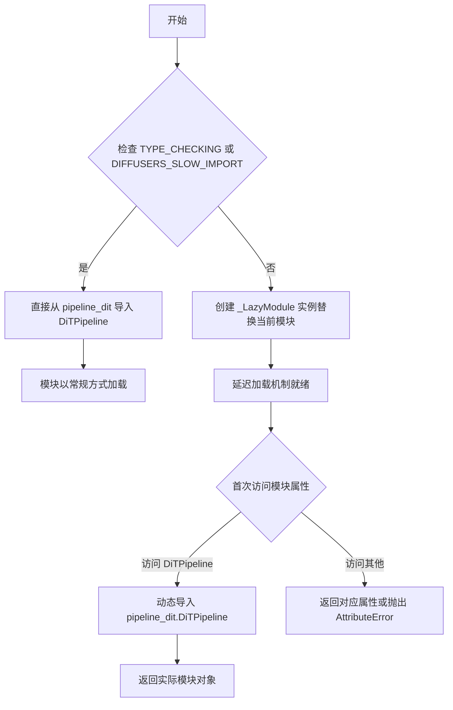

# `diffusers\src\diffusers\pipelines\dit\__init__.py` 详细设计文档

这是一个Diffusers库的懒加载模块初始化文件，通过LazyModule机制实现DiTPipeline的延迟导入，以提高库的启动性能和减少内存占用。

## 整体流程

```mermaid
graph TD
    A[模块加载] --> B{DIFFUSERS_SLOW_IMPORT or TYPE_CHECKING?}
    B -- 是 --> C[直接导入 DiTPipeline]
    B -- 否 --> D[创建 _LazyModule 实例]
    D --> E[替换 sys.modules[__name__]]
    F[外部导入请求] --> G{首次导入?}
    G -- 是 --> H[_LazyModule 加载实际模块]
    G -- 否 --> I[返回已缓存模块]
```

## 类结构

```
此文件为模块级代码，不包含类定义
主要使用 _LazyModule 实现懒加载机制
└── _LazyModule (来自 ...utils)
```

## 全局变量及字段


### `_import_structure`
    
延迟导入结构字典，将子模块名称映射到导出项列表，用于模块的延迟加载。

类型：`Dict[str, List[str]]`
    


### `DiTPipeline`
    
DiT管道类，从pipeline_dit模块导入，用于构建扩散变换管道。

类型：`type`
    


    

## 全局函数及方法


### `_LazyModule`（在 `__main__` 模块中的调用）

这是一个延迟加载模块的调用示例，通过 `_LazyModule` 类实现按需导入。代码定义了 `DiTPipeline` 的导入结构，并在非类型检查模式下使用延迟加载机制，当实际访问模块内容时才进行导入，从而优化初始加载时间。

参数：

- `__name__`：`str`，当前模块的完全限定名称（`__name__`）
- `globals()["__file__"]`：`str`，模块文件的绝对路径，用于定位模块
- `_import_structure`：`Dict[str, List[str]]`，定义了可导出的公共API结构，键为子模块名，值为导出对象列表
- `module_spec=__spec__`：`ModuleSpec | None`，Python的模块规格对象，包含模块的元数据信息

返回值：`ModuleType`，返回一个新的模块对象，该对象代理实际的模块访问，实现延迟加载

#### 流程图



#### 带注释源码

```python
from typing import TYPE_CHECKING

# 从上层包的 utils 模块导入延迟加载核心类
# _LazyModule: 实现延迟加载功能的模块封装类
from ...utils import DIFFUSERS_SLOW_IMPORT, _LazyModule

# 定义模块的公共API结构
# 键: 子模块名, 值: 该子模块中可导出的对象列表
_import_structure = {"pipeline_dit": ["DiTPipeline"]}

# TYPE_CHECKING: 仅在类型检查时为True，不执行实际导入
# DIFFUSERS_SLOW_IMPORT: 可能的配置标志，控制是否使用延迟加载
if TYPE_CHECKING or DIFFUSERS_SLOW_IMPORT:
    # 静态导入，仅在类型检查或特殊配置下执行
    # 不会触发模块的实际加载，用于IDE类型提示和静态分析
    from .pipeline_dit import DiTPipeline

else:
    # 运行时：使用延迟加载机制
    import sys

    # 将当前模块替换为 _LazyModule 实例
    # 这样首次访问模块属性时才会触发实际导入
    sys.modules[__name__] = _LazyModule(
        __name__,                      # 模块名称
        globals()["__file__"],         # 模块文件路径
        _import_structure,             # 导出结构定义
        module_spec=__spec__,          # 模块规格信息（可能为None）
    )
```

#### 关键组件信息

| 组件名称 | 一句话描述 |
|---------|-----------|
| `_import_structure` | 字典结构，定义模块的公共导出API |
| `DiTPipeline` | DiT扩散模型的Pipeline实现类 |
| `TYPE_CHECKING` | Python类型检查标志，用于静态分析 |

#### 潜在技术债务或优化空间

1. **缺失错误处理**：当延迟加载失败时（如子模块不存在），错误信息可能不够清晰
2. **硬编码的导入结构**：`_import_structure`写死在文件中，不利于动态扩展
3. **`__spec__`可能为None**：在某些场景下`__spec__`可能未定义，应做防御性检查

#### 其它项目

- **设计目标**：实现Diffusers库的模块化延迟加载，减少首次导入时间
- **约束条件**：必须保持与TYPE_CHECKING模式的兼容性
- **错误处理**：当访问未定义的导出属性时，_LazyModule应抛出适当的AttributeError
- **外部依赖**：依赖上层包的utils模块中的_LazyModule实现


## 关键组件


### 核心功能概述

该代码是一个Diffusers库的DiT Pipeline模块的惰性导入配置文件，通过条件导入和_LazyModule实现DiTPipeline类的延迟加载，优化启动性能并支持类型检查。

### 文件整体运行流程

1. 导入类型检查标志TYPE_CHECKING和DIFFUSERS_SLOW_IMPORT配置
2. 定义导入结构字典_import_structure，声明DiTPipeline的导出路径
3. 判断是否处于类型检查模式或慢导入模式
4. 若是，则直接导入DiTPipeline类供类型检查使用
5. 否则，将当前模块注册为_LazyModule，实现运行时惰性加载

### 类详细信息

该文件为模块级代码，不包含自定义类定义。核心功能由以下全局元素实现：

### 全局变量和全局函数

#### _import_structure
- 类型: dict
- 描述: 导入结构字典，映射模块路径到导出的类名列表

#### DIFFUSERS_SLOW_IMPORT
- 类型: bool (从utils导入)
- 描述: 控制是否使用慢速导入模式的配置标志

#### TYPE_CHECKING
- 类型: bool (从typing导入)
- 描述: Python类型检查模式标志，导入时为False，运行时不加载实际模块

### 关键组件信息

### DiTPipeline
- 描述: DiT (Diffusion Transformer) Pipeline主类，通过惰性加载机制导出

### _LazyModule
- 描述: 惰性加载模块封装类，延迟导入实际模块内容以优化导入性能

### TYPE_CHECKING条件分支
- 描述: 类型检查专用导入路径，避免运行时导入开销

### 潜在的技术债务或优化空间

1. **模块结构分散**: 实际类实现与导入配置分离，可能导致维护困难
2. **类型检查兼容性**: 依赖TYPE_CHECKING的条件导入可能在某些IDE中支持不完整
3. **循环导入风险**: 懒加载机制虽然优化了性能，但可能隐藏循环导入问题

### 其它项目

#### 设计目标与约束
- 目标: 实现模块的惰性加载，优化Diffusers库的启动性能
- 约束: 必须保持与TYPE_CHECKING模式的兼容性

#### 错误处理与异常设计
- 依赖于_LazyModule的内部错误处理机制
- 模块不存在时会产生AttributeError

#### 数据流与状态机
- 模块首次访问时触发_LazyModule的导入逻辑
- 导入完成后替换为实际模块对象

#### 外部依赖与接口契约
- 依赖...utils中的DIFFUSERS_SLOW_IMPORT配置
- 依赖_LazyModule类实现惰性加载
- 对外提供DiTPipeline类的标准导入接口


## 问题及建议


### 已知问题

-   **缺乏实际功能代码**：该文件仅是一个延迟导入的模块封装，不包含任何实际业务逻辑或功能实现，无法独立完成任何任务。
-   **异常处理机制缺失**：当`pipeline_dit`模块或`DiTPipeline`类不存在时，代码不具备错误捕获和友好提示能力，可能导致运行时隐式失败。
-   **模块间耦合度高**：直接依赖上层目录的`utils`模块（`...utils`）和同级的`pipeline_dit`模块，模块重构或移动时易产生导入错误。
-   **导出结构维护成本**：`_import_structure`字典手动维护，新增导出项时需要同步更新，遗忘更新会导致功能不可用。
-   **类型检查覆盖不完整**：`TYPE_CHECKING`分支仅包含类名引用，缺少完整的类型注解，可能影响静态分析工具的准确性。
-   **无文档说明**：模块级别缺少文档字符串（docstring），开发者难以快速理解模块用途和设计意图。

### 优化建议

-   **添加模块级文档**：在文件顶部添加模块说明，描述该模块在Diffusers库中的角色和职责。
-   **增强错误处理**：在导入失败时添加try-except块，抛出具有明确信息的自定义异常。
-   **提取配置常量**：将`_import_structure`迁移至独立的配置文件或通过自动化脚本生成，降低人工维护成本。
-   **补充类型注解**：在`TYPE_CHECKING`分支中添加更完整的类型导入，提升IDE和类型检查器的支持度。
-   **解耦依赖关系**：考虑通过依赖注入或配置化方式降低对具体模块路径的强依赖，提升代码的可测试性和可维护性。

## 其它


### 设计目标与约束

本模块的设计目标是实现DiTPipeline的延迟导入（Lazy Import），避免在模块初始化时立即加载整个DiTPipeline类及其依赖，从而优化库的导入时间和内存占用。约束包括：必须兼容TYPE_CHECKING模式以支持类型检查工具（如mypy、pyright）正确识别类型，同时支持运行时动态导入；必须保持与父项目Diffusers的_import_structure和LazyModule机制的一致性。

### 错误处理与异常设计

本模块本身的错误处理较为简单，主要依赖于LazyModule的内部机制。当DiTPipeline在运行时被首次访问时，如果导入失败，LazyModule会抛出ImportError或AttributeError。TYPE_CHECKING模式下，如果from .pipeline_dit import DiTPipeline失败，会导致类型检查失败，但不会影响运行时。设计上建议在调用处捕获AttributeError并给出明确的错误提示，告知用户需要安装相关依赖。

### 数据流与状态机

本模块不涉及复杂的数据流或状态机。其核心数据流为：当代码首次访问DiTPipeline属性时，LazyModule触发_import_structure中注册的导入逻辑，从pipeline_dit模块动态加载DiTPipeline类并注册到当前模块的命名空间中，后续访问则直接返回已缓存的类对象。

### 外部依赖与接口契约

本模块依赖以下外部组件：1) Diffusers库的utils模块中的LazyModule类和_import_structure、_LazyModule、DIFFUSERS_SLOW_IMPORT变量；2) 同包下的pipeline_dit模块中的DiTPipeline类；3) Python标准库中的sys模块。接口契约方面，导出的DiTPipeline类应与Diffusers库的Pipeline接口规范保持一致，支持标准的from_pretrained、__call__等方法。

### 版本兼容性考虑

本模块需要兼容Python 3.7+（支持TYPE_CHECKING语法），兼容Diffusers库0.10.0以上版本（LazyModule机制）。需要确保_import_structure字典的结构与Diffusers库的其他延迟导入模块保持一致，以便统一管理。

### 性能考虑

本模块的主要性能优化点在于延迟导入，通过LazyModule避免在模块加载时立即导入可能重量级的DiTPipeline及其依赖（如torch、transformers等），可以显著减少库的整体导入时间，特别是在仅需要使用其他轻量级模块的场景下。

### 安全性考虑

本模块本身不涉及用户输入处理或网络请求，安全性风险较低。主要安全考量在于确保pipeline_dit模块来源可信，防止通过恶意模块注入攻击。设计上依赖Diffusers框架的统一安全管理。

### 测试策略

本模块的测试应覆盖：1) TYPE_CHECKING模式下DiTPipeline能被正确导入并识别类型；2) 运行时模式下首次访问DiTPipeline时能正确触发导入并缓存；3) 重复导入时返回缓存的类对象而非重新导入；4) pipeline_dit模块不存在时的错误处理。建议使用pytest框架编写单元测试。

### 部署注意事项

本模块作为Diffusers库的子模块部署时，需要确保：1) 目录结构符合Diffusers的包组织规范（带有__init__.py和__spec__）；2) pipeline_dit.py文件存在于同一目录下；3) utils模块中的LazyModule和相关工具可用。部署时应验证延迟导入在目标环境（不同Python版本、不同操作系统）下正常工作。


    