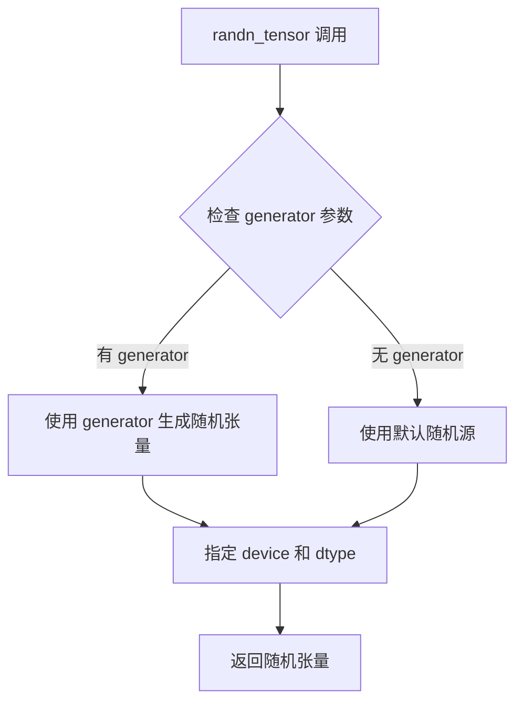
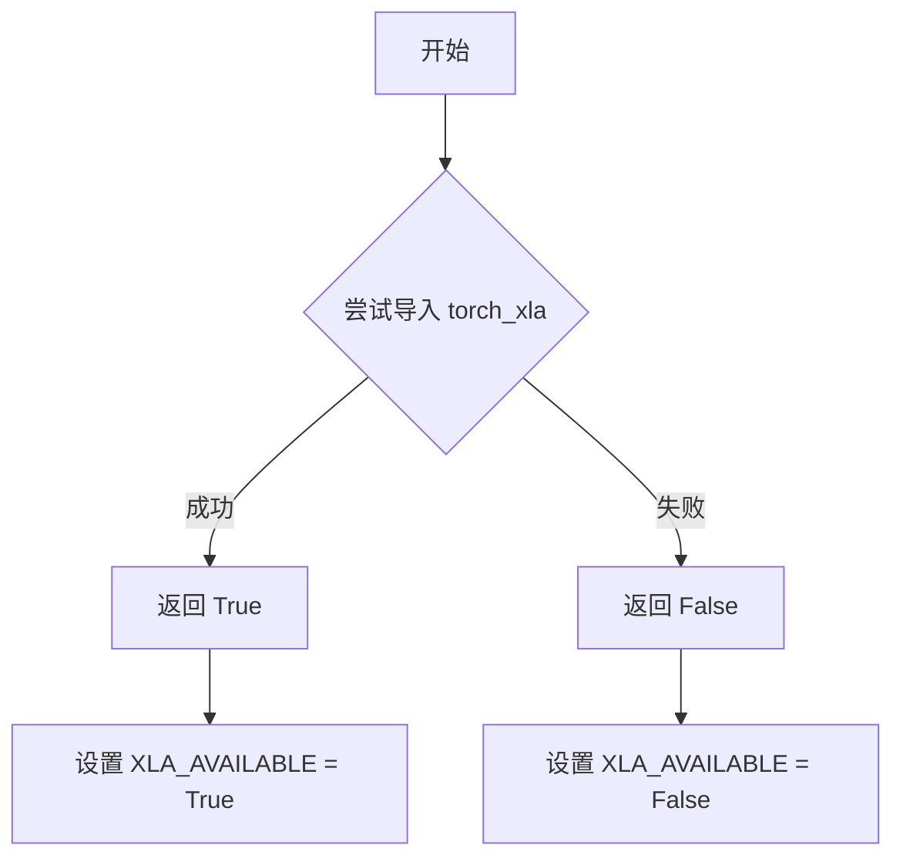
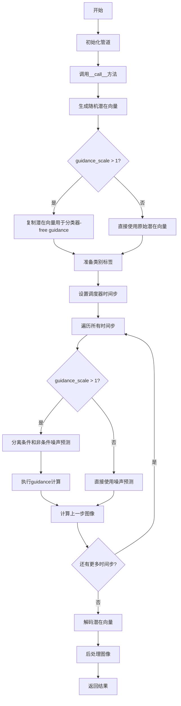
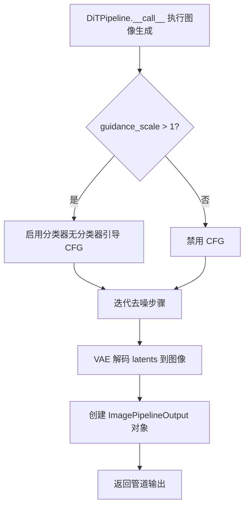
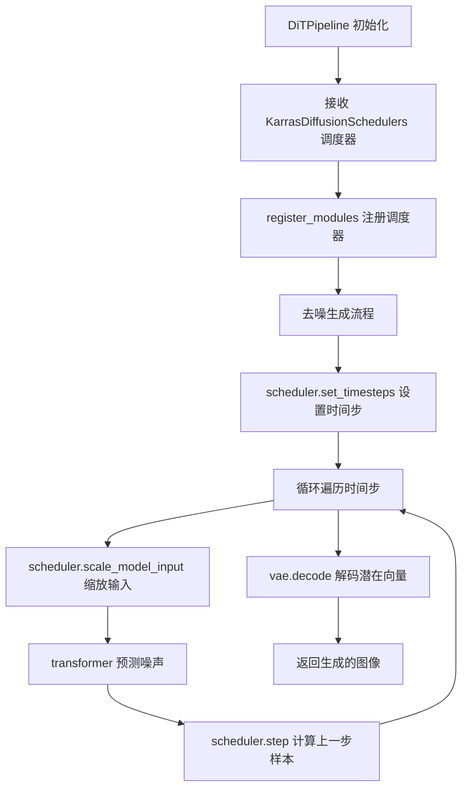
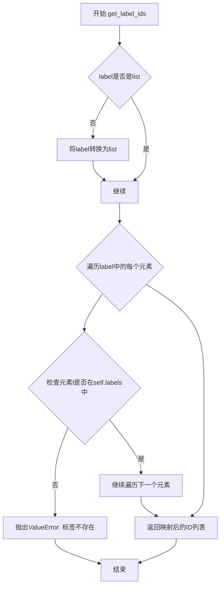

# `diffusers\src\diffusers\pipelines\dit\pipeline_dit.py` 详细设计文档

DiTPipeline是一个基于Transformer架构的扩散模型推理管道，用于根据ImageNet类别标签生成图像。该管道使用DiTTransformer2DModel作为去噪主干网络，结合VAE进行潜在空间的编码和解码，并通过KarrasDiffusionSchedulers调度器实现迭代去噪过程。

## 整体流程

```mermaid
graph TD
    A[开始: pipeline.__call__] --> B[获取batch_size和latent尺寸]
    B --> C[使用randn_tensor生成随机潜在向量]
    C --> D{guidance_scale > 1?}
    D -- 是 --> E[复制latent用于classifier-free guidance]
    D -- 否 --> F[准备class_labels和null labels]
    F --> G[设置scheduler的timesteps]
    G --> H[遍历每个timestep]
    H --> I{guidance_scale > 1?}
    I -- 是 --> J[分割latent为cond和uncond两部分]
    I -- 否 --> K[调用transformer预测噪声]
    J --> K
    K --> L[执行classifier-free guidance]
    L --> M[处理learned sigma]
    M --> N[调用scheduler.step计算上一步样本]
    N --> O{还有更多timestep?}
    O -- 是 --> H
    O -- 否 --> P[解码latents为图像]
    P --> Q[后处理: 归一化到[0,1]]
    Q --> R[转换为numpy数组]
    R --> S{output_type == 'pil'?}
    S -- 是 --> T[转换为PIL图像]
    S -- 否 --> U[返回结果]
    T --> U
```

## 类结构

```
DiffusionPipeline (抽象基类)
└── DiTPipeline (图像生成管道)
```

## 全局变量及字段


### `XLA_AVAILABLE`
    
表示torch_xla是否可用，用于判断是否可以在TPU设备上加速计算

类型：`bool`
    


### `DiTPipeline.model_cpu_offload_seq`
    
指定模型卸载到CPU的顺序，用于管理模型内存占用

类型：`str`
    


### `DiTPipeline.transformer`
    
基于Transformer的去噪模型，用于根据类别标签预测噪声

类型：`DiTTransformer2DModel`
    


### `DiTPipeline.vae`
    
变分自编码器模型，用于将图像编码为潜在表示或从潜在表示解码为图像

类型：`AutoencoderKL`
    


### `DiTPipeline.scheduler`
    
Karras扩散调度器，用于控制去噪过程的噪声调度

类型：`KarrasDiffusionSchedulers`
    


### `DiTPipeline.labels`
    
ImageNet类别标签到ID的映射字典，用于将文本标签转换为模型可用的类别ID

类型：`dict[int, str]`
    
    

## 全局函数及方法


### randn_tensor

生成指定形状的随机张量，用于扩散模型的潜在变量初始化。该函数是从 `torch_utils` 模块导入的 utility 函数，在 `DiTPipeline` 中用于创建初始噪声潜在变量。

参数：

- `shape`：`tuple[int, ...]`，要生成的张量形状，如 `(batch_size, latent_channels, latent_size, latent_size)`
- `generator`：`torch.Generator | list[torch.Generator] | None`，用于确保生成可复现的随机数
- `device`：`torch.device`，生成张量所在的设备（如 CPU/CUDA）
- `dtype`：`torch.dtype`，生成张量的数据类型（如 float16、float32）

返回值：`torch.Tensor`，符合指定形状、设备和数据类型的随机张量

#### 流程图



#### 带注释源码

```
# randn_tensor 函数定义不在本代码文件中
# 以下为在 DiTPipeline.__call__ 中的调用示例：

latents = randn_tensor(
    shape=(batch_size, latent_channels, latent_size, latent_size),
    generator=generator,
    device=self._execution_device,
    dtype=self.transformer.dtype,
)
```

> **注意**：该函数的实际实现源码位于 `...utils.torch_utils` 模块中，在当前提供的代码文件中仅展示了导入语句和调用方式。该函数通常封装了 PyTorch 的 `torch.randn` 或类似逻辑，并处理了 XLA 设备兼容性等边缘情况。


### `is_torch_xla_available`

该函数用于检测当前环境中是否安装了 PyTorch XLA（一种用于高性能深度学习的编译器），返回布尔值以决定是否导入 XLA 相关的模块和设置 XLA 可用标志。

参数：无需参数

返回值：`bool`，如果 PyTorch XLA 可用则返回 `True`，否则返回 `False`

#### 流程图



#### 带注释源码

```python
def is_torch_xla_available():
    """
    检查 PyTorch XLA 是否在当前环境中可用。
    
    该函数尝试导入 torch_xla 模块，如果成功则表示 XLA 可用，
    否则表示不可用。通常用于条件性地导入 XLA 特定的功能，
    如 TPU 加速等。
    
    Returns:
        bool: 如果 torch_xla 可导入则返回 True，否则返回 False
    """
    try:
        import torch_xla
        return True
    except ImportError:
        return False

# 在代码中的使用方式：
if is_torch_xla_available():
    import torch_xla.core.xla_model as xm
    XLA_AVAILABLE = True
else:
    XLA_AVAILABLE = False
```


### DiTPipeline

DiTPipeline是一个基于Transformer骨干网络（而非UNet）的图像生成管道，继承自DiffusionPipeline基类。该类通过条件扩散过程，根据ImageNet类别标签生成对应的图像。

参数：

- `transformer`：`DiTTransformer2DModel`，用于去噪编码图像潜在表示的条件DiT模型
- `vae`：`AutoencoderKL`，用于将图像编码和解码到潜在表示的变分自编码器模型
- `scheduler`：`KarrasDiffusionSchedulers`，与transformer配合使用以去噪编码图像潜在表示的调度器
- `id2label`：`dict[int, str] | None`，可选的ImageNet标签映射字典

返回值：`ImagePipelineOutput`或`tuple`，返回生成的图像或包含图像的元组

#### 流程图



#### 带注释源码

```python
class DiTPipeline(DiffusionPipeline):
    r"""
    Pipeline for image generation based on a Transformer backbone instead of a UNet.

    This model inherits from [`DiffusionPipeline`]. Check the superclass documentation for the generic methods
    implemented for all pipelines (downloading, saving, running on a particular device, etc.).

    Parameters:
        transformer ([`DiTTransformer2DModel`]):
            A class conditioned `DiTTransformer2DModel` to denoise the encoded image latents. Initially published as
            [`Transformer2DModel`](https://huggingface.co/facebook/DiT-XL-2-256/blob/main/transformer/config.json#L2)
            in the config, but the mismatch can be ignored.
        vae ([`AutoencoderKL`]):
            Variational Auto-Encoder (VAE) model to encode and decode images to and from latent representations.
        scheduler ([`DDIMScheduler`]):
            A scheduler to be used in combination with `transformer` to denoise the encoded image latents.
    """

    # 指定模型卸载顺序：先卸载transformer，再卸载vae
    model_cpu_offload_seq = "transformer->vae"

    def __init__(
        self,
        transformer: DiTTransformer2DModel,
        vae: AutoencoderKL,
        scheduler: KarrasDiffusionSchedulers,
        id2label: dict[int, str] | None = None,
    ):
        # 调用父类DiffusionPipeline的初始化方法
        super().__init__()
        # 注册所有模块
        self.register_modules(transformer=transformer, vae=vae, scheduler=scheduler)

        # 创建ImageNet标签到id的映射字典
        self.labels = {}
        if id2label is not None:
            for key, value in id2label.items():
                # 处理多个标签用逗号分隔的情况
                for label in value.split(","):
                    self.labels[label.lstrip().rstrip()] = int(key)
            # 按字母顺序排序标签
            self.labels = dict(sorted(self.labels.items()))

    def get_label_ids(self, label: str | list[str]) -> list[int]:
        r"""
        Map label strings from ImageNet to corresponding class ids.

        Parameters:
            label (`str` or `dict` of `str`):
                Label strings to be mapped to class ids.

        Returns:
            `list` of `int`:
                Class ids to be processed by pipeline.
        """

        # 确保label是列表
        if not isinstance(label, list):
            label = list(label)

        # 验证所有标签是否存在
        for l in label:
            if l not in self.labels:
                raise ValueError(
                    f"{l} does not exist. Please make sure to select one of the following labels: \n {self.labels}."
                )

        # 返回对应的类别ID列表
        return [self.labels[l] for l in label]

    @torch.no_grad()
    def __call__(
        self,
        class_labels: list[int],
        guidance_scale: float = 4.0,
        generator: torch.Generator | list[torch.Generator] | None = None,
        num_inference_steps: int = 50,
        output_type: str | None = "pil",
        return_dict: bool = True,
    ) -> ImagePipelineOutput | tuple:
        r"""
        The call function to the pipeline for generation.

        Args:
            class_labels (list[int]):
                list of ImageNet class labels for the images to be generated.
            guidance_scale (`float`, *optional*, defaults to 4.0):
                A higher guidance scale value encourages the model to generate images closely linked to the text
                `prompt` at the expense of lower image quality. Guidance scale is enabled when `guidance_scale > 1`.
            generator (`torch.Generator`, *optional*):
                A [`torch.Generator`](https://pytorch.org/docs/stable/generated/torch.Generator.html) to make
                generation deterministic.
            num_inference_steps (`int`, *optional*, defaults to 250):
                The number of denoising steps. More denoising steps usually lead to a higher quality image at the
                expense of slower inference.
            output_type (`str`, *optional*, defaults to `"pil"`):
                The output format of the generated image. Choose between `PIL.Image` or `np.array`.
            return_dict (`bool`, *optional*, defaults to `True`):
                Whether or not to return a [`ImagePipelineOutput`] instead of a plain tuple.

        Returns:
            [`~pipelines.ImagePipelineOutput`] or `tuple`:
                If `return_dict` is `True`, [`~pipelines.ImagePipelineOutput`] is returned, otherwise a `tuple` is
                returned where the first element is a list with the generated images
        """

        # 获取批量大小
        batch_size = len(class_labels)
        # 从transformer配置中获取潜在空间大小和通道数
        latent_size = self.transformer.config.sample_size
        latent_channels = self.transformer.config.in_channels

        # 生成随机潜在向量
        latents = randn_tensor(
            shape=(batch_size, latent_channels, latent_size, latent_size),
            generator=generator,
            device=self._execution_device,
            dtype=self.transformer.dtype,
        )
        
        # 如果guidance_scale > 1，复制潜在向量用于分类器-free guidance
        latent_model_input = torch.cat([latents] * 2) if guidance_scale > 1 else latents

        # 准备类别标签tensor
        class_labels = torch.tensor(class_labels, device=self._execution_device).reshape(-1)
        # 创建空类别标签（用于无分类器引导）
        class_null = torch.tensor([1000] * batch_size, device=self._execution_device)
        # 合并条件和非条件类别标签
        class_labels_input = torch.cat([class_labels, class_null], 0) if guidance_scale > 1 else class_labels

        # 设置调度器的时间步
        self.scheduler.set_timesteps(num_inference_steps)
        
        # 遍历每个时间步进行去噪
        for t in self.progress_bar(self.scheduler.timesteps):
            # 如果使用guidance，复制潜在向量
            if guidance_scale > 1:
                half = latent_model_input[: len(latent_model_input) // 2]
                latent_model_input = torch.cat([half, half], dim=0)
            
            # 缩放模型输入
            latent_model_input = self.scheduler.scale_model_input(latent_model_input, t)

            timesteps = t
            # 确保timesteps是tensor类型
            if not torch.is_tensor(timesteps):
                # 检测设备类型
                is_mps = latent_model_input.device.type == "mps"
                is_npu = latent_model_input.device.type == "npu"
                if isinstance(timesteps, float):
                    dtype = torch.float32 if (is_mps or is_npu) else torch.float64
                else:
                    dtype = torch.int32 if (is_mps or is_npu) else torch.int64
                timesteps = torch.tensor([timesteps], dtype=dtype, device=latent_model_input.device)
            elif len(timesteps.shape) == 0:
                timesteps = timesteps[None].to(latent_model_input.device)
            
            # 广播到批量维度
            timesteps = timesteps.expand(latent_model_input.shape[0])
            
            # 使用transformer预测噪声
            noise_pred = self.transformer(
                latent_model_input, timestep=timesteps, class_labels=class_labels_input
            ).sample

            # 执行guidance
            if guidance_scale > 1:
                eps, rest = noise_pred[:, :latent_channels], noise_pred[:, latent_channels:]
                cond_eps, uncond_eps = torch.split(eps, len(eps) // 2, dim=0)

                half_eps = uncond_eps + guidance_scale * (cond_eps - uncond_eps)
                eps = torch.cat([half_eps, half_eps], dim=0)

                noise_pred = torch.cat([eps, rest], dim=1)

            # 处理学习的sigma（如果输出通道是潜在通道的两倍）
            if self.transformer.config.out_channels // 2 == latent_channels:
                model_output, _ = torch.split(noise_pred, latent_channels, dim=1)
            else:
                model_output = noise_pred

            # 计算上一步的图像：x_t -> x_t-1
            latent_model_input = self.scheduler.step(model_output, t, latent_model_input).prev_sample

            # 如果使用XLA，加速标记
            if XLA_AVAILABLE:
                xm.mark_step()

        # 如果使用guidance，分离潜在向量
        if guidance_scale > 1:
            latents, _ = latent_model_input.chunk(2, dim=0)
        else:
            latents = latent_model_input

        # 反缩放潜在向量
        latents = 1 / self.vae.config.scaling_factor * latents
        # 使用VAE解码潜在向量
        samples = self.vae.decode(latents).sample

        # 后处理：将样本归一化到[0,1]
        samples = (samples / 2 + 0.5).clamp(0, 1)

        # 转换为float32以兼容bfloat16
        samples = samples.cpu().permute(0, 2, 3, 1).float().numpy()

        # 转换为PIL图像（如果需要）
        if output_type == "pil":
            samples = self.numpy_to_pil(samples)

        # 卸载所有模型
        self.maybe_free_model_hooks()

        # 根据return_dict返回结果
        if not return_dict:
            return (samples,)

        return ImagePipelineOutput(images=samples)
```


### `ImagePipelineOutput`

ImagePipelineOutput 是扩散管道（DiffusionPipeline）的输出基类，用于封装图像生成管道返回的结果数据。该类是一个简单的数据容器，包含生成的图像列表（images），是 Hugging Face diffusers 库中所有图像生成管道的标准输出格式。

参数：
- 此类无直接参数，作为数据类通过字段存储数据

返回值：`ImagePipelineOutput`，包含以下字段：
  - `images`：`List[PIL.Image] | np.ndarray`，生成的图像列表

#### 流程图



#### 带注释源码

```python
# ImagePipelineOutput 是从 pipeline_utils 模块导入的数据类
# 位置: from ..pipeline_utils import DiffusionPipeline, ImagePipelineOutput

# 在 DiTPipeline 中的使用方式：
# 1. 导入 ImagePipelineOutput 类
from ..pipeline_utils import DiffusionPipeline, ImagePipelineOutput

# 2. 在 __call__ 方法中作为返回类型
def __call__(
    self,
    class_labels: list[int],
    guidance_scale: float = 4.0,
    generator: torch.Generator | list[torch.Generator] | None = None,
    num_inference_steps: int = 50,
    output_type: str | None = "pil",
    return_dict: bool = True,
) -> ImagePipelineOutput | tuple:
    # ... 图像生成逻辑 ...
    
    # 最终返回 ImagePipelineOutput 对象
    return ImagePipelineOutput(images=samples)

# ImagePipelineOutput 类的典型结构（推断自使用方式）
# class ImagePipelineOutput:
#     """
#     Output class for image generation pipelines.
#     
#     Parameters:
#         images (`List[PIL.Image] | np.ndarray`): 
#             List of denoised PIL images or numpy arrays generated by the pipeline.
#     """
#     
#     def __init__(self, images):
#         self.images = images
```


# DiTPipeline 代码详细设计文档

## 1. 一段话描述

DiTPipeline 是一个基于 Transformer backbone 的图像生成扩散管道，通过接收 ImageNet 类别标签，结合 VAE（AutoencoderKL）模型进行潜在空间的编码与解码，并使用 KarrasDiffusionSchedulers 调度器进行去噪处理，最终生成符合类别条件的图像。

## 2. 文件的整体运行流程

```
1. 初始化阶段 (__init__)
   ├── 加载 DiTTransformer2DModel、AutoencoderKL、KarrasDiffusionSchedulers
   ├── 注册模块
   └── 构建 ImageNet 标签映射字典

2. 标签处理阶段 (get_label_ids)
   └── 将类别名称转换为类别 ID

3. 生成阶段 (__call__)
   ├── 创建随机潜在向量
   ├── 准备类别标签（包含条件与无条件）
   ├── 迭代去噪过程
   │   ├── 调度器缩放输入
   │   ├── Transformer 预测噪声
   │   ├── 实施分类器自由引导
   │   └── 调度器计算上一步
   ├── VAE 解码潜在向量到图像
   └── 后处理（归一化、转换格式）
```

## 3. 类的详细信息

### 3.1 类字段

| 字段名称 | 类型 | 描述 |
|---------|------|------|
| `model_cpu_offload_seq` | str | 模型 CPU 卸载顺序 "transformer->vae" |
| `labels` | dict[int, str] | ImageNet 类别 ID 到标签名称的映射 |
| `transformer` | DiTTransformer2DModel | DiT Transformer 模型 |
| `vae` | AutoencoderKL | VAE 变分自编码器模型 |
| `scheduler` | KarrasDiffusionSchedulers | Karras 扩散调度器 |

### 3.2 类方法

#### 3.2.1 `__init__`

- **参数**：
  - `transformer`：`DiTTransformer2DModel`，DiT Transformer 模型
  - `vae`：`AutoencoderKL`，VAE 变分自编码器模型
  - `scheduler`：`KarrasDiffusionSchedulers`，扩散调度器
  - `id2label`：`dict[int, str] | None`，可选的 ID 到标签映射字典
- **返回值**：无
- **功能**：初始化管道，注册模块，构建标签映射

#### 3.2.2 `get_label_ids`

- **参数**：
  - `label`：`str | list[str]`，类别名称或名称列表
- **返回值**：`list[int]`，类别 ID 列表
- **功能**：将类别名称映射为 ImageNet 类别 ID

#### 3.2.3 `__call__`

- **参数**：
  - `class_labels`：`list[int]`，ImageNet 类别标签列表
  - `guidance_scale`：`float`，分类器自由引导比例（默认 4.0）
  - `generator`：`torch.Generator | list[torch.Generator] | None`，随机生成器
  - `num_inference_steps`：`int`，去噪步数（默认 50）
  - `output_type`：`str | None`，输出类型（默认 "pil"）
  - `return_dict`：`bool`，是否返回字典格式（默认 True）
- **返回值**：`ImagePipelineOutput | tuple`，生成的图像或元组
- **功能**：执行完整的图像生成流程

## 4. VAE 模型使用详情

### `AutoencoderKL.decode`

#### 参数

- `latents`：`torch.Tensor`，潜在空间表示张量

#### 返回值

- `AutoencoderKLOutput`，包含解码后的样本

#### 流程图

```mermaid
flowchart TD
    A[开始] --> B[接收潜在向量 latents]
    B --> C[1/vae.config.scaling_factor * latents]
    C --> D[调用 self.vae.decode]
    D --> E[VAE 解码器处理]
    E --> F[返回解码样本]
    F --> G[(在 DiTPipeline 中)<br/>获取 .sample 属性]
    G --> H[后处理: samples / 2 + 0.5]
    H --> I[clamp 0-1]
    I --> J[转换为 numpy]
    J --> K[返回最终图像]
```

#### 带注释源码

```python
# 在 DiTPipeline.__call__ 方法中的 VAE 使用

# 步骤1: 从潜在向量获取最终潜在表示
# guidance_scale > 1 时，取条件部分
if guidance_scale > 1:
    latents, _ = latent_model_input.chunk(2, dim=0)
else:
    latents = latent_model_input

# 步骤2: 反缩放潜在向量
# VAE 使用缩放因子将潜在空间与扩散过程对齐
# 需要逆向缩放以恢复原始潜在空间表示
latents = 1 / self.vae.config.scaling_factor * latents

# 步骤3: 使用 VAE 解码器将潜在向量解码为图像
# AutoencoderKL.decode 接收归一化后的潜在向量
# 返回包含 .sample 属性的 AutoencoderKLOutput 对象
samples = self.vae.decode(latents).sample

# 步骤4: 后处理 - 将图像值从 [-1,1] 映射到 [0,1]
# VAE 输出通常在 [-1, 1] 范围，需要归一化到 [0, 1]
samples = (samples / 2 + 0.5).clamp(0, 1)

# 步骤5: 转换为 numpy 数组并调整维度顺序
# 从 (B, C, H, W) 转换为 (B, H, W, C) 以符合图像格式约定
# 使用 float32 以确保兼容性（兼容 bfloat16）
samples = samples.cpu().permute(0, 2, 3, 1).float().numpy()

# 步骤6: 可选 - 转换为 PIL 图像
if output_type == "pil":
    samples = self.numpy_to_pil(samples)
```

## 5. 关键组件信息

| 组件名称 | 一句话描述 |
|---------|-----------|
| `DiTTransformer2DModel` | 基于 Transformer 的扩散模型骨干网络 |
| `AutoencoderKL` | 变分自编码器，用于潜在空间与图像空间的相互转换 |
| `KarrasDiffusionSchedulers` | Karras 扩散调度器，实现去噪过程的噪声调度 |
| `randn_tensor` | 工具函数，用于生成指定形状的随机张量 |
| `ImagePipelineOutput` | 管道输出数据结构，包含生成的图像列表 |

## 6. 潜在的技术债务或优化空间

1. **设备同步开销**：代码中 `timesteps` 的处理涉及 CPU-GPU 同步，应尽可能使用 tensor 传递
2. **XLA 支持标记**：使用 `xm.mark_step()` 进行 XLA 标记，但可以更早进行设备优化
3. **引导策略**：分类器自由引导（CFG）实现中有多次张量拼接，可考虑优化内存使用
4. **硬编码类别**：空类别标签使用 `1000`，应从配置中获取而非硬编码
5. **数值精度**：注释提到使用 float32 避免开销，但可考虑根据硬件动态选择

## 7. 其它项目

### 设计目标与约束
- 支持分类器自由引导（CFG）生成
- 支持 CPU 卸载以节省显存
- 兼容 XLA 设备（TPU等）
- 支持随机种子控制以实现可重复生成

### 错误处理与异常设计
- `get_label_ids` 中验证标签是否存在，不存在则抛出 `ValueError`
- 模型 hooks 可能在内存管理中引发问题，使用 `maybe_free_model_hooks` 清理

### 数据流与状态机
```
随机噪声 → 潜在空间初始化 → 迭代去噪循环 → VAE解码 → 图像后处理 → 输出
```

### 外部依赖与接口契约
- `DiffusionPipeline`：基类，提供设备管理、模型卸载等功能
- `AutoencoderKL`：必须实现 `decode()` 方法并返回包含 `.sample` 属性的输出
- `KarrasDiffusionSchedulers`：必须实现 `set_timesteps()` 和 `step()` 方法


### DiTPipeline.__call__ (使用 DiTTransformer2DModel)

该函数是 DiT 管道的主生成方法，内部通过调用 `DiTTransformer2DModel` (即 `self.transformer`) 执行去噪推理，根据类别标签从随机噪声逐步生成图像潜在表示，再经 VAE 解码输出最终图像。

参数：

- `class_labels`：`list[int]`，ImageNet 类别标签列表，用于条件生成
- `guidance_scale`：`float`，可选，默认 4.0，分类器无关引导强度，>1 时启用引导
- `generator`：`torch.Generator | list[torch.Generator] | None`，可选，随机数生成器，控制采样确定性
- `num_inference_steps`：`int`，可选，默认 50，去噪推理步数
- `output_type`：`str | None`，可选，默认 "pil"，输出格式，可选 "pil" 或 "np.array"
- `return_dict`：`bool`，可选，默认 True，是否返回 `ImagePipelineOutput` 而非元组

返回值：`ImagePipelineOutput | tuple`，生成的图像输出或 (images, None) 元组

#### 流程图

```mermaid
flowchart TD
    A[开始 __call__] --> B[获取 batch_size 和 latent 配置]
    B --> C[使用 randn_tensor 生成初始随机噪声 latents]
    C --> D{guidance_scale > 1?}
    D -->|是| E[latent_model_input = torch.cat([latents, latents], dim=0)]
    D -->|否| F[latent_model_input = latents]
    E --> G[class_labels_input = torch.cat([class_labels, class_null], dim=0)]
    F --> G
    G --> H[scheduler.set_timesteps 设置去噪调度器时间步]
    H --> I[for t in timesteps]
    I --> J{guidance_scale > 1?}
    J -->|是| K[latent_model_input 重复拼接]
    J -->|否| L[保持 latent_model_input 不变]
    K --> M[scheduler.scale_model_input 缩放输入]
    L --> M
    M --> N[处理 timesteps 格式并广播到 batch 维度]
    N --> O[调用 self.transformer 预测噪声: transformer(latent_model_input, timestep, class_labels_input)]
    O --> P{guidance_scale > 1?}
    P -->|是| Q[执行分类器无关引导: eps = uncond_eps + guidance_scale * (cond_eps - uncond_eps)]
    P -->|否| R[直接使用 noise_pred]
    Q --> S[处理 learned sigma: 拆分或直接使用]
    R --> S
    S --> T[scheduler.step 计算上一步的 latent]
    T --> U[更新 latent_model_input]
    U --> V{还有更多 timesteps?}
    V -->|是| I
    V -->|否| W{guidence_scale > 1?}
    W -->|是| X[latents = latent_model_input.chunk(2, dim=0)]
    W -->|否| Y[latents = latent_model_input]
    X --> Z[latents = 1 / scaling_factor * latents]
    Y --> Z
    Z --> AA[vae.decode 解码 latent 为图像]
    AA --> AB[samples = samples / 2 + 0.5 归一化到 0-1]
    AB --> AC[转换为 float32 numpy 数组]
    AC --> AD{output_type == 'pil'?}
    AD -->|是| AE[使用 numpy_to_pil 转换为 PIL Image]
    AD -->|否| AF[保持 numpy 格式]
    AE --> AG[maybe_free_model_hooks 卸载模型]
    AF --> AG
    AG --> AH[返回 ImagePipelineOutput 或 tuple]
```

#### 带注释源码

```python
@torch.no_grad()
def __call__(
    self,
    class_labels: list[int],
    guidance_scale: float = 4.0,
    generator: torch.Generator | list[torch.Generator] | None = None,
    num_inference_steps: int = 50,
    output_type: str | None = "pil",
    return_dict: bool = True,
) -> ImagePipelineOutput | tuple:
    r"""
    The call function to the pipeline for generation.

    Args:
        class_labels (list[int]): ImageNet class labels for generation
        guidance_scale (float, optional): Guidance scale for classifier-free guidance
        generator (torch.Generator, optional): Random generator for reproducibility
        num_inference_steps (int, optional): Number of denoising steps
        output_type (str, optional): Output format - "pil" or "np.array"
        return_dict (bool, optional): Whether to return ImagePipelineOutput

    Returns:
        ImagePipelineOutput or tuple: Generated images
    """

    # 1. 获取批次大小和潜在空间配置
    batch_size = len(class_labels)
    latent_size = self.transformer.config.sample_size      # 从 DiTTransformer2DModel 配置获取潜在尺寸
    latent_channels = self.transformer.config.in_channels  # 从 DiTTransformer2DModel 配置获取通道数

    # 2. 使用 randn_tensor 生成初始随机噪声 latents
    latents = randn_tensor(
        shape=(batch_size, latent_channels, latent_size, latent_size),
        generator=generator,
        device=self._execution_device,
        dtype=self.transformer.dtype,
    )
    
    # 3. 如果启用引导，复制 latents 以同时预测条件和非条件输出
    latent_model_input = torch.cat([latents] * 2) if guidance_scale > 1 else latents

    # 4. 准备类别标签：条件标签 + 空标签（用于无分类器引导）
    class_labels = torch.tensor(class_labels, device=self._execution_device).reshape(-1)
    class_null = torch.tensor([1000] * batch_size, device=self._execution_device)  # 1000 是空类别 ID
    class_labels_input = torch.cat([class_labels, class_null], 0) if guidance_scale > 1 else class_labels

    # 5. 设置去噪调度器的时间步
    self.scheduler.set_timesteps(num_inference_steps)
    
    # 6. 迭代去噪过程
    for t in self.progress_bar(self.scheduler.timesteps):
        # 为引导模式准备输入
        if guidance_scale > 1:
            half = latent_model_input[: len(latent_model_input) // 2]
            latent_model_input = torch.cat([half, half], dim=0)
        
        # 缩放输入（调度器相关）
        latent_model_input = self.scheduler.scale_model_input(latent_model_input, t)

        # 处理时间步格式
        timesteps = t
        if not torch.is_tensor(timesteps):
            # 检测设备类型以确定正确的数据类型
            is_mps = latent_model_input.device.type == "mps"
            is_npu = latent_model_input.device.type == "npu"
            if isinstance(timesteps, float):
                dtype = torch.float32 if (is_mps or is_npu) else torch.float64
            else:
                dtype = torch.int32 if (is_mps or is_npu) else torch.int64
            timesteps = torch.tensor([timesteps], dtype=dtype, device=latent_model_input.device)
        elif len(timesteps.shape) == 0:
            timesteps = timesteps[None].to(latent_model_input.device)
        
        # 广播到批次维度
        timesteps = timesteps.expand(latent_model_input.shape[0])
        
        # ===== 核心调用 DiTTransformer2DModel =====
        # 噪声预测：使用 transformer (DiTTransformer2DModel 实例) 预测噪声
        # 参数:
        #   - latent_model_input: 当前潜在空间表示
        #   - timestep: 当前去噪时间步
        #   - class_labels_input: 类别标签（条件+非条件）
        # 返回: 包含 .sample 属性的输出对象
        noise_pred = self.transformer(
            latent_model_input, 
            timestep=timesteps, 
            class_labels=class_labels_input
        ).sample
        # ============================================

        # 7. 执行分类器无关引导 (Classifier-Free Guidance)
        if guidance_scale > 1:
            # 分离条件和非条件噪声预测
            eps, rest = noise_pred[:, :latent_channels], noise_pred[:, latent_channels:]
            cond_eps, uncond_eps = torch.split(eps, len(eps) // 2, dim=0)

            # 引导公式: pred = uncond + scale * (cond - uncond)
            half_eps = uncond_eps + guidance_scale * (cond_eps - uncond_eps)
            eps = torch.cat([half_eps, half_eps], dim=0)

            # 重新组合预测
            noise_pred = torch.cat([eps, rest], dim=1)

        # 8. 处理学习到的 sigma（如果模型输出包含 sigma 通道）
        if self.transformer.config.out_channels // 2 == latent_channels:
            model_output, _ = torch.split(noise_pred, latent_channels, dim=1)
        else:
            model_output = noise_pred

        # 9. 计算上一步的潜在表示 x_t -> x_{t-1}
        latent_model_input = self.scheduler.step(model_output, t, latent_model_input).prev_sample

        # 10. XLA 设备特殊处理
        if XLA_AVAILABLE:
            xm.mark_step()

    # 10. 后处理：从引导模式恢复原始 latents
    if guidance_scale > 1:
        latents, _ = latent_model_input.chunk(2, dim=0)
    else:
        latents = latent_model_input

    # 11. VAE 解码：将潜在表示解码为图像
    latents = 1 / self.vae.config.scaling_factor * latents  # 反缩放
    samples = self.vae.decode(latents).sample

    # 12. 后处理：归一化到 [0, 1]
    samples = (samples / 2 + 0.5).clamp(0, 1)

    # 13. 转换为 numpy float32（兼容 bfloat16）
    samples = samples.cpu().permute(0, 2, 3, 1).float().numpy()

    # 14. 转换为 PIL 图像（如需要）
    if output_type == "pil":
        samples = self.numpy_to_pil(samples)

    # 15. 卸载模型
    self.maybe_free_model_hooks()

    # 16. 返回结果
    if not return_dict:
        return (samples,)

    return ImagePipelineOutput(images=samples)
```


### KarrasDiffusionSchedulers

这是从 `diffusers` 库导入的类型别名（TypeAlias），用于指定调度器（Scheduler）的类型。在 `DiTPipeline` 中，调度器是核心组件之一，负责在去噪过程中计算噪声预测并逐步生成图像。

#### 带注释源码

```
# 从 diffusers 库的 schedulers 模块导入 KarrasDiffusionSchedulers 类型
# 这是一个类型别名，表示任何基于 Karras 扩散调度算法的调度器
from ...schedulers import KarrasDiffusionSchedulers
```

#### 在 DiTPipeline 中的使用

参数：

- `scheduler`：`KarrasDiffusionSchedulers`，在 `DiTPipeline.__init__` 中接收的调度器参数，用于控制去噪过程的时间步进和噪声预测

#### 流程图



#### 详细说明

`KarrasDiffusionSchedulers` 不是在这个代码文件中定义的，而是从 `diffusers` 库的 `...schedulers` 模块导入的。在 `diffusers` 库中，这是一个类型别名，通常指向一系列基于 Karras 扩散调度算法的调度器类，例如：

- `DDIMScheduler`
- `DDPMScheduler`
- `DPMSolverMultistepScheduler`
- `EulerDiscreteScheduler`
- `EulerAncestralDiscreteScheduler`
- 等等

这些调度器都遵循共同的接口，包含以下核心方法：

1. **`set_timesteps(num_inference_steps)`**: 设置推理步骤的数量
2. **`scale_model_input(sample, timestep)`**: 缩放模型输入
3. **`step(model_output, timestep, sample)`**: 执行一个去噪步骤，返回上一步的样本

#### 潜在的技术债务

- 类型提示 `KarrasDiffusionSchedulers` 在 `diffusers` 库的不同版本中可能指向不同的具体类，版本兼容性需要注意
- 代码中没有对调度器类型进行运行时检查，如果传入不支持的调度器类型，可能在运行时才报错
- 注释中提到 `scheduler: KarrasDiffusionSchedulers`，但实际使用的调度器可能不限于 Karras 系列的调度器

#### 其它说明

- 设计目标：调度器负责控制扩散模型的去噪过程，是生成高质量图像的关键组件
- 错误处理：当前代码假设调度器具有标准接口，如果调度器实现不完整会导致运行时错误
- 外部依赖：`diffusers` 库的 `schedulers` 模块


### `DiTPipeline.__init__`

这是 DiTPipeline 类的初始化方法，负责接收并注册扩散模型的核心组件（Transformer、VAE、调度器），并可选地初始化 ImageNet 标签映射字典，为后续图像生成任务做好准备。

参数：

- `transformer`：`DiTTransformer2DModel`，用于去噪的 DiT Transformer 模型，接收编码后的图像潜在表示进行去噪处理
- `vae`：`AutoencoderKL`，变分自编码器模型，负责将图像编码到潜在空间并从潜在空间解码回图像
- `scheduler`：`KarrasDiffusionSchedulers`，Karras 扩散调度器，控制去噪过程中的噪声调度
- `id2label`：`dict[int, str] | None`，可选的 ImageNet 类别 ID 到标签名称的映射字典，用于将类别名称转换为模型可处理的 ID

返回值：`None`，初始化方法不返回任何值

#### 流程图

```mermaid
flowchart TD
    A[开始 __init__] --> B[调用 super().__init__ 初始化基类]
    B --> C[调用 register_modules 注册 transformer/vae/scheduler]
    C --> D[初始化 self.labels = {}]
    D --> E{检查 id2label 是否为 None}
    E -->|是| F[跳过标签处理]
    E -->|否| G[遍历 id2label 键值对]
    G --> H[分割逗号分隔的标签]
    H --> I[清理标签空格]
    I --> J[建立标签到ID的映射]
    J --> K[按标签排序字典]
    F --> K
    K --> L[结束 __init__]
```

#### 带注释源码

```python
def __init__(
    self,
    transformer: DiTTransformer2DModel,
    vae: AutoencoderKL,
    scheduler: KarrasDiffusionSchedulers,
    id2label: dict[int, str] | None = None,
):
    """
    初始化 DiTPipeline 实例
    
    参数:
        transformer: DiT Transformer 模型，用于基于类别条件的图像去噪
        vae: 变分自编码器，用于图像和潜在表示之间的转换
        scheduler: Karras 扩散调度器
        id2label: 可选的类别ID到标签名称的映射，用于支持文本类别条件
    """
    # 1. 调用父类 DiffusionPipeline 的初始化方法
    #    这会初始化一些基础属性如 device, dtype 等
    super().__init__()
    
    # 2. 注册所有模型组件到 Pipeline
    #    register_modules 是 DiffusionPipeline 提供的模板方法
    #    会将传入的模型组件存储为 self.transformer, self.vae, self.scheduler
    self.register_modules(transformer=transformer, vae=vae, scheduler=scheduler)
    
    # 3. 初始化标签字典，用于将类别名称映射到 ImageNet ID
    self.labels = {}
    
    # 4. 如果提供了 id2label 映射，则构建反向映射
    #    将 ImageNet 标签字符串转换为类别 ID
    if id2label is not None:
        # 遍历原始的 id -> label 映射
        for key, value in id2label.items():
            # 处理可能包含多个标签的字符串（用逗号分隔）
            for label in value.split(","):
                # 清理标签字符串（去除首尾空格）
                # 构建 label -> id 的映射
                self.labels[label.lstrip().rstrip()] = int(key)
        
        # 对标签字典进行排序，确保输出顺序一致性
        self.labels = dict(sorted(self.labels.items()))
```


### `DiTPipeline.get_label_ids`

将 ImageNet 标签字符串映射为对应的类别 ID，用于图像生成管道。

参数：

- `label`：`str | list[str]`，要映射为类别 ID 的标签字符串

返回值：`list[int]`，要由管道处理的类别 ID 列表

#### 流程图



#### 带注释源码

```python
def get_label_ids(self, label: str | list[str]) -> list[int]:
    r"""
    将 ImageNet 标签字符串映射为对应的类别 ID。

    Parameters:
        label (`str` or `list[str]`):
            要映射为类别 ID 的标签字符串。

    Returns:
        `list[int]`:
            要由管道处理的类别 ID 列表。
    """
    # 如果传入的不是列表，则转换为列表
    # 支持单个字符串或字符串列表两种输入形式
    if not isinstance(label, list):
        label = list(label)

    # 遍历每个标签，验证其是否存在于预定义的标签映射中
    for l in label:
        if l not in self.labels:
            # 标签不存在时抛出详细的错误信息
            # 包含无效的标签和所有可用的有效标签列表
            raise ValueError(
                f"{l} does not exist. Please make sure to select one of the following labels: \n {self.labels}."
            )

    # 使用列表推导式将每个标签字符串映射到对应的数字 ID
    # self.labels 是一个字典，键为标签字符串，值为类别 ID
    return [self.labels[l] for l in label]
```


### DiTPipeline.__call__

该方法是DiTPipeline的核心推理方法，用于基于Transformer骨干网络生成图像。它接收类别标签作为条件，通过扩散模型的去噪过程逐步从随机噪声中恢复出图像特征，最后使用VAE解码器将潜在表示转换为最终图像输出。

参数：

- `self`：`DiTPipeline` 实例本身
- `class_labels`：`list[int]`，ImageNet类别标签列表，用于条件生成
- `guidance_scale`：`float`，引导比例，值越大生成的图像与条件越相关，默认为4.0
- `generator`：`torch.Generator | list[torch.Generator] | None`，用于控制随机性的生成器
- `num_inference_steps`：`int`，去噪迭代步数，步数越多图像质量越高，默认为50
- `output_type`：`str | None`，输出格式，可选"pil"或numpy数组，默认为"pil"
- `return_dict`：`bool`，是否返回ImagePipelineOutput对象，默认为True

返回值：`ImagePipelineOutput | tuple`，如果return_dict为True返回ImagePipelineOutput对象（包含生成的图像列表），否则返回元组

#### 流程图

```mermaid
flowchart TD
    A[开始 __call__] --> B[获取batch_size和latent尺寸]
    B --> C[使用randn_tensor生成初始随机噪声latents]
    C --> D{guidance_scale > 1?}
    D -->|Yes| E[latent_model_input = torch.cat([latents] * 2)]
    D -->|No| F[latent_model_input = latents]
    E --> G[处理class_labels和class_null]
    F --> G
    G --> H[设置调度器的时间步]
    H --> I[遍历每个时间步 t]
    I --> J{guidance_scale > 1?}
    J -->|Yes| K[复制latent_model_input的前半部分]
    K --> L[latent_model_input = torch.cat([half, half], dim=0)]
    J -->|No| M[直接使用latent_model_input]
    L --> N[scheduler.scale_model_input]
    M --> N
    N --> O[准备timesteps张量]
    O --> P[调用transformer预测噪声noise_pred]
    P --> Q{guidance_scale > 1?}
    Q -->|Yes| R[执行分类器-free引导]
    Q -->|No| S[跳过引导]
    R --> T[分离条件和非条件噪声预测]
    T --> U[计算引导后的eps]
    U --> V[重组noise_pred]
    S --> V
    V --> W{transformer输出通道数判断}
    W -->|Yes| X[从noise_pred中分离model_output和sigma]
    W -->|No| Y[直接使用noise_pred作为model_output]
    X --> Z[scheduler.step计算上一步的latent]
    Y --> Z
    Z --> AA[保存上一步的latent_model_input]
    AA --> AB{是否还有时间步?}
    AB -->|Yes| I
    AB -->|No| AC{guidance_scale > 1?}
    AC -->|Yes| AD[latents = latent_model_input.chunk(2, dim=0)]
    AC -->|No| AE[latents = latent_model_input]
    AD --> AE
    AE --> AF[latents = latents / scaling_factor]
    AF --> AG[使用vae.decode解码latents为图像]
    AG --> AH[将图像值归一化到0-1范围]
    AH --> AI[转换为float32的numpy数组]
    AI --> AJ{output_type == 'pil'?}
    AJ -->|Yes| AK[调用numpy_to_pil转换为PIL图像]
    AJ -->|No| AL[直接返回numpy数组]
    AK --> AM[可能释放模型钩子]
    AL --> AM
    AM --> AN{return_dict?}
    AN -->|Yes| AO[返回ImagePipelineOutput对象]
    AN -->|No| AP[返回元组 (samples,)]
    AO --> AP --> AQ[结束]
```

#### 带注释源码

```python
@torch.no_grad()
def __call__(
    self,
    class_labels: list[int],
    guidance_scale: float = 4.0,
    generator: torch.Generator | list[torch.Generator] | None = None,
    num_inference_steps: int = 50,
    output_type: str | None = "pil",
    return_dict: bool = True,
) -> ImagePipelineOutput | tuple:
    r"""
    The call function to the pipeline for generation.

    Args:
        class_labels (list[int]):
            list of ImageNet class labels for the images to be generated.
        guidance_scale (`float`, *optional*, defaults to 4.0):
            A higher guidance scale value encourages the model to generate images closely linked to the text
            `prompt` at the expense of lower image quality. Guidance scale is enabled when `guidance_scale > 1`.
        generator (`torch.Generator`, *optional*):
            A [`torch.Generator`](https://pytorch.org/docs/stable/generated/torch.Generator.html) to make
            generation deterministic.
        num_inference_steps (`int`, *optional*, defaults to 250):
            The number of denoising steps. More denoising steps usually lead to a higher quality image at the
            expense of slower inference.
        output_type (`str`, *optional*, defaults to `"pil"`):
            The output format of the generated image. Choose between `PIL.Image` or `np.array`.
        return_dict (`bool`, *optional*, defaults to `True`):
            Whether or not to return a [`ImagePipelineOutput`] instead of a plain tuple.

    Returns:
        [`~pipelines.ImagePipelineOutput`] or `tuple`:
            If `return_dict` is `True`, [`~pipelines.ImagePipelineOutput`] is returned, otherwise a `tuple` is
            returned where the first element is a list with the generated images
    """

    # 从类别标签列表中获取批次大小
    batch_size = len(class_labels)
    # 从transformer配置中获取潜在空间的尺寸和通道数
    latent_size = self.transformer.config.sample_size
    latent_channels = self.transformer.config.in_channels

    # 使用randn_tensor生成初始随机噪声潜在表示
    latents = randn_tensor(
        shape=(batch_size, latent_channels, latent_size, latent_size),
        generator=generator,
        device=self._execution_device,
        dtype=self.transformer.dtype,
    )
    # 如果guidance_scale > 1，则复制latents以进行分类器-free引导
    latent_model_input = torch.cat([latents] * 2) if guidance_scale > 1 else latents

    # 将类别标签转换为张量并移动到执行设备上
    class_labels = torch.tensor(class_labels, device=self._execution_device).reshape(-1)
    # 创建空类别标签（用于无分类器引导中的无条件生成）
    class_null = torch.tensor([1000] * batch_size, device=self._execution_device)
    # 拼接条件和无条件类别标签
    class_labels_input = torch.cat([class_labels, class_null], 0) if guidance_scale > 1 else class_labels

    # 设置调度器的时间步
    self.scheduler.set_timesteps(num_inference_steps)
    # 遍历每个去噪时间步
    for t in self.progress_bar(self.scheduler.timesteps):
        # 如果使用引导，复制latent以匹配批量大小
        if guidance_scale > 1:
            half = latent_model_input[: len(latent_model_input) // 2]
            latent_model_input = torch.cat([half, half], dim=0)
        # 调度器对模型输入进行缩放
        latent_model_input = self.scheduler.scale_model_input(latent_model_input, t)

        timesteps = t
        # 处理时间步张量，确保格式正确
        if not torch.is_tensor(timesteps):
            # TODO: this requires sync between CPU and GPU. So try to pass timesteps as tensors if you can
            # This would be a good case for the `match` statement (Python 3.10+)
            is_mps = latent_model_input.device.type == "mps"
            is_npu = latent_model_input.device.type == "npu"
            if isinstance(timesteps, float):
                dtype = torch.float32 if (is_mps or is_npu) else torch.float64
            else:
                dtype = torch.int32 if (is_mps or is_npu) else torch.int64
            timesteps = torch.tensor([timesteps], dtype=dtype, device=latent_model_input.device)
        elif len(timesteps.shape) == 0:
            timesteps = timesteps[None].to(latent_model_input.device)
        # 广播时间步到批量维度，兼容ONNX/Core ML
        timesteps = timesteps.expand(latent_model_input.shape[0])
        
        # 调用Transformer模型预测噪声
        noise_pred = self.transformer(
            latent_model_input, timestep=timesteps, class_labels=class_labels_input
        ).sample

        # 执行分类器-free引导
        if guidance_scale > 1:
            # 分离条件和非条件噪声预测
            eps, rest = noise_pred[:, :latent_channels], noise_pred[:, latent_channels:]
            cond_eps, uncond_eps = torch.split(eps, len(eps) // 2, dim=0)

            # 使用引导比例计算引导后的噪声预测
            half_eps = uncond_eps + guidance_scale * (cond_eps - uncond_eps)
            eps = torch.cat([half_eps, half_eps], dim=0)

            # 重组噪声预测
            noise_pred = torch.cat([eps, rest], dim=1)

        # 处理学习的sigma（如果transformer输出通道数是潜在通道数的两倍）
        if self.transformer.config.out_channels // 2 == latent_channels:
            model_output, _ = torch.split(noise_pred, latent_channels, dim=1)
        else:
            model_output = noise_pred

        # 使用调度器计算上一步的潜在表示：x_t -> x_t-1
        latent_model_input = self.scheduler.step(model_output, t, latent_model_input).prev_sample

        # 如果使用XLA加速，标记计算步骤
        if XLA_AVAILABLE:
            xm.mark_step()

    # 从去噪后的潜在表示中提取所需的latents
    if guidance_scale > 1:
        latents, _ = latent_model_input.chunk(2, dim=0)
    else:
        latents = latent_model_input

    # 使用VAE配置中的缩放因子反缩放latents
    latents = 1 / self.vae.config.scaling_factor * latents
    # 使用VAE解码器将latents解码为图像
    samples = self.vae.decode(latents).sample

    # 将图像值从[-1,1]归一化到[0,1]范围
    samples = (samples / 2 + 0.5).clamp(0, 1)

    # 转换为float32以避免兼容性问题，同时保持与bfloat16的兼容性
    samples = samples.cpu().permute(0, 2, 3, 1).float().numpy()

    # 如果输出类型为PIL，将numpy数组转换为PIL图像
    if output_type == "pil":
        samples = self.numpy_to_pil(samples)

    # 释放所有模型的内存
    self.maybe_free_model_hooks()

    # 根据return_dict决定返回格式
    if not return_dict:
        return (samples,)

    return ImagePipelineOutput(images=samples)
```

## 关键组件


### 张量索引与分块操作

代码中使用多种张量索引技术实现去噪过程中的条件与无条件预测分离。通过切片操作 `latent_model_input[: len(latent_model_input) // 2]` 提取条件部分，使用 `torch.cat([half, half], dim=0)` 重建双倍批量以支持分类器自由引导。使用 `torch.chunk(2, dim=0)` 在推理结束后分离条件与无条件潜变量，通过 `torch.split` 将噪声预测分解为epsilon和残余部分，最后使用 `timesteps.expand()` 实现时间步的批量广播。

### 惰性加载与模型卸载

通过 `model_cpu_offload_seq = "transformer->vae"` 定义模型卸载顺序，实现内存高效推理。`self.maybe_free_model_hooks()` 在推理完成后自动卸载所有模型以释放GPU内存。潜变量采用惰性初始化方式，使用 `randn_tensor` 按需生成随机张量，避免提前分配大量显存。XLA设备支持通过 `xm.mark_step()` 实现分布式计算中的惰性求值。

### 设备类型适配与反量化支持

代码针对不同硬件平台（MPS、NPU、CPU）进行 dtype 适配，将时间步转换为兼容的数值类型（MPS/NPU使用float32/int32，其他使用float64/int64）。使用 `samples.cpu().permute(0, 2, 3, 1).float().numpy()` 将张量反量化回标准float32精度，确保与bfloat16模型的兼容性。VAE解码后应用 `1 / self.vae.config.scaling_factor` 进行潜空间反缩放。

### 分类器自由引导策略

通过 `guidance_scale` 参数控制条件生成强度，当 `guidance_scale > 1` 时启用引导。使用空标签 `class_null = torch.tensor([1000] * batch_size)` 作为无条件输入，与条件标签拼接后输入Transformer。引导计算公式为 `uncond_eps + guidance_scale * (cond_eps - uncond_eps)`，通过线性组合实现语义控制。

### 推理调度器集成

KarrasDiffusionSchedulers 提供可配置的噪声调度策略，通过 `set_timesteps()` 和 `scale_model_input()` 适配不同推理步数。`scheduler.step()` 方法根据预测的噪声样本计算前一时刻的潜变量，支持多种采样算法（DDIM、DPM等）的无缝切换。


## 问题及建议


### 已知问题

- **guidance_scale参数使用不当**：该pipeline是class-conditional而非text-conditional，但docstring中描述"encourages the model to generate images closely linked to the text `prompt`"是错误的，存在文档与实现不一致
- **硬编码的null类标签**：使用`class_null = torch.tensor([1000] * batch_size)`硬编码类别1000作为null类，缺乏灵活性，且magic number应提取为常量
- **循环中重复的tensor操作**：在去噪循环中每次迭代都执行`torch.cat([half, half], dim=0)`和`torch.cat([class_labels, class_null], 0)`，这些操作可以在循环外预先处理
- **XLA设备检查效率低**：在每个 timestep 循环内调用`xm.mark_step()`，但未检查XLA设备类型，对于非XLA设备仍有不必要的条件判断
- **数据类型转换开销**：在循环内多次进行dtype和device转换（如`timesteps`的处理），且对MPS/NPU设备使用不同dtype，增加了复杂性
- **未使用混合精度**：缺少自动混合精度(AMP)支持，在支持float16的GPU上性能可能受限
- **未利用模型编译**：未使用`torch.compile()`或其他图优化技术提升推理速度
- **label处理逻辑冗余**：`__init__`中对`id2label`的遍历和字符串处理逻辑可以优化，且`sorted()`仅按key排序可能不是预期行为

### 优化建议

- 修正docstring中关于guidance_scale的描述，澄清该pipeline为class-conditional而非text-conditional
- 将null类标签1000提取为类常量`NULL_CLASS_LABEL = 1000`，提高可维护性
- 将guidance_scale > 1时的tensor复制操作移到循环外，减少重复计算
- 简化timesteps处理逻辑，统一设备类型判断
- 添加`torch.cuda.amp.autocast()`支持以提升float16推理性能
- 考虑添加`torch.compile()`选项或提供配置接口
- 优化labels数据结构的构建方式，避免重复遍历
- 添加类型提示以提高代码可读性和IDE支持
- 将设备检查提前到循环外部，避免重复判断


## 其它


### 设计目标与约束

本Pipeline的设计目标是实现基于Transformer架构的Diffusion模型推理，支持类别条件的图像生成。核心约束包括：(1) 仅支持类别条件生成，不支持文本条件；(2) 依赖于DiTTransformer2DModel作为去噪主模型；(3) 需要配合VAE进行 latent space 与图像空间的转换；(4) 支持CPU和GPU推理，优先使用GPU加速；(5) 遵循HuggingFace Diffusers库的Pipeline标准接口。

### 错误处理与异常设计

**标签验证错误**：当用户传入的label不在ImageNet标签集合中时，抛出`ValueError`并提示可用标签列表。**设备兼容处理**：代码对MPS(CUDA Metal)、NPU等特殊设备进行了类型推断处理，将float/int转换为对应设备兼容的dtype。**Tensor维度检查**：在timesteps处理时进行维度验证，确保batch维度正确。**XLA设备特殊处理**：当检测到torch_xla可用时，使用`xm.mark_step()`进行step标记以优化TPU性能。

### 数据流与状态机

**初始化阶段**：加载transformer、vae、scheduler三个核心组件，构建label映射字典。**推理阶段**：首先通过`randn_tensor`生成初始随机latent，然后进入去噪循环(默认为50步)，每步包括：latent复制、条件/非条件分离、噪声预测、guidance计算、scheduler.step更新latent。**后处理阶段**：VAE解码latent到像素空间，数值归一化到[0,1]，转换为numpy/PIL格式输出。

### 外部依赖与接口契约

**核心依赖**：(1) DiTTransformer2DModel - Transformer去噪模型；(2) AutoencoderKL - VAE编解码器；(3) KarrasDiffusionSchedulers - 扩散调度器；(4) randn_tensor工具函数。**Pipeline接口**：遵循DiffusionPipeline基类规范，实现`__call__`方法作为主入口，接收class_labels等参数，输出ImagePipelineOutput或tuple。**配置参数约束**：guidance_scale>1时启用classifier-free guidance，output_type支持"pil"和numpy数组格式。

### 性能特征与基准

**内存占用**：Latent空间尺寸由transformer.config.sample_size和in_channels决定，XL-2-256模型为256x256x4。**推理速度**：默认50步去噪，在A100 GPU上约需数秒完成单张图像生成。**批处理支持**：支持batch处理多个class_labels，但guidance模式下latent会翻倍。**模型卸载**：支持CPU offload，通过model_cpu_offload_seq="transformer->vae"指定卸载顺序。

### 安全考虑

**输入验证**：class_labels必须为整数列表，label字符串必须存在于预定义字典中。**设备安全**：所有tensor操作均指定device，避免CPU/GPU数据混用导致性能问题。**数值安全**：最终输出通过clamp(0,1)确保像素值在合法范围，避免NaN传播。

### 扩展性与未来改进

**可扩展点**：(1) 可通过注册新scheduler支持更多采样算法；(2) 可添加文本条件接口转变为text-to-image pipeline；(3) 可支持LoRA权重加载实现风格迁移。**当前局限**：仅支持固定分辨率(由transformer.config.sample_size决定)，不支持高分辨率渲染的多阶段处理。

    