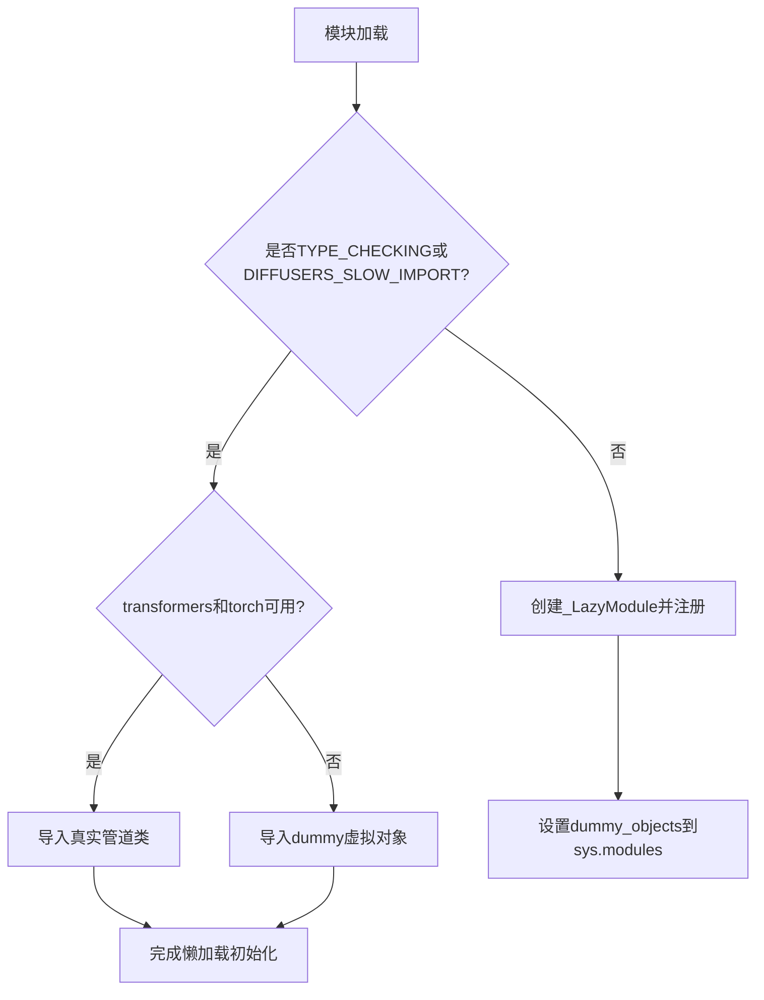
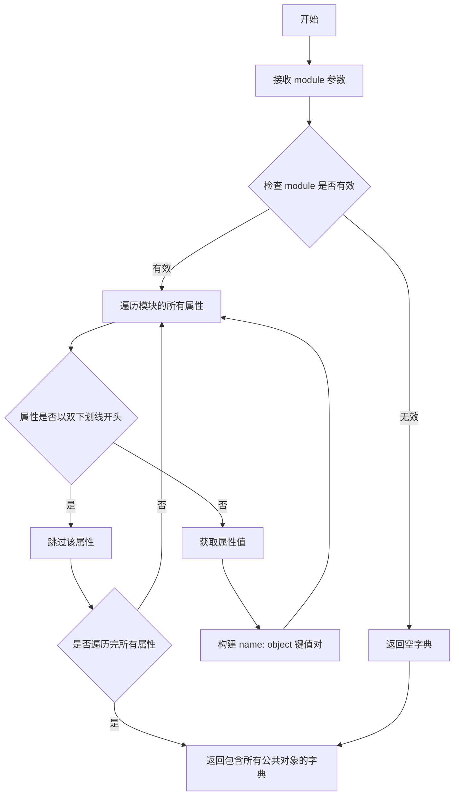
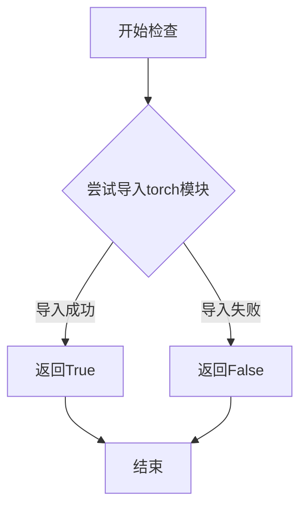
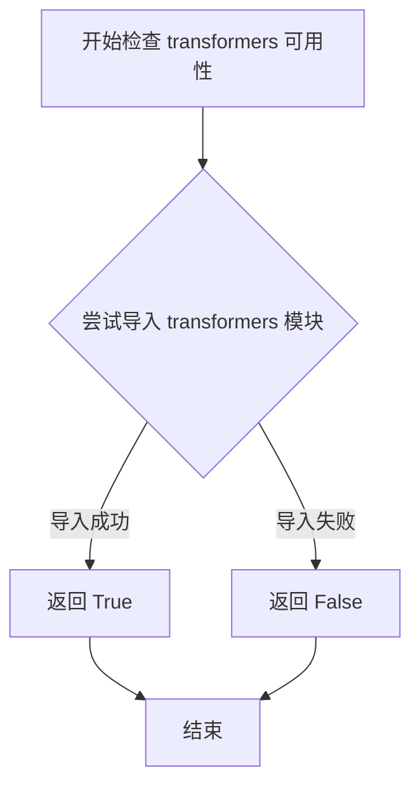

# `diffusers\src\diffusers\pipelines\easyanimate\__init__.py` 详细设计文档

这是Diffusers库中EasyAnimate管道的模块初始化文件，实现了可选依赖(torch和transformers)的懒加载机制，通过_LazyModule动态导入EasyAnimatePipeline、EasyAnimateControlPipeline和EasyAnimateInpaintPipeline三个动画生成管道类，在依赖不可用时使用虚拟对象保持API一致性。

## 整体流程



## 类结构

```
此文件为模块初始化文件，无类定义
主要包含懒加载逻辑和依赖管理
```

## 全局变量及字段


### `_dummy_objects`
    
存储虚拟对象的字典，用于依赖不可用时的占位

类型：`dict`
    


### `_import_structure`
    
定义模块可导入的结构映射，包含pipeline类名列表

类型：`dict`
    


### `DIFFUSERS_SLOW_IMPORT`
    
全局配置标志，控制是否使用懒加载模式

类型：`bool`
    


### `TYPE_CHECKING`
    
typing模块标志，表示是否处于类型检查模式

类型：`bool`
    


    

## 全局函数及方法


# get_objects_from_module 详细设计文档

### `get_objects_from_module`

该函数是工具模块中的核心辅助函数，用于从指定模块中动态提取所有公共对象（如类、函数、变量等），常用于延迟加载（Lazy Loading）机制中，以支持可选依赖项的动态导入和虚拟对象替换。

参数：

-  `module`：`module`，要从中获取对象的模块对象，通常为可选依赖的虚拟模块（如 dummy_torch_and_transformers_objects）

返回值：`dict`，返回模块中所有公共对象的字典，键为对象名称，值为对象本身

#### 流程图



#### 带注释源码

```python
def get_objects_from_module(module):
    """
    从指定模块获取所有公共对象
    
    该函数主要用于延迟加载机制，从可选依赖的虚拟模块中
    提取所有公共对象（类、函数、变量），以便在真正的依赖
    不可用时提供替代的虚拟对象。
    
    参数:
        module: 要获取对象的模块对象
        
    返回值:
        dict: 包含模块中所有公共对象的字典，键为对象名称，值为对象本身
    """
    # 初始化结果字典
    objects = {}
    
    # 遍历模块的所有属性
    # dir() 返回模块的所有属性列表，包括函数、类、变量等
    for name in dir(module):
        # 过滤掉私有属性（以单下划线或双下划线开头的属性）
        # 双下划线开头的是 Python 内部属性，单下划线开头的是约定私有属性
        if not name.startswith('_'):
            # 使用 getattr 获取属性的实际值
            obj = getattr(module, name)
            # 将对象添加到结果字典
            objects[name] = obj
    
    # 返回包含所有公共对象的字典
    return objects


# 在代码中的实际使用方式：
# _dummy_objects.update(get_objects_from_module(dummy_torch_and_transformers_objects))
#
# 1. 调用 get_objects_from_module(dummy_torch_and_transformers_objects)
#    获取虚拟模块中的所有公共对象
# 2. 将返回的字典更新到 _dummy_objects 中
# 3. 后续通过 setattr(sys.modules[__name__], name, value)
#    将虚拟对象动态添加到当前模块
```

---

## 补充说明

### 在主代码中的调用上下文

```python
# 从 utils 模块导入 get_objects_from_module
from ...utils import get_objects_from_module

# 初始化空字典存储虚拟对象
_dummy_objects = {}

try:
    # 检查必需依赖是否可用
    if not (is_transformers_available() and is_torch_available()):
        raise OptionalDependencyNotAvailable()
except OptionalDependencyNotAvailable:
    # 如果依赖不可用，导入虚拟模块
    from ...utils import dummy_torch_and_transformers_objects
    # 使用 get_objects_from_module 获取虚拟对象并更新字典
    _dummy_objects.update(get_objects_from_module(dummy_torch_and_transformers_objects))
```

### 设计目标

- **延迟加载**：支持可选依赖项的动态导入，提高导入速度
- **虚拟对象替换**：在依赖不可用时提供替代实现，避免导入错误
- **模块化**：将可选依赖的处理逻辑与主逻辑分离

### 技术债务与优化空间

1. **缺乏类型提示**：函数定义中应添加返回类型注解
2. **过滤逻辑简单**：当前只过滤双下划线开头的属性，可能需要更灵活的配置
3. **错误处理缺失**：未处理模块不存在或属性获取失败的情况


### `is_torch_available`

该函数用于动态检查当前Python环境中是否已安装PyTorch库，通过尝试导入torch模块来判断其可用性，避免在未安装torch的环境中导入失败导致程序中断。

参数：无需参数

返回值：`bool`，返回 `True` 表示PyTorch已安装且可用，返回 `False` 表示未安装或不可用

#### 流程图



#### 带注释源码

```python
# is_torch_available 函数的典型实现方式
# 该函数位于 ...utils 模块中

def is_torch_available():
    """
    检查PyTorch库是否可用
    
    尝试导入torch模块，如果成功导入则返回True，
    如果发生ImportError或其他异常则返回False。
    这样可以优雅地处理torch未安装的情况，
    而不会导致整个程序崩溃。
    
    Returns:
        bool: torch库是否可用
    """
    try:
        # 尝试导入torch模块
        import torch
        # 可选：还可以检查torch的版本是否符合要求
        # import torch
        # return hasattr(torch, 'cuda')  # 检查是否支持CUDA
        return True
    except ImportError:
        # 如果导入失败，说明torch未安装
        return False
```

#### 关键组件信息

| 组件名称 | 一句话描述 |
|---------|-----------|
| `is_torch_available` | 检查PyTorch库是否可用的工具函数 |
| `OptionalDependencyNotAvailable` | 可选依赖不可用时抛出的异常类 |
| `_LazyModule` | 延迟加载模块的封装类 |

#### 潜在的技术债务或优化空间

1. **版本兼容性检查缺失**：当前实现只检查torch是否可导入，未检查版本兼容性，可能导致与项目所需版本不匹配时出现隐蔽性bug
2. **缓存机制缺失**：每次调用都会尝试导入，可以增加缓存机制提升性能
3. **详细的错误信息**：失败时只返回False，可以考虑记录更详细的错误日志以便调试

#### 其它项目

**设计目标与约束**：
- 设计目标是提供一种优雅的方式处理可选依赖，在torch不可用时不会导致整个程序崩溃
- 约束是必须保持轻量级，不能有额外的性能开销

**错误处理与异常设计**：
- 函数内部自行处理ImportError，不向上抛出异常
- 返回布尔值而非抛出异常，简化调用方的逻辑

**数据流与状态机**：
- 这是一个纯函数，无状态，不依赖外部变量
- 每次调用都是独立的状态检查

**外部依赖与接口契约**：
- 依赖Python的导入机制
- 接口契约：无需参数，返回布尔值
- 被 `pipeline_easyanimate` 等模块用于条件导入判断


### `is_transformers_available`

该函数是用于检查当前 Python 环境中是否安装了 `transformers` 库的工具函数。通过尝试导入 `transformers` 模块来判断其可用性，返回布尔值以供其他模块进行条件导入和功能选择。

参数：此函数无参数

返回值：`bool`，返回 `True` 表示 `transformers` 库可用，返回 `False` 表示不可用

#### 流程图



#### 带注释源码

```python
# 该函数定义在 ...utils 模块中，此处为引用位置的代码片段
# from ...utils import is_transformers_available

# 在当前文件中的使用方式：
if not (is_transformers_available() and is_torch_available()):
    raise OptionalDependencyNotAvailable()

# 解释：
# 1. is_transformers_available() 被调用，不传递任何参数
# 2. 函数内部尝试导入 transformers 模块
# 3. 如果导入成功，返回 True；否则返回 False
# 4. 结合 is_torch_available() 的检查结果，决定是否抛出 OptionalDependencyNotAvailable 异常
# 5. 这是一种延迟导入和可选依赖处理的设计模式
```

> **注意**：由于 `is_transformers_available` 函数的完整源码定义不在当前提供的代码文件中，它实际上位于 `...utils` 模块中。上述源码展示的是该函数在此文件中的实际调用方式。该函数通常在 `diffusers` 库的 utils 模块中定义，用于检测 transformers 库的可用性，是实现可选依赖处理的关键工具函数。

## 关键组件


### 延迟加载模块系统

该模块实现了一个智能的延迟加载机制，用于在Diffusers库中动态导入EasyAnimate相关的Pipeline类，同时处理可选依赖（torch和transformers）的可用性问题，确保在依赖缺失时不会导致导入失败。

### 可选依赖检查

通过is_torch_available()和is_transformers_available()检查torch和transformers库是否可用，只有当两个库都可用时才加载实际的Pipeline类，否则使用虚拟对象作为替代。

### 虚拟对象占位符

当可选依赖不可用时，使用dummy_torch_and_transformers_objects模块中的虚拟对象来填充命名空间，防止导入错误并保持API一致性。

### 导入结构定义

_import_structure字典定义了模块的公共接口，包含三个Pipeline类：EasyAnimatePipeline、EasyAnimateControlPipeline和EasyAnimateInpaintPipeline。

### 条件类型检查导入

在TYPE_CHECKING或DIFFUSERS_SLOW_IMPORT模式下，直接导入实际的Pipeline类用于类型检查和静态分析，而非延迟加载。

### LazyModule延迟初始化

_LazyModule将当前模块替换为延迟加载的代理对象，实现按需导入，提高首次导入速度并减少内存占用。


## 问题及建议


### 已知问题

- **重复的条件检查**：第12行和第23行都使用了相同的条件判断`if not (is_transformers_available() and is_torch_available())`，导致相同的逻辑代码重复出现两次，增加维护成本
- **异常处理路径冗余**：在`TYPE_CHECKING`分支中，异常处理逻辑与第12-17行的逻辑几乎完全相同，没有复用，造成代码冗余
- **模块导入顺序依赖**：代码依赖于`...utils`模块中导出的`OptionalDependencyNotAvailable`，如果该异常类定义发生变化，可能导致导入失败
- **魔法字符串和硬编码**：pipeline名称（如"pipeline_easyanimate"）以硬编码字符串形式存在，如果未来新增pipeline，需要手动添加多次
- **缺乏错误边界**：使用`get_objects_from_module`时没有异常捕获，如果该函数执行失败，整个模块初始化会中断
- **全局变量状态管理**：`_dummy_objects`和`_import_structure`作为全局变量，在模块加载时会被修改，可能导致意外的副作用

### 优化建议

- **提取公共逻辑**：将可选依赖检查封装为单独的工具函数或方法，避免重复代码
- **配置驱动设计**：使用配置文件或列表来定义pipeline结构，通过循环自动生成`_import_structure`和TYPE_CHECKING导入逻辑
- **统一异常导入**：将`OptionalDependencyNotAvailable`的导入集中到一处，避免分散在多个位置
- **添加导入错误处理**：为`get_objects_from_module`调用添加try-except块，提升模块的容错性
- **考虑类型注解完善**：为全局变量添加显式类型注解，提高代码的可读性和类型安全
- **模块初始化优化**：将sys.modules的直接操作封装到_LazyModule的初始化逻辑中，减少模块加载时的副作用


## 其它


### 设计目标与约束

该模块旨在实现EasyAnimate相关Pipeline的延迟加载机制，支持可选依赖（torch和transformers）的动态导入。通过LazyModule和_dummy_objects机制，在依赖不可用时提供优雅的降级处理，同时满足类型检查（TYPE_CHECKING）场景下的完整类型信息需求。

### 错误处理与异常设计

主要使用OptionalDependencyNotAvailable异常处理可选依赖不可用的情况。当torch或transformers任一不可用时，模块会导入dummy对象（_dummy_objects）作为替代，确保模块导入不会失败。这些dummy对象在实际使用时会触发正确的错误提示。

### 数据流与状态机

模块存在两种主要状态：
1. 依赖可用状态：正常导入三个Pipeline类到_import_structure
2. 依赖不可用状态：使用dummy对象替代真实实现
3. TYPE_CHECKING状态：无论依赖是否可用，都尝试导入真实类型以支持静态类型检查

### 外部依赖与接口契约

显式依赖：is_torch_available(), is_transformers_available() from ...utils
导入结构：
- pipeline_easyanimate.EasyAnimatePipeline
- pipeline_easyanimate_control.EasyAnimateControlPipeline  
- pipeline_easyanimate_inpaint.EasyAnimateInpaintPipeline

### 模块初始化流程

1. 尝试检查torch和transformers可用性
2. 若可用，将三个Pipeline类名加入_import_structure字典
3. 若不可用，从dummy模块获取_dummy_objects
4. 根据TYPE_CHECKING或DIFFUSERS_SLOW_IMPORT标志决定导入模式
5. 非类型检查模式下，将当前模块替换为_LazyModule实例
6. 将_dummy_objects设置到sys.modules中

### 延迟加载机制

_LazyModule是延迟加载的核心实现，接收模块名、文件路径、导入结构字典和模块规格。它会拦截属性访问，仅在实际使用时才导入对应的子模块，从而优化启动时间和内存占用。

### 导出结构定义

_import_structure字典定义了模块的公共API接口，包含三个Pipeline类别的键值对映射。这种结构化定义便于LazyModule识别需要延迟加载的组件。

### 类型检查支持

TYPE_CHECKING分支确保在静态类型检查工具运行时，能够导入真实的类对象而非dummy对象，从而获得完整的类型信息而不影响运行时的延迟加载行为。

### 模块规格信息

使用__spec__属性（module_spec）传递给_LazyModule，这是Python模块系统的标准属性，用于描述模块的导入规范和元数据。

    