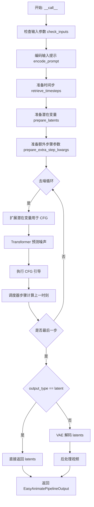
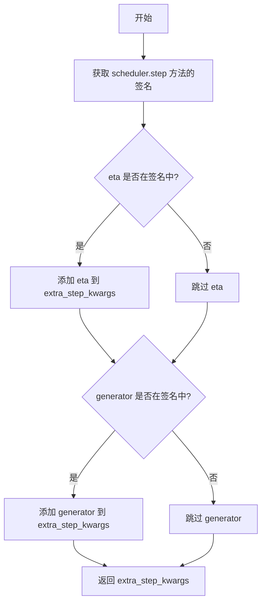
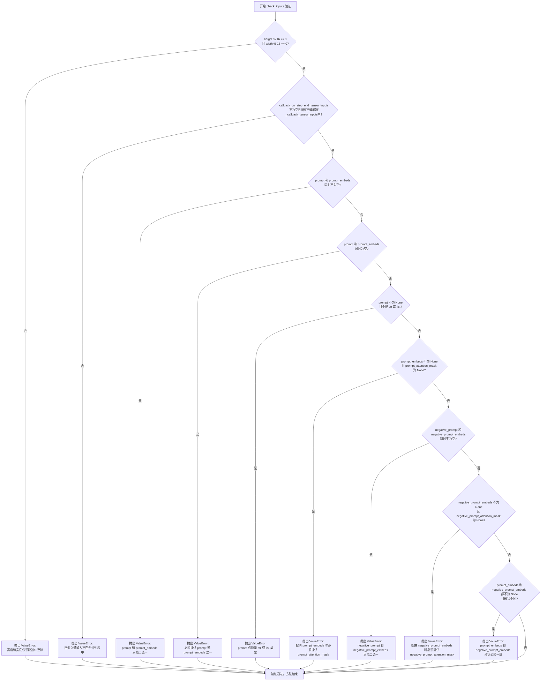
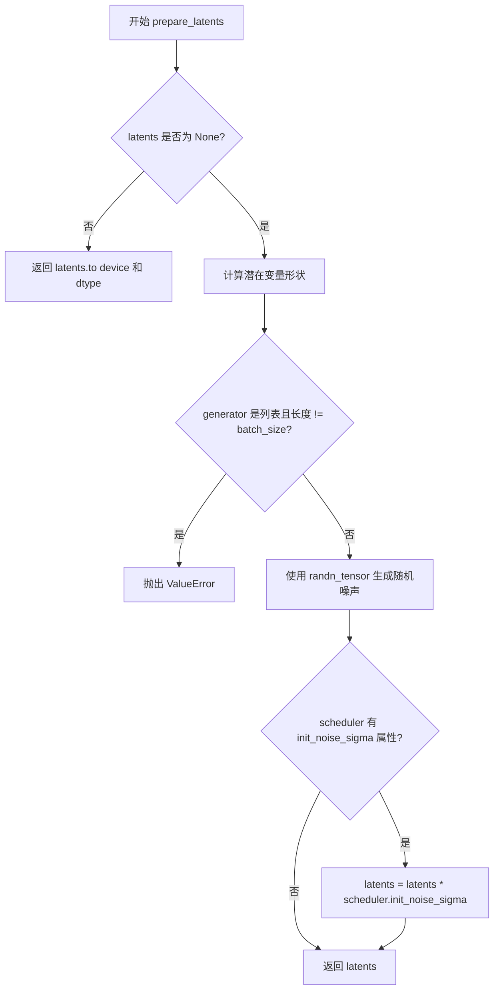
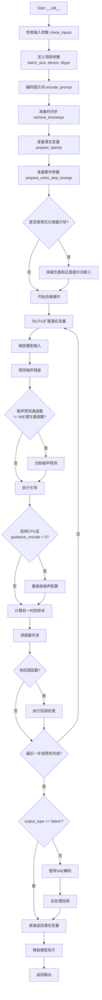

# `diffusers\src\diffusers\pipelines\easyanimate\pipeline_easyanimate.py` 详细设计文档

EasyAnimatePipeline 是一个基于扩散模型的文本到视频生成管道，继承自 Diffusers 库的 DiffusionPipeline，通过编码文本提示、准备潜在变量、执行去噪循环并使用 VAE 解码潜在表示来生成视频。

## 整体流程



## 类结构

```
DiffusionPipeline (基类)
└── EasyAnimatePipeline
```

## 全局变量及字段


### `logger`
    
模块级别的日志记录器，用于输出调试和运行信息

类型：`logging.Logger`
    


### `EXAMPLE_DOC_STRING`
    
包含代码示例的文档字符串，展示EasyAnimatePipeline的基本使用方法

类型：`str`
    


### `XLA_AVAILABLE`
    
标志位，指示torch_xla是否可用，用于决定是否使用XLA优化

类型：`bool`
    


### `get_resize_crop_region_for_grid`
    
计算用于网格缩放和裁剪的区域，返回裁剪区域的左上角和右下角坐标

类型：`function`
    


### `rescale_noise_cfg`
    
根据guidance_rescale重新缩放噪声预测张量，用于改善图像质量并修复过度曝光

类型：`function`
    


### `retrieve_timesteps`
    
调用调度器的set_timesteps方法并从调度器获取时间步，支持自定义时间步和sigma

类型：`function`
    


### `EasyAnimatePipeline.vae`
    
变分自编码器模型，用于将视频编码到潜在空间并从潜在空间解码视频

类型：`AutoencoderKLMagvit`
    


### `EasyAnimatePipeline.text_encoder`
    
文本编码器模型，将文本提示转换为嵌入向量，V5.1版本使用qwen2 vl

类型：`Qwen2VLForConditionalGeneration | BertModel`
    


### `EasyAnimatePipeline.tokenizer`
    
分词器，用于将文本分割成token序列并编码

类型：`Qwen2Tokenizer | BertTokenizer`
    


### `EasyAnimatePipeline.transformer`
    
EasyAnimate团队设计的3D变换器模型，用于去噪潜在表示

类型：`EasyAnimateTransformer3DModel`
    


### `EasyAnimatePipeline.scheduler`
    
流匹配欧拉离散调度器，用于去噪过程中的时间步调度

类型：`FlowMatchEulerDiscreteScheduler`
    


### `EasyAnimatePipeline.video_processor`
    
视频处理器，用于视频的后处理和格式转换

类型：`VideoProcessor`
    


### `EasyAnimatePipeline.enable_text_attention_mask`
    
标志位，指示是否启用文本注意力掩码

类型：`bool`
    


### `EasyAnimatePipeline.vae_spatial_compression_ratio`
    
VAE空间压缩比，用于计算潜在空间的宽高尺寸

类型：`int`
    


### `EasyAnimatePipeline.vae_temporal_compression_ratio`
    
VAE时间压缩比，用于计算潜在空间的帧数

类型：`int`
    


### `EasyAnimatePipeline.model_cpu_offload_seq`
    
模型CPU卸载顺序字符串，指定text_encoder->transformer->vae的卸载序列

类型：`str`
    


### `EasyAnimatePipeline._callback_tensor_inputs`
    
回调函数可用的张量输入列表，包含latents、prompt_embeds等

类型：`list`
    


### `EasyAnimatePipeline._guidance_scale`
    
分类器自由引导比例，控制文本提示对生成结果的影响程度

类型：`float`
    


### `EasyAnimatePipeline._guidance_rescale`
    
引导重缩放因子，用于调整噪声预测以改善图像质量

类型：`float`
    


### `EasyAnimatePipeline._num_timesteps`
    
推理过程中使用的时间步总数

类型：`int`
    


### `EasyAnimatePipeline._interrupt`
    
中断标志，用于在去噪循环中中断推理过程

类型：`bool`
    
    

## 全局函数及方法


### `get_resize_crop_region_for_grid`

该函数用于计算视频或图像在目标尺寸下的调整大小和居中裁剪区域，确保在保持宽高比的同时适应目标尺寸。

参数：

- `src`：Tuple[int, int]，源图像的尺寸，格式为 (height, width)
- `tgt_width`：int，目标宽度（像素）
- `tgt_height`：int，目标高度（像素）

返回值：Tuple[Tuple[int, int], Tuple[int, int]]，返回两个坐标元组——第一个是裁剪区域左上角坐标 (crop_top, crop_left)，第二个是裁剪区域右下角坐标

#### 流程图

```mermaid
flowchart TD
    A[开始] --> B[获取目标尺寸<br/>tw = tgt_width<br/>th = tgt_height]
    B --> C[获取源尺寸<br/>h, w = src]
    C --> D[计算源宽高比<br/>r = h / w]
    D --> E{r > th / tw?}
    E -->|Yes| F[保持目标高度<br/>resize_height = th<br/>resize_width = round(th / h * w)]
    E -->|No| G[保持目标宽度<br/>resize_width = tw<br/>resize_height = round(tw / w * h)]
    F --> H[计算裁剪左上角<br/>crop_top = round((th - resize_height) / 2)<br/>crop_left = round((tw - resize_width) / 2)]
    G --> H
    H --> I[计算裁剪右下角<br/>bottom_right = (crop_top + resize_height<br/>crop_left + resize_width)]
    I --> J[返回 ((crop_top, crop_left), bottom_right)]
    J --> K[结束]
```

#### 带注释源码

```python
# Similar to diffusers.pipelines.hunyuandit.pipeline_hunyuandit.get_resize_crop_region_for_grid
def get_resize_crop_region_for_grid(src, tgt_width, tgt_height):
    """
    计算图像或视频帧的调整大小和居中裁剪区域。
    
    该函数根据目标尺寸计算保持宽高比的缩放尺寸，然后确定在目标框内居中裁剪的坐标。
    主要用于视频生成管道中，将不同尺寸的输入调整为统一的网格尺寸。
    
    参数:
        src: 源图像尺寸，格式为 (height, width) 的元组
        tgt_width: 目标宽度（像素）
        tgt_height: 目标高度（像素）
    
    返回:
        两个坐标元组:
        - 第一个: 裁剪区域左上角坐标 (crop_top, crop_left)
        - 第二个: 裁剪区域右下角坐标 (crop_top + resize_height, crop_left + resize_width)
    """
    # 目标尺寸
    tw = tgt_width
    th = tgt_height
    
    # 源图像的高和宽
    h, w = src
    
    # 计算源图像的宽高比
    r = h / w
    
    # 根据宽高比比较，确定缩放策略
    # 如果源图像比目标图像更"高"（宽高比更大），则以高度为基准
    if r > (th / tw):
        # 高度填满目标高度，宽度按比例缩放
        resize_height = th
        resize_width = int(round(th / h * w))
    else:
        # 宽度填满目标宽度，高度按比例缩放
        resize_width = tw
        resize_height = int(round(tw / w * h))

    # 计算居中裁剪的左上角坐标
    # 使用 round 确保坐标为整数，且裁剪区域尽可能居中
    crop_top = int(round((th - resize_height) / 2.0))
    crop_left = int(round((tw - resize_width) / 2.0))

    # 返回裁剪区域的左上角和右下角坐标
    return (crop_top, crop_left), (crop_top + resize_height, crop_left + resize_width)
```


### `rescale_noise_cfg`

该函数是一个全局工具函数，用于在扩散模型的引导去噪过程中对噪声预测进行重新缩放，以改善图像质量并修复过度曝光问题。该函数基于论文 Section 3.4 的方法，通过计算噪声预测的张量标准差并进行混合处理，使生成结果避免"平淡无奇"的图像。

参数：

- `noise_cfg`：`torch.Tensor`，引导扩散过程中预测的噪声张量
- `noise_pred_text`：`torch.Tensor`，文本引导扩散过程中预测的噪声张量
- `guidance_rescale`：`float`，可选参数，默认为 0.0，用于噪声预测的重新缩放因子

返回值：`torch.Tensor`，重新缩放后的噪声预测张量

#### 流程图

```mermaid
flowchart TD
    A[开始] --> B[计算 noise_pred_text 的标准差 std_text]
    B --> C[计算 noise_cfg 的标准差 std_cfg]
    C --> D[计算重新缩放的噪声预测 noise_pred_rescaled = noise_cfg * std_text / std_cfg]
    D --> E[根据 guidance_rescale 混合原始和重新缩放的结果<br/>noise_cfg = guidance_rescale * noise_pred_rescaled + (1 - guidance_rescale) * noise_cfg]
    E --> F[返回重新缩放后的 noise_cfg]
```

#### 带注释源码

```python
# Copied from diffusers.pipelines.stable_diffusion.pipeline_stable_diffusion.rescale_noise_cfg
def rescale_noise_cfg(noise_cfg, noise_pred_text, guidance_rescale=0.0):
    r"""
    Rescales `noise_cfg` tensor based on `guidance_rescale` to improve image quality and fix overexposure. Based on
    Section 3.4 from [Common Diffusion Noise Schedules and Sample Steps are
    Flawed](https://huggingface.co/papers/2305.08891).

    Args:
        noise_cfg (`torch.Tensor`):
            The predicted noise tensor for the guided diffusion process.
        noise_pred_text (`torch.Tensor`):
            The predicted noise tensor for the text-guided diffusion process.
        guidance_rescale (`float`, *optional*, defaults to 0.0):
            A rescale factor applied to the noise predictions.

    Returns:
        noise_cfg (`torch.Tensor`): The rescaled noise prediction tensor.
    """
    # 计算文本引导噪声预测在空间/时间维度上的标准差（保持维度以便广播）
    std_text = noise_pred_text.std(dim=list(range(1, noise_pred_text.ndim)), keepdim=True)
    # 计算引导噪声预测在空间/时间维度上的标准差（保持维度以便广播）
    std_cfg = noise_cfg.std(dim=list(range(1, noise_cfg.ndim)), keepdim=True)
    # 重新缩放引导结果以修复过度曝光问题
    # 通过将噪声预测乘以文本预测标准差与噪声预测标准差的比值来实现
    noise_pred_rescaled = noise_cfg * (std_text / std_cfg)
    # 通过 guidance_rescale 因子混合原始引导结果，避免生成"平淡无奇"的图像
    # 当 guidance_rescale 为 0 时保留原始 noise_cfg，为 1 时使用完全重新缩放的结果
    noise_cfg = guidance_rescale * noise_pred_rescaled + (1 - guidance_rescale) * noise_cfg
    return noise_cfg
```


### `retrieve_timesteps`

该函数是 EasyAnimatePipeline 中的时间步检索工具函数，用于调用调度器的 `set_timesteps` 方法并从调度器中获取时间步序列。它支持自定义时间步（timesteps）或自定义 sigmas，并能根据传入的参数类型自动处理不同的时间步调度策略。

参数：

- `scheduler`：`SchedulerMixin`，调度器对象，用于生成和管理时间步
- `num_inference_steps`：`int | None`，生成样本时使用的扩散步数，如果使用此参数，则 `timesteps` 必须为 `None`
- `device`：`str | torch.device | None`，时间步要移动到的设备，如果为 `None` 则不移动
- `timesteps`：`list[int] | None`，自定义时间步，用于覆盖调度器的时间步间距策略，如果传入此参数，则 `num_inference_steps` 和 `sigmas` 必须为 `None`
- `sigmas`：`list[float] | None`，自定义 sigmas，用于覆盖调度器的 sigma 间距策略，如果传入此参数，则 `num_inference_steps` 和 `timesteps` 必须为 `None`
- `**kwargs`：可变关键字参数，将传递给 `scheduler.set_timesteps` 方法

返回值：`tuple[torch.Tensor, int]`，元组包含两个元素——第一个元素是调度器的时间步序列（torch.Tensor），第二个元素是推理步数（int）

#### 流程图

```mermaid
flowchart TD
    A[开始: retrieve_timesteps] --> B{检查timesteps和sigmas是否同时存在}
    B -->|是| C[抛出ValueError: 只能选择timesteps或sigmas之一]
    B -->|否| D{检查timesteps是否不为None}
    D -->|是| E[检查scheduler.set_timesteps是否接受timesteps参数]
    E -->|是| F[调用scheduler.set_timesteps并传入timesteps和device]
    E -->|否| G[抛出ValueError: 当前调度器不支持自定义timesteps]
    D -->|否| H{检查sigmas是否不为None}
    H -->|是| I[检查scheduler.set_timesteps是否接受sigmas参数]
    I -->|是| J[调用scheduler.set_timesteps并传入sigmas和device]
    I -->|否| K[抛出ValueError: 当前调度器不支持自定义sigmas]
    H -->|否| L[调用scheduler.set_timesteps并传入num_inference_steps和device]
    F --> M[获取scheduler.timesteps]
    J --> M
    L --> M
    M --> N[计算num_inference_steps = len(timesteps)]
    N --> O[返回timesteps和num_inference_steps的元组]
```

#### 带注释源码

```python
# Copied from diffusers.pipelines.stable_diffusion.pipeline_stable_diffusion.retrieve_timesteps
def retrieve_timesteps(
    scheduler,
    num_inference_steps: int | None = None,
    device: str | torch.device | None = None,
    timesteps: list[int] | None = None,
    sigmas: list[float] | None = None,
    **kwargs,
):
    r"""
    Calls the scheduler's `set_timesteps` method and retrieves timesteps from the scheduler after the call. Handles
    custom timesteps. Any kwargs will be supplied to `scheduler.set_timesteps`.

    Args:
        scheduler (`SchedulerMixin`):
            The scheduler to get timesteps from.
        num_inference_steps (`int`):
            The number of diffusion steps used when generating samples with a pre-trained model. If used, `timesteps`
            must be `None`.
        device (`str` or `torch.device`, *optional*):
            The device to which the timesteps should be moved to. If `None`, the timesteps are not moved.
        timesteps (`list[int]`, *optional*):
            Custom timesteps used to override the timestep spacing strategy of the scheduler. If `timesteps` is passed,
            `num_inference_steps` and `sigmas` must be `None`.
        sigmas (`list[float]`, *optional*):
            Custom sigmas used to override the timestep spacing strategy of the scheduler. If `sigmas` is passed,
            `num_inference_steps` and `timesteps` must be `None`.

    Returns:
        `tuple[torch.Tensor, int]`: A tuple where the first element is the timestep schedule from the scheduler and the
        second element is the number of inference steps.
    """
    # 检查是否同时传入了timesteps和sigmas，这是不允许的，只能选择其中一种
    if timesteps is not None and sigmas is not None:
        raise ValueError("Only one of `timesteps` or `sigmas` can be passed. Please choose one to set custom values")
    
    # 处理自定义timesteps的情况
    if timesteps is not None:
        # 使用inspect检查scheduler.set_timesteps是否接受timesteps参数
        accepts_timesteps = "timesteps" in set(inspect.signature(scheduler.set_timesteps).parameters.keys())
        if not accepts_timesteps:
            raise ValueError(
                f"The current scheduler class {scheduler.__class__}'s `set_timesteps` does not support custom"
                f" timestep schedules. Please check whether you are using the correct scheduler."
            )
        # 调用scheduler的set_timesteps方法设置自定义时间步
        scheduler.set_timesteps(timesteps=timesteps, device=device, **kwargs)
        # 从scheduler获取生成的时间步
        timesteps = scheduler.timesteps
        # 计算推理步数
        num_inference_steps = len(timesteps)
    # 处理自定义sigmas的情况
    elif sigmas is not None:
        # 使用inspect检查scheduler.set_timesteps是否接受sigmas参数
        accept_sigmas = "sigmas" in set(inspect.signature(scheduler.set_timesteps).parameters.keys())
        if not accept_sigmas:
            raise ValueError(
                f"The current scheduler class {scheduler.__class__}'s `set_timesteps` does not support custom"
                f" sigmas schedules. Please check whether you are using the correct scheduler."
            )
        # 调用scheduler的set_timesteps方法设置自定义sigmas
        scheduler.set_timesteps(sigmas=sigmas, device=device, **kwargs)
        # 从scheduler获取生成的时间步
        timesteps = scheduler.timesteps
        # 计算推理步数
        num_inference_steps = len(timesteps)
    # 处理默认情况，使用num_inference_steps设置时间步
    else:
        scheduler.set_timesteps(num_inference_steps, device=device, **kwargs)
        timesteps = scheduler.timesteps
    
    # 返回时间步序列和推理步数
    return timesteps, num_inference_steps
```


### `EasyAnimatePipeline.__init__`

该方法是 `EasyAnimatePipeline` 类的构造函数，负责初始化整个视频生成管道。它接收并注册所有必要的模型组件（VAE、文本编码器、分词器、Transformer、调度器），并根据配置初始化视频处理相关的参数。

参数：

-  `vae`：`AutoencoderKLMagvit`，用于将视频编码和解码到潜在表示的变分自编码器模型
-  `text_encoder`：`Qwen2VLForConditionalGeneration | BertModel`，文本编码器（EasyAnimate V5.1 使用 qwen2 vl）
-  `tokenizer`：`Qwen2Tokenizer | BertTokenizer`，用于对文本进行分词的 Qwen2Tokenizer 或 BertTokenizer
-  `transformer`：`EasyAnimateTransformer3DModel`，由 EasyAnimate Team 设计的 EasyAnimate 模型
-  `scheduler`：`FlowMatchEulerDiscreteScheduler`，用于去噪编码图像潜在表示的调度器

返回值：`None`，构造函数不返回值

#### 流程图

```mermaid
flowchart TD
    A[开始 __init__] --> B[调用 super().__init__ 初始化基类]
    B --> C[register_modules 注册所有模型组件]
    C --> D{检查 transformer 是否存在}
    D -->|是| E[从配置获取 enable_text_attention_mask]
    D -->|否| F[默认 enable_text_attention_mask = True]
    E --> G[获取 VAE 空间压缩比]
    F --> G
    G --> H{检查 vae 是否存在}
    H -->|是| I[从 vae 获取空间压缩比 8]
    H -->|否| J[默认空间压缩比 = 8]
    I --> K[获取 VAE 时间压缩比]
    J --> K
    K --> L{检查 vae 是否存在}
    L -->|是| M[从 vae 获取时间压缩比 4]
    L -->|否| N[默认时间压缩比 = 4]
    M --> O[创建 VideoProcessor]
    N --> O
    O --> P[结束 __init__]
```

#### 带注释源码

```python
def __init__(
    self,
    vae: AutoencoderKLMagvit,
    text_encoder: Qwen2VLForConditionalGeneration | BertModel,
    tokenizer: Qwen2Tokenizer | BertTokenizer,
    transformer: EasyAnimateTransformer3DModel,
    scheduler: FlowMatchEulerDiscreteScheduler,
):
    """
    初始化 EasyAnimatePipeline 管道。
    
    参数:
        vae: 用于视频编解码的 VAE 模型
        text_encoder: 文本编码器 (Qwen2-VL 或 Bert)
        tokenizer: 文本分词器
        transformer: 主干 Transformer 模型
        scheduler: 去噪调度器
    """
    # 1. 调用父类 DiffusionPipeline 的初始化方法
    #    设置基本的管道配置和设备管理
    super().__init__()
    
    # 2. 注册所有模型组件到管道中
    #    这些模块可以通过 self.vae, self.text_encoder 等访问
    self.register_modules(
        vae=vae,
        text_encoder=text_encoder,
        tokenizer=tokenizer,
        transformer=transformer,
        scheduler=scheduler,
    )
    
    # 3. 初始化文本注意力掩码配置
    #    从 transformer 配置中获取 enable_text_attention_mask
    #    如果 transformer 不存在则默认为 True
    self.enable_text_attention_mask = (
        self.transformer.config.enable_text_attention_mask
        if getattr(self, "transformer", None) is not None
        else True
    )
    
    # 4. 初始化 VAE 空间压缩比
    #    用于将像素空间坐标映射到潜在空间
    #    默认值为 8
    self.vae_spatial_compression_ratio = (
        self.vae.spatial_compression_ratio if getattr(self, "vae", None) is not None else 8
    )
    
    # 5. 初始化 VAE 时间压缩比
    #    用于处理视频帧的时间维度压缩
    #    默认值为 4
    self.vae_temporal_compression_ratio = (
        self.vae.temporal_compression_ratio if getattr(self, "vae", None) is not None else 4
    )
    
    # 6. 初始化视频处理器
    #    用于视频的后处理操作，如格式转换等
    self.video_processor = VideoProcessor(vae_scale_factor=self.vae_spatial_compression_ratio)
```


### `EasyAnimatePipeline.encode_prompt`

该方法负责将文本提示词（prompt）和负面提示词（negative_prompt）编码为文本编码器的隐藏状态向量，支持批量处理和分类器自由引导（Classifier-Free Guidance），为视频生成管道提供文本条件输入。

参数：

- `prompt`：`str | list[str]`，要编码的文本提示词，可以是单个字符串或字符串列表
- `num_images_per_prompt`：`int = 1`，每个提示词需要生成的图像数量，用于复制嵌入向量
- `do_classifier_free_guidance`：`bool = True`，是否启用分类器自由引导，为 True 时会同时生成无条件嵌入
- `negative_prompt`：`str | list[str] | None = None`，负面提示词，用于引导模型避免生成相关内容
- `prompt_embeds`：`torch.Tensor | None = None`，预生成的提示词嵌入，如提供则直接使用
- `negative_prompt_embeds`：`torch.Tensor | None = None`，预生成的负面提示词嵌入
- `prompt_attention_mask`：`torch.Tensor | None = None`，提示词的注意力掩码，当直接传入 prompt_embeds 时需要提供
- `negative_prompt_attention_mask`：`torch.Tensor | None = None`，负面提示词的注意力掩码
- `device`：`torch.device | None = None`，计算设备，默认为文本编码器所在设备
- `dtype`：`torch.dtype | None = None`，计算数据类型，默认为文本编码器的数据类型
- `max_sequence_length`：`int = 256`，分词的最大序列长度

返回值：`tuple[torch.Tensor, torch.Tensor, torch.Tensor, torch.Tensor]`，返回包含四个元素的元组——prompt_embeds（提示词嵌入）、negative_prompt_embeds（负面提示词嵌入）、prompt_attention_mask（提示词注意力掩码）、negative_prompt_attention_mask（负面提示词注意力掩码）

#### 流程图

```mermaid
flowchart TD
    A[encode_prompt 开始] --> B{检查 prompt_embeds 是否为空}
    B -->|是| C{prompt 是否为字符串}
    C -->|是| D[batch_size = 1<br/>构建单条消息]
    C -->|否| E[batch_size = len(prompt)<br/>构建多条消息]
    D --> F[应用聊天模板 convert to text]
    E --> F
    F --> G[tokenizer 分词处理<br/>padding=max_length<br/>truncation=True]
    G --> H[调用 text_encoder<br/>output_hidden_states=True]
    H --> I[提取倒数第二层隐藏状态<br/>作为 prompt_embeds]
    I --> J[repeat attention_mask<br/>num_images_per_prompt 次]
    B -->|否| K[直接使用传入的 prompt_embeds]
    K --> L{do_classifier_free_guidance 为真<br/>且 negative_prompt_embeds 为空}
    L -->|是| M{negative_prompt 是否为字符串}
    M -->|是| N[构建负面消息<br/>batch_size = 1]
    M -->|否| O[构建多条负面消息]
    N --> P[应用聊天模板 convert to text]
    O --> P
    P --> Q[tokenizer 分词处理]
    Q --> R[调用 text_encoder<br/>生成 negative_prompt_embeds]
    R --> S[repeat negative attention_mask<br/>num_images_per_prompt 次]
    L -->|否| T[跳过负面提示词处理]
    S --> U{do_classifier_free_guidance 为真}
    U -->|是| V[duplicate negative_prompt_embeds<br/>按 batch_size * num_images_per_prompt]
    U -->|否| W[返回结果]
    V --> W
    J --> W
    T --> W
    W --> X[encode_prompt 结束<br/>返回四个 tensor]
```

#### 带注释源码

```python
def encode_prompt(
    self,
    prompt: str | list[str],
    num_images_per_prompt: int = 1,
    do_classifier_free_guidance: bool = True,
    negative_prompt: str | list[str] | None = None,
    prompt_embeds: torch.Tensor | None = None,
    negative_prompt_embeds: torch.Tensor | None = None,
    prompt_attention_mask: torch.Tensor | None = None,
    negative_prompt_attention_mask: torch.Tensor | None = None,
    device: torch.device | None = None,
    dtype: torch.dtype | None = None,
    max_sequence_length: int = 256,
):
    r"""
    Encodes the prompt into text encoder hidden states.

    Args:
        prompt (`str` or `list[str]`, *optional*):
            prompt to be encoded
        device: (`torch.device`):
            torch device
        dtype (`torch.dtype`):
            torch dtype
        num_images_per_prompt (`int`):
            number of images that should be generated per prompt
        do_classifier_free_guidance (`bool`):
            whether to use classifier free guidance or not
        negative_prompt (`str` or `list[str]`, *optional*):
            The prompt or prompts not to guide the image generation. If not defined, one has to pass
            `negative_prompt_embeds` instead. Ignored when not using guidance (i.e., ignored if `guidance_scale` is
            less than `1`).
        prompt_embeds (`torch.Tensor`, *optional*):
            Pre-generated text embeddings. Can be used to easily tweak text inputs, *e.g.* prompt weighting. If not
            provided, text embeddings will be generated from `prompt` input argument.
        negative_prompt_embeds (`torch.Tensor`, *optional*):
            Pre-generated negative text embeddings. Can be used to easily tweak text inputs, *e.g.* prompt
            weighting. If not provided, negative_prompt_embeds will be generated from `negative_prompt` input
            argument.
        prompt_attention_mask (`torch.Tensor`, *optional*):
            Attention mask for the prompt. Required when `prompt_embeds` is passed directly.
        negative_prompt_attention_mask (`torch.Tensor`, *optional*):
            Attention mask for the negative prompt. Required when `negative_prompt_embeds` is passed directly.
        max_sequence_length (`int`, *optional*): maximum sequence length to use for the prompt.
    """
    # 设置默认 dtype 和 device，使用 text_encoder 的配置
    dtype = dtype or self.text_encoder.dtype
    device = device or self.text_encoder.device

    # 确定 batch_size：基于 prompt 类型或已存在的 prompt_embeds
    if prompt is not None and isinstance(prompt, str):
        batch_size = 1
    elif prompt is not None and isinstance(prompt, list):
        batch_size = len(prompt)
    else:
        batch_size = prompt_embeds.shape[0]

    # 如果未提供 prompt_embeds，则从 prompt 文本生成
    if prompt_embeds is None:
        # 将 prompt 转换为消息格式（Qwen2VL 聊天模板格式）
        if isinstance(prompt, str):
            messages = [
                {
                    "role": "user",
                    "content": [{"type": "text", "text": prompt}],
                }
            ]
        else:
            messages = [
                {
                    "role": "user",
                    "content": [{"type": "text", "text": _prompt}],
                }
                for _prompt in prompt
            ]
        
        # 应用聊天模板生成文本输入
        text = [
            self.tokenizer.apply_chat_template([m], tokenize=False, add_generation_prompt=True) 
            for m in messages
        ]

        # 使用 tokenizer 将文本转换为 input_ids 和 attention_mask
        text_inputs = self.tokenizer(
            text=text,
            padding="max_length",
            max_length=max_sequence_length,
            truncation=True,
            return_attention_mask=True,
            padding_side="right",
            return_tensors="pt",
        )
        text_inputs = text_inputs.to(self.text_encoder.device)

        text_input_ids = text_inputs.input_ids
        prompt_attention_mask = text_inputs.attention_mask
        
        # 调用文本编码器生成隐藏状态
        if self.enable_text_attention_mask:
            # Inference: Generation of the output
            # 提取倒数第二层隐藏状态（通常效果更好）
            prompt_embeds = self.text_encoder(
                input_ids=text_input_ids, 
                attention_mask=prompt_attention_mask, 
                output_hidden_states=True
            ).hidden_states[-2]
        else:
            raise ValueError("LLM needs attention_mask")
        
        # 为每个提示词复制 attention_mask num_images_per_prompt 次
        prompt_attention_mask = prompt_attention_mask.repeat(num_images_per_prompt, 1)

    # 将 prompt_embeds 移动到指定设备并转换为指定 dtype
    prompt_embeds = prompt_embeds.to(dtype=dtype, device=device)

    bs_embed, seq_len, _ = prompt_embeds.shape
    # 复制 text embeddings 以匹配每个提示词生成的图像数量
    # 使用 mps 友好的方法进行复制
    prompt_embeds = prompt_embeds.repeat(1, num_images_per_prompt, 1)
    prompt_embeds = prompt_embeds.view(bs_embed * num_images_per_prompt, seq_len, -1)
    prompt_attention_mask = prompt_attention_mask.to(device=device)

    # 获取无条件嵌入用于分类器自由引导
    if do_classifier_free_guidance and negative_prompt_embeds is None:
        # 处理负面提示词，生成负面嵌入
        if negative_prompt is not None and isinstance(negative_prompt, str):
            messages = [
                {
                    "role": "user",
                    "content": [{"type": "text", "text": negative_prompt}],
                }
            ]
        else:
            messages = [
                {
                    "role": "user",
                    "content": [{"type": "text", "text": _negative_prompt}],
                }
                for _negative_prompt in negative_prompt
            ]
        
        # 应用聊天模板
        text = [
            self.tokenizer.apply_chat_template([m], tokenize=False, add_generation_prompt=True) 
            for m in messages
        ]

        # tokenizer 处理
        text_inputs = self.tokenizer(
            text=text,
            padding="max_length",
            max_length=max_sequence_length,
            truncation=True,
            return_attention_mask=True,
            padding_side="right",
            return_tensors="pt",
        )
        text_inputs = text_inputs.to(self.text_encoder.device)

        text_input_ids = text_inputs.input_ids
        negative_prompt_attention_mask = text_inputs.attention_mask
        
        # 文本编码器生成负面提示词嵌入
        if self.enable_text_attention_mask:
            # Inference: Generation of the output
            negative_prompt_embeds = self.text_encoder(
                input_ids=text_input_ids,
                attention_mask=negative_prompt_attention_mask,
                output_hidden_states=True,
            ).hidden_states[-2]
        else:
            raise ValueError("LLM needs attention_mask")
        
        # 复制负面 attention_mask
        negative_prompt_attention_mask = negative_prompt_attention_mask.repeat(num_images_per_prompt, 1)

    # 如果使用分类器自由引导，复制无条件嵌入
    if do_classifier_free_guidance:
        # 获取序列长度
        seq_len = negative_prompt_embeds.shape[1]

        # 移动到指定设备并转换 dtype
        negative_prompt_embeds = negative_prompt_embeds.to(dtype=dtype, device=device)

        # 复制负面嵌入以匹配批量大小
        negative_prompt_embeds = negative_prompt_embeds.repeat(1, num_images_per_prompt, 1)
        negative_prompt_embeds = negative_prompt_embeds.view(batch_size * num_images_per_prompt, seq_len, -1)
        negative_prompt_attention_mask = negative_prompt_attention_mask.to(device=device)

    # 返回四个张量：prompt_embeds, negative_prompt_embeds, prompt_attention_mask, negative_prompt_attention_mask
    return prompt_embeds, negative_prompt_embeds, prompt_attention_mask, negative_prompt_attention_mask
```


### `EasyAnimatePipeline.prepare_extra_step_kwargs`

该方法用于为调度器（scheduler）的 step 方法准备额外的关键字参数。由于不同的调度器可能有不同的签名，该方法通过反射检查调度器支持的参数，并动态构建需要传递的参数字典。

参数：

- `self`：`EasyAnimatePipeline`，当前管道实例本身
- `generator`：`torch.Generator | list[torch.Generator] | None`，用于确保可重现性的随机数生成器
- `eta`：`float | None`，DDIM 调度器参数，对应 DDIM 论文中的 η，应在 [0, 1] 范围内

返回值：`dict`，包含调度器 step 方法所需额外参数（如 `eta` 和/或 `generator`）的字典

#### 流程图



#### 带注释源码

```python
def prepare_extra_step_kwargs(self, generator, eta):
    # 准备调度器 step 的额外参数，因为并非所有调度器都具有相同的签名
    # eta (η) 仅用于 DDIMScheduler，对于其他调度器将被忽略
    # eta 对应 DDIM 论文 (https://huggingface.co/papers/2010.02502) 中的 η
    # 取值应在 [0, 1] 范围内

    # 使用 inspect 模块检查调度器的 step 方法是否接受 eta 参数
    accepts_eta = "eta" in set(inspect.signature(self.scheduler.step).parameters.keys())
    # 初始化空字典用于存储额外参数
    extra_step_kwargs = {}
    # 如果调度器支持 eta 参数，则将其添加到 extra_step_kwargs
    if accepts_eta:
        extra_step_kwargs["eta"] = eta

    # 检查调度器是否接受 generator 参数
    accepts_generator = "generator" in set(inspect.signature(self.scheduler.step).parameters.keys())
    # 如果调度器支持 generator 参数，则将其添加到 extra_step_kwargs
    if accepts_generator:
        extra_step_kwargs["generator"] = generator
    
    # 返回构建好的参数字典
    return extra_step_kwargs
```


### EasyAnimatePipeline.check_inputs

该方法用于验证 EasyAnimatePipeline 的输入参数是否符合要求，包括检查高度和宽度的有效性、prompt 和 prompt_embeds 的互斥关系、注意力掩码的必要性以及正负向提示嵌入的形状一致性等。

参数：

- `self`：实例方法的标准参数，EasyAnimatePipeline 类的实例本身。
- `prompt`：`str | list[str] | None`，待验证的正向提示词，可以是单个字符串或字符串列表。
- `height`：`int`，生成的视频或图像的高度（像素），必须能被 16 整除。
- `width`：`int`，生成的视频或图像的宽度（像素），必须能被 16 整除。
- `negative_prompt`：`str | list[str] | None`，负向提示词，用于引导模型避免生成相关内容。
- `prompt_embeds`：`torch.Tensor | None`，预计算的正向提示词嵌入，与 prompt 互斥。
- `negative_prompt_embeds`：`torch.Tensor | None`，预计算的负向提示词嵌入，与 negative_prompt 互斥。
- `prompt_attention_mask`：`torch.Tensor | None`，正向提示词的注意力掩码，当提供 prompt_embeds 时必须同时提供。
- `negative_prompt_attention_mask`：`torch.Tensor | None`，负向提示词的注意力掩码，当提供 negative_prompt_embeds 时必须同时提供。
- `callback_on_step_end_tensor_inputs`：`list[str] | None`，在步骤结束时回调的张量输入名称列表，必须是允许的回调张量输入的子集。

返回值：`None`，该方法不返回任何值，仅通过抛出 ValueError 来指示验证失败。

#### 流程图



#### 带注释源码

```python
def check_inputs(
    self,
    prompt,
    height,
    width,
    negative_prompt=None,
    prompt_embeds=None,
    negative_prompt_embeds=None,
    prompt_attention_mask=None,
    negative_prompt_attention_mask=None,
    callback_on_step_end_tensor_inputs=None,
):
    # 验证高度和宽度是否可以被16整除，这是视频/图像生成的硬件要求
    if height % 16 != 0 or width % 16 != 0:
        raise ValueError(f"`height` and `width` have to be divisible by 16 but are {height} and {width}.")

    # 验证回调张量输入是否在允许的列表中，防止传入不合法的张量名称
    if callback_on_step_end_tensor_inputs is not None and not all(
        k in self._callback_tensor_inputs for k in callback_on_step_end_tensor_inputs
    ):
        raise ValueError(
            f"`callback_on_step_end_tensor_inputs` has to be in {self._callback_tensor_inputs}, but found {[k for k in callback_on_step_end_tensor_inputs if k not in self._callback_tensor_inputs]}"
        )

    # 验证 prompt 和 prompt_embeds 互斥，不能同时提供
    if prompt is not None and prompt_embeds is not None:
        raise ValueError(
            f"Cannot forward both `prompt`: {prompt} and `prompt_embeds`: {prompt_embeds}. Please make sure to"
            " only forward one of the two."
        )
    # 验证至少提供 prompt 或 prompt_embeds 之一
    elif prompt is None and prompt_embeds is None:
        raise ValueError(
            "Provide either `prompt` or `prompt_embeds`. Cannot leave both `prompt` and `prompt_embeds` undefined."
        )
    # 验证 prompt 的类型必须是 str 或 list
    elif prompt is not None and (not isinstance(prompt, str) and not isinstance(prompt, list)):
        raise ValueError(f"`prompt` has to be of type `str` or `list` but is {type(prompt)}")

    # 验证如果提供了 prompt_embeds，必须同时提供对应的注意力掩码
    if prompt_embeds is not None and prompt_attention_mask is None:
        raise ValueError("Must provide `prompt_attention_mask` when specifying `prompt_embeds`.")

    # 验证 negative_prompt 和 negative_prompt_embeds 互斥
    if negative_prompt is not None and negative_prompt_embeds is not None:
        raise ValueError(
            f"Cannot forward both `negative_prompt`: {negative_prompt} and `negative_prompt_embeds`:"
            f" {negative_prompt_embeds}. Please make sure to only forward one of the two."
        )

    # 验证如果提供了 negative_prompt_embeds，必须同时提供对应的注意力掩码
    if negative_prompt_embeds is not None and negative_prompt_attention_mask is None:
        raise ValueError("Must provide `negative_prompt_attention_mask` when specifying `negative_prompt_embeds`.")

    # 验证正向和负向提示嵌入的形状一致性，确保它们可以正确配对使用
    if prompt_embeds is not None and negative_prompt_embeds is not None:
        if prompt_embeds.shape != negative_prompt_embeds.shape:
            raise ValueError(
                "`prompt_embeds` and `negative_prompt_embeds` must have the same shape when passed directly, but"
                f" got: `prompt_embeds` {prompt_embeds.shape} != `negative_prompt_embeds`"
                f" {negative_prompt_embeds.shape}."
            )
```


### `EasyAnimatePipeline.prepare_latents`

该方法用于准备视频生成过程中的初始潜在变量（latents）。如果已提供 latents 则直接返回，否则根据指定的批次大小、帧数、高度和宽度计算潜在空间的形状，并使用随机张量初始化噪声，最后根据调度器的要求对初始噪声进行缩放。

参数：

- `self`：`EasyAnimatePipeline` 实例，Pipeline 对象本身
- `batch_size`：`int`，生成的批次大小
- `num_channels_latents`：`int`，潜在变量的通道数，通常来自 transformer 配置的 in_channels
- `num_frames`：`int`，视频的帧数
- `height`：`int`，生成视频的高度（像素）
- `width`：`int`，生成视频的宽度（像素）
- `dtype`：`torch.dtype`，生成张量的数据类型
- `device`：`torch.device`，生成张量的设备（CPU/CUDA）
- `generator`：`torch.Generator | list[torch.Generator] | None`，用于确保生成可重复性的随机数生成器
- `latents`：`torch.Tensor | None`，可选的预定义潜在变量，如果提供则直接使用

返回值：`torch.Tensor`，准备好的潜在变量张量

#### 流程图



#### 带注释源码

```python
def prepare_latents(
    self, batch_size, num_channels_latents, num_frames, height, width, dtype, device, generator, latents=None
):
    # 如果已提供 latents，直接转移到指定设备并转换为指定数据类型后返回
    if latents is not None:
        return latents.to(device=device, dtype=dtype)

    # 计算潜在变量的形状
    # 形状维度: [batch_size, channels, temporal_frames, height, width]
    # temporal_frames 经过 VAE 时间压缩比处理
    # height 和 width 经过 VAE 空间压缩比处理
    shape = (
        batch_size,
        num_channels_latents,
        (num_frames - 1) // self.vae_temporal_compression_ratio + 1,
        height // self.vae_spatial_compression_ratio,
        width // self.vae_spatial_compression_ratio,
    )

    # 检查 generator 列表长度是否与批次大小匹配
    if isinstance(generator, list) and len(generator) != batch_size:
        raise ValueError(
            f"You have passed a list of generators of length {len(generator)}, but requested an effective batch"
            f" size of {batch_size}. Make sure the batch size matches the length of the generators."
        )

    # 使用 randn_tensor 生成随机初始噪声
    latents = randn_tensor(shape, generator=generator, device=device, dtype=dtype)
    
    # 根据调度器的要求缩放初始噪声
    # 有些调度器（如 FlowMatchEulerDiscreteScheduler）需要特定的初始噪声标准差
    if hasattr(self.scheduler, "init_noise_sigma"):
        latents = latents * self.scheduler.init_noise_sigma
    
    return latents
```


### `EasyAnimatePipeline.__call__`

生成图像或视频的主方法，基于提供的提示词通过去噪过程生成视频内容。

参数：

- `prompt`：`str | list[str]`，要生成内容的文本提示词
- `num_frames`：`int | None`，生成视频的帧数（默认49）
- `height`：`int | None`，生成图像的高度（默认512）
- `width`：`int | None`，生成图像的宽度（默认512）
- `num_inference_steps`：`int | None`，去噪步数（默认50）
- `guidance_scale`：`float | None`，引导尺度，控制提示词对齐程度（默认5.0）
- `negative_prompt`：`str | list[str] | None`，负面提示词，指定要排除的内容
- `num_images_per_prompt`：`int | None`，每个提示词生成的图像数量（默认1）
- `eta`：`float | None`，DDIM调度器参数（默认0.0）
- `generator`：`torch.Generator | list[torch.Generator] | None`，随机数生成器
- `latents`：`torch.Tensor | None`，预定义的潜在张量
- `prompt_embeds`：`torch.Tensor | None`，文本嵌入向量
- `timesteps`：`list[int] | None`，自定义时间步
- `negative_prompt_embeds`：`torch.Tensor | None`，负面提示词嵌入
- `prompt_attention_mask`：`torch.Tensor | None`，提示词注意力掩码
- `negative_prompt_attention_mask`：`torch.Tensor | None`，负面提示词注意力掩码
- `output_type`：`str | None`，输出格式（默认"pil"）
- `return_dict`：`bool`，是否返回结构化输出（默认True）
- `callback_on_step_end`：`Callable | PipelineCallback | MultiPipelineCallbacks | None`，每步结束时的回调函数
- `callback_on_step_end_tensor_inputs`：`list[str]`，回调中包含的张量名称
- `guidance_rescale`：`float`，噪声重缩放因子（默认0.0）

返回值：`EasyAnimatePipelineOutput | tuple`，生成的视频帧或包含视频的元组

#### 流程图



#### 带注释源码

```python
@torch.no_grad()
@replace_example_docstring(EXAMPLE_DOC_STRING)
def __call__(
    self,
    prompt: str | list[str] = None,
    num_frames: int | None = 49,
    height: int | None = 512,
    width: int | None = 512,
    num_inference_steps: int | None = 50,
    guidance_scale: float | None = 5.0,
    negative_prompt: str | list[str] | None = None,
    num_images_per_prompt: int | None = 1,
    eta: float | None = 0.0,
    generator: torch.Generator | list[torch.Generator] | None = None,
    latents: torch.Tensor | None = None,
    prompt_embeds: torch.Tensor | None = None,
    timesteps: list[int] | None = None,
    negative_prompt_embeds: torch.Tensor | None = None,
    prompt_attention_mask: torch.Tensor | None = None,
    negative_prompt_attention_mask: torch.Tensor | None = None,
    output_type: str | None = "pil",
    return_dict: bool = True,
    callback_on_step_end: Callable[[int, int], None] | PipelineCallback | MultiPipelineCallbacks | None = None,
    callback_on_step_end_tensor_inputs: list[str] = ["latents"],
    guidance_rescale: float = 0.0,
):
    # 处理回调张量输入
    if isinstance(callback_on_step_end, (PipelineCallback, MultiPipelineCallbacks)):
        callback_on_step_end_tensor_inputs = callback_on_step_end.tensor_inputs

    # 0. 默认高度和宽度，确保能被16整除
    height = int((height // 16) * 16)
    width = int((width // 16) * 16)

    # 1. 检查输入参数
    self.check_inputs(
        prompt, height, width, negative_prompt, prompt_embeds,
        negative_prompt_embeds, prompt_attention_mask,
        negative_prompt_attention_mask, callback_on_step_end_tensor_inputs
    )
    self._guidance_scale = guidance_scale
    self._guidance_rescale = guidance_rescale
    self._interrupt = False

    # 2. 定义调用参数
    if prompt is not None and isinstance(prompt, str):
        batch_size = 1
    elif prompt is not None and isinstance(prompt, list):
        batch_size = len(prompt)
    else:
        batch_size = prompt_embeds.shape[0]

    device = self._execution_device
    dtype = self.text_encoder.dtype if self.text_encoder is not None else self.transformer.dtype

    # 3. 编码输入提示词
    prompt_embeds, negative_prompt_embeds, prompt_attention_mask, negative_prompt_attention_mask = \
        self.encode_prompt(
            prompt=prompt, device=device, dtype=dtype,
            num_images_per_prompt=num_images_per_prompt,
            do_classifier_free_guidance=self.do_classifier_free_guidance,
            negative_prompt=negative_prompt, prompt_embeds=prompt_embeds,
            negative_prompt_embeds=negative_prompt_embeds,
            prompt_attention_mask=prompt_attention_mask,
            negative_prompt_attention_mask=negative_prompt_attention_mask
        )

    # 4. 准备时间步
    timestep_device = "cpu" if XLA_AVAILABLE else device
    if isinstance(self.scheduler, FlowMatchEulerDiscreteScheduler):
        timesteps, num_inference_steps = retrieve_timesteps(
            self.scheduler, num_inference_steps, timestep_device, timesteps, mu=1
        )
    else:
        timesteps, num_inference_steps = retrieve_timesteps(
            self.scheduler, num_inference_steps, timestep_device, timesteps
        )

    # 5. 准备潜在变量
    num_channels_latents = self.transformer.config.in_channels
    latents = self.prepare_latents(
        batch_size * num_images_per_prompt, num_channels_latents,
        num_frames, height, width, dtype, device, generator, latents
    )

    # 6. 准备额外步骤参数
    extra_step_kwargs = self.prepare_extra_step_kwargs(generator, eta)

    # 为无分类器引导拼接提示词嵌入
    if self.do_classifier_free_guidance:
        prompt_embeds = torch.cat([negative_prompt_embeds, prompt_embeds])
        prompt_attention_mask = torch.cat([negative_prompt_attention_mask, prompt_attention_mask])

    prompt_embeds = prompt_embeds.to(device=device)
    prompt_attention_mask = prompt_attention_mask.to(device=device)

    # 7. 去噪循环
    num_warmup_steps = len(timesteps) - num_inference_steps * self.scheduler.order
    self._num_timesteps = len(timesteps)
    
    with self.progress_bar(total=num_inference_steps) as progress_bar:
        for i, t in enumerate(timesteps):
            if self.interrupt:
                continue

            # 为CFG扩展潜在变量
            latent_model_input = torch.cat([latents] * 2) if self.do_classifier_free_guidance else latents
            if hasattr(self.scheduler, "scale_model_input"):
                latent_model_input = self.scheduler.scale_model_input(latent_model_input, t)

            # 扩展标量t以匹配潜在变量维度
            t_expand = torch.tensor([t] * latent_model_input.shape[0], device=device).to(
                dtype=latent_model_input.dtype
            )

            # 预测噪声残差
            noise_pred = self.transformer(
                latent_model_input, t_expand,
                encoder_hidden_states=prompt_embeds, return_dict=False
            )[0]

            # 处理通道不匹配情况
            if noise_pred.size()[1] != self.vae.config.latent_channels:
                noise_pred, _ = noise_pred.chunk(2, dim=1)

            # 执行引导
            if self.do_classifier_free_guidance:
                noise_pred_uncond, noise_pred_text = noise_pred.chunk(2)
                noise_pred = noise_pred_uncond + guidance_scale * (noise_pred_text - noise_pred_uncond)

            # 根据guidance_rescale重缩放噪声配置
            if self.do_classifier_free_guidance and guidance_rescale > 0.0:
                noise_pred = rescale_noise_cfg(noise_pred, noise_pred_text, guidance_rescale=guidance_rescale)

            # 计算前一时刻的样本
            latents = self.scheduler.step(
                noise_pred, t, latents, **extra_step_kwargs, return_dict=False
            )[0]

            # 执行步结束回调
            if callback_on_step_end is not None:
                callback_kwargs = {k: locals()[k] for k in callback_on_step_end_tensor_inputs}
                callback_outputs = callback_on_step_end(self, i, t, callback_kwargs)
                latents = callback_outputs.pop("latents", latents)
                prompt_embeds = callback_outputs.pop("prompt_embeds", prompt_embeds)
                negative_prompt_embeds = callback_outputs.pop("negative_prompt_embeds", negative_prompt_embeds)

            # 更新进度条
            if i == len(timesteps) - 1 or ((i + 1) > num_warmup_steps and (i + 1) % self.scheduler.order == 0):
                progress_bar.update()

            if XLA_AVAILABLE:
                xm.mark_step()

    # 8. 解码或返回潜在变量
    if not output_type == "latent":
        latents = 1 / self.vae.config.scaling_factor * latents
        video = self.vae.decode(latents, return_dict=False)[0]
        video = self.video_processor.postprocess_video(video=video, output_type=output_type)
    else:
        video = latents

    # 释放所有模型
    self.maybe_free_model_hooks()

    if not return_dict:
        return (video,)

    return EasyAnimatePipelineOutput(frames=video)
```

## 关键组件


### EasyAnimatePipeline

EasyAnimate 的核心扩散管道类，负责从文本提示生成视频，继承自 DiffusionPipeline，包含完整的文本编码、潜在向量处理、去噪循环和视频解码流程。

### VideoProcessor

视频后处理组件，用于将 VAE 解码后的潜在向量转换为最终的视频输出格式，支持多种输出类型（如 PIL 图像）。

### FlowMatchEulerDiscreteScheduler

流匹配欧拉离散调度器，用于在去噪过程中计算当前时间步的噪声预测，实现从噪声到清晰视频的逐步转换。

### AutoencoderKLMagvit

变分自编码器（VAE）模型，负责将视频编码到潜在空间以及从潜在空间解码恢复视频，包含空间和时间压缩比率配置。

### EasyAnimateTransformer3DModel

EasyAnimate 的 3D 变换器模型，是核心的去噪网络，接收潜在向量、时间步和文本嵌入，预测需要去除的噪声。

### 文本编码模块

使用 Qwen2VLForConditionalGeneration 或 BertModel 将文本提示转换为高维嵌入向量，支持 classifier-free guidance。

### retrieve_timesteps 函数

调度器时间步获取函数，支持自定义时间步和 sigma 值，用于配置扩散模型的去噪步骤数量和调度策略。

### rescale_noise_cfg 函数

噪声预测重缩放函数，基于 guidance_rescale 参数调整噪声预测，防止过度曝光和图像过于平淡，参考 Common Diffusion Noise Schedules 论文。

### get_resize_crop_region_for_grid 函数

图像缩放裁剪区域计算函数，用于生成符合目标宽高比的缩放和裁剪坐标，确保视频帧尺寸正确。

### prepare_latents 方法

潜在向量准备方法，根据批次大小、通道数、帧数和高宽生成初始噪声潜在向量，支持预定义的潜在向量输入。

### encode_prompt 方法

文本提示编码方法，将字符串或字符串列表转换为文本嵌入向量，支持 classifier-free guidance 的无条件嵌入生成。

### XLA 支持

通过 is_torch_xla_available 检测并集成 PyTorch XLA，用于加速 TPU 设备上的推理，包含 mark_step 批处理优化。

### 模型卸载机制

通过 maybe_free_model_hooks 实现模型卸载，在推理完成后释放 GPU 内存，优化显存使用。

### Classifier-Free Guidance

无分类器引导实现，在去噪循环中将条件和无条件噪声预测合并，通过 guidance_scale 控制文本 prompt 的引导强度。


## 问题及建议


### 已知问题

- **魔法数字和硬编码值**：多处使用硬编码值如 `num_frames=49`、`height=512`、`width=512`、`num_inference_steps=50` 等，缺乏灵活性；数字 `16`、`8`、`4` 等作为压缩比和分辨率对齐使用，散布在代码各处难以维护。
- **代码重复**：`encode_prompt` 方法中处理 `prompt` 和 `negative_prompt` 的逻辑几乎完全相同，复制粘贴导致代码冗余，可提取为独立方法。
- **调度器兼容性不完善**：`retrieve_timesteps` 函数在调度器不支持自定义 timesteps 或 sigmas 时抛出错误，但后续代码中 `mu=1` 参数仅在 `FlowMatchEulerDiscreteScheduler` 时传递，调度器类型检查逻辑分散且不统一。
- **文档字符串错误**：`__call__` 方法的 docstring 中 `output_type` 描述为 "defaults to 'latent'"，但实际默认值是 "pil"，存在误导。
- **未使用的代码**：`get_resize_crop_region_for_grid` 函数定义后未被调用，`logger` 导入后也未使用。
- **错误处理不友好**：当 `enable_text_attention_mask` 为 False 时直接抛出 ValueError，没有提供降级方案或替代实现。
- **TPU 支持不完整**：虽然检测了 XLA_AVAILABLE，但仅在去噪循环结束处调用 `xm.mark_step()`，没有在每步迭代中同步 TPU 计算，可能影响 TPU 性能。
- **类型注解不一致**：部分参数使用 Python 3.10+ 的 `|` 联合类型语法（如 `str | list[str]`），部分使用 `Optional[]`，风格不统一。

### 优化建议

- 提取 `encode_prompt` 中的公共逻辑为 `_encode_prompt_single` 等辅助方法，消除代码重复。
- 将魔法数字提取为类级别常量或配置文件，如 `DEFAULT_HEIGHT`、`DEFAULT_WIDTH`、`VIDEO_COMPRESSION_RATIO` 等。
- 统一文档字符串中的默认值描述，确保与实际代码一致。
- 增强调度器兼容性检查，在调用 `scheduler.set_timesteps` 前验证参数支持情况，提供更清晰的错误信息。
- 完善 TPU 支持，在去噪循环内部每步调用 `xm.mark_step()`，或考虑使用 `xm.parallel_matmul` 等优化原语。
- 移除未使用的函数和变量导入，保持代码整洁。
- 考虑为 `enable_text_attention_mask` 提供默认值逻辑或替代方案，而非直接报错失败。
- 统一使用 `Optional[]` 或 `|` 语法，提高类型注解的一致性和兼容性。

## 其它


### 设计目标与约束

**设计目标**：实现一个高效、可扩展的文本到视频生成管道，支持基于 EasyAnimate 模型的视频合成功能，具备条件生成、无条件生成、批量生成等核心能力。

**设计约束**：
- 输入图像/视频高度和宽度必须能被 16 整除
- 最大序列长度限制为 256
- 仅支持 FP16 和 FP32 精度
- 依赖 PyTorch 2.0+ 和 Transformers 库
- 支持 XLA 加速（可选）

### 错误处理与异常设计

**输入验证错误**：
- `height` 和 `width` 不是 16 的倍数时抛出 `ValueError`
- `prompt` 和 `prompt_embeds` 同时提供时抛出 `ValueError`
- `prompt` 类型不是 `str` 或 `list` 时抛出 `ValueError`
- `prompt_embeds` 提供但缺少 `prompt_attention_mask` 时抛出 `ValueError`
- `negative_prompt_embeds` 和 `negative_prompt_attention_mask` 不匹配时抛出 `ValueError`
- `prompt_embeds` 与 `negative_prompt_embeds` 形状不一致时抛出 `ValueError`

**调度器兼容性错误**：
- 当 `timesteps` 和 `sigmas` 同时提供时抛出 `ValueError`
- 调度器不支持自定义 timesteps 或 sigmas 时抛出 `ValueError`

**运行时异常**：
- Generator 列表长度与 batch_size 不匹配时抛出 `ValueError`
- XLA 加速时的设备迁移异常处理

### 数据流与状态机

**主流程状态机**：
1. **初始化状态**：加载模型、调度器、处理器
2. **输入验证状态**：检查所有输入参数合法性
3. **编码状态**：将文本 prompt 编码为 embedding
4. **时间步准备状态**：配置扩散调度器的时间步
5. **潜在变量准备状态**：初始化或加载潜在变量
6. **去噪循环状态**：执行多步噪声预测与去除
7. **解码状态**：将潜在变量解码为视频
8. **后处理状态**：视频格式转换与输出

**关键数据流向**：
- `prompt` → `encode_prompt()` → `prompt_embeds` → `transformer()` → `noise_pred` → `scheduler.step()` → `latents` → `vae.decode()` → `video`

### 外部依赖与接口契约

**核心依赖**：
- `torch`：张量计算
- `transformers`：文本编码器（BertModel、BertTokenizer、Qwen2Tokenizer、Qwen2VLForConditionalGeneration）
- `diffusers`：DiffusionPipeline 基类、调度器、工具函数
- `torch_xla`（可选）：XLA 加速

**模块接口**：
- `VideoProcessor`：视频后处理
- `AutoencoderKLMagvit`：VAE 编解码
- `EasyAnimateTransformer3DModel`：Transformer 去噪模型
- `FlowMatchEulerDiscreteScheduler`：扩散调度器
- `MultiPipelineCallbacks` / `PipelineCallback`：回调机制

### 性能优化建议

- **模型卸载**：使用 `model_cpu_offload_seq` 实现自动模型卸载
- **梯度禁用**：主推理方法使用 `@torch.no_grad()` 装饰器
- **XLA 加速**：支持 TPU 设备的 `xm.mark_step()` 批处理
- **批量生成**：`num_images_per_prompt` 支持批量生成
- **潜在变量复用**：支持预定义的 `latents` 输入以复用计算结果

### 安全性考虑

- **NSFW 检测**：输出中包含 "not-safe-for-work" 内容检测标记
- **分类器自由引导**：支持 negative_prompt 排除不想要的内容
- **设备安全**：自动处理 CPU/GPU 设备迁移
- **输入长度限制**：最大序列长度 256 防止资源耗尽

### 兼容性设计

- **多精度支持**：自动检测和适配文本编码器精度（FP16/FP32）
- **多 tokenizer 支持**：兼容 Qwen2Tokenizer 和 BertTokenizer
- **多模型版本**：支持 qwen2-vl 和 bert 两种文本编码器
- **调度器兼容性**：通过 `inspect` 模块动态检测调度器接口支持情况

### 测试策略建议

- 输入参数边界测试（高度/宽度倍数、序列长度限制）
- 批量生成与单样本生成一致性测试
- 分类器自由引导开启/关闭的功能测试
- 调度器兼容性测试
- XLA 加速功能测试
- 输出格式测试（PIL/NumPy/latent）
- 回调机制功能测试
- 异常抛出场景测试

### 部署注意事项

- 首次加载模型需要下载权重，建议预热
- GPU 显存需求取决于模型规模和生成参数
- 推荐使用 float16 精度以减少显存占用
- 大批量生成时注意内存管理
- 多管道并发时需考虑模型卸载策略

    