# `diffusers\src\diffusers\pipelines\easyanimate\pipeline_easyanimate_control.py` 详细设计文档

这是一个用于文本到视频生成的EasyAnimate控制管道（EasyAnimateControlPipeline），它继承自DiffusionPipeline，利用Qwen2-VL文本编码器和EasyAnimateTransformer3DModel变换器模型，通过VAE编码器和解码器在潜在空间中进行去噪扩散过程，支持控制视频和参考图像输入，生成符合文本提示的视频内容。

## 整体流程

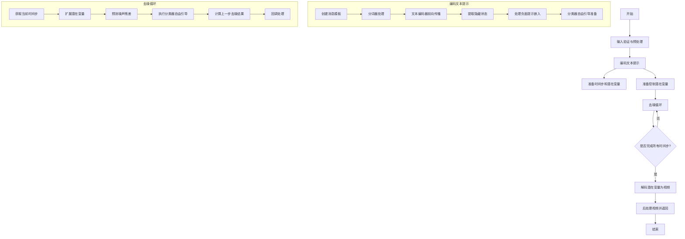

## 类结构

```
DiffusionPipeline (基类)
└── EasyAnimateControlPipeline (主类)
```

## 全局变量及字段


### `XLA_AVAILABLE`
    
Indicates whether PyTorch XLA is available

类型：`bool`
    


### `logger`
    
Module-level logger for logging messages

类型：`logging.Logger`
    


### `EXAMPLE_DOC_STRING`
    
Example docstring demonstrating pipeline usage

类型：`str`
    


### `EasyAnimateControlPipeline.vae`
    
VAE model for encoding and decoding video latent representations

类型：`AutoencoderKLMagvit`
    


### `EasyAnimateControlPipeline.text_encoder`
    
Text encoder for encoding text prompts

类型：`Qwen2VLForConditionalGeneration | BertModel`
    


### `EasyAnimateControlPipeline.tokenizer`
    
Tokenizer for tokenizing text prompts

类型：`Qwen2Tokenizer | BertTokenizer`
    


### `EasyAnimateControlPipeline.transformer`
    
Main transformer model for video generation

类型：`EasyAnimateTransformer3DModel`
    


### `EasyAnimateControlPipeline.scheduler`
    
Diffusion scheduler for denoising process

类型：`FlowMatchEulerDiscreteScheduler`
    


### `EasyAnimateControlPipeline.image_processor`
    
Image processor for preprocessing and postprocessing images

类型：`VaeImageProcessor`
    


### `EasyAnimateControlPipeline.mask_processor`
    
Mask processor for handling video masks

类型：`VaeImageProcessor`
    


### `EasyAnimateControlPipeline.video_processor`
    
Video processor for preprocessing and postprocessing videos

类型：`VideoProcessor`
    


### `EasyAnimateControlPipeline.enable_text_attention_mask`
    
Whether to enable text attention mask

类型：`bool`
    


### `EasyAnimateControlPipeline.vae_spatial_compression_ratio`
    
VAE spatial compression ratio for video encoding

类型：`int`
    


### `EasyAnimateControlPipeline.vae_temporal_compression_ratio`
    
VAE temporal compression ratio for video encoding

类型：`int`
    


### `EasyAnimateControlPipeline.model_cpu_offload_seq`
    
CPU offload sequence for model components

类型：`str`
    


### `EasyAnimateControlPipeline._callback_tensor_inputs`
    
List of tensor inputs for callback functions

类型：`list`
    


### `EasyAnimateControlPipeline._guidance_scale`
    
Guidance scale for classifier-free guidance

类型：`float`
    


### `EasyAnimateControlPipeline._guidance_rescale`
    
Guidance rescale factor for noise prediction

类型：`float`
    


### `EasyAnimateControlPipeline._num_timesteps`
    
Number of timesteps for diffusion process

类型：`int`
    


### `EasyAnimateControlPipeline._interrupt`
    
Flag to interrupt the diffusion process

类型：`bool`
    
    

## 全局函数及方法


### `preprocess_image`

该函数负责将输入的单个图像（PIL.Image、numpy.ndarray 或 torch.Tensor）统一预处理为调整大小后的 PyTorch 张量（CHW 格式，值域归一化到 [0, 1]），是 EasyAnimate 视频生成流水线中图像预处理的核心工具函数。

参数：

- `image`：`torch.Tensor | Image.Image | np.ndarray`，输入的原始图像，支持 PyTorch 张量、PIL 图像或 NumPy 数组三种格式
- `sample_size`：`tuple[int, int]`，目标输出尺寸，格式为 (height, width)，用于控制输出张量的高和宽

返回值：`torch.Tensor`，预处理后的图像张量，格式为 CHW（通道-高度-宽度），数据类型为 float32，值域归一化到 [0, 1]

#### 流程图

```mermaid
flowchart TD
    A[开始: preprocess_image] --> B{判断输入类型}
    
    B -->|torch.Tensor| C[使用插值调整大小]
    C --> I[判断是否已是张量]
    
    B -->|PIL.Image| D[Resize到目标尺寸]
    D --> E[转换为NumPy数组]
    E --> I
    
    B -->|numpy.ndarray| F[从数组创建PIL图像]
    F --> G[Resize到目标尺寸]
    G --> H[转换为NumPy数组]
    H --> I
    
    B -->|其他类型| J[抛出ValueError异常]
    J --> K[结束: 异常返回]
    
    I -->|是| L[返回处理后的张量]
    I -->|否| M[从NumPy转换为张量]
    M --> N[维度从HWC转换为CHW]
    N --> O[归一化到[0, 1]范围]
    O --> L
    
    L --> P[结束: 返回预处理后的张量]
```

#### 带注释源码

```python
def preprocess_image(image, sample_size):
    """
    Preprocess a single image (PIL.Image, numpy.ndarray, or torch.Tensor) to a resized tensor.
    
    该函数是EasyAnimate视频生成流水线中的图像预处理核心函数，
    负责将不同格式的输入图像统一转换为标准化的PyTorch张量格式。
    
    Args:
        image: 输入图像，支持三种格式:
            - torch.Tensor: 假设为CHW格式的张量
            - PIL.Image: PIL图像对象
            - numpy.ndarray: NumPy数组表示的图像
        sample_size: 目标输出尺寸，格式为(height, width)的元组
    
    Returns:
        torch.Tensor: 预处理后的图像张量，格式为CHW，值域[0, 1]，dtype=float32
    """
    # 判断输入类型并分别处理
    if isinstance(image, torch.Tensor):
        # 如果输入是PyTorch张量，假设为CHW格式
        # 使用双线性插值调整到目标尺寸
        # unsqueeze(0)添加batch维度以满足interpolate的输入要求
        # squeeze(0)再将batch维度移除，恢复单张图像格式
        image = torch.nn.functional.interpolate(
            image.unsqueeze(0), 
            size=sample_size, 
            mode="bilinear", 
            align_corners=False
        ).squeeze(0)
    elif isinstance(image, Image.Image):
        # 如果输入是PIL图像，先调整大小到目标尺寸
        # 注意：PIL.Image.resize接受(width, height)顺序
        # 而sample_size是(height, width)，需要交换顺序
        image = image.resize((sample_size[1], sample_size[0]))
        # 转换为NumPy数组以便后续统一处理
        image = np.array(image)
    elif isinstance(image, np.ndarray):
        # 如果输入是NumPy数组，先转换为PIL图像进行Resize操作
        # 这是因为NumPy数组没有直接的resize方法
        image = Image.fromarray(image).resize((sample_size[1], sample_size[0]))
        # 转换回NumPy数组以统一后续处理流程
        image = np.array(image)
    else:
        # 不支持的输入类型，抛出明确的错误信息
        raise ValueError("Unsupported input type. Expected PIL.Image, numpy.ndarray, or torch.Tensor.")

    # 如果当前还不是PyTorch张量（说明是NumPy数组），进行转换
    if not isinstance(image, torch.Tensor):
        # 将NumPy数组转换为PyTorch张量
        # permute(2, 0, 1): 将HWC格式转换为CHW格式（通道维前置）
        # / 255.0: 将像素值从[0, 255]归一化到[0, 1]范围
        image = torch.from_numpy(image).permute(2, 0, 1).float() / 255.0

    return image
```


### `get_video_to_video_latent`

该函数将输入视频（帧列表）转换为视频潜在表示和掩码，用于视频到视频的扩散模型处理。它支持可选的验证视频掩码和参考图像，返回处理后的视频张量、掩码张量和参考图像张量。

参数：

- `input_video`：输入视频，类型为 `list[Image.Image] | list[np.ndarray] | list[torch.Tensor]`，原始视频帧列表
- `num_frames`：目标帧数，类型为 `int`，要处理的视频帧数量
- `sample_size`：目标尺寸，类型为 `tuple[int, int]`，视频帧的目标高度和宽度
- `validation_video_mask`：可选的验证视频掩码，类型为 `Image.Image | np.ndarray | torch.Tensor | None`，用于指定视频中需要处理的区域
- `ref_image`：可选的参考图像，类型为 `Image.Image | np.ndarray | torch.Tensor | None`，用于视频生成的参考

返回值：`tuple[torch.Tensor, torch.Tensor, torch.Tensor | None]`，返回包含三个元素的元组：

- 第一个元素是处理后的视频张量，形状为 `(B, F, C, H, W)`
- 第二个元素是视频掩码张量，形状为 `(B, F, 1, H, W)`
- 第三个元素是处理后的参考图像张量，形状为 `(B, C, H, W)`，如果没有提供则为 `None`

#### 流程图

```mermaid
flowchart TD
    A[开始] --> B{input_video is not None}
    B -->|Yes| C[对每一帧调用 preprocess_image]
    C --> D[堆叠所有帧为 tensor: (F, C, H, W)]
    D --> E[调整维度并添加batch维度: (B, F, C, H, W)]
    E --> F{validation_video_mask is not None}
    F -->|Yes| G[预处理掩码图像]
    G --> H[将掩码值二值化: 小于240/255为0, 否则为255]
    H --> I[调整掩码维度匹配视频]
    I --> J[将掩码复制到所有帧]
    J --> K[移动到视频相同设备]
    F -->|No| L[创建全255的零掩码]
    L --> M[处理参考图像]
    B -->|No| N[设置 input_video 和 input_video_mask 为 None]
    N --> M
    M --> O{ref_image is not None}
    O -->|Yes| P[预处理参考图像]
    P --> Q[调整维度添加batch: (B, C, H, W)]
    Q --> R[返回 (input_video, input_video_mask, ref_image)]
    O -->|No| S[设置 ref_image 为 None]
    S --> R
```

#### 带注释源码

```python
def get_video_to_video_latent(input_video, num_frames, sample_size, validation_video_mask=None, ref_image=None):
    """
    将输入视频转换为视频潜在表示和掩码，用于视频到视频的扩散模型处理。
    
    Args:
        input_video: 输入视频帧列表，支持 PIL.Image, numpy.ndarray 或 torch.Tensor 格式
        num_frames: 目标帧数
        sample_size: 目标尺寸 (height, width)
        validation_video_mask: 可选的验证视频掩码
        ref_image: 可选的参考图像
    
    Returns:
        tuple: (处理后的视频tensor, 视频掩码tensor, 处理后的参考图像tensor或None)
    """
    # 检查输入视频是否存在
    if input_video is not None:
        # 步骤1: 将列表中的每一帧预处理为调整大小后的tensor
        # 调用 preprocess_image 函数处理每一帧
        input_video = [preprocess_image(frame, sample_size=sample_size) for frame in input_video]

        # 步骤2: 将所有帧堆叠成一个 tensor
        # 结果形状: (F, C, H, W) - F为帧数, C为通道数, H为高度, W为宽度
        input_video = torch.stack(input_video)[:num_frames]

        # 步骤3: 调整维度顺序并添加batch维度
        # permute(1, 0, 2, 3) 将 (F, C, H, W) 变为 (C, F, H, W)
        # unsqueeze(0) 添加batch维度，最终形状: (B, F, C, H, W)
        input_video = input_video.permute(1, 0, 2, 3).unsqueeze(0)

        # 步骤4: 处理验证视频掩码（如果提供）
        if validation_video_mask is not None:
            # 预处理掩码图像，调整大小
            validation_video_mask = preprocess_image(validation_video_mask, size=sample_size)
            
            # 二值化掩码：小于阈值(240/255)的像素设为0，否则设为255
            # 这里使用 240/255 作为阈值来实现掩码的二值化
            input_video_mask = torch.where(validation_video_mask < 240 / 255.0, 0.0, 255)

            # 步骤5: 调整掩码维度以匹配视频tensor的形状
            # 通过多次 unsqueeze 和 permute 操作将 (C, H, W) 扩展为 (B, F, 1, H, W)
            input_video_mask = input_video_mask.unsqueeze(0).unsqueeze(-1).permute([3, 0, 1, 2]).unsqueeze(0)
            
            # 步骤6: 将掩码复制到所有帧，使每帧都有相同的掩码
            # tile 操作在指定维度上复制tensor
            input_video_mask = torch.tile(input_video_mask, [1, 1, input_video.size()[2], 1, 1])
            
            # 步骤7: 将掩码移动到与视频相同的设备和数据类型
            input_video_mask = input_video_mask.to(input_video.device, input_video.dtype)
        else:
            # 如果没有提供掩码，创建一个全255的零掩码（表示全部区域有效）
            # 形状: (B, 1, F, H, W) - 与视频的batch和帧维度匹配
            input_video_mask = torch.zeros_like(input_video[:, :1])
            input_video_mask[:, :, :] = 255
    else:
        # 如果没有输入视频，返回 None
        input_video, input_video_mask = None, None

    # 步骤8: 处理参考图像（如果提供）
    if ref_image is not None:
        # 预处理参考图像
        ref_image = preprocess_image(ref_image, size=sample_size)
        
        # 调整维度添加batch维度
        # permute(1, 0, 2, 3) 将 (C, H, W) 变为 (H, C, W)
        # unsqueeze(0) 添加batch维度，最终形状: (B, C, H, W)
        ref_image = ref_image.permute(1, 0, 2, 3).unsqueeze(0)
    else:
        ref_image = None

    # 返回处理后的视频、掩码和参考图像
    return input_video, input_video_mask, ref_image
```


### `get_resize_crop_region_for_grid`

获取用于网格调整大小和裁剪的区域。该函数根据目标宽高比和源图像的宽高比，计算保持宽高比的调整大小尺寸，并返回居中裁剪的坐标区域。

参数：

- `src`：`tuple`，源图像的尺寸，格式为 (height, width)
- `tgt_width`：`int`，目标图像的宽度
- `tgt_height`：`int`，目标图像的高度

返回值：`tuple`，返回两个元组 - 第一个是裁剪区域的左上角坐标 (crop_top, crop_left)，第二个是裁剪区域的右下角坐标 (crop_top + resize_height, crop_left + resize_width)

#### 流程图

```mermaid
flowchart TD
    A[开始: 输入 src, tgt_width, tgt_height] --> B[提取目标尺寸 tw, tgt_height]
    --> C[提取源尺寸 h, w]
    --> D[计算源宽高比 r = h / w]
    --> E{判断 r > th / tw}
    -->|是| F[resize_height = th<br/>resize_width = round(th / h * w)]
    --> G[计算裁剪左上角坐标]
    --> H[返回裁剪区域坐标]
    |否| I[resize_width = tw<br/>resize_height = round(tw / w * h)]
    --> G
    
    E -->|是| F
    E -->|否| I
    
    G[crop_top = round((th - resize_height) / 2)<br/>crop_left = round((tw - resize_width) / 2)]
    --> H[(crop_top, crop_left)<br/>(crop_top + resize_height<br/>crop_left + resize_width)]
```

#### 带注释源码

```python
# Similar to diffusers.pipelines.hunyuandit.pipeline_hunyuandit.get_resize_crop_region_for_grid
def get_resize_crop_region_for_grid(src, tgt_width, tgt_height):
    """
    计算保持宽高比的图像调整大小和居中裁剪区域。
    
    该函数用于在将图像调整为目标尺寸时，保持原始宽高比并计算居中裁剪的坐标。
    这在视频或图像网格处理中非常有用，确保图像不会被拉伸或扭曲。
    
    参数:
        src: 源图像尺寸元组 (height, width)
        tgt_width: 目标图像宽度
        tgt_height: 目标图像高度
    
    返回:
        两个元组: 
        - 裁剪区域左上角坐标 (crop_top, crop_left)
        - 裁剪区域右下角坐标 (crop_top + resize_height, crop_left + resize_width)
    """
    # 提取目标尺寸
    tw = tgt_width
    th = tgt_height
    
    # 提取源图像尺寸 (height, width)
    h, w = src
    
    # 计算源图像的宽高比
    r = h / w
    
    # 根据宽高比判断是宽度受限还是高度受限
    # 如果源宽高比大于目标宽高比，说明高度受限（需要以高度为基准）
    if r > (th / tw):
        # 高度受限：以目标高度为基准，调整宽度
        resize_height = th
        resize_width = int(round(th / h * w))
    else:
        # 宽度受限：以目标宽度为基准，调整高度
        resize_width = tw
        resize_height = int(round(tw / w * h))
    
    # 计算居中裁剪的左上角坐标
    # 通过目标尺寸减去调整后尺寸，再除以2来实现居中
    crop_top = int(round((th - resize_height) / 2.0))
    crop_left = int(round((tw - resize_width) / 2.0))
    
    # 返回裁剪区域的左上角和右下角坐标
    # 左上角: (crop_top, crop_left)
    # 右下角: (crop_top + resize_height, crop_left + resize_width)
    return (crop_top, crop_left), (crop_top + resize_height, crop_left + resize_width)
```


### `rescale_noise_cfg`

该函数用于根据 guidance_rescale 参数重新缩放噪声配置张量，以改善图像质量并修复过度曝光问题。该方法基于论文 Common Diffusion Noise Schedules and Sample Steps are Flawed (Section 3.4)。

参数：

- `noise_cfg`：`torch.Tensor`，引导扩散过程中预测的噪声张量
- `noise_pred_text`：`torch.Tensor`，文本引导扩散过程中预测的噪声张量
- `guidance_rescale`：`float`，可选参数，默认值为 0.0，应用到噪声预测的重缩放因子

返回值：`torch.Tensor`，重缩放后的噪声预测张量

#### 流程图

```mermaid
flowchart TD
    A[开始] --> B[计算 noise_pred_text 的标准差 std_text]
    B --> C[计算 noise_cfg 的标准差 std_cfg]
    C --> D[计算重缩放后的噪声预测: noise_pred_rescaled = noise_cfg × (std_text / std_cfg)]
    D --> E[混合原始结果: noise_cfg = guidance_rescale × noise_pred_rescaled + (1 - guidance_rescale) × noise_cfg]
    E --> F[返回重缩放后的 noise_cfg]
```

#### 带注释源码

```python
# Copied from diffusers.pipelines.stable_diffusion.pipeline_stable_diffusion.rescale_noise_cfg
def rescale_noise_cfg(noise_cfg, noise_pred_text, guidance_rescale=0.0):
    r"""
    Rescales `noise_cfg` tensor based on `guidance_rescale` to improve image quality and fix overexposure. Based on
    Section 3.4 from [Common Diffusion Noise Schedules and Sample Steps are
    Flawed](https://huggingface.co/papers/2305.08891).

    Args:
        noise_cfg (`torch.Tensor`):
            The predicted noise tensor for the guided diffusion process.
        noise_pred_text (`torch.Tensor`):
            The predicted noise tensor for the text-guided diffusion process.
        guidance_rescale (`float`, *optional*, defaults to 0.0):
            A rescale factor applied to the noise predictions.

    Returns:
        noise_cfg (`torch.Tensor`): The rescaled noise prediction tensor.
    """
    # 计算文本预测噪声在所有维度(除了batch维度)上的标准差
    # keepdim=True 保持维度以便后续广播操作
    std_text = noise_pred_text.std(dim=list(range(1, noise_pred_text.ndim)), keepdim=True)
    
    # 计算噪声配置在所有维度(除了batch维度)上的标准差
    std_cfg = noise_cfg.std(dim=list(range(1, noise_cfg.ndim)), keepdim=True)
    
    # 根据guidance重缩放结果(修复过度曝光问题)
    # 通过将噪声配置乘以文本预测噪声与噪声配置的标准差比率来实现
    noise_pred_rescaled = noise_cfg * (std_text / std_cfg)
    
    # 通过guidance_rescale因子混合原始guidance结果，避免图像看起来"平淡"
    # guidance_rescale=0.0 时返回原始noise_cfg
    # guidance_rescale=1.0 时返回完全重缩放的noise_pred_rescaled
    noise_cfg = guidance_rescale * noise_pred_rescaled + (1 - guidance_rescale) * noise_cfg
    
    return noise_cfg
```


### `resize_mask`

该函数用于在 MAGVIT 视频生成模型中调整掩码（mask）的尺寸，使其与潜在变量（latent）的空间尺寸相匹配，支持仅处理第一帧或处理所有帧的两种模式。

参数：

-  `mask`：`torch.Tensor`，输入的掩码张量，形状为 (B, C, F, H, W)，其中 B 是批次大小，C 是通道数，F 是帧数，H 和 W 是高度和宽度
-  `latent`：`torch.Tensor`，目标潜在变量张量，用于获取目标尺寸，形状为 (B, C, F, H, W)
-  `process_first_frame_only`：`bool`，是否仅处理第一帧，默认为 True；当为 True 时，第一帧单独处理，其余帧批量处理

返回值：`torch.Tensor`，调整大小后的掩码张量，尺寸与 latent 的空间尺寸一致

#### 流程图

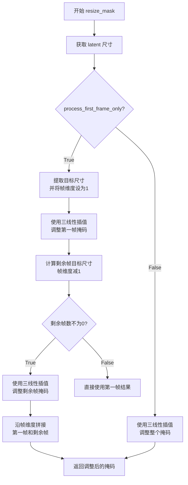

#### 带注释源码

```python
def resize_mask(mask, latent, process_first_frame_only=True):
    """
    Resize mask information in magvit
    
    根据潜在变量的尺寸调整掩码的大小，支持两种模式：
    1. process_first_frame_only=True: 仅单独处理第一帧，其余帧批量处理
    2. process_first_frame_only=False: 一次性处理所有帧
    """
    # 获取潜在变量的尺寸信息
    latent_size = latent.size()

    if process_first_frame_only:
        # 模式1: 仅处理第一帧
        # 构建目标尺寸，保持空间维度(H, W)，但帧维度设为1
        target_size = list(latent_size[2:])  # [F, H, W]
        target_size[0] = 1  # 只保留1帧
        
        # 使用三线性插值调整第一帧掩码到目标尺寸
        first_frame_resized = F.interpolate(
            mask[:, :, 0:1, :, :],  # 提取第一帧 (B, C, 1, H, W)
            size=target_size,       # 目标尺寸 [1, H', W']
            mode="trilinear",       # 三线性插值
            align_corners=False
        )

        # 计算剩余帧的目标尺寸
        target_size = list(latent_size[2:])
        target_size[0] = target_size[0] - 1  # 帧数减1
        
        # 如果还有剩余帧
        if target_size[0] != 0:
            # 使用三线性插值调整剩余帧掩码
            remaining_frames_resized = F.interpolate(
                mask[:, :, 1:, :, :],  # 提取剩余帧 (B, C, F-1, H, W)
                size=target_size,       # 目标尺寸 [F-1, H', W']
                mode="trilinear",
                align_corners=False
            )
            # 沿帧维度拼接第一帧和剩余帧
            resized_mask = torch.cat([first_frame_resized, remaining_frames_resized], dim=2)
        else:
            # 没有剩余帧，直接使用第一帧结果
            resized_mask = first_frame_resized
    else:
        # 模式2: 一次性处理所有帧
        # 直接将整个掩码调整到潜在变量的空间尺寸
        target_size = list(latent_size[2:])  # [F, H, W]
        resized_mask = F.interpolate(
            mask,                      # 整个掩码 (B, C, F, H, W)
            size=target_size,          # 目标尺寸
            mode="trilinear",
            align_corners=False
        )
    
    return resized_mask
```


### `retrieve_timesteps`

调用调度器的 `set_timesteps` 方法并从中获取时间步，处理自定义时间步和 sigmas。任何 kwargs 将被传递给 `scheduler.set_timesteps`。

参数：

- `scheduler`：`SchedulerMixin`，要获取时间步的调度器
- `num_inference_steps`：`int | None`，生成样本时使用的扩散步数，如果使用此参数，则 `timesteps` 必须为 `None`
- `device`：`str | torch.device | None`，时间步要移动到的设备，如果为 `None`，则不移动时间步
- `timesteps`：`list[int] | None`，自定义时间步，用于覆盖调度器的时间步间隔策略
- `sigmas`：`list[float] | None`，自定义 sigmas，用于覆盖调度器的时间步间隔策略
- `**kwargs`：可变关键字参数，将传递给调度器的 `set_timesteps` 方法

返回值：`tuple[torch.Tensor, int]`，元组中第一个元素是调度器的时间步张量，第二个元素是推理步数

#### 流程图

```mermaid
flowchart TD
    A[开始 retrieve_timesteps] --> B{检查 timesteps 和 sigmas 是否同时存在}
    B -->|是| C[抛出 ValueError: 只能选择一个]
    B -->|否| D{检查 timesteps 是否存在}
    
    D -->|是| E{检查调度器是否支持 timesteps}
    E -->|不支持| F[抛出 ValueError: 不支持自定义时间步]
    E -->|支持| G[调用 scheduler.set_timesteps<br/>参数: timesteps=timesteps, device=device, **kwargs]
    G --> H[获取 scheduler.timesteps]
    H --> I[计算 num_inference_steps = len(timesteps)]
    
    D -->|否| J{检查 sigmas 是否存在}
    
    J -->|是| K{检查调度器是否支持 sigmas}
    K -->|不支持| L[抛出 ValueError: 不支持自定义 sigmas]
    K -->|支持| M[调用 scheduler.set_timesteps<br/>参数: sigmas=sigmas, device=device, **kwargs]
    M --> N[获取 scheduler.timesteps]
    N --> O[计算 num_inference_steps = len(timesteps)]
    
    J -->|否| P[调用 scheduler.set_timesteps<br/>参数: num_inference_steps, device=device, **kwargs]
    P --> Q[获取 scheduler.timesteps]
    Q --> R[计算 num_inference_steps = len(timesteps)]
    
    I --> S[返回 tuple[timesteps, num_inference_steps]]
    O --> S
    R --> S
```

#### 带注释源码

```python
def retrieve_timesteps(
    scheduler,
    num_inference_steps: int | None = None,
    device: str | torch.device | None = None,
    timesteps: list[int] | None = None,
    sigmas: list[float] | None = None,
    **kwargs,
):
    r"""
    Calls the scheduler's `set_timesteps` method and retrieves timesteps from the scheduler after the call. Handles
    custom timesteps. Any kwargs will be supplied to `scheduler.set_timesteps`.

    Args:
        scheduler (`SchedulerMixin`):
            The scheduler to get timesteps from.
        num_inference_steps (`int`):
            The number of diffusion steps used when generating samples with a pre-trained model. If used, `timesteps`
            must be `None`.
        device (`str` or `torch.device`, *optional*):
            The device to which the timesteps should be moved to. If `None`, the timesteps are not moved.
        timesteps (`list[int]`, *optional*):
            Custom timesteps used to override the timestep spacing strategy of the scheduler. If `timesteps` is passed,
            `num_inference_steps` and `sigmas` must be `None`.
        sigmas (`list[float]`, *optional*):
            Custom sigmas used to override the timestep spacing strategy of the scheduler. If `sigmas` is passed,
            `num_inference_steps` and `timesteps` must be `None`.

    Returns:
        `tuple[torch.Tensor, int]`: A tuple where the first element is the timestep schedule from the scheduler and the
        second element is the number of inference steps.
    """
    # 检查是否同时传入了 timesteps 和 sigmas，这是不允许的
    if timesteps is not None and sigmas is not None:
        raise ValueError("Only one of `timesteps` or `sigmas` can be passed. Please choose one to set custom values")
    
    # 处理自定义 timesteps 的情况
    if timesteps is not None:
        # 使用 inspect 检查调度器的 set_timesteps 方法是否接受 timesteps 参数
        accepts_timesteps = "timesteps" in set(inspect.signature(scheduler.set_timesteps).parameters.keys())
        if not accepts_timesteps:
            raise ValueError(
                f"The current scheduler class {scheduler.__class__}'s `set_timesteps` does not support custom"
                f" timestep schedules. Please check whether you are using the correct scheduler."
            )
        # 调用调度器的 set_timesteps 方法设置自定义时间步
        scheduler.set_timesteps(timesteps=timesteps, device=device, **kwargs)
        # 从调度器获取设置后的时间步
        timesteps = scheduler.timesteps
        # 计算推理步数
        num_inference_steps = len(timesteps)
    
    # 处理自定义 sigmas 的情况
    elif sigmas is not None:
        # 使用 inspect 检查调度器的 set_timesteps 方法是否接受 sigmas 参数
        accept_sigmas = "sigmas" in set(inspect.signature(scheduler.set_timesteps).parameters.keys())
        if not accept_sigmas:
            raise ValueError(
                f"The current scheduler class {scheduler.__class__}'s `set_timesteps` does not support custom"
                f" sigmas schedules. Please check whether you are using the correct scheduler."
            )
        # 调用调度器的 set_timesteps 方法设置自定义 sigmas
        scheduler.set_timesteps(sigmas=sigmas, device=device, **kwargs)
        # 从调度器获取设置后的时间步
        timesteps = scheduler.timesteps
        # 计算推理步数
        num_inference_steps = len(timesteps)
    
    # 没有自定义参数的情况，使用默认的 num_inference_steps
    else:
        scheduler.set_timesteps(num_inference_steps, device=device, **kwargs)
        timesteps = scheduler.timesteps
    
    # 返回时间步张量和推理步数
    return timesteps, num_inference_steps
```


### `EasyAnimateControlPipeline.__init__`

该方法是 `EasyAnimateControlPipeline` 类的构造函数，负责初始化管道所需的所有核心组件，包括 VAE 模型、文本编码器、分词器、Transformer 模型、调度器，以及图像/视频处理器等。

参数：

- `vae`：`AutoencoderKLMagvit`，用于将视频编码和解码到潜在表示的变分自编码器模型
- `text_encoder`：`Qwen2VLForConditionalGeneration | BertModel`，文本编码器（EasyAnimate V5.1 使用 Qwen2-VL）
- `tokenizer`：`Qwen2Tokenizer | BertTokenizer`，用于对文本进行分词
- `transformer`：`EasyAnimateTransformer3DModel`，由 EasyAnimate 团队设计的 Transformer 模型
- `scheduler`：`FlowMatchEulerDiscreteScheduler`，与 EasyAnimate 配合使用的去噪调度器

返回值：`None`，该方法为构造函数，不返回任何值，仅初始化实例属性

#### 流程图

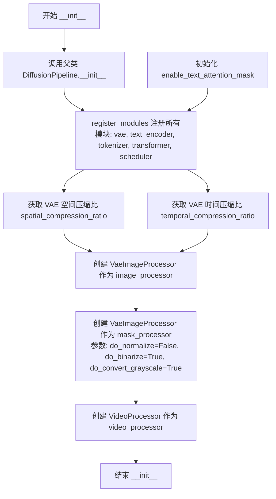

#### 带注释源码

```python
def __init__(
    self,
    vae: AutoencoderKLMagvit,
    text_encoder: Qwen2VLForConditionalGeneration | BertModel,
    tokenizer: Qwen2Tokenizer | BertTokenizer,
    transformer: EasyAnimateTransformer3DModel,
    scheduler: FlowMatchEulerDiscreteScheduler,
):
    """
    初始化 EasyAnimateControlPipeline 管道组件。
    
    参数:
        vae: 变分自编码器模型，用于视频与潜在表示之间的编码和解码
        text_encoder: 文本编码器，V5.1 版本使用 Qwen2-VL-7B-Instruct
        tokenizer: 分词器，用于对文本进行分词
        transformer: EasyAnimate 的 3D Transformer 模型
        scheduler: FlowMatch 调度器，用于去噪过程
    """
    # 调用父类 DiffusionPipeline 的初始化方法
    super().__init__()

    # 注册所有模块到管道中，使其可以被管道统一管理
    self.register_modules(
        vae=vae,
        text_encoder=text_encoder,
        tokenizer=tokenizer,
        transformer=transformer,
        scheduler=scheduler,
    )

    # 初始化文本注意力掩码启用标志
    # 如果 transformer 存在则从配置获取，否则默认为 True
    self.enable_text_attention_mask = (
        self.transformer.config.enable_text_attention_mask
        if getattr(self, "transformer", None) is not None
        else True
    )
    
    # 获取 VAE 的空间压缩比（默认为 8）
    # 用于计算图像处理器和潜在空间的缩放因子
    self.vae_spatial_compression_ratio = (
        self.vae.spatial_compression_ratio if getattr(self, "vae", None) is not None else 8
    )
    
    # 获取 VAE 的时间压缩比（默认为 4）
    # 用于处理视频帧的时间维度压缩
    self.vae_temporal_compression_ratio = (
        self.vae.temporal_compression_ratio if getattr(self, "vae", None) is not None else 4
    )
    
    # 创建图像处理器，用于 VAE 的图像预处理和后处理
    self.image_processor = VaeImageProcessor(vae_scale_factor=self.vae_spatial_compression_ratio)
    
    # 创建掩码处理器，专门用于处理视频掩码
    # do_normalize=False: 不进行归一化
    # do_binarize=True: 进行二值化处理
    # do_convert_grayscale=True: 转换为灰度图
    self.mask_processor = VaeImageProcessor(
        vae_scale_factor=self.vae_spatial_compression_ratio,
        do_normalize=False,
        do_binarize=True,
        do_convert_grayscale=True,
    )
    
    # 创建视频处理器，用于视频的预处理和后处理
    self.video_processor = VideoProcessor(vae_scale_factor=self.vae_spatial_compression_ratio)
```


### `EasyAnimateControlPipeline.encode_prompt`

该函数负责将文本提示（prompt）编码为文本编码器的隐藏状态向量（embedding），支持分类器自由引导（Classifier-Free Guidance）以提升生成质量，能够处理单字符串或字符串列表形式的正负向提示，并返回对应的嵌入向量和注意力掩码。

参数：

- `self`：`EasyAnimateControlPipeline` 类实例本身，包含 `text_encoder`、`tokenizer` 等关键组件
- `prompt`：`str | list[str]`，需要编码的文本提示，可以是单个字符串或字符串列表
- `num_images_per_prompt`：`int = 1`，每个提示生成的图像数量，用于批量生成时复制嵌入向量
- `do_classifier_free_guidance`：`bool = True`，是否启用分类器自由引导，启用时会同时生成负向提示嵌入
- `negative_prompt`：`str | list[str] | None`，负向提示，用于指导生成内容避免包含指定元素
- `prompt_embeds`：`torch.Tensor | None = None`，预生成的正向提示嵌入，若提供则跳过文本编码步骤
- `negative_prompt_embeds`：`torch.Tensor | None = None`，预生成的负向提示嵌入
- `prompt_attention_mask`：`torch.Tensor | None = None`，正向提示的注意力掩码，当直接传入 `prompt_embeds` 时必须提供
- `negative_prompt_attention_mask`：`torch.Tensor | None = None`，负向提示的注意力掩码
- `device`：`torch.device | None = None`，计算设备，若为 None 则使用 `self.text_encoder.device`
- `dtype`：`torch.dtype | None = None`，计算数据类型，若为 None 则使用 `self.text_encoder.dtype`
- `max_sequence_length`：`int = 256`，文本序列的最大长度，超过该长度会被截断

返回值：`tuple[torch.Tensor, torch.Tensor, torch.Tensor, torch.Tensor]`，返回一个包含四个元素的元组：
- `prompt_embeds`：编码后的正向提示嵌入，形状为 `(batch_size * num_images_per_prompt, seq_len, hidden_dim)`
- `negative_prompt_embeds`：编码后的负向提示嵌入，形状与 `prompt_embeds` 相同
- `prompt_attention_mask`：正向提示的注意力掩码，形状为 `(batch_size * num_images_per_prompt, seq_len)`
- `negative_prompt_attention_mask`：负向提示的注意力掩码，形状与 `prompt_attention_mask` 相同

#### 流程图

```mermaid
flowchart TD
    A[开始 encode_prompt] --> B{检查 prompt 类型}
    B -->|字符串| C[batch_size = 1]
    B -->|列表| D[batch_size = len(prompt)]
    B -->|嵌入已提供| E[使用已有嵌入]
    C --> F{prompt_embeds 是否为空?}
    D --> F
    E --> M[准备attention mask]
    F -->|是| G{检查tokenizer类型并构建消息格式}
    F -->|否| M
    G --> H[使用tokenizer进行分词和编码]
    H --> I{检查enable_text_attention_mask}
    I -->|是| J[调用text_encoder获取倒数第二层隐藏状态]
    I -->|否| K[抛出异常]
    J --> L[重复attention mask以匹配num_images_per_prompt]
    L --> M[将prompt_embeds移动到指定设备和dtype]
    M --> N[复制prompt_embeds以匹配批量大小]
    N --> O{do_classifier_free_guidance 且 negative_prompt_embeds为空?}
    O -->|是| P[处理negative_prompt]
    O -->|否| Q{do_classifier_free_guidance?}
    P --> R[构建negative_prompt消息并编码]
    R --> S[调用text_encoder获取负向嵌入]
    S --> T[重复negative_attention_mask]
    T --> U[复制negative_prompt_embeds以匹配批量大小]
    Q --> V[返回所有嵌入和mask]
    U --> V
    K --> V
    V --> Z[结束]
```

#### 带注释源码

```python
def encode_prompt(
    self,
    prompt: str | list[str],
    num_images_per_prompt: int = 1,
    do_classifier_free_guidance: bool = True,
    negative_prompt: str | list[str] | None = None,
    prompt_embeds: torch.Tensor | None = None,
    negative_prompt_embeds: torch.Tensor | None = None,
    prompt_attention_mask: torch.Tensor | None = None,
    negative_prompt_attention_mask: torch.Tensor | None = None,
    device: torch.device | None = None,
    dtype: torch.dtype | None = None,
    max_sequence_length: int = 256,
):
    r"""
    Encodes the prompt into text encoder hidden states.

    Args:
        prompt (`str` or `list[str]`, *optional*):
            prompt to be encoded
        device: (`torch.device`):
            torch device
        dtype (`torch.dtype`):
            torch dtype
        num_images_per_prompt (`int`):
            number of images that should be generated per prompt
        do_classifier_free_guidance (`bool`):
            whether to use classifier free guidance or not
        negative_prompt (`str` or `list[str]`, *optional*):
            The prompt or prompts not to guide the image generation. If not defined, one has to pass
            `negative_prompt_embeds` instead. Ignored when not using guidance (i.e., ignored if `guidance_scale` is
            less than `1`).
        prompt_embeds (`torch.Tensor`, *optional*):
            Pre-generated text embeddings. Can be used to easily tweak text inputs, *e.g.* prompt weighting. If not
            provided, text embeddings will be generated from `prompt` input argument.
        negative_prompt_embeds (`torch.Tensor`, *optional*):
            Pre-generated negative text embeddings. Can be used to easily tweak text inputs, *e.g.* prompt
            weighting. If not provided, negative_prompt_embeds will be generated from `negative_prompt` input
            argument.
        prompt_attention_mask (`torch.Tensor`, *optional*):
            Attention mask for the prompt. Required when `prompt_embeds` is passed directly.
        negative_prompt_attention_mask (`torch.Tensor`, *optional*):
            Attention mask for the negative prompt. Required when `negative_prompt_embeds` is passed directly.
        max_sequence_length (`int`, *optional*): maximum sequence length to use for the prompt.
    """
    # 设置默认设备和数据类型，如果没有提供则使用text_encoder的设备和数据类型
    dtype = dtype or self.text_encoder.dtype
    device = device or self.text_encoder.device

    # 确定批量大小：如果prompt是字符串则为1，如果是列表则为列表长度，否则使用已有嵌入的批量大小
    if prompt is not None and isinstance(prompt, str):
        batch_size = 1
    elif prompt is not None and isinstance(prompt, list):
        batch_size = len(prompt)
    else:
        batch_size = prompt_embeds.shape[0]

    # 如果没有提供prompt_embeds，则需要从文本生成嵌入
    if prompt_embeds is None:
        # 根据prompt类型构建消息格式，支持字符串或字符串列表
        if isinstance(prompt, str):
            messages = [
                {
                    "role": "user",
                    "content": [{"type": "text", "text": prompt}],
                }
            ]
        else:
            messages = [
                {
                    "role": "user",
                    "content": [{"type": "text", "text": _prompt}],
                }
                for _prompt in prompt
            ]
        
        # 使用tokenizer的chat template将消息转换为文本格式
        text = [
            self.tokenizer.apply_chat_template([m], tokenize=False, add_generation_prompt=True) for m in messages
        ]

        # 使用tokenizer对文本进行分词和编码，返回pytorch tensors
        text_inputs = self.tokenizer(
            text=text,
            padding="max_length",          # 填充到最大长度
            max_length=max_sequence_length, # 最大序列长度
            truncation=True,                # 启用截断
            return_attention_mask=True,     # 返回注意力掩码
            padding_side="right",           # 填充在右侧
            return_tensors="pt",            # 返回pytorch tensor
        )
        # 将输入移动到text_encoder设备上
        text_inputs = text_inputs.to(self.text_encoder.device)

        # 获取input_ids和attention_mask
        text_input_ids = text_inputs.input_ids
        prompt_attention_mask = text_inputs.attention_mask
        
        # 检查是否启用文本注意力掩码配置
        if self.enable_text_attention_mask:
            # 调用text_encoder获取倒数第二层隐藏状态作为prompt embeddings
            # 使用倒数第二层是因为最后一层通常更接近输出，中间层往往包含更丰富的语义信息
            prompt_embeds = self.text_encoder(
                input_ids=text_input_ids, attention_mask=prompt_attention_mask, output_hidden_states=True
            ).hidden_states[-2]
        else:
            raise ValueError("LLM needs attention_mask")
        
        # 根据num_images_per_prompt重复attention mask
        prompt_attention_mask = prompt_attention_mask.repeat(num_images_per_prompt, 1)

    # 将prompt_embeds移动到指定设备和数据类型
    prompt_embeds = prompt_embeds.to(dtype=dtype, device=device)

    # 获取当前嵌入的形状信息
    bs_embed, seq_len, _ = prompt_embeds.shape
    # 复制prompt embeddings以匹配每个prompt生成的图像数量
    # 使用view方法进行MPS友好的批量复制
    prompt_embeds = prompt_embeds.repeat(1, num_images_per_prompt, 1)
    prompt_embeds = prompt_embeds.view(bs_embed * num_images_per_prompt, seq_len, -1)
    # 同样移动attention mask到指定设备
    prompt_attention_mask = prompt_attention_mask.to(device=device)

    # 如果启用分类器自由引导且没有提供negative_prompt_embeds，则生成负向嵌入
    if do_classifier_free_guidance and negative_prompt_embeds is None:
        # 处理negative_prompt，构建消息格式
        if negative_prompt is not None and isinstance(negative_prompt, str):
            messages = [
                {
                    "role": "user",
                    "content": [{"type": "text", "text": negative_prompt}],
                }
            ]
        else:
            messages = [
                {
                    "role": "user",
                    "content": [{"type": "text", "text": _negative_prompt}],
                }
                for _negative_prompt in negative_prompt
            ]
        
        # 同样应用chat template并分词
        text = [
            self.tokenizer.apply_chat_template([m], tokenize=False, add_generation_prompt=True) for m in messages
        ]

        text_inputs = self.tokenizer(
            text=text,
            padding="max_length",
            max_length=max_sequence_length,
            truncation=True,
            return_attention_mask=True,
            padding_side="right",
            return_tensors="pt",
        )
        text_inputs = text_inputs.to(self.text_encoder.device)

        text_input_ids = text_inputs.input_ids
        negative_prompt_attention_mask = text_inputs.attention_mask
        
        # 同样获取负向提示的嵌入
        if self.enable_text_attention_mask:
            negative_prompt_embeds = self.text_encoder(
                input_ids=text_input_ids,
                attention_mask=negative_prompt_attention_mask,
                output_hidden_states=True,
            ).hidden_states[-2]
        else:
            raise ValueError("LLM needs attention_mask")
        
        # 重复negative attention mask
        negative_prompt_attention_mask = negative_prompt_attention_mask.repeat(num_images_per_prompt, 1)

    # 如果启用分类器自由引导，处理negative embeddings
    if do_classifier_free_guidance:
        # 获取序列长度
        seq_len = negative_prompt_embeds.shape[1]

        # 移动negative embeddings到指定设备和数据类型
        negative_prompt_embeds = negative_prompt_embeds.to(dtype=dtype, device=device)

        # 复制negative embeddings以匹配批量大小
        negative_prompt_embeds = negative_prompt_embeds.repeat(1, num_images_per_prompt, 1)
        negative_prompt_embeds = negative_prompt_embeds.view(batch_size * num_images_per_prompt, seq_len, -1)
        # 移动negative attention mask到指定设备
        negative_prompt_attention_mask = negative_prompt_attention_mask.to(device=device)

    # 返回所有四个元素：prompt embeddings、negative prompt embeddings及对应的attention masks
    return prompt_embeds, negative_prompt_embeds, prompt_attention_mask, negative_prompt_attention_mask
```


### `EasyAnimateControlPipeline.prepare_extra_step_kwargs`

准备调度器额外参数的方法，用于处理不同调度器签名不一致的问题，通过检查调度器的 `step` 方法是否接受特定参数（如 `eta` 和 `generator`）来动态构建传递给调度器的额外关键字参数。

参数：

- `self`：隐式参数，`EasyAnimateControlPipeline` 实例，Pipeline 对象本身
- `generator`：`torch.Generator | list[torch.Generator] | None`，随机数生成器，用于确保图像生成的可重复性
- `eta`：`float | None`，DDIM 调度器的 eta 参数（仅当调度器支持时生效），对应 DDIM 论文中的 η 参数，取值范围 [0, 1]

返回值：`dict`，包含调度器额外关键字参数的字典，可能包含 `eta`（如果调度器接受）和/或 `generator`（如果调度器接受）

#### 流程图

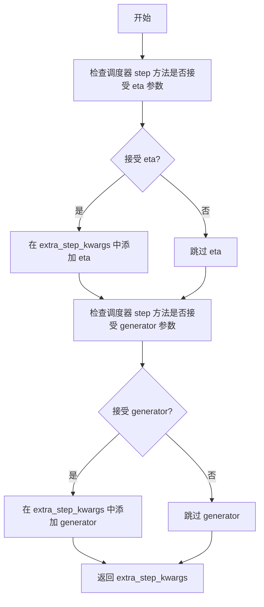

#### 带注释源码

```python
def prepare_extra_step_kwargs(self, generator, eta):
    # 准备调度器步骤的额外参数，因为并非所有调度器都具有相同的签名
    # eta (η) 仅在 DDIMScheduler 中使用，对于其他调度器将被忽略
    # eta 对应 DDIM 论文 https://huggingface.co/papers/2010.02502 中的 η
    # 取值应在 [0, 1] 之间

    # 使用 inspect 检查调度器的 step 方法是否接受 eta 参数
    accepts_eta = "eta" in set(inspect.signature(self.scheduler.step).parameters.keys())
    # 初始化空字典用于存储额外参数
    extra_step_kwargs = {}
    # 如果调度器接受 eta，则将其添加到参数字典中
    if accepts_eta:
        extra_step_kwargs["eta"] = eta

    # 检查调度器是否接受 generator 参数
    accepts_generator = "generator" in set(inspect.signature(self.scheduler.step).parameters.keys())
    # 如果调度器接受 generator，则将其添加到参数字典中
    if accepts_generator:
        extra_step_kwargs["generator"] = generator
    
    # 返回构建好的额外参数字典
    return extra_step_kwargs
```


### `EasyAnimateControlPipeline.check_inputs`

验证输入参数的有效性，确保 `prompt`、`prompt_embeds`、`negative_prompt` 和 `negative_prompt_embeds` 等参数的组合方式合法，且 `height` 和 `width` 能够被 16 整除，否则抛出 `ValueError` 异常。

参数：

- `self`：`EasyAnimateControlPipeline` 实例本身
- `prompt`：`str | list[str] | None`，正向提示词，文本描述或文本列表
- `height`：`int`，生成图像的高度（像素），必须能被 16 整除
- `width`：`int`，生成图像的宽度（像素），必须能被 16 整除
- `negative_prompt`：`str | list[str] | None`，负向提示词，用于引导模型避免生成相关内容
- `prompt_embeds`：`torch.Tensor | None`，预计算的正向提示词嵌入向量
- `negative_prompt_embeds`：`torch.Tensor | None`，预计算的负向提示词嵌入向量
- `prompt_attention_mask`：`torch.Tensor | None`，正向提示词的注意力掩码
- `negative_prompt_attention_mask`：`torch.Tensor | None`，负向提示词的注意力掩码
- `callback_on_step_end_tensor_inputs`：`list[str] | None`，每步结束时回调函数需要传递的 tensor 输入名称列表

返回值：`None`，该方法仅进行参数验证，验证通过则正常返回，验证失败则抛出 `ValueError` 异常

#### 流程图

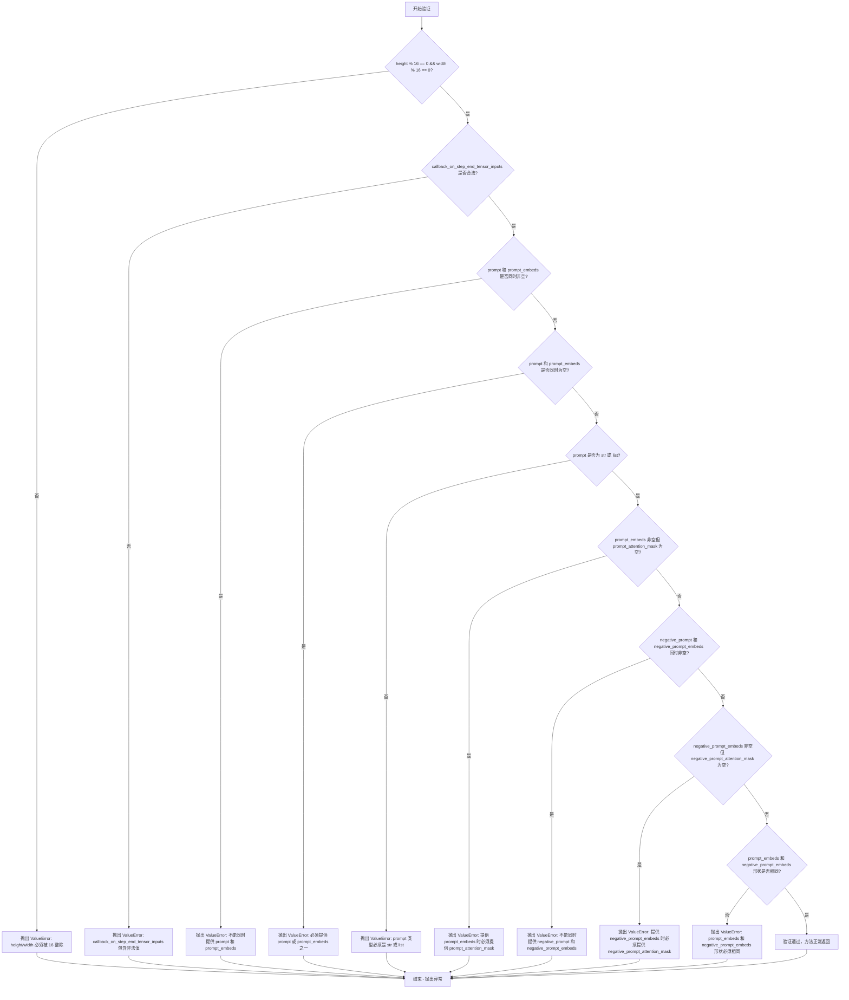

#### 带注释源码

```python
def check_inputs(
    self,
    prompt,
    height,
    width,
    negative_prompt=None,
    prompt_embeds=None,
    negative_prompt_embeds=None,
    prompt_attention_mask=None,
    negative_prompt_attention_mask=None,
    callback_on_step_end_tensor_inputs=None,
):
    """
    验证输入参数的有效性，确保参数组合合法且数值符合模型要求。
    
    该方法会检查以下内容：
    1. height 和 width 必须能被 16 整除（模型结构要求）
    2. callback_on_step_end_tensor_inputs 必须是合法的张量名称
    3. prompt 和 prompt_embeds 不能同时提供（互斥）
    4. prompt 和 prompt_embeds 至少提供一个
    5. prompt 类型必须是 str 或 list
    6. 如果提供 prompt_embeds，必须同时提供 prompt_attention_mask
    7. negative_prompt 和 negative_prompt_embeds 不能同时提供
    8. 如果提供 negative_prompt_embeds，必须同时提供 negative_prompt_attention_mask
    9. prompt_embeds 和 negative_prompt_embeds 形状必须一致
    """
    
    # 验证 1: 检查 height 和 width 是否能被 16 整除
    # EasyAnimate 模型要求输入尺寸必须是 16 的倍数，以保证潜在空间的正确对齐
    if height % 16 != 0 or width % 16 != 0:
        raise ValueError(f"`height` and `width` have to be divisible by 16 but are {height} and {width}.")

    # 验证 2: 检查 callback_on_step_end_tensor_inputs 是否在允许的列表中
    # 只有在 _callback_tensor_inputs 中定义的张量才能在步骤结束时回调中使用
    if callback_on_step_end_tensor_inputs is not None and not all(
        k in self._callback_tensor_inputs for k in callback_on_step_end_tensor_inputs
    ):
        raise ValueError(
            f"`callback_on_step_end_tensor_inputs` has to be in {self._callback_tensor_inputs}, but found {[k for k in callback_on_step_end_tensor_inputs if k not in self._callback_tensor_inputs]}"
        )

    # 验证 3: prompt 和 prompt_embeds 互斥检查
    # 用户可以选择提供原始文本或预计算的嵌入向量，但不能同时提供
    if prompt is not None and prompt_embeds is not None:
        raise ValueError(
            f"Cannot forward both `prompt`: {prompt} and `prompt_embeds`: {prompt_embeds}. Please make sure to"
            " only forward one of the two."
        )
    
    # 验证 4: 至少提供一个正向输入
    # 必须提供文本提示或嵌入向量之一，以指导生成过程
    elif prompt is None and prompt_embeds is None:
        raise ValueError(
            "Provide either `prompt` or `prompt_embeds`. Cannot leave both `prompt` and `prompt_embeds` undefined."
        )
    
    # 验证 5: prompt 类型检查
    # 确保 prompt 是字符串或字符串列表，符合分词器的输入要求
    elif prompt is not None and (not isinstance(prompt, str) and not isinstance(prompt, list)):
        raise ValueError(f"`prompt` has to be of type `str` or `list` but is {type(prompt)}")

    # 验证 6: prompt_embeds 与 prompt_attention_mask 配对检查
    # 当直接提供嵌入向量时，必须同时提供注意力掩码以正确处理注意力计算
    if prompt_embeds is not None and prompt_attention_mask is None:
        raise ValueError("Must provide `prompt_attention_mask` when specifying `prompt_embeds`.")

    # 验证 7: negative_prompt 和 negative_prompt_embeds 互斥检查
    # 与正向提示类似，负向提示的原始文本和嵌入向量也只能二选一
    if negative_prompt is not None and negative_prompt_embeds is not None:
        raise ValueError(
            f"Cannot forward both `negative_prompt`: {negative_prompt} and `negative_prompt_embeds`:"
            f" {negative_prompt_embeds}. Please make sure to only forward one of the two."
        )

    # 验证 8: negative_prompt_embeds 与 negative_prompt_attention_mask 配对检查
    # 负向嵌入向量同样需要注意力掩码
    if negative_prompt_embeds is not None and negative_prompt_attention_mask is None:
        raise ValueError("Must provide `negative_prompt_attention_mask` when specifying `negative_prompt_embeds`.")

    # 验证 9: 正负嵌入向量形状一致性检查
    # 在无分类器自由引导中，正负嵌入向量的形状必须完全一致
    if prompt_embeds is not None and negative_prompt_embeds is not None:
        if prompt_embeds.shape != negative_prompt_embeds.shape:
            raise ValueError(
                "`prompt_embeds` and `negative_prompt_embeds` must have the same shape when passed directly, but"
                f" got: `prompt_embeds` {prompt_embeds.shape} != `negative_prompt_embeds`"
                f" {negative_prompt_embeds.shape}."
            )
```


### `EasyAnimateControlPipeline.prepare_latents`

该方法用于准备视频生成的初始潜在变量（latents），包括计算潜在变量的形状、生成随机噪声，并根据调度器的要求进行缩放。如果传入了预定义的 latents，则直接将其移动到指定设备并转换数据类型。

参数：

- `self`：`EasyAnimateControlPipeline` 类实例
- `batch_size`：`int`，批量大小，决定生成潜在变量的数量
- `num_channels_latents`：`int`，潜在变量的通道数，通常对应 VAE 的潜在通道配置
- `num_frames`：`int`，视频的帧数，用于计算时间维度上的潜在变量长度
- `height`：`int`，目标图像高度（像素），用于计算空间维度
- `width`：`int`，目标图像宽度（像素），用于计算空间维度
- `dtype`：`torch.dtype`，潜在变量的数据类型（如 bfloat16、float32 等）
- `device`：`torch.device`，潜在变量存放的设备（如 cuda、cpu）
- `generator`：`torch.Generator` 或 `list[torch.Generator]`，可选的随机数生成器，用于确保可重复性
- `latents`：`torch.Tensor | None`，可选的预定义潜在变量，如果为 None 则生成随机潜在变量

返回值：`torch.Tensor`，返回准备好用于去噪过程的潜在变量张量，形状为 (batch_size, num_channels_latents, temporal_len, height//spatial_ratio, width//spatial_ratio)

#### 流程图

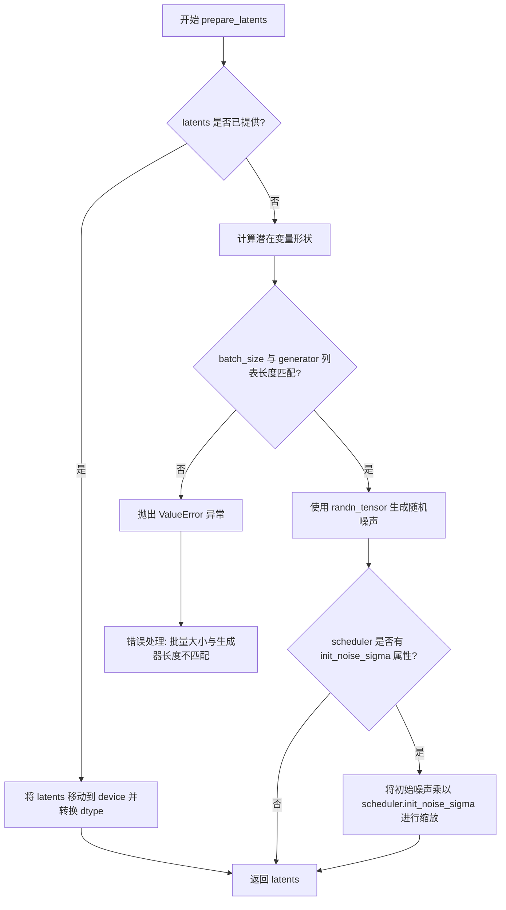

#### 带注释源码

```python
def prepare_latents(
    self, batch_size, num_channels_latents, num_frames, height, width, dtype, device, generator, latents=None
):
    """
    准备视频生成的初始潜在变量。
    
    参数:
        batch_size: 批量大小
        num_channels_latents: 潜在变量通道数
        num_frames: 视频帧数
        height: 图像高度
        width: 图像宽度
        dtype: 数据类型
        device: 设备
        generator: 随机数生成器
        latents: 可选的预定义潜在变量
    """
    # 如果已经提供了 latents，直接返回转换后的版本
    if latents is not None:
        return latents.to(device=device, dtype=dtype)

    # 计算潜在变量的形状，考虑 VAE 的时空压缩比
    # temporal_len 通过 (num_frames - 1) // temporal_compression_ratio + 1 计算
    # spatial 维度通过 // spatial_compression_ratio 压缩
    shape = (
        batch_size,
        num_channels_latents,
        (num_frames - 1) // self.vae_temporal_compression_ratio + 1,
        height // self.vae_spatial_compression_ratio,
        width // self.vae_spatial_compression_ratio,
    )

    # 检查 generator 列表长度是否与 batch_size 匹配
    if isinstance(generator, list) and len(generator) != batch_size:
        raise ValueError(
            f"You have passed a list of generators of length {len(generator)}, but requested an effective batch"
            f" size of {batch_size}. Make sure the batch size matches the length of the generators."
        )

    # 使用 randn_tensor 生成标准正态分布的随机噪声作为初始潜在变量
    latents = randn_tensor(shape, generator=generator, device=device, dtype=dtype)
    
    # 根据调度器的要求缩放初始噪声
    # FlowMatchEulerDiscreteScheduler 等调度器需要特定的噪声初始化标准差
    if hasattr(self.scheduler, "init_noise_sigma"):
        latents = latents * self.scheduler.init_noise_sigma
    
    return latents
```


### `EasyAnimateControlPipeline.prepare_control_latents`

该方法负责将控制视频（control）和控制图像（control_image）编码为潜在表示（latents），以便与主生成流程的潜在变量进行拼接。它使用VAE编码器将像素空间的控制信息转换为 latent 空间的特征，并根据配置应用缩放因子。

参数：

- `self`：`EasyAnimateControlPipeline` 实例自身，包含 VAE 模型等组件。
- `control`：`torch.Tensor | None`，输入的控制视频张量，形状为 (F, C, H, W)，需编码为 latent 形式。
- `control_image`：`torch.Tensor | None`，输入的控制图像张量，用于图像条件控制。
- `batch_size`：`int`，批处理大小，用于验证和维度推断。
- `height`：`int`，目标视频/图像高度（像素空间）。
- `width`：`int`，目标视频/图像宽度（像素空间）。
- `dtype`：`torch.dtype`，目标数据类型（如 bfloat16），用于设备转换。
- `device`：`torch.device`，目标计算设备（如 cuda）。
- `generator`：`torch.Generator | None`，随机数生成器，用于潜在变量采样（当前代码中未直接使用，但保留接口）。
- `do_classifier_free_guidance`：`bool`，是否启用无分类器引导（当前逻辑中未直接使用，但可能影响后续调用处的处理）。

返回值：`tuple[torch.Tensor | None, torch.Tensor | None]`，返回一个元组：
- 第一个元素：`control` 或 `None`，编码后的控制视频 latent。
- 第二个元素：`control_image_latents` 或 `None`，编码后的控制图像 latent。

#### 流程图

```mermaid
flowchart TD
    A[开始 prepare_control_latents] --> B{control is not None?}
    B -- Yes --> C[将 control 移至 device 和 dtype]
    C --> D[初始化空列表 new_control]
    D --> E[按 batch_size=1 遍历 control]
    E --> F[使用 VAE.encode 编码当前帧]
    F --> G[提取 mode 获取确定性 latent]
    G --> H[添加到 new_control]
    H --> I{遍历完成?}
    I -- No --> E
    I -- Yes --> J[沿 dim=0 拼接所有帧 latent]
    J --> K[乘以 scaling_factor 缩放]
    B -- No --> L{control_image is not None?}
    
    L -- Yes --> M[将 control_image 移至 device 和 dtype]
    M --> N[初始化空列表 new_control_pixel_values]
    N --> O[按 batch_size=1 遍历 control_image]
    O --> P[使用 VAE.encode 编码当前图像]
    P --> Q[提取 mode 获取确定性 latent]
    Q --> R[添加到 new_control_pixel_values]
    R --> S{遍历完成?}
    S -- No --> O
    S -- Yes --> T[沿 dim=0 拼接所有 latent]
    T --> U[乘以 scaling_factor 缩放得到 control_image_latents]
    L -- No --> V[control_image_latents = None]
    
    K --> W[返回 (control, control_image_latents)]
    U --> W
    V --> W
```

#### 带注释源码

```python
def prepare_control_latents(
    self, control, control_image, batch_size, height, width, dtype, device, generator, do_classifier_free_guidance
):
    # 将控制变量调整到与 latents 相同的形状，因为我们会将 control 拼接到 latents 上
    # 我们在转换为 dtype 之前执行此操作，以避免在使用 cpu_offload 和半精度时出现问题
    
    if control is not None:
        # 1. 将控制视频张量移动到目标设备和数据类型
        control = control.to(device=device, dtype=dtype)
        
        bs = 1  # 设定批次大小为1，分批处理以避免显存溢出
        new_control = []
        
        # 2. 遍历控制视频的每一帧（或每个片段）
        for i in range(0, control.shape[0], bs):
            control_bs = control[i : i + bs]  # 取出一帧
            
            # 3. 使用 VAE 编码器将像素空间转换为 latent 空间
            # encode 返回一个 Output 对象，[0] 提取 latent
            control_bs = self.vae.encode(control_bs)[0]
            
            # 4. .mode() 提取分布的均值/最可能值，获取确定性表示
            control_bs = control_bs.mode()
            
            new_control.append(control_bs)
        
        # 5. 沿时间维度（dim=0）拼接所有帧的 latent
        control = torch.cat(new_control, dim=0)
        
        # 6. 应用 VAE 缩放因子，确保 latent 分布与训练时一致
        control = control * self.vae.config.scaling_factor

    # 处理控制图像（用于图像到图像的控制或参考图像）
    if control_image is not None:
        # 1. 移动到设备和 dtype
        control_image = control_image.to(device=device, dtype=dtype)
        
        bs = 1
        new_control_pixel_values = []
        
        # 2. 分批编码
        for i in range(0, control_image.shape[0], bs):
            control_pixel_values_bs = control_image[i : i + bs]
            
            # 3. VAE 编码
            control_pixel_values_bs = self.vae.encode(control_pixel_values_bs)[0]
            control_pixel_values_bs = control_pixel_values_bs.mode()
            
            new_control_pixel_values.append(control_pixel_values_bs)
        
        # 4. 拼接并缩放
        control_image_latents = torch.cat(new_control_pixel_values, dim=0)
        control_image_latents = control_image_latents * self.vae.config.scaling_factor
    else:
        control_image_latents = None

    # 返回编码后的 control latent 和 control_image latent
    return control, control_image_latents
```


### `EasyAnimateControlPipeline.guidance_scale`

该属性用于获取分类器自由引导（Classifier-Free Guidance）的缩放因子，用于控制生成内容与文本提示的对齐程度。

参数：无

返回值：`float`，返回分类器自由引导的缩放因子

#### 流程图

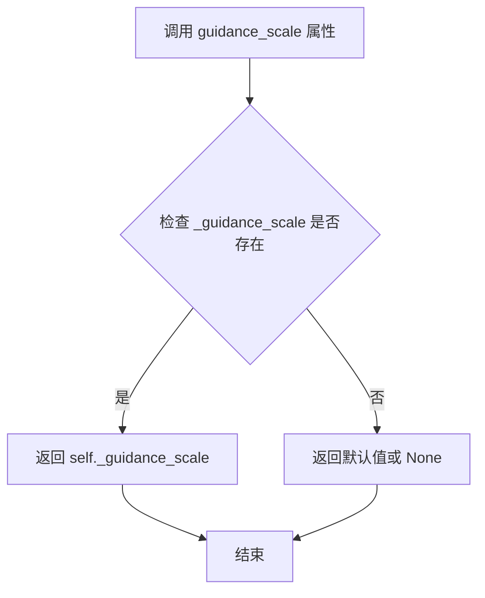

#### 带注释源码

```python
@property
def guidance_scale(self):
    """
    获取分类器自由引导（Classifier-Free Guidance）的缩放因子。
    
    该属性返回在 pipeline 调用时设置的内部变量 _guidance_scale。
    guidance_scale 控制文本提示对生成内容的引导强度，值越大表示
    生成结果越贴近文本描述。值为 1.0 时相当于不使用引导（ classifier-free）。
    
    对应关系参考 Imagen 论文中的方程 (2)：
    https://huggingface.co/papers/2205.11487
    
    返回:
        float: 分类器自由引导的缩放因子，通常在 1.0 到 10.0 之间
    """
    return self._guidance_scale
```


### `EasyAnimateControlPipeline.guidance_rescale`

该属性用于获取引导_rescale参数的值，该参数用于调整噪声预测的缩放因子，以改善图像质量并修复过度曝光问题，基于Section 3.4 from Common Diffusion Noise Schedules and Sample Steps are Flawed论文。

参数： 无（属性访问器不接受参数）

返回值：`float`，返回引导_rescale缩放因子，用于在分类器自由引导过程中调整噪声预测。

#### 流程图

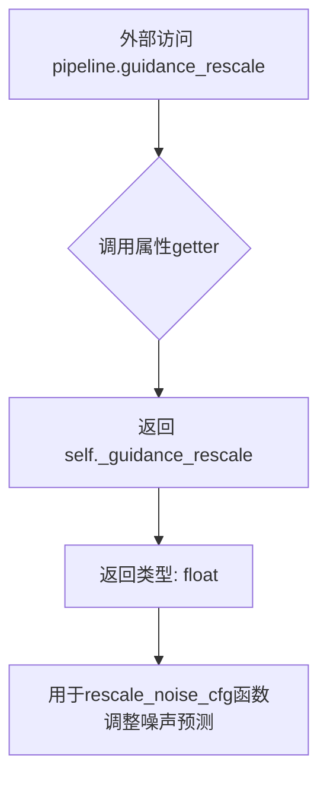

#### 带注释源码

```python
@property
def guidance_rescale(self):
    """
    属性 getter: 获取引导_rescale值
    
    该属性返回在去噪过程中用于重新缩放噪声预测的缩放因子。
    guidance_rescale 参数用于解决过度曝光问题，并避免生成过于平淡的图像。
    基于论文: Common Diffusion Noise Schedules and Sample Steps are Flawed (Section 3.4)
    
    返回值:
        float: 引导重新缩放因子，值越大生成的图像对比度越高
    """
    return self._guidance_rescale
```


### `EasyAnimateControlPipeline.do_classifier_free_guidance`

判断是否执行分类器自由引导（Classifier-Free Guidance，CFG）。当引导比例 `guidance_scale` 大于 1 时，返回 True，表示在去噪过程中需要执行无分类器引导计算；否则返回 False，表示不使用引导。

参数：

- （无参数，这是属性而非方法）

返回值：`bool`，返回是否执行分类器自由引导。当 `self._guidance_scale > 1` 时返回 `True`，否则返回 `False`。

#### 流程图

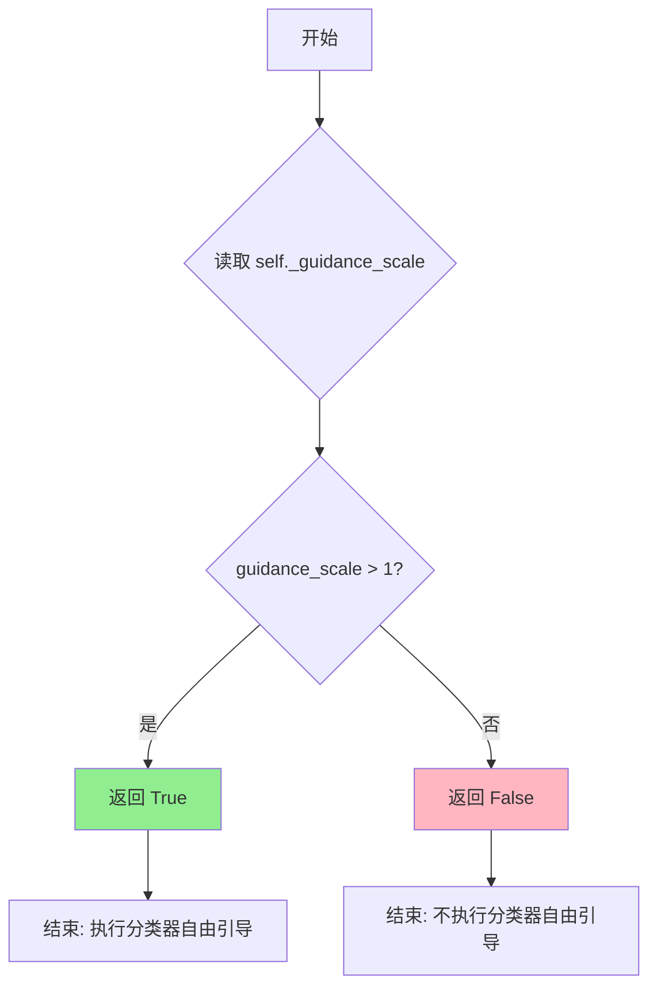

#### 带注释源码

```python
@property
def do_classifier_free_guidance(self):
    """
    判断是否执行分类器自由引导（Classifier-Free Guidance, CFG）。
    
    该属性基于 guidance_scale 参数决定是否在扩散模型的推理过程中
    应用无分类器引导技术。CFG 通过在每一步去噪过程中结合条件预测
    和无条件预测来提高生成质量。
    
    实现原理：
    - 当 guidance_scale > 1 时，模型会同时预测无条件噪声和条件噪声
    - 最终噪声预测 = 无条件预测 + guidance_scale * (条件预测 - 无条件预测)
    - 这种方式可以在不训练额外分类器的情况下引导生成方向
    
    返回值：
        bool: True 表示执行 CFG，False 表示不执行
    
    关联属性：
        self._guidance_scale: 引导比例参数，由 __call__ 方法设置
        self._guidance_rescale: 用于进一步调整噪声预测的可选参数
    
    使用场景：
        - 在 __call__ 方法中用于决定是否拼接负面提示词嵌入
        - 在去噪循环中用于决定是否对潜在变量进行扩展
        - 在噪声预测时用于执行引导计算
    """
    return self._guidance_scale > 1
```


### `EasyAnimateControlPipeline.num_timesteps`

该属性用于获取扩散管道执行过程中的时间步总数。在 `__call__` 方法中，通过 `self._num_timesteps = len(timesteps)` 设置该值，反映了推理时使用的时间步调度器生成的时间步数量。

参数： 无

返回值： `int`，返回扩散模型推理过程中的时间步总数，即去噪循环的执行次数。

#### 流程图

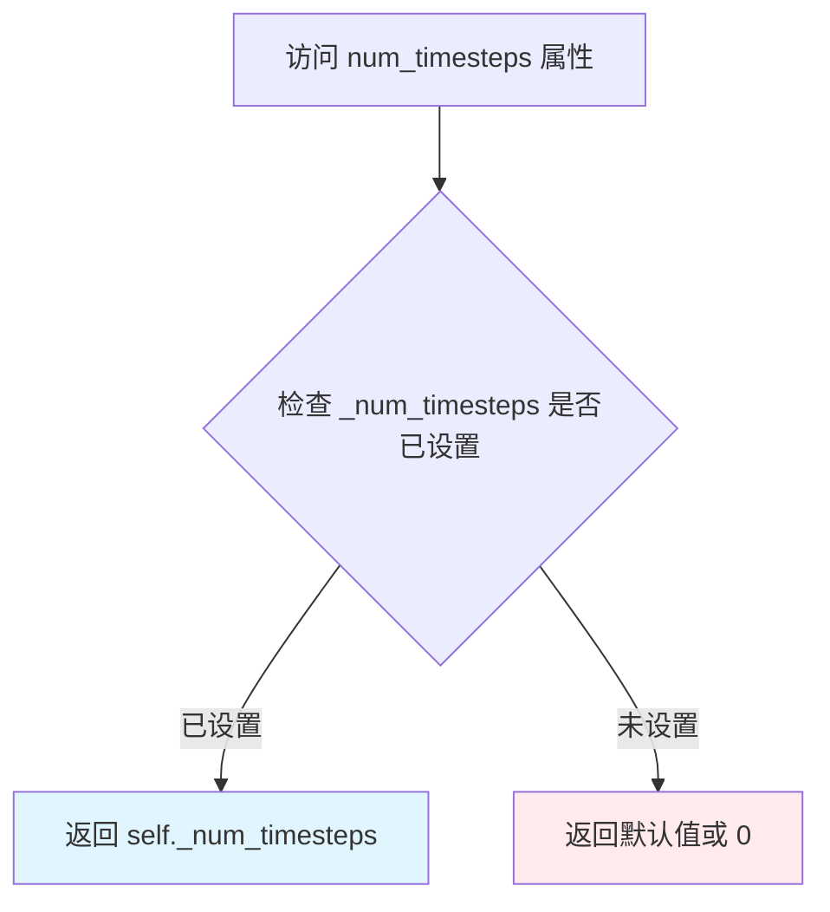

#### 带注释源码

```python
@property
def num_timesteps(self):
    """
    属性：获取时间步数
    
    该属性返回扩散管道在推理过程中使用的时间步总数。
    该值在 __call__ 方法中被设置为 len(timesteps)，反映了
    调度器生成的时间步数量。
    
    返回:
        int: 推理过程中的时间步总数
    """
    return self._num_timesteps
```


### `EasyAnimateControlPipeline.interrupt`

该属性用于获取当前 EasyAnimate 控制管道的中断状态。它返回一个布尔值，用于在去噪循环中判断是否需要立即终止当前的视频生成过程。

参数：

- （无参数，该属性为只读访问器）

返回值：`bool`，返回 `self._interrupt` 的当前值。如果为 `True`，表示外部已发出终止请求，循环将跳过当前步骤；如果为 `False`，表示继续执行。

#### 流程图

```mermaid
flowchart TD
    A[外部调用 pipe.interrupt] --> B{读取实例变量 self._interrupt}
    B -->|True| C[返回 True: 已中断]
    B -->|False| D[返回 False: 继续执行]
    
    subgraph 内部调用上下文
    E[__call__ 方法: for i, t in enumerate(timesteps)] --> F{检查 self.interrupt}
    F -->|True| G[continue 跳过当前步]
    F -->|False| H[继续处理]
    end
```

#### 带注释源码

```python
@property
def interrupt(self):
    """
    获取中断状态属性。
    
    该属性允许外部调用者查询管道是否被请求中断。
    在 __call__ 方法的去噪循环中，会频繁检查此属性以实现优雅停止。
    
    返回:
        bool: 如果为 True，表示生成过程应被中断；否则继续。
    """
    return self._interrupt
```

#### 补充说明

*   **设计目标**：实现一种非阻塞式的生成中断机制。不同于强制杀死进程，这种方式允许模型在当前批次（batch）或步骤（step）完成后检查标志位，从而避免资源泄露或状态不一致。
*   **状态初始化**：在 `__call__` 方法的开始部分，会通过 `self._interrupt = False` 进行初始化。
*   **潜在优化**：
    *   **缺少 Setter**：当前代码中只提供了 Getter（`@property`），未定义 Setter（`@interrupt.setter`）。通常需要配合 `pipe.interrupt = True` 使用，因此建议在类中添加 Setter 以完善控制流接口。
    *   **线程安全**：如果在多线程环境下使用 `_interrupt`，建议使用线程锁（threading.Lock）来保证读写的原子性，避免读到中间状态。


### `EasyAnimateControlPipeline.__call__`

主调用方法，执行基于控制视频的视频生成。该方法接受文本提示、控制视频、参考图像等输入，通过去噪循环生成视频帧。

参数：

- `prompt`：`str | list[str] | None`，用于引导图像或视频生成的文本提示。如果未提供，请使用 `prompt_embeds`
- `num_frames`：`int | None`，生成视频的帧数（默认 49）
- `height`：`int | None`，生成图像的高度（像素，默认 512）
- `width`：`int | None`，生成图像的宽度（像素，默认 512）
- `control_video`：`torch.FloatTensor | None`，控制视频，用于指导视频生成
- `control_camera_video`：`torch.FloatTensor | None`，控制摄像机视频，用于相机运动控制
- `ref_image`：`torch.FloatTensor | None`，参考图像，用于风格或内容参考
- `num_inference_steps`：`int | None`，去噪步骤数（默认 50），更多步骤通常产生更高质量的图像
- `guidance_scale`：`float | None`，引导比例（默认 5.0），鼓励模型与提示对齐
- `negative_prompt`：`str | list[str] | None`，负面提示，表示生成时要排除的内容
- `num_images_per_prompt`：`int | None`，每个提示生成的图像数量（默认 1）
- `eta`：`float | None`，DDIM 调度器参数（默认 0.0）
- `generator`：`torch.Generator | list[torch.Generator] | None`，随机生成器，确保可重复性
- `latents`：`torch.Tensor | None`，预定义的潜在张量，用于条件生成
- `prompt_embeds`：`torch.Tensor | None`，提示的文本嵌入，覆盖提示字符串输入
- `negative_prompt_embeds`：`torch.Tensor | None`，负面提示的嵌入
- `prompt_attention_mask`：`torch.Tensor | None`，主要提示嵌入的注意力掩码
- `negative_prompt_attention_mask`：`torch.Tensor | None`，负面提示嵌入的注意力掩码
- `output_type`：`str | None`，输出格式，"pil" 或 "latent"（默认 "pil"）
- `return_dict`：`bool`，是否返回结构化输出（默认 True）
- `callback_on_step_end`：`Callable | PipelineCallback | MultiPipelineCallbacks | None`，每个去噪步骤结束时调用的函数
- `callback_on_step_end_tensor_inputs`：`list[str]`，回调函数中包含的张量名称（默认 ["latents"]）
- `guidance_rescale`：`float`，根据引导比例调整噪声水平（默认 0.0）
- `timesteps`：`list[int] | None`，自定义时间步

返回值：`EasyAnimatePipelineOutput` 或 `tuple`，包含生成的视频帧列表

#### 流程图

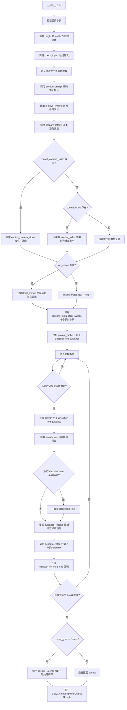

#### 带注释源码

```python
@torch.no_grad()
@replace_example_docstring(EXAMPLE_DOC_STRING)
def __call__(
    self,
    prompt: str | list[str] = None,
    num_frames: int | None = 49,
    height: int | None = 512,
    width: int | None = 512,
    control_video: torch.FloatTensor = None,
    control_camera_video: torch.FloatTensor = None,
    ref_image: torch.FloatTensor = None,
    num_inference_steps: int | None = 50,
    guidance_scale: float | None = 5.0,
    negative_prompt: str | list[str] | None = None,
    num_images_per_prompt: int | None = 1,
    eta: float | None = 0.0,
    generator: torch.Generator | list[torch.Generator] | None = None,
    latents: torch.Tensor | None = None,
    prompt_embeds: torch.Tensor | None = None,
    negative_prompt_embeds: torch.Tensor | None = None,
    prompt_attention_mask: torch.Tensor | None = None,
    negative_prompt_attention_mask: torch.Tensor | None = None,
    output_type: str | None = "pil",
    return_dict: bool = True,
    callback_on_step_end: Callable[[int, int], None] | PipelineCallback | MultiPipelineCallbacks | None = None,
    callback_on_step_end_tensor_inputs: list[str] = ["latents"],
    guidance_rescale: float = 0.0,
    timesteps: list[int] | None = None,
):
    """
    Generates images or video using the EasyAnimate pipeline based on the provided prompts.
    """
    # 1. 处理回调参数设置
    if isinstance(callback_on_step_end, (PipelineCallback, MultiPipelineCallbacks)):
        callback_on_step_end_tensor_inputs = callback_on_step_end.tensor_inputs

    # 2. 默认高度和宽度调整为16的倍数
    height = int((height // 16) * 16)
    width = int((width // 16) * 16)

    # 3. 验证输入参数
    self.check_inputs(
        prompt, height, width, negative_prompt, prompt_embeds, negative_prompt_embeds,
        prompt_attention_mask, negative_prompt_attention_mask, callback_on_step_end_tensor_inputs
    )
    # 设置引导参数
    self._guidance_scale = guidance_scale
    self._guidance_rescale = guidance_rescale
    self._interrupt = False

    # 4. 确定批次大小
    if prompt is not None and isinstance(prompt, str):
        batch_size = 1
    elif prompt is not None and isinstance(prompt, list):
        batch_size = len(prompt)
    else:
        batch_size = prompt_embeds.shape[0]

    # 获取执行设备和数据类型
    device = self._execution_device
    dtype = self.text_encoder.dtype if self.text_encoder is not None else self.transformer.dtype

    # 5. 编码输入提示
    (
        prompt_embeds, negative_prompt_embeds, prompt_attention_mask, negative_prompt_attention_mask
    ) = self.encode_prompt(
        prompt=prompt, device=device, dtype=dtype, num_images_per_prompt=num_images_per_prompt,
        do_classifier_free_guidance=self.do_classifier_free_guidance, negative_prompt=negative_prompt,
        prompt_embeds=prompt_embeds, negative_prompt_embeds=negative_prompt_embeds,
        prompt_attention_mask=prompt_attention_mask, negative_prompt_attention_mask=negative_prompt_attention_mask,
        text_encoder_index=0,
    )

    # 6. 准备时间步
    timestep_device = "cpu" if XLA_AVAILABLE else device
    if isinstance(self.scheduler, FlowMatchEulerDiscreteScheduler):
        timesteps, num_inference_steps = retrieve_timesteps(
            self.scheduler, num_inference_steps, timestep_device, timesteps, mu=1
        )
    else:
        timesteps, num_inference_steps = retrieve_timesteps(
            self.scheduler, num_inference_steps, timestep_device, timesteps
        )
    timesteps = self.scheduler.timesteps

    # 7. 准备潜在变量
    num_channels_latents = self.vae.config.latent_channels
    latents = self.prepare_latents(
        batch_size * num_images_per_prompt, num_channels_latents, num_frames, height, width,
        dtype, device, generator, latents
    )

    # 8. 处理控制视频
    if control_camera_video is not None:
        # 调整相机控制视频大小并处理
        control_video_latents = resize_mask(control_camera_video, latents, process_first_frame_only=True)
        control_video_latents = control_video_latents * 6
        control_latents = (
            torch.cat([control_video_latents] * 2) if self.do_classifier_free_guidance else control_video_latents
        ).to(device, dtype)
    elif control_video is not None:
        # 预处理控制视频并编码为潜在表示
        batch_size, channels, num_frames, height_video, width_video = control_video.shape
        control_video = self.image_processor.preprocess(
            control_video.permute(0, 2, 1, 3, 4).reshape(batch_size * num_frames, channels, height_video, width_video),
            height=height, width=width,
        )
        control_video = control_video.to(dtype=torch.float32)
        control_video = control_video.reshape(batch_size, num_frames, channels, height, width).permute(0, 2, 1, 3, 4)
        control_video_latents = self.prepare_control_latents(
            None, control_video, batch_size, height, width, dtype, device, generator,
            self.do_classifier_free_guidance
        )[1]
        control_latents = (
            torch.cat([control_video_latents] * 2) if self.do_classifier_free_guidance else control_video_latents
        ).to(device, dtype)
    else:
        # 无控制视频时创建零张量
        control_video_latents = torch.zeros_like(latents).to(device, dtype)
        control_latents = (
            torch.cat([control_video_latents] * 2) if self.do_classifier_free_guidance else control_video_latents
        ).to(device, dtype)

    # 9. 处理参考图像
    if ref_image is not None:
        # 预处理参考图像并编码为潜在表示
        batch_size, channels, num_frames, height_video, width_video = ref_image.shape
        ref_image = self.image_processor.preprocess(
            ref_image.permute(0, 2, 1, 3, 4).reshape(batch_size * num_frames, channels, height_video, width_video),
            height=height, width=width,
        )
        ref_image = ref_image.to(dtype=torch.float32)
        ref_image = ref_image.reshape(batch_size, num_frames, channels, height, width).permute(0, 2, 1, 3, 4)

        ref_image_latents = self.prepare_control_latents(
            None, ref_image, batch_size, height, width, prompt_embeds.dtype, device, generator,
            self.do_classifier_free_guidance
        )[1]

        # 构造参考图像潜在变量
        ref_image_latents_conv_in = torch.zeros_like(latents)
        if latents.size()[2] != 1:
            ref_image_latents_conv_in[:, :, :1] = ref_image_latents
        ref_image_latents_conv_in = (
            torch.cat([ref_image_latents_conv_in] * 2) if self.do_classifier_free_guidance else ref_image_latents_conv_in
        ).to(device, dtype)
        control_latents = torch.cat([control_latents, ref_image_latents_conv_in], dim=1)
    else:
        # 无参考图像时创建零张量
        ref_image_latents_conv_in = torch.zeros_like(latents)
        ref_image_latents_conv_in = (
            torch.cat([ref_image_latents_conv_in] * 2) if self.do_classifier_free_guidance else ref_image_latents_conv_in
        ).to(device, dtype)
        control_latents = torch.cat([control_latents, ref_image_latents_conv_in], dim=1)

    # 10. 准备额外步骤参数
    extra_step_kwargs = self.prepare_extra_step_kwargs(generator, eta)

    # 11. 拼接提示嵌入用于 classifier-free guidance
    if self.do_classifier_free_guidance:
        prompt_embeds = torch.cat([negative_prompt_embeds, prompt_embeds])
        prompt_attention_mask = torch.cat([negative_prompt_attention_mask, prompt_attention_mask])

    # 移动到设备
    prompt_embeds = prompt_embeds.to(device=device)
    prompt_attention_mask = prompt_attention_mask.to(device=device)

    # 12. 去噪循环
    num_warmup_steps = len(timesteps) - num_inference_steps * self.scheduler.order
    self._num_timesteps = len(timesteps)
    with self.progress_bar(total=num_inference_steps) as progress_bar:
        for i, t in enumerate(timesteps):
            if self.interrupt:
                continue

            # 扩展潜在变量用于 classifier-free guidance
            latent_model_input = torch.cat([latents] * 2) if self.do_classifier_free_guidance else latents
            if hasattr(self.scheduler, "scale_model_input"):
                latent_model_input = self.scheduler.scale_model_input(latent_model_input, t)

            # 扩展标量 t 以匹配 latent_model_input 的第一维
            t_expand = torch.tensor([t] * latent_model_input.shape[0], device=device).to(
                dtype=latent_model_input.dtype
            )
            
            # 预测噪声残差
            noise_pred = self.transformer(
                latent_model_input, t_expand, encoder_hidden_states=prompt_embeds,
                control_latents=control_latents, return_dict=False
            )[0]
            
            # 处理通道数不匹配
            if noise_pred.size()[1] != self.vae.config.latent_channels:
                noise_pred, _ = noise_pred.chunk(2, dim=1)

            # 执行引导
            if self.do_classifier_free_guidance:
                noise_pred_uncond, noise_pred_text = noise_pred.chunk(2)
                noise_pred = noise_pred_uncond + guidance_scale * (noise_pred_text - noise_pred_uncond)

            # 根据 guidance_rescale 重新缩放噪声预测
            if self.do_classifier_free_guidance and guidance_rescale > 0.0:
                noise_pred = rescale_noise_cfg(noise_pred, noise_pred_text, guidance_rescale=guidance_rescale)

            # 计算上一步的 latents
            latents = self.scheduler.step(noise_pred, t, latents, **extra_step_kwargs, return_dict=False)[0]

            # 处理回调
            if callback_on_step_end is not None:
                callback_kwargs = {k: locals()[k] for k in callback_on_step_end_tensor_inputs}
                callback_outputs = callback_on_step_end(self, i, t, callback_kwargs)
                latents = callback_outputs.pop("latents", latents)
                prompt_embeds = callback_outputs.pop("prompt_embeds", prompt_embeds)
                negative_prompt_embeds = callback_outputs.pop("negative_prompt_embeds", negative_prompt_embeds)

            # 更新进度条
            if i == len(timesteps) - 1 or ((i + 1) > num_warmup_steps and (i + 1) % self.scheduler.order == 0):
                progress_bar.update()

            # XLA 设备处理
            if XLA_AVAILABLE:
                xm.mark_step()

    # 13. 解码潜在变量为视频
    if not output_type == "latent":
        video = self.decode_latents(latents)
        video = self.video_processor.postprocess_video(video=video, output_type=output_type)
    else:
        video = latents

    # 14. 释放模型
    self.maybe_free_model_hooks()

    # 15. 返回结果
    if not return_dict:
        return (video,)

    return EasyAnimatePipelineOutput(frames=video)
```

## 关键组件


### 张量索引与惰性加载

在 `get_video_to_video_latent` 函数中，通过切片操作 `input_video = torch.stack(input_video)[:num_frames]` 实现视频帧的索引和截取，使用 `torch.tile` 进行掩码维度调整，实现惰性加载式的张量处理。

### 反量化支持

在 `prepare_control_latents` 方法中，通过 `self.vae.encode(control_bs)[0]` 将控制视频编码到潜在空间，并使用 `.mode()` 方法获取潜在表示，然后乘以 `self.vae.config.scaling_factor` 进行反量化处理，实现从像素空间到潜在空间的转换。

### 量化策略

在 `encode_prompt` 和 `__call__` 方法中，通过 `dtype = dtype or self.text_encoder.dtype` 和 `prompt_embeds = prompt_embeds.to(dtype=dtype, device=device)` 实现动态 dtype 选择，使用 `randn_tensor` 生成随机潜在变量并通过 `self.scheduler.init_noise_sigma` 进行噪声缩放，实现量化模型的推理策略。

### 视频帧预处理

`preprocess_image` 函数支持多种输入格式（PIL.Image、numpy.ndarray、torch.Tensor），通过 `torch.nn.functional.interpolate` 或 PIL resize 进行尺寸调整，并统一转换为 CHW 格式的浮点张量，实现跨格式的视频帧标准化处理。

### 控制信号处理

在 `__call__` 方法中，通过 `prepare_control_latents` 处理 `control_video` 和 `control_camera_video`，使用 VAE 编码器将控制视频转换为潜在表示，并与主潜在变量拼接实现控制信号的注入。

### 引导噪声重缩放

`rescale_noise_cfg` 函数基于 Classifier-Free Guidance 的噪声预测进行重缩放，通过计算文本和 cfg 噪声的标准差比率，实现 Section 3.4 中描述的过曝修复和图像质量提升。

### 时间步检索与调度

`retrieve_timesteps` 函数封装了调度器的 `set_timesteps` 方法，支持自定义 timesteps 或 sigmas，并返回调度后的时间步序列，实现灵活的噪声调度策略。


## 问题及建议


### 已知问题

- **未使用的导入和函数**：导入了`BertModel`和`BertTokenizer`但未使用；`get_resize_crop_region_for_grid`、`rescale_noise_cfg`和`resize_mask`函数定义后未被调用，造成代码冗余。
- **参数未使用**：在`encode_prompt`调用时传入了`text_encoder_index=0`参数，但该参数在函数签名中不存在，会导致运行时错误。
- **`__call__`方法过长**：主生成方法包含超过300行代码，混合了输入验证、编码、调度器设置、去噪循环等多个职责，缺乏单一职责原则。
- **硬编码值缺乏解释**：多处使用魔法数字如`6`（control_video_latents缩放因子）、`240`（mask阈值）、`256`（max_sequence_length），缺乏常量定义或注释说明。
- **重复代码**：在`encode_prompt`中处理prompt和negative_prompt的逻辑几乎完全重复；`prepare_control_latents`被调用两次，代码结构相似。
- **错误处理不足**：`prepare_latents`中当`generator`为列表但长度不匹配时仅抛出异常，而`generator`为`None`时的处理逻辑也较为简单。
- **类型提示不完整**：部分变量缺少类型注解，如`callback_on_step_end`的联合类型定义过长，可使用TypeAlias简化。

### 优化建议

- **清理未使用的代码**：删除未使用的导入（`BertModel`、`BertTokenizer`）和未调用的函数（`get_resize_crop_region_for_grid`、`rescale_noise_cfg`、`resize_mask`），或将其移至其他模块备用。
- **提取子方法**：将`__call__`方法中的逻辑拆分为独立方法，如`prepare_control_latents_for_video`、`prepare_ref_image_latents`、`prepare_prompt_embeds`等，提高可读性和可测试性。
- **消除参数错误**：移除`encode_prompt`调用中的`text_encoder_index=0`参数，或在函数签名中添加该参数。
- **定义常量类**：创建`PipelineConstants`类集中管理硬编码值（如缩放因子、阈值、默认序列长度），提高可维护性。
- **提取重复逻辑**：将`encode_prompt`中处理prompt和negative_prompt的公共逻辑提取为私有方法如`_encode_single_prompt`。
- **增强错误处理**：在`prepare_latents`中添加对`generator`为`None`情况的明确处理逻辑，并在`check_inputs`中增加更多边界情况验证。
- **完善类型注解**：为所有公共方法和关键变量添加完整的类型注解，使用`TypeAlias`简化复杂类型定义。
- **添加单元测试**：针对核心方法（`preprocess_image`、`get_video_to_video_latent`、`prepare_latents`等）补充单元测试，确保边界情况正确处理。

## 其它


### 设计目标与约束

本管道旨在实现基于文本提示的视频生成功能，支持控制视频（control video）和参考图像（ref image）作为条件输入，生成符合语义描述的视频内容。核心约束包括：输入高度和宽度必须能被16整除；支持分类器自由引导（CFG）以提升生成质量；依赖FlowMatchEulerDiscreteScheduler进行去噪调度；兼容Qwen2-VL和BERT两种文本编码器。

### 错误处理与异常设计

管道在多个关键点进行输入验证：`check_inputs`方法检查尺寸约束、回调张量输入合法性、prompt与prompt_embeds互斥关系、注意力掩码与嵌入的配对要求。`retrieve_timesteps`函数验证调度器是否支持自定义timesteps或sigmas。`preprocess_image`函数对不支持的输入类型抛出ValueError。`get_video_to_video_latent`函数对无效输入返回None值。主要异常类型包括ValueError（参数校验失败）和潜在的张量设备/类型不匹配错误。

### 数据流与状态机

管道执行流程分为以下阶段：1)输入验证与参数规范化；2)文本提示编码生成prompt_embeds；3)时间步调度器初始化；4)潜在变量初始化；5)控制视频和参考图像的潜在空间编码；6)去噪循环（迭代预测噪声、执行CFguidance、调度器步进）；7)潜在变量解码为视频帧。状态转移由`self._guidance_scale`、`self._guidance_rescale`、`self._num_timesteps`、`self._interrupt`等属性控制。

### 外部依赖与接口契约

核心依赖包括：transformers库提供的BertModel/BertTokenizer和Qwen2VLForConditionalGeneration/Qwen2Tokenizer；diffusers库的DiffusionPipeline基类、FlowMatchEulerDiscreteScheduler调度器、VAE和Transformer模型；PIL/numpy用于图像处理；torch用于张量运算。管道通过`from_pretrained`方法接受预训练模型权重，输出格式支持"pil"图像或"latent"潜在表示。

### 性能考量

管道支持XLA设备加速（`is_torch_xla_available`）；文本编码和VAE编码采用批处理优化；去噪循环支持进度条显示；提供模型卸载钩子（`maybe_free_model_hooks`）释放显存；支持模型CPU offload（通过`model_cpu_offload_seq`定义卸载顺序）。潜在变量按VAE压缩比（空间8倍，时间4倍）生成以减少计算量。

### 并发与异步处理

当前实现为同步执行模式，未使用异步API。去噪循环中支持XLA的`xm.mark_step()`进行图优化。回调机制`callback_on_step_end`允许用户在每步结束后执行自定义逻辑，但未提供独立的异步任务队列。

### 资源管理

管道通过`model_cpu_offload_seq`定义模型卸载序列（text_encoder→transformer→vae）；`maybe_free_model_hooks`在推理结束后释放模型权重；支持torch.Generator用于随机数生成以保证可复现性；XLA模式下timestep设备设为CPU以优化性能。

### 配置与参数

关键配置参数包括：guidance_scale（默认5.0）控制文本引导强度；num_inference_steps（默认50）控制去噪步数；height/width需被16整除；vae_spatial_compression_ratio和vae_temporal_compression_ratio从VAE配置读取；enable_text_attention_mask控制文本注意力掩码使用。

### 版本兼容性

代码依赖Python类型注解（typing模块的|Python 3.10+联合类型语法）；依赖transformers库提供的Qwen2-VL模型；调度器需支持FlowMatchEulerDiscreteScheduler接口；建议配合diffusers 0.20+版本使用以确保PipelineCallback等回调机制兼容。

### 安全性考虑

管道实现了NSFW（不适合工作场所内容）检测机制（通过negative_prompt_embeds）；对输入进行设备类型转换避免CPU/GPU混用错误；模型权重加载验证由transformers和diffusers框架处理。需注意用户输入的prompt可能包含恶意指令，已通过negative_prompt机制提供过滤能力。

### 测试考虑

应重点测试：1)不同尺寸输入的验证逻辑；2)prompt_embeds与prompt同时传入的冲突检测；3)CFguidance开启/关闭状态下的输出差异；4)control_video和ref_image的各种组合场景；5)XLA设备兼容性；6)回调函数的张量输入合法性；7)调度器自定义timesteps场景。

### 部署相关

管道可通过HuggingFace Hub的from_pretrained加载预训练模型；支持torch_dtype参数指定计算精度（bfloat16/float16）；建议在支持CUDA的GPU环境部署以获得合理推理速度；可通过调整num_inference_steps平衡质量与速度；输出视频帧可通过export_to_video导出为MP4格式。

    