# `diffusers\src\diffusers\pipelines\easyanimate\pipeline_easyanimate_inpaint.py` 详细设计文档

EasyAnimateInpaintPipeline是一个用于文本到视频生成和视频修复的扩散Pipeline，继承自DiffusionPipeline，支持基于文本提示生成视频内容，同时能够对输入视频进行区域修复和编辑。该Pipeline使用Qwen2-VL作为文本编码器，EasyAnimateTransformer3DModel作为生成模型，FlowMatchEulerDiscreteScheduler作为噪声调度器，并集成了VAE用于潜在空间与像素空间的相互转换。

## 整体流程

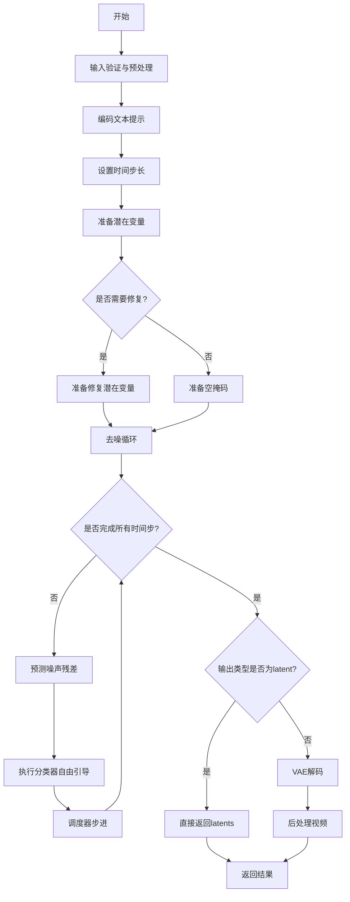

## 类结构

```
DiffusionPipeline (基类)
└── EasyAnimateInpaintPipeline
   ├── 依赖组件:
   │   ├── AutoencoderKLMagvit (VAE)
   │   ├── Qwen2VLForConditionalGeneration / BertModel (文本编码器)
   │   ├── Qwen2Tokenizer / BertTokenizer (分词器)
   │   ├── EasyAnimateTransformer3DModel (变换器)
   │   ├── FlowMatchEulerDiscreteScheduler (调度器)
   │   ├── VaeImageProcessor (图像处理器)
   │   ├── VideoProcessor (视频处理器)
   │   └── EasyAnimatePipelineOutput (输出类)
```

## 全局变量及字段


### `logger`
    
模块日志记录器

类型：`logging.Logger`
    


### `XLA_AVAILABLE`
    
PyTorch XLA是否可用

类型：`bool`
    


### `EXAMPLE_DOC_STRING`
    
示例文档字符串

类型：`str`
    


### `EasyAnimateInpaintPipeline.vae`
    
VAE模型，用于编码和解码视频

类型：`AutoencoderKLMagvit`
    


### `EasyAnimateInpaintPipeline.text_encoder`
    
文本编码器

类型：`Qwen2VLForConditionalGeneration|BertModel`
    


### `EasyAnimateInpaintPipeline.tokenizer`
    
分词器

类型：`Qwen2Tokenizer|BertTokenizer`
    


### `EasyAnimateInpaintPipeline.transformer`
    
主变换器模型

类型：`EasyAnimateTransformer3DModel`
    


### `EasyAnimateInpaintPipeline.scheduler`
    
噪声调度器

类型：`FlowMatchEulerDiscreteScheduler`
    


### `EasyAnimateInpaintPipeline.enable_text_attention_mask`
    
是否启用文本注意力掩码

类型：`bool`
    


### `EasyAnimateInpaintPipeline.vae_spatial_compression_ratio`
    
VAE空间压缩比

类型：`int`
    


### `EasyAnimateInpaintPipeline.vae_temporal_compression_ratio`
    
VAE时间压缩比

类型：`int`
    


### `EasyAnimateInpaintPipeline.image_processor`
    
图像预处理器

类型：`VaeImageProcessor`
    


### `EasyAnimateInpaintPipeline.mask_processor`
    
掩码处理器

类型：`VaeImageProcessor`
    


### `EasyAnimateInpaintPipeline.video_processor`
    
视频后处理器

类型：`VideoProcessor`
    


### `EasyAnimateInpaintPipeline._callback_tensor_inputs`
    
回调张量输入列表

类型：`list`
    


### `EasyAnimateInpaintPipeline.model_cpu_offload_seq`
    
模型CPU卸载顺序

类型：`str`
    


### `EasyAnimateInpaintPipeline._guidance_scale`
    
引导强度

类型：`float`
    


### `EasyAnimateInpaintPipeline._guidance_rescale`
    
引导重缩放因子

类型：`float`
    


### `EasyAnimateInpaintPipeline._num_timesteps`
    
时间步数量

类型：`int`
    


### `EasyAnimateInpaintPipeline._interrupt`
    
中断标志

类型：`bool`
    


### `EasyAnimatePipelineOutput.frames`
    
生成的视频帧

类型：`torch.Tensor`
    
    

## 全局函数及方法


### `preprocess_image`

该函数用于将输入的图像（PIL.Image、numpy.ndarray 或 torch.Tensor）调整大小并转换为标准化后的 PyTorch 张量格式，支持多种输入类型并统一输出为 CHW 格式的浮点张量。

参数：

- `image`：`torch.Tensor | np.ndarray | Image.Image`，输入图像，支持三种常见图像格式
- `sample_size`：`tuple[int, int]`，目标尺寸，格式为 (高度, 宽度)

返回值：`torch.Tensor`，返回调整大小并归一化后的图像张量，格式为 CHW，值范围 [0, 1]

#### 流程图

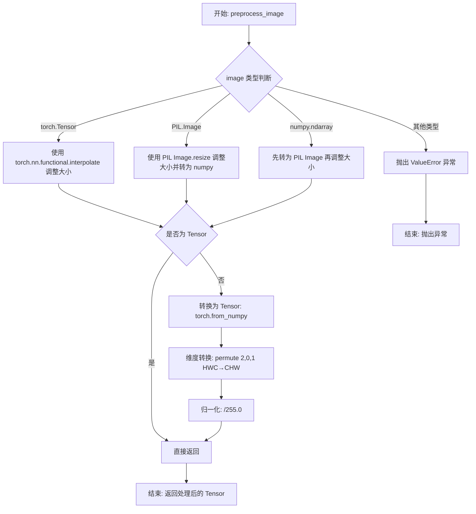

#### 带注释源码

```python
def preprocess_image(image, sample_size):
    """
    Preprocess a single image (PIL.Image, numpy.ndarray, or torch.Tensor) to a resized tensor.
    
    Args:
        image: Input image, can be PIL.Image, numpy.ndarray, or torch.Tensor
        sample_size: Target size as (height, width) tuple
    
    Returns:
        torch.Tensor: Resized and normalized image tensor in CHW format, range [0, 1]
    """
    # 检查输入是否为 PyTorch Tensor
    if isinstance(image, torch.Tensor):
        # 如果输入是张量，假设为 CHW 格式，使用插值进行尺寸调整
        # unsqueeze(0) 添加批次维度以满足 interpolate 的输入要求
        # squeeze(0) 在处理后移除批次维度恢复原始形状
        image = torch.nn.functional.interpolate(
            image.unsqueeze(0), size=sample_size, mode="bilinear", align_corners=False
        ).squeeze(0)
    # 检查输入是否为 PIL Image
    elif isinstance(image, Image.Image):
        # 先调整大小，注意 PIL.Image.resize 接受 (width, height) 顺序
        # 而 sample_size 是 (height, width)，所以需要 swap 顺序
        image = image.resize((sample_size[1], sample_size[0]))
        # 转换为 numpy 数组便于后续处理
        image = np.array(image)
    # 检查输入是否为 numpy array
    elif isinstance(image, np.ndarray):
        # 如果是 numpy 数组，先转为 PIL Image 再调整大小
        image = Image.fromarray(image).resize((sample_size[1], sample_size[0]))
        image = np.array(image)
    else:
        # 不支持的输入类型，抛出明确异常
        raise ValueError("Unsupported input type. Expected PIL.Image, numpy.ndarray, or torch.Tensor.")

    # 如果还不是 Tensor，则进行转换
    if not isinstance(image, torch.Tensor):
        # 将 numpy 数组转为 PyTorch Tensor
        # permute(2, 0, 1) 将 HWC 格式转换为 CHW 格式
        # 除以 255.0 将像素值归一化到 [0, 1] 范围
        image = torch.from_numpy(image).permute(2, 0, 1).float() / 255.0  # HWC -> CHW, normalize to [0, 1]

    return image
```


### `get_image_to_video_latent`

该函数用于将起始图像（和可选的结束图像）转换为视频的潜在表示（latent），生成输入视频张量和对应的掩码张量，供视频生成pipeline使用。函数支持多种输入格式（PIL.Image、numpy.ndarray、torch.Tensor）或图像列表。

参数：

- `validation_image_start`：`PIL.Image | np.ndarray | torch.Tensor | list`，起始图像或图像列表，用于生成视频的初始帧
- `validation_image_end`：`PIL.Image | np.ndarray | torch.Tensor | list | None`，结束图像或图像列表，用于生成视频的结束帧（可选）
- `num_frames`：`int`，要生成的视频总帧数
- `sample_size`：`tuple[int, int]`，目标样本尺寸，格式为 (height, width)

返回值：`tuple[torch.Tensor, torch.Tensor]`，返回包含两个张量的元组：
- `input_video`：输入视频张量，形状为 [1, 3, num_frames, height, width]，用于视频生成
- `input_video_mask`：输入视频掩码张量，形状为 [1, 1, num_frames, height, width]，值为 0（保留）或 255（需生成）

#### 流程图

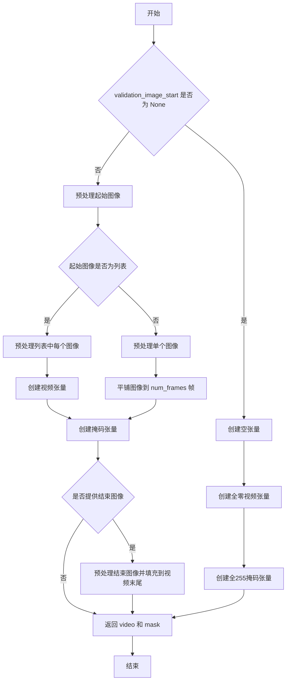

#### 带注释源码

```python
def get_image_to_video_latent(validation_image_start, validation_image_end, num_frames, sample_size):
    """
    Generate latent representations for video from start and end images. Inputs can be PIL.Image, numpy.ndarray, or
    torch.Tensor.
    """
    # 初始化返回值
    input_video = None
    input_video_mask = None

    # 如果提供了起始图像
    if validation_image_start is not None:
        # 1. 预处理起始图像
        if isinstance(validation_image_start, list):
            # 如果是图像列表，对每个图像进行预处理
            image_start = [preprocess_image(img, sample_size) for img in validation_image_start]
        else:
            # 单个图像直接预处理
            image_start = preprocess_image(validation_image_start, sample_size)

        # 2. 从起始图像创建视频张量
        if isinstance(image_start, list):
            # 多个图像：将每个图像unsqueeze到(1,1)维度，然后沿着帧维度(dim=2)拼接
            start_video = torch.cat(
                [img.unsqueeze(1).unsqueeze(0) for img in image_start],
                dim=2,
            )
            # 使用平铺复制到指定帧数
            input_video = torch.tile(start_video[:, :, :1], [1, 1, num_frames, 1, 1])
            # 将原始帧填充到前面
            input_video[:, :, : len(image_start)] = start_video
        else:
            # 单个图像：平铺到num_frames帧
            input_video = torch.tile(
                image_start.unsqueeze(1).unsqueeze(0),
                [1, 1, num_frames, 1, 1],
            )

        # 3. 创建输入视频的掩码
        # 初始化为零掩码（表示需要生成）
        input_video_mask = torch.zeros_like(input_video[:, :1])
        if isinstance(image_start, list):
            # 列表情况下，除了前面的帧之外都标记为255（需要生成）
            input_video_mask[:, :, len(image_start) :] = 255
        else:
            # 单图像情况下，从第1帧开始都标记为255（需要生成）
            input_video_mask[:, :, 1:] = 255

        # 4. 处理结束图像（如果提供）
        if validation_image_end is not None:
            if isinstance(validation_image_end, list):
                # 处理结束图像列表
                image_end = [preprocess_image(img, sample_size) for img in validation_image_end]
                end_video = torch.cat(
                    [img.unsqueeze(1).unsqueeze(0) for img in image_end],
                    dim=2,
                )
                # 将结束帧填充到视频末尾
                input_video[:, :, -len(end_video) :] = end_video
                # 结束帧位置标记为0（保留，不生成）
                input_video_mask[:, :, -len(image_end) :] = 0
            else:
                # 处理单个结束图像
                image_end = preprocess_image(validation_image_end, sample_size)
                input_video[:, :, -1:] = image_end.unsqueeze(1).unsqueeze(0)
                # 最后一帧标记为0（保留）
                input_video_mask[:, :, -1:] = 0

    # 如果没有提供起始图像，初始化空张量
    elif validation_image_start is None:
        # 创建全零视频张量
        input_video = torch.zeros([1, 3, num_frames, sample_size[0], sample_size[1]])
        # 创建全255掩码（表示全部需要生成）
        input_video_mask = torch.ones([1, 1, num_frames, sample_size[0], sample_size[1]]) * 255

    return input_video, input_video_mask
```


### `get_resize_crop_region_for_grid`

该函数用于计算在给定目标尺寸下，对图像进行 resize 和 crop（裁剪）操作的区域。它首先根据目标宽高比与原图宽高比的关系，决定是宽度优先还是高度优先进行缩放，然后计算居中裁剪的左上角和右下角坐标。

参数：

- `src`：`tuple[int, int]`，源图像的尺寸，格式为 (height, width)
- `tgt_width`：`int`，目标图像的宽度
- `tgt_height`：`int`，目标图像的高度

返回值：`tuple[tuple[int, int], tuple[int, int]]`，返回一个元组，包含两个坐标点：(左上角坐标 (crop_top, crop_left), 右下角坐标 (crop_top + resize_height, crop_left + resize_width))

#### 流程图

```mermaid
flowchart TD
    A[开始] --> B[输入 src=(h, w), tgt_width, tgt_height]
    B --> C[计算目标宽高比 r = h / w]
    C --> D{判断 r > (th / tw)?}
    D -- 是 --> E[resize_height = th<br/>resize_width = round(th / h * w)]
    D -- 否 --> F[resize_width = tw<br/>resize_height = round(tw / w * h)]
    E --> G[计算裁剪起始点]
    F --> G
    G --> H[crop_top = round((th - resize_height) / 2.0)<br/>crop_left = round((tw - resize_width) / 2.0)]
    H --> I[返回裁剪区域<br/>(crop_top, crop_left) 和<br/>(crop_top + resize_height, crop_left + resize_width)]
    I --> J[结束]
```

#### 带注释源码

```python
# Similar to diffusers.pipelines.hunyuandit.pipeline_hunyuandit.get_resize_crop_region_for_grid
def get_resize_crop_region_for_grid(src, tgt_width, tgt_height):
    """
    计算图像resize和crop区域，使其适应目标尺寸并保持居中。
    
    参数:
        src: 源图像尺寸元组 (height, width)
        tgt_width: 目标宽度
        tgt_height: 目标高度
    
    返回:
        裁剪区域的左上角和右下角坐标
    """
    tw = tgt_width  # 目标宽度
    th = tgt_height  # 目标高度
    h, w = src  # 解包源图像的高度和宽度
    
    # 计算源图像的宽高比
    r = h / w
    
    # 根据宽高比决定是宽度优先还是高度优先缩放
    if r > (th / tw):
        # 源图像更宽/更窄，按高度填充，宽度可能需要裁剪
        resize_height = th
        resize_width = int(round(th / h * w))
    else:
        # 源图像更高/更窄，按宽度填充，高度可能需要裁剪
        resize_width = tw
        resize_height = int(round(tw / w * h))

    # 计算居中裁剪的左上角坐标
    crop_top = int(round((th - resize_height) / 2.0))
    crop_left = int(round((tw - resize_width) / 2.0))

    # 返回裁剪区域：(左上角坐标, 右下角坐标)
    return (crop_top, crop_left), (crop_top + resize_height, crop_left + resize_width)
```


### `rescale_noise_cfg`

该函数用于根据`guidance_rescale`参数对噪声预测进行重新缩放，以改善图像质量并修复过度曝光问题。该实现基于论文Common Diffusion Noise Schedules and Sample Steps are Flawed的Section 3.4，通过计算文本预测噪声和_cfg噪声的标准差比率来重新缩放噪声预测，然后与原始_guidance预测进行加权混合。

参数：

- `noise_cfg`：`torch.Tensor`，引导扩散过程中预测的噪声张量
- `noise_pred_text`：`torch.Tensor`，文本引导扩散过程中预测的噪声张量
- `guidance_rescale`：`float`，可选参数，默认为0.0应用于噪声预测的重新缩放因子

返回值：`torch.Tensor`，重新缩放后的噪声预测张量

#### 流程图

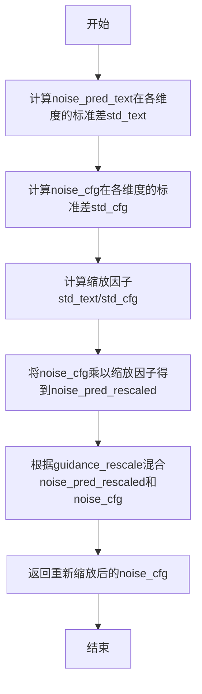

#### 带注释源码

```
# Copied from diffusers.pipelines.stable_diffusion.pipeline_stable_diffusion.rescale_noise_cfg
def rescale_noise_cfg(noise_cfg, noise_pred_text, guidance_rescale=0.0):
    r"""
    Rescales `noise_cfg` tensor based on `guidance_rescale` to improve image quality and fix overexposure. Based on
    Section 3.4 from [Common Diffusion Noise Schedules and Sample Steps are
    Flawed](https://huggingface.co/papers/2305.08891).

    Args:
        noise_cfg (`torch.Tensor`):
            The predicted noise tensor for the guided diffusion process.
        noise_pred_text (`torch.Tensor`):
            The predicted noise tensor for the text-guided diffusion process.
        guidance_rescale (`float`, *optional*, defaults to 0.0):
            A rescale factor applied to the noise predictions.

    Returns:
        noise_cfg (`torch.Tensor`): The rescaled noise prediction tensor.
    """
    # 计算文本预测噪声在除了batch维度之外所有维度的标准差
    # keepdim=True保持维度以便后续广播操作
    std_text = noise_pred_text.std(dim=list(range(1, noise_pred_text.ndim)), keepdim=True)
    
    # 计算noise_cfg在除了batch维度之外所有维度的标准差
    std_cfg = noise_cfg.std(dim=list(range(1, noise_cfg.ndim)), keepdim=True)
    
    # 使用标准差比率重新缩放噪声预测结果（修复过度曝光问题）
    noise_pred_rescaled = noise_cfg * (std_text / std_cfg)
    
    # 将重新缩放后的结果与原始guidance结果按guidance_rescale因子混合
    # 以避免产生"plain looking"图像
    noise_cfg = guidance_rescale * noise_pred_rescaled + (1 - guidance_rescale) * noise_cfg
    
    return noise_cfg
```


### `resize_mask`

该函数用于将输入的mask张量调整大小以匹配latent表示的空间维度，支持两种模式：仅处理第一帧或处理所有帧。这是EasyAnimate视频生成pipeline中用于调整inpaint mask尺寸的核心函数。

参数：

- `mask`：`torch.Tensor`，输入的mask张量，形状为 (B, C, T, H, W)，其中B是批次大小，C是通道数，T是帧数，H和W是高度和宽度
- `latent`：`torch.Tensor`，潜在表示张量，用于获取目标尺寸信息，形状为 (B, C', T', H', W')
- `process_first_frame_only`：`bool`，可选参数，默认为True。当为True时，单独处理第一帧（保持为1帧），其余帧等比例缩放；当为False时，将整个mask缩放到目标尺寸

返回值：`torch.Tensor`，调整大小后的mask张量，形状与latent的空间维度匹配

#### 流程图

```mermaid
flowchart TD
    A[开始 resize_mask] --> B[获取 latent 的尺寸 latent_size]
    B --> C{process_first_frame_only?}
    
    C -->|True| D[提取目标尺寸<br/>target_size = latent_size[2:]]
    D --> E[设置第一帧目标高度为1<br/>target_size[0] = 1]
    E --> F[使用 trilinear 插值<br/>调整第一帧 mask]
    F --> G[构建剩余帧目标尺寸<br/>target_size[0] -= 1]
    
    G --> H{剩余帧数量 ≠ 0?}
    H -->|True| I[使用 trilinear 插值<br/>调整剩余帧 mask]
    I --> J[沿时间维度拼接<br/>第一帧 + 剩余帧]
    J --> K[返回 resized_mask]
    
    H -->|False| K
    
    C -->|False| L[使用 trilinear 插值<br/>一次性调整整个 mask]
    L --> K
    
    K --> M[结束]
```

#### 带注释源码

```python
# Resize mask information in magvit
def resize_mask(mask, latent, process_first_frame_only=True):
    """
    将输入的mask调整大小以匹配latent表示的尺寸。
    
    Args:
        mask: 输入的mask张量，形状为 (B, C, T, H, W)
        latent: 潜在表示张量，用于获取目标尺寸
        process_first_frame_only: 是否仅处理第一帧
    
    Returns:
        调整大小后的mask张量
    """
    # 获取latent的空间和时间维度信息
    latent_size = latent.size()

    if process_first_frame_only:
        # 模式1：单独处理第一帧，其余帧等比例缩放
        
        # 构建目标尺寸列表 [T, H, W]
        target_size = list(latent_size[2:])
        
        # 将第一帧的时间维度设为1（只保留一帧）
        target_size[0] = 1
        
        # 使用三线性插值调整第一帧mask到目标尺寸
        # mask[:, :, 0:1, :, :] 提取第一帧
        first_frame_resized = F.interpolate(
            mask[:, :, 0:1, :, :], size=target_size, mode="trilinear", align_corners=False
        )

        # 重新构建目标尺寸，用于处理剩余帧
        target_size = list(latent_size[2:])
        # 剩余帧数量 = 总帧数 - 1
        target_size[0] = target_size[0] - 1
        
        # 如果还有剩余帧
        if target_size[0] != 0:
            # 使用三线性插值调整剩余帧mask
            # mask[:, :, 1:, :, :] 提取第2帧及之后的帧
            remaining_frames_resized = F.interpolate(
                mask[:, :, 1:, :, :], size=target_size, mode="trilinear", align_corners=False
            )
            # 沿时间维度（dim=2）拼接第一帧和剩余帧
            resized_mask = torch.cat([first_frame_resized, remaining_frames_resized], dim=2)
        else:
            # 如果没有剩余帧，直接返回第一帧的resize结果
            resized_mask = first_frame_resized
    else:
        # 模式2：一次性调整整个mask到目标尺寸
        
        # 获取目标尺寸
        target_size = list(latent_size[2:])
        
        # 使用三线性插值一次性调整整个mask
        resized_mask = F.interpolate(mask, size=target_size, mode="trilinear", align_corners=False)
    
    return resized_mask
```


### `add_noise_to_reference_video`

该函数用于向参考视频（图像）添加噪声，支持基于随机sigma值或固定比例添加噪声，并保留特定像素（值为-1的像素）不添加噪声，常用于图像修复任务中的噪声增强处理。

参数：

- `image`：`torch.Tensor`，输入的图像或视频张量，形状为 `[batch, channels, frames, height, width]`
- `ratio`：`float | None`，可选的噪声比例参数。如果为 `None`，则根据正态分布随机生成 sigma 值
- `generator`：`torch.Generator | None`，可选的随机数生成器，用于确保噪声的可重复性

返回值：`torch.Tensor`，添加噪声后的图像或视频张量

#### 流程图

```mermaid
flowchart TD
    A[开始] --> B{ratio is None?}
    B -->|是| C[使用正态分布生成sigma<br/>mean=-3.0, std=0.5]
    C --> D[sigma = exp(sigma)]
    B -->|否| E[sigma = ratio]
    D --> F{generator is not None?}
    E --> F
    F -->|是| G[使用generator生成噪声<br/>torch.randn with generator]
    F -->|否| H[使用torch.randn_like生成噪声]
    G --> I[image_noise = noise * sigma[..., None, None, None]]
    H --> I
    I --> J[保留像素: where image == -1<br/>使用zeros_like]
    J --> K[image = image + image_noise]
    K --> L[返回带噪声的image]
```

#### 带注释源码

```python
def add_noise_to_reference_video(image, ratio=None, generator=None):
    """
    向参考视频/图像添加噪声，用于图像修复任务中的噪声增强。
    
    参数:
        image: 输入图像张量，形状 [batch, channels, frames, height, width]
        ratio: 可选的噪声比例，如果为None则随机生成sigma值
        generator: 可选的随机数生成器，用于确保可重复性
    """
    # 如果未指定ratio，则使用正态分布随机生成sigma值
    if ratio is None:
        # 生成均值为-3.0、标准差为0.5的正态分布样本
        sigma = torch.normal(mean=-3.0, std=0.5, size=(image.shape[0],)).to(image.device)
        # 通过指数运算将sigma转换到正数区间
        sigma = torch.exp(sigma).to(image.dtype)
    else:
        # 使用固定的ratio值创建sigma张量
        sigma = torch.ones((image.shape[0],)).to(image.device, image.dtype) * ratio

    # 根据是否有generator选择不同的随机噪声生成方式
    if generator is not None:
        # 使用指定generator生成噪声（可复现）
        image_noise = (
            torch.randn(image.size(), generator=generator, dtype=image.dtype, device=image.device)
            * sigma[:, None, None, None, None]  # 对sigma进行广播以匹配image的维度
        )
    else:
        # 直接生成与image相同形状的随机噪声
        image_noise = torch.randn_like(image) * sigma[:, None, None, None, None]
    
    # 保留特殊像素：image中值为-1的像素不添加噪声
    image_noise = torch.where(image == -1, torch.zeros_like(image), image_noise)
    
    # 将噪声添加到原始图像
    image = image + image_noise
    return image
```


### `retrieve_timesteps`

调用 scheduler 的 `set_timesteps` 方法并从中获取 timesteps，处理自定义 timesteps。任何 kwargs 将传递给 scheduler 的 `set_timesteps` 方法。

参数：

- `scheduler`：`SchedulerMixin`，要获取 timesteps 的调度器
- `num_inference_steps`：`int | None`，使用预训练模型生成样本时的扩散步数，如果使用此参数，则 `timesteps` 必须为 `None`
- `device`：`str | torch.device | None`，timesteps 应移动到的设备，如果为 `None` 则不移动 timesteps
- `timesteps`：`list[int] | None`，用于覆盖调度器时间步间隔策略的自定义时间步，如果传递了此参数，则 `num_inference_steps` 和 `sigmas` 必须为 `None`
- `sigmas`：`list[float] | None`，用于覆盖调度器时间步间隔策略的自定义 sigmas，如果传递了此参数，则 `num_inference_steps` 和 `timesteps` 必须为 `None`
- `**kwargs`：其他关键字参数，将传递给 scheduler 的 `set_timesteps` 方法

返回值：`tuple[torch.Tensor, int]`，第一个元素是调度器的时间步调度，第二个元素是推理步数

#### 流程图

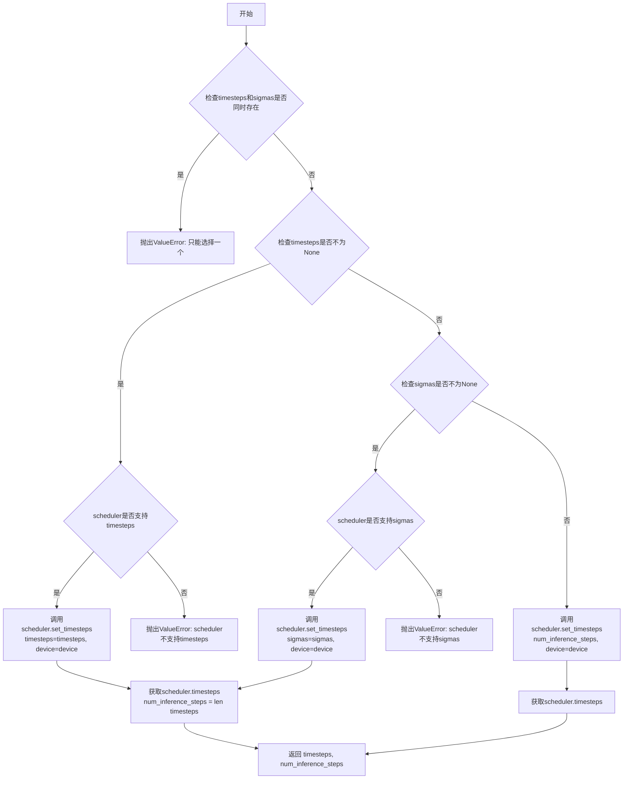

#### 带注释源码

```python
# Copied from diffusers.pipelines.stable_diffusion.pipeline_stable_diffusion.retrieve_timesteps
def retrieve_timesteps(
    scheduler,
    num_inference_steps: int | None = None,
    device: str | torch.device | None = None,
    timesteps: list[int] | None = None,
    sigmas: list[float] | None = None,
    **kwargs,
):
    r"""
    Calls the scheduler's `set_timesteps` method and retrieves timesteps from the scheduler after the call. Handles
    custom timesteps. Any kwargs will be supplied to `scheduler.set_timesteps`.

    Args:
        scheduler (`SchedulerMixin`):
            The scheduler to get timesteps from.
        num_inference_steps (`int`):
            The number of diffusion steps used when generating samples with a pre-trained model. If used, `timesteps`
            must be `None`.
        device (`str` or `torch.device`, *optional*):
            The device to which the timesteps should be moved to. If `None`, the timesteps are not moved.
        timesteps (`list[int]`, *optional*):
            Custom timesteps used to override the timestep spacing strategy of the scheduler. If `timesteps` is passed,
            `num_inference_steps` and `sigmas` must be `None`.
        sigmas (`list[float]`, *optional*):
            Custom sigmas used to override the timestep spacing strategy of the scheduler. If `sigmas` is passed,
            `num_inference_steps` and `timesteps` must be `None`.

    Returns:
        `tuple[torch.Tensor, int]`: A tuple where the first element is the timestep schedule from the scheduler and the
        second element is the number of inference steps.
    """
    # 检查timesteps和sigmas是否同时传递，只能选择其中一种方式设置自定义值
    if timesteps is not None and sigmas is not None:
        raise ValueError("Only one of `timesteps` or `sigmas` can be passed. Please choose one to set custom values")
    
    # 处理自定义timesteps的情况
    if timesteps is not None:
        # 检查scheduler的set_timesteps方法是否支持timesteps参数
        accepts_timesteps = "timesteps" in set(inspect.signature(scheduler.set_timesteps).parameters.keys())
        if not accepts_timesteps:
            raise ValueError(
                f"The current scheduler class {scheduler.__class__}'s `set_timesteps` does not support custom"
                f" timestep schedules. Please check whether you are using the correct scheduler."
            )
        # 调用scheduler的set_timesteps方法设置自定义timesteps
        scheduler.set_timesteps(timesteps=timesteps, device=device, **kwargs)
        # 从scheduler获取设置后的timesteps
        timesteps = scheduler.timesteps
        # 计算推理步数
        num_inference_steps = len(timesteps)
    # 处理自定义sigmas的情况
    elif sigmas is not None:
        # 检查scheduler的set_timesteps方法是否支持sigmas参数
        accept_sigmas = "sigmas" in set(inspect.signature(scheduler.set_timesteps).parameters.keys())
        if not accept_sigmas:
            raise ValueError(
                f"The current scheduler class {scheduler.__class__}'s `set_timesteps` does not support custom"
                f" sigmas schedules. Please check whether you are using the correct scheduler."
            )
        # 调用scheduler的set_timesteps方法设置自定义sigmas
        scheduler.set_timesteps(sigmas=sigmas, device=device, **kwargs)
        # 从scheduler获取设置后的timesteps
        timesteps = scheduler.timesteps
        # 计算推理步数
        num_inference_steps = len(timesteps)
    # 处理默认情况，使用num_inference_steps设置timesteps
    else:
        scheduler.set_timesteps(num_inference_steps, device=device, **kwargs)
        timesteps = scheduler.timesteps
    
    # 返回timesteps和推理步数
    return timesteps, num_inference_steps
```


### EasyAnimateInpaintPipeline.__init__

该方法是 `EasyAnimateInpaintPipeline` 类的构造函数，用于初始化视频修复（inpaint）流水线。它接收变分自编码器（VAE）、文本编码器、分词器、变换器模型和调度器等核心组件，并通过 `register_modules` 方法注册这些模块，同时初始化图像处理器、掩码处理器和视频处理器等辅助组件。

参数：

- `vae`：`AutoencoderKLMagvit`，变分自编码器模型，用于编码和解码视频到潜在表示
- `text_encoder`：`Qwen2VLForConditionalGeneration | BertModel`，文本编码器（Qwen2-VL 或 BERT），用于将文本提示编码为隐藏状态
- `tokenizer`：`Qwen2Tokenizer | BertTokenizer`，分词器，用于对文本进行分词处理
- `transformer`：`EasyAnimateTransformer3DModel`，EasyAnimate 变换器模型，用于去噪潜在表示
- `scheduler`：`FlowMatchEulerDiscreteScheduler`，调度器，用于在去噪过程中逐步调整噪声

返回值：无（`None`），构造函数不返回任何值，仅初始化对象状态

#### 流程图

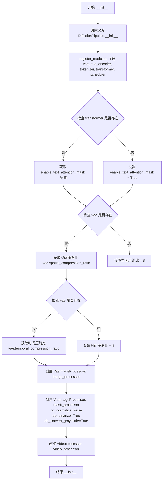

#### 带注释源码

```python
def __init__(
    self,
    vae: AutoencoderKLMagvit,
    text_encoder: Qwen2VLForConditionalGeneration | BertModel,
    tokenizer: Qwen2Tokenizer | BertTokenizer,
    transformer: EasyAnimateTransformer3DModel,
    scheduler: FlowMatchEulerDiscreteScheduler,
):
    """
    初始化 EasyAnimateInpaintPipeline 流水线。
    
    Args:
        vae: 变分自编码器模型，用于编码和解码视频到潜在表示
        text_encoder: 文本编码器（Qwen2-VL 或 BERT）
        tokenizer: 分词器
        transformer: EasyAnimate 变换器模型
        scheduler: 调度器，用于去噪过程
    """
    # 调用父类的初始化方法
    super().__init__()

    # 注册所有模块，使它们可以通过 pipeline.vae, pipeline.text_encoder 等方式访问
    self.register_modules(
        vae=vae,
        text_encoder=text_encoder,
        tokenizer=tokenizer,
        transformer=transformer,
        scheduler=scheduler,
    )

    # 配置文本注意力掩码，从 transformer 配置中获取
    # 如果 transformer 存在，使用其配置中的 enable_text_attention_mask
    # 否则默认为 True
    self.enable_text_attention_mask = (
        self.transformer.config.enable_text_attention_mask
        if getattr(self, "transformer", None) is not None
        else True
    )

    # 获取 VAE 的空间压缩比，用于图像处理
    # 如果 vae 存在，使用其配置的空间压缩比，否则默认为 8
    self.vae_spatial_compression_ratio = (
        self.vae.spatial_compression_ratio if getattr(self, "vae", None) is not None else 8
    )

    # 获取 VAE 的时间压缩比，用于视频帧处理
    # 如果 vae 存在，使用其配置的时间压缩比，否则默认为 4
    self.vae_temporal_compression_ratio = (
        self.vae.temporal_compression_ratio if getattr(self, "vae", None) is not None else 4
    )

    # 创建图像处理器，用于预处理和后处理图像
    self.image_processor = VaeImageProcessor(vae_scale_factor=self.vae_spatial_compression_ratio)

    # 创建掩码处理器，用于处理修复任务的掩码
    # do_normalize=False: 不进行归一化
    # do_binarize=True: 进行二值化处理
    # do_convert_grayscale=True: 转换为灰度图
    self.mask_processor = VaeImageProcessor(
        vae_scale_factor=self.vae_spatial_compression_ratio,
        do_normalize=False,
        do_binarize=True,
        do_convert_grayscale=True,
    )

    # 创建视频处理器，用于预处理和后处理视频
    self.video_processor = VideoProcessor(vae_scale_factor=self.vae_spatial_compression_ratio)
```


### `EasyAnimateInpaintPipeline.encode_prompt`

该方法负责将文本提示（prompt）编码为文本编码器的隐藏状态（hidden states），支持正向提示和负向提示的嵌入生成，并处理分类器无指导（classifier-free guidance）所需的嵌入复制。

参数：

- `self`：`EasyAnimateInpaintPipeline` 类实例，当前 pipeline 对象
- `prompt`：`str | list[str]`，要编码的文本提示，可以是单个字符串或字符串列表
- `num_images_per_prompt`：`int = 1`，每个提示生成的图像数量，用于复制嵌入
- `do_classifier_free_guidance`：`bool = True`，是否使用分类器无指导
- `negative_prompt`：`str | list[str] | None`，负向提示，用于指导不生成的内容
- `prompt_embeds`：`torch.Tensor | None = None`，预生成的正向提示嵌入，如果提供则直接使用
- `negative_prompt_embeds`：`torch.Tensor | None = None`，预生成的负向提示嵌入
- `prompt_attention_mask`：`torch.Tensor | None = None`，正向提示的注意力掩码
- `negative_prompt_attention_mask`：`torch.Tensor | None = None`，负向提示的注意力掩码
- `device`：`torch.device | None = None`，目标设备
- `dtype`：`torch.dtype | None = None`，目标数据类型
- `max_sequence_length`：`int = 256`，提示的最大序列长度

返回值：`tuple[torch.Tensor, torch.Tensor, torch.Tensor, torch.Tensor]`，返回四个张量：正向提示嵌入、负向提示嵌入、正向注意力掩码、负向注意力掩码

#### 流程图

```mermaid
flowchart TD
    A[开始 encode_prompt] --> B{检查 prompt 类型}
    B -->|字符串| C[batch_size = 1]
    B -->|列表| D[batch_size = len(prompt)]
    B -->|None| E[使用 prompt_embeds.shape[0]]
    
    C --> F{prompt_embeds 为空?}
    D --> F
    E --> F
    
    F -->|是| G[构建 chat messages]
    G --> H[应用 chat template]
    H --> I[Tokenizer 编码]
    I --> J[Text Encoder 编码]
    J --> K[提取倒数第二层隐藏状态]
    
    F -->|否| L[直接使用 prompt_embeds]
    
    K --> M[复制 prompt_embeds num_images_per_prompt 次]
    L --> M
    
    M --> N{do_classifier_free_guidance 为真<br>且 negative_prompt_embeds 为空?}
    
    N -->|是| O[构建负向提示 messages]
    O --> P[应用 chat template]
    P --> Q[Tokenizer 编码负向提示]
    Q --> R[Text Encoder 编码负向提示]
    R --> S[提取倒数第二层隐藏状态]
    S --> T[复制 negative_prompt_embeds]
    
    N -->|否| U[直接使用 negative_prompt_embeds]
    
    T --> V[返回嵌入和注意力掩码]
    U --> V
```

#### 带注释源码

```python
def encode_prompt(
    self,
    prompt: str | list[str],
    num_images_per_prompt: int = 1,
    do_classifier_free_guidance: bool = True,
    negative_prompt: str | list[str] | None = None,
    prompt_embeds: torch.Tensor | None = None,
    negative_prompt_embeds: torch.Tensor | None = None,
    prompt_attention_mask: torch.Tensor | None = None,
    negative_prompt_attention_mask: torch.Tensor | None = None,
    device: torch.device | None = None,
    dtype: torch.dtype | None = None,
    max_sequence_length: int = 256,
):
    r"""
    Encodes the prompt into text encoder hidden states.

    Args:
        prompt (`str` or `list[str]`, *optional*):
            prompt to be encoded
        device: (`torch.device`):
            torch device
        dtype (`torch.dtype`):
            torch dtype
        num_images_per_prompt (`int`):
            number of images that should be generated per prompt
        do_classifier_free_guidance (`bool`):
            whether to use classifier free guidance or not
        negative_prompt (`str` or `list[str]`, *optional*):
            The prompt or prompts not to guide the image generation. If not defined, one has to pass
            `negative_prompt_embeds` instead. Ignored when not using guidance (i.e., ignored if `guidance_scale` is
            less than `1`).
        prompt_embeds (`torch.Tensor`, *optional*):
            Pre-generated text embeddings. Can be used to easily tweak text inputs, *e.g.* prompt weighting. If not
            provided, text embeddings will be generated from `prompt` input argument.
        negative_prompt_embeds (`torch.Tensor`, *optional*):
            Pre-generated negative text embeddings. Can be used to easily tweak text inputs, *e.g.* prompt
            weighting. If not provided, negative_prompt_embeds will be generated from `negative_prompt` input
            argument.
        prompt_attention_mask (`torch.Tensor`, *optional*):
            Attention mask for the prompt. Required when `prompt_embeds` is passed directly.
        negative_prompt_attention_mask (`torch.Tensor`, *optional*):
            Attention mask for the negative prompt. Required when `negative_prompt_embeds` is passed directly.
        max_sequence_length (`int`, *optional*): maximum sequence length to use for the prompt.
    """
    # 设置默认 dtype 和 device
    dtype = dtype or self.text_encoder.dtype
    device = device or self.text_encoder.device

    # 确定 batch_size
    if prompt is not None and isinstance(prompt, str):
        batch_size = 1
    elif prompt is not None and isinstance(prompt, list):
        batch_size = len(prompt)
    else:
        batch_size = prompt_embeds.shape[0]

    # 如果没有提供 prompt_embeds，则从 prompt 生成
    if prompt_embeds is None:
        if isinstance(prompt, str):
            # 构建 Qwen2 格式的 chat messages
            messages = [
                {
                    "role": "user",
                    "content": [{"type": "text", "text": prompt}],
                }
            ]
        else:
            # 处理提示列表
            messages = [
                {
                    "role": "user",
                    "content": [{"type": "text", "text": _prompt}],
                }
                for _prompt in prompt
            ]
        
        # 应用 chat template 并 tokenize
        text = [
            self.tokenizer.apply_chat_template([m], tokenize=False, add_generation_prompt=True) for m in messages
        ]

        text_inputs = self.tokenizer(
            text=text,
            padding="max_length",
            max_length=max_sequence_length,
            truncation=True,
            return_attention_mask=True,
            padding_side="right",
            return_tensors="pt",
        )
        text_inputs = text_inputs.to(self.text_encoder.device)

        text_input_ids = text_inputs.input_ids
        prompt_attention_mask = text_inputs.attention_mask
        
        # 使用 text_encoder 编码，获取倒数第二层隐藏状态
        if self.enable_text_attention_mask:
            # Inference: Generation of the output
            prompt_embeds = self.text_encoder(
                input_ids=text_input_ids, attention_mask=prompt_attention_mask, output_hidden_states=True
            ).hidden_states[-2]
        else:
            raise ValueError("LLM needs attention_mask")
        
        # 复制注意力掩码 num_images_per_prompt 次
        prompt_attention_mask = prompt_attention_mask.repeat(num_images_per_prompt, 1)

    # 移动 prompt_embeds 到指定设备
    prompt_embeds = prompt_embeds.to(dtype=dtype, device=device)

    bs_embed, seq_len, _ = prompt_embeds.shape
    # 复制 text embeddings 用于每个提示的生成，使用 mps 友好的方法
    prompt_embeds = prompt_embeds.repeat(1, num_images_per_prompt, 1)
    prompt_embeds = prompt_embeds.view(bs_embed * num_images_per_prompt, seq_len, -1)
    prompt_attention_mask = prompt_attention_mask.to(device=device)

    # 获取分类器无指导的 unconditional embeddings
    if do_classifier_free_guidance and negative_prompt_embeds is None:
        if negative_prompt is not None and isinstance(negative_prompt, str):
            messages = [
                {
                    "role": "user",
                    "content": [{"type": "text", "text": negative_prompt}],
                }
            ]
        else:
            messages = [
                {
                    "role": "user",
                    "content": [{"type": "text", "text": _negative_prompt}],
                }
                for _negative_prompt in negative_prompt
            ]
        text = [
            self.tokenizer.apply_chat_template([m], tokenize=False, add_generation_prompt=True) for m in messages
        ]

        text_inputs = self.tokenizer(
            text=text,
            padding="max_length",
            max_length=max_sequence_length,
            truncation=True,
            return_attention_mask=True,
            padding_side="right",
            return_tensors="pt",
        )
        text_inputs = text_inputs.to(self.text_encoder.device)

        text_input_ids = text_inputs.input_ids
        negative_prompt_attention_mask = text_inputs.attention_mask
        if self.enable_text_attention_mask:
            # Inference: Generation of the output
            negative_prompt_embeds = self.text_encoder(
                input_ids=text_input_ids,
                attention_mask=negative_prompt_attention_mask,
                output_hidden_states=True,
            ).hidden_states[-2]
        else:
            raise ValueError("LLM needs attention_mask")
        negative_prompt_attention_mask = negative_prompt_attention_mask.repeat(num_images_per_prompt, 1)

    if do_classifier_free_guidance:
        # 复制 unconditional embeddings 用于每个提示的生成
        seq_len = negative_prompt_embeds.shape[1]

        negative_prompt_embeds = negative_prompt_embeds.to(dtype=dtype, device=device)

        negative_prompt_embeds = negative_prompt_embeds.repeat(1, num_images_per_prompt, 1)
        negative_prompt_embeds = negative_prompt_embeds.view(batch_size * num_images_per_prompt, seq_len, -1)
        negative_prompt_attention_mask = negative_prompt_attention_mask.to(device=device)

    # 返回四个张量：prompt_embeds, negative_prompt_embeds, prompt_attention_mask, negative_prompt_attention_mask
    return prompt_embeds, negative_prompt_embeds, prompt_attention_mask, negative_prompt_attention_mask
```


### `EasyAnimateInpaintPipeline.prepare_extra_step_kwargs`

该方法用于准备调度器（scheduler）步骤所需的额外参数。由于不同调度器的签名不同，该方法通过检查调度器的 `step` 方法是否接受特定参数（如 `eta` 和 `generator`）来动态构建参数字典。

参数：

- `generator`：`torch.Generator | list[torch.Generator] | None`，用于设置随机种子以使生成具有确定性
- `eta`：`float | None`，仅在 DDIMScheduler 中使用，对应 DDIM 论文中的 η 参数，用于调整推理过程中的噪声水平，应在 [0, 1] 范围内

返回值：`dict`，包含调度器 `step` 方法所需的关键字参数（如 `eta` 和/或 `generator`）

#### 流程图

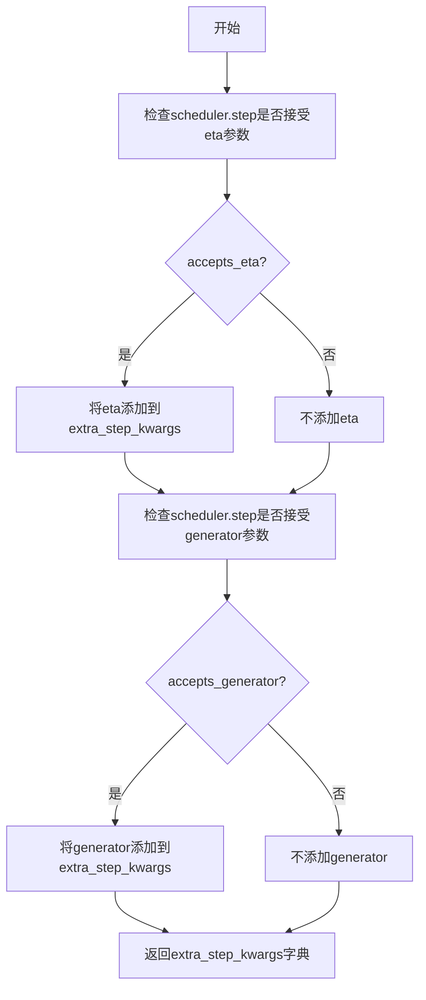

#### 带注释源码

```python
def prepare_extra_step_kwargs(self, generator, eta):
    # 准备调度器步骤的额外参数，因为并非所有调度器都具有相同的签名
    # eta (η) 仅与 DDIMScheduler 一起使用，对于其他调度器将被忽略
    # eta 对应 DDIM 论文 (https://huggingface.co/papers/2010.02502) 中的 η
    # 取值应在 [0, 1] 范围内

    # 通过检查调度器 step 方法的签名来确定是否接受 eta 参数
    accepts_eta = "eta" in set(inspect.signature(self.scheduler.step).parameters.keys())
    extra_step_kwargs = {}
    if accepts_eta:
        extra_step_kwargs["eta"] = eta

    # 检查调度器是否接受 generator 参数
    accepts_generator = "generator" in set(inspect.signature(self.scheduler.step).parameters.keys())
    if accepts_generator:
        extra_step_kwargs["generator"] = generator
    
    # 返回包含调度器所需额外参数的字典
    return extra_step_kwargs
```


### `EasyAnimateInpaintPipeline.check_inputs`

该方法负责验证管道输入参数的有效性，确保用户提供的prompt、embedding、mask等参数符合模型要求，并在参数不符合预期时抛出明确的错误信息。

参数：

- `prompt`：`str | list[str] | None`，用户提供的文本提示，用于指导视频生成
- `height`：`int`，生成图像的高度（像素），必须被16整除
- `width`：`int`，生成图像的宽度（像素），必须被16整除
- `negative_prompt`：`str | list[str] | None`，反向提示词，指定生成时应避免的内容
- `prompt_embeds`：`torch.Tensor | None`，预生成的文本embedding，与prompt二选一提供
- `negative_prompt_embeds`：`torch.Tensor | None`，预生成的反向文本embedding
- `prompt_attention_mask`：`torch.Tensor | None`，文本prompt的注意力掩码，当提供prompt_embeds时必须提供
- `negative_prompt_attention_mask`：`torch.Tensor | None`，反向prompt的注意力掩码
- `callback_on_step_end_tensor_inputs`：`list[str] | None`，在步骤结束时回调的tensor输入列表

返回值：`None`，该方法仅进行参数验证，若验证失败则抛出ValueError异常

#### 流程图

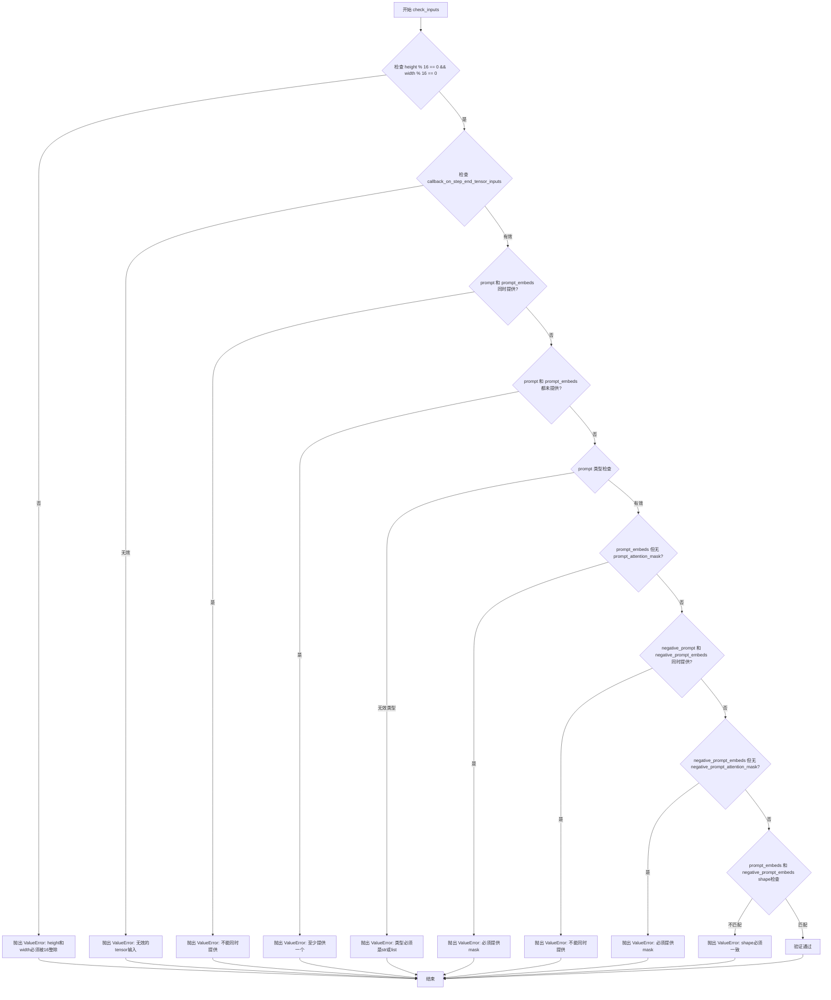

#### 带注释源码

```python
def check_inputs(
    self,
    prompt,
    height,
    width,
    negative_prompt=None,
    prompt_embeds=None,
    negative_prompt_embeds=None,
    prompt_attention_mask=None,
    negative_prompt_attention_mask=None,
    callback_on_step_end_tensor_inputs=None,
):
    """
    验证输入参数的有效性，确保满足管道运行的前置条件。
    
    检查项目包括：
    1. height和width必须能被16整除
    2. callback_on_step_end_tensor_inputs必须在允许列表中
    3. prompt和prompt_embeds不能同时提供或都未提供
    4. prompt类型必须是str或list
    5. prompt_embeds存在时必须提供prompt_attention_mask
    6. negative_prompt和negative_prompt_embeds不能同时提供
    7. negative_prompt_embeds存在时必须提供negative_prompt_attention_mask
    8. prompt_embeds和negative_prompt_embeds的shape必须一致
    """
    # 检查分辨率是否满足16位对齐要求
    if height % 16 != 0 or width % 16 != 0:
        raise ValueError(f"`height` and `width` have to be divisible by 16 but are {height} and {width}.")

    # 验证回调函数使用的tensor输入是否在允许列表中
    if callback_on_step_end_tensor_inputs is not None and not all(
        k in self._callback_tensor_inputs for k in callback_on_step_end_tensor_inputs
    ):
        raise ValueError(
            f"`callback_on_step_end_tensor_inputs` has to be in {self._callback_tensor_inputs}, but found {[k for k in callback_on_step_end_tensor_inputs if k not in self._callback_tensor_inputs]}"
        )

    # prompt和prompt_embeds是互斥的，不能同时提供
    if prompt is not None and prompt_embeds is not None:
        raise ValueError(
            f"Cannot forward both `prompt`: {prompt} and `prompt_embeds`: {prompt_embeds}. Please make sure to"
            " only forward one of the two."
        )
    # 两者必须至少提供一个
    elif prompt is None and prompt_embeds is None:
        raise ValueError(
            "Provide either `prompt` or `prompt_embeds`. Cannot leave both `prompt` and `prompt_embeds` undefined."
        )
    # prompt类型必须是str或list
    elif prompt is not None and (not isinstance(prompt, str) and not isinstance(prompt, list)):
        raise ValueError(f"`prompt` has to be of type `str` or `list` but is {type(prompt)}")

    # 如果提供了prompt_embeds，必须同时提供对应的attention_mask
    if prompt_embeds is not None and prompt_attention_mask is None:
        raise ValueError("Must provide `prompt_attention_mask` when specifying `prompt_embeds`.")

    # negative_prompt和negative_prompt_embeds也是互斥的
    if negative_prompt is not None and negative_prompt_embeds is not None:
        raise ValueError(
            f"Cannot forward both `negative_prompt`: {negative_prompt} and `negative_prompt_embeds`:"
            f" {negative_prompt_embeds}. Please make sure to only forward one of the two."
        )

    # negative_prompt_embeds存在时需要对应的attention_mask
    if negative_prompt_embeds is not None and negative_prompt_attention_mask is None:
        raise ValueError("Must provide `negative_prompt_attention_mask` when specifying `negative_prompt_embeds`.")

    # 确保prompt_embeds和negative_prompt_embeds的shape一致
    if prompt_embeds is not None and negative_prompt_embeds is not None:
        if prompt_embeds.shape != negative_prompt_embeds.shape:
            raise ValueError(
                "`prompt_embeds` and `negative_prompt_embeds` must have the same shape when passed directly, but"
                f" got: `prompt_embeds` {prompt_embeds.shape} != `negative_prompt_embeds`"
                f" {negative_prompt_embeds.shape}."
            )
```


### `EasyAnimateInpaintPipeline.get_timesteps`

该方法用于根据推理步数和强度（strength）计算时间步（timesteps），以支持图像到图像的转换任务（如 img2img 或 inpainting）。它通过计算初始时间步数并调整调度器的时间步数组来实现。

参数：

- `num_inference_steps`：`int`，推理时使用的去噪步数，决定生成样本的总步数
- `strength`：`float`，转换强度，值在 0 到 1 之间，值越大表示对原始图像的保留程度越低
- `device`：`torch.device`，用于计算的张量设备

返回值：`tuple[torch.Tensor, int]`，返回调整后的时间步序列和有效的推理步数

#### 流程图

```mermaid
flowchart TD
    A[开始] --> B[计算初始时间步数: init_timestep = minintnum_inference_steps × strength, num_inference_steps]
    --> C[计算起始索引: t_start = maxnum_inference_steps - init_timestep, 0]
    --> D[从调度器获取时间步: timesteps = scheduler.timesteps[t_start × order:]
    --> E{调度器是否有 set_begin_index 方法?}
    -->|是| F[设置调度器起始索引: scheduler.set_begin_index(t_start × order)]
    --> G[返回结果: timesteps, num_inference_steps - t_start]
    --> H[结束]
    -->|否| G
```

#### 带注释源码

```python
def get_timesteps(self, num_inference_steps, strength, device):
    # 根据强度计算初始时间步数
    # strength 表示转换的强度，值越大表示加入的噪声越多
    # 例如 strength=1.0 表示完全重绘，strength=0.0 表示保留原始图像
    init_timestep = min(int(num_inference_steps * strength), num_inference_steps)

    # 计算起始索引，决定从时间步序列的哪个位置开始
    # 如果 strength=1.0，则 t_start=0，从头开始
    # 如果 strength=0.5，则 t_start=num_inference_steps/2，从中间开始
    t_start = max(num_inference_steps - init_timestep, 0)
    
    # 从调度器获取时间步序列，根据 order 进行切片
    # scheduler.order 表示调度器的阶数，用于多步采样
    timesteps = self.scheduler.timesteps[t_start * self.scheduler.order :]
    
    # 如果调度器支持设置起始索引，则进行设置
    # 这对于某些需要知道当前所处步骤的调度器是必要的
    if hasattr(self.scheduler, "set_begin_index"):
        self.scheduler.set_begin_index(t_start * self.scheduler.order)

    # 返回调整后的时间步和有效的推理步数
    # 有效推理步数 = 总步数 - 起始索引
    return timesteps, num_inference_steps - t_start
```


### `EasyAnimateInpaintPipeline.prepare_mask_latents`

该方法负责将输入的mask（掩码）和masked_image（被掩码覆盖的图像）编码为适合扩散模型处理的潜在表示（latent representations）。它首先将mask和masked_image移动到指定设备，然后使用VAE编码器将它们转换为潜在空间，最后返回处理后的mask latents和masked_image latents。

参数：

- `self`：`EasyAnimateInpaintPipeline`实例本身
- `mask`：`torch.Tensor` 或 `None`，输入的mask图像，用于指示需要修复的区域
- `masked_image`：`torch.Tensor` 或 `None`，被掩码覆盖的图像，即原始图像中被mask覆盖的部分
- `batch_size`：`int`，批处理大小
- `height`：`int`，图像高度
- `width`：`int`，图像宽度
- `dtype`：`torch.dtype`，目标数据类型（如torch.float32）
- `device`：`torch.device`，目标设备（如cuda或cpu）
- `generator`：`torch.Generator` 或 `None`，随机数生成器，用于确保可重复性
- `do_classifier_free_guidance`：`bool`，是否使用无分类器引导
- `noise_aug_strength`：`float`，噪声增强强度，用于在inpaint模型中添加噪声

返回值：`tuple[torch.Tensor, torch.Tensor]`，包含两个torch.Tensor的元组：
- 第一个元素是处理后的mask latents
- 第二个元素是处理后的masked_image latents（如果masked_image为None，则为None）

#### 流程图

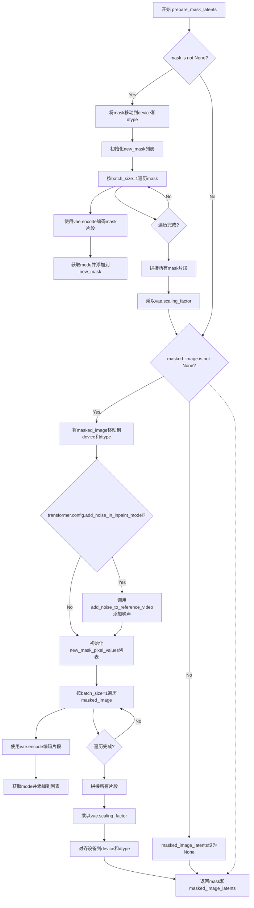

#### 带注释源码

```python
def prepare_mask_latents(
    self,
    mask,
    masked_image,
    batch_size,
    height,
    width,
    dtype,
    device,
    generator,
    do_classifier_free_guidance,
    noise_aug_strength,
):
    # 将mask调整到latents形状，因为我们会将mask与latents拼接
    # 我们在转换为dtype之前完成此操作，以避免在使用cpu_offload
    # 和半精度时出现问题
    if mask is not None:
        # 将mask移动到目标设备和数据类型
        mask = mask.to(device=device, dtype=dtype)
        new_mask = []
        bs = 1  # 每次处理一个样本
        # 遍历mask的所有批次
        for i in range(0, mask.shape[0], bs):
            mask_bs = mask[i : i + bs]
            # 使用VAE编码mask
            mask_bs = self.vae.encode(mask_bs)[0]
            # 获取编码结果的mode（最可能的值）
            mask_bs = mask_bs.mode()
            new_mask.append(mask_bs)
        # 拼接所有编码后的mask片段
        mask = torch.cat(new_mask, dim=0)
        # 乘以VAE的缩放因子
        mask = mask * self.vae.config.scaling_factor

    # 处理masked_image（被掩码覆盖的图像）
    if masked_image is not None:
        # 将masked_image移动到目标设备和数据类型
        masked_image = masked_image.to(device=device, dtype=dtype)
        # 如果transformer配置中添加了inpaint模型的噪声
        if self.transformer.config.add_noise_in_inpaint_model:
            # 向参考视频添加噪声
            masked_image = add_noise_to_reference_video(
                masked_image, ratio=noise_aug_strength, generator=generator
            )
        new_mask_pixel_values = []
        bs = 1  # 每次处理一个样本
        # 遍历masked_image的所有批次
        for i in range(0, masked_image.shape[0], bs):
            mask_pixel_values_bs = masked_image[i : i + bs]
            # 使用VAE编码masked_image
            mask_pixel_values_bs = self.vae.encode(mask_pixel_values_bs)[0]
            # 获取编码结果的mode
            mask_pixel_values_bs = mask_pixel_values_bs.mode()
            new_mask_pixel_values.append(mask_pixel_values_bs)
        # 拼接所有编码后的masked_image片段
        masked_image_latents = torch.cat(new_mask_pixel_values, dim=0)
        # 乘以VAE的缩放因子
        masked_image_latents = masked_image_latents * self.vae.config.scaling_factor

        # 对齐设备以防止与latent模型输入拼接时出现设备错误
        masked_image_latents = masked_image_latents.to(device=device, dtype=dtype)
    else:
        # 如果没有masked_image，则设为None
        masked_image_latents = None

    # 返回处理后的mask latents和masked_image latents
    return mask, masked_image_latents
```


### EasyAnimateInpaintPipeline.prepare_latents

该方法负责为视频修复管道准备潜在变量（latents），包括通过VAE编码输入视频、生成初始噪声、根据调度器初始化潜在变量，并返回处理后的潜在变量及其相关噪声信息。

参数：

- `batch_size`：`int`，批处理大小，控制同时处理的样本数量
- `num_channels_latents`：`int`，潜在变量的通道数，通常对应VAE的潜在空间维度
- `height`：`int`，生成图像的高度（像素单位）
- `width`：`int`，生成图像的宽度（像素单位）
- `num_frames`：`int`，视频帧数
- `dtype`：`torch.dtype`，张量的数据类型（如torch.float32）
- `device`：`torch.device`，计算设备（CPU或CUDA）
- `generator`：`torch.Generator | list[torch.Generator] | None`，随机数生成器，用于确保可重复性
- `latents`：`torch.Tensor | None`，可选的预计算潜在变量，如果提供则直接使用
- `video`：`torch.Tensor | None`，输入视频张量，用于编码为视频潜在变量
- `timestep`：`torch.Tensor | None`，当前时间步，用于噪声调度
- `is_strength_max`：`bool`，是否为最大强度（1.0），决定初始化方式
- `return_noise`：`bool`，是否在输出中返回噪声张量
- `return_video_latents`：`bool`，是否在输出中返回视频潜在变量

返回值：`tuple`，包含以下元素：
- `latents`：`torch.Tensor`，处理后的潜在变量张量
- `noise`：`torch.Tensor`（可选），生成的噪声张量，当`return_noise=True`时返回
- `video_latents`：`torch.Tensor`（可选），编码后的视频潜在变量，当`return_video_latents=True`时返回

#### 流程图

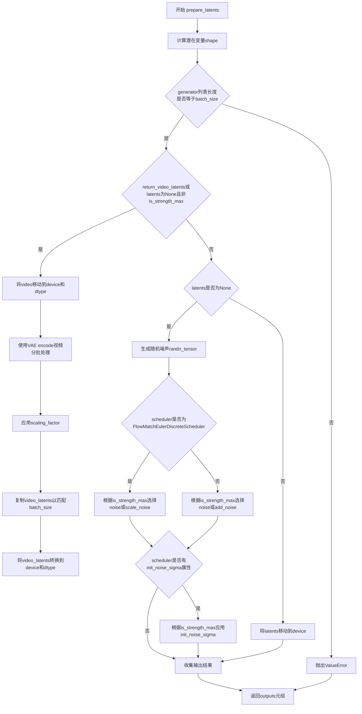

#### 带注释源码

```python
def prepare_latents(
    self,
    batch_size,
    num_channels_latents,
    height,
    width,
    num_frames,
    dtype,
    device,
    generator,
    latents=None,
    video=None,
    timestep=None,
    is_strength_max=True,
    return_noise=False,
    return_video_latents=False,
):
    """
    准备视频修复的潜在变量。
    
    该方法负责：
    1. 计算潜在变量的形状（考虑VAE的时空压缩比）
    2. 验证生成器数量
    3. 可选地通过VAE编码输入视频
    4. 生成或处理初始潜在变量
    5. 根据调度器应用噪声
    """
    
    # 1. 计算潜在变量的shape，考虑VAE的压缩比
    # 空间上: height / vae_spatial_compression_ratio
    # 时间上: (num_frames - 1) / vae_temporal_compression_ratio + 1
    shape = (
        batch_size,
        num_channels_latents,
        (num_frames - 1) // self.vae_temporal_compression_ratio + 1,
        height // self.vae_spatial_compression_ratio,
        width // self.vae_spatial_compression_ratio,
    )

    # 2. 验证生成器列表长度是否与batch_size匹配
    if isinstance(generator, list) and len(generator) != batch_size:
        raise ValueError(
            f"You have passed a list of generators of length {len(generator)}, but requested an effective batch"
            f" size of {batch_size}. Make sure the batch size matches the length of the generators."
        )

    # 3. 如果需要返回视频潜在变量，或者没有提供latents且不是最大强度
    if return_video_latents or (latents is None and not is_strength_max):
        # 将输入视频移动到目标设备和数据类型
        video = video.to(device=device, dtype=dtype)
        
        # 分批编码视频以节省显存
        bs = 1
        new_video = []
        for i in range(0, video.shape[0], bs):
            video_bs = video[i : i + bs]
            # 使用VAE编码视频帧，获取潜在表示
            video_bs = self.vae.encode(video_bs)[0]
            # 从高斯分布采样
            video_bs = video_bs.sample()
            new_video.append(video_bs)
        
        # 拼接所有批次的编码结果
        video = torch.cat(new_video, dim=0)
        # 应用VAE的缩放因子
        video = video * self.vae.config.scaling_factor

        # 复制视频潜在变量以匹配batch_size
        video_latents = video.repeat(batch_size // video.shape[0], 1, 1, 1, 1)
        video_latents = video_latents.to(device=device, dtype=dtype)

    # 4. 处理latents：生成新噪声或使用提供的latents
    if latents is None:
        # 生成随机噪声tensor
        noise = randn_tensor(shape, generator=generator, device=device, dtype=dtype)
        
        # 如果强度为1则初始化为纯噪声，否则初始化为image+noise
        if isinstance(self.scheduler, FlowMatchEulerDiscreteScheduler):
            # FlowMatch调度器使用scale_noise方法
            latents = noise if is_strength_max else self.scheduler.scale_noise(video_latents, timestep, noise)
        else:
            # 其他调度器使用add_noise方法
            latents = noise if is_strength_max else self.scheduler.add_noise(video_latents, noise, timestep)
        
        # 如果是纯噪声，根据调度器的init_noise_sigma进行缩放
        if hasattr(self.scheduler, "init_noise_sigma"):
            latents = latents * self.scheduler.init_noise_sigma if is_strength_max else latents
    else:
        # 如果提供了latents，直接移动到目标设备
        if hasattr(self.scheduler, "init_noise_sigma"):
            noise = latents.to(device)
            latents = noise * self.scheduler.init_noise_sigma
        else:
            latents = latents.to(device)

    # 5. 准备返回值元组
    outputs = (latents,)

    # 根据标志位添加额外输出
    if return_noise:
        outputs += (noise,)

    if return_video_latents:
        outputs += (video_latents,)

    return outputs
```


### `EasyAnimateInpaintPipeline.__call__`

该方法是 EasyAnimateInpaintPipeline 的核心调用函数，用于通过文本提示和可选的视频/掩码进行视频修复（Inpainting）生成。该方法执行完整的扩散模型推理流程，包括输入验证、提示编码、潜在向量准备、去噪循环和最终的视频解码。

参数：

- `prompt`：`str | list[str] | None`，用于引导视频生成的文本提示
- `num_frames`：`int | None`，要生成的视频帧数，默认 49
- `video`：`torch.FloatTensor | None`，输入视频张量，可选
- `mask_video`：`torch.FloatTensor | None`，指定视频中需要修复区域的掩码视频
- `masked_video_latents`：`torch.FloatTensor | None`，掩码视频的潜在表示
- `height`：`int | None`，生成图像/视频的高度（像素），默认 512
- `width`：`int | None`，生成图像/视频的宽度（像素），默认 512
- `num_inference_steps`：`int | None`，去噪步数，默认 50
- `guidance_scale`：`float | None`，引导尺度，控制文本提示的影响程度，默认 5.0
- `negative_prompt`：`str | list[str] | None`，用于排除的负面提示
- `num_images_per_prompt`：`int | None`，每个提示生成的视频数量，默认 1
- `eta`：`float | None`，DDIM 调度器参数，用于调整噪声水平
- `generator`：`torch.Generator | list[torch.Generator] | None`，随机种子生成器
- `latents`：`torch.Tensor | None`，预计算的潜在表示
- `prompt_embeds`：`torch.Tensor | None`，预生成的文本嵌入
- `negative_prompt_embeds`：`torch.Tensor | None`，预生成的负面文本嵌入
- `prompt_attention_mask`：`torch.Tensor | None`，提示的注意力掩码
- `negative_prompt_attention_mask`：`torch.Tensor | None`，负面提示的注意力掩码
- `output_type`：`str | None`，输出格式，可选 "pil" 或 "latent"，默认 "pil"
- `return_dict`：`bool`，是否返回结构化输出，默认 True
- `callback_on_step_end`：`Callable | PipelineCallback | MultiPipelineCallbacks | None`，每步结束时的回调函数
- `callback_on_step_end_tensor_inputs`：`list[str]`，回调中包含的张量输入列表，默认 ["latents"]
- `guidance_rescale`：`float`，噪声配置的重缩放参数，默认 0.0
- `strength`：`float`，影响生成输出样式或质量的强度值，默认 1.0
- `noise_aug_strength`：`float`，噪声增强强度，默认 0.0563
- `timesteps`：`list[int] | None`，自定义时间步

返回值：`EasyAnimatePipelineOutput`，包含生成的视频帧

#### 流程图

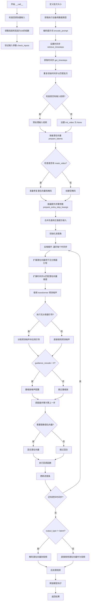

#### 带注释源码

```python
@torch.no_grad()
@replace_example_docstring(EXAMPLE_DOC_STRING)
def __call__(
    self,
    prompt: str | list[str] = None,  # 文本提示，引导视频生成
    num_frames: int | None = 49,     # 生成视频的帧数
    video: torch.FloatTensor = None, # 输入视频张量
    mask_video: torch.FloatTensor = None,    # 视频修复掩码
    masked_video_latents: torch.FloatTensor = None,  # 掩码视频的潜在向量
    height: int | None = 512,        # 输出高度
    width: int | None = 512,         # 输出宽度
    num_inference_steps: int | None = 50,   # 去噪推理步数
    guidance_scale: float | None = 5.0,      # 引导尺度
    negative_prompt: str | list[str] | None = None,  # 负面提示
    num_images_per_prompt: int | None = 1,   # 每个提示生成的视频数
    eta: float | None = 0.0,         # DDIM调度器参数
    generator: torch.Generator | list[torch.Generator] | None = None,  # 随机生成器
    latents: torch.Tensor | None = None,     # 预计算潜在向量
    prompt_embeds: torch.Tensor | None = None,       # 预计算提示嵌入
    negative_prompt_embeds: torch.Tensor | None = None,  # 预计算负面提示嵌入
    prompt_attention_mask: torch.Tensor | None = None,    # 提示注意力掩码
    negative_prompt_attention_mask: torch.Tensor | None = None,  # 负面提示注意力掩码
    output_type: str | None = "pil",  # 输出类型：'pil' 或 'latent'
    return_dict: bool = True,          # 是否返回字典格式
    callback_on_step_end: Callable[[int, int], None] | PipelineCallback | MultiPipelineCallbacks | None = None,  # 步骤结束回调
    callback_on_step_end_tensor_inputs: list[str] = ["latents"],  # 回调中的张量输入
    guidance_rescale: float = 0.0,    # 引导重缩放因子
    strength: float = 1.0,            # 强度参数
    noise_aug_strength: float = 0.0563,  # 噪声增强强度
    timesteps: list[int] | None = None,   # 自定义时间步
):
    # 检查回调张量输入是否有效
    if isinstance(callback_on_step_end, (PipelineCallback, MultiPipelineCallback)):
        callback_on_step_end_tensor_inputs = callback_on_step_end.tensor_inputs

    # 0. 默认高度和宽度调整为16的倍数
    height = int(height // 16 * 16)
    width = int(width // 16 * 16)

    # 1. 检查输入参数，验证正确性
    self.check_inputs(
        prompt, height, width, negative_prompt,
        prompt_embeds, negative_prompt_embeds,
        prompt_attention_mask, negative_prompt_attention_mask,
        callback_on_step_end_tensor_inputs,
    )
    # 设置引导参数
    self._guidance_scale = guidance_scale
    self._guidance_rescale = guidance_rescale
    self._interrupt = False

    # 2. 定义批次大小
    if prompt is not None and isinstance(prompt, str):
        batch_size = 1
    elif prompt is not None and isinstance(prompt, list):
        batch_size = len(prompt)
    else:
        batch_size = prompt_embeds.shape[0]

    # 获取执行设备和数据类型
    device = self._execution_device
    if self.text_encoder is not None:
        dtype = self.text_encoder.dtype
    else:
        dtype = self.transformer.dtype

    # 3. 编码输入提示
    (
        prompt_embeds, negative_prompt_embeds,
        prompt_attention_mask, negative_prompt_attention_mask,
    ) = self.encode_prompt(
        prompt=prompt, device=device, dtype=dtype,
        num_images_per_prompt=num_images_per_prompt,
        do_classifier_free_guidance=self.do_classifier_free_guidance,
        negative_prompt=negative_prompt,
        prompt_embeds=prompt_embeds,
        negative_prompt_embeds=negative_prompt_embeds,
        prompt_attention_mask=prompt_attention_mask,
        negative_prompt_attention_mask=negative_prompt_attention_mask,
    )

    # 4. 设置时间步
    if XLA_AVAILABLE:
        timestep_device = "cpu"
    else:
        timestep_device = device
    
    # 根据调度器类型获取时间步
    if isinstance(self.scheduler, FlowMatchEulerDiscreteScheduler):
        timesteps, num_inference_steps = retrieve_timesteps(
            self.scheduler, num_inference_steps, timestep_device, timesteps, mu=1
        )
    else:
        timesteps, num_inference_steps = retrieve_timesteps(
            self.scheduler, num_inference_steps, timestep_device, timesteps
        )
    
    # 根据强度获取时间步
    timesteps, num_inference_steps = self.get_timesteps(
        num_inference_steps=num_inference_steps, strength=strength, device=device
    )

    # 设置初始潜在时间步（强度的50%对应初始噪声）
    latent_timestep = timesteps[:1].repeat(batch_size * num_images_per_prompt)
    # 判断强度是否为最大值
    is_strength_max = strength == 1.0

    # 5. 准备输入视频
    if video is not None:
        batch_size, channels, num_frames, height_video, width_video = video.shape
        init_video = self.image_processor.preprocess(
            video.permute(0, 2, 1, 3, 4).reshape(batch_size * num_frames, channels, height_video, width_video),
            height=height, width=width,
        )
        init_video = init_video.to(dtype=torch.float32)
        init_video = init_video.reshape(batch_size, num_frames, channels, height, width).permute(0, 2, 1, 3, 4)
    else:
        init_video = None

    # 准备潜在变量
    num_channels_latents = self.vae.config.latent_channels
    num_channels_transformer = self.transformer.config.in_channels
    return_image_latents = num_channels_transformer == num_channels_latents

    # 6. 准备潜在向量
    latents_outputs = self.prepare_latents(
        batch_size * num_images_per_prompt, num_channels_latents,
        height, width, num_frames, dtype, device, generator,
        latents, video=init_video, timestep=latent_timestep,
        is_strength_max=is_strength_max, return_noise=True,
        return_video_latents=return_image_latents,
    )
    if return_image_latents:
        latents, noise, image_latents = latents_outputs
    else:
        latents, noise = latents_outputs

    # 7. 准备修复潜在向量
    if mask_video is not None:
        if (mask_video == 255).all():
            # 全255掩码：使用零潜在向量（文本转视频模式）
            mask = torch.zeros_like(latents).to(device, dtype)
            if self.transformer.config.resize_inpaint_mask_directly:
                mask_latents = torch.zeros_like(latents)[:, :1].to(device, dtype)
            else:
                mask_latents = torch.zeros_like(latents).to(device, dtype)
            masked_video_latents = torch.zeros_like(latents).to(device, dtype)

            # 为无分类器引导复制
            mask_input = torch.cat([mask_latents] * 2) if self.do_classifier_free_guidance else mask_latents
            masked_video_latents_input = (
                torch.cat([masked_video_latents] * 2) if self.do_classifier_free_guidance else masked_video_latents
            )
            inpaint_latents = torch.cat([mask_input, masked_video_latents_input], dim=1).to(dtype)
        else:
            # 处理非全255的掩码
            batch_size, channels, num_frames, height_video, width_video = mask_video.shape
            mask_condition = self.mask_processor.preprocess(
                mask_video.permute(0, 2, 1, 3, 4).reshape(batch_size * num_frames, channels, height_video, width_video),
                height=height, width=width,
            )
            mask_condition = mask_condition.to(dtype=torch.float32)
            mask_condition = mask_condition.reshape(batch_size, num_frames, channels, height, width).permute(0, 2, 1, 3, 4)

            # 通道数不匹配时处理
            if num_channels_transformer != num_channels_latents:
                mask_condition_tile = torch.tile(mask_condition, [1, 3, 1, 1, 1])
                if masked_video_latents is None:
                    # 创建掩码视频：-1表示保留原区域
                    masked_video = (
                        init_video * (mask_condition_tile < 0.5)
                        + torch.ones_like(init_video) * (mask_condition_tile > 0.5) * -1
                    )
                else:
                    masked_video = masked_video_latents

                if self.transformer.config.resize_inpaint_mask_directly:
                    _, masked_video_latents = self.prepare_mask_latents(
                        None, masked_video, batch_size, height, width,
                        dtype, device, generator, self.do_classifier_free_guidance,
                        noise_aug_strength=noise_aug_strength,
                    )
                    mask_latents = resize_mask(1 - mask_condition, masked_video_latents, self.vae.config.cache_mag_vae)
                    mask_latents = mask_latents.to(device, dtype) * self.vae.config.scaling_factor
                else:
                    mask_latents, masked_video_latents = self.prepare_mask_latents(
                        mask_condition_tile, masked_video, batch_size, height, width,
                        dtype, device, generator, self.do_classifier_free_guidance,
                        noise_aug_strength=noise_aug_strength,
                    )

                mask_input = torch.cat([mask_latents] * 2) if self.do_classifier_free_guidance else mask_latents
                masked_video_latents_input = (
                    torch.cat([masked_video_latents] * 2) if self.do_classifier_free_guidance else masked_video_latents
                )
                inpaint_latents = torch.cat([mask_input, masked_video_latents_input], dim=1).to(dtype)
            else:
                inpaint_latents = None

            mask = torch.tile(mask_condition, [1, num_channels_latents, 1, 1, 1])
            mask = F.interpolate(mask, size=latents.size()[-3:], mode="trilinear", align_corners=True).to(device, dtype)
    else:
        # 无掩码时的处理
        if num_channels_transformer != num_channels_latents:
            mask = torch.zeros_like(latents).to(device, dtype)
            if self.transformer.config.resize_inpaint_mask_directly:
                mask_latents = torch.zeros_like(latents)[:, :1].to(device, dtype)
            else:
                mask_latents = torch.zeros_like(latents).to(device, dtype)
            masked_video_latents = torch.zeros_like(latents).to(device, dtype)

            mask_input = torch.cat([mask_latents] * 2) if self.do_classifier_free_guidance else mask_latents
            masked_video_latents_input = (
                torch.cat([masked_video_latents] * 2) if self.do_classifier_free_guidance else masked_video_latents
            )
            inpaint_latents = torch.cat([mask_input, masked_video_latents_input], dim=1).to(dtype)
        else:
            mask = torch.zeros_like(init_video[:, :1])
            mask = torch.tile(mask, [1, num_channels_latents, 1, 1, 1])
            mask = F.interpolate(mask, size=latents.size()[-3:], mode="trilinear", align_corners=True).to(device, dtype)
            inpaint_latents = None

    # 验证掩码、掩码图像和潜在向量的通道配置
    if num_channels_transformer != num_channels_latents:
        num_channels_mask = mask_latents.shape[1]
        num_channels_masked_image = masked_video_latents.shape[1]
        if (
            num_channels_latents + num_channels_mask + num_channels_masked_image
            != self.transformer.config.in_channels
        ):
            raise ValueError(
                f"Incorrect configuration settings! The config of `pipeline.transformer`: {self.transformer.config} expects"
                f" {self.transformer.config.in_channels} but received `num_channels_latents`: {num_channels_latents} +"
                f" `num_channels_mask`: {num_channels_mask} + `num_channels_masked_image`: {num_channels_masked_image}"
                f" = {num_channels_latents + num_channels_masked_image + num_channels_mask}. Please verify the config of"
                " `pipeline.transformer` or your `mask_image` or `image` input."
            )

    # 8. 准备额外步骤参数
    extra_step_kwargs = self.prepare_extra_step_kwargs(generator, eta)

    # 合并负面和正面提示嵌入用于无分类器引导
    if self.do_classifier_free_guidance:
        prompt_embeds = torch.cat([negative_prompt_embeds, prompt_embeds])
        prompt_attention_mask = torch.cat([negative_prompt_attention_mask, prompt_attention_mask])

    # 移动到设备
    prompt_embeds = prompt_embeds.to(device=device)
    prompt_attention_mask = prompt_attention_mask.to(device=device)

    # 9. 去噪循环
    num_warmup_steps = len(timesteps) - num_inference_steps * self.scheduler.order
    self._num_timesteps = len(timesteps)
    
    with self.progress_bar(total=num_inference_steps) as progress_bar:
        for i, t in enumerate(timesteps):
            # 检查中断标志
            if self.interrupt:
                continue

            # 扩展潜在向量用于无分类器引导
            latent_model_input = torch.cat([latents] * 2) if self.do_classifier_free_guidance else latents
            if hasattr(self.scheduler, "scale_model_input"):
                latent_model_input = self.scheduler.scale_model_input(latent_model_input, t)

            # 扩展时间步以匹配潜在向量维度
            t_expand = torch.tensor([t] * latent_model_input.shape[0], device=device).to(dtype=latent_model_input.dtype)

            # 使用transformer预测噪声残差
            noise_pred = self.transformer(
                latent_model_input, t_expand,
                encoder_hidden_states=prompt_embeds,
                inpaint_latents=inpaint_latents,
                return_dict=False,
            )[0]
            
            # 处理通道不匹配
            if noise_pred.size()[1] != self.vae.config.latent_channels:
                noise_pred, _ = noise_pred.chunk(2, dim=1)

            # 执行引导
            if self.do_classifier_free_guidance:
                noise_pred_uncond, noise_pred_text = noise_pred.chunk(2)
                noise_pred = noise_pred_uncond + guidance_scale * (noise_pred_text - noise_pred_uncond)

            # 应用引导重缩放
            if self.do_classifier_free_guidance and guidance_rescale > 0.0:
                noise_pred = rescale_noise_cfg(noise_pred, noise_pred_text, guidance_rescale=guidance_rescale)

            # 计算上一步的噪声样本
            latents = self.scheduler.step(noise_pred, t, latents, **extra_step_kwargs, return_dict=False)[0]

            # 混合图像潜在向量
            if num_channels_transformer == num_channels_latents:
                init_latents_proper = image_latents
                init_mask = mask
                if i < len(timesteps) - 1:
                    noise_timestep = timesteps[i + 1]
                    if isinstance(self.scheduler, FlowMatchEulerDiscreteScheduler):
                        init_latents_proper = self.scheduler.scale_noise(
                            init_latents_proper, torch.tensor([noise_timestep], noise)
                        )
                    else:
                        init_latents_proper = self.scheduler.add_noise(
                            init_latents_proper, noise, torch.tensor([noise_timestep])
                        )

                latents = (1 - init_mask) * init_latents_proper + init_mask * latents

            # 执行步骤结束回调
            if callback_on_step_end is not None:
                callback_kwargs = {}
                for k in callback_on_step_end_tensor_inputs:
                    callback_kwargs[k] = locals()[k]
                callback_outputs = callback_on_step_end(self, i, t, callback_kwargs)

                latents = callback_outputs.pop("latents", latents)
                prompt_embeds = callback_outputs.pop("prompt_embeds", prompt_embeds)
                negative_prompt_embeds = callback_outputs.pop("negative_prompt_embeds", negative_prompt_embeds)

            # 更新进度条
            if i == len(timesteps) - 1 or ((i + 1) > num_warmup_steps and (i + 1) % self.scheduler.order == 0):
                progress_bar.update()

            # XLA优化
            if XLA_AVAILABLE:
                xm.mark_step()

    # 10. 解码潜在向量到视频
    if not output_type == "latent":
        latents = 1 / self.vae.config.scaling_factor * latents
        video = self.vae.decode(latents, return_dict=False)[0]
        video = self.video_processor.postprocess_video(video=video, output_type=output_type)
    else:
        video = latents

    # 释放所有模型
    self.maybe_free_model_hooks()

    # 返回结果
    if not return_dict:
        return (video,)

    return EasyAnimatePipelineOutput(frames=video)
```


### `EasyAnimateInpaintPipeline.guidance_scale`

该属性是 `EasyAnimateInpaintPipeline` 类的只读属性，用于获取分类器自由引导（Classifier-Free Guidance, CFG）的缩放因子。该因子控制文本提示对生成图像的影响力：当值大于 1 时，模型会在文本引导方向上生成更接近提示内容的图像，以牺牲部分质量为代价换取更高的文本相关性。

参数： 无

返回值：`float`，返回分类器自由引导的缩放因子，决定生成过程中文本提示的影响程度。

#### 流程图

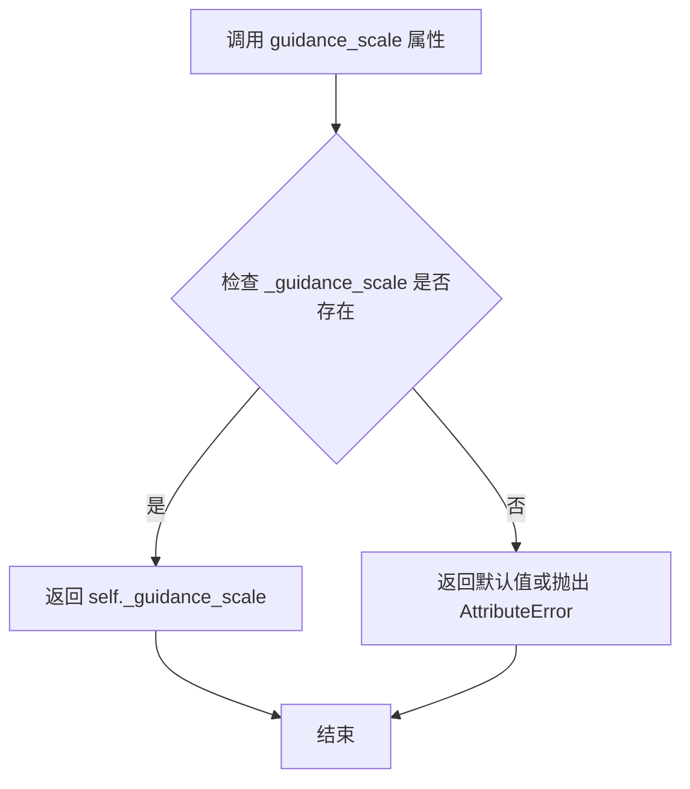

#### 带注释源码

```python
@property
def guidance_scale(self):
    """
    获取分类器自由引导（Classifier-Free Guidance）的缩放因子。

    该属性对应于 Imagen 论文 (https://huggingface.co/papers/2205.11487) 中公式 (2) 的引导权重 w。
    当 guidance_scale = 1 时，表示不使用分类器自由引导。
    在扩散模型推理过程中，该值用于加权条件噪声预测和无条件噪声预测之间的差异，
    从而使生成的图像更符合文本提示的描述。

    返回值:
        float: 引导缩放因子，值越大表示文本提示的影响越强。
              通常设置在 1.0 到 20.0 之间，默认为 5.0。
    """
    return self._guidance_scale
```

#### 相关配置信息

| 字段名 | 类型 | 描述 |
|--------|------|------|
| `_guidance_scale` | `float` | 私有实例变量，在 `__call__` 方法中被设置为 `guidance_scale` 参数的值，用于存储当前的引导缩放因子 |
| `_guidance_rescale` | `float` | 另一个相关的引导重缩放参数，用于根据 [Common Diffusion Noise Schedules and Sample Steps are Flawed](https://huggingface.co/papers/2305.08891) 论文的发现来调整噪声配置 |
| `do_classifier_free_guidance` | `property` | 依赖属性，当 `guidance_scale > 1` 时返回 `True`，表示启用分类器自由引导 |

#### 潜在的技术债务与优化空间

1. **缺少默认值初始化**：`_guidance_scale` 在类初始化时未被显式设置默认值，依赖于 `__call__` 方法的参数传入。如果直接访问属性而不调用 `__call__`，可能会引发 `AttributeError`。

2. **属性验证缺失**：未对 `guidance_scale` 的取值范围进行验证（如必须为正数），可能导致无效值传入后在推理过程中才暴露错误。

3. **文档与实现不一致**：注释中引用了 Imagen 论文，但该管道实际上基于 Flow Match 技术，文档注释未反映这一差异。

#### 设计目标与约束

- **设计目标**：提供一种简洁的接口来获取当前配置的引导强度，便于外部调用者查询管道配置。
- **约束条件**：该属性为只读设计，不允许外部直接修改 `_guidance_scale`，确保引导参数只能通过 `__call__` 方法的统一入口进行设置，保证参数的一致性和可追踪性。


### `EasyAnimateInpaintPipeline.guidance_rescale`

该属性用于返回当前管道的 guidance_rescale 值，该值基于论文 "Common Diffusion Noise Schedules and Sample Steps are Flawed" 的研究结果，用于重新缩放噪声预测配置以改善图像质量并修复过度曝光问题。

参数：无（属性访问器不接受外部参数）

返回值：`float`，返回 guidance_rescale 参数值，用于在去噪过程中重新缩放噪声预测

#### 流程图

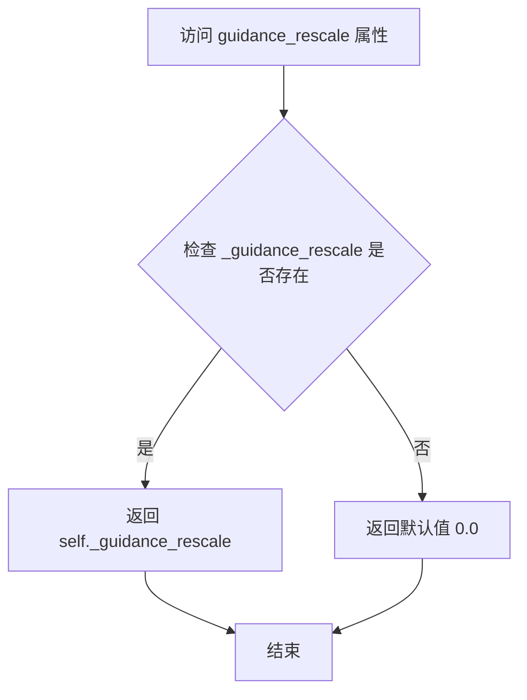

#### 带注释源码

```python
@property
def guidance_rescale(self):
    """
    属性访问器，用于获取 guidance_rescale 值。
    guidance_rescale 是基于 Section 3.4 from Common Diffusion Noise Schedules 
    and Sample Steps are Flawed (https://huggingface.co/papers/2305.08891) 论文的实现。
    
    该值用于重新缩放噪声预测配置，修复过度曝光问题，并通过混合原始结果避免生成"平淡"的图像。
    
    在 __call__ 方法中通过 self._guidance_rescale = guidance_rescale 设置，
    默认为 0.0，表示不进行 rescale 操作。
    """
    return self._guidance_rescale
```

#### 相关上下文

在 `__call__` 方法中，该属性值在以下上下文中使用：

```python
# 在去噪循环中应用 guidance_rescale
if self.do_classifier_free_guidance and guidance_rescale > 0.0:
    # Based on 3.4. in https://huggingface.co/papers/2305.08891
    noise_pred = rescale_noise_cfg(noise_pred, noise_pred_text, guidance_rescale=guidance_rescale)
```

该属性与 `rescale_noise_cfg` 函数配合使用，实现论文中描述的噪声预测重新缩放逻辑。


### `EasyAnimateInpaintPipeline.do_classifier_free_guidance`

该属性用于判断当前管道是否启用无分类器自由引导（Classifier-Free Guidance, CFG）策略。CF

通过比较 `guidance_scale` 与 1 的大小关系来决定是否在扩散模型的推理过程中同时预测条件噪声（文本引导）和非条件噪声（无引导），从而提升生成内容的质量。

参数： 无

返回值：`bool`，当 `guidance_scale > 1` 时返回 `True`，表示启用 CFG；当 `guidance_scale <= 1` 时返回 `False`，表示不启用 CFG。

#### 流程图

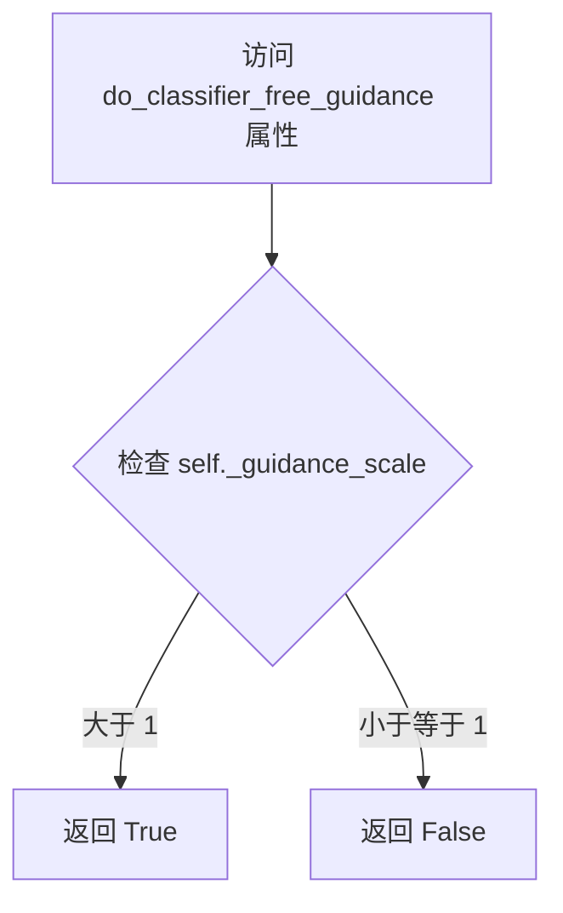

#### 带注释源码

```python
@property
def do_classifier_free_guidance(self):
    """
    判断是否启用无分类器自由引导（Classifier-Free Guidance, CFG）。
    
    该属性是一个只读属性，通过比较内部的 guidance_scale 参数值与 1 的大小关系
    来决定是否在噪声预测阶段同时考虑条件预测和无条件预测。
    
    在扩散模型的推理过程中，CFG 通过以下公式实现：
    noise_pred = noise_pred_uncond + guidance_scale * (noise_pred_text - noise_pred_uncond)
    
    其中：
    - noise_pred_uncond：无条件噪声预测（不使用文本引导）
    - noise_pred_text：条件噪声预测（使用文本引导）
    - guidance_scale：引导强度，通常设置为 5.0 或类似值
    
    当 guidance_scale > 1 时，CFG 被启用，模型会在无条件预测的基础上根据
    文本提示的方向调整噪声预测，从而生成更符合文本描述的内容。
    
    Returns:
        bool: 是否启用 CFG
    """
    return self._guidance_scale > 1
```


### `EasyAnimateInpaintPipeline.num_timesteps`

这是一个属性方法（property），用于返回当前扩散管道中使用的总时间步数。该属性在管道调用（`__call__`）执行期间被设置，记录了扩散过程中使用的时间步总数。

参数： 无

返回值：`int`，返回扩散过程中使用的时间步总数（即 `timesteps` 列表的长度），用于标识整个去噪循环的迭代次数。

#### 流程图

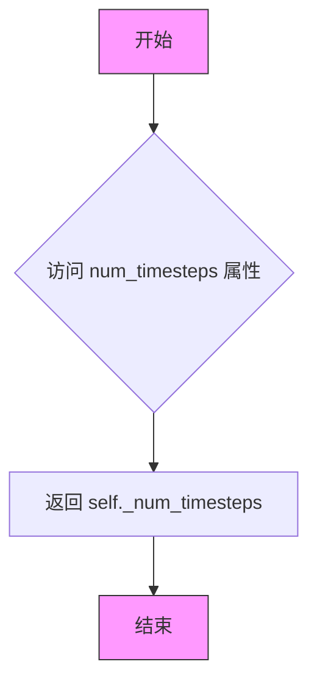

#### 带注释源码

```python
@property
def num_timesteps(self):
    """
    返回当前管道执行过程中设置的时间步总数。
    
    该属性在 __call__ 方法中被赋值:
    self._num_timesteps = len(timesteps)
    
    返回:
        int: 扩散过程中使用的时间步数量
    """
    return self._num_timesteps
```


### `EasyAnimateInpaintPipeline.interrupt`

该属性是EasyAnimateInpaintPipeline类中的一个只读属性，用于获取管道的当前中断状态。它返回一个布尔值，指示去噪过程是否被请求中断。在管道的`__call__`方法执行去噪循环时，会检查此属性以决定是否跳过当前迭代，从而实现动态中断生成过程的功能。

参数：

- （无参数，这是一个属性而非方法）

返回值：`bool`，返回管道的中断标志。当值为`True`时，表示已请求中断去噪过程；当值为`False`时，表示继续正常执行。

#### 流程图

```mermaid
flowchart TD
    A[去噪循环检查interrupt属性] --> B{interrupt == True?}
    B -->|Yes| C[跳过当前迭代 continue]
    B -->|No| D[继续执行当前步骤]
    C --> D
    D --> E[下一时间步]
```

#### 带注释源码

```python
@property
def interrupt(self):
    """
    属性：中断标志
    
    返回管道的中断状态，用于控制去噪循环的执行。
    当设置为True时，__call__方法中的去噪循环会跳过当前迭代。
    
    返回:
        bool: 中断标志。True表示请求中断，False表示继续执行。
    """
    return self._interrupt
```

## 关键组件


### 张量索引与潜在表示管理

在`get_image_to_video_latent`函数中，通过`torch.tile`和切片操作实现视频帧的复制与填充，支持起始帧和结束帧的精确索引。`prepare_latents`方法中通过VAE编码器批量处理潜在变量，使用`torch.cat`进行拼接，实现视频潜在表示的批量生成与管理。

### 反量化与噪声调度

`prepare_latents`方法中集成`FlowMatchEulerDiscreteScheduler`的`scale_noise`功能，实现从潜在空间到噪声的转换。`add_noise_to_reference_video`函数通过动态计算的sigma值（基于-3.0均值和0.5标准差的正态分布）控制噪声强度，支持可选的随机生成器以确保可重复性。

### 图像修复掩码处理

`prepare_mask_latents`方法处理掩码和被掩码图像的潜在表示，使用VAE编码器将掩码转换为潜在空间，并根据`add_noise_in_inpaint_model`配置决定是否添加噪声增强。`resize_mask`函数支持可选的首帧独立处理模式，通过三线性插值调整掩码大小。

### 文本编码与条件引导

`encode_prompt`方法集成了Qwen2-VL和BERT文本编码器，支持chat模板应用和注意力掩码生成。在推理时通过`hidden_states[-2]`获取倒数第二层表示，实现分类器自由引导（CFG）的条件和无条件嵌入生成。

### 视频解码与后处理

`__call__`方法末尾通过`vae.decode`将潜在表示转换为视频，并调用`video_processor.postprocess_video`进行后处理，支持多种输出格式（PIL、numpy数组或潜在表示）。

### 时间步与调度器集成

`retrieve_timesteps`函数封装了调度器的`set_timesteps`调用，支持自定义时间步和sigma值。`get_timesteps`方法根据`strength`参数计算初始时间步，实现图像修复任务的噪声调度控制。

### 批量处理与设备管理

代码通过分批编码（bs=1）处理VAE编码，支持XLA设备加速。`prepare_extra_step_kwargs`方法动态检查调度器签名以适配不同调度器的额外参数要求。


## 问题及建议


### 已知问题

- **批处理效率低下**: 在 `prepare_mask_latents`、`prepare_latents` 等方法中使用 `bs = 1` 的循环进行 VAE 编码，每次仅处理一个样本，无法利用批量处理的优势，导致推理速度较慢。
- **代码重复**: `encode_prompt` 方法中处理 prompt 和 negative_prompt 的逻辑高度重复，可以提取公共方法以减少冗余。
- **魔法数字和硬编码**: 代码中存在多个硬编码值，如 `num_frames=49`、`noise_aug_strength=0.0563`、`mu=1` 等，缺乏配置化和注释说明，影响可维护性。
- **`__call__` 方法过长**: 该方法承担了过多职责（近 300 行），包括输入检查、编码、调度器配置、去噪循环等，违反了单一职责原则，难以测试和维护。
- **缺少输入验证**: `check_inputs` 方法未验证 `num_frames`、`video` 和 `mask_video` 的维度匹配性，以及 `mask_video` 与 `masked_video_latents` 的一致性，可能导致运行时错误。
- **张量设备转换潜在问题**: 在多处进行设备转换（如 `timestep_device` 的条件判断），且部分操作直接使用 `to(device)` 而未指定 dtype，可能导致类型不一致或设备错误。
- **mask 检测逻辑脆弱**: 使用 `(mask_video == 255).all()` 判断全 mask 时，未考虑 dtype 可能不是 uint8 的情况，可能产生误判。

### 优化建议

- **实现真正的批量处理**: 将 VAE 编码循环改为真正的批量处理，例如使用 `torch.no_grad()` 上下文下的一次性编码而非循环单个样本。
- **提取公共方法**: 将 `encode_prompt` 中处理 prompt 和 negative_prompt 的重复逻辑抽取为私有辅助方法。
- **配置化与常量统一管理**: 将魔法数字提取为类属性或配置文件中的常量，并添加详细注释说明其用途和取值依据。
- **重构 `__call__` 方法**: 将其拆分为多个私有方法，如 `_prepare_inputs`、`_encode_prompts`、`_denoise_loop` 等，提高代码可读性和可测试性。
- **增强输入验证**: 在 `check_inputs` 或 `__call__` 开头添加对 `num_frames`、`video` 与 `mask_video` 维度匹配性的检查，以及对 `masked_video_latents` 有效性的验证。
- **统一设备与 dtype 管理**: 建立统一的设备转换规范，确保所有张量操作显式指定目标设备和 dtype，避免隐式转换带来的潜在问题。
- **改进 mask 检测**: 使用更健壮的 mask 类型检查，例如先转换为 uint8 类型后再进行比较判断。

## 其它


### 设计目标与约束

本管道旨在实现基于文本提示的视频修复（Video Inpainting）功能，支持从文本描述生成视频或对现有视频进行局部修复。设计约束包括：输入图像/视频尺寸必须能被16整除；支持的文本编码器为 Qwen2-VL-7B-Instruct 或 BERT；使用 FlowMatchEulerDiscreteScheduler 作为去噪调度器；管道遵循 diffusers 库的 DiffusionPipeline 标准架构。

### 错误处理与异常设计

代码包含多个输入验证机制：图像尺寸验证（height % 16 == 0, width % 16 == 0）；prompt 与 prompt_embeds 互斥检查；负向提示词与负向嵌入的互斥检查；masked image 通道数配置验证；timesteps 和 sigmas 互斥检查。不支持的输入类型（PIL.Image、numpy.ndarray、torch.Tensor 之外）将抛出 ValueError。

### 数据流与状态机

管道执行流程分为以下主要阶段：1) 输入验证与参数规范化；2) 文本编码（encode_prompt）；3) 时间步设置（retrieve_timesteps）；4) 潜在变量准备（prepare_latents）；5) 修复遮罩准备（prepare_mask_latents）；6) 去噪循环（denoising loop）；7) VAE 解码与后处理。每个阶段都有明确的状态转换和中间产物。

### 外部依赖与接口契约

主要依赖包括：transformers 库（Qwen2VLForConditionalGeneration, BertModel, Qwen2Tokenizer, BertTokenizer）；diffusers 库（DiffusionPipeline, FlowMatchEulerDiscreteScheduler）；PyTorch；PIL；numpy。管道输出为 EasyAnimatePipelineOutput 对象，包含 frames 属性。

### 配置与参数说明

关键配置参数包括：guidance_scale（默认5.0，控制分类器自由引导强度）；num_inference_steps（默认50，去噪步数）；strength（默认1.0，影响初始噪声与图像的混合比例）；noise_aug_strength（默认0.0563，噪声增强强度）；guidance_rescale（默认0.0，用于噪声配置重缩放）。

### 性能考虑

管道支持 PyTorch XLA 加速（当 is_torch_xla_available 为真时）；模型支持 CPU offload（通过 model_cpu_offload_seq 指定）；批量处理时采用分块编码策略（bs=1）以控制内存使用；视频编码采用分块处理避免内存溢出。

### 安全性考虑

管道实现了分类器自由引导（Classifier-Free Guidance）机制，通过 negative_prompt 排除不希望的内容；输出内容安全检查由上层调用者负责；无内置 NSFW 过滤功能。

### 测试策略建议

应测试以下场景：不同尺寸输入（16倍数的边界情况）；空 prompt 和负向 prompt；多种输入格式（PIL, numpy, tensor）；guidance_scale 不同值的影响；视频修复模式下不同 mask 类型；内存占用与批量生成。

### 版本兼容性

代码依赖 transformers 库的最新版本特性（如 apply_chat_template）；需要 PyTorch 2.0+ 支持；VAE 配置（latent_channels, scaling_factor）需与模型权重匹配。

### 使用示例补充

管道支持三种输入模式：纯文本生成（无 video 输入）；图像到视频（提供 video 参数）；视频修复（提供 video + mask_video 参数）。输出格式可通过 output_type 参数指定为 "pil"、"latent" 或 "np.array"。

    