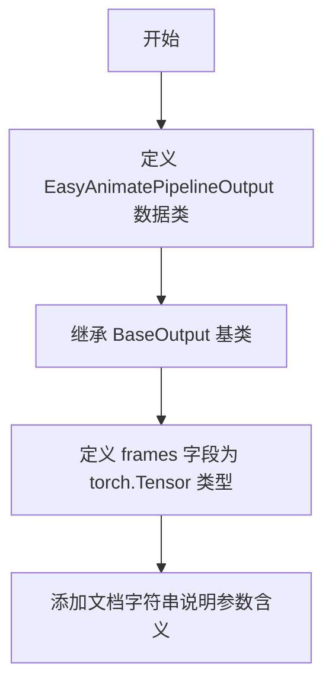

# `diffusers\src\diffusers\pipelines\easyanimate\pipeline_output.py` 详细设计文档

定义了 EasyAnimate 管道的输出类 EasyAnimatePipelineOutput，用于封装视频帧数据，支持 torch.Tensor、np.ndarray 或 PIL.Image 列表格式的输出。

## 整体流程



## 类结构

```
BaseOutput (抽象基类)
└── EasyAnimatePipelineOutput (数据类)
```

## 全局变量及字段


### `EasyAnimatePipelineOutput.frames`
    
视频输出帧数据，可以是torch.Tensor、np.ndarray或list[list[PIL.Image.Image]]格式，形状为(batch_size, num_frames, channels, height, width)

类型：`torch.Tensor`
    
    

## 全局函数及方法


## 关键组件


### EasyAnimatePipelineOutput

数据类，继承自diffusers.utils.BaseOutput，用于封装EasyAnimate视频生成流水线的输出结果，包含视频帧序列数据。

### frames 字段

类型为torch.Tensor的输出帧数据，用于存储批量生成的视频帧，可支持批量大小×帧数×通道数×高度×宽度的五维张量结构。


## 问题及建议


### 已知问题

-   **类型注解与文档不一致**：`frames`字段的类型注解仅为`torch.Tensor`，但文档字符串明确指出它还可以是`np.ndarray`或`list[list[PIL.Image.Image]]`，类型系统无法表达这种多态性。
-   **缺少运行时类型验证**：虽然文档描述了支持的类型，但代码中没有`__post_init__`或验证逻辑来确保传入数据的类型正确。
-   **没有默认值或可选支持**：`frames`字段无默认值，在某些场景下可能导致实例化困难。
-   **文档字符串冗余**：类级别文档与字段文档存在重复，且字段级别的`Args`描述放在类文档中不够清晰。

### 优化建议

-   **使用Union类型注解**：将`frames`的类型改为`Union[torch.Tensor, np.ndarray, list]`以匹配文档描述的实际能力。
-   **添加类型验证逻辑**：实现`__post_init__`方法，验证`frames`的类型、维度或形状是否符合预期，抛出有意义的错误信息。
-   **考虑添加默认值**：如果业务允许，可将`frames`设为可选字段（如`frames: torch.Tensor | None = None`）。
-   **简化文档结构**：将`frames`字段的描述移至字段注解的文档字符串中，保持类级别文档简洁。
-   **考虑使用泛型输出类**：如果EasyAnimate项目中有多种PipelineOutput类，可抽象基类以减少重复代码。


## 其它


### 设计目标与约束

该类作为EasyAnimate视频生成管道的输出数据容器，遵循diffusers库的统一输出格式规范，封装视频帧结果供后续处理或展示使用。设计约束包括：仅支持torch.Tensor类型存储frames，且需继承BaseOutput以保持与diffusers生态的兼容性。

### 外部依赖与接口契约

依赖项包括torch（张量计算）、diffusers.utils.BaseOutput（基类）。接口契约要求：frames字段必须为torch.Tensor类型，类必须继承BaseOutput以实现序列化支持。

### 使用场景与调用关系

该输出类由EasyAnimatePipeline的推理方法实例化，返回给调用者作为最终视频生成结果。调用方获取frames后可进行视频编码保存或进一步后处理。

### 类型兼容性说明

frames参数接受torch.Tensor、np.ndarray或list[list[PIL.Image.Image]]三种形式，但实际存储强制转换为torch.Tensor。调用方需注意类型转换可能带来的内存和性能影响。

### 扩展性考虑

当前仅包含frames字段。如需扩展，可考虑添加元数据字段（如生成参数、耗时信息）或中间结果字段（如latent representations）。但需保持与BaseOutput的兼容性。

### 序列化与反序列化

继承自BaseOutput自带to_dict和from_dict方法，支持字典形式的序列化和反序列化，便于模型检查点保存和加载。

### 版本兼容性

该类依赖于diffusers库的BaseOutput实现，需与diffusers库版本保持兼容。BaseOutput的接口变化可能影响该类的功能。

    