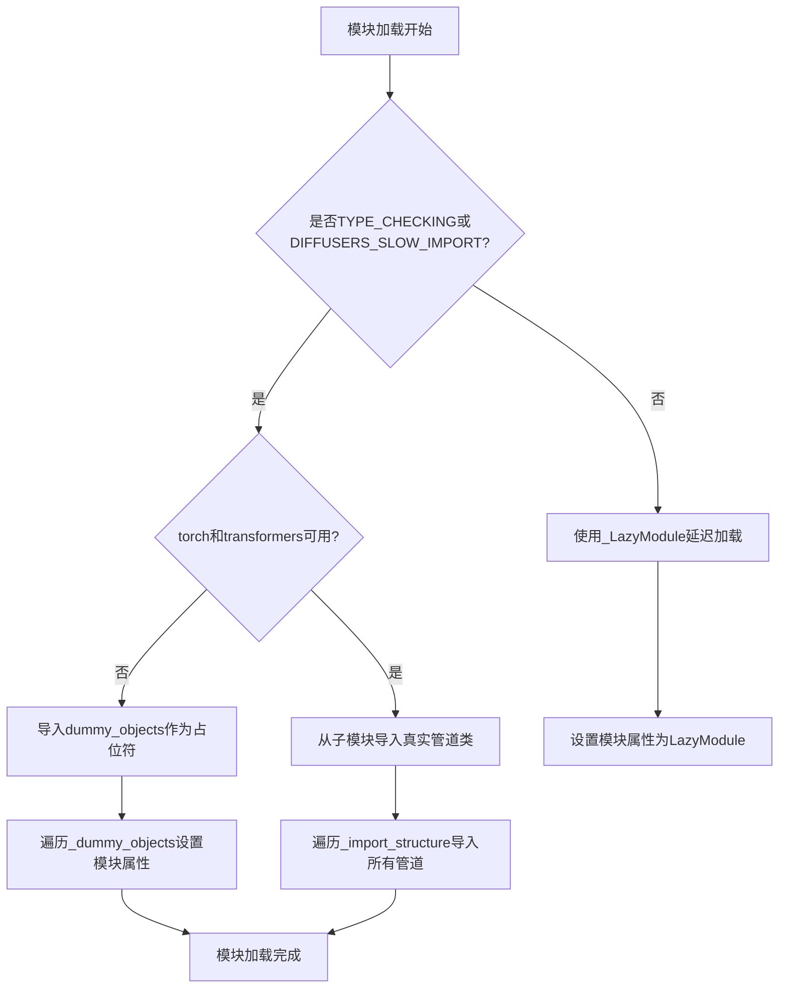
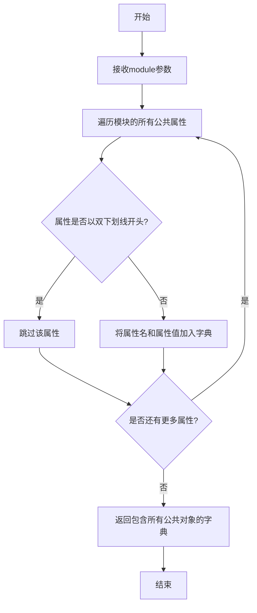
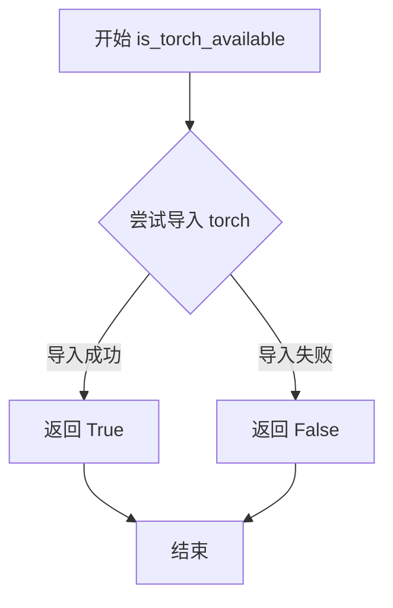
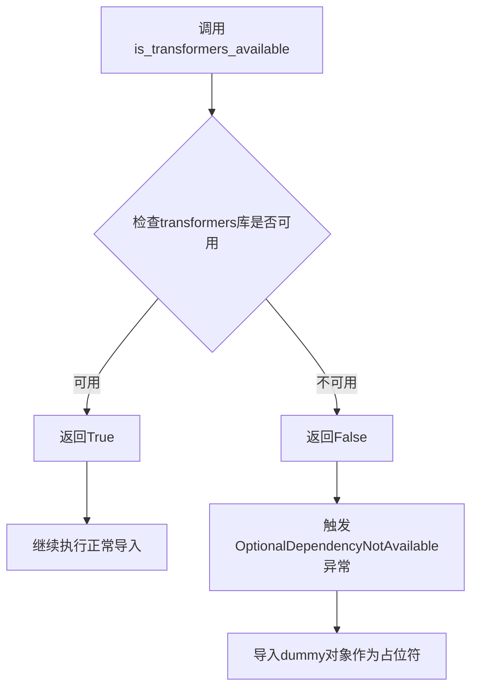
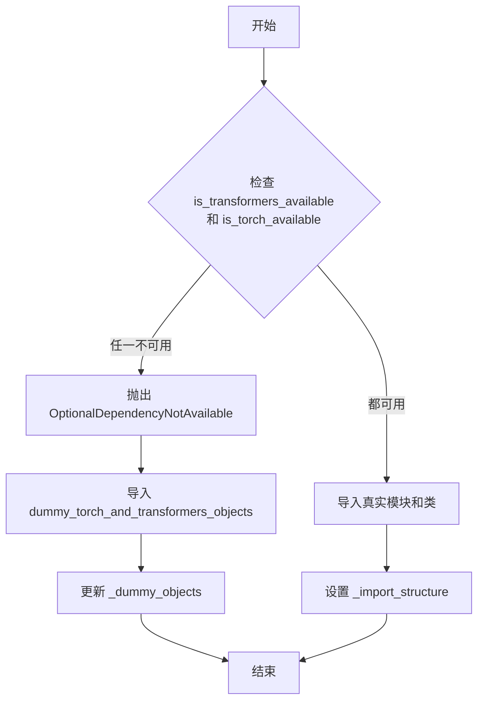
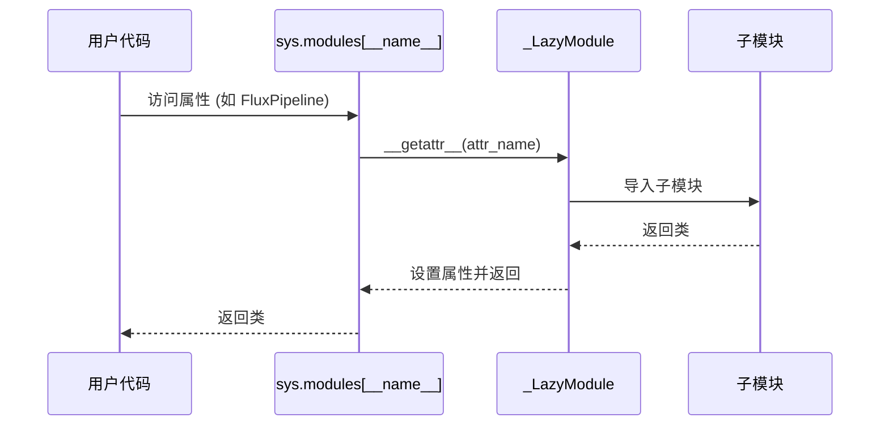
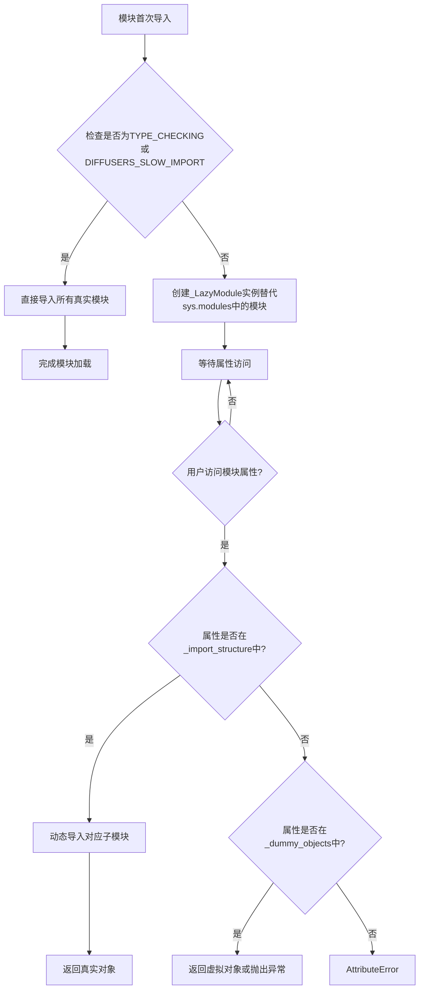

# `diffusers\src\diffusers\pipelines\flux\__init__.py` 详细设计文档

这是Diffusers库中Flux模型管道的延迟加载模块，通过条件导入机制动态注册多种Flux图像生成管道（包括基础管道、控制管道、图像到图像、修复、填充等变体），同时处理torch和transformers的依赖检查，实现模块的懒加载以优化导入性能。

## 整体流程



## 类结构

```
LazyModule (utils._LazyModule)
└── Flux Pipelines (延迟加载的管道类)
    ├── FluxPipeline (基础管道)
    ├── FluxControlPipeline (控制管道)
    ├── FluxControlImg2ImgPipeline (控制图到图)
    ├── FluxControlInpaintPipeline (控制修复)
    ├── FluxControlNetPipeline (ControlNet管道)
    ├── FluxControlNetImg2ImgPipeline
    ├── FluxControlNetInpaintPipeline
    ├── FluxFillPipeline (填充管道)
    ├── FluxImg2ImgPipeline (图到图)
    ├── FluxInpaintPipeline (修复)
    ├── FluxKontextPipeline (Kontext)
    ├── FluxKontextInpaintPipeline
    ├── FluxPriorReduxPipeline (Prior Redux)
    └── ReduxImageEncoder (图像编码器)
```

## 全局变量及字段


### `_dummy_objects`
    
存储虚拟对象，用于依赖不可用时的占位符

类型：`dict`
    


### `_additional_imports`
    
存储额外导入的对象

类型：`dict`
    


### `_import_structure`
    
定义模块导入结构，映射子模块到导出类名列表

类型：`dict`
    


### `DIFFUSERS_SLOW_IMPORT`
    
控制是否使用延迟导入的标志位

类型：`bool`
    


### `TYPE_CHECKING`
    
类型检查模式的标志位

类型：`bool`
    


### `_LazyModule.__name__`
    
模块名称

类型：`str`
    


### `_LazyModule.__file__`
    
模块文件路径

类型：`str`
    


### `_LazyModule._import_structure`
    
模块导入结构字典

类型：`dict`
    


### `_LazyModule.module_spec`
    
模块规格定义

类型：`ModuleSpec`
    
    

## 全局函数及方法


### `get_objects_from_module`

该函数是一个工具函数，用于从给定的Python模块中动态提取所有公共对象（如类、函数、变量等），并返回一个包含对象名称与其对应值的字典。在Diffusers库中，此函数主要用于懒加载机制中，当某些可选依赖（如torch或transformers）不可用时，从dummy对象模块中获取替代对象，以保持导入结构的完整性。

参数：

- `module`：`module`，要从中获取所有对象的Python模块

返回值：`dict`，键为对象名称（字符串），值为模块中对应的对象本身

#### 流程图



#### 带注释源码

```python
# 该函数定义在 ...utils 模块中
# 以下为基于使用方式的推断实现

def get_objects_from_module(module):
    """
    从给定模块获取所有公共对象的字典
    
    参数:
        module: Python模块对象
        
    返回:
        dict: 模块中所有非私有对象的字典，键为对象名，值为对象本身
    """
    objects = {}
    
    # 遍历模块的所有属性
    for attr_name in dir(module):
        # 过滤掉以双下划线开头的私有/特殊属性
        if not attr_name.startswith('__'):
            # 获取属性值
            attr_value = getattr(module, attr_name)
            # 将名称-值对存入字典
            objects[attr_name] = attr_value
    
    return objects


# 在代码中的实际使用方式：
_dummy_objects.update(get_objects_from_module(dummy_torch_and_transformers_objects))

# 说明：
# 1. dummy_torch_and_transformers_objects 是一个dummy模块，当torch和transformers
#    不可用时提供替代的虚对象
# 2. get_objects_from_module 从该模块提取所有dummy对象
# 3. 返回的字典被用于更新 _dummy_objects 全局字典
# 4. 这些dummy对象后续被设置到 LazyModule 中，保证模块导入时不报错
```


### `is_torch_available()`

该函数用于检查当前环境中 PyTorch 库是否可用。它通常通过尝试导入 `torch` 模块来判断，如果导入成功则返回 `True`，否则返回 `False`。

参数：

- 无参数

返回值：`bool`，返回 `True` 表示 PyTorch 可用，返回 `False` 表示 PyTorch 不可用。

#### 流程图



#### 带注释源码

```python
# 注意：此函数在 ...utils 模块中定义，此处仅为推断的实现逻辑
def is_torch_available() -> bool:
    """
    检查 PyTorch 库是否在当前环境中可用。
    
    Returns:
        bool: 如果 PyTorch 可用返回 True，否则返回 False
    """
    try:
        import torch
        return True
    except ImportError:
        return False
```


### `is_transformers_available`

检查transformers库是否可用的函数。该函数用于判断当前环境中是否安装了transformers库，以便在可选依赖不可用时提供备用的dummy对象或抛出OptionalDependencyNotAvailable异常。

参数：

- （无参数）

返回值：`bool`，如果transformers库已安装且可用返回True，否则返回False

#### 流程图



#### 带注释源码

```python
# is_transformers_available 是从 ...utils 导入的函数
# 其实际实现在 diffusers 库的 utils 模块中
# 这是一个延迟导入机制的一部分，用于处理可选依赖

# 在代码中的使用方式：
if not (is_transformers_available() and is_torch_available()):
    # 如果transformers或torch任一不可用
    raise OptionalDependencyNotAvailable()

# 函数签名（基于diffusers库的实际实现推断）
def is_transformers_available() -> bool:
    """
    检查transformers库是否在当前Python环境中可用。
    
    该函数通常通过尝试导入transformers包来检查其是否已安装。
    如果导入成功返回True，否则返回False。
    
    Returns:
        bool: 如果transformers库已安装且可以成功导入返回True，否则返回False
    """
    # 实际实现可能类似于：
    try:
        import transformers
        return True
    except ImportError:
        return False
```


### OptionalDependencyNotAvailable

异常类，用于表示可选依赖（torch 和 transformers）不可用时抛出的异常。该异常在模块导入时用于条件性地加载实际的管道类和模型类，或在依赖不可用时加载虚拟（dummy）对象。

参数：
- 无（异常类的构造函数不接受任何参数）

返回值：不适用（异常类）

#### 流程图



#### 带注释源码

```python
# OptionalDependencyNotAvailable 异常类
# 这是一个从 ...utils 导入的异常类
# 用于在可选依赖不可用时抛出异常，以便程序能够优雅地处理这种情况

# 代码中的使用示例：
try:
    # 检查 transformers 和 torch 是否都可用
    if not (is_transformers_available() and is_torch_available()):
        # 如果任一依赖不可用，抛出异常
        raise OptionalDependencyNotAvailable()
except OptionalDependencyNotAvailable:
    # 捕获异常，导入 dummy 对象作为后备
    from ...utils import dummy_torch_and_transformers_objects  # noqa F403
    # 将 dummy 对象添加到模块的全局字典中
    _dummy_objects.update(get_objects_from_module(dummy_torch_and_transformers_objects))
else:
    # 如果依赖可用，导入真实的类和模块
    _import_structure["modeling_flux"] = ["ReduxImageEncoder"]
    _import_structure["pipeline_flux"] = ["FluxPipeline"]
    # ... 其他真实模块的导入结构
```


### `_LazyModule` (在 `sys.modules[__name__]` 赋值中的使用)

描述：`_LazyModule` 是延迟加载模块的封装类，用于在访问模块属性时动态导入所需的类和模块，从而优化导入时间并减少内存占用。在此代码中，它被用于将当前模块替换为延迟加载模块，并根据 `import_structure` 字典在访问时动态导入 Flux 相关的 Pipeline 类。

参数：

- `name`：`str`，当前模块的名称，即 `__name__`
- `module_file`：`str`，当前模块的文件路径，即 `globals()["__file__"]`
- `import_structure`：`dict`，字典，键是子模块名，值是列表，包含需要延迟加载的类名
- `module_spec`：`ModuleSpec`，模块规格对象，即 `__spec__`

返回值：无返回值，但会设置 `sys.modules[__name__]` 为 `_LazyModule` 实例

#### 流程图



#### 带注释源码

```python
# 如果不是类型检查模式且不是慢导入模式，则使用延迟加载模块
if not (TYPE_CHECKING or DIFFUSERS_SLOW_IMPORT):
    import sys

    # 将当前模块替换为 _LazyModule 实例
    # _LazyModule 会拦截属性访问，动态导入所需的类
    sys.modules[__name__] = _LazyModule(
        __name__,  # 当前模块的名称，例如 'diffusers.pipelines.flux'
        globals()["__file__"],  # 当前模块的文件路径
        _import_structure,  # 定义了延迟加载的结构，例如 {"pipeline_flux": ["FluxPipeline"], ...}
        module_spec=__spec__,  # 模块规格对象，包含了模块的元数据
    )

    # 遍历虚拟对象字典，为每个对象设置属性
    # 这些虚拟对象在 OptionalDependencyNotAvailable 时使用，以避免导入错误
    for name, value in _dummy_objects.items():
        setattr(sys.modules[__name__], name, value)

    # 遍历额外的导入字典，设置额外的属性
    for name, value in _additional_imports.items():
        setattr(sys.modules[__name__], name, value)
```


### `_LazyModule` 类

这是 `diffusers` 库中的延迟加载机制核心类，用于实现 Python 模块的按需加载（Lazy Loading）。它通过拦截属性访问来实现模块内容的动态导入，从而优化大型库的导入时间和内存占用。

参数：

- `__name__`：`str`，当前模块的完整名称
- `__file__`：`str`，模块文件的路径
- `import_structure`：`dict`，模块的导入结构映射
- `module_spec`：`ModuleSpec`，模块的规格说明

返回值：`None`（该类直接修改 `sys.modules` 字典）

#### 流程图



#### 带注释源码

```python
# 延迟加载模块实现
# 文件位置: src/diffusers/utils/import_utils.py

class _LazyModule(sys.modules[__name__].__class__):
    """
    延迟加载模块类，继承自标准模块类型。
    当用户访问模块属性时，才真正导入所需的子模块。
    """
    
    def __init__(self, name, import_structure, module_spec=None):
        """
        初始化延迟加载模块
        
        Args:
            name: 模块名称
            import_structure: 字典，键为子模块路径，值为导出的对象列表
            module_spec: 模块规格对象
        """
        super().__init__(name)
        self._import_structure = import_structure
        self._module_spec = module_spec
        # 标记为延迟加载模块
        self._lazy = True
    
    def __getattr__(self, name):
        """
        核心延迟加载逻辑 - 当访问模块属性时触发
        
        Args:
            name: 访问的属性名
            
        Returns:
            真实模块对象或虚拟对象
            
        Raises:
            AttributeError: 属性不存在且无虚拟对象时抛出
        """
        # 检查属性是否在导入结构中
        if name in self._import_structure:
            # 获取子模块路径
            module_path = self._import_structure[name]
            
            # 处理两种情况：直接是模块路径字符串，或对象列表
            if isinstance(module_path, str):
                # 真正的子模块 - 动态导入
                module = importlib.import_module(module_path)
                # 将导入的模块缓存到当前模块中
                setattr(self, name, module)
                return module
            else:
                # 导出对象列表 - 从子模块导入具体对象
                from . import module_path[0]
                
                # 获取目标对象
                obj = getattr(importlib.import_module(module_path[0]), name)
                # 缓存到当前模块
                setattr(self, name, obj)
                return obj
        
        # 检查是否存在虚拟对象（依赖不可用时的替代品）
        if name in _dummy_objects:
            return _dummy_objects[name]
        
        # 属性不存在
        raise AttributeError(f"module {self.__name__!r} has no attribute {name!r}")
    
    def __dir__(self):
        """
        返回模块的可用属性列表
        
        Returns:
            list: 包含真实属性和虚拟对象名称的列表
        """
        # 合并导入结构中的属性和虚拟对象
        return list(super().__dir__()) + list(self._import_structure.keys())


# 在主模块中的使用方式：
# 当依赖不可用时，创建延迟加载模块
sys.modules[__name__] = _LazyModule(
    __name__,                          # 模块名称
    globals()["__file__"],             # 模块文件路径
    _import_structure,                 # 导入结构字典
    module_spec=__spec__,              # 模块规格
)

# 注入虚拟对象（依赖不可用时的替代品）
for name, value in _dummy_objects.items():
    setattr(sys.modules[__name__], name, value)

# 注入额外的导入
for name, value in _additional_imports.items():
    setattr(sys.modules[__name__], name, value)
```

### 关键组件信息

| 组件名称 | 一句话描述 |
|---------|-----------|
| `_LazyModule` | 延迟加载模块类，拦截属性访问实现按需导入 |
| `_import_structure` | 字典，定义模块的导出结构和子模块映射关系 |
| `_dummy_objects` | 字典，存放依赖不可用时的虚拟对象占位符 |
| `OptionalDependencyNotAvailable` | 异常类，用于标记可选依赖不可用 |
| `get_objects_from_module` | 工具函数，从模块中提取所有对象 |

### 潜在技术债务与优化空间

1. **循环导入风险**：`TYPE_CHECKING` 分支中的直接导入与延迟导入混用，可能导致维护困难
2. **错误信息不够友好**：当属性不存在时，仅抛出标准 `AttributeError`，缺少更详细的错误提示
3. **缺少缓存失效机制**：导入的模块被永久缓存，无法在运行时重新加载
4. **类型提示不完整**：延迟加载导致 IDE 无法正确推断类型，降低开发体验

### 其它设计要点

- **设计目标**：优化大型库的首次导入时间，仅在用户实际使用时才加载对应模块
- **约束条件**：需要同时支持 `TYPE_CHECKING`（类型检查时的完整导入）和运行时延迟加载
- **错误处理**：通过 `_dummy_objects` 提供虚拟对象，防止因依赖缺失导致整个库无法导入
- **数据流**：模块级别 → 子模块级别 → 具体类/函数的三层延迟加载架构

## 关键组件


### 惰性加载模块系统 (Lazy Module Loading System)

通过 `_LazyModule` 实现模块的惰性加载机制，仅在实际需要时导入具体的类和函数，延迟模块初始化时间，优化内存占用。

### 可选依赖管理 (Optional Dependency Management)

通过 `is_torch_available()` 和 `is_transformers_available()` 检查运行时环境中的依赖可用性，使用 `OptionalDependencyNotAvailable` 异常机制处理依赖缺失情况，确保库在无对应依赖时仍可正常导入（使用虚拟对象）。

### 导入结构定义 (Import Structure Definition)

`_import_structure` 字典定义了模块的公共 API 接口，包括 pipeline_output、modeling_flux 和多个 pipeline 模块的导出映射，支持静态类型检查和动态导入。

### 虚拟对象机制 (Dummy Objects Mechanism)

`_dummy_objects` 存储可选依赖不可用时的替代对象，通过 `get_objects_from_module` 从 dummy 模块获取，确保模块在缺少依赖时仍可被 import 而不报错。

### 类型检查支持 (TYPE_CHECKING Support)

在 `TYPE_CHECKING` 或 `DIFFUSERS_SLOW_IMPORT` 模式下直接导入所有模块用于静态类型分析，而非惰性加载，提高 IDE 类型检查性能。

### Flux 管道组件集 (Flux Pipeline Components)

包含 FluxPipeline、FluxControlPipeline、FluxImg2ImgPipeline、FluxInpaintPipeline、FluxFillPipeline、FluxKontextPipeline 等多种图像生成管道，支持控制网、图像到图像、修复、填充、上下文等多种生成模式。

### Redux 图像编码器 (ReduxImageEncoder)

位于 modeling_flux 模块的图像编码器组件，用于处理输入图像的特征提取，为 Flux 管道提供图像表示能力。

### Flux Prior Redux 管道 (FluxPriorReduxPipeline)

专用于先验 Redux 流程的管道组件，处理图像先验信息的生成和整合。


## 问题及建议


### 已知问题

-   **重复的依赖检查逻辑**：try块和TYPE_CHECKING块中都包含完全相同的依赖检查代码（`if not (is_transformers_available() and is_torch_available())`），导致代码冗余，增加维护成本。
-   **未使用的变量**：`_additional_imports`初始化为空字典但在代码中从未被赋值或使用，造成无意义的内存占用。
-   **硬编码的模块路径**：所有pipeline类名和模块路径都以字符串形式硬编码在`_import_structure`字典中，缺乏灵活性和可维护性。
-   **魔法字符串缺乏集中定义**：如"pipeline_output"、"modeling_flux"等字符串散落在代码各处，没有使用常量统一管理。
-   **setattr缺乏错误处理**：在动态设置模块属性时（`setattr(sys.modules[__name__], name, value)`）没有错误处理机制，可能在运行时产生隐藏问题。
-   **缺乏模块级别的文档**：整个文件没有docstring说明其用途和设计意图。
-   **导入结构与实际模块的耦合**：_import_structure中的键与实际文件路径紧耦合，没有抽象层。

### 优化建议

-   **提取公共逻辑**：将依赖检查逻辑封装为单独的辅助函数，在两处调用，避免代码重复。
-   **移除无用变量**：删除未使用的`_additional_imports`或明确其用途。
-   **引入常量管理**：创建专门的常量类或配置文件来集中管理所有模块路径和类名字符串。
-   **添加错误处理**：在setattr操作周围添加try-except块，捕获并记录可能的属性设置错误。
-   **添加文档注释**：为整个模块和关键函数添加docstring，说明其作为lazy loading模块的设计目的。
-   **考虑使用数据驱动**：可以通过扫描模块目录或使用装饰器自动发现和注册pipeline类，减少手动维护_import_structure的工作量。

## 其它


### 设计目标与约束

该模块采用延迟加载（Lazy Loading）模式，主要目标是减少包导入时的初始化时间，仅在真正使用时才加载具体的Pipeline类。设计约束包括：必须同时依赖torch和transformers库，否则抛出OptionalDependencyNotAvailable异常。该模块遵循Diffusers库的模块化架构标准，使用_LazyModule实现惰性导入。

### 错误处理与异常设计

主要异常处理机制为OptionalDependencyNotAvailable，当torch或transformers任一不可用时触发。异常处理流程：首先在模块顶层尝试检查依赖可用性，若不可用则导入dummy对象占位；在TYPE_CHECKING或DIFFUSERS_SLOW_IMPORT模式下，会重新检查依赖并导入真实对象或dummy对象。所有dummy对象通过get_objects_from_module从dummy_torch_and_transformers_objects模块获取。

### 数据流与状态机

模块的数据流主要涉及_import_structure字典的构建和_LazyModule的初始化。状态机包含三个状态：初始状态（定义导入结构）、依赖检查状态（验证torch和transformers可用性）、模块注册状态（将模块注册到sys.modules）。_dummy_objects和_additional_imports字典用于存储需要动态添加到模块的属性。

### 外部依赖与接口契约

外部依赖包括：torch（is_torch_available）、transformers（is_transformers_available）、typing.TYPE_CHECKING、diffusers.utils中的_LazyModule、get_objects_from_module、OptionalDependencyNotAvailable等。接口契约方面，该模块对外暴露多个Pipeline类，包括FluxPipeline、FluxControlPipeline、FluxImg2ImgPipeline、FluxInpaintPipeline、FluxFillPipeline、FluxKontextPipeline、FluxPriorReduxPipeline等及其变体。

### 性能考虑

采用_LazyModule实现延迟加载，避免在import时加载所有模块，减少内存占用和初始化时间。_import_structure字典的结构化设计支持按需导入。dummy对象的设置通过setattr动态添加到sys.modules，在依赖不可用时提供占位符避免导入错误。

### 版本兼容性

该模块需要与Diffusers库的其他部分保持兼容，遵循库的_import_structure规范。TYPE_CHECKING模式支持静态类型检查，DIFFUSERS_SLOW_IMPORT模式支持完整的模块加载场景。

### 模块化设计

_import_structure字典按功能模块组织导入结构，包括pipeline_output、modeling_flux、pipeline_flux及其相关变体。这种设计允许独立加载特定Pipeline而无需导入整个模块，支持细粒度的依赖管理。

    